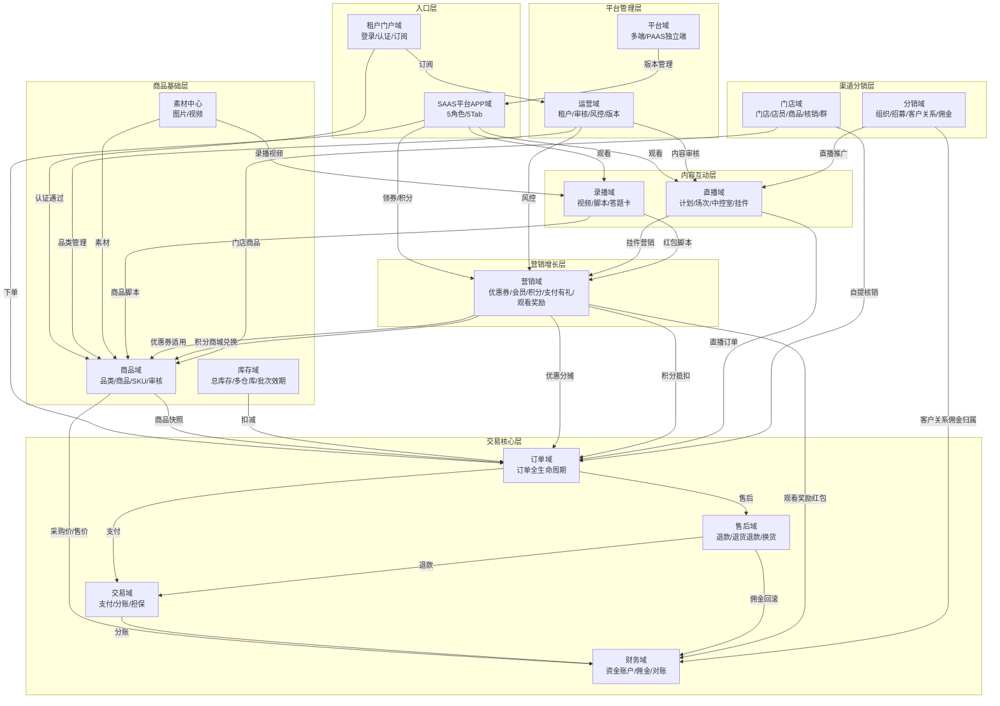

# 九天 SAAS 系统 PRD 总索引

> **文档类型**：PRD 总索引（跨域关系全景图 + 14 域目录）
> **所属系统**：九天 SAAS 电商平台
> **文档版本**：V1.0.9
> **编制日期**：2026-07-16
> **数据来源**：Axure 原型 V1.0.2 ~ V1.0.9、14 个业务域 MD 文档、SAAS系统功能详细清单.xlsx（1124 个功能项）

---

## 1. 系统概述

九天 SAAS 电商平台是面向**多行业（百货零售、大健康、训练营、互联网医院）**的私域电商 SaaS/PAAS 平台。采用 **SAAS（平台共享端）+ PAAS（租户独立端）** 双模式架构，覆盖 14 个业务域、1124 个功能项、4 端（运营后台/租户后台/租户门户/SAAS平台APP）、5 种角色（客户/店员/店长/代理/渠道成员）。

---

## 2. 业务域划分（14 个域）

| 域编号 | 业务域 | PRD文档 | 状态 | 功能项数 |
|--------|--------|---------|------|----------|
| D01 | 商品域 | [01-商品域-PRD-v1.0.3.md](./01-商品域-PRD-v1.0.3.md) | ✅ 已输出 | 128+ |
| D02 | 订单域 | [02-订单域-PRD-v1.0.3.md](./02-订单域-PRD-v1.0.3.md) | ✅ 已输出 | 88 |
| D03 | 交易域 | [03-交易域-PRD-v1.0.3.md](./03-交易域-PRD-v1.0.3.md) | ✅ 已输出 | 6 |
| D04 | 售后域 | [04-售后域-PRD-v1.0.3.md](./04-售后域-PRD-v1.0.3.md) | ✅ 已输出 | - |
| D05 | 库存域 | [08-库存域-PRD-v1.0.0.md](./08-库存域-PRD-v1.0.0.md) | ✅ 已输出 | - |
| D06 | 营销域 | [06-营销域-PRD-v1.0.9.md](./06-营销域-PRD-v1.0.9.md) | ✅ 已输出 | 68+29 |
| D07 | 分销域 | [07-分销域-PRD-v1.0.8.md](./07-分销域-PRD-v1.0.8.md) | ✅ 已输出 | 25+41 |
| D08 | 财务域 | [05-财务域-PRD-v1.0.3.md](./05-财务域-PRD-v1.0.3.md) | ✅ 已输出 | 18+9 |
| D09 | 直播域 | [09-直播域-PRD-v1.0.3.md](./09-直播域-PRD-v1.0.3.md) | ✅ 已输出 | 67+9 |
| D10 | 录播域 | [10-录播域-PRD-v1.0.2.md](./10-录播域-PRD-v1.0.2.md) | ✅ 已输出 | 17 |
| D11 | 门店域 | [11-门店域-PRD-v1.0.3.md](./11-门店域-PRD-v1.0.3.md) | ✅ 已输出 | 30 |
| D12 | 平台域 | [12-平台域-PRD-v1.0.0.md](./12-平台域-PRD-v1.0.0.md) | ✅ 已输出 | - |
| D13 | 运营域 | [13-运营域-PRD-v1.0.0.md](./13-运营域-PRD-v1.0.0.md) | ✅ 已输出 | 133 |
| D14 | 租户门户/APP域 | [14-租户门户域-PRD-v1.0.3.md](./14-租户门户域-PRD-v1.0.3.md) | ✅ 已输出 | 18 |
| — | SAAS平台APP域 | [15-SAAS平台APP域-PRD-v1.0.9.md](./15-SAAS平台APP域-PRD-v1.0.9.md) | ✅ 已输出 | 326 |
| — | 系统级PRD | [SAAS系统-PRD-v1.0.9.md](./SAAS系统-PRD-v1.0.9.md) | ✅ 已输出（整合版） | — |

---

## 3. 跨域关系全景图



---

## 4. 业务域间上下游依赖矩阵

> 矩阵读法：行=上游域（被依赖），列=下游域（依赖方）。✅=存在依赖关系。

| 上游＼下游 | D01商品 | D02订单 | D03交易 | D04售后 | D05库存 | D06营销 | D07分销 | D08财务 | D09直播 | D10录播 | D11门店 | D12平台 | D13运营 | D14租户门户 | APP |
|-----------|---------|---------|---------|---------|---------|---------|---------|---------|---------|---------|---------|---------|---------|-------------|-----|
| **D01商品** | — | ✅ | | | ✅ | ✅ | ✅ | ✅ | ✅ | ✅ | ✅ | | | | |
| **D02订单** | | — | | ✅ | | | | ✅ | ✅ | | | | | | ✅ |
| **D03交易** | | ✅ | — | ✅ | ✅ | | | ✅ | | | | | | | |
| **D04售后** | | ✅ | ✅ | — | | ✅ | | ✅ | | | | | | | |
| **D05库存** | ✅ | ✅ | | | — | | | | ✅ | | ✅ | | | | |
| **D06营销** | ✅ | ✅ | | | | — | | ✅ | ✅ | ✅ | | | | | ✅ |
| **D07分销** | ✅ | | | | | | — | ✅ | ✅ | | ✅ | | | | ✅ |
| **D08财务** | | ✅ | ✅ | ✅ | | ✅ | ✅ | — | | | | | ✅ | | |
| **D09直播** | ✅ | ✅ | | | ✅ | ✅ | | | — | ✅ | | | | | ✅ |
| **D10录播** | ✅ | | | | | ✅ | | | ✅ | — | | | | | ✅ |
| **D11门店** | ✅ | ✅ | | | ✅ | | ✅ | | ✅ | | — | | | | ✅ |
| **D12平台** | | | | | | | | | | | | — | ✅ | | ✅ |
| **D13运营** | ✅ | | | | | | | | ✅ | | | ✅ | — | ✅ | |
| **D14租户门户** | ✅ | | | | | | | | | | | | | — | ✅ |
| **APP** | ✅ | ✅ | ✅ | ✅ | | ✅ | ✅ | ✅ | ✅ | ✅ | ✅ | | | | — |

---

## 5. 核心业务流跨域说明

### 5.1 正向交易流（客户下单全流程）

```
租户门户(认证) → 商品域(商品) → APP(浏览下单) → 营销域(优惠券/积分) → 订单域(创建订单)
→ 交易域(支付) → 库存域(扣减) → 订单域(发货/自提) → 门店域(核销) 
→ 财务域(分账/佣金) → 营销域(积分冻结/解冻) → 分销域(佣金到账)
```

**涉及域**：D14→D01→APP→D06→D02→D03→D05→D11→D08→D06→D07

### 5.2 逆向交易流（售后退款全流程）

```
APP(发起售后) → 售后域(创建售后单) → 订单域(订单挂起) → 售后域(商家处理/买家寄回/签收)
→ 交易域(退款) → 财务域(佣金回滚) → 营销域(积分退还) → 订单域(订单关闭/恢复)
```

**涉及域**：APP→D04→D02→D03→D08→D06→D02

### 5.3 直播带货流

```
直播域(建计划/配直播间) → 商品域(直播商品) → 营销域(卡券/红包/福袋) → APP(观看/互动/下单)
→ 订单域(直播订单) → 交易域(支付) → 直播域(中控室监控) → 财务域(分账)
```

**涉及域**：D09→D01→D06→APP→D02→D03→D08

### 5.4 录播互动流

```
录播域(上传视频/创建录播) → 商品域(商品脚本) → 营销域(红包脚本) → APP(观看/答题/领红包/下单)
→ 订单域(录播订单) → 财务域(红包从虚拟账户扣除)
```

**涉及域**：D10→D01→D06→APP→D02→D08

### 5.5 分销招募流

```
分销域(代理生成邀请码) → APP(被招募人扫码) → 分销域(填写资质/审核) → 门店域(终端门店)
→ 分销域(客户关系永久锁客) → 财务域(佣金归属)
```

**涉及域**：D07→APP→D07→D11→D07→D08

### 5.6 会员成长流

```
营销域(会员等级配置) → APP(客户消费/观看/互动) → 营销域(成长值累计) → 营销域(自动升级)
→ 营销域(发放升级礼包) → APP(享受权益)
```

**涉及域**：D06→APP→D06

---

## 6. 版本演进路线

| 版本 | 日期 | 核心域 | 主要内容 |
|------|------|--------|----------|
| V1.0.0 | 2026-05-15 | 全域 | 整体业务域规划 |
| V1.0.2 | 2026-05-15 | 全域(主体) | 14域主体功能发布 |
| V1.0.3 | 2026-05-25 | 商品/订单/门店/分销/财务 | 审核流程/多角色/报表 |
| V1.0.5 | 2026-06-10 | 营销(会员) | 会员体系上线 |
| V1.0.6 | 2026-06-20 | 营销(优惠券) | 营销中心/支付有礼/直播卡券 |
| V1.0.7 | 2026-06-30 | 财务(分佣) | 分佣政策 |
| V1.0.8 | 2026-07-05 | 营销(观看奖励)/分销(推广) | 观看奖励/现金账户/直播推广 |
| V1.0.9 | 2026-07-12 | 营销(积分) | 积分系统 |

---

## 7. 暂不做/屏蔽功能汇总

详见各域PRD中的Non-Goals章节和 [学习报告-v1.0.9.md](../学习报告/学习报告-v1.0.9.md) 第5节。

---

## 8. PRD编写规范遵循说明

所有PRD文档均遵循 **PRD编写规范 V1.0.0**，包含：

- **编号体系**：FN-{MODULE}-{NNN} / UC / BR / PG / ENT / SC
- **15章强制结构**：版本历史→目录→背景→目标→范围→与既有模块关系→业务目标映射→用户故事→功能需求与用例→业务规则→数据实体→验收标准→指标登记→五类图→外部接口
- **五图铁律**：①业务流程图 ②信息流转图 ③状态机+操作表 ④业务时序图 ⑤三方接口时序图
- **用例模板**：标准表格+前置条件+基本流程(分步标注)+备选流程+数据范围+后置条件+关联UC
- **业务规则独立编号**：BR-{MODULE}-{NNN}
- **验收标准双层**：场景级E2E + 功能级Give-When-Then
- **无实现细节**：无路由路径/组件名/Store名/Mock机制

---

> **文档维护**：本索引随各域PRD输出进度持续更新。已完成域标记✅，待输出域标记⏳。
