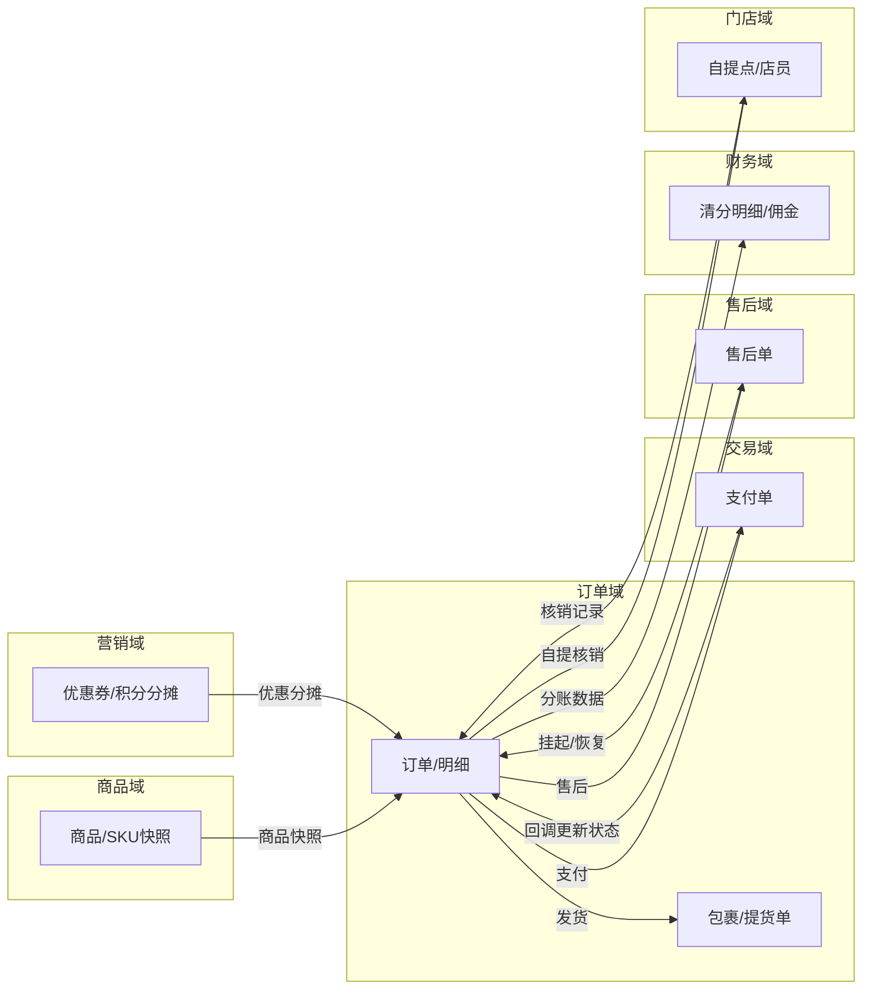
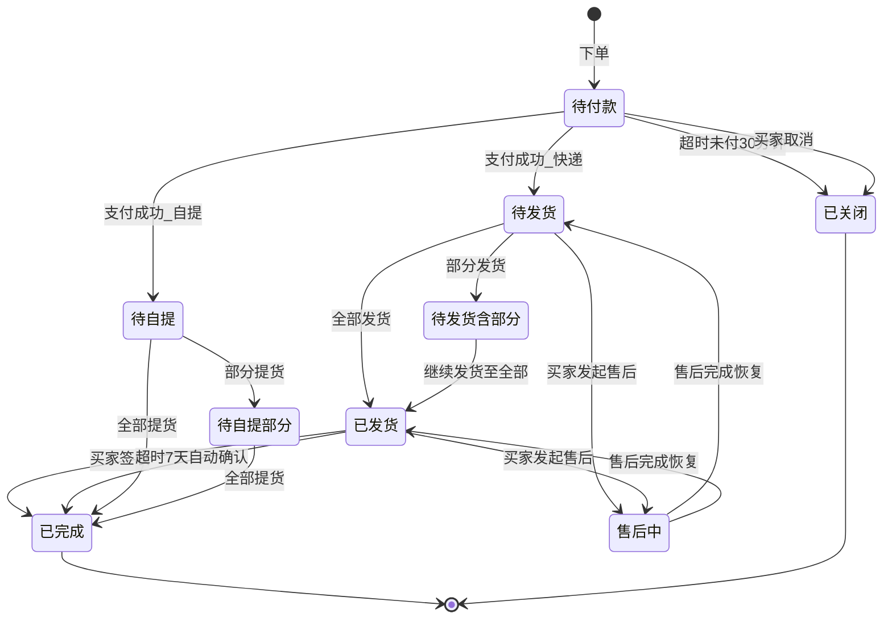
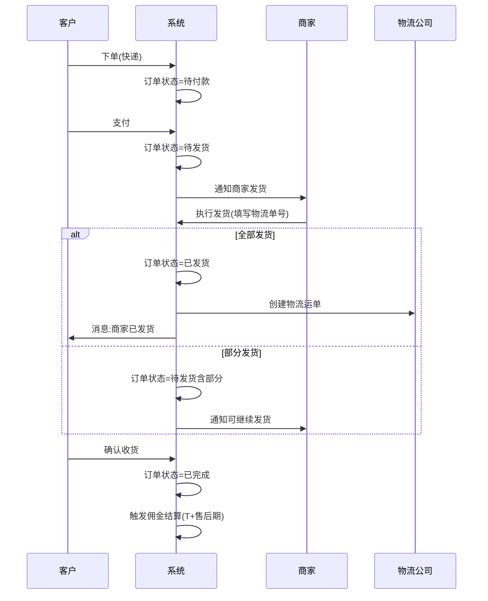
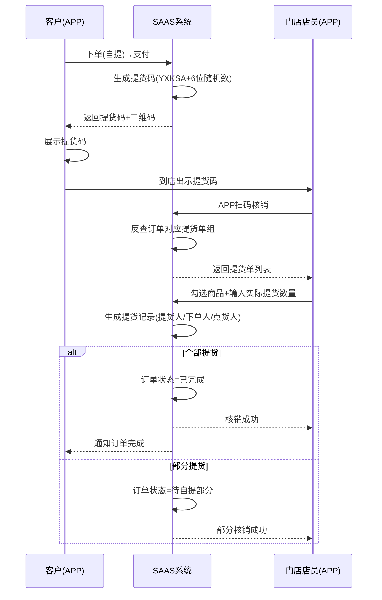

# 订单域 产品需求文档 PRD V1.0.3

> **文档类型**：业务域产品需求文档（PRD）
> **所属系统**：九天 SAAS 电商平台
> **业务域**：订单域（D02）
> **文档版本**：V1.0.3（整合 V1.0.0 ~ V1.0.3 订单域全部迭代）
> **编制日期**：2026-07-16
> **数据来源**：Axure 原型 V1.0.2 ~ V1.0.3、`订单V1.0.0.md`、`SAAS系统功能详细清单.xlsx`
> **追溯链**：UC-ORD → FN-ORD → PG-ORD → MD-ORD → SC-ORD → BG-10 → BO-10

---

## 版本历史

| 版本 | 日期 | 变更内容 |
|------|------|----------|
| V1.0.0 | 2026-05-15 | 整体业务域规划：B2C订单交易流（正向/逆向）、订单整体流程说明、售后单整体流程说明 |
| V1.0.2 | 2026-05-15 | 订单管理列表页、订单详情（全状态覆盖）、操作功能（取消/备注/发货/修改地址/查看物流/查看自提码）、自提订单、直播中控室订单、APP端订单列表、消息中心 |
| V1.0.3 | 2026-05-25 | APP-代理/渠道：门店订单、自提订单、充值订单；数据-报表：销售订单明细报表 |
| V1.0.9 | 2026-07-16 | 按 PRD 规范 V1.0.0 重新编排 |

---

## 目录

1. [背景与问题陈述](#1-背景与问题陈述)
2. [目标与成功度量](#2-目标与成功度量)
3. [范围](#3-范围)
4. [与既有模块关系](#4-与既有模块关系)
5. [业务目标映射](#5-业务目标映射)
6. [用户故事](#6-用户故事)
7. [功能需求列表与用例](#7-功能需求列表与用例)
8. [业务规则](#8-业务规则)
9. [数据实体](#9-数据实体)
10. [验收标准](#10-验收标准)
11. [指标登记](#11-指标登记)
12. [五类图](#12-五类图)
13. [外部接口标注](#13-外部接口标注)
14. [检查清单](#14-检查清单)

---

## 1. 背景与问题陈述

### 1.1 业务背景

订单域是 SAAS 商城系统中承接所有 2C 交易的核心枢纽域。订单作为交易数据的载体，贯穿买家下单、支付、发货/自提、收货确认、售后维权的全生命周期。当前版本订单创建入口仅支持 APP 客户提交，门店暂不支持门店开单。

### 1.2 核心场景

| 场景分类 | 说明 |
|---------|------|
| 正向交易流 | 客户浏览商品→领券/红包→创建订单→付款→商家发货→买家签收→交易完成 |
| 逆向交易流 | 买家发起售后→商家处理→仅退款/退货退款→售后完成→订单关闭 |
| 自提交易流 | 买家下单选择自提→付款→生成提货码→到店扫码提货→核销完成 |
| 直播订单流 | 直播间下单→中控室实时监控订单→备注/管理 |

### 1.3 订单类型

| 订单类型 | 说明 |
|---------|------|
| 销售订单 | 所有 2C 的标准销售订单，涉及实际支付 |
| 积分订单 | 仅使用积分兑换的销售订单 |
| 优惠订单 | 使用优惠券、折扣券、现金红包的销售订单 |
| 抽奖订单 | 抽奖活动的奖品订单，不经过支付环节 |

### 1.4 核心问题

| 问题编号 | 问题 | 严重程度 |
|----------|------|----------|
| ORD-ISSUE-001 | 拆单发货场景未展开页面设计 | 🟡 中 |
| ORD-ISSUE-002 | "售后中"状态定义不明确（标签叠加还是独立状态值） | 🟡 中 |
| ORD-ISSUE-003 | 批量操作项未展示具体弹窗 | 🟢 低 |
| ORD-ISSUE-004 | 订单金额修改变更记录未设计 | 🟢 低 |
| ORD-ISSUE-005 | 收货地址修改是否保留历史版本未明确 | 🟢 低 |
| ORD-ISSUE-006 | 支付超时时间（30分钟）硬编码 | 🟢 低 |
| ORD-ISSUE-007 | 自动确认收货天数（7天）是否可配置未明确 | 🟢 低 |
| ORD-ISSUE-008 | 订单列表缺少批量导出 | 🟢 低 |
| ORD-ISSUE-009 | 抽奖订单详情页和状态流未单独设计 | 🟢 低 |
| ORD-ISSUE-010 | 门店暂不支持门店开单（POS） | 🟡 中 |

---

## 2. 目标与成功度量

| 目标编号 | 目标 | 度量指标 | 目标值 |
|----------|------|----------|--------|
| BO-ORD-01 | 订单查询性能 | P99延迟 | < 200ms |
| BO-ORD-02 | 发货时效 | 商家平均发货时长 | < 24小时 |
| BO-ORD-03 | 自提核销效率 | 核销操作耗时 | < 5秒 |
| BO-ORD-04 | 订单消息触达时效 | 消息延迟 | < 1分钟 |

---

## 3. 范围

### 3.1 In-Scope

- 订单列表/搜索/筛选（多维度筛选+状态Tab切换）
- 订单详情（全状态覆盖：基本信息/进度条/商品明细/金额汇总/营销信息/分摊金额）
- 发货管理（全部发货/部分发货/修改地址/查看物流）
- 自提订单管理（自提码/自提单详情/扫码核销）
- APP端订单（个人中心订单列表+操作）
- 直播中控室订单（实时监控/备注）
- 订单消息推送（订单/物流/售后/营销/系统）
- 销售订单明细报表
- 门店订单/自提订单/充值订单（代理/渠道端）
- 积分订单（积分抵现/积分兑换）

### 3.2 Non-Goals

- 技术实现方案（属POM范围）
- 门店POS开单功能（暂未规划）
- 交易生命周期页面（暂未规划，占位）

---

## 4. 与既有模块关系

### 4.1 上下游依赖矩阵

| 方向 | 关联域 | 依赖关系 | 说明 |
|------|--------|----------|------|
| **上游（被依赖）** | 售后域 | 售后关联订单 | 售后单关联订单，售后挂起订单操作 |
| **上游（被依赖）** | 财务域 | 订单数据作为分账来源 | 清分明细关联订单ID |
| **上游（被依赖）** | 直播域 | 直播订单来源 | 直播中控室监控订单 |
| **上游（被依赖）** | 营销域 | 积分订单管理 | 积分抵现/兑换订单 |
| **下游（依赖）** | 商品域 | 订单关联商品SKU | 订单创建时读取商品SKU信息并生成快照 |
| **下游（依赖）** | 交易域 | 支付单关联订单 | 付款回调更新订单状态 |
| **下游（依赖）** | 营销域 | 优惠券/积分抵现参与下单 | 下单时计算优惠分摊并锁定资源 |
| **下游（依赖）** | 会员域 | 会员身份影响下单 | 下单时读取会员等级和权益 |
| **下游（依赖）** | 门店域 | 自提订单关联门店 | 自提订单关联门店和店员 |
| **下游（依赖）** | 库存域 | 支付确认后扣减库存 | 需统一扣减时序和退款回滚 |

### 4.2 影响域说明

| 变更场景 | 影响域 | 影响说明 |
|----------|--------|----------|
| 订单状态变更 | 售后域、财务域、营销域 | 售后挂起/恢复；佣金结算触发；积分冻结/解冻 |
| 订单金额变更 | 财务域、营销域 | 分账金额变化；优惠分摊重算 |
| 订单关闭 | 售后域、财务域、营销域 | 售后完成联动；佣金回滚；积分退还 |
| 订单发货 | 营销域 | 触发消息推送 |
| 自提核销 | 门店域 | 核销记录生成 |

### 4.3 复用边界

| 共享能力 | 复用方 | 说明 |
|----------|--------|------|
| 订单状态机 | 售后域、财务域 | 售后挂起依赖订单状态；佣金结算依赖订单完成 |
| 订单快照 | 财务域 | 佣金结算读取订单快照中的佣金比例 |
| 订单明细 | 营销域 | 优惠分摊按SKU维度展示 |

---

## 5. 业务目标映射

| BG | BO | FN | PG |
|----|-----|-----|-----|
| BG-10 订单闭环 | BO-ORD-01 查询性能 | FN-ORD-001 | PG-ORD-001 |
| BG-10 | BO-ORD-02 发货时效 | FN-ORD-003 | PG-ORD-003 |
| BG-10 | BO-ORD-03 核销效率 | FN-ORD-004 | PG-ORD-004 |
| BG-10 | BO-ORD-04 消息时效 | FN-ORD-007 | PG-ORD-007 |

---

## 6. 用户故事

| US编号 | 角色 | 用户故事 |
|--------|------|----------|
| US-ORD-001 | 租户管理员 | 作为租户，我希望管理订单列表（搜索/筛选/状态Tab），以便高效处理订单 |
| US-ORD-002 | 租户管理员 | 作为租户，我希望查看订单详情（进度/商品/金额/营销分摊），以便了解订单全貌 |
| US-ORD-003 | 租户管理员 | 作为租户，我希望执行发货操作（全部/部分/修改地址/查看物流），以便履约 |
| US-ORD-004 | 店员/店长 | 作为店员，我希望扫码核销自提订单，以便完成线下履约 |
| US-ORD-005 | 客户 | 作为客户，我希望在APP查看订单列表和状态，以便跟踪订单 |
| US-ORD-006 | 客户 | 作为客户，我希望确认收货和查看物流，以便完成交易 |
| US-ORD-007 | 直播运营 | 作为运营，我希望在中控室实时监控直播订单，以便管理直播交易 |

---

## 7. 功能需求列表与用例

### FN-ORD-001 订单列表/搜索/筛选

| 属性 | 值 |
|------|-----|
| 用例编号 | UC-ORD-001 |
| 名称 | 订单管理列表 |
| 页面 | PG-ORD-001：订单管理.html |
| 参与者 | 租户管理员 |
| 优先级 | P0 |
| 关联BG | BG-10 |
| 自动化类型 | 手动 |

**前置条件**：租户已登录后台。

**基本流程**：
1. [手动] 租户进入"商城 > 订单管理"页面
2. [系统自动] 系统展示订单列表，支持状态Tab切换（待付款/待发货(快递)/待提货(自提)/已发货/已提货/已完成/已关闭/售后中）
3. [手动] 租户使用搜索（订单编号/收件人姓名/手机号后四位/买家昵称/姓名/手机号后四位/商品名称）
4. [手动] 租户使用筛选（订单状态/付款方式/订单类型/配送方式/销售来源/是否标星/是否留言/下单时间排序）
5. [手动] 租户可执行操作：查看详情/备注/发货/修改地址/查看自提码/查看售后

**搜索字段**：

| 搜索字段 | 匹配方式 |
|---------|---------|
| 订单编号 | 精确匹配 |
| 收件人姓名 | 模糊匹配 |
| 收件人手机号后四位 | 精确匹配 |
| 买家昵称 | 模糊匹配 |
| 买家姓名 | 模糊匹配 |
| 买家手机号后四位 | 精确匹配 |
| 商品名称 | 模糊匹配（SPU名称） |

**数据范围**：R（订单列表）/ W（备注）

**关联UC**：UC-ORD-002（订单详情）、UC-ORD-003（发货管理）

---

### FN-ORD-002 订单详情

| 属性 | 值 |
|------|-----|
| 用例编号 | UC-ORD-002 |
| 名称 | 订单详情 |
| 页面 | PG-ORD-002：订单详情_待付款/待发货/待发货_含部分发货/已发货/已完成/已关闭/售后中_被挂起(待发货)/售后中_被挂起(已发货)/待自提/待自提_部分提货 |
| 参与者 | 租户管理员 |
| 优先级 | P0 |
| 关联BG | BG-10 |
| 自动化类型 | 手动 |

**前置条件**：订单已创建。

**信息区块**：订单编号/状态/状态描述/进度条（下单→付款→发货→签收→完成，含时间戳）/自动倒计时/买家备注/卖家备注/收货人信息/配送信息/付款信息/买家信息/商品明细表格/金额汇总/营销信息/分摊金额表/优惠后金额。

**操作按钮（按状态动态显示）**：

| 订单状态 | 可用操作 |
|---------|---------|
| 待付款 | 备注、取消订单、修改地址 |
| 待发货（无发货记录） | 备注、发货、修改地址 |
| 待发货（含部分发货） | 备注、发货、修改地址 |
| 已发货（全部发货） | 备注、查看物流 |
| 待自提 | 备注、查看自提码、修改地址（自提） |
| 已完成 | 备注、查看物流/查看自提单 |
| 已关闭 | 备注（只读信息） |
| 售后中（待发货） | 备注（挂起状态，不允许操作发货） |
| 售后中（已发货） | 备注（挂起状态，信息展示） |

**金额计算规则**：

| 金额项 | 计算说明 |
|--------|---------|
| 商品总金额 | 商品原价 × 数量，所有商品之和 |
| 邮费 | 快递方式：读取邮费模板或手动输入；免邮/代收为0.00 |
| 优惠金额 | 满减+折扣+现金红包+积分兑换等所有优惠金额总和 |
| 应收金额（应付金额） | 商品总金额 + 邮费 - 优惠金额 |
| 实收金额 | 订单关联支付单的最终实际付款金额 |

**数据范围**：R（订单详情）/ W（备注/取消/发货/修改地址）

---

### FN-ORD-003 发货管理

| 属性 | 值 |
|------|-----|
| 用例编号 | UC-ORD-003 |
| 名称 | 发货管理 |
| 页面 | PG-ORD-003：发货.html、修改地址(快递).html、修改地址(自提).html、查看物流.html |
| 参与者 | 租户管理员 |
| 优先级 | P0 |
| 关联BG | BG-10 |
| 自动化类型 | 手动 |

**前置条件**：订单处于待发货状态。

**基本流程**：
1. [手动] 租户在订单详情点击"发货"按钮
2. [手动] 选择发货商品SKU及数量（支持部分发货）
3. [手动] 确认收货人信息（从订单地址读取，支持修改，前置：订单状态≤待发货）
4. [手动] 填写物流单号（快递方式）
5. [系统自动] 发货记录生成，订单状态更新

**修改地址**：适用条件：订单状态≤待发货。支持快递/自提切换。

**数据范围**：W（发货/修改地址）

**后置条件**：订单状态变更（待发货→已发货 或 待发货→待发货含部分发货）。

---

### FN-ORD-004 自提订单管理

| 属性 | 值 |
|------|-----|
| 用例编号 | UC-ORD-004 |
| 名称 | 自提订单管理 |
| 页面 | PG-ORD-004：订单详情_待自提.html、查看自提码.html、自提单详情(未提货).html、自提单详情(已提货).html、扫码核销(APP) |
| 参与者 | 租户管理员/店员/店长 |
| 优先级 | P0 |
| 关联BG | BG-10 |
| 自动化类型 | 手动+事件驱动 |

**前置条件**：订单配送方式==自提，已付款。

**基本流程**：
1. [系统自动] 用户提交订单时发货方式==自提，自提订单无需商家通过物流发货，无包裹数据
2. [系统自动] 订单明细生成对应的提货单，每个SKU生成一份
3. [手动] 卖家（店员/店长）扫码买家任一提货码
4. [系统自动] 反查订单对应的一组提货码商品
5. [手动] 卖家通过APP勾选商品、输入应提货数量、实际提货数量
6. [系统自动] 支持部分提货，全部提货后订单方可变为已完成，否则处于待提货
7. [系统自动] 提货记录记录提货人、下单人、点货人（门店店员扫码人）

**提货码格式**：YXKSA + 6位随机数（如YXKSA786234）

**数据范围**：R（提货单/提货码）/ W（核销记录）

**后置条件**：全部提货→订单已完成；部分提货→待自提(部分提货)。

---

### FN-ORD-005 APP端订单

| 属性 | 值 |
|------|-----|
| 用例编号 | UC-ORD-005 |
| 名称 | APP端订单管理 |
| 页面 | PG-ORD-005：个人中心-订单列表（全部/待付款/待发货/已发货/待自提/已完成/已取消/售后中） |
| 参与者 | 客户 |
| 优先级 | P0 |
| 关联BG | BG-10 |
| 自动化类型 | 手动 |

**APP操作功能**：

| 状态 | APP端可用操作 |
|------|-------------|
| 待付款 | 取消订单、立即支付 |
| 待发货 | 查看详情、申请退款 |
| 已发货 | 确认收货、查看物流、申请售后 |
| 待自提 | 查看自提码、申请售后 |
| 已完成 | 评价订单、删除订单、申请售后(售后期内) |
| 已取消 | 删除订单 |

---

### FN-ORD-006 直播中控室订单

| 属性 | 值 |
|------|-----|
| 用例编号 | UC-ORD-006 |
| 名称 | 直播中控室订单 |
| 页面 | PG-ORD-006：直播中控室_订单.html |
| 参与者 | 直播运营 |
| 优先级 | P1 |
| 关联BG | BG-10 |
| 自动化类型 | 系统自动+手动 |

**功能**：直播过程中实时管理订单（订单编号/支付状态/买家信息/应付金额/优惠金额/商品规格数量），支持卖家备注、踢人。

---

### FN-ORD-007 订单消息推送

| 属性 | 值 |
|------|-----|
| 用例编号 | UC-ORD-007 |
| 名称 | 订单消息推送 |
| 页面 | PG-ORD-007：消息-订单.html、消息-物流.html、消息-售后.html |
| 参与者 | 系统 |
| 优先级 | P0 |
| 关联BG | BG-10 |
| 自动化类型 | 事件驱动 |

**消息类型与触发机制**：

| 消息类型 | 消息体示例 | 触发机制 | 跳转页面 |
|---------|-----------|---------|---------|
| 订单 | 您有一笔待付款订单，请尽快付款 | 下单触发 | 订单详情页 |
| 订单 | 商家已发货，请注意查收！ | 订单商家全部发货触发 | 订单详情页 |
| 订单 | 售后申请，商家已拒绝，请尽快处理！ | — | 售后关联订单详情页 |
| 物流 | 商家已退回退货，请尽快处理！ | 售后单商家退回发货触发 | 售后关联订单详情页 |
| 物流 | 商家已签收退货，请耐心等待商家退款！ | 售后单商家签收触发 | 售后关联订单详情页 |
| 售后 | 售后寄回即将超时，请尽快寄回！ | 操作时间+配置时间-当前时间==30分钟触发 | 售后关联订单详情页 |

---

### FN-ORD-008 销售订单明细报表

| 属性 | 值 |
|------|-----|
| 用例编号 | UC-ORD-008 |
| 名称 | 销售订单明细报表 |
| 页面 | PG-ORD-008：销售订单明细报表.html |
| 参与者 | 租户管理员 |
| 优先级 | P1 |
| 关联BG | BG-10 |
| 自动化类型 | 系统自动 |

**筛选维度**：交易类型（全部/商品下单/商品退款/商品自提/商品退货/购买权益卡/购买优惠券）、销售渠道（全部/门店/直播/录播）、销售单元、时间（自然日/自然周/自然月/近7天/近30天/自定义）。

**报表列**：订单编号|退换货单号、发生时间、成交数量、成交金额、售价金额、优惠金额、收款明细、优惠明细、销售渠道、销售单元、店员、外部订单编号。

---

### FN-ORD-009~011 其他订单类型

| FN编号 | 功能名称 | 说明 |
|--------|----------|------|
| FN-ORD-009 | 门店订单（店员/店长端） | 门店维度订单+自提订单核销 |
| FN-ORD-010 | 积分订单 | 积分抵现订单/积分兑换订单列表和详情 |
| FN-ORD-011 | 充值订单 | 代理/渠道成员扫码充值（未充值/已充值） |

---

## 8. 业务规则

### BR-ORD-001 订单状态流转规则（快递）
- 待付款→付款成功→待发货→全部发货→已发货→买家签收/超时自动确认→已完成

### BR-ORD-002 订单状态流转规则（自提）
- 待付款→付款成功→待自提→全部提货→已完成

### BR-ORD-003 部分发货规则
- 待发货→部分发货→待发货(含部分发货)→继续发货至全部→已发货

### BR-ORD-004 订单关闭规则
- 待付款+超时未付(30分钟)→已关闭
- 待付款+买家取消→已关闭
- 全部商品售后完成（仅退款全额/退货退款全部完成）→已关闭

### BR-ORD-005 售后挂起规则
- 触发条件：订单存在售后单且售后单未完成/未关闭
- 行为：订单操作被挂起（不可发货/签收等），售后完成/关闭后恢复原状态

### BR-ORD-006 自动确认收货规则
- 触发条件：已发货状态，发货后7天未确认
- 行为：系统自动确认收货，订单状态变为已完成

### BR-ORD-007 自提订单提货单生成规则
- 触发条件：订单发货方式==自提
- 行为：订单明细生成对应的提货单，每个SKU生成一份；提货码格式YXKSA+6位随机数

### BR-ORD-008 自提全部提货判定规则
- 触发条件：所有提货单状态==已提货
- 行为：订单状态变为已完成；否则处于待提货

### BR-ORD-009 修改地址前置条件
- 触发条件：订单状态≤待发货（含待发货状态）
- 行为：允许修改收货地址，支持快递/自提切换

### BR-ORD-010 优惠分摊规则
- 采用「盈余追加法」做SKU维度和单个SKU内部分摊

---

## 9. 数据实体

### ENT-ORD-001 订单(Order)

| 字段 | 类型 | 说明 |
|------|------|------|
| order_id | String | 订单编号（主键） |
| order_type | Enum | 销售订单/积分订单/优惠订单/抽奖订单 |
| order_status | Enum | 待付款/待发货/待自提/已发货/已提货/已完成/已关闭 |
| delivery_method | Enum | 快递/自提 |
| order_source | Enum | 门店/直播间 |
| buyer_id | String | 买家ID |
| buyer_name | String | 买家姓名 |
| buyer_nickname | String | 买家昵称 |
| buyer_phone | String | 买家手机号 |
| buyer_member_level | String | 会员等级 |
| buyer_note | String | 买家备注 |
| seller_note | String | 卖家备注 |
| receiver_name | String | 收货人姓名 |
| receiver_phone | String | 收货人电话 |
| receiver_address | String | 收货地址 |
| pickup_point_id | String | 自提点ID |
| total_goods_amount | Decimal | 商品总金额 |
| postage | Decimal | 邮费 |
| discount_amount | Decimal | 优惠总金额 |
| full_reduction_amount | Decimal | 满减优惠总金额 |
| discount_coupon_amount | Decimal | 折扣券优惠总金额 |
| red_envelope_amount | Decimal | 红包优惠总金额 |
| points_deduction_amount | Decimal | 积分抵现金额 |
| order_amount | Decimal | 订单应收总价 |
| paid_amount | Decimal | 实付金额 |
| is_free_shipping | Boolean | 是否包邮 |
| is_starred | Boolean | 商家标星 |
| after_sale_status | String | 售后状态组 |
| payment_order_id | String | 关联支付单号 |
| created_time | Datetime | 下单时间 |
| paid_time | Datetime | 付款时间 |
| shipped_time | Datetime | 发货时间 |
| signed_time | Datetime | 签收时间 |
| completed_time | Datetime | 完成时间 |
| closed_time | Datetime | 关闭时间 |
| close_reason | Enum | 关闭原因 |
| auto_confirm_deadline | Datetime | 自动确认收货截止时间 |
| payment_deadline | Datetime | 付款截止时间 |

### ENT-ORD-002 订单明细(OrderItem)

| 字段 | 类型 | 说明 |
|------|------|------|
| item_id | String | 明细ID |
| order_id | String | 订单编号 |
| spu_id | String | 商品SPU ID |
| spu_name | String | 商品名称 |
| sku_id | String | SKU ID |
| sku_code | String | SKU编码 |
| sku_spec | String | SKU规格名称 |
| original_price | Decimal | 原单价 |
| quantity | Integer | 数量 |
| sub_total | Decimal | 小计 |
| full_reduction_share | Decimal | 满减分摊金额 |
| discount_coupon_share | Decimal | 折扣券分摊金额 |
| red_envelope_share | Decimal | 红包分摊金额 |
| actual_price | Decimal | 优惠后金额 |
| delivery_status | Enum | 发货状态 |
| shipped_quantity | Integer | 已发货数量 |
| pickup_status | Enum | 自提状态 |
| picked_quantity | Integer | 已提货数量 |
| after_sale_status | Enum | 售后状态 |

### ENT-ORD-003 发货/包裹记录(OrderPackage)

| 字段 | 类型 | 说明 |
|------|------|------|
| package_id | String | 包裹ID |
| order_id | String | 订单编号 |
| express_company | String | 快递公司 |
| tracking_number | String | 运单号 |
| shipping_time | Datetime | 发货时间 |
| receiver_name | String | 收件人 |
| items | Array | 包裹内商品明细及数量 |

### ENT-ORD-004 提货单(PickupOrder)

| 字段 | 类型 | 说明 |
|------|------|------|
| pickup_order_id | String | 自提单编号 |
| order_id | String | 订单编号 |
| sku_id | String | SKU ID |
| quantity | Integer | 应提货数量 |
| actual_quantity | Integer | 实际提货数量 |
| pickup_code | String | 提货码（YXKSA+6位随机数） |
| pickup_status | Enum | 未提货/已提货 |
| pickup_point_name | String | 自提点名称 |

### ENT-ORD-005 提货记录(PickupRecord)

| 字段 | 类型 | 说明 |
|------|------|------|
| record_id | String | 提货记录ID |
| pickup_order_id | String | 自提单编号 |
| actual_quantity | Integer | 实际提货数量 |
| customer_name | String | 提货人 |
| orderer_name | String | 下单人 |
| checker_name | String | 点货人（门店店员扫码人） |
| verify_method | Enum | 核销方式：APP扫码 |
| verify_time | Datetime | 核销时间 |
| is_same_as_orderer | Boolean | 与下单人是否一致 |

### 实体关系

```
订单(Order) 1 ── N 订单明细(OrderItem)
订单(Order) 1 ── N 包裹(OrderPackage)      -- 仅快递配送
订单(Order) 1 ── N 提货单(PickupOrder)      -- 仅自提配送
订单(Order) 1 ── N 售后单(AfterSaleOrder)
订单(Order) 1 ── N 支付单(PaymentOrder)
提货单(PickupOrder) 1 ── N 提货记录(PickupRecord)
```

---

## 10. 验收标准

### 10.1 场景级 E2E

| SC编号 | 场景 | 步骤 | 预期结果 |
|--------|------|------|----------|
| SC-ORD-001 | 快递订单全流程 | 下单→支付→发货→签收→完成 | 状态正确流转，金额计算正确 |
| SC-ORD-002 | 自提订单全流程 | 下单选自提→支付→生成提货码→到店扫码核销→全部提货→完成 | 提货码生成，核销后状态更新 |
| SC-ORD-003 | 部分发货 | 待发货→部分发货→继续发货→全部发货→已发货 | 支持多次发货，状态正确 |
| SC-ORD-004 | 售后挂起 | 待发货→发起售后→售后中(挂起)→售后完成→恢复待发货 | 售后期间不可发货，恢复后可发货 |
| SC-ORD-005 | 订单超时关闭 | 待付款→30分钟未付→已关闭 | 自动关闭，释放预占库存 |
| SC-ORD-006 | 自动确认收货 | 已发货→7天未确认→已完成 | 自动确认，触发佣金结算 |

### 10.2 功能级验收

| FN编号 | Given | When | Then |
|--------|-------|------|------|
| FN-ORD-001 | 订单列表有数据 | 按订单状态筛选 | 正确返回对应状态订单 |
| FN-ORD-003 | 订单待发货 | 部分发货 | 状态保持待发货(含部分)，可继续发货 |
| FN-ORD-004 | 自提订单已付款 | 店员扫码核销全部商品 | 订单状态变为已完成 |
| FN-ORD-004 | 自提订单部分提货 | 核销部分商品 | 状态变为待自提(部分提货) |
| FN-ORD-005 | APP订单已发货 | 客户确认收货 | 订单状态变为已完成 |
| FN-ORD-007 | 订单全部发货 | 系统触发消息 | 客户收到"商家已发货"消息 |

---

## 11. 指标登记

| 指标编号 | 指标名称 | 说明 |
|----------|----------|------|
| MET-ORD-001 | 订单查询P99 | 订单查询接口P99延迟 |
| MET-ORD-002 | 发货时效 | 商家平均发货时长 |
| MET-ORD-003 | 自提核销耗时 | 核销操作耗时 |
| MET-ORD-004 | 订单消息延迟 | 消息从触发到触达的延迟 |
| MET-ORD-005 | 自动确认收货率 | 超时自动确认的订单占比 |

---

## 12. 五类图

### 12.1 业务流程图 — 订单全生命周期

```mermaid
flowchart TD
    A[客户下单] --> B[订单状态:待付款]
    B --> C{支付成功?}
    C -->|否| D{超时30分钟?}
    D -->|是| E[订单状态:已关闭]
    D -->|否| B
    C -->|是| F{配送方式?}
    F -->|快递| G[订单状态:待发货]
    F -->|自提| H[订单状态:待自提]
    G --> I{发货方式?}
    I -->|全部发货| J[订单状态:已发货]
    I -->|部分发货| K[订单状态:待发货含部分]
    K --> G
    J --> L{签收方式?}
    L -->|买家确认| M[订单状态:已完成]
    L -->|超时7天自动| M
    H --> N{提货方式?}
    N -->|全部提货| M
    N -->|部分提货| O[订单状态:待自提部分]
    O --> H
    M --> P[触发佣金结算T+售后期]
    P --> Q[交易已结算]
    G --> R{发起售后?}
    J --> R
    R -->|是| S[订单状态:售后中挂起]
    S -->|售后完成| T{全部售后完成?}
    T -->|是| E
    T -->|否| G
```



### 12.2 信息流转图 — 订单域跨模块信息流



### 12.3 状态机 — 订单状态机



**状态过渡操作表**：

| 当前状态 | 触发操作 | 目标状态 | 操作者 | 前置约束 | 后置动作 |
|----------|----------|----------|--------|----------|----------|
| 待付款 | 付款成功 | 待发货/待自提 | 系统/支付回调 | 支付金额=应付 | 扣减库存，生成提货码(自提) |
| 待付款 | 超时未付 | 已关闭 | 系统 | 30分钟 | 释放预占库存 |
| 待发货 | 全部发货 | 已发货 | 商家 | 所有商品已发货 | 发送物流消息 |
| 待发货 | 部分发货 | 待发货含部分 | 商家 | 部分商品已发货 | — |
| 已发货 | 买家确认收货 | 已完成 | 买家 | — | 触发佣金结算倒计时 |
| 已发货 | 超时自动确认 | 已完成 | 系统 | 发货后7天 | 同上 |
| 待自提 | 全部提货 | 已完成 | 店员扫码 | 所有提货单已核销 | — |
| 任意 | 买家发起售后 | 售后中 | 买家 | 订单状态≥待发货 | 挂起订单操作 |
| 售后中 | 售后完成/关闭 | 恢复原状态 | 系统 | 所有售后单完成/关闭 | 恢复订单操作权限 |

### 12.4 业务时序图 — 快递订单发货流程



### 12.5 三方接口时序图 — 自提核销接口



---

## 13. 外部接口标注

| 接口编号 | 接口名称 | 方向 | 对端系统 | 说明 |
|----------|----------|------|----------|------|
| API-ORD-001 | 物流查询 | 单向(入) | 物流公司(顺丰/中通等) | 运单轨迹查询 |
| API-ORD-002 | 支付回调 | 单向(入) | 支付网关(微信/支付宝) | 付款成功回调更新订单状态 |

---

## 14. 检查清单

| # | 检查项 | 状态 |
|---|--------|------|
| 1 | 编号体系 FN-ORD/UC-ORD/BR-ORD/ENT-ORD/SC-ORD 完整 | ✅ |
| 2 | 15 章强制结构 | ✅ |
| 3 | 版本历史记录 | ✅ |
| 4 | 目录 | ✅ |
| 5 | 背景与问题陈述 | ✅ |
| 6 | 目标与成功度量 | ✅ |
| 7 | 范围 | ✅ |
| 8 | 与既有模块关系（上下游+影响域+复用边界） | ✅ |
| 9 | 业务目标映射 | ✅ |
| 10 | 用户故事 | ✅ |
| 11 | 功能需求列表与用例 | ✅ |
| 12 | 业务规则 BR-ORD | ✅ |
| 13 | 数据实体 ENT-ORD | ✅ |
| 14 | 验收标准双层 | ✅ |
| 15 | 指标登记 | ✅ |
| 16 | 五类图 | ✅ |
| 17 | 状态机+操作表 | ✅ |
| 18 | 外部接口标注 | ✅ |
| 19 | 无实现细节 | ✅ |
| 20 | 检查清单自检 | ✅ |

---

> **关联文档**：源MD `订单V1.0.0.md` | 上游：商品域/营销域/会员域 | 下游：交易域/售后域/财务域/门店域 | 总索引 `SAAS-PRD-总索引.md`
