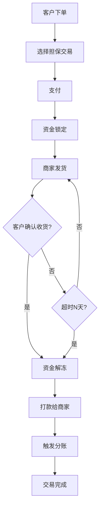
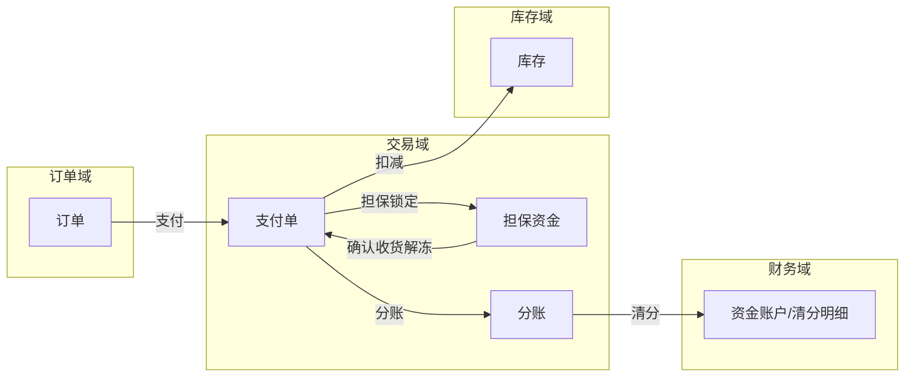
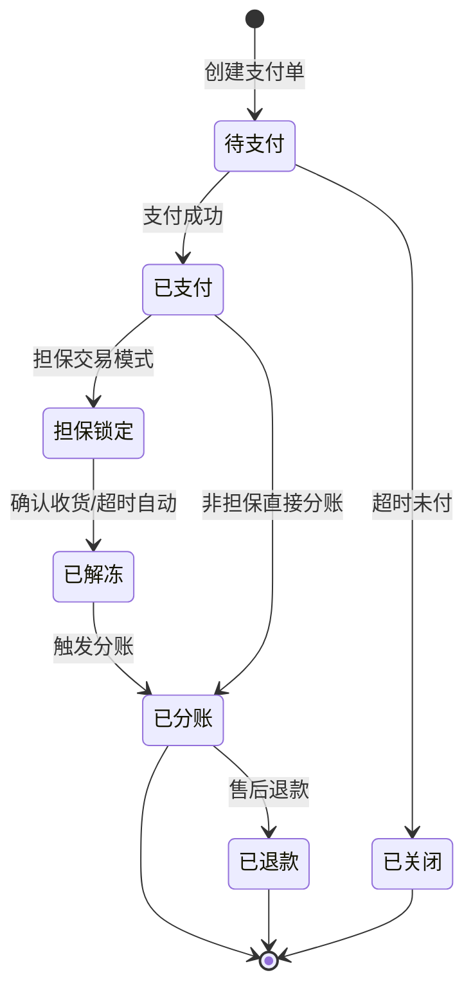
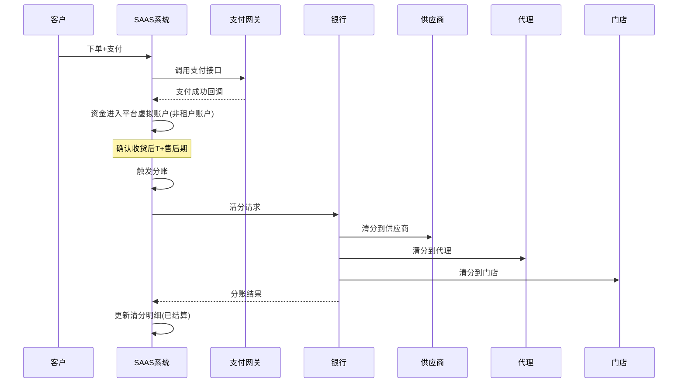
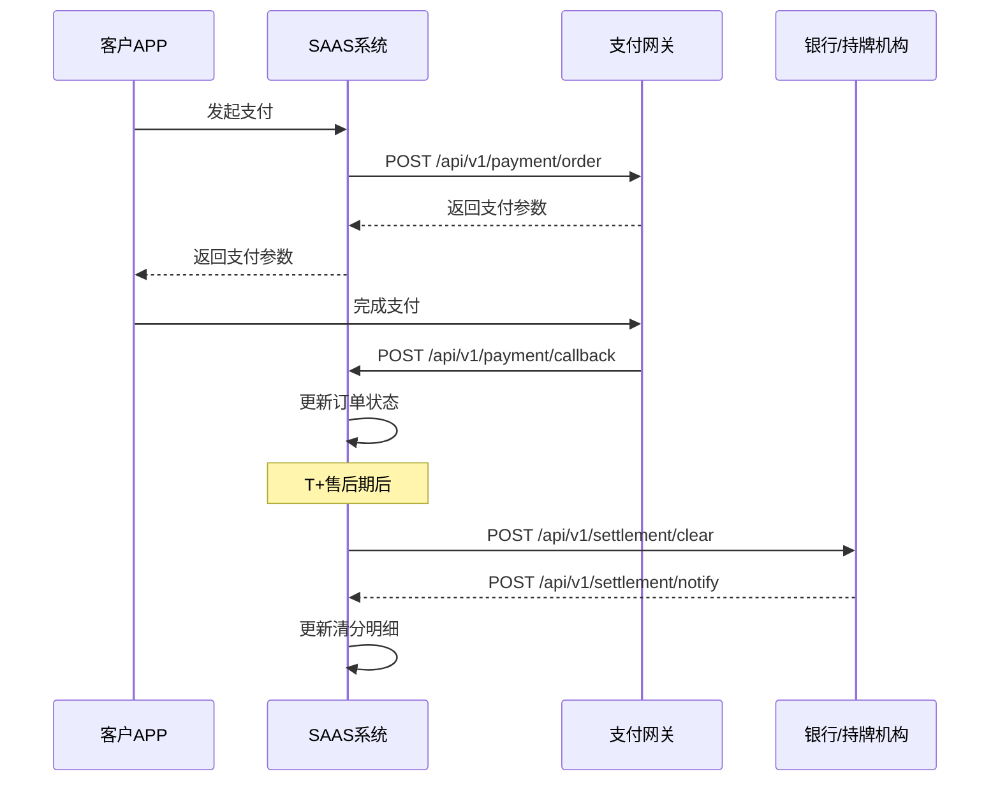

# 交易域 产品需求文档 PRD V1.0.3

> **业务域**：交易域（D03） | **版本**：V1.0.3 | **日期**：2026-07-16
> **数据来源**：`交易V1.0.0.md`、Axure原型 V1.0.2
> **追溯链**：UC-TRD → FN-TRD → PG-TRD → SC-TRD → BG-01 → BO-01

---

## 版本历史

| 版本 | 日期 | 变更内容 |
|------|------|----------|
| V1.0.2 | 2026-05-15 | 基础支付（优惠券/红包/积分抵扣后支付）、租户收款→分账、自提核销 |
| V1.0.3 | 2026-05-25 | 客户沟通决策（分佣规则方案问题） |
| V1.0.9 | 2026-07-16 | 按PRD规范V1.0.0重新编排；标注待建功能（平台直连分账/担保交易/分期付款） |

---

## 1. 背景与问题陈述

交易域是SAAS平台的核心变现链路，涵盖从客户下单、支付、分账到售后的全流程。当前系统已实现基础的下单→支付→发货→退款闭环，但在**支付模式多样性**和**资金安全**上存在明显短板。对于同时服务百货零售、直播间冲动消费、大健康处方药购买、训练营大额付费等多种交易场景的平台，单一的支付和分账模式无法满足需求。

### 核心问题

| 问题编号 | 问题 | 严重程度 | 影响 |
|----------|------|----------|------|
| TRD-ISSUE-001 | 缺平台直连分账 | 🔴 高 | 资金经租户账户有挪用风险 |
| TRD-ISSUE-002 | 缺担保交易 | 🔴 高 | 大额交易（训练营）信任度低 |
| TRD-ISSUE-003 | 缺分期付款 | 🟡 中 | 训练营大额商品无法分期 |
| TRD-ISSUE-004 | 售后仅退款和退货退款 | 🟡 中 | 缺换货/补发/部分退货（关联售后域） |

---

## 2. 目标与成功度量

| 目标编号 | 目标 | 度量指标 | 目标值 |
|----------|------|----------|--------|
| BO-TRD-01 | 资金安全 | 平台直连分账覆盖率 | 100% |
| BO-TRD-02 | 支付转化 | 支付成功率 | ≥ 99.5% |
| BO-TRD-03 | 分账时效 | 分账延迟 | T+1, < 24h |
| BO-TRD-04 | 幂等性 | 支付/退款回调重复处理率 | 0% |

---

## 3. 范围

### In-Scope
- 组合支付（优惠券/红包/积分抵扣后支付）
- 租户收款→分账（当前模式）
- 平台直连分账（待建-P0）
- 担保交易（待建-P0）
- 分期付款（待建-P1）
- 支付幂等性

### Non-Goals
- 第三方分期平台对接细节（待业务确认自建还是对接）
- 跨境支付/多币种支付（远期）

---

## 4. 与既有模块关系

### 上下游依赖矩阵

| 方向 | 关联域 | 依赖关系 | 说明 |
|------|--------|----------|------|
| **上游（被依赖）** | 财务域 | 分账清分与财务对账 | 平台直连分账需与财务系统对接 |
| **上游（被依赖）** | 售后域 | 退款触发资金回滚 | 退款需通过交易域执行 |
| **下游（依赖）** | 订单域 | 支付单关联订单 | 付款回调更新订单状态 |
| **下游（依赖）** | 库存域 | 支付确认后扣减库存 | 需统一扣减时序和退款回滚 |
| **下游（依赖）** | 营销域 | 分佣与订单状态联动 | 退款触发分佣回滚 |
| **下游（依赖）** | 支付网关 | 微信/支付宝/银行卡 | 多支付渠道接入 |

### 影响域说明

| 变更场景 | 影响域 | 影响说明 |
|----------|--------|----------|
| 支付成功 | 订单域、库存域、营销域 | 订单状态更新；库存扣减；积分冻结 |
| 退款 | 订单域、财务域、营销域 | 订单关闭；佣金回滚；积分退还 |
| 分账 | 财务域、分销域 | 清分明细生成；佣金到账 |

### 复用边界

| 共享能力 | 复用方 | 说明 |
|----------|--------|------|
| 支付能力 | SAAS平台APP、PAAS独立端 | 支付能力无需重复建设，共用SAAS能力 |
| 退款能力 | 售后域 | 售后退款通过交易域执行 |

---

## 5. 业务目标映射

| BG | BO | FN | 优先级 |
|----|-----|-----|--------|
| BG-01 资金安全 | BO-TRD-01 | FN-TRD-001 平台直连分账 | P0 |
| BG-01 | BO-TRD-01 | FN-TRD-002 担保交易 | P0 |
| BG-06 支付转化 | BO-TRD-02 | FN-TRD-003 分期付款 | P1 |
| BG-07 分账时效 | BO-TRD-03 | FN-TRD-004 自动清分 | P0 |

---

## 6. 用户故事

| US编号 | 角色 | 用户故事 |
|--------|------|----------|
| US-TRD-001 | 客户 | 作为客户，我希望使用优惠券/红包/积分组合支付，以便享受优惠 |
| US-TRD-002 | 客户 | 作为客户，我希望使用担保交易购买大额商品（训练营），以便资金安全 |
| US-TRD-003 | 客户 | 作为客户，我希望分期付款购买大额商品，以便减轻支付压力 |
| US-TRD-004 | 供应商 | 作为供应商，我希望平台直连分账，以便确保收到分账款 |
| US-TRD-005 | 平台运营 | 作为运营，我希望资金不经过租户账户，以便消除挪用风险 |

---

## 7. 功能需求列表与用例

### FN-TRD-001 平台直连分账（待建）

| 属性 | 值 |
|------|-----|
| 用例编号 | UC-TRD-001 |
| 名称 | 平台直连分账 |
| 参与者 | 系统 |
| 优先级 | P0 |
| 关联BG | BG-01 |
| 自动化类型 | 事件驱动 |

**前置条件**：客户完成支付。

**基本流程**：
1. [系统自动] 客户支付后资金直接进入平台虚拟账户（不经过租户账户）
2. [系统自动] 平台按清分规则自动将资金清分到各分账方（供应商/代理/门店）
3. [系统自动] 租户无法触碰分账资金
4. [系统自动] 清分规则可配置化（按比例/按固定金额/按阶梯）

**后置条件**：分账资金到达各方账户。

**关联UC**：UC-FIN-004（分账管理，财务域）

---

### FN-TRD-002 担保交易（待建）

| 属性 | 值 |
|------|-----|
| 用例编号 | UC-TRD-002 |
| 名称 | 担保交易 |
| 参与者 | 系统/客户/商家 |
| 优先级 | P0 |
| 关联BG | BG-01 |
| 自动化类型 | 事件驱动 |

**基本流程**：
1. [系统自动] 客户支付→资金锁定
2. [手动] 商家发货
3. [手动] 客户确认收货→资金解冻→打款
4. [系统自动] 自动确认收货：发货后N天未确认则自动确认

**适用场景**：训练营、大额贵重商品。担保交易可与其他支付方式叠加。

---

### FN-TRD-003 分期付款（待建）

| 属性 | 值 |
|------|-----|
| 用例编号 | UC-TRD-003 |
| 名称 | 分期付款 |
| 参与者 | 客户/系统 |
| 优先级 | P1 |
| 关联BG | BG-06 |
| 自动化类型 | 手动+事件驱动 |

**基本流程**：
1. [手动] 客户选择分期（3/6/12期）
2. [系统自动] 分期订单独立管理（每期还款状态跟踪）
3. [系统自动] 逾期处理（提醒→罚息→关闭分期）

---

### FN-TRD-004 组合支付（已实现）

| 属性 | 值 |
|------|-----|
| 用例编号 | UC-TRD-004 |
| 名称 | 组合支付 |
| 参与者 | 客户 |
| 优先级 | P0 |
| 关联BG | BG-06 |
| 自动化类型 | 手动 |

**说明**：支持优惠券/红包/积分抵扣后支付。实际资金流向为租户收款→分账。

---

## 8. 业务规则

### BR-TRD-001 平台直连分账规则
- 触发条件：客户支付成功
- 行为：资金直接进入平台虚拟账户，平台按清分规则自动清分到各分账方，租户无法触碰分账资金

### BR-TRD-002 担保交易资金锁定规则
- 触发条件：担保交易模式支付成功
- 行为：资金锁定；商家发货→客户确认收货→资金解冻→打款；发货后N天未确认自动确认

### BR-TRD-003 分期付款规则
- 触发条件：客户选择分期
- 行为：分期订单独立管理，每期还款状态跟踪；逾期处理（提醒→罚息→关闭分期）

### BR-TRD-004 支付幂等性规则
- 触发条件：支付回调/退款回调
- 行为：回调必须幂等，杜绝重复处理

### BR-TRD-005 资金审计规则
- 行为：所有资金操作需审计日志+双因素审批

---

## 9. 数据实体

### ENT-TRD-001 支付单(PaymentOrder)

| 字段 | 类型 | 说明 |
|------|------|------|
| payment_order_id | String | 支付单ID |
| payment_type | Enum | 定金/尾款/全款 |
| account_id | String | 账户ID |
| business_type | Enum | 销售订单入账/退款/充值/转账/提现 |
| business_order_id | String | 业务单据ID |
| payment_amount | Decimal | 支付金额 |
| payment_time | Datetime | 支付时间 |
| payment_method | Enum | 微信/支付宝/银行卡 |
| is_escrow | Boolean | 是否担保交易（资金锁定） |
| installment_info | Object | 分期信息（期数/每期金额/还款状态） |

---

## 10. 验收标准

| SC编号 | 场景 | 预期结果 |
|--------|------|----------|
| SC-TRD-001 | 平台直连分账 | 资金不经过租户账户，直接清分到各方 |
| SC-TRD-002 | 担保交易全流程 | 支付→锁定→发货→确认→解冻→打款 |
| SC-TRD-003 | 分期付款 | 分期订单独立管理，逾期处理正确 |
| SC-TRD-004 | 支付幂等 | 重复回调不重复处理 |

| FN | Given | When | Then |
|----|-------|------|------|
| FN-TRD-001 | 客户支付成功 | 触发分账 | 资金直接清分到各方，租户不可触碰 |
| FN-TRD-002 | 担保交易发货后N天 | 客户未确认 | 自动确认收货，资金解冻打款 |
| FN-TRD-004 | 同一支付回调重复到达 | 系统处理 | 仅处理一次，不重复更新 |

---

## 11. 指标登记

| 指标 | 说明 | 目标值 |
|------|------|--------|
| MET-TRD-001 | 支付成功率 | ≥ 99.5% |
| MET-TRD-002 | 分账延迟 | T+1, < 24h |
| MET-TRD-003 | 支付回调幂等 | 0%重复处理 |

---

## 12. 五类图

### 12.1 业务流程图 — 担保交易全流程

### 12.2 信息流转图 — 交易域跨模块

### 12.3 状态机 — 支付单状态机

**状态过渡操作表**：

| 当前状态 | 触发操作 | 目标状态 | 操作者 | 前置约束 | 后置动作 |
|----------|----------|----------|--------|----------|----------|
| 待支付 | 支付成功 | 已支付/担保锁定 | 系统/支付回调 | 金额校验通过 | 更新订单状态，扣减库存 |
| 担保锁定 | 确认收货/超时 | 已解冻 | 系统 | 发货后N天 | 资金打款 |
| 已解冻/已支付 | 触发分账 | 已分账 | 系统 | T+1 | 清分到各方 |
| 已分账 | 售后退款 | 已退款 | 系统 | 售后完成 | 佣金回滚 |

### 12.4 业务时序图 — 平台直连分账

### 12.5 三方接口时序图 — 支付与分账接口

---

## 13. 外部接口标注

| 接口编号 | 接口名称 | 方向 | 对端系统 | 路径 |
|----------|----------|------|----------|------|
| API-TRD-001 | 支付下单 | 双向 | 微信支付/支付宝 | POST /api/v1/payment/order |
| API-TRD-002 | 支付回调 | 单向(入) | 支付网关 | POST /api/v1/payment/callback |
| API-TRD-003 | 退款 | 双向 | 支付网关 | POST /api/v1/payment/refund |
| API-TRD-004 | 分账清分 | 双向 | 银行/持牌机构 | POST /api/v1/settlement/clear |
| API-TRD-005 | 分账结果通知 | 单向(入) | 银行/持牌机构 | POST /api/v1/settlement/notify |

---

## 14. 检查清单

| # | 检查项 | 状态 |
|---|--------|------|
| 1 | 编号体系 FN-TRD/UC-TRD/BR-TRD/ENT-TRD/SC-TRD | ✅ |
| 2 | 15章结构 | ✅ |
| 3 | 版本历史 | ✅ |
| 4 | 目录 | ✅ |
| 5 | 背景与问题 | ✅ |
| 6 | 目标与度量 | ✅ |
| 7 | 范围 | ✅ |
| 8 | 与既有模块关系 | ✅ |
| 9 | 业务目标映射 | ✅ |
| 10 | 用户故事 | ✅ |
| 11 | 功能需求与用例 | ✅ |
| 12 | 业务规则 BR-TRD | ✅ |
| 13 | 数据实体 ENT-TRD | ✅ |
| 14 | 验收标准双层 | ✅ |
| 15 | 指标登记 | ✅ |
| 16 | 五类图 | ✅ |
| 17 | 状态机+操作表 | ✅ |
| 18 | 外部接口 | ✅ |
| 19 | 无实现细节 | ✅ |
| 20 | 检查清单自检 | ✅ |

---

> **关联文档**：源MD `交易V1.0.0.md` | 上游：财务域/售后域 | 下游：订单域/库存域/营销域 | 总索引 `SAAS-PRD-总索引.md`
