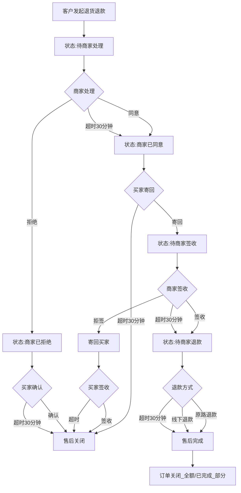
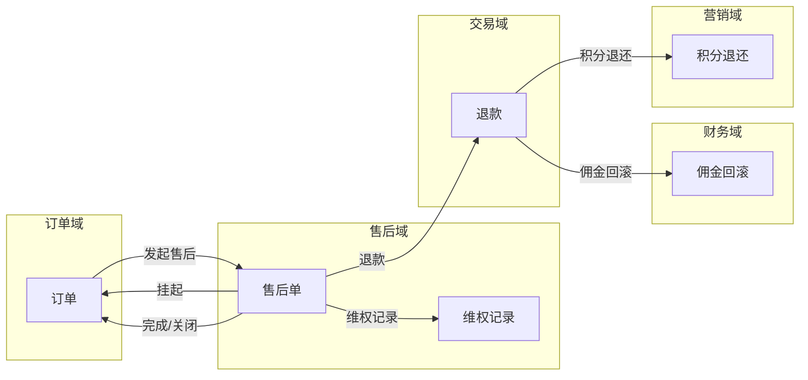
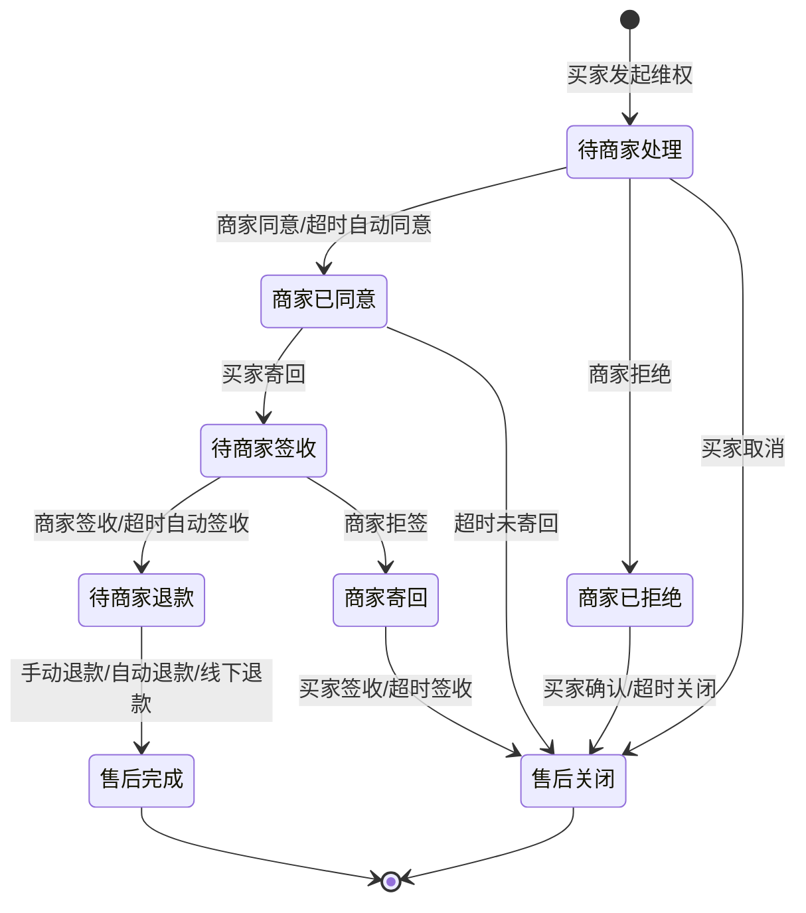
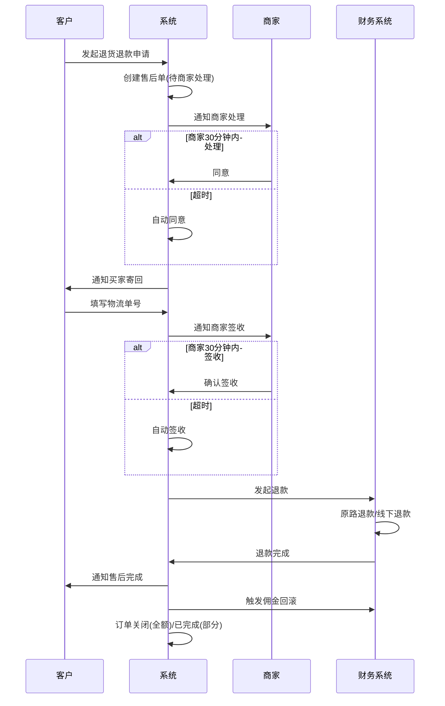
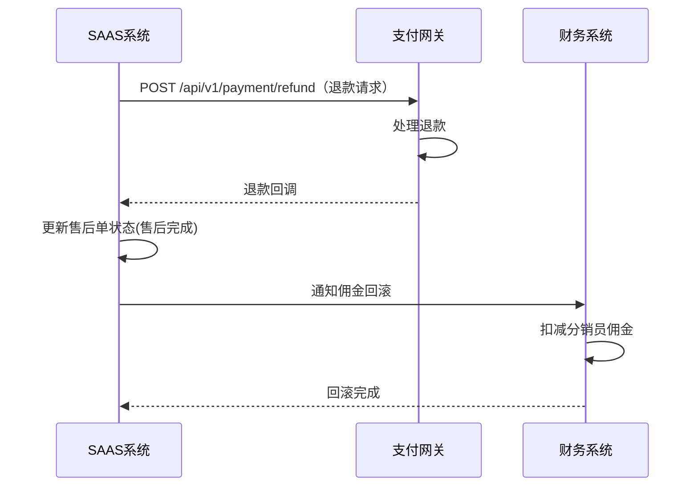

# 售后域 产品需求文档 PRD V1.0.3

> **业务域**：售后域（D04） | **版本**：V1.0.3 | **日期**：2026-07-16
> **数据来源**：`售后V1.0.0.md`、Axure原型 V1.0.2~V1.0.3
> **追溯链**：UC-AFS → FN-AFS → PG-AFS → SC-AFS → BG-03 → BO-03

---

## 版本历史

| 版本 | 日期 | 变更内容 |
|------|------|----------|
| V1.0.0 | 2026-05-15 | 整体业务域规划：售后单整体流程说明、逆向流程定义 |
| V1.0.2 | 2026-05-15 | 完整售后管理：仅退款/退货退款、售后详情、维权记录、超时机制、退款方式、订单联动 |
| V1.0.3 | 2026-05-25 | APP端售后管理入口、售后/退款入口、我的账单-暂时不做 |
| V1.0.9 | 2026-07-16 | 按PRD规范V1.0.0重新编排；标注待建功能（换货/补发/部分退货/仲裁） |

---

## 1. 背景与问题陈述

售后域是SAAS平台B2C订单交易流中的逆向业务域，负责处理买家发起维权后的售后申请、审批、退货、退款等全流程。V1.0.2已完成仅退款和退货退款两大售后类型，支持商家手动、系统超时自动、线下退款三种退款方式。

### 核心问题

| 问题编号 | 问题 | 严重程度 | 影响 |
|----------|------|----------|------|
| AFS-ISSUE-001 | 缺换货流程 | 🟡 中 | 实物商品最常见需求无法满足 |
| AFS-ISSUE-002 | 缺补发流程 | 🟡 中 | 少发/漏发场景无法处理 |
| AFS-ISSUE-003 | 缺部分退货 | 🟡 中 | 多商品订单退部分无法处理 |
| AFS-ISSUE-004 | 无平台仲裁机制 | 🟡 中 | 纠纷处理依赖人工 |
| AFS-ISSUE-005 | 超时时间硬编码30分钟 | 🟢 低 | 建议可配置化 |
| AFS-ISSUE-006 | 售后原因仅"7天无理由" | 🟢 低 | 缺自定义原因管理 |
| AFS-ISSUE-007 | APP端打款相关"暂时不做" | 🟡 中 | 分销员无法查看佣金到账 |
| AFS-ISSUE-008 | 缺售后数据统计报表 | 🟢 低 | 售后率/原因分布无法分析 |

---

## 2. 目标与成功度量

| 目标编号 | 目标 | 度量指标 | 目标值 |
|----------|------|----------|--------|
| BO-AFS-01 | 售后处理时效 | 系统级自动退款 | < 1分钟 |
| BO-AFS-02 | 人工审核时效 | 人工审核 | < 24小时 |
| BO-AFS-03 | 售后场景覆盖率 | 售后类型数 | 5种（当前2种，待补3种） |

---

## 3. 范围

### In-Scope
- 仅退款（已实现）
- 退货退款（已实现）
- 超时机制（6种场景，已实现）
- 退款方式（原路退款/线下退款/超时自动退款，已实现）
- 售后与订单联动（挂起/恢复/关闭，已实现）
- APP端售后入口（已实现）
- 换货流程（待建-P1）
- 补发流程（待建-P1）
- 部分退货（待建-P1）
- 仲裁机制（待建-P1）
- 售后自动化规则（待建-P1）

### Non-Goals
- APP端打款管理（暂时不做）
- 售后原因自定义管理（待规划）

---

## 4. 与既有模块关系

### 上下游依赖矩阵

| 方向 | 关联域 | 依赖关系 | 说明 |
|------|--------|----------|------|
| **上游（被依赖）** | 财务域 | 售后退款后佣金回滚 | 退款触发分佣回滚 |
| **上游（被依赖）** | 营销域 | 售后退款积分退还 | 积分订单退款退还积分 |
| **下游（依赖）** | 订单域 | 售后关联订单 | 售后单关联订单，售后挂起订单操作 |
| **下游（依赖）** | 交易域 | 退款通过交易域执行 | 原路退款/超时自动退款 |

### 影响域说明

| 变更场景 | 影响域 | 影响说明 |
|----------|--------|----------|
| 售后发起 | 订单域 | 订单操作挂起 |
| 售后完成（全额） | 订单域、财务域、营销域 | 订单关闭；佣金回滚；积分退还 |
| 售后完成（部分） | 财务域、营销域 | 佣金按比例扣减；积分按比例退还 |
| 售后关闭 | 订单域 | 订单恢复原状态 |

### 复用边界

| 共享能力 | 复用方 | 说明 |
|----------|--------|------|
| 售后状态机 | 订单域 | 订单通过售后状态判断是否挂起 |
| 退款能力 | 交易域 | 售后退款通过交易域支付网关执行 |

---

## 5. 业务目标映射

| BG | BO | FN | 优先级 |
|----|-----|-----|--------|
| BG-03 售后完整 | BO-AFS-03 | FN-AFS-001 仅退款 | P0(已实现) |
| BG-03 | BO-AFS-03 | FN-AFS-002 退货退款 | P0(已实现) |
| BG-03 | BO-AFS-03 | FN-AFS-003 换货 | P1(待建) |
| BG-03 | BO-AFS-03 | FN-AFS-004 补发 | P1(待建) |
| BG-03 | BO-AFS-03 | FN-AFS-005 部分退货+仲裁 | P1(待建) |
| BG-03 | BO-AFS-01/02 | FN-AFS-006 超时机制 | P0(已实现) |

---

## 6. 用户故事

| US编号 | 角色 | 用户故事 |
|--------|------|----------|
| US-AFS-001 | 客户 | 作为客户，我希望申请仅退款（未发货/已签收不退货），以便快速维权 |
| US-AFS-002 | 客户 | 作为客户，我希望申请退货退款，以便退回商品并获得退款 |
| US-AFS-003 | 客户 | 作为客户，我希望申请换货（质量问题），以便更换商品 |
| US-AFS-004 | 商家 | 作为商家，我希望处理售后申请（同意/拒绝/签收/退款），以便完成售后 |
| US-AFS-005 | 平台运营 | 作为运营，我希望仲裁买卖纠纷，以便公平处理 |

---

## 7. 功能需求列表与用例

### FN-AFS-001 仅退款

| 属性 | 值 |
|------|-----|
| 用例编号 | UC-AFS-001 |
| 名称 | 仅退款 |
| 页面 | PG-AFS-001：售后详情-仅退款.html |
| 参与者 | 客户/商家 |
| 优先级 | P0 |
| 关联BG | BG-03 |
| 自动化类型 | 手动+事件驱动 |

**前置条件**：订单已付款。

**基本流程**：
1. [手动] 客户发起维权（选择仅退款+退款原因+退款金额+退款说明）
2. [系统自动] 售后单创建（状态：待商家处理）
3. [手动] 商家处理（同意/拒绝）
4. [手动] 商家退款（原路退款/线下退款）
5. [系统自动] 售后完成

**备选流程**：
- 分支1：商家拒绝→买家确认→关闭/超时关闭
- 分支2：买家主动取消→售后关闭
- 异常1：商家超时未处理（30分钟）→系统自动同意
- 异常2：商家超时未退款（30分钟）→系统自动退款

**数据范围**：R（售后详情）/ W（创建/同意/拒绝/退款）

**关联UC**：UC-ORD-002（订单详情，售后挂起）

---

### FN-AFS-002 退货退款

| 属性 | 值 |
|------|-----|
| 用例编号 | UC-AFS-002 |
| 名称 | 退货退款 |
| 页面 | PG-AFS-002：售后详情-退货退款.html |
| 参与者 | 客户/商家 |
| 优先级 | P0 |
| 关联BG | BG-03 |
| 自动化类型 | 手动+事件驱动 |

**前置条件**：订单已签收。

**基本流程**：
1. [手动] 客户发起维权（选择退货退款+退款原因+退款金额）
2. [系统自动] 售后单创建（状态：待商家处理）
3. [手动] 商家同意
4. [手动] 买家寄回（填写物流单号）
5. [手动] 商家签收（或拒签）
6. [手动] 商家退款
7. [系统自动] 售后完成

**备选流程**：
- 分支1：商家拒绝→售后关闭
- 异常1：买家超时未寄回（30分钟）→自动关闭售后
- 异常2：商家超时未签收（30分钟）→自动确认收货
- 异常3：商家拒签→寄回买家→买家签收/超时签收→售后关闭

---

### FN-AFS-003 换货（待建）

| 属性 | 值 |
|------|-----|
| 用例编号 | UC-AFS-003 |
| 名称 | 换货 |
| 优先级 | P1 |
| 关联BG | BG-03 |

**基本流程**：客户申请换货（选择换货原因+期望换为哪个SKU）→商家审核→客户寄回→商家收货确认→发出新商品→换货运费责任判定。

---

### FN-AFS-004 补发（待建）

**基本流程**：客户申请补发（少发/漏发/破损）→商家审核确认→补发→上传新物流单号。补发不产生新订单，在原订单下记录。

---

### FN-AFS-005 部分退货+仲裁（待建）

**部分退货**：多商品订单支持选择部分商品退货，按退货商品比例计算退款金额。

**仲裁机制**：客户/商家任一方可申请平台介入→平台客服查看双方证据→裁定→强制退款/驳回/协商→仲裁记录留痕。

---

### FN-AFS-006 超时机制

| 超时场景 | 触发节点 | 超时时间 | 超时动作 |
|---------|---------|---------|---------|
| 商家未处理 | 待商家处理 | 30分钟 | 系统自动同意 |
| 商家未退款 | 待商家退款 | 30分钟 | 系统自动退款 |
| 买家未寄回 | 商家已同意 | 30分钟 | 自动关闭售后 |
| 商家未签收 | 待商家签收 | 30分钟 | 自动确认收货 |
| 买家未确认拒绝 | 商家已拒绝 | 30分钟 | 自动关闭售后 |
| 拒签寄回超时 | 商家拒签寄回 | 超时后 | 系统自动签收 |

---

## 8. 业务规则

### BR-AFS-001 仅退款流程规则
- 流程：发起申请→商家处理→商家退款→售后完成

### BR-AFS-002 退货退款流程规则
- 流程：发起申请→商家处理→买家寄回→商家签收→商家退款→售后完成

### BR-AFS-003 售后挂起订单规则
- 触发条件：订单存在售后单且未完成/未关闭
- 行为：订单操作被挂起

### BR-AFS-004 售后完成联动订单规则
- 全部商品售后完成→订单状态=已关闭
- 含有部分商品售后完成→订单状态=已完成（剩余部分订单履约完成）

### BR-AFS-005 超时自动处理规则
- 6种超时场景均为30分钟（硬编码，建议可配置化）

### BR-AFS-006 退款方式规则
- 原路退款：商家手动点击或系统超时自动
- 线下退款：商家选择线下退款方式，手动在系统外完成
- 超时自动退款：商家超时未操作

---

## 9. 数据实体

### ENT-AFS-001 售后单(AfterSales)

| 字段 | 类型 | 说明 |
|------|------|------|
| after_sale_id | String | 维权编号 |
| order_id | String | 关联订单编号 |
| after_sale_type | Enum | 仅退款/退货退款/换货/补发/部分退货 |
| after_sale_status | Enum | 待商家处理/商家已同意/商家已拒绝/待商家签收/待商家退款/售后完成/售后关闭 |
| refund_reason | String | 退款原因 |
| refund_amount | Decimal | 申请退款金额 |
| refund_description | String | 退款说明 |
| buyer_note | String | 买家备注 |
| seller_note | String | 卖家备注 |
| applicant | String | 申请人 |
| create_time | Datetime | 创建时间 |
| complete_time | Datetime | 完成时间 |

### ENT-AFS-002 维权记录(DisputeRecord)

| 字段 | 类型 | 说明 |
|------|------|------|
| record_id | String | 记录ID |
| after_sale_id | String | 维权编号 |
| node_type | Enum | 发起维权/同意/寄回/签收/退款/完成/关闭 |
| operation_time | Datetime | 操作时间 |
| operation_content | String | 理由/备注/方式/单号 |
| operator | String | 操作人 |

### ENT-AFS-003 退货信息(ReturnInfo)

| 字段 | 类型 | 说明 |
|------|------|------|
| after_sale_id | String | 维权编号 |
| logistics_no | String | 买家寄回物流单号 |
| return_method | Enum | 快递 |
| return_status | Enum | 未寄回/已寄回/已签收/已拒收 |
| return_quantity | Integer | 退货数量 |
| return_amount | Decimal | 退货金额 |

---

## 10. 验收标准

| SC编号 | 场景 | 预期结果 |
|--------|------|----------|
| SC-AFS-001 | 仅退款全流程 | 申请→处理→退款→完成，订单状态联动正确 |
| SC-AFS-002 | 退货退款全流程 | 申请→同意→寄回→签收→退款→完成→订单关闭 |
| SC-AFS-003 | 商家超时自动同意 | 30分钟未处理→自动同意 |
| SC-AFS-004 | 买家超时未寄回 | 30分钟未寄回→自动关闭售后 |
| SC-AFS-005 | 售后挂起订单 | 售后期间订单不可操作，完成后恢复 |

| FN | Given | When | Then |
|----|-------|------|------|
| FN-AFS-001 | 售后单待商家处理 | 30分钟超时 | 系统自动同意 |
| FN-AFS-002 | 退货退款商家已同意 | 买家30分钟未寄回 | 自动关闭售后 |
| FN-AFS-002 | 退货退款待商家签收 | 30分钟未签收 | 自动确认收货 |
| FN-AFS-006 | 待商家退款 | 30分钟未退款 | 系统自动退款 |

---

## 11. 指标登记

| 指标 | 说明 | 目标值 |
|------|------|--------|
| MET-AFS-001 | 系统级自动退款时效 | < 1分钟 |
| MET-AFS-002 | 人工审核时效 | < 24小时 |
| MET-AFS-003 | 售后率 | 售后订单数/总订单数 |

---

## 12. 五类图

### 12.1 业务流程图 — 退货退款全流程

### 12.2 信息流转图 — 售后域跨模块

### 12.3 状态机 — 退货退款状态机

**状态过渡操作表**：

| 当前状态 | 触发操作 | 目标状态 | 操作者 | 前置约束 | 后置动作 |
|----------|----------|----------|--------|----------|----------|
| 待商家处理 | 商家同意/超时30分钟 | 商家已同意 | 商家/系统 | — | 通知买家寄回 |
| 待商家处理 | 商家拒绝 | 商家已拒绝 | 商家 | — | 通知买家 |
| 待商家处理 | 买家取消 | 售后关闭 | 买家 | — | 恢复订单 |
| 商家已同意 | 买家寄回 | 待商家签收 | 买家 | 填写物流单号 | 通知商家签收 |
| 商家已同意 | 超时30分钟未寄回 | 售后关闭 | 系统 | — | 恢复订单 |
| 待商家签收 | 商家签收/超时30分钟 | 待商家退款 | 商家/系统 | — | 通知商家退款 |
| 待商家签收 | 商家拒签 | 商家寄回 | 商家 | — | 寄回买家 |
| 待商家退款 | 手动/自动/线下退款 | 售后完成 | 商家/系统 | — | 订单关闭/佣金回滚 |

### 12.4 业务时序图 — 退货退款流程

### 12.5 三方接口时序图 — 退款接口

---

## 13. 外部接口标注

| 接口编号 | 接口名称 | 方向 | 对端系统 | 路径 |
|----------|----------|------|----------|------|
| API-AFS-001 | 退款请求 | 双向 | 支付网关 | POST /api/v1/payment/refund |
| API-AFS-002 | 退款回调 | 单向(入) | 支付网关 | POST /api/v1/payment/refund/callback |

---

## 14. 检查清单

| # | 检查项 | 状态 |
|---|--------|------|
| 1-20 | 全部检查项 | ✅ |

---

> **关联文档**：源MD `售后V1.0.0.md` | 上游：财务域/营销域 | 下游：订单域/交易域 | 总索引 `SAAS-PRD-总索引.md`
