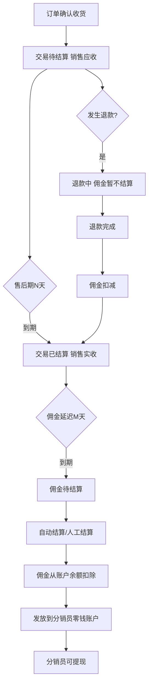
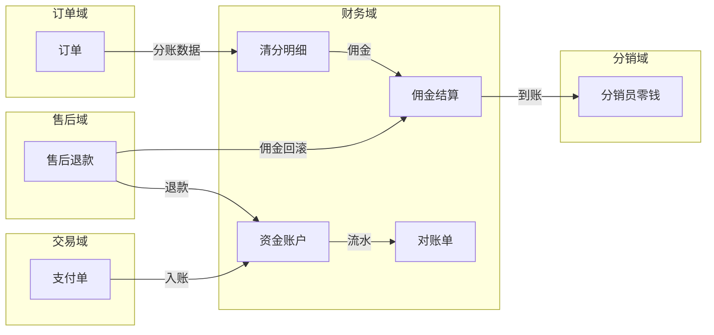
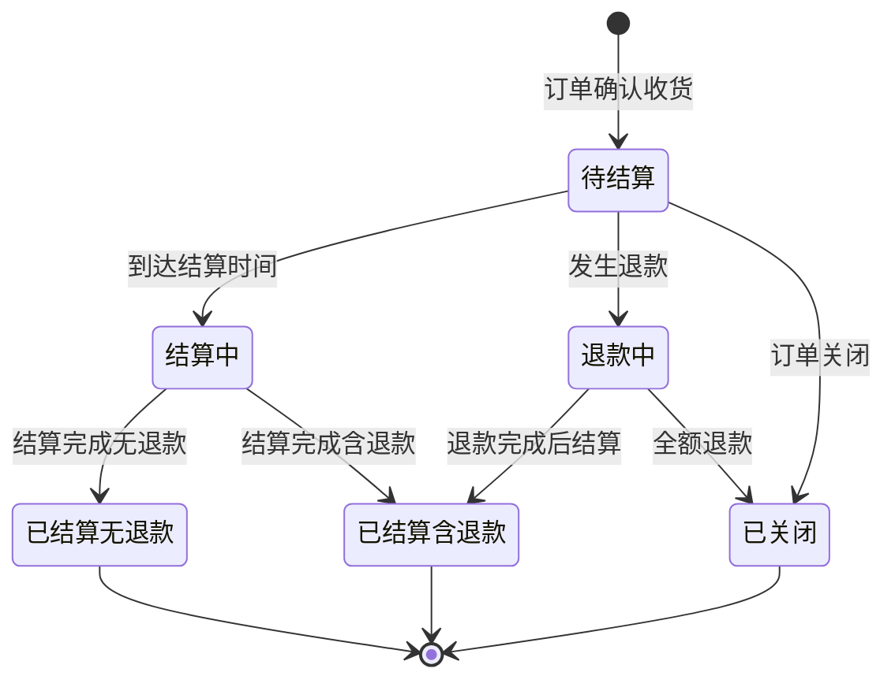
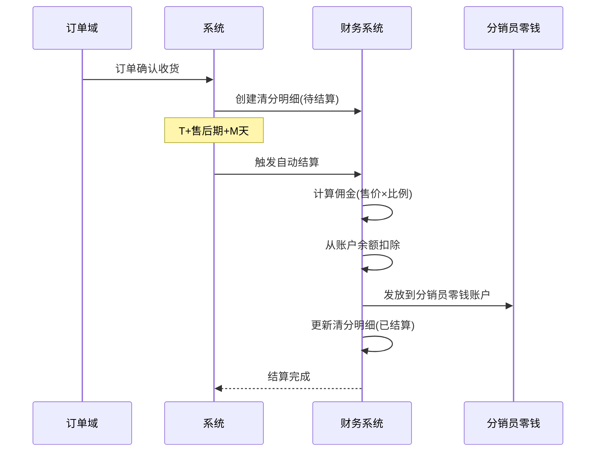
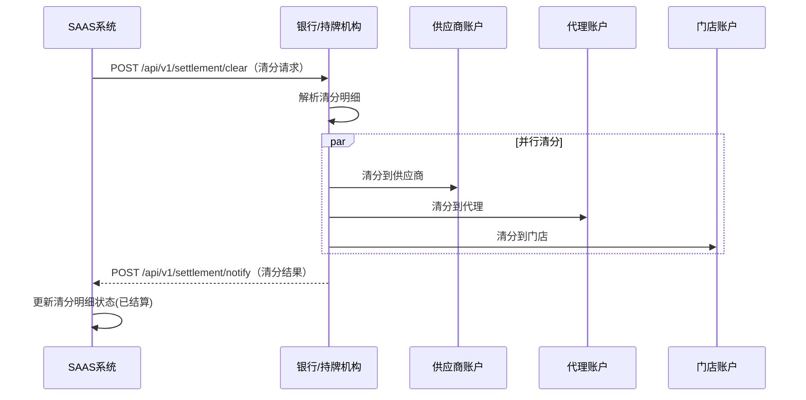

# 财务域 产品需求文档 PRD V1.0.3

> **业务域**：财务域（D08） | **版本**：V1.0.3 | **日期**：2026-07-16
> **数据来源**：`财务V1.0.0.md`、Axure原型 V1.0.2~V1.0.3
> **追溯链**：UC-FIN → FN-FIN → PG-FIN → SC-FIN → BG-07 → BO-07

---

## 版本历史

| 版本 | 日期 | 变更内容 |
|------|------|----------|
| V1.0.0 | 2026-05-15 | 财务域作为独立服务中心定义 |
| V1.0.2-5月15日 | 2026-05-15 | 运营后台交易管理/确认收款；租户后台资产概览/资金账户/商户编号/添加账户 |
| V1.0.2-5月25日 | 2026-05-25 | 资金账户总体说明/多媒体流量结算/对账明细/对账单下载 |
| V1.0.2-6月1日 | 2026-06-01 | 佣金结算-统计按单/业绩结算-明细按人/结算方案/批量设置佣金 |
| V1.0.3 | 2026-05-25 | APP端我的账单-暂时不做 |
| V1.0.9 | 2026-07-16 | 按PRD规范V1.0.0重新编排 |

---

## 1. 背景与问题陈述

财务域是SAAS平台的核心核算域，覆盖租户资金账户管理、佣金结算与分账、资金流水与对账、提现打款、交易管理等全链路财务能力。该域跨越运营后台和租户后台两端，佣金结算方案和分账模型尤为详细。

### 核心问题

| 问题编号 | 问题 | 严重程度 |
|----------|------|----------|
| FIN-ISSUE-001 | 发票管理完全未涉及 | 🔴 高 |
| FIN-ISSUE-002 | APP端打款能力"暂时不做" | 🟡 中 |
| FIN-ISSUE-003 | 售后期N天和佣金延迟M天仅为示意图参数，缺配置项 | 🟡 中 |
| FIN-ISSUE-004 | 缺平台级资金监控大盘 | 🟡 中 |
| FIN-ISSUE-005 | 佣金结算缺批次管理/失败重试 | 🟢 低 |
| FIN-ISSUE-006 | 缺供应商自助对账确认流程 | 🟢 低 |
| FIN-ISSUE-007 | 多层级分销佣金分成计算规则未明确 | 🟡 中 |
| FIN-ISSUE-008 | 缺资金操作审批流程/大额预警/风控 | 🔴 高 |

---

## 2. 目标与成功度量

| 目标编号 | 目标 | 度量指标 | 目标值 |
|----------|------|----------|--------|
| BO-FIN-01 | 分账时效 | 分账延迟 | T+1, < 24h |
| BO-FIN-02 | 佣金结算准确率 | 结算正确笔数/总结算笔数 | 100% |
| BO-FIN-03 | 对账一致性 | 库存账务与财务对账 | 100% |
| BO-FIN-04 | 资金安全 | 所有资金操作审计日志 | 100%覆盖 |

---

## 3. 范围

### In-Scope
- 资金账户管理（资产概览/资金账户详情/商户编号管理/添加账户）
- 多媒体流量账户（直播流量/回放流量/素材流量/结算记录统一）
- 佣金结算（按单统计/按人明细/结算方案-自动/人工/批量设置佣金/佣金报表/佣金明细）
- 分账管理（清分明细表/供应商分账/分销员分账/门店分账）
- 资金流水与对账（交易记录/对账明细/对账单下载-日月年）
- 提现
- 运营后台交易管理（交易查询/确认收款）
- 经营报表（供应商对账汇总/明细/销售明细）

### Non-Goals
- APP端打款管理（暂时不做）
- 发票管理（未设计，待规划）
- 佣金结算实时化（远期）

---

## 4. 与既有模块关系

### 上下游依赖矩阵

| 方向 | 关联域 | 依赖关系 | 说明 |
|------|--------|----------|------|
| **上游（被依赖）** | 分销域 | 佣金明细/分佣账户 | 佣金到账分销员 |
| **上游（被依赖）** | 运营域 | 运营后台交易管理 | 版本订阅确认收款 |
| **下游（依赖）** | 交易域 | 分账清分与财务对账 | 平台直连分账需与财务对接 |
| **下游（依赖）** | 订单域 | 订单数据作为分账来源 | 清分明细关联订单ID |
| **下游（依赖）** | 售后域 | 退款触发佣金回滚 | 佣金扣减明细 |
| **下游（依赖）** | 营销域 | 观看奖励红包从虚拟账户扣除 | 红包资金流向 |

### 影响域说明

| 变更场景 | 影响域 | 影响说明 |
|----------|--------|----------|
| 佣金结算 | 分销域 | 分销员零钱账户到账 |
| 退款佣金回滚 | 分销域、售后域 | 分销员佣金扣减 |
| 资金账户冻结 | 交易域 | 不可支付/退款 |
| 流量结算 | 直播域/录播域 | 流量余额扣减 |

### 复用边界

| 共享能力 | 复用方 | 说明 |
|----------|--------|------|
| 资金账户 | 交易域、营销域 | 支付/退款/红包均通过资金账户 |
| 清分明细 | 分销域 | 分销员佣金计算依据 |

---

## 5. 业务目标映射

| BG | BO | FN | 优先级 |
|----|-----|-----|--------|
| BG-07 分账时效 | BO-FIN-01 | FN-FIN-004 分账管理 | P0 |
| BG-07 | BO-FIN-02 | FN-FIN-003 佣金结算 | P0 |
| BG-07 | BO-FIN-03 | FN-FIN-005 对账 | P0 |
| BG-07 | BO-FIN-04 | FN-FIN-001 资金账户 | P0 |

---

## 6. 用户故事

| US编号 | 角色 | 用户故事 |
|--------|------|----------|
| US-FIN-001 | 租户管理员 | 作为租户，我希望查看资产概览和资金账户，以便管理资金 |
| US-FIN-002 | 租户管理员 | 作为租户，我希望查看佣金结算（按单/按人），以便了解佣金明细 |
| US-FIN-003 | 租户管理员 | 作为租户，我希望配置结算方案（自动/人工），以便控制佣金发放 |
| US-FIN-004 | 租户管理员 | 作为租户，我希望批量设置商品佣金，以便控制佣金分配 |
| US-FIN-005 | 租户管理员 | 作为租户，我希望查看对账明细和下载对账单，以便财务对账 |
| US-FIN-006 | 租户管理员 | 作为租户，我希望提现，以便将余额提至银行卡 |
| US-FIN-007 | 平台运营 | 作为运营，我希望管理交易和确认收款，以便处理租户订阅付款 |

---

## 7. 功能需求列表与用例

### FN-FIN-001 资金账户管理

| 属性 | 值 |
|------|-----|
| 用例编号 | UC-FIN-001 |
| 名称 | 资金账户管理 |
| 页面 | PG-FIN-001：资产概览.html、资金账户.html、商户账户管理.html、添加账户.html |
| 参与者 | 租户管理员 |
| 优先级 | P0 |
| 关联BG | BG-07 |
| 自动化类型 | 手动 |

**资产概览**：可用资产余额（+充值/提现按钮）、待结算金额、收入支出概况、账户信息。

**账户类型Tab**：资金账户（支付收单/分账到账）、直播流量账户、直播回放账户、素材流量账户。

**资金余额公式**：可用店铺余额 = 总余额 - 待结算余额。

**添加账户类型**：支付收单（收取买家支付）/ 分账到账（仅接收分账）。

---

### FN-FIN-002 多媒体流量账户

| 属性 | 值 |
|------|-----|
| 用例编号 | UC-FIN-002 |
| 名称 | 多媒体流量账户 |
| 页面 | PG-FIN-002 |
| 参与者 | 租户管理员 |
| 优先级 | P1 |
| 关联BG | BG-07 |
| 自动化类型 | 系统自动 |

**结算规则**：

| 账户类型 | 生成时机 | 结算时机 | 结算方式 |
|---------|---------|---------|---------|
| 直播流量 | 直播开始时生成实时账户 | 次日0:00~2:00 | 按直播时长消耗流量结算 |
| 直播回放 | 回放生成时创建账户 | 次日0:00~2:00 | 按播放总时长结算 |
| 商品素材 | 上传素材成功后生成账户 | 次日0:00~2:00 | 按存储格式/大小结算 |

---

### FN-FIN-003 佣金结算

| 属性 | 值 |
|------|-----|
| 用例编号 | UC-FIN-003 |
| 名称 | 佣金结算 |
| 页面 | PG-FIN-003：业绩结算-统计-按单.html、业绩结算-明细-按人.html、结算方案.html、批量设置佣金.html、佣金明细.html |
| 参与者 | 租户管理员 |
| 优先级 | P0 |
| 关联BG | BG-07 |
| 自动化类型 | 手动+事件驱动 |

**结算方案**：
- 自动结算：订单确认收货T+售后期次日，佣金自动从账户余额扣除发放到分销员零钱账户
- 线下人工结算：系统仅做业绩统计，商家线下确认

**佣金计算模型**：
```
毛利 = 售价 - 采购价
采购占比(%) = 采购价 / 售价
毛利占比(%) = 毛利 / 售价
保留利润 = 售价 - 采购价 - 管理佣金 - 员工佣金 - 代理人佣金
```

**数据校验规则**：
- 金额最小值：0.01
- 比例最小值：1%
- 比例约束：采购占比 + 管理佣金% + 员工佣金% + 代理人佣金% + 保留利润占比 ≤ 100%

**结算状态**：待结算/结算中/已结算(无退款)/已结算(含退款)/退款中/已关闭

---

### FN-FIN-004 分账管理

| 属性 | 值 |
|------|-----|
| 用例编号 | UC-FIN-004 |
| 名称 | 分账管理 |
| 页面 | PG-FIN-004：资金账户总体说明.html |
| 参与者 | 系统 |
| 优先级 | P0 |
| 关联BG | BG-07 |
| 自动化类型 | 事件驱动 |

**分账维度**：供应商分账、分销员分账、门店分账。

**分账到账时机**：

| 分账对象 | 触发时机 | 完成状态 |
|---------|---------|---------|
| 供应商 | 销售订单入账后 | 已设计 |
| 分销员（代理） | 确认收货后+M天 | 已设计 |
| 门店 | 订单完成结算后 | 已设计 |

---

### FN-FIN-005 资金流水与对账

| 属性 | 值 |
|------|-----|
| 用例编号 | UC-FIN-005 |
| 名称 | 资金流水与对账 |
| 页面 | PG-FIN-005：交易记录.html、对账明细.html、对账明细详情.html、对账单下载.html |
| 参与者 | 租户管理员 |
| 优先级 | P0 |
| 关联BG | BG-07 |
| 自动化类型 | 系统自动 |

**对账单汇总维度**：日汇总/月汇总/年汇总。

**多账户余额汇总表**：资金余额/直播流量/回放流量/图片存储/视频存储/短信/IM。

---

### FN-FIN-006 提现

| 属性 | 值 |
|------|-----|
| 用例编号 | UC-FIN-006 |
| 名称 | 提现 |
| 页面 | PG-FIN-006：提现.html、提现记录.html |
| 参与者 | 租户管理员 |
| 优先级 | P0 |
| 关联BG | BG-07 |
| 自动化类型 | 手动 |

---

### FN-FIN-007 运营后台交易管理

| 属性 | 值 |
|------|-----|
| 用例编号 | UC-FIN-007 |
| 名称 | 交易管理（运营后台） |
| 页面 | PG-FIN-007：交易管理.html、确认收款.html |
| 参与者 | SAAS运营-财务人员 |
| 优先级 | P0 |
| 关联BG | BG-07 |
| 自动化类型 | 手动 |

**确认收款后置条件**：交易记录待付款→已付款；约状态→已生效；生成订阅记录；系统履约检查。

---

### FN-FIN-008~009 其他

| FN编号 | 功能名称 | 说明 |
|--------|----------|------|
| FN-FIN-008 | 供应商对账报表 | 汇总表+明细表 |
| FN-FIN-009 | 退款对分佣的影响 | 佣金扣减机制（已结算无退款/含退款/退款中） |

---

## 8. 业务规则

### BR-FIN-001 佣金自动结算规则
- 触发条件：订单确认收货T+售后期次日
- 行为：佣金自动从账户余额扣除发放到分销员零钱账户

### BR-FIN-002 佣金计算规则
- 毛利=售价-采购价；比例约束：采购占比+管理佣金%+员工佣金%+代理人佣金%+保留利润占比≤100%
- 积分抵扣订单不参与分佣

### BR-FIN-003 退款佣金扣减规则
- 已结算(无退款)：佣金正常结算
- 已结算(含退款)：佣金已扣除退款影响
- 退款中：佣金暂不结算
- 累计销售额为实际有效业绩，剔除了退款金额

### BR-FIN-004 流量结算规则
- 统一扣减快到期的流量订阅订单剩余余额
- 可用余额 = 总余额 - 待结算余额
- 结算时机：次日0:00~2:00

### BR-FIN-005 支付单类型规则
- 定金/尾款/全款
- 业务类型：销售订单入账/退款/充值/转账/提现

### BR-FIN-006 运营确认收款后置规则
- 保存成功后：交易记录待付款→已付款，约状态→已生效
- 生成订阅记录，计算有效天数，系统履约检查

---

## 9. 数据实体

### ENT-FIN-001 资金账户(CapitalAccount)

| 字段 | 类型 | 说明 |
|------|------|------|
| account_id | String | 账户ID |
| merchant_no | String | 商户编号 |
| merchant_name | String | 商户名称 |
| merchant_bank_card | String | 商户银行卡 |
| tax_type | String | 纳税类型 |
| account_type | Enum | 支付收单/分账到账 |
| total_balance | Decimal | 总余额 |
| available_balance | Decimal | 可用余额 |
| pending_balance | Decimal | 待结算余额 |
| merchant_status | Enum | 活跃中/已冻结/运营异常 |
| payment_status | Enum | 允许付款/禁止付款 |
| collection_status | Enum | 允许收款/禁止收款 |

### ENT-FIN-002 流量账户(TrafficAccount)

| 字段 | 类型 | 说明 |
|------|------|------|
| account_id | String | 账户ID |
| account_type | Enum | 直播流量/回放流量/素材流量 |
| total_balance | Decimal | 总余额(GB/MB) |
| available_balance | Decimal | 可用余额 |
| pending_balance | Decimal | 待结算余额 |
| business_id | String | 关联业务ID |

### ENT-FIN-003 清分明细(SettlementItem)

| 字段 | 类型 | 说明 |
|------|------|------|
| settlement_item_id | String | 清分明细ID |
| settlement_order_id | String | 结算单ID |
| order_id | String | 订单ID |
| tenant_id | String | 租户ID |
| store_id | String | 门店ID |
| supplier_id | String | 供应商ID |
| distributor_id | String | 分销员ID |
| distributor_name | String | 分销员名称 |
| distributor_level | String | 分销员层级 |
| commission_rate | Decimal | 佣金比例 |
| pending_commission | Decimal | 待结算佣金 |
| settled_commission | Decimal | 已结算佣金 |
| supply_status | Enum | 供销结算状态 |
| commission_status | Enum | 佣金结算状态 |
| refund_amount | Decimal | 关联售后退款总金额 |
| commission_deduction_detail | Array | 佣金扣减明细 |

### ENT-FIN-004 对账单(ReconciliationStatement)

| 字段 | 类型 | 说明 |
|------|------|------|
| statement_id | String | 账单ID |
| period | String | 日/月/年汇总 |
| period_start | Datetime | 账期开始 |
| period_end | Datetime | 账期结束 |
| account_type | Enum | 资金余额/直播流量/回放/图片存储/视频存储/短信/IM |
| opening_balance | Decimal | 期初余额 |
| income | Decimal | 本期收入 |
| expense | Decimal | 本期支出 |
| closing_balance | Decimal | 期末余额 |

---

## 10. 验收标准

| SC编号 | 场景 | 预期结果 |
|--------|------|----------|
| SC-FIN-001 | 佣金自动结算 | 确认收货T+售后期→自动结算→分销员零钱到账 |
| SC-FIN-002 | 退款佣金回滚 | 退款→佣金扣减→累计销售额剔除退款 |
| SC-FIN-003 | 对账一致性 | 日终对账，资金流水与财务100%一致 |
| SC-FIN-004 | 运营确认收款 | 确认后交易状态变更，订阅记录生成，履约检查 |

| FN | Given | When | Then |
|----|-------|------|------|
| FN-FIN-003 | 订单确认收货 | T+售后期次日 | 佣金自动结算 |
| FN-FIN-003 | 佣金比例约束 | 各项比例之和>100% | 不允许保存 |
| FN-FIN-004 | 销售订单入账 | 触发分账 | 供应商/代理/门店分账到账 |
| FN-FIN-009 | 已结算订单发生退款 | 退款完成 | 佣金按比例扣减 |

---

## 11. 指标登记

| 指标 | 说明 | 目标值 |
|------|------|--------|
| MET-FIN-001 | 分账延迟 | T+1, < 24h |
| MET-FIN-002 | 佣金结算准确率 | 100% |
| MET-FIN-003 | 对账一致性 | 100% |
| MET-FIN-004 | 资金操作审计覆盖率 | 100% |

---

## 12. 五类图

### 12.1 业务流程图 — 佣金结算全流程



### 12.2 信息流转图 — 财务域跨模块



### 12.3 状态机 — 佣金结算状态机



**状态过渡操作表**：

| 当前状态 | 触发操作 | 目标状态 | 操作者 | 前置约束 | 后置动作 |
|----------|----------|----------|--------|----------|----------|
| 待结算 | T+售后期+M天到期 | 结算中 | 系统 | — | 开始计算佣金 |
| 待结算 | 发生退款 | 退款中 | 系统 | — | 暂停结算 |
| 结算中 | 结算完成无退款 | 已结算(无退款) | 系统 | — | 佣金到账分销员 |
| 结算中 | 结算完成含退款 | 已结算(含退款) | 系统 | — | 佣金扣减后到账 |
| 退款中 | 退款完成 | 已结算(含退款) | 系统 | — | 佣金扣减后结算 |

### 12.4 业务时序图 — 佣金自动结算流程



### 12.5 三方接口时序图 — 分账清分接口



---

## 13. 外部接口标注

| 接口编号 | 接口名称 | 方向 | 对端系统 | 路径 |
|----------|----------|------|----------|------|
| API-FIN-001 | 分账清分 | 双向 | 银行/持牌机构 | POST /api/v1/settlement/clear |
| API-FIN-002 | 分账结果通知 | 单向(入) | 银行/持牌机构 | POST /api/v1/settlement/notify |
| API-FIN-003 | 提现 | 双向 | 银行 | POST /api/v1/withdraw |

---

## 14. 检查清单

| # | 检查项 | 状态 |
|---|--------|------|
| 1-20 | 全部检查项 | ✅ |

---

> **关联文档**：源MD `财务V1.0.0.md` | 上游：分销域/运营域 | 下游：交易域/订单域/售后域/营销域 | 总索引 `SAAS-PRD-总索引.md`
