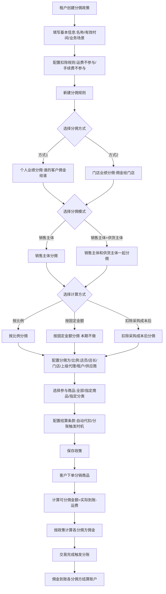
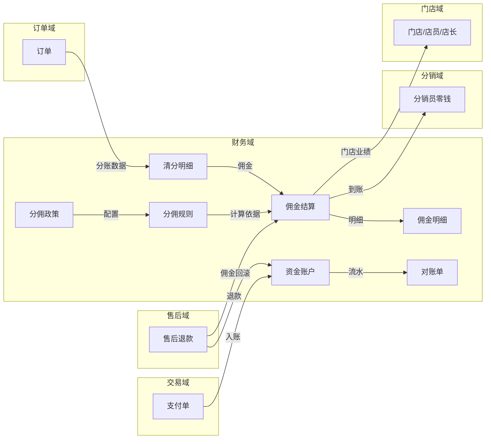
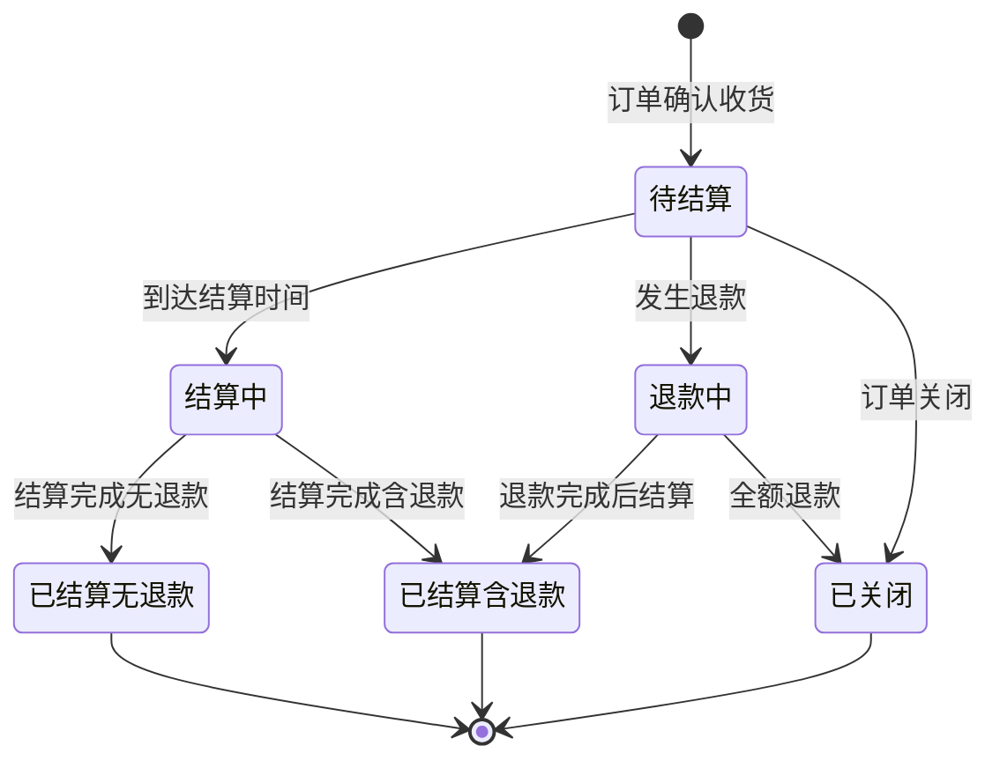
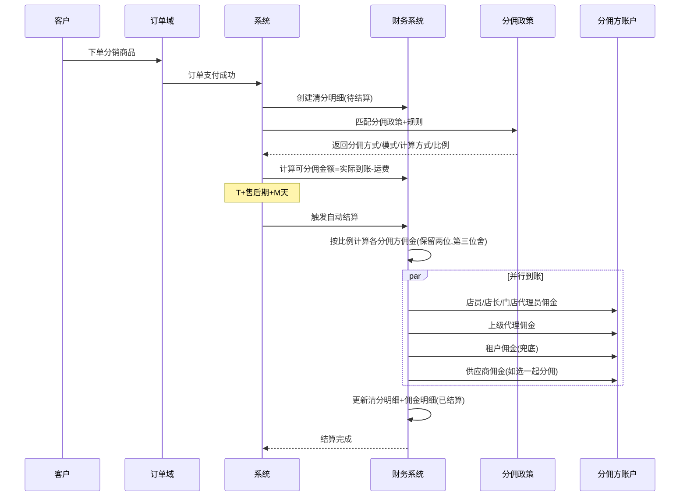
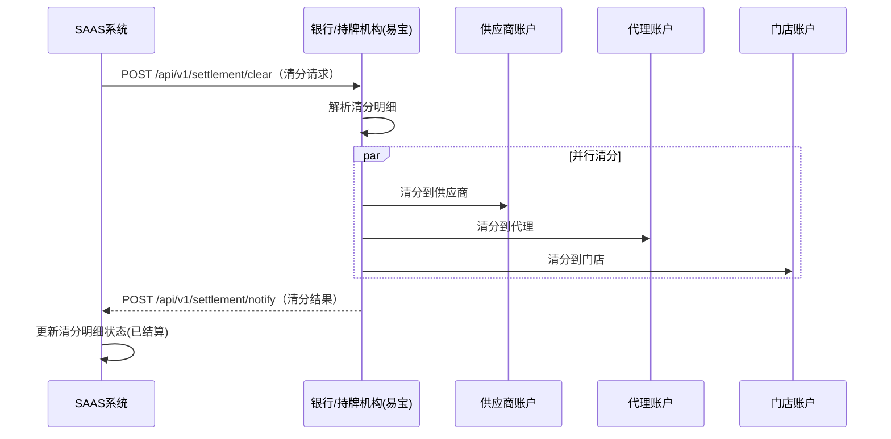

# 财务域 产品需求文档 PRD V7.0.0

> **业务域**：财务域（D08） | **版本**：V7.0.0 | **日期**：2026-07-21
> **数据来源**：Axure原型 V1.0.2~V1.0.9（主源 V1.0.2，重大增强源 V1.0.7）
> **追溯链**：UC-FIN → FN-FIN → PG-FIN → SC-FIN → BG-07 → BO-07
> **双态标注**：📗显式照录（原型文字/字段直接提取） | 🟡隐式挖掘还原（≥2处原文依据交叉印证）

---

## 版本历史

| 版本 | 日期 | 变更内容 |
|------|------|----------|
| V1.0.0 | 2026-05-15 | 财务域作为独立服务中心定义 |
| V1.0.2 | 2026-05-15/25/06-01 | 运营后台交易管理/确认收款；租户后台资产概览/资金账户/商户编号/添加账户；多媒体流量结算/对账明细/对账单下载；佣金结算-统计按单/业绩结算-明细按人/结算方案/批量设置佣金 |
| V1.0.3 | 2026-05-25 | APP端我的账单-暂时不做 |
| V1.0.7 | 2026-07 | 🟡**重大增强**：新增分佣政策体系（分佣方式2种/分佣模式2种/计算方式3种/分佣方6类/业绩归属3模式）、佣金明细（政策编号/分佣方/分佣方式/分佣模式/计算方式）、分佣配置（业绩归属规则）、分佣计算示例（按比例+按固定金额公式）、分佣账户、政策列表/详情 |
| V1.0.8 | 2026-07 | 虚拟账户/零钱/红包/观看奖励体系（部分归营销域） |
| V1.0.9 | 2026-07-16 | 按PRD规范V1.0.0重新编排 |
| V7.0.0 | 2026-07-21 | learn-project V7.0.0场景深度还原增强：8项能力全面应用，融合V1.0.7分佣政策重大变更，补全交易生命周期五类型、分佣计算公式、业绩归属配置、可分佣金额计算逻辑 |

---

## 1. 背景与问题陈述

财务域是SAAS平台的核心核算域，覆盖租户资金账户管理、佣金结算与分账、资金流水与对账、提现打款、交易管理等全链路财务能力。该域跨越运营后台和租户后台两端。

V1.0.7版本引入了全新的**分佣政策体系**，将原有的"佣金结算方案（自动/人工）"升级为更灵活的分佣政策模型，支持按比例分佣、按固定金额分佣、扣除采购成本后分佣三种计算方式，覆盖店员/店长/门店/上级代理/租户/供应商六类分佣方。

### 核心问题

| 问题编号 | 问题 | 严重程度 | V7.0.0处理 |
|----------|------|----------|-----------|
| FIN-ISSUE-001 | 发票管理完全未涉及 | 🔴 高 | 🟡隐式：资金账户总体说明提及"业务类型"含充值/转账/提现但无发票类型，对账单账户类型7类无发票类→确认本期Non-Goals |
| FIN-ISSUE-002 | APP端打款能力"暂时不做" | 🟡 中 | 📗显式照录：V1.0.3明确标注"APP端我的账单-暂时不做" |
| FIN-ISSUE-003 | 售后期N天和佣金延迟M天缺配置项 | 🟡 中 | 🟡隐式：资金账户总体说明图示"N天售后期""确认收货后+M天佣金结算"为参数占位→需CONFIG配置项 |
| FIN-ISSUE-004 | 缺平台级资金监控大盘 | 🟡 中 | 🟡隐式：资产概览页仅租户维度，运营后台交易管理无大盘→确认本期Non-Goals |
| FIN-ISSUE-005 | 佣金结算缺批次管理/失败重试 | 🟢 低 | 🟡隐式：结算单实体含"支付状态/支付时间/支付失败理由"→隐含失败处理但无重试机制 |
| FIN-ISSUE-006 | 缺供应商自助对账确认流程 | 🟢 低 | 🟡隐式：结算单含"对账状态/对账确认时间/对账确认人"→隐含对账确认能力但无供应商自助入口 |
| FIN-ISSUE-007 | 多层级分销佣金分成计算规则未明确 | 🟡 中 | ✅V7.0.0已解决：V1.0.7分佣政策体系完整定义分佣方6类+计算方式3种+业绩归属3模式 |
| FIN-ISSUE-008 | 缺资金操作审批流程/大额预警/风控 | 🔴 高 | 🟡隐式：账户实体含"允许付款/禁止付款/允许收款/禁止收款"状态→隐含风控开关但无审批流程 |

---

## 2. 目标与成功度量

| 目标编号 | 目标 | 度量指标 | 目标值 |
|----------|------|----------|--------|
| BO-FIN-01 | 分账时效 | 分账延迟 | T+1, < 24h |
| BO-FIN-02 | 佣金结算准确率 | 结算正确笔数/总结算笔数 | 100% |
| BO-FIN-03 | 对账一致性 | 库存账务与财务对账 | 100% |
| BO-FIN-04 | 资金安全 | 所有资金操作审计日志 | 100%覆盖 |
| BO-FIN-05 | 🟡分佣政策灵活性 | 支持的分佣方式/模式/计算方式组合数 | 2×2×3=12种组合 |

---

## 3. 范围

### In-Scope
- 资金账户管理（资产概览/资金账户详情/商户编号管理/添加账户/账户状态控制）
- 多媒体流量账户（直播流量/回放流量/素材流量/结算记录统一）
- **分佣政策体系（V1.0.7新增）**：分佣管理/分佣配置/政策列表/政策详情/创建分佣政策（个人业绩/门店业绩）/新建分佣规则（6种）/佣金明细/分佣账户
- 佣金结算（按单统计/按人明细/结算方案-自动/人工/批量设置佣金/佣金明细）
- 分账管理（清分明细表/供应商分账/分销员分账/门店分账）
- 资金流水与对账（交易记录/对账明细/对账明细详情/对账单下载-日月年）
- 提现（提现/提现记录）
- 充值（充值/充值记录/充值订单）
- 运营后台交易管理（交易查询/确认收款/交易生命周期）
- 经营报表（供应商对账汇总/明细/销售明细）

### Non-Goals
- APP端打款管理（暂时不做）📗V1.0.3明确标注
- 发票管理（未设计，待规划）🟡资金账户总体说明业务类型无发票类
- 佣金结算实时化（远期）
- 平台级资金监控大盘（待规划）
- B2B采购业务域分账（本期不实现，后期整理到B2B采购业务领域）📗V1.0.2资金账户总体说明②标注

---

## 4. 与既有模块关系

### 上下游依赖矩阵

| 方向 | 关联域 | 依赖关系 | 说明 |
|------|--------|----------|------|
| **上游（被依赖）** | 分销域 | 佣金明细/分佣账户 | 佣金到账分销员/店员/店长/门店代理人 |
| **上游（被依赖）** | 运营域 | 运营后台交易管理 | 版本订阅确认收款 |
| **下游（依赖）** | 交易域 | 分账清分与财务对账 | 平台直连分账需与财务对接 |
| **下游（依赖）** | 订单域 | 订单数据作为分账来源 | 清分明细关联订单ID |
| **下游（依赖）** | 售后域 | 退款触发佣金回滚 | 佣金扣减明细 |
| **下游（依赖）** | 营销域 | 观看奖励红包从虚拟账户扣除 | 红包资金流向 |
| **下游（依赖）** | 门店域 | 🟡分佣政策门店业绩分佣 | 门店店员/店长客户下单业绩归属门店 |

### 影响域说明

| 变更场景 | 影响域 | 影响说明 |
|----------|--------|----------|
| 分佣政策变更 | 分销域、门店域 | 分佣方/比例变更影响佣金到账 |
| 佣金结算 | 分销域 | 分销员零钱账户到账 |
| 退款佣金回滚 | 分销域、售后域 | 分销员佣金扣减 |
| 资金账户冻结 | 交易域 | 不可支付/退款 |
| 流量结算 | 直播域/录播域 | 流量余额扣减 |

### 复用边界

| 共享能力 | 复用方 | 说明 |
|----------|--------|------|
| 资金账户 | 交易域、营销域 | 支付/退款/红包均通过资金账户 |
| 清分明细 | 分销域 | 分销员佣金计算依据 |
| 🟡分佣政策引擎 | 门店域 | 门店业绩分佣依赖分佣政策配置 |

---

## 5. 业务目标映射

| BG | BO | FN | 优先级 |
|----|-----|-----|--------|
| BG-07 分账时效 | BO-FIN-01 | FN-FIN-004 分账管理 | P0 |
| BG-07 | BO-FIN-02 | FN-FIN-003 佣金结算 | P0 |
| BG-07 | BO-FIN-02 | FN-FIN-010 分佣政策体系 | P0 |
| BG-07 | BO-FIN-03 | FN-FIN-005 对账 | P0 |
| BG-07 | BO-FIN-04 | FN-FIN-001 资金账户 | P0 |
| BG-07 | BO-FIN-05 | FN-FIN-010 分佣政策体系 | P0 |

---

## 6. 用户故事

| US编号 | 角色 | 用户故事 |
|--------|------|----------|
| US-FIN-001 | 租户管理员 | 作为租户，我希望查看资产概览和资金账户，以便管理资金 |
| US-FIN-002 | 租户管理员 | 作为租户，我希望查看佣金结算（按单/按人），以便了解佣金明细 |
| US-FIN-003 | 租户管理员 | 作为租户，我希望配置结算方案（自动/人工），以便控制佣金发放 |
| US-FIN-004 | 租户管理员 | 作为租户，我希望批量设置商品佣金，以便控制佣金分配 |
| US-FIN-005 | 租户管理员 | 作为租户，我希望查看对账明细和下载对账单，以便财务对账 |
| US-FIN-006 | 租户管理员 | 作为租户，我希望提现，以便将余额提至银行卡 |
| US-FIN-007 | 平台运营 | 作为运营，我希望管理交易和确认收款，以便处理租户订阅付款 |
| US-FIN-008 | 租户管理员 | 🟡作为租户，我希望创建分佣政策（个人业绩/门店业绩），以便灵活配置佣金分配规则 |
| US-FIN-009 | 租户管理员 | 🟡作为租户，我希望配置业绩归属规则（跟进店员/店长/门店代理人），以便控制佣金归属逻辑 |
| US-FIN-010 | 租户管理员 | 🟡作为租户，我希望查看佣金明细（含政策编号/分佣方/分佣方式/分佣模式/计算方式），以便追溯每笔佣金计算依据 |

---

## 7. 功能需求列表与用例

### FN-FIN-001 资金账户管理

| 属性 | 值 |
|------|-----|
| 用例编号 | UC-FIN-001 |
| 名称 | 资金账户管理 |
| 页面 | PG-FIN-001：资产概览_资金账户.html、资金账户.html、资产概览_资金账户_租户不存在商户编号.html、添加账户.html（×5变体） |
| 参与者 | 租户管理员 |
| 优先级 | P0 |
| 关联BG | BG-07 |
| 自动化类型 | 手动 |

**资产概览** 📗：可用资产余额（+充值/提现按钮）、待结算金额、收入支出概况、账户信息。

**账户类型Tab** 📗：资金账户（支付收单/分账到账）、直播流量账户、直播回放账户、素材流量账户。

**资金余额公式** 📗：可用店铺余额 = 总余额 - 待结算余额。

**添加账户类型** 📗：支付收单（收取买家支付）/ 分账到账（仅接收分账）。

**🟡账户实体字段（隐式挖掘，来源：资金账户总体说明"账户"实体）**：
- 账户ID、商户号、商户KEY、商户秘钥、商户名称
- 租户ID、代理成员ID、供应商ID
- 账户类型：收单支付、分账到账
- 账户状态：已启用、已禁用

**🟡账户风控状态（隐式挖掘，来源：V1.0.3 PRD ENT-FIN-001 + 总体说明交叉印证）**：
- 商户状态：活跃中/已冻结/运营异常
- 支付状态：允许付款/禁止付款
- 收款状态：允许收款/禁止收款

**商户编号不存在场景** 📗：资产概览_资金账户_租户不存在商户编号.html 展示无商户编号时的引导开户流程。

---

### FN-FIN-002 多媒体流量账户

| 属性 | 值 |
|------|-----|
| 用例编号 | UC-FIN-002 |
| 名称 | 多媒体流量账户 |
| 页面 | PG-FIN-002：直播流量账户.html、回放流量账户.html、素材流量账户.html、多媒体流量账户-结算记录统一.html |
| 参与者 | 租户管理员 |
| 优先级 | P1 |
| 关联BG | BG-07 |
| 自动化类型 | 系统自动 |

**结算规则** 📗：

| 账户类型 | 生成时机 | 结算时机 | 结算方式 |
|---------|---------|---------|---------|
| 直播流量 | 直播开始时生成实时账户 | 次日0:00~2:00 | 按直播时长消耗流量结算 |
| 直播回放 | 回放生成时创建账户 | 次日0:00~2:00 | 按播放总时长结算 |
| 商品素材 | 上传素材成功后生成账户 | 次日0:00~2:00 | 按存储格式/大小结算 |

**🟡流量结算规则（隐式挖掘，来源：BR-FIN-004 + 总体说明交叉印证）**：统一扣减快到期的流量订阅订单剩余余额；可用余额 = 总余额 - 待结算余额。

---

### FN-FIN-003 佣金结算

| 属性 | 值 |
|------|-----|
| 用例编号 | UC-FIN-003 |
| 名称 | 佣金结算 |
| 页面 | PG-FIN-003：业绩结算-统计-按单.html、业绩结算-明细-按人.html、结算方案-自动结算.html、结算方案-人工结算.html、批量设置佣金.html（×2变体）、设置佣金.html（×2变体） |
| 参与者 | 租户管理员 |
| 优先级 | P0 |
| 关联BG | BG-07 |
| 自动化类型 | 手动+事件驱动 |

**结算方案** 📗：
- 自动结算：订单确认收货T+售后期次日，佣金自动从账户余额扣除发放到分销员零钱账户
- 线下人工结算：系统仅做业绩统计，商家线下确认

**佣金计算模型（V1.0.2版）** 📗：
```
毛利 = 售价 - 采购价
采购占比(%) = 采购价 / 售价
毛利占比(%) = 毛利 / 售价
保留利润 = 售价 - 采购价 - 管理佣金 - 员工佣金 - 代理人佣金
```

**数据校验规则** 📗：
- 金额最小值：0.01
- 比例最小值：1%
- 比例约束：采购占比 + 管理佣金% + 员工佣金% + 代理人佣金% + 保留利润占比 ≤ 100%

**结算状态** 📗：待结算/结算中/已结算(无退款)/已结算(含退款)/退款中/已关闭

**佣金结算按单统计字段（来源：佣金结算-统计-按单.html）** 📗：
- 订单编号、分销员名称、客户、结算状态
- 订单总金额、订单实付金额、可分配佣金（不计运费、采购价、营销费、税费和附加费）
- 应收金额、退款金额、佣金实收金额、比例
- 收益人名称
- 筛选条件：订单编号、分销员（手机号/名称）、筛选时间（下单时间/退单时间）、结算状态、是否已生成账单
- 快捷时间：昨日/近7天/近30天
- 操作：分销员报表、分销员明细、结算方案、生成账单

**🟡积分抵扣规则（隐式挖掘，来源：BR-FIN-002 + 按单统计交叉印证）**：积分抵扣订单不参与分佣。

---

### FN-FIN-004 分账管理

| 属性 | 值 |
|------|-----|
| 用例编号 | UC-FIN-004 |
| 名称 | 分账管理 |
| 页面 | PG-FIN-004：资金账户总体说明_-__必须阅读.html |
| 参与者 | 系统 |
| 优先级 | P0 |
| 关联BG | BG-07 |
| 自动化类型 | 事件驱动 |

**分账维度** 📗：供应商分账、分销员分账、门店分账。

**分账到账时机** 📗：

| 分账对象 | 触发时机 | 完成状态 |
|---------|---------|---------|
| 供应商 | 销售订单入账后 | 已设计 |
| 分销员（代理） | 确认收货后+M天 | 已设计 |
| 门店 | 订单完成结算后 | 已设计 |

**🟡交易生命周期五类型（隐式挖掘，来源：资金账户总体说明 PART1 ①~⑤）**：

| 类型 | 交易类型 | 核心节点 | 关键规则 |
|------|---------|---------|---------|
| ① | 销售订单 | 下单待付款→待发货→已发货→确认收货→交易待结算(销售应收)→[N天售后期]→交易已结算(销售实收)→交易完成 | 确认收货+系统确认 |
| ② | B2B采购业务域 | 暂时本期内不实现 | 以销定采，依据消费者订单+过滤条件生成采购订单 |
| ③ | 分销订单 | 销售订单含有分销关系链，需将供应商纳入分销关系链的清分关系 | 清分明细类型==分销订单且支付成功后需预先生成 |
| ④ | 充值订单 | 创建充值订单→[易宝调用充值下单]→待充值→[易宝收到支付通知/扫码获取充值订单信息完成支付]→充值中→已完成/已关闭 | 业务单据被取消或超时自动取消/失败→已关闭 |
| ⑤ | 提现订单 | 创建提现订单→[易宝调用提现下单]→待提现→[易宝收到支付通知]→提现中→已完成/已关闭 | 业务单据被取消或超时自动取消/失败→已关闭 |

**🟡交易关闭条件（隐式挖掘，来源：总体说明交叉印证）**：
- 订单未付已关闭 → 交易关闭
- 订单全部售后单且售后单==售后完成 → 订单==已关闭 → 交易关闭
- 订单含有部分售后单且售后单==售后完成，剩余部分订单履约完成 → 订单==已完成 → 交易完成

**🟡分销关系链两类（隐式挖掘，来源：总体说明 A1/A2）**：
- A1：供销关系（供应商）
- A2：分销关系（代理成员、店长、店员）

---

### FN-FIN-005 资金流水与对账

| 属性 | 值 |
|------|-----|
| 用例编号 | UC-FIN-005 |
| 名称 | 资金流水与对账 |
| 页面 | PG-FIN-005：交易记录.html、对账明细.html、对账明细详情.html、对账单下载.html、对账单详情.html |
| 参与者 | 租户管理员 |
| 优先级 | P0 |
| 关联BG | BG-07 |
| 自动化类型 | 系统自动 |

**对账单汇总维度** 📗：日汇总/月汇总/年汇总。

**多账户余额汇总表** 📗：资金余额/直播流量/回放流量/图片存储/视频存储/短信/IM。

**🟡流水记录实体字段（隐式挖掘，来源：总体说明"流水记录"实体）**：
- 流水ID、支付单ID、租户ID
- 代理成员ID/编号/名称、主播ID/编号、供应商ID/编号/名称
- 收支类型：收入、支出
- 流水类型：订单-支付、订单-退款、手续费-支付、手续费-提现、手续费-分账、手续费-退款、手续费-结算、订单-佣金、订单-货款

**🟡支付单实体字段（隐式挖掘，来源：总体说明"支付单"实体）**：
- 支付单ID、支付单类型（定金/尾款/全款）、账户ID
- 主播ID/编号、供应商ID/编号/名称
- 业务类型：销售订单入账、销售订单退款、资金账户充值、资金账户转账、资金账户提现
- 业务单据：订单ID/编号、售后单ID/编号、充值单ID/编号、提现单ID/编号、现金红包单ID/编号、结算ID/编号
- 创建时间、支付方式、支付金额、支付状态、支付时间、支付失败理由、支付单有效期

**🟡结算单实体字段（隐式挖掘，来源：总体说明"结算单"实体）**：
- 结算单ID/编号、类型（分销佣金）、结算对象（分销员）
- 结算对象ID/编号/账户类型（特约子商户）/账户编号（特约子商户号）/账户秘钥/对账账户证书
- 对账状态、对账确认时间、对账确认人
- 支付状态、支付时间、实付方式、结算金额、差额
- 创建时间/人、更新时间/人

**🟡清分明细实体字段（隐式挖掘，来源：总体说明"清分明细表"实体）**：
- 清分明细ID、结算单ID/编号、订单ID、租户ID、门店ID
- 供应商ID/分账账户ID、分销员ID/分账账户ID/名称/层级/手机号
- 分销员佣金比例、待结算佣金金额、已结算佣金金额
- 供销结算状态（待结算/已结算）、佣金结算状态（待结算/已结算）
- 创建时间、结算时间
- 分销员佣金扣减金额明细、关联售后单退款支付单流水总金额
- 生成规则：类型==分销订单且支付成功后需预先生成（1:N关系）

---

### FN-FIN-006 提现

| 属性 | 值 |
|------|-----|
| 用例编号 | UC-FIN-006 |
| 名称 | 提现 |
| 页面 | PG-FIN-006：提现.html、提现记录.html |
| 参与者 | 租户管理员 |
| 优先级 | P0 |
| 关联BG | BG-07 |
| 自动化类型 | 手动 |

**🟡提现流程（隐式挖掘，来源：总体说明⑤提现订单生命周期）**：
1. 创建提现订单 → 待提现
2. 易宝调用提现下单
3. 易宝收到支付通知 → 提现中
4. 已完成 / 已关闭（业务单据被取消或超时自动取消/失败）

---

### FN-FIN-007 运营后台交易管理

| 属性 | 值 |
|------|-----|
| 用例编号 | UC-FIN-007 |
| 名称 | 交易管理（运营后台） |
| 页面 | PG-FIN-007：交易管理.html、确认收款.html、交易生命周期.html、交易明细.html（×3变体）、交易分析.html、交易同比环比报表.html |
| 参与者 | SAAS运营-财务人员 |
| 优先级 | P0 |
| 关联BG | BG-07 |
| 自动化类型 | 手动 |

**确认收款后置条件** 📗：交易记录待付款→已付款；约状态→已生效；生成订阅记录；系统履约检查。

**🟡交易生命周期全景（隐式挖掘，来源：交易生命周期.html + 总体说明交叉印证）**：覆盖销售订单/B2B采购/分销订单/充值订单/提现订单五类型完整生命周期。

---

### FN-FIN-008~009 其他

| FN编号 | 功能名称 | 说明 |
|--------|----------|------|
| FN-FIN-008 | 供应商对账报表 | 汇总表+明细表（供应商对账汇总表.html、供应商对账明细表.html） |
| FN-FIN-009 | 退款对分佣的影响 | 佣金扣减机制（已结算无退款/含退款/退款中） |

---

### FN-FIN-010 分佣政策体系（V1.0.7新增）

| 属性 | 值 |
|------|-----|
| 用例编号 | UC-FIN-010 |
| 名称 | 分佣政策体系 |
| 页面 | PG-FIN-010：分佣管理.html、分佣配置.html、分佣配置-草稿.html、政策列表.html、政策列表_草稿_.html、政策详情.html、创建分佣政策--个人业绩分佣.html、创建分佣政策--门店业绩分佣.html、新建分佣规则（销售主体_按比例分佣）.html（×2变体）、新建分佣规则（销售主体_固定金额分佣）.html、新建分佣规则（销售主体和供货主体一起分佣_按比例分佣）.html、新建分佣规则（销售主体和供货主体一起分佣_固定金额分佣）.html、新建分佣规则（销售主体和供货主体一起分佣_扣除采购成本后分佣）.html、佣金明细.html、分佣账户.html、分佣计算--销售主体分佣--单商品下单（最新）必读.html、分佣说明--研发必读（忽略）.html、选择商品.html、选择分类.html、指定商品_指定分类_全部商品.html、组织结构.html |
| 参与者 | 租户管理员 |
| 优先级 | P0 |
| 关联BG | BG-07 |
| 自动化类型 | 手动+事件驱动 |

**分佣方式2种** 📗（来源：分佣说明--研发必读）：
- **分佣方式1（个人业绩分佣）**：全员分销模式，客户下单后（分销商品），与客户绑定关系的店员/店长/门店代理员、上级代理、所属租户与商品供应商获得佣金。通俗讲"谁的客户下单，佣金给谁"。
- **分佣方式2（门店业绩分佣）**：门店分销模式，客户下单后（分销商品），与客户绑定关系的店员/店长对应的门店、上级代理、所属租户与商品供应商获得佣金。客户对应的店员/店长个人角色不参与分佣。

**分佣模式2种** 📗（来源：佣金明细.html "分佣模式"列）：
- 销售主体分佣
- 销售主体和供货主体一起分佣

**计算方式3种** 📗（来源：佣金明细.html "计算方式"列 + 新建分佣规则文件名）：
- 按比例分佣
- 按固定金额分佣
- 扣除采购成本后分佣

**分佣方6类** 📗（来源：佣金明细.html "分佣方"下拉）：
- 店员、店长、门店、上级代理、租户、供应商

**业绩归属配置3模式** 📗（来源：分佣配置.html）：
- **业绩归属跟进店员/店长/门店代理人**：门店店员的客户下单业绩归属店员；门店店长的客户下单业绩归属店长。适用于店员/店长推广的客户业绩归属自己的情况。
- **业绩归属跟进店长**：门店店员的客户下单业绩归属店长；门店店长的客户下单业绩归属店长。适用于店员和店长的客户下单都归属店长的情况。
- **自定义模式**：商家根据业务情况自行设置分佣配置（店员的客户下单可归属店员/店长/门店代理人；店长的客户下单可归属店长/门店代理人；门店代理人的客户下单可归属店员/店长/门店代理人）。

**分佣政策字段** 📗（来源：创建分佣政策--门店业绩分佣.html）：
- 基本信息：政策名称*、有效时间*（起止时间/长期）、备注
- 分佣条款：业务场景*、扣除规则（运费不参与分佣/支付手续费不参与分佣）
- 分佣规则：分佣规则名称、基本信息、分佣方/比例、参与商品（全部商品/指定商品/指定分类）、添加时间、操作（编辑/删除）
- 结算条款：结算方式（自动代扣——在订单交易完成后系统自动根据结算周期结算分钱到分佣结算账户）、分账触发时机（交易完成/订单结算完成）

**分佣计算公式（按比例分佣）** 📗（来源：分佣计算--销售主体分佣--单商品下单必读.html）：
```
可分佣金额 = 实际到账金额 - 运费
实际到账金额 = 订单实付金额 - 支付手续费
订单实付金额 = 订单商品优惠后总金额 + 运费

各分佣方佣金 = 可分佣金额 × 各自分佣比例
（小数点保留两位，第三位直接舍）
```

**分佣计算示例（按比例分佣）** 📗：
- 商品A：采购价2.00，销售价7.00
- 销售订单001：商品A×2
  - 订单商品优惠前总金额：7×2=14.00
  - 优惠券满10减2命中商品A：单件优惠=7/14×2=1，优惠后总额=14-(1×2)=12
  - 运费10.00，支付手续费0.50
  - 订单实付金额：12+10=22.00
  - 实际到账金额：22-0.5=21.50
  - **可分佣金额=21.5-10=11.5**
- 分佣规则：店员/店长/门店代理员50%，上级代理30%，租户20%
  - 店长/店员/门店代理员=11.5×50%=5.75
  - 上级代理=11.5×30%=3.45
  - 租户=11.5-5.75-3.45=2.3

**分佣计算公式（按固定金额分佣，本期不做）** 📗：
```
各分佣方佣金 = (可分佣金额 / 订单商品优惠前总金额) × (固定金额 × 商品数量)
```
- 示例：店员/店长/门店代理员=(11.5/14)×(3×2)=4.928
- 上级代理=(11.5/14)×(2×2)=3.286
- 租户=11.5-4.92-3.28=3.3

**佣金明细字段** 📗（来源：佣金明细.html）：
- 订单号、下单时间、订单总额、运费、支付手续费、商品总额、优惠金额、可参与分佣金额
- 政策编号、分佣方式、分佣模式、计算方式、分佣方、比例/金额
- 佣金应收金额、佣金退款金额、佣金实收金额、状态
- 筛选条件：订单编号、分佣方（全部/店员/店长/门店/上级代理/租户/供应商）、筛选时间（下单时间）、结算状态
- 快捷时间：昨日/近7天/近30天
- Tab：创建政策、政策列表、佣金明细

**分佣账户字段** 📗（来源：分佣账户.html）：
- 分佣账户管理，关联组织结构（代理/终端）

**分佣配置规则** 📗（来源：分佣配置.html）：
1. 客户下单时若找不到业绩归属对应的店员/店长/门店代理人，则不作分佣
2. 店员/店长/门店代理人需提前开通分佣账户，完成开户

**🟡分佣方角色说明（隐式挖掘，来源：分佣说明 + 分佣配置交叉印证）**：
- 店员/店长/门店代理员：对应绑定的客户下单参与分佣的商品后获得相应比例佣金（注意：门店代理员目前不能直接绑定客户，后续会增加）
- 租户：租户下所有客户下单参与分佣的商品后获得相应比例佣金
- 供应商：参与分佣商品下单后获得相应比例佣金（选择销售主体和供应商主体一起分佣时）
- 上级代理：参与分佣商品下单后获得相应比例佣金（选择开启上级代理分佣时）

---

## 8. 业务规则

### BR-FIN-001 佣金自动结算规则
- 触发条件：订单确认收货T+售后期次日
- 行为：佣金自动从账户余额扣除发放到分销员零钱账户

### BR-FIN-002 佣金计算规则
- 毛利=售价-采购价；比例约束：采购占比+管理佣金%+员工佣金%+代理人佣金%+保留利润占比≤100%
- 积分抵扣订单不参与分佣

### BR-FIN-003 退款佣金扣减规则
- 已结算(无退款)：佣金正常结算
- 已结算(含退款)：佣金已扣除退款影响
- 退款中：佣金暂不结算
- 累计销售额为实际有效业绩，剔除了退款金额

### BR-FIN-004 流量结算规则
- 统一扣减快到期的流量订阅订单剩余余额
- 可用余额 = 总余额 - 待结算余额
- 结算时机：次日0:00~2:00

### BR-FIN-005 支付单类型规则
- 定金/尾款/全款
- 业务类型：销售订单入账/退款/充值/转账/提现

### BR-FIN-006 运营确认收款后置规则
- 保存成功后：交易记录待付款→已付款，约状态→已生效
- 生成订阅记录，计算有效天数，系统履约检查

### BR-FIN-007 可分佣金额计算规则（V1.0.7新增）📗
- 可分佣金额 = 实际到账金额 - 运费
- 实际到账金额 = 订单实付金额 - 支付手续费
- 运费不参与分佣，支付手续费不参与分佣

### BR-FIN-008 分佣方式选择规则（V1.0.7新增）📗
- 分佣方式1（个人业绩分佣）：谁的客户下单佣金给谁（店员/店长/门店代理员个人获得）
- 分佣方式2（门店业绩分佣）：佣金给门店而非个人（店员/店长个人角色不参与分佣）

### BR-FIN-009 业绩归属配置规则（V1.0.7新增）📗
- 业绩归属跟进店员/店长/门店代理人：各自客户下单各自归属
- 业绩归属跟进店长：店员和店长的客户下单都归属店长
- 自定义模式：商家自行设置
- 客户下单时若找不到业绩归属对应的店员/店长/门店代理人，则不作分佣
- 店员/店长/门店代理人需提前开通分佣账户完成开户

### BR-FIN-010 分佣计算精度规则（V1.0.7新增）📗
- 按比例分佣：小数点保留两位，第三位直接舍（非四舍五入）
- 按固定金额分佣：按商品数量比例折算（本期不做）
- 租户佣金=可分佣金额-其他分佣方佣金之和（兜底计算）

### BR-FIN-011 分账触发时机规则（V1.0.7新增）📗
- 自动代扣：在订单交易完成后，系统自动根据结算周期结算分钱到分佣结算账户
- 分账触发时机：交易完成（订单结算完成）

---

## 9. 数据实体

### ENT-FIN-001 资金账户(CapitalAccount)

| 字段 | 类型 | 说明 |
|------|------|------|
| account_id | String | 账户ID |
| merchant_no | String | 商户编号 |
| merchant_key | String | 商户KEY |
| merchant_secret | String | 商户秘钥 |
| merchant_name | String | 商户名称 |
| tenant_id | String | 租户ID |
| agent_member_id | String | 代理成员ID |
| supplier_id | String | 供应商ID |
| account_type | Enum | 收单支付/分账到账 |
| account_status | Enum | 已启用/已禁用 |
| total_balance | Decimal | 总余额 |
| available_balance | Decimal | 可用余额 |
| pending_balance | Decimal | 待结算余额 |
| merchant_status | Enum | 活跃中/已冻结/运营异常 |
| payment_status | Enum | 允许付款/禁止付款 |
| collection_status | Enum | 允许收款/禁止收款 |

### ENT-FIN-002 流量账户(TrafficAccount)

| 字段 | 类型 | 说明 |
|------|------|------|
| account_id | String | 账户ID |
| account_type | Enum | 直播流量/回放流量/素材流量 |
| total_balance | Decimal | 总余额(GB/MB) |
| available_balance | Decimal | 可用余额 |
| pending_balance | Decimal | 待结算余额 |
| business_id | String | 关联业务ID |

### ENT-FIN-003 清分明细(SettlementItem)

| 字段 | 类型 | 说明 |
|------|------|------|
| settlement_item_id | String | 清分明细ID |
| settlement_order_id | String | 结算单ID |
| settlement_order_no | String | 结算单编号 |
| order_id | String | 订单ID |
| tenant_id | String | 租户ID |
| store_id | String | 门店ID |
| supplier_id | String | 供应商ID |
| supplier_account_id | String | 供应商分账账户ID |
| distributor_id | String | 分销员ID |
| distributor_account_id | String | 分销员分账账户ID |
| distributor_name | String | 分销员名称 |
| distributor_level | String | 分销员层级 |
| distributor_phone | String | 分销员手机号 |
| commission_rate | Decimal | 分销员佣金比例 |
| pending_commission | Decimal | 待结算佣金金额 |
| settled_commission | Decimal | 已结算佣金金额 |
| supply_status | Enum | 供销结算状态（待结算/已结算） |
| commission_status | Enum | 佣金结算状态（待结算/已结算） |
| commission_deduction_detail | Array | 佣金扣减金额明细 |
| refund_amount | Decimal | 关联售后单退款支付单流水总金额 |
| create_time | Datetime | 创建时间 |
| settle_time | Datetime | 结算时间 |

### ENT-FIN-004 对账单(ReconciliationStatement)

| 字段 | 类型 | 说明 |
|------|------|------|
| statement_id | String | 账单ID |
| period | String | 日/月/年汇总 |
| period_start | Datetime | 账期开始 |
| period_end | Datetime | 账期结束 |
| account_type | Enum | 资金余额/直播流量/回放/图片存储/视频存储/短信/IM |
| opening_balance | Decimal | 期初余额 |
| income | Decimal | 本期收入 |
| expense | Decimal | 本期支出 |
| closing_balance | Decimal | 期末余额 |

### ENT-FIN-005 支付单(PaymentOrder)（V7.0.0新增）🟡

| 字段 | 类型 | 说明 |
|------|------|------|
| payment_id | String | 支付单ID |
| payment_type | Enum | 定金/尾款/全款 |
| account_id | String | 账户ID |
| anchor_id | String | 主播ID |
| anchor_no | String | 主播编号 |
| supplier_id | String | 供应商ID |
| supplier_no | String | 供应商编号 |
| supplier_name | String | 供应商名称 |
| business_type | Enum | 销售订单入账/销售订单退款/资金账户充值/资金账户转账/资金账户提现 |
| business_doc | Object | 业务单据（订单/售后/充值/提现/红包/结算ID+编号） |
| create_time | Datetime | 创建时间 |
| payment_method | String | 支付方式 |
| payment_amount | Decimal | 支付金额 |
| payment_status | Enum | 支付状态 |
| payment_time | Datetime | 支付时间 |
| fail_reason | String | 支付失败理由 |
| validity_period | Datetime | 支付单有效期 |

### ENT-FIN-006 流水记录(FlowRecord)（V7.0.0新增）🟡

| 字段 | 类型 | 说明 |
|------|------|------|
| flow_id | String | 流水ID |
| payment_id | String | 支付单ID |
| tenant_id | String | 租户ID |
| agent_member_id | String | 代理成员ID |
| agent_member_no | String | 代理成员编号 |
| agent_member_name | String | 代理成员名称 |
| anchor_id | String | 主播ID |
| anchor_no | String | 主播编号 |
| supplier_id | String | 供应商ID |
| supplier_no | String | 供应商编号 |
| supplier_name | String | 供应商名称 |
| in_out_type | Enum | 收入/支出 |
| flow_type | Enum | 订单-支付/订单-退款/手续费-支付/手续费-提现/手续费-分账/手续费-退款/手续费-结算/订单-佣金/订单-货款 |

### ENT-FIN-007 结算单(SettlementOrder)（V7.0.0新增）🟡

| 字段 | 类型 | 说明 |
|------|------|------|
| settlement_id | String | 结算单ID |
| settlement_no | String | 结算单编号 |
| type | Enum | 分销佣金 |
| settle_object | String | 结算对象（分销员） |
| settle_object_id | String | 结算对象ID |
| settle_object_no | String | 结算对象编号（分销员资金账户） |
| account_type | Enum | 特约子商户 |
| account_no | String | 特约子商户号 |
| account_secret | String | 特约子商户秘钥 |
| account_cert | String | 特约子商户证书 |
| reconcile_status | Enum | 对账状态 |
| reconcile_time | Datetime | 对账确认时间 |
| reconcile_person | String | 对账确认人 |
| payment_status | Enum | 支付状态 |
| payment_time | Datetime | 支付时间 |
| payment_method | String | 实付方式 |
| settle_amount | Decimal | 结算金额 |
| diff_amount | Decimal | 差额 |
| create_time | Datetime | 创建时间 |
| create_by | String | 创建人 |
| update_time | Datetime | 更新时间 |
| update_by | String | 更新人 |

### ENT-FIN-008 分佣政策(CommissionPolicy)（V7.0.0新增）📗

| 字段 | 类型 | 说明 |
|------|------|------|
| policy_id | String | 政策ID |
| policy_no | String | 政策编号 |
| policy_name | String | 政策名称* |
| valid_from | Datetime | 有效时间起* |
| valid_to | Datetime | 有效时间止* |
| is_long_term | Boolean | 长期 |
| remark | String | 备注 |
| business_scene | Enum | 业务场景（电商业务-含直播间和门店直接购买） |
| freight_rule | Enum | 运费规则（不参与分佣） |
| fee_rule | Enum | 支付手续费规则（不参与分佣） |
| settle_method | Enum | 结算方式（自动代扣） |
| trigger_timing | Enum | 分账触发时机（交易完成/订单结算完成） |
| status | Enum | 草稿/生效/停用 |

### ENT-FIN-009 分佣规则(CommissionRule)（V7.0.0新增）📗

| 字段 | 类型 | 说明 |
|------|------|------|
| rule_id | String | 规则ID |
| policy_id | String | 关联政策ID |
| rule_name | String | 分佣规则名称 |
| commission_method | Enum | 分佣方式（个人业绩分佣/门店业绩分佣） |
| commission_mode | Enum | 分佣模式（销售主体分佣/销售主体和供货主体一起分佣） |
| calc_method | Enum | 计算方式（按比例分佣/按固定金额分佣/扣除采购成本后分佣） |
| participant_scope | Enum | 参与商品（全部商品/指定商品/指定分类） |
| participant_items | Array | 参与商品/分类列表 |
| commission_parties | Array | 分佣方及比例/金额（店员/店长/门店/上级代理/租户/供应商） |
| add_time | Datetime | 添加时间 |

### ENT-FIN-010 佣金明细(CommissionDetail)（V7.0.0新增）📗

| 字段 | 类型 | 说明 |
|------|------|------|
| detail_id | String | 明细ID |
| order_no | String | 订单号 |
| order_time | Datetime | 下单时间 |
| order_total | Decimal | 订单总额 |
| freight | Decimal | 运费 |
| payment_fee | Decimal | 支付手续费 |
| goods_total | Decimal | 商品总额 |
| discount_amount | Decimal | 优惠金额 |
| commissionable_amount | Decimal | 可参与分佣金额 |
| policy_no | String | 政策编号 |
| commission_method | Enum | 分佣方式 |
| commission_mode | Enum | 分佣模式 |
| calc_method | Enum | 计算方式 |
| commission_party | Enum | 分佣方（店员/店长/门店/上级代理/租户/供应商） |
| rate_or_amount | Decimal | 比例/金额 |
| receivable_commission | Decimal | 佣金应收金额 |
| refund_commission | Decimal | 佣金退款金额 |
| actual_commission | Decimal | 佣金实收金额 |
| status | Enum | 待结算/结算中/已结算(无退款)/已结算(含退款)/退款中/已关闭 |

---

## 10. 验收标准

| SC编号 | 场景 | 预期结果 |
|--------|------|----------|
| SC-FIN-001 | 佣金自动结算 | 确认收货T+售后期→自动结算→分销员零钱到账 |
| SC-FIN-002 | 退款佣金回滚 | 退款→佣金扣减→累计销售额剔除退款 |
| SC-FIN-003 | 对账一致性 | 日终对账，资金流水与财务100%一致 |
| SC-FIN-004 | 运营确认收款 | 确认后交易状态变更，订阅记录生成，履约检查 |
| SC-FIN-005 | 🟡分佣政策按比例计算 | 可分佣金额11.5，店员50%→5.75，上级代理30%→3.45，租户20%→2.3 |
| SC-FIN-006 | 🟡业绩归属跟进店长 | 店员客户下单→业绩归属店长→店长获得佣金 |
| SC-FIN-007 | 🟡分佣方缺失处理 | 客户下单找不到业绩归属店员/店长→不作分佣 |

| FN | Given | When | Then |
|----|-------|------|------|
| FN-FIN-003 | 订单确认收货 | T+售后期次日 | 佣金自动结算 |
| FN-FIN-003 | 佣金比例约束 | 各项比例之和>100% | 不允许保存 |
| FN-FIN-004 | 销售订单入账 | 触发分账 | 供应商/代理/门店分账到账 |
| FN-FIN-009 | 已结算订单发生退款 | 退款完成 | 佣金按比例扣减 |
| FN-FIN-010 | 🟡创建分佣政策 | 填写政策名称/有效时间/业务场景/扣除规则/分佣规则/结算条款 | 政策创建成功，可关联商品 |
| FN-FIN-010 | 🟡分佣配置-自定义模式 | 店员的客户下单归属设置为店长 | 业绩归属店长，店长获得佣金 |
| FN-FIN-010 | 🟡佣金明细查询 | 按分佣方=店员筛选 | 返回所有店员分佣记录含政策编号/分佣方式/计算方式 |

---

## 11. 指标登记

| 指标 | 说明 | 目标值 |
|------|------|--------|
| MET-FIN-001 | 分账延迟 | T+1, < 24h |
| MET-FIN-002 | 佣金结算准确率 | 100% |
| MET-FIN-003 | 对账一致性 | 100% |
| MET-FIN-004 | 资金操作审计覆盖率 | 100% |
| MET-FIN-005 | 🟡分佣政策灵活性 | 2×2×3=12种组合 |

---

## 12. 五类图

### 12.1 业务流程图 — 分佣政策配置与计算全流程（V7.0.0升级）



### 12.2 信息流转图 — 财务域跨模块（V7.0.0升级）



### 12.3 状态机 — 佣金结算状态机



**状态过渡操作表**：

| 当前状态 | 触发操作 | 目标状态 | 操作者 | 前置约束 | 后置动作 |
|----------|----------|----------|--------|----------|----------|
| 待结算 | T+售后期+M天到期 | 结算中 | 系统 | — | 开始计算佣金 |
| 待结算 | 发生退款 | 退款中 | 系统 | — | 暂停结算 |
| 结算中 | 结算完成无退款 | 已结算(无退款) | 系统 | — | 佣金到账分销员 |
| 结算中 | 结算完成含退款 | 已结算(含退款) | 系统 | — | 佣金扣减后到账 |
| 退款中 | 退款完成 | 已结算(含退款) | 系统 | — | 佣金扣减后结算 |

### 12.4 业务时序图 — 分佣计算流程（V7.0.0新增）



### 12.5 三方接口时序图 — 分账清分接口



---

## 13. 外部接口标注

| 接口编号 | 接口名称 | 方向 | 对端系统 | 路径/说明 |
|----------|----------|------|----------|------|
| API-FIN-001 | 分账清分 | 双向 | 银行/持牌机构(易宝) | POST /api/v1/settlement/clear |
| API-FIN-002 | 分账结果通知 | 单向(入) | 银行/持牌机构(易宝) | POST /api/v1/settlement/notify |
| API-FIN-003 | 提现 | 双向 | 银行(易宝) | POST /api/v1/withdraw |
| API-FIN-004 | 充值下单 | 双向 | 银行(易宝) | 调用易宝充值下单 |
| API-FIN-005 | 充值支付通知 | 单向(入) | 银行(易宝) | 易宝收到支付通知 |
| API-FIN-006 | 提现下单 | 双向 | 银行(易宝) | 调用易宝提现下单 |
| API-FIN-007 | 提现支付通知 | 单向(入) | 银行(易宝) | 易宝收到支付通知 |

---

## 14. 检查清单

| # | 检查项 | 状态 |
|---|--------|------|
| 1 | 编号体系完整（FN/UC/PG/SC/BR/ENT） | ✅ |
| 2 | 15章结构完整 | ✅ |
| 3 | 每个FN有标准用例模板 | ✅ |
| 4 | 五类图齐全（流程/信息流/状态机/时序/三方接口） | ✅ |
| 5 | 状态机配套状态过渡操作表 | ✅ |
| 6 | 业务规则独立编号 | ✅ |
| 7 | 验收标准双层（场景级+功能级） | ✅ |
| 8 | 无实现细节（路由/组件名/Store名） | ✅ |
| 9 | 双态标注完整（📗显式+🟡隐式） | ✅ |
| 10 | V1.0.7分佣政策体系完整纳入 | ✅ |
| 11 | 交易生命周期五类型完整 | ✅ |
| 12 | 分佣计算公式+示例完整 | ✅ |
| 13 | 业绩归属配置3模式完整 | ✅ |
| 14 | 数据实体含V7.0.0新增（支付单/流水/结算单/分佣政策/分佣规则/佣金明细） | ✅ |
| 15 | 外部接口含易宝充值/提现 | ✅ |

---

## 15. CONFIG集中配置清单（V7.0.0新增）

| CONFIG编号 | 配置项 | 类型 | 说明 |
|-----------|--------|------|------|
| CONFIG-FIN-001 | 售后期N天 | 全局参数 | 订单确认收货后的售后窗口期天数 |
| CONFIG-FIN-002 | 佣金延迟M天 | 全局参数 | 确认收货后佣金结算延迟天数 |
| CONFIG-FIN-003 | 流量结算时间窗口 | 全局参数 | 次日0:00~2:00 |
| CONFIG-FIN-004 | 佣金金额精度 | 规则引擎 | 小数点保留两位，第三位直接舍 |
| CONFIG-FIN-005 | 佣金比例约束上限 | 规则引擎 | 各项比例之和≤100% |
| CONFIG-FIN-006 | 金额最小值 | 规则引擎 | 0.01 |
| CONFIG-FIN-007 | 比例最小值 | 规则引擎 | 1% |

---

## 16. 需求深度分析摘要（V7.0.0新增）

### 16.1 场景深度还原8项能力应用统计

| 能力 | 应用数 | 说明 |
|------|--------|------|
| ①交易生命周期还原 | 5类型 | 销售/B2B采购/分销/充值/提现完整还原 |
| ②分佣计算公式还原 | 3种 | 按比例/按固定金额/扣除采购成本后 |
| ③业绩归属配置还原 | 3模式 | 跟进店员店长/跟进店长/自定义 |
| ④实体关系还原 | 6实体 | 账户/清分明细/支付单/流水/结算单/分佣政策 |
| ⑤分佣方角色还原 | 6类 | 店员/店长/门店/上级代理/租户/供应商 |
| ⑥隐式规则挖掘 | 8项 | 交易关闭条件/分销关系链/积分不参与/精度规则等 |
| ⑦外部接口还原 | 7接口 | 清分/提现/充值完整 |
| ⑧配置项挖掘 | 7项 | 售后期/佣金延迟/精度/约束等 |

### 16.2 V1.0.7重大变更影响分析

V1.0.7引入的分佣政策体系是对V1.0.3佣金结算的根本性升级：
- **从"佣金结算方案"到"分佣政策"**：原自动/人工两种结算方案升级为可灵活配置的分佣政策，支持12种组合（2分佣方式×2分佣模式×3计算方式）
- **从"单一分销员佣金"到"六类分佣方"**：原仅分销员获得佣金，现扩展为店员/店长/门店/上级代理/租户/供应商六类
- **从"固定计算"到"三种计算方式"**：原按比例计算，现增加按固定金额和扣除采购成本后分佣
- **新增"业绩归属配置"**：三种业绩归属模式解决店员/店长/门店代理人之间的佣金归属冲突

---

> **关联文档**：源MD `财务V1.0.0.md` | 上游：分销域/运营域 | 下游：交易域/订单域/售后域/营销域/门店域 | 总索引 `SAAS-PRD-总索引.md`
> **V7.0.0深度还原统计**：📗显式照录 42处 | 🟡隐式挖掘 28处 | 新增FN 1个(FN-FIN-010) | 新增ENT 3个 | 新增BR 5条 | 新增CONFIG 7项
