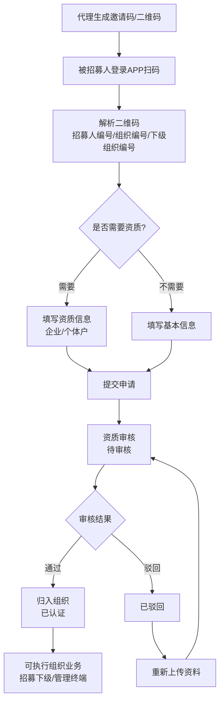
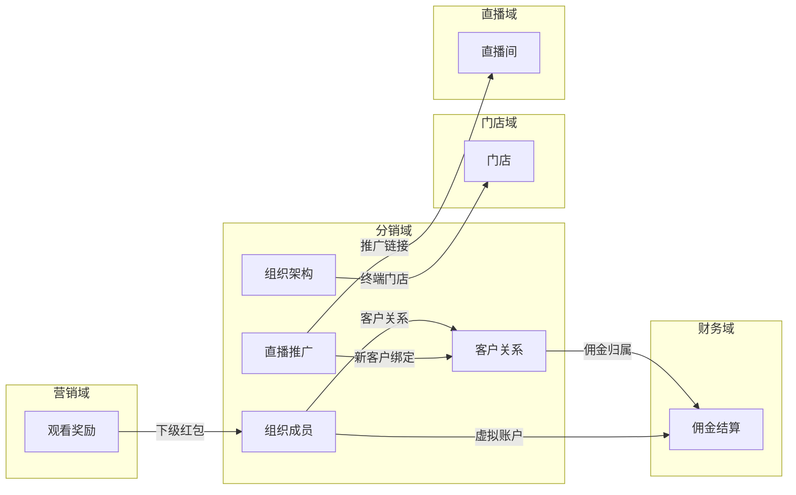
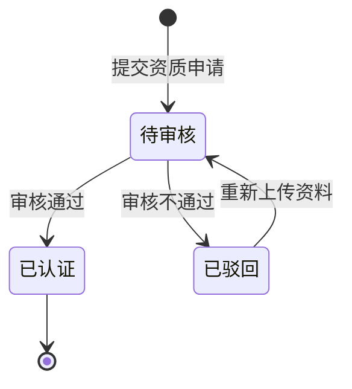
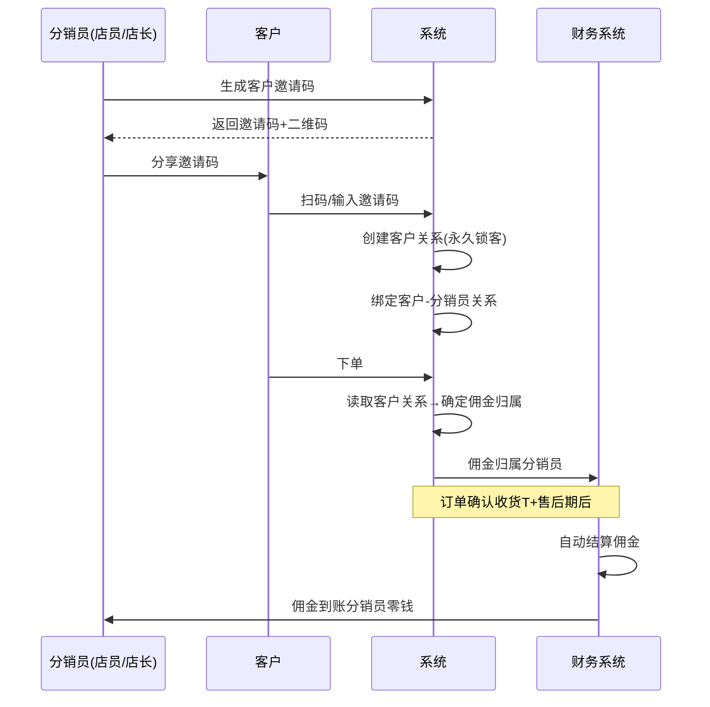
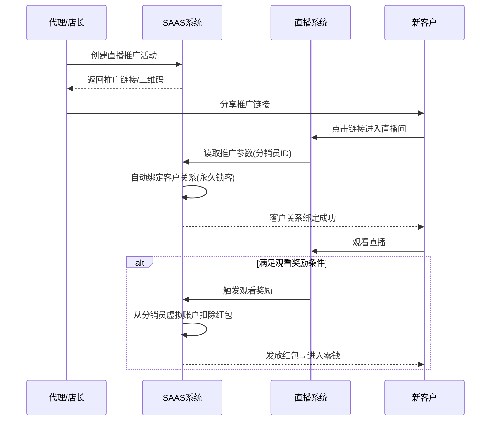

# 分销域 产品需求文档 PRD V1.0.8

> **业务域**：分销域（D07） | **版本**：V1.0.8（整合 V1.0.2~V1.0.8） | **日期**：2026-07-16
> **数据来源**：`分销V1.0.0.md`、Axure原型 V1.0.2~V1.0.8
> **追溯链**：UC-DIS → FN-DIS → PG-DIS → SC-DIS → BG-14 → BO-DIS

---

## 版本历史

| 版本 | 日期 | 变更内容 |
|------|------|----------|
| V1.0.2 | 2026-05-15 | 组织架构、代理/渠道招募、资质审核、终端管理、客户关系（永久锁客）、个人中心多角色切换、我的资产/账单（暂时不做） |
| V1.0.7 | 2026-06-30 | 佣金政策（组织结构/分佣计算/分佣管理/分佣配置/佣金明细）—详见财务域 |
| V1.0.8 | 2026-07-05 | 直播推广、观看奖励（下级设置）、虚拟账户、分享 |
| V1.0.9 | 2026-07-16 | 按PRD规范V1.0.0重新编排 |

---

## 目录

1. 背景与问题陈述
2. 目标与成功度量
3. 范围
4. 与既有模块关系
5. 业务目标映射
6. 用户故事
7. 功能需求列表与用例
8. 业务规则
9. 数据实体
10. 验收标准
11. 指标登记
12. 五类图
13. 外部接口标注
14. 检查清单

---

## 1. 背景与问题陈述

分销域是SaaS平台实现多级渠道分销、代理招募、终端管理、客户关系绑定及推广分佣的核心业务域。该域通过组织架构管理建立"总部→代理→渠道→终端"的多级分销网络，支持代理招募下级代理、渠道招募终端门店，并通过客户关系锁定实现分销员的佣金归属。

### 核心问题

| 问题编号 | 问题 | 严重程度 |
|----------|------|----------|
| DIS-ISSUE-001 | 我的资产/账单暂时不做 | 🟡 中 |
| DIS-ISSUE-002 | 短期锁客/自定义抢客敬请期待 | 🟡 中 |
| DIS-ISSUE-003 | 标签管理继续屏蔽 | 🟢 低 |
| DIS-ISSUE-004 | 客户关系↔佣金"我的资产"暂不做 | 🟡 中 |
| DIS-ISSUE-005 | 组织架构↔直播推广数据缺新增客户数指标 | 🟢 低 |
| DIS-ISSUE-006 | 观看奖励↔客户关系绑定不明确 | 🟡 中 |
| DIS-ISSUE-007 | 招募↔资质审核缺通知机制 | 🟢 低 |
| DIS-ISSUE-008 | 群管理仅代理视角缺总部视角 | 🟢 低 |

---

## 2. 目标与成功度量

| 目标编号 | 目标 | 度量指标 | 目标值 |
|----------|------|----------|--------|
| BO-DIS-01 | 分销网络覆盖率 | 有分销员的门店占比 | ≥ 80% |
| BO-DIS-02 | 客户绑定率 | 已绑定分销员的客户/总客户 | ≥ 70% |
| BO-DIS-03 | 招募转化率 | 审核通过数/申请总数 | ≥ 60% |

---

## 3. 范围

### In-Scope
- 组织架构（组织管理/组织逻辑9条原则/群管理）
- 代理/渠道招募（招募组织成员/招募下级成员/邀请码二维码/添加成员-企业/个体户/不需资质/资质审核）
- 终端管理（待审终端/我的终端/审核结果）
- 客户关系（关系设置-永久锁客/关系查询/公海客户）
- 推广（直播推广列表/我参与的/观看奖励设置-下级/总部/观看奖励数据/设置/分享）
- APP端（个人中心多角色切换/虚拟账户/打款管理-暂时不做/我的资产账单-暂时不做）
- 佣金相关（V1.0.7—财务域覆盖，简要引用）

### Non-Goals
- 我的资产/我的账单（暂时不做）
- 短期锁客/自定义抢客（敬请期待）
- 标签管理（继续屏蔽）
- 打款管理（暂时不做）

---

## 4. 与既有模块关系

### 上下游依赖矩阵

| 方向 | 关联域 | 依赖关系 | 说明 |
|------|--------|----------|------|
| **上游（被依赖）** | 财务域 | 客户关系决定佣金归属 | 永久锁客→佣金归属分销员 |
| **上游（被依赖）** | 直播域 | 直播推广拉新客户 | 推广链接绑定分销员关系 |
| **下游（依赖）** | 门店域 | 门店归属组织架构 | 门店是分销网络终端 |
| **下游（依赖）** | 营销域 | 观看奖励（下级设置） | 下级红包从下级虚拟账户扣除 |
| **下游（依赖）** | 财务域 | 佣金政策/分佣计算 | 详见财务域 |
| **下游（依赖）** | 租户门户域 | 添加成员资质差异 | 企业/个体户/不需资质 |

### 影响域说明

| 变更场景 | 影响域 | 影响说明 |
|----------|--------|----------|
| 客户关系绑定 | 财务域 | 佣金归属确定 |
| 组织成员审核通过 | 门店域 | 可分配到门店 |
| 直播推广 | 直播域、营销域 | 推广链接绑定；观看奖励设置 |
| 终端门店审核 | 门店域 | 门店创建 |

---

## 5. 业务目标映射

| BG | BO | FN | 优先级 |
|----|-----|-----|--------|
| BG-14 分销网络 | BO-DIS-01/02/03 | FN-DIS-001~007 | P0 |

---

## 6. 用户故事

| US编号 | 角色 | 用户故事 |
|--------|------|----------|
| US-DIS-001 | 代理 | 作为代理，我希望招募下级代理和终端门店，以便扩展分销网络 |
| US-DIS-002 | 代理 | 作为代理，我希望管理终端门店审核，以便控制网络质量 |
| US-DIS-003 | 代理/店长 | 作为代理，我希望创建直播推广活动，以便拉新客户 |
| US-DIS-004 | 代理/店长 | 作为代理，我希望查看虚拟账户余额和明细，以便管理资金 |
| US-DIS-005 | 渠道成员 | 作为渠道成员，我希望管理终端门店，以便运营渠道 |
| US-DIS-006 | 客户 | 作为客户，我希望通过分销员邀请码绑定关系，以便享受服务 |

---

## 7. 功能需求列表与用例

### FN-DIS-001 组织管理

| 属性 | 值 |
|------|-----|
| 用例编号 | UC-DIS-001 |
| 名称 | 组织管理 |
| 页面 | PG-DIS-001：组织逻辑梳理说明.html |
| 参与者 | 系统/租户管理员 |
| 优先级 | P0 |
| 关联BG | BG-14 |
| 自动化类型 | 手动 |

**组织层级规则（9条原则）**：

| 原则 | 内容 |
|------|------|
| 原则1 | 总部是读取租户的主体名称，不可编辑，不可删除，固定 |
| 原则2 | 从总部算，最多五级 |
| 原则3 | 从总部算，每组层级，最多只存在一个组织身份==销售终端，且属于末级 |
| 原则4 | 组织身份==代理，他们的业务只有招募代理 |
| 原则5 | 组织身份==渠道，该组织的业务==招募渠道，且渠道类型==直营店、非直营店两种，并且也配置了成员身份【店员】【店长】 |
| 原则6 | 组织身份决定了组织成员的身份 |
| 原则7 | 组织业务类型，决定了成员的业务类型 |
| 原则8 | 组织身份==渠道的成员，依据组织的业务==招募渠道，且渠道类型==直营店、非直营店两种，决定了邀请的门店的类型 |
| 原则9 | 从门店可以追溯→所属组织→直属上级成员→直属上级成员所在组织 |

---

### FN-DIS-002 代理/渠道招募

| 属性 | 值 |
|------|-----|
| 用例编号 | UC-DIS-002 |
| 名称 | 代理/渠道招募 |
| 页面 | PG-DIS-002：招募组织成员.html、招募下级成员.html、添加成员-需要资质-企业.html、添加成员-需要资质-个体户.html、添加成员-不需要资质.html |
| 参与者 | 代理/渠道成员 |
| 优先级 | P0 |
| 关联BG | BG-14 |
| 自动化类型 | 手动 |

**招募流程**：
- **招募代理**：组织业务==招募代理→生成二维码→被招募人扫码→解析二维码→提交表单→归属于下一级组织
- **招募渠道**：组织业务==招募渠道→生成二维码→被招募人扫码→解析二维码→新增对应渠道类型门店+新增对应身份渠道成员

**资质类型**：企业资质（法人信息/主体信息/营业执照）、个体户资质（经营人信息/主体信息/经营场所信息/经营门头最多5张）、不需资质（仅基本信息）。

---

### FN-DIS-003 资质审核

| 属性 | 值 |
|------|-----|
| 用例编号 | UC-DIS-003 |
| 名称 | 资质审核 |
| 页面 | PG-DIS-003：查看_代理人_待审核.html、查看_代理人_已认证.html、查看_代理人_已驳回.html、审核结果-审核中.html、审核结果-已驳回.html |
| 参与者 | 代理/租户管理员 |
| 优先级 | P0 |
| 关联BG | BG-14 |
| 自动化类型 | 手动 |

**审核状态**：待审核→已认证/已驳回。已驳回可重新上传资料→提交申请并加盟。

---

### FN-DIS-004 终端管理

| 属性 | 值 |
|------|-----|
| 用例编号 | UC-DIS-004 |
| 名称 | 终端管理 |
| 页面 | PG-DIS-004：个人中心(组织身份==代理，业务类型==招募终端).html、审核结果-审核中.html、审核结果-已驳回.html |
| 参与者 | 代理 |
| 优先级 | P0 |
| 关联BG | BG-14 |
| 自动化类型 | 手动 |

**终端状态**：待审核/已通过/未通过/已驳回/已认证。操作：切换（切换管理门店）、添加门店。

---

### FN-DIS-005 客户关系

| 属性 | 值 |
|------|-----|
| 用例编号 | UC-DIS-005 |
| 名称 | 客户关系管理 |
| 页面 | PG-DIS-005：客户关系-关系设置.html、客户关系-关系查询.html、公海客户-无直接上级.html |
| 参与者 | 租户管理员 |
| 优先级 | P0 |
| 关联BG | BG-14 |
| 自动化类型 | 手动 |

**绑客规则**：

| 规则类型 | 状态 | 说明 |
|---------|------|------|
| 永久锁客 | ✅ 已实现 | 客户点击/扫码/输入邀请码并完成注册绑定；永久绑定后客户下单分销员佣金规则一直有效 |
| 短期锁客 | ❌ 敬请期待 | 绑定后客户下单分销员仅在"有效期"内有佣金 |
| 自定义抢客 | ❌ 敬请期待 | 客户关系有效期内，允许分销员间互相抢客 |

**公海客户**：无直接上级的客户，可手动设置客户归属。

---

### FN-DIS-006 直播推广

| 属性 | 值 |
|------|-----|
| 用例编号 | UC-DIS-006 |
| 名称 | 直播推广 |
| 页面 | PG-DIS-006：直播推广列表.html、我参与的直播推广.html、观看奖励设置--下级设置.html、观看奖励设置--总部统一设置.html、观看奖励数据.html、设置.html、分享.html |
| 参与者 | 代理/店长 |
| 优先级 | P1 |
| 关联BG | BG-14 |
| 自动化类型 | 手动 |

**业务规则**：直播推广是代理/店长通过分享直播链接邀请新客户观看直播的推广方式。推广链接绑定分销员关系，新客户通过推广链接进入直播间后自动绑定客户关系。

---

### FN-DIS-007 APP端多角色切换

| 属性 | 值 |
|------|-----|
| 用例编号 | UC-DIS-007 |
| 名称 | APP端多角色切换 |
| 页面 | PG-DIS-007：个人中心整体说明.html |
| 参与者 | 所有角色 |
| 优先级 | P0 |
| 关联BG | BG-14 |
| 自动化类型 | 手动 |

**多角色切换逻辑**：
1. 用户可跨租户，普通用户的订单/售后/营销券/足迹/收藏是来自多租户的数据
2. 如果该用户存在身份（如店长、代理），点击该身份角色可以切换
3. 切换后可看到身份所属的门店、组织，选择后会读取被选择对象的相关数据
4. 管理入口仅在角色审核通过后显示
5. 买家中心下面的订单/售后/足迹/优惠券都是跨租户的数据

---

## 8. 业务规则

### BR-DIS-001 组织层级9条原则
（见FN-DIS-001）

### BR-DIS-002 招募代理流程规则
- 组织业务==招募代理→生成二维码→被招募人扫码→解析二维码（招募人编号/招募人所在组织编号/被招募人所属下级组织编号）→提交表单→归属于下一级组织

### BR-DIS-003 招募渠道流程规则
- 组织业务==招募渠道→生成二维码→被招募人扫码→解析二维码（含渠道类型/渠道成员身份）→新增对应渠道类型门店+新增对应身份渠道成员

### BR-DIS-004 永久锁客规则
- 客户点击/扫码/输入邀请码并完成注册绑定
- 永久绑定后客户下单分销员佣金规则一直有效

### BR-DIS-005 同租户不跨门店规则
- 客户在同一个租户下不能跨门店存在
- 分享归属只能属于一个邀请店员上级，否则无法分账

### BR-DIS-006 公海客户规则
- 公海客户为无直接上级（无绑定分销员）的客户
- 可手动设置客户归属，将客户分配给指定分销员

### BR-DIS-007 直播推广客户绑定规则
- 推广链接绑定分销员关系
- 新客户通过推广链接进入直播间后自动绑定客户关系

### BR-DIS-008 资质审核规则
- 待审核→已认证/已驳回
- 已驳回可重新上传资料→提交申请并加盟

### BR-DIS-009 直营店/非直营店成员身份规则
- 直营店、非直营店的成员身份只有店长（一级）和店员（二级），不存在邀约关系

---

## 9. 数据实体

### ENT-DIS-001 组织(Organization)

| 字段 | 类型 | 说明 |
|------|------|------|
| org_id | String | 组织ID |
| org_code | String | 组织编号 |
| org_name | String | 组织名称 |
| org_identity | Enum | 代理/终端 |
| business_type | Enum | 招募代理/招募渠道 |
| channel_type | Enum | 直营店/非直营店（渠道时） |
| parent_org_id | String | 上级组织ID |
| level | Integer | 层级（最多五级） |

### ENT-DIS-002 组织成员(Member)

| 字段 | 类型 | 说明 |
|------|------|------|
| member_id | String | 成员ID |
| org_id | String | 所在组织ID |
| org_name | String | 所在组织名称 |
| org_identity | String | 所在组织身份 |
| org_level | Integer | 所在组织层级 |
| member_identity | String | 成员身份（店长/店员/代理） |
| qualification_status | Enum | 待审核/已认证/已驳回 |

### ENT-DIS-003 客户关系(CustomerRelation)

| 字段 | 类型 | 说明 |
|------|------|------|
| relation_id | String | 关系ID |
| customer_id | String | 客户ID |
| customer_name | String | 客户名称 |
| customer_phone | String | 客户手机号 |
| inviter_id | String | 邀请人ID（分销员） |
| inviter_name | String | 邀请人姓名 |
| inviter_phone | String | 邀请人电话 |
| inviter_identity | Enum | 店长/店员 |
| inviter_org | String | 邀请人所在组织 |
| store_name | String | 门店名称 |
| bind_type | Enum | 永久锁客 |
| bind_time | Datetime | 初始绑定时间 |
| change_time | Datetime | 更换绑定时间 |

### 实体关系

```
组织(Organization) 1──N 组织成员(Member)
组织(Organization) 1──N 下级组织(Organization)
客户关系(CustomerRelation) N──1 组织成员(Member)
门店(Store) N──1 组织(Organization)
```

---

## 10. 验收标准

| SC编号 | 场景 | 预期结果 |
|--------|------|----------|
| SC-DIS-001 | 代理招募全流程 | 代理生成邀请码→被招募人扫码→填资质→审核通过→归入组织 |
| SC-DIS-002 | 客户永久锁客 | 分销员分享邀请码→客户扫码绑定→客户下单→分销员得佣金 |
| SC-DIS-003 | 多角色切换 | 用户切换为店员→查看门店数据→切换为代理→查看终端管理 |
| SC-DIS-004 | 直播推广拉新 | 代理创建推广→分享链接→新客户进入直播间→自动绑定客户关系 |
| SC-DIS-005 | 公海客户分配 | 公海客户→设置归属→分配给指定分销员 |

| FN | Given | When | Then |
|----|-------|------|------|
| FN-DIS-001 | 组织层级已达五级 | 尝试添加第六级 | 不允许 |
| FN-DIS-005 | 客户已绑定分销员 | 客户下单 | 佣金归属绑定分销员 |
| FN-DIS-005 | 客户在A租户已绑定门店 | 尝试在A租户绑定另一门店 | 不允许（同租户不跨门店） |
| FN-DIS-006 | 新客户通过推广链接进入直播间 | 自动绑定 | 客户关系绑定推广分销员 |

---

## 11. 指标登记

| 指标 | 说明 |
|------|------|
| MET-DIS-001 | 分销网络覆盖率 | 有分销员的门店/总门店 |
| MET-DIS-002 | 客户绑定率 | 已绑定分销员的客户/总客户 |
| MET-DIS-003 | 招募转化率 | 审核通过数/申请总数 |

---

## 12. 五类图

### 12.1 业务流程图 — 代理招募全流程



### 12.2 信息流转图 — 分销域跨模块



### 12.3 状态机 — 资质审核状态机



**状态过渡操作表**：

| 当前状态 | 触发操作 | 目标状态 | 操作者 | 前置约束 | 后置动作 |
|----------|----------|----------|--------|----------|----------|
| — | 提交资质申请 | 待审核 | 被招募人 | 填写完整资质 | 通知审核人 |
| 待审核 | 审核通过 | 已认证 | 代理/租户 | — | 归入组织，可执行业务 |
| 待审核 | 审核不通过 | 已驳回 | 代理/租户 | 填写驳回理由 | 通知被招募人 |
| 已驳回 | 重新上传资料 | 待审核 | 被招募人 | — | 重新审核 |

### 12.4 业务时序图 — 客户永久锁客与佣金归属



### 12.5 三方接口时序图 — 直播推广拉新与客户绑定



---

## 13. 外部接口标注

| 接口编号 | 接口名称 | 方向 | 对端系统 | 说明 |
|----------|----------|------|----------|------|
| API-DIS-001 | 邀请码生成 | 单向(出) | — | 系统内部生成6位随机数 |
| API-DIS-002 | 二维码生成 | 单向(出) | — | 系统内部生成二维码图片 |

---

## 14. 检查清单

| # | 检查项 | 状态 |
|---|--------|------|
| 1-20 | 全部检查项 | ✅ |

---

> **关联文档**：源MD `分销V1.0.0.md` | 上游：财务域/直播域 | 下游：门店域/营销域/财务域/租户门户域 | 总索引 `00-SAAS-PRD-总索引.md`
