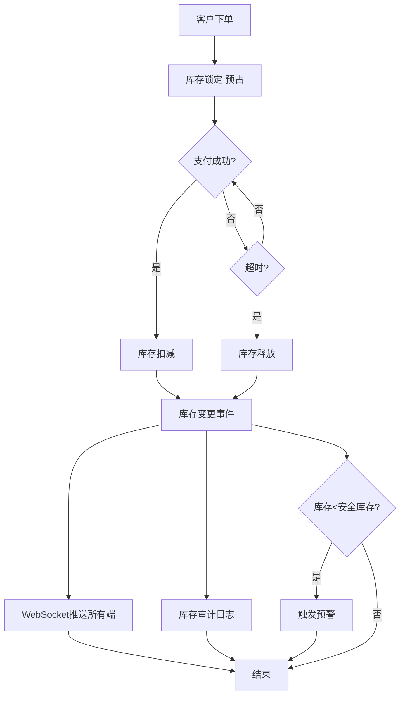
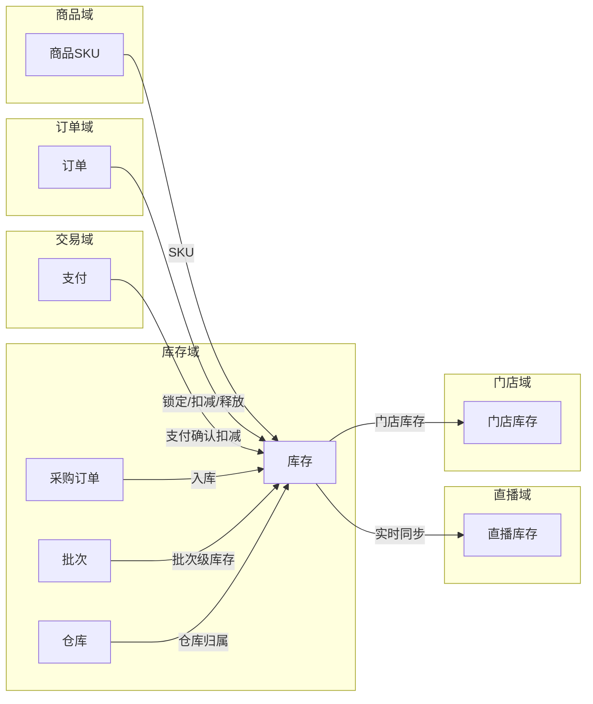
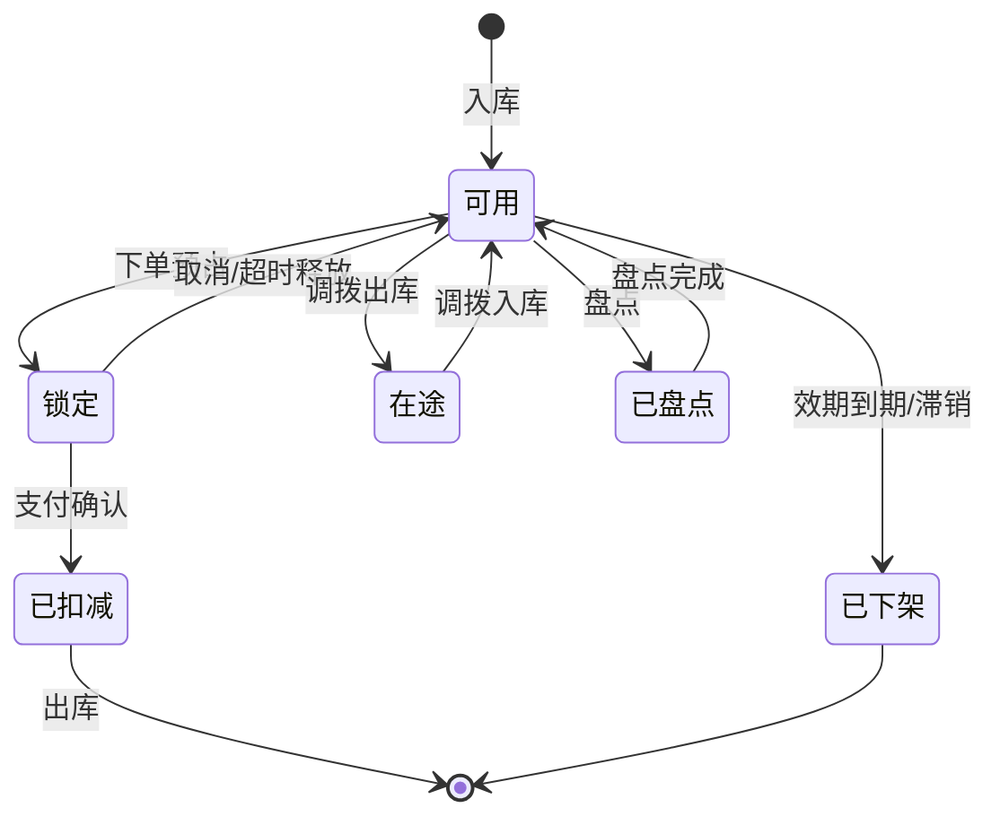
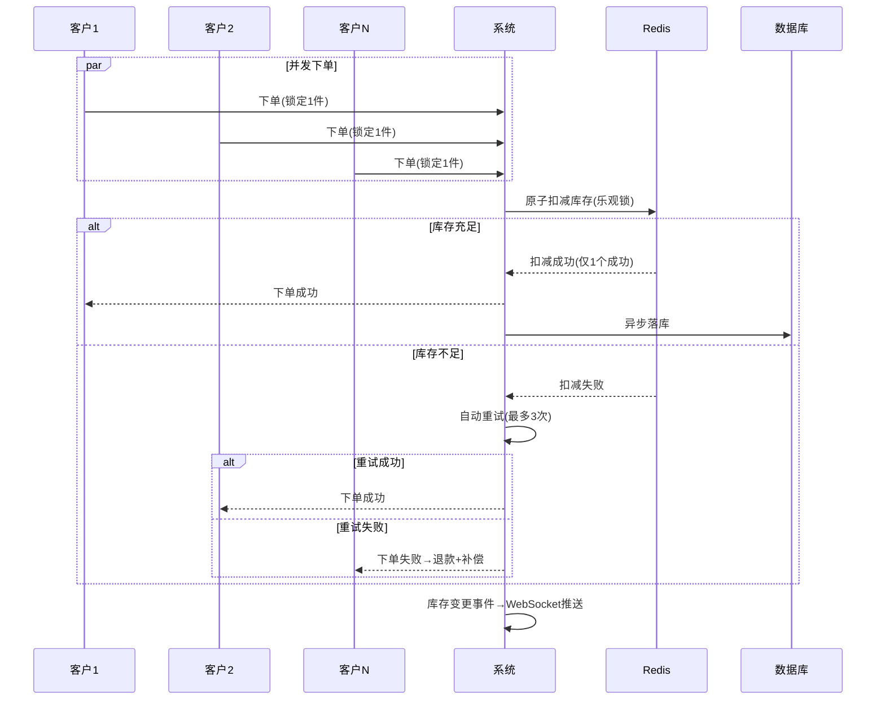
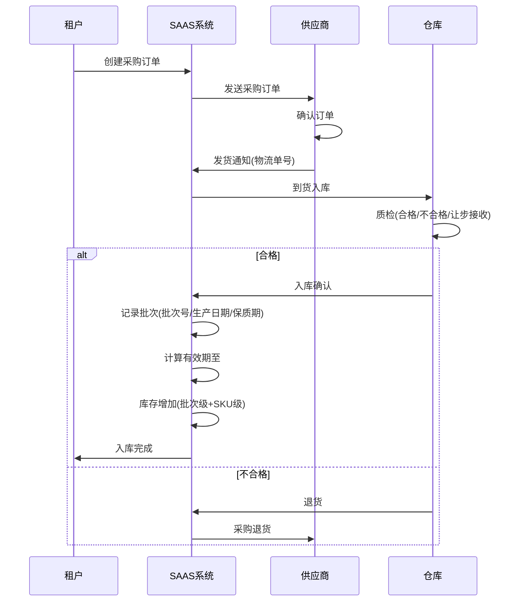

# 库存域 产品需求文档 PRD V1.0.0

> **业务域**：库存域（D05） | **版本**：V1.0.0 | **日期**：2026-07-16
> **数据来源**：`库存V1.0.0.md`、Axure原型 V1.0.2~V1.0.9
> **追溯链**：UC-INV → FN-INV → PG-INV → SC-INV → BG-02 → BO-02

---

## 版本历史

| 版本 | 日期 | 变更内容 |
|------|------|----------|
| V1.0.2~V1.0.9 | 2026-05-15~2026-07-12 | 仅商品总库存单一维度、门店商品独立定价无库存、直播补库存手动操作、供应商管理基础、现货采购三种模式（流程不完整） |
| V1.0.9 | 2026-07-16 | 按PRD规范V1.0.0重新编排；以待建功能为主（门店库存/多仓库/批次效期/实时同步/采购全生命周期/供应商协同/进销存报表） |

---

## 1. 背景与问题陈述

库存域是SAAS平台最薄弱的业务域之一。当前系统仅有「商品总库存」一个维度的库存概念，无法支撑**多门店、多仓库、多销售渠道**（实体店/直播/小程序/APP）的实时库存管理需求。对于既做实体零售又做直播电商的租户，库存不准=超卖=客户投诉+退款，这是直接影响GMV和客户信任的底线问题。

### 核心问题

| 问题编号 | 问题 | 严重程度 | 影响 |
|----------|------|----------|------|
| INV-ISSUE-001 | 门店级库存管理缺失 | 🔴 高 | 多门店租户无法独立管理各门店库存，线上线下不一致 |
| INV-ISSUE-002 | 多仓库库存管理缺失 | 🔴 高 | 无总仓/门店仓/直播仓体系，无调拨/盘点/预警 |
| INV-ISSUE-003 | 采购全生命周期管理缺失 | 🔴 高 | 缺采购计划/订单/入库质检/退货/对账 |
| INV-ISSUE-004 | 批次/效期管理缺失 | 🔴 高 | 大健康/互联网医院强需求，过期商品可能被售出 |
| INV-ISSUE-005 | 供应商协同平台缺失 | 🟡 中 | 无供应商门户/评级/发货通知/VMI |
| INV-ISSUE-006 | 多端库存实时同步缺失 | 🔴 高 | 无分布式锁，直播并发场景超卖风险极高 |
| INV-ISSUE-007 | 进销存报表缺失 | 🟡 中 | 无库存周转/库龄/缺货损失分析 |

---

## 2. 目标与成功度量

| 目标编号 | 目标 | 度量指标 | 目标值 |
|----------|------|----------|--------|
| BO-INV-01 | 超卖率 | 超卖订单数/总订单数 | < 0.01% |
| BO-INV-02 | 库存扣减并发 | QPS | ≥ 10,000 |
| BO-INV-03 | 库存服务可用性 | SLA | ≥ 99.99% |
| BO-INV-04 | 对账一致性 | 库存账务与财务对账 | 100% |

---

## 3. 范围

### In-Scope（均为待建功能）
- 门店级库存管理（P0）：门店独立库存+门店间调拨+预警+扣减联动+盘点
- 多仓库库存管理（P0）：总仓/门店仓/直播仓/电商仓+调拨+盘点+预警+扣减时序
- 采购全生命周期（P1）：采购计划→订单→入库质检→退货→对账→代发结算
- 批次效期管理（P0）：批次管理+效期管理+批次追溯
- 供应商协同平台（P2）：供应商门户+评级+发货通知+VMI+报价比价+合同管理
- 库存实时同步（P0）：分布式锁+多端同步+并发竞争+审计日志
- 进销存报表（P1）：库存分析+采购分析+缺货分析+滞销分析+进销存平衡表

### Non-Goals
- 智能补货（基于AI销售预测自动生成采购建议）（远期）

---

## 4. 与既有模块关系

### 上下游依赖矩阵

| 方向 | 关联域 | 依赖关系 | 说明 |
|------|--------|----------|------|
| **上游（被依赖）** | 订单域 | 支付确认后扣减库存 | 需统一扣减时序和退款回滚 |
| **上游（被依赖）** | 直播域 | 直播间显示实时库存 | 直播专属库存池与实时同步 |
| **下游（依赖）** | 商品域 | 库存从属于商品SKU | 商品创建时初始化库存 |
| **下游（依赖）** | 交易域 | 支付确认后扣减库存 | 需统一扣减时序和退款回滚 |
| **下游（依赖）** | 门店域 | 门店商品关联门店库存 | 门店独立库存管理 |

### 影响域说明

| 变更场景 | 影响域 | 影响说明 |
|----------|--------|----------|
| 库存扣减 | 订单域、交易域 | 下单锁定→支付扣减→取消/超时释放 |
| 库存不足 | 直播域、APP域 | 商品显示售罄 |
| 库存预警 | 门店域、运营域 | 低库存告警；滞销预警 |
| 采购入库 | 商品域 | 商品库存增加 |
| 批次到期 | 商品域、订单域 | 商品自动下架；不可下单 |

---

## 5. 业务目标映射

| BG | BO | FN | 优先级 |
|----|-----|-----|--------|
| BG-02 库存准确 | BO-INV-01 | FN-INV-006 库存实时同步 | P0 |
| BG-02 | BO-INV-02 | FN-INV-006 库存实时同步 | P0 |
| BG-02 | BO-INV-03 | FN-INV-006 库存实时同步 | P0 |
| BG-02 | BO-INV-04 | FN-INV-007 进销存报表 | P1 |

---

## 6. 用户故事

| US编号 | 角色 | 用户故事 |
|--------|------|----------|
| US-INV-001 | 租户管理员 | 作为租户，我希望管理多仓库库存（总仓/门店仓/直播仓），以便精准管理 |
| US-INV-002 | 店长 | 作为店长，我希望管理门店独立库存和发起调拨，以便门店运营 |
| US-INV-003 | 租户管理员 | 作为租户，我希望管理批次效期，以便合规追溯 |
| US-INV-004 | 租户管理员 | 作为租户，我希望管理采购全生命周期，以便供应链闭环 |
| US-INV-005 | 直播运营 | 作为运营，我希望直播专属库存实时同步，以便避免超卖 |
| US-INV-006 | 供应商 | 作为供应商，我希望通过供应商门户查看订单和发货，以便协同 |

---

## 7. 功能需求列表与用例

### FN-INV-001 门店级库存管理（待建-P0）

| 属性 | 值 |
|------|-----|
| 用例编号 | UC-INV-001 |
| 名称 | 门店级库存管理 |
| 参与者 | 租户管理员/店长 |
| 优先级 | P0 |
| 关联BG | BG-02 |
| 自动化类型 | 手动+事件驱动 |

**功能**：门店级独立库存、门店间调拨（申请→确认→转移）、库存预警（<安全库存）、扣减联动（总库存-门店库存-直播库存三层）、门店盘点（移动端扫码/手工+差异报表）。

---

### FN-INV-002 多仓库库存管理（待建-P0）

**仓库类型**：总仓（中央仓库）、门店仓、直播仓（虚拟）、电商仓。

**功能**：库存调拨（申请→审批→出库→入库→确认，在途库存独立统计）、库存盘点（明盘/暗盘/移动端）、库存预警（低库存绝对值+可售天数/滞销库龄/过期效期）、库存扣减时序（下单锁定→支付扣减→取消/超时释放，明确各渠道扣减优先级）。

---

### FN-INV-003 采购全生命周期（待建-P1）

**流程**：采购计划（基于预警+销售预测自动生成建议）→采购订单（创建→审批→发送供应商→确认→部分收货→完成）→入库质检（合格/不合格/让步接收）→采购退货（申请→审核→出库→退款/换货）→供应商对账（自动生成账单+线上确认）→代发结算。

---

### FN-INV-004 批次效期管理（待建-P0）

**批次管理**：入库记录批次号→批次级库存独立→出库选择批次（先进先出/近效期先出）。
**效期管理**：生产日期+保质期自动计算有效期→到期前N天预警→到期自动下架→商品详情页展示效期。
**批次追溯**：正向（批次→采购入库→出库→客户）+逆向（客户/订单→出库批次→采购入库→供应商）→产品召回快速定位。

---

### FN-INV-005 供应商协同平台（待建-P2）

**功能**：供应商门户（查看订单/确认/发货/对账）、供应商评级（S/A/B/C基于交货准时率/质量合格率/价格）、发货通知（自动回传物流单号）、VMI库存协同（供应商查看租户库存主动补货）、报价比价、合同管理。

---

### FN-INV-006 库存实时同步（待建-P0）

**分布式库存锁**：乐观锁+重试机制；高并发Redis缓存库存+异步落库。
**多端实时同步**：任一渠道库存变更→WebSocket实时推送→库存变更事件总线。
**并发竞争处理**：库存扣减原子化→扣减失败重试(最多3次)→超卖自动退款+补偿。
**库存审计日志**：所有变更记录(谁/何时/什么操作/变更前/变更后/来源)，保留≥3年。

---

### FN-INV-007 进销存报表（待建-P1）

**报表**：库存分析（周转率/库龄分布/呆滞占比）、采购分析（成本趋势/交货准时率/到货周期）、缺货分析（缺货SKU/损失估算）、滞销分析（排行/清仓建议）、进销存平衡表（期初+入库-出库+调拨净额=期末）。

---

## 8. 业务规则

### BR-INV-001 库存扣减时序规则
- 下单锁定（预占）→支付确认扣减→取消/超时释放
- 各渠道扣减优先级：线上单扣电商仓，门店自提扣门店仓

### BR-INV-002 门店库存规则
- 门店库存是指该商品所在门店的SKU库存总数
- 门店库存总和不能超过总库存数量

### BR-INV-003 多仓库调拨规则
- 调拨流程：申请→审批→出库→入库→确认
- 支持总仓→门店仓、门店仓↔门店仓
- 在途库存独立统计

### BR-INV-004 批次出库规则
- 先进先出（FIFO）或近效期先出（FEFO）

### BR-INV-005 效期管理规则
- 生产日期+保质期自动计算有效期至
- 到期前N天预警
- 到期后自动下架

### BR-INV-006 分布式锁规则
- 库存扣减使用乐观锁+重试机制
- 高并发使用Redis缓存库存+异步落库
- 扣减失败自动重试（最多3次）
- 超卖后自动退款+补偿通知

### BR-INV-007 库存审计规则
- 所有库存变更记录完整审计日志
- 日志保留≥3年
- 日终自动对账，库存账务与财务100%一致

---

## 9. 数据实体

### ENT-INV-001 仓库(Warehouse)

| 字段 | 类型 | 说明 |
|------|------|------|
| warehouse_id | String | 仓库ID |
| tenant_id | String | 租户ID |
| warehouse_type | Enum | 总仓/门店仓/直播仓/电商仓 |
| store_id | String | 门店ID（门店仓时） |
| name | String | 仓库名称 |
| status | Enum | 启用/禁用 |

### ENT-INV-002 库存(Inventory)

| 字段 | 类型 | 说明 |
|------|------|------|
| inventory_id | String | 库存ID |
| sku_id | String | SKU ID |
| warehouse_id | String | 仓库ID |
| total_quantity | Integer | 总库存 |
| available_quantity | Integer | 可用库存 |
| locked_quantity | Integer | 锁定库存（预占） |
| in_transit_quantity | Integer | 在途库存 |
| safety_stock | Integer | 安全库存 |

### ENT-INV-003 批次(Batch)

| 字段 | 类型 | 说明 |
|------|------|------|
| batch_id | String | 批次ID |
| sku_id | String | SKU ID |
| batch_no | String | 批次号 |
| production_date | Date | 生产日期 |
| shelf_life | Integer | 保质期(天) |
| expiry_date | Date | 有效期至 |
| quantity | Integer | 批次库存 |
| purchase_order_id | String | 采购订单ID |

### ENT-INV-004 库存变更日志(InventoryAuditLog)

| 字段 | 类型 | 说明 |
|------|------|------|
| log_id | String | 日志ID |
| sku_id | String | SKU ID |
| warehouse_id | String | 仓库ID |
| operation_type | Enum | 入库/出库/锁定/释放/调拨/盘点 |
| quantity_before | Integer | 变更前数量 |
| quantity_after | Integer | 变更后数量 |
| operator | String | 操作人 |
| operation_time | Datetime | 操作时间 |
| source | String | 变更来源（订单/采购/调拨/盘点） |

### ENT-INV-005 采购订单(PurchaseOrder)

| 字段 | 类型 | 说明 |
|------|------|------|
| po_id | String | 采购订单ID |
| supplier_id | String | 供应商ID |
| status | Enum | 草稿/待审/已审/已发/部分收货/完成 |
| items | List | 采购明细 |
| total_amount | Decimal | 总金额 |
| create_time | Datetime | 创建时间 |

---

## 10. 验收标准

| SC编号 | 场景 | 预期结果 |
|--------|------|----------|
| SC-INV-001 | 高并发库存扣减 | 1000并发下单同一商品→无超卖→失败自动重试→超卖退款补偿 |
| SC-INV-002 | 多端库存同步 | APP下单扣减→小程序/直播间实时更新库存 |
| SC-INV-003 | 批次效期追溯 | 客户订单→出库批次→采购入库→供应商，全链路可追溯 |
| SC-INV-004 | 门店间调拨 | A门店发起→B门店确认→出库→在途→入库→确认 |
| SC-INV-005 | 效期到期下架 | 商品效期到期→自动下架→APP端不可见不可下单 |

| FN | Given | When | Then |
|----|-------|------|------|
| FN-INV-006 | 1000并发下单同一商品 | 库存仅剩1件 | 仅1个成功，其余失败重试或退款 |
| FN-INV-006 | 任一渠道库存变更 | WebSocket推送 | 所有关联端实时更新 |
| FN-INV-004 | 商品效期到期 | 系统检查 | 自动下架 |
| FN-INV-002 | 门店库存<安全库存 | 系统检查 | 触发预警 |
| FN-INV-007 | 日终对账 | 库存账务vs财务 | 100%一致 |

---

## 11. 指标登记

| 指标 | 说明 | 目标值 |
|------|------|--------|
| MET-INV-001 | 超卖率 | < 0.01% |
| MET-INV-002 | 库存扣减QPS | ≥ 10,000 |
| MET-INV-003 | 库存服务可用性 | ≥ 99.99% |
| MET-INV-004 | 对账一致性 | 100% |
| MET-INV-005 | 库存扣减P99延迟 | < 50ms |

---

## 12. 五类图

### 12.1 业务流程图 — 库存扣减与同步全流程

### 12.2 信息流转图 — 库存域跨模块

### 12.3 状态机 — 库存状态机

**状态过渡操作表**：

| 当前状态 | 触发操作 | 目标状态 | 操作者 | 前置约束 | 后置动作 |
|----------|----------|----------|--------|----------|----------|
| — | 入库 | 可用 | 系统/采购 | 采购入库/质检通过 | 库存增加 |
| 可用 | 下单预占 | 锁定 | 系统 | 库存≥锁定量 | 可用库存减少 |
| 锁定 | 取消/超时 | 可用 | 系统 | — | 可用库存恢复 |
| 锁定 | 支付确认 | 已扣减 | 系统 | — | 总库存减少 |
| 已扣减 | 出库 | [*] | 系统 | 发货 | — |
| 可用 | 调拨出库 | 在途 | 租户/店长 | 调拨审批通过 | 在途库存增加 |
| 在途 | 调拨入库 | 可用 | 系统 | 目标仓库确认 | 在途减少，可用增加 |
| 可用 | 效期到期 | 已下架 | 系统 | 到期日 | APP端不可见 |

### 12.4 业务时序图 — 高并发库存扣减流程

### 12.5 三方接口时序图 — 采购入库与批次管理

---

## 13. 外部接口标注

| 接口编号 | 接口名称 | 方向 | 对端系统 | 说明 |
|----------|----------|------|----------|------|
| API-INV-001 | 供应商门户 | 双向 | 供应商系统 | 订单查看/确认/发货/对账 |
| API-INV-002 | WebSocket库存推送 | 单向(出) | 所有客户端 | 库存变更实时推送 |

---

## 14. 检查清单

| # | 检查项 | 状态 |
|---|--------|------|
| 1-20 | 全部检查项 | ✅ |

---

> **关联文档**：源MD `库存V1.0.0.md` | 上游：订单域/直播域 | 下游：商品域/交易域/门店域 | 总索引 `00-SAAS-PRD-总索引.md`
