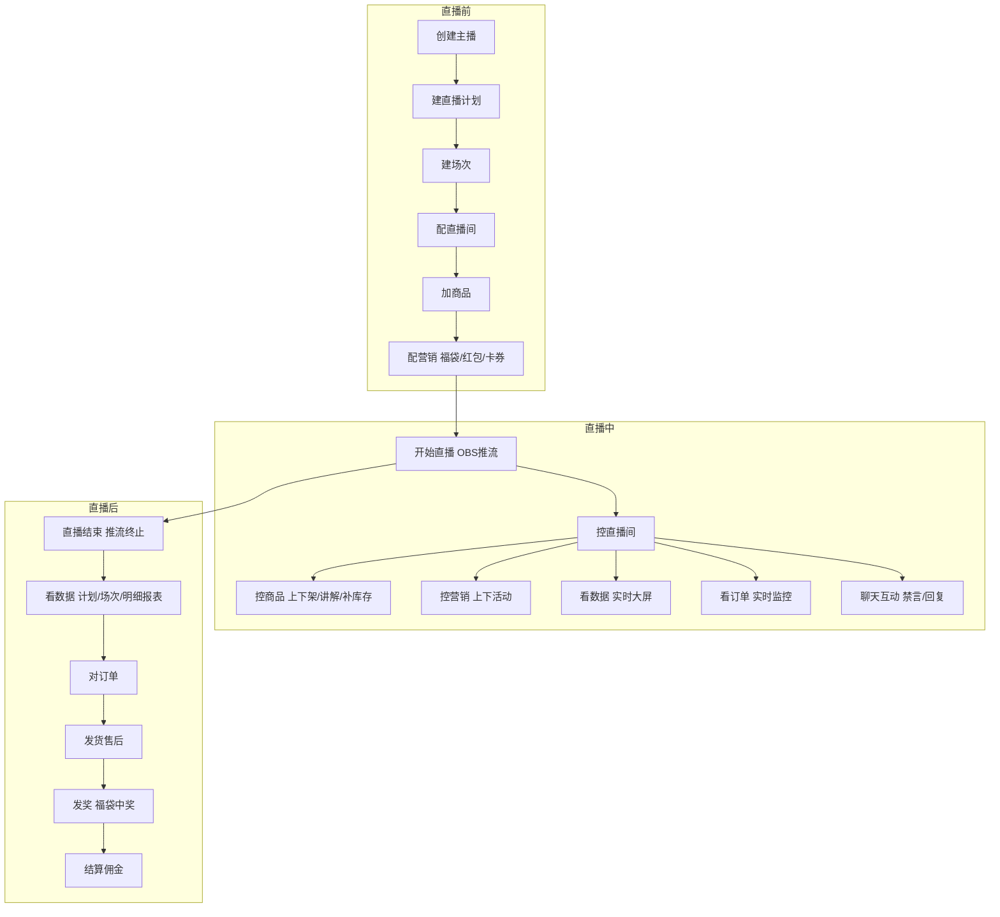
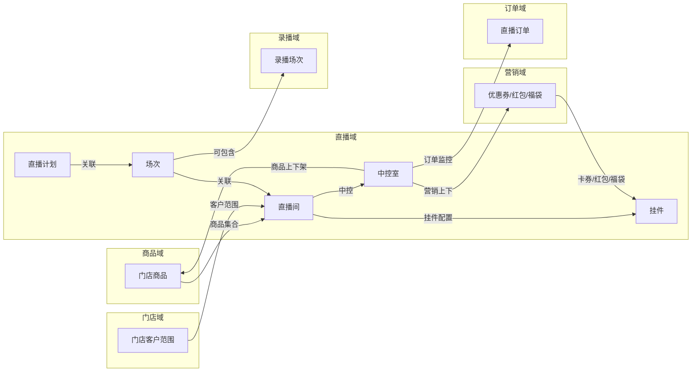
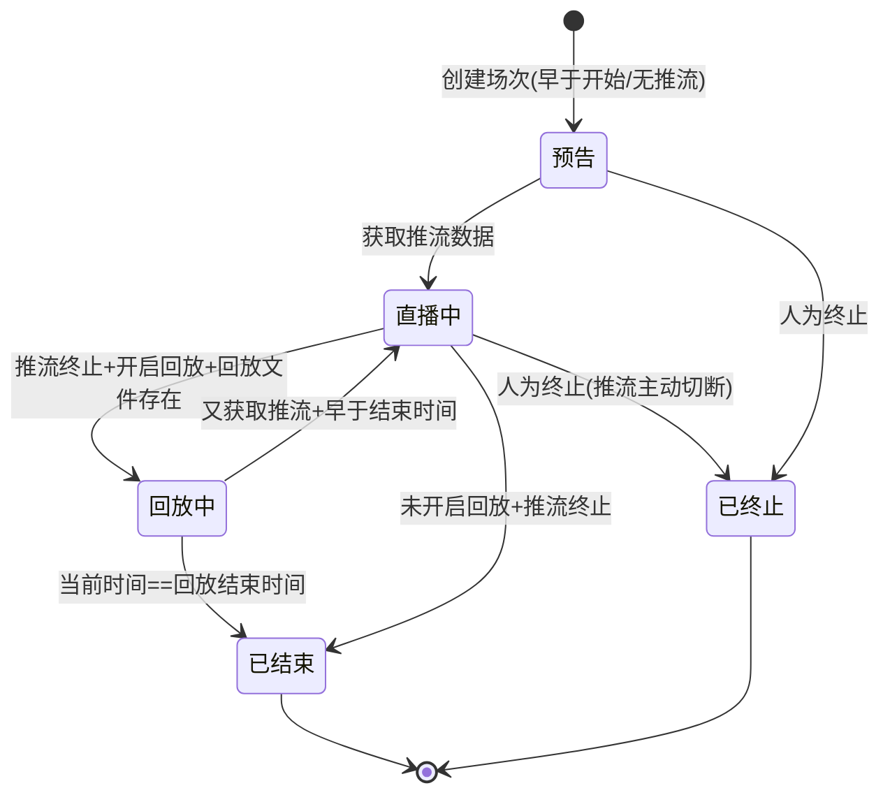
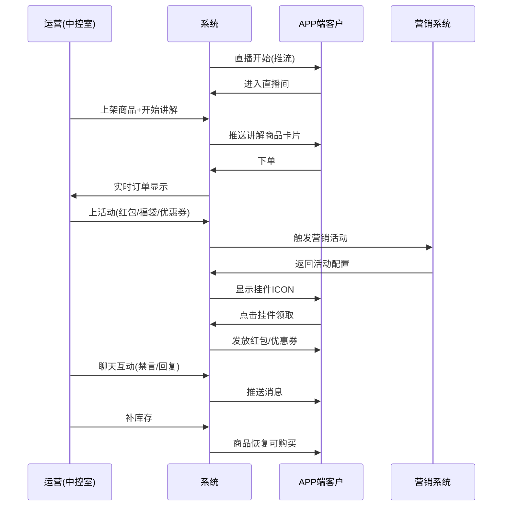
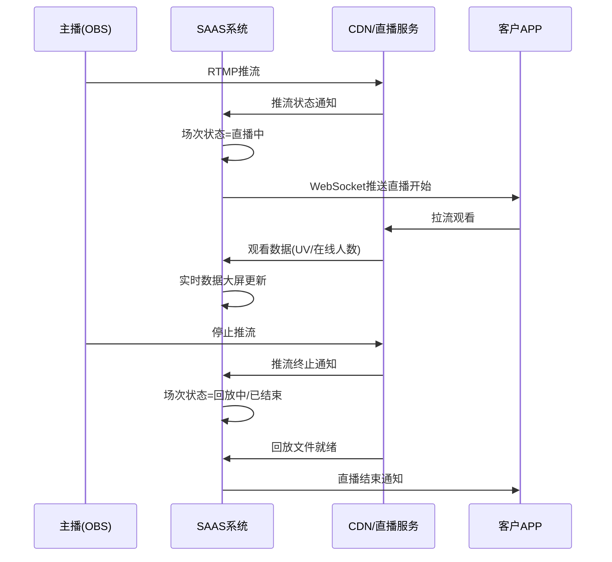

# 直播域 产品需求文档 PRD V1.0.3

> **业务域**：直播域（D09） | **版本**：V1.0.3 | **日期**：2026-07-16
> **数据来源**：`直播V1.0.0.md`、Axure原型 V1.0.2~V1.0.3
> **追溯链**：UC-LIV → FN-LIV → PG-LIV → SC-LIV → BG-11 → BO-11

---

## 版本历史

| 版本 | 日期 | 变更内容 |
|------|------|----------|
| V1.0.2 | 2026-05-15 | 主播管理、直播计划、场次管理、直播间配置、中控室（商品/订单/营销/课程/聊天）、直播商品/课程、APP端直播广场/直播间/挂件/红包/福袋/优惠券、直播数据大屏/报表、分享（口令方案）、禁言/被踢 |
| V1.0.3 | 2026-05-25 | 直播间客户范围更新、中控室商品管理更新、APP端直播数据看板（主播/店长视角） |
| V1.0.9 | 2026-07-16 | 按PRD规范V1.0.0重新编排 |

---

## 目录

1. 背景与问题陈述
2. 目标与成功度量
3. 范围
4. 与既有模块关系
5. 业务目标映射
6. 用户故事
7. 功能需求列表与用例
8. 业务规则
9. 数据实体
10. 验收标准
11. 指标登记
12. 五类图
13. 外部接口标注
14. 检查清单

---

## 1. 背景与问题陈述

直播域是SAAS平台的核心内容与交易域之一，提供完整的直播电商能力。业务范围包括直播计划管理、场次管理、直播间配置、中控室运营、主播资质管理、直播间互动（红包/福袋/优惠券/卡券）、数据指标体系和APP端直播体验。

系统采用推拉流模式进行直播（非自研直播端），通过OBS等第三方工具推流，平台负责直播计划编排、场次调度、互动营销、中控运营和数据度量。

### 核心问题

| 问题编号 | 问题 | 严重程度 |
|----------|------|----------|
| LIV-ISSUE-001 | "直播流量"增值服务标记为暂时不做 | 🟡 中 |
| LIV-ISSUE-002 | 计划指标中"商品指标"Tab存在但内容为空 | 🟢 低 |
| LIV-ISSUE-003 | 缺少直播佣金结算流程 | 🟡 中 |
| LIV-ISSUE-004 | 回放功能限制多（不支持IM/点赞/分享/挂件ICON） | 🟢 低 |
| LIV-ISSUE-005 | "积分"在直播间标记为暂时不做 | 🟢 低 |
| LIV-ISSUE-006 | 场次超时推流是否自动终止未明确 | 🟡 中 |
| LIV-ISSUE-007 | 回放保留时间未明确 | 🟢 低 |

---

## 2. 目标与成功度量

| 目标编号 | 目标 | 度量指标 | 目标值 |
|----------|------|----------|--------|
| BO-LIV-01 | 直播转化 | 计划平均转化率 | ≥ 5% |
| BO-LIV-02 | 直播GMV | 计划总GMV | 按计划目标 |
| BO-LIV-03 | 互动率 | 计划平均互动率 | ≥ 15% |
| BO-LIV-04 | 中控室实时性 | 订单/消息延迟 | < 3秒 |

---

## 3. 范围

### In-Scope
- 主播管理（列表/添加/编辑/资质审核）
- 直播计划（创建/编辑/查看/指标设置）
- 场次管理（列表/状态机/终止）
- 直播间配置（通用配置/福袋/红包/卡券/客户范围/推流地址/复制/启用禁用）
- 中控室（商品/订单/营销/课程/聊天互动）
- 直播商品/直播课程管理
- APP端直播广场（直播中/预告/记录）
- APP端直播间（直播中/预告中/已结束/挂件/弹幕/分享/购物车）
- APP端红包/福袋/优惠券交互
- 挂件逻辑梳理
- 直播数据大屏/报表（计划/场次/明细/会员同比环比）
- 直播分享（含口令方案）
- 禁言/被踢机制

### Non-Goals
- 直播流量增值服务（暂时不做）
- 直播间积分（暂时不做）
- 自研直播推流端（使用OBS等第三方）
- 回放互动功能（IM/点赞/分享/挂件ICON不支持）

---

## 4. 与既有模块关系

### 上下游依赖矩阵

| 方向 | 关联域 | 依赖关系 | 说明 |
|------|--------|----------|------|
| **上游（被依赖）** | 订单域 | 直播订单来源 | 直播中控室监控订单 |
| **上游（被依赖）** | 营销域 | 直播间挂件（红包/福袋/优惠券） | 中控室管理营销活动 |
| **上游（被依赖）** | 录播域 | 直播计划可包含录播场次 | 直播广场同时显示录播 |
| **下游（依赖）** | 商品域 | 直播商品来源 | 直播商品从门店商品集合添加 |
| **下游（依赖）** | 门店域 | 直播间客户范围基于门店 | 直播间限定门店客户可见 |
| **下游（依赖）** | 营销域 | 卡券/红包/福袋配置 | 直播间挂件关联营销活动 |
| **下游（依赖）** | 分销域 | 直播推广 | 代理/店长通过推广拉新客户 |
| **下游（依赖）** | 运营域 | 主播资质审核 | 主播需提交资质审核 |

### 影响域说明

| 变更场景 | 影响域 | 影响说明 |
|----------|--------|----------|
| 直播间客户范围变更 | APP域 | 客户可见/不可见直播间 |
| 直播商品上下架 | 商品域、订单域 | 商品库存变化；可下单商品变化 |
| 直播间禁用 | APP域、营销域 | 直播广场不显示；挂件活动失效 |
| 中控室营销活动上下 | 营销域 | 优惠券/红包发放状态变化 |
| 场次状态变更 | 录播域 | 回放文件生成后可转为回放 |

### 复用边界

| 共享能力 | 复用方 | 说明 |
|----------|--------|------|
| 直播广场 | 录播域 | 直播广场"直播中"同时显示录播播放中数据 |
| 会员报表 | 录播域 | 会员直播同比环比报表同时覆盖录播 |
| 看回放 | 录播域 | 直播回放和录播共享"看回放"页面 |
| 商品脚本 | 录播域 | 录播商品脚本复用直播商品 |

---

## 5. 业务目标映射

| BG | BO | FN | 优先级 |
|----|-----|-----|--------|
| BG-11 直播带货 | BO-LIV-01/02/03 | FN-LIV-001~015 | P0 |
| BG-11 | BO-LIV-04 | FN-LIV-005~008（中控室） | P0 |

---

## 6. 用户故事

| US编号 | 角色 | 用户故事 |
|--------|------|----------|
| US-LIV-001 | 租户管理员 | 作为租户，我希望创建直播计划和管理场次，以便编排直播活动 |
| US-LIV-002 | 租户管理员 | 作为租户，我希望配置直播间（福袋/红包/卡券/客户范围/推流），以便准备直播 |
| US-LIV-003 | 直播运营 | 作为运营，我希望在中控室管理商品/营销/订单/课程，以便实时运营直播 |
| US-LIV-004 | 主播 | 作为主播，我希望通过OBS推流进行直播，以便与观众互动 |
| US-LIV-005 | 客户 | 作为客户，我希望在直播间观看/互动/领红包/领券/下单，以便享受直播购物 |
| US-LIV-006 | 店长/代理 | 作为店长，我希望查看直播数据看板，以便评估直播效果 |

---

## 7. 功能需求列表与用例

### FN-LIV-001 主播管理

| 属性 | 值 |
|------|-----|
| 用例编号 | UC-LIV-001 |
| 名称 | 主播管理 |
| 页面 | PG-LIV-001：主播管理.html、主播资质.html、补充资质.html、审核结果.html |
| 参与者 | 租户管理员 |
| 优先级 | P0 |
| 关联BG | BG-11 |
| 自动化类型 | 手动 |

**基本流程**：
1. [手动] 租户进入主播管理页面，查看主播列表
2. [手动] 添加/编辑主播信息
3. [手动] 主播提交资质（待提交→待审核）
4. [手动] 租户审核资质（通过/驳回）
5. [系统自动] 审核通过的主播可关联直播计划/直播间

**关联UC**：UC-LIV-002（直播计划关联主播）

---

### FN-LIV-002 直播计划

| 属性 | 值 |
|------|-----|
| 用例编号 | UC-LIV-002 |
| 名称 | 直播计划管理 |
| 页面 | PG-LIV-002：添加直播计划_流量指标_直播.html、互动指标.html、交易指标.html、商品指标.html、编辑直播计划.html、查看计划详情.html、查看场次.html |
| 参与者 | 租户管理员 |
| 优先级 | P0 |
| 关联BG | BG-11 |
| 自动化类型 | 手动 |

**基本流程**：
1. [手动] 租户创建直播计划（填写计划名称）
2. [手动] 配置直播场次（直播间封面/名称/编号/场次编号/开播时间/结束时间）
3. [手动] 支持"+添加录播间"/"新增场次"
4. [手动] 设置计划指标（流量/互动/交易/商品）
5. [系统自动] 计划下可关联多个场次

**计划指标**：

| 指标类别 | 核心指标 |
|----------|----------|
| 流量指标 | 计划总曝光量、计划总场观UV、计划平均在线人数、计划平均观看时长、计划直播间CTR |
| 互动指标 | 计划总互动UV、计划平均互动率、计划总转粉数、计划平均转粉率 |
| 交易指标 | 计划总GMV、计划总成交UV、计划平均转化率、计划平均UV价值、计划平均客单价、计划平均退款率 |
| 商品指标 | （Tab存在，内容暂未展开） |

---

### FN-LIV-003 场次管理

| 属性 | 值 |
|------|-----|
| 用例编号 | UC-LIV-003 |
| 名称 | 场次管理 |
| 页面 | PG-LIV-003：场次管理.html、直播场次状态机.html、场次状态的概括.html |
| 参与者 | 系统/租户管理员 |
| 优先级 | P0 |
| 关联BG | BG-11 |
| 自动化类型 | 事件驱动 |

**场次状态判断规则**（核心依据：推流状态+回放配置，非单纯时间比较）：

| 条件 | 状态 |
|------|------|
| 早于开始时间或没有产生推流 | 预告 |
| 直播推流持续中 | 直播中 |
| 推流持续中且当前时间超过场次终止时间 | 直播中（不自动终止） |
| 开启回放+推流终止+回放文件存在 | 回放中 |
| 开启回放+回放文件存在+又获取推流+早于结束时间 | 直播中 |
| 开启回放+回放文件存在+又获取推流+晚于结束时间 | 回放中 |
| 未开启回放 | 已结束 |
| 回放中+当前时间==回放结束时间 | 已结束 |
| 人为终止计划/场次 | 已终止（推流被主动切断） |

---

### FN-LIV-004 直播间配置

| 属性 | 值 |
|------|-----|
| 用例编号 | UC-LIV-004 |
| 名称 | 直播间配置 |
| 页面 | PG-LIV-004：直播间.html、复制直播间.html、配置福袋.html、配置红包-现金红包-发钱.html、配置卡券.html、设置高级条件.html、设置客户范围.html、推流地址.html |
| 参与者 | 租户管理员 |
| 优先级 | P0 |
| 关联BG | BG-11 |
| 自动化类型 | 手动 |

**配置项**：配置福袋、配置红包（现金红包）、配置卡券、设置高级条件、设置客户范围、推流地址配置、复制直播间、启用/禁用。

---

### FN-LIV-005 中控室_商品

| 属性 | 值 |
|------|-----|
| 用例编号 | UC-LIV-005 |
| 名称 | 中控室商品管理 |
| 页面 | PG-LIV-005：直播中控室_商品.html |
| 参与者 | 直播运营 |
| 优先级 | P0 |
| 关联BG | BG-11 |
| 自动化类型 | 手动 |

**操作**：上架/下架商品、开始讲解/结束讲解、补库存、+新增商品。

---

### FN-LIV-006 中控室_营销

| 属性 | 值 |
|------|-----|
| 用例编号 | UC-LIV-006 |
| 名称 | 中控室营销管理 |
| 页面 | PG-LIV-006：直播中控室_营销.html |
| 参与者 | 直播运营 |
| 优先级 | P0 |
| 关联BG | BG-11 |
| 自动化类型 | 手动 |

**营销活动类型**：卡券（满减/折扣）、红包（定额/随机/现金）、抽奖（福袋）。

**操作**：上活动/下活动。发放方式：定时发送/手动发放。截止方式：定时截止/倒计时/手动截止。

**聊天互动面板**：聊天记录实时显示、发送消息（表情/文本标签）、禁言/解禁、回复用户、查看参与名单。

---

### FN-LIV-007 中控室_订单

| 属性 | 值 |
|------|-----|
| 用例编号 | UC-LIV-007 |
| 名称 | 中控室订单监控 |
| 页面 | PG-LIV-007：直播中控室_订单.html |
| 参与者 | 直播运营 |
| 优先级 | P1 |
| 关联BG | BG-11 |
| 自动化类型 | 系统自动+手动 |

**功能**：直播订单实时列表、订单备注。

---

### FN-LIV-008 中控室_课程

| 属性 | 值 |
|------|-----|
| 用例编号 | UC-LIV-008 |
| 名称 | 中控室课程管理 |
| 页面 | PG-LIV-008：直播中控室_课程.html |
| 参与者 | 直播运营 |
| 优先级 | P1 |
| 关联BG | BG-11 |
| 自动化类型 | 手动 |

**操作**：上链接/下链接、开始讲解/结束讲解、新增课程。

---

### FN-LIV-009 直播商品

| 属性 | 值 |
|------|-----|
| 用例编号 | UC-LIV-009 |
| 名称 | 直播商品管理 |
| 页面 | PG-LIV-009：直播商品.html、添加商品_2.html |
| 参与者 | 租户管理员 |
| 优先级 | P0 |
| 关联BG | BG-11 |
| 自动化类型 | 手动 |

**数据来源**：当前所有门店的成员所属门店商品集合（并非租户整体商品）。

**操作**：添加商品/修改价格/设置运费/设置自提点/删除/设置。

---

### FN-LIV-010 APP端直播广场

| 属性 | 值 |
|------|-----|
| 用例编号 | UC-LIV-010 |
| 名称 | APP端直播广场 |
| 页面 | PG-LIV-010：直播广场-直播中.html、直播广场-直播预告.html、直播广场-记录.html |
| 参与者 | 客户 |
| 优先级 | P0 |
| 关联BG | BG-11 |
| 自动化类型 | 系统自动 |

**数据读取规则**：直播中=直播中+回放中+录播播放中；优先显示推流直播，其次回放，录播播放中。

---

### FN-LIV-011 APP端直播间

| 属性 | 值 |
|------|-----|
| 用例编号 | UC-LIV-011 |
| 名称 | APP端直播间 |
| 页面 | PG-LIV-011：直播间-直播中.html、直播间-预告中.html、直播间-已结束.html、直播间-半个弹窗.html |
| 参与者 | 客户 |
| 优先级 | P0 |
| 关联BG | BG-11 |
| 自动化类型 | 手动+事件驱动 |

**直播中页面元素**：主播名称、关注、红包ICON（倒计时）、福袋ICON、优惠券ICON、购物车、当前讲解商品、设置、会员等级图标、积分（暂时不做）、禁言、被踢、分享。

**商品售罄规则**：库存为0显示已售罄状态。

---

### FN-LIV-012 挂件逻辑

| 属性 | 值 |
|------|-----|
| 用例编号 | UC-LIV-012 |
| 名称 | 挂件逻辑 |
| 页面 | PG-LIV-012：直播间的挂件逻辑梳理.html |
| 参与者 | 系统 |
| 优先级 | P0 |
| 关联BG | BG-11 |
| 自动化类型 | 事件驱动 |

**挂件类型**：福袋（抽奖）、红包、优惠券、购物车、商品卡片。

**通用挂件逻辑**：
- 发放方式：手动发放（手动触发显示ICON）/自动发放（到达配置时间显示ICON）
- 隐藏方式：无限制（一直显示）/手动截止/倒计时（归零后隐藏）
- 弹窗：用户点击→弹窗显示

**福袋逻辑**：点击参与→中奖判断→实物奖品创建订单（中奖订单，待发货）/虚拟奖品下发优惠券。

---

### FN-LIV-013 直播数据

| 属性 | 值 |
|------|-----|
| 用例编号 | UC-LIV-013 |
| 名称 | 直播数据报表 |
| 页面 | PG-LIV-013：直播数据大屏.html、计划直播数据.html、场次直播数据.html、直播间明细报表.html、会员直播同比环比报表.html、数据看板-直播.html |
| 参与者 | 租户管理员/店长/主播 |
| 优先级 | P1 |
| 关联BG | BG-11 |
| 自动化类型 | 系统自动 |

**直播间明细报表指标**：

| 类别 | 指标 |
|------|------|
| 流量 | 累计观看时长、场次UV、峰值在线人数、平均在线人数、开播时长 |
| 互动 | 点赞数、评论数、分享数、互动UV、互动率、主播转粉率 |
| 小黄车 | 点击UV、点击率 |
| 成交 | GMV、订单数、成交UV、下单UV、下单率、支付转化率、UV价值、客单价 |
| 效率 | 小时GMV |

---

### FN-LIV-014 直播分享

| 属性 | 值 |
|------|-----|
| 用例编号 | UC-LIV-014 |
| 名称 | 直播分享 |
| 页面 | PG-LIV-014：分享直播间.html、分享直播间-口令.html |
| 参与者 | 客户 |
| 优先级 | P1 |
| 关联BG | BG-11 |
| 自动化类型 | 手动 |

**方案演进**：原方案→口令方案（2026-04-28替换）。

---

### FN-LIV-015 APP端异常状态

| 属性 | 值 |
|------|-----|
| 用例编号 | UC-LIV-015 |
| 名称 | 直播间异常状态 |
| 页面 | PG-LIV-015：禁言.html、被踢.html、异常状态.html |
| 参与者 | 系统 |
| 优先级 | P1 |
| 关联BG | BG-11 |
| 自动化类型 | 事件驱动 |

---

## 8. 业务规则

### BR-LIV-001 场次状态判断规则
- 核心依据：推流状态+回放配置（非单纯时间比较）

### BR-LIV-002 直播广场数据优先规则
- 优先显示推流直播，其次回放，录播播放中
- 前置条件：用户可跨租户，但同一租户不能跨门店

### BR-LIV-003 直播商品数据来源规则
- 依据：当前所有门店的成员所属门店商品集合
- 如果直播间没有设置客户范围，显示为空

### BR-LIV-004 挂件显示规则
- 手动发放：手动触发→显示ICON
- 自动发放：当前时刻==配置时间→显示ICON，否则不显示

### BR-LIV-005 挂件隐藏规则
- 无限制：一直显示
- 手动截止：手动触发隐藏
- 倒计时：ICON显示倒计时→归零后隐藏

### BR-LIV-006 福袋中奖规则
- 未开奖→等待
- 实物奖品→创建订单（类型==中奖订单，状态==待发货）
- 虚拟奖品→下发优惠券给用户

### BR-LIV-007 商品售罄规则
- 库存为0→显示已售罄状态

### BR-LIV-008 直播预告排序规则
- 今日预告：当前日期早于直播场次开始日期且没有获取推流数据
- 依据场次开播时间升序排序

### BR-LIV-009 直播间数据权限规则
- 黑名单/禁用用户不可进入直播间、不可购买、不可回放、不可录播

---

## 9. 数据实体

### ENT-LIV-001 直播计划(LivePlan)

| 字段 | 类型 | 说明 |
|------|------|------|
| plan_id | String | 计划ID |
| plan_name | String | 计划名称 |
| sessions | List | 场次列表 |
| indicators | Object | 计划指标（流量/互动/交易/商品） |

### ENT-LIV-002 场次(Session)

| 字段 | 类型 | 说明 |
|------|------|------|
| session_id | String | 场次ID |
| plan_id | String | 计划ID |
| live_room_id | String | 直播间ID |
| session_code | String | 场次编号 |
| start_time | Datetime | 开播时间 |
| end_time | Datetime | 结束时间 |
| status | Enum | 预告/直播中/回放中/已结束/已终止 |
| stream_status | Boolean | 推流状态 |
| has_replay | Boolean | 是否开启回放 |
| replay_file_exists | Boolean | 回放文件是否存在 |

### ENT-LIV-003 直播间(LiveRoom)

| 字段 | 类型 | 说明 |
|------|------|------|
| room_id | String | 直播间ID |
| name | String | 直播间名称 |
| config | Object | 通用配置（福袋/红包/卡券/客户范围/推流地址） |
| customer_scope | List | 客户范围 |
| stream_url | String | 推流地址 |
| is_enabled | Boolean | 启用状态 |

### ENT-LIV-004 主播(Anchor)

| 字段 | 类型 | 说明 |
|------|------|------|
| anchor_id | String | 主播ID |
| name | String | 主播名称 |
| qualification_status | Enum | 待提交/待审核/已通过/已驳回 |
| qualification_info | Object | 资质信息 |

### 实体关系

```
直播计划(LivePlan) 1──N 场次(Session) 1──1 直播间(LiveRoom)
直播间(LiveRoom) N──1 主播(Anchor)
直播间(LiveRoom) 1──N 直播商品(LiveProduct)
直播间(LiveRoom) 1──N 挂件(Widget: 福袋/红包/优惠券)
```

---

## 10. 验收标准

| SC编号 | 场景 | 预期结果 |
|--------|------|----------|
| SC-LIV-001 | 直播全流程 | 建计划→配直播间→加商品→配营销→开始直播→中控室管理→结束→查看数据 |
| SC-LIV-002 | 场次状态流转 | 预告→推流→直播中→推流终止→回放中/已结束 |
| SC-LIV-003 | 福袋中奖 | 参与→中奖→实物创建订单/虚拟下发优惠券 |
| SC-LIV-004 | 挂件显示隐藏 | 手动/自动发放正确触发；倒计时归零隐藏 |
| SC-LIV-005 | 直播商品数据来源 | 仅显示门店商品集合内商品 |

| FN | Given | When | Then |
|----|-------|------|------|
| FN-LIV-003 | 场次早于开始时间 | 无推流 | 状态=预告 |
| FN-LIV-003 | 场次推流持续中 | 获取推流数据 | 状态=直播中 |
| FN-LIV-012 | 挂件配置手动发放 | 运营手动触发 | 显示ICON |
| FN-LIV-012 | 挂件配置倒计时 | 倒计时归零 | 隐藏ICON |
| FN-LIV-011 | 直播商品库存为0 | 展示商品卡片 | 显示已售罄 |

---

## 11. 指标登记

| 指标 | 说明 |
|------|------|
| MET-LIV-001 | 计划总GMV |
| MET-LIV-002 | 计划平均转化率 |
| MET-LIV-003 | 计划平均UV价值 |
| MET-LIV-004 | 计划平均客单价 |
| MET-LIV-005 | 计划平均退款率 |
| MET-LIV-006 | 计划平均互动率 |
| MET-LIV-007 | 计划平均转粉率 |
| MET-LIV-008 | 中控室订单延迟 |

---

## 12. 五类图

### 12.1 业务流程图 — 直播SOP全流程



### 12.2 信息流转图 — 直播域跨模块



### 12.3 状态机 — 场次状态机



**状态过渡操作表**：

| 当前状态 | 触发操作 | 目标状态 | 操作者 | 前置约束 | 后置动作 |
|----------|----------|----------|--------|----------|----------|
| 预告 | 获取推流数据 | 直播中 | 主播/OBS | — | APP端显示直播中 |
| 直播中 | 推流终止+开启回放 | 回放中 | 系统 | 回放文件存在 | 生成回放入口 |
| 回放中 | 又获取推流+早于结束 | 直播中 | 主播/OBS | — | — |
| 回放中 | 当前时间==回放结束 | 已结束 | 系统 | — | — |
| 直播中 | 推流终止+未开启回放 | 已结束 | 系统 | — | — |
| 任意 | 人为终止 | 已终止 | 租户/运营 | 推流被主动切断 | — |

### 12.4 业务时序图 — 直播中控室运营流程



### 12.5 三方接口时序图 — 直播推流与数据采集



---

## 13. 外部接口标注

| 接口编号 | 接口名称 | 方向 | 对端系统 | 说明 |
|----------|----------|------|----------|------|
| API-LIV-001 | RTMP推流 | 单向(入) | OBS/第三方推流工具 | 主播推流至CDN |
| API-LIV-002 | 拉流播放 | 单向(出) | CDN/直播服务 | 客户APP拉流观看 |
| API-LIV-003 | 推流状态通知 | 单向(入) | CDN/直播服务 | 推流开始/终止通知 |
| API-LIV-004 | 观看数据上报 | 单向(入) | CDN/直播服务 | UV/在线人数/观看时长 |
| API-LIV-005 | 回放文件 | 单向(入) | CDN/对象存储 | 回放文件就绪通知 |
| API-LIV-006 | WebSocket实时推送 | 单向(出) | 客户APP | 直播开始/数据更新/挂件触发 |

---

## 14. 检查清单

| # | 检查项 | 状态 |
|---|--------|------|
| 1-20 | 全部检查项 | ✅ |

---

> **关联文档**：源MD `直播V1.0.0.md` | 上游：订单域/营销域/录播域 | 下游：商品域/门店域/营销域/分销域/运营域 | 总索引 `00-SAAS-PRD-总索引.md`
