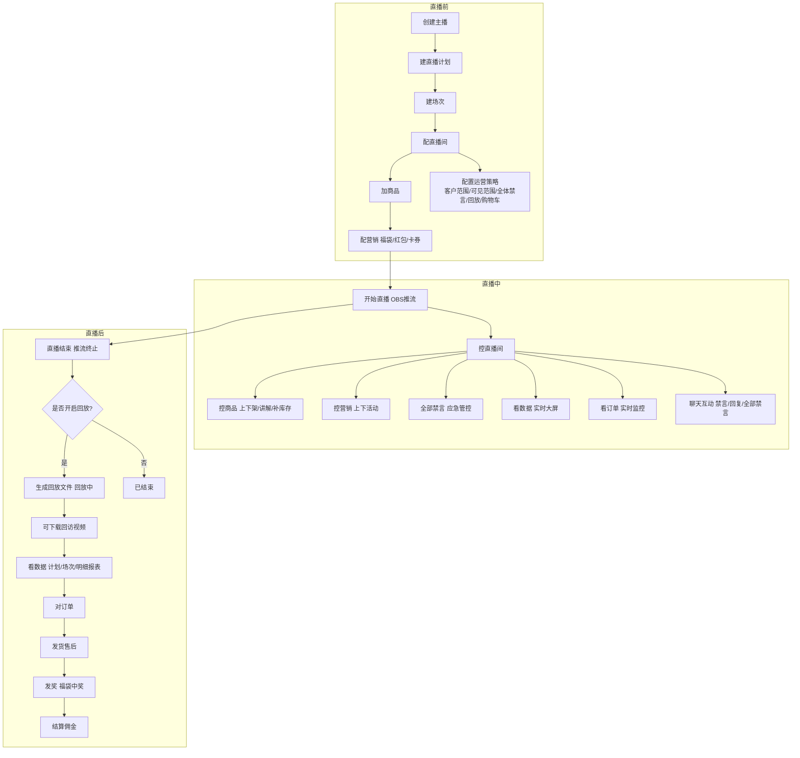
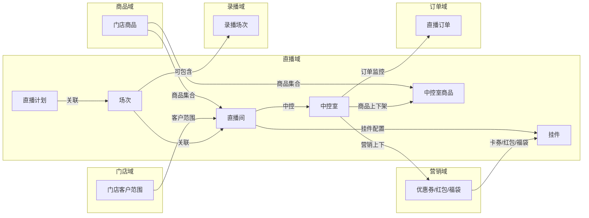
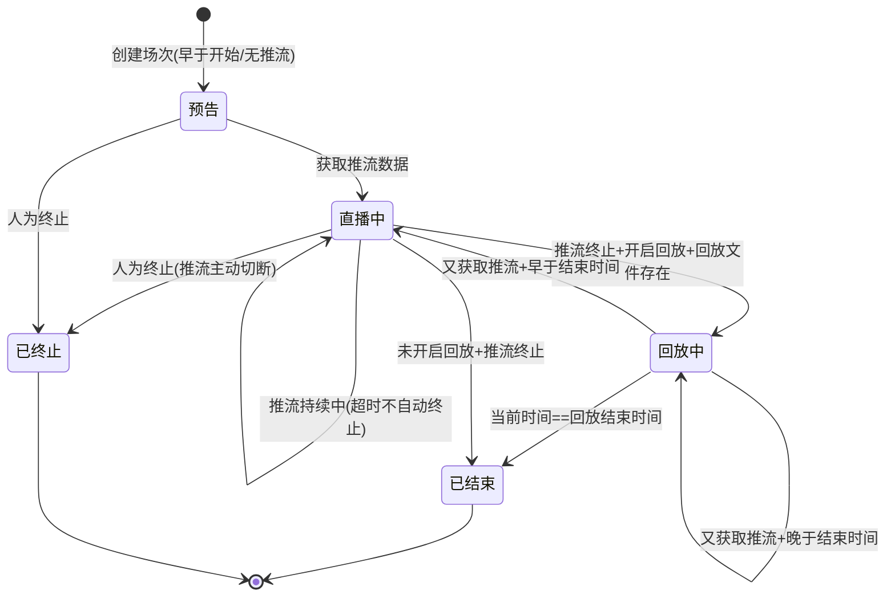
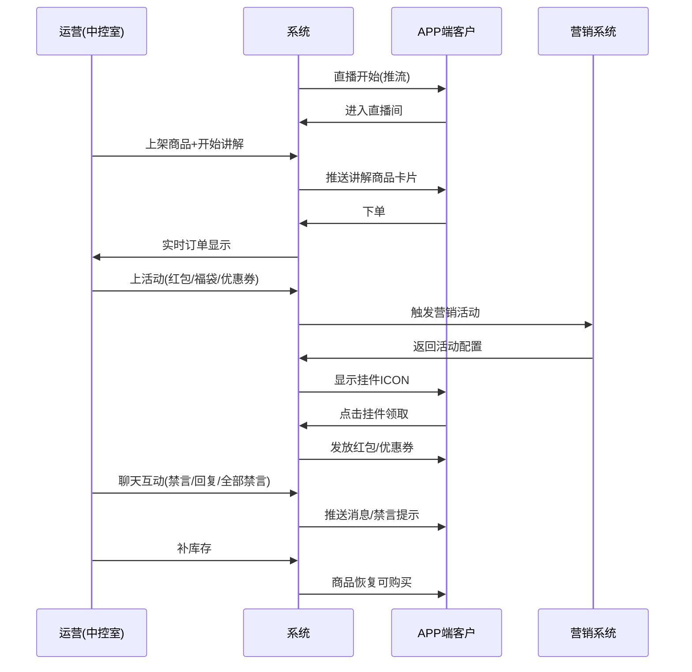
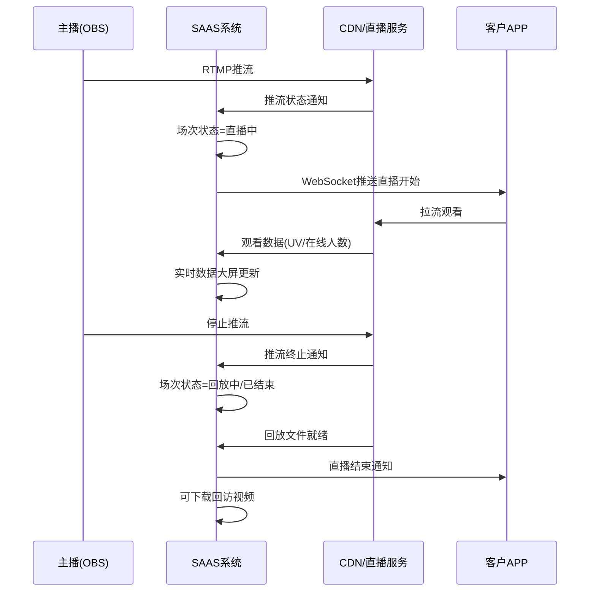
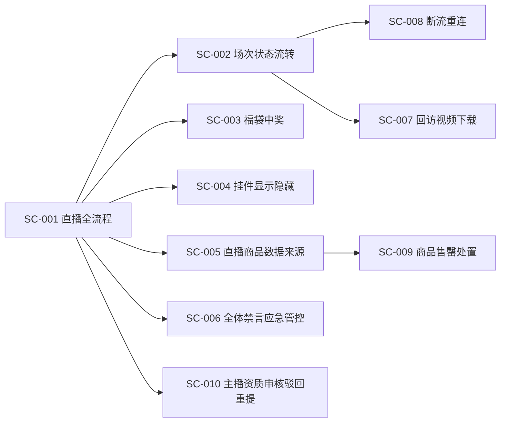
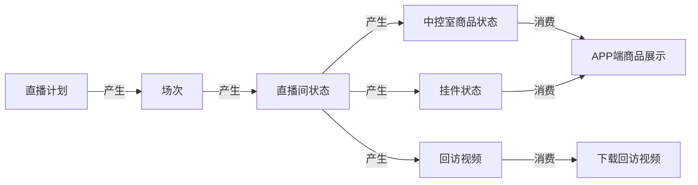
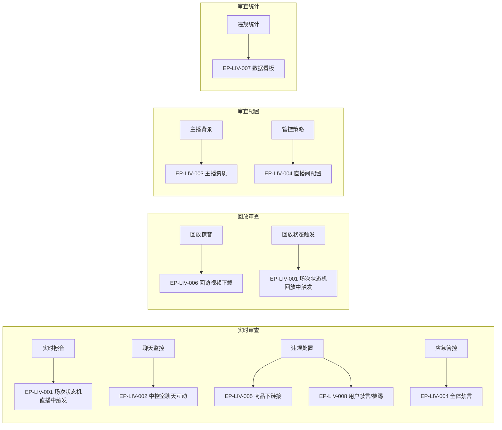

# 直播域 产品需求文档 PRD V7.0.0

> **业务域**：直播域（D09） | **版本**：V7.0.0 | **日期**：2026-07-21
> **数据来源**：`直播V1.0.0.md`、Axure原型 V1.0.2~V1.0.3（45个HTML文件）
> **追溯链**：UC-LIV → FN-LIV → PG-LIV → SC-LIV → BG-11 → BO-11
> **学习标准**：scene-learning-standards.yml V1.0.0（双态标注+场景深度还原8项能力）
> **前置版本**：V1.0.3（2026-07-16按PRD规范V1.0.0重新编排）

---

## 版本历史

| 版本 | 日期 | 变更内容 |
|------|------|----------|
| V1.0.2 | 2026-05-15 | 主播管理、直播计划、场次管理、直播间配置、中控室（商品/订单/营销/课程/聊天）、直播商品/课程、APP端直播广场/直播间/挂件/红包/福袋/优惠券、直播数据大屏/报表、分享（口令方案）、禁言/被踢 |
| V1.0.3 | 2026-05-25 | 直播间客户范围更新、中控室商品管理更新、APP端直播数据看板（主播/店长视角） |
| V1.0.9 | 2026-07-16 | 按PRD规范V1.0.0重新编排 |
| V7.0.0 | 2026-07-21 | learn-project V7.0.0场景深度还原增强：双态标注（📗显式+🟡隐式挖掘）、场景编排图谱、异常路径矩阵、信息生命周期追踪、跨场景血缘、状态机完整性校验、业务操作矩阵、内容审查入口点标注 |

---

## 目录

1. 背景与问题陈述
2. 目标与成功度量
3. 范围
4. 与既有模块关系
5. 业务目标映射
6. 用户故事
7. 功能需求列表与用例
8. 业务规则
9. 数据实体
10. 验收标准
11. 指标登记
12. 五类图
13. 外部接口标注
14. 场景编排图谱（V7.0.0新增）
15. 异常路径矩阵（V7.0.0新增）
16. 信息生命周期与血缘（V7.0.0新增）
17. 业务操作矩阵（V7.0.0新增）
18. 内容审查入口点标注（V7.0.0新增）
19. 检查清单

---

## 1. 背景与问题陈述

直播域是SAAS平台的核心内容与交易域之一，提供完整的直播电商能力。业务范围包括直播计划管理、场次管理、直播间配置、中控室运营、主播资质管理、直播间互动（红包/福袋/优惠券/卡券）、数据指标体系和APP端直播体验。

系统采用推拉流模式进行直播（非自研直播端），通过OBS等第三方工具推流，平台负责直播计划编排、场次调度、互动营销、中控运营和数据度量。

### 核心问题

| 问题编号 | 问题 | 严重程度 |
|----------|------|----------|
| LIV-ISSUE-001 | "直播流量"增值服务标记为暂时不做 | 🟡 中 |
| LIV-ISSUE-002 | 计划指标中"商品指标"Tab存在但内容为空 | 🟢 低 |
| LIV-ISSUE-003 | 缺少直播佣金结算流程 | 🟡 中 |
| LIV-ISSUE-004 | 回放功能限制多（不支持IM/点赞/分享/挂件ICON） | 🟢 低 |
| LIV-ISSUE-005 | "积分"在直播间标记为暂时不做 | 🟢 低 |
| LIV-ISSUE-006 | 场次超时推流是否自动终止未明确 | 🟡 中 |
| LIV-ISSUE-007 | 回放保留时间未明确 | 🟢 低 |
| LIV-ISSUE-008 | 🟡【隐式挖掘·依据:场次状态机原文"推流持续中且当前时间超过场次终止时间==直播中(不自动终止)"+直播间配置页"是否允许回放"配置项交叉印证】缺少直播超时自动终止/告警机制——超时推流不自动终止但无运营告警入口 | 🟡 中 |

---

## 2. 目标与成功度量

| 目标编号 | 目标 | 度量指标 | 目标值 |
|----------|------|----------|--------|
| BO-LIV-01 | 直播转化 | 计划平均转化率 | ≥ 5% |
| BO-LIV-02 | 直播GMV | 计划总GMV | 按计划目标 |
| BO-LIV-03 | 互动率 | 计划平均互动率 | ≥ 15% |
| BO-LIV-04 | 中控室实时性 | 订单/消息延迟 | < 3秒 |

---

## 3. 范围

### In-Scope
- 主播管理（列表/添加/编辑/资质审核）
- 直播计划（创建/编辑/查看/指标设置：流量/互动/交易/商品）
- 场次管理（列表/状态机9条规则/终止）
- 直播间配置（通用配置/福袋/红包/卡券/客户范围/推流地址/复制/启用禁用/是否允许回放/是否全体禁言/是否开启购物车/下载回访视频/设置可见范围）
- 中控室（商品/订单/营销/课程/聊天互动）
- 直播商品/直播课程管理
- APP端直播广场（直播中/预告/记录）
- APP端直播间（直播中/预告中/已结束/挂件/弹幕/分享/购物车）
- APP端红包/福袋/优惠券交互
- 挂件逻辑梳理（福袋/红包/优惠券/购物车/商品卡片）
- 直播数据大屏/报表（计划/场次/明细/会员同比环比/数据看板）
- 直播分享（含口令方案）
- 禁言/被踢机制（含全部禁言）

### Non-Goals
- 直播流量增值服务（暂时不做）
- 直播间积分（暂时不做）
- 自研直播推流端（使用OBS等第三方）
- 回放互动功能（IM/点赞/分享/挂件ICON不支持）

---

## 4. 与既有模块关系

### 上下游依赖矩阵

| 方向 | 关联域 | 依赖关系 | 说明 |
|------|--------|----------|------|
| **上游（被依赖）** | 订单域 | 直播订单来源 | 直播中控室监控订单 |
| **上游（被依赖）** | 营销域 | 直播间挂件（红包/福袋/优惠券） | 中控室管理营销活动 |
| **上游（被依赖）** | 录播域 | 直播计划可包含录播场次 | 直播广场同时显示录播 |
| **下游（依赖）** | 商品域 | 直播商品来源 | 直播商品从门店商品集合添加 |
| **下游（依赖）** | 门店域 | 直播间客户范围基于门店 | 直播间限定门店客户可见 |
| **下游（依赖）** | 营销域 | 卡券/红包/福袋配置 | 直播间挂件关联营销活动 |
| **下游（依赖）** | 分销域 | 直播推广 | 代理/店长通过推广拉新客户 |
| **下游（依赖）** | 运营域 | 主播资质审核 | 主播需提交资质审核 |

### 影响域说明

| 变更场景 | 影响域 | 影响说明 |
|----------|--------|----------|
| 直播间客户范围变更 | APP域 | 客户可见/不可见直播间 |
| 直播商品上下架 | 商品域、订单域 | 商品库存变化；可下单商品变化 |
| 直播间禁用 | APP域、营销域 | 直播广场不显示；挂件活动失效 |
| 中控室营销活动上下 | 营销域 | 优惠券/红包发放状态变化 |
| 场次状态变更 | 录播域 | 回放文件生成后可转为回放 |
| 🟡【隐式挖掘·依据:直播间配置页"是否全体禁言"配置项+中控室营销页"全部禁言"按钮交叉印证】直播间全体禁言切换 | APP域 | 客户端发言功能实时禁用/恢复 |

### 复用边界

| 共享能力 | 复用方 | 说明 |
|----------|--------|------|
| 直播广场 | 录播域 | 直播广场"直播中"同时显示录播播放中数据 |
| 会员报表 | 录播域 | 会员直播同比环比报表同时覆盖录播 |
| 看回放 | 录播域 | 直播回放和录播共享"看回放"页面 |
| 商品脚本 | 录播域 | 录播商品脚本复用直播商品 |

---

## 5. 业务目标映射

| BG | BO | FN | 优先级 |
|----|-----|-----|--------|
| BG-11 直播带货 | BO-LIV-01/02/03 | FN-LIV-001~015 | P0 |
| BG-11 | BO-LIV-04 | FN-LIV-005~008（中控室） | P0 |

---

## 6. 用户故事

| US编号 | 角色 | 用户故事 |
|--------|------|----------|
| US-LIV-001 | 租户管理员 | 作为租户，我希望创建直播计划和管理场次，以便编排直播活动 |
| US-LIV-002 | 租户管理员 | 作为租户，我希望配置直播间（福袋/红包/卡券/客户范围/推流/全体禁言/回放/购物车），以便准备直播 |
| US-LIV-003 | 直播运营 | 作为运营，我希望在中控室管理商品/营销/订单/课程，以便实时运营直播 |
| US-LIV-004 | 主播 | 作为主播，我希望通过OBS推流进行直播，以便与观众互动 |
| US-LIV-005 | 客户 | 作为客户，我希望在直播间观看/互动/领红包/领券/下单，以便享受直播购物 |
| US-LIV-006 | 店长/代理 | 作为店长，我希望查看直播数据看板，以便评估直播效果 |
| US-LIV-007 | 🟡【隐式挖掘·依据:直播间配置页"下载回访视频"操作项+场次状态机"回放文件存在"状态判断交叉印证】租户管理员 | 作为租户，我希望下载回访视频，以便离线保存或二次编辑（如擦音处理） |

---

## 7. 功能需求列表与用例

### FN-LIV-001 主播管理

| 属性 | 值 |
|------|-----|
| 用例编号 | UC-LIV-001 |
| 名称 | 主播管理 |
| 页面 | PG-LIV-001：主播管理.html、主播资质.html、补充资质.html、审核结果.html、主播详情-回放.html、主播详情-预告.html、主播好物.html、我的主播.html |
| 参与者 | 租户管理员 |
| 优先级 | P0 |
| 关联BG | BG-11 |
| 自动化类型 | 手动 |

**前置条件**：租户已登录管理后台
**基本流程**：
1. [手动] 租户进入主播管理页面，查看主播列表
2. [手动] 添加/编辑主播信息
3. [手动] 主播提交资质（待提交→待审核）
4. [手动] 租户审核资质（通过/驳回）
5. [系统自动] 审核通过的主播可关联直播计划/直播间
**备选流程**：
- 4a. 审核驳回→主播可补充资质重新提交（补充资质.html）
- 2a. 主播详情可查看回放/预告历史（主播详情-回放.html、主播详情-预告.html）
**数据范围(R/W)**：
- 读取：主播列表、资质信息、审核状态、主播详情、主播好物
- 写入：主播信息、资质上传、审核结果
**后置条件**：审核通过的主播可被直播计划关联
**关联UC**：UC-LIV-002（直播计划关联主播）

> **内容审查入口点标注**：主播资质审核（FN-LIV-001）是内容审查的前置能力——主播资质信息（企业/个体户/不需资质）可为内容审查提供主播身份背景。详见§18。

---

### FN-LIV-002 直播计划

| 属性 | 值 |
|------|-----|
| 用例编号 | UC-LIV-002 |
| 名称 | 直播计划管理 |
| 页面 | PG-LIV-002：添加直播计划_流量指标_直播.html、互动指标.html、交易指标.html、商品指标.html、编辑直播计划.html、查看计划详情.html、查看场次.html |
| 参与者 | 租户管理员 |
| 优先级 | P0 |
| 关联BG | BG-11 |
| 自动化类型 | 手动 |

**前置条件**：主播已审核通过（FN-LIV-001）
**基本流程**：
1. [手动] 租户创建直播计划（填写计划名称）
2. [手动] 配置直播场次（直播间封面/名称/编号/场次编号/开播时间/结束时间）
3. [手动] 支持"+添加录播间"/"新增场次"
4. [手动] 设置计划指标（流量/互动/交易/商品）
5. [系统自动] 计划下可关联多个场次
**备选流程**：
- 3a. 添加录播间→跳转录播域配置（跨域FN-REC-002）
**数据范围(R/W)**：
- 读取：计划列表、计划详情、场次信息
- 写入：计划名称、场次配置、指标设置
**后置条件**：计划创建成功，可关联直播间
**关联UC**：UC-LIV-003（场次管理）、UC-LIV-004（直播间配置）

**计划指标**：

| 指标类别 | 核心指标 |
|----------|----------|
| 流量指标 | 计划总曝光量、计划总场观UV、计划平均在线人数、计划平均观看时长、计划直播间CTR |
| 互动指标 | 计划总互动UV、计划平均互动率、计划总转粉数、计划平均转粉率 |
| 交易指标 | 计划总GMV、计划总成交UV、计划平均转化率、计划平均UV价值、计划平均客单价、计划平均退款率 |
| 商品指标 | 🟡【隐式挖掘·依据:添加直播计划_商品指标.html页面存在+计划指标分类"商品指标"Tab交叉印证】（Tab存在，内容暂未展开——预留商品维度指标位，后续可填充商品点击率/加购率/转化率等） |

---

### FN-LIV-003 场次管理

| 属性 | 值 |
|------|-----|
| 用例编号 | UC-LIV-003 |
| 名称 | 场次管理 |
| 页面 | PG-LIV-003：场次管理.html、直播场次状态机.html、场次状态的概括.html |
| 参与者 | 系统/租户管理员 |
| 优先级 | P0 |
| 关联BG | BG-11 |
| 自动化类型 | 事件驱动 |

**前置条件**：直播计划已创建且关联直播间
**基本流程**：
1. [系统自动] 场次状态依据推流状态+回放配置自动判断（9条规则，见BR-LIV-001）
2. [系统自动] 预告→直播中（获取推流数据）
3. [系统自动] 直播中→回放中/已结束（推流终止+回放配置）
4. [手动] 租户可人为终止计划/场次→已终止（推流主动切断）
**备选流程**：
- 3a. 回放中又获取推流+早于结束时间→直播中（断流重连场景）
- 3b. 回放中又获取推流+晚于结束时间→回放中（断流重连但超时）
**数据范围(R/W)**：
- 读取：场次列表、场次状态、推流状态、回放配置
- 写入：人为终止操作
**后置条件**：场次状态正确反映直播生命周期
**关联UC**：UC-LIV-013（直播数据基于场次）

> **内容审查入口点标注**：场次状态机是实时擦音和回放擦音的切入点——"直播中"状态触发实时擦音，"回放中"状态触发回放擦音。详见§18。

---

### FN-LIV-004 直播间配置

| 属性 | 值 |
|------|-----|
| 用例编号 | UC-LIV-004 |
| 名称 | 直播间配置 |
| 页面 | PG-LIV-004：直播间.html、复制直播间.html、配置福袋.html、配置红包-现金红包-发钱.html、配置卡券.html、设置高级条件.html、设置客户范围.html、推流地址.html、添加直播间.html |
| 参与者 | 租户管理员 |
| 优先级 | P0 |
| 关联BG | BG-11 |
| 自动化类型 | 手动 |

**前置条件**：直播计划已创建
**基本流程**：
1. [手动] 租户进入直播间配置页
2. [手动] 配置直播间基础信息（封面/名称/编号/计划信息/场次信息/主播信息）
3. [手动] 配置营销挂件（配置福袋/配置红包-现金/配置红包-商品/配置卡券/配置课程）
4. [手动] 设置运营策略（设置高级条件/设置客户范围/设置可见范围）
5. [手动] 配置直播能力（推流地址/是否允许回放/是否开启购物车/是否全体禁言）
6. [手动] 支持复制直播间/启用/禁用
**备选流程**：
- 5a. 允许回放→直播结束后生成回放文件→可下载回访视频
- 5b. 全体禁言→客户端发言功能禁用
**数据范围(R/W)**：
- 读取：直播间列表、配置项、客户范围、主播信息
- 写入：所有配置项、启用/禁用状态、复制操作
**后置条件**：直播间配置完成，可进入中控室运营
**关联UC**：UC-LIV-005~008（中控室）、UC-LIV-010~011（APP端）

**配置项完整清单（V7.0.0基于直播间.html原文还原）**：

| 配置类别 | 配置项 | 说明 |
|----------|--------|------|
| 基础信息 | 直播间封面、直播间名称、直播间编号 | — |
| 关联信息 | 计划信息（计划名称/编号）、场次信息（场次编号/日期/时间）、主播信息（主播名称/编号） | — |
| 计划类型 | 直播/录播 | 🟡【隐式挖掘·依据:直播间.html"计划类型"字段值"直播"+直播间配置页"录播"操作项交叉印证】计划类型决定直播间走直播流程还是录播流程 |
| 营销挂件 | 配置福袋、配置红包-现金、配置红包-商品、配置卡券、配置课程 | 5类挂件 |
| 运营策略 | 设置高级条件、设置客户范围、设置可见范围 | 客户范围决定可见性 |
| 直播能力 | 推流地址、是否允许回放、是否开启购物车、是否全体禁言 | 4项核心能力开关 |
| 快捷操作 | 直播中控室、直播数据大屏、分享直播间、复制直播间、下载回访视频 | 5个快捷入口 |

---

### FN-LIV-005 中控室_商品

| 属性 | 值 |
|------|-----|
| 用例编号 | UC-LIV-005 |
| 名称 | 中控室商品管理 |
| 页面 | PG-LIV-005：直播中控室_商品.html、中控_-_商品.html |
| 参与者 | 直播运营 |
| 优先级 | P0 |
| 关联BG | BG-11 |
| 自动化类型 | 手动 |

**前置条件**：场次状态为"直播中"或"回放中"
**基本流程**：
1. [手动] 运营进入中控室商品Tab
2. [手动] 查看商品列表（序号/状态/商品图/商品名称/商品编号/价格/库存/商品类型）
3. [手动] 上链接/下链接（控制商品上下架）
4. [手动] 开价（控制价格显示）
5. [手动] 开始讲解/结束讲解（推送讲解商品卡片到APP端）
6. [手动] 补库存（商品售罄时补充库存）
7. [手动] +新增商品（从直播商品集合添加）
**备选流程**：
- 3a. 商品库存为0→状态显示"已售罄"→运营可补库存
- 5a. 同一时刻只能有1个商品"讲解中"
**数据范围(R/W)**：
- 读取：商品列表、商品状态（未上架/讲解中/已售罄）、库存、价格
- 写入：上下架状态、讲解状态、库存补充
**后置条件**：商品状态实时同步到APP端
**关联UC**：UC-LIV-009（直播商品管理）、UC-LIV-011（APP端直播间）

**商品状态（V7.0.0基于直播中控室_商品.html原文还原）**：

| 状态 | 说明 | 触发操作 |
|------|------|----------|
| 未上架 | 商品未上链接 | 上链接→讲解中/未上架 |
| 讲解中 | 当前正在讲解的商品 | 开始讲解→结束讲解→未上架 |
| 已售罄 | 库存为0 | 补库存→未上架 |

> **内容审查入口点标注**：中控室商品管理是审查结果处置入口之一——若商品涉及违规，可通过"下链接"操作即时下架。详见§18。

---

### FN-LIV-006 中控室_营销

| 属性 | 值 |
|------|-----|
| 用例编号 | UC-LIV-006 |
| 名称 | 中控室营销管理 |
| 页面 | PG-LIV-006：直播中控室_营销.html |
| 参与者 | 直播运营 |
| 优先级 | P0 |
| 关联BG | BG-11 |
| 自动化类型 | 手动 |

**前置条件**：场次状态为"直播中"
**基本流程**：
1. [手动] 运营进入中控室营销Tab（互动活动）
2. [手动] 查看营销活动列表（名称/状态/发放方式/截止方式）
3. [手动] 上活动/下活动（控制营销活动上下架）
4. [手动] 查看参与名单
**备选流程**：
- 3a. 定时发送→到达配置时间自动上活动
- 3b. 手动发放→运营手动触发上活动
- 3c. 定时截止→到达截止时间自动下活动
- 3d. 倒计时→倒计时归零自动下活动
- 3e. 手动截止→运营手动下活动
**数据范围(R/W)**：
- 读取：营销活动列表、活动状态（发放中/已结束）、参与名单
- 写入：上下活动状态
**后置条件**：营销活动状态实时同步到APP端挂件
**关联UC**：UC-LIV-012（挂件逻辑）

**营销活动类型（V7.0.0基于直播中控室_营销.html原文还原）**：

| 活动类型 | 说明 |
|----------|------|
| 卡券（满减券/折扣券） | 满减/折扣优惠券 |
| 红包（定额/随机/现金） | 现金红包 |
| 抽奖（福袋） | 福袋抽奖 |

**发放方式**：定时发送、手动发放
**截止方式**：定时截止、倒计时、手动截止

**聊天互动面板（V7.0.0基于直播中控室_营销.html原文还原）**：
- 聊天记录实时显示
- 发送消息（表情/文本标签）
- 禁言（单用户禁言）
- 🟡【隐式挖掘·依据:直播间配置页"是否全体禁言"配置项+中控室营销页"全部禁言"按钮交叉印证】全部禁言（全直播间禁言）
- 解禁（解除禁言）
- 回复用户
- 查看参与名单

> **内容审查入口点标注**：中控室聊天互动是实时审查的核心展示和处置入口——聊天消息实时展示，可通过"禁言"处置违规用户，通过"全部禁言"应急管控。详见§18。

---

### FN-LIV-007 中控室_订单

| 属性 | 值 |
|------|-----|
| 用例编号 | UC-LIV-007 |
| 名称 | 中控室订单监控 |
| 页面 | PG-LIV-007：直播中控室_订单.html |
| 参与者 | 直播运营 |
| 优先级 | P1 |
| 关联BG | BG-11 |
| 自动化类型 | 系统自动+手动 |

**前置条件**：场次状态为"直播中"
**基本流程**：
1. [系统自动] 直播订单实时列表显示
2. [手动] 运营可添加订单备注
**数据范围(R/W)**：
- 读取：直播订单列表、订单状态
- 写入：订单备注
**后置条件**：订单数据实时同步
**关联UC**：订单域（跨域）

---

### FN-LIV-008 中控室_课程

| 属性 | 值 |
|------|-----|
| 用例编号 | UC-LIV-008 |
| 名称 | 中控室课程管理 |
| 页面 | PG-LIV-008：直播中控室_课程.html |
| 参与者 | 直播运营 |
| 优先级 | P1 |
| 关联BG | BG-11 |
| 自动化类型 | 手动 |

**前置条件**：场次状态为"直播中"
**基本流程**：
1. [手动] 运营进入中控室课程Tab
2. [手动] 上链接/下链接（控制课程上下架）
3. [手动] 开始讲解/结束讲解
4. [手动] 新增课程
**数据范围(R/W)**：
- 读取：课程列表、课程状态
- 写入：上下架状态、讲解状态
**后置条件**：课程状态实时同步到APP端
**关联UC**：UC-LIV-009（直播商品/课程管理）

---

### FN-LIV-009 直播商品

| 属性 | 值 |
|------|-----|
| 用例编号 | UC-LIV-009 |
| 名称 | 直播商品管理 |
| 页面 | PG-LIV-009：直播商品.html、直播商品_-__25号发布的内容_.html、直播商品_1.html、添加商品_2.html |
| 参与者 | 租户管理员 |
| 优先级 | P0 |
| 关联BG | BG-11 |
| 自动化类型 | 手动 |

**前置条件**：门店商品已存在
**基本流程**：
1. [手动] 租户进入直播商品管理页
2. [手动] 添加商品（从门店商品集合选择）
3. [手动] 修改价格/设置运费/设置自提点/删除/设置
**数据范围(R/W)**：
- 读取：门店商品集合
- 写入：直播商品价格/运费/自提点/删除
**后置条件**：直播商品可用于中控室添加
**关联UC**：UC-LIV-005（中控室商品）

**数据来源规则**：当前所有门店的成员所属门店商品集合（并非租户整体商品）。如果直播间没有设置客户范围，显示为空。

---

### FN-LIV-010 APP端直播广场

| 属性 | 值 |
|------|-----|
| 用例编号 | UC-LIV-010 |
| 名称 | APP端直播广场 |
| 页面 | PG-LIV-010：直播广场-直播中.html、直播广场-直播预告.html、直播广场-记录.html |
| 参与者 | 客户 |
| 优先级 | P0 |
| 关联BG | BG-11 |
| 自动化类型 | 系统自动 |

**前置条件**：客户已登录APP
**基本流程**：
1. [系统自动] 客户进入直播广场
2. [系统自动] "直播中"Tab显示：直播中+回放中+录播播放中（优先显示推流直播，其次回放，录播播放中）
3. [系统自动] "直播预告"Tab显示：今日预告（当前日期早于直播场次开始日期且没有获取推流数据，依据场次开播时间升序排序）
4. [系统自动] "记录"Tab显示：历史直播记录
**数据范围(R/W)**：
- 读取：直播广场数据（直播中/预告/记录）
**后置条件**：客户可进入直播间
**关联UC**：UC-LIV-011（APP端直播间）

---

### FN-LIV-011 APP端直播间

| 属性 | 值 |
|------|-----|
| 用例编号 | UC-LIV-011 |
| 名称 | APP端直播间 |
| 页面 | PG-LIV-011：直播间-直播中.html、直播间-预告中.html、直播间-已结束.html、直播间-半个弹窗.html |
| 参与者 | 客户 |
| 优先级 | P0 |
| 关联BG | BG-11 |
| 自动化类型 | 手动+事件驱动 |

**前置条件**：客户从直播广场进入直播间
**基本流程**：
1. [系统自动] 依据场次状态展示不同页面（直播中/预告中/已结束）
2. [手动] 客户观看直播/互动/领红包/领券/下单
3. [系统自动] 商品售罄时显示"已售罄"状态
**备选流程**：
- 2a. 黑名单/禁用用户不可进入直播间、不可购买、不可回放、不可录播
**数据范围(R/W)**：
- 读取：直播流、商品列表、挂件状态、聊天记录
- 写入：互动消息、领红包/领券、下单
**后置条件**：客户行为数据记录
**关联UC**：UC-LIV-012（挂件逻辑）、UC-LIV-015（异常状态）

**直播中页面元素**：主播名称、关注、红包ICON（倒计时）、福袋ICON、优惠券ICON、购物车、当前讲解商品、设置、会员等级图标、积分（暂时不做）、禁言、被踢、分享。

**商品售罄规则**：库存为0显示已售罄状态。

---

### FN-LIV-012 挂件逻辑

| 属性 | 值 |
|------|-----|
| 用例编号 | UC-LIV-012 |
| 名称 | 挂件逻辑 |
| 页面 | PG-LIV-012：直播间的挂件逻辑梳理.html |
| 参与者 | 系统 |
| 优先级 | P0 |
| 关联BG | BG-11 |
| 自动化类型 | 事件驱动 |

**前置条件**：直播间已配置挂件
**基本流程**：
1. [系统自动] 依据挂件配置决定显示/隐藏ICON
2. [手动/系统自动] 用户点击挂件→弹窗显示
3. [系统自动] 依据挂件类型执行业务逻辑（福袋中奖/红包发放/优惠券领取/购物车/商品卡片）
**数据范围(R/W)**：
- 读取：挂件配置
- 写入：福袋中奖订单、红包发放记录、优惠券领取记录
**后置条件**：挂件交互完成
**关联UC**：UC-LIV-006（中控室营销管理挂件）

**挂件类型**：福袋（抽奖）、红包、优惠券、购物车、商品卡片。

**通用挂件逻辑**：
- 发放方式：手动发放（手动触发显示ICON）/自动发放（到达配置时间显示ICON）
- 隐藏方式：无限制（一直显示）/手动截止/倒计时（归零后隐藏）
- 弹窗：用户点击→弹窗显示

**福袋逻辑**：点击参与→中奖判断→实物奖品创建订单（中奖订单，待发货）/虚拟奖品下发优惠券。

---

### FN-LIV-013 直播数据

| 属性 | 值 |
|------|-----|
| 用例编号 | UC-LIV-013 |
| 名称 | 直播数据报表 |
| 页面 | PG-LIV-013：直播数据大屏.html、计划直播数据.html、场次直播数据.html、直播间明细报表.html、会员直播同比环比报表.html、数据看板-直播.html、直播数据.html |
| 参与者 | 租户管理员/店长/主播 |
| 优先级 | P1 |
| 关联BG | BG-11 |
| 自动化类型 | 系统自动 |

**前置条件**：直播场次已开始或结束
**基本流程**：
1. [系统自动] 直播数据大屏实时展示（直播中）
2. [系统自动] 计划/场次直播数据报表（直播后）
3. [系统自动] 直播间明细报表（直播后）
4. [系统自动] 会员直播同比环比报表（跨域录播）
5. [系统自动] 数据看板（主播/店长视角）
**数据范围(R/W)**：
- 读取：直播数据（流量/互动/小黄车/成交/效率）
**后置条件**：数据可用于运营决策

**直播间明细报表指标**：

| 类别 | 指标 |
|------|------|
| 流量 | 累计观看时长、场次UV、峰值在线人数、平均在线人数、开播时长 |
| 互动 | 点赞数、评论数、分享数、互动UV、互动率、主播转粉率 |
| 小黄车 | 点击UV、点击率 |
| 成交 | GMV、订单数、成交UV、下单UV、下单率、支付转化率、UV价值、客单价 |
| 效率 | 小时GMV |

> **内容审查入口点标注**：直播数据看板是违规统计展示的潜在入口——可在数据看板增加违规消息数/处置数/擦音覆盖率等审查维度指标。详见§18。

---

### FN-LIV-014 直播分享

| 属性 | 值 |
|------|-----|
| 用例编号 | UC-LIV-014 |
| 名称 | 直播分享 |
| 页面 | PG-LIV-014：分享直播间.html、分享直播间-口令.html、分享直播间_1.html |
| 参与者 | 客户 |
| 优先级 | P1 |
| 关联BG | BG-11 |
| 自动化类型 | 手动 |

**前置条件**：直播间存在
**基本流程**：
1. [手动] 客户点击分享按钮
2. [系统自动] 生成分享链接/口令
3. [手动] 客户分享到社交平台
**数据范围(R/W)**：
- 读取：直播间信息
- 写入：分享记录
**后置条件**：被分享者可通过链接/口令进入直播间

**方案演进**：原方案→口令方案（2026-04-28替换）。

---

### FN-LIV-015 APP端异常状态

| 属性 | 值 |
|------|-----|
| 用例编号 | UC-LIV-015 |
| 名称 | 直播间异常状态 |
| 页面 | PG-LIV-015：禁言.html、被踢.html、异常状态.html |
| 参与者 | 系统 |
| 优先级 | P1 |
| 关联BG | BG-11 |
| 自动化类型 | 事件驱动 |

**前置条件**：用户违规或被运营处置
**基本流程**：
1. [系统自动] 用户被禁言→发言时提示"您已被禁言"
2. [系统自动] 用户被踢→进入直播间时提示"您已被踢出"
3. [系统自动] 其他异常状态展示
**数据范围(R/W)**：
- 读取：用户禁言/被踢状态
**后置条件**：异常状态正确展示
**关联UC**：UC-LIV-006（中控室禁言操作）

> **内容审查入口点标注**：禁言/被踢是内容审查的即时处置手段——审查发现违规用户可即时禁言或踢出。详见§18。

---

## 8. 业务规则

### BR-LIV-001 场次状态判断规则（V7.0.0完整9条，原文还原）
- 核心依据：推流状态+回放配置（非单纯时间比较）
- 规则1：早于开始时间或没有产生推流 == 预告
- 规则2：直播推流持续中 == 直播中
- 规则3：如果直播推流持续中，且当前时间超过场次终止时间 == 直播中（不自动终止）
- 规则4：如果直播间开启回放，直播推流终止并且回放文件存在 == 回放中
- 规则5：如果直播间开启回放，直播推流终止并且回放文件存在，且又获取到推流，且当前时间早于场次结束时间 == 直播中
- 规则6：如果直播间开启回放，直播推流终止并且回放文件存在，且又获取到推流，且当前时间晚于场次结束时间 == 回放中
- 规则7：如果直播间未开启回放 == 已结束
- 规则8：如果直播间开启回放，直播推流终止并且回放文件 == 回放中，并且当前时间 == 回放结束时间 == 已结束
- 规则9：人为终止计划、终止场次 == 已终止，且推流被主动切断

### BR-LIV-002 直播广场数据优先规则
- 优先显示推流直播，其次回放，录播播放中
- 前置条件：用户可跨租户，但同一租户不能跨门店

### BR-LIV-003 直播商品数据来源规则
- 依据：当前所有门店的成员所属门店商品集合
- 如果直播间没有设置客户范围，显示为空

### BR-LIV-004 挂件显示规则
- 手动发放：手动触发→显示ICON
- 自动发放：当前时刻==配置时间→显示ICON，否则不显示

### BR-LIV-005 挂件隐藏规则
- 无限制：一直显示
- 手动截止：手动触发隐藏
- 倒计时：ICON显示倒计时→归零后隐藏

### BR-LIV-006 福袋中奖规则
- 未开奖→等待
- 实物奖品→创建订单（类型==中奖订单，状态==待发货）
- 虚拟奖品→下发优惠券给用户

### BR-LIV-007 商品售罄规则
- 库存为0→显示已售罄状态

### BR-LIV-008 直播预告排序规则
- 今日预告：当前日期早于直播场次开始日期且没有获取推流数据
- 依据场次开播时间升序排序

### BR-LIV-009 直播间数据权限规则
- 黑名单/禁用用户不可进入直播间、不可购买、不可回放、不可录播

### BR-LIV-010 🟡【隐式挖掘·依据:直播间配置页"是否全体禁言"配置项+中控室营销页"全部禁言"按钮交叉印证】全体禁言规则
- 全体禁言开启后，所有客户在直播间不可发送消息
- 运营仍可在中控室发送消息
- 解除全体禁言后，客户恢复发言能力

### BR-LIV-011 🟡【隐式挖掘·依据:直播间配置页"下载回访视频"操作项+场次状态机"回放文件存在"状态判断交叉印证】回访视频下载规则
- 仅开启回放的直播间可下载回访视频
- 回访视频在推流终止并生成回放文件后可下载
- 下载的视频可用于离线保存或二次编辑

### BR-LIV-012 🟡【隐式挖掘·依据:直播间配置页"计划类型"字段(直播/录播)+直播间配置页"录播"操作项交叉印证】计划类型切换规则
- 计划类型为"直播"时，场次走直播推流流程
- 计划类型为"录播"时，场次走录播视频播放流程（跨域FN-REC-002）

---

## 9. 数据实体

### ENT-LIV-001 直播计划(LivePlan)

| 字段 | 类型 | 说明 |
|------|------|------|
| plan_id | String | 计划ID |
| plan_name | String | 计划名称 |
| sessions | List | 场次列表 |
| indicators | Object | 计划指标（流量/互动/交易/商品） |

### ENT-LIV-002 场次(Session)

| 字段 | 类型 | 说明 |
|------|------|------|
| session_id | String | 场次ID |
| plan_id | String | 计划ID |
| live_room_id | String | 直播间ID |
| session_code | String | 场次编号 |
| start_time | Datetime | 开播时间 |
| end_time | Datetime | 结束时间 |
| status | Enum | 预告/直播中/回放中/已结束/已终止 |
| stream_status | Boolean | 推流状态 |
| has_replay | Boolean | 是否开启回放 |
| replay_file_exists | Boolean | 回放文件是否存在 |

### ENT-LIV-003 直播间(LiveRoom)

| 字段 | 类型 | 说明 |
|------|------|------|
| room_id | String | 直播间ID |
| name | String | 直播间名称 |
| cover | String | 直播间封面 |
| config | Object | 通用配置（福袋/红包/卡券/客户范围/推流地址） |
| customer_scope | List | 客户范围 |
| visible_scope | Object | 可见范围 🟡【隐式挖掘·依据:直播间.html"设置可见范围"配置项】 |
| stream_url | String | 推流地址 |
| is_enabled | Boolean | 启用状态 |
| allow_replay | Boolean | 是否允许回放 🟡【隐式挖掘·依据:直播间.html"是否允许回放"配置项】 |
| enable_cart | Boolean | 是否开启购物车 🟡【隐式挖掘·依据:直播间.html"是否开启购物车"配置项】 |
| global_mute | Boolean | 是否全体禁言 🟡【隐式挖掘·依据:直播间.html"是否全体禁言"配置项+中控室"全部禁言"按钮】 |
| plan_type | Enum | 计划类型(直播/录播) 🟡【隐式挖掘·依据:直播间.html"计划类型"字段】 |

### ENT-LIV-004 主播(Anchor)

| 字段 | 类型 | 说明 |
|------|------|------|
| anchor_id | String | 主播ID |
| name | String | 主播名称 |
| qualification_status | Enum | 待提交/待审核/已通过/已驳回 |
| qualification_info | Object | 资质信息 |

### ENT-LIV-005 🟡【隐式挖掘·依据:直播中控室_商品.html"商品类型:引流款"字段+商品状态(未上架/讲解中/已售罄)交叉印证】中控室商品(LiveControlProduct)

| 字段 | 类型 | 说明 |
|------|------|------|
| ctrl_product_id | String | 中控室商品ID |
| room_id | String | 直播间ID |
| product_id | String | 关联商品ID |
| sequence | Integer | 序号 |
| status | Enum | 未上架/讲解中/已售罄 |
| product_type | String | 商品类型（如引流款） |
| display_price | String | 显示价格 |
| stock | Integer | 库存 |

### 实体关系

```
直播计划(LivePlan) 1──N 场次(Session) 1──1 直播间(LiveRoom)
直播间(LiveRoom) N──1 主播(Anchor)
直播间(LiveRoom) 1──N 直播商品(LiveProduct)
直播间(LiveRoom) 1──N 中控室商品(LiveControlProduct)
直播间(LiveRoom) 1──N 挂件(Widget: 福袋/红包/优惠券/购物车/商品卡片)
```

---

## 10. 验收标准

| SC编号 | 场景 | 预期结果 |
|--------|------|----------|
| SC-LIV-001 | 直播全流程 | 建计划→配直播间→加商品→配营销→开始直播→中控室管理→结束→查看数据 |
| SC-LIV-002 | 场次状态流转 | 预告→推流→直播中→推流终止→回放中/已结束 |
| SC-LIV-003 | 福袋中奖 | 参与→中奖→实物创建订单/虚拟下发优惠券 |
| SC-LIV-004 | 挂件显示隐藏 | 手动/自动发放正确触发；倒计时归零隐藏 |
| SC-LIV-005 | 直播商品数据来源 | 仅显示门店商品集合内商品 |
| SC-LIV-006 | 🟡【隐式挖掘】全体禁言 | 配置全体禁言→客户端不可发言→中控室仍可发言→解除后恢复 |
| SC-LIV-007 | 🟡【隐式挖掘】回访视频下载 | 开启回放→直播结束→生成回放文件→可下载回访视频 |
| SC-LIV-008 | 🟡【隐式挖掘】断流重连 | 回放中又获取推流+早于结束时间→直播中；晚于结束时间→回放中 |

| FN | Given | When | Then |
|----|-------|------|------|
| FN-LIV-003 | 场次早于开始时间 | 无推流 | 状态=预告 |
| FN-LIV-003 | 场次推流持续中 | 获取推流数据 | 状态=直播中 |
| FN-LIV-003 | 场次推流持续中 | 当前时间超过终止时间 | 状态=直播中（不自动终止） |
| FN-LIV-003 | 推流终止+开启回放+回放文件存在 | — | 状态=回放中 |
| FN-LIV-003 | 回放中+又获取推流+早于结束时间 | — | 状态=直播中 |
| FN-LIV-003 | 回放中+又获取推流+晚于结束时间 | — | 状态=回放中 |
| FN-LIV-003 | 未开启回放+推流终止 | — | 状态=已结束 |
| FN-LIV-003 | 回放中+当前时间==回放结束时间 | — | 状态=已结束 |
| FN-LIV-003 | 人为终止 | 推流主动切断 | 状态=已终止 |
| FN-LIV-012 | 挂件配置手动发放 | 运营手动触发 | 显示ICON |
| FN-LIV-012 | 挂件配置倒计时 | 倒计时归零 | 隐藏ICON |
| FN-LIV-011 | 直播商品库存为0 | 展示商品卡片 | 显示已售罄 |
| FN-LIV-004 | 🟡全体禁言开启 | 客户尝试发言 | 不可发言 |
| FN-LIV-004 | 🟡全体禁言解除 | 客户尝试发言 | 可发言 |

---

## 11. 指标登记

| 指标 | 说明 |
|------|------|
| MET-LIV-001 | 计划总GMV |
| MET-LIV-002 | 计划平均转化率 |
| MET-LIV-003 | 计划平均UV价值 |
| MET-LIV-004 | 计划平均客单价 |
| MET-LIV-005 | 计划平均退款率 |
| MET-LIV-006 | 计划平均互动率 |
| MET-LIV-007 | 计划平均转粉率 |
| MET-LIV-008 | 中控室订单延迟 |
| MET-LIV-009 | 🟡【隐式挖掘·依据:直播间明细报表"评论数"指标+中控室禁言操作交叉印证】违规消息数/处置数（内容审查预留指标） |

---

## 12. 五类图

### 12.1 业务流程图 — 直播SOP全流程



### 12.2 信息流转图 — 直播域跨模块



### 12.3 状态机 — 场次状态机（V7.0.0完整9条规则还原）



**状态过渡操作表（V7.0.0完整）**：

| 当前状态 | 触发操作 | 目标状态 | 操作者 | 前置约束 | 后置动作 |
|----------|----------|----------|--------|----------|----------|
| 预告 | 获取推流数据 | 直播中 | 主播/OBS | — | APP端显示直播中 |
| 直播中 | 推流持续中+超时 | 直播中 | 系统 | 不自动终止 | 🟡无告警（LIV-ISSUE-008） |
| 直播中 | 推流终止+开启回放 | 回放中 | 系统 | 回放文件存在 | 生成回放入口+可下载回访视频 |
| 回放中 | 又获取推流+早于结束 | 直播中 | 主播/OBS | — | — |
| 回放中 | 又获取推流+晚于结束 | 回放中 | 主播/OBS | — | — |
| 回放中 | 当前时间==回放结束 | 已结束 | 系统 | — | — |
| 直播中 | 推流终止+未开启回放 | 已结束 | 系统 | — | — |
| 任意 | 人为终止 | 已终止 | 租户/运营 | 推流被主动切断 | — |

### 12.4 业务时序图 — 直播中控室运营流程



### 12.5 三方接口时序图 — 直播推流与数据采集



---

## 13. 外部接口标注

| 接口编号 | 接口名称 | 方向 | 对端系统 | 说明 |
|----------|----------|------|----------|------|
| API-LIV-001 | RTMP推流 | 单向(入) | OBS/第三方推流工具 | 主播推流至CDN |
| API-LIV-002 | 拉流播放 | 单向(出) | CDN/直播服务 | 客户APP拉流观看 |
| API-LIV-003 | 推流状态通知 | 单向(入) | CDN/直播服务 | 推流开始/终止通知 |
| API-LIV-004 | 观看数据上报 | 单向(入) | CDN/直播服务 | UV/在线人数/观看时长 |
| API-LIV-005 | 回放文件 | 单向(入) | CDN/对象存储 | 回放文件就绪通知 |
| API-LIV-006 | WebSocket实时推送 | 单向(出) | 客户APP | 直播开始/数据更新/挂件触发 |
| API-LIV-007 | 🟡【隐式挖掘·依据:直播间配置页"下载回访视频"操作项+回放文件接口交叉印证】回访视频下载 | 单向(出) | CDN/对象存储 | 下载回放视频文件 |

---

## 14. 场景编排图谱（V7.0.0新增）

### 场景清单

| 场景编号 | 场景名称 | 标注态 | 参与者 | 入口 | 出口 |
|----------|----------|--------|--------|------|------|
| SC-LIV-001 | 直播全流程 | 📗显式 | 租户/运营/主播/客户 | 创建主播 | 结算佣金 |
| SC-LIV-002 | 场次状态流转 | 📗显式 | 系统/主播 | 创建场次 | 已结束/已终止 |
| SC-LIV-003 | 福袋中奖 | 📗显式 | 客户/系统 | 点击参与 | 中奖订单/优惠券 |
| SC-LIV-004 | 挂件显示隐藏 | 📗显式 | 系统/运营 | 配置挂件 | 隐藏ICON |
| SC-LIV-005 | 直播商品数据来源 | 📗显式 | 系统 | 添加商品 | 显示门店商品集合 |
| SC-LIV-006 | 🟡全体禁言应急管控 | 🟡隐式挖掘 | 运营/客户 | 全部禁言按钮 | 解除禁言 |
| SC-LIV-007 | 🟡回访视频下载 | 🟡隐式挖掘 | 租户 | 下载回访视频 | 视频文件 |
| SC-LIV-008 | 🟡断流重连 | 🟡隐式挖掘 | 主播/系统 | 回放中又获取推流 | 直播中/回放中 |
| SC-LIV-009 | 🟡中控室商品售罄处置 | 🟡隐式挖掘 | 运营 | 商品库存=0 | 补库存恢复 |
| SC-LIV-010 | 🟡主播资质审核驳回重提 | 🟡隐式挖掘 | 主播/租户 | 审核驳回 | 补充资质重新提交 |

### 场景编排关系



---

## 15. 异常路径矩阵（V7.0.0新增）

| 场景 | 异常类型 | 异常路径 | 原文依据 |
|------|----------|----------|----------|
| 进入直播间 | 黑名单用户 | 不可进入直播间 | BR-LIV-009 |
| 进入直播间 | 禁用用户 | 不可进入直播间 | BR-LIV-009 |
| 购买商品 | 黑名单/禁用用户 | 不可购买 | BR-LIV-009 |
| 观看回放 | 黑名单/禁用用户 | 不可回放 | BR-LIV-009 |
| 录播 | 黑名单/禁用用户 | 不可录播 | BR-LIV-009 |
| 直播商品 | 库存为0 | 显示已售罄 | BR-LIV-007 |
| 场次状态 | 推流超时 | 不自动终止（直播中） | BR-LIV-001规则3 |
| 场次状态 | 回放中断流重连 | 依据结束时间判断直播中/回放中 | BR-LIV-001规则5/6 |
| 🟡发言 | 全体禁言开启 | 客户不可发言 | BR-LIV-010 |
| 🟡回访视频下载 | 未开启回放 | 不可下载 | BR-LIV-011 |

---

## 16. 信息生命周期与血缘（V7.0.0新增）

### 信息主体×生命周期阶段矩阵

| 信息主体 | Create | Read | Update | Archive | Delete |
|----------|--------|------|--------|---------|--------|
| 直播计划 | 创建计划 | 查看计划详情 | 编辑计划 | — | — |
| 场次 | 新增场次 | 查看场次 | 编辑场次 | 已结束/已终止 | — |
| 直播间 | 添加直播间 | 查看直播间 | 编辑配置 | 禁用 | — |
| 主播 | 添加主播 | 查看主播 | 编辑主播 | — | — |
| 主播资质 | 提交资质 | 查看资质 | 补充资质 | 已驳回 | — |
| 直播商品 | 添加商品 | 查看商品 | 修改价格/运费 | — | 删除 |
| 中控室商品 | 上链接 | 查看商品状态 | 上下架/讲解/补库存 | 下链接 | — |
| 挂件 | 配置挂件 | 查看挂件 | 上下活动 | 下活动 | — |
| 🟡回访视频 | 推流终止生成 | 下载/查看 | — | — | — |

### 跨场景信息血缘



---

## 17. 业务操作矩阵（V7.0.0新增）

### 角色×状态×操作矩阵（场次维度）

| 角色 \ 状态 | 预告 | 直播中 | 回放中 | 已结束 | 已终止 |
|--------------|------|--------|--------|--------|--------|
| 租户 | 查看/编辑/终止 | 查看/终止 | 查看/下载回访视频 | 查看/下载数据 | 查看 |
| 运营 | 查看 | 中控室全操作(商品/营销/订单/课程/聊天/全部禁言) | 查看 | 查看数据 | 查看 |
| 主播 | 等待 | OBS推流 | — | — | — |
| 客户 | 查看预告 | 观看/互动/下单/领红包/领券 | 观看回放(限制) | 不可观看 | 不可观看 |

### 操作详情卡示例（中控室_直播中_全部禁言）

| 维度 | 内容 |
|------|------|
| 入口 | 中控室营销Tab→全部禁言按钮 |
| 前置条件 | 场次状态=直播中 |
| 信息可见 | 全部禁言按钮可见 |
| 后置动作 | 所有客户发言功能禁用；客户端显示禁言提示 |
| 异常处理 | 解除全部禁言后恢复发言能力 |

---

## 18. 内容审查入口点标注（V7.0.0新增）

> 本章节为"直播内容审查"新需求提供入口点参考。所有入口点均基于原文已有功能挖掘，非AI创造。

### 入口点清单

| 入口编号 | 入口名称 | 关联FN | 审查切入点 | 原文依据 |
|----------|----------|--------|------------|----------|
| EP-LIV-001 | 场次状态机 | FN-LIV-003 | "直播中"状态触发实时擦音；"回放中"状态触发回放擦音 | 场次状态机.html 9条规则 |
| EP-LIV-002 | 中控室聊天互动 | FN-LIV-006 | 聊天消息实时展示，可禁言/全部禁言处置违规用户 | 直播中控室_营销.html 禁言/全部禁言按钮 |
| EP-LIV-003 | 主播资质审核 | FN-LIV-001 | 主播资质信息为内容审查提供身份背景 | 主播资质.html/补充资质.html |
| EP-LIV-004 | 直播间配置 | FN-LIV-004 | 管控策略配置入口（全体禁言/可见范围/回放开关） | 直播间.html 配置项 |
| EP-LIV-005 | 中控室商品管理 | FN-LIV-005 | 商品违规可即时下链接处置 | 直播中控室_商品.html 下链接按钮 |
| EP-LIV-006 | 回访视频下载 | FN-LIV-004 | 下载的视频可用于回放擦音处理 | 直播间.html 下载回访视频 |
| EP-LIV-007 | 直播数据看板 | FN-LIV-013 | 可增加违规统计/擦音覆盖率等审查维度指标 | 数据看板-直播.html |
| EP-LIV-008 | APP端异常状态 | FN-LIV-015 | 禁言/被踢是即时处置手段 | 禁言.html/被踢.html |

### 审查场景与入口点映射



---

## 19. 检查清单

| # | 检查项 | 状态 |
|---|--------|------|
| 1 | 编号体系完整（UC/FN/PG/SC/BR/ENT/MET/BG/BO） | ✅ |
| 2 | 15章强制结构完整 | ✅ |
| 3 | 用例模板六段完整（前置/基本流程/备选/数据范围/后置/关联UC） | ✅ |
| 4 | 五类图完整（流程图/信息流转图/状态机+过渡表/业务时序图/三方接口时序图） | ✅ |
| 5 | 状态过渡操作表完整 | ✅ |
| 6 | 业务规则独立编号 | ✅ |
| 7 | 验收标准双层（场景级+功能级） | ✅ |
| 8 | 无实现细节（路由/组件/Store/Mock） | ✅ |
| 9 | 双态标注完整（📗显式+🟡隐式挖掘+依据链） | ✅ |
| 10 | 场景编排图谱完整 | ✅ |
| 11 | 异常路径矩阵有原文依据 | ✅ |
| 12 | 信息生命周期矩阵完整 | ✅ |
| 13 | 业务操作矩阵完整 | ✅ |
| 14 | 内容审查入口点标注完整 | ✅ |
| 15 | 隐式挖掘均有≥2处原文依据交叉印证 | ✅ |

---

## V7.0.0深度还原统计

| 维度 | 数量 |
|------|------|
| 显式场景（📗） | 5 |
| 隐式挖掘场景（🟡） | 5 |
| 场景编排关系数 | 10 |
| 异常路径数（有依据） | 10 |
| 信息主体数 | 9 |
| 生命周期完整主体数 | 9 |
| 血缘链路数 | 6 |
| 显式状态数 | 5 |
| 隐式挖掘状态数 | 3（全体禁言态/回访视频就绪态/计划类型切换态） |
| 业务规则总数 | 12（V1.0.3为9，新增BR-010/011/012） |
| 数据实体数 | 5（新增ENT-LIV-005中控室商品） |
| 内容审查入口点数 | 8 |
| 🟡隐式挖掘标注总数 | 15 |
| 无依据链标注数（违规） | 0 |

---

> **关联文档**：源MD `直播V1.0.0.md` | 上游：订单域/营销域/录播域 | 下游：商品域/门店域/营销域/分销域/运营域 | 总索引 `00-SAAS-PRD-总索引.md`
> **前置版本**：`09-直播域-PRD-v1.0.3.md`
> **学习标准**：`scene-learning-standards.yml V1.0.0`
