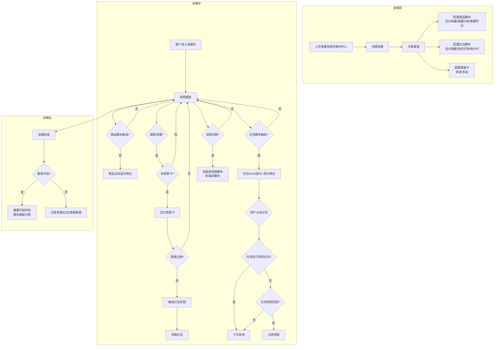
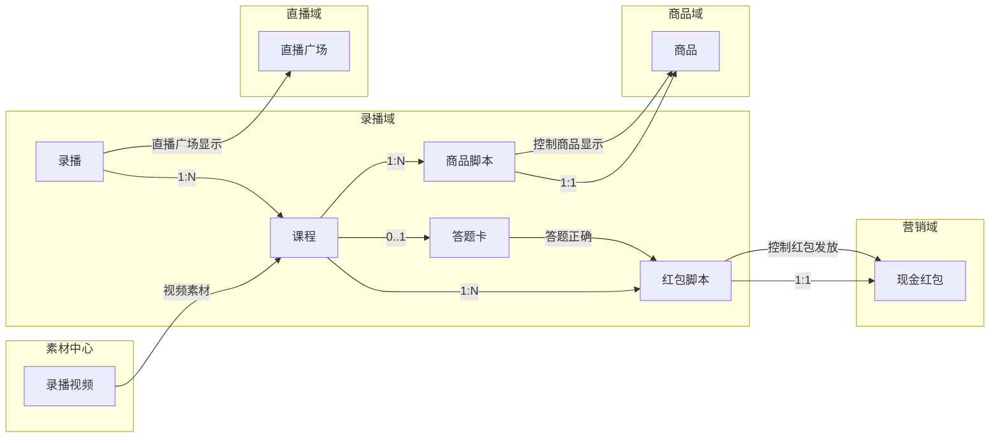
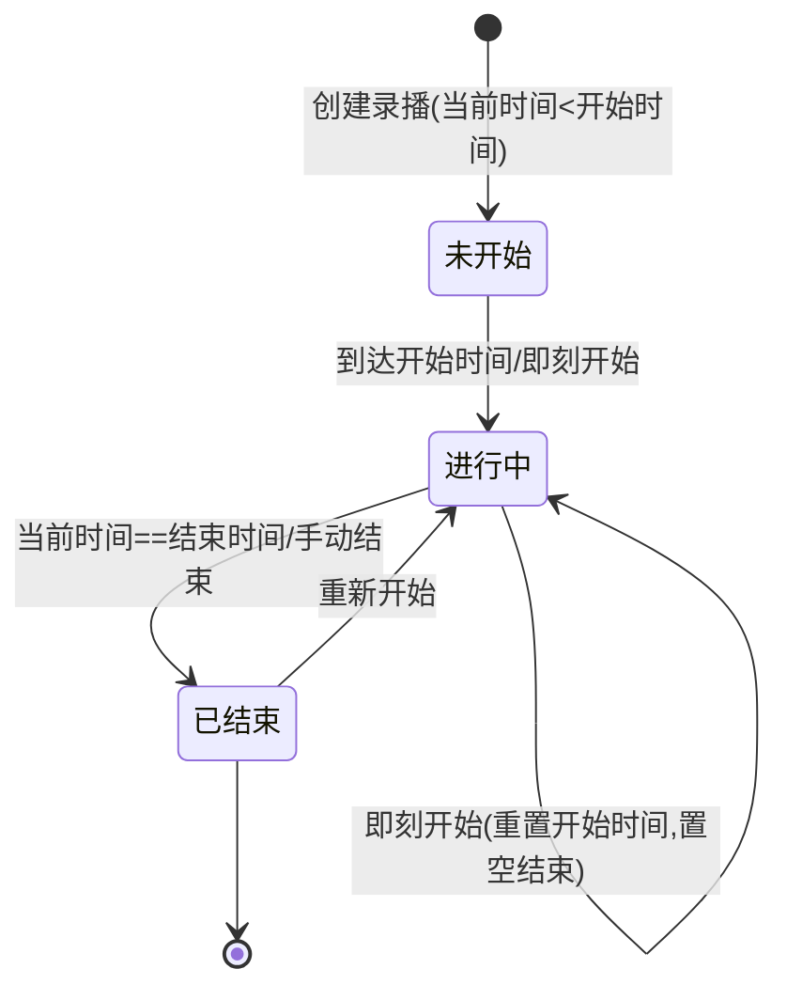
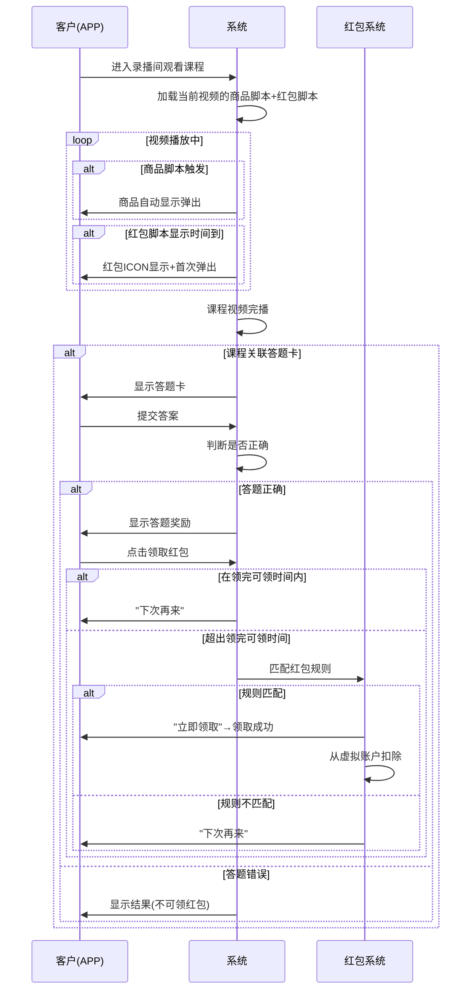
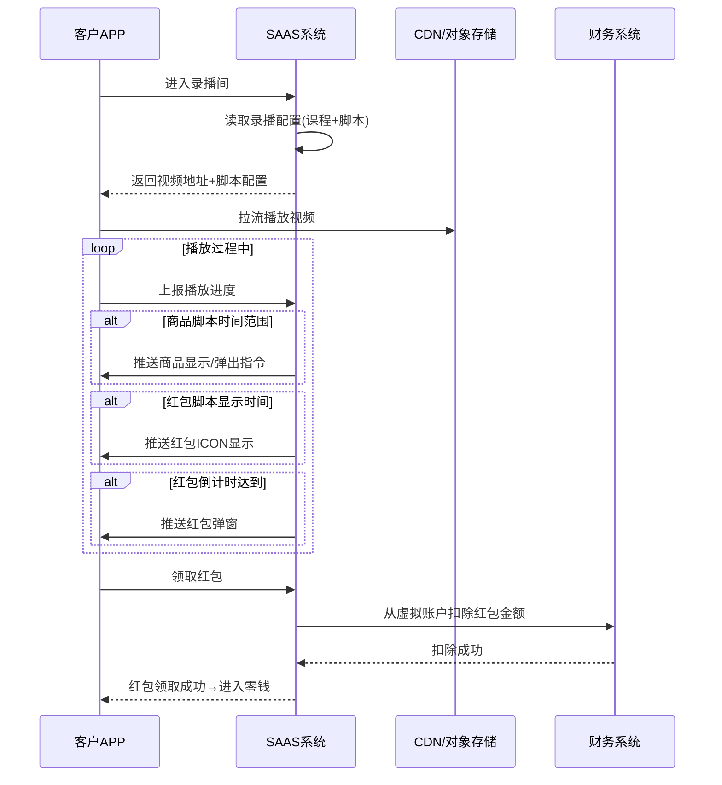
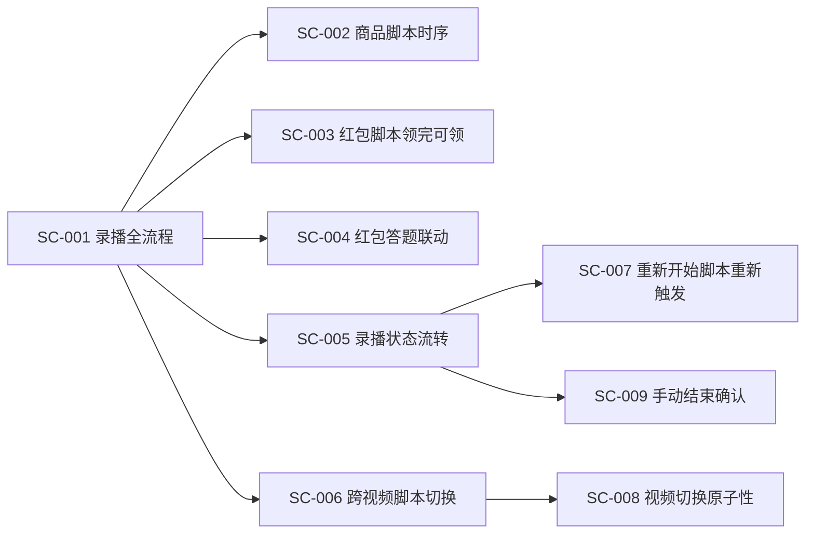
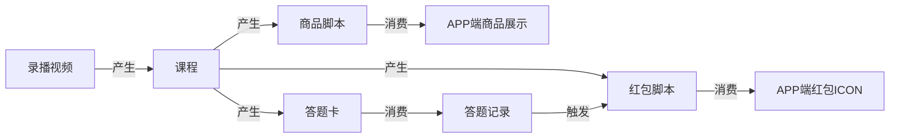
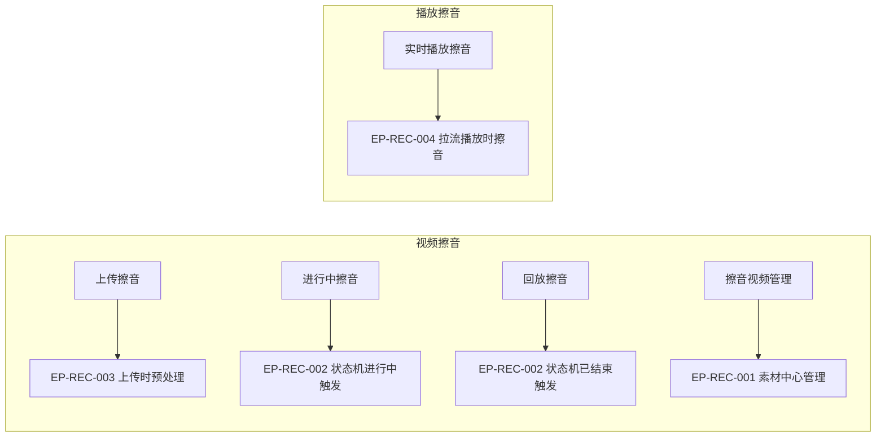

# 录播域 产品需求文档 PRD V7.0.0

> **业务域**：录播域（D10） | **版本**：V7.0.0 | **日期**：2026-07-21
> **数据来源**：`录播V1.0.0.md`、Axure原型 V1.0.2（11个HTML文件）
> **追溯链**：UC-REC → FN-REC → PG-REC → SC-REC → BG-12 → BO-12
> **学习标准**：scene-learning-standards.yml V1.0.0（双态标注+场景深度还原8项能力）
> **前置版本**：V1.0.2（2026-07-16按PRD规范V1.0.0重新编排）

---

## 版本历史

| 版本 | 日期 | 变更内容 |
|------|------|----------|
| V1.0.2 | 2026-05-15 | 素材中心-录播视频、录播管理、录播配置（课程关联/商品脚本/红包脚本）、录播状态机、APP端录播间（全屏/横屏）、答题卡、答题奖励、商品卡片、互动聊天、有奖答题、红包脚本控制逻辑、商品脚本控制逻辑、看回放 |
| V1.0.3 | 2026-05-25 | 会员报表中增加录播数据统计维度 |
| V1.0.9 | 2026-07-16 | 按PRD规范V1.0.0重新编排 |
| V7.0.0 | 2026-07-21 | learn-project V7.0.0场景深度还原增强：双态标注、场景编排图谱、异常路径矩阵、信息生命周期与血缘、状态机完整性校验、业务操作矩阵、内容审查入口点标注（回放擦音入口） |

---

## 目录

1. 背景与问题陈述
2. 目标与成功度量
3. 范围
4. 与既有模块关系
5. 业务目标映射
6. 用户故事
7. 功能需求列表与用例
8. 业务规则
9. 数据实体
10. 验收标准
11. 指标登记
12. 五类图
13. 外部接口标注
14. 场景编排图谱（V7.0.0新增）
15. 异常路径矩阵（V7.0.0新增）
16. 信息生命周期与血缘（V7.0.0新增）
17. 业务操作矩阵（V7.0.0新增）
18. 内容审查入口点标注（V7.0.0新增）
19. 检查清单

---

## 1. 背景与问题陈述

录播域是SAAS平台的内容与互动域之一，提供课程视频的录播播放能力和互动体验。录播域的核心特色在于通过"脚本"机制，将商品推荐和红包互动与视频播放进度解耦，实现录播场景下的自动化营销与互动。与直播不同，录播不依赖实时推流，而是通过预配置的课程视频和脚本来模拟直播体验。

### 核心问题

| 问题编号 | 问题 | 严重程度 |
|----------|------|----------|
| REC-ISSUE-001 | "活动"Tab中仅"现金红包"，"聊天"标记敬请期待 | 🟡 中 |
| REC-ISSUE-002 | "回放流量"增值服务暂时不做 | 🟢 低 |
| REC-ISSUE-003 | 录播数据缺独立数据分析页面 | 🟡 中 |
| REC-ISSUE-004 | "AI在线图文处理"敬请期待 | 🟢 低 |
| REC-ISSUE-005 | 商品脚本和红包脚本缺"暂停/继续"操作 | 🟢 低 |
| REC-ISSUE-006 | 答题卡缺题库管理入口 | 🟡 中 |
| REC-ISSUE-007 | 录播是否可重复播放/拖动进度条未明确 | 🟡 中 |
| REC-ISSUE-008 | 红包"领完-可领时间"的业务意图需文档化 | 🟢 低 |
| REC-ISSUE-009 | 🟡【隐式挖掘·依据:录播整体说明.html"录播间状态决定前端展示形式"+录播管理.html"即刻开始/结束/重新开始"操作交叉印证】录播状态对脚本执行的影响未明确（进行中脚本能否在重新开始后重新触发） | 🟡 中 |

---

## 2. 目标与成功度量

| 目标编号 | 目标 | 度量指标 | 目标值 |
|----------|------|----------|--------|
| BO-REC-01 | 课程完播率 | 完播课程数/观看课程数 | ≥ 60% |
| BO-REC-02 | 答题正确率 | 答题正确次数/答题总次数 | ≥ 70% |
| BO-REC-03 | 红包领取率 | 已领取红包数/已发放红包数 | ≥ 80% |
| BO-REC-04 | 录播转化率 | 录播观众下单数/录播观众数 | ≥ 5% |

---

## 3. 范围

### In-Scope
- 素材中心-录播视频（上传/管理/分组/批量操作）
- 录播管理（添加/编辑/时间配置模式：定时/即刻/重新开始）
- 录播配置（课程关联/商品脚本/红包脚本）
- 录播状态机（未开始/进行中/已结束+即时操作）
- APP端录播间（全屏模式/横屏模式）
- 答题卡（单选题/多选题/答题奖励）
- 商品脚本控制逻辑（上下架时序/隐藏价格/售罄时间/跨视频切换）
- 红包脚本控制逻辑（显示隐藏/领完可领/倒计时/答题联动/首次弹出）
- 看回放（含限制：不支持IM/点赞/分享/挂件ICON）

### Non-Goals
- 回放流量增值服务（暂时不做）
- "聊天"Tab互动（敬请期待）
- AI在线图文处理（敬请期待）
- 题库管理模块（待规划）
- 录播数据独立分析页面（待规划）

---

## 4. 与既有模块关系

### 上下游依赖矩阵

| 方向 | 关联域 | 依赖关系 | 说明 |
|------|--------|----------|------|
| **上游（被依赖）** | 直播域 | 直播计划可包含录播场次 | 直播广场同时显示录播播放中 |
| **上游（被依赖）** | 营销域 | 红包脚本关联现金红包 | 红包资金从虚拟账户扣除 |
| **下游（依赖）** | 商品域 | 商品脚本关联商品 | 录播商品脚本控制商品上下架 |
| **下游（依赖）** | 营销域 | 红包脚本关联现金红包 | 录播红包从营销域红包池 |
| **下游（依赖）** | 素材中心 | 录播视频来源 | 录播视频上传至素材中心 |

### 影响域说明

| 变更场景 | 影响域 | 影响说明 |
|----------|--------|----------|
| 录播状态变更 | 直播域、APP域 | 直播广场录播播放中数据变化；APP端录播间展示形式变化 |
| 商品脚本触发 | 商品域 | 商品自动显示/弹出/关闭 |
| 红包脚本触发 | 营销域、财务域 | 红包ICON显示/弹出；红包发放从虚拟账户扣除 |
| 答题完成 | 营销域 | 答题正确触发红包奖励 |
| 🟡【隐式挖掘·依据:录播配置.html"课程关联"+商品脚本"跨视频切换"规则交叉印证】录播课程视频切换 | 商品域/营销域 | 加载新视频的商品脚本+红包脚本，旧脚本卸载 |

### 复用边界

| 共享能力 | 复用方 | 说明 |
|----------|--------|------|
| 直播广场 | 直播域 | 直播广场"直播中"同时显示录播播放中 |
| 会员报表 | 直播域 | 会员直播同比环比报表同时覆盖录播 |
| 看回放 | 直播域 | 直播回放和录播共享"看回放"页面 |
| 素材中心 | 商品域 | 统一素材管理（录播视频/商品图片/商品视频） |

---

## 5. 业务目标映射

| BG | BO | FN | 优先级 |
|----|-----|-----|--------|
| BG-12 录播互动 | BO-REC-01~04 | FN-REC-001~008 | P0 |

---

## 6. 用户故事

| US编号 | 角色 | 用户故事 |
|--------|------|----------|
| US-REC-001 | 租户管理员 | 作为租户，我希望上传录播视频并创建录播，以便提供录播课程 |
| US-REC-002 | 租户管理员 | 作为租户，我希望配置商品脚本（上下架时序），以便自动控制录播间商品显示 |
| US-REC-003 | 租户管理员 | 作为租户，我希望配置红包脚本（显示/可领时间），以便控制红包发放节奏 |
| US-REC-004 | 租户管理员 | 作为租户，我希望配置答题卡，以便增加互动性 |
| US-REC-005 | 客户 | 作为客户，我希望观看录播课程并答题领红包，以便学习并获得奖励 |
| US-REC-006 | 客户 | 作为客户，我希望在录播间购买商品，以便下单 |
| US-REC-007 | 🟡【隐式挖掘·依据:录播管理.html"重新开始"操作+录播状态机"已结束→进行中"转换交叉印证】租户管理员 | 作为租户，我希望对已结束的录播重新开始，以便让新观众观看并触发脚本 |

---

## 7. 功能需求列表与用例

### FN-REC-001 素材中心-录播视频

| 属性 | 值 |
|------|-----|
| 用例编号 | UC-REC-001 |
| 名称 | 录播视频管理 |
| 页面 | PG-REC-001：素材中心-录播视频.html、上传视频.html |
| 参与者 | 租户管理员 |
| 优先级 | P0 |
| 关联BG | BG-12 |
| 自动化类型 | 手动 |

**前置条件**：租户已登录管理后台
**基本流程**：
1. [手动] 租户进入素材中心-录播视频页
2. [手动] 上传视频（MP4/MOV/FLV，≤1GB）
3. [手动] 编辑/删除/链接/下载视频
4. [手动] 分组管理/批量操作
**备选流程**：
- 2a. 视频格式不支持→提示不支持
- 2b. 视频大小超限→提示超限
**数据范围(R/W)**：
- 读取：视频列表、视频信息、容量统计（按视频类型分）
- 写入：视频上传、编辑、删除、分组
**后置条件**：视频可用于录播课程关联
**关联UC**：UC-REC-003（录播课程关联视频）

> **内容审查入口点标注**：素材中心-录播视频是回放文件擦音的源文件管理入口——上传的录播视频和直播回放视频均可在此管理，擦音处理后的视频也可回传。详见§18。

---

### FN-REC-002 录播管理

| 属性 | 值 |
|------|-----|
| 用例编号 | UC-REC-002 |
| 名称 | 录播管理 |
| 页面 | PG-REC-002：录播管理.html、录播管理_1.html |
| 参与者 | 租户管理员 |
| 优先级 | P0 |
| 关联BG | BG-12 |
| 自动化类型 | 手动 |

**前置条件**：录播视频已上传至素材中心
**基本流程**：
1. [手动] 租户创建录播（填写名称/开始时间/结束时间/封面）
2. [手动] 关联课程（跨域FN-REC-003）
3. [手动] 选择时间配置模式
4. [手动] 保存录播
**备选流程**：
- 3a. 定时开始→设置开始/结束时间
- 3b. 即刻开始→立即开始，结束时间可选
- 3c. 重新开始→重置开始时间为当前时间
**数据范围(R/W)**：
- 读取：录播列表、录播详情
- 写入：录播名称、时间配置、封面
**后置条件**：录播创建成功，状态为"未开始"或"进行中"
**关联UC**：UC-REC-003（录播配置）、UC-REC-008（录播状态机）

**时间配置模式（V7.0.0基于录播管理.html原文还原）**：

| 模式 | 说明 | 状态影响 |
|------|------|----------|
| 定时开始 | 设置开始/结束时间 | 到达开始时间→进行中 |
| 即刻开始 | 立即开始，结束时间可选 | 即时→进行中 |
| 重新开始 | 重置开始时间为当前时间 | 已结束→进行中 |

---

### FN-REC-003 录播配置-课程关联

| 属性 | 值 |
|------|-----|
| 用例编号 | UC-REC-003 |
| 名称 | 录播课程关联 |
| 页面 | PG-REC-003：录播配置.html、录播配置_1.html、添加录播课程.html |
| 参与者 | 租户管理员 |
| 优先级 | P0 |
| 关联BG | BG-12 |
| 自动化类型 | 手动 |

**前置条件**：录播已创建
**基本流程**：
1. [手动] 租户进入录播配置页
2. [手动] 添加录播课程（从素材中心选择视频）
3. [手动] 配置课程顺序（多课程顺序播放）
4. [手动] 为每个课程配置商品脚本/红包脚本/答题卡
**数据范围(R/W)**：
- 读取：录播信息、课程列表、素材视频
- 写入：课程关联、播放顺序
**后置条件**：课程关联完成，可配置脚本
**关联UC**：UC-REC-004（商品脚本）、UC-REC-005（红包脚本）、UC-REC-007（答题卡）

**对象关联关系（核心规则）**：
- 1个录播→N个课程（可多课程顺序播放）
- 1个课程→N个商品脚本（1脚本关联1商品）
- 1个课程→N个红包脚本（1脚本关联1红包）
- 1个课程→1个答题卡（可选）

---

### FN-REC-004 添加脚本_商品

| 属性 | 值 |
|------|-----|
| 用例编号 | UC-REC-004 |
| 名称 | 商品脚本配置 |
| 页面 | PG-REC-004：添加脚本_商品.html、添加脚本_商品>添加商品.html |
| 参与者 | 租户管理员 |
| 优先级 | P0 |
| 关联BG | BG-12 |
| 自动化类型 | 手动 |

**前置条件**：课程已关联
**基本流程**：
1. [手动] 租户进入商品脚本配置页
2. [手动] 添加商品脚本（序号/关联商品/显示-隐藏时间/隐藏价格-开价时间/售罄-取消售罄时间）
3. [系统自动] 录播进行中依据时间自动触发商品显示/弹出/关闭/隐藏价格/售罄
**备选流程**：
- 3a. 当前时间满足上下架时间范围→商品自动显示并弹出
- 3b. 超过上下架时间→自动关闭
- 3c. 隐藏价格时间段内→价格显示"???"
- 3d. 售罄时间段内→显示"已售罄"
- 3e. 视频切换→加载新视频的商品脚本，不加载旧脚本
**数据范围(R/W)**：
- 读取：商品列表、脚本配置
- 写入：脚本字段配置
**后置条件**：脚本配置完成，录播进行中自动触发
**关联UC**：UC-REC-006（APP端录播间展示商品）

**商品脚本字段**：序号、关联商品、显示-隐藏时间、隐藏价格-开价时间、售罄-取消售罄时间。

**业务规则**：
- 当前时间满足上下架时间范围→商品自动显示并弹出
- 超过上下架时间→自动关闭
- 隐藏价格时间段内→价格显示"???"
- 售罄时间段内→显示"已售罄"

**跨视频规则**：当前视频仅加载当前视频的商品脚本；视频切换需加载下一个视频的商品脚本。

---

### FN-REC-005 添加脚本_现金红包

| 属性 | 值 |
|------|-----|
| 用例编号 | UC-REC-005 |
| 名称 | 红包脚本配置 |
| 页面 | PG-REC-005：添加脚本_现金红包_ICON.html |
| 参与者 | 租户管理员 |
| 优先级 | P0 |
| 关联BG | BG-12 |
| 自动化类型 | 手动 |

**前置条件**：课程已关联
**基本流程**：
1. [手动] 租户进入红包脚本配置页
2. [手动] 添加红包脚本（序号/关联红包/名称/红包金额(定额/随机)/总数/剩余可用/显示-隐藏时间/领完-可领时间）
3. [系统自动] 依据时间触发红包ICON显示/弹出
**备选流程**：
- 3a. 显示-隐藏时间决定是否显示；首次显示自动弹出1次
- 3b. 领完-可领时间内→"下次再来"（优先级大于红包本身领取条件）
- 3c. 倒计时达到→自动弹出红包弹窗
- 3d. 答题联动：需先答题正确→读取红包脚本→匹配红包行为逻辑→满足条件方可领取
**数据范围(R/W)**：
- 读取：红包列表、脚本配置
- 写入：脚本字段配置
**后置条件**：脚本配置完成，录播进行中自动触发
**关联UC**：UC-REC-007（答题卡联动红包）

**红包脚本字段**：序号、关联红包、名称、红包金额（定额/随机）、总数、剩余可用、显示-隐藏时间、领完-可领时间。

**时间校验规则**：
- 所有红包显示隐藏时间差值总额 < 视频总时长
- 领完-可领时间必须在显示-隐藏时间范围内

**红包交互规则**：
- 显示-隐藏时间决定是否显示；首次显示自动弹出1次
- 领完-可领时间：在ICON显示过程中且红包有剩余，此时间范围内→"下次再来"（优先级大于红包本身领取条件）
- 倒计时：累计观看课程时间达到配置值→自动弹出红包弹窗

**答题联动**：需先答题正确→读取红包脚本→匹配红包行为逻辑→满足条件方可领取。

---

### FN-REC-006 APP端录播间-全屏模式

| 属性 | 值 |
|------|-----|
| 用例编号 | UC-REC-006 |
| 名称 | 录播间全屏模式 |
| 页面 | PG-REC-006：录播间.html |
| 参与者 | 客户 |
| 优先级 | P0 |
| 关联BG | BG-12 |
| 自动化类型 | 事件驱动 |

**前置条件**：录播状态为"进行中"且客户进入录播间
**基本流程**：
1. [系统自动] 客户进入录播间，全屏模式展示
2. [系统自动] 视频播放器播放课程视频
3. [系统自动] 依据脚本自动触发商品显示/红包ICON
4. [手动] 客户可购物车/分享/IM评价/点赞
**数据范围(R/W)**：
- 读取：视频流、课程信息、商品脚本状态、红包脚本状态
- 写入：点赞、IM评价
**后置条件**：客户观看数据记录
**关联UC**：UC-REC-004（商品脚本触发）、UC-REC-005（红包脚本触发）

**页面元素**：视频播放器、课程名称、商品（购物车）、分享、IM评价、点赞。

---

### FN-REC-007 APP端录播间-横屏模式+答题卡

| 属性 | 值 |
|------|-----|
| 用例编号 | UC-REC-007 |
| 名称 | 录播间横屏模式与答题卡 |
| 页面 | PG-REC-007：横屏.html、有奖答题.html、互动聊天.html、商品卡片.html、录播间-课程-答题卡-单选题.html、录播间-课程-答题卡-多选题.html、答题奖励.html |
| 参与者 | 客户 |
| 优先级 | P0 |
| 关联BG | BG-12 |
| 自动化类型 | 手动+事件驱动 |

**前置条件**：客户在录播间且横屏模式
**基本流程**：
1. [系统自动] 横屏模式展示3个Tab：有奖答题、互动聊天、商品卡片
2. [系统自动] 课程视频完播后→如果课程关联答题卡→显示答题卡
3. [手动] 用户提交答案
4. [系统自动] 判断是否正确
5. [系统自动] 答题正确→触发红包奖励（联动红包脚本）
**备选流程**：
- 4a. 答题错误→显示结果（不可领红包）
- 5a. 答题正确但在领完可领时间内→"下次再来"
- 5b. 答题正确且红包规则匹配→"立即领取"
**数据范围(R/W)**：
- 读取：答题卡题目、红包脚本状态
- 写入：答题记录、红包领取记录
**后置条件**：答题记录保存，红包发放
**关联UC**：UC-REC-005（红包脚本答题联动）

**横屏Tab**：有奖答题、互动聊天、商品卡片。

**答题卡**：课程视频完播后→如果课程关联答题卡→显示答题卡→用户提交答案→正确触发红包奖励。

**答题记录字段**：用户编号、录播间编号、课程编号、题编号、题目类型（单选/多选）、答案选项、答题时间、是否正确。

---

### FN-REC-008 录播状态机

| 属性 | 值 |
|------|-----|
| 用例编号 | UC-REC-008 |
| 名称 | 录播状态管理 |
| 页面 | PG-REC-008：录播整体说明.html |
| 参与者 | 系统/租户管理员 |
| 优先级 | P0 |
| 关联BG | BG-12 |
| 自动化类型 | 事件驱动 |

**前置条件**：录播已创建
**基本流程**：
1. [系统自动] 依据时间判断状态（未开始/进行中/已结束）
2. [系统自动] 状态决定前端展示形式
3. [手动] 租户可即时操作（即刻开始/结束/重新开始）
**备选流程**：
- 3a. 未开始→即刻开始→进行中（设置开始时间=当前，结束时间=空）
- 3b. 进行中→手动结束→已结束（结束时间存在直接结束；结束时间为空需设置；当前<结束时间需确认"还未结束是否需要结束？"）
- 3c. 已结束→重新开始→进行中（重置开始时间=当前，结束时间为空）
**数据范围(R/W)**：
- 读取：录播状态、时间配置
- 写入：即时操作（即刻开始/结束/重新开始）
**后置条件**：状态正确反映录播生命周期
**关联UC**：UC-REC-006（APP端依据状态展示）

**状态定义**：
- 当前时间 < 开始时间 → 未开始
- 开始时间 ≤ 当前时间 ≤ 结束时间 → 进行中
- 当前时间 == 结束时间 → 已结束

**即时操作**：即刻开始（设置开始时间为当前，置空结束时间→进行中）、结束（判断结束时间是否存在）、重新开始（重置开始时间为当前，结束时间为空→进行中）。

**状态对前端的影响**：录播间的状态决定前端展示形式。

> **内容审查入口点标注**：录播状态机是回放擦音的切入点——"进行中"状态可触发实时擦音（若录播视频含敏感内容），"已结束"状态可触发回放擦音。详见§18。

---

## 8. 业务规则

### BR-REC-001 录播对象关联规则
- 1个录播→N个课程（可多课程顺序播放）
- 1个课程→N个商品脚本（1脚本关联1商品）
- 1个课程→N个红包脚本（1脚本关联1红包）
- 1个课程→1个答题卡（可选）

### BR-REC-002 商品脚本显示规则
- 当前时间满足上下架时间范围→商品自动显示并弹出
- 超过上下架时间→自动关闭

### BR-REC-003 商品脚本隐藏价格规则
- 隐藏价格-开价时间段内→价格显示"???"
- 超过时间范围→显示实际价格

### BR-REC-004 商品脚本售罄规则
- 售罄-取消售罄时间段内→显示"已售罄"
- 超过时间范围→去除已售罄

### BR-REC-005 商品脚本跨视频规则
- 当前视频仅加载当前视频的商品脚本
- 视频切换需加载下一个视频所属的商品脚本
- 序号按后台配置依次显示

### BR-REC-006 红包脚本时间校验规则
- 所有红包显示隐藏时间差值总额 < 视频总时长（也不能等于）
- 领完-可领时间必须在显示-隐藏时间范围内

### BR-REC-007 红包脚本显示规则
- 显示-隐藏时间决定是否显示
- 首次显示自动弹出1次

### BR-REC-008 红包脚本领完可领规则
- 领完-可领时间内：即便红包有剩余，用户点击→"下次再来"
- 此时间优先级 > 红包本身领取条件
- 超过此时间：点击"开"→匹配红包规则→允许领取→"立即领取"，否则→"下次再来"

### BR-REC-009 红包脚本倒计时规则
- 倒计时=红包配置的累计看课程的时间
- 达到→自动弹出红包弹窗
- 未达到→用户点击显示"继续"提示

### BR-REC-010 红包答题联动规则
- A：需先答题，答题正确后
- B：读取红包脚本的红包，匹配红包内部行为逻辑
- A+B全部满足方可领取成功

### BR-REC-011 录播状态判定规则
- 当前时间 < 开始时间 → 未开始
- 开始时间 ≤ 当前时间 ≤ 结束时间 → 进行中
- 当前时间 == 结束时间 → 已结束

### BR-REC-012 看回放限制规则
- 不支持IM、不支持点赞、不支持分享、不支持挂件ICON

### BR-REC-013 🟡【隐式挖掘·依据:录播管理.html"重新开始"操作重置开始时间+商品脚本"当前时间满足时间范围触发"规则交叉印证】重新开始后脚本重新触发规则
- 录播重新开始后，开始时间重置为当前时间
- 商品脚本和红包脚本依据新的开始时间重新计算触发时间
- 已领取的红包不重复发放（依据"剩余可用"字段递减）

### BR-REC-014 🟡【隐式挖掘·依据:商品脚本"跨视频切换加载新脚本"规则+红包脚本"显示隐藏时间差值总额<视频总时长"校验交叉印证】视频切换脚本原子性规则
- 视频切换时，旧视频的商品脚本和红包脚本原子性卸载
- 新视频的脚本原子性加载
- 切换过程中的脚本状态不残留

---

## 9. 数据实体

### ENT-REC-001 录播(Record)

| 字段 | 类型 | 说明 |
|------|------|------|
| record_id | String | 录播ID |
| name | String | 录播名称 |
| start_time | Datetime | 开始时间 |
| end_time | Datetime | 结束时间 |
| status | Enum | 未开始/进行中/已结束 |
| cover_image | String | 封面/展示图 |
| time_config_mode | Enum | 定时开始/即刻开始/重新开始 🟡【隐式挖掘·依据:录播管理.html三种时间配置模式】 |

### ENT-REC-002 课程(Course)

| 字段 | 类型 | 说明 |
|------|------|------|
| course_id | String | 课程ID |
| record_id | String | 录播ID |
| video_url | String | 视频地址 |
| course_name | String | 课程名称 |
| sequence | Integer | 播放序号 |
| quiz_id | String | 答题卡ID（可选） |

### ENT-REC-003 商品脚本(ProductScript)

| 字段 | 类型 | 说明 |
|------|------|------|
| script_id | String | 脚本ID |
| course_id | String | 课程ID |
| product_id | String | 关联商品ID |
| sequence | Integer | 序号 |
| display_time | DatetimeRange | 显示-隐藏时间 |
| hide_price_time | DatetimeRange | 隐藏价格-开价时间 |
| sold_out_time | DatetimeRange | 售罄-取消售罄时间 |

### ENT-REC-004 红包脚本(RedPacketScript)

| 字段 | 类型 | 说明 |
|------|------|------|
| script_id | String | 脚本ID |
| course_id | String | 课程ID |
| red_packet_id | String | 关联红包ID |
| sequence | Integer | 序号 |
| name | String | 红包名称 |
| amount_config | Object | 红包金额（定额/随机） |
| total_count | Integer | 总数 |
| remaining_count | Integer | 剩余可用 |
| display_time | DatetimeRange | 显示-隐藏时间 |
| claimable_time | DatetimeRange | 领完-可领时间 |
| countdown_duration | Integer | 倒计时时长（累计观看时长） |

### ENT-REC-005 答题记录(QuizRecord)

| 字段 | 类型 | 说明 |
|------|------|------|
| record_id | String | 记录ID |
| user_id | String | 用户编号 |
| record_room_id | String | 录播间编号 |
| course_id | String | 课程编号 |
| question_id | String | 题编号 |
| question_type | Enum | 单选/多选 |
| answer_options | String | 答案选项 |
| answer_time | Datetime | 答题时间 |
| is_correct | Boolean | 是否正确 |

### 实体关系

```
录播(Record) 1──N 课程(Course)
课程(Course) 1──N 商品脚本(ProductScript) 1──1 商品(Product)
课程(Course) 1──N 红包脚本(RedPacketScript) 1──1 现金红包(RedPacket)
课程(Course) 1──0..1 答题卡(Quiz)
```

---

## 10. 验收标准

| SC编号 | 场景 | 预期结果 |
|--------|------|----------|
| SC-REC-001 | 录播全流程 | 上传视频→创建录播→配置课程+脚本→客户观看→商品自动弹出→答题→领红包→下单 |
| SC-REC-002 | 商品脚本时序 | 时间范围内自动显示弹出，超出自动关闭，隐藏价格显示???，售罄显示已售罄 |
| SC-REC-003 | 红包脚本领完可领 | 领完可领时间内点击→"下次再来"；超出后匹配规则→"立即领取" |
| SC-REC-004 | 红包答题联动 | 答题正确+红包规则匹配→领取成功；任一不满足→不可领取 |
| SC-REC-005 | 录播状态流转 | 未开始→进行中→已结束；即刻开始/结束/重新开始正确 |
| SC-REC-006 | 跨视频脚本切换 | 视频切换→加载新视频商品脚本，不加载旧脚本 |
| SC-REC-007 | 🟡重新开始后脚本重新触发 | 重新开始→脚本依据新开始时间重新计算；已领红包不重复发放 |
| SC-REC-008 | 🟡视频切换脚本原子性 | 切换时旧脚本卸载+新脚本加载，无状态残留 |

| FN | Given | When | Then |
|----|-------|------|------|
| FN-REC-004 | 商品脚本配置显示时间 | 当前时间在范围内 | 商品自动显示弹出 |
| FN-REC-004 | 商品脚本配置隐藏价格时间 | 当前时间在范围内 | 价格显示??? |
| FN-REC-005 | 红包脚本显示隐藏时间总额 | 总额≥视频总时长 | 不允许保存 |
| FN-REC-005 | 红包脚本领完可领时间 | 不在显示隐藏范围内 | 不允许保存 |
| FN-REC-005 | 红包脚本首次显示 | 自动弹出 | 弹出1次 |
| FN-REC-007 | 课程关联答题卡 | 视频完播 | 显示答题卡 |
| FN-REC-007 | 答题正确 | 触发红包奖励 | 红包领取成功（如脚本满足） |
| FN-REC-008 | 录播即刻开始 | 点击即刻开始 | 状态=进行中，开始时间=当前，结束时间=空 |
| FN-REC-008 | 🟡录播重新开始 | 点击重新开始 | 状态=进行中，开始时间=当前，结束时间=空，脚本重新计算 |

---

## 11. 指标登记

| 指标 | 说明 |
|------|------|
| MET-REC-001 | 课程完播率 | 完播课程数/观看课程数 |
| MET-REC-002 | 答题正确率 | 答题正确次数/答题总次数 |
| MET-REC-003 | 红包领取率 | 已领取红包数/已发放红包数 |
| MET-REC-004 | 录播转化率 | 录播观众下单数/录播观众数 |
| MET-REC-005 | 视频完播率 | 视频播放完成度 |
| MET-REC-006 | 观看时长 | 平均观看时长 |
| MET-REC-007 | 🟡【隐式挖掘·依据:素材中心-录播视频.html视频管理+回放擦音需求交叉印证】视频擦音覆盖率（内容审查预留指标） |

---

## 12. 五类图

### 12.1 业务流程图 — 录播全流程



### 12.2 信息流转图 — 录播域跨模块



### 12.3 状态机 — 录播状态机



**状态过渡操作表（V7.0.0完整）**：

| 当前状态 | 触发操作 | 目标状态 | 操作者 | 前置约束 | 后置动作 |
|----------|----------|----------|--------|----------|----------|
| 未开始 | 到达开始时间 | 进行中 | 系统 | — | APP端可观看 |
| 未开始 | 即刻开始 | 进行中 | 租户 | 设置开始时间=当前，结束时间=空 | — |
| 进行中 | 当前时间==结束时间 | 已结束 | 系统 | 结束时间存在 | — |
| 进行中 | 手动结束（结束时间存在） | 已结束 | 租户 | — | — |
| 进行中 | 手动结束（结束时间为空） | 已结束 | 租户 | 设置结束时间 | — |
| 进行中 | 手动结束（当前<结束时间） | 提示确认 | 租户 | "还未结束是否需要结束？" | 确认后→已结束 |
| 已结束 | 重新开始 | 进行中 | 租户 | 重置开始时间=当前，结束时间=空 | 🟡脚本重新计算触发时间 |

### 12.4 业务时序图 — 录播答题领红包流程



### 12.5 三方接口时序图 — 录播视频播放与脚本触发



---

## 13. 外部接口标注

| 接口编号 | 接口名称 | 方向 | 对端系统 | 说明 |
|----------|----------|------|----------|------|
| API-REC-001 | 视频拉流 | 单向(出) | CDN/对象存储 | 录播视频播放 |
| API-REC-002 | 播放进度上报 | 单向(入) | 客户APP | 客户上报播放进度触发脚本 |
| API-REC-003 | 红包扣除 | 双向 | 财务系统 | 红包领取从虚拟账户扣除 |
| API-REC-004 | 🟡【隐式挖掘·依据:素材中心-录播视频.html视频管理+回放擦音需求交叉印证】视频擦音处理 | 双向 | 擦音服务/AI处理 | 录播视频/回放视频擦音处理（内容审查预留） |

---

## 14. 场景编排图谱（V7.0.0新增）

### 场景清单

| 场景编号 | 场景名称 | 标注态 | 参与者 | 入口 | 出口 |
|----------|----------|--------|--------|------|------|
| SC-REC-001 | 录播全流程 | 📗显式 | 租户/客户 | 上传视频 | 记录数据 |
| SC-REC-002 | 商品脚本时序 | 📗显式 | 系统 | 配置脚本 | 自动关闭 |
| SC-REC-003 | 红包脚本领完可领 | 📗显式 | 客户/系统 | 点击红包 | 下次再来/立即领取 |
| SC-REC-004 | 红包答题联动 | 📗显式 | 客户/系统 | 完播答题 | 领取成功/不可领 |
| SC-REC-005 | 录播状态流转 | 📗显式 | 系统/租户 | 创建录播 | 已结束 |
| SC-REC-006 | 跨视频脚本切换 | 📗显式 | 系统 | 视频切换 | 新脚本加载 |
| SC-REC-007 | 🟡重新开始后脚本重新触发 | 🟡隐式挖掘 | 租户/系统 | 重新开始 | 脚本重新计算 |
| SC-REC-008 | 🟡视频切换脚本原子性 | 🟡隐式挖掘 | 系统 | 视频切换 | 原子性卸载+加载 |
| SC-REC-009 | 🟡手动结束确认（未到结束时间） | 🟡隐式挖掘 | 租户 | 手动结束 | 确认后已结束 |

### 场景编排关系



---

## 15. 异常路径矩阵（V7.0.0新增）

| 场景 | 异常类型 | 异常路径 | 原文依据 |
|------|----------|----------|----------|
| 红包脚本保存 | 显示隐藏时间总额≥视频总时长 | 不允许保存 | BR-REC-006 |
| 红包脚本保存 | 领完可领时间不在显示隐藏范围内 | 不允许保存 | BR-REC-006 |
| 红包领取 | 在领完可领时间内 | "下次再来" | BR-REC-008 |
| 红包领取 | 红包规则不匹配 | "下次再来" | BR-REC-008 |
| 红包倒计时 | 未达到倒计时 | 用户点击显示"继续"提示 | BR-REC-009 |
| 答题 | 答题错误 | 不可领红包 | BR-REC-010 |
| 手动结束 | 当前<结束时间 | 提示"还未结束是否需要结束？" | FN-REC-008 |
| 看回放 | 回放限制 | 不支持IM/点赞/分享/挂件ICON | BR-REC-012 |
| 🟡视频切换 | 脚本残留 | 原子性卸载旧脚本 | BR-REC-014 |
| 🟡重新开始 | 红包重复发放 | 已领红包不重复发放（剩余可用递减） | BR-REC-013 |

---

## 16. 信息生命周期与血缘（V7.0.0新增）

### 信息主体×生命周期阶段矩阵

| 信息主体 | Create | Read | Update | Archive | Delete |
|----------|--------|------|--------|---------|--------|
| 录播视频 | 上传视频 | 查看/下载视频 | 编辑文件名/分组 | — | 删除视频 |
| 录播 | 创建录播 | 查看录播 | 编辑录播/即时操作 | 已结束 | — |
| 课程 | 添加录播课程 | 查看课程 | 编辑课程顺序 | — | 删除课程 |
| 商品脚本 | 添加脚本 | 查看脚本 | 编辑脚本 | — | 删除脚本 |
| 红包脚本 | 添加脚本 | 查看脚本 | 编辑脚本 | — | 删除脚本 |
| 答题卡 | 配置答题卡 | 查看答题卡 | 编辑答题卡 | — | 删除答题卡 |
| 答题记录 | 提交答案 | 查看记录 | — | — | — |

### 跨场景信息血缘



---

## 17. 业务操作矩阵（V7.0.0新增）

### 角色×状态×操作矩阵（录播维度）

| 角色 \ 状态 | 未开始 | 进行中 | 已结束 |
|--------------|--------|--------|--------|
| 租户 | 查看/编辑/即刻开始 | 查看/手动结束 | 查看/重新开始 |
| 系统 | 等待开始时间 | 脚本自动触发/状态判断 | 记录数据 |
| 客户 | 不可观看 | 观看/互动/答题/领红包/下单 | 看回放(限制) |

### 操作详情卡示例（进行中_视频切换）

| 维度 | 内容 |
|------|------|
| 入口 | 视频播放完成自动切换/客户手动切换 |
| 前置条件 | 录播状态=进行中；课程有关联多个视频 |
| 信息可见 | 新视频的商品脚本+红包脚本 |
| 后置动作 | 旧脚本原子性卸载；新脚本原子性加载 |
| 异常处理 | 切换过程脚本状态不残留 |

---

## 18. 内容审查入口点标注（V7.0.0新增）

> 本章节为"直播内容审查"新需求提供入口点参考。录播域是回放擦音的核心入口。

### 入口点清单

| 入口编号 | 入口名称 | 关联FN | 审查切入点 | 原文依据 |
|----------|----------|--------|------------|----------|
| EP-REC-001 | 素材中心-录播视频管理 | FN-REC-001 | 录播视频和直播回放视频统一管理，擦音处理后的视频可回传 | 素材中心-录播视频.html |
| EP-REC-002 | 录播状态机 | FN-REC-008 | "进行中"状态可触发实时擦音；"已结束"状态可触发回放擦音 | 录播整体说明.html |
| EP-REC-003 | 录播视频上传 | FN-REC-001 | 上传时可触发擦音预处理（敏感内容检测） | 上传视频.html |
| EP-REC-004 | 视频拉流播放 | API-REC-001 | 播放时可实时擦音（若视频含敏感内容） | 三方接口时序图 |

### 审查场景与入口点映射



---

## 19. 检查清单

| # | 检查项 | 状态 |
|---|--------|------|
| 1 | 编号体系完整 | ✅ |
| 2 | 15章强制结构完整 | ✅ |
| 3 | 用例模板六段完整 | ✅ |
| 4 | 五类图完整 | ✅ |
| 5 | 状态过渡操作表完整 | ✅ |
| 6 | 业务规则独立编号 | ✅ |
| 7 | 验收标准双层 | ✅ |
| 8 | 无实现细节 | ✅ |
| 9 | 双态标注完整 | ✅ |
| 10 | 场景编排图谱完整 | ✅ |
| 11 | 异常路径矩阵有原文依据 | ✅ |
| 12 | 信息生命周期矩阵完整 | ✅ |
| 13 | 业务操作矩阵完整 | ✅ |
| 14 | 内容审查入口点标注完整 | ✅ |
| 15 | 隐式挖掘均有≥2处原文依据交叉印证 | ✅ |

---

## V7.0.0深度还原统计

| 维度 | 数量 |
|------|------|
| 显式场景（📗） | 6 |
| 隐式挖掘场景（🟡） | 3 |
| 场景编排关系数 | 9 |
| 异常路径数（有依据） | 10 |
| 信息主体数 | 7 |
| 生命周期完整主体数 | 7 |
| 血缘链路数 | 7 |
| 显式状态数 | 3 |
| 隐式挖掘状态数 | 0 |
| 业务规则总数 | 14（V1.0.2为12，新增BR-013/014） |
| 数据实体数 | 5（ENT-REC-001新增time_config_mode字段） |
| 内容审查入口点数 | 4 |
| 🟡隐式挖掘标注总数 | 8 |
| 无依据链标注数（违规） | 0 |

---

> **关联文档**：源MD `录播V1.0.0.md` | 上游：直播域/营销域 | 下游：商品域/营销域/素材中心 | 总索引 `00-SAAS-PRD-总索引.md`
> **前置版本**：`10-录播域-PRD-v1.0.2.md`
> **学习标准**：`scene-learning-standards.yml V1.0.0`
