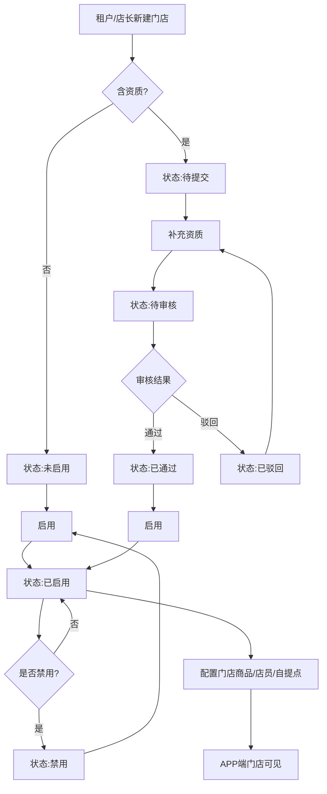
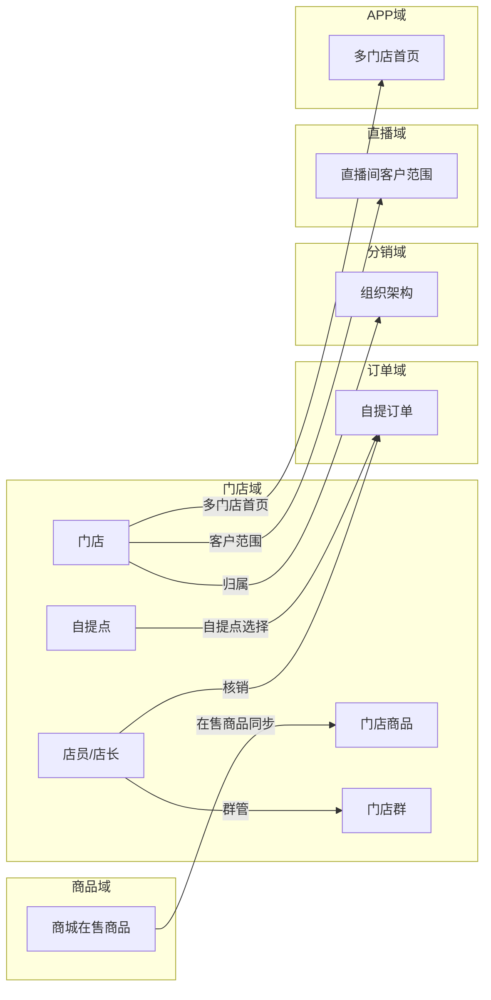
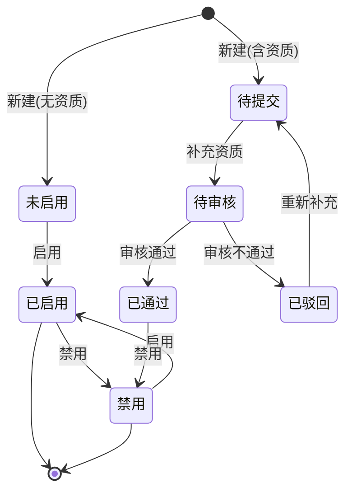
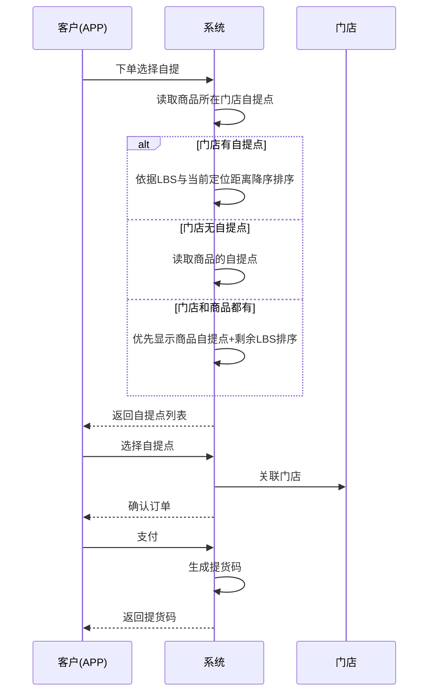
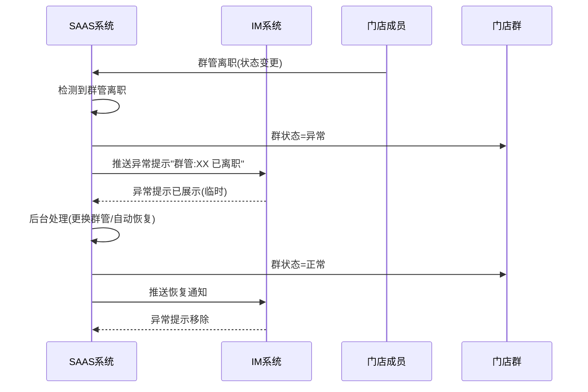

# 门店域 产品需求文档 PRD V1.0.3

> **业务域**：门店域（D11） | **版本**：V1.0.3（整合 V1.0.2~V1.0.3） | **日期**：2026-07-16
> **数据来源**：`门店V1.0.0.md`、Axure原型 V1.0.2~V1.0.3
> **追溯链**：UC-STM → FN-STM → PG-STM → SC-STM → BG-13 → BO-STM

---

## 版本历史

| 版本 | 日期 | 变更内容 |
|------|------|----------|
| V1.0.2 | 2026-05-15 | 门店管理基础功能、门店分组、门店成员管理、门店商品（独立定价）、通用设置（交易/售后）、多门店架构APP首页、下单流程（快递/自提）、店员APP端个人中心、门店数据、自提点LBS排序、门店群(IM)、门店导入 |
| V1.0.3 | 2026-05-25 | 门店管理查询条件扩展、门店员工管理增强（配置钱包）、门店商品批量操作增强、邀请机制完善、APP端店员功能扩展（经营管理/门店订单/自提订单）、直播数据看板 |
| V1.0.9 | 2026-07-16 | 按PRD规范V1.0.0重新编排 |

---

## 目录

1. 背景与问题陈述
2. 目标与成功度量
3. 范围
4. 与既有模块关系
5. 业务目标映射
6. 用户故事
7. 功能需求列表与用例
8. 业务规则
9. 数据实体
10. 验收标准
11. 指标登记
12. 五类图
13. 外部接口标注
14. 检查清单

---

## 1. 背景与问题陈述

门店域是SAAS平台的核心商业域之一，负责多层级线下门店的数字化管理。业务范围覆盖门店生命周期管理、店员角色与资质管理、门店商品定价与发布、自提点配置、核销管理、多门店架构下的APP首页适配等方面。

门店域承载了"从线上商城到线下履约"的桥梁角色，支持租户以门店为单位进行商品差异化运营、客户归属管理和履约能力配置。

### 核心问题

| 问题编号 | 问题 | 严重程度 |
|----------|------|----------|
| STM-ISSUE-001 | 核销管理（自提/兑换）标记"暂时不做"，缺详细流程 | 🟡 中 |
| STM-ISSUE-002 | 门店库存管理无独立页面 | 🔴 高 |
| STM-ISSUE-003 | 门店成员"配置钱包"仅V1.0.3提及时无详细说明 | 🟢 低 |
| STM-ISSUE-004 | 门店数据缺店铺维度数据分析大屏 | 🟢 低 |
| STM-ISSUE-005 | 客户是否可同时属于多个门店未明确 | 🟡 中 |
| STM-ISSUE-006 | 门店商品定价是否可高于商城标准价未明确 | 🟢 低 |
| STM-ISSUE-007 | 门店删除逻辑（软/硬删除）未明确 | 🟢 低 |

---

## 2. 目标与成功度量

| 目标编号 | 目标 | 度量指标 | 目标值 |
|----------|------|----------|--------|
| BO-STM-01 | 门店数字化覆盖率 | 已配置门店商品的门店/总门店 | ≥ 80% |
| BO-STM-02 | 核销效率 | 核销操作耗时 | < 5秒 |
| BO-STM-03 | 自提点准确率 | LBS排序正确率 | ≥ 95% |

---

## 3. 范围

### In-Scope
- 门店管理（列表/新建/编辑/启用禁用/状态机/更换店长/切换分组/补充资质/审核/导入/选择模板）
- 门店分组（列表/新建/编辑/添加门店/查看/禁用启用）
- 门店成员管理（店员列表/添加邀请/编辑/更换门店/修改身份/转为普通客户/客户邀请码/配置钱包）
- 门店商品（列表/独立定价/批量发布/修改价格/设置运费/设置自提点/主图缺失提示/推广）
- 自提点管理（门店级/商品级/LBS排序）
- 核销管理（自提核销/兑换核销—暂时不做）
- 多门店架构APP首页（多门店/单门店/无门店）
- 门店数据（经营数据看板）
- 下单流程（配送方式/优惠券叠加/运费计算）
- 门店邀请机制（被邀请为门店客户/店长/店员）
- 门店群（IM）功能
- 通用设置（交易设置/售后设置）

### Non-Goals
- 自提核销/兑换核销详细流程（暂时不做，缺完整设计）
- 门店库存管理独立页面（散见于其他域）
- 门店数据大屏（待规划）

---

## 4. 与既有模块关系

### 上下游依赖矩阵

| 方向 | 关联域 | 依赖关系 | 说明 |
|------|--------|----------|------|
| **上游（被依赖）** | 订单域 | 自提订单关联门店 | 自提订单关联门店和店员 |
| **上游（被依赖）** | 直播域 | 直播间客户范围基于门店 | 直播间限定门店客户可见 |
| **下游（依赖）** | 商品域 | 门店商品来源 | 门店商品从商城在售商品同步 |
| **下游（依赖）** | 分销域 | 门店归属组织架构 | 门店是分销网络终端 |
| **下游（依赖）** | 库存域 | 门店库存 | 门店独立库存管理（待建） |

### 影响域说明

| 变更场景 | 影响域 | 影响说明 |
|----------|--------|----------|
| 门店禁用 | APP域、订单域 | APP端绑定状态变更；不可下单 |
| 门店商品可见范围变更 | 直播域 | 直播商品来源变化 |
| 店长更换 | 分销域 | 客户关系归属变化 |
| 门店群异常 | APP域 | 群状态变化 |

---

## 5. 业务目标映射

| BG | BO | FN | 优先级 |
|----|-----|-----|--------|
| BG-13 门店数字化 | BO-STM-01/02/03 | FN-STM-001~012 | P0 |

---

## 6. 用户故事

| US编号 | 角色 | 用户故事 |
|--------|------|----------|
| US-STM-001 | 租户管理员 | 作为租户，我希望管理门店（创建/编辑/启用禁用/审核），以便控制门店网络 |
| US-STM-002 | 租户管理员 | 作为租户，我希望管理门店店员（添加/更换/修改身份），以便分配门店人员 |
| US-STM-003 | 租户管理员 | 作为租户，我希望管理门店商品（独立定价/批量发布），以便差异化运营 |
| US-STM-004 | 店长 | 作为店长，我希望查看门店经营数据，以便决策 |
| US-STM-005 | 店员 | 作为店员，我希望扫码核销自提订单，以便完成线下履约 |
| US-STM-006 | 客户 | 作为客户，我希望选择自提点下单，以便到店自提 |

---

## 7. 功能需求列表与用例

### FN-STM-001 门店管理

| 属性 | 值 |
|------|-----|
| 用例编号 | UC-STM-001 |
| 名称 | 门店管理 |
| 页面 | PG-STM-001：门店管理-(增加条件).html、门店管理-(更新条件和字段).html、新建门店.html、编辑门店.html |
| 参与者 | 租户管理员 |
| 优先级 | P0 |
| 关联BG | BG-13 |
| 自动化类型 | 手动 |

**筛选条件**：门店名称、状态、资质状态、店长名称/手机号(V1.0.3新增)、店员名称/手机号(V1.0.3新增)、创建时间。

**新建门店字段**：门店名称*、所在分组、店长*、发货地址（联系人/电话/详细地址）、售后地址（联系人/电话/详细地址）、门店资质。

**操作**：更换店长、切换分组、补充资质、审核、启用/禁用、门店商品、门店地址、快递模版、上门自提、选择模板、导入。

---

### FN-STM-002 门店分组

| 属性 | 值 |
|------|-----|
| 用例编号 | UC-STM-002 |
| 名称 | 门店分组管理 |
| 页面 | PG-STM-002：门店分组.html |
| 参与者 | 租户管理员 |
| 优先级 | P1 |
| 关联BG | BG-13 |
| 自动化类型 | 手动 |

**功能**：新建分组、编辑分组、查看门店、禁用/启用分组。一个门店属于一个分组；一个分组可包含多个门店。

---

### FN-STM-003 门店成员管理

| 属性 | 值 |
|------|-----|
| 用例编号 | UC-STM-003 |
| 名称 | 门店成员管理 |
| 页面 | PG-STM-003：门店成员(与组织成员联动).html |
| 参与者 | 租户管理员 |
| 优先级 | P0 |
| 关联BG | BG-13 |
| 自动化类型 | 手动 |

**筛选条件**：成员名称、电话、状态、所属门店、角色（店长/店员）、审核状态。

**操作**：添加（邀请）、编辑、更换门店、修改身份（店长/店员）、转为普通客户、客户邀请码、审核、启用/禁用、配置钱包(V1.0.3)。

**业务规则**：门店成员与组织成员联动，复用组织架构用户数据；店员不需要审核过程；代理人需经历"待审核→已驳回/已认证"流程。

---

### FN-STM-004 门店商品

| 属性 | 值 |
|------|-----|
| 用例编号 | UC-STM-004 |
| 名称 | 门店商品管理 |
| 页面 | PG-STM-004：门店商品.html |
| 参与者 | 租户管理员/店长 |
| 优先级 | P0 |
| 关联BG | BG-13 |
| 自动化类型 | 手动 |

**操作**：编辑、推广、批量发布、修改价格（独立定价）、设置运费（快递/自提）、设置自提点、主图缺失/介绍缺失提示。

**V1.0.3更新**：批量修改价格、批量设置门店、设置门店、设置自提点。

---

### FN-STM-005 自提点管理

| 属性 | 值 |
|------|-----|
| 用例编号 | UC-STM-005 |
| 名称 | 自提点管理 |
| 页面 | PG-STM-005：选择自提点.html、设置自提点.html |
| 参与者 | 租户管理员 |
| 优先级 | P0 |
| 关联BG | BG-13 |
| 自动化类型 | 手动 |

**配置层级**：门店级自提点、商品级自提点。

**APP端展示规则**：
1. 读取该商品所在门店设置的自提点，依据LBS与当前手机定位距离降序排序
2. 如果门店没有设置自提点，读取商品的自提点
3. 如果门店和商品都设置了自提点，优先显示商品设置的自提点，剩余依据LBS降序排序

---

### FN-STM-006 核销管理（暂时不做）

| 属性 | 值 |
|------|-----|
| 用例编号 | UC-STM-006 |
| 名称 | 核销管理（暂时不做） |
| 参与者 | 店员/店长 |
| 优先级 | P1 |
| 关联BG | BG-13 |
| 自动化类型 | 手动 |

**核销类型**：自提核销（客户到店自提时核销提货码）、兑换核销（客户使用兑换券时核销兑换码）。当前标记"暂时不做"。

---

### FN-STM-007 多门店架构APP首页

| 属性 | 值 |
|------|-----|
| 用例编号 | UC-STM-007 |
| 名称 | 多门店架构APP首页 |
| 页面 | PG-STM-007：首页-已绑定租户-多门店-情况1.html、首页-已绑定租户-单门店-情况2.html、首页-已绑定租户-无门店-情况3.html、门店-详情.html、门店搜索.html |
| 参与者 | 客户 |
| 优先级 | P0 |
| 关联BG | BG-13 |
| 自动化类型 | 系统自动 |

**三种首页形态**：
- 多门店：门店列表卡片（名称/地址/商品预览/距离LBS）→选择门店→门店详情
- 单门店：门店名称+电话（脱敏）+搜索+类目导航+商品列表
- 无门店：空状态提示"您所属的门店可能暂时未营业"+前往绑定

---

### FN-STM-008 门店数据

| 属性 | 值 |
|------|-----|
| 用例编号 | UC-STM-008 |
| 名称 | 门店数据看板 |
| 页面 | PG-STM-008 |
| 参与者 | 店员/店长 |
| 优先级 | P1 |
| 关联BG | BG-13 |
| 自动化类型 | 系统自动 |

**数据维度**：昨日/近7天/近30天/近90天的订单金额/订单总数/客户总数/交易金额/签收总数/退款金额/退款总数/客单价。关联直播看板数据。

---

### FN-STM-009 下单流程

| 属性 | 值 |
|------|-----|
| 用例编号 | UC-STM-009 |
| 名称 | 下单流程（配送方式/优惠券叠加/运费计算） |
| 页面 | PG-STM-009：下单-选择配送方式-快递自提.html |
| 参与者 | 客户 |
| 优先级 | P0 |
| 关联BG | BG-13 |
| 自动化类型 | 手动 |

**配送方式配置**：仅快递/仅自提/快递+自提（不允许叠加）/快递+自提（允许叠加）/无自提点。

**运费计算规则**：
- 统一邮费：直接读取配置数值
- 运费模版按件数：首件价格 + (购买数-1) × 续件单价
- 运费模版按重量：首重价格 + (商品总重量 - 首重重量) × 续重价格

---

### FN-STM-010 门店邀请机制

| 属性 | 值 |
|------|-----|
| 用例编号 | UC-STM-010 |
| 名称 | 门店邀请机制 |
| 页面 | PG-STM-010：被邀请为门店客户.html、被邀请为门店店长.html、被邀请为门店店员.html |
| 参与者 | 客户/店长/店员 |
| 优先级 | P1 |
| 关联BG | BG-13 |
| 自动化类型 | 手动 |

---

### FN-STM-011 门店群（IM）

| 属性 | 值 |
|------|-----|
| 用例编号 | UC-STM-011 |
| 名称 | 门店群（IM）功能 |
| 页面 | PG-STM-011：群详情（客户、店员、店长）.html |
| 参与者 | 客户/店员/店长/代理 |
| 优先级 | P2 |
| 关联BG | BG-13 |
| 自动化类型 | 事件驱动 |

**群基础信息**：群名称、来源门店、当前身份、创建方式（门店创建自动生成/买家下单成功后按订单所属门店自动创建/复用）、群状态（正常/停用/异常）。

**群成员角色**：群主（代理/店长）、群管（店长/店员）、客户（门店客户）。

**客户进出规则**：买家有成功订单且归属当前门店→可进入群；白名单/有效客户展示；黑名单/停用/删除/未确认不展示。

**异常机制**：群主停用/群管离职/客户状态异常→临时异常状态→后台处理后自动恢复。

---

### FN-STM-012 通用设置

| 属性 | 值 |
|------|-----|
| 用例编号 | UC-STM-012 |
| 名称 | 通用设置（交易/售后） |
| 页面 | PG-STM-012：交易设置.html、售后设置.html |
| 参与者 | 租户管理员 |
| 优先级 | P0 |
| 关联BG | BG-13 |
| 自动化类型 | 手动 |

---

## 8. 业务规则

### BR-STM-001 门店创建后初始状态规则
- 门店创建后初始状态为"未启用"
- 包含资质信息时资质状态为"待提交"；不包含资质信息时无需审核流程

### BR-STM-002 门店状态流转规则
- 未启用→已启用（通过"启用"操作）
- 已启用→禁用（通过"禁用"操作）
- 禁用→已启用（通过"启用"操作）
- 待提交→待审核（通过"补充资质"操作）
- 待审核→已通过/已驳回
- 已驳回→待提交（重新补充）

### BR-STM-003 门店商品独立定价规则
- 商品在门店维度的价格可与商城统一价不同

### BR-STM-004 门店商品运费规则
- 商品运费支持快递和自提两种方式，可配置是否允许叠加

### BR-STM-005 自提点LBS排序规则
- 读取商品所在门店设置的自提点，依据LBS与当前手机定位距离降序排序
- 门店无自提点→读取商品的自提点
- 门店和商品都设置了→优先显示商品设置的自提点，剩余依据LBS降序排序

### BR-STM-006 门店成员审核规则
- 店员不需要审核过程（原型注释明确）
- 代理人需经历"待审核→已驳回/已认证"流程

### BR-STM-007 门店群客户进出规则
- 买家有成功订单且归属当前门店→可进入群
- 客户状态为白名单/有效→展示；黑名单/停用/删除/未确认→不展示
- 客户从白名单变为黑名单→后台同步后自动从群成员移除或隐藏

### BR-STM-008 门店群异常规则
- 异常类型：群主停用、群管离职、客户状态异常、跨租户数据异常
- 异常为临时状态，非永久存在
- 后台处理完成后系统实时同步，群状态自动恢复为"正常"

### BR-STM-009 运费计算规则
- 统一邮费：直接读取配置数值
- 运费模版按件数：首件价格 + (购买数-1) × 续件单价
- 运费模版按重量：首重价格 + (商品总重量 - 首重重量) × 续重价格

### BR-STM-010 门店禁用影响规则
- 门店禁用→APP端门店绑定状态变更为"无门店"，显示绑定提示

---

## 9. 数据实体

### ENT-STM-001 门店(Store)

| 字段 | 类型 | 说明 |
|------|------|------|
| store_id | String | 门店ID |
| store_name | String | 门店名称 |
| group_id | String | 所在分组ID |
| manager_id | String | 店长ID |
| status | Enum | 已启用/未启用/禁用 |
| qualification_status | Enum | 待提交/待审核/已通过/已驳回 |
| shipping_address | Object | 发货地址 |
| after_sale_address | Object | 售后地址 |
| create_time | Datetime | 创建时间 |

### ENT-STM-002 门店分组(StoreGroup)

| 字段 | 类型 | 说明 |
|------|------|------|
| group_id | String | 分组ID |
| group_name | String | 分组名称 |
| store_list | List | 门店列表 |
| status | Enum | 启用/禁用 |

### ENT-STM-003 门店成员(StoreStaff)

| 字段 | 类型 | 说明 |
|------|------|------|
| staff_id | String | 成员ID |
| name | String | 成员名称 |
| phone | String | 手机号 |
| role | Enum | 店长/店员 |
| store_id | String | 所属门店 |
| audit_status | Enum | 待审核/已通过/已驳回 |
| status | Enum | 已启用/未启用 |
| direct_customer_count | Integer | 直接客户数 |

### ENT-STM-004 自提点(PickupPoint)

| 字段 | 类型 | 说明 |
|------|------|------|
| pickup_point_id | String | 自提点ID |
| store_id | String | 门店ID |
| product_id | String | 商品ID（商品级自提点） |
| name | String | 自提点名称 |
| contact_person | String | 联系人 |
| contact_phone | String | 联系电话 |
| region | String | 所在地区 |
| address | String | 详细地址 |
| latitude | Decimal | 纬度 |
| longitude | Decimal | 经度 |

### ENT-STM-005 门店群(StoreGroup_IM)

| 字段 | 类型 | 说明 |
|------|------|------|
| group_id | String | 群ID |
| group_name | String | 群名称 |
| source_store_id | String | 来源门店 |
| create_method | Enum | 门店创建自动生成/买家下单自动创建/复用 |
| group_status | Enum | 正常/停用/异常 |
| group_owner | String | 群主（代理/店长） |
| group_manager | String | 群管（店长/店员） |

---

## 10. 验收标准

| SC编号 | 场景 | 预期结果 |
|--------|------|----------|
| SC-STM-001 | 门店创建到启用 | 新建门店→未启用→启用→已启用 |
| SC-STM-002 | 门店资质审核 | 待提交→补充资质→待审核→已通过/已驳回 |
| SC-STM-003 | 多门店首页 | 客户绑定多门店→门店列表→选择→门店详情 |
| SC-STM-004 | 自提点LBS排序 | 商品有门店自提点和商品自提点→优先商品自提点+剩余LBS排序 |
| SC-STM-005 | 门店群异常恢复 | 群管离职→异常状态→后台处理→自动恢复正常 |

| FN | Given | When | Then |
|----|-------|------|------|
| FN-STM-001 | 门店创建 | 不含资质 | 初始状态=未启用，无需审核 |
| FN-STM-001 | 门店创建 | 含资质 | 资质状态=待提交 |
| FN-STM-005 | 门店有自提点 | APP端选择自提点 | 按LBS距离降序排序 |
| FN-STM-005 | 门店无自提点，商品有 | APP端选择自提点 | 读取商品自提点 |
| FN-STM-007 | 客户绑定多门店 | 进入商城 | 显示门店列表（情况1） |
| FN-STM-011 | 群管离职 | 群状态 | 变为异常，提示"群管已离职" |

---

## 11. 指标登记

| 指标 | 说明 |
|------|------|
| MET-STM-001 | 门店数字化覆盖率 | 已配置门店商品的门店/总门店 |
| MET-STM-002 | 核销效率 | 核销操作耗时 |
| MET-STM-003 | 自提点LBS准确率 | LBS排序正确率 |

---

## 12. 五类图

### 12.1 业务流程图 — 门店生命周期

### 12.2 信息流转图 — 门店域跨模块

### 12.3 状态机 — 门店状态机

**状态过渡操作表**：

| 当前状态 | 触发操作 | 目标状态 | 操作者 | 前置约束 | 后置动作 |
|----------|----------|----------|--------|----------|----------|
| — | 新建(无资质) | 未启用 | 租户/店长 | — | — |
| — | 新建(含资质) | 待提交 | 租户/店长 | — | — |
| 未启用 | 启用 | 已启用 | 租户 | — | APP端门店可见 |
| 已启用 | 禁用 | 禁用 | 租户 | — | APP端绑定状态变更 |
| 禁用 | 启用 | 已启用 | 租户 | — | APP端门店可见 |
| 待提交 | 补充资质 | 待审核 | 租户 | — | 通知审核人 |
| 待审核 | 审核通过 | 已通过 | 租户 | — | 可启用 |
| 待审核 | 审核不通过 | 已驳回 | 租户 | 填写驳回理由 | 通知租户 |
| 已驳回 | 重新补充 | 待提交 | 租户 | — | 重新提交 |

### 12.4 业务时序图 — 门店自提点选择与下单

### 12.5 三方接口时序图 — 门店群异常处理

---

## 13. 外部接口标注

| 接口编号 | 接口名称 | 方向 | 对端系统 | 说明 |
|----------|----------|------|----------|------|
| API-STM-001 | LBS定位 | 单向(入) | 客户APP | 获取客户当前位置用于自提点排序 |
| API-STM-002 | IM群消息 | 双向 | IM服务 | 门店群消息推送/接收 |

---

## 14. 检查清单

| # | 检查项 | 状态 |
|---|--------|------|
| 1-20 | 全部检查项 | ✅ |

---

> **关联文档**：源MD `门店V1.0.0.md` | 上游：订单域/直播域 | 下游：商品域/分销域/库存域 | 总索引 `00-SAAS-PRD-总索引.md`
