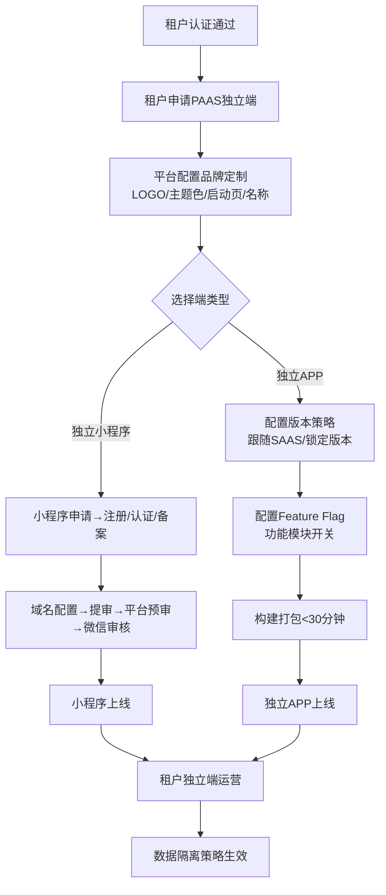
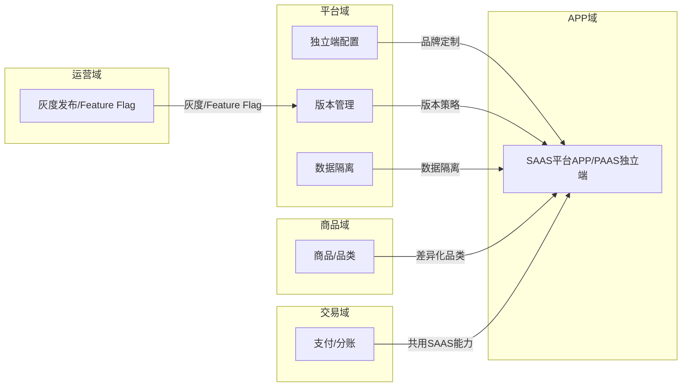
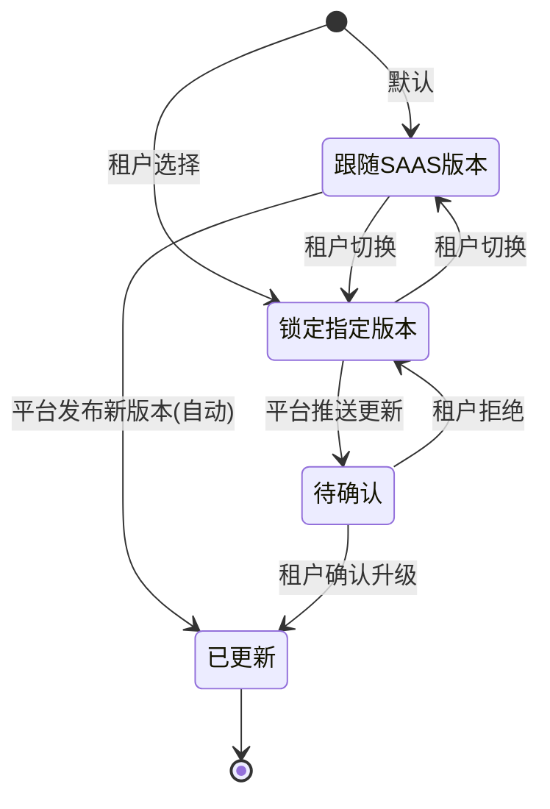
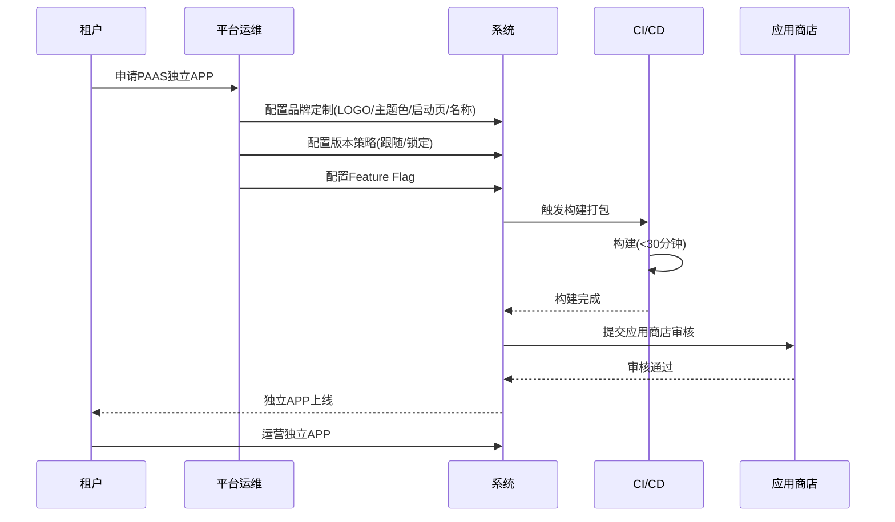
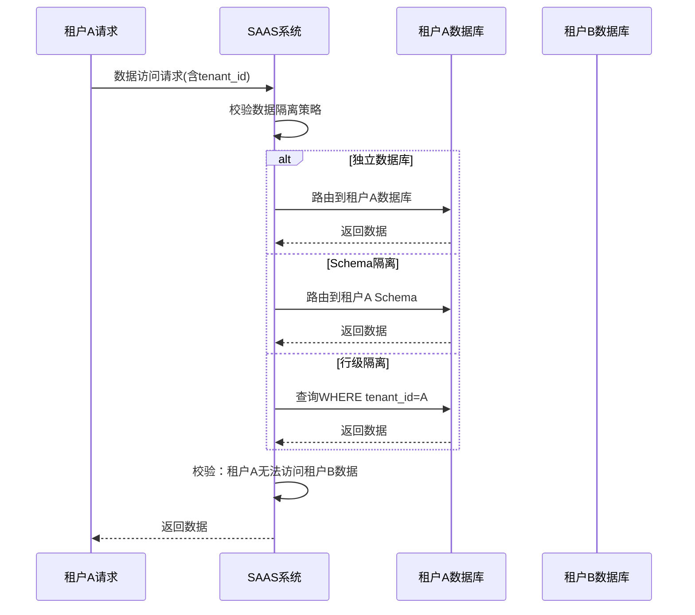

# 平台域 产品需求文档 PRD V1.0.0

> **业务域**：平台域（D12） | **版本**：V1.0.0 | **日期**：2026-07-16
> **数据来源**：`平台V1.0.0.md`、Axure原型 V1.0.2
> **追溯链**：UC-PLT → FN-PLT → PG-PLT → SC-PLT → BG-05 → BO-05

---

## 版本历史

| 版本 | 日期 | 变更内容 |
|------|------|----------|
| V1.0.2 | 2026-05-15 | 平台APP/小程序、租户绑定、版本管理（增删改/回滚/市场配置）、终端管理 |
| V1.0.9 | 2026-07-16 | 按PRD规范V1.0.0重新编排；标注PAAS独立端缺失功能 |

---

## 目录

1. 背景与问题陈述
2. 目标与成功度量
3. 范围
4. 与既有模块关系
5. 业务目标映射
6. 用户故事
7. 功能需求列表与用例
8. 业务规则
9. 数据实体
10. 验收标准
11. 指标登记
12. 五类图
13. 外部接口标注
14. 检查清单

---

## 1. 背景与问题陈述

平台域承载SAAS平台的多端架构能力——SAAS平台APP/小程序和PAAS租户独立APP/小程序。对于需要**品牌独立展示**的KA租户来说，能够拥有自己品牌的独立APP是核心诉求。当前系统已支持租户绑定SAAS平台APP/小程序，但PAAS模式下租户独立端的品牌定制、配置管理和数据隔离能力尚不明确。

### 核心问题

| 问题编号 | 问题 | 严重程度 |
|----------|------|----------|
| PLT-ISSUE-001 | PAAS独立APP品牌定制缺失 | 🔴 高 |
| PLT-ISSUE-002 | 独立小程序配置流程缺失 | 🔴 高 |
| PLT-ISSUE-003 | 独立端版本管理不适用PAAS | 🟡 中 |
| PLT-ISSUE-004 | PAAS数据隔离策略不明确 | 🔴 高 |
| PLT-ISSUE-005 | 无灰度发布/Feature Flag | 🟡 中（关联运营域） |

---

## 2. 目标与成功度量

| 目标编号 | 目标 | 度量指标 | 目标值 |
|----------|------|----------|--------|
| BO-PLT-01 | 品牌独立 | PAAS独立端上线租户数 | ≥ 10 |
| BO-PLT-02 | 数据安全 | 数据隔离渗透测试通过 | 100% |
| BO-PLT-03 | 品牌切换响应 | 主题配置变更生效时间 | 实时（无需重新打包） |
| BO-PLT-04 | 构建效率 | 独立APP构建+打包 | < 30分钟 |

---

## 3. 范围

### In-Scope
- 平台APP（SAAS平台级APP和小程序）
- 租户绑定平台APP/小程序
- 版本管理（App版本增删改/回滚/市场配置）
- 终端管理（终端类型/配置管理）
- PAAS独立APP品牌定制（待建-P0）
- 独立小程序配置流程（待建-P1）
- 独立端版本管理+Feature Flag（待建-P1）
- PAAS数据隔离策略（待建-P0）

### Non-Goals
- 租户自主品牌商店（自定义皮肤/布局/组件市场）（远期）
- 多语言国际化（远期）

---

## 4. 与既有模块关系

### 上下游依赖矩阵

| 方向 | 关联域 | 依赖关系 | 说明 |
|------|--------|----------|------|
| **上游（被依赖）** | APP域 | PAAS独立端版本同步 | 独立端版本策略依赖发布框架 |
| **下游（依赖）** | 运营域 | 版本管理/灰度发布/功能开关 | 独立端版本策略依赖运营系统 |
| **下游（依赖）** | 商品域 | 独立APP品类/商品展示 | PAAS APP可能需差异化品类 |
| **下游（依赖）** | 交易域 | 支付/分账在独立APP中一致 | 共用SAAS能力 |
| **下游（依赖）** | 基础设施 | CI/CD/监控/日志 | 独立端需独立构建发布管线 |

### 影响域说明

| 变更场景 | 影响域 | 影响说明 |
|----------|--------|----------|
| 独立端版本发布 | APP域 | 独立端APP版本更新 |
| Feature Flag变更 | 所有域 | 功能模块开关变化 |
| 数据隔离策略变更 | 所有域 | 数据访问方式变化 |

---

## 5. 业务目标映射

| BG | BO | FN | 优先级 |
|----|-----|-----|--------|
| BG-05 品牌独立 | BO-PLT-01 | FN-PLT-001 品牌定制 | P0 |
| BG-05 | BO-PLT-02 | FN-PLT-004 数据隔离 | P0 |
| BG-05 | BO-PLT-03 | FN-PLT-001 品牌定制 | P0 |
| BG-05 | BO-PLT-04 | FN-PLT-003 版本管理 | P1 |

---

## 6. 用户故事

| US编号 | 角色 | 用户故事 |
|--------|------|----------|
| US-PLT-001 | 平台技术运维 | 作为运维，我希望配置独立APP品牌（LOGO/主题色/启动页），以便租户品牌独立 |
| US-PLT-002 | 平台技术运维 | 作为运维，我希望配置独立小程序（域名/备案/审核），以便租户小程序上线 |
| US-PLT-003 | 平台技术运维 | 作为运维，我希望管理独立端版本和Feature Flag，以便控制功能发布 |
| US-PLT-004 | 租户管理员 | 作为租户，我希望PAAS数据与其它租户隔离，以便数据安全 |
| US-PLT-005 | 租户管理员 | 作为租户，我希望导出和删除我的数据，以便合规要求 |

---

## 7. 功能需求列表与用例

### FN-PLT-001 PAAS独立APP品牌定制（待建）

| 属性 | 值 |
|------|-----|
| 用例编号 | UC-PLT-001 |
| 名称 | PAAS独立APP品牌定制 |
| 参与者 | 平台技术运维/租户管理员 |
| 优先级 | P0 |
| 关联BG | BG-05 |
| 自动化类型 | 手动 |

**视觉配置**：APP名称、APP图标（多尺寸）、启动页（品牌Logo+品牌色背景）、主题色（全局主色调/辅助色）、字体。

**内容配置**：关于我们、隐私政策/用户协议（租户自定义或平台默认）、客服联系方式。

---

### FN-PLT-002 独立小程序配置流程（待建）

**流程**：租户提交小程序申请→平台协助注册/认证/备案→域名配置→小程序提审→平台预审→微信审核→上线→小程序页面配置。

---

### FN-PLT-003 独立端版本管理+Feature Flag（待建）

- 独立APP可配置"跟随SAAS平台版本"或"锁定指定版本"
- 锁定版本的租户，平台推送更新时需租户确认后升级
- Feature Flag：为不同租户启用/关闭不同功能模块

---

### FN-PLT-004 PAAS数据隔离策略（待建）

| 隔离级别 | 方案 | 适用场景 |
|----------|------|----------|
| 独立数据库 | 每个PAAS租户独立数据库实例 | 互联网医院（患者隐私） |
| Schema隔离 | 同数据库不同Schema | KA租户 |
| 行级隔离 | 同Schema，tenant_id隔离 | 中小租户 |
| 混合隔离 | 基础数据共享+敏感数据独立 | 推荐方案 |

---

### FN-PLT-005 租户数据导出/删除（待建）

- 数据导出：租户可申请导出全部数据（标准格式）
- 数据删除：租户注销后N天自动删除全部数据（合规要求）
- 备份策略：PAAS租户独立备份+异地灾备
- 审计日志：所有数据访问操作记录

---

## 8. 业务规则

### BR-PLT-001 品牌切换实时生效规则
- 主题配置变更实时生效，无需重新打包

### BR-PLT-002 独立APP版本跟随规则
- 独立APP可配置"跟随SAAS平台版本"或"锁定指定版本"
- 锁定版本的租户，平台推送更新时需租户确认后升级

### BR-PLT-003 数据隔离策略规则
- 互联网医院（患者隐私数据）→独立数据库
- KA租户→Schema隔离
- 中小租户→行级隔离
- 推荐方案→混合隔离（基础数据共享+敏感数据独立）

### BR-PLT-004 数据删除合规规则
- 租户注销后N天自动删除全部数据

### BR-PLT-005 独立APP包大小规则
- 独立APP包体积增量 < 5MB（品牌资源）

### BR-PLT-006 构建效率规则
- 独立APP构建+打包 < 30分钟

---

## 9. 数据实体

### ENT-PLT-001 独立端配置(IndependentAppConfig)

| 字段 | 类型 | 说明 |
|------|------|------|
| config_id | String | 配置ID |
| tenant_id | String | 租户ID |
| app_name | String | APP名称 |
| app_icon | Object | APP图标（多尺寸） |
| splash_screen | String | 启动页 |
| theme_color | String | 主题色 |
| font | String | 字体 |
| about_us | Text | 关于我们 |
| privacy_policy | Text | 隐私政策 |
| customer_service | String | 客服联系方式 |
| version_strategy | Enum | 跟随SAAS/锁定指定版本 |
| locked_version | String | 锁定版本号 |
| feature_flags | Object | 功能开关 |

### ENT-PLT-002 数据隔离策略(DataIsolationPolicy)

| 字段 | 类型 | 说明 |
|------|------|------|
| policy_id | String | 策略ID |
| tenant_id | String | 租户ID |
| isolation_level | Enum | 独立数据库/Schema隔离/行级隔离/混合隔离 |
| database_instance | String | 数据库实例（独立数据库时） |
| schema_name | String | Schema名称（Schema隔离时） |

---

## 10. 验收标准

| SC编号 | 场景 | 预期结果 |
|--------|------|----------|
| SC-PLT-001 | 品牌定制配置 | 配置LOGO/主题色/启动页→实时生效→独立APP展示品牌 |
| SC-PLT-002 | 数据隔离验证 | PAAS租户A数据→租户B无法访问→渗透测试通过 |
| SC-PLT-003 | 独立小程序上线 | 申请→注册/认证/备案→域名配置→提审→上线 |
| SC-PLT-004 | 数据导出/删除 | 租户申请导出→标准格式→注销后N天自动删除 |

| FN | Given | When | Then |
|----|-------|------|------|
| FN-PLT-001 | 主题色配置变更 | 保存 | 实时生效，无需重新打包 |
| FN-PLT-003 | 独立APP锁定版本 | 平台推送更新 | 需租户确认后升级 |
| FN-PLT-004 | PAAS租户A的数据 | 租户B尝试访问 | 无法访问（隔离有效） |
| FN-PLT-005 | 租户注销 | N天后 | 全部数据自动删除 |

---

## 11. 指标登记

| 指标 | 说明 | 目标值 |
|------|------|--------|
| MET-PLT-001 | PAAS独立端上线租户数 | — | ≥ 10 |
| MET-PLT-002 | 数据隔离渗透测试 | — | 100%通过 |
| MET-PLT-003 | 品牌切换响应时间 | — | 实时 |
| MET-PLT-004 | 独立APP构建时长 | — | < 30分钟 |

---

## 12. 五类图

### 12.1 业务流程图 — PAAS独立端配置全流程

### 12.2 信息流转图 — 平台域跨模块

### 12.3 状态机 — 独立端版本管理状态机

**状态过渡操作表**：

| 当前状态 | 触发操作 | 目标状态 | 操作者 | 前置约束 | 后置动作 |
|----------|----------|----------|--------|----------|----------|
| — | 默认配置 | 跟随SAAS版本 | 系统 | — | — |
| — | 租户选择锁定 | 锁定指定版本 | 租户 | 指定版本号 | — |
| 跟随SAAS版本 | 平台发布新版本 | 已更新 | 系统 | — | 自动升级 |
| 锁定指定版本 | 平台推送更新 | 待确认 | 系统 | — | 通知租户 |
| 待确认 | 租户确认升级 | 已更新 | 租户 | — | 升级到新版本 |
| 待确认 | 租户拒绝 | 锁定指定版本 | 租户 | — | 保持当前版本 |

### 12.4 业务时序图 — 独立APP品牌定制与发布

### 12.5 三方接口时序图 — 数据隔离校验

---

## 13. 外部接口标注

| 接口编号 | 接口名称 | 方向 | 对端系统 | 说明 |
|----------|----------|------|----------|------|
| API-PLT-001 | APP构建 | 单向(出) | CI/CD系统 | 触发独立APP构建打包 |
| API-PLT-002 | 应用商店提交 | 单向(出) | App Store/Google Play | 独立APP提交审核 |
| API-PLT-003 | 小程序审核 | 双向 | 微信开放平台 | 小程序提审/审核结果 |

---

## 14. 检查清单

| # | 检查项 | 状态 |
|---|--------|------|
| 1-20 | 全部检查项 | ✅ |

---

> **关联文档**：源MD `平台V1.0.0.md` | 上游：APP域 | 下游：运营域/商品域/交易域/基础设施 | 总索引 `00-SAAS-PRD-总索引.md`
