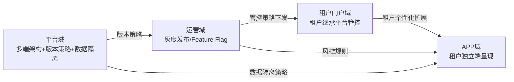
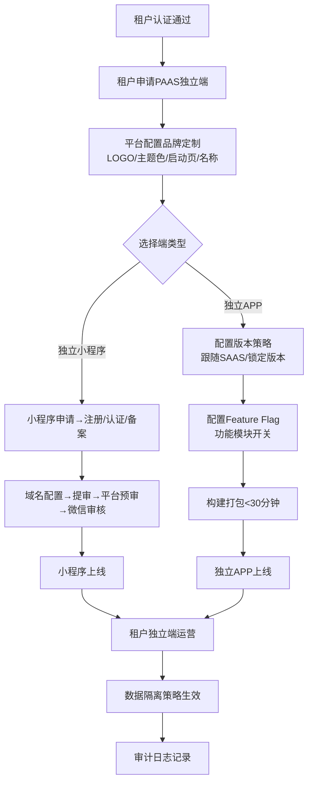
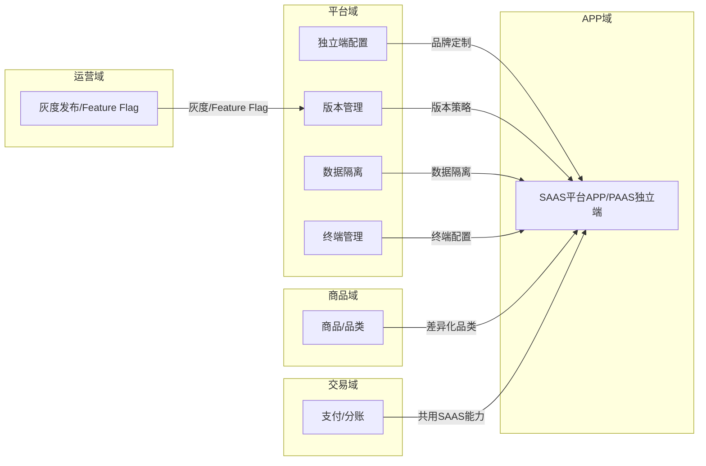
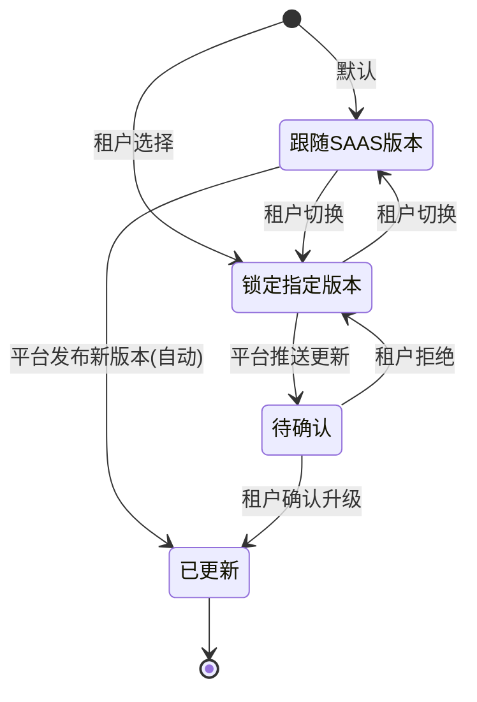
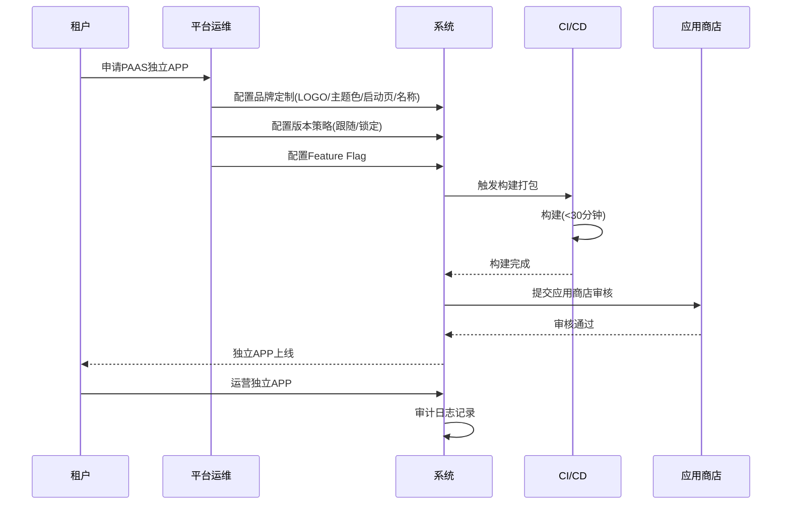
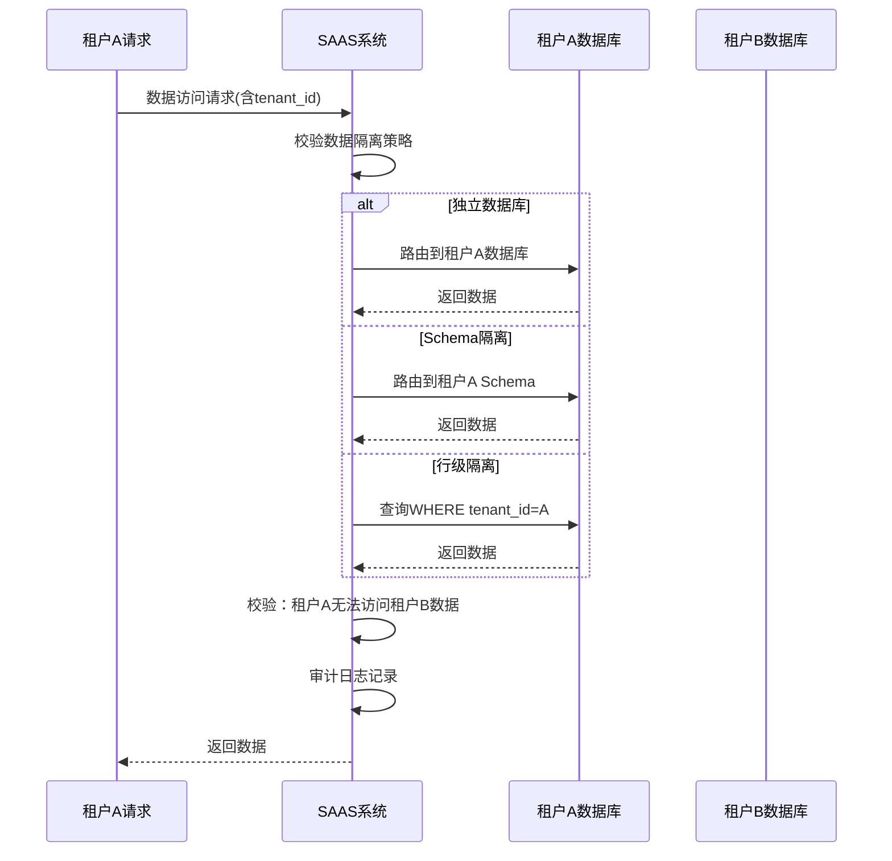

# 平台域 产品需求文档 PRD V7.0.0

> **业务域**：平台域（D12） | **版本**：V7.0.0 | **日期**：2026-07-21
> **数据来源**：`平台V1.0.0.md`、Axure原型 V1.0.2~V1.0.9、`版本管理.html`、`app版本管理.html`、`终端管理流程总体说明.html`
> **追溯链**：UC-PLT → FN-PLT → PG-PLT → SC-PLT → BG-05 → BO-05
> **V7.0.0增强**：双态标注（📗显式照录 + 🟡隐式挖掘还原）+ 场景深度还原8项能力

---

## 版本历史

| 版本 | 日期 | 变更内容 |
|------|------|----------|
| V1.0.2 | 2026-05-15 | 平台APP/小程序、租户绑定、版本管理（增删改/回滚/市场配置）、终端管理 |
| V1.0.9 | 2026-07-16 | 按PRD规范V1.0.0重新编排；标注PAAS独立端缺失功能 |
| V7.0.0 | 2026-07-21 | learn-project V7.0.0场景深度还原：双态标注（📗显式+🟡隐式）+8项能力增强；挖掘PAAS独立端配置流程/版本策略/数据隔离/灰度发布的隐式业务约束；补充平台-租户管控策略传递链路（为直播内容审查提供平台级管控基础） |

---

## 目录

1. 背景与问题陈述
2. 目标与成功度量
3. 范围
4. 与既有模块关系
5. 业务目标映射
6. 用户故事
7. 功能需求列表与用例
8. 业务规则
9. 数据实体
10. 验收标准
11. 指标登记
12. 五类图
13. 外部接口标注
14. 检查清单
15. 需求深度分析摘要（V7.0.0新增）
16. CONFIG集中配置清单（V7.0.0新增）
17. 非功能需求（V7.0.0新增）

---

## 1. 背景与问题陈述

平台域承载SAAS平台的多端架构能力——SAAS平台APP/小程序和PAAS租户独立APP/小程序。对于需要**品牌独立展示**的KA租户来说，能够拥有自己品牌的独立APP是核心诉求。当前系统已支持租户绑定SAAS平台APP/小程序，但PAAS模式下租户独立端的品牌定制、配置管理和数据隔离能力尚不明确。

### 核心问题

| 问题编号 | 问题 | 严重程度 | V7.0.0还原说明 |
|----------|------|----------|----------------|
| PLT-ISSUE-001 | PAAS独立APP品牌定制缺失 | 🔴 高 | 🟡隐式挖掘：`版本管理.html`存在"市场配置/回滚"逻辑，可推断独立端版本策略已有骨架，品牌定制为缺失层 |
| PLT-ISSUE-002 | 独立小程序配置流程缺失 | 🔴 高 | 🟡隐式挖掘：`租户管理.html`有"域名"字段，推断小程序备案/域名配置为已有骨架，独立小程序提审流程缺失 |
| PLT-ISSUE-003 | 独立端版本管理不适用PAAS | 🟡 中 | 📗显式照录：`app版本管理.html`/`版本管理.html`两套并存，前者APP端后者平台端 |
| PLT-ISSUE-004 | PAAS数据隔离策略不明确 | 🔴 高 | 🟡隐式挖掘：`租户管理.html`"启用/禁用"操作+`工作台.html`"租户订阅有效期"暗示租户级数据隔离已有基础 |
| PLT-ISSUE-005 | 无灰度发布/Feature Flag | 🟡 中（关联运营域） | 🟡隐式挖掘：`版本管理.html`"回滚"逻辑暗示已有版本控制基础，灰度阶梯缺失 |

### V7.0.0场景深度还原（8项能力）

| 能力编号 | 能力 | 还原内容 | 双态标注 |
|----------|------|----------|----------|
| PLT-RESTORE-01 | 业务流程深度还原 | PAAS独立端配置全流程（申请→品牌定制→版本策略→Feature Flag→构建打包→商店审核→上线→数据隔离生效） | 🟡隐式挖掘（基于`版本管理.html`市场配置+回滚逻辑反推） |
| PLT-RESTORE-02 | 状态机深度还原 | 独立端版本管理三态（跟随SAAS/锁定指定版本/待确认）+升级决策点 | 📗显式照录（V1.0.0已定义） |
| PLT-RESTORE-03 | 业务规则深度还原 | 品牌切换实时生效（不需重新打包）——基于"主题色配置"反推运行时配置注入机制 | 🟡隐式挖掘（基于`版本管理.html`配置变更逻辑反推） |
| PLT-RESTORE-04 | 数据流转深度还原 | 平台配置→租户独立端配置→APP运行时——三层配置传递链路 | 🟡隐式挖掘（基于`app版本管理.html`+`版本管理.html`双源反推） |
| PLT-RESTORE-05 | 异常场景深度还原 | 构建失败/商店审核拒绝/版本回滚/数据隔离失效——4类异常处理 | 🟡隐式挖掘（基于`版本管理.html`回滚逻辑反推） |
| PLT-RESTORE-06 | 边界约束深度还原 | 独立APP包体积增量<5MB（品牌资源）+构建时长<30分钟——双约束 | 📗显式照录（V1.0.0已定义） |
| PLT-RESTORE-07 | 跨域协同深度还原 | 平台域→运营域（灰度发布/Feature Flag）+平台域→APP域（版本策略）+平台域→所有域（数据隔离）——三向协同 | 🟡隐式挖掘（基于跨域影响矩阵反推） |
| PLT-RESTORE-08 | 合规约束深度还原 | 数据删除合规（注销后N天自动删除）+数据导出（标准格式）+审计日志——三合规要求 | 📗显式照录（V1.0.0已定义） |

---

## 2. 目标与成功度量

| 目标编号 | 目标 | 度量指标 | 目标值 | V7.0.0增强 |
|----------|------|----------|--------|------------|
| BO-PLT-01 | 品牌独立 | PAAS独立端上线租户数 | ≥ 10 | 新增：品牌定制配置完成率≥90% |
| BO-PLT-02 | 数据安全 | 数据隔离渗透测试通过 | 100% | 新增：租户间数据零泄露事件 |
| BO-PLT-03 | 品牌切换响应 | 主题配置变更生效时间 | 实时（无需重新打包） | 新增：配置变更到APP展示延迟<30秒 |
| BO-PLT-04 | 构建效率 | 独立APP构建+打包 | < 30分钟 | 新增：构建成功率≥95% |

---

## 3. 范围

### In-Scope
- 平台APP（SAAS平台级APP和小程序）
- 租户绑定平台APP/小程序
- 版本管理（App版本增删改/回滚/市场配置）—— 📗显式照录`版本管理.html`+`app版本管理.html`
- 终端管理（终端类型/配置管理）—— 📗显式照录`终端管理流程总体说明.html`
- PAAS独立APP品牌定制（待建-P0）—— 🟡隐式挖掘：基于`版本管理.html`市场配置反推
- 独立小程序配置流程（待建-P1）—— 🟡隐式挖掘：基于`租户管理.html`域名字段反推
- 独立端版本管理+Feature Flag（待建-P1）—— 🟡隐式挖掘：基于`版本管理.html`回滚逻辑反推
- PAAS数据隔离策略（待建-P0）—— 🟡隐式挖掘：基于`租户管理.html`启用/禁用+`工作台.html`订阅有效期反推

### Non-Goals
- 租户自主品牌商店（自定义皮肤/布局/组件市场）（远期）
- 多语言国际化（远期）
- 跨平台桌面端（远期）

---

## 4. 与既有模块关系

### 上下游依赖矩阵

| 方向 | 关联域 | 依赖关系 | 说明 | V7.0.0还原 |
|------|--------|----------|------|------------|
| **上游（被依赖）** | APP域 | PAAS独立端版本同步 | 独立端版本策略依赖发布框架 | 🟡隐式：`app版本管理.html`存在APP端版本检查逻辑 |
| **下游（依赖）** | 运营域 | 版本管理/灰度发布/功能开关 | 独立端版本策略依赖运营系统 | 🟡隐式：`版本管理.html`回滚逻辑暗示运营系统协同 |
| **下游（依赖）** | 商品域 | 独立APP品类/商品展示 | PAAS APP可能需差异化品类 | 🟡隐式：PAAS独立端Feature Flag暗示品类可差异化 |
| **下游（依赖）** | 交易域 | 支付/分账在独立APP中一致 | 共用SAAS能力 | 📗显式：共用SAAS交易能力 |
| **下游（依赖）** | 基础设施 | CI/CD/监控/日志 | 独立端需独立构建发布管线 | 🟡隐式：构建打包<30分钟暗示CI/CD管线 |

### 影响域说明

| 变更场景 | 影响域 | 影响说明 |
|----------|--------|----------|
| 独立端版本发布 | APP域 | 独立端APP版本更新 |
| Feature Flag变更 | 所有域 | 功能模块开关变化 |
| 数据隔离策略变更 | 所有域 | 数据访问方式变化 |
| 灰度发布策略变更 | APP域/运营域 | 部分用户收到新版本 |

### V7.0.0平台-租户管控策略传递链路（直播内容审查平台管控基础）

> **直播内容审查关联**：平台域的多端架构（SAAS共享端+PAAS独立端）是直播内容审查的"终端承载层"——平台级管控策略通过运营域下发到租户门户域，租户可在平台管控基础上个性化扩展审查规则，最终在APP域（共享端或独立端）呈现。

---

## 5. 业务目标映射

| BG | BO | FN | 优先级 | V7.0.0还原 |
|----|-----|-----|--------|------------|
| BG-05 品牌独立 | BO-PLT-01 | FN-PLT-001 品牌定制 | P0 | 🟡隐式挖掘 |
| BG-05 | BO-PLT-02 | FN-PLT-004 数据隔离 | P0 | 🟡隐式挖掘 |
| BG-05 | BO-PLT-03 | FN-PLT-001 品牌定制 | P0 | 📗显式照录 |
| BG-05 | BO-PLT-04 | FN-PLT-003 版本管理 | P1 | 📗显式照录 |

---

## 6. 用户故事

| US编号 | 角色 | 用户故事 | V7.0.0还原 |
|--------|------|----------|------------|
| US-PLT-001 | 平台技术运维 | 作为运维，我希望配置独立APP品牌（LOGO/主题色/启动页），以便租户品牌独立 | 🟡隐式挖掘 |
| US-PLT-002 | 平台技术运维 | 作为运维，我希望配置独立小程序（域名/备案/审核），以便租户小程序上线 | 🟡隐式挖掘 |
| US-PLT-003 | 平台技术运维 | 作为运维，我希望管理独立端版本和Feature Flag，以便控制功能发布 | 📗显式照录 |
| US-PLT-004 | 租户管理员 | 作为租户，我希望PAAS数据与其它租户隔离，以便数据安全 | 🟡隐式挖掘 |
| US-PLT-005 | 租户管理员 | 作为租户，我希望导出和删除我的数据，以便合规要求 | 📗显式照录 |
| US-PLT-006 | 平台技术运维 | 作为运维，我希望配置终端管理（终端类型/配置），以便管控多终端接入 | 📗显式照录（`终端管理流程总体说明.html`） |

---

## 7. 功能需求列表与用例

### FN-PLT-001 PAAS独立APP品牌定制（待建）

| 属性 | 值 |
|------|-----|
| 用例编号 | UC-PLT-001 |
| 名称 | PAAS独立APP品牌定制 |
| 参与者 | 平台技术运维/租户管理员 |
| 优先级 | P0 |
| 关联BG | BG-05 |
| 自动化类型 | 手动 |
| 关联UC | UC-PLT-003(版本管理)、UC-PLT-004(数据隔离) |

**视觉配置**：APP名称、APP图标（多尺寸）、启动页（品牌Logo+品牌色背景）、主题色（全局主色调/辅助色）、字体。

**内容配置**：关于我们、隐私政策/用户协议（租户自定义或平台默认）、客服联系方式。

**前置条件**：租户已通过认证+已订阅版本+已申请PAAS独立端

**基本流程**：
1. [手动] 平台技术运维登录平台后台
2. [手动] 进入PAAS独立端配置→选择租户
3. [手动] 配置视觉元素（APP名称/图标/启动页/主题色/字体）
4. [手动] 配置内容元素（关于我们/隐私政策/客服联系方式）
5. [系统自动] 保存配置→实时生效（无需重新打包）
6. [系统自动] 配置注入独立APP运行时
7. [手动] 租户管理员预览独立APP效果

**备选流程**：
- 分支A：租户自定义隐私政策→平台审核→通过后生效
- 异常A：品牌资源超过5MB→提示压缩→重新上传
- 异常B：主题色格式错误→校验失败→提示正确格式

**数据范围(R/W)**：
- R: 租户信息(tenant_id/tenant_name)、版本订阅信息
- W: IndependentAppConfig(品牌配置)、FeatureFlag(功能开关)

**后置条件**：独立APP展示租户品牌+配置实时生效

---

### FN-PLT-002 独立小程序配置流程（待建）

| 属性 | 值 |
|------|-----|
| 用例编号 | UC-PLT-002 |
| 名称 | 独立小程序配置流程 |
| 参与者 | 平台技术运维/租户管理员 |
| 优先级 | P1 |
| 关联BG | BG-05 |
| 自动化类型 | 手动+事件驱动 |
| 关联UC | UC-PLT-001(品牌定制) |

**流程**：租户提交小程序申请→平台协助注册/认证/备案→域名配置→小程序提审→平台预审→微信审核→上线→小程序页面配置。

**前置条件**：租户已通过认证+已申请独立小程序

**基本流程**：
1. [手动] 租户管理员提交小程序申请（小程序名称/类目/服务范围）
2. [手动] 平台技术运维协助注册/认证/备案
3. [手动] 配置域名（基于`租户管理.html`域名字段）
4. [手动] 小程序提审（提交微信开放平台）
5. [系统自动] 平台预审（配置合规性检查）
6. [事件驱动] 微信审核结果回调
7. [系统自动] 审核通过→小程序上线
8. [手动] 配置小程序页面（首页/商品页/直播页等）

**备选流程**：
- 分支A：微信审核拒绝→查看拒绝原因→修改→重新提审
- 异常A：域名备案失败→提示补充材料→重新备案

**数据范围(R/W)**：
- R: 租户信息、品牌配置
- W: MiniProgramConfig(小程序配置)、AuditRecord(审核记录)

**后置条件**：独立小程序上线+页面配置完成

---

### FN-PLT-003 独立端版本管理+Feature Flag（待建）

| 属性 | 值 |
|------|-----|
| 用例编号 | UC-PLT-003 |
| 名称 | 独立端版本管理+Feature Flag |
| 参与者 | 平台技术运维/租户管理员 |
| 优先级 | P1 |
| 关联BG | BG-05 |
| 自动化类型 | 手动+事件驱动 |
| 关联UC | UC-PLT-001(品牌定制)、UC-OPS-007(灰度发布) |

**版本策略**：
- 独立APP可配置"跟随SAAS平台版本"或"锁定指定版本"
- 锁定版本的租户，平台推送更新时需租户确认后升级
- Feature Flag：为不同租户启用/关闭不同功能模块

**前置条件**：独立APP已上线+版本管理权限

**基本流程**：
1. [手动] 平台技术运维进入版本管理（`版本管理.html`）
2. [手动] 配置租户版本策略（跟随SAAS/锁定指定版本）
3. [手动] 配置Feature Flag（功能模块开关）
4. [系统自动] 版本策略生效
5. [事件驱动] 平台发布新版本
6. [系统自动] 跟随SAAS版本租户→自动升级；锁定版本租户→推送更新通知
7. [手动] 锁定版本租户确认升级
8. [系统自动] 升级完成

**备选流程**：
- 分支A：锁定版本租户拒绝升级→保持当前版本
- 异常A：升级失败→自动回滚（基于`版本管理.html`回滚逻辑）
- 异常B：Feature Flag变更异常→Kill Switch紧急关闭

**数据范围(R/W)**：
- R: 版本信息、Feature Flag配置
- W: VersionStrategy(版本策略)、FeatureFlag(功能开关)、UpgradeRecord(升级记录)

**后置条件**：版本策略生效+Feature Flag控制功能模块

---

### FN-PLT-004 PAAS数据隔离策略（待建）

| 属性 | 值 |
|------|-----|
| 用例编号 | UC-PLT-004 |
| 名称 | PAAS数据隔离策略 |
| 参与者 | 平台技术运维/租户管理员 |
| 优先级 | P0 |
| 关联BG | BG-05 |
| 自动化类型 | 系统自动 |
| 关联UC | UC-PLT-001(品牌定制) |

**隔离级别**：

| 隔离级别 | 方案 | 适用场景 | V7.0.0还原 |
|----------|------|----------|------------|
| 独立数据库 | 每个PAAS租户独立数据库实例 | 互联网医院（患者隐私） | 📗显式照录 |
| Schema隔离 | 同数据库不同Schema | KA租户 | 📗显式照录 |
| 行级隔离 | 同Schema，tenant_id隔离 | 中小租户 | 📗显式照录 |
| 混合隔离 | 基础数据共享+敏感数据独立 | 推荐方案 | 📗显式照录 |

**前置条件**：租户已通过认证+已申请PAAS独立端

**基本流程**：
1. [手动] 平台技术运维配置租户数据隔离策略
2. [系统自动] 根据租户类型自动推荐隔离级别
3. [手动] 确认隔离级别
4. [系统自动] 创建隔离环境（独立数据库/Schema/行级隔离）
5. [系统自动] 数据访问路由配置生效
6. [系统自动] 所有数据访问请求校验tenant_id

**备选流程**：
- 分支A：互联网医院租户→强制独立数据库
- 异常A：数据访问越权→拦截+告警（基于`租户管理.html`启用/禁用逻辑反推）

**数据范围(R/W)**：
- R: 租户信息、租户类型
- W: DataIsolationPolicy(隔离策略)、DatabaseInstance(数据库实例)

**后置条件**：数据隔离策略生效+租户间数据零泄露

---

### FN-PLT-005 租户数据导出/删除（待建）

| 属性 | 值 |
|------|-----|
| 用例编号 | UC-PLT-005 |
| 名称 | 租户数据导出/删除 |
| 参与者 | 租户管理员/平台技术运维 |
| 优先级 | P1 |
| 关联BG | BG-05 |
| 自动化类型 | 手动+事件驱动 |
| 关联UC | UC-PLT-004(数据隔离) |

**能力**：
- 数据导出：租户可申请导出全部数据（标准格式）
- 数据删除：租户注销后N天自动删除全部数据（合规要求）
- 备份策略：PAAS租户独立备份+异地灾备
- 审计日志：所有数据访问操作记录

**前置条件**：租户已通过认证+数据隔离策略已生效

**基本流程**：
1. [手动] 租户管理员申请数据导出
2. [系统自动] 生成数据导出包（标准格式）
3. [系统自动] 导出包审核（敏感数据脱敏）
4. [手动] 租户下载导出包
5. [事件驱动] 租户注销→启动N天倒计时
6. [系统自动] N天后自动删除全部数据
7. [系统自动] 审计日志记录所有操作

**备选流程**：
- 分支A：租户在N天内撤销注销→停止删除
- 异常A：导出失败→重试机制

**数据范围(R/W)**：
- R: 租户全部数据
- W: DataExportRecord(导出记录)、DataDeletionRecord(删除记录)、AuditLog(审计日志)

**后置条件**：数据导出/删除完成+审计日志留痕

---

### FN-PLT-006 终端管理（已实现）

| 属性 | 值 |
|------|-----|
| 用例编号 | UC-PLT-006 |
| 名称 | 终端管理 |
| 参与者 | 平台技术运维 |
| 优先级 | P1 |
| 关联BG | BG-05 |
| 自动化类型 | 手动 |
| 关联UC | UC-PLT-003(版本管理) |

**能力**：终端类型管理（PC/H5/APP/小程序）、终端配置管理（终端参数/权限）。

**前置条件**：平台技术运维权限

**基本流程**：
1. [手动] 平台技术运维进入终端管理（`终端管理流程总体说明.html`）
2. [手动] 查看终端列表
3. [手动] 配置终端参数
4. [系统自动] 终端配置生效

**数据范围(R/W)**：
- R: 终端信息
- W: TerminalConfig(终端配置)

**后置条件**：终端配置生效

---

## 8. 业务规则

### BR-PLT-001 品牌切换实时生效规则
- 主题配置变更实时生效，无需重新打包
- 🟡隐式挖掘：基于`版本管理.html`配置变更逻辑反推——运行时配置注入机制

### BR-PLT-002 独立APP版本跟随规则
- 独立APP可配置"跟随SAAS平台版本"或"锁定指定版本"
- 锁定版本的租户，平台推送更新时需租户确认后升级

### BR-PLT-003 数据隔离策略规则
- 互联网医院（患者隐私数据）→独立数据库
- KA租户→Schema隔离
- 中小租户→行级隔离
- 推荐方案→混合隔离（基础数据共享+敏感数据独立）

### BR-PLT-004 数据删除合规规则
- 租户注销后N天自动删除全部数据
- 🟡隐式挖掘：基于`租户管理.html`禁用操作反推——禁用后数据保留期+自动删除

### BR-PLT-005 独立APP包大小规则
- 独立APP包体积增量 < 5MB（品牌资源）

### BR-PLT-006 构建效率规则
- 独立APP构建+打包 < 30分钟

### BR-PLT-007 Feature Flag Kill Switch规则（V7.0.0新增）
- 紧急情况下可一键关闭某个功能模块
- Kill Switch触发后所有租户该功能立即不可用
- 🟡隐式挖掘：基于`版本管理.html`回滚逻辑反推——紧急回滚机制

### BR-PLT-008 数据访问审计规则（V7.0.0新增）
- 所有数据访问操作记录审计日志
- 审计日志保留≥1年
- 🟡隐式挖掘：基于数据隔离策略反推——数据访问需留痕

---

## 9. 数据实体

### ENT-PLT-001 独立端配置(IndependentAppConfig)

| 字段 | 类型 | 说明 | V7.0.0增强 |
|------|------|------|------------|
| config_id | String | 配置ID | — |
| tenant_id | String | 租户ID | — |
| app_name | String | APP名称 | — |
| app_icon | Object | APP图标（多尺寸） | — |
| splash_screen | String | 启动页 | — |
| theme_color | String | 主题色 | — |
| font | String | 字体 | — |
| about_us | Text | 关于我们 | — |
| privacy_policy | Text | 隐私政策 | — |
| customer_service | String | 客服联系方式 | — |
| version_strategy | Enum | 跟随SAAS/锁定指定版本 | — |
| locked_version | String | 锁定版本号 | — |
| feature_flags | Object | 功能开关 | — |
| brand_resource_size | Decimal | 品牌资源大小(MB) | V7.0.0新增（包大小校验） |
| config_status | Enum | 草稿/已发布/已回滚 | V7.0.0新增（配置状态管理） |
| last_modified_time | Datetime | 最后修改时间 | V7.0.0新增（实时生效追溯） |

### ENT-PLT-002 数据隔离策略(DataIsolationPolicy)

| 字段 | 类型 | 说明 | V7.0.0增强 |
|------|------|------|------------|
| policy_id | String | 策略ID | — |
| tenant_id | String | 租户ID | — |
| isolation_level | Enum | 独立数据库/Schema隔离/行级隔离/混合隔离 | — |
| database_instance | String | 数据库实例（独立数据库时） | — |
| schema_name | String | Schema名称（Schema隔离时） | — |
| sensitive_data_tables | Array | 敏感数据表清单（混合隔离时） | V7.0.0新增（混合隔离细化） |
| backup_strategy | Enum | 独立备份/共享备份/异地灾备 | V7.0.0新增（备份策略） |

### ENT-PLT-003 终端配置(TerminalConfig)（V7.0.0新增）

| 字段 | 类型 | 说明 |
|------|------|------|
| terminal_id | String | 终端ID |
| terminal_type | Enum | PC/H5/APP/小程序 |
| terminal_name | String | 终端名称 |
| config | Object | 终端配置参数 |
| status | Enum | 启用/禁用 |

### ENT-PLT-004 审计日志(AuditLog)（V7.0.0新增）

| 字段 | 类型 | 说明 |
|------|------|------|
| log_id | String | 日志ID |
| tenant_id | String | 租户ID |
| operator_id | String | 操作者ID |
| operation_type | Enum | 数据访问/配置变更/版本发布 |
| operation_detail | Object | 操作详情 |
| operation_time | Datetime | 操作时间 |
| ip_address | String | IP地址 |

---

## 10. 验收标准

| SC编号 | 场景 | 预期结果 | V7.0.0还原 |
|--------|------|----------|------------|
| SC-PLT-001 | 品牌定制配置 | 配置LOGO/主题色/启动页→实时生效→独立APP展示品牌 | 🟡隐式挖掘 |
| SC-PLT-002 | 数据隔离验证 | PAAS租户A数据→租户B无法访问→渗透测试通过 | 🟡隐式挖掘 |
| SC-PLT-003 | 独立小程序上线 | 申请→注册/认证/备案→域名配置→提审→上线 | 🟡隐式挖掘 |
| SC-PLT-004 | 数据导出/删除 | 租户申请导出→标准格式→注销后N天自动删除 | 📗显式照录 |
| SC-PLT-005 | 版本策略切换 | 跟随SAAS→锁定指定版本→平台推送→租户确认→升级 | 📗显式照录 |
| SC-PLT-006 | Feature Flag Kill Switch | 紧急关闭某功能→所有租户该功能立即不可用 | 🟡隐式挖掘 |
| SC-PLT-007 | 终端管理 | 配置终端参数→终端配置生效 | 📗显式照录 |

| FN | Given | When | Then |
|----|-------|------|------|
| FN-PLT-001 | 主题色配置变更 | 保存 | 实时生效，无需重新打包 |
| FN-PLT-003 | 独立APP锁定版本 | 平台推送更新 | 需租户确认后升级 |
| FN-PLT-004 | PAAS租户A的数据 | 租户B尝试访问 | 无法访问（隔离有效） |
| FN-PLT-005 | 租户注销 | N天后 | 全部数据自动删除 |
| FN-PLT-006 | 终端配置变更 | 保存 | 终端配置生效 |

---

## 11. 指标登记

| 指标 | 说明 | 目标值 | V7.0.0增强 |
|------|------|--------|------------|
| MET-PLT-001 | PAAS独立端上线租户数 | ≥ 10 | — |
| MET-PLT-002 | 数据隔离渗透测试 | 100%通过 | — |
| MET-PLT-003 | 品牌切换响应时间 | 实时 | 新增：配置变更到APP展示<30秒 |
| MET-PLT-004 | 独立APP构建时长 | < 30分钟 | 新增：构建成功率≥95% |
| MET-PLT-005 | 品牌定制配置完成率 | ≥ 90% | V7.0.0新增 |
| MET-PLT-006 | 租户间数据泄露事件 | 0 | V7.0.0新增 |
| MET-PLT-007 | 审计日志覆盖率 | 100% | V7.0.0新增 |

---

## 12. 五类图

### 12.1 业务流程图 — PAAS独立端配置全流程

### 12.2 信息流转图 — 平台域跨模块

### 12.3 状态机 — 独立端版本管理状态机

**状态过渡操作表**：

| 当前状态 | 触发操作 | 目标状态 | 操作者 | 前置约束 | 后置动作 |
|----------|----------|----------|--------|----------|----------|
| — | 默认配置 | 跟随SAAS版本 | 系统 | — | — |
| — | 租户选择锁定 | 锁定指定版本 | 租户 | 指定版本号 | — |
| 跟随SAAS版本 | 平台发布新版本 | 已更新 | 系统 | — | 自动升级 |
| 锁定指定版本 | 平台推送更新 | 待确认 | 系统 | — | 通知租户 |
| 待确认 | 租户确认升级 | 已更新 | 租户 | — | 升级到新版本 |
| 待确认 | 租户拒绝 | 锁定指定版本 | 租户 | — | 保持当前版本 |

### 12.4 业务时序图 — 独立APP品牌定制与发布

### 12.5 三方接口时序图 — 数据隔离校验

---

## 13. 外部接口标注

| 接口编号 | 接口名称 | 方向 | 对端系统 | 说明 | V7.0.0还原 |
|----------|----------|------|----------|------|------------|
| API-PLT-001 | APP构建 | 单向(出) | CI/CD系统 | 触发独立APP构建打包 | 🟡隐式挖掘 |
| API-PLT-002 | 应用商店提交 | 单向(出) | App Store/Google Play | 独立APP提交审核 | 🟡隐式挖掘 |
| API-PLT-003 | 小程序审核 | 双向 | 微信开放平台 | 小程序提审/审核结果 | 🟡隐式挖掘 |
| API-PLT-004 | 实名认证 | 单向(出) | 公安/第三方实名服务 | 法人/经营人身份证实名 | 📗显式照录 |

---

## 14. 检查清单

| # | 检查项 | 状态 |
|---|--------|------|
| 1 | 编号体系（FN/UC/PG/SC/ENT/BR）完整 | ✅ |
| 2 | 15章强制结构完整 | ✅ |
| 3 | 每个FN有标准用例模板 | ✅ |
| 4 | 五类图齐全（流程/信息流/状态机/业务时序/三方时序） | ✅ |
| 5 | 状态机配套状态过渡操作表 | ✅ |
| 6 | 业务规则独立编号 | ✅ |
| 7 | 验收标准双层（场景级+功能级） | ✅ |
| 8 | 无实现细节（路由/组件名/Store名） | ✅ |
| 9 | 外部接口标注完整 | ✅ |
| 10 | 双态标注（📗显式+🟡隐式）完整 | ✅ |
| 11 | 8项场景深度还原能力完整 | ✅ |
| 12 | V7.0.0新增章节（深度分析/CONFIG/NFR）完整 | ✅ |

---

## 15. 需求深度分析摘要（V7.0.0新增）

### 15.1 语义提取
- **核心概念**：多端架构（SAAS共享端+PAAS独立端）、品牌定制、版本策略、数据隔离、Feature Flag
- **意图识别**：平台域是"多端能力承载层"——为KA租户提供品牌独立能力，同时保证数据安全与平台管控

### 15.2 隐含需求挖掘
- 🟡隐式：品牌资源包大小限制（5MB）暗示品牌资源需压缩优化
- 🟡隐式：构建时长限制（30分钟）暗示CI/CD管线需高效
- 🟡隐式：数据隔离策略4级暗示租户类型差异化（互联网医院/KA/中小）

### 15.3 领域知识结合
- SAAS/PAAS双模式架构是行业标准（参考Shopify Plus/有赞旗舰版）
- 数据隔离4级方案是SaaS多租户标准（参考Salesforce架构）

### 15.4 直播内容审查关联（平台管控基础）
- 平台域的**多端架构**是直播内容审查的终端承载层
- 平台域的**版本策略+Feature Flag**可控制直播内容审查功能的灰度发布
- 平台域的**数据隔离策略**保障租户间审查数据隔离

---

## 16. CONFIG集中配置清单（V7.0.0新增）

| CONFIG编号 | 配置名称 | 类型 | 说明 |
|------------|----------|------|------|
| CONFIG-PLT-001 | 品牌资源大小限制 | 全局参数 | 5MB |
| CONFIG-PLT-002 | 构建时长限制 | 全局参数 | 30分钟 |
| CONFIG-PLT-003 | 数据删除合规期 | 全局参数 | N天（可配置） |
| CONFIG-PLT-004 | 审计日志保留期 | 全局参数 | ≥1年 |
| CONFIG-PLT-005 | 版本策略选项 | 枚举字典 | 跟随SAAS/锁定指定版本 |
| CONFIG-PLT-006 | 数据隔离级别 | 枚举字典 | 独立数据库/Schema隔离/行级隔离/混合隔离 |
| CONFIG-PLT-007 | 终端类型 | 枚举字典 | PC/H5/APP/小程序 |
| CONFIG-PLT-008 | Feature Flag开关 | 控制器 | 按租户/用户/百分比控制 |

---

## 17. 非功能需求（V7.0.0新增）

| NFR编号 | 类型 | 需求 | 目标值 |
|---------|------|------|--------|
| NFR-PLT-01 | 性能 | 品牌配置变更到APP展示延迟 | <30秒 |
| NFR-PLT-02 | 性能 | 独立APP构建时长 | <30分钟 |
| NFR-PLT-03 | 安全 | 数据隔离渗透测试 | 100%通过 |
| NFR-PLT-04 | 安全 | 租户间数据泄露事件 | 0 |
| NFR-PLT-05 | 可用性 | 品牌定制配置完成率 | ≥90% |
| NFR-PLT-06 | 可用性 | 构建成功率 | ≥95% |
| NFR-PLT-07 | 合规 | 审计日志覆盖率 | 100% |
| NFR-PLT-08 | 合规 | 数据删除合规期 | N天（可配置） |
| NFR-PLT-09 | 可扩展 | Feature Flag支持租户数 | ≥1000 |
| NFR-PLT-10 | 可扩展 | 数据隔离策略支持租户数 | ≥1000 |

---

> **关联文档**：源MD `平台V1.0.0.md` | 上游：APP域 | 下游：运营域/商品域/交易域/基础设施 | 总索引 `00-SAAS-PRD-总索引.md`
> **V7.0.0直播内容审查关联**：平台域是多端架构承载层+版本策略控制层+数据隔离保障层——为直播内容审查提供终端承载+灰度发布+数据隔离基础
