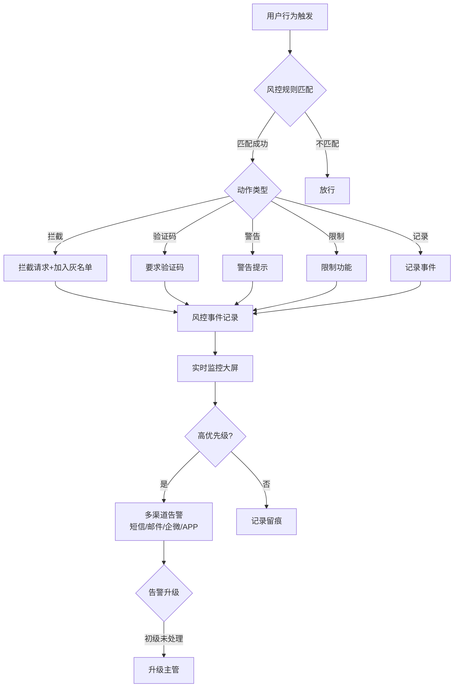
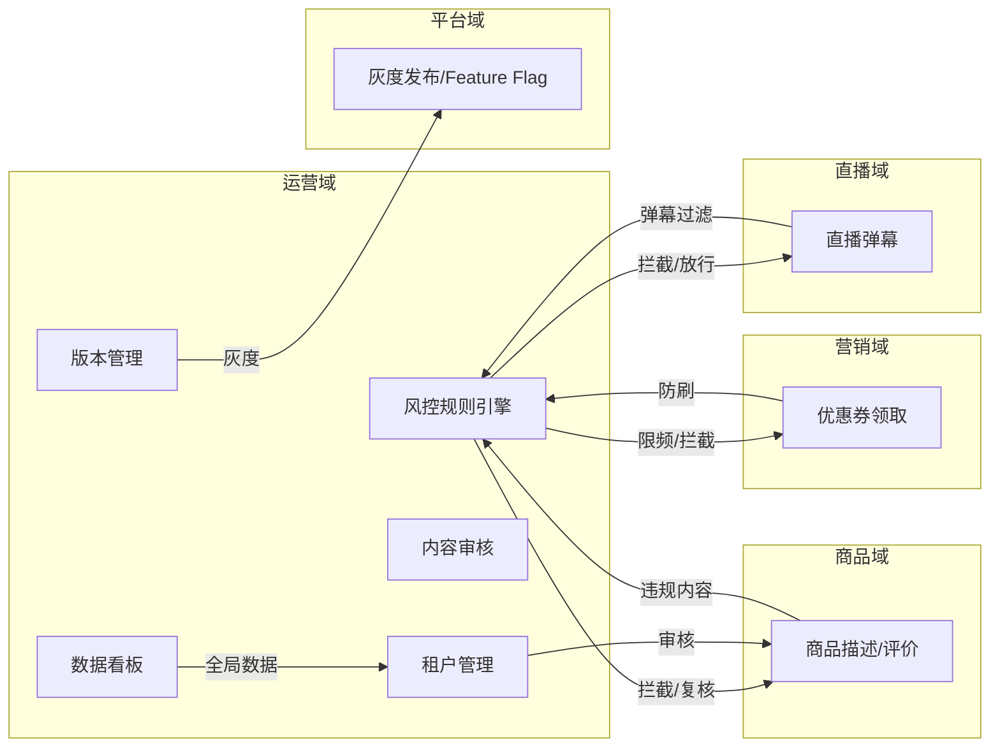
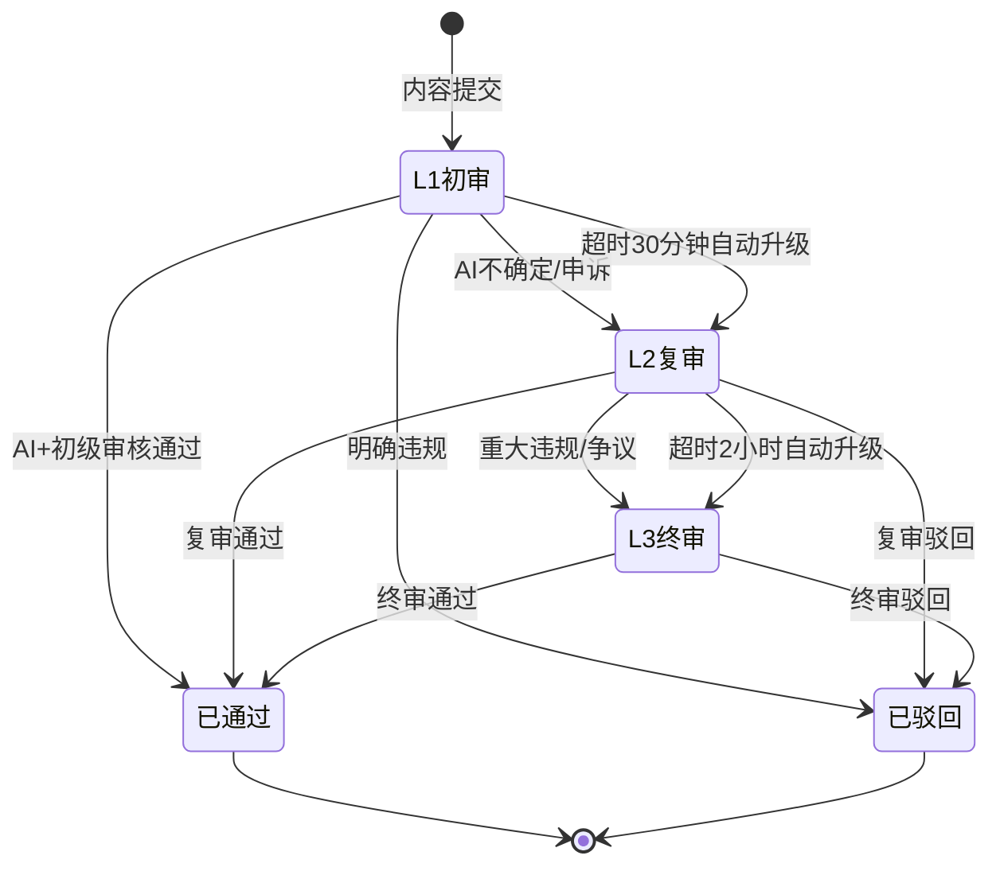
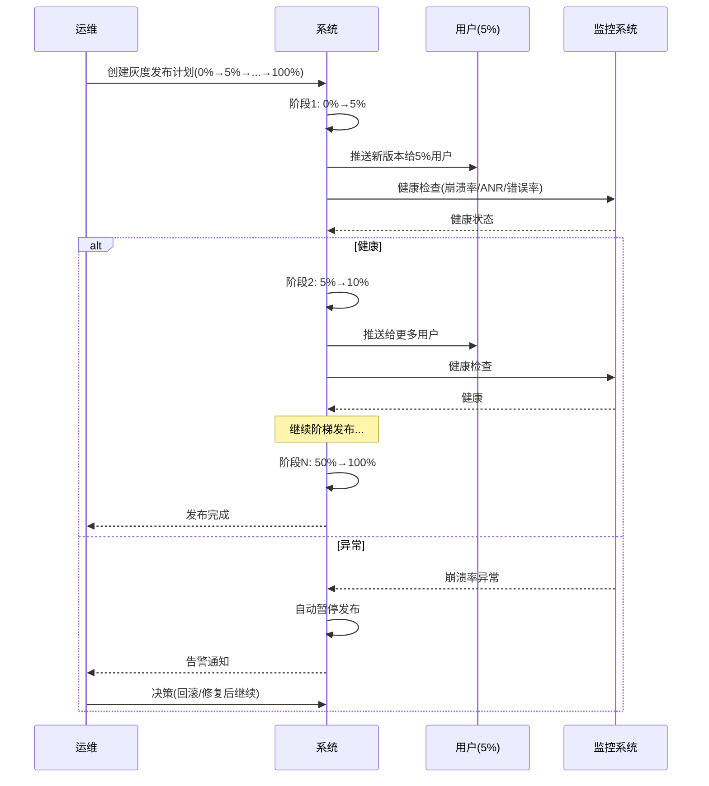
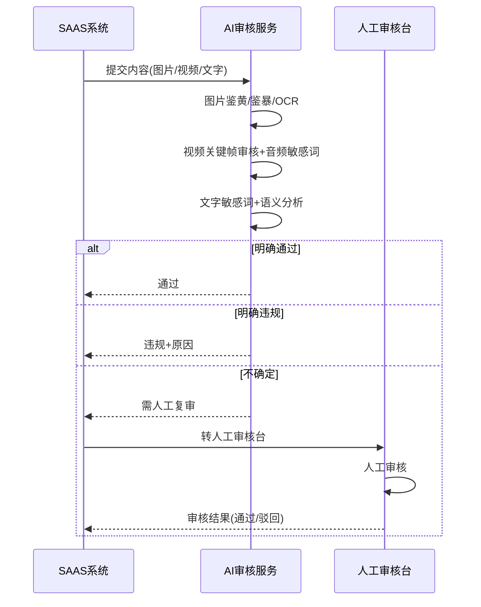

# 运营域 产品需求文档 PRD V1.0.0

> **业务域**：运营域（D13） | **版本**：V1.0.0 | **日期**：2026-07-16
> **数据来源**：`运营V1.0.0.md`、Axure原型 V1.0.2
> **追溯链**：UC-OPS → FN-OPS → PG-OPS → SC-OPS → BG-04 → BO-04

---

## 版本历史

| 版本 | 日期 | 变更内容 |
|------|------|----------|
| V1.0.2 | 2026-05-15 | 租户管理（启用/禁用/资质审核/域名/虚拟账户）、内容运营（栏目/短剧/短视频/图文/协议/评论）、风控（风控等级/违禁词/敏感词库）、版本管理、系统设置（操作日志/终端管理/素材配置） |
| V1.0.9 | 2026-07-16 | 按PRD规范V1.0.0重新编排；标注待建功能（风控规则引擎/租户分层运营/内容审核工作流/灰度发布/数据看板） |

---

## 目录

1. 背景与问题陈述
2. 目标与成功度量
3. 范围
4. 与既有模块关系
5. 业务目标映射
6. 用户故事
7. 功能需求列表与用例
8. 业务规则
9. 数据实体
10. 验收标准
11. 指标登记
12. 五类图
13. 外部接口标注
14. 检查清单

---

## 1. 背景与问题陈述

运营域是平台级管理中枢，负责租户生命周期管理、内容审核、风控安全、版本迭代、数据运营等全局能力。当前系统已具备基础运营能力，但在**精细化运营**和**自动化管控**上存在明显短板。

### 核心问题

| 问题编号 | 问题 | 严重程度 |
|----------|------|----------|
| OPS-ISSUE-001 | 风控规则引擎缺失（仅词库管理） | 🔴 高 |
| OPS-ISSUE-002 | 租户分层运营能力不足 | 🟡 中 |
| OPS-ISSUE-003 | 内容审核工作流不完善（单级） | 🟡 中 |
| OPS-ISSUE-004 | 灰度发布与AB测试缺失 | 🟡 中 |
| OPS-ISSUE-005 | 平台级数据看板缺失 | 🟡 中 |
| OPS-ISSUE-006 | 广告投放能力过于基础 | 🟢 低 |

---

## 2. 目标与成功度量

| 目标编号 | 目标 | 度量指标 | 目标值 |
|----------|------|----------|--------|
| BO-OPS-01 | 风控实时 | 规则匹配延迟 | < 10ms |
| BO-OPS-02 | 审核效率 | AI自动审核准确率 | ≥ 95% |
| BO-OPS-03 | 告警时效 | 高优告警触达 | < 1分钟 |
| BO-OPS-04 | 灰度监控 | 每阶段健康检查 | < 30秒 |

---

## 3. 范围

### In-Scope
- 租户管理（启用/禁用/资质审核/域名/虚拟账户）
- 内容运营（栏目/短剧/短视频/图文/协议/评论管理）
- 风控（风控等级/违禁词/敏感词库）+ 风控规则引擎（待建-P0）
- 版本管理（App版本增删改/回滚/市场配置）+ 灰度发布（待建-P1）
- 系统设置（操作日志/终端管理/素材配置）
- 内容审核工作流（待建-P1：三级+AI辅助+SLA）
- 租户分层运营（待建-P1：KA/中型/小型+健康度+流失预警）
- 平台级数据看板（待建-P1）

### Non-Goals
- 广告投放定向/效果追踪/AB测试（远期）
- AI运营助手（远期）

---

## 4. 与既有模块关系

### 上下游依赖矩阵

| 方向 | 关联域 | 依赖关系 | 说明 |
|------|--------|----------|------|
| **上游（被依赖）** | 直播域 | 直播内容审核依赖风控引擎 | 弹幕过滤/视频审核 |
| **上游（被依赖）** | 商品域 | 商品审核依赖内容审核流 | 品类审核/商品合规 |
| **上游（被依赖）** | 平台域 | 版本管理依赖灰度发布 | PAAS独立端版本同步 |
| **下游（依赖）** | 商品域 | 品类管理在运营后台 | 运营定义全平台类目树 |
| **下游（依赖）** | 财务域 | 运营后台交易管理 | 版本订阅确认收款 |

### 影响域说明

| 变更场景 | 影响域 | 影响说明 |
|----------|--------|----------|
| 租户禁用 | 所有域 | 租户下所有功能不可用 |
| 风控规则变更 | 直播域、商品域、营销域 | 弹幕过滤/商品审核/优惠券防刷 |
| 灰度发布 | APP域 | 部分用户收到新版本 |
| Feature Flag | 所有域 | 功能模块开关变化 |

---

## 5. 业务目标映射

| BG | BO | FN | 优先级 |
|----|-----|-----|--------|
| BG-04 风控实时 | BO-OPS-01 | FN-OPS-001 风控规则引擎 | P0 |
| BG-04 | BO-OPS-02 | FN-OPS-005 内容审核工作流 | P1 |
| BG-04 | BO-OPS-03 | FN-OPS-003 风控告警 | P0 |
| BG-04 | BO-OPS-04 | FN-OPS-007 灰度发布 | P1 |

---

## 6. 用户故事

| US编号 | 角色 | 用户故事 |
|--------|------|----------|
| US-OPS-001 | 平台运营 | 作为运营，我希望管理租户资质审核，以便控制准入 |
| US-OPS-002 | 风控人员 | 作为风控人员，我希望配置风控规则和敏感词库，以便防控风险 |
| US-OPS-003 | 审核人员 | 作为审核人员，我希望三级审核+AI辅助，以便提升审核效率 |
| US-OPS-004 | 技术运维 | 作为运维，我希望灰度发布和版本管理，以便降低发布风险 |
| US-OPS-005 | 平台运营 | 作为运营，我希望查看平台级数据看板，以便全局决策 |

---

## 7. 功能需求列表与用例

### FN-OPS-001 风控规则引擎（待建）

| 属性 | 值 |
|------|-----|
| 用例编号 | UC-OPS-001 |
| 名称 | 风控规则引擎 |
| 参与者 | 风控人员 |
| 优先级 | P0 |
| 关联BG | BG-04 |
| 自动化类型 | 事件驱动 |

**规则配置**：
- 条件：用户行为（领券/下单/评论/注册/登录）+ 设备信息 + IP + 时间段 + 频率
- 动作：拦截/验证码/警告/限制/记录
- 示例："24小时内同一设备领券超过10次→拦截+加入灰名单"

**全链路联动**：
- 直播弹幕→风控引擎→敏感词过滤→拦截/放行
- 商品描述/评价→风控引擎→违规内容拦截/人工复核
- 优惠券领取→风控引擎→防刷规则→限频/拦截

---

### FN-OPS-002 实时风控监控大屏（待建）

**展示**：今日风控拦截量/风控事件趋势/TOP风险类型/实时滚动风控事件/可下钻查看事件详情。

---

### FN-OPS-003 风控告警通知（待建）

- 高优先级风控事件多渠道通知（短信/邮件/企微/APP推送）
- 告警升级策略（初级未处理→升级主管）

---

### FN-OPS-004 黑白名单管理（待建）

- 白名单：信任用户/IP/设备，跳过风控
- 黑名单：封禁用户/IP/设备，全场景拦截
- 灰名单：重点监控，行为异常自动升级

---

### FN-OPS-005 内容审核工作流（待建）

**三级审核**：
- L1初审（AI自动审核+初级审核员）
- L2复审（高级审核员，处理AI不确定内容+申诉）
- L3终审（审核主管，处理重大违规+争议内容）

**AI辅助**：图片鉴黄/鉴暴/OCR/Logo侵权；视频关键帧审核+音频敏感词；文字敏感词过滤+语义分析。

**SLA管理**：L1:30分钟, L2:2小时, L3:24小时。超时自动升级。

---

### FN-OPS-006 租户分层运营（待建）

**分层**：KA（专属CSM+季度复盘）/中型（定期回访+培训）/小型（自助+智能客服）。

**健康度评分**：活跃度(30%)+GMV增长(25%)+用户留存(20%)+功能使用深度(15%)+工单满意度(10%)。

**流失预警**：活跃度连续下降/GMV连续下滑/功能使用频率降低/未续费→自动推送CSM。

---

### FN-OPS-007 灰度发布与功能开关（待建）

**灰度发布**：0%→5%→10%→25%→50%→100%阶梯；按租户/地域/设备型号；每阶段自动健康检查。

**AB测试**：对照组vs实验组；指标配置；结果自动分析。

**Feature Flag**：按租户/用户/百分比控制；Kill Switch（紧急关闭）。

---

### FN-OPS-008 平台级数据看板（待建）

**核心指标**：平台GMV/活跃租户数/活跃用户数/订单量/客单价/新增租户/流失率。

**租户分析**：TOP20排行/行业分布/地域分布/版本订阅分布。

**资源监控**：流量消耗/存储消耗/计算资源/成本与营收。

---

### FN-OPS-009~011 已实现功能

| FN编号 | 功能名称 | 状态 |
|--------|----------|------|
| FN-OPS-009 | 租户管理（启用/禁用/资质审核/域名/虚拟账户） | ✅ 已实现 |
| FN-OPS-010 | 内容运营（栏目/短剧/短视频/图文/协议/评论管理） | ✅ 已实现 |
| FN-OPS-011 | 版本管理（App版本增删改/回滚/市场配置） | ✅ 已实现 |
| FN-OPS-012 | 系统设置（操作日志/终端管理/素材配置） | ✅ 已实现 |
| FN-OPS-013 | 风控基础（风控等级/违禁词/敏感词库） | ✅ 已实现 |

---

## 8. 业务规则

### BR-OPS-001 风控规则引擎规则
- 条件：用户行为+设备+IP+时间段+频率
- 动作：拦截/验证码/警告/限制/记录
- 规则匹配延迟 < 10ms

### BR-OPS-002 风控全链路联动规则
- 直播弹幕→风控引擎→敏感词过滤→拦截/放行
- 商品描述/评价→风控引擎→违规内容拦截/人工复核
- 优惠券领取→风控引擎→防刷规则→限频/拦截

### BR-OPS-003 黑白名单规则
- 白名单：跳过风控
- 黑名单：全场景拦截
- 灰名单：重点监控，行为异常自动升级

### BR-OPS-004 内容审核SLA规则
- L1:30分钟, L2:2小时, L3:24小时
- 超时自动升级到上一级

### BR-OPS-005 租户健康度评分规则
- 评分维度：活跃度(30%)+GMV增长(25%)+用户留存(20%)+功能使用深度(15%)+工单满意度(10%)
- 低分自动触发CSM跟进

### BR-OPS-006 灰度发布规则
- 阶梯：0%→5%→10%→25%→50%→100%
- 每阶段自动健康检查（崩溃率/ANR/接口错误率），异常自动暂停

### BR-OPS-007 Feature Flag规则
- 按租户/用户/百分比控制
- Kill Switch：紧急关闭某个功能

---

## 9. 数据实体

### ENT-OPS-001 风控规则(RiskRule)

| 字段 | 类型 | 说明 |
|------|------|------|
| rule_id | String | 规则ID |
| rule_name | String | 规则名称 |
| conditions | Object | 条件（行为/设备/IP/时间/频率） |
| action | Enum | 拦截/验证码/警告/限制/记录 |
| status | Enum | 启用/禁用 |
| priority | Integer | 优先级 |

### ENT-OPS-002 风控事件(RiskEvent)

| 字段 | 类型 | 说明 |
|------|------|------|
| event_id | String | 事件ID |
| rule_id | String | 触发规则ID |
| user_id | String | 用户ID |
| event_type | String | 事件类型 |
| event_detail | Object | 事件详情 |
| action_taken | Enum | 执行动作 |
| event_time | Datetime | 事件时间 |

### ENT-OPS-003 黑白名单(BlacklistWhitelist)

| 字段 | 类型 | 说明 |
|------|------|------|
| list_id | String | 记录ID |
| list_type | Enum | 白名单/黑名单/灰名单 |
| target_type | Enum | 用户/IP/设备 |
| target_value | String | 目标值 |
| reason | String | 原因 |
| create_time | Datetime | 创建时间 |

### ENT-OPS-004 租户健康度(TenantHealth)

| 字段 | 类型 | 说明 |
|------|------|------|
| health_id | String | 记录ID |
| tenant_id | String | 租户ID |
| tier | Enum | KA/中型/小型 |
| activity_score | Decimal | 活跃度评分 |
| gmv_growth_score | Decimal | GMV增长评分 |
| retention_score | Decimal | 留存评分 |
| usage_depth_score | Decimal | 功能使用深度评分 |
| satisfaction_score | Decimal | 工单满意度评分 |
| total_score | Decimal | 总评分 |
| is_churn_warning | Boolean | 是否流失预警 |

---

## 10. 验收标准

| SC编号 | 场景 | 预期结果 |
|--------|------|----------|
| SC-OPS-001 | 风控规则拦截 | 24小时同设备领券>10次→拦截+加入灰名单 |
| SC-OPS-002 | 三级审核流程 | UGC内容→L1(AI)→L2(复审)→L3(终审)→通过/驳回 |
| SC-OPS-003 | 灰度发布 | 0%→5%→10%...→100%，异常自动暂停 |
| SC-OPS-004 | 流失预警 | 租户活跃度连续下降→自动推送CSM |
| SC-OPS-005 | 黑名单拦截 | 黑名单用户→全场景拦截 |

| FN | Given | When | Then |
|----|-------|------|------|
| FN-OPS-001 | 风控规则配置 | 用户行为触发条件 | 规则匹配<10ms，执行动作 |
| FN-OPS-005 | UGC内容提交 | 进入审核流 | L1→L2→L3，超时自动升级 |
| FN-OPS-007 | 灰度发布10%阶段 | 崩溃率异常 | 自动暂停发布 |
| FN-OPS-006 | 租户健康度评分 | 总分低于阈值 | 触发CSM跟进 |

---

## 11. 指标登记

| 指标 | 说明 | 目标值 |
|------|------|--------|
| MET-OPS-001 | 风控规则匹配延迟 | < 10ms |
| MET-OPS-002 | AI审核准确率 | ≥ 95% |
| MET-OPS-003 | 告警触达时效 | < 1分钟 |
| MET-OPS-004 | 灰度健康检查 | < 30秒 |
| MET-OPS-005 | 数据看板延迟 | < 5分钟 |

---

## 12. 五类图

### 12.1 业务流程图 — 风控规则引擎全链路

### 12.2 信息流转图 — 运营域跨模块

### 12.3 状态机 — 内容审核状态机

**状态过渡操作表**：

| 当前状态 | 触发操作 | 目标状态 | 操作者 | 前置约束 | 后置动作 |
|----------|----------|----------|--------|----------|----------|
| — | 内容提交 | L1初审 | 系统/用户 | — | AI自动审核 |
| L1初审 | AI+初级通过 | 已通过 | 系统/审核员 | — | 内容上线 |
| L1初审 | 明确违规 | 已驳回 | 系统/审核员 | — | 通知提交者 |
| L1初审 | AI不确定/申诉 | L2复审 | 系统 | — | 转高级审核员 |
| L1初审 | 超时30分钟 | L2复审 | 系统 | — | 自动升级 |
| L2复审 | 复审通过 | 已通过 | 高级审核员 | — | 内容上线 |
| L2复审 | 重大违规/争议 | L3终审 | 高级审核员 | — | 转审核主管 |
| L2复审 | 超时2小时 | L3终审 | 系统 | — | 自动升级 |
| L3终审 | 终审通过 | 已通过 | 审核主管 | — | 内容上线 |
| L3终审 | 终审驳回 | 已驳回 | 审核主管 | — | 通知提交者 |

### 12.4 业务时序图 — 灰度发布流程

### 12.5 三方接口时序图 — AI内容审核接口

---

## 13. 外部接口标注

| 接口编号 | 接口名称 | 方向 | 对端系统 | 说明 |
|----------|----------|------|----------|------|
| API-OPS-001 | AI内容审核 | 双向 | AI内容审核服务 | 图片/视频/文字鉴黄鉴暴 |
| API-OPS-002 | 告警通知 | 单向(出) | 短信/邮件/企微 | 高优告警多渠道通知 |
| API-OPS-003 | 实名认证 | 单向(出) | 公安/第三方实名服务 | 身份证实名验证 |

---

## 14. 检查清单

| # | 检查项 | 状态 |
|---|--------|------|
| 1-20 | 全部检查项 | ✅ |

---

> **关联文档**：源MD `运营V1.0.0.md` | 上游：直播域/商品域/平台域 | 下游：商品域/财务域 | 总索引 `00-SAAS-PRD-总索引.md`
