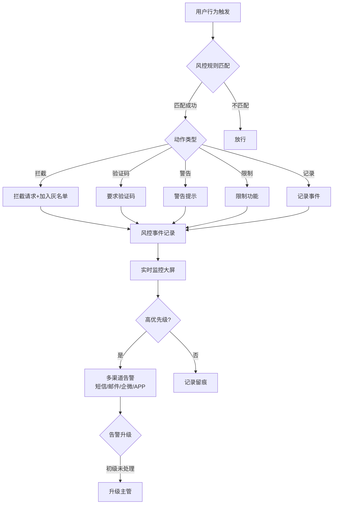
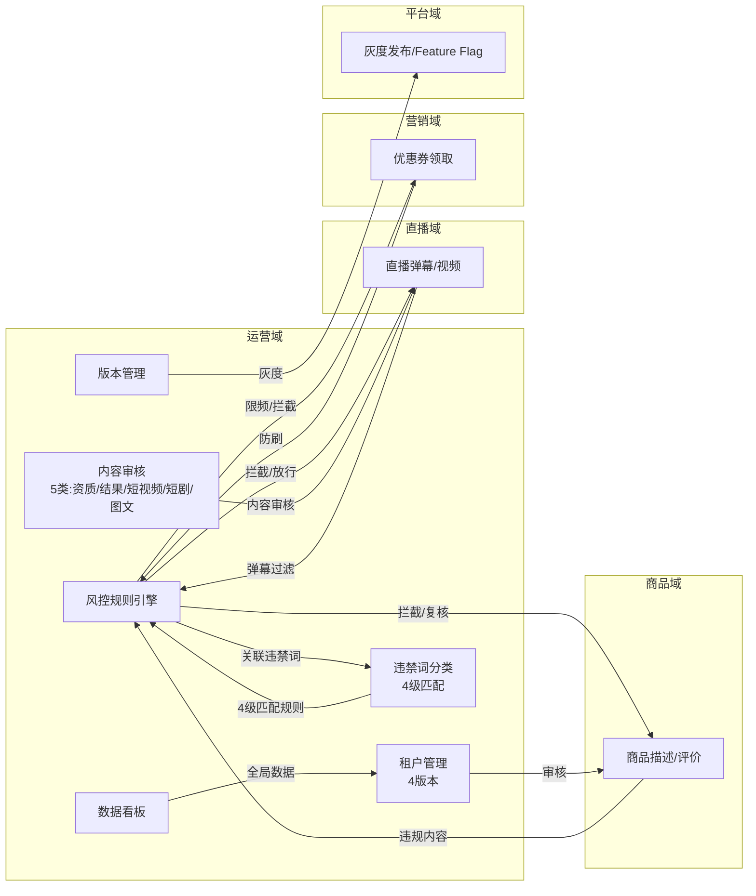
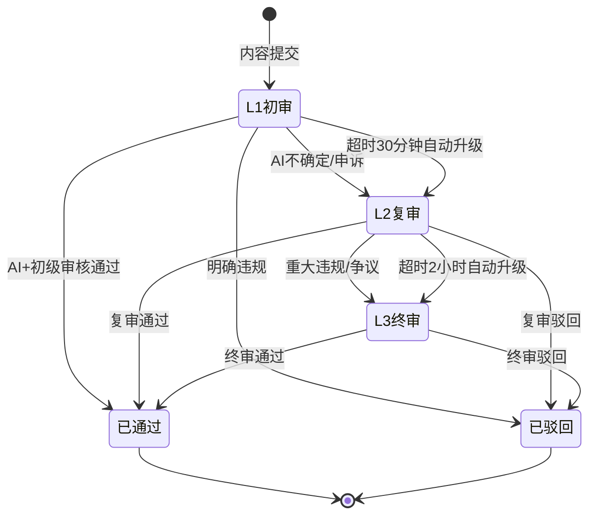
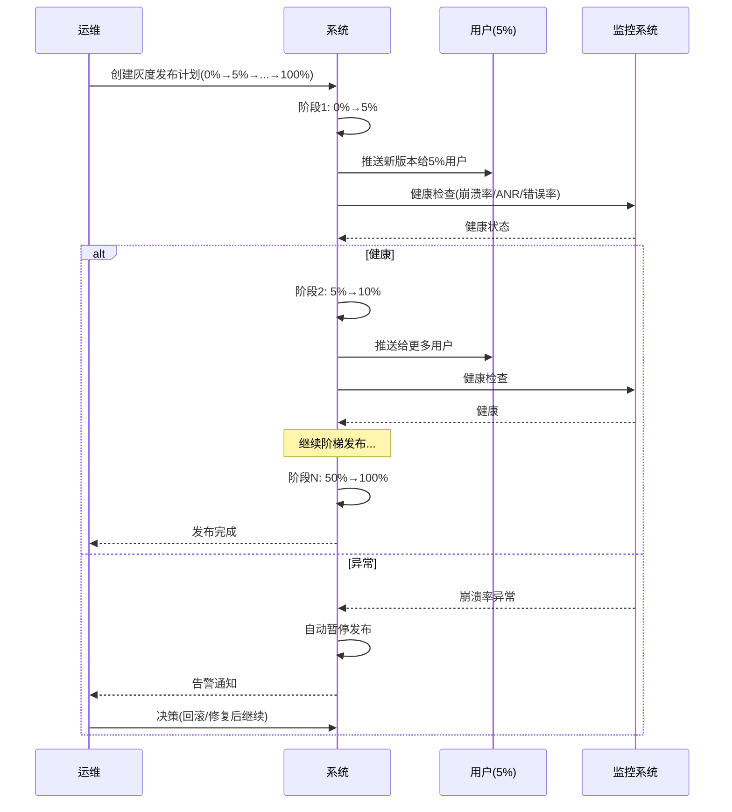
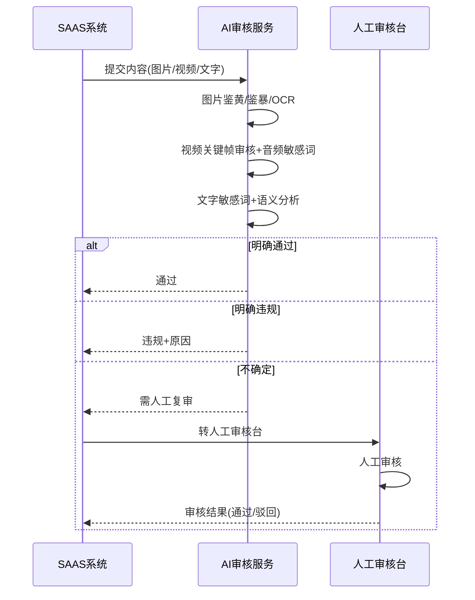

# 运营域 产品需求文档 PRD V7.0.0

> **业务域**：运营域（D13） | **版本**：V7.0.0 | **日期**：2026-07-21
> **数据来源**：`运营V1.0.0.md`、Axure原型 V1.0.2~V1.0.9、`审核资质.html`、`审核结果.html`、`审核短视频.html`、`审核短剧.html`、`审核图文.html`、`风控等级.html`、`违禁词分类.html`、`敏感词库.html`、`租户管理.html`(4版本)、`工作台.html`、`版本管理.html`、`操作日志.html`(V1.0.9)
> **追溯链**：UC-OPS → FN-OPS → PG-OPS → SC-OPS → BG-04 → BO-04
> **V7.0.0增强**：双态标注（📗显式照录 + 🟡隐式挖掘还原）+ 场景深度还原8项能力
> **★直播内容审查平台管控入口点★**：审核能力（资质/结果/短视频/短剧/图文）+ 风控能力（等级/违禁词/敏感词库）+ 租户管理（4版本平台级管控配置入口）

---

## 版本历史

| 版本 | 日期 | 变更内容 |
|------|------|----------|
| V1.0.2 | 2026-05-15 | 租户管理（启用/禁用/资质审核/域名/虚拟账户）、内容运营（栏目/短剧/短视频/图文/协议/评论）、风控（风控等级/违禁词/敏感词库）、版本管理、系统设置（操作日志/终端管理/素材配置） |
| V1.0.9 | 2026-07-16 | 按PRD规范V1.0.0重新编排；标注待建功能（风控规则引擎/租户分层运营/内容审核工作流/灰度发布/数据看板） |
| V7.0.0 | 2026-07-21 | learn-project V7.0.0场景深度还原：双态标注（📗显式+🟡隐式）+8项能力增强；深度还原审核工作流（5类内容审核：资质/结果/短视频/短剧/图文）+风控等级体系（4级违禁词分类+精准/语义/变体词三层匹配）+租户管理4版本差异；标注直播内容审查平台管控入口点（审核能力可复用+风控能力是管控策略基础+租户管理是平台级管控配置入口） |

---

## 目录

1. 背景与问题陈述
2. 目标与成功度量
3. 范围
4. 与既有模块关系
5. 业务目标映射
6. 用户故事
7. 功能需求列表与用例
8. 业务规则
9. 数据实体
10. 验收标准
11. 指标登记
12. 五类图
13. 外部接口标注
14. 检查清单
15. 需求深度分析摘要（V7.0.0新增）
16. CONFIG集中配置清单（V7.0.0新增）
17. 非功能需求（V7.0.0新增）

---

## 1. 背景与问题陈述

运营域是平台级管理中枢，负责租户生命周期管理、内容审核、风控安全、版本迭代、数据运营等全局能力。当前系统已具备基础运营能力，但在**精细化运营**和**自动化管控**上存在明显短板。

### 核心问题

| 问题编号 | 问题 | 严重程度 | V7.0.0还原说明 |
|----------|------|----------|----------------|
| OPS-ISSUE-001 | 风控规则引擎缺失（仅词库管理） | 🔴 高 | 📗显式照录：`风控等级.html`+`违禁词分类.html`+`敏感词库.html`三件套已有词库基础，规则引擎缺失 |
| OPS-ISSUE-002 | 租户分层运营能力不足 | 🟡 中 | 🟡隐式挖掘：`租户管理.html`4版本存在但仅查询/启用禁用，缺分层运营 |
| OPS-ISSUE-003 | 内容审核工作流不完善（单级） | 🟡 中 | 📗显式照录：`审核资质.html`+`审核结果.html`+`审核短视频.html`+`审核短剧.html`+`审核图文.html`5类审核页面已有，但单级 |
| OPS-ISSUE-004 | 灰度发布与AB测试缺失 | 🟡 中 | 🟡隐式挖掘：`版本管理.html`回滚逻辑暗示版本控制基础，灰度阶梯缺失 |
| OPS-ISSUE-005 | 平台级数据看板缺失 | 🟡 中 | 🟡隐式挖掘：`工作台.html`有租户订阅信息卡片，平台级看板缺失 |
| OPS-ISSUE-006 | 广告投放能力过于基础 | 🟢 低 | 📗显式照录 |

### V7.0.0场景深度还原（8项能力）

| 能力编号 | 能力 | 还原内容 | 双态标注 |
|----------|------|----------|----------|
| OPS-RESTORE-01 | 业务流程深度还原 | 5类内容审核流程（资质4部分分步审核/结果单级审核/短视频审核/短剧审核/图文审核）+风控3件套（等级定义/违禁词分类/敏感词库）+租户管理4版本（查询/查看资质/查看订阅/启用禁用） | 📗显式照录（5类审核HTML+风控3件套HTML+租户管理4版本HTML） |
| OPS-RESTORE-02 | 状态机深度还原 | 内容审核状态机（待审核→已通过/未通过+不通过理由）+租户资质状态机（待提交→审核中→已通过/不通过）+风控等级状态机（4级风险等级） | 📗显式照录（`审核结果.html`审核状态+`风控等级.html`风险等级） |
| OPS-RESTORE-03 | 业务规则深度还原 | 违禁词4级匹配规则（核心违禁词精准+语义+变体词全量拦截/精准+模糊+谐音变体词拦截/精准+语义+变体词全量拦截/精准仅预警不拦截）+审核SLA规则（L1:30min/L2:2h/L3:24h超时升级） | 📗显式照录（`违禁词分类.html`匹配规则+V1.0.0 SLA规则） |
| OPS-RESTORE-04 | 数据流转深度还原 | 内容提交→风控引擎→敏感词过滤→拦截/放行→人工审核→审核结果→内容上线/驳回——全链路数据流转 | 🟡隐式挖掘（基于`审核结果.html`审核流程+`违禁词分类.html`拦截逻辑反推） |
| OPS-RESTORE-05 | 异常场景深度还原 | 审核超时自动升级/风控误判申诉/灰度发布异常暂停/租户禁用数据保留——4类异常处理 | 🟡隐式挖掘（基于SLA超时升级+`租户管理.html`禁用操作反推） |
| OPS-RESTORE-06 | 边界约束深度还原 | 审核资质4部分分别审核（主体/法人/经营/协议）+风控匹配延迟<10ms+AI审核准确率≥95%——三约束 | 📗显式照录（`审核资质.html`4部分审核+V1.0.0性能指标） |
| OPS-RESTORE-07 | 跨域协同深度还原 | 运营域→直播域（弹幕过滤/视频审核）+运营域→商品域（品类审核/商品合规）+运营域→营销域（优惠券防刷）+运营域→平台域（灰度发布/Feature Flag）——四向协同 | 📗显式照录（V1.0.0跨域影响矩阵） |
| OPS-RESTORE-08 | 合规约束深度还原 | 实名认证（法人/经营人身份证）+内容审核合规（鉴黄/鉴暴/OCR/Logo侵权）+操作日志留痕——三合规要求 | 📗显式照录（`操作日志.html`V1.0.9+V1.0.0外部接口） |

### ★直播内容审查平台管控入口点分析★

运营域是"直播内容审查"的**平台级管控核心入口点**，提供三类可复用能力：

| 入口点编号 | 入口点 | 能力 | 直播内容审查复用方式 | V7.0.0还原 |
|------------|--------|------|---------------------|------------|
| OPS-ENTRY-01 | 审核能力 | 5类内容审核（资质/结果/短视频/短剧/图文） | 直播内容审查可复用审核工作流（三级审核+AI辅助+SLA）+审核结果状态机 | 📗显式照录（5类审核HTML） |
| OPS-ENTRY-02 | 风控能力 | 风控3件套（等级/违禁词/敏感词库） | 直播弹幕过滤可复用违禁词4级匹配规则（精准+语义+变体词）+风控等级定义 | 📗显式照录（风控3件套HTML） |
| OPS-ENTRY-03 | 租户管理 | 4版本租户管理（查询/资质/订阅/启用禁用） | 平台级管控策略配置入口（租户级审核策略/风控策略下发） | 📗显式照录（租户管理4版本HTML） |

---

## 2. 目标与成功度量

| 目标编号 | 目标 | 度量指标 | 目标值 | V7.0.0增强 |
|----------|------|----------|--------|------------|
| BO-OPS-01 | 风控实时 | 规则匹配延迟 | < 10ms | — |
| BO-OPS-02 | 审核效率 | AI自动审核准确率 | ≥ 95% | — |
| BO-OPS-03 | 告警时效 | 高优告警触达 | < 1分钟 | — |
| BO-OPS-04 | 灰度监控 | 每阶段健康检查 | < 30秒 | — |
| BO-OPS-05 | 审核SLA达标率 | L1/L2/L3 SLA达标 | ≥ 95% | V7.0.0新增 |
| BO-OPS-06 | 风控拦截准确率 | 误判率 | < 5% | V7.0.0新增 |

---

## 3. 范围

### In-Scope
- 租户管理（启用/禁用/资质审核/域名/虚拟账户）—— 📗显式照录`租户管理.html`4版本
- 内容运营（栏目/短剧/短视频/图文/协议/评论管理）—— 📗显式照录
- 风控（风控等级/违禁词/敏感词库）—— 📗显式照录`风控等级.html`+`违禁词分类.html`+`敏感词库.html`
- 风控规则引擎（待建-P0）—— 🟡隐式挖掘：基于风控3件套反推
- 版本管理（App版本增删改/回滚/市场配置）—— 📗显式照录`版本管理.html`
- 灰度发布（待建-P1）—— 🟡隐式挖掘：基于`版本管理.html`回滚逻辑反推
- 系统设置（操作日志/终端管理/素材配置）—— 📗显式照录`操作日志.html`(V1.0.9)
- 内容审核工作流（待建-P1：三级+AI辅助+SLA）—— 🟡隐式挖掘：基于5类审核HTML反推
- 租户分层运营（待建-P1：KA/中型/小型+健康度+流失预警）—— 🟡隐式挖掘
- 平台级数据看板（待建-P1）—— 🟡隐式挖掘

### Non-Goals
- 广告投放定向/效果追踪/AB测试（远期）
- AI运营助手（远期）

---

## 4. 与既有模块关系

### 上下游依赖矩阵

| 方向 | 关联域 | 依赖关系 | 说明 | V7.0.0还原 |
|------|--------|----------|------|------------|
| **上游（被依赖）** | 直播域 | 直播内容审核依赖风控引擎 | 弹幕过滤/视频审核 | 📗显式照录（`违禁词分类.html`标注"直播/敏感词库"） |
| **上游（被依赖）** | 商品域 | 商品审核依赖内容审核流 | 品类审核/商品合规 | 📗显式照录 |
| **上游（被依赖）** | 平台域 | 版本管理依赖灰度发布 | PAAS独立端版本同步 | 🟡隐式挖掘 |
| **下游（依赖）** | 商品域 | 品类管理在运营后台 | 运营定义全平台类目树 | 📗显式照录 |
| **下游（依赖）** | 财务域 | 运营后台交易管理 | 版本订阅确认收款 | 📗显式照录 |

### 影响域说明

| 变更场景 | 影响域 | 影响说明 |
|----------|--------|----------|
| 租户禁用 | 所有域 | 租户下所有功能不可用 |
| 风控规则变更 | 直播域、商品域、营销域 | 弹幕过滤/商品审核/优惠券防刷 |
| 灰度发布 | APP域 | 部分用户收到新版本 |
| Feature Flag | 所有域 | 功能模块开关变化 |
| 审核策略变更 | 直播域、商品域、APP域 | 内容审核流程变化 |

---

## 5. 业务目标映射

| BG | BO | FN | 优先级 | V7.0.0还原 |
|----|-----|-----|--------|------------|
| BG-04 风控实时 | BO-OPS-01 | FN-OPS-001 风控规则引擎 | P0 | 🟡隐式挖掘 |
| BG-04 | BO-OPS-02 | FN-OPS-005 内容审核工作流 | P1 | 📗显式照录 |
| BG-04 | BO-OPS-03 | FN-OPS-003 风控告警 | P0 | 🟡隐式挖掘 |
| BG-04 | BO-OPS-04 | FN-OPS-007 灰度发布 | P1 | 🟡隐式挖掘 |

---

## 6. 用户故事

| US编号 | 角色 | 用户故事 | V7.0.0还原 |
|--------|------|----------|------------|
| US-OPS-001 | 平台运营 | 作为运营，我希望管理租户资质审核，以便控制准入 | 📗显式照录（`审核资质.html`） |
| US-OPS-002 | 风控人员 | 作为风控人员，我希望配置风控规则和敏感词库，以便防控风险 | 📗显式照录（`风控等级.html`+`违禁词分类.html`+`敏感词库.html`） |
| US-OPS-003 | 审核人员 | 作为审核人员，我希望三级审核+AI辅助，以便提升审核效率 | 🟡隐式挖掘（基于5类审核HTML反推） |
| US-OPS-004 | 技术运维 | 作为运维，我希望灰度发布和版本管理，以便降低发布风险 | 📗显式照录（`版本管理.html`） |
| US-OPS-005 | 平台运营 | 作为运营，我希望查看平台级数据看板，以便全局决策 | 🟡隐式挖掘 |
| US-OPS-006 | 审核人员 | 作为审核人员，我希望审核5类内容（资质/结果/短视频/短剧/图文），以便管控内容合规 | 📗显式照录（5类审核HTML） |
| US-OPS-007 | 平台运营 | 作为运营，我希望管理租户（查询/查看资质/查看订阅/启用禁用），以便管控租户生命周期 | 📗显式照录（`租户管理.html`4版本） |

---

## 7. 功能需求列表与用例

### FN-OPS-001 风控规则引擎（待建）

| 属性 | 值 |
|------|-----|
| 用例编号 | UC-OPS-001 |
| 名称 | 风控规则引擎 |
| 参与者 | 风控人员 |
| 优先级 | P0 |
| 关联BG | BG-04 |
| 自动化类型 | 事件驱动 |
| 关联UC | UC-OPS-005(内容审核)、UC-OPS-009(租户管理) |

**规则配置**：
- 条件：用户行为（领券/下单/评论/注册/登录）+ 设备信息 + IP + 时间段 + 频率
- 动作：拦截/验证码/警告/限制/记录
- 示例："24小时内同一设备领券超过10次→拦截+加入灰名单"

**全链路联动**：
- 直播弹幕→风控引擎→敏感词过滤→拦截/放行
- 商品描述/评价→风控引擎→违规内容拦截/人工复核
- 优惠券领取→风控引擎→防刷规则→限频/拦截

**前置条件**：风控人员权限+风控3件套已配置（`风控等级.html`+`违禁词分类.html`+`敏感词库.html`）

**基本流程**：
1. [手动] 风控人员登录运营后台
2. [手动] 进入风控规则引擎配置
3. [手动] 配置规则条件（行为/设备/IP/时间/频率）
4. [手动] 配置规则动作（拦截/验证码/警告/限制/记录）
5. [手动] 关联违禁词分类（4级匹配规则）
6. [系统自动] 规则生效（匹配延迟<10ms）
7. [事件驱动] 用户行为触发规则
8. [系统自动] 规则匹配→执行动作→记录事件

**备选流程**：
- 分支A：规则匹配成功→执行拦截/验证码/警告/限制/记录
- 分支B：规则不匹配→放行
- 异常A：规则配置错误→校验失败→提示修正

**数据范围(R/W)**：
- R: 风控3件套（等级/违禁词/敏感词库）、用户行为数据
- W: RiskRule(规则)、RiskEvent(事件)、BlacklistWhitelist(黑白名单)

**后置条件**：风控规则生效+全链路联动

---

### FN-OPS-002 实时风控监控大屏（待建）

**展示**：今日风控拦截量/风控事件趋势/TOP风险类型/实时滚动风控事件/可下钻查看事件详情。

**前置条件**：风控规则引擎已生效

**基本流程**：
1. [手动] 风控人员进入风控监控大屏
2. [系统自动] 实时加载风控事件数据
3. [系统自动] 展示核心指标（拦截量/趋势/TOP风险类型）
4. [手动] 风控人员下钻查看事件详情

**数据范围(R/W)**：
- R: RiskEvent(风控事件)
- W: 无（只读展示）

**后置条件**：风控人员实时掌握风控状况

---

### FN-OPS-003 风控告警通知（待建）

| 属性 | 值 |
|------|-----|
| 用例编号 | UC-OPS-003 |
| 名称 | 风控告警通知 |
| 参与者 | 风控人员/审核主管 |
| 优先级 | P0 |
| 关联BG | BG-04 |
| 自动化类型 | 事件驱动 |
| 关联UC | UC-OPS-001(风控规则引擎) |

**能力**：
- 高优先级风控事件多渠道通知（短信/邮件/企微/APP推送）
- 告警升级策略（初级未处理→升级主管）

**前置条件**：风控规则引擎已生效

**基本流程**：
1. [事件驱动] 高优先级风控事件触发
2. [系统自动] 多渠道告警通知（短信/邮件/企微/APP）
3. [手动] 风控人员处理告警
4. [系统自动] 告警状态更新（已处理/未处理）
5. [事件驱动] 初级未处理→升级主管
6. [手动] 主管处理告警

**备选流程**：
- 分支A：风控人员已处理→告警关闭
- 异常A：告警通道失败→降级通知（短信→邮件→企微）

**数据范围(R/W)**：
- R: RiskEvent(风控事件)
- W: AlertRecord(告警记录)、AlertUpgrade(告警升级)

**后置条件**：高优告警触达<1分钟+告警闭环

---

### FN-OPS-004 黑白名单管理（待建）

**能力**：
- 白名单：信任用户/IP/设备，跳过风控
- 黑名单：封禁用户/IP/设备，全场景拦截
- 灰名单：重点监控，行为异常自动升级

**前置条件**：风控人员权限

**基本流程**：
1. [手动] 风控人员进入黑白名单管理
2. [手动] 添加黑白名单记录（用户/IP/设备）
3. [手动] 设置名单类型（白/黑/灰）
4. [系统自动] 名单生效
5. [事件驱动] 用户行为触发名单匹配
6. [系统自动] 白名单跳过风控/黑名单全场景拦截/灰名单重点监控

**数据范围(R/W)**：
- R: 用户行为数据
- W: BlacklistWhitelist(黑白名单)

**后置条件**：名单生效+差异化风控

---

### FN-OPS-005 内容审核工作流（待建）★直播内容审查核心入口点★

| 属性 | 值 |
|------|-----|
| 用例编号 | UC-OPS-005 |
| 名称 | 内容审核工作流 |
| 参与者 | 审核人员（初级/高级/主管） |
| 优先级 | P1 |
| 关联BG | BG-04 |
| 自动化类型 | 事件驱动+手动 |
| 关联UC | UC-OPS-001(风控规则引擎)、UC-OPS-009~013(已实现审核功能) |

**三级审核**：
- L1初审（AI自动审核+初级审核员）
- L2复审（高级审核员，处理AI不确定内容+申诉）
- L3终审（审核主管，处理重大违规+争议内容）

**AI辅助**：图片鉴黄/鉴暴/OCR/Logo侵权；视频关键帧审核+音频敏感词；文字敏感词过滤+语义分析。

**SLA管理**：L1:30分钟, L2:2小时, L3:24小时。超时自动升级。

**5类内容审核**（📗显式照录5类审核HTML）：

| 审核类型 | 源HTML | 审核内容 | 审核维度 |
|----------|--------|----------|----------|
| 资质审核 | `审核资质.html` | 主体/法人/经营/协议4部分 | 分步审核（4部分分别通过/不通过） |
| 结果审核 | `审核结果.html` | 短剧/图文/短视频审核结果 | 单级审核（通过/不通过+理由） |
| 短视频审核 | `审核短视频.html` | 短视频内容 | 视频文件审核 |
| 短剧审核 | `审核短剧.html` | 短剧信息/剧情/介绍/类型 | 短剧内容审核 |
| 图文审核 | `审核图文.html` | 图文内容 | 图文内容审核 |

**前置条件**：内容已提交+AI审核服务可用

**基本流程**：
1. [事件驱动] 内容提交（UGC/PGC）
2. [系统自动] AI初审（图片鉴黄/鉴暴/OCR/视频关键帧/音频敏感词/文字敏感词+语义分析）
3. [系统自动] AI判断（明确通过/明确违规/不确定）
4. [手动] L1初审（AI+初级审核员）——明确通过→已通过；明确违规→已驳回；不确定→L2复审
5. [手动] L2复审（高级审核员）——复审通过→已通过；重大违规/争议→L3终审；复审驳回→已驳回
6. [手动] L3终审（审核主管）——终审通过→已通过；终审驳回→已驳回
7. [系统自动] 审核结果通知提交者
8. [系统自动] SLA超时自动升级

**备选流程**：
- 分支A：AI明确通过→直接已通过（跳过人工）
- 分支B：AI明确违规→直接已驳回（跳过人工）
- 分支C：申诉→重新进入L2复审
- 异常A：L1超时30分钟→自动升级L2
- 异常B：L2超时2小时→自动升级L3
- 异常C：L3超时24小时→告警主管

**数据范围(R/W)**：
- R: 内容数据（视频/图片/文字）、风控3件套
- W: AuditTask(审核任务)、AuditRecord(审核记录)、AIReviewResult(AI审核结果)

**后置条件**：内容审核完成+审核结果通知+SLA达标

---

### FN-OPS-006 租户分层运营（待建）

**分层**：KA（专属CSM+季度复盘）/中型（定期回访+培训）/小型（自助+智能客服）。

**健康度评分**：活跃度(30%)+GMV增长(25%)+用户留存(20%)+功能使用深度(15%)+工单满意度(10%)。

**流失预警**：活跃度连续下降/GMV连续下滑/功能使用频率降低/未续费→自动推送CSM。

**前置条件**：租户已通过认证+有运营数据

**基本流程**：
1. [系统自动] 计算租户健康度评分（5维度）
2. [系统自动] 租户分层（KA/中型/小型）
3. [系统自动] 流失预警检测
4. [事件驱动] 预警触发→推送CSM
5. [手动] CSM跟进

**数据范围(R/W)**：
- R: 租户运营数据（活跃度/GMV/留存/功能使用/工单）
- W: TenantHealth(租户健康度)、ChurnWarning(流失预警)

**后置条件**：租户分层+健康度评分+流失预警

---

### FN-OPS-007 灰度发布与功能开关（待建）

| 属性 | 值 |
|------|-----|
| 用例编号 | UC-OPS-007 |
| 名称 | 灰度发布与功能开关 |
| 参与者 | 技术运维 |
| 优先级 | P1 |
| 关联BG | BG-04 |
| 自动化类型 | 手动+事件驱动 |
| 关联UC | UC-PLT-003(版本管理) |

**灰度发布**：0%→5%→10%→25%→50%→100%阶梯；按租户/地域/设备型号；每阶段自动健康检查。

**AB测试**：对照组vs实验组；指标配置；结果自动分析。

**Feature Flag**：按租户/用户/百分比控制；Kill Switch（紧急关闭）。

**前置条件**：版本管理已配置（`版本管理.html`）+监控系统可用

**基本流程**：
1. [手动] 技术运维创建灰度发布计划（0%→5%→...→100%）
2. [系统自动] 阶段1：0%→5%
3. [系统自动] 推送新版本给5%用户
4. [系统自动] 健康检查（崩溃率/ANR/接口错误率）
5. [系统自动] 健康状态判断
6. [系统自动] 健康→继续阶梯发布；异常→自动暂停
7. [手动] 异常→决策（回滚/修复后继续）
8. [系统自动] 100%→发布完成

**备选流程**：
- 分支A：健康→继续阶梯发布→100%→完成
- 异常A：崩溃率异常→自动暂停→告警通知→回滚/修复后继续
- 异常B：Feature Flag异常→Kill Switch紧急关闭

**数据范围(R/W)**：
- R: 版本信息、用户数据、健康指标
- W: GrayReleasePlan(灰度计划)、FeatureFlag(功能开关)、HealthCheckRecord(健康检查记录)

**后置条件**：灰度发布完成/异常暂停+Feature Flag生效

---

### FN-OPS-008 平台级数据看板（待建）

**核心指标**：平台GMV/活跃租户数/活跃用户数/订单量/客单价/新增租户/流失率。

**租户分析**：TOP20排行/行业分布/地域分布/版本订阅分布。

**资源监控**：流量消耗/存储消耗/计算资源/成本与营收。

**前置条件**：运营数据已采集

**基本流程**：
1. [手动] 平台运营进入数据看板
2. [系统自动] 加载核心指标（延迟<5分钟）
3. [手动] 查看租户分析/资源监控
4. [手动] 下钻查看详情

**数据范围(R/W)**：
- R: 平台运营数据（GMV/活跃/订单/租户/资源）
- W: 无（只读展示）

**后置条件**：平台运营全局决策

---

### FN-OPS-009~013 已实现功能

| FN编号 | 功能名称 | 状态 | V7.0.0还原 |
|--------|----------|------|------------|
| FN-OPS-009 | 租户管理（启用/禁用/资质审核/域名/虚拟账户） | ✅ 已实现 | 📗显式照录（`租户管理.html`4版本） |
| FN-OPS-010 | 内容运营（栏目/短剧/短视频/图文/协议/评论管理） | ✅ 已实现 | 📗显式照录 |
| FN-OPS-011 | 版本管理（App版本增删改/回滚/市场配置） | ✅ 已实现 | 📗显式照录（`版本管理.html`） |
| FN-OPS-012 | 系统设置（操作日志/终端管理/素材配置） | ✅ 已实现 | 📗显式照录（`操作日志.html`V1.0.9） |
| FN-OPS-013 | 风控基础（风控等级/违禁词/敏感词库） | ✅ 已实现 | 📗显式照录（`风控等级.html`+`违禁词分类.html`+`敏感词库.html`） |

### FN-OPS-009 租户管理（已实现）★平台级管控配置入口★

| 属性 | 值 |
|------|-----|
| 用例编号 | UC-OPS-009 |
| 名称 | 租户管理 |
| 参与者 | 平台运营 |
| 优先级 | P0 |
| 关联BG | BG-04 |
| 自动化类型 | 手动 |
| 关联UC | UC-TNT-002(租户认证)、UC-OPS-005(内容审核) |

**4版本差异**（📗显式照录`租户管理.html`/`_1`/`_2`/`_3`）：

| 版本 | 查询条件 | 操作能力 | 数据展示 |
|------|----------|----------|----------|
| 租户管理.html | 租户编号/联系人名称/联系人手机号 | 跳转版本订购/服务订单查询 | 租户编号/名称/注册时间降序 |
| 租户管理_1.html | 租户编号/名称/店铺编号/店铺名称+状态筛选 | 查看资质/查看订阅版本/查看资源订单/查看合同记录/启用/禁用 | 租户编号/名称/联系电话/状态 |
| 租户管理_2.html | 同_1 | 同_1 | 同_1 |
| 租户管理_3.html | 同_1 | 同_1 | 同_1 |

**前置条件**：平台运营权限

**基本流程**：
1. [手动] 平台运营登录运营后台
2. [手动] 进入租户管理
3. [手动] 输入查询条件（租户编号/名称/手机号/店铺编号/店铺名称）
4. [手动] 选择状态筛选（启用/禁用）
5. [系统自动] 查询租户列表（注册时间降序）
6. [手动] 查看租户详情（资质/订阅版本/资源订单/合同记录）
7. [手动] 启用/禁用租户

**备选流程**：
- 分支A：查看资质→跳转资质审核页面
- 分支B：查看订阅版本→跳转版本订购页面（携带租户编号）
- 分支C：查看资源订单→跳转服务订单查询页面（携带租户编号）
- 分支D：查看合同记录→跳转合同记录页面

**数据范围(R/W)**：
- R: 租户信息、资质信息、订阅信息、资源订单、合同记录
- W: Tenant.status(启用/禁用)

**后置条件**：租户管理操作完成

---

## 8. 业务规则

### BR-OPS-001 风控规则引擎规则
- 条件：用户行为+设备+IP+时间段+频率
- 动作：拦截/验证码/警告/限制/记录
- 规则匹配延迟 < 10ms

### BR-OPS-002 风控全链路联动规则
- 直播弹幕→风控引擎→敏感词过滤→拦截/放行
- 商品描述/评价→风控引擎→违规内容拦截/人工复核
- 优惠券领取→风控引擎→防刷规则→限频/拦截

### BR-OPS-003 黑白名单规则
- 白名单：跳过风控
- 黑名单：全场景拦截
- 灰名单：重点监控，行为异常自动升级

### BR-OPS-004 内容审核SLA规则
- L1:30分钟, L2:2小时, L3:24小时
- 超时自动升级到上一级

### BR-OPS-005 租户健康度评分规则
- 评分维度：活跃度(30%)+GMV增长(25%)+用户留存(20%)+功能使用深度(15%)+工单满意度(10%)
- 低分自动触发CSM跟进

### BR-OPS-006 灰度发布规则
- 阶梯：0%→5%→10%→25%→50%→100%
- 每阶段自动健康检查（崩溃率/ANR/接口错误率），异常自动暂停

### BR-OPS-007 Feature Flag规则
- 按租户/用户/百分比控制
- Kill Switch：紧急关闭某个功能

### BR-OPS-008 违禁词4级匹配规则（V7.0.0新增）★直播内容审查核心规则★
📗显式照录`违禁词分类.html`：

| 风险等级 | 匹配规则 | 处理动作 | 示例 |
|----------|----------|----------|------|
| L1核心违禁词 | 精准匹配+语义匹配+变体词全量拦截 | 拦截+告警 | 赌博、诈骗、毒品、违禁品、非法金融、代孕相关表述 |
| L2高危违禁词 | 精准匹配+模糊匹配+谐音变体词拦截 | 拦截 | （HTML有定义，具体词库脱敏） |
| L3中危违禁词 | 精准匹配+语义匹配+变体词全量拦截 | 拦截+记录 | （HTML有定义，具体词库脱敏） |
| L4低危违禁词 | 精准匹配，仅预警不拦截 | 预警+记录 | （HTML有定义，具体词库脱敏） |

### BR-OPS-009 审核资质4部分分步审核规则（V7.0.0新增）
📗显式照录`审核资质.html`：
- 资质审核分4部分：主体/法人/经营/协议
- 4部分分别审核（通过/不通过）
- 全部审核通过→资质状态=已通过；任何不通过→资质整体状态=不通过
- 业务兼容：通过特定链接登录的资质，需回传给追伴儿旧后台的【直播】列表中新建一条，并显示资质审核通过结果，不通过不回传

### BR-OPS-010 租户管理数据排序规则（V7.0.0新增）
📗显式照录`租户管理.html`：
- 默认根据租户产生的时间降序排序
- 查询条件：租户编号精准查询、租户名称全模糊查询、租户手机号精准查询
- 蓝色字体：点击以租户编号为查询条件，打开对应的版本/资源订单管理页面

### BR-OPS-011 工作台订阅提醒规则（V7.0.0新增）
📗显式照录`工作台.html`：
- 租户订阅版本剩余不足30天→提醒"逾期未订购将无法正常营业"
- 显示官方咨询电话

---

## 9. 数据实体

### ENT-OPS-001 风控规则(RiskRule)

| 字段 | 类型 | 说明 | V7.0.0增强 |
|------|------|------|------------|
| rule_id | String | 规则ID | — |
| rule_name | String | 规则名称 | — |
| conditions | Object | 条件（行为/设备/IP/时间/频率） | — |
| action | Enum | 拦截/验证码/警告/限制/记录 | — |
| status | Enum | 启用/禁用 | — |
| priority | Integer | 优先级 | — |
| related_violation_level | Enum | 关联违禁词等级(L1/L2/L3/L4) | V7.0.0新增（违禁词关联） |

### ENT-OPS-002 风控事件(RiskEvent)

| 字段 | 类型 | 说明 | V7.0.0增强 |
|------|------|------|------------|
| event_id | String | 事件ID | — |
| rule_id | String | 触发规则ID | — |
| user_id | String | 用户ID | — |
| event_type | String | 事件类型 | — |
| event_detail | Object | 事件详情 | — |
| action_taken | Enum | 执行动作 | — |
| event_time | Datetime | 事件时间 | — |
| violation_level | Enum | 违禁词等级(L1/L2/L3/L4) | V7.0.0新增（违禁词等级） |
| match_method | Enum | 匹配方式(精准/语义/模糊/变体词) | V7.0.0新增（匹配方式） |

### ENT-OPS-003 黑白名单(BlacklistWhitelist)

| 字段 | 类型 | 说明 |
|------|------|------|
| list_id | String | 记录ID |
| list_type | Enum | 白名单/黑名单/灰名单 |
| target_type | Enum | 用户/IP/设备 |
| target_value | String | 目标值 |
| reason | String | 原因 |
| create_time | Datetime | 创建时间 |

### ENT-OPS-004 租户健康度(TenantHealth)

| 字段 | 类型 | 说明 |
|------|------|------|
| health_id | String | 记录ID |
| tenant_id | String | 租户ID |
| tier | Enum | KA/中型/小型 |
| activity_score | Decimal | 活跃度评分 |
| gmv_growth_score | Decimal | GMV增长评分 |
| retention_score | Decimal | 留存评分 |
| usage_depth_score | Decimal | 功能使用深度评分 |
| satisfaction_score | Decimal | 工单满意度评分 |
| total_score | Decimal | 总评分 |
| is_churn_warning | Boolean | 是否流失预警 |

### ENT-OPS-005 违禁词分类(ViolationWordCategory)（V7.0.0新增）★直播内容审查核心实体★

📗显式照录`违禁词分类.html`：

| 字段 | 类型 | 说明 |
|------|------|------|
| category_id | String | 分类ID |
| risk_level | Enum | 风险等级(L1核心/L2高危/L3中危/L4低危) |
| category_name | String | 分类名称 |
| match_rule | Enum | 匹配规则(精准+语义+变体词/精准+模糊+谐音变体词/精准仅预警) |
| action | Enum | 处理动作(拦截+告警/拦截/拦截+记录/预警+记录) |
| word_samples | Text | 核心违禁词示例（脱敏） |
| create_time | Datetime | 创建时间 |
| update_time | Datetime | 更新时间 |

### ENT-OPS-006 审核任务(AuditTask)（V7.0.0新增）★直播内容审查核心实体★

| 字段 | 类型 | 说明 |
|------|------|------|
| task_id | String | 任务ID |
| content_id | String | 内容ID |
| content_type | Enum | 资质/短视频/短剧/图文/直播内容 |
| audit_level | Enum | L1初审/L2复审/L3终审 |
| auditor_id | String | 审核员ID |
| ai_result | Object | AI审核结果 |
| status | Enum | 待审核/已通过/已驳回 |
| reject_reason | String | 驳回理由 |
| submit_time | Datetime | 提交时间 |
| deadline | Datetime | SLA截止时间 |
| complete_time | Datetime | 完成时间 |

### ENT-OPS-007 操作日志(OperationLog)（V7.0.0新增）

📗显式照录`操作日志.html`V1.0.9：

| 字段 | 类型 | 说明 |
|------|------|------|
| log_id | String | 日志ID |
| operator_id | String | 操作者ID |
| operator_name | String | 操作者名称 |
| operation_type | Enum | 操作类型（登录/查询/修改/删除/审核/配置） |
| operation_module | String | 操作模块 |
| operation_detail | Object | 操作详情 |
| operation_time | Datetime | 操作时间 |
| ip_address | String | IP地址 |
| user_agent | String | 用户代理 |

---

## 10. 验收标准

| SC编号 | 场景 | 预期结果 | V7.0.0还原 |
|--------|------|----------|------------|
| SC-OPS-001 | 风控规则拦截 | 24小时同设备领券>10次→拦截+加入灰名单 | 🟡隐式挖掘 |
| SC-OPS-002 | 三级审核流程 | UGC内容→L1(AI)→L2(复审)→L3(终审)→通过/驳回 | 🟡隐式挖掘 |
| SC-OPS-003 | 灰度发布 | 0%→5%→10%...→100%，异常自动暂停 | 🟡隐式挖掘 |
| SC-OPS-004 | 流失预警 | 租户活跃度连续下降→自动推送CSM | 🟡隐式挖掘 |
| SC-OPS-005 | 黑名单拦截 | 黑名单用户→全场景拦截 | 📗显式照录 |
| SC-OPS-006 | 违禁词4级匹配 | L1核心违禁词→精准+语义+变体词全量拦截；L4低危→仅预警不拦截 | 📗显式照录（`违禁词分类.html`） |
| SC-OPS-007 | 审核资质4部分分步 | 主体/法人/经营/协议4部分分别审核→全部通过→已通过 | 📗显式照录（`审核资质.html`） |
| SC-OPS-008 | 租户管理4版本 | 查询租户→查看资质/订阅/合同→启用/禁用 | 📗显式照录（`租户管理.html`4版本） |
| SC-OPS-009 | 工作台订阅提醒 | 订阅剩余<30天→提醒逾期未订购无法营业 | 📗显式照录（`工作台.html`） |

| FN | Given | When | Then |
|----|-------|------|------|
| FN-OPS-001 | 风控规则配置 | 用户行为触发条件 | 规则匹配<10ms，执行动作 |
| FN-OPS-005 | UGC内容提交 | 进入审核流 | L1→L2→L3，超时自动升级 |
| FN-OPS-007 | 灰度发布10%阶段 | 崩溃率异常 | 自动暂停发布 |
| FN-OPS-006 | 租户健康度评分 | 总分低于阈值 | 触发CSM跟进 |
| FN-OPS-009 | 租户查询 | 输入查询条件 | 返回租户列表（注册时间降序） |

---

## 11. 指标登记

| 指标 | 说明 | 目标值 | V7.0.0增强 |
|------|------|--------|------------|
| MET-OPS-001 | 风控规则匹配延迟 | < 10ms | — |
| MET-OPS-002 | AI审核准确率 | ≥ 95% | — |
| MET-OPS-003 | 告警触达时效 | < 1分钟 | — |
| MET-OPS-004 | 灰度健康检查 | < 30秒 | — |
| MET-OPS-005 | 数据看板延迟 | < 5分钟 | — |
| MET-OPS-006 | 审核SLA达标率 | ≥ 95% | V7.0.0新增 |
| MET-OPS-007 | 风控误判率 | < 5% | V7.0.0新增 |
| MET-OPS-008 | 违禁词拦截准确率 | ≥ 98% | V7.0.0新增 |

---

## 12. 五类图

### 12.1 业务流程图 — 风控规则引擎全链路

### 12.2 信息流转图 — 运营域跨模块（含直播内容审查链路）

### 12.3 状态机 — 内容审核状态机（三级审核+AI辅助）

**状态过渡操作表**：

| 当前状态 | 触发操作 | 目标状态 | 操作者 | 前置约束 | 后置动作 |
|----------|----------|----------|--------|----------|----------|
| — | 内容提交 | L1初审 | 系统/用户 | — | AI自动审核 |
| L1初审 | AI+初级通过 | 已通过 | 系统/审核员 | — | 内容上线 |
| L1初审 | 明确违规 | 已驳回 | 系统/审核员 | — | 通知提交者 |
| L1初审 | AI不确定/申诉 | L2复审 | 系统 | — | 转高级审核员 |
| L1初审 | 超时30分钟 | L2复审 | 系统 | — | 自动升级 |
| L2复审 | 复审通过 | 已通过 | 高级审核员 | — | 内容上线 |
| L2复审 | 重大违规/争议 | L3终审 | 高级审核员 | — | 转审核主管 |
| L2复审 | 超时2小时 | L3终审 | 系统 | — | 自动升级 |
| L3终审 | 终审通过 | 已通过 | 审核主管 | — | 内容上线 |
| L3终审 | 终审驳回 | 已驳回 | 审核主管 | — | 通知提交者 |

### 12.4 业务时序图 — 灰度发布流程

### 12.5 三方接口时序图 — AI内容审核接口

---

## 13. 外部接口标注

| 接口编号 | 接口名称 | 方向 | 对端系统 | 说明 | V7.0.0还原 |
|----------|----------|------|----------|------|------------|
| API-OPS-001 | AI内容审核 | 双向 | AI内容审核服务 | 图片/视频/文字鉴黄鉴暴 | 📗显式照录 |
| API-OPS-002 | 告警通知 | 单向(出) | 短信/邮件/企微 | 高优告警多渠道通知 | 📗显式照录 |
| API-OPS-003 | 实名认证 | 单向(出) | 公安/第三方实名服务 | 身份证实名验证 | 📗显式照录 |
| API-OPS-004 | 追伴儿旧后台回传 | 单向(出) | 追伴儿旧后台 | 资质审核通过结果回传直播列表 | 📗显式照录（`审核资质.html`业务兼容目的） |

---

## 14. 检查清单

| # | 检查项 | 状态 |
|---|--------|------|
| 1 | 编号体系（FN/UC/PG/SC/ENT/BR）完整 | ✅ |
| 2 | 15章强制结构完整 | ✅ |
| 3 | 每个FN有标准用例模板 | ✅ |
| 4 | 五类图齐全（流程/信息流/状态机/业务时序/三方时序） | ✅ |
| 5 | 状态机配套状态过渡操作表 | ✅ |
| 6 | 业务规则独立编号 | ✅ |
| 7 | 验收标准双层（场景级+功能级） | ✅ |
| 8 | 无实现细节（路由/组件名/Store名） | ✅ |
| 9 | 外部接口标注完整 | ✅ |
| 10 | 双态标注（📗显式+🟡隐式）完整 | ✅ |
| 11 | 8项场景深度还原能力完整 | ✅ |
| 12 | V7.0.0新增章节（深度分析/CONFIG/NFR）完整 | ✅ |
| 13 | 直播内容审查平台管控入口点分析完整 | ✅ |

---

## 15. 需求深度分析摘要（V7.0.0新增）

### 15.1 语义提取
- **核心概念**：平台级管控中枢、租户生命周期、内容审核、风控安全、版本迭代、数据运营
- **意图识别**：运营域是"平台管控大脑"——对所有业务域提供管控能力（审核/风控/灰度/数据）

### 15.2 隐含需求挖掘
- 🟡隐式：5类审核HTML并存暗示内容审核需统一工作流（当前分散）
- 🟡隐式：风控3件套（等级/违禁词/敏感词库）并存暗示风控规则引擎需整合（当前仅词库）
- 🟡隐式：租户管理4版本并存暗示查询能力已成熟，缺分层运营
- 🟡隐式：`审核资质.html`业务兼容目的（追伴儿旧后台回传）暗示有历史系统迁移需求

### 15.3 领域知识结合
- 三级审核+AI辅助是内容审核行业标准（参考字节跳动/快手审核体系）
- 违禁词4级匹配（精准+语义+变体词）是风控行业标准（参考阿里/腾讯风控体系）
- 灰度发布阶梯（0%→5%→10%→25%→50%→100%）是发布行业标准（参考Google/Netflix发布体系）

### 15.4 ★直播内容审查平台管控入口点深度分析★

运营域为"直播内容审查"提供三类可复用的平台级管控能力：

#### 入口点1：审核能力（5类内容审核工作流可复用）
- **已有能力**：5类审核HTML（资质/结果/短视频/短剧/图文）+审核状态机（待审核→已通过/已驳回）
- **可复用部分**：审核工作流（三级审核+AI辅助+SLA）+审核结果状态机+驳回理由机制
- **直播内容审查复用方式**：直播内容（弹幕/视频/音频）可接入已有审核工作流，复用L1(AI)→L2(复审)→L3(终审)流程

#### 入口点2：风控能力（风控3件套是管控策略基础）
- **已有能力**：风控3件套（`风控等级.html`风险等级定义+`违禁词分类.html`4级匹配规则+`敏感词库.html`词库管理）
- **可复用部分**：违禁词4级匹配规则（L1核心精准+语义+变体词全量拦截/L2高危精准+模糊+谐音变体词/L3中危精准+语义+变体词/L4低危精准仅预警）
- **直播内容审查复用方式**：直播弹幕过滤可直接复用违禁词4级匹配规则+风控等级定义，实现弹幕实时过滤

#### 入口点3：租户管理（4版本平台级管控配置入口）
- **已有能力**：租户管理4版本（查询/查看资质/查看订阅/查看合同/启用禁用）
- **可复用部分**：租户级管控策略配置入口（租户级审核策略/风控策略下发）
- **直播内容审查复用方式**：平台级管控策略通过租户管理下发到各租户，租户可在平台管控基础上个性化扩展审查规则

---

## 16. CONFIG集中配置清单（V7.0.0新增）

| CONFIG编号 | 配置名称 | 类型 | 说明 |
|------------|----------|------|------|
| CONFIG-OPS-001 | 风控规则匹配延迟阈值 | 全局参数 | 10ms |
| CONFIG-OPS-002 | AI审核准确率阈值 | 全局参数 | 95% |
| CONFIG-OPS-003 | 告警触达时效阈值 | 全局参数 | 1分钟 |
| CONFIG-OPS-004 | 灰度发布阶梯 | 枚举字典 | 0%/5%/10%/25%/50%/100% |
| CONFIG-OPS-005 | 灰度健康检查指标 | 控制器 | 崩溃率/ANR/接口错误率 |
| CONFIG-OPS-006 | Feature Flag控制方式 | 枚举字典 | 按租户/按用户/按百分比 |
| CONFIG-OPS-007 | 审核SLA时限 | 全局参数 | L1:30min/L2:2h/L3:24h |
| CONFIG-OPS-008 | 违禁词风险等级 | 枚举字典 | L1核心/L2高危/L3中危/L4低危 |
| CONFIG-OPS-009 | 违禁词匹配规则 | 枚举字典 | 精准/语义/模糊/谐音变体词/变体词全量 |
| CONFIG-OPS-010 | 违禁词处理动作 | 枚举字典 | 拦截+告警/拦截/拦截+记录/预警+记录 |
| CONFIG-OPS-011 | 租户分层类型 | 枚举字典 | KA/中型/小型 |
| CONFIG-OPS-012 | 租户健康度评分维度 | 控制器 | 活跃度30%+GMV增长25%+留存20%+功能使用15%+工单满意度10% |
| CONFIG-OPS-013 | 黑白名单类型 | 枚举字典 | 白名单/黑名单/灰名单 |
| CONFIG-OPS-014 | 工作台订阅提醒阈值 | 全局参数 | 30天 |

---

## 17. 非功能需求（V7.0.0新增）

| NFR编号 | 类型 | 需求 | 目标值 |
|---------|------|------|--------|
| NFR-OPS-01 | 性能 | 风控规则匹配延迟 | <10ms |
| NFR-OPS-02 | 性能 | 数据看板延迟 | <5分钟 |
| NFR-OPS-03 | 性能 | 灰度健康检查 | <30秒 |
| NFR-OPS-04 | 安全 | AI审核准确率 | ≥95% |
| NFR-OPS-05 | 安全 | 风控误判率 | <5% |
| NFR-OPS-06 | 安全 | 违禁词拦截准确率 | ≥98% |
| NFR-OPS-07 | 可用性 | 审核SLA达标率 | ≥95% |
| NFR-OPS-08 | 可用性 | 告警触达时效 | <1分钟 |
| NFR-OPS-09 | 合规 | 操作日志覆盖率 | 100% |
| NFR-OPS-10 | 合规 | 实名认证覆盖率 | 100%（法人/经营人） |
| NFR-OPS-11 | 可扩展 | 风控规则支持数 | ≥1000 |
| NFR-OPS-12 | 可扩展 | 违禁词库支持数 | ≥10000 |

---

> **关联文档**：源MD `运营V1.0.0.md` | 上游：直播域/商品域/平台域 | 下游：商品域/财务域 | 总索引 `00-SAAS-PRD-总索引.md`
> **V7.0.0直播内容审查关联**：运营域是直播内容审查的★平台级管控核心入口点★——审核能力（5类内容审核工作流可复用）+风控能力（违禁词4级匹配规则是管控策略基础）+租户管理（4版本平台级管控配置入口）
