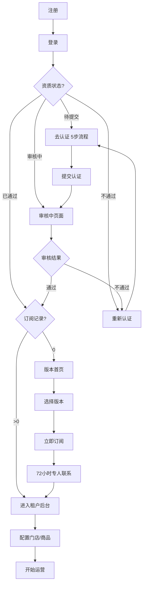
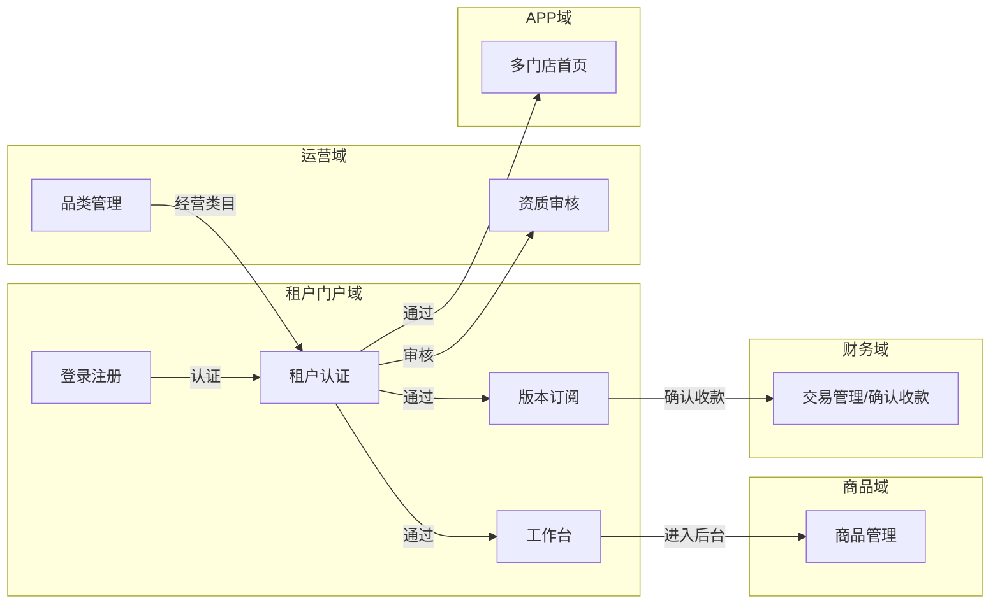
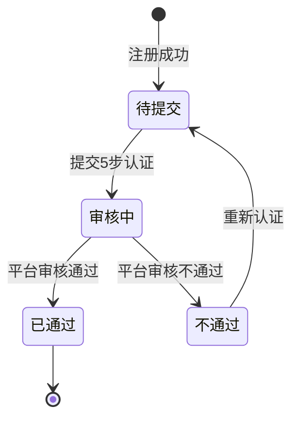
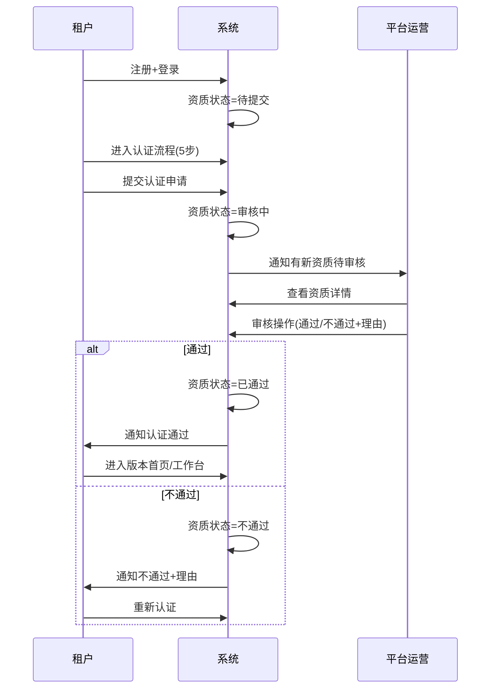
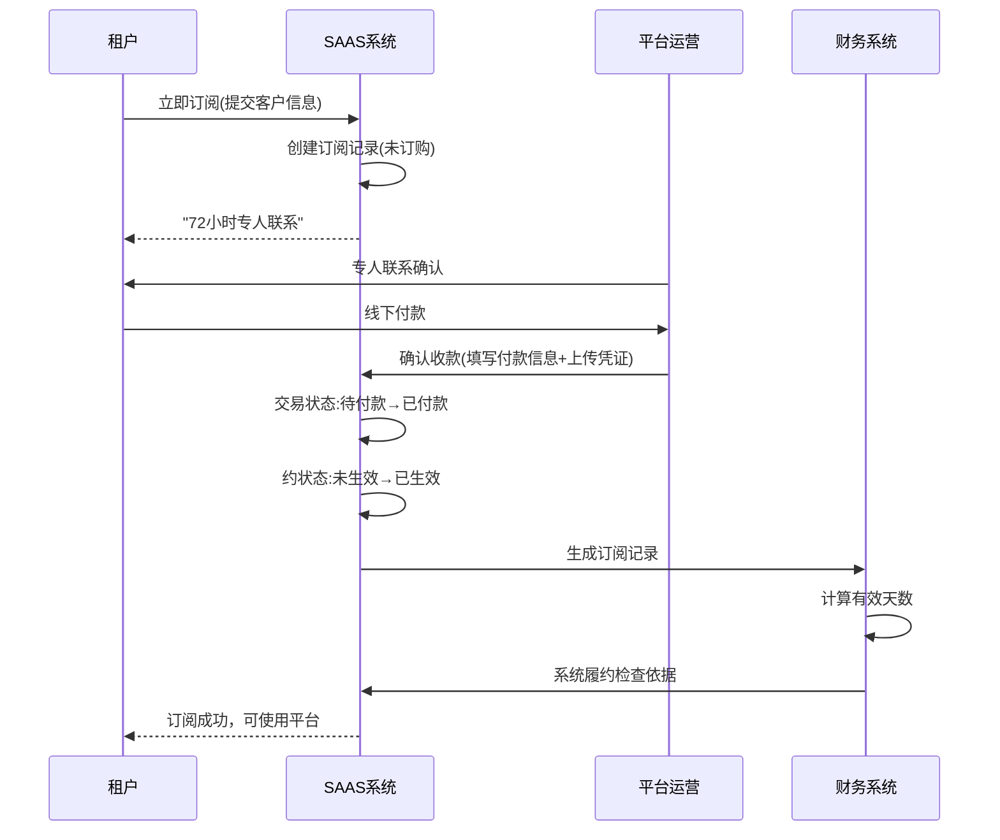

# 租户门户/APP域 产品需求文档 PRD V1.0.3

> **业务域**：租户门户/APP域（D14） | **版本**：V1.0.3 | **日期**：2026-07-16
> **数据来源**：`租户APPV1.0.0.md`、Axure原型 V1.0.2~V1.0.3
> **追溯链**：UC-TNT → FN-TNT → PG-TNT → SC-TNT → BG-15 → BO-TNT

---

## 版本历史

| 版本 | 日期 | 变更内容 |
|------|------|----------|
| V1.0.2 | 2026-05-15 | 登录注册（验证码/密码/免费注册/忘记密码）、租户认证5步流程、认证状态页面、版本首页+立即订阅、平台运营侧资质管理+审核、门店/主播补充资质、多门店首页适配、APP端未绑定/已绑定首页、扫码绑定 |
| V1.0.3 | 2026-05-25 | 租户后台资质管理（企业/个体户）、添加成员资质差异、版本订阅列表、工作台、APP端微信登录/手机验证码登录/注册（部分完成需UI）、首页加载排序逻辑、绑定手机号/微信授权 |
| V1.0.9 | 2026-07-16 | 按PRD规范V1.0.0重新编排 |

---

## 1. 背景与问题陈述

租户门户/APP域承载SAAS平台中租户（商家）从"入驻"到"运营"的全生命周期能力。分为两个核心子域：**租户门户(PC端)**（登录注册、租户认证、版本订阅、工作台）和**租户APP(PAAS端)**（租户独立APP/小程序，由租户认证通过后配置管理）。

### 核心问题

| 问题编号 | 问题 | 严重程度 |
|----------|------|----------|
| TNT-ISSUE-001 | 5步认证流程过长 | 🟡 中 |
| TNT-ISSUE-002 | 驳回后需重新填写所有字段 | 🟡 中 |
| TNT-ISSUE-003 | 账号锁定策略缺失（"锁定层暂时不处理"） | 🔴 高 |
| TNT-ISSUE-004 | 未注册手机号自动注册 | 🟡 中 |
| TNT-ISSUE-005 | APP端登录注册"待定" | 🟡 中 |
| TNT-ISSUE-006 | 版本首页仅展示版本信息，缺对比 | 🟢 低 |
| TNT-ISSUE-007 | 立即订阅流程偏线下（72小时专人联系） | 🟡 中 |
| TNT-ISSUE-008 | 试用期与订阅衔接不明确 | 🟡 中 |

---

## 2. 目标与成功度量

| 目标编号 | 目标 | 度量指标 | 目标值 |
|----------|------|----------|--------|
| BO-TNT-01 | 认证转化率 | 认证通过数/注册总数 | ≥ 60% |
| BO-TNT-02 | 订阅转化率 | 订阅数/认证通过数 | ≥ 80% |
| BO-TNT-03 | 认证时效 | 从提交到审核完成 | < 48小时 |

---

## 3. 范围

### In-Scope
- 登录与注册（验证码登录/密码登录/免费注册/忘记密码/重置密码/租户登录逻辑图）
- 租户认证（5步：引导→主体→法人→经营→公示+认证状态页面）
- 资质管理（平台侧/租户侧/门店/主播）
- 添加成员（企业/个体户/不需资质）
- 版本订阅（版本首页/立即订阅/订阅列表）
- 工作台（登录后默认页/全局资质信息卡片）
- 多门店首页加载逻辑
- APP端登录（微信/手机验证码/注册—待定）

### Non-Goals
- PAAS独立APP品牌定制（属平台域）
- APP端完整登录注册流程（待定）
- APP端通讯录/群聊（暂未规划）
- 账号锁定策略（待补充）

---

## 4. 与既有模块关系

### 上下游依赖矩阵

| 方向 | 关联域 | 依赖关系 | 说明 |
|------|--------|----------|------|
| **上游（被依赖）** | 商品域 | 认证通过后可发布商品 | 租户认证→商品管理 |
| **上游（被依赖）** | SAAS平台APP域 | 认证通过后APP首页加载 | 租户配置决定APP端展示 |
| **下游（依赖）** | 运营域 | 品类管理在运营后台 | 运营定义类目→认证选择类目 |
| **下游（依赖）** | 分销域 | 添加成员资质差异 | 企业/个体户/不需资质 |
| **下游（依赖）** | 财务域 | 版本订阅确认收款 | 运营后台交易管理 |

### 影响域说明

| 变更场景 | 影响域 | 影响说明 |
|----------|--------|----------|
| 认证通过 | 商品域、APP域、门店域 | 可发布商品；APP端门店可见；可创建门店 |
| 认证驳回 | 所有域 | 租户功能不可用 |
| 版本订阅成功 | 运营域、财务域 | 生成订阅记录；确认收款 |

---

## 5. 业务目标映射

| BG | BO | FN | 优先级 |
|----|-----|-----|--------|
| BG-15 租户准入 | BO-TNT-01/02/03 | FN-TNT-001~008 | P0 |

---

## 6. 用户故事

| US编号 | 角色 | 用户故事 |
|--------|------|----------|
| US-TNT-001 | 新租户 | 作为新租户，我希望注册并登录平台，以便开始入驻 |
| US-TNT-002 | 新租户 | 作为新租户，我希望完成5步认证，以便获得认证使用平台 |
| US-TNT-003 | 租户管理员 | 作为租户，我希望选择版本并订阅，以便使用平台服务 |
| US-TNT-004 | 租户管理员 | 作为租户，我希望在工作台查看资质和订阅状态，以便了解账户 |
| US-TNT-005 | 平台运营 | 作为运营，我希望审核租户资质，以便控制准入 |

---

## 7. 功能需求列表与用例

### FN-TNT-001 登录与注册

**验证码登录**：手机号+验证码，频繁>3次触发图形验证码。未注册自动注册。
**密码登录**：手机号+密码（8-20字符含数字字母特殊字符），保持3天登录。
**免费注册**：手机号+验证码，注册后标记来源(自然)/方式(官网)/端(PC)，资质状态"待提交"。
**忘记密码/重置密码**：手机号+验证码+新密码。
**租户登录逻辑图**：获取验证码→手机号有效→下发验证码→错误?→图形验证码→登录→资质状态判断→认证/订阅/后台。

### FN-TNT-002 租户认证（5步）

**流程**：引导页面→主体认证→法人认证→经营认证→公示信息→确认提交。

**第一步-引导**：选择主体类型（企业/个体户）、经营类目（多选，读取运营系统品类）、办理人（法人）、认证材料清单。

**第二步-主体认证**：企业名称、统一信用代码、有效期、营业执照。

**第三步-法人认证**：真实姓名、证件号码、有效期、证件照（正反面+手持）。

**第四步-经营认证**：经营人信息、经营类目资质（动态加载）。

**第五步-公示信息**：汇总展示+签署入驻协议（PDF盖章原件扫描件）。

### FN-TNT-003 资质管理

**平台侧**：资质管理列表（资质编号Q+日期+6位随机数）、审核资质（通过/不通过+理由）。
**租户侧**：资质管理列表、补充资质（企业/个体户）、审核。
**门店/主播**：补充资质。

### FN-TNT-004 版本订阅

**版本首页**：展示各版本产品（名称/介绍/业务范围/功能列表/套餐包含/立即订阅）。
**立即订阅**：填写客户名称/联系电话/所在城市→提交→"72小时专人联系"→跳转租户后台。
**订阅列表**：订单编号/应付/实付/有效时长/合同状态/支付状态/履约状态。

### FN-TNT-005 工作台

**全局资质信息卡片**：主体名称、资质审核状态、订阅版本起止时间、立即订购按钮。
**试用期信息**：租户编号、试用期至、开店/定制咨询热线。

### FN-TNT-006 多门店首页加载逻辑

**加载规则**：当前登录用户→所属租户→客户身份→门店数量→判断展示形态。
**跨租户约束**：用户可跨租户，但同一租户不能跨门店（分账约束）。

### FN-TNT-007 添加成员

**企业资质**：所属组织/组织身份/业务类型/代理人/主体信息/法人信息。
**个体户资质**：名称字号/营业代码/个人纳税/个体工商户/税务登记证/经营人信息/经营场所/经营门头(最多5张)。
**不需资质**：仅基本信息。

### FN-TNT-008 APP端登录（待定）

微信登录/手机验证码登录/手机号码注册/绑定手机号/绑定微信授权。标注"待定"或"需要UI协助"。

---

## 8. 业务规则

### BR-TNT-001 验证码安全规则
- 验证码获取频繁超过3次→显示图形验证码二次校验
- 验证码错误→提示"请输入正确的手机验证码"

### BR-TNT-002 密码格式规则
- 8-20字符，需要包含数字字母以及特殊字符

### BR-TNT-003 登录会话规则
- 未勾选自动登录→24小时会话
- 勾选→7天会话（验证码登录）/3天会话（密码登录，不含第3天）

### BR-TNT-004 未注册手机号自动注册规则
- 验证码登录时未注册手机号→自动创建租户账号

### BR-TNT-005 认证流程规则
- 5步认证：引导→主体→法人→经营→公示
- 认证材料清单根据经营类目动态展示
- 入驻协议仅支持PDF格式，拒绝拍照/复印件，需盖章原件扫描件

### BR-TNT-006 认证状态流转规则
- 待提交→审核中→已通过/不通过
- 不通过→重新提交→审核中（循环）

### BR-TNT-007 版本订阅规则
- 提交后"72小时专人联系"
- 标记为"未订购"状态

### BR-TNT-008 跨租户不跨门店规则
- 用户可跨租户，但同一租户不能跨门店存在
- 分享归属只能属于一个邀请店员上级，否则无法分账

---

## 9. 数据实体

### ENT-TNT-001 租户(Tenant)

| 字段 | 类型 | 说明 |
|------|------|------|
| tenant_id | String | 租户ID |
| tenant_name | String | 企业名称 |
| phone | String | 注册手机号 |
| qualification_status | Enum | 待提交/审核中/已通过/不通过 |
| qualification_type | Enum | 企业/个体户 |
| source | String | 来源(自然/邀请) |
| register_method | String | 方式(官网/微信) |
| register_device | String | 端(PC/APP/小程序) |
| subscription_count | Int | 版本订阅记录数 |

### ENT-TNT-002 租户资质(TenantQualification)

| 字段 | 类型 | 说明 |
|------|------|------|
| qualification_id | String | Q+日期+6位随机数 |
| tenant_id | String | 关联租户 |
| qualification_type | Enum | 企业/个体户 |
| business_name | String | 企业名称/名称字号 |
| unified_credit_code | String | 统一信用代码/营业代码 |
| tax_type | Enum | 一般纳税/小规模/个人纳税 |
| business_type | Enum | 有限公司/个体工商户等 |
| legal_person_name | String | 法人/经营人名称 |
| business_category | Array | 经营类目(多选) |
| industry_qualifications | Array | 行业资质 |
| status | Enum | 待提交/待审核/已通过/已驳回 |
| reject_reason | String | 驳回理由 |

### ENT-TNT-003 版本订阅(VersionSubscription)

| 字段 | 类型 | 说明 |
|------|------|------|
| subscription_id | String | 订单编号 |
| tenant_id | String | 关联租户 |
| version_id | String | 版本ID |
| customer_name | String | 客户名称 |
| amount_due | Decimal | 应付金额 |
| amount_paid | Decimal | 实付金额 |
| duration | Int | 有效时长(天) |
| contract_status | Enum | 未生成/待签/已签 |
| payment_status | Enum | 已支付/未支付 |
| fulfillment_status | Enum | 已生效/未生效 |

---

## 10. 验收标准

| SC编号 | 场景 | 预期结果 |
|--------|------|----------|
| SC-TNT-001 | 租户认证全流程 | 注册→登录→5步认证→提交→审核→通过→版本订阅→进入后台 |
| SC-TNT-002 | 认证驳回后重新提交 | 不通过→查看理由→重新提交→重新审核 |
| SC-TNT-003 | 验证码安全 | 频繁>3次→图形验证码→正确→重新下发 |
| SC-TNT-004 | 多门店首页加载 | 单租户单门店→直接门店首页；多租户多门店→门店列表 |

| FN | Given | When | Then |
|----|-------|------|------|
| FN-TNT-001 | 验证码错误超过3次 | 再次获取 | 显示图形验证码 |
| FN-TNT-001 | 未注册手机号验证码登录 | 输入验证码 | 自动注册账号 |
| FN-TNT-002 | 认证提交 | 平台审核 | 状态流转正确 |
| FN-TNT-004 | 认证通过首次未订阅 | 进入版本首页 | 显示版本选择 |
| FN-TNT-006 | 客户跨租户 | 同一租户绑定多门店 | 不允许（同租户不跨门店） |

---

## 11. 指标登记

| 指标 | 说明 | 目标值 |
|------|------|--------|
| MET-TNT-001 | 认证转化率 | ≥ 60% |
| MET-TNT-002 | 订阅转化率 | ≥ 80% |
| MET-TNT-003 | 认证时效 | < 48小时 |

---

## 12. 五类图

### 12.1 业务流程图 — 租户生命周期

### 12.2 信息流转图 — 租户门户域跨模块

### 12.3 状态机 — 租户资质状态机

**状态过渡操作表**：

| 当前状态 | 触发操作 | 目标状态 | 操作者 | 前置约束 | 后置动作 |
|----------|----------|----------|--------|----------|----------|
| — | 注册成功 | 待提交 | 系统 | — | 资质状态=待提交 |
| 待提交 | 提交5步认证 | 审核中 | 租户 | 填写完整资质 | 通知平台审核 |
| 审核中 | 平台审核通过 | 已通过 | 平台运营 | — | 可订阅版本 |
| 审核中 | 平台审核不通过 | 不通过 | 平台运营 | 填写驳回理由 | 通知租户 |
| 不通过 | 重新认证 | 待提交 | 租户 | — | 可重新提交 |

### 12.4 业务时序图 — 租户认证审核流程

### 12.5 三方接口时序图 — 版本订阅确认收款

---

## 13. 外部接口标注

| 接口编号 | 接口名称 | 方向 | 对端系统 | 说明 |
|----------|----------|------|----------|------|
| API-TNT-001 | 短信验证码 | 单向(出) | 短信服务商 | 注册/登录/重置密码验证码 |
| API-TNT-002 | 实名认证 | 单向(出) | 公安/第三方实名服务 | 法人/经营人身份证实名 |
| API-TNT-003 | 微信登录 | 双向 | 微信开放平台 | APP端微信授权登录（待定） |

---

## 14. 检查清单

| # | 检查项 | 状态 |
|---|--------|------|
| 1-20 | 全部检查项 | ✅ |

---

> **关联文档**：源MD `租户APPV1.0.0.md` | 上游：商品域/APP域 | 下游：运营域/分销域/财务域 | 总索引 `00-SAAS-PRD-总索引.md`
