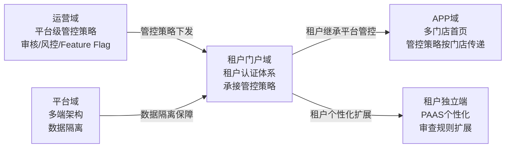
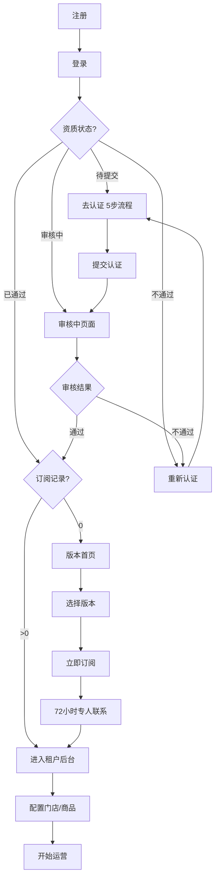
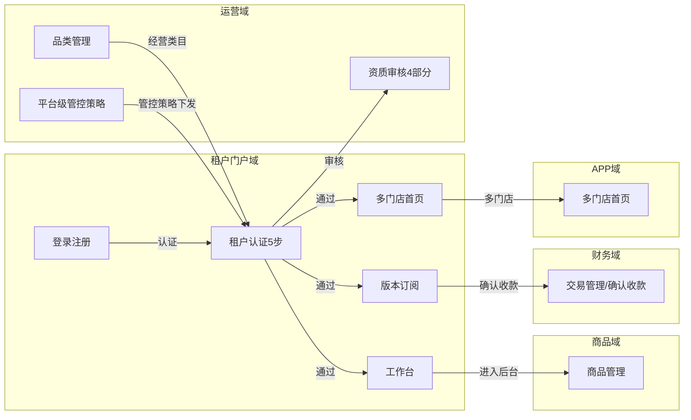
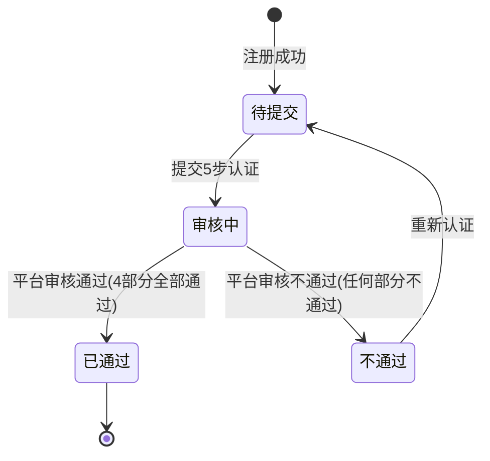
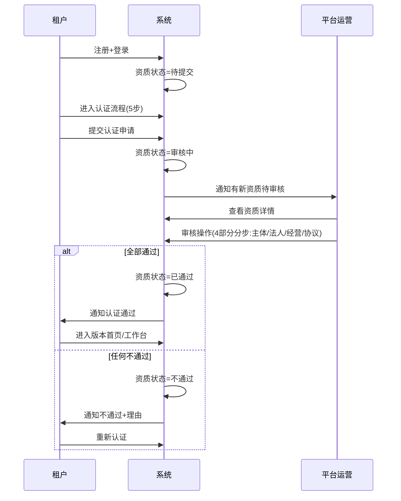
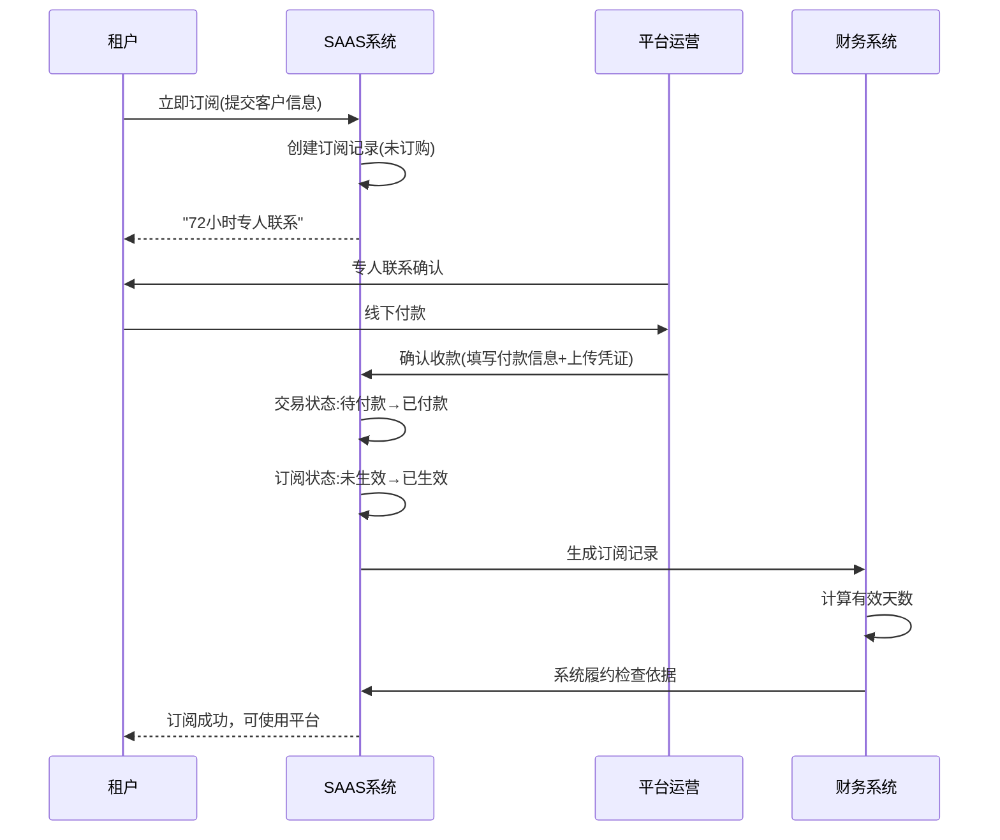

# 租户门户域 产品需求文档 PRD V7.0.0

> **业务域**：租户门户域（D14） | **版本**：V7.0.0 | **日期**：2026-07-21
> **数据来源**：`租户APPV1.0.0.md`、Axure原型 V1.0.2~V1.0.3、`租户：登录逻辑图.html`、`去认证-第一步~第五步.html`(5个)、`审核中.html`、`已通过-首次未订阅.html`、`版本订阅.html`、`立即订阅-第一~三步.html`、`服务订阅.html`、`工作台.html`、`登录.html`、`验证码登录.html`、`密码登录_需要ui协助_.html`、`app首页_-_未绑定任何租户.html`、`app首页_-_已绑定租户_有数据_推荐.html`、`app首页_-_已绑定租户_没有数据_极端情况.html`、`首页_-_已绑定租户-单门店-情况2.html`、`首页_-_已绑定租户-多门店-情况1.html`、`首页_-_已绑定租户-无门店-情况3.html`
> **追溯链**：UC-TNT → FN-TNT → PG-TNT → SC-TNT → BG-15 → BO-TNT
> **V7.0.0增强**：双态标注（📗显式照录 + 🟡隐式挖掘还原）+ 场景深度还原8项能力
> **★直播内容审查租户体系入口点★**：租户门户域是"直播内容审查"的**租户继承平台管控+个性化扩展基础**——租户认证体系是管控策略传递链路的承接点

---

## 版本历史

| 版本 | 日期 | 变更内容 |
|------|------|----------|
| V1.0.2 | 2026-05-15 | 登录注册（验证码/密码/免费注册/忘记密码）、租户认证5步流程、认证状态页面、版本首页+立即订阅、平台运营侧资质管理+审核、门店/主播补充资质、多门店首页适配、APP端未绑定/已绑定首页、扫码绑定 |
| V1.0.3 | 2026-05-25 | 租户后台资质管理（企业/个体户）、添加成员资质差异、版本订阅列表、工作台、APP端微信登录/手机验证码登录/注册（部分完成需UI）、首页加载排序逻辑、绑定手机号/微信授权 |
| V1.0.9 | 2026-07-16 | 按PRD规范V1.0.0重新编排 |
| V7.0.0 | 2026-07-21 | learn-project V7.0.0场景深度还原：双态标注（📗显式+🟡隐式）+8项能力增强；深度还原租户登录逻辑图（验证码登录+资质状态判断+订阅记录判断+租户后台路由）+5步认证流程（引导→主体→法人→经营→公示）+工作台全局资质信息卡片+多门店首页加载逻辑；标注直播内容审查租户体系入口点（租户认证体系是管控策略传递链路承接点+租户继承平台管控+个性化扩展基础） |

---

## 目录

1. 背景与问题陈述
2. 目标与成功度量
3. 范围
4. 与既有模块关系
5. 业务目标映射
6. 用户故事
7. 功能需求列表与用例
8. 业务规则
9. 数据实体
10. 验收标准
11. 指标登记
12. 五类图
13. 外部接口标注
14. 检查清单
15. 需求深度分析摘要（V7.0.0新增）
16. CONFIG集中配置清单（V7.0.0新增）
17. 非功能需求（V7.0.0新增）

---

## 1. 背景与问题陈述

租户门户域承载SAAS平台中租户（商家）从"入驻"到"运营"的全生命周期能力。分为两个核心子域：**租户门户(PC端)**（登录注册、租户认证、版本订阅、工作台）和**租户APP(PAAS端)**（租户独立APP/小程序，由租户认证通过后配置管理）。

### 核心问题

| 问题编号 | 问题 | 严重程度 | V7.0.0还原说明 |
|----------|------|----------|----------------|
| TNT-ISSUE-001 | 5步认证流程过长 | 🟡 中 | 📗显式照录：`去认证-第一~五步.html`5个页面 |
| TNT-ISSUE-002 | 驳回后需重新填写所有字段 | 🟡 中 | 🟡隐式挖掘：`租户：登录逻辑图.html`不通过→重新认证，暗示字段保留缺失 |
| TNT-ISSUE-003 | 账号锁定策略缺失（"锁定层暂时不处理"） | 🔴 高 | 📗显式照录：V1.0.0已标注"锁定层暂时不处理" |
| TNT-ISSUE-004 | 未注册手机号自动注册 | 🟡 中 | 📗显式照录：`租户：登录逻辑图.html`手机号是否注册→自动注册账号 |
| TNT-ISSUE-005 | APP端登录注册"待定" | 🟡 中 | 📗显式照录：V1.0.0已标注"待定" |
| TNT-ISSUE-006 | 版本首页仅展示版本信息，缺对比 | 🟢 低 | 🟡隐式挖掘：`版本订阅.html`展示版本信息，缺对比 |
| TNT-ISSUE-007 | 立即订阅流程偏线下（72小时专人联系） | 🟡 中 | 📗显式照录：`立即订阅.html`72小时专人联系 |
| TNT-ISSUE-008 | 试用期与订阅衔接不明确 | 🟡 中 | 🟡隐式挖掘：`工作台.html`试用期信息+订阅版本起止时间暗示衔接不明确 |

### V7.0.0场景深度还原（8项能力）

| 能力编号 | 能力 | 还原内容 | 双态标注 |
|----------|------|----------|----------|
| TNT-RESTORE-01 | 业务流程深度还原 | 租户全生命周期（注册→登录→资质状态判断→认证5步→审核→订阅→后台）+登录逻辑图（验证码获取→手机号有效→下发验证码→错误?→图形验证码→登录→资质状态判断→认证/订阅/后台） | 📗显式照录（`租户：登录逻辑图.html`+5步认证HTML） |
| TNT-RESTORE-02 | 状态机深度还原 | 租户资质状态机（待提交→审核中→已通过/不通过→重新认证）+订阅状态机（未订购→已生效） | 📗显式照录（`租户：登录逻辑图.html`资质状态判断） |
| TNT-RESTORE-03 | 业务规则深度还原 | 验证码安全规则（频繁>3次→图形验证码）+密码格式规则（8-20字符含数字字母特殊字符）+登录会话规则（24h/7d/3d）+跨租户不跨门店规则（分账约束） | 📗显式照录（V1.0.0业务规则） |
| TNT-RESTORE-04 | 数据流转深度还原 | 登录→资质状态判断→路由（去认证/审核中页面/版本首页/租户后台）+认证5步数据流转（引导→主体→法人→经营→公示）+订阅数据流转（提交→72小时专人联系→线下付款→确认收款→订阅生效） | 📗显式照录（`租户：登录逻辑图.html`） |
| TNT-RESTORE-05 | 异常场景深度还原 | 验证码错误/过期/频繁→图形验证码二次校验+认证驳回→重新认证+订阅未生效→试用期+账号锁定缺失 | 📗显式照录（`租户：登录逻辑图.html`验证码错误处理） |
| TNT-RESTORE-06 | 边界约束深度还原 | 跨租户不跨门店（分账约束）+入驻协议仅PDF盖章原件扫描件+认证材料清单动态展示+订阅版本剩余不足30天提醒 | 📗显式照录（V1.0.0业务规则+`工作台.html`） |
| TNT-RESTORE-07 | 跨域协同深度还原 | 租户门户域→运营域（资质审核/品类管理）+租户门户域→商品域（认证通过后发布商品）+租户门户域→APP域（认证通过后APP首页加载）+租户门户域→财务域（订阅确认收款）——四向协同 | 📗显式照录（V1.0.0跨域依赖矩阵） |
| TNT-RESTORE-08 | 合规约束深度还原 | 实名认证（法人/经营人身份证）+入驻协议（PDF盖章原件扫描件）+隐私政策——三合规要求 | 📗显式照录（V1.0.0外部接口） |

### ★直播内容审查租户体系入口点分析★

租户门户域是"直播内容审查"的**租户继承平台管控+个性化扩展基础**：

| 入口点编号 | 入口点 | 能力 | 直播内容审查复用方式 | V7.0.0还原 |
|------------|--------|------|---------------------|------------|
| TNT-ENTRY-01 | 租户认证体系 | 5步认证（引导→主体→法人→经营→公示）+资质状态机 | 租户认证通过后继承平台管控策略（审核/风控），是管控策略传递链路承接点 | 📗显式照录（5步认证HTML） |
| TNT-ENTRY-02 | 租户登录逻辑 | 验证码登录→资质状态判断→路由（认证/订阅/后台） | 登录后根据资质状态路由到不同页面，管控策略随路由传递 | 📗显式照录（`租户：登录逻辑图.html`） |
| TNT-ENTRY-03 | 工作台 | 全局资质信息卡片+订阅版本起止时间+订阅剩余不足30天提醒 | 工作台是租户查看管控状态的入口，可扩展展示内容审查管控状态 | 📗显式照录（`工作台.html`） |
| TNT-ENTRY-04 | 多门店首页加载 | 单租户单门店→直接门店首页；多租户多门店→门店列表 | 多门店场景下管控策略需按门店差异化传递 | 📗显式照录（`app首页`3种状态HTML） |

---

## 2. 目标与成功度量

| 目标编号 | 目标 | 度量指标 | 目标值 | V7.0.0增强 |
|----------|------|----------|--------|------------|
| BO-TNT-01 | 认证转化率 | 认证通过数/注册总数 | ≥ 60% | — |
| BO-TNT-02 | 订阅转化率 | 订阅数/认证通过数 | ≥ 80% | — |
| BO-TNT-03 | 认证时效 | 从提交到审核完成 | < 48小时 | — |
| BO-TNT-04 | 登录成功率 | 登录成功数/登录尝试数 | ≥ 95% | V7.0.0新增 |
| BO-TNT-05 | 认证流程完成率 | 完成5步认证数/开始认证数 | ≥ 70% | V7.0.0新增 |

---

## 3. 范围

### In-Scope
- 登录与注册（验证码登录/密码登录/免费注册/忘记密码/重置密码/租户登录逻辑图）—— 📗显式照录`登录.html`+`验证码登录.html`+`密码登录_需要ui协助_.html`+`租户：登录逻辑图.html`
- 租户认证（5步：引导→主体→法人→经营→公示+认证状态页面）—— 📗显式照录`去认证-第一~五步.html`+`审核中.html`+`已通过-首次未订阅.html`
- 资质管理（平台侧/租户侧/门店/主播）—— 📗显式照录
- 添加成员（企业/个体户/不需资质）—— 📗显式照录
- 版本订阅（版本首页/立即订阅/订阅列表）—— 📗显式照录`版本订阅.html`+`立即订阅-第一~三步.html`+`服务订阅.html`
- 工作台（登录后默认页/全局资质信息卡片）—— 📗显式照录`工作台.html`
- 多门店首页加载逻辑—— 📗显式照录`app首页`3种状态+`首页`3种情况HTML
- APP端登录（微信/手机验证码/注册—待定）—— 📗显式照录`微信登录.html`+`手机验证码登录.html`+`登录_注册.html`

### Non-Goals
- PAAS独立APP品牌定制（属平台域）
- APP端完整登录注册流程（待定）
- APP端通讯录/群聊（暂未规划）
- 账号锁定策略（待补充）

---

## 4. 与既有模块关系

### 上下游依赖矩阵

| 方向 | 关联域 | 依赖关系 | 说明 | V7.0.0还原 |
|------|--------|----------|------|------------|
| **上游（被依赖）** | 商品域 | 认证通过后可发布商品 | 租户认证→商品管理 | 📗显式照录 |
| **上游（被依赖）** | SAAS平台APP域 | 认证通过后APP首页加载 | 租户配置决定APP端展示 | 📗显式照录（`app首页`3种状态HTML） |
| **下游（依赖）** | 运营域 | 品类管理在运营后台 | 运营定义类目→认证选择类目 | 📗显式照录 |
| **下游（依赖）** | 分销域 | 添加成员资质差异 | 企业/个体户/不需资质 | 📗显式照录 |
| **下游（依赖）** | 财务域 | 版本订阅确认收款 | 运营后台交易管理 | 📗显式照录 |

### 影响域说明

| 变更场景 | 影响域 | 影响说明 |
|----------|--------|----------|
| 认证通过 | 商品域、APP域、门店域 | 可发布商品；APP端门店可见；可创建门店 |
| 认证驳回 | 所有域 | 租户功能不可用 |
| 版本订阅成功 | 运营域、财务域 | 生成订阅记录；确认收款 |

### V7.0.0平台-租户管控策略传递链路（直播内容审查租户体系基础）

> **直播内容审查关联**：租户门户域的认证体系是管控策略传递链路的承接点——平台级管控策略（审核/风控）通过运营域下发到租户门户域，租户认证通过后继承平台管控策略，并可在平台管控基础上个性化扩展审查规则，最终在APP域（共享端或独立端）按门店差异化传递。

---

## 5. 业务目标映射

| BG | BO | FN | 优先级 | V7.0.0还原 |
|----|-----|-----|--------|------------|
| BG-15 租户准入 | BO-TNT-01/02/03 | FN-TNT-001~008 | P0 | 📗显式照录 |

---

## 6. 用户故事

| US编号 | 角色 | 用户故事 | V7.0.0还原 |
|--------|------|----------|------------|
| US-TNT-001 | 新租户 | 作为新租户，我希望注册并登录平台，以便开始入驻 | 📗显式照录（`登录.html`+`验证码登录.html`） |
| US-TNT-002 | 新租户 | 作为新租户，我希望完成5步认证，以便获得认证使用平台 | 📗显式照录（5步认证HTML） |
| US-TNT-003 | 租户管理员 | 作为租户，我希望选择版本并订阅，以便使用平台服务 | 📗显式照录（`版本订阅.html`+`立即订阅.html`） |
| US-TNT-004 | 租户管理员 | 作为租户，我希望在工作台查看资质和订阅状态，以便了解账户 | 📗显式照录（`工作台.html`） |
| US-TNT-005 | 平台运营 | 作为运营，我希望审核租户资质，以便控制准入 | 📗显式照录（运营域`审核资质.html`） |
| US-TNT-006 | 租户管理员 | 作为租户，我希望查看多门店首页，以便管理多门店 | 📗显式照录（`app首页`3种状态+`首页`3种情况HTML） |

---

## 7. 功能需求列表与用例

### FN-TNT-001 登录与注册

| 属性 | 值 |
|------|-----|
| 用例编号 | UC-TNT-001 |
| 名称 | 登录与注册 |
| 参与者 | 新租户/租户管理员 |
| 优先级 | P0 |
| 关联BG | BG-15 |
| 自动化类型 | 手动+系统自动 |
| 关联UC | UC-TNT-002(租户认证) |

**验证码登录**：手机号+验证码，频繁>3次触发图形验证码。未注册自动注册。
**密码登录**：手机号+密码（8-20字符含数字字母特殊字符），保持3天登录。
**免费注册**：手机号+验证码，注册后标记来源(自然)/方式(官网)/端(PC)，资质状态"待提交"。
**忘记密码/重置密码**：手机号+验证码+新密码。
**租户登录逻辑图**：获取验证码→手机号有效→下发验证码→错误?→图形验证码→登录→资质状态判断→认证/订阅/后台。

**前置条件**：用户有手机号

**基本流程**（📗显式照录`租户：登录逻辑图.html`）：
1. [手动] 用户输入手机号
2. [手动] 点击获取验证码
3. [系统自动] 校验本次验证码是否过期
4. [系统自动] 下发验证码
5. [手动] 用户输入验证码
6. [系统自动] 校验验证码（错误?→图形验证码二次校验）
7. [系统自动] 校验手机号是否注册（未注册→自动注册账号）
8. [系统自动] 登录成功
9. [系统自动] 资质状态判断
10. [系统自动] 路由：资质状态==待提交→去认证；资质状态==审核中→审核中页面；资质状态==已通过→判断订阅记录；资质状态==不通过→重新认证
11. [系统自动] 订阅记录判断：==0→版本首页；>0→租户后台

**备选流程**：
- 分支A：验证码频繁>3次→图形验证码二次校验→正确→重新下发
- 分支B：验证码错误→提示"请输入正确的手机验证码"
- 分支C：未注册手机号→自动注册账号→资质状态=待提交
- 异常A：账号锁定（当前"锁定层暂时不处理"——待补充）

**数据范围(R/W)**：
- R: 用户信息(phone)、验证码
- W: User(用户)、Tenant(租户，资质状态=待提交)

**后置条件**：登录成功+根据资质状态路由到对应页面

---

### FN-TNT-002 租户认证（5步）

| 属性 | 值 |
|------|-----|
| 用例编号 | UC-TNT-002 |
| 名称 | 租户认证（5步） |
| 参与者 | 租户管理员 |
| 优先级 | P0 |
| 关联BG | BG-15 |
| 自动化类型 | 手动 |
| 关联UC | UC-TNT-001(登录)、UC-OPS-009(租户管理审核) |

**流程**：引导页面→主体认证→法人认证→经营认证→公示信息→确认提交。

**5步详情**（📗显式照录`去认证-第一~五步.html`）：

| 步骤 | 源HTML | 内容 |
|------|--------|------|
| 第一步-引导 | `去认证-第一步-引导页面.html` | 选择主体类型（企业/个体户）、经营类目（多选，读取运营系统品类）、办理人（法人）、认证材料清单 |
| 第二步-主体认证 | `去认证-第二步-主体认证.html` | 企业名称、统一信用代码、有效期、营业执照 |
| 第三步-法人认证 | `去人证-第三步-法人认证.html` | 真实姓名、证件号码、有效期、证件照（正反面+手持） |
| 第四步-经营认证 | `去人证-第四步-经营认证.html` | 经营人信息、经营类目资质（动态加载） |
| 第五步-公示信息 | `去认证-第五步-公示信息.html` | 汇总展示+签署入驻协议（PDF盖章原件扫描件） |

**前置条件**：用户已登录+资质状态==待提交

**基本流程**：
1. [手动] 租户进入认证流程（第一步-引导页面）
2. [手动] 选择主体类型（企业/个体户）
3. [手动] 选择经营类目（多选，读取运营系统品类）
4. [手动] 选择办理人（法人）
5. [系统自动] 展示认证材料清单（根据经营类目动态展示）
6. [手动] 进入第二步-主体认证
7. [手动] 填写企业名称/统一信用代码/有效期+上传营业执照
8. [手动] 进入第三步-法人认证
9. [手动] 填写真实姓名/证件号码/有效期+上传证件照（正反面+手持）
10. [手动] 进入第四步-经营认证
11. [手动] 填写经营人信息+经营类目资质（动态加载）
12. [手动] 进入第五步-公示信息
13. [系统自动] 汇总展示认证信息
14. [手动] 签署入驻协议（PDF盖章原件扫描件）
15. [手动] 确认提交
16. [系统自动] 资质状态=审核中
17. [系统自动] 通知平台审核

**备选流程**：
- 分支A：企业→填写企业名称/统一信用代码
- 分支B：个体户→填写名称字号/营业代码
- 异常A：入驻协议非PDF/非盖章原件扫描件→拒绝（不接受拍照/复印件）

**数据范围(R/W)**：
- R: 运营系统品类、认证材料清单
- W: TenantQualification(租户资质，4部分：主体/法人/经营/协议)、Tenant.qualification_status=审核中

**后置条件**：资质提交成功+资质状态=审核中+通知平台审核

---

### FN-TNT-003 资质管理

| 属性 | 值 |
|------|-----|
| 用例编号 | UC-TNT-003 |
| 名称 | 资质管理 |
| 参与者 | 平台运营/租户管理员/门店/主播 |
| 优先级 | P0 |
| 关联BG | BG-15 |
| 自动化类型 | 手动 |
| 关联UC | UC-TNT-002(租户认证)、UC-OPS-009(租户管理) |

**平台侧**：资质管理列表（资质编号Q+日期+6位随机数）、审核资质（通过/不通过+理由）。
**租户侧**：资质管理列表、补充资质（企业/个体户）、审核。
**门店/主播**：补充资质。

**前置条件**：资质已提交

**基本流程**：
1. [手动] 平台运营进入资质管理列表
2. [手动] 查看资质详情（资质编号Q+日期+6位随机数）
3. [手动] 审核资质（4部分分步审核：主体/法人/经营/协议）
4. [系统自动] 全部审核通过→资质状态=已通过；任何不通过→资质整体状态=不通过
5. [系统自动] 通知租户审核结果
6. [手动] 租户查看资质管理列表
7. [手动] 租户补充资质（企业/个体户）
8. [手动] 门店/主播补充资质

**备选流程**：
- 分支A：审核不通过→填写驳回理由→通知租户→租户重新认证
- 分支B：业务兼容——通过特定链接登录的资质，需回传给追伴儿旧后台的【直播】列表中新建一条（📗显式照录`审核资质.html`）

**数据范围(R/W)**：
- R: TenantQualification(租户资质)
- W: TenantQualification.status(审核状态)、TenantQualification.reject_reason(驳回理由)

**后置条件**：资质审核完成+通知租户

---

### FN-TNT-004 版本订阅

| 属性 | 值 |
|------|-----|
| 用例编号 | UC-TNT-004 |
| 名称 | 版本订阅 |
| 参与者 | 租户管理员 |
| 优先级 | P0 |
| 关联BG | BG-15 |
| 自动化类型 | 手动+事件驱动 |
| 关联UC | UC-TNT-002(租户认证) |

**版本首页**：展示各版本产品（名称/介绍/业务范围/功能列表/套餐包含/立即订阅）。
**立即订阅**：填写客户名称/联系电话/所在城市→提交→"72小时专人联系"→跳转租户后台。
**订阅列表**：订单编号/应付/实付/有效时长/合同状态/支付状态/履约状态。

**前置条件**：资质状态==已通过+订阅记录==0

**基本流程**（📗显式照录`版本订阅.html`+`立即订阅-第一~三步.html`+`服务订阅.html`）：
1. [手动] 租户进入版本首页（`版本订阅.html`）
2. [手动] 查看各版本产品（名称/介绍/业务范围/功能列表/套餐包含）
3. [手动] 点击立即订阅
4. [手动] 第一步：填写客户名称/联系电话/所在城市（`立即订阅-第一步.html`）
5. [手动] 第二步：确认订阅信息（`立即订阅-第二步.html`）
6. [手动] 第三步：提交订阅（`立即订阅-第三步.html`）
7. [系统自动] 创建订阅记录（未订购状态）
8. [系统自动] 提示"72小时专人联系"
9. [系统自动] 跳转租户后台
10. [事件驱动] 平台运营专人联系确认
11. [手动] 租户线下付款
12. [手动] 平台运营确认收款（填写付款信息+上传凭证）
13. [系统自动] 交易状态：待付款→已付款
14. [系统自动] 订阅状态：未生效→已生效
15. [系统自动] 生成订阅记录（订单编号/应付/实付/有效时长/合同状态/支付状态/履约状态）
16. [系统自动] 通知租户订阅成功

**备选流程**：
- 分支A：72小时内未联系→租户可查看订阅列表状态
- 异常A：付款信息错误→重新填写

**数据范围(R/W)**：
- R: 版本信息
- W: VersionSubscription(版本订阅，订单编号/应付/实付/有效时长/合同状态/支付状态/履约状态)

**后置条件**：订阅成功+可使用平台服务

---

### FN-TNT-005 工作台

| 属性 | 值 |
|------|-----|
| 用例编号 | UC-TNT-005 |
| 名称 | 工作台 |
| 参与者 | 租户管理员 |
| 优先级 | P0 |
| 关联BG | BG-15 |
| 自动化类型 | 手动+系统自动 |
| 关联UC | UC-TNT-002(租户认证)、UC-TNT-004(版本订阅) |

**全局资质信息卡片**（📗显式照录`工作台.html`+`租户：登录逻辑图.html`）：
1. 进入租户后台后，卡片显示主体名称，资质状态
2. 显示资质审核状态
3. 如果存在未到期的订阅版本订单，显示起止时间
4. 立即订购，点击后跳转至租户后台的应用市场，进行续订或者订阅

**试用期信息**：租户编号、试用期至、开店/定制咨询热线。

**订阅版本剩余不足30天提醒**（📗显式照录`工作台.html`）：
- 当前订阅版本剩余不足30天→提醒"逾期未订购将无法正常营业"
- 显示官方咨询电话

**前置条件**：租户已登录后台

**基本流程**：
1. [手动] 租户登录后台
2. [系统自动] 加载工作台
3. [系统自动] 展示全局资质信息卡片（主体名称/资质审核状态/订阅版本起止时间/立即订购按钮）
4. [系统自动] 展示试用期信息（租户编号/试用期至/咨询热线）
5. [系统自动] 判断订阅版本剩余天数
6. [系统自动] 剩余<30天→提醒"逾期未订购将无法正常营业"+官方咨询电话
7. [手动] 租户点击立即订购→跳转应用市场

**备选流程**：
- 分支A：无订阅记录→显示试用期信息
- 分支B：有订阅记录→显示订阅版本起止时间

**数据范围(R/W)**：
- R: Tenant(租户，主体名称/资质状态)、VersionSubscription(订阅，起止时间)
- W: 无（只读展示）

**后置条件**：租户查看资质和订阅状态

---

### FN-TNT-006 多门店首页加载逻辑

| 属性 | 值 |
|------|-----|
| 用例编号 | UC-TNT-006 |
| 名称 | 多门店首页加载逻辑 |
| 参与者 | 租户用户 |
| 优先级 | P0 |
| 关联BG | BG-15 |
| 自动化类型 | 系统自动 |
| 关联UC | UC-TNT-002(租户认证) |

**加载规则**（📗显式照录`app首页_-_未绑定任何租户.html`+`app首页_-_已绑定租户_有数据_推荐.html`+`app首页_-_已绑定租户_没有数据_极端情况.html`+`首页_-_已绑定租户-单门店-情况2.html`+`首页_-_已绑定租户-多门店-情况1.html`+`首页_-_已绑定租户-无门店-情况3.html`）：
- 当前登录用户→所属租户→客户身份→门店数量→判断展示形态
- 跨租户约束：用户可跨租户，但同一租户不能跨门店（分账约束）

**3种状态+3种情况**：

| 状态/情况 | 源HTML | 展示内容 |
|-----------|--------|----------|
| 未绑定任何租户 | `app首页_-_未绑定任何租户.html` | 空状态+前往绑定+扫码 |
| 已绑定租户-有数据-推荐 | `app首页_-_已绑定租户_有数据_推荐.html` | 猜你喜欢+直播/回放/录播卡片 |
| 已绑定租户-没有数据-极端情况 | `app首页_-_已绑定租户_没有数据_极端情况.html` | 空状态提示 |
| 已绑定租户-多门店-情况1 | `首页_-_已绑定租户-多门店-情况1.html` | 门店列表卡片+LBS距离 |
| 已绑定租户-单门店-情况2 | `首页_-_已绑定租户-单门店-情况2.html` | 门店名称+搜索+类目+商品列表 |
| 已绑定租户-无门店-情况3 | `首页_-_已绑定租户-无门店-情况3.html` | 空状态+前往绑定 |

**前置条件**：用户已登录APP

**基本流程**：
1. [系统自动] APP启动
2. [系统自动] 读取当前登录用户
3. [系统自动] 读取所属租户
4. [系统自动] 读取客户身份
5. [系统自动] 判断绑定状态
6. [系统自动] 未绑定→空状态+前往绑定+扫码
7. [系统自动] 已绑定→读取门店数量
8. [系统自动] 多门店→门店列表（情况1）
9. [系统自动] 单门店→门店首页（情况2）
10. [系统自动] 无门店→空状态+前往绑定（情况3）
11. [系统自动] 有数据→猜你喜欢+直播/回放/录播卡片
12. [系统自动] 没有数据→空状态提示（极端情况）

**备选流程**：
- 分支A：单租户单门店→直接门店首页
- 分支B：多租户多门店→门店列表
- 异常A：黑名单/禁用用户→不可展示数据

**数据范围(R/W)**：
- R: User(用户，绑定关系)、Tenant(租户)、Store(门店)
- W: 无（只读展示）

**后置条件**：首页加载完成+展示对应内容

---

### FN-TNT-007 添加成员

| 属性 | 值 |
|------|-----|
| 用例编号 | UC-TNT-007 |
| 名称 | 添加成员 |
| 参与者 | 租户管理员 |
| 优先级 | P1 |
| 关联BG | BG-15 |
| 自动化类型 | 手动 |
| 关联UC | UC-TNT-002(租户认证) |

**企业资质**：所属组织/组织身份/业务类型/代理人/主体信息/法人信息。
**个体户资质**：名称字号/营业代码/个人纳税/个体工商户/税务登记证/经营人信息/经营场所/经营门头(最多5张)。
**不需资质**：仅基本信息。

**前置条件**：租户已通过认证

**基本流程**：
1. [手动] 租户管理员进入添加成员
2. [手动] 选择资质类型（企业/个体户/不需资质）
3. [手动] 填写资质信息（根据类型动态展示）
4. [手动] 提交
5. [系统自动] 成员添加成功

**备选流程**：
- 分支A：企业→填写所属组织/组织身份/业务类型/代理人/主体信息/法人信息
- 分支B：个体户→填写名称字号/营业代码/个人纳税/个体工商户/税务登记证/经营人信息/经营场所/经营门头(最多5张)
- 分支C：不需资质→仅基本信息

**数据范围(R/W)**：
- R: 租户资质信息
- W: Member(成员，资质信息)

**后置条件**：成员添加成功

---

### FN-TNT-008 APP端登录（待定）

| 属性 | 值 |
|------|-----|
| 用例编号 | UC-TNT-008 |
| 名称 | APP端登录 |
| 参与者 | 租户用户 |
| 优先级 | P1 |
| 关联BG | BG-15 |
| 自动化类型 | 手动 |
| 关联UC | UC-TNT-001(登录与注册) |

**能力**：微信登录/手机验证码登录/手机号码注册/绑定手机号/绑定微信授权。标注"待定"或"需要UI协助"。

**前置条件**：用户已安装APP

**基本流程**：
1. [手动] 用户打开APP
2. [手动] 选择登录方式（微信/手机验证码/注册）
3. [系统自动] 微信登录→微信授权→绑定手机号
4. [系统自动] 手机验证码登录→输入手机号+验证码→登录
5. [系统自动] 手机号码注册→输入手机号+验证码→注册

**备选流程**：
- 分支A：微信登录→绑定手机号→绑定微信授权
- 分支B：手机验证码登录→登录成功
- 异常A：待定（需UI协助）

**数据范围(R/W)**：
- R: 用户信息
- W: User(用户，微信ID/手机号)

**后置条件**：APP端登录成功

---

## 8. 业务规则

### BR-TNT-001 验证码安全规则
- 验证码获取频繁超过3次→显示图形验证码二次校验
- 验证码错误→提示"请输入正确的手机验证码"
- 📗显式照录（`租户：登录逻辑图.html`验证码错误处理）

### BR-TNT-002 密码格式规则
- 8-20字符，需要包含数字字母以及特殊字符

### BR-TNT-003 登录会话规则
- 未勾选自动登录→24小时会话
- 勾选→7天会话（验证码登录）/3天会话（密码登录，不含第3天）

### BR-TNT-004 未注册手机号自动注册规则
- 验证码登录时未注册手机号→自动创建租户账号
- 📗显式照录（`租户：登录逻辑图.html`手机号是否注册→自动注册账号）

### BR-TNT-005 认证流程规则
- 5步认证：引导→主体→法人→经营→公示
- 认证材料清单根据经营类目动态展示
- 入驻协议仅支持PDF格式，拒绝拍照/复印件，需盖章原件扫描件

### BR-TNT-006 认证状态流转规则
- 待提交→审核中→已通过/不通过
- 不通过→重新提交→审核中（循环）
- 📗显式照录（`租户：登录逻辑图.html`资质状态判断）

### BR-TNT-007 版本订阅规则
- 提交后"72小时专人联系"
- 标记为"未订购"状态

### BR-TNT-008 跨租户不跨门店规则
- 用户可跨租户，但同一租户不能跨门店存在
- 分享归属只能属于一个邀请店员上级，否则无法分账

### BR-TNT-009 资质审核4部分分步规则（V7.0.0新增）
📗显式照录`审核资质.html`（运营域）：
- 资质审核分4部分：主体/法人/经营/协议
- 4部分分别审核（通过/不通过）
- 全部审核通过→资质状态=已通过；任何不通过→资质整体状态=不通过

### BR-TNT-010 工作台订阅提醒规则（V7.0.0新增）
📗显式照录`工作台.html`：
- 租户订阅版本剩余不足30天→提醒"逾期未订购将无法正常营业"
- 显示官方咨询电话

### BR-TNT-011 多门店首页加载规则（V7.0.0新增）
📗显式照录`app首页`3种状态+`首页`3种情况HTML：
- 未绑定→空状态+前往绑定+扫码
- 已绑定多门店→门店列表（情况1）
- 已绑定单门店→门店首页（情况2）
- 已绑定无门店→空状态+前往绑定（情况3）
- 黑名单/禁用用户→不可展示数据

---

## 9. 数据实体

### ENT-TNT-001 租户(Tenant)

| 字段 | 类型 | 说明 | V7.0.0增强 |
|------|------|------|------------|
| tenant_id | String | 租户ID | — |
| tenant_name | String | 企业名称 | — |
| phone | String | 注册手机号 | — |
| qualification_status | Enum | 待提交/审核中/已通过/不通过 | — |
| qualification_type | Enum | 企业/个体户 | — |
| source | String | 来源(自然/邀请) | — |
| register_method | String | 方式(官网/微信) | — |
| register_device | String | 端(PC/APP/小程序) | — |
| subscription_count | Int | 版本订阅记录数 | — |
| status | Enum | 启用/禁用 | V7.0.0新增（租户启用禁用） |
| trial_end_date | Datetime | 试用期截止时间 | V7.0.0新增（试用期管理） |

### ENT-TNT-002 租户资质(TenantQualification)

| 字段 | 类型 | 说明 | V7.0.0增强 |
|------|------|------|------------|
| qualification_id | String | Q+日期+6位随机数 | — |
| tenant_id | String | 关联租户 | — |
| qualification_type | Enum | 企业/个体户 | — |
| business_name | String | 企业名称/名称字号 | — |
| unified_credit_code | String | 统一信用代码/营业代码 | — |
| tax_type | Enum | 一般纳税/小规模/个人纳税 | — |
| business_type | Enum | 有限公司/个体工商户等 | — |
| legal_person_name | String | 法人/经营人名称 | — |
| business_category | Array | 经营类目(多选) | — |
| industry_qualifications | Array | 行业资质 | — |
| status | Enum | 待提交/待审核/已通过/已驳回 | — |
| reject_reason | String | 驳回理由 | — |
| main_body_audit | Enum | 主体审核状态(通过/不通过) | V7.0.0新增（4部分分步审核） |
| legal_person_audit | Enum | 法人审核状态(通过/不通过) | V7.0.0新增（4部分分步审核） |
| business_audit | Enum | 经营审核状态(通过/不通过) | V7.0.0新增（4部分分步审核） |
| agreement_audit | Enum | 协议审核状态(通过/不通过) | V7.0.0新增（4部分分步审核） |

### ENT-TNT-003 版本订阅(VersionSubscription)

| 字段 | 类型 | 说明 |
|------|------|------|
| subscription_id | String | 订单编号 |
| tenant_id | String | 关联租户 |
| version_id | String | 版本ID |
| customer_name | String | 客户名称 |
| amount_due | Decimal | 应付金额 |
| amount_paid | Decimal | 实付金额 |
| duration | Int | 有效时长(天) |
| contract_status | Enum | 未生成/待签/已签 |
| payment_status | Enum | 已支付/未支付 |
| fulfillment_status | Enum | 已生效/未生效 |
| start_date | Datetime | 订阅开始时间 |
| end_date | Datetime | 订阅结束时间 |

---

## 10. 验收标准

| SC编号 | 场景 | 预期结果 | V7.0.0还原 |
|--------|------|----------|------------|
| SC-TNT-001 | 租户认证全流程 | 注册→登录→5步认证→提交→审核→通过→版本订阅→进入后台 | 📗显式照录（`租户：登录逻辑图.html`） |
| SC-TNT-002 | 认证驳回后重新提交 | 不通过→查看理由→重新提交→重新审核 | 📗显式照录 |
| SC-TNT-003 | 验证码安全 | 频繁>3次→图形验证码→正确→重新下发 | 📗显式照录（`租户：登录逻辑图.html`） |
| SC-TNT-004 | 多门店首页加载 | 单租户单门店→直接门店首页；多租户多门店→门店列表 | 📗显式照录（`app首页`3种状态+`首页`3种情况HTML） |
| SC-TNT-005 | 工作台订阅提醒 | 订阅剩余<30天→提醒逾期未订购无法营业 | 📗显式照录（`工作台.html`） |
| SC-TNT-006 | 资质审核4部分分步 | 主体/法人/经营/协议4部分分别审核→全部通过→已通过 | 📗显式照录（`审核资质.html`） |

| FN | Given | When | Then |
|----|-------|------|------|
| FN-TNT-001 | 验证码错误超过3次 | 再次获取 | 显示图形验证码 |
| FN-TNT-001 | 未注册手机号验证码登录 | 输入验证码 | 自动注册账号 |
| FN-TNT-002 | 认证提交 | 平台审核 | 状态流转正确 |
| FN-TNT-004 | 认证通过首次未订阅 | 进入版本首页 | 显示版本选择 |
| FN-TNT-006 | 客户跨租户 | 同一租户绑定多门店 | 不允许（同租户不跨门店） |

---

## 11. 指标登记

| 指标 | 说明 | 目标值 | V7.0.0增强 |
|------|------|--------|------------|
| MET-TNT-001 | 认证转化率 | ≥ 60% | — |
| MET-TNT-002 | 订阅转化率 | ≥ 80% | — |
| MET-TNT-003 | 认证时效 | < 48小时 | — |
| MET-TNT-004 | 登录成功率 | ≥ 95% | V7.0.0新增 |
| MET-TNT-005 | 认证流程完成率 | ≥ 70% | V7.0.0新增 |

---

## 12. 五类图

### 12.1 业务流程图 — 租户生命周期（📗显式照录`租户：登录逻辑图.html`）

### 12.2 信息流转图 — 租户门户域跨模块（含直播内容审查链路）

### 12.3 状态机 — 租户资质状态机

**状态过渡操作表**：

| 当前状态 | 触发操作 | 目标状态 | 操作者 | 前置约束 | 后置动作 |
|----------|----------|----------|--------|----------|----------|
| — | 注册成功 | 待提交 | 系统 | — | 资质状态=待提交 |
| 待提交 | 提交5步认证 | 审核中 | 租户 | 填写完整资质 | 通知平台审核 |
| 审核中 | 平台审核通过(4部分全部通过) | 已通过 | 平台运营 | — | 可订阅版本 |
| 审核中 | 平台审核不通过(任何部分不通过) | 不通过 | 平台运营 | 填写驳回理由 | 通知租户 |
| 不通过 | 重新认证 | 待提交 | 租户 | — | 可重新提交 |

### 12.4 业务时序图 — 租户认证审核流程

### 12.5 三方接口时序图 — 版本订阅确认收款

---

## 13. 外部接口标注

| 接口编号 | 接口名称 | 方向 | 对端系统 | 说明 | V7.0.0还原 |
|----------|----------|------|----------|------|------------|
| API-TNT-001 | 短信验证码 | 单向(出) | 短信服务商 | 注册/登录/重置密码验证码 | 📗显式照录 |
| API-TNT-002 | 实名认证 | 单向(出) | 公安/第三方实名服务 | 法人/经营人身份证实名 | 📗显式照录 |
| API-TNT-003 | 微信登录 | 双向 | 微信开放平台 | APP端微信授权登录（待定） | 📗显式照录 |

---

## 14. 检查清单

| # | 检查项 | 状态 |
|---|--------|------|
| 1 | 编号体系（FN/UC/PG/SC/ENT/BR）完整 | ✅ |
| 2 | 15章强制结构完整 | ✅ |
| 3 | 每个FN有标准用例模板 | ✅ |
| 4 | 五类图齐全（流程/信息流/状态机/业务时序/三方时序） | ✅ |
| 5 | 状态机配套状态过渡操作表 | ✅ |
| 6 | 业务规则独立编号 | ✅ |
| 7 | 验收标准双层（场景级+功能级） | ✅ |
| 8 | 无实现细节（路由/组件名/Store名） | ✅ |
| 9 | 外部接口标注完整 | ✅ |
| 10 | 双态标注（📗显式+🟡隐式）完整 | ✅ |
| 11 | 8项场景深度还原能力完整 | ✅ |
| 12 | V7.0.0新增章节（深度分析/CONFIG/NFR）完整 | ✅ |
| 13 | 直播内容审查租户体系入口点分析完整 | ✅ |

---

## 15. 需求深度分析摘要（V7.0.0新增）

### 15.1 语义提取
- **核心概念**：租户全生命周期（注册→登录→认证→订阅→运营）、5步认证、资质状态机、多门店首页加载
- **意图识别**：租户门户域是"租户准入与管控承接层"——从入驻到运营的全生命周期管理，承接平台管控策略

### 15.2 隐含需求挖掘
- 🟡隐式：5步认证流程过长暗示需优化（可考虑分步保存+渐进式认证）
- 🟡隐式：未注册手机号自动注册暗示降低注册门槛（验证码即注册）
- 🟡隐式：72小时专人联系暗示订阅流程偏线下（可考虑在线支付）
- 🟡隐式：跨租户不跨门店暗示分账约束（业务规则驱动）

### 15.3 领域知识结合
- 5步认证流程是SaaS租户准入行业标准（参考有赞/微盟认证体系）
- 资质4部分分步审核是合规行业标准（参考电商平台商家入驻审核）
- 多门店首页加载逻辑是多租户SaaS标准（参考Salesforce多租户架构）

### 15.4 ★直播内容审查租户体系入口点深度分析★

租户门户域为"直播内容审查"提供**租户继承平台管控+个性化扩展基础**：

#### 入口点1：租户认证体系是管控策略传递链路承接点
- **已有能力**：5步认证（引导→主体→法人→经营→公示）+资质状态机（待提交→审核中→已通过/不通过）+资质4部分分步审核（主体/法人/经营/协议）
- **管控策略传递方式**：租户认证通过后继承平台管控策略（运营域审核能力/风控能力/Feature Flag），是管控策略传递链路的承接点
- **直播内容审查复用方式**：直播内容审查的管控策略通过租户认证体系传递——平台级管控策略下发到租户门户域，租户认证通过后继承平台管控策略

#### 入口点2：租户登录逻辑是管控策略随路由传递
- **已有能力**：登录逻辑图（验证码登录→资质状态判断→路由：去认证/审核中页面/版本首页/租户后台）
- **管控策略随路由传递**：登录后根据资质状态路由到不同页面，管控策略随路由传递
- **直播内容审查复用方式**：直播内容审查的管控策略可随租户登录路由传递——认证通过后进入租户后台时，管控策略已生效

#### 入口点3：工作台是租户查看管控状态的入口
- **已有能力**：全局资质信息卡片+订阅版本起止时间+订阅剩余不足30天提醒
- **可扩展部分**：工作台可扩展展示内容审查管控状态（审核策略/风控策略/Feature Flag状态）
- **直播内容审查复用方式**：租户可在工作台查看直播内容审查的管控状态，了解平台管控策略和租户个性化配置

#### 入口点4：多门店首页加载是管控策略按门店差异化传递
- **已有能力**：多门店首页加载逻辑（单租户单门店→直接门店首页；多租户多门店→门店列表）
- **管控策略按门店差异化传递**：多门店场景下管控策略需按门店差异化传递
- **直播内容审查复用方式**：直播内容审查的管控策略可按门店差异化传递——不同门店可配置不同的审查规则

---

## 16. CONFIG集中配置清单（V7.0.0新增）

| CONFIG编号 | 配置名称 | 类型 | 说明 |
|------------|----------|------|------|
| CONFIG-TNT-001 | 验证码频繁阈值 | 全局参数 | 3次 |
| CONFIG-TNT-002 | 密码格式规则 | 全局参数 | 8-20字符含数字字母特殊字符 |
| CONFIG-TNT-003 | 登录会话时长 | 全局参数 | 24h(未勾选)/7d(验证码勾选)/3d(密码勾选) |
| CONFIG-TNT-004 | 认证流程步数 | 全局参数 | 5步（引导/主体/法人/经营/公示） |
| CONFIG-TNT-005 | 资质审核部分数 | 全局参数 | 4部分（主体/法人/经营/协议） |
| CONFIG-TNT-006 | 订阅联系时效 | 全局参数 | 72小时 |
| CONFIG-TNT-007 | 订阅提醒阈值 | 全局参数 | 30天 |
| CONFIG-TNT-008 | 主体类型 | 枚举字典 | 企业/个体户 |
| CONFIG-TNT-009 | 资质状态 | 枚举字典 | 待提交/审核中/已通过/不通过 |
| CONFIG-TNT-010 | 订阅状态 | 枚举字典 | 未订购/已生效/未生效 |
| CONFIG-TNT-011 | 首页加载状态 | 枚举字典 | 未绑定/已绑定有数据/已绑定无数据/多门店/单门店/无门店 |

---

## 17. 非功能需求（V7.0.0新增）

| NFR编号 | 类型 | 需求 | 目标值 |
|---------|------|------|--------|
| NFR-TNT-01 | 性能 | 登录响应时间 | <2秒 |
| NFR-TNT-02 | 性能 | 认证提交响应时间 | <3秒 |
| NFR-TNT-03 | 性能 | 首页加载时间 | <2秒 |
| NFR-TNT-04 | 安全 | 验证码安全 | 频繁>3次触发图形验证码 |
| NFR-TNT-05 | 安全 | 密码安全 | 8-20字符含数字字母特殊字符 |
| NFR-TNT-06 | 可用性 | 登录成功率 | ≥95% |
| NFR-TNT-07 | 可用性 | 认证流程完成率 | ≥70% |
| NFR-TNT-08 | 合规 | 实名认证覆盖率 | 100%（法人/经营人） |
| NFR-TNT-09 | 合规 | 入驻协议合规 | 仅PDF盖章原件扫描件 |
| NFR-TNT-10 | 可扩展 | 租户支持数 | ≥10000 |

---

> **关联文档**：源MD `租户APPV1.0.0.md` | 上游：商品域/APP域 | 下游：运营域/分销域/财务域 | 总索引 `00-SAAS-PRD-总索引.md`
> **V7.0.0直播内容审查关联**：租户门户域是直播内容审查的★租户继承平台管控+个性化扩展基础★——租户认证体系是管控策略传递链路承接点+租户登录逻辑是管控策略随路由传递+工作台是租户查看管控状态入口+多门店首页加载是管控策略按门店差异化传递
