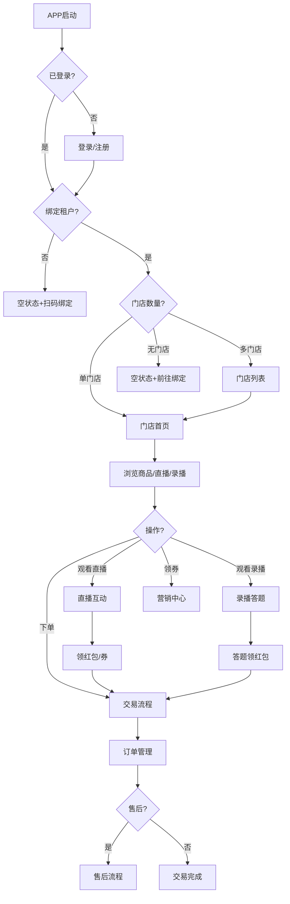
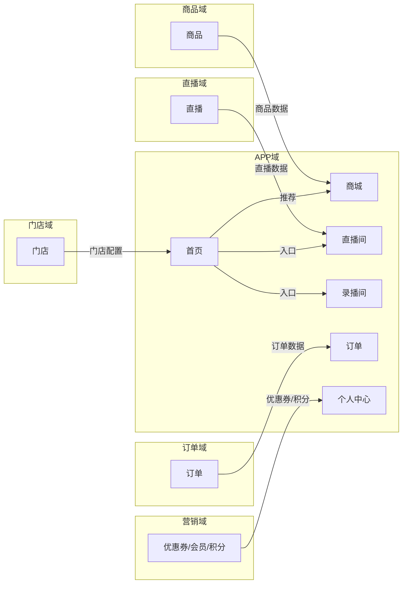
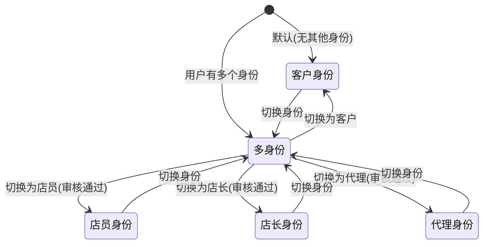
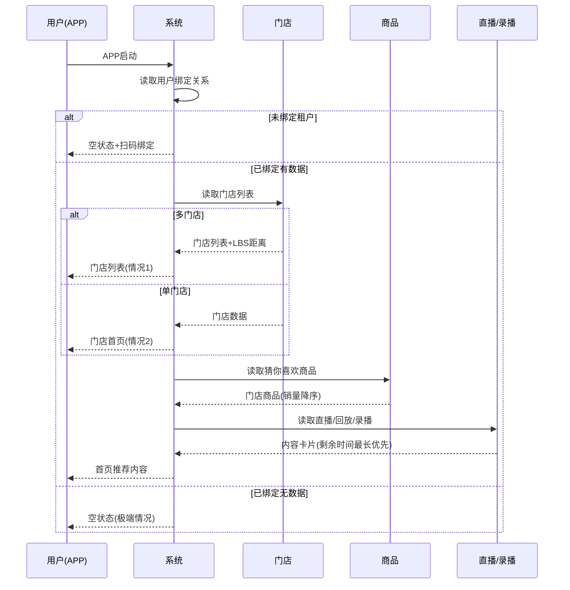
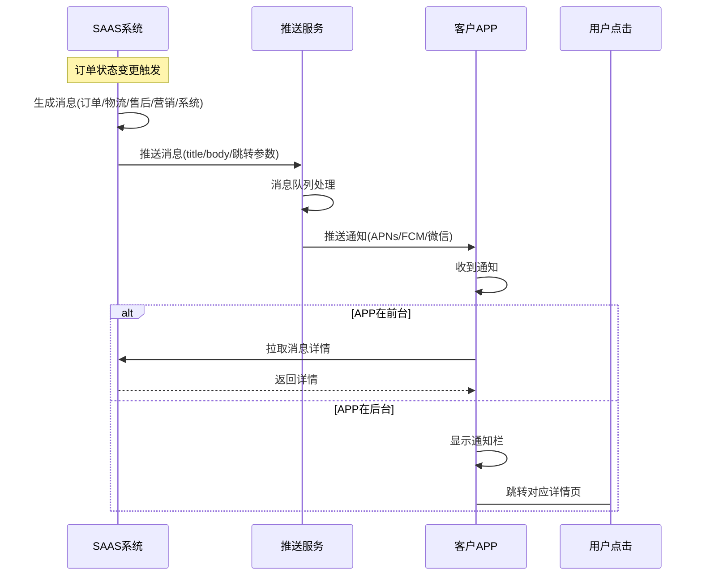

# SAAS平台APP域 产品需求文档 PRD V1.0.9

> **业务域**：SAAS平台APP域 | **版本**：V1.0.9（整合 V1.0.2~V1.0.9） | **日期**：2026-07-16
> **数据来源**：`平台APPV1.0.0.md`、Axure原型 V1.0.2~V1.0.9（476个APP页面，采样219个）
> **追溯链**：UC-APP → FN-APP → PG-APP → SC-APP → BG → BO-APP

---

## 版本历史

| 版本 | 日期 | 变更内容 |
|------|------|----------|
| V1.0.2 | 2026-05-15 | APP首页/商城/交易/直播/录播/娱乐/消息/客户个人中心/优惠券/足迹/收藏/主播/发布/售后 |
| V1.0.3 | 2026-05-25 | 商城加载排序/店长/店员/代理个人中心/切换身份/客户邀请码/自提核销/兑换核销/售后管理/直播数据/APP更新弹窗 |
| V1.0.5 | 2026-06-10 | 会员等级/会员中心/权益查看/直播观看成长值/升级弹窗 |
| V1.0.6 | 2026-06-20 | APP侧直播间通用配置/店员店长"我的"页面/优惠券管理升级 |
| V1.0.8 | 2026-07-05 | 虚拟账户/账户明细/直播推广/观看奖励/我的零钱/零钱提现 |
| V1.0.9 | 2026-07-12 | 积分（我的积分/积分订单/积分抵现/消息通知） |
| V1.0.9 | 2026-07-16 | 按PRD规范V1.0.0重新编排 |

---

## 1. 背景与问题陈述

SAAS平台APP是一个**超级APP**，作为租户用户（C端消费者）及渠道成员的主要触达界面。APP整合平台商城、直播间、录播、娱乐、消息系统、个人中心等核心板块，为5种角色（客户/店员/店长/代理/渠道成员）提供差异化服务。

### 核心问题

| 问题编号 | 问题 | 严重程度 |
|----------|------|----------|
| APP-ISSUE-001 | 大量页面标注"需要UI协助" | 🔴 高 |
| APP-ISSUE-002 | APP登录体系"待定" | 🔴 高 |
| APP-ISSUE-003 | 购物车入口不统一（仅在回放路径下） | 🟡 中 |
| APP-ISSUE-004 | 底部导航迭代不统一（"短剧"vs"娱乐"） | 🟢 低 |
| APP-ISSUE-005 | 首页状态分支过多（6种组合） | 🟡 中 |
| APP-ISSUE-006 | 切换身份体验复杂 | 🟡 中 |
| APP-ISSUE-007 | 内容发布审核反馈缺详细原因 | 🟢 低 |
| APP-ISSUE-008 | 社交体系暂未规划但已设计 | 🟡 中 |
| APP-ISSUE-009 | APP审核合规风险（微信登录/支付/内容审核/隐私） | 🔴 高 |

---

## 2. 目标与成功度量

| 目标编号 | 目标 | 度量指标 | 目标值 |
|----------|------|----------|--------|
| BO-APP-01 | APP启动性能 | 冷启动时间 | < 3秒 |
| BO-APP-02 | 首页加载性能 | 首页数据加载 | < 2秒 |
| BO-APP-03 | 直播间渲染性能 | 挂件+弹幕渲染 | 无卡顿 |
| BO-APP-04 | 消息推送时效 | 消息延迟 | < 1分钟 |

---

## 3. 范围

### In-Scope
- 开屏与启动（开屏广告/APP更新弹窗/扫码绑定入口）
- 首页（未绑定/已绑定有数据/无数据/多门店/单门店/无门店/推荐算法/加载排序逻辑）
- 商城（商品列表/搜索/详情/购物车/有数据无数据状态）
- 直播间（直播广场/直播间页面/挂件逻辑/半屏弹窗/分享/异常状态/数据权限）
- 录播（录播间全屏/横屏/答题卡/商品脚本/红包脚本/互动聊天/回放观看）
- 交易（下单流程/配送方式/选券/支付/支付结果）
- 售后（我的订单/售后列表/售后详情/状态流转/评价）
- 娱乐内容与社交（娱乐首页/短剧/短视频/图文/搜索/内容发布/社交-暂未规划）
- 消息系统（订单/物流/售后/营销/系统消息）
- 个人中心（5种角色差异化/切换身份/会员中心/虚拟账户/积分）

### Non-Goals
- 社交体系（通讯录/好友/群聊/通话—暂未规划）
- APP端登录完整流程（待定）
- 开屏广告UI（需要UI协助）

---

## 4. 与既有模块关系

### 上下游依赖矩阵

| 方向 | 关联域 | 依赖关系 | 说明 |
|------|--------|----------|------|
| **下游（依赖）** | 商品域 | APP端商品浏览/下单 | 商品状态决定APP可见性 |
| **下游（依赖）** | 订单域 | APP端订单管理 | 订单状态同步 |
| **下游（依赖）** | 交易域 | APP端支付 | 支付能力共用 |
| **下游（依赖）** | 售后域 | APP端售后申请 | 售后流程 |
| **下游（依赖）** | 营销域 | APP端优惠券/会员/积分 | 营销能力 |
| **下游（依赖）** | 直播域 | APP端直播观看/互动 | 直播能力 |
| **下游（依赖）** | 录播域 | APP端录播观看/答题 | 录播能力 |
| **下游（依赖）** | 门店域 | APP端多门店首页 | 门店配置 |
| **下游（依赖）** | 分销域 | APP端多角色切换 | 角色身份 |
| **下游（依赖）** | 租户门户域 | 认证通过后APP首页加载 | 租户配置决定展示 |

### 影响域说明

APP域是所有业务域的C端呈现层，后台配置变更直接影响APP端展示。详见各域PRD的影响域说明。

---

## 5. 业务目标映射

| BG | BO | FN |
|----|-----|-----|
| 所有BG | BO-APP-01~04 | FN-APP-001~010 |

---

## 6. 用户故事

| US编号 | 角色 | 用户故事 |
|--------|------|----------|
| US-APP-001 | 客户 | 作为客户，我希望在APP浏览商品/直播/录播并下单，以便购物 |
| US-APP-002 | 客户 | 作为客户，我希望管理订单和申请售后，以便维权 |
| US-APP-003 | 客户 | 作为客户，我希望查看会员等级/积分/零钱，以便管理资产 |
| US-APP-004 | 店员/店长 | 作为店员，我希望在APP核销订单和管理客户，以便门店运营 |
| US-APP-005 | 代理 | 作为代理，我希望在APP管理终端和查看推广数据，以便分销管理 |
| US-APP-006 | 所有角色 | 作为用户，我希望切换身份角色，以便使用不同功能 |

---

## 7. 功能需求列表与用例

### FN-APP-001 开屏与启动
开屏广告（需UI协助）、APP更新弹窗（全局）、扫码绑定入口（绑定门店/被邀请/充值订单）。

### FN-APP-002 首页
**三种状态**：未绑定（空状态+前往绑定+扫码）、已绑定有数据（猜你喜欢+直播/回放/录播卡片）、已绑定无数据（空状态提示）。
**多门店首页**：多门店（门店列表卡片+LBS距离）、单门店（门店名称+搜索+类目+商品列表）、无门店（空状态+前往绑定）。
**推荐算法**：优先所属门店客户门店商品→其次非门店客户在售商品→按销量降序。直播/回放/录播：距离结束剩余时间最长的优先。
**加载排序逻辑(V1.0.3)**：单租户单门店→直接门店首页；多租户多门店→门店列表。黑名单/禁用用户不可展示数据。

### FN-APP-003 商城
商品列表/搜索/筛选、商品详情（基本信息/规格/优惠券/兑换券状态）、购物车（入口在回放路径下）。

### FN-APP-004 直播间（APP端）
直播广场（直播中/预告/记录）、直播间页面（直播中/预告中/已结束）、挂件逻辑（福袋/红包/优惠券/购物车/商品卡片）、半屏弹窗（主播好物/回放/预告）、分享（口令方案）、异常状态（禁言/被踢/网络异常）、数据权限（黑名单不可进入）。

### FN-APP-005 录播（APP端）
录播间全屏模式、横屏模式（有奖答题/互动聊天/商品卡片）、答题卡（单选/多选/答题奖励）、商品脚本/红包脚本控制逻辑、回放观看（限制：不支持IM/点赞/分享/挂件）。

### FN-APP-006 交易（APP端）
下单流程（非兑换券/兑换券）、配送方式（仅快递/仅自提/快递+自提叠加）、选择优惠券（满减/折扣/现金红包/兑换券）、支付/支付结果。

### FN-APP-007 售后（APP端）
我的订单（Tab：全部/待付款/待发货/已发货/待自提/已完成/已取消/售后中）、售后列表、售后详情（仅退款/退货退款状态流转）、评价订单。

### FN-APP-008 娱乐内容与社交
娱乐首页（推荐/短剧/学习/更多栏目）、内容详情（短视频/图文/短剧）、内容搜索、内容发布（选择类型→发布→审核→通过/不通过）。社交功能（通讯录/好友/群聊/通话）暂未规划。

### FN-APP-009 消息系统
消息分类（订单/物流/售后/营销/系统）、消息跳转（跳转对应详情页）。

### FN-APP-010 个人中心（5种角色）

**5种角色功能对比矩阵**：

| 功能模块 | 客户 | 店员 | 店长 | 代理 | 渠道成员 |
|---------|------|------|------|------|---------|
| 我的订单 | ✅ | ✅ | ✅ | ✅ | ✅ |
| 我的发布 | ✅ | ✅ | ✅ | ✅ | ✅ |
| 优惠券/红包 | ✅ | ✅ | ✅ | ✅ | ✅ |
| 收货地址 | ✅ | ✅ | ✅ | ✅ | ✅ |
| 我的主播 | ✅ | ✅ | ✅ | ✅ | ✅ |
| 直播预约 | ✅ | ✅ | ✅ | ✅ | ✅ |
| 足迹 | ✅ | ✅ | ✅ | ✅ | ✅ |
| 收藏 | ✅ | — | — | — | — |
| 我的红包 | ✅ | — | — | — | — |
| 切换身份 | — | ✅ | ✅ | ✅ | ✅ |
| 客户邀请码 | — | ✅ | ✅ | ✅ | ✅ |
| 门店信息 | — | ✅ | ✅ | ✅ | ✅ |
| 经营管理 | — | ✅ | ✅ | — | — |
| 自提核销 | — | ✅ | ✅ | — | — |
| 订单管理 | — | ✅ | ✅ | — | — |
| 客户管理 | — | ✅ | ✅ | — | ✅ |
| 售后管理 | — | ✅ | ✅ | — | — |
| 兑换核销 | — | ✅ | ✅ | — | — |
| 经营数据 | — | ✅ | ✅ | — | — |
| 直播数据 | — | ✅ | ✅ | ✅ | — |
| 终端管理 | — | — | — | ✅ | ✅ |
| 添加门店 | — | — | — | ✅ | — |
| 我的资产 | — | — | — | ✅* | ✅* |
| 我的账单 | — | — | — | ✅* | ✅* |
| 我的首钱(V1.0.8) | ✅ | — | — | — | — |
| 会员中心(V1.0.5) | ✅ | — | — | — | — |
| 我的积分(V1.0.9) | ✅ | — | — | — | — |

> *标注"暂时不做"

---

## 8. 业务规则

### BR-APP-001 首页推荐算法规则
- 猜你喜欢：优先所属门店客户门店商品→其次非门店客户在售商品→按销量降序
- 直播/回放/录播：距离结束剩余时间最长的作为第一个

### BR-APP-002 首页加载排序规则
- 单租户单门店→直接门店首页
- 多租户多门店→门店列表
- 黑名单/禁用用户不可展示数据，不可进入直播间/购买/回放/录播

### BR-APP-003 跨租户不跨门店规则
- 用户可跨租户，但同一租户不能跨门店（分账约束）

### BR-APP-004 直播间数据权限规则
- 黑名单/禁用→"当前您的账号异常，无法进入该直播间，请联系门店或者邀请人"
- 店长进入直播间且配置了该店员范围→允许分享，否则不可分享

### BR-APP-005 商品售罄规则
- 库存为0→显示已售罄状态

### BR-APP-006 内容发布审核规则
- 上传视频不超过500MB
- 上传成功1条方可上传另一条
- 发布后需审核（待审核→已通过/未通过）

### BR-APP-007 消息触发规则
- 订单消息：下单/发货/售后状态变更触发
- 营销消息：优惠券即将到期（有效期-当前时间==30分钟触发）
- 系统消息：直播预约即将开播（开播时间-当前时间==5分钟触发）

### BR-APP-008 多角色切换规则
- 用户可跨租户，普通用户订单/售后/营销券/足迹/收藏来自多租户数据
- 存在身份（店长/代理）可切换
- 管理入口仅在角色审核通过后显示

---

## 9. 数据实体

### ENT-APP-001 用户(User)

| 字段 | 类型 | 说明 |
|------|------|------|
| user_id | String | 用户ID |
| nickname | String | 昵称 |
| phone | String | 手机号 |
| wechat_id | String | 微信ID |
| roles | List | 角色身份列表 |
| tenant_bindings | List | 租户归属列表 |
| store_bindings | List | 门店归属列表 |
| inviter_id | String | 上级邀请人 |
| is_blacklisted | Boolean | 黑名单状态 |
| is_disabled | Boolean | 禁用状态 |

### ENT-APP-002 发布内容(PublishedContent)

| 字段 | 类型 | 说明 |
|------|------|------|
| content_id | String | 内容ID |
| user_id | String | 用户ID |
| content_type | Enum | 短视频/图文/短剧 |
| title | String | 标题 |
| audit_status | Enum | 待审核/已通过/未通过 |
| publish_time | Datetime | 发布时间 |

---

## 10. 验收标准

| SC编号 | 场景 | 预期结果 |
|--------|------|----------|
| SC-APP-001 | 客户下单全流程 | 浏览商品→下单→选券→支付→查看订单→确认收货 |
| SC-APP-002 | 多角色切换 | 客户→切换店员→查看门店订单→切换代理→查看终端管理 |
| SC-APP-003 | 直播观看互动 | 进入直播间→领红包→领券→下单→分享 |
| SC-APP-004 | 录播答题领红包 | 观看课程→完播→答题正确→领红包→下单 |
| SC-APP-005 | 内容发布审核 | 发布短视频→审核→通过/不通过→我的发布查看 |

| FN | Given | When | Then |
|----|-------|------|------|
| FN-APP-002 | 客户绑定多门店 | 进入首页 | 显示门店列表 |
| FN-APP-002 | 黑名单用户 | 进入直播间 | 提示账号异常 |
| FN-APP-004 | 直播商品库存为0 | 查看商品卡片 | 显示已售罄 |
| FN-APP-010 | 用户有店员身份 | 切换身份 | 显示店员个人中心 |

---

## 11. 指标登记

| 指标 | 说明 | 目标值 |
|------|------|--------|
| MET-APP-001 | APP冷启动时间 | < 3秒 |
| MET-APP-002 | 首页加载时间 | < 2秒 |
| MET-APP-003 | 消息推送延迟 | < 1分钟 |

---

## 12. 五类图

### 12.1 业务流程图 — APP端客户使用全流程

### 12.2 信息流转图 — APP域跨模块

### 12.3 状态机 — 多角色身份切换状态机

**状态过渡操作表**：

| 当前状态 | 触发操作 | 目标状态 | 操作者 | 前置约束 | 后置动作 |
|----------|----------|----------|--------|----------|----------|
| — | 登录 | 客户身份/多身份 | 用户 | — | 读取角色列表 |
| 多身份 | 切换为店员 | 店员身份 | 用户 | 店员审核通过 | 读取门店数据 |
| 多身份 | 切换为店长 | 店长身份 | 用户 | 店长审核通过 | 读取门店数据 |
| 多身份 | 切换为代理 | 代理身份 | 用户 | 代理审核通过 | 读取组织数据 |
| 任身份 | 切换身份 | 多身份 | 用户 | — | 显示角色选择 |

### 12.4 业务时序图 — APP首页加载与推荐

### 12.5 三方接口时序图 — APP消息推送

---

## 13. 外部接口标注

| 接口编号 | 接口名称 | 方向 | 对端系统 | 说明 |
|----------|----------|------|----------|------|
| API-APP-001 | 微信登录 | 双向 | 微信开放平台 | APP端微信授权登录（待定） |
| API-APP-002 | 消息推送 | 单向(出) | APNs/FCM/微信 | 推送通知 |
| API-APP-003 | APP版本检查 | 单向(出) | 应用商店 | 检查APP新版本 |
| API-APP-004 | 微信支付 | 双向 | 微信支付 | APP端支付 |
| API-APP-005 | 零钱提现 | 双向 | 微信小程序 | 跳转小程序提现 |

---

## 14. 检查清单

| # | 检查项 | 状态 |
|---|--------|------|
| 1-20 | 全部检查项 | ✅ |

---

> **关联文档**：源MD `平台APPV1.0.0.md` | 下游：所有业务域（APP是C端呈现层） | 总索引 `00-SAAS-PRD-总索引.md`
