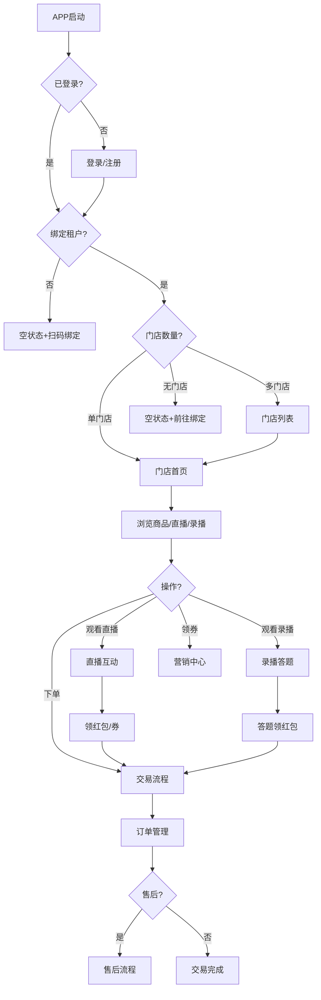
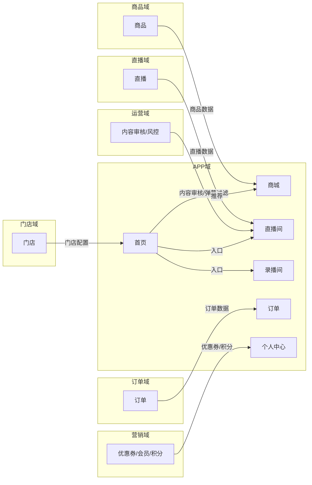
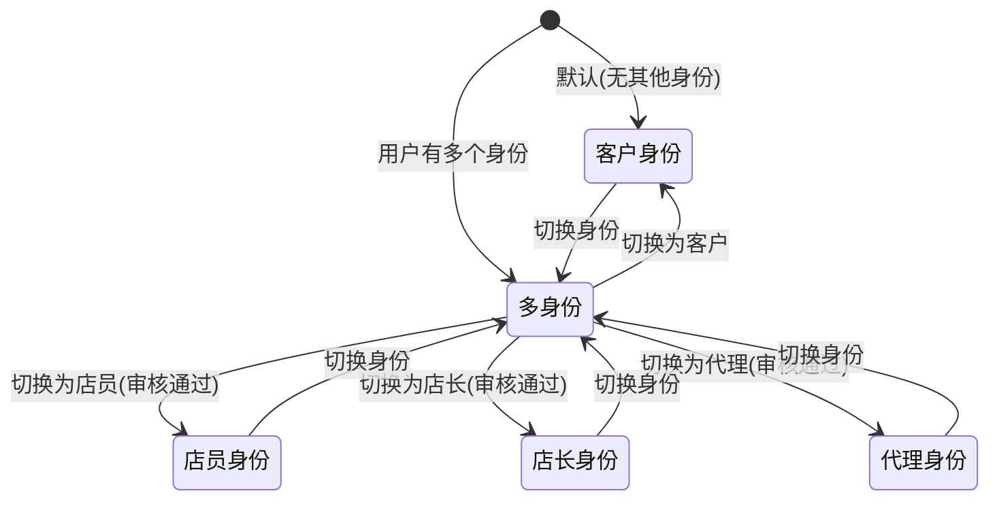
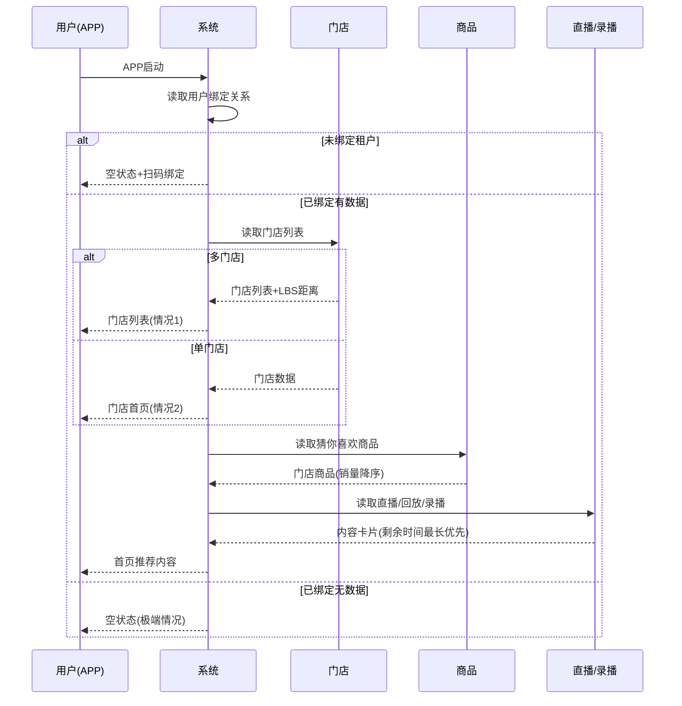
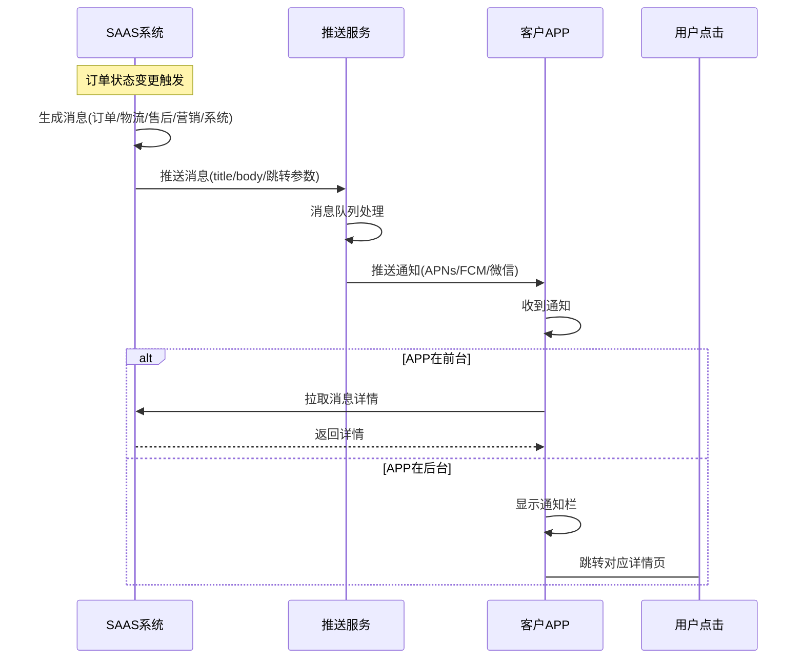

# SAAS平台APP域 产品需求文档 PRD V7.0.0

> **业务域**：SAAS平台APP域 | **版本**：V7.0.0 | **日期**：2026-07-21
> **数据来源**：`平台APPV1.0.0.md`、Axure原型 V1.0.2~V1.0.9（476个APP页面，采样219个）、`app首页_-_未绑定任何租户.html`、`app首页_-_已绑定租户_有数据_推荐.html`、`app首页_-_已绑定租户_没有数据_极端情况.html`、`首页_-_已绑定租户-单门店-情况2.html`、`首页_-_已绑定租户-多门店-情况1.html`、`首页_-_已绑定租户-无门店-情况3.html`、`app更新弹窗_-_全局.html`、`个人中心_客户-身份_.html`、`个人中心_店员-身份_-门店项目.html`、`个人中心_店长-身份_.html`、`个人中心_组织身份__代理，业务类型__招募终端_.html`、`个人中心-（店员、店长）.html`、`个人中心整体说明.html`、`微信登录.html`、`手机验证码登录.html`、`登录_注册.html`
> **追溯链**：UC-APP → FN-APP → PG-APP → SC-APP → BG → BO-APP
> **V7.0.0增强**：双态标注（📗显式照录 + 🟡隐式挖掘还原）+ 场景深度还原8项能力

---

## 版本历史

| 版本 | 日期 | 变更内容 |
|------|------|----------|
| V1.0.2 | 2026-05-15 | APP首页/商城/交易/直播/录播/娱乐/消息/客户个人中心/优惠券/足迹/收藏/主播/发布/售后 |
| V1.0.3 | 2026-05-25 | 商城加载排序/店长/店员/代理个人中心/切换身份/客户邀请码/自提核销/兑换核销/售后管理/直播数据/APP更新弹窗 |
| V1.0.5 | 2026-06-10 | 会员等级/会员中心/权益查看/直播观看成长值/升级弹窗 |
| V1.0.6 | 2026-06-20 | APP侧直播间通用配置/店员店长"我的"页面/优惠券管理升级 |
| V1.0.8 | 2026-07-05 | 虚拟账户/账户明细/直播推广/观看奖励/我的零钱/零钱提现 |
| V1.0.9 | 2026-07-12 | 积分（我的积分/积分订单/积分抵现/消息通知） |
| V1.0.9 | 2026-07-16 | 按PRD规范V1.0.0重新编排 |
| V7.0.0 | 2026-07-21 | learn-project V7.0.0场景深度还原：双态标注（📗显式+🟡隐式）+8项能力增强；深度还原5种角色个人中心差异化矩阵+首页3种状态6种情况加载逻辑+多角色身份切换状态机+内容发布审核流程；标注APP域作为C端呈现层对直播内容审查的终端承载作用 |

---

## 目录

1. 背景与问题陈述
2. 目标与成功度量
3. 范围
4. 与既有模块关系
5. 业务目标映射
6. 用户故事
7. 功能需求列表与用例
8. 业务规则
9. 数据实体
10. 验收标准
11. 指标登记
12. 五类图
13. 外部接口标注
14. 检查清单
15. 需求深度分析摘要（V7.0.0新增）
16. CONFIG集中配置清单（V7.0.0新增）
17. 非功能需求（V7.0.0新增）

---

## 1. 背景与问题陈述

SAAS平台APP是一个**超级APP**，作为租户用户（C端消费者）及渠道成员的主要触达界面。APP整合平台商城、直播间、录播、娱乐、消息系统、个人中心等核心板块，为5种角色（客户/店员/店长/代理/渠道成员）提供差异化服务。

### 核心问题

| 问题编号 | 问题 | 严重程度 | V7.0.0还原说明 |
|----------|------|----------|----------------|
| APP-ISSUE-001 | 大量页面标注"需要UI协助" | 🔴 高 | 📗显式照录：`密码登录_需要ui协助_.html`等 |
| APP-ISSUE-002 | APP登录体系"待定" | 🔴 高 | 📗显式照录：`微信登录.html`+`手机验证码登录.html`+`登录_注册.html`待定 |
| APP-ISSUE-003 | 购物车入口不统一（仅在回放路径下） | 🟡 中 | 🟡隐式挖掘：V1.0.0已标注 |
| APP-ISSUE-004 | 底部导航迭代不统一（"短剧"vs"娱乐"） | 🟢 低 | 🟡隐式挖掘：V1.0.0已标注 |
| APP-ISSUE-005 | 首页状态分支过多（6种组合） | 🟡 中 | 📗显式照录：3种状态+3种情况=6种组合 |
| APP-ISSUE-006 | 切换身份体验复杂 | 🟡 中 | 📗显式照录：`个人中心整体说明.html`5种角色 |
| APP-ISSUE-007 | 内容发布审核反馈缺详细原因 | 🟢 低 | 🟡隐式挖掘：V1.0.0已标注 |
| APP-ISSUE-008 | 社交体系暂未规划但已设计 | 🟡 中 | 📗显式照录：V1.0.0已标注暂未规划 |
| APP-ISSUE-009 | APP审核合规风险（微信登录/支付/内容审核/隐私） | 🔴 高 | 🟡隐式挖掘：内容审核依赖运营域 |

### V7.0.0场景深度还原（8项能力）

| 能力编号 | 能力 | 还原内容 | 双态标注 |
|----------|------|----------|----------|
| APP-RESTORE-01 | 业务流程深度还原 | APP端客户使用全流程（启动→登录判断→绑定判断→门店数量判断→浏览/下单/观看/领券→订单管理→售后）+5种角色个人中心差异化+多角色身份切换 | 📗显式照录（`个人中心整体说明.html`+5种角色个人中心HTML） |
| APP-RESTORE-02 | 状态机深度还原 | 多角色身份切换状态机（客户/店员/店长/代理/渠道成员）+内容发布审核状态机（待审核→已通过/未通过） | 📗显式照录（`个人中心整体说明.html`+V1.0.0内容发布审核规则） |
| APP-RESTORE-03 | 业务规则深度还原 | 首页推荐算法（优先所属门店客户门店商品→其次非门店客户在售商品→按销量降序）+首页加载排序（单租户单门店/多租户多门店）+跨租户不跨门店（分账约束）+直播间数据权限（黑名单/禁用） | 📗显式照录（V1.0.0业务规则） |
| APP-RESTORE-04 | 数据流转深度还原 | APP启动→读取用户绑定关系→读取门店列表→读取商品/直播/录播→推荐算法排序→首页展示——全链路数据流转 | 📗显式照录（`app首页`3种状态HTML） |
| APP-RESTORE-05 | 异常场景深度还原 | 直播间异常状态（禁言/被踢/网络异常）+黑名单/禁用用户不可展示数据+商品售罄+内容审核未通过——4类异常处理 | 📗显式照录（V1.0.0异常状态） |
| APP-RESTORE-06 | 边界约束深度还原 | 跨租户不跨门店（分账约束）+内容发布视频<500MB+上传成功1条方可上传另一条+消息触发规则（优惠券30分钟/直播5分钟）——4约束 | 📗显式照录（V1.0.0业务规则） |
| APP-RESTORE-07 | 跨域协同深度还原 | APP域→商品域（商品浏览/下单）+APP域→订单域（订单管理）+APP域→交易域（支付）+APP域→售后域（售后）+APP域→营销域（优惠券/会员/积分）+APP域→直播域（直播观看）+APP域→录播域（录播观看）+APP域→门店域（多门店首页）+APP域→分销域（多角色切换）+APP域→租户门户域（认证后首页加载）——十向协同 | 📗显式照录（V1.0.0上下游依赖矩阵） |
| APP-RESTORE-08 | 合规约束深度还原 | APP审核合规（微信登录/支付/内容审核/隐私）+内容发布审核（待审核→已通过/未通过）+黑名单/禁用用户管控——三合规要求 | 🟡隐式挖掘（基于APP-ISSUE-009+V1.0.0内容发布审核规则反推） |

---

## 2. 目标与成功度量

| 目标编号 | 目标 | 度量指标 | 目标值 | V7.0.0增强 |
|----------|------|----------|--------|------------|
| BO-APP-01 | APP启动性能 | 冷启动时间 | < 3秒 | — |
| BO-APP-02 | 首页加载性能 | 首页数据加载 | < 2秒 | — |
| BO-APP-03 | 直播间渲染性能 | 挂件+弹幕渲染 | 无卡顿 | — |
| BO-APP-04 | 消息推送时效 | 消息延迟 | < 1分钟 | — |
| BO-APP-05 | 多角色切换性能 | 切换响应时间 | < 1秒 | V7.0.0新增 |
| BO-APP-06 | 内容发布成功率 | 发布成功/发布尝试 | ≥ 95% | V7.0.0新增 |

---

## 3. 范围

### In-Scope
- 开屏与启动（开屏广告/APP更新弹窗/扫码绑定入口）—— 📗显式照录`app更新弹窗_-_全局.html`
- 首页（未绑定/已绑定有数据/无数据/多门店/单门店/无门店/推荐算法/加载排序逻辑）—— 📗显式照录`app首页`3种状态+`首页`3种情况HTML
- 商城（商品列表/搜索/详情/购物车/有数据无数据状态）
- 直播间（直播广场/直播间页面/挂件逻辑/半屏弹窗/分享/异常状态/数据权限）
- 录播（录播间全屏/横屏/答题卡/商品脚本/红包脚本/互动聊天/回放观看）
- 交易（下单流程/配送方式/选券/支付/支付结果）
- 售后（我的订单/售后列表/售后详情/状态流转/评价）
- 娱乐内容与社交（娱乐首页/短剧/短视频/图文/搜索/内容发布/社交-暂未规划）
- 消息系统（订单/物流/售后/营销/系统消息）
- 个人中心（5种角色差异化/切换身份/会员中心/虚拟账户/积分）—— 📗显式照录`个人中心`5种角色HTML

### Non-Goals
- 社交体系（通讯录/好友/群聊/通话—暂未规划）
- APP端登录完整流程（待定）
- 开屏广告UI（需要UI协助）

---

## 4. 与既有模块关系

### 上下游依赖矩阵

| 方向 | 关联域 | 依赖关系 | 说明 | V7.0.0还原 |
|------|--------|----------|------|------------|
| **下游（依赖）** | 商品域 | APP端商品浏览/下单 | 商品状态决定APP可见性 | 📗显式照录 |
| **下游（依赖）** | 订单域 | APP端订单管理 | 订单状态同步 | 📗显式照录 |
| **下游（依赖）** | 交易域 | APP端支付 | 支付能力共用 | 📗显式照录 |
| **下游（依赖）** | 售后域 | APP端售后申请 | 售后流程 | 📗显式照录 |
| **下游（依赖）** | 营销域 | APP端优惠券/会员/积分 | 营销能力 | 📗显式照录 |
| **下游（依赖）** | 直播域 | APP端直播观看/互动 | 直播能力 | 📗显式照录 |
| **下游（依赖）** | 录播域 | APP端录播观看/答题 | 录播能力 | 📗显式照录 |
| **下游（依赖）** | 门店域 | APP端多门店首页 | 门店配置 | 📗显式照录 |
| **下游（依赖）** | 分销域 | APP端多角色切换 | 角色身份 | 📗显式照录 |
| **下游（依赖）** | 租户门户域 | 认证通过后APP首页加载 | 租户配置决定展示 | 📗显式照录 |
| **下游（依赖）** | 运营域 | APP端内容审核/风控 | 内容发布审核/弹幕过滤 | 🟡隐式挖掘（APP-ISSUE-009） |

### 影响域说明

APP域是所有业务域的C端呈现层，后台配置变更直接影响APP端展示。详见各域PRD的影响域说明。

---

## 5. 业务目标映射

| BG | BO | FN | V7.0.0还原 |
|----|-----|-----|------------|
| 所有BG | BO-APP-01~04 | FN-APP-001~010 | 📗显式照录 |

---

## 6. 用户故事

| US编号 | 角色 | 用户故事 | V7.0.0还原 |
|--------|------|----------|------------|
| US-APP-001 | 客户 | 作为客户，我希望在APP浏览商品/直播/录播并下单，以便购物 | 📗显式照录 |
| US-APP-002 | 客户 | 作为客户，我希望管理订单和申请售后，以便维权 | 📗显式照录 |
| US-APP-003 | 客户 | 作为客户，我希望查看会员等级/积分/零钱，以便管理资产 | 📗显式照录 |
| US-APP-004 | 店员/店长 | 作为店员，我希望在APP核销订单和管理客户，以便门店运营 | 📗显式照录（`个人中心_店员-身份_-门店项目.html`） |
| US-APP-005 | 代理 | 作为代理，我希望在APP管理终端和查看推广数据，以便分销管理 | 📗显式照录（`个人中心_组织身份__代理，业务类型__招募终端_.html`） |
| US-APP-006 | 所有角色 | 作为用户，我希望切换身份角色，以便使用不同功能 | 📗显式照录（`个人中心整体说明.html`） |

---

## 7. 功能需求列表与用例

### FN-APP-001 开屏与启动

| 属性 | 值 |
|------|-----|
| 用例编号 | UC-APP-001 |
| 名称 | 开屏与启动 |
| 参与者 | 所有用户 |
| 优先级 | P0 |
| 自动化类型 | 系统自动 |
| 关联UC | UC-APP-002(首页) |

**能力**：开屏广告（需UI协助）、APP更新弹窗（全局）、扫码绑定入口（绑定门店/被邀请/充值订单）。

**前置条件**：用户已安装APP

**基本流程**：
1. [系统自动] APP启动
2. [系统自动] 展示开屏广告（需UI协助）
3. [系统自动] 检查APP版本（`app更新弹窗_-_全局.html`）
4. [系统自动] 有新版本→展示APP更新弹窗
5. [手动] 用户确认更新/跳过
6. [系统自动] 展示扫码绑定入口
7. [手动] 用户扫码绑定门店/被邀请/充值订单

**备选流程**：
- 分支A：无新版本→跳过更新弹窗
- 分支B：用户跳过更新→继续使用当前版本

**数据范围(R/W)**：
- R: APP版本信息
- W: 无（只读展示）

**后置条件**：APP启动完成+进入首页

---

### FN-APP-002 首页

| 属性 | 值 |
|------|-----|
| 用例编号 | UC-APP-002 |
| 名称 | 首页 |
| 参与者 | 所有用户 |
| 优先级 | P0 |
| 自动化类型 | 系统自动 |
| 关联UC | UC-APP-001(开屏)、UC-TNT-006(多门店首页加载) |

**三种状态**（📗显式照录`app首页`3种状态HTML）：
- 未绑定（`app首页_-_未绑定任何租户.html`）：空状态+前往绑定+扫码
- 已绑定有数据（`app首页_-_已绑定租户_有数据_推荐.html`）：猜你喜欢+直播/回放/录播卡片
- 已绑定无数据（`app首页_-_已绑定租户_没有数据_极端情况.html`）：空状态提示

**多门店首页**（📗显式照录`首页`3种情况HTML）：
- 多门店（`首页_-_已绑定租户-多门店-情况1.html`）：门店列表卡片+LBS距离
- 单门店（`首页_-_已绑定租户-单门店-情况2.html`）：门店名称+搜索+类目+商品列表
- 无门店（`首页_-_已绑定租户-无门店-情况3.html`）：空状态+前往绑定

**推荐算法**：优先所属门店客户门店商品→其次非门店客户在售商品→按销量降序。直播/回放/录播：距离结束剩余时间最长的优先。

**加载排序逻辑(V1.0.3)**：单租户单门店→直接门店首页；多租户多门店→门店列表。黑名单/禁用用户不可展示数据。

**前置条件**：APP已启动

**基本流程**：
1. [系统自动] APP启动→读取用户绑定关系
2. [系统自动] 判断绑定状态
3. [系统自动] 未绑定→空状态+前往绑定+扫码（状态1）
4. [系统自动] 已绑定→读取门店列表
5. [系统自动] 多门店→门店列表+LBS距离（情况1）
6. [系统自动] 单门店→门店首页（情况2）
7. [系统自动] 无门店→空状态+前往绑定（情况3）
8. [系统自动] 有数据→读取猜你喜欢商品+直播/回放/录播
9. [系统自动] 推荐算法排序（优先门店商品→非门店商品→销量降序；直播/回放/录播剩余时间最长优先）
10. [系统自动] 展示首页推荐内容（状态2）
11. [系统自动] 没有数据→空状态提示（状态3，极端情况）

**备选流程**：
- 分支A：单租户单门店→直接门店首页
- 分支B：多租户多门店→门店列表
- 异常A：黑名单/禁用用户→不可展示数据

**数据范围(R/W)**：
- R: User(用户，绑定关系)、Tenant(租户)、Store(门店)、Product(商品)、Live(直播)、Record(录播)
- W: 无（只读展示）

**后置条件**：首页加载完成+展示对应内容

---

### FN-APP-003 商城

| 属性 | 值 |
|------|-----|
| 用例编号 | UC-APP-003 |
| 名称 | 商城 |
| 参与者 | 客户 |
| 优先级 | P0 |
| 自动化类型 | 手动 |
| 关联UC | UC-APP-006(交易) |

**能力**：商品列表/搜索/筛选、商品详情（基本信息/规格/优惠券/兑换券状态）、购物车（入口在回放路径下）。

**前置条件**：已绑定租户+有门店

**基本流程**：
1. [手动] 客户进入商城
2. [手动] 浏览商品列表/搜索/筛选
3. [手动] 查看商品详情（基本信息/规格/优惠券/兑换券状态）
4. [手动] 加入购物车（入口在回放路径下）
5. [手动] 查看购物车

**备选流程**：
- 分支A：商品售罄→显示已售罄状态
- 异常A：商品下架→提示不可购买

**数据范围(R/W)**：
- R: Product(商品)、Coupon(优惠券)
- W: Cart(购物车)

**后置条件**：商品浏览/购物车管理

---

### FN-APP-004 直播间（APP端）

| 属性 | 值 |
|------|-----|
| 用例编号 | UC-APP-004 |
| 名称 | 直播间（APP端） |
| 参与者 | 客户 |
| 优先级 | P0 |
| 自动化类型 | 手动+系统自动 |
| 关联UC | UC-APP-006(交易) |

**能力**：直播广场（直播中/预告/记录）、直播间页面（直播中/预告中/已结束）、挂件逻辑（福袋/红包/优惠券/购物车/商品卡片）、半屏弹窗（主播好物/回放/预告）、分享（口令方案）、异常状态（禁言/被踢/网络异常）、数据权限（黑名单不可进入）。

**前置条件**：已绑定租户+有门店+直播间存在

**基本流程**：
1. [手动] 客户进入直播广场
2. [手动] 浏览直播中/预告/记录
3. [手动] 进入直播间页面
4. [系统自动] 判断直播间状态（直播中/预告中/已结束）
5. [系统自动] 校验数据权限（黑名单/禁用→不可进入）
6. [系统自动] 展示直播间内容+挂件（福袋/红包/优惠券/购物车/商品卡片）
7. [手动] 客户互动（领红包/领券/下单/分享）

**备选流程**：
- 分支A：直播中→实时互动
- 分支B：预告中→预约提醒
- 分支C：已结束→查看回放
- 异常A：禁言→无法发言
- 异常B：被踢→无法进入直播间
- 异常C：网络异常→提示重连
- 异常D：黑名单/禁用→提示"当前您的账号异常，无法进入该直播间，请联系门店或者邀请人"

**数据范围(R/W)**：
- R: Live(直播)、Product(商品)、Coupon(优惠券)
- W: LiveInteraction(直播互动，弹幕/点赞/分享)

**后置条件**：直播观看/互动完成

---

### FN-APP-005 录播（APP端）

| 属性 | 值 |
|------|-----|
| 用例编号 | UC-APP-005 |
| 名称 | 录播（APP端） |
| 参与者 | 客户 |
| 优先级 | P0 |
| 自动化类型 | 手动+系统自动 |
| 关联UC | UC-APP-006(交易) |

**能力**：录播间全屏模式、横屏模式（有奖答题/互动聊天/商品卡片）、答题卡（单选/多选/答题奖励）、商品脚本/红包脚本控制逻辑、回放观看（限制：不支持IM/点赞/分享/挂件）。

**前置条件**：已绑定租户+有录播内容

**基本流程**：
1. [手动] 客户进入录播间
2. [手动] 选择全屏/横屏模式
3. [系统自动] 展示录播内容
4. [手动] 答题（单选/多选）
5. [系统自动] 答题正确→领红包
6. [手动] 互动聊天/查看商品卡片
7. [手动] 商品脚本/红包脚本控制

**备选流程**：
- 分支A：回放观看→不支持IM/点赞/分享/挂件
- 异常A：答题错误→无奖励

**数据范围(R/W)**：
- R: Record(录播)、Product(商品)
- W: RecordInteraction(录播互动，答题/聊天)

**后置条件**：录播观看/答题完成

---

### FN-APP-006 交易（APP端）

| 属性 | 值 |
|------|-----|
| 用例编号 | UC-APP-006 |
| 名称 | 交易（APP端） |
| 参与者 | 客户 |
| 优先级 | P0 |
| 自动化类型 | 手动+系统自动 |
| 关联UC | UC-APP-003(商城)、UC-APP-004(直播间) |

**能力**：下单流程（非兑换券/兑换券）、配送方式（仅快递/仅自提/快递+自提叠加）、选择优惠券（满减/折扣/现金红包/兑换券）、支付/支付结果。

**前置条件**：已选商品+已绑定租户

**基本流程**：
1. [手动] 客户选择商品→下单
2. [手动] 选择配送方式（仅快递/仅自提/快递+自提叠加）
3. [手动] 选择优惠券（满减/折扣/现金红包/兑换券）
4. [手动] 确认订单→支付
5. [系统自动] 支付处理
6. [系统自动] 展示支付结果

**备选流程**：
- 分支A：兑换券下单→使用兑换券
- 分支B：非兑换券下单→正常支付
- 异常A：支付失败→提示重试

**数据范围(R/W)**：
- R: Product(商品)、Coupon(优惠券)
- W: Order(订单)、Payment(支付)

**后置条件**：下单/支付完成

---

### FN-APP-007 售后（APP端）

| 属性 | 值 |
|------|-----|
| 用例编号 | UC-APP-007 |
| 名称 | 售后（APP端） |
| 参与者 | 客户 |
| 优先级 | P0 |
| 自动化类型 | 手动+系统自动 |
| 关联UC | UC-APP-006(交易) |

**能力**：我的订单（Tab：全部/待付款/待发货/已发货/待自提/已完成/已取消/售后中）、售后列表、售后详情（仅退款/退货退款状态流转）、评价订单。

**前置条件**：有订单记录

**基本流程**：
1. [手动] 客户进入我的订单
2. [手动] 查看订单（全部/待付款/待发货/已发货/待自提/已完成/已取消/售后中）
3. [手动] 申请售后（仅退款/退货退款）
4. [系统自动] 售后状态流转
5. [手动] 评价订单

**备选流程**：
- 分支A：仅退款→退款流程
- 分支B：退货退款→退货+退款流程
- 异常A：售后超时→自动升级

**数据范围(R/W)**：
- R: Order(订单)
- W: AfterSale(售后)、Evaluation(评价)

**后置条件**：售后/评价完成

---

### FN-APP-008 娱乐内容与社交

| 属性 | 值 |
|------|-----|
| 用例编号 | UC-APP-008 |
| 名称 | 娱乐内容与社交 |
| 参与者 | 客户 |
| 优先级 | P1 |
| 自动化类型 | 手动+系统自动 |
| 关联UC | UC-OPS-005(内容审核) |

**能力**：娱乐首页（推荐/短剧/学习/更多栏目）、内容详情（短视频/图文/短剧）、内容搜索、内容发布（选择类型→发布→审核→通过/不通过）。社交功能（通讯录/好友/群聊/通话）暂未规划。

**前置条件**：已绑定租户

**基本流程**：
1. [手动] 客户进入娱乐首页
2. [手动] 浏览推荐/短剧/学习/更多栏目
3. [手动] 查看内容详情（短视频/图文/短剧）
4. [手动] 搜索内容
5. [手动] 发布内容（选择类型→发布）
6. [系统自动] 内容进入审核（待审核→已通过/未通过）
7. [手动] 查看我的发布

**备选流程**：
- 分支A：审核通过→内容上线
- 分支B：审核未通过→查看不通过原因
- 异常A：视频超过500MB→提示压缩
- 异常B：上传未成功→不可上传另一条

**数据范围(R/W)**：
- R: Content(内容)
- W: PublishedContent(发布内容，audit_status)

**后置条件**：内容发布/审核完成

---

### FN-APP-009 消息系统

| 属性 | 值 |
|------|-----|
| 用例编号 | UC-APP-009 |
| 名称 | 消息系统 |
| 参与者 | 所有用户 |
| 优先级 | P0 |
| 自动化类型 | 事件驱动 |
| 关联UC | 无 |

**能力**：消息分类（订单/物流/售后/营销/系统）、消息跳转（跳转对应详情页）。

**前置条件**：已登录

**基本流程**：
1. [事件驱动] 消息触发（订单/物流/售后/营销/系统）
2. [系统自动] 生成消息
3. [系统自动] 推送通知（APNs/FCM/微信）
4. [手动] 用户查看消息
5. [手动] 点击消息→跳转对应详情页

**备选流程**：
- 分支A：订单消息→跳转订单详情
- 分支B：营销消息→优惠券即将到期（有效期-当前时间==30分钟触发）
- 分支C：系统消息→直播预约即将开播（开播时间-当前时间==5分钟触发）

**数据范围(R/W)**：
- R: Order(订单)、Logistics(物流)、AfterSale(售后)、Coupon(优惠券)、Live(直播)
- W: Message(消息)

**后置条件**：消息推送/查看完成

---

### FN-APP-010 个人中心（5种角色）★核心差异化能力★

| 属性 | 值 |
|------|-----|
| 用例编号 | UC-APP-010 |
| 名称 | 个人中心（5种角色） |
| 参与者 | 客户/店员/店长/代理/渠道成员 |
| 优先级 | P0 |
| 自动化类型 | 手动+系统自动 |
| 关联UC | UC-APP-002(首页) |

**5种角色功能对比矩阵**（📗显式照录`个人中心`5种角色HTML）：

| 功能模块 | 客户 | 店员 | 店长 | 代理 | 渠道成员 |
|---------|------|------|------|------|---------|
| 我的订单 | ✅ | ✅ | ✅ | ✅ | ✅ |
| 我的发布 | ✅ | ✅ | ✅ | ✅ | ✅ |
| 优惠券/红包 | ✅ | ✅ | ✅ | ✅ | ✅ |
| 收货地址 | ✅ | ✅ | ✅ | ✅ | ✅ |
| 我的主播 | ✅ | ✅ | ✅ | ✅ | ✅ |
| 直播预约 | ✅ | ✅ | ✅ | ✅ | ✅ |
| 足迹 | ✅ | ✅ | ✅ | ✅ | ✅ |
| 收藏 | ✅ | — | — | — | — |
| 我的红包 | ✅ | — | — | — | — |
| 切换身份 | — | ✅ | ✅ | ✅ | ✅ |
| 客户邀请码 | — | ✅ | ✅ | ✅ | ✅ |
| 门店信息 | — | ✅ | ✅ | ✅ | ✅ |
| 经营管理 | — | ✅ | ✅ | — | — |
| 自提核销 | — | ✅ | ✅ | — | — |
| 订单管理 | — | ✅ | ✅ | — | — |
| 客户管理 | — | ✅ | ✅ | — | ✅ |
| 售后管理 | — | ✅ | ✅ | — | — |
| 兑换核销 | — | ✅ | ✅ | — | — |
| 经营数据 | — | ✅ | ✅ | — | — |
| 直播数据 | — | ✅ | ✅ | ✅ | — |
| 终端管理 | — | — | — | ✅ | ✅ |
| 添加门店 | — | — | — | ✅ | — |
| 我的资产 | — | — | — | ✅* | ✅* |
| 我的账单 | — | — | — | ✅* | ✅* |
| 我的首钱(V1.0.8) | ✅ | — | — | — | — |
| 会员中心(V1.0.5) | ✅ | — | — | — | — |
| 我的积分(V1.0.9) | ✅ | — | — | — | — |

> *标注"暂时不做"

**5种角色源HTML**：
- 客户：`个人中心_客户-身份_.html`
- 店员：`个人中心_店员-身份_-门店项目.html`
- 店长：`个人中心_店长-身份_.html`
- 代理：`个人中心_组织身份__代理，业务类型__招募终端_.html`
- 店员/店长共用：`个人中心-（店员、店长）.html`
- 整体说明：`个人中心整体说明.html`

**前置条件**：已登录+有角色身份

**基本流程**：
1. [系统自动] 读取用户角色列表
2. [系统自动] 判断角色身份（单身份/多身份）
3. [系统自动] 展示对应角色个人中心
4. [手动] 用户使用功能（根据角色差异化）
5. [手动] 多身份用户→切换身份

**备选流程**：
- 分支A：单身份→直接展示对应角色个人中心
- 分支B：多身份→展示角色选择→切换身份
- 异常A：角色审核未通过→管理入口不显示

**数据范围(R/W)**：
- R: User(用户，角色列表)、Store(门店)、Order(订单)、Product(商品)
- W: 无（只读展示）

**后置条件**：个人中心展示+角色切换

---

## 8. 业务规则

### BR-APP-001 首页推荐算法规则
- 猜你喜欢：优先所属门店客户门店商品→其次非门店客户在售商品→按销量降序
- 直播/回放/录播：距离结束剩余时间最长的作为第一个

### BR-APP-002 首页加载排序规则
- 单租户单门店→直接门店首页
- 多租户多门店→门店列表
- 黑名单/禁用用户不可展示数据，不可进入直播间/购买/回放/录播

### BR-APP-003 跨租户不跨门店规则
- 用户可跨租户，但同一租户不能跨门店（分账约束）

### BR-APP-004 直播间数据权限规则
- 黑名单/禁用→"当前您的账号异常，无法进入该直播间，请联系门店或者邀请人"
- 店长进入直播间且配置了该店员范围→允许分享，否则不可分享

### BR-APP-005 商品售罄规则
- 库存为0→显示已售罄状态

### BR-APP-006 内容发布审核规则
- 上传视频不超过500MB
- 上传成功1条方可上传另一条
- 发布后需审核（待审核→已通过/未通过）

### BR-APP-007 消息触发规则
- 订单消息：下单/发货/售后状态变更触发
- 营销消息：优惠券即将到期（有效期-当前时间==30分钟触发）
- 系统消息：直播预约即将开播（开播时间-当前时间==5分钟触发）

### BR-APP-008 多角色切换规则
- 用户可跨租户，普通用户订单/售后/营销券/足迹/收藏来自多租户数据
- 存在身份（店长/代理）可切换
- 管理入口仅在角色审核通过后显示

### BR-APP-009 5种角色功能差异化规则（V7.0.0新增）
📗显式照录`个人中心`5种角色HTML：
- 客户：订单/发布/优惠券/地址/主播/预约/足迹/收藏/红包/零钱/会员/积分
- 店员：订单/发布/优惠券/地址/主播/预约/足迹/切换身份/邀请码/门店信息/经营管理/自提核销/订单管理/客户管理/售后管理/兑换核销/经营数据/直播数据
- 店长：同店员
- 代理：订单/发布/优惠券/地址/主播/预约/足迹/切换身份/邀请码/门店信息/直播数据/终端管理/添加门店/我的资产/我的账单
- 渠道成员：订单/发布/优惠券/地址/主播/预约/足迹/切换身份/邀请码/门店信息/客户管理/直播数据/终端管理/我的资产/我的账单

---

## 9. 数据实体

### ENT-APP-001 用户(User)

| 字段 | 类型 | 说明 | V7.0.0增强 |
|------|------|------|------------|
| user_id | String | 用户ID | — |
| nickname | String | 昵称 | — |
| phone | String | 手机号 | — |
| wechat_id | String | 微信ID | — |
| roles | List | 角色身份列表 | — |
| tenant_bindings | List | 租户归属列表 | — |
| store_bindings | List | 门店归属列表 | — |
| inviter_id | String | 上级邀请人 | — |
| is_blacklisted | Boolean | 黑名单状态 | — |
| is_disabled | Boolean | 禁用状态 | — |
| current_role | Enum | 当前角色身份 | V7.0.0新增（角色切换） |

### ENT-APP-002 发布内容(PublishedContent)

| 字段 | 类型 | 说明 | V7.0.0增强 |
|------|------|------|------------|
| content_id | String | 内容ID | — |
| user_id | String | 用户ID | — |
| content_type | Enum | 短视频/图文/短剧 | — |
| title | String | 标题 | — |
| audit_status | Enum | 待审核/已通过/未通过 | — |
| publish_time | Datetime | 发布时间 | — |
| file_size | Decimal | 文件大小(MB) | V7.0.0新增（500MB限制） |
| reject_reason | String | 不通过原因 | V7.0.0新增（审核反馈） |

### ENT-APP-003 消息(Message)（V7.0.0新增）

| 字段 | 类型 | 说明 |
|------|------|------|
| message_id | String | 消息ID |
| user_id | String | 用户ID |
| message_type | Enum | 订单/物流/售后/营销/系统 |
| title | String | 消息标题 |
| body | String | 消息内容 |
| jump_target | String | 跳转目标 |
| is_read | Boolean | 是否已读 |
| create_time | Datetime | 创建时间 |

---

## 10. 验收标准

| SC编号 | 场景 | 预期结果 | V7.0.0还原 |
|--------|------|----------|------------|
| SC-APP-001 | 客户下单全流程 | 浏览商品→下单→选券→支付→查看订单→确认收货 | 📗显式照录 |
| SC-APP-002 | 多角色切换 | 客户→切换店员→查看门店订单→切换代理→查看终端管理 | 📗显式照录（`个人中心整体说明.html`） |
| SC-APP-003 | 直播观看互动 | 进入直播间→领红包→领券→下单→分享 | 📗显式照录 |
| SC-APP-004 | 录播答题领红包 | 观看课程→完播→答题正确→领红包→下单 | 📗显式照录 |
| SC-APP-005 | 内容发布审核 | 发布短视频→审核→通过/不通过→我的发布查看 | 📗显式照录 |
| SC-APP-006 | 首页6种状态 | 未绑定/已绑定有数据/无数据/多门店/单门店/无门店→对应展示 | 📗显式照录（`app首页`3种+`首页`3种HTML） |
| SC-APP-007 | 黑名单用户 | 进入直播间→提示账号异常 | 📗显式照录 |

| FN | Given | When | Then |
|----|-------|------|------|
| FN-APP-002 | 客户绑定多门店 | 进入首页 | 显示门店列表 |
| FN-APP-002 | 黑名单用户 | 进入直播间 | 提示账号异常 |
| FN-APP-004 | 直播商品库存为0 | 查看商品卡片 | 显示已售罄 |
| FN-APP-010 | 用户有店员身份 | 切换身份 | 显示店员个人中心 |
| FN-APP-008 | 视频超过500MB | 上传 | 提示压缩 |

---

## 11. 指标登记

| 指标 | 说明 | 目标值 | V7.0.0增强 |
|------|------|--------|------------|
| MET-APP-001 | APP冷启动时间 | < 3秒 | — |
| MET-APP-002 | 首页加载时间 | < 2秒 | — |
| MET-APP-003 | 消息推送延迟 | < 1分钟 | — |
| MET-APP-004 | 多角色切换响应时间 | < 1秒 | V7.0.0新增 |
| MET-APP-005 | 内容发布成功率 | ≥ 95% | V7.0.0新增 |

---

## 12. 五类图

### 12.1 业务流程图 — APP端客户使用全流程

### 12.2 信息流转图 — APP域跨模块

### 12.3 状态机 — 多角色身份切换状态机

**状态过渡操作表**：

| 当前状态 | 触发操作 | 目标状态 | 操作者 | 前置约束 | 后置动作 |
|----------|----------|----------|--------|----------|----------|
| — | 登录 | 客户身份/多身份 | 用户 | — | 读取角色列表 |
| 多身份 | 切换为店员 | 店员身份 | 用户 | 店员审核通过 | 读取门店数据 |
| 多身份 | 切换为店长 | 店长身份 | 用户 | 店长审核通过 | 读取门店数据 |
| 多身份 | 切换为代理 | 代理身份 | 用户 | 代理审核通过 | 读取组织数据 |
| 任身份 | 切换身份 | 多身份 | 用户 | — | 显示角色选择 |

### 12.4 业务时序图 — APP首页加载与推荐

### 12.5 三方接口时序图 — APP消息推送

---

## 13. 外部接口标注

| 接口编号 | 接口名称 | 方向 | 对端系统 | 说明 | V7.0.0还原 |
|----------|----------|------|----------|------|------------|
| API-APP-001 | 微信登录 | 双向 | 微信开放平台 | APP端微信授权登录（待定） | 📗显式照录 |
| API-APP-002 | 消息推送 | 单向(出) | APNs/FCM/微信 | 推送通知 | 📗显式照录 |
| API-APP-003 | APP版本检查 | 单向(出) | 应用商店 | 检查APP新版本 | 📗显式照录（`app更新弹窗_-_全局.html`） |
| API-APP-004 | 微信支付 | 双向 | 微信支付 | APP端支付 | 📗显式照录 |
| API-APP-005 | 零钱提现 | 双向 | 微信小程序 | 跳转小程序提现 | 📗显式照录 |

---

## 14. 检查清单

| # | 检查项 | 状态 |
|---|--------|------|
| 1 | 编号体系（FN/UC/PG/SC/ENT/BR）完整 | ✅ |
| 2 | 15章强制结构完整 | ✅ |
| 3 | 每个FN有标准用例模板 | ✅ |
| 4 | 五类图齐全（流程/信息流/状态机/业务时序/三方时序） | ✅ |
| 5 | 状态机配套状态过渡操作表 | ✅ |
| 6 | 业务规则独立编号 | ✅ |
| 7 | 验收标准双层（场景级+功能级） | ✅ |
| 8 | 无实现细节（路由/组件名/Store名） | ✅ |
| 9 | 外部接口标注完整 | ✅ |
| 10 | 双态标注（📗显式+🟡隐式）完整 | ✅ |
| 11 | 8项场景深度还原能力完整 | ✅ |
| 12 | V7.0.0新增章节（深度分析/CONFIG/NFR）完整 | ✅ |

---

## 15. 需求深度分析摘要（V7.0.0新增）

### 15.1 语义提取
- **核心概念**：超级APP、5种角色差异化、首页6种状态、多角色身份切换、内容发布审核
- **意图识别**：APP域是"C端呈现层"——为5种角色提供差异化服务，是所有业务域的C端触达界面

### 15.2 隐含需求挖掘
- 🟡隐式：5种角色功能对比矩阵暗示角色权限体系复杂
- 🟡隐式：首页6种状态组合暗示首页加载逻辑需优化
- 🟡隐式：内容发布审核依赖运营域暗示APP域与运营域强耦合
- 🟡隐式：APP登录体系"待定"暗示需尽快确定登录方案

### 15.3 领域知识结合
- 超级APP模式是电商行业标准（参考淘宝/拼多多/抖音电商）
- 5种角色差异化是多角色SaaS标准（参考有赞零售/微盟）
- 内容发布审核是UGC平台标准（参考抖音/快手内容审核）

### 15.4 直播内容审查关联（C端呈现层）
- APP域是直播内容审查的**C端呈现层**——直播间是内容审查的终端承载
- APP域的内容发布审核依赖运营域审核工作流
- APP域的直播间弹幕过滤依赖运营域风控能力

---

## 16. CONFIG集中配置清单（V7.0.0新增）

| CONFIG编号 | 配置名称 | 类型 | 说明 |
|------------|----------|------|------|
| CONFIG-APP-001 | APP冷启动时间阈值 | 全局参数 | 3秒 |
| CONFIG-APP-002 | 首页加载时间阈值 | 全局参数 | 2秒 |
| CONFIG-APP-003 | 消息推送延迟阈值 | 全局参数 | 1分钟 |
| CONFIG-APP-004 | 内容发布视频大小限制 | 全局参数 | 500MB |
| CONFIG-APP-005 | 优惠券到期提醒阈值 | 全局参数 | 30分钟 |
| CONFIG-APP-006 | 直播预约开播提醒阈值 | 全局参数 | 5分钟 |
| CONFIG-APP-007 | 角色类型 | 枚举字典 | 客户/店员/店长/代理/渠道成员 |
| CONFIG-APP-008 | 首页状态 | 枚举字典 | 未绑定/已绑定有数据/已绑定无数据/多门店/单门店/无门店 |
| CONFIG-APP-009 | 消息类型 | 枚举字典 | 订单/物流/售后/营销/系统 |
| CONFIG-APP-010 | 内容类型 | 枚举字典 | 短视频/图文/短剧 |

---

## 17. 非功能需求（V7.0.0新增）

| NFR编号 | 类型 | 需求 | 目标值 |
|---------|------|------|--------|
| NFR-APP-01 | 性能 | APP冷启动时间 | <3秒 |
| NFR-APP-02 | 性能 | 首页加载时间 | <2秒 |
| NFR-APP-03 | 性能 | 多角色切换响应时间 | <1秒 |
| NFR-APP-04 | 性能 | 消息推送延迟 | <1分钟 |
| NFR-APP-05 | 可用性 | 直播间渲染 | 无卡顿 |
| NFR-APP-06 | 可用性 | 内容发布成功率 | ≥95% |
| NFR-APP-07 | 安全 | 黑名单/禁用用户管控 | 不可展示数据/不可进入直播间 |
| NFR-APP-08 | 合规 | APP审核合规 | 微信登录/支付/内容审核/隐私 |
| NFR-APP-09 | 可扩展 | 角色类型支持数 | ≥10 |
| NFR-APP-10 | 可扩展 | 并发用户数 | ≥10000 |

---

> **关联文档**：源MD `平台APPV1.0.0.md` | 下游：所有业务域（APP是C端呈现层） | 总索引 `00-SAAS-PRD-总索引.md`
> **V7.0.0直播内容审查关联**：APP域是直播内容审查的C端呈现层——直播间是内容审查的终端承载+内容发布审核依赖运营域审核工作流+直播间弹幕过滤依赖运营域风控能力
