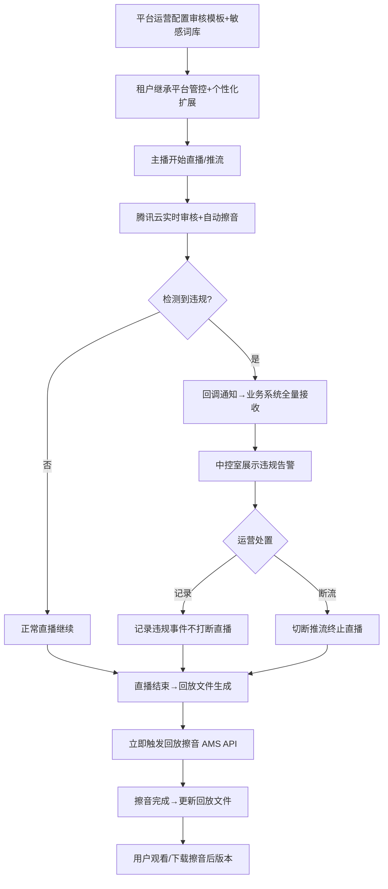
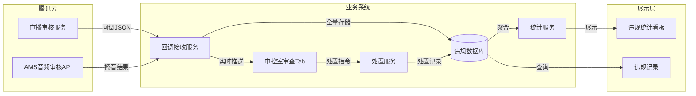
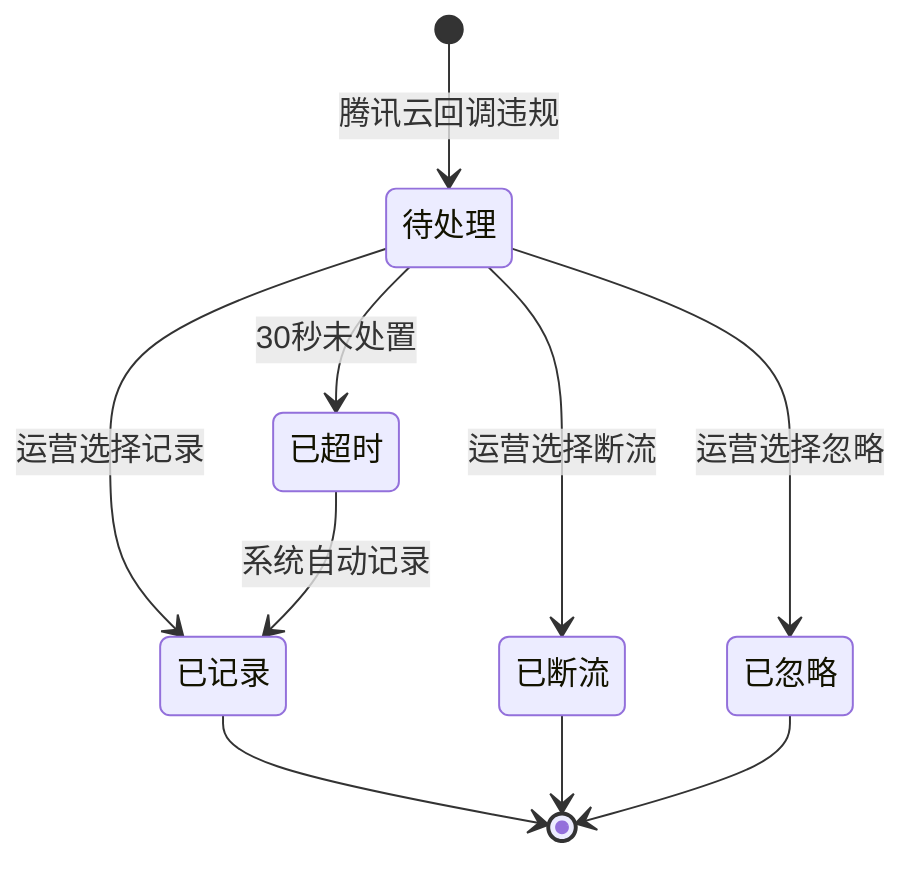
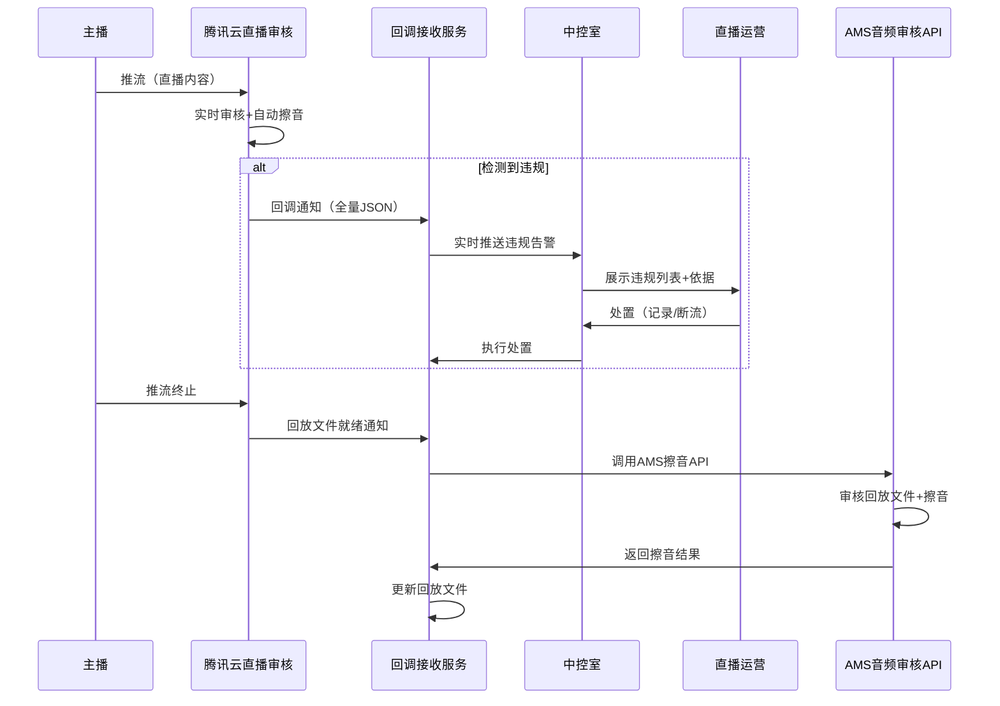
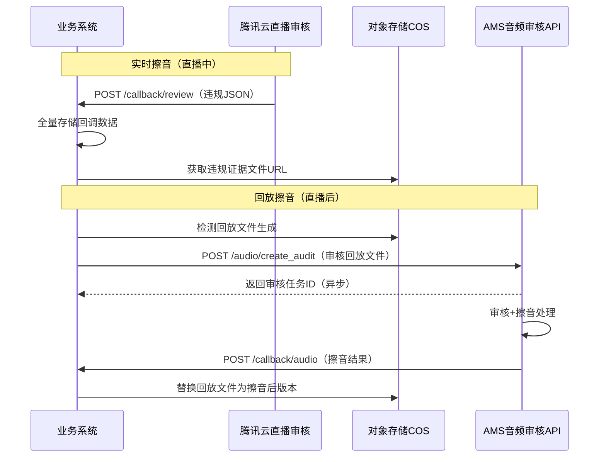

# 内容审查域 产品需求文档 PRD V1.0.0

> **业务域**：内容审查域（D16） | **版本**：V1.0.0 | **日期**：2026-07-22
> **数据来源**：脑暴确认稿（直播内容审查）+ 15域PRD V7.0.0 + 腾讯云直播审核文档
> **追溯链**：UC-AUDIT → FN-AUDIT → PG-AUDIT → SC-AUDIT → BG-AUDIT → BO-AUDIT
> **系统缩写**：SAAS | **终端缩码**：PC（运营后台/租户后台）
> **V7.0.0双态标注**：📗显式照录 + 🟡隐式挖掘还原（附依据链）

---

## 1. 版本历史

| 版本 | 日期 | 变更内容 |
|------|------|----------|
| V1.0.0 | 2026-07-22 | 直播内容审查初始PRD——实时擦音+回放擦音+平台管控+租户个性化；V1配置优先+V2开发增强+V3全面化三版规划 |
| V1.0.1 | 2026-07-22 | 需求核对调整：①FN-001从"审核模板配置"改为"租户审查开关管理"（腾讯云配置台配置，系统只做开关）②FN-003增加擦音模式切换（静音/擦音）③新增FN-AUDIT-APP-001观众APP（擦音效果感知+中控无数据+弹幕过滤+违规断流）④范围明确三终端独立访问路径 |

---

> ### 📝 handoff 回传区（v1.0.0，2026-07-22）
>
> **回传状态**：⏳ 待回传
>
> **handoff执行情况**：
> - Stage 1 对应性校验：✅通过（6FN+3PG+9BTN）
> - Stage 2 代码注入：✅已完成（useCaseCardData+HelpButton+UseCaseDrawer注入3终端）
> - Stage 3 用户审阅：⏳等待用户在原型中审阅【？】用例卡
> - Stage 4 回传BA：⏳待回传（用户审阅后如有变更写入此处）
>
> **回传规则**：
> - 用户审阅后有变更 → 变更写入此处 → 回传BA → 增量重跑需求分析 → 重新/handoff
> - 用户审阅后无变更 → 标记"确认无变更" → 可进入/close
> - 在/close之前，状态始终为"待回传"
>
> **变更记录**：
> （等待用户审阅后填写）

---

## 2. 目录

1. 背景与问题陈述
2. 目标与成功度量
3. 范围
4. 与既有模块关系
5. 业务目标映射
6. 用户故事
7. 五类图
8. 功能需求列表与用例（FN/UC）
9. 业务规则（BR）
10. 数据实体（ENT）
11. 验收标准
12. 指标登记
13. CONFIG集中配置
14. 外部接口标注
15. 需求深度分析摘要

---

## 3. 背景与问题陈述

内容审查域是SAAS平台的**平台级运营管控能力**，针对主播直播内容（音频/视频推流）进行实时审查和擦音处理，确保直播内容符合法律法规要求。

### 核心问题

| 问题编号 | 问题 | 严重程度 |
|----------|------|----------|
| AUDIT-ISSUE-001 | 直播中主播出现违禁词无实时擦音能力 | 🔴 高 |
| AUDIT-ISSUE-002 | 直播回放文件未经擦音处理即开放观看 | 🔴 高 |
| AUDIT-ISSUE-003 | 平台无统一的敏感词库管控机制（风控3件套未实现） | 🔴 高 |
| AUDIT-ISSUE-004 | 租户无法在平台管控基础上个性化扩展审查规则 | 🟡 中 |
| AUDIT-ISSUE-005 | 租户无法向平台申请调整管控力度 | 🟡 中 |
| AUDIT-ISSUE-006 | 违规处置无完整依据记录，难以追溯 | 🟡 中 |

### 需求边界（明确不交叉）

| 管控对象 | 审查内容 | 技术方案 | 本次需求 |
|---|---|---|---|
| 主播直播内容 | 音频/视频流（推流内容） | 腾讯云直播审核+擦音 | ✅ 是 |
| 观众文本消息 | 弹幕/聊天消息 | 腾讯云IM云端审核 | ❌ 否（已有/独立） |

---

## 4. 目标与成功度量

| 目标编号 | 目标 | 度量指标 | 目标值 |
|----------|------|----------|--------|
| BO-AUDIT-01 | 违规内容发现率 | 审查覆盖率 | 100% |
| BO-AUDIT-02 | 实时擦音及时性 | 擦音延迟 | <3秒 |
| BO-AUDIT-03 | 回放擦音完整性 | 回放擦音覆盖率 | 100% |
| BO-AUDIT-04 | 违规处置效率 | 处置响应时间 | <30秒 |
| BO-AUDIT-05 | 平台管控覆盖 | 租户管控继承率 | 100% |

---

## 5. 范围

### In-Scope

**V1 配置优先**：
- ~~腾讯云审核模板配置（控制台配置+自定义敏感词库）~~ → 腾讯云控制台配置，系统不管
- ~~实时擦音（腾讯云音画擦除，推流中自动消音）~~ → 腾讯云自动执行，系统不管
- 运营后台租户内容审查开关管理（为租户开启/关闭审查）
- 回调通知全量接收（开发：接收腾讯云回调+存储+中控室展示）
- 租户后台直播中控室内容审查Tab（提示+列表+处置：记录/断流/忽略+擦音模式切换）
- 回放擦音（开发：回放文件生成后调用AMS API擦音）
- 观众APP直播间（擦音效果感知：静音/擦音两种模式+中控无数据场景模拟+弹幕过滤+违规断流）
- 三终端独立访问路径（运营后台/租户后台/观众APP独立布局独立菜单）

**V2 开发增强**：
- 敏感词库管理（平台级+租户级隔离+腾讯云同步机制）
- 风控规则引擎（违禁词4级匹配+风控等级）
- 审核处置流程（记录→警告→断流→封禁渐进式）
- 风控告警通知（多渠道）
- 违规记录管理（主播历史+场次记录+处置记录）

**V3 全面化**：
- 违规统计看板（违规数/处置数/擦音覆盖率/趋势）
- 平台管控策略下发（基础词库+审查规则）
- 租户继承+个性化扩展（不可降级底线+扩展上限）
- 租户申请降级/升级审批流程
- 内容审核工作流（三级审核+AI辅助+SLA）

### Non-Goals

- 观众文本消息审查（腾讯云IM独立处理）
- 自研直播推流端审查能力（依赖腾讯云）
- 直播弹幕过滤（属于IM范畴）
- 商品/图文内容审核（已有运营域审核工作流，V3集成）

---

## 6. 与既有模块关系

| 关系类型 | 模块 | 依赖内容 | 说明 |
|---|---|---|---|
| **依赖（上游）** | 直播域(D09) | 场次状态机+直播间配置+中控室+回放文件 | 场次状态触发擦音；直播间配置审查开关；中控室展示告警 |
| **依赖（上游）** | 运营域(D13) | 租户管理+风控基础 | 租户管理下发管控策略；风控3件套V2实现 |
| **依赖（上游）** | 租户门户域(D14) | 认证体系+多门店 | 管控策略传递链路；按门店差异化 |
| **依赖（上游）** | 平台域(D12) | Feature Flag+数据隔离 | 灰度发布控制；租户间审查数据隔离 |
| **被依赖（下游）** | 录播域(D10) | 回放文件管理 | 擦音后回放文件管理 |
| **外部依赖** | 腾讯云直播审核 | 审核模板+音画擦除+回调通知 | 实时擦音核心能力 |
| **外部依赖** | 腾讯云AMS | 音频审核API | 回放擦音核心能力 |

---

## 7. 业务目标映射

| BG编号 | 业务目标 | 关联BO | 关联FN | 优先级 |
|---|---|---|---|---|
| BG-AUDIT-01 | 内容合规 | BO-AUDIT-01/02/03 | FN-AUDIT-PC-001~005 | P0 |
| BG-AUDIT-02 | 运营管控 | BO-AUDIT-04 | FN-AUDIT-PC-003/008/009 | P0 |
| BG-AUDIT-03 | 平台管控 | BO-AUDIT-05 | FN-AUDIT-PC-006/012/013/014 | P1 |

---

## 8. 用户故事

| 编号 | 角色 | 故事 |
|---|---|---|
| US-AUDIT-001 | 平台运营 | 作为平台运营，我希望配置腾讯云审核模板和敏感词库，以便平台直播内容被自动审查 |
| US-AUDIT-002 | 直播运营 | 作为直播运营，我希望在中控室看到实时违规告警和完整依据，以便及时处置违规内容 |
| US-AUDIT-003 | 直播运营 | 作为直播运营，我希望对违规内容执行记录或断流处置，以便控制违规影响 |
| US-AUDIT-004 | 租户管理员 | 作为租户，我希望在直播间配置中开启/关闭内容审查，以便控制审查范围 |
| US-AUDIT-005 | 租户管理员 | 作为租户，我希望回放文件自动擦音，以便用户看到的都是合规内容 |
| US-AUDIT-006 | 平台运营 | 作为平台运营，我希望管理平台级敏感词库并同步到腾讯云，以便统一管控 |
| US-AUDIT-007 | 租户管理员 | 作为租户，我希望在平台管控基础上扩展自有敏感词，以便加严审查 |
| US-AUDIT-008 | 租户管理员 | 作为租户，我希望向平台申请降低/提升管控力度，以便适应业务需求 |
| US-AUDIT-009 | 平台运营 | 作为平台运营，我希望查看违规统计看板，以便分析违规趋势和处置效果 |

---

## 9. 五类图

### 9.1 业务流程图

### 9.2 信息流转图

### 9.3 状态机 — 违规处置状态机

**状态过渡操作表**：

| 当前状态 | 触发操作(FN) | 目标状态 | 操作者 | 前置约束 | 后置动作 |
|---|---|---|---|---|---|
| — | FN-AUDIT-PC-002 | 待处理 | 系统(腾讯云回调) | 检测到违规 | 存储违规数据+中控室告警 |
| 待处理 | FN-AUDIT-PC-003 | 已记录 | 直播运营 | 运营查看依据 | 记录违规事件不打断直播 |
| 待处理 | FN-AUDIT-PC-003 | 已断流 | 直播运营 | 运营查看依据 | 切断推流终止直播 |
| 待处理 | FN-AUDIT-PC-003 | 已忽略 | 直播运营 | 运营判断非违规 | 标记忽略+备注理由 |
| 待处理 | 系统超时 | 已超时 | 系统(定时器) | 30秒未处置 | 自动记录+告警升级 |

### 9.4 业务时序图

### 9.5 三方接口时序图

---

## 10. 功能需求列表与用例（FN/UC）

### FN-AUDIT-PC-001 租户内容审查开关管理（V1）

| 字段 | 值 |
|---|---|
| 功能名称 | 租户内容审查开关管理 |
| 功能编号 | FN-AUDIT-PC-001 |
| 所属模块 | 内容审查域 |
| 所属业务系统 | SAAS运营后台 |
| 运行终端 | PC |
| 所属业务流程 | 平台级审查管控 |
| 用户故事 | US-AUDIT-001 |
| 自动化类型 | [手动]操作+[系统自动]生效 |

> **V1调整说明**：审核模板/擦音规则/敏感词库均由腾讯云控制台配置，系统不管理。运营后台只做租户审查开关管理。

**前置条件**：平台运营已登录运营后台+腾讯云审核模板已在控制台配置完成（含敏感词库+擦音规则+推流域名关联）

**基本流程**：
1. [手动] 平台运营进入运营后台→租户审查开关页面
2. [系统自动] 展示租户列表（名称/行业/推流域名/审查开关/状态/今日违规数）
3. [手动] 运营点击租户的审查开关（开启/关闭）
4. [系统自动] 弹出确认弹窗（展示推流域名+开启/关闭影响说明）
5. [手动] 运营确认操作
6. [系统自动] 开关状态更新，该租户直播中控室显示/隐藏内容审查Tab
7. [手动] 运营可点击"进入中控"跳转到该租户的直播中控室

**备选流程**：
- 3a. 关闭审查时提示"平台不可降级类（涉黄/涉暴/公共安全/社会安全/违法乱纪/广告法）仍由腾讯云配置层强制执行"
- 6a. 开启审查后中控室Tab显示，推流时腾讯云自动执行审查+擦音

**数据范围(R/W)**：R: 租户列表 / W: 租户审查开关状态

**后置条件**：租户审查开关生效，中控室内容审查Tab显示/隐藏

**关联UC**：UC-AUDIT-001

---

### FN-AUDIT-PC-002 回调通知全量接收（V1）

| 字段 | 值 |
|---|---|
| 功能名称 | 回调通知全量接收 |
| 功能编号 | FN-AUDIT-PC-002 |
| 自动化类型 | [事件驱动] |

**前置条件**：审核模板已配置+回调地址已设置

**基本流程**：
1. [事件驱动] 腾讯云检测到违规内容
2. [系统自动] 腾讯云发送回调JSON到业务系统回调地址
3. [系统自动] 业务系统全量解析回调数据（基础信息+违规信息+处置建议+证据+擦音信息）
4. [系统自动] 全量存储回调数据到违规数据库（含原始JSON）
5. [系统自动] 实时推送到中控室内容审查Tab
6. [系统自动] 创建违规记录（状态=待处理）

**备选流程**：
- 2a. 回调接收失败 → 腾讯云自动重试（3次）
- 3a. 回调数据解析失败 → 存储原始JSON+标记解析异常

**数据范围(R/W)**：W: 违规记录(ReviewViolation)+回调原始数据

**后置条件**：违规数据全量存储+中控室实时展示告警

**关联UC**：UC-AUDIT-002（中控室违规处置）

---

### FN-AUDIT-PC-003 中控室内容审查Tab（V1）

| 字段 | 值 |
|---|---|
| 功能名称 | 中控室内容审查Tab |
| 功能编号 | FN-AUDIT-PC-003 |
| 自动化类型 | [手动]处置+[系统自动]展示 |

**前置条件**：场次状态为"直播中"+存在违规记录

**基本流程**：
1. [系统自动] 中控室加载内容审查Tab
2. [系统自动] 顶部提示区展示实时告警（红/黄/蓝三级）+当前违规数+审查状态
3. [系统自动] 违规列表区展示违规记录（时间/类型/内容片段/级别/处置建议/处置依据/状态）
4. [手动] 运营点击违规记录查看详情（完整违规数据+回调原始JSON+证据文件）
5. [手动] 运营执行处置操作：
   - a. 记录：记录违规事件，不打断直播，填写处置备注
   - b. 断流：切断推流，终止直播，填写处置理由
   - c. 忽略：标记非违规，填写忽略理由
6. [系统自动] 处置结果更新违规记录状态+记录处置日志
7. [手动] 运营在场次信息栏切换擦音模式（静音/擦音），影响观众APP的擦音效果
   - a. 静音模式：检测到违规→音频直接静音（无声音）
   - b. 擦音模式：检测到违规→敏感词部分用嘀声替换

**备选流程**：
- 5a. 处置超时（30秒未操作）→ 系统自动记录+告警升级通知
- 5b. 断流失败 → 提示错误+记录失败日志

**数据范围(R/W)**：R: 违规记录 / W: 处置记录(ReviewDisposal)

**后置条件**：违规记录状态更新+处置日志记录+告警状态更新

**关联UC**：UC-AUDIT-002（中控室违规处置）

> **内容审查入口点标注**：中控室内容审查Tab是实时审查的核心展示和处置入口——提示+列表+处置（记录/断流），处置依据完整便于判断。

---

### FN-AUDIT-PC-004 回放擦音处理（V1）

| 字段 | 值 |
|---|---|
| 功能名称 | 回放擦音处理 |
| 功能编号 | FN-AUDIT-PC-004 |
| 自动化类型 | [事件驱动]+[系统自动] |

**前置条件**：直播间已开启回放+场次状态从"直播中"转为"回放中"+回放文件已生成

**基本流程**：
1. [事件驱动] 检测到回放文件生成（API-LIV-005回调）
2. [系统自动] 立即触发回放擦音任务（不开放未擦音版本）
3. [系统自动] 调用AMS音频审核API审核回放文件
4. [系统自动] AMS执行擦音处理（敏感词消音）
5. [系统自动] 擦音完成→生成擦音后回放文件
6. [系统自动] 替换原始回放文件为擦音后版本
7. [系统自动] 开放回放观看（用户看到的是擦音后版本）

**备选流程**：
- 3a. AMS API调用失败 → 重试3次→仍失败标记为擦音异常+通知运营
- 4a. 擦音处理超时（30分钟）→ 标记超时+通知运营手动处理
- 6a. 替换文件失败 → 保留原始文件+标记异常+通知运营

**数据范围(R/W)**：R: 回放文件信息 / W: 擦音任务记录+回放文件替换

**后置条件**：回放文件为擦音后版本+用户观看/下载均为擦音后版本

**关联UC**：UC-AUDIT-005（回放擦音）

> **🟡隐式挖掘·依据:回放文件接口API-LIV-005+场次状态机"回放中"状态交叉印证**：回放擦音在"回放中"状态触发，擦音完成后才开放观看。

---

### FN-AUDIT-PC-005 直播间内容审查开关配置（V1）

| 字段 | 值 |
|---|---|
| 功能名称 | 直播间内容审查开关配置 |
| 功能编号 | FN-AUDIT-PC-005 |
| 自动化类型 | [手动]配置 |

**前置条件**：租户管理员已登录租户后台+直播间已创建

**基本流程**：
1. [手动] 租户管理员进入直播间配置页
2. [手动] 在直播能力配置区找到"内容审查"开关
3. [手动] 开启/关闭内容审查
4. [系统自动] 开启后该直播间推流时自动关联审核模板
5. [系统自动] 关闭后该直播间推流时不执行审查（但平台不可降级类仍由腾讯云配置层强制执行）

**备选流程**：
- 4a. 审核模板未配置 → 提示"请联系平台运营配置审核模板"
- 5a. 🟡【隐式挖掘·依据:管控边界6类不可降级+直播间配置开关交叉印证】关闭审查时提示"平台不可降级类（涉黄/涉暴/公共安全/社会安全/违法乱纪/广告法）仍强制执行"

**数据范围(R/W)**：R: 审核模板配置 / W: 直播间审查配置

**后置条件**：直播间审查配置生效

**关联UC**：UC-AUDIT-004（直播间审查配置）

---

### FN-AUDIT-APP-001 观众直播间内容审查感知（V1）

| 字段 | 值 |
|---|---|
| 功能名称 | 观众直播间内容审查感知 |
| 功能编号 | FN-AUDIT-APP-001 |
| 所属模块 | 内容审查域 |
| 所属业务系统 | SAAS平台APP |
| 运行终端 | APP（移动端H5 375px） |
| 所属业务流程 | 观众直播观看 |
| 用户故事 | US-AUDIT-005 |
| 自动化类型 | [事件驱动]+[系统自动] |

**前置条件**：观众已进入直播间+主播正在直播中+内容审查已开启

**基本流程**：
1. [系统自动] 观众进入直播间，展示直播画面+主播信息+弹幕+操作栏
2. [事件驱动] 腾讯云检测到违规内容并执行擦音（静音/擦音，由租户中控室配置）
3. [系统自动] 观众APP感知擦音效果：
   - a. 静音模式：音频直接静音（🔇图标+进度条+画面变暗），持续2-5秒后恢复
   - b. 擦音模式：敏感词部分用嘀声替换（🎧图标+声波动画+"嘀———"），持续2-5秒后恢复
4. [系统自动] 弹幕区域展示违规弹幕过滤标记（灰色斜体"⚠违禁词已过滤"）
5. [事件驱动] 30%概率模拟"中控室尚未收到此违规回调"场景（回调丢失提示）
6. [事件驱动] 主播被断流处置时，观众APP显示"直播已结束，该直播因内容违规已被终止"
7. [手动] 观众可查看商品弹出层（不影响审查感知）

**备选流程**：
- 2a. 擦音模式由租户中控室配置，通过localStorage同步到观众APP
- 5a. 中控无数据时提示"⚠中控室尚未收到此违规回调"（橙色警告样式）
- 6a. 断流后音频停止，直播画面变为结束覆盖层

**数据范围(R/W)**：R: 擦音模式(localStorage) / W: 无（观众APP只感知不写入）

**后置条件**：观众感知到擦音效果+违规弹幕被过滤+断流时看到结束提示

**关联UC**：UC-AUDIT-005

> **擦音模式说明**：静音模式=音频直接静音（无声音）；擦音模式=敏感词部分用1000Hz嘀声替换，其他声音正常。两种模式由租户中控室配置，观众APP通过localStorage读取。

---

### FN-AUDIT-PC-006 敏感词库管理（V2）

| 字段 | 值 |
|---|---|
| 功能名称 | 敏感词库管理（平台级+租户级隔离+同步机制） |
| 功能编号 | FN-AUDIT-PC-006 |
| 自动化类型 | [手动]管理+[系统自动]同步 |

**前置条件**：V2风控规则引擎已部署+腾讯云API已对接

**基本流程**：

**平台级词库管理（平台运营）**：
1. [手动] 平台运营进入内容审查→敏感词库管理
2. [手动] 管理6类不可降级词库（涉黄/涉暴/公共安全/社会安全/违法乱纪/广告法）——增删改查
3. [手动] 管理平台基础词库（可降级类）——增删改查
4. [系统自动] 词库变更后同步到腾讯云（调用腾讯云API更新自定义敏感词库）
5. [系统自动] 同步到所有租户的腾讯云配置（按推流域名关联）

**租户级词库管理（租户管理员）**：
1. [手动] 租户管理员进入租户后台→内容审查→敏感词库
2. [系统自动] 展示继承的平台词库（只读，标注"平台继承"）
3. [手动] 新增租户扩展词库（在平台基础上增加，不可减少不可降级类）
4. [手动] 新增租户个性化词库（租户自定义）
5. [系统自动] 租户词库合并（生效词库=平台不可降级∪平台基础∪租户扩展∪租户个性化）
6. [系统自动] 生效词库同步到腾讯云（按该租户推流域名关联）

**备选流程**：
- 平台4a. 同步腾讯云失败 → 重试3次→仍失败通知运营
- 租户3a. 尝试减少不可降级类 → 禁止操作+提示"不可降级类不可修改"

**数据范围(R/W)**：R: 平台词库 / W: 租户词库+腾讯云配置

**后置条件**：生效词库同步到腾讯云+按租户推流域名隔离

**关联UC**：UC-AUDIT-006/007

> **租户隔离机制**：腾讯云支持按推流域名关联不同审核模板+不同敏感词库。每个租户推流域名关联该租户生效词库。平台词库变更→同步所有租户；租户词库变更→只同步该租户。

---

### FN-AUDIT-PC-007 风控规则引擎（V2）

| 字段 | 值 |
|---|---|
| 功能名称 | 风控规则引擎（违禁词4级匹配+风控等级） |
| 功能编号 | FN-AUDIT-PC-007 |
| 自动化类型 | [手动]配置+[系统自动]执行 |

**前置条件**：敏感词库已配置+V2已部署

**基本流程**：
1. [手动] 平台运营进入风控规则引擎配置
2. [手动] 配置违禁词4级匹配规则：
   - L1核心违禁词：精准匹配+语义匹配+变体词全量拦截
   - L2高危违禁词：精准匹配+模糊匹配+谐音变体词拦截
   - L3中危违禁词：精准匹配+语义匹配+变体词全量拦截
   - L4低危违禁词：精准匹配，仅预警不拦截
3. [手动] 配置风控等级（4级风险等级定义）
4. [手动] 配置处置动作映射（拦截/验证码/警告/限制/记录）
5. [系统自动] 规则生效，直播内容审查按规则执行

**数据范围(R/W)**：R: 敏感词库 / W: 风控规则配置

**后置条件**：风控规则生效+审查按规则执行

**关联UC**：UC-AUDIT-001

---

### FN-AUDIT-PC-008 审核处置流程（V2）

| 字段 | 值 |
|---|---|
| 功能名称 | 审核处置流程（记录→警告→断流→封禁渐进式） |
| 功能编号 | FN-AUDIT-PC-008 |
| 自动化类型 | [手动]+[系统自动] |

**前置条件**：违规记录已存在+V2已部署

**基本流程**：
1. [系统自动] 系统按违规级别推荐处置策略
2. [手动] 运营确认或调整处置策略：
   - L4低危→记录（不打断直播）
   - L3中危→警告（通知主播+中控室提示）
   - L2高危→断流（切断推流+终止直播）
   - L1核心→断流+封禁主播（终止直播+标记主播违规）
3. [系统自动] 执行处置+记录处置日志
4. [系统自动] 处置结果通知相关方（运营/主播/租户管理员）

**备选流程**：
- 2a. 运营选择更高级别处置 → 允许（可加严不可放宽）
- 2b. 运营选择更低级别处置 → 需填写降级理由

**数据范围(R/W)**：R: 违规记录 / W: 处置记录

**后置条件**：处置执行+日志记录+通知发送

**关联UC**：UC-AUDIT-002

---

### FN-AUDIT-PC-009 风控告警通知（V2）

| 字段 | 值 |
|---|---|
| 功能名称 | 风控告警通知 |
| 功能编号 | FN-AUDIT-PC-009 |
| 自动化类型 | [事件驱动] |

**前置条件**：风控规则引擎已生效

**基本流程**：
1. [事件驱动] 高优先级违规事件触发（L1/L2级）
2. [系统自动] 多渠道通知：短信+邮件+企业微信+APP推送
3. [系统自动] 通知内容含违规详情+处置建议+证据链接
4. [手动] 运营处理告警
5. [系统自动] 告警关闭

**数据范围(R/W)**：R: 违规记录 / W: 告警记录

**后置条件**：告警通知发送+运营知晓

---

### FN-AUDIT-PC-010 违规记录管理（V2）

| 字段 | 值 |
|---|---|
| 功能名称 | 违规记录管理（主播历史+场次记录+处置记录） |
| 功能编号 | FN-AUDIT-PC-010 |
| 自动化类型 | [手动]查询+[系统自动]归档 |

**前置条件**：违规记录已存在

**基本流程**：
1. [手动] 运营/租户管理员进入违规记录管理
2. [手动] 按条件查询（主播/场次/时间范围/违规类型/处置状态）
3. [系统自动] 展示违规记录列表+处置记录+证据
4. [手动] 查看详情（完整违规数据+回调原始JSON+处置日志）
5. [手动] 导出违规报告

**数据范围(R/W)**：R: 违规记录+处置记录

**后置条件**：违规记录可追溯

---

### FN-AUDIT-PC-011 违规统计看板（V3）

| 字段 | 值 |
|---|---|
| 功能名称 | 违规统计看板 |
| 功能编号 | FN-AUDIT-PC-011 |
| 自动化类型 | [系统自动] |

**前置条件**：V3已部署+违规数据已积累

**基本流程**：
1. [系统自动] 看板加载实时数据
2. [系统自动] 展示统计指标：违规消息数/处置数/擦音覆盖率/违规趋势/TOP风险类型
3. [手动] 运营下钻查看详情
4. [手动] 按时间范围/租户/主播筛选

**数据范围(R/W)**：R: 违规记录+处置记录

**后置条件**：运营掌握违规趋势和处置效果

---

### FN-AUDIT-PC-012 平台管控策略下发（V3）

| 字段 | 值 |
|---|---|
| 功能名称 | 平台管控策略下发 |
| 功能编号 | FN-AUDIT-PC-012 |
| 自动化类型 | [手动]配置+[系统自动]下发 |

**前置条件**：V3已部署+租户体系已建立

**基本流程**：
1. [手动] 平台运营配置基础管控策略（基础敏感词库+基础审查规则+基础处置策略）
2. [系统自动] 策略下发到所有租户
3. [系统自动] 租户继承平台基础管控
4. [系统自动] Feature Flag控制灰度发布（0%→5%→10%→25%→50%→100%）

**数据范围(R/W)**：W: 管控策略配置

**后置条件**：所有租户继承平台基础管控

---

### FN-AUDIT-PC-013 租户继承+个性化扩展（V3）

| 字段 | 值 |
|---|---|
| 功能名称 | 租户继承+个性化扩展 |
| 功能编号 | FN-AUDIT-PC-013 |
| 自动化类型 | [手动]配置 |

**前置条件**：平台管控策略已下发

**基本流程**：
1. [手动] 租户管理员查看继承的平台管控（只读）
2. [手动] 租户新增扩展词库（在不可降级类基础上增加）
3. [手动] 租户加严审查规则（提高频率/降低阈值，不可低于平台基础）
4. [手动] 租户加严处置策略（在平台基础上加严，不可放宽）
5. [系统自动] 生效词库合并+同步到腾讯云

**备选流程**：
- 3a. 尝试放宽审查规则 → 禁止+提示"不可低于平台基础"

**数据范围(R/W)**：R: 平台管控策略 / W: 租户个性化配置

**后置条件**：租户生效词库更新+腾讯云同步

---

### FN-AUDIT-PC-014 租户申请降级/升级审批（V3）

| 字段 | 值 |
|---|---|
| 功能名称 | 租户申请降级/升级审批 |
| 功能编号 | FN-AUDIT-PC-014 |
| 自动化类型 | [手动]申请+[手动]审批 |

**前置条件**：V3已部署+租户已继承平台管控

**基本流程**：
1. [手动] 租户管理员提交降级/升级申请（选择词库类别+目标级别+申请理由）
2. [系统自动] 申请提交到平台运营审批队列
3. [手动] 平台运营审批（通过/驳回+审批意见）
4. [系统自动] 通过→生效到租户腾讯云配置；驳回→通知租户+说明理由

**备选流程**：
- 1a. 申请降级不可降级类 → 禁止提交+提示"该类别不可申请降级"

**数据范围(R/W)**：W: 降级申请(DowngradeRequest)

**后置条件**：审批结果生效+通知发送

---

### FN-AUDIT-PC-015 内容审核工作流（V3）

| 字段 | 值 |
|---|---|
| 功能名称 | 内容审核工作流（三级审核+AI辅助+SLA） |
| 功能编号 | FN-AUDIT-PC-015 |
| 自动化类型 | [系统自动]+[手动] |

**前置条件**：V3已部署

**基本流程**：
1. [系统自动] 违规内容进入审核工作流
2. [系统自动] L1初审（AI自动审核+初级审核员）——SLA: 30分钟
3. [系统自动] L1通过→已通过；L1不通过→已驳回；L1不确定→L2复审
4. [手动] L2复审（高级审核员）——SLA: 2小时
5. [手动] L2通过→已通过；L2不通过→已驳回；L2重大违规→L3终审
6. [手动] L3终审（审核主管）——SLA: 24小时
7. [系统自动] 超时自动升级到下一级

**数据范围(R/W)**：R: 违规记录 / W: 审核记录

**后置条件**：审核结果记录+通知发送

---

## 11. 业务规则（BR）

| 编号 | 规则 |
|---|---|
| BR-AUDIT-001 | 6类不可降级规则：涉黄/涉暴/公共安全/社会安全/违法乱纪/广告法为平台绝对不可降级类，租户不可修改、不可申请降级 |
| BR-AUDIT-002 | 生效词库并集规则：生效词库=平台不可降级类∪平台基础词库∪租户扩展词库∪租户个性化词库（并集，租户只能增加不能减少不可降级类） |
| BR-AUDIT-003 | 处置渐进式规则：L4低危→记录；L3中危→警告；L2高危→断流；L1核心→断流+封禁。运营可加严不可放宽 |
| BR-AUDIT-004 | 回放擦音时机规则：回放文件生成后立即擦音，擦音完成后才开放回放观看，用户不会看到未擦音版本 |
| BR-AUDIT-005 | 回调全量接收规则：腾讯云回调数据全量接收+全量存储（含原始JSON），不截断不筛选 |
| BR-AUDIT-006 | 词库同步规则：平台词库变更→同步到所有租户腾讯云配置；租户词库变更→只同步到该租户腾讯云配置 |
| BR-AUDIT-007 | 租户隔离规则：每个租户推流域名关联该租户生效词库，租户间审查数据隔离 |
| BR-AUDIT-008 | 场次状态机联动规则："直播中"状态触发实时擦音；"回放中"状态触发回放擦音 |
| BR-AUDIT-009 | 告警分级规则：L1核心→红色告警；L2高危→红色告警；L3中危→黄色告警；L4低危→蓝色提示 |
| BR-AUDIT-010 | 处置依据完整规则：每条违规处置必须附完整依据链（违规数据+回调原始JSON+证据文件URL），便于判断和追溯 |
| BR-AUDIT-011 | 处置超时规则：违规告警30秒未处置→系统自动记录+告警升级通知 |
| BR-AUDIT-012 | 🟡【隐式挖掘·依据:管控边界6类不可降级+直播间配置开关交叉印证】关闭审查底线规则：租户关闭内容审查时，平台不可降级类仍由腾讯云配置层强制执行 |

---

## 12. 数据实体（ENT）

### ENT-AUDIT-001 内容审查任务(ContentReviewTask)

| 字段 | 类型 | 说明 |
|---|---|---|
| task_id | String | 任务ID |
| session_id | String | 关联场次ID（FN-LIV-003） |
| stream_id | String | 推流ID |
| review_type | Enum | 实时/回放 |
| status | Enum | 待执行/执行中/已完成/异常 |
| created_at | DateTime | 创建时间 |
| completed_at | DateTime | 完成时间 |

### ENT-AUDIT-002 违规记录(ReviewViolation)

| 字段 | 类型 | 说明 |
|---|---|---|
| violation_id | String | 违规ID |
| task_id | String | 关联审查任务 |
| stream_id | String | 推流ID |
| audit_type | Enum | 音频/视频/截图 |
| violation_type | Enum | 涉黄/涉暴/违禁词/广告法... |
| violation_level | Enum | 高/中/低 |
| violation_content | String | 违规内容片段URL |
| violation_time | DateTime | 违规发生时间 |
| suggestion | Enum | pass/review/block |
| confidence | Integer | 置信度(0-100) |
| keyword | String | 命中敏感词 |
| keyword_category | String | 敏感词分类 |
| evidence_url | String | 证据文件URL |
| raw_callback | Text | 回调原始JSON（全量） |
| audio_muted | Boolean | 是否已擦音 |
| mute_duration | Integer | 擦音时长(秒) |
| mute_start_time | DateTime | 擦音起始时间 |
| disposal_status | Enum | 待处理/已记录/已断流/已忽略/已超时 |
| created_at | DateTime | 记录时间 |

### ENT-AUDIT-003 处置记录(ReviewDisposal)

| 字段 | 类型 | 说明 |
|---|---|---|
| disposal_id | String | 处置ID |
| violation_id | String | 关联违规ID |
| disposal_type | Enum | 记录/断流/忽略/自动记录 |
| disposal_reason | Text | 处置理由 |
| operator | String | 处置人 |
| operated_at | DateTime | 处置时间 |
| disposal_result | Text | 处置结果 |

### ENT-AUDIT-004 敏感词库(KeywordLibrary)

| 字段 | 类型 | 说明 |
|---|---|---|
| keyword_id | String | 敏感词ID |
| keyword | String | 敏感词内容 |
| category | Enum | 涉黄/涉暴/公共安全/社会安全/违法乱纪/广告法/自定义 |
| level | Enum | L1核心/L2高危/L3中危/L4低危 |
| match_type | Enum | 精准/模糊/语义/变体词 |
| is_degradable | Boolean | 是否可降级（6类不可降级=false） |
| scope | Enum | 平台/租户 |
| tenant_id | String | 租户ID（scope=租户时） |
| status | Enum | 启用/禁用 |

### ENT-AUDIT-005 租户词库配置(TenantKeywordConfig)

| 字段 | 类型 | 说明 |
|---|---|---|
| config_id | String | 配置ID |
| tenant_id | String | 租户ID |
| inherited_platform_lib | Text | 继承的平台词库（只读快照） |
| extended_lib | Text | 租户扩展词库 |
| personalized_lib | Text | 租户个性化词库 |
| effective_lib | Text | 生效词库（并集） |
| tencent_config_id | String | 腾讯云配置ID |
| last_synced_at | DateTime | 最后同步时间 |

### ENT-AUDIT-006 降级申请(DowngradeRequest)

| 字段 | 类型 | 说明 |
|---|---|---|
| request_id | String | 申请ID |
| tenant_id | String | 租户ID |
| request_type | Enum | 降级/升级 |
| target_category | Enum | 目标词库类别 |
| target_level | Enum | 目标级别 |
| reason | Text | 申请理由 |
| status | Enum | 待审批/通过/驳回 |
| approver | String | 审批人 |
| approved_at | DateTime | 审批时间 |
| approval_comment | Text | 审批意见 |

---

## 13. 验收标准

### 场景级验收标准

| 编号 | 场景 | Given-When-Then |
|---|---|---|
| SC-AUDIT-001 | 实时擦音 | Given主播推流中 When腾讯云检测到违禁词 Then自动擦音+回调通知+中控室告警 |
| SC-AUDIT-002 | 中控室处置 | Given中控室有违规告警 When运营选择断流 Then推流切断+直播终止+处置记录 |
| SC-AUDIT-003 | 回放擦音 | Given回放文件生成 When系统检测到 Then立即擦音+完成后开放观看 |
| SC-AUDIT-004 | 敏感词库同步 | Given平台词库变更 When同步触发 Then所有租户腾讯云配置更新 |
| SC-AUDIT-005 | 租户个性化 | Given租户新增敏感词 When保存配置 Then生效词库合并+同步腾讯云 |
| SC-AUDIT-006 | 降级申请 | Given租户提交降级申请 When平台审批通过 Then租户配置生效 |

### 功能级验收矩阵

| FN | Given | When | Then |
|---|---|---|---|
| FN-AUDIT-PC-001 | 平台运营登录 | 配置审核模板 | 模板生效+推流自动审查 |
| FN-AUDIT-PC-002 | 审核模板生效 | 腾讯云发送回调 | 全量接收+存储+中控室展示 |
| FN-AUDIT-PC-003 | 中控室有告警 | 运营处置 | 处置执行+日志记录 |
| FN-AUDIT-PC-004 | 回放文件生成 | 系统检测到 | 立即擦音+完成后开放 |
| FN-AUDIT-PC-005 | 租户配置直播间 | 开启审查 | 推流关联审核模板 |
| FN-AUDIT-PC-006 | V2已部署 | 管理词库 | 平台↔腾讯云同步+租户隔离 |
| FN-AUDIT-PC-014 | V3已部署 | 租户申请降级 | 提交→审批→生效 |

---

## 14. 指标登记

| 指标编号 | 指标名 | 定义 | 来源 | 关联BG |
|---|---|---|---|---|
| METRIC-AUDIT-001 | 违规发现率 | 违规发现数/实际违规数 | 腾讯云回调+人工抽检 | BG-AUDIT-01 |
| METRIC-AUDIT-002 | 擦音延迟 | 从违规发生到擦音完成的时间 | 腾讯云回调时间戳 | BG-AUDIT-01 |
| METRIC-AUDIT-003 | 回放擦音覆盖率 | 已擦音回放数/总回放数 | 擦音任务记录 | BG-AUDIT-01 |
| METRIC-AUDIT-004 | 处置响应时间 | 从告警到处置完成的时间 | 违规记录+处置记录 | BG-AUDIT-02 |
| METRIC-AUDIT-005 | 租户管控继承率 | 已继承平台管控的租户数/总租户数 | 租户词库配置 | BG-AUDIT-03 |
| METRIC-AUDIT-006 | 违规趋势 | 每日/周/月违规数变化 | 违规记录聚合 | BG-AUDIT-02 |

---

## 15. CONFIG集中配置

| 编号 | 配置项 | 类型 | 默认值 | 说明 |
|---|---|---|---|---|
| CONFIG-AUDIT-001 | 内容审查开关 | 全局开关 | true | 平台级内容审查总开关 |
| CONFIG-AUDIT-002 | 擦音模式 | 枚举 | 自动 | 自动(腾讯云擦音)/手动(仅告警不擦音) |
| CONFIG-AUDIT-003 | 告警分级阈值 | 规则 | L1红/L2红/L3黄/L4蓝 | 违规级别→告警颜色映射 |
| CONFIG-AUDIT-004 | 处置策略映射 | 规则 | L4记录/L3警告/L2断流/L1断流+封禁 | 违规级别→处置策略映射 |
| CONFIG-AUDIT-005 | 词库同步频率 | 全局参数 | 实时 | 词库变更后同步到腾讯云的频率 |
| CONFIG-AUDIT-006 | 灰度发布比例 | 全局参数 | 0% | Feature Flag控制灰度比例(0→5→10→25→50→100%) |
| CONFIG-AUDIT-007 | 回放擦音超时 | 全局参数 | 30分钟 | 回放擦音处理超时时间 |
| CONFIG-AUDIT-008 | 置信度阈值 | 规则 | 60 | 腾讯云回调置信度低于此值标记为"需人工复核" |

---

## 16. 外部接口标注

| 接口编号 | 接口名 | 方向 | 对端 | 说明 |
|---|---|---|---|---|
| API-AUDIT-001 | 直播审核回调 | 腾讯云→业务系统 | 腾讯云直播审核 | POST /callback/review（全量JSON） |
| API-AUDIT-002 | 审核模板配置 | 业务系统→腾讯云 | 腾讯云直播审核 | 配置审核模板+关联推流域名 |
| API-AUDIT-003 | 敏感词库同步 | 业务系统→腾讯云 | 腾讯云直播审核 | 更新自定义敏感词库 |
| API-AUDIT-004 | AMS音频审核 | 业务系统→腾讯云 | 腾讯云AMS | POST /audio/create_audit（回放擦音） |
| API-AUDIT-005 | AMS擦音回调 | 腾讯云→业务系统 | 腾讯云AMS | POST /callback/audio（擦音结果） |
| API-AUDIT-006 | 回放文件通知 | 直播域→内容审查 | 直播域API-LIV-005 | 回放文件生成通知（触发擦音） |
| API-AUDIT-007 | 断流指令 | 内容审查→直播域 | 直播域 | 切断推流（处置操作） |

---

## 17. 需求深度分析摘要

### V7.0.0场景深度还原统计

| 维度 | 数量 | 说明 |
|---|---|---|
| 📗显式照录 | 15处 | 脑暴确认稿明确描述的需求 |
| 🟡隐式挖掘 | 5处 | 基于脑暴确认稿≥2处交叉印证挖掘的隐含需求 |
| 入口点 | 22个 | 来自15域PRD V7.0.0学习（直播8+录播4+运营3+租户门户3+平台3+APP1） |
| FN | 15个 | V1(5)+V2(5)+V3(5) |
| BR | 12条 | 含1条🟡隐式挖掘 |
| ENT | 6个 | 审查任务+违规+处置+词库+租户配置+降级申请 |
| CONFIG | 8项 | 开关/模式/阈值/策略/频率/灰度/超时 |
| METRIC | 6项 | 发现率/延迟/覆盖率/响应/继承率/趋势 |

### 版本规划摘要

| 版本 | 周期 | FN数 | 核心能力 |
|---|---|---|---|
| V1 | 1-2周 | 5 | 配置优先：腾讯云配置+回调接收+中控室+回放擦音+开关 |
| V2 | 3-4周 | 5 | 开发增强：词库同步+风控引擎+处置流程+告警+违规记录 |
| V3 | 4-6周 | 5 | 全面化：统计看板+平台管控+租户继承+申请审批+审核工作流 |
