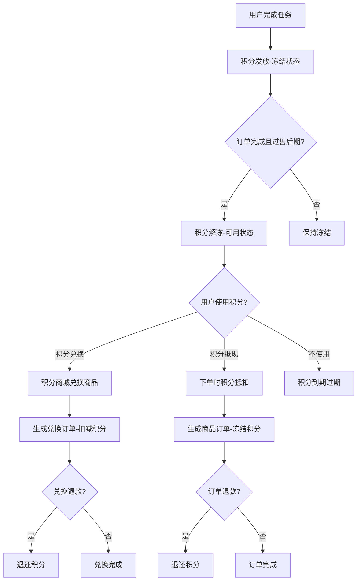
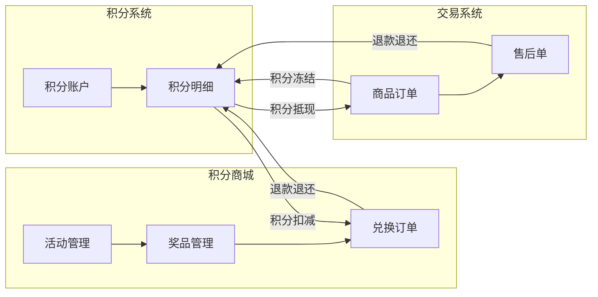
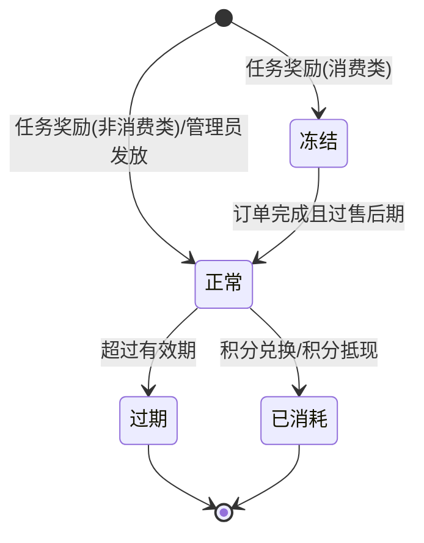
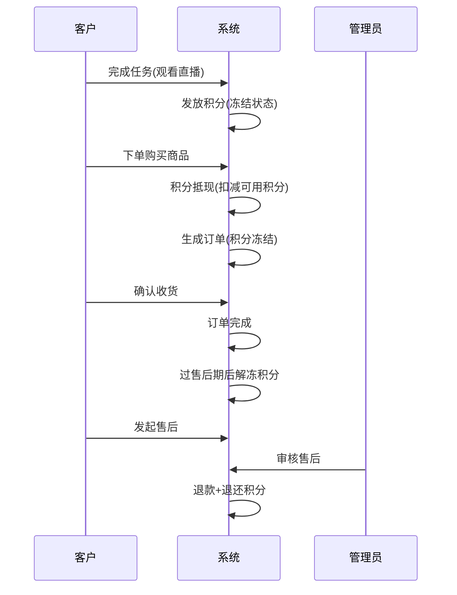

# SAAS-超级需求文档-PRD-v1.0.0

> **doc_id**: REQ-SAAS-超级需求文档-PRD-v1.0.0  
> **doc_type**: requirement  
> **source**: learn-project v6.0.0 忠实还原  
> **based_on**: SAAS原型文档/V1.0.9（Axure导出HTML，40页面）  
> **还原日期**: 2026-07-17  
> **忠实还原声明**: 本文档由 learn-project v6.0.0 忠实还原生成，照录不删/不纠/不推测

---

## §1 版本历史

| 版本 | 日期 | 变更内容 | 变更人 |
|------|------|---------|--------|
| v1.0.0 | 2026-07-17 | 忠实还原SAAS原型V1.0.9（40页面） | learn-project |

---

## §2 目录

1. 版本历史  
2. 目录  
3. 背景与问题陈述  
4. 目标与成功度量  
5. 范围  
6. 与既有模块关系  
7. 业务目标映射(BO/BG)  
8. 用户故事  
9. 功能需求列表与用例(FN/UC)  
10. 业务规则(BR)  
11. 集中配置清单(CONFIG)  
12. 数据实体(ENT)  
13. 统计指标清单(METRIC)  
14. 验收标准  
15. 五类图  
16. 外部接口标注  
17. 需求深度分析摘要  

---

## §3 背景与问题陈述

**原文照录（积分系统.html）**：

系统范围：在SAAS系统中，积分的作用范围，以**项目**为边界。任何积分内容，不允许超出**项目**的管控范围。举例：用户A，同时存在于两个**项目**下。在不同的**项目**下，积分数据要以**项目**为维度进行隔离。**不允许跨项目使用积分**。

身份限定：积分系统所面对的用户群体，只是**客户**，不涉及其它身份。如果一个人有多个身份，例如既是客户，又是店员。积分只在**客户**身份下进行操作以及管理。

积分管理：由**项目**进行统一管理。

---

## §4 目标与成功度量

> ⬜ 原型未提供明确的目标与成功度量

---

## §5 范围

### In-Scope
- 积分系统基础管理（积分账户/明细/操作）
- 积分规则配置（通用规则/兑换规则/抵现规则/任务设置）
- 积分商城（活动管理/分类/奖品管理）
- 积分兑换与下单（兑换流程/下单/抵现）
- 订单管理（商品订单列表/详情/明细）
- 售后管理（售后订单/详情/发起售后）
- 客户管理（客户列表/门店设置）
- 用户端APP（我的积分/我的订单/消息通知）
- 系统管理（操作日志/修订记录）

### Non-Goals
> ⬜ 原型未提供明确的Non-Goals

---

## §6 与既有模块关系

> ⬜ 原型未提供

---

## §7 业务目标映射(BO/BG)

> ⬜ 原型未提供

---

## §8 用户故事

### US-001: 积分获取
作为客户，我希望通过完成任务（观看直播/点赞/分享/下单/购买商品）获取积分，以便在积分商城兑换商品或下单时抵现。

### US-002: 积分兑换
作为客户，我希望在积分商城浏览活动、选择奖品、用积分兑换商品，以便获得额外福利。

### US-003: 积分抵现
作为客户，我希望下单时使用积分抵扣部分金额，以便节省消费成本。

### US-004: 积分退还
作为客户，我希望订单退款后积分能自动退还，以便不损失积分。

### US-005: 积分规则配置
作为管理员，我希望配置积分通用规则/兑换规则/抵现规则/任务，以便管控积分发放和使用。

### US-006: 积分商城活动管理
作为管理员，我希望创建/编辑积分商城活动、添加奖品、设置分类，以便运营积分商城。

### US-007: 积分统计查询
作为管理员，我希望查看全局积分统计和明细，以便监控积分发放和消耗情况。

### US-008: 订单与售后管理
作为管理员，我希望查看订单列表/详情、处理售后退款，以便管理交易全流程。

---

## §9 功能需求列表与用例(FN/UC)

### §9.1 运营平台（PC端）

#### FN-OPS-PC-001 积分系统说明
- **用例编号**: UC-OPS-PC-001-01
- **功能名称**: 积分系统说明
- **所属模块**: 积分系统
- **所属业务系统**: 运营平台
- **运行终端**: PC端
- **信息密度**: 低
- **所属业务流程**: 积分系统初始化
- **用户故事**: US-001
- **前置条件**: 无
- **主要操作流**:
  1. [手动] 管理员进入积分系统页面
  2. [系统自动] 展示系统说明文字（系统范围/身份限定/积分管理）
- **次要操作流**: 无
- **异常**: 无
- **后置条件**: 无
- **关联UC**: 无

#### FN-OPS-PC-002 积分管理-查询积分明细
- **用例编号**: UC-OPS-PC-002-01
- **功能名称**: 查询客户积分明细
- **所属模块**: 积分管理
- **所属业务系统**: 运营平台
- **运行终端**: PC端
- **信息密度**: 高
- **所属业务流程**: SC-007 积分统计与查询
- **用户故事**: US-007
- **前置条件**: 已选中客户
- **主要操作流**:
  1. [系统自动] 展示统计卡片：用户可用积分、用户冻结积分、累计发放积分、累计消耗积分、累计过期积分
  2. [手动] 管理员选择筛选条件：积分变化事件（发放积分/消耗积分）、类型（正常/冻结/过期）、操作时间（日期范围）、积分状态（首次直播观看/首次直播点赞/首次直播分享/观看时长/完成订单/购买商品/累计消费/购买指定商品/积分兑换--扣除/积分兑换--返还/积分抵现--扣除/积分抵现--返还/管理员发放/管理员扣除/支付有礼-发放/支付有礼-返还）
  3. [手动] 点击"查询"按钮
  4. [系统自动] 按操作时间倒序展示积分明细列表
- **列表列名**: 积分变化事件、变动原因、类型、操作时间、有效期、积分状态、积分变化明细、关联订单号
- **次要操作流**: 点击"重置"清空筛选条件
- **异常**: 无数据时显示空状态
- **后置条件**: 无
- **关联UC**: UC-OPS-PC-002-02

#### FN-OPS-PC-003 积分管理-积分操作
- **用例编号**: UC-OPS-PC-002-02
- **功能名称**: 手动发放/扣减积分
- **所属模块**: 积分管理
- **所属业务系统**: 运营平台
- **运行终端**: PC端
- **信息密度**: 中
- **所属业务流程**: SC-007
- **用户故事**: US-005
- **前置条件**: 已选中客户，积分系统已开启
- **主要操作流**:
  1. [手动] 点击"积分操作"按钮
  2. [系统自动] 弹出积分操作弹窗
  3. [手动] 选择操作类型：发放积分/扣减积分
  4. [手动] 输入积分数量（提示"当前最多可扣减XXXX积分"）
  5. [手动] 点击"确认"
  6. [系统自动] 更新客户积分
- **次要操作流**: 点击"取消"关闭弹窗
- **异常**: 扣减积分超过可用余额时提示错误
- **后置条件**: 积分明细新增一条记录（管理员发放/管理员扣除）
- **关联UC**: UC-OPS-PC-002-01

#### FN-OPS-PC-004 积分设置-总览
- **用例编号**: UC-OPS-PC-004-01
- **功能名称**: 积分设置总览
- **所属模块**: 积分设置
- **所属业务系统**: 运营平台
- **运行终端**: PC端
- **信息密度**: 中
- **所属业务流程**: SC-005 积分规则配置
- **用户故事**: US-005
- **前置条件**: 无
- **主要操作流**:
  1. [系统自动] 展示积分设置总览页面，含5个Tab：用户积分、积分通用规则、积分兑换规则、积分抵现规则、积分商城
  2. [系统自动] 展示当前积分系统状态（开启/停用）
  3. [手动] 点击"开启"或"停用"按钮切换积分系统状态
- **停用影响（原文照录）**: 1.所有积分获取任务将全部失效 2.用户端所有积分相关入口将全部隐藏 3.用户现有积分将全部无法查看
- **开启影响（原文照录）**: 1.用户完成任务后获得积分 2.用户个人中心展示【我的积分】入口 3.重新启用保留历史积分 4.历史积分有效期将在重启后立即更新过期状态
- **积分通用规则列表列名**: 规则名称、规则详情、更新时间、更新人
  - 积分有效期：永久有效
  - 积分每日上限：每个客户每天最多获取X积分，消费任务不受影响
  - 积分保护期：订单未结算前进入保护期，订单完成后解冻
  - 积分到期提醒：每月1号提醒未来30天内即将到期的积分
  - 消费解冻积分时机：订单完成且过了售后期
- **积分抵现规则列表列名**: 规则名称、规则详情、更新时间、更新人
  - 积分抵现：开启
  - 抵现比例：100积分=1元
  - 抵扣规则：订单金额门槛不限制；抵现金额上限不限制；适用商品全部商品
  - 下单默认选中积分抵现：是
  - 积分商城退款时：退还积分
  - 积分抵扣订单分佣：不参与分佣
- **积分兑换规则列表列名**: 规则名称、规则详情、更新时间、更新人
  - 积分兑换入口：开启
  - 积分商城订单退款：退还积分
  - 积分兑换订单分佣：不参与分佣
- **次要操作流**: 点击"开始设置"进入对应规则设置页面
- **异常**: 无
- **后置条件**: 无
- **关联UC**: UC-OPS-PC-005-01, UC-OPS-PC-006-01, UC-OPS-PC-007-01

#### FN-OPS-PC-005 积分通用规则设置
- **用例编号**: UC-OPS-PC-005-01
- **功能名称**: 配置积分通用规则
- **所属模块**: 积分设置
- **所属业务系统**: 运营平台
- **运行终端**: PC端
- **信息密度**: 高
- **所属业务流程**: SC-005
- **用户故事**: US-005
- **前置条件**: 进入积分通用规则设置页面
- **主要操作流**:
  1. [手动] 输入积分自定义名称（默认"积分"，不能超过5个字）
  2. [手动] 选择积分有效期：从获得后X天内有效（输入天数）
  3. [手动] 选择积分每日上限：无上限 / 单个用户每天最多可获取X积分（输入数值）
  4. [手动] 勾选消费发放积分保护期（默认选中）
  5. [手动] 选择积分过期提醒：不提醒 / 每月X号提醒未来X天内即将过期的积分（输入日期号和天数，默认1号、30天）
  6. [手动] 选择消费解冻积分时机：订单完成且过了售后期
  7. [手动] 保存设置
- **说明文字（原文照录）**:
  - "说明：根据用户获得积分时间开始往后计算X天后失效，注意消费积分要以解冻时间计算失效时间。"
  - "设置积分上限后：消费任务获得积分不受此规则影响。营销活动中发放积分不受影响。管理员手动发放积分不受影响。只影响基本任务，直播任务获取的积分。"
  - "1.通过下单奖励的积分，订单未结算前将进入冻结保护期，订单完成后且过了售后期自动解冻。2.其他任务奖励的积分，直接进入可用状态。"
- **异常**: 无
- **后置条件**: 积分通用规则更新
- **关联UC**: UC-OPS-PC-004-01

#### FN-OPS-PC-006 积分兑换规则设置
- **用例编号**: UC-OPS-PC-006-01
- **功能名称**: 配置积分兑换规则
- **所属模块**: 积分设置
- **所属业务系统**: 运营平台
- **运行终端**: PC端
- **信息密度**: 中
- **所属业务流程**: SC-005
- **用户故事**: US-005
- **前置条件**: 进入积分兑换规则设置页面
- **主要操作流**:
  1. [系统自动] 展示积分兑换入口开关（开启/关闭）
  2. [手动] 切换积分兑换入口
  3. [手动] 配置积分商城订单退款规则（退还积分）
  4. [手动] 配置积分兑换订单分佣规则（不参与分佣）
  5. [手动] 保存设置
- **异常**: 无
- **后置条件**: 积分兑换规则更新
- **关联UC**: UC-OPS-PC-004-01

#### FN-OPS-PC-007 积分抵现规则设置
- **用例编号**: UC-OPS-PC-007-01
- **功能名称**: 配置积分抵现规则
- **所属模块**: 积分设置
- **所属业务系统**: 运营平台
- **运行终端**: PC端
- **信息密度**: 高
- **所属业务流程**: SC-005
- **用户故事**: US-005
- **前置条件**: 进入积分抵现规则设置页面
- **主要操作流**:
  1. [手动] 开启/关闭积分抵现
  2. [手动] 设置抵现比例（默认100积分=1元）
  3. [手动] 设置抵扣规则：订单金额门槛（不限制/指定金额）、抵现金额上限（不限制/指定金额）、适用商品（全部商品/指定商品）
  4. [手动] 设置下单默认选中积分抵现（是/否）
  5. [手动] 设置积分商城退款时（退还积分）
  6. [手动] 设置积分抵扣订单分佣（不参与分佣）
  7. [手动] 保存设置
- **异常**: 无
- **后置条件**: 积分抵现规则更新
- **关联UC**: UC-OPS-PC-004-01

#### FN-OPS-PC-008 任务设置
- **用例编号**: UC-OPS-PC-008-01
- **功能名称**: 配置积分任务
- **所属模块**: 积分设置
- **所属业务系统**: 运营平台
- **运行终端**: PC端
- **信息密度**: 高
- **所属业务流程**: SC-001 积分获取
- **用户故事**: US-005
- **前置条件**: 积分系统已开启
- **主要操作流**:
  1. [系统自动] 展示任务列表
  2. [手动] 创建/编辑任务
  3. [手动] 设置任务名称、任务类型、积分奖励、触发条件
  4. [手动] 保存
- **任务类型（从积分管理页面提取）**: 首次直播观看、首次直播点赞、首次直播分享、观看时长、完成订单、购买商品、累计消费、购买指定商品
- **异常**: 无
- **后置条件**: 任务配置更新
- **关联UC**: 无

#### FN-OPS-PC-009 积分统计
- **用例编号**: UC-OPS-PC-009-01
- **功能名称**: 查看全局积分统计
- **所属模块**: 积分统计
- **所属业务系统**: 运营平台
- **运行终端**: PC端
- **信息密度**: 高
- **所属业务流程**: SC-007
- **用户故事**: US-007
- **前置条件**: 无
- **主要操作流**:
  1. [系统自动] 展示全局积分明细列表
  2. [手动] 选择筛选条件查询
- **列表列名**: 用户、积分变化事件、变动原因、类型、操作时间、有效期、积分状态、积分变化明细、关联订单号、直属上级、所属门店
- **异常**: 无
- **后置条件**: 无
- **关联UC**: 无

#### FN-OPS-PC-010 积分商城-活动列表
- **用例编号**: UC-OPS-PC-010-01
- **功能名称**: 查看积分商城活动列表
- **所属模块**: 积分商城
- **所属业务系统**: 运营平台
- **运行终端**: PC端
- **信息密度**: 中
- **所属业务流程**: SC-006 积分商城活动管理
- **用户故事**: US-006
- **前置条件**: 积分兑换入口已开启
- **主要操作流**:
  1. [系统自动] 展示活动列表
  2. [手动] 点击"添加活动"创建新活动
  3. [手动] 点击活动进入编辑
  4. [手动] 管理活动分类
- **异常**: 无
- **后置条件**: 无
- **关联UC**: UC-OPS-PC-011-01, UC-OPS-PC-012-01, UC-OPS-PC-013-01

#### FN-OPS-PC-011 添加/编辑活动
- **用例编号**: UC-OPS-PC-011-01
- **功能名称**: 添加积分商城活动
- **所属模块**: 积分商城
- **所属业务系统**: 运营平台
- **运行终端**: PC端
- **信息密度**: 高
- **所属业务流程**: SC-006
- **用户故事**: US-006
- **前置条件**: 进入添加活动页面
- **主要操作流**:
  1. [手动] 输入活动名称
  2. [手动] 选择活动分类
  3. [手动] 设置活动时间（开始时间/结束时间）
  4. [手动] 配置活动奖品
  5. [手动] 保存活动
- **异常**: 无
- **后置条件**: 活动创建成功，出现在活动列表
- **关联UC**: UC-OPS-PC-010-01, UC-OPS-PC-012-01

#### FN-OPS-PC-012 活动奖品管理
- **用例编号**: UC-OPS-PC-012-01
- **功能名称**: 管理活动奖品
- **所属模块**: 积分商城
- **所属业务系统**: 运营平台
- **运行终端**: PC端
- **信息密度**: 中
- **所属业务流程**: SC-006
- **用户故事**: US-006
- **前置条件**: 已创建活动
- **主要操作流**:
  1. [系统自动] 展示活动奖品列表
  2. [手动] 点击"添加奖品"
  3. [手动] 输入奖品名称、选择奖品类型、设置所需积分、设置库存
  4. [手动] 保存
- **异常**: 无
- **后置条件**: 奖品添加成功
- **关联UC**: UC-OPS-PC-011-01

#### FN-OPS-PC-013 活动分类管理
- **用例编号**: UC-OPS-PC-013-01
- **功能名称**: 管理活动分类
- **所属模块**: 积分商城
- **所属业务系统**: 运营平台
- **运行终端**: PC端
- **信息密度**: 低
- **所属业务流程**: SC-006
- **用户故事**: US-006
- **前置条件**: 无
- **主要操作流**:
  1. [系统自动] 展示分类列表
  2. [手动] 点击"添加分类"/"编辑分类"
  3. [手动] 输入分类名称
  4. [手动] 保存
- **异常**: 无
- **后置条件**: 分类更新
- **关联UC**: UC-OPS-PC-010-01

#### FN-OPS-PC-014 兑换记录
- **用例编号**: UC-OPS-PC-014-01
- **功能名称**: 查看兑换记录
- **所属模块**: 积分商城
- **所属业务系统**: 运营平台
- **运行终端**: PC端
- **信息密度**: 中
- **所属业务流程**: SC-002 积分消费
- **用户故事**: US-002
- **前置条件**: 无
- **主要操作流**:
  1. [系统自动] 展示兑换记录列表
  2. [手动] 筛选查询
- **异常**: 无
- **后置条件**: 无
- **关联UC**: 无

#### FN-OPS-PC-015 订单列表
- **用例编号**: UC-OPS-PC-015-01
- **功能名称**: 查看订单列表
- **所属模块**: 订单管理
- **所属业务系统**: 运营平台
- **运行终端**: PC端
- **信息密度**: 高
- **所属业务流程**: SC-008 订单管理
- **用户故事**: US-008
- **前置条件**: 无
- **主要操作流**:
  1. [系统自动] 展示订单列表
  2. [手动] 筛选查询（订单状态/时间/客户等）
  3. [手动] 点击订单进入详情
- **异常**: 无
- **后置条件**: 无
- **关联UC**: UC-OPS-PC-016-01

#### FN-OPS-PC-016 订单详情
- **用例编号**: UC-OPS-PC-016-01
- **功能名称**: 查看订单详情
- **所属模块**: 订单管理
- **所属业务系统**: 运营平台
- **运行终端**: PC端
- **信息密度**: 高
- **所属业务流程**: SC-008
- **用户故事**: US-008
- **前置条件**: 已选中订单
- **主要操作流**:
  1. [系统自动] 展示订单详情（订单号/商品/金额/积分抵现/支付方式/订单状态）
  2. [手动] 查看订单明细
  3. [手动] 发起售后（如需）
- **异常**: 无
- **后置条件**: 无
- **关联UC**: UC-OPS-PC-015-01, UC-OPS-PC-018-01

#### FN-OPS-PC-017 售后订单列表
- **用例编号**: UC-OPS-PC-017-01
- **功能名称**: 查看售后订单列表
- **所属模块**: 售后管理
- **所属业务系统**: 运营平台
- **运行终端**: PC端
- **信息密度**: 中
- **所属业务流程**: SC-004 积分退还
- **用户故事**: US-008
- **前置条件**: 无
- **主要操作流**:
  1. [系统自动] 展示售后订单列表
  2. [手动] 筛选查询
  3. [手动] 点击进入售后单详情
- **异常**: 无
- **后置条件**: 无
- **关联UC**: UC-OPS-PC-018-01

#### FN-OPS-PC-018 售后单详情
- **用例编号**: UC-OPS-PC-018-01
- **功能名称**: 查看售后单详情
- **所属模块**: 售后管理
- **所属业务系统**: 运营平台
- **运行终端**: PC端
- **信息密度**: 高
- **所属业务流程**: SC-004
- **用户故事**: US-004
- **前置条件**: 已选中售后单
- **主要操作流**:
  1. [系统自动] 展示售后单详情（售后单号/关联订单/售后类型/退款金额/退还积分/售后状态）
  2. [手动] 处理售后（审核/退款）
- **异常**: 无
- **后置条件**: 售后处理完成，退还积分（如有）
- **关联UC**: UC-OPS-PC-017-01

#### FN-OPS-PC-019 客户列表
- **用例编号**: UC-OPS-PC-019-01
- **功能名称**: 查看客户列表
- **所属模块**: 客户管理
- **所属业务系统**: 运营平台
- **运行终端**: PC端
- **信息密度**: 中
- **所属业务流程**: SC-009 客户管理
- **用户故事**: US-007
- **前置条件**: 无
- **主要操作流**:
  1. [系统自动] 展示客户列表
  2. [手动] 筛选查询
  3. [手动] 点击客户查看积分明细
- **列表列名**: 客户名、手机号、积分余额、直属上级、所属门店
- **异常**: 无
- **后置条件**: 无
- **关联UC**: UC-OPS-PC-002-01

#### FN-OPS-PC-020 门店设置
- **用例编号**: UC-OPS-PC-020-01
- **功能名称**: 门店设置
- **所属模块**: 系统设置
- **所属业务系统**: 运营平台
- **运行终端**: PC端
- **信息密度**: 中
- **所属业务流程**: SC-009
- **用户故事**: US-005
- **前置条件**: 无
- **主要操作流**:
  1. [系统自动] 展示门店列表
  2. [手动] 添加/编辑门店
  3. [手动] 输入门店名称、门店编码、地址
  4. [手动] 保存
- **异常**: 无
- **后置条件**: 门店信息更新
- **关联UC**: 无

#### FN-OPS-PC-021 操作日志
- **用例编号**: UC-OPS-PC-021-01
- **功能名称**: 查看操作日志
- **所属模块**: 系统管理
- **所属业务系统**: 运营平台
- **运行终端**: PC端
- **信息密度**: 中
- **所属业务流程**: 无
- **用户故事**: US-005
- **前置条件**: 无
- **主要操作流**:
  1. [系统自动] 展示操作日志列表
  2. [手动] 筛选查询
- **异常**: 无
- **后置条件**: 无
- **关联UC**: 无

### §9.2 用户端（APP端）

#### FN-APP-001 我的积分
- **用例编号**: UC-APP-001-01
- **功能名称**: 查看我的积分
- **所属模块**: 积分（用户端）
- **所属业务系统**: 用户端
- **运行终端**: APP端
- **信息密度**: 中
- **所属业务流程**: SC-007
- **用户故事**: US-001
- **前置条件**: 积分系统已开启，用户已登录
- **主要操作流**:
  1. [系统自动] 展示可用积分总额
  2. [系统自动] 展示积分账单（按月份）
  3. [手动] 切换月份查看历史积分明细
- **积分账单明细项**: 积分兑换(-100)、绑定手机号(+30)、首次观看直播(+20)、完成订单(+20)、购买商品(+20)、累计消费(+20)、观看时长(+20)
- **状态标签**: 正常、冻结、过期
- **说明文字（原文照录）**: "对应积分统计的明细表。查询当前用户，默认当月的所有数据明细。可以切换月份查看。"
- **异常**: 无数据时显示"没有更多数据了"
- **后置条件**: 无
- **关联UC**: UC-APP-002-01

#### FN-APP-002 积分兑换
- **用例编号**: UC-APP-002-01
- **功能名称**: 积分兑换商品
- **所属模块**: 积分商城（用户端）
- **所属业务系统**: 用户端
- **运行终端**: APP端
- **信息密度**: 中
- **所属业务流程**: SC-002 积分消费
- **用户故事**: US-002
- **前置条件**: 积分兑换入口已开启，用户有可用积分
- **主要操作流**:
  1. [手动] 进入积分商城
  2. [手动] 浏览活动列表
  3. [手动] 选择活动→选择奖品
  4. [手动] 确认兑换（扣减积分）
  5. [系统自动] 生成兑换订单
- **异常**: 积分不足时提示错误
- **后置条件**: 积分扣减，生成兑换订单
- **关联UC**: UC-APP-003-01

#### FN-APP-003 我的订单
- **用例编号**: UC-APP-003-01
- **功能名称**: 查看我的订单
- **所属模块**: 订单（用户端）
- **所属业务系统**: 用户端
- **运行终端**: APP端
- **信息密度**: 中
- **所属业务流程**: SC-002
- **用户故事**: US-002
- **前置条件**: 用户已登录
- **主要操作流**:
  1. [系统自动] 展示订单列表（含积分兑换订单和商品订单）
  2. [手动] 查看订单详情
  3. [手动] 发起售后（如需）
- **订单类型**: 我的订单（全部）、我的订单--仅积分（纯积分兑换）、我的订单--积分+现金（积分抵现订单）
- **异常**: 无
- **后置条件**: 无
- **关联UC**: UC-APP-002-01

#### FN-APP-004 下单（含积分抵现）
- **用例编号**: UC-APP-004-01
- **功能名称**: 下单（积分抵现）
- **所属模块**: 交易（用户端）
- **所属业务系统**: 用户端
- **运行终端**: APP端
- **信息密度**: 高
- **所属业务流程**: SC-003 积分抵现
- **用户故事**: US-003
- **前置条件**: 积分抵现已开启，用户有可用积分
- **主要操作流**:
  1. [手动] 选择商品→进入下单页
  2. [系统自动] 默认勾选积分抵现（如配置为"是"）
  3. [手动] 确认积分抵现金额（按抵现比例计算，如100积分=1元）
  4. [手动] 支付剩余金额
  5. [系统自动] 生成订单，积分扣减（进入冻结状态）
- **异常**: 积分不足时无法抵现
- **后置条件**: 订单生成，积分冻结
- **关联UC**: UC-APP-003-01

#### FN-APP-005 发起售后
- **用例编号**: UC-APP-005-01
- **功能名称**: 发起售后
- **所属模块**: 售后（用户端）
- **所属业务系统**: 用户端
- **运行终端**: APP端
- **信息密度**: 中
- **所属业务流程**: SC-004 积分退还
- **用户故事**: US-004
- **前置条件**: 有已完成订单
- **主要操作流**:
  1. [手动] 进入订单详情
  2. [手动] 点击"发起售后"
  3. [手动] 选择售后类型、填写原因
  4. [手动] 提交售后申请
- **异常**: 无
- **后置条件**: 生成售后单，等待处理
- **关联UC**: UC-APP-003-01

#### FN-APP-006 消息通知
- **用例编号**: UC-APP-006-01
- **功能名称**: 查看消息通知
- **所属模块**: 消息（用户端）
- **所属业务系统**: 用户端
- **运行终端**: APP端
- **信息密度**: 低
- **所属业务流程**: 无
- **用户故事**: US-001
- **前置条件**: 用户已登录
- **主要操作流**:
  1. [系统自动] 展示消息通知列表
  2. [手动] 查看消息详情
- **异常**: 无
- **后置条件**: 无
- **关联UC**: 无

---

## §10 业务规则(BR)

### BR-OPS-001 积分以项目为边界
**触发条件**: 任何积分操作  
**行为**: 积分数据以项目为维度隔离，不允许跨项目使用积分  
**来源**: 积分系统.html（原文照录）

### BR-OPS-002 积分仅限客户身份
**触发条件**: 积分获取/消费/管理  
**行为**: 积分只在客户身份下操作和管理，不涉及其它身份  
**来源**: 积分系统.html

### BR-OPS-003 积分系统停用影响
**触发条件**: 管理员停用积分系统  
**行为**: 1.所有积分获取任务将全部失效 2.用户端所有积分相关入口将全部隐藏 3.用户现有积分将全部无法查看  
**来源**: 积分设置.html

### BR-OPS-004 积分系统开启影响
**触发条件**: 管理员开启积分系统  
**行为**: 1.用户完成任务后获得积分 2.用户个人中心展示【我的积分】入口 3.重新启用保留历史积分 4.历史积分有效期将在重启后立即更新过期状态  
**来源**: 积分设置.html

### BR-OPS-005 积分每日上限豁免
**触发条件**: 设置积分每日上限  
**行为**: 消费任务获得积分不受此规则影响。营销活动中发放积分不受影响。管理员手动发放积分不受影响。只影响基本任务，直播任务获取的积分。  
**来源**: 积分通用规则设置.html

### BR-OPS-006 积分冻结保护期
**触发条件**: 通过下单奖励获取积分  
**行为**: 1.订单未结算前将进入冻结保护期 2.订单完成后且过了售后期自动解冻 3.其他任务奖励的积分直接进入可用状态  
**来源**: 积分通用规则设置.html

### BR-OPS-007 积分有效期计算
**触发条件**: 积分获得  
**行为**: 根据用户获得积分时间开始往后计算X天后失效，注意消费积分要以解冻时间计算失效时间  
**来源**: 积分通用规则设置.html

### BR-OPS-008 积分过期提醒
**触发条件**: 配置了积分过期提醒  
**行为**: 每月X号提醒未来X天内即将过期的积分（默认每月1号提醒未来30天）  
**来源**: 积分通用规则设置.html

### BR-OPS-009 积分抵现比例
**触发条件**: 用户下单使用积分抵现  
**行为**: 按抵现比例计算（默认100积分=1元）  
**来源**: 积分抵现规则设置.html

### BR-OPS-010 积分抵现分佣
**触发条件**: 积分抵扣订单  
**行为**: 积分抵扣订单不参与分佣  
**来源**: 积分抵现规则设置.html

### BR-OPS-011 积分兑换退款退还
**触发条件**: 积分商城订单退款  
**行为**: 退还积分  
**来源**: 积分兑换规则设置.html

### BR-OPS-012 积分兑换分佣
**触发条件**: 积分兑换订单  
**行为**: 积分兑换订单不参与分佣  
**来源**: 积分兑换规则设置.html

### BR-OPS-013 积分操作限制
**触发条件**: 管理员手动扣减积分  
**行为**: 当前最多可扣减该客户的可用积分余额  
**来源**: 积分管理.html

---

## §11 集中配置清单(CONFIG)

### §11.1 全局配置视图

| CONFIG编号 | 名称 | 类型 | 默认值 | 可配置角色 | 影响FN |
|-----------|------|------|--------|-----------|--------|
| CONFIG-OPS-001 | 积分系统开关 | switch | 开启 | 管理员 | FN-OPS-PC-004 |
| CONFIG-OPS-002 | 积分自定义名称 | global_param | "积分"（≤5字） | 管理员 | FN-OPS-PC-005 |
| CONFIG-OPS-003 | 积分有效期 | global_param | 从获得后X天内有效 | 管理员 | FN-OPS-PC-005 |
| CONFIG-OPS-004 | 积分每日上限 | controller | 无上限/单个用户每天最多X积分 | 管理员 | FN-OPS-PC-005 |
| CONFIG-OPS-005 | 消费发放积分保护期 | switch | 开启 | 管理员 | FN-OPS-PC-005 |
| CONFIG-OPS-006 | 积分过期提醒 | switch | 不提醒/每月X号提醒未来X天 | 管理员 | FN-OPS-PC-005 |
| CONFIG-OPS-007 | 消费解冻积分时机 | global_param | 订单完成且过了售后期 | 管理员 | FN-OPS-PC-005 |
| CONFIG-OPS-008 | 积分兑换入口 | switch | 开启 | 管理员 | FN-OPS-PC-006 |
| CONFIG-OPS-009 | 积分商城订单退款规则 | global_param | 退还积分 | 管理员 | FN-OPS-PC-006 |
| CONFIG-OPS-010 | 积分兑换订单分佣 | global_param | 不参与分佣 | 管理员 | FN-OPS-PC-006 |
| CONFIG-OPS-011 | 积分抵现开关 | switch | 开启 | 管理员 | FN-OPS-PC-007 |
| CONFIG-OPS-012 | 抵现比例 | global_param | 100积分=1元 | 管理员 | FN-OPS-PC-007, FN-APP-004 |
| CONFIG-OPS-013 | 抵现订单金额门槛 | global_param | 不限制 | 管理员 | FN-OPS-PC-007 |
| CONFIG-OPS-014 | 抵现金额上限 | global_param | 不限制 | 管理员 | FN-OPS-PC-007 |
| CONFIG-OPS-015 | 抵现适用商品 | global_param | 全部商品 | 管理员 | FN-OPS-PC-007 |
| CONFIG-OPS-016 | 下单默认选中积分抵现 | switch | 是 | 管理员 | FN-APP-004 |
| CONFIG-OPS-017 | 积分抵现退款规则 | global_param | 退还积分 | 管理员 | FN-OPS-PC-007 |
| CONFIG-OPS-018 | 积分抵现订单分佣 | global_param | 不参与分佣 | 管理员 | FN-OPS-PC-007 |
| CONFIG-OPS-019 | 积分变化事件类型 | enum_dict | 首次直播观看/首次直播点赞/首次直播分享/观看时长/完成订单/购买商品/累计消费/购买指定商品/积分兑换--扣除/积分兑换--返还/积分抵现--扣除/积分抵现--返还/管理员发放/管理员扣除/支付有礼-发放/支付有礼-返还 | 系统管理员 | FN-OPS-PC-002 |
| CONFIG-OPS-020 | 积分状态类型 | enum_dict | 正常/冻结/过期 | 系统管理员 | FN-OPS-PC-002 |

### §11.2 业务系统配置视图

#### 运营平台（PC端）
- CONFIG-OPS-001 积分系统开关 → 影响: PG-OPS-PC-积分设置页, FN-OPS-PC-004
- CONFIG-OPS-012 抵现比例 → 影响: PG-OPS-PC-积分抵现规则设置页, FN-OPS-PC-007, FN-APP-004
- （其余配置项见§11.1全局视图）

#### 用户端（APP端）
- CONFIG-OPS-001 积分系统开关 → 影响: APP端积分入口显示/隐藏, FN-APP-001
- CONFIG-OPS-008 积分兑换入口 → 影响: APP端积分商城入口显示/隐藏, FN-APP-002
- CONFIG-OPS-012 抵现比例 → 影响: APP端下单抵现计算, FN-APP-004
- CONFIG-OPS-016 下单默认选中积分抵现 → 影响: APP端下单页默认勾选, FN-APP-004

---

## §12 数据实体(ENT)

### ENT-OPS-001 积分账户
| 字段 | 类型 | 说明 |
|------|------|------|
| accountId | string | 账户ID |
| customerId | string | 客户ID |
| projectId | string | 项目ID |
| availablePoints | number | 可用积分 |
| frozenPoints | number | 冻结积分 |
| totalIssued | number | 累计发放积分 |
| totalConsumed | number | 累计消耗积分 |
| totalExpired | number | 累计过期积分 |

### ENT-OPS-002 积分明细
| 字段 | 类型 | 说明 |
|------|------|------|
| detailId | string | 明细ID |
| customerId | string | 客户ID |
| changeEvent | enum | 积分变化事件（16种枚举） |
| changeReason | string | 变动原因 |
| type | enum | 类型（发放积分/消耗积分） |
| status | enum | 积分状态（正常/冻结/过期） |
| points | number | 积分变化明细 |
| operateTime | datetime | 操作时间 |
| validDate | date | 有效期 |
| relatedOrderNo | string | 关联订单号 |

### ENT-OPS-003 积分通用规则
| 字段 | 类型 | 说明 |
|------|------|------|
| ruleId | string | 规则ID |
| pointsName | string | 积分自定义名称（≤5字） |
| validityDays | number | 有效期天数 |
| dailyLimit | number | 每日上限（0=无上限） |
| freezeProtection | boolean | 消费发放积分保护期 |
| expireReminder | boolean | 过期提醒开关 |
| reminderDay | number | 提醒日期（号） |
| reminderDays | number | 提醒天数 |
| unfreezeCondition | string | 解冻时机 |

### ENT-OPS-004 积分抵现规则
| 字段 | 类型 | 说明 |
|------|------|------|
| ruleId | string | 规则ID |
| enabled | boolean | 积分抵现开关 |
| ratio | string | 抵现比例（如100:1） |
| amountThreshold | string | 订单金额门槛 |
| maxDeductAmount | string | 抵现金额上限 |
| applicableProducts | string | 适用商品范围 |
| defaultSelected | boolean | 下单默认选中 |
| refundRule | string | 退款规则 |
| commissionRule | string | 分佣规则 |

### ENT-OPS-005 积分兑换规则
| 字段 | 类型 | 说明 |
|------|------|------|
| ruleId | string | 规则ID |
| exchangeEnabled | boolean | 兑换入口开关 |
| refundRule | string | 退款规则 |
| commissionRule | string | 分佣规则 |

### ENT-OPS-006 积分任务
| 字段 | 类型 | 说明 |
|------|------|------|
| taskId | string | 任务ID |
| taskName | string | 任务名称 |
| taskType | enum | 任务类型（8种） |
| rewardPoints | number | 积分奖励 |
| triggerCondition | string | 触发条件 |

### ENT-OPS-007 积分商城活动
| 字段 | 类型 | 说明 |
|------|------|------|
| activityId | string | 活动ID |
| activityName | string | 活动名称 |
| categoryId | string | 活动分类ID |
| startTime | datetime | 开始时间 |
| endTime | datetime | 结束时间 |
| status | enum | 活动状态 |

### ENT-OPS-008 活动奖品
| 字段 | 类型 | 说明 |
|------|------|------|
| prizeId | string | 奖品ID |
| activityId | string | 所属活动ID |
| prizeName | string | 奖品名称 |
| prizeType | string | 奖品类型 |
| requiredPoints | number | 所需积分 |
| stock | number | 库存 |

### ENT-OPS-009 兑换订单
| 字段 | 类型 | 说明 |
|------|------|------|
| orderId | string | 兑换订单ID |
| customerId | string | 客户ID |
| activityId | string | 活动ID |
| prizeId | string | 奖品ID |
| consumedPoints | number | 消耗积分 |
| exchangeTime | datetime | 兑换时间 |
| status | enum | 兑换状态 |

### ENT-OPS-010 商品订单
| 字段 | 类型 | 说明 |
|------|------|------|
| orderNo | string | 订单号 |
| customerId | string | 客户ID |
| productInfo | string | 商品信息 |
| amount | number | 订单金额 |
| pointsDeduct | number | 积分抵现金额 |
| payAmount | number | 实付金额 |
| payMethod | string | 支付方式 |
| orderStatus | enum | 订单状态 |
| createTime | datetime | 创建时间 |

### ENT-OPS-011 售后单
| 字段 | 类型 | 说明 |
|------|------|------|
| afterSaleNo | string | 售后单号 |
| relatedOrderNo | string | 关联订单号 |
| customerId | string | 客户ID |
| afterSaleType | enum | 售后类型 |
| refundAmount | number | 退款金额 |
| refundPoints | number | 退还积分 |
| status | enum | 售后状态 |
| createTime | datetime | 创建时间 |

### ENT-OPS-012 客户
| 字段 | 类型 | 说明 |
|------|------|------|
| customerId | string | 客户ID |
| customerName | string | 客户名 |
| phone | string | 手机号 |
| pointsBalance | number | 积分余额 |
| superiorId | string | 直属上级ID |
| storeId | string | 所属门店ID |

### ENT-OPS-013 门店
| 字段 | 类型 | 说明 |
|------|------|------|
| storeId | string | 门店ID |
| storeName | string | 门店名称 |
| storeCode | string | 门店编码 |
| address | string | 地址 |

---

## §13 统计指标清单(METRIC)

| METRIC编号 | 名称 | 类型 | 公式 | 维度 | 粒度 | 来源 | 展示页面 | 关联BR |
|-----------|------|------|------|------|------|------|---------|--------|
| METRIC-OPS-001 | 用户可用积分 | aggregate | SUM(可用积分) | 客户 | 实时 | ENT-OPS-001 | PG-OPS-PC-积分管理 | - |
| METRIC-OPS-002 | 用户冻结积分 | aggregate | SUM(冻结积分) | 客户 | 实时 | ENT-OPS-001 | PG-OPS-PC-积分管理 | BR-OPS-006 |
| METRIC-OPS-003 | 累计发放积分 | aggregate | SUM(发放积分) | 客户/项目 | 日/月 | ENT-OPS-002 | PG-OPS-PC-积分管理 | - |
| METRIC-OPS-004 | 累计消耗积分 | aggregate | SUM(消耗积分) | 客户/项目 | 日/月 | ENT-OPS-002 | PG-OPS-PC-积分管理 | - |
| METRIC-OPS-005 | 累计过期积分 | aggregate | SUM(过期积分) | 客户/项目 | 日/月 | ENT-OPS-002 | PG-OPS-PC-积分管理 | BR-OPS-007 |
| METRIC-OPS-006 | 全局积分明细 | count | COUNT(积分明细记录) | 客户/事件/门店 | 日 | ENT-OPS-002 | PG-OPS-PC-积分统计 | - |

> 注：METRIC的 industry_standard 字段均标注为 null（自定义指标，原型未引用行业标准）

---

## §14 验收标准

> ⬜ 原型未提供明确的验收标准

---

## §15 五类图

### §15.1 业务流程图（flowchart）

### §15.2 信息流转图（跨模块flowchart）

### §15.3 状态机（stateDiagram-v2）

#### 积分明细状态机

#### 状态过渡操作表

| 当前状态 | 触发操作(FN) | 目标状态 | 操作者 | 前置约束 | 后置动作 |
|---------|-------------|---------|--------|---------|---------|
| - | FN-OPS-PC-008 任务设置(消费类任务) | 冻结 | 系统 | 积分系统开启 | 积分入账 |
| - | FN-OPS-PC-008 任务设置(非消费类) | 正常 | 系统 | 积分系统开启 | 积分入账 |
| - | FN-OPS-PC-003 积分操作(发放) | 正常 | 管理员 | 积分系统开启 | 积分入账 |
| 冻结 | FN-APP-004 下单(订单完成过售后期) | 正常 | 系统 | 订单完成且过售后期 | 积分解冻 |
| 正常 | FN-APP-002 积分兑换 | 已消耗 | 客户 | 可用积分≥所需积分 | 积分扣减 |
| 正常 | FN-APP-004 下单(积分抵现) | 已消耗 | 客户 | 可用积分≥抵现积分 | 积分扣减 |
| 正常 | 超过有效期 | 过期 | 系统 | 到达失效日期 | 积分过期 |
| 已消耗 | FN-OPS-PC-018 售后退款 | 正常 | 系统 | 售后审核通过 | 积分退还 |

### §15.4 业务时序图（sequenceDiagram）

### §15.5 三方接口时序图
> ⬜ 原型未提供接口描述

---

## §16 外部接口标注

> ⬜ 原型未提供外部接口

---

## §17 需求深度分析摘要

### 影响的流程清单
1. 积分获取流程（任务→发放→冻结→解冻）
2. 积分兑换流程（商城→选品→兑换→扣减）
3. 积分抵现流程（下单→抵扣→冻结→完成）
4. 积分退还流程（售后→退款→退还）
5. 积分过期流程（到期→过期→提醒）

### 影响的模块清单
| 模块 | 影响级别 | 说明 |
|------|---------|------|
| 积分系统 | 高 | 核心模块 |
| 积分管理 | 高 | 积分明细/操作 |
| 积分设置 | 高 | 规则配置 |
| 积分商城 | 高 | 活动管理 |
| 订单管理 | 中 | 积分抵现关联 |
| 售后管理 | 中 | 积分退还关联 |
| 客户管理 | 低 | 积分余额展示 |

### 影响的状态机
- 积分明细状态机：冻结→正常→已消耗/过期

### 隐含需求摘要
| 隐含需求 | 优先级 | 推导依据 |
|---------|--------|---------|
| 积分到期自动过期处理 | P0 | 积分有效期规则 |
| 积分过期定时提醒 | P1 | 积分过期提醒规则 |
| 订单完成自动解冻积分 | P0 | 消费解冻积分时机 |
| 积分抵现自动计算 | P0 | 抵现比例配置 |
| 售后退款自动退还积分 | P0 | 退款规则配置 |
| 积分商城库存管理 | P1 | 奖品库存字段 |
| 积分数据项目隔离 | P0 | 系统范围说明 |

### 领域知识引用摘要
> 本次学习为忠实还原模式，未引用领域知识（积分领域未学习）

---

> **文档结束** — SAAS-超级需求文档-PRD-v1.0.0  
> 忠实还原自 SAAS原型文档 V1.0.9（40页面）  
> learn-project v6.0.0 | 2026-07-17
