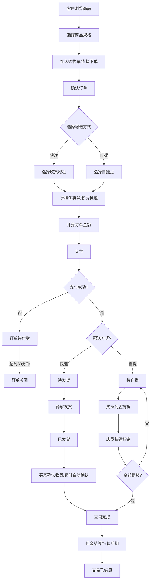
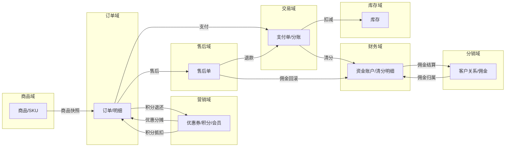
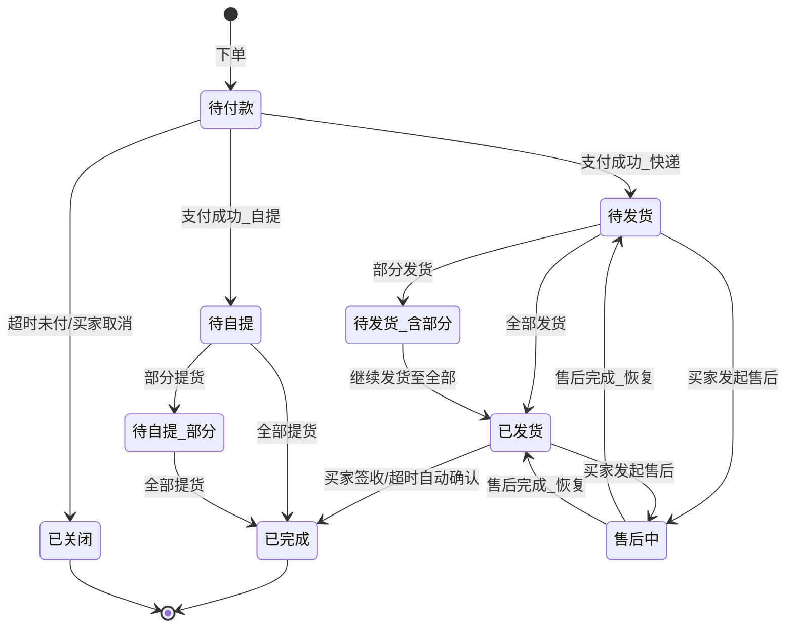
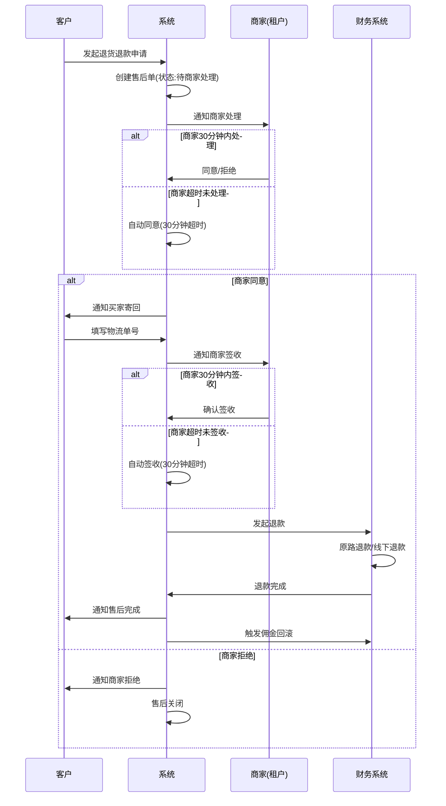
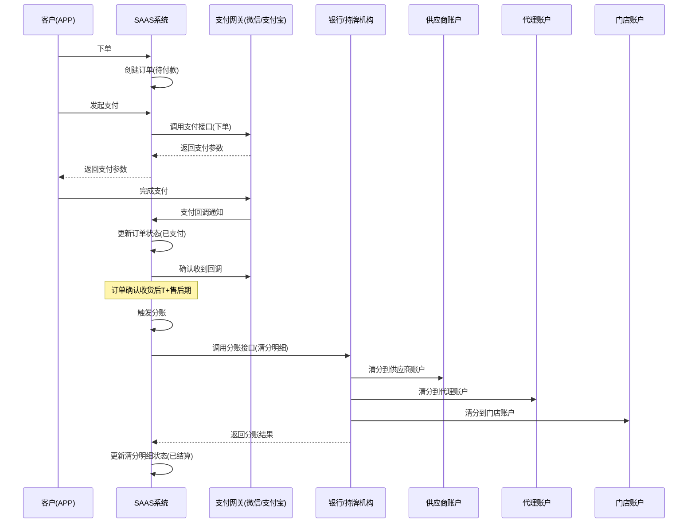

# 九天 SAAS 系统 产品需求文档 PRD V1.0.9

> **文档类型**：系统级产品需求文档（PRD）
> **所属系统**：九天 SAAS 电商平台
> **文档版本**：V1.0.9（整合 V1.0.0 ~ V1.0.9 全部迭代）
> **编制日期**：2026-07-16
> **数据来源**：Axure 原型 V1.0.2 ~ V1.0.9（7 个版本目录，500+ HTML 页面）、SAAS系统功能详细清单.xlsx（1124 个功能项）、14 个业务域需求分析说明 MD 文档
> **编制团队**：私域电商产品专家团队

---

## 版本历史

| 版本 | 日期 | 变更内容 | 编制人 |
|------|------|----------|--------|
| V1.0.0 | 2026-05-15 | 初始版本：整体业务域规划、B2C订单交易流、售后单流程、财务域框架 | 产品团队 |
| V1.0.2 | 2026-05-15 | 第一批发布：商品/订单/售后/门店/直播/录播/营销/分销/财务/运营/平台APP 主体功能 | 产品团队 |
| V1.0.3 | 2026-05-25 | 第四部分需求：商品审核流程、供应商商品、代理/店长/店员个人中心、APP端多角色、销售订单明细报表 | 产品团队 |
| V1.0.5 | 2026-06-10 | 会员体系全面上线：等级管理、成长值规则、权益配置、保级/降级、APP端会员中心 | 产品团队 |
| V1.0.6 | 2026-06-20 | 营销中心：优惠券管理升级（满减/折扣/核销/兑换/现金红包）、支付有礼、直播卡券、APP端领券核销 | 产品团队 |
| V1.0.7 | 2026-06-30 | 分佣政策：组织结构、分佣计算、分佣管理、分佣配置、佣金明细 | 产品团队 |
| V1.0.8 | 2026-07-05 | 观看奖励+现金账户：观看奖励列表、总部/下级红包、红包管理、虚拟账户、零钱提现 | 产品团队 |
| V1.0.9 | 2026-07-12 | 积分系统：积分设置、任务设置、积分商城、积分统计、兑换记录、积分抵现/兑换 | 产品团队 |
| V1.0.9 | 2026-07-16 | 整卷合并 PRD：整合 14 个业务域、1124 个功能项、7 个版本迭代 | AI-SCRM |

---

## 目录

1. [背景与问题陈述](#1-背景与问题陈述)
2. [目标与成功度量](#2-目标与成功度量)
3. [范围](#3-范围)
4. [系统架构与业务域划分](#4-系统架构与业务域划分)
5. [与既有模块关系](#5-与既有模块关系)
6. [业务目标映射](#6-业务目标映射)
7. [用户故事](#7-用户故事)
8. [功能需求列表与用例](#8-功能需求列表与用例)
9. [业务规则](#9-业务规则)
10. [数据实体](#10-数据实体)
11. [验收标准](#11-验收标准)
12. [指标登记](#12-指标登记)
13. [五类图](#13-五类图)
14. [外部接口标注](#14-外部接口标注)
15. [检查清单](#15-检查清单)

---

## 1. 背景与问题陈述

### 1.1 业务背景

九天 SAAS 电商平台是一个面向**多行业（百货零售、大健康、训练营、互联网医院）**的私域电商 SaaS/PAAS 平台。平台服务于需要同时经营**线上商城 + 线下门店 + 直播带货 + 录播课程**的租户（商家），通过"总部→代理→渠道→终端门店"的多级分销网络实现商品分发、客户归属管理和佣金分账。

系统采用 **SAAS（平台共享端）+ PAAS（租户独立端）** 双模式架构：
- **SAAS 模式**：租户共享平台 APP/小程序，低成本快速接入
- **PAAS 模式**：KA 租户拥有独立品牌 APP/小程序，数据隔离

### 1.2 核心问题

当前系统已完成 V1.0.2 ~ V1.0.9 共 7 个版本迭代，覆盖 14 个业务域、1124 个功能项。但在以下领域存在明确短板：

| 问题域 | 严重程度 | 核心问题 |
|--------|----------|----------|
| 交易/资金安全 | 🔴 高 | 缺平台直连分账（资金经租户账户有挪用风险）、缺担保交易、缺分期付款 |
| 库存管理 | 🔴 高 | 仅单一"总库存"维度，无多仓库/门店仓/批次效期/实时同步 |
| 售后完整性 | 🟡 中 | 仅退款和退货退款，缺换货/补发/部分退货/仲裁机制 |
| 风控能力 | 🔴 高 | 仅词库管理，无规则引擎/实时拦截/黑白名单 |
| PAAS 独立端 | 🔴 高 | 品牌定制/独立小程序/数据隔离策略完全缺失 |
| 内容审核 | 🟡 中 | 单级审核，无 AI 辅助/三级工作流/SLA 管理 |
| 灰度发布 | 🟡 中 | 无灰度发布/AB测试/Feature Flag |

### 1.3 行业适配需求

平台需同时支撑以下行业的差异化需求：

| 行业 | 特殊需求 |
|------|----------|
| 百货零售 | 多门店、多渠道、直播带货 |
| 大健康 | 批次效期管理、效期预警、产品召回追溯 |
| 训练营 | 大额商品分期付款、担保交易、服务履约跟踪 |
| 互联网医院 | 处方药标识、患者隐私数据隔离、合规支付 |

---

## 2. 目标与成功度量

### 2.1 业务目标

| 目标编号 | 目标 | 度量指标 | 目标值 |
|----------|------|----------|--------|
| BO-01 | 资金安全：消除租户挪用分账款风险 | 平台直连分账覆盖率 | 100% |
| BO-02 | 库存准确：消除超卖 | 超卖率 | < 0.01% |
| BO-03 | 售后体验：覆盖全场景售后 | 售后类型覆盖率 | 5种（退款/退货退款/换货/补发/部分退货） |
| BO-04 | 风控实时：从事后审查升级为实时拦截 | 风控规则匹配延迟 | < 10ms |
| BO-05 | 品牌独立：PAAS 租户品牌定制 | PAAS 独立端上线租户数 | ≥ 10 |
| BO-06 | 支付转化：多样化支付适配 | 支付成功率 | ≥ 99.5% |
| BO-07 | 分账时效：自动清分 | 分账延迟 | T+1, < 24h |
| BO-08 | 会员留存：等级体系驱动复购 | 会员复购率提升 | +20% |

### 2.2 技术目标

| 目标 | 度量指标 | 目标值 |
|------|----------|--------|
| 订单查询性能 | P99 延迟 | < 200ms |
| 库存扣减并发 | QPS | ≥ 10,000 |
| 库存服务可用性 | SLA | ≥ 99.99% |
| 审核效率 | AI 自动审核准确率 | ≥ 95% |
| 告警时效 | 高优告警触达 | < 1 分钟 |
| 数据看板延迟 | 数据刷新 | < 5 分钟 |

---

## 3. 范围

### 3.1 In-Scope（本次 PRD 覆盖范围）

本 PRD 覆盖九天 SAAS 系统 V1.0.0 ~ V1.0.9 的全部已实现功能及已识别的改进需求，包括：

- **14 个业务域**：商品、订单、交易、售后、库存、营销、分销、财务、直播、录播、门店、平台、运营、租户门户/APP、SAAS平台APP
- **4 端覆盖**：运营后台（PC）、租户后台（PC）、租户门户（PC）、SAAS平台APP（移动端）
- **5 种用户角色**：客户、店员、店长、代理、渠道成员
- **7 个版本迭代**：V1.0.2 ~ V1.0.9

### 3.2 Non-Goals（不包含）

- 具体的技术实现方案（路由路径、组件名、Store 名、Mock 机制等属 POM 范围）
- 原型核验信息（属 POM 范围）
- 已明确标注"暂未规划"或"敬请期待"的功能（社交体系、秒杀/拼团/限时折扣等）
- 第三方系统对接的接口契约细节（仅标注接口方向）

### 3.3 暂不做/屏蔽功能清单

以下功能在原型中已设计但明确标注暂不实现：

| 功能 | 版本 | 状态 |
|------|------|------|
| 会员等级（V1.0.2 阶段） | V1.0.2 | 继续屏蔽（V1.0.5 已上线） |
| 积分权益（多倍积分） | V1.0.5 | 暂时不做 |
| 满减优惠权益 | V1.0.5 | 暂时不做 |
| 包邮权益 | V1.0.5 | 暂时不做 |
| 我的资产/我的账单 | V1.0.2 | 暂时不做 |
| 短期锁客/自定义抢客 | V1.0.2 | 敬请期待 |
| 秒杀/拼团/限时折扣/阶梯拼团 | V1.0.6 | 敬请期待 |
| APP 直连零钱提现 | V1.0.8 | 不做（用跳转小程序方案） |
| 直播流量增值服务 | V1.0.2 | 暂时不做 |
| 直播间积分 | V1.0.2 | 暂时不做 |
| 社交体系（通讯录/好友/群聊） | 暂未规划 | 未实现 |
| PAAS 独立 APP 品牌定制 | - | 缺失 |
| 发票管理 | - | 未设计 |

---

## 4. 系统架构与业务域划分

### 4.1 系统架构总览

九天 SAAS 系统采用四端架构：

```
┌─────────────────────────────────────────────────────────────┐
│                     外部系统                                  │
│  微信支付 / 支付宝 / 银行 / 物流 / OBS推流 / CDN / 短信       │
└───────────────────────────┬─────────────────────────────────┘
                            │
┌───────────────────────────┼─────────────────────────────────┐
│                    九天 SAAS 平台                             │
│                                                               │
│  ┌─────────────┐  ┌─────────────┐  ┌─────────────────────┐   │
│  │  运营后台    │  │  租户后台    │  │  租户门户            │   │
│  │  (PC)       │  │  (PC)       │  │  (PC)               │   │
│  │             │  │             │  │                     │   │
│  │ ·租户管理   │  │ ·商品/订单   │  │ ·登录注册           │   │
│  │ ·内容审核   │  │ ·售后/营销   │  │ ·租户认证(5步)      │   │
│  │ ·风控       │  │ ·分销/财务   │  │ ·版本订阅           │   │
│  │ ·版本管理   │  │ ·直播/录播   │  │ ·工作台             │   │
│  │ ·系统设置   │  │ ·门店/会员   │  │                     │   │
│  └─────────────┘  └─────────────┘  └─────────────────────┘   │
│                                                               │
│  ┌─────────────────────────────────────────────────────┐     │
│  │              SAAS 平台 APP（移动端）                  │     │
│  │                                                       │     │
│  │  ·首页/商城/娱乐/消息/我的（5 Tab）                   │     │
│  │  ·5种角色个人中心（客户/店员/店长/代理/渠道）          │     │
│  │  ·直播/录播/交易/售后/会员/积分/零钱                  │     │
│  └─────────────────────────────────────────────────────┘     │
│                                                               │
│  ┌─────────────────────────────────────────────────────┐     │
│  │              PAAS 独立端（租户品牌端）                 │     │
│  │  ·独立 APP 品牌定制（缺失）                           │     │
│  │  ·独立小程序配置（缺失）                               │     │
│  │  ·数据隔离策略（缺失）                                 │     │
│  └─────────────────────────────────────────────────────┘     │
└───────────────────────────────────────────────────────────────┘
```

### 4.2 业务域划分（14 个域）

| 域编号 | 业务域 | 核心职责 | 源版本 | 功能项数 |
|--------|--------|----------|--------|----------|
| D01 | 商品域 | 品类管理、商品CRUD、审核、SKU、门店/直播商品、素材中心 | V1.0.2~V1.0.3 | 128+ |
| D02 | 订单域 | 订单全生命周期、发货、自提核销、直播中控订单、报表 | V1.0.2~V1.0.3 | 88 |
| D03 | 交易域 | 支付、分账、担保交易、分期付款（待建） | V1.0.2 | 6 |
| D04 | 售后域 | 仅退款、退货退款、超时机制、退款方式 | V1.0.2~V1.0.3 | - |
| D05 | 库存域 | 总库存、门店库存（待建）、多仓库（待建）、批次效期（待建） | V1.0.2 | - |
| D06 | 营销域 | 优惠券、会员体系、积分系统、支付有礼、观看奖励、福袋、直播卡券、现金账户 | V1.0.2~V1.0.9 | 68+29 |
| D07 | 分销域 | 组织架构、代理/渠道招募、资质审核、终端管理、客户关系、直播推广 | V1.0.2~V1.0.8 | 25+41 |
| D08 | 财务域 | 资金账户、佣金结算、分账管理、流水对账、提现、流量账户 | V1.0.2~V1.0.3 | 18+9 |
| D09 | 直播域 | 直播计划、场次、直播间、中控室、主播、挂件、数据 | V1.0.2~V1.0.3 | 67+9 |
| D10 | 录播域 | 录播视频、录播配置、商品/红包脚本、答题卡、录播间 | V1.0.2 | 17 |
| D11 | 门店域 | 门店CRUD、门店分组、店员管理、门店商品、自提点、核销、门店群 | V1.0.2~V1.0.3 | 30 |
| D12 | 平台域 | 多端架构、PAAS独立端配置（缺失）、版本管理 | V1.0.2 | - |
| D13 | 运营域 | 租户管理、内容审核、风控、版本管理、系统设置、广告 | V1.0.2 | 133 |
| D14 | 租户门户/APP域 | 登录注册、租户认证、版本订阅、工作台、多门店首页 | V1.0.2~V1.0.3 | 18 |

### 4.3 角色体系

```
平台
├── 租户（总部/商家）
│   ├── 代理（多级代理体系，最多五级）
│   │   ├── 渠道成员
│   │   └── 门店（终端）
│   │       ├── 店长
│   │       ├── 店员
│   │       └── 客户（消费者）
│   └── 门店
│       ├── 店长
│       ├── 店员
│       └── 客户（消费者）
└── 未绑定客户（自由用户）
```

**5 种 APP 端角色**：客户、店员、店长、代理、渠道成员，每种角色有差异化个人中心。

---

## 5. 与既有模块关系

### 5.1 业务域间依赖关系矩阵

| 源域 → 目标域 | 依赖关系 | 说明 |
|---------------|----------|------|
| 商品 → 订单 | 订单关联商品SKU | 订单创建时读取商品SKU信息并生成快照 |
| 商品 → 库存 | 库存从属于商品SKU | 商品创建时必须初始化库存 |
| 商品 → 营销 | 优惠券适用商品范围 | 满减券/折扣券指定商品可用/不可用 |
| 商品 → 直播 | 直播商品来源 | 直播商品从门店商品集合添加 |
| 订单 → 售后 | 售后关联订单 | 售后单关联订单，售后挂起订单操作 |
| 订单 → 交易 | 支付单关联订单 | 付款回调更新订单状态 |
| 订单 → 财务 | 订单数据作为分账来源 | 清分明细关联订单ID |
| 订单 → 会员 | 会员身份影响下单 | 下单时读取会员等级和权益 |
| 交易 → 财务 | 分账清分与财务对账 | 平台直连分账需与财务系统对接 |
| 交易 → 库存 | 支付确认后扣减库存 | 需统一扣减时序和退款回滚逻辑 |
| 售后 → 财务 | 退款触发佣金回滚 | 退款后分佣需回滚 |
| 售后 → 订单 | 售后完成联动订单状态 | 全部售后完成→订单关闭 |
| 营销 → 订单 | 优惠券/积分抵现参与下单 | 下单时计算优惠分摊并锁定资源 |
| 营销 → 财务 | 观看奖励红包从虚拟账户扣除 | 红包资金流向 |
| 分销 → 财务 | 客户关系决定佣金归属 | 永久锁客→佣金归属分销员 |
| 直播 → 订单 | 直播订单来源 | 直播中控室监控订单 |
| 直播 → 营销 | 直播间挂件（红包/福袋/优惠券） | 直播中控室管理营销活动 |
| 录播 → 直播 | 录播与直播共享直播广场 | 直播计划可包含录播场次 |
| 门店 → 分销 | 门店归属组织架构 | 门店是分销网络终端 |
| 门店 → 订单 | 自提订单关联门店 | 自提订单关联门店和店员 |
| 运营 → 商品 | 品类管理（运营后台） | 运营定义全平台类目树 |
| 运营 → 直播 | 直播内容审核 | 弹幕过滤/视频审核 |
| 平台 → 运营 | 版本管理依赖灰度发布 | PAAS独立端版本同步 |
| 租户门户 → SAAS平台APP | 认证通过后APP首页加载 | 租户配置决定APP端展示 |

### 5.2 复用边界

| 共享能力 | 复用方 | 说明 |
|----------|--------|------|
| 支付能力 | 交易域、SAAS平台APP、PAAS独立端 | 支付能力无需重复建设，共用SAAS能力 |
| 商品域 | SAAS平台APP、PAAS独立端 | PAAS APP可能需要差异化品类结构 |
| 门店成员 | 门店域、分销域 | 门店成员与组织成员联动，复用组织架构用户数据 |
| 素材中心 | 商品域（商品图片/视频）、录播域（录播视频）、运营域（内容素材） | 统一素材管理 |
| 消息系统 | 所有域 | 统一消息分类（订单/物流/售后/营销/系统） |

---

## 6. 业务目标映射

### 6.1 BG（业务目标）→ BO（业务对象）→ FN（功能需求）映射

| BG | 业务目标 | BO | FN | 所属域 |
|----|----------|-----|-----|--------|
| BG-01 | 资金安全 | BO-01 | FN-TRD-001~003（平台直连分账/担保交易/分期付款） | 交易域 |
| BG-02 | 库存准确 | BO-02 | FN-INV-001~007（门店库存/多仓库/批次效期/实时同步） | 库存域 |
| BG-03 | 售后完整 | BO-03 | FN-AFS-001~005（换货/补发/部分退货/仲裁/自动化） | 售后域 |
| BG-04 | 风控实时 | BO-04 | FN-OPS-001~006（规则引擎/监控大屏/告警/黑白名单） | 运营域 |
| BG-05 | 品牌独立 | BO-05 | FN-PLT-001~005（品牌定制/独立小程序/版本管理/数据隔离） | 平台域 |
| BG-06 | 支付转化 | BO-06 | FN-TRD-001（多样化支付模式） | 交易域 |
| BG-07 | 分账时效 | BO-07 | FN-FIN-001~003（自动清分/分账管理/对账） | 财务域 |
| BG-08 | 会员留存 | BO-08 | FN-MKT-010~018（等级/成长值/权益/保级降级） | 营销域 |
| BG-09 | 商品管理 | - | FN-PRD-001~014（品类/商品CRUD/审核/SKU/门店商品/直播商品） | 商品域 |
| BG-10 | 订单闭环 | - | FN-ORD-001~011（订单列表/详情/发货/自提/直播订单/报表） | 订单域 |
| BG-11 | 直播带货 | - | FN-LIV-001~015（计划/场次/直播间/中控室/主播/挂件/数据） | 直播域 |
| BG-12 | 录播互动 | - | FN-REC-001~008（视频/配置/脚本/答题卡/录播间） | 录播域 |
| BG-13 | 门店数字化 | - | FN-STM-001~012（门店CRUD/分组/店员/商品/自提/核销/群） | 门店域 |
| BG-14 | 分销网络 | - | FN-DIS-001~007（组织/招募/资质/终端/客户关系/推广） | 分销域 |
| BG-15 | 租户准入 | - | FN-TNT-001~008（登录注册/认证/订阅/工作台/多门店首页） | 租户门户域 |
| BG-16 | 积分体系 | - | FN-MKT-019~026（积分设置/任务/商城/统计/兑换/抵现） | 营销域 |
| BG-17 | 优惠券体系 | - | FN-MKT-001~009（满减/折扣/核销/兑换/现金红包/代理发券/统计） | 营销域 |

---

## 7. 用户故事

### 7.1 客户（消费者）用户故事

| US编号 | 用户故事 |
|--------|----------|
| US-CUS-001 | 作为客户，我希望浏览多门店商品并下单，以便购买所需商品 |
| US-CUS-002 | 作为客户，我希望在直播间观看直播并领取红包/优惠券，以便享受优惠 |
| US-CUS-003 | 作为客户，我希望观看录播课程并答题领红包，以便学习并获得奖励 |
| US-CUS-004 | 作为客户，我希望申请售后（退款/退货退款），以便维权 |
| US-CUS-005 | 作为客户，我希望查看会员等级和权益，以便了解升级途径 |
| US-CUS-006 | 作为客户，我希望使用积分抵现或兑换商品，以便享受积分价值 |
| US-CUS-007 | 作为客户，我希望管理收货地址和查看订单物流，以便跟踪订单 |

### 7.2 店长/店员用户故事

| US编号 | 用户故事 |
|--------|----------|
| US-STM-001 | 作为店长，我希望管理门店商品（独立定价/库存），以便差异化运营 |
| US-STM-002 | 作为店员，我希望扫码核销自提订单和兑换券，以便完成线下履约 |
| US-STM-003 | 作为店长，我希望查看门店经营数据，以便决策 |
| US-STM-004 | 作为店员，我希望管理门店客户（发券/设黑名单），以便维护客户关系 |
| US-STM-005 | 作为店长，我希望处理门店售后订单，以便服务客户 |

### 7.3 代理用户故事

| US编号 | 用户故事 |
|--------|----------|
| US-DIS-001 | 作为代理，我希望招募下级代理和终端门店，以便扩展分销网络 |
| US-STM-001 | 作为代理，我希望管理终端门店审核，以便控制网络质量 |
| US-STM-002 | 作为代理，我希望查看直播推广数据和观看奖励，以便优化推广 |
| US-STM-003 | 作为代理，我希望查看虚拟账户余额和明细，以便管理资金 |

### 7.4 租户（商家）用户故事

| US编号 | 用户故事 |
|--------|----------|
| US-TNT-001 | 作为租户，我希望完成认证和版本订阅，以便使用平台服务 |
| US-TNT-002 | 作为租户，我希望管理商品全生命周期（创建/审核/上下架），以便控制商品 |
| US-TNT-003 | 作为租户，我希望管理订单和发货，以便履约 |
| US-TNT-004 | 作为租户，我希望配置营销活动（优惠券/会员/积分/直播卡券），以便促转化 |
| US-TNT-005 | 作为租户，我希望管理分销网络和佣金，以便激励渠道 |
| US-TNT-006 | 作为租户，我希望查看财务对账和资金流水，以便管理财务 |

### 7.5 平台运营用户故事

| US编号 | 用户故事 |
|--------|----------|
| US-OPS-001 | 作为运营，我希望管理租户资质审核，以便控制准入 |
| US-OPS-002 | 作为运营，我希望配置风控规则和敏感词库，以便防控风险 |
| US-OPS-003 | 作为运营，我希望管理内容审核（三级工作流），以便保障内容合规 |
| US-OPS-004 | 作为运营，我希望灰度发布和版本管理，以便降低发布风险 |
| US-OPS-005 | 作为运营，我希望查看平台级数据看板，以便全局决策 |

---

## 8. 功能需求列表与用例

> 由于系统规模庞大（1124 个功能项），本节按业务域列出核心功能需求（FN），每个 FN 附标准用例表格。完整功能清单参见 `SAAS系统功能详细清单.xlsx`。

### 8.1 商品域（D01）

#### FN-PRD-001 品类管理

| 属性 | 值 |
|------|-----|
| 用例编号 | UC-PRD-001 |
| 名称 | 品类管理 |
| 页面 | 品类管理.html、新增类目.html |
| 参与者 | SAAS 产品运营人员 |
| 优先级 | P0 |
| 关联BG | BG-09 |
| 自动化类型 | 手动 |

**前置条件**：运营人员已登录运营后台，具备品类管理权限。

**基本流程**：
1. [手动] 运营人员进入"经营 > 品类管控"页面
2. [系统自动] 系统展示品类树列表（依据创建时间降序排序）
3. [手动] 运营人员点击"新建品类"或"新建下级"
4. [手动] 填写品类名称、经营说明，设置特殊资质
5. [系统自动] 新建数据默认状态为"已禁用"
6. [手动] 运营人员对品类进行"批量启用"或"批量禁用"

**备选流程**：
- 无权限时提示"系统安全警告，您当前角色无此权限，不允许操作！"

**数据范围**：R（品类列表）/ W（新建/编辑/启用/禁用）

**后置条件**：品类数据变更，租户开店资质认证时可选择已启用的类目。

**关联UC**：UC-TNT-002（租户认证选择经营类目）

**业务规则**：
- 父级有资质，所有子类目继承；反之不需要
- 新建默认状态为"已禁用"
- 依据数据最后一次创建时间降序排序

---

#### FN-PRD-002 商品管理列表（按商品/按SKU双视图）

| 属性 | 值 |
|------|-----|
| 用例编号 | UC-PRD-002 |
| 名称 | 商品管理列表 |
| 页面 | 商品管理_按商品.html、商品管理_按SKU.html、商品管理.html、商品管理_1.html |
| 参与者 | 租户管理员 |
| 优先级 | P0 |
| 关联BG | BG-09 |
| 自动化类型 | 手动 |

**前置条件**：租户已登录后台，具备商品管理权限。

**基本流程**：
1. [手动] 租户进入"商城 > 商品"页面
2. [系统自动] 系统展示商品列表（支持按商品SPU/按SKU两种视图切换）
3. [手动] 租户使用筛选条件查询（创建时间/商品名称/商品码/商品类型/销量/价格/商品图片/商品详情/商品类目/所属门店/所属供应商/商品状态）
4. [手动] 租户可执行操作：筛选/重置/导出/发布商品/编辑/复制/设置供应商/设置佣金/审核/上架/下架

**备选流程**：
- V1.0.3 移除了"设置门店"操作，功能调整至门店商品模块

**数据范围**：R（商品列表）/ W（编辑/复制/审核/上下架）

**后置条件**：商品状态变更。

**关联UC**：UC-PRD-003（添加/编辑商品）、UC-PRD-007（商品审核）

---

#### FN-PRD-003 添加/编辑商品

| 属性 | 值 |
|------|-----|
| 用例编号 | UC-PRD-003 |
| 名称 | 添加/编辑商品 |
| 页面 | 添加商品.html、编辑商品.html、选择类目.html、添加、编辑商品.html |
| 参与者 | 租户管理员 |
| 优先级 | P0 |
| 关联BG | BG-09 |
| 自动化类型 | 手动 |

**前置条件**：租户已选择商品所属类目（认证范围内的类目）。

**基本流程**：
1. [手动] 租户点击"发布商品" → 选择类目
2. [手动] 填写基本信息（商品名称/商品主图最多15张/讲解视频最多1个）
3. [手动] 配置价格和库存（商品规格最多4种/SKU编码/总库存/采购价/售价/划线价/重量/按单限购）
4. [手动] 配置物流配送（配送方式：快递/到店自提；邮费：统一邮费/运费到付）
5. [手动] 配置服务保障（7天无理由/破碎包退/假一赔三/免除邮费）
6. [手动] 填写商品介绍（类目参数/自定义参数）
7. [系统自动] 保存后商品状态为"审核中"

**备选流程**：
- 采购价与供应商双向同步：商品绑定供应商后，修改采购价同步至供应商处

**数据范围**：W（新建/编辑商品）

**后置条件**：商品进入审核流程。

**关联UC**：UC-PRD-007（商品审核）

---

#### FN-PRD-004 商品状态流转

| 属性 | 值 |
|------|-----|
| 用例编号 | UC-PRD-004 |
| 名称 | 商品状态流转 |
| 页面 | 商品管理_1.html |
| 参与者 | 系统 |
| 优先级 | P0 |
| 关联BG | BG-09 |
| 自动化类型 | 事件驱动 |

**状态流转**：
```
新增/导入/复制/编辑 → [审核中] →审核通过→ [在售中] →下架→ [已下架]
                        │                    │                │
                   审核不通过              上架←──────────────┘
                        │
                        ↓
                  [审核不通过] →编辑→ [审核中]
```

**状态操作权限矩阵**：

| 状态 | 编辑 | 复制 | 审核 | 上架 | 下架 |
|------|------|------|------|------|------|
| 审核中 | ✅ | ✅ | ✅ | — | — |
| 在售中 | ❌ | ✅ | ❌ | — | ✅ |
| 审核不通过 | ✅ | ✅ | — | — | — |
| 已下架 | ✅ | ✅ | — | ✅ | — |

---

#### FN-PRD-005~014 商品域其他功能

| FN编号 | 功能名称 | 页面 | 版本 |
|--------|----------|------|------|
| FN-PRD-005 | 类目参数管理 | 类目参数.html | V1.0.2 |
| FN-PRD-006 | 类目规格管理 | 类目规格.html | V1.0.2 |
| FN-PRD-007 | 商品审核 | 审核商品.html | V1.0.3 |
| FN-PRD-008 | 门店商品 | 门店商品.html | V1.0.2/V1.0.3 |
| FN-PRD-009 | 直播商品 | 直播商品.html、添加商品_2.html | V1.0.2 |
| FN-PRD-010 | 供应商商品 | 供应商商品.html | V1.0.3 |
| FN-PRD-011 | 素材中心-商品图片 | 素材中心-商品图片.html | V1.0.2 |
| FN-PRD-012 | 素材中心-商品视频 | 素材中心-商品视频.html | V1.0.2 |
| FN-PRD-013 | 商品数据（概况/转化/动销/排行） | 商品概况.html、转化.html、动销.html、商品排行.html | V1.0.3 |
| FN-PRD-014 | 批量操作（设置库存/采购价/零售价/重量/修改价格） | 设置总库存.html等 | V1.0.2 |

---

### 8.2 订单域（D02）

#### FN-ORD-001 订单列表/搜索/筛选

| 属性 | 值 |
|------|-----|
| 用例编号 | UC-ORD-001 |
| 名称 | 订单管理列表 |
| 页面 | 订单管理.html |
| 参与者 | 租户管理员 |
| 优先级 | P0 |
| 关联BG | BG-10 |
| 自动化类型 | 手动 |

**前置条件**：租户已登录后台。

**基本流程**：
1. [手动] 租户进入"商城 > 订单管理"页面
2. [系统自动] 系统展示订单列表（支持状态Tab切换：待付款/待发货/待提货/已发货/已提货/已完成/已关闭/售后中）
3. [手动] 租户使用搜索（订单编号/收件人/买家昵称/手机号后四位）或筛选（订单状态/付款方式/订单类型/配送方式/销售来源/是否标星/是否留言/下单时间/商品名称）
4. [手动] 租户可执行操作：查看详情/备注/发货/修改地址/查看自提码/查看售后

**数据范围**：R（订单列表）/ W（备注/发货/修改地址）

**关联UC**：UC-ORD-002（订单详情）、UC-ORD-003（发货管理）

---

#### FN-ORD-002 订单详情

**信息区块**：订单编号/状态/状态描述/进度条/自动倒计时/买家备注/卖家备注/收货人信息/配送信息/付款信息/买家信息/商品明细/金额汇总/营销信息/分摊金额表/优惠后金额。

**操作按钮（按状态）**：

| 订单状态 | 可用操作 |
|---------|---------|
| 待付款 | 备注、取消订单、修改地址 |
| 待发货 | 备注、发货、修改地址 |
| 已发货 | 备注、查看物流 |
| 待自提 | 备注、查看自提码、修改地址（自提） |
| 已完成 | 备注、查看物流/查看自提单 |
| 已关闭 | 备注（只读） |
| 售后中 | 备注（挂起状态） |

---

#### FN-ORD-003~011 订单域其他功能

| FN编号 | 功能名称 | 说明 |
|--------|----------|------|
| FN-ORD-003 | 发货管理 | 全部发货/部分发货/修改地址/查看物流 |
| FN-ORD-004 | 自提订单管理 | 自提码查看/自提单详情/扫码核销 |
| FN-ORD-005 | APP端订单 | 个人中心订单列表（全部/待付款/待发货/已发货/待自提/已完成/已取消/售后中） |
| FN-ORD-006 | 直播中控室订单 | 实时订单监控/订单备注 |
| FN-ORD-007 | 订单消息推送 | 订单/物流/售后/营销/系统消息 |
| FN-ORD-008 | 销售订单明细报表 | 交易类型/销售渠道/销售单元筛选 |
| FN-ORD-009 | 门店订单（店员/店长端） | 门店维度订单+自提订单 |
| FN-ORD-010 | 积分订单 | 积分抵现订单/积分兑换订单 |
| FN-ORD-011 | 充值订单 | 代理/渠道成员扫码充值 |

---

### 8.3 交易域（D03）

#### FN-TRD-001 平台直连分账（待建）

| 属性 | 值 |
|------|-----|
| 用例编号 | UC-TRD-001 |
| 名称 | 平台直连分账 |
| 参与者 | 系统 |
| 优先级 | P0 |
| 关联BG | BG-01、BG-06 |
| 自动化类型 | 事件驱动 |

**前置条件**：客户完成支付。

**基本流程**：
1. [系统自动] 客户支付后资金直接进入平台虚拟账户
2. [系统自动] 平台按清分规则自动将资金清分到各分账方（供应商/代理/门店）
3. [系统自动] 租户无法触碰分账资金

**后置条件**：分账资金到达各方账户。

---

#### FN-TRD-002 担保交易（待建）

**流程**：客户支付→资金锁定→商家发货→客户确认收货→资金解冻→打款。适用于训练营、大额贵重商品。自动确认收货：发货后N天未确认则自动确认。

#### FN-TRD-003 分期付款（待建）

支持3/6/12期分期，分期订单独立管理（每期还款状态跟踪），逾期处理（提醒→罚息→关闭分期）。

---

### 8.4 售后域（D04）

#### FN-AFS-001 仅退款

**流程**：发起申请 → 商家处理 → 商家退款 → 售后完成

**异常路径**：商家拒绝→买家确认→关闭/超时关闭；买家主动取消→售后关闭

#### FN-AFS-002 退货退款

**流程**：发起申请 → 商家处理 → 买家寄回 → 商家签收 → 商家退款 → 售后完成

**异常路径**：商家拒绝→售后关闭；买家超时未寄回→售后关闭；商家拒签→寄回买家→售后关闭

#### FN-AFS-003~005 售后域待建功能

| FN编号 | 功能名称 | 优先级 |
|--------|----------|--------|
| FN-AFS-003 | 换货流程 | P1 |
| FN-AFS-004 | 补发流程 | P1 |
| FN-AFS-005 | 部分退货+仲裁机制 | P1 |

#### FN-AFS-006 售后超时机制

| 超时场景 | 超时时间 | 超时动作 |
|---------|---------|---------|
| 商家未处理 | 30分钟 | 系统自动同意 |
| 商家未退款 | 30分钟 | 系统自动退款 |
| 买家未寄回 | 30分钟 | 自动关闭售后 |
| 商家未签收 | 30分钟 | 自动确认收货 |
| 买家未确认拒绝 | 30分钟 | 自动关闭售后 |

---

### 8.5 库存域（D05）

#### FN-INV-001~007 库存域功能（待建）

| FN编号 | 功能名称 | 优先级 |
|--------|----------|--------|
| FN-INV-001 | 门店级库存管理 | P0 |
| FN-INV-002 | 多仓库库存管理（总仓/门店仓/直播仓/电商仓） | P0 |
| FN-INV-003 | 库存调拨（仓库间/门店间） | P0 |
| FN-INV-004 | 库存盘点（明盘/暗盘/移动端） | P1 |
| FN-INV-005 | 批次效期管理 | P0 |
| FN-INV-006 | 库存实时同步（分布式锁） | P0 |
| FN-INV-007 | 进销存报表 | P1 |

---

### 8.6 营销域（D06）

#### FN-MKT-001~009 优惠券系统

| FN编号 | 功能名称 | 页面 | 版本 |
|--------|----------|------|------|
| FN-MKT-001 | 优惠券管理列表 | 优惠券.html | V1.0.6 |
| FN-MKT-002 | 新增满减券 | 新增满减券.html | V1.0.6 |
| FN-MKT-003 | 新增折扣券 | 新增折扣券.html | V1.0.6 |
| FN-MKT-004 | 新增核销优惠券 | 新增核销优惠券.html | V1.0.6 |
| FN-MKT-005 | 核销流程 | 兑换核销.html、核销记录.html | V1.0.6 |
| FN-MKT-006 | 代理发券 | 批量设置代理发券.html | V1.0.6 |
| FN-MKT-007 | 优惠券统计 | 满减_折扣优惠券统计.html | V1.0.6 |
| FN-MKT-008 | APP端优惠券 | 我的优惠券-满减券/折扣券/兑换券/现金红包 | V1.0.6 |
| FN-MKT-009 | APP端下单选券 | 下单-没有选择地址-仅快递 | V1.0.6 |

#### FN-MKT-010~018 会员体系

| FN编号 | 功能名称 | 页面 | 版本 |
|--------|----------|------|------|
| FN-MKT-010 | 会员等级规则流程 | 会员等级规则流程.html | V1.0.5 |
| FN-MKT-011 | 等级管理 | 等级管理.html | V1.0.5 |
| FN-MKT-012 | 新增等级 | 新增等级.html | V1.0.5 |
| FN-MKT-013 | 成长值规则（5种） | 成长值规则.html、新增规则（消费支付/完成订单/观看直播/浏览商品/评论互动）.html | V1.0.5 |
| FN-MKT-014 | 保级/降级规则 | 保级_降级规则.html | V1.0.5 |
| FN-MKT-015 | 权益配置 | 权益配置-权益模板库.html、权益配置-新人注册礼.html、权益配置-升级礼.html | V1.0.5 |
| FN-MKT-016 | 会员列表/详情 | 会员列表.html、详情-观看记录/订单记录/成长值记录/权益发放记录/升降级记录.html | V1.0.5 |
| FN-MKT-017 | 会员统计 | 会员统计.html | V1.0.5 |
| FN-MKT-018 | APP端会员中心 | 会员中心.html、全部会员权益.html、去升级.html | V1.0.5 |

#### FN-MKT-019~026 积分系统

| FN编号 | 功能名称 | 页面 | 版本 |
|--------|----------|------|------|
| FN-MKT-019 | 积分设置 | 积分设置.html | V1.0.9 |
| FN-MKT-020 | 任务设置（消费任务/直播任务） | 任务设置.html | V1.0.9 |
| FN-MKT-021 | 积分商城-活动列表 | 积分商城--活动列表.html | V1.0.9 |
| FN-MKT-022 | 积分商城-添加/编辑活动 | 添加活动.html、编辑活动.html | V1.0.9 |
| FN-MKT-023 | 积分统计 | 积分统计.html | V1.0.9 |
| FN-MKT-024 | 兑换记录 | 兑换记录.html | V1.0.9 |
| FN-MKT-025 | 积分抵现订单 | 订单列表.html、订单详情.html | V1.0.9 |
| FN-MKT-026 | APP端积分 | 我的积分.html、积分兑换.html、积分账单.html | V1.0.9 |

#### FN-MKT-027~034 营销中心/观看奖励/现金账户

| FN编号 | 功能名称 | 版本 |
|--------|----------|------|
| FN-MKT-027 | 所有营销汇总页 | V1.0.6 |
| FN-MKT-028 | 支付有礼 | V1.0.6 |
| FN-MKT-029 | 福袋抽奖 | V1.0.2 |
| FN-MKT-030 | 直播间卡券管理 | V1.0.6 |
| FN-MKT-031 | 观看奖励列表 | V1.0.8 |
| FN-MKT-032 | 红包管理 | V1.0.8 |
| FN-MKT-033 | 现金账户管理 | V1.0.8 |
| FN-MKT-034 | APP端零钱/提现 | V1.0.8 |

---

### 8.7 分销域（D07）

#### FN-DIS-001~007 分销域功能

| FN编号 | 功能名称 | 版本 |
|--------|----------|------|
| FN-DIS-001 | 组织管理（9条原则） | V1.0.2 |
| FN-DIS-002 | 代理/渠道招募（企业/个体户资质） | V1.0.2 |
| FN-DIS-003 | 资质审核 | V1.0.2 |
| FN-DIS-004 | 终端管理 | V1.0.2 |
| FN-DIS-005 | 客户关系（永久锁客/关系查询/公海客户） | V1.0.2 |
| FN-DIS-006 | 直播推广 | V1.0.8 |
| FN-DIS-007 | APP端多角色切换 | V1.0.3 |

---

### 8.8 财务域（D08）

#### FN-FIN-001~009 财务域功能

| FN编号 | 功能名称 | 版本 |
|--------|----------|------|
| FN-FIN-001 | 资金账户管理（资产概览/详情/商户编号/添加账户） | V1.0.2 |
| FN-FIN-002 | 多媒体流量账户（直播/回放/素材流量） | V1.0.2 |
| FN-FIN-003 | 佣金结算（按单统计/按人明细/结算方案/批量设置佣金） | V1.0.2 |
| FN-FIN-004 | 分账管理（清分明细表） | V1.0.2 |
| FN-FIN-005 | 资金流水与对账（交易记录/对账明细/对账单下载） | V1.0.2 |
| FN-FIN-006 | 提现 | V1.0.2 |
| FN-FIN-007 | 运营后台交易管理（交易查询/确认收款） | V1.0.2 |
| FN-FIN-008 | 供应商对账报表 | V1.0.2 |
| FN-FIN-009 | 退款对分佣的影响（佣金扣减机制） | V1.0.2 |

---

### 8.9 直播域（D09）

#### FN-LIV-001~015 直播域功能

| FN编号 | 功能名称 | 版本 |
|--------|----------|------|
| FN-LIV-001 | 主播管理（列表/添加/编辑/资质审核） | V1.0.2 |
| FN-LIV-002 | 直播计划（创建/编辑/查看/指标） | V1.0.2 |
| FN-LIV-003 | 场次管理（列表/终止/状态机） | V1.0.2 |
| FN-LIV-004 | 直播间配置（通用/福袋/红包/卡券/客户范围/推流地址） | V1.0.2 |
| FN-LIV-005 | 中控室_商品（上下架/补库存/讲解） | V1.0.2 |
| FN-LIV-006 | 中控室_营销（卡券/红包/抽奖上下活动） | V1.0.2 |
| FN-LIV-007 | 中控室_订单（实时监控/备注） | V1.0.2 |
| FN-LIV-008 | 中控室_课程（上链接/讲解） | V1.0.2 |
| FN-LIV-009 | 聊天互动（禁言/回复/文本标签） | V1.0.2 |
| FN-LIV-010 | 直播商品 | V1.0.2 |
| FN-LIV-011 | APP端直播广场（直播中/预告/记录） | V1.0.2 |
| FN-LIV-012 | APP端直播间（直播中/预告中/已结束/挂件/弹幕/分享） | V1.0.2 |
| FN-LIV-013 | 直播数据大屏 | V1.0.2 |
| FN-LIV-014 | 直播数据报表（计划/场次/明细/会员同比环比） | V1.0.2 |
| FN-LIV-015 | APP端直播数据看板 | V1.0.3 |

---

### 8.10 录播域（D10）

#### FN-REC-001~008 录播域功能

| FN编号 | 功能名称 | 版本 |
|--------|----------|------|
| FN-REC-001 | 素材中心-录播视频 | V1.0.2 |
| FN-REC-002 | 录播管理（添加/编辑） | V1.0.2 |
| FN-REC-003 | 录播配置（课程关联） | V1.0.2 |
| FN-REC-004 | 添加脚本_商品（上下架时序） | V1.0.2 |
| FN-REC-005 | 添加脚本_现金红包（显示/隐藏/可领时间） | V1.0.2 |
| FN-REC-006 | APP端录播间（全屏/横屏） | V1.0.2 |
| FN-REC-007 | 答题卡（单选/多选/答题奖励） | V1.0.2 |
| FN-REC-008 | 录播状态机（未开始/进行中/已结束+即时操作） | V1.0.2 |

---

### 8.11 门店域（D11）

#### FN-STM-001~012 门店域功能

| FN编号 | 功能名称 | 版本 |
|--------|----------|------|
| FN-STM-001 | 门店管理（列表/新建/编辑/启用禁用/状态机） | V1.0.2 |
| FN-STM-002 | 门店分组 | V1.0.2 |
| FN-STM-003 | 门店成员管理（店员/店长/与组织联动） | V1.0.2 |
| FN-STM-004 | 门店商品（独立定价/批量发布/运费/自提点） | V1.0.2 |
| FN-STM-005 | 自提点管理（门店级/商品级/LBS排序） | V1.0.2 |
| FN-STM-006 | 核销管理（自提核销/兑换核销） | V1.0.2 |
| FN-STM-007 | 多门店架构APP首页（多门店/单门店/无门店） | V1.0.2 |
| FN-STM-008 | 门店数据（经营数据看板） | V1.0.2 |
| FN-STM-009 | 下单流程（配送方式/优惠券叠加/运费计算） | V1.0.2 |
| FN-STM-010 | 门店邀请机制 | V1.0.3 |
| FN-STM-011 | 门店群（IM）功能 | V1.0.2 |
| FN-STM-012 | 通用设置（交易设置/售后设置） | V1.0.2 |

---

### 8.12 平台域（D12）

#### FN-PLT-001~005 平台域功能（待建）

| FN编号 | 功能名称 | 优先级 |
|--------|----------|--------|
| FN-PLT-001 | PAAS独立APP品牌定制（LOGO/主题色/启动页） | P0 |
| FN-PLT-002 | 独立小程序配置流程 | P1 |
| FN-PLT-003 | 独立APP版本管理+Feature Flag | P1 |
| FN-PLT-004 | PAAS数据隔离策略 | P0 |
| FN-PLT-005 | 租户数据导出/删除 | P2 |

---

### 8.13 运营域（D13）

#### FN-OPS-001~006 运营域功能

| FN编号 | 功能名称 | 优先级 |
|--------|----------|--------|
| FN-OPS-001 | 风控规则引擎（条件+动作/实时拦截） | P0 |
| FN-OPS-002 | 实时风控监控大屏 | P0 |
| FN-OPS-003 | 风控告警通知（多渠道） | P0 |
| FN-OPS-004 | 黑白名单管理 | P1 |
| FN-OPS-005 | 内容审核工作流（三级+AI辅助+SLA） | P1 |
| FN-OPS-006 | 租户分层运营（KA/中型/小型+健康度+流失预警） | P1 |
| FN-OPS-007 | 灰度发布与功能开关 | P1 |
| FN-OPS-008 | 平台级数据看板 | P1 |

---

### 8.14 租户门户/APP域（D14）

#### FN-TNT-001~008 租户门户功能

| FN编号 | 功能名称 | 版本 |
|--------|----------|------|
| FN-TNT-001 | 登录与注册（验证码/密码/免费注册/忘记密码） | V1.0.2 |
| FN-TNT-002 | 租户认证（5步：引导→主体→法人→经营→公示） | V1.0.2 |
| FN-TNT-003 | 资质管理（平台侧/租户侧/门店/主播） | V1.0.2~V1.0.3 |
| FN-TNT-004 | 版本订阅（版本首页/立即订阅/订阅列表） | V1.0.2 |
| FN-TNT-005 | 工作台（登录后默认页/全局资质信息卡片） | V1.0.3 |
| FN-TNT-006 | 多门店首页加载逻辑 | V1.0.2 |
| FN-TNT-007 | 添加成员（企业/个体户/不需资质） | V1.0.3 |
| FN-TNT-008 | APP端登录（微信/手机验证码/注册） | 待定 |

---

## 9. 业务规则

### BR-SAAS-001 商品审核规则
- 触发条件：新建/编辑/复制的商品
- 行为：默认状态为"审核中"，需审核通过才能上架销售；在售中商品不允许编辑

### BR-SAAS-002 采购价双向同步规则
- 触发条件：商品与供应商绑定
- 行为：商品管理修改采购价→同步至供应商处；供应商处修改采购价→同步至商品管理

### BR-SAAS-003 订单售后挂起规则
- 触发条件：订单存在售后单且售后单未完成/未关闭
- 行为：订单操作被挂起（不可发货/签收等），售后完成/关闭后恢复原状态

### BR-SAAS-004 订单关闭规则
- 触发条件：待付款超时（30分钟）/买家取消/全部商品售后完成
- 行为：订单状态变为"已关闭"

### BR-SAAS-005 售后超时自动处理规则
- 触发条件：商家未处理（30分钟）/商家未退款（30分钟）/买家未寄回（30分钟）/商家未签收（30分钟）
- 行为：分别自动同意/自动退款/自动关闭/自动签收

### BR-SAAS-006 组织层级规则（9条原则）
- 原则1：总部固定不可编辑删除
- 原则2：从总部算最多五级
- 原则3：每组层级最多一个销售终端（末级）
- 原则4：代理业务只有招募代理
- 原则5：渠道业务==招募渠道，渠道类型==直营店/非直营店，配置店员/店长
- 原则6：组织身份决定组织成员身份
- 原则7：组织业务类型决定成员业务类型
- 原则8：渠道成员依据业务类型决定邀请门店类型
- 原则9：门店可追溯→所属组织→直属上级→上级组织

### BR-SAAS-007 客户关系永久锁客规则
- 触发条件：客户点击/扫码/输入邀请码并完成注册绑定
- 行为：永久绑定，客户下单分销员佣金规则一直有效

### BR-SAAS-008 同租户不跨门店规则
- 触发条件：客户在同一个租户下
- 行为：不能跨门店存在（分账约束），分享归属只能属于一个邀请店员上级

### BR-SAAS-009 佣金计算规则
- 毛利 = 售价 - 采购价
- 采购占比(%) = 采购价 / 售价
- 毛利占比(%) = 毛利 / 售价
- 比例约束：采购占比 + 管理佣金% + 员工佣金% + 代理人佣金% + 保留利润占比 ≤ 100%
- 积分抵扣订单不参与分佣

### BR-SAAS-010 佣金结算规则
- 自动结算：订单确认收货T+【售后期】次日，佣金自动从账户余额扣除发放到分销员零钱账户
- 退款影响：已结算(无退款)/已结算(含退款)/退款中 三种状态

### BR-SAAS-011 积分保护期规则
- 触发条件：通过下单奖励的积分
- 行为：订单未结算前进入保护期（冻结）；订单完成且过了售后期后自动解冻

### BR-SAAS-012 直播场次状态判断规则
- 核心依据：推流状态 + 回放配置（非单纯时间比较）
- 预告：早于开始时间或没有产生推流
- 直播中：推流持续中
- 回放中：推流终止+回放文件存在+开启回放
- 已结束：未开启回放/回放结束时间到
- 已终止：人为终止（推流被主动切断）

### BR-SAAS-013 录播商品脚本规则
- 触发条件：当前时间满足商品脚本的上下架时间范围
- 行为：商品自动显示并弹出；超过上下架时间自动关闭
- 隐藏价格：在配置时间段内价格显示"???"
- 售罄：在配置时间段内显示"已售罄"

### BR-SAAS-014 录播红包脚本规则
- 校验1：所有红包显示隐藏时间差值总额 < 视频总时长
- 校验2：领完-可领时间必须在显示-隐藏时间范围内
- 首次显示自动弹出1次
- 领完-可领时间优先级 > 红包本身领取条件
- 倒计时达到配置的累计观看时长自动弹出

### BR-SAAS-015 首页推荐算法规则
- 优先条件：客户→多租户→跨租户多门店，直播/录播→配置中→客户属于选中门店
- 其次条件：客户→多租户→跨租户多门店，直播/录播→配置中→客户不属于选中门店
- 读取：租户下直播、回放、录播数据
- 直播/回放/录播：距离结束剩余时间最长的作为第一个
- 猜你喜欢：优先所属门店客户门店商品，其次非门店客户在售商品，按销量降序

### BR-SAAS-016 黑名单/禁用用户数据权限规则
- 触发条件：用户被设为黑名单/禁用
- 行为：不可进入直播间、不可购买、不可进入回放、不可进入录播；缓存数据也需检测权限

### BR-SAAS-017 运费计算规则
- 统一邮费：直接读取配置数值
- 运费模版按件数：首件价格 + (购买数-1) × 续件单价
- 运费模版按重量：首重价格 + (商品总重量 - 首重重量) × 续重价格

### BR-SAAS-018 验证码安全规则
- 验证码获取频繁超过3次 → 显示图形验证码二次校验
- 密码格式：8-20字符，包含数字字母以及特殊字符
- 未勾选自动登录 → 24小时会话；勾选 → 7天会话（验证码登录）/3天会话（密码登录）

---

## 10. 数据实体

### 10.1 核心实体关系总览

```
租户(Tenant) ──1:N──→ 门店(Store) ──1:N──→ 门店商品(StoreProduct)
    │                      │
    │                      ├──1:N──→ 店员(Staff)
    │                      └──1:N──→ 自提点(PickupPoint)
    │
    ├──1:N──→ 商品(SPU) ──1:N──→ SKU
    │              │
    │              ├──1:N──→ 门店SKU(StoreSKU)
    │              ├──1:N──→ 直播SKU(LiveSKU)
    │              └──N:1──→ 供应商(Supplier)
    │
    ├──1:N──→ 订单(Order) ──1:N──→ 订单明细(OrderItem)
    │              │
    │              ├──1:N──→ 售后单(AfterSaleOrder)
    │              ├──1:N──→ 提货单(PickupOrder)
    │              └──1:N──→ 支付单(PaymentOrder)
    │
    ├──1:N──→ 资金账户(CapitalAccount)
    ├──1:N──→ 流量账户(TrafficAccount)
    └──1:N──→ 清分明细(SettlementItem)

组织(Organization) ──1:N──→ 组织成员(Member)
    │
    └──1:N──→ 下级组织

客户(Customer) ──N:1──→ 分销员(Staff/Member)
    │
    ├──1:N──→ 订单(Order)
    ├──1:N──→ 优惠券(Coupon)
    └──1:N──→ 收藏/足迹(Favorite)

直播计划(LivePlan) ──1:N──→ 场次(Session) ──1:1──→ 直播间(LiveRoom)
    │
    └──1:N──→ 直播指标

录播(Record) ──1:N──→ 课程(Course)
    │
    ├──1:N──→ 商品脚本(ProductScript)
    └──1:N──→ 红包脚本(RedPacketScript)
```

### 10.2 核心实体清单（ENT）

| 实体编号 | 实体名称 | 所属域 | 关键字段 |
|----------|----------|--------|----------|
| ENT-PRD-001 | 品类(Category) | 商品 | id, parentId, name, status, isSpecialQualification |
| ENT-PRD-002 | 商品(SPU) | 商品 | id, spuCode, name, categoryId, status, totalStock, supplierId |
| ENT-PRD-003 | SKU | 商品 | id, spuId, skuCode, specValues, totalStock, purchasePrice, salePrice |
| ENT-PRD-004 | 门店SKU(StoreSKU) | 商品 | id, skuId, storeId, storeStock, storePrice |
| ENT-PRD-005 | 商品审核记录(AuditLog) | 商品 | id, spuId, auditor, auditResult, auditReason |
| ENT-ORD-001 | 订单(Order) | 订单 | order_id, order_type, order_status, delivery_method, buyer_id, total_goods_amount, order_amount, paid_amount |
| ENT-ORD-002 | 订单明细(OrderItem) | 订单 | item_id, order_id, spu_id, sku_id, quantity, original_price, actual_price, delivery_status |
| ENT-ORD-003 | 提货单(PickupOrder) | 订单 | pickup_order_id, order_id, sku_id, quantity, pickup_code, pickup_status |
| ENT-ORD-004 | 提货记录(PickupRecord) | 订单 | record_id, pickup_order_id, actual_quantity, customer_name, checker_name, verify_time |
| ENT-AFS-001 | 售后单(AfterSales) | 售后 | 维权编号, 订单编号, 售后类型, 售后状态, 退款原因, 退款金额 |
| ENT-AFS-002 | 维权记录(DisputeRecord) | 售后 | 记录ID, 维权编号, 节点类型, 操作时间, 操作内容 |
| ENT-FIN-001 | 资金账户(CapitalAccount) | 财务 | 账户ID, 商户编号, 商户名称, 账户类型, 总余额, 可用余额, 待结算余额 |
| ENT-FIN-002 | 流量账户(TrafficAccount) | 财务 | 账户ID, 账户类型, 总余额, 可用余额, 关联业务ID |
| ENT-FIN-003 | 清分明细(SettlementItem) | 财务 | 清分明细ID, 结算单ID, 订单ID, 供应商ID, 分销员ID, 佣金比例, 待结算佣金, 已结算佣金 |
| ENT-FIN-004 | 支付单(PaymentOrder) | 财务 | 支付单ID, 支付单类型, 账户ID, 业务类型, 业务单据ID, 支付金额 |
| ENT-FIN-005 | 对账单(ReconciliationStatement) | 财务 | 账单ID, 账单周期, 账期开始, 账期结束, 期初余额, 本期收入, 本期支出, 期末余额 |
| ENT-MKT-001 | 优惠券(Coupon) | 营销 | id, name, type, 适用场景, 优惠内容, 状态, 发放总量, 已领取, 已使用 |
| ENT-MKT-002 | 会员等级(MemberLevel) | 营销 | id, 等级名称, 等级类型, 成长值, 有效期, 保级规则, 降级规则 |
| ENT-MKT-003 | 成长值规则(GrowthRule) | 营销 | id, 规则类型, 规则条件, 成长值 |
| ENT-MKT-004 | 积分账户(PointsAccount) | 营销 | id, customer_id, 可用积分, 冻结积分, 总积分 |
| ENT-MKT-005 | 积分商城活动(PointsActivity) | 营销 | id, 活动名称, 奖品, 类型, 奖品状态, 总数, 已兑, 剩余, 有效期 |
| ENT-DIS-001 | 组织(Organization) | 分销 | id, 组织编号, 组织名称, 组织身份, 业务类型 |
| ENT-DIS-002 | 组织成员(Member) | 分销 | id, 所在组织ID, 所在组织身份, 所在组织层级 |
| ENT-DIS-003 | 客户关系(CustomerRelation) | 分销 | id, 客户ID, 邀请人ID, 邀请人身份, 邀请人所在组织, 绑定时间 |
| ENT-LIV-001 | 直播计划(LivePlan) | 直播 | id, 计划名称, 场次列表, 指标 |
| ENT-LIV-002 | 场次(Session) | 直播 | id, 计划ID, 直播间ID, 场次编号, 开播时间, 结束时间, 状态 |
| ENT-LIV-003 | 直播间(LiveRoom) | 直播 | id, 名称, 配置, 客户范围, 推流地址, 启用状态 |
| ENT-REC-001 | 录播(Record) | 录播 | id, 录播名称, 开始时间, 结束时间, 状态 |
| ENT-REC-002 | 商品脚本(ProductScript) | 录播 | id, 录播ID, 课程ID, 关联商品, 显示隐藏时间, 隐藏价格时间, 售罄时间 |
| ENT-REC-003 | 红包脚本(RedPacketScript) | 录播 | id, 录播ID, 课程ID, 关联红包, 显示隐藏时间, 领完可领时间 |
| ENT-STM-001 | 门店(Store) | 门店 | id, 门店名称, 所在分组, 店长ID, 状态, 资质状态 |
| ENT-STM-002 | 门店分组(StoreGroup) | 门店 | id, 分组名称, 门店列表, 状态 |
| ENT-STM-003 | 自提点(PickupPoint) | 门店 | id, 门店ID, 自提点名称, 联系人, 联系电话, 所在地区, 详细地址 |
| ENT-TNT-001 | 租户(Tenant) | 租户门户 | tenant_id, tenant_name, phone, qualification_status, subscription_count |
| ENT-TNT-002 | 租户资质(TenantQualification) | 租户门户 | qualification_id, tenant_id, qualification_type, business_name, unified_credit_code, status |

---

## 11. 验收标准

### 11.1 场景级 E2E 验收（SC）

| SC编号 | 场景 | 步骤 | 预期结果 |
|--------|------|------|----------|
| SC-SAAS-001 | 客户下单全流程 | 客户浏览商品→选规格→下单→选优惠券→支付→商家发货→客户确认收货→交易完成 | 订单状态正确流转，金额计算正确，佣金正确分账 |
| SC-SAAS-002 | 自提订单全流程 | 客户下单选自提→支付→生成提货码→到店→店员扫码核销→全部提货→订单完成 | 提货码生成正确，核销后订单状态更新 |
| SC-SAAS-003 | 售后退货退款全流程 | 客户申请退货退款→商家同意→客户寄回→商家签收→商家退款→售后完成→订单关闭 | 售后状态正确流转，退款金额正确，佣金回滚 |
| SC-SAAS-004 | 直播带货全流程 | 租户建直播计划→配置直播间→添加商品→配置营销→开始直播→中控室管理→客户下单→直播结束→查看数据 | 直播全流程顺畅，数据统计准确 |
| SC-SAAS-005 | 录播答题领红包全流程 | 租户上传视频→创建录播→配置课程→配置商品/红包脚本→客户观看→完播→答题正确→领取红包→查看商品→下单 | 脚本时序正确，答题记录留存，红包发放成功 |
| SC-SAAS-006 | 代理招募全流程 | 代理生成邀请码→被招募人扫码→填写资质→提交审核→审核通过→归入组织 | 组织关系正确建立，资质审核流程完整 |
| SC-SAAS-007 | 租户认证全流程 | 租户注册→登录→5步认证→提交→平台审核→通过→版本订阅→进入后台 | 认证状态正确流转，订阅记录生成 |
| SC-SAAS-008 | 会员升级全流程 | 客户消费→获得成长值→达到门槛→自动升级→发放升级礼包→享受权益 | 成长值计算正确，升级触发正确，礼包发放成功 |
| SC-SAAS-009 | 积分抵现全流程 | 客户下单→使用积分抵现→支付→订单完成→积分解冻→售后→积分退还 | 积分冻结/解冻/退还逻辑正确 |
| SC-SAAS-010 | 多角色切换 | 用户登录APP→切换为店员身份→查看门店订单→核销自提→切换为代理→查看终端管理 | 角色切换后数据正确隔离 |

### 11.2 功能级验收矩阵（Give-When-Then）

| FN编号 | Given | When | Then |
|--------|-------|------|------|
| FN-PRD-001 | 运营已登录后台 | 新建品类并设置特殊资质 | 品类创建成功，默认禁用，资质信息保存 |
| FN-PRD-004 | 商品处于审核中状态 | 审核通过 | 商品状态变为"在售中"，可上架销售 |
| FN-PRD-004 | 商品处于在售中状态 | 点击编辑 | 不允许编辑（在售中不允许编辑） |
| FN-ORD-001 | 订单处于待付款状态 | 超过30分钟未付款 | 订单自动关闭 |
| FN-ORD-003 | 订单处于待发货状态 | 商家执行部分发货 | 订单状态保持待发货(含部分发货)，可继续发货 |
| FN-AFS-001 | 售后单处于待商家处理状态 | 超过30分钟商家未处理 | 系统自动同意售后 |
| FN-AFS-006 | 买家已同意售后 | 超过30分钟买家未寄回 | 自动关闭售后 |
| FN-FIN-003 | 订单确认收货 | 到达T+售后期次日 | 佣金自动结算到分销员零钱 |
| FN-MKT-019 | 积分功能已开启 | 用户完成订单 | 积分进入保护期（冻结），订单完成后解冻 |
| FN-LIV-003 | 场次未到开始时间 | 当前时间 < 开始时间 | 场次状态为"预告" |
| FN-LIV-003 | 场次推流持续中 | 获取到推流数据 | 场次状态为"直播中" |
| FN-REC-004 | 商品脚本配置了显示时间 | 当前时间在显示时间范围内 | 商品自动显示并弹出 |
| FN-REC-005 | 红包脚本配置了领完可领时间 | 用户点击红包且在领完可领时间内 | 显示"下次再来"（优先级大于红包本身规则） |
| FN-TNT-001 | 验证码错误超过3次 | 再次获取验证码 | 显示图形验证码二次校验 |
| FN-DIS-005 | 客户扫码绑定分销员 | 完成注册绑定 | 永久锁客，客户下单分销员佣金有效 |

---

## 12. 指标登记

### 12.1 业务指标

| 指标编号 | 指标名称 | 计算公式/说明 | 所属域 |
|----------|----------|--------------|--------|
| MET-TRD-001 | 支付成功率 | 支付成功订单数 / 支付尝试订单数 | 交易 |
| MET-TRD-002 | 分账延迟 | 确认收货到分账完成的时间差 | 交易/财务 |
| MET-ORD-001 | 订单查询P99 | 订单查询接口P99延迟 | 订单 |
| MET-ORD-002 | 售后处理时效 | 系统级自动退款<1分钟，人工审核<24小时 | 售后 |
| MET-INV-001 | 超卖率 | 超卖订单数 / 总订单数 | 库存 |
| MET-INV-002 | 库存扣减QPS | 库存扣减接口QPS | 库存 |
| MET-LIV-001 | 计划总GMV | 各场次直播GMV之和 | 直播 |
| MET-LIV-002 | 计划平均转化率 | 各场次转化率之和 / 计划场次 | 直播 |
| MET-LIV-003 | 计划平均UV价值 | 计划总GMV / 计划总场观UV | 直播 |
| MET-MKT-001 | 优惠券使用率 | 已使用数量 / 已领取数量 | 营销 |
| MET-MKT-002 | 会员复购率 | 会员复购订单数 / 会员总订单数 | 营销 |
| MET-FIN-001 | 佣金结算准确率 | 佣金结算正确笔数 / 总结算笔数 | 财务 |
| MET-OPS-001 | 风控规则匹配延迟 | 规则匹配耗时 | 运营 |
| MET-OPS-002 | AI审核准确率 | AI正确审核数 / AI审核总数 | 运营 |
| MET-OPS-003 | 告警触达时效 | 高优告警从发生到触达的时间 | 运营 |

### 12.2 报表清单

| 报表名称 | 所属域 | 筛选维度 |
|----------|--------|----------|
| 销售订单明细报表 | 订单 | 交易类型/销售渠道/销售单元/时间 |
| 商品销售汇总报表 | 商品 | 商品/类目/销售渠道（暂未规划） |
| 商品同比环比报表 | 商品 | 商品/时间（暂未规划） |
| 会员统计报表 | 营销 | 会员等级/销售单元/销售渠道/时间 |
| 会员同比环比报表 | 营销 | 时间/销售渠道 |
| 会员直播同比环比报表 | 直播 | 时间/会员等级/直播间/主播 |
| 直播间明细报表 | 直播 | 主播/计划/场次/直播间 |
| 优惠汇总报表 | 营销 | 时间 |
| 优惠明细报表 | 营销 | 时间 |
| 供应商对账汇总表 | 财务 | 经销方式/商品/供应商/销售渠道 |
| 供应商对账明细表 | 财务 | 单据类型/时间 |
| 对账单（日/月/年） | 财务 | 账户类型/时间 |
| 积分统计 | 营销 | 时间 |

---

## 13. 五类图

### 13.1 业务流程图 — 客户下单支付全流程



### 13.2 信息流转图 — 跨模块信息流



### 13.3 状态机 — 订单状态机



**状态过渡操作表**：

| 当前状态 | 触发操作 | 目标状态 | 操作者 | 前置约束 | 后置动作 |
|----------|----------|----------|--------|----------|----------|
| 待付款 | 付款成功 | 待发货/待自提 | 系统/支付回调 | 支付金额=应付金额 | 扣减库存，生成提货码(自提) |
| 待付款 | 超时未付(30分钟) | 已关闭 | 系统 | 当前时间-下单时间>30分钟 | 释放预占库存 |
| 待发货 | 全部发货 | 已发货 | 商家 | 所有商品已发货 | 发送物流消息 |
| 已发货 | 买家确认收货 | 已完成 | 买家 | — | 触发佣金结算倒计时 |
| 已发货 | 超时自动确认 | 已完成 | 系统 | 发货后7天 | 同上 |
| 待自提 | 全部提货 | 已完成 | 店员扫码 | 所有提货单已核销 | — |
| 任意 | 买家发起售后 | 售后中 | 买家 | 订单状态≥待发货 | 挂起订单操作 |
| 售后中 | 售后完成/关闭 | 恢复原状态 | 系统 | 所有售后单完成/关闭 | 恢复订单操作权限 |

### 13.4 业务时序图 — 售后退货退款流程



### 13.5 三方接口时序图 — 支付与分账接口



**接口路径标注**：
- 支付下单：`POST /api/v1/payment/order` → 支付网关
- 支付回调：`POST /api/v1/payment/callback` ← 支付网关
- 分账请求：`POST /api/v1/settlement/clear` → 银行/持牌机构
- 分账结果通知：`POST /api/v1/settlement/notify` ← 银行/持牌机构

---

## 14. 外部接口标注

| 接口编号 | 接口名称 | 方向 | 对端系统 | 说明 |
|----------|----------|------|----------|------|
| API-EXT-001 | 微信支付 | 双向 | 微信支付 | 支付下单/回调/退款 |
| API-EXT-002 | 支付宝支付 | 双向 | 支付宝 | 支付下单/回调/退款 |
| API-EXT-003 | 银行分账 | 双向 | 银行/持牌机构 | 清分请求/结果通知 |
| API-EXT-004 | 物流查询 | 单向(入) | 物流公司(顺丰/中通等) | 运单轨迹查询 |
| API-EXT-005 | OBS推流 | 单向(出) | OBS/第三方推流工具 | 直播推流地址配置 |
| API-EXT-006 | CDN分发 | 双向 | CDN服务商 | 视频/图片加速 |
| API-EXT-007 | 短信发送 | 单向(出) | 短信服务商 | 验证码/通知短信 |
| API-EXT-008 | 微信小程序 | 双向 | 微信开放平台 | 零钱提现跳转小程序 |
| API-EXT-009 | 内容安全审核 | 单向(出) | AI内容审核服务 | 图片/视频/文字鉴黄鉴暴 |
| API-EXT-010 | 实名认证 | 单向(出) | 公安/第三方实名服务 | 身份证实名验证 |

---

## 15. 检查清单

| # | 检查项 | 状态 |
|---|--------|------|
| 1 | 编号体系 FN/UC/BR/ENT/SC 完整 | ✅ |
| 2 | 15 章强制结构 | ✅ |
| 3 | 版本历史记录 | ✅ |
| 4 | 目录 | ✅ |
| 5 | 背景与问题陈述 | ✅ |
| 6 | 目标与成功度量（含量化指标） | ✅ |
| 7 | 范围（In-Scope / Non-Goals） | ✅ |
| 8 | 与既有模块关系（复用边界） | ✅ |
| 9 | 业务目标映射（BO/BG→FN） | ✅ |
| 10 | 用户故事 | ✅ |
| 11 | 功能需求列表与用例（FN/UC 含标准表格） | ✅ |
| 12 | 业务规则独立编号 BR-SAAS-{NNN} | ✅ |
| 13 | 数据实体 ENT 定义 | ✅ |
| 14 | 验收标准双层（场景 E2E + 功能矩阵 Give-When-Then） | ✅ |
| 15 | 指标登记 | ✅ |
| 16 | 五类图（全部 Mermaid） | ✅ |
| 17 | 状态机配套状态过渡操作表 | ✅ |
| 18 | 外部接口标注 | ✅ |
| 19 | 无实现细节（路由/组件/Store/Mock） | ✅ |
| 20 | 检查清单自检 | ✅ |

---

> **文档编制说明**：本文档基于 Axure 原型 V1.0.2 ~ V1.0.9（7 个版本目录、500+ HTML 页面）、SAAS系统功能详细清单.xlsx（1124 个功能项）、14 个业务域需求分析说明 MD 文档（交易/商品/订单/售后/库存/营销/分销/财务/直播/录播/门店/平台/运营/租户门户/平台APP）整合编制。所有功能需求、业务规则、数据实体均提取自原型实际内容，未做编造。

> **关联文档**：
> - 14 个业务域详细 MD：交易V1.0.0.md、商品V1.0.0.md、订单V1.0.0.md、售后V1.0.0.md、库存V1.0.0.md、营销V1.0.0.md、分销V1.0.0.md、财务V1.0.0.md、直播V1.0.0.md、录播V1.0.0.md、门店V1.0.0.md、平台V1.0.0.md、运营V1.0.0.md、租户APPV1.0.0.md、平台APPV1.0.0.md
> - SAAS系统功能详细清单.xlsx
> - SAAS系统业务深度审计表.xlsx
