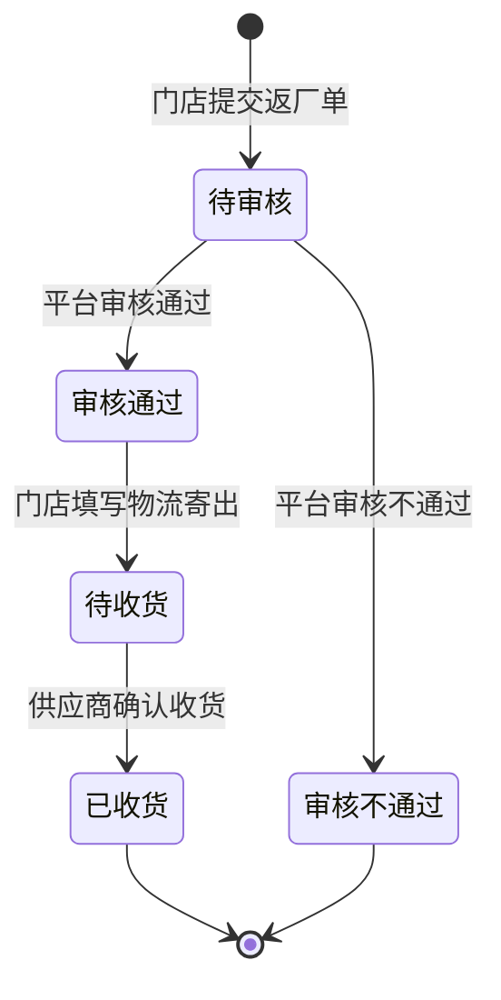

# 百货商城 PRD v1.0 — Vol 3：门店进销存

> **上一卷**：[百货商城-PRD-v1.0-vol2-商城配置.md](./百货商城-PRD-v1.0-vol2-商城配置.md)
> **下一卷**：[百货商城-PRD-v1.0-vol4-小程序端.md](./百货商城-PRD-v1.0-vol4-小程序端.md)
> **卷索引**：[百货商城-PRD-v1.0-index.md](./百货商城-PRD-v1.0-index.md)

---

## 版本历史

| 版本 | 日期 | 作者 | 变更说明 |
|------|------|------|---------|
| v1.0 | 2026-07-15 | BA Agent（learn-project） | 基于原型「百货商城 2」v1.6.1 忠实还原提取 |

---

## 1. 背景与问题陈述

本卷涵盖「百货商城」**门店进销存** 子系统的全部功能，来源为原型版本 v1.6.1。该子系统涉及后台门店退货物流管理、库存管理（实时库存/库存流水）、审核提醒，以及小程序端库存管理和调拨管理。是进销存需求二期优化的核心变更区域。

**忠实还原声明**：本文档严格遵循 FR-01~FR-05 铁律，原型有什么就还原什么，不做删减、纠偏或推测补充。

---

## 2. 功能需求列表与用例（FN/UC）

---

### 模块 A：门店退货物流

#### PG-门店-01：门店退货物流

**页面**：后台 → 门店 → 门店退货物流

---

#### FN-STORE-01：门店退货物流状态优化

| 属性 | 值 |
|------|-----|
| 编号 | FN-STORE-01 |
| 用例编号 | UC-STORE-01 |
| 名称 | 退货物流状态Tab优化 |
| 页面 | 门店退货物流 |
| 参与者 | 后台操作员 |
| 优先级 | P1 |
| 关联BG | — |
| 自动化类型 | 手动 |

**前置条件**：操作员进入门店退货物流页面

**基本流程**：
1. [系统自动] Tab状态栏显示6个状态：全部、待审核、审核通过、审核不通过、待收货、已收货

**各状态说明**：
- **待审核**：门店在小程序端"退货返厂"提交返厂商品至平台审核的数据，同一退货商品汇总为一条数据，退货件数汇总统计
- **审核通过**：平台在"门店退货物流-查看详情"页面中操作审核通过的数据
- **审核不通过**：平台在"门店退货物流-查看详情"页面中操作审核不通过的数据
- **待收货**：平台审核通过后，门店填写物流信息寄回退货地址后，数据状态扭转为"待收货"
- **已收货**：供应商在"门店退货物流-确认收货"页面操作确认收货后，数据状态扭转为"已收货"

**多审规则**：若平台审核环节为多审，数据取最新的审核状态为准；若其中有一审不通过，后面的审核无需继续（已有逻辑）

**数据范围**：R

**后置条件**：列表按Tab状态正确筛选

---

#### FN-STORE-02：供应商名称/ID筛选

| 属性 | 值 |
|------|-----|
| 编号 | FN-STORE-02 |
| 用例编号 | UC-STORE-02 |
| 名称 | 供应商名称/ID筛选 |
| 页面 | 门店退货物流 |
| 参与者 | 后台操作员 |
| 优先级 | P1 |
| 关联BG | — |
| 自动化类型 | 手动 |

**前置条件**：操作员在门店退货物流页面

**基本流程**：
1. [手动] 操作员在"供应商名称/ID"输入框中输入内容（占位符："请输入供应商名称/ID"）
2. [系统自动] 输入供应商名称时进行模糊搜索
3. [系统自动] 输入ID时进行精准搜索

**数据范围**：R

**后置条件**：列表按供应商筛选

---

#### FN-STORE-03：列表新增字段

| 属性 | 值 |
|------|-----|
| 编号 | FN-STORE-03 |
| 用例编号 | UC-STORE-03 |
| 名称 | 列表新增供应商名称/ID和审核时间 |
| 页面 | 门店退货物流 |
| 参与者 | 后台操作员 |
| 优先级 | P1 |
| 关联BG | — |
| 自动化类型 | 系统自动 |

**前置条件**：门店退货物流列表已加载

**基本流程**：
1. [系统自动] 列表新增"供应商名称/ID"字段：数据取值于退货商品在后台 → 商城 → 商品管理 → 新增/编辑普通商品时设置的供应商信息；记录供应商名称和ID信息；若没有则置空
   - **注**：该供应商信息为用户下单支付商品设置的供应商信息快照处理，下单支付变更后不用随之更新
2. [系统自动] 列表新增"审核时间"字段：数据取值于平台操作审核通过/审核不通过的时间点；取最新审核状态对应的时间点

**数据范围**：R

**后置条件**：列表正确显示新增字段

---

#### FN-STORE-04：操作列按状态区分

| 属性 | 值 |
|------|-----|
| 编号 | FN-STORE-04 |
| 用例编号 | UC-STORE-04 |
| 名称 | 操作列按钮按状态显示 |
| 页面 | 门店退货物流 |
| 参与者 | 后台操作员 |
| 优先级 | P1 |
| 关联BG | — |
| 自动化类型 | 系统自动 |

**前置条件**：门店退货物流列表已加载

**基本流程**：

| 状态 | 操作按钮 |
|------|----------|
| 待审核 | 查看详情 |
| 审核通过 | 查看详情 |
| 审核不通过 | 查看详情 |
| 待收货 | 查看详情、查看物流、确认收货 |
| 已收货 | 查看详情、查看物流 |

**数据范围**：R

**后置条件**：操作列正确显示

---

#### FN-STORE-05：查看详情

| 属性 | 值 |
|------|-----|
| 编号 | FN-STORE-05 |
| 用例编号 | UC-STORE-05 |
| 名称 | 退货物流查看详情 |
| 页面 | 门店退货物流 → 查看详情 |
| 参与者 | 后台操作员 |
| 优先级 | P1 |
| 关联BG | — |
| 自动化类型 | 手动 |

**前置条件**：操作员点击某条记录的"查看详情"

**基本流程**：

**退货单详情**：
1. [系统自动] 显示"供应商名称/ID"字段：与列表字段一致，无则置空
2. [系统自动] 显示"退货地址"字段：若退货商品存在供应商的展示供应商的地址信息（数据取值于后台 → 商城 → 供应商管理 → 联系人姓名、联系电话、所在区域+详细地址）；若退货商品不存在供应商的展示平台设置的退货地址信息（数据取值于后台 → 商城 → 商城配置 → 地址配置中设置启用的退货地址信息）
   - **注**：退货地址取值本版本先不做

**物流信息相关字段**（门店未填写前置空，填写后展示）：
3. [系统自动] 物流公司
4. [系统自动] 物流单号（支持多个，展示全部填写的物流单号）
5. [系统自动] 物流费用
6. [系统自动] 其它费用类型
7. [系统自动] 其它费用
8. [系统自动] 备注
9. [系统自动] 凭证

**平台审核部分**：
10. [系统自动] "审核不通过/审核通过"按钮在平台操作审核完成后不再显示

**已收货后回显**：
11. [系统自动] 供应商确认收货后，在详情页面回显供应商确认收货时的收货件数和备注信息

**数据范围**：R

**后置条件**：详情正确展示

---

#### FN-STORE-06：确认收货

| 属性 | 值 |
|------|-----|
| 编号 | FN-STORE-06 |
| 用例编号 | UC-STORE-06 |
| 名称 | 供应商确认收货 |
| 页面 | 门店退货物流 → 确认收货 |
| 参与者 | 供应商 |
| 优先级 | P1 |
| 关联BG | — |
| 自动化类型 | 手动 |

**前置条件**：退货单状态为"待收货"，供应商点击"确认收货"

**基本流程**：
1. [系统自动] 显示确认收货页面，包含：
   - 收货件数（必填*）：输入框，占位符"请输入收货件数"
   - 备注（选填）：输入框，占位符"请输入备注"
2. [手动] 供应商填写收货信息
3. [手动] 点击"确认收货"按钮
4. [系统自动] 弹出二次确认弹框："确定收货该商品吗？"
5. [手动] 点击"确定"：完成收货，返回列表页，数据状态扭转为"已收货"
6. [手动] 点击"取消"：返回列表页（不确认收货）

**备选流程**：
- 3a. 点击"取消"按钮：返回列表页

**数据范围**：R/W

**后置条件**：退货单状态变为"已收货"

---

#### FN-STORE-07：导出

| 属性 | 值 |
|------|-----|
| 编号 | FN-STORE-07 |
| 用例编号 | UC-STORE-07 |
| 名称 | 门店退货物流导出 |
| 页面 | 门店退货物流 |
| 参与者 | 后台操作员 |
| 优先级 | P1 |
| 关联BG | — |
| 自动化类型 | 手动 |

**前置条件**：操作员在门店退货物流页面

**基本流程**：
1. [系统自动] 导出文件字段与当前列表优化后一致
2. [系统自动] "全部"tab下导出文件命名："门店退货物流报表_260709"（末尾为导出当天日期）
3. [系统自动] 其余状态导出与目前保持一致

**数据范围**：R

**后置条件**：文件已导出

---

#### FN-STORE-08：数据权限隔离

| 属性 | 值 |
|------|-----|
| 编号 | FN-STORE-08 |
| 用例编号 | UC-STORE-08 |
| 名称 | 门店退货物流数据隔离 |
| 页面 | 门店退货物流 |
| 参与者 | 系统 |
| 优先级 | P1 |
| 关联BG | — |
| 自动化类型 | 系统自动 |

**前置条件**：操作员查看门店退货物流页面

**基本流程**：
1. [系统自动] 按线路分组（门店）和供应商维度做数据隔离
2. [系统自动] 门店数据权限：只能看到该权限设置的门店数据
3. [系统自动] 供应商数据权限：只能看到设置的供应商数据

**数据范围**：R

**后置条件**：数据权限正确隔离

---

### 模块 B：库存管理（后台）

#### PG-门店-02：库存管理 — 实时库存

**页面**：后台 → 门店 → 库存管理 → 实时库存

---

#### FN-STORE-09：实时库存新增字段

| 属性 | 值 |
|------|-----|
| 编号 | FN-STORE-09 |
| 用例编号 | UC-STORE-09 |
| 名称 | 实时库存新增返厂相关字段 |
| 页面 | 库存管理 → 实时库存 |
| 参与者 | 后台操作员 |
| 优先级 | P1 |
| 关联BG | — |
| 自动化类型 | 系统自动 |

**前置条件**：操作员进入实时库存页面

**基本流程**：

**新增字段及统计逻辑**：

1. [系统自动] **返厂锁定**：
   - 店长在【退货返厂】提交当前商品的返厂单给平台审核时，根据提交返厂的商品数量进行锁定
   - 同时当前商品可用库存需要同步进行扣减
   - 当该商品填写物流信息寄出后，释放返厂锁定数量

2. [系统自动] **返厂在途**：
   - 店长在【退货返厂】提交当前商品的返厂单平台审核通过后，操作填写物流寄出后，当前返厂的商品数量为返厂在途数据
   - 当供应商在后台 → 门店 → 门店退货物流确认收货该商品后，释放返厂在途数量

3. [系统自动] **返厂出库**：显示实际出库数量（如"-1"）

4. [系统自动] **实际库存**：
   - 计算公式：**实际库存 = 可用库存 + 待提货锁定 + 调拨锁定 + 返厂锁定**
   - 注释图标显示该计算公式
   - 注释图标交互：点击图标显示，点击空白处隐藏注释

**数据范围**：R

**后置条件**：实时库存正确展示

---

#### FN-STORE-10：实时库存截止时间筛选

| 属性 | 值 |
|------|-----|
| 编号 | FN-STORE-10 |
| 用例编号 | UC-STORE-10 |
| 名称 | 实时库存新增截止时间筛选 |
| 页面 | 库存管理 → 实时库存 |
| 参与者 | 后台操作员 |
| 优先级 | P1 |
| 关联BG | — |
| 自动化类型 | 手动 |

**前置条件**：操作员在实时库存页面

**基本流程**：
1. [手动] 操作员在"截止时间"时间组件中设置时间范围
2. [系统自动] 列表展示对应截止时间范围下的库存数据

**数据范围**：R

**后置条件**：列表按截止时间筛选

---

#### PG-门店-03：库存管理 — 库存流水

**页面**：后台 → 门店 → 库存管理 → 库存流水

---

#### FN-STORE-11：库存流水新增字段

| 属性 | 值 |
|------|-----|
| 编号 | FN-STORE-11 |
| 用例编号 | UC-STORE-11 |
| 名称 | 库存流水新增商品名称/规格和返厂出库类型 |
| 页面 | 库存管理 → 库存流水 |
| 参与者 | 后台操作员 |
| 优先级 | P1 |
| 关联BG | — |
| 自动化类型 | 系统自动 |

**前置条件**：操作员进入库存流水页面

**基本流程**：
1. [系统自动] 列表新增"商品名称/规格"字段：显示当前库存流水变动的具体商品名称和规格（示例：苹果 / 大果）
2. [系统自动] 变动类型新增"返厂出库"类型：数据统计逻辑与实时库存一致

**筛选条件**：
3. [手动] 新增"商品名称"筛选：输入框，占位符"请输入商品名称搜索"，对列表数据进行模糊搜索

**数据范围**：R

**后置条件**：库存流水正确展示

---

### 模块 C：库存管理（小程序端，需UI出图）

#### PG-门店-04：库存管理【需UI出图】

**页面**：小程序端 → 店长店员端 → 我的 → 库存管理

---

#### FN-STORE-12：小程序库存管理 — 返厂锁定统计

| 属性 | 值 |
|------|-----|
| 编号 | FN-STORE-12 |
| 用例编号 | UC-STORE-12 |
| 名称 | 小程序库存管理顶部返厂锁定统计 |
| 页面 | 库存管理【需UI出图】 |
| 参与者 | 店长/店员 |
| 优先级 | P1 |
| 关联BG | — |
| 自动化类型 | 系统自动 |

**前置条件**：店长/店员进入库存管理页面

**基本流程**：
1. [系统自动] 页面顶部新增"返厂锁定"统计项
2. [系统自动] 数据统计逻辑：店长在【退货返厂】提交申请返厂单后，根据提交返厂的商品数量进行锁定，同时可用库存同步扣减
3. [系统自动] 统计项后存在注释图标，文案："供应商收货前锁定"
4. [手动] 点击图标显示注释文案，点击空白处隐藏注释

**数据范围**：R

**后置条件**：返厂锁定统计正确显示

---

#### FN-STORE-13：具体商品库存记录

| 属性 | 值 |
|------|-----|
| 编号 | FN-STORE-13 |
| 用例编号 | UC-STORE-13 |
| 名称 | 具体商品库存记录新增返厂字段 |
| 页面 | 库存管理【需UI出图】→ 具体商品库存记录 |
| 参与者 | 店长/店员 |
| 优先级 | P1 |
| 关联BG | — |
| 自动化类型 | 系统自动 |

**前置条件**：店长/店员查看具体商品的库存记录

**基本流程**：
1. [系统自动] 显示"返厂锁定（待供应商收货）"统计：
   - 统计逻辑：店长在【退货返厂】提交当前商品的返厂单时，根据提交返厂的商品数量进行锁定，同时当前商品可用库存同步扣减
2. [系统自动] 显示"返厂在途（退还至供应商）"统计：
   - 统计逻辑：店长在【退货返厂】中寄回给供应商的商品后，供应商在后台 → 门店 → 门店退货物流中操作确认收货后的商品数量

**数据范围**：R

**后置条件**：库存记录正确展示

---

### 模块 D：调拨管理（需UI出图）

#### PG-门店-05：调拨管理【需UI出图】

**页面**：小程序端 → 我的 → 店长店员端 → 调拨管理

---

#### FN-STORE-14：新建调拨单 — 库存校验

| 属性 | 值 |
|------|-----|
| 编号 | FN-STORE-14 |
| 用例编号 | UC-STORE-14 |
| 名称 | 调拨商品库存校验 |
| 页面 | 调拨管理【需UI出图】 |
| 参与者 | 店长/店员 |
| 优先级 | P1 |
| 关联BG | — |
| 自动化类型 | 系统自动 |

**前置条件**：店长/店员进入调拨管理，点击新建调拨单

**基本流程**：

**规则1：商品选项过滤**
1. [系统自动] 选择完调出门店后，在选择商品时，商品选项数据只展示当前门店存在可用库存的商品名称
2. [系统自动] 没有可用商品库存的，不显示出来提供给选择

**规则2：数量校验**
3. [手动] 选择完商品后，在输入对应的商品数量时
4. [系统自动] 若输入的数量大于当前调出门店商品可用库存时，给出提示："当前商品最大库存为X"（X为当前调出门店商品的可用库存数量，红色加粗显示）

**数据范围**：R/W

**后置条件**：调拨单通过库存校验后提交

---

### 模块 E：审核提醒

#### PG-门店-06：审核提醒

**页面**：后台全局 → 右下角弹窗提醒

---

#### FN-STORE-15：平台审核返厂单提醒

| 属性 | 值 |
|------|-----|
| 编号 | FN-STORE-15 |
| 用例编号 | UC-STORE-15 |
| 名称 | 审核人员待审核返厂单提醒 |
| 页面 | 审核提醒（右下角弹窗） |
| 参与者 | 审核人员 |
| 优先级 | P1 |
| 关联BG | — |
| 自动化类型 | 事件驱动 |

**前置条件**：登录的后台账号为门店退货审核业务中的审核人员，且当前账号存在待审核的数据

**基本流程**：
1. [事件驱动] 系统检测到待审核返厂单数据
2. [系统自动] 页面右下角弹出提醒弹框
3. [系统自动] 弹框显示文案："你有待审核的返厂单，请及时处理。"
4. [手动] 操作员点击"去处理"：跳转至后台 → 门店 → 门店退货物流 → 待审核tab页面
5. [手动] 操作员点击"取消"或"X"：关闭提醒弹框

**数据范围**：R

**后置条件**：提醒已关闭或已跳转处理

---

## 3. 业务规则（BR）

### BR-STORE-01：退货物流状态流转
```
门店提交返厂单 → 待审核
待审核 → 平台审核通过 → 审核通过
待审核 → 平台审核不通过 → 审核不通过
审核通过 → 门店填写物流寄出 → 待收货
待收货 → 供应商确认收货 → 已收货
```
**多审规则**：取最新审核状态为准；若有一审不通过，后续审核无需继续

### BR-STORE-02：返厂锁定释放规则
**触发条件**：商品填写物流信息寄出后
**行为**：释放返厂锁定数量

### BR-STORE-03：返厂在途释放规则
**触发条件**：供应商在后台确认收货该商品后
**行为**：释放返厂在途数量

### BR-STORE-04：实际库存计算公式
**公式**：实际库存 = 可用库存 + 待提货锁定 + 调拨锁定 + 返厂锁定

### BR-STORE-05：调拨商品选项过滤
**触发条件**：新建调拨单，选择调出门店后
**行为**：商品选项只展示有可用库存的商品，无库存商品不显示

### BR-STORE-06：调拨数量校验
**触发条件**：输入的数量 > 调出门店商品可用库存
**行为**：提示"当前商品最大库存为X"，X为可用库存数量（红色加粗）

### BR-STORE-07：审核提醒触发
**触发条件**：登录账号为审核人员且存在待审核数据
**行为**：右下角弹窗提醒

### BR-STORE-08：供应商信息快照规则
**触发条件**：门店退货物流显示供应商信息
**行为**：供应商信息为用户下单支付时设置的供应商信息快照，下单支付变更后不随之更新

---

## 4. 数据实体（ENT）

### ENT-STORE-01：退货物流记录
| 字段 | 类型 | 说明 |
|------|------|------|
| 供应商名称/ID | 文本 | 下单支付时快照，无则置空 |
| 退货地址 | 文本 | 本版本暂不做 |
| 审核时间 | 时间 | 取最新审核状态对应时间点 |
| 申请状态 | 枚举 | 待审核/审核通过/审核不通过/待收货/已收货 |
| 物流公司 | 文本 | 门店填写 |
| 物流单号 | 文本 | 支持多个 |
| 物流费用 | 数字 | — |
| 其它费用类型 | 文本 | — |
| 其它费用 | 数字 | — |
| 备注 | 文本 | — |
| 凭证 | 文件 | — |
| 收货件数 | 数字 | 供应商确认收货时填写 |

### ENT-STORE-02：库存
| 字段 | 类型 | 说明 |
|------|------|------|
| 可用库存 | 数字 | — |
| 待提货锁定 | 数字 | — |
| 调拨锁定 | 数字 | — |
| 返厂锁定 | 数字 | 提交返厂时锁定，寄出后释放 |
| 返厂在途 | 数字 | 寄出后至供应商收货前 |
| 返厂出库 | 数字 | 实际出库量 |
| 实际库存 | 数字 | 公式计算 |

### ENT-STORE-03：库存流水
| 字段 | 类型 | 说明 |
|------|------|------|
| 商品名称/规格 | 文本 | 新增字段 |
| 变动类型 | 枚举 | 新增"返厂出库"类型 |

---

## 5. 状态机



### 状态过渡操作表

| 当前状态 | 触发操作 | 目标状态 | 操作者 | 前置约束 | 后置动作 |
|----------|----------|----------|--------|----------|----------|
| — | 门店提交返厂单 | 待审核 | 门店 | 已申请退货退款 | 可用库存扣减，返厂锁定增加 |
| 待审核 | 平台审核通过 | 审核通过 | 平台 | — | 记录审核时间 |
| 待审核 | 平台审核不通过 | 审核不通过 | 平台 | — | 释放返厂锁定 |
| 审核通过 | 门店填写物流寄出 | 待收货 | 门店 | — | 释放返厂锁定，增加返厂在途 |
| 待收货 | 供应商确认收货 | 已收货 | 供应商 | 填写收货件数 | 释放返厂在途，增加返厂出库 |

---

## 6. 验收标准

### 场景级 E2E

#### SC-STORE-01：门店退货返厂完整流程
**Give** 门店已提交退货返厂申请
**When** 平台审核通过 → 门店填写物流寄出 → 供应商确认收货
**Then** 状态依次变更为：待审核 → 审核通过 → 待收货 → 已收货；库存字段同步更新

#### SC-STORE-02：调拨库存校验
**Give** 店长新建调拨单，选择调出门店
**When** 选择商品时输入数量超过可用库存
**Then** 系统提示"当前商品最大库存为X"，不允许提交

#### SC-STORE-03：审核提醒弹窗
**Give** 审核人员登录后台，存在待审核返厂单
**When** 右下角弹出提醒弹窗
**Then** 点击"去处理"跳转至门店退货物流待审核Tab

---

> **下一卷**：[百货商城-PRD-v1.0-vol4-小程序端.md](./百货商城-PRD-v1.0-vol4-小程序端.md)
> **卷索引**：[百货商城-PRD-v1.0-index.md](./百货商城-PRD-v1.0-index.md)
