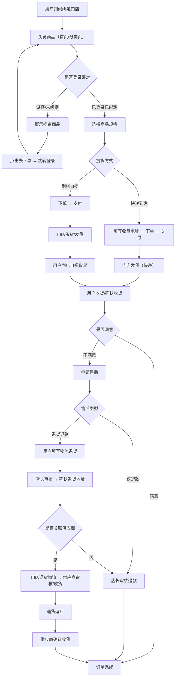
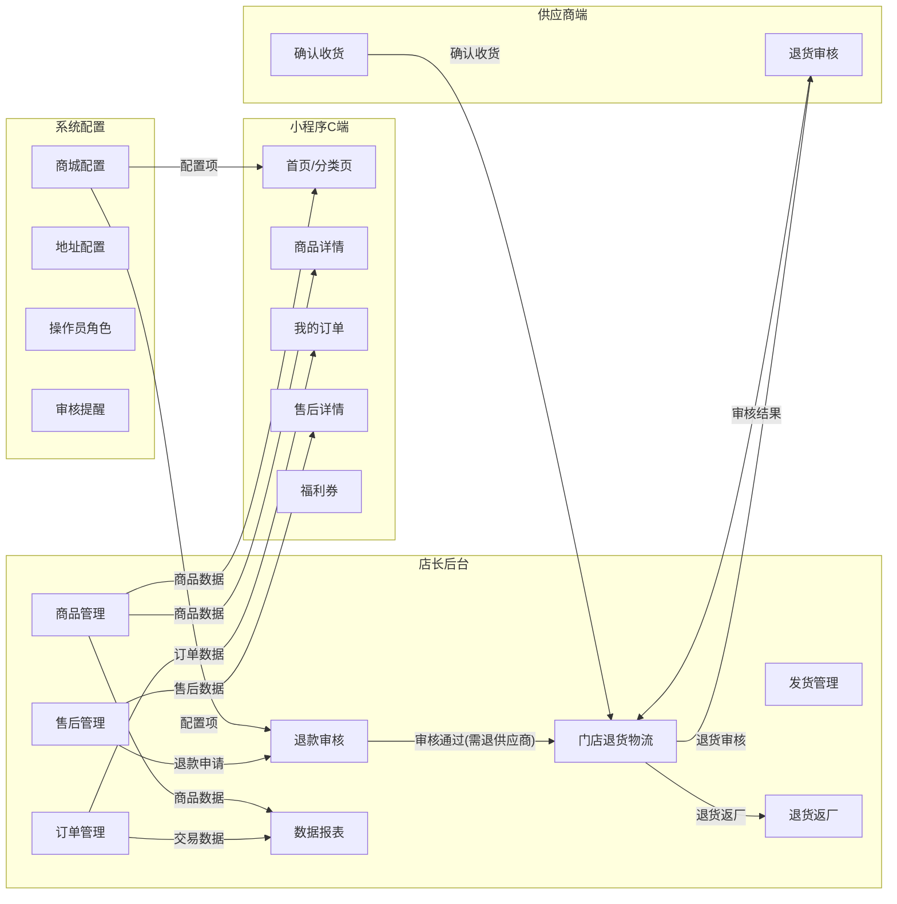
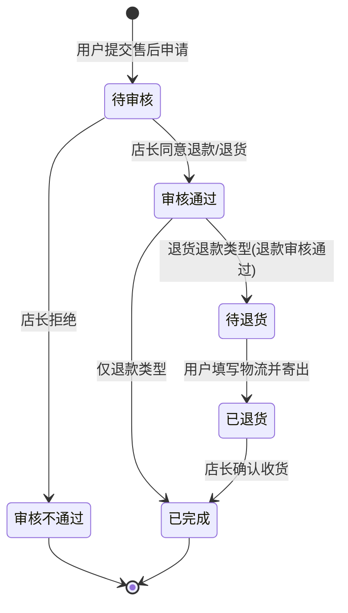
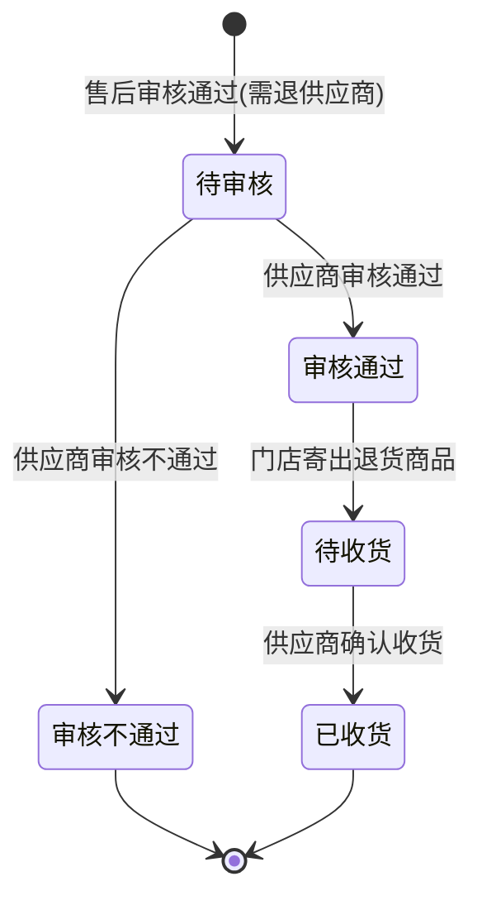
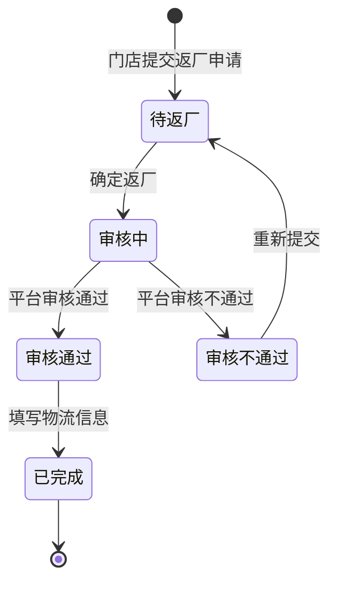
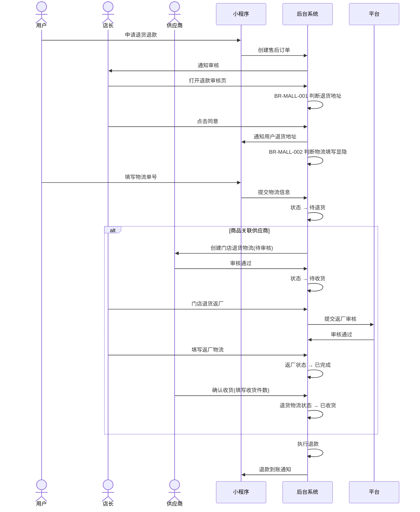
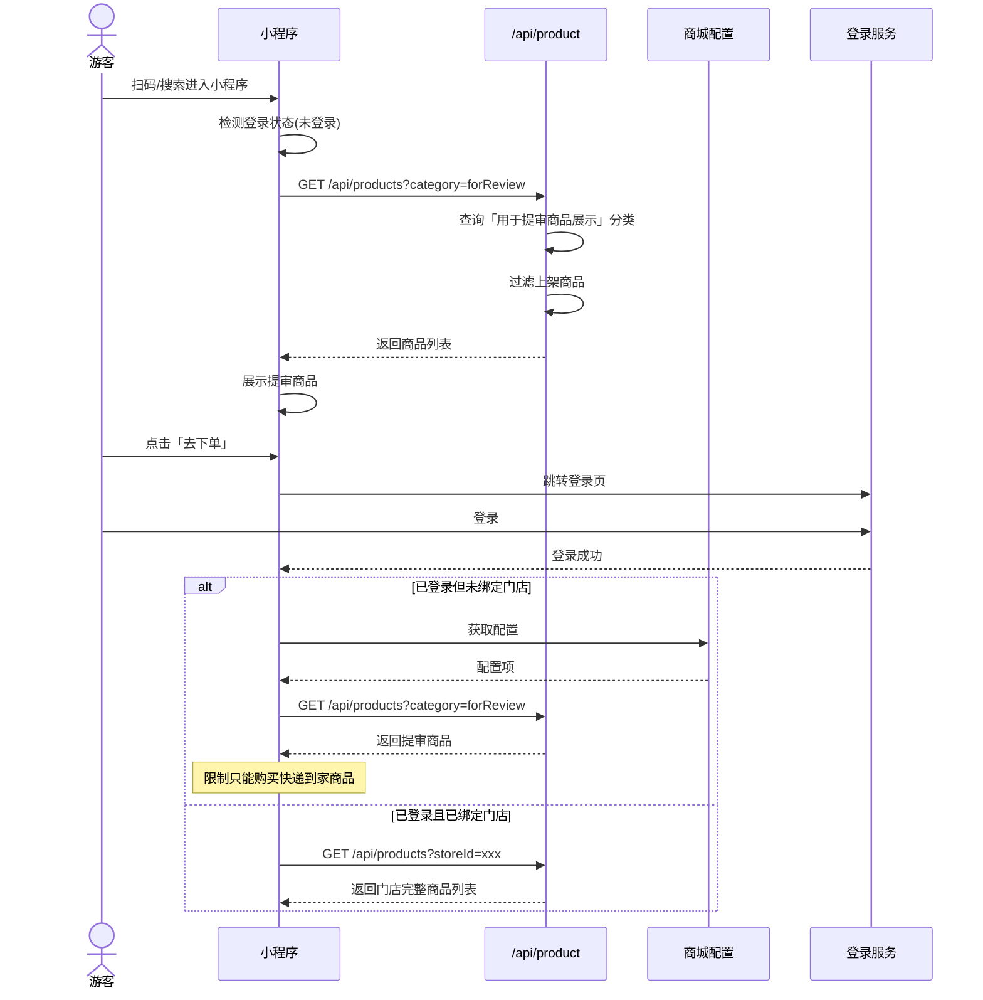

# 百货商城 PRD — 私域直播电商 v1.6.1

> **版本历史**
>
> | 版本 | 日期 | 作者 | 变更说明 |
> |------|------|------|----------|
> | 1.0.0 | 2026-07-15 | 学习工作流自动生成 | 基于原型 v1_6_1 全量提取 |
>
> **源材料**：Axure RP 原型 HTML（v1_6_1，共 29 个业务页面）
>
> **业务领域**：私域直播电商（百货商城）

---

## 目录

1. [背景与问题陈述](#1-背景与问题陈述)
2. [目标与成功度量](#2-目标与成功度量)
3. [范围（In-Scope / Non-Goals）](#3-范围in-scope--non-goals)
4. [与既有模块关系](#4-与既有模块关系)
5. [业务目标映射](#5-业务目标映射)
6. [用户故事](#6-用户故事)
7. [功能需求列表与用例](#7-功能需求列表与用例)
8. [业务规则](#8-业务规则)
9. [数据实体](#9-数据实体)
10. [验收标准](#10-验收标准)
11. [指标登记](#11-指标登记)
12. [五类图](#12-五类图)
13. [外部接口标注](#13-外部接口标注)
14. [检查清单](#14-检查清单)

---

## 1. 背景与问题陈述

### 1.1 业务背景

百货商城是一款**私域直播电商**SaaS 产品，面向门店/连锁零售场景。系统以"门店+小程序"为核心，支持：
- 门店管理后台（商品、订单、库存、发货、售后）
- 小程序 C 端（会员浏览商品、下单、查看订单）
- 供应商协同（退货返厂、门店退货物流）

### 1.2 核心业务流程概览

系统围绕"用户扫码绑定门店 → 浏览商品 → 下单（到店自提 / 快递到家）→ 支付 → 门店发货/备货 → 收货 → 售后/退款"的全链路展开。

### 1.3 版本 v1.6.1 核心变更

本轮迭代重点增强：
- **售后与退款**流程细化（退货地址智能判断、物流填写可选配置）
- **退货返厂**流程（门店 → 供应商退换货）
- **门店退货物流**（供应商审核 + 确认收货）
- **小程序端**游客模式商品展示、待收货入口显隐控制
- **福利券**系统后台发放能力
- **数据报表**多维统计

---

## 2. 目标与成功度量

| 目标 | 度量指标 | 基线 | 目标值 |
|------|----------|------|--------|
| 提升售后处理效率 | 售后订单平均处理时长 | — | < 24h |
| 降低退货物流纠纷 | 退货地址匹配准确率 | — | ≥ 95% |
| 提高游客转化率 | 游客→注册转化率 | — | ≥ 5% |
| 供应商退货效率 | 退货返厂周期 | — | < 7 天 |

---

## 3. 范围（In-Scope / Non-Goals）

### In-Scope
- 商品管理（分类、上架/下架、提审商品标记）
- 订单管理（全部/待付款/待发货/待收货/已完成/已关闭）
- 库存管理（库存查询、预警、调拨）
- 发货管理（发货表管理、生成发货单、导入发货）
- 收货管理（确认收货）
- 售后管理（退款/退货退款、售后订单）
- 退款审核（店长端审核、退货地址判断）
- 门店退货物流（供应商审核 + 收货确认）
- 退货返厂（门店→供应商退换货）
- 调拨管理（门店间调拨）
- 交易相关（支付流水）
- 数据报表（销售、商品、会员统计）
- 小程序端（我的订单/店铺订单、包裹物流、福利券、地址配置）
- 系统配置（操作员角色、审核提醒、更多模块显隐、待收货入口显隐）
- 游客/未绑定门店商品展示

### Non-Goals
- 支付网关对接细节
- 物流 API 对接细节
- 消息推送通道实现
- 优惠券/满减营销引擎

---

## 4. 与既有模块关系

本系统为独立百货商城产品，核心模块关系如下：

```
商品管理 ←→ 订单管理
订单管理 → 发货管理 → 收货管理
订单管理 → 售后管理 → 退款审核 → 门店退货物流 → 退货返厂
库存管理 ↔ 调拨管理
商品管理 ←→ 库存管理
交易相关 ←→ 订单管理
数据报表 ←→ 商品/订单/会员
```

---

## 5. 业务目标映射

| 业务目标（BO） | 业务目标组（BG） | 关联功能（FN） |
|----------------|-----------------|---------------|
| BO-001 商品上架销售 | BG-001 商品运营 | FN-MALL-001~004 |
| BO-002 订单全链路管理 | BG-002 交易闭环 | FN-MALL-005~009 |
| BO-003 售后服务质量 | BG-003 售后服务 | FN-MALL-010~015 |
| BO-004 供应商协同 | BG-004 供应链 | FN-MALL-016~018 |
| BO-005 数据驱动运营 | BG-005 数据分析 | FN-MALL-019 |
| BO-006 会员转化与留存 | BG-006 会员运营 | FN-MALL-020~022 |
| BO-007 系统灵活配置 | BG-007 平台配置 | FN-MALL-023~027 |

---

## 6. 用户故事

### 6.1 门店管理员（店长/店员）

| ID | 标题 | 描述 | 优先级 |
|----|------|------|--------|
| US-001 | 管理商品上下架 | 作为门店管理员，我希望能管理商品的分类、上架/下架状态，以便控制小程序端展示的商品 | P0 |
| US-002 | 查看和处理订单 | 作为门店管理员，我希望能在后台查看所有订单状态并处理发货 | P0 |
| US-003 | 处理售后 | 作为门店管理员，我希望能在后台审核退款/退货申请并管理退货物流 | P0 |
| US-004 | 管理库存 | 作为门店管理员，我希望能查看库存并处理调拨 | P1 |
| US-005 | 查看数据报表 | 作为门店管理员，我希望能看到销售、商品、会员等维度统计数据 | P1 |
| US-006 | 处理退货返厂 | 作为门店管理员，我希望能将退货商品退回给供应商 | P1 |

### 6.2 供应商

| ID | 标题 | 描述 | 优先级 |
|----|------|------|--------|
| US-007 | 审核退货 | 作为供应商，我希望能审核门店的退货申请 | P1 |
| US-008 | 确认收货 | 作为供应商，我希望能确认收到门店退回的商品 | P1 |

### 6.3 会员/C端用户

| ID | 标题 | 描述 | 优先级 |
|----|------|------|--------|
| US-009 | 浏览商品 | 作为用户，我希望能在小程序浏览商品并下单 | P0 |
| US-010 | 查看订单和物流 | 作为用户，我希望能在小程序查看我的订单和包裹物流 | P0 |
| US-011 | 申请售后 | 作为用户，我希望能在小程序申请退款/退货 | P0 |
| US-012 | 游客浏览商品 | 作为未登录用户，我希望能浏览商品后再决定是否注册 | P1 |
| US-013 | 使用福利券 | 作为会员，我希望能查看和使用系统发放的福利券 | P2 |

---

## 7. 功能需求列表与用例

### 功能需求清单

| 编号 | 名称 | 页面 | 关联 BG | 优先级 |
|------|------|------|---------|--------|
| FN-MALL-001 | 商品分类管理 | 商品管理 | BG-001 | P0 |
| FN-MALL-002 | 商品新建/编辑 | 商品管理 | BG-001 | P0 |
| FN-MALL-003 | 商品上架/下架 | 商品管理 | BG-001 | P0 |
| FN-MALL-004 | 提审商品分类设置 | 商品管理 | BG-001 | P1 |
| FN-MALL-005 | 订单列表查询 | 订单管理 | BG-002 | P0 |
| FN-MALL-006 | 订单详情查看 | 订单管理 | BG-002 | P0 |
| FN-MALL-007 | 发货管理 | 发货表管理 / 生成发货单 | BG-002 | P0 |
| FN-MALL-008 | 收货管理 | 收货管理 | BG-002 | P0 |
| FN-MALL-009 | 交易流水查询 | 交易相关 | BG-002 | P1 |
| FN-MALL-010 | 售后订单列表 | 售后管理 | BG-003 | P0 |
| FN-MALL-011 | 退款/售后详情 | 退款_售后订单 | BG-003 | P0 |
| FN-MALL-012 | 退款审核（店长端） | 退款审核 | BG-003 | P0 |
| FN-MALL-013 | 填写物流单号 | 退款_售后订单 | BG-003 | P0 |
| FN-MALL-014 | 商家退货信息 | 退款_售后订单 | BG-003 | P0 |
| FN-MALL-015 | 售后订单状态流转 | 售后管理 | BG-003 | P0 |
| FN-MALL-016 | 门店退货物流 | 门店退货物流 | BG-004 | P1 |
| FN-MALL-017 | 退货返厂 | 退货返厂 | BG-004 | P1 |
| FN-MALL-018 | 调拨管理 | 调拨管理 | BG-004 | P1 |
| FN-MALL-019 | 数据报表 | 数据报表 | BG-005 | P1 |
| FN-MALL-020 | 小程序我的订单 | 我的订单_店铺订单 | BG-006 | P0 |
| FN-MALL-021 | 包裹物流查询 | 我的订单_店铺订单 | BG-006 | P0 |
| FN-MALL-022 | 福利券 | 福利券 | BG-006 | P2 |
| FN-MALL-023 | 地址配置 | 地址配置 | BG-007 | P1 |
| FN-MALL-024 | 操作员角色管理 | 操作员角色 | BG-007 | P1 |
| FN-MALL-025 | 审核提醒 | 审核提醒 | BG-007 | P2 |
| FN-MALL-026 | 更多模块显示/隐藏 | 更多模块显示_隐藏 | BG-007 | P2 |
| FN-MALL-027 | 待收货入口显示/隐藏 | 待收货入口显示_隐藏 | BG-007 | P2 |
| FN-MALL-028 | 游客/未绑定商品展示 | 未登录_未绑定展示商品 | BG-006 | P1 |
| FN-MALL-029 | 库存管理 | 库存管理 | BG-002 | P1 |

---

### 用例详情

#### FN-MALL-011：退款/售后详情

| 属性 | 值 |
|------|-----|
| **用例编号** | UC-MALL-011 |
| **名称** | 退款/售后订单详情查看与操作 |
| **页面** | 小程序-我的订单/店铺订单-退款/售后-售后详情 |
| **参与者** | 会员用户 |
| **优先级** | P0 |
| **关联 BG** | BG-003 |
| **自动化类型** | 手动 + 系统自动 |

**前置条件**：
1. 用户已登录并绑定门店
2. 用户存在一笔售后中的订单

**基本流程**：
1. [用户操作] 用户进入「我的订单/店铺订单」→ 点击「退款/售后」tab
2. [系统自动] 系统展示售后订单列表（含订单号、商品信息、售后类型、售后状态）
3. [用户操作] 用户点击某笔售后订单 → 进入售后详情页
4. [系统自动] 系统展示售后详情（订单信息、售后类型、退款金额、售后状态、商家退货信息、填写物流单号按钮）
5. [用户操作] 如售后类型为「退货退款」，用户查看商家退货信息，填写物流单号并提交
6. [系统自动] 系统更新售后状态并通知店长

**备选流程**：
- 5a. 自提订单退货 → 根据后台配置【自提订单退货地址是否默认为门店地址】判断退货地址（BR-MALL-001）
- 5b. 自提订单 + 配置【自提订单退货是否需要填写物流信息】= 否 → 不显示「填写物流单号」按钮（BR-MALL-002）
- 5c. 快递到家订单 → 强制显示「填写物流单号」按钮

**数据范围**：R/W — 售后订单、退货物流信息
**后置条件**：售后状态更新，店长收到审核通知

---

#### FN-MALL-012：退款审核（店长端）

| 属性 | 值 |
|------|-----|
| **用例编号** | UC-MALL-012 |
| **名称** | 店长退款审核 |
| **页面** | 店长后台-退款审核 |
| **参与者** | 店长/门店管理员 |
| **优先级** | P0 |
| **关联 BG** | BG-003 |
| **自动化类型** | 手动 + 系统自动 |

**前置条件**：
1. 存在待审核的退款/退货申请
2. 店长已登录

**基本流程**：
1. [系统自动] 店长进入退款审核页面，展示待审核退款列表
2. [用户操作] 店长点击某笔退款 → 查看详情
3. [用户操作] 店长点击「同意」→ 弹窗显示退货地址信息（BR-MALL-001 判断逻辑）
4. [系统自动] 确认同意后，系统更新售后状态为「审核通过/待退货」
5. [用户操作] 或店长点击「审核不通过」→ 填写原因
6. [系统自动] 系统通知用户审核结果

**备选流程**：
- 3a. 退货地址判断（BR-MALL-001）
- 5a. 审核不通过 → 售后单关闭，退款不执行

**数据范围**：R/W — 退款审核记录、售后订单状态
**后置条件**：售后状态变更，用户收到通知

---

#### FN-MALL-016：门店退货物流

| 属性 | 值 |
|------|-----|
| **用例编号** | UC-MALL-016 |
| **名称** | 门店退货物流管理 |
| **页面** | 店长后台-门店退货物流 |
| **参与者** | 店长、供应商 |
| **优先级** | P1 |
| **关联 BG** | BG-004 |
| **自动化类型** | 手动 + 系统自动 |

**前置条件**：
1. 售后审核通过，需退回供应商
2. 存在关联供应商信息

**基本流程**：
1. [系统自动] 店长进入门店退货物流页面，展示退货列表（全部/待审核/审核通过/审核不通过/待收货/已收货）
2. [用户操作] 店长可通过供应商名称/ID 搜索退货记录
3. [系统自动] 待审核状态 → 供应商进行审核
4. [用户操作] 供应商点击「审核通过」或「审核不通过」
5. [系统自动] 审核通过后 → 状态变为「待收货」
6. [用户操作] 门店将商品寄出，供应商收到后点击「确认收货」→ 填写收货件数
7. [系统自动] 状态变为「已收货」

**数据范围**：R/W — 门店退货物流记录、审核状态
**后置条件**：退货流程闭环，库存更新

---

#### FN-MALL-017：退货返厂

| 属性 | 值 |
|------|-----|
| **用例编号** | UC-MALL-017 |
| **名称** | 门店退货返厂（供应商退换货） |
| **页面** | 店长后台-退货返厂 |
| **参与者** | 店长 |
| **优先级** | P1 |
| **关联 BG** | BG-004 |
| **自动化类型** | 手动 + 系统自动 |

**前置条件**：
1. 门店存在需退回供应商的商品
2. 商品关联供应商信息

**基本流程**：
1. [系统自动] 店长进入退货返厂页面，展示商品列表（按商品名称搜索）
2. [系统自动] 列表按 Tab 分类：待返厂 / 审核中 / 审核不通过 / 审核通过 / 已完成
3. [用户操作] 在「待返厂」tab，店长勾选商品 → 点击「确定返厂」
4. [系统自动] 状态变为「审核中」
5. [事件驱动] 平台审核通过后 → 状态变为「审核通过」，需店长填写物流信息
6. [用户操作] 店长填写物流信息并提交 → 状态变为「已完成」

**备选流程**：
- 5a. 平台审核不通过 → 状态变为「审核不通过」，可重新提交

**数据范围**：R/W — 退货返厂记录、物流信息
**后置条件**：商品返厂完成，库存扣减

---

#### FN-MALL-028：游客/未绑定商品展示

| 属性 | 值 |
|------|-----|
| **用例编号** | UC-MALL-028 |
| **名称** | 未登录/未绑定门店下商品展示 |
| **页面** | 小程序-首页/分类页 |
| **参与者** | 游客/未绑定门店用户 |
| **优先级** | P1 |
| **关联 BG** | BG-006 |
| **自动化类型** | 系统自动 |

**前置条件**：
1. 后台已设置「用于提审商品展示」分类及上架商品

**基本流程**：
1. [系统自动] 用户以游客模式进入小程序 → 首页和分类页展示「用于提审商品展示」分类下全部上架商品
2. [用户操作] 用户点击商品查看详情/规格 → 点击「去下单」
3. [系统自动] 跳转至登录页，要求用户登录
4. [事件驱动] 登录后展示的页面与触发登录时的页面保持一致

**备选流程**：
- 1a. 用户已登录但未绑定门店 → 首页和分类页展示「用于提审商品展示」分类商品
- 1b. 未绑定门店用户可下单「快递到家」商品（需设置收货地址）
- 1c. 未绑定门店用户尝试下单「到店自提」商品 → 提示：请先扫码门店邀请码绑定门店后再下单！（**已作废**：现限制未绑定门店用户只能购买快递到家商品）

**数据范围**：R — 提审分类商品
**后置条件**：用户登录/绑定后可见完整商品列表

---

## 8. 业务规则

### BR-MALL-001：退货地址智能判断

> **触发条件**：用户申请退货退款，需回显退货地址
>
> **规则**：
> 1. **自提订单**：
>    - 检查后台配置项【自提订单退货地址是否默认为门店地址】
>    - 若为「是」→ 直接默认回显门店的地址信息
>    - 若为「否」→ 判断订单商品是否关联供应商：
>      - 有关联供应商 → 回显供应商地址信息
>      - 无关联供应商 → 回显门店地址信息
> 2. **快递到家订单**：
>    - 判断订单商品是否关联供应商：
>      - 有关联供应商 → 回显供应商地址信息
>      - 无关联供应商 → 回显平台地址信息

### BR-MALL-002：物流单号填写控制

> **触发条件**：售后类型为「退货退款」
>
> **规则**：
> 1. **自提订单**：
>    - 检查后台配置项【自提订单退货是否需要填写物流信息】
>    - 若为「否」→ 页面不显示「填写物流单号」按钮
>    - 若为「是」→ 页面显示「填写物流单号」按钮
> 2. **快递到家订单**：
>    - 必须填写物流单号 → 页面一定显示「填写物流单号」按钮

### BR-MALL-003：待收货入口显隐

> **触发条件**：小程序-我的页面/我的订单列表/店铺订单列表
>
> **规则**：根据后台-商城-商城配置-【是否显示待收货订单状态】配置项，控制以下位置「待收货」入口的显示/隐藏：
> 1. 小程序-我的页面 → 我的订单中的「待收货」入口
> 2. 小程序-我的订单列表 →「待收货」tab
> 3. 小程序-店铺订单列表 →「待收货」tab

### BR-MALL-004：更多模块权限控制

> **触发条件**：小程序-店长店员端/会员端-更多模块
>
> **规则**：根据后台-商城-商城配置-【小程序更多模块权限】配置项，控制对应功能入口的显示或隐藏

### BR-MALL-005：包裹物流多单号展示

> **触发条件**：同一快递公司录入多个快递单号
>
> **规则**：
> - 每个快递单号作为一个独立包裹
> - 分别查询每个快递单号的物流轨迹
> - 多物流单号时，新增「全部」选项，点击可展示当前全部包裹信息
> - 选择特定包裹后，物流详情处展示对应包裹的物流轨迹
> - 点击右上角「X」关闭弹窗

### BR-MALL-006：游客模式商品展示

> **触发条件**：用户以游客模式（未登录）访问小程序
>
> **规则**：
> 1. 游客模式（未登录）→ 首页和分类页展示「用于提审商品展示」分类下全部上架商品
> 2. 登录未绑定门店 → 同样展示「用于提审商品展示」分类商品
> 3. 游客点击「去下单」→ 跳转登录页
> 4. 未绑定门店用户 → 限制只能购买「快递到家」商品
> 5. 商品展示模式与绑定门店后一致

### BR-MALL-007：福利券系统发放

> **触发条件**：后台操作员操作发放福利券
>
> **规则**：在小程序-我的-福利券列表-券明细中，由后台操作员操作发放给用户的福利券，领取说明记录为「系统后台发放」

---

## 9. 数据实体

### ENT-MALL-001：商品（Product）

| 字段 | 类型 | 说明 |
|------|------|------|
| productId | String | 商品 ID |
| productName | String | 商品名称 |
| categoryId | String | 所属分类 ID |
| categoryName | String | 分类名称 |
| isForReview | Boolean | 是否用于提审商品展示 |
| status | Enum | 上架/下架 |
| supplierId | String | 关联供应商 ID |
| stockQuantity | Number | 库存数量 |
| price | Decimal | 商品价格 |
| deliveryType | Enum | 到店自提/快递到家 |
| createdAt | DateTime | 创建时间 |
| updatedAt | DateTime | 更新时间 |

### ENT-MALL-002：订单（Order）

| 字段 | 类型 | 说明 |
|------|------|------|
| orderId | String | 订单 ID |
| orderNo | String | 订单编号 |
| userId | String | 用户 ID |
| storeId | String | 门店 ID |
| status | Enum | 待付款/待发货/待收货/已完成/已关闭 |
| deliveryType | Enum | 到店自提/快递到家 |
| totalAmount | Decimal | 订单总金额 |
| products | Array\<OrderProduct\> | 订单商品列表 |
| shippingAddress | Object | 收货地址 |
| packages | Array\<Package\> | 包裹列表 |
| createdAt | DateTime | 创建时间 |

### ENT-MALL-003：售后订单（RefundOrder）

| 字段 | 类型 | 说明 |
|------|------|------|
| refundId | String | 售后订单 ID |
| orderId | String | 关联原订单 ID |
| refundType | Enum | 仅退款/退货退款 |
| refundAmount | Decimal | 退款金额 |
| refundReason | String | 退款原因 |
| status | Enum | 待审核/审核通过/审核不通过/待退货/已退货/已完成 |
| returnAddress | Object | 退货地址信息 |
| logisticsInfo | Object | 退货物流信息 |
| createdAt | DateTime | 创建时间 |

### ENT-MALL-004：门店退货物流（StoreReturnLogistics）

| 字段 | 类型 | 说明 |
|------|------|------|
| returnLogisticsId | String | 退货物流 ID |
| supplierId | String | 供应商 ID |
| supplierName | String | 供应商名称 |
| storeId | String | 门店 ID |
| status | Enum | 待审核/审核通过/审核不通过/待收货/已收货 |
| returnAddress | Object | 退货地址 |
| receivedQuantity | Number | 收货件数 |
| remark | String | 备注 |
| reviewTime | DateTime | 审核时间 |
| createdAt | DateTime | 创建时间 |

### ENT-MALL-005：退货返厂（FactoryReturn）

| 字段 | 类型 | 说明 |
|------|------|------|
| factoryReturnId | String | 退货返厂 ID |
| productId | String | 商品 ID |
| supplierId | String | 供应商 ID |
| status | Enum | 待返厂/审核中/审核不通过/审核通过/已完成 |
| logisticsInfo | Object | 物流信息 |
| createdAt | DateTime | 创建时间 |

### ENT-MALL-006：福利券（Coupon）

| 字段 | 类型 | 说明 |
|------|------|------|
| couponId | String | 券 ID |
| userId | String | 用户 ID |
| type | Enum | 福利券类型 |
| issueSource | String | 发放来源（系统后台发放等） |
| issueTime | DateTime | 发放时间 |
| status | Enum | 未使用/已使用/已过期 |

---

## 10. 验收标准

### 10.1 场景级 E2E 验收

| 编号 | 场景 | Given | When | Then |
|------|------|-------|------|------|
| SC-MALL-001 | 用户完整购物流程 | 用户已登录并绑定门店 | 浏览商品→选择规格→下单→支付 | 订单创建成功，店长后台可见新订单 |
| SC-MALL-002 | 用户退货退款流程 | 用户有一笔已完成的订单 | 申请退货退款→填写物流→店长审核 | 售后状态正确流转，退款成功到账 |
| SC-MALL-003 | 游客浏览商品流程 | 用户未登录小程序 | 打开小程序首页 | 可见提审分类商品，点击下单跳转登录页 |
| SC-MALL-004 | 门店退货返厂流程 | 门店有需退供应商的商品 | 店长提交返厂申请→平台审核→填写物流 | 返厂状态正确流转至「已完成」 |
| SC-MALL-005 | 门店退货物流流程 | 售后审核通过需退供应商 | 供应商审核→门店寄出→供应商确认收货 | 退货物流状态正确流转至「已收货」 |

### 10.2 功能级验收矩阵

| FN 编号 | Give-When-Then |
|---------|---------------|
| FN-MALL-011 | **Give** 用户有一笔售后中的退货退款订单 **When** 进入售后详情页 **Then** ①退货地址按 BR-MALL-001 正确回显 ②物流填写按钮按 BR-MALL-002 正确显隐 |
| FN-MALL-012 | **Give** 店长收到退款申请 **When** 点击「同意」 **Then** 弹窗展示正确退货地址（BR-MALL-001），审核后状态正确更新 |
| FN-MALL-016 | **Give** 门店退货物流列表 **When** 供应商搜索/审核/确认收货 **Then** 状态在 6 个 tab 间正确流转 |
| FN-MALL-017 | **Give** 退货返厂商品列表 **When** 店长提交返厂→平台审核→填写物流 **Then** 状态在 5 个 tab 间正确流转 |
| FN-MALL-021 | **Give** 订单有多包裹 **When** 用户点击查看物流 **Then** 按 BR-MALL-005 展示包裹切换和物流详情 |
| FN-MALL-028 | **Give** 游客模式 **When** 访问首页/分类页 **Then** 按 BR-MALL-006 展示提审分类商品，下单跳转登录 |

---

## 11. 指标登记

| 指标 ID | 名称 | 数据源 | 计算方式 | 上报频率 |
|---------|------|--------|----------|----------|
| MET-001 | 订单量 | 订单表 | COUNT(orderId) | 每日 |
| MET-002 | 售后率 | 售后订单表 | COUNT(refundId)/COUNT(orderId) | 每日 |
| MET-003 | 退款审核平均时长 | 退款审核记录 | AVG(审核时间-申请时间) | 每周 |
| MET-004 | 游客转化率 | 用户表 | 登录用户数/游客访问数 | 每周 |
| MET-005 | 退货返厂周期 | 退货返厂表 | AVG(完成时间-提交时间) | 每月 |

---

## 12. 五类图

### 12.1 业务流程图（整体交易闭环）



### 12.2 信息流转图（跨模块）



### 12.3 状态机：售后订单（RefundOrder）



**状态过渡操作表**

| 当前状态 | 触发操作 | 目标状态 | 操作者 | 前置约束 | 后置动作 |
|----------|----------|----------|--------|----------|----------|
| — | 提交售后申请 | 待审核 | 用户 | 订单已完成/已发货 | 通知店长审核 |
| 待审核 | 店长同意 | 审核通过 | 店长 | 售后类型确定 | 根据售后类型分流 |
| 待审核 | 店长拒绝 | 审核不通过 | 店长 | — | 通知用户，售后关闭 |
| 审核通过 | 用户填写物流寄出 | 待退货 | 用户 | 售后类型=退货退款 | 通知店长待收货 |
| 待退货 | 店长确认收货 | 已退货 | 店长 | — | 触发退款，更新库存 |
| 审核通过 | 系统自动退款 | 已完成 | 系统 | 售后类型=仅退款 | 退款到账，通知用户 |
| 已退货 | 系统自动退款 | 已完成 | 系统 | 店长确认收货 | 退款到账，通知用户 |

### 12.4 状态机：门店退货物流（StoreReturnLogistics）



**状态过渡操作表**

| 当前状态 | 触发操作 | 目标状态 | 操作者 | 前置约束 | 后置动作 |
|----------|----------|----------|--------|----------|----------|
| — | 售后审核通过 | 待审核 | 系统 | 商品关联供应商 | 通知供应商审核 |
| 待审核 | 审核通过 | 审核通过 | 供应商 | — | 通知门店寄出商品 |
| 待审核 | 审核不通过 | 审核不通过 | 供应商 | — | 通知门店，流程结束 |
| 审核通过 | 门店寄出商品 | 待收货 | 门店 | — | 通知供应商待收货 |
| 待收货 | 确认收货 | 已收货 | 供应商 | 填写收货件数 | 库存更新，流程结束 |

### 12.5 状态机：退货返厂（FactoryReturn）



**状态过渡操作表**

| 当前状态 | 触发操作 | 目标状态 | 操作者 | 前置约束 | 后置动作 |
|----------|----------|----------|--------|----------|----------|
| — | 提交返厂申请 | 待返厂 | 店长 | 商品关联供应商 | — |
| 待返厂 | 确定返厂 | 审核中 | 店长 | — | 通知平台审核 |
| 审核中 | 审核通过 | 审核通过 | 平台 | — | 通知店长填写物流 |
| 审核中 | 审核不通过 | 审核不通过 | 平台 | — | 店长可重新提交 |
| 审核通过 | 填写物流 | 已完成 | 店长 | — | 库存扣减 |
| 审核不通过 | 重新提交 | 待返厂 | 店长 | — | — |

### 12.6 业务时序图：退货退款完整流程



### 12.7 三方接口时序图：游客商品展示



---

## 13. 外部接口标注

| 接口 | 用途 | 方向 |
|------|------|------|
| 物流轨迹查询 API | 查询快递单号物流轨迹 | 调用外部 |
| 支付网关 | 微信支付等支付通道 | 调用外部 |
| 消息推送 | 审核通知、状态变更通知 | 调用外部 |
| 小程序码服务 | 生成门店邀请码/小程序码 | 调用外部 |

---

## 14. 检查清单

- [x] 编号体系完整（FN/UC/BR/ENT/SC）
- [x] 15 章结构完整
- [x] 用例模板包含：表格/前置条件/基本流程/备选流程/数据范围/后置条件
- [x] 五图齐全：业务流程图 ✓ 信息流转图 ✓ 状态机(3个) ✓ 状态过渡操作表(3个) ✓ 业务时序图 ✓ 三方接口时序图 ✓
- [x] 业务规则独立编号 BR-MALL-{NNN}
- [x] 验收标准双层（场景级 E2E + 功能级矩阵）
- [x] 无实现细节（路由/组件/Store/Mock）
- [x] 数据实体定义完整
- [x] 指标登记

---

> **生成说明**：本文档基于 Axure RP 原型 HTML（v1_6_1，共 29 个业务页面）自动学习生成。所有业务规则、功能需求、状态流转均从原型中直接提取，未添加推测性内容。部分纯 UI 页面（如 index.html、start*.html）未纳入功能分析。
