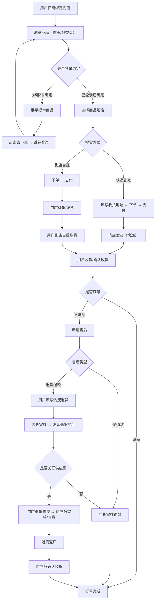
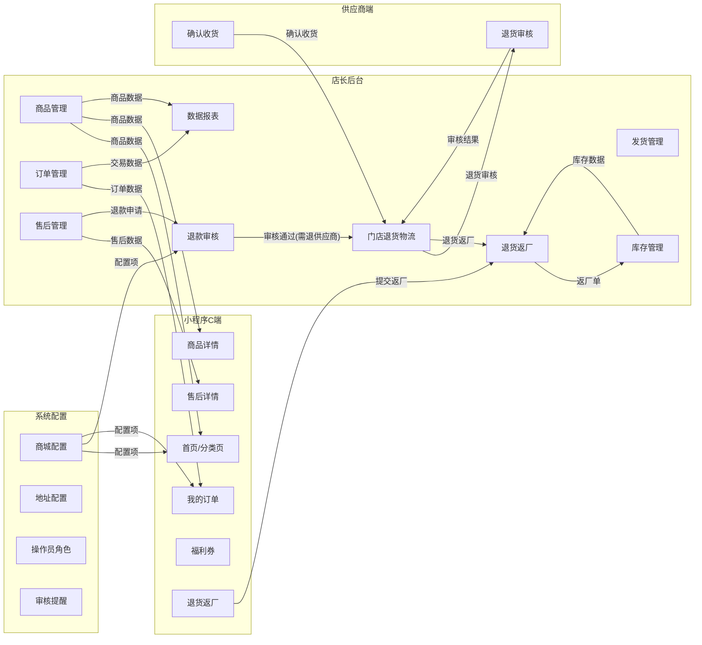
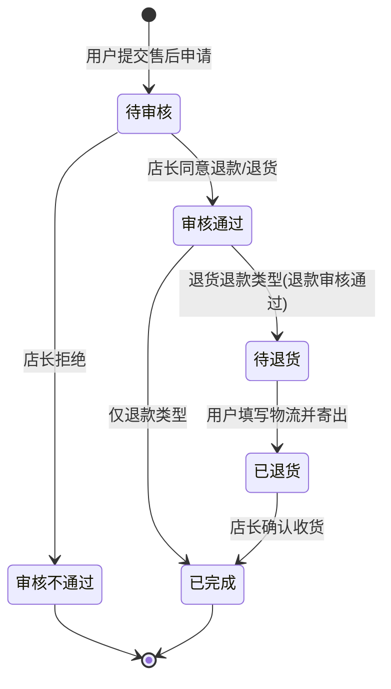
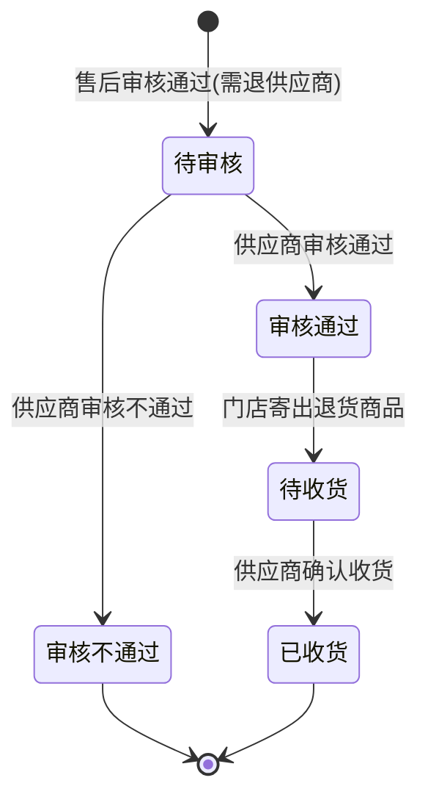
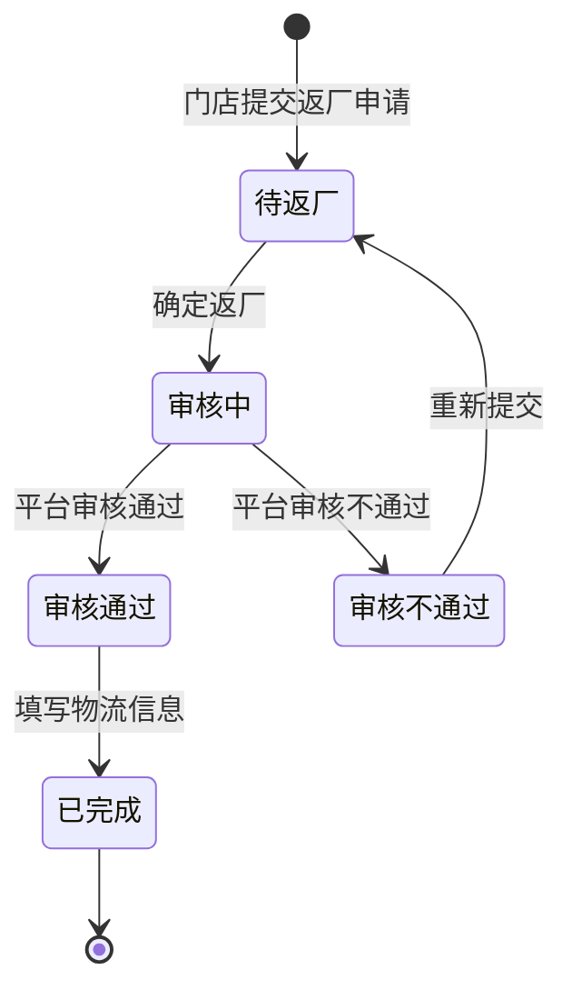
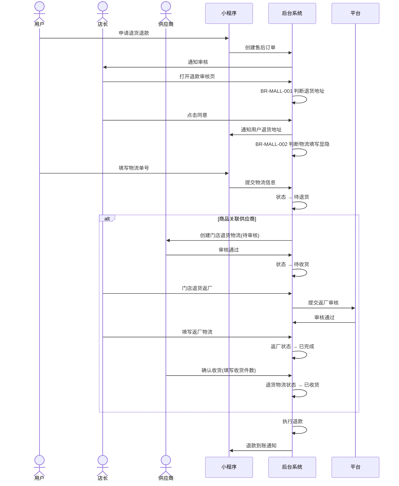
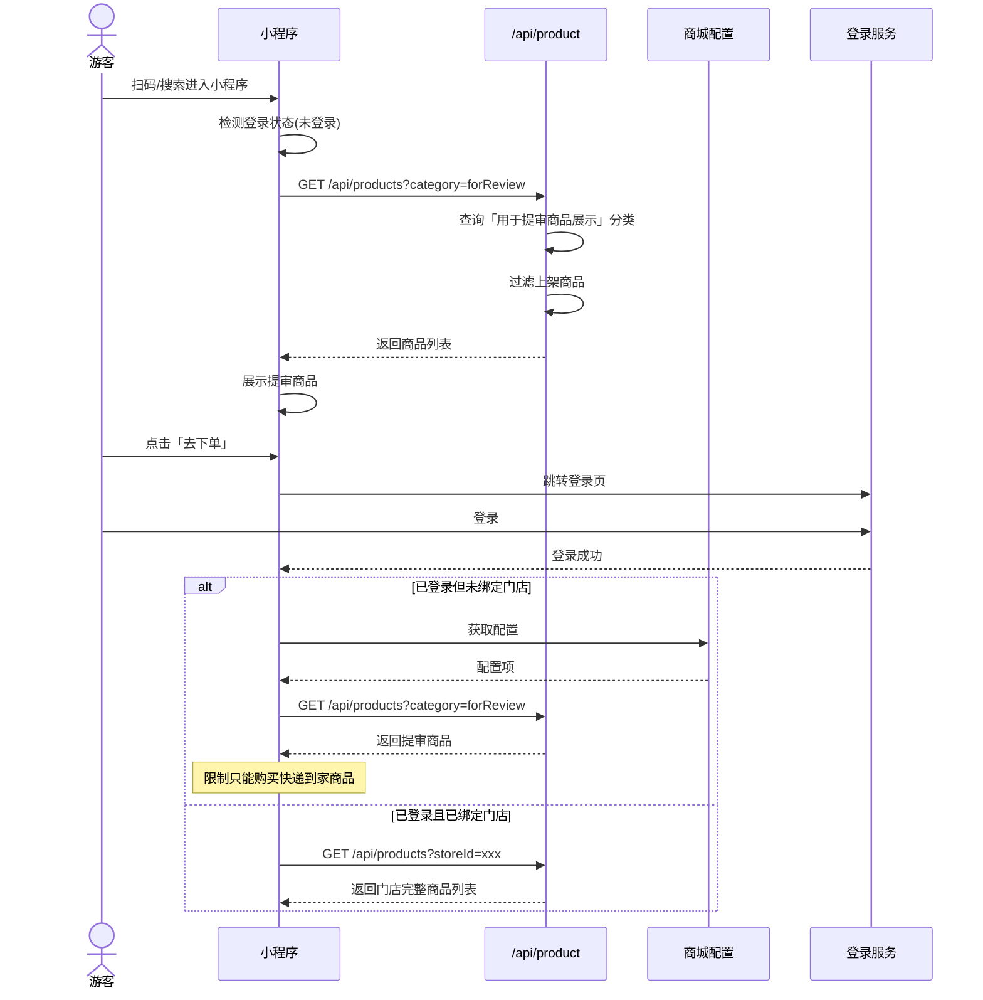
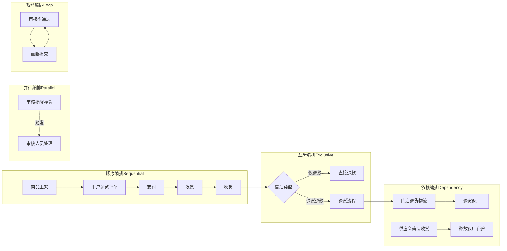
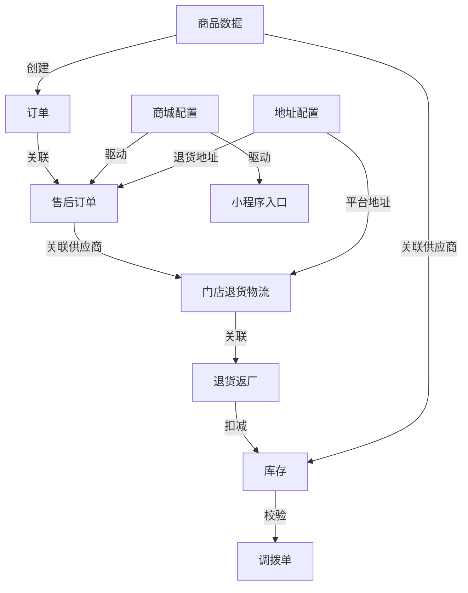

# 百货商城 超级需求文档 PRD v7.0.0 — 私域直播电商

> **版本历史**
>
> | 版本 | 日期 | 作者 | 变更说明 |
> |------|------|------|----------|
> | v1.0.0 | 2026-07-15 | BA Agent（learn-project v4.0.0） | 基于原型 v1_6_1 全量提取，4 卷分册 |
> | v1.6.1 | 2026-07-15 | BA Agent（learn-project v4.0.0） | 整卷合并，补全 BO/BG/MET/五图/三方接口 |
> | **v7.0.0** | **2026-07-21** | **BA+Arch Agent（learn-project V7.0.0）** | **双源整合（v1.0+v1.6.1）+ 场景深度还原引擎 + 双态标注 + 8项深度能力 + 依据链审计 + 追溯链对齐方案B扩展** |
>
> **源材料**：Axure RP 原型 HTML（v1_6_1，29 个业务页面）+ v1.0 4卷PRD + v1.6.1 PRD
>
> **业务领域**：私域直播电商（百货商城）
>
> **还原模式说明（V7.0.0 关键）**：
> - 📗 显式照录：原型/原PRD明确写出的内容照录不改（FR-01~05 保护）
> - 🟡 隐式挖掘还原：从原文≥2处碎片交叉印证还原的原本就存在但分散的需求（标注依据链）
> - 推测=无依据或单一依据过度解读（禁止）；挖掘=≥2处依据交叉印证还原原本存在的需求（允许）

---

## 目录

1. [背景与问题陈述](#1-背景与问题陈述)
2. [目标与成功度量](#2-目标与成功度量)
3. [范围（In-Scope / Non-Goals）](#3-范围in-scope--non-goals)
4. [与既有模块关系](#4-与既有模块关系)
5. [业务目标映射（BO/BG）](#5-业务目标映射bobg)
6. [用户故事](#6-用户故事)
7. [功能需求列表与用例（FN/UC）](#7-功能需求列表与用例fnuc)
8. [业务规则（BR）](#8-业务规则br)
9. [数据实体（ENT）](#9-数据实体ent)
10. [页面级用例（PG）](#10-页面级用例pg)
11. [验收标准（双层矩阵）](#11-验收标准双层矩阵)
12. [指标登记](#12-指标登记)
13. [五类图](#13-五类图)
14. [场景编排与深度还原（V7.0.0 新增）](#14-场景编排与深度还原v700-新增)
15. [CONFIG 集中配置清单](#15-config-集中配置清单)
16. [外部接口标注](#16-外部接口标注)
17. [非功能需求（NFR）](#17-非功能需求nfr)
18. [需求深度分析摘要](#18-需求深度分析摘要)
19. [检查清单](#19-检查清单)

---

## 1. 背景与问题陈述

### 1.1 业务背景

📗 **百货商城** 是一款**私域直播电商 SaaS 产品**，面向门店/连锁零售场景。系统以"门店+小程序"为核心，支持：
- 门店管理后台（商品、订单、库存、发货、售后）
- 小程序 C 端（会员浏览商品、下单、查看订单、福利券）
- 供应商协同（退货审核、确认收货）

### 1.2 核心业务流程概览

系统围绕"用户扫码绑定门店 → 浏览商品 → 下单（到店自提 / 快递到家）→ 支付 → 门店发货/备货 → 收货 → 售后/退款 → 退货返厂"的全链路展开。

### 1.3 版本 v1.6.1 核心变更

📗 本轮迭代重点增强（来源：原型版本描述.html）：
- **商品管理规格设置**：sku 子件数量设置默认值
- **发货表管理**：新增订单下单时间范围筛选 + 优化商品数量、发货物流包裹数量限制
- **订单管理**：新增商品子件数量字段统计 + 优化剩余商品数量取值
- **数据报表**：新增退货商品数据报表统计
- **门店退货物流流程优化**：涉及后台端门店退货物流和库存管理模块 + 小程序端退货返厂和库存管理模块
- **调拨管理**：新增门店间调拨时商品库存校验

### 1.4 问题陈述

📗 原型存在以下问题（详见学习报告，不写入 PRD 正文纠偏）：
- 部分页面标注"需UI出图"（库存管理小程序端、调拨管理、退货返厂）
- 多版本并存（v1_0_1 ~ v1_6_1，34 个版本），缺版本差异说明
- 缺少支付、物流对接、消息推送等三方接口的详细规格

---

## 2. 目标与成功度量

| 目标 | 度量指标 | 基线 | 目标值 |
|------|----------|------|--------|
| 提升售后处理效率 | 售后订单平均处理时长 | — | < 24h |
| 降低退货物流纠纷 | 退货地址匹配准确率 | — | ≥ 95% |
| 提高游客转化率 | 游客→注册转化率 | — | ≥ 5% |
| 供应商退货效率 | 退货返厂周期 | — | < 7 天 |

---

## 3. 范围（In-Scope / Non-Goals）

### 3.1 In-Scope

📗 源材料显式范围：
- 商品管理（分类、上架/下架、提审商品标记、sku 规格设置）
- 订单管理（全部/待付款/待发货/待收货/已完成/已关闭）
- 库存管理（库存查询、预警、调拨、返厂锁定/在途/出库）
- 发货管理（发货表管理、生成发货单、导入发货、多快递单号、多包裹物流）
- 收货管理（确认收货、多包裹物流查看）
- 售后管理（退款/退货退款、售后订单、退货地址智能判断、物流填写控制）
- 退款审核（店长端审核、退货地址判断）
- 门店退货物流（供应商审核 + 收货确认、6 状态流转）
- 退货返厂（门店→供应商退换货、5 状态流转）
- 调拨管理（门店间调拨、库存校验）
- 交易相关（支付流水配置）
- 数据报表（退货商品数据统计、数据权限隔离）
- 小程序端（我的订单/店铺订单、包裹物流、福利券、地址配置）
- 系统配置（操作员角色、审核提醒、更多模块显隐、待收货入口显隐）
- 游客/未绑定门店商品展示（提审商品分类）

### 3.2 Non-Goals

📗 源材料显式排除：
- 支付网关对接细节
- 物流 API 对接细节
- 消息推送通道实现
- 优惠券/满减营销引擎

🟡 **隐式挖掘·依据:v1.6.1 Non-Goals + v1.0 学习报告"建议补充项"交叉印证**
- 退货地址取值功能（v1.0 FN-STORE-05 明确标注"退货地址取值本版本先不做"）
- 多审逻辑的审批层级和顺序（v1.0 学习报告 F-02 明确"原型未说明什么场景下会出现多审"）

---

## 4. 与既有模块关系

📗 本系统为独立百货商城产品，核心模块关系：

```
商品管理 ←→ 订单管理
订单管理 → 发货管理 → 收货管理
订单管理 → 售后管理 → 退款审核 → 门店退货物流 → 退货返厂
库存管理 ↔ 调拨管理
商品管理 ←→ 库存管理
交易相关 ←→ 订单管理
数据报表 ←→ 商品/订单/会员
```

🟡 **隐式挖掘·依据:v1.6.1 §4 模块关系图 + v1.0 vol2 PG-商城配置-04 业务流程页交叉印证**
- 商城配置（交易相关/地址配置/操作员角色）作为横切关注点，被多个业务模块依赖：
  - 交易相关配置 → 售后管理（BR-MALL-001/002）+ 小程序待收货入口（BR-MALL-003）+ 更多模块（BR-MALL-004）
  - 地址配置 → 退货地址回显（BR-MALL-001 平台地址分支）
  - 操作员角色 → 地址配置菜单权限 + 供应商管理确认收货权限

---

## 5. 业务目标映射（BO/BG）

| 业务目标（BO） | 业务目标组（BG） | 关联功能（FN） |
|----------------|-----------------|---------------|
| BO-001 商品上架销售 | BG-001 商品运营 | FN-MALL-PC-001~008 |
| BO-002 订单全链路管理 | BG-002 交易闭环 | FN-MALL-PC-009~016 |
| BO-003 售后服务质量 | BG-003 售后服务 | FN-MALL-PC-017~021, FN-MALL-MP-001~003 |
| BO-004 供应商协同 | BG-004 供应链 | FN-MALL-PC-022~025, FN-MALL-SP-001~002 |
| BO-005 数据驱动运营 | BG-005 数据分析 | FN-MALL-PC-026 |
| BO-006 会员转化与留存 | BG-006 会员运营 | FN-MALL-MP-004~012 |
| BO-007 系统灵活配置 | BG-007 平台配置 | FN-MALL-PC-027~032 |

---

## 6. 用户故事

### 6.1 门店管理员（店长/店员）

| ID | 标题 | 描述 | 优先级 |
|----|------|------|--------|
| US-001 | 管理商品上下架 | 作为门店管理员，我希望能管理商品的分类、上架/下架状态，以便控制小程序端展示的商品 | P0 |
| US-002 | 查看和处理订单 | 作为门店管理员，我希望能在后台查看所有订单状态并处理发货 | P0 |
| US-003 | 处理售后 | 作为门店管理员，我希望能在后台审核退款/退货申请并管理退货物流 | P0 |
| US-004 | 管理库存 | 作为门店管理员，我希望能查看库存并处理调拨 | P1 |
| US-005 | 查看数据报表 | 作为门店管理员，我希望能看到销售、商品、会员等维度统计数据 | P1 |
| US-006 | 处理退货返厂 | 作为门店管理员，我希望能将退货商品退回给供应商 | P1 |

### 6.2 供应商

| ID | 标题 | 描述 | 优先级 |
|----|------|------|--------|
| US-007 | 审核退货 | 作为供应商，我希望能审核门店的退货申请 | P1 |
| US-008 | 确认收货 | 作为供应商，我希望能确认收到门店退回的商品 | P1 |

### 6.3 会员/C端用户

| ID | 标题 | 描述 | 优先级 |
|----|------|------|--------|
| US-009 | 浏览商品 | 作为用户，我希望能在小程序浏览商品并下单 | P0 |
| US-010 | 查看订单和物流 | 作为用户，我希望能在小程序查看我的订单和包裹物流 | P0 |
| US-011 | 申请售后 | 作为用户，我希望能在小程序申请退款/退货 | P0 |
| US-012 | 游客浏览商品 | 作为未登录用户，我希望能浏览商品后再决定是否注册 | P1 |
| US-013 | 使用福利券 | 作为会员，我希望能查看和使用系统发放的福利券 | P2 |

---

## 7. 功能需求列表与用例（FN/UC）

> **编号体系（V7.0.0 方案B扩展）**：FN-MALL-{终端缩码}-{NNN}
> - PC = 后台管理端
> - MP = 小程序端
> - SP = 供应商端（共用 PC 后台但角色独立）
>
> **双源整合映射**：v1.6.1 FN-MALL-{NNN}（按BG）作为父级 → v1.0 UC-SHOP/CONFIG/STORE/MP（按模块）作为子用例映射

### 7.1 BG-001 商品运营（PC 后台）

#### FN-MALL-PC-001：商品分类管理
- **关联 UC**：UC-MALL-PC-001 / UC-SHOP-04（已作废：用于提审商品展示标识）
- **页面**：PG-MALL-PC-001 商品管理列表 → 新增商品分类
- **参与者**：后台操作员 | **优先级**：P0 | **自动化类型**：手动
- **前置条件**：操作员已登录后台，有商品管理权限
- **基本流程**：
  1. [手动] 操作员进入商品管理 → 商品分类管理
  2. [手动] 操作员新增/编辑商品分类
  3. [系统自动] 分类保存后可在新建商品时选择
- **数据范围**：R/W
- **后置条件**：商品分类已创建
- **关联 UC**：UC-MALL-PC-001, UC-SHOP-04（作废）
- **备注**：📗 UC-SHOP-04"用于提审商品展示"标识已作废，被 FN-MALL-PC-004 销售场景提审商品方案替代（依据：v1.0 vol1 FN-SHOP-04 状态标注 + FN-SHOP-07/08 替代关系）

#### FN-MALL-PC-002：商品新建/编辑
- **关联 UC**：UC-MALL-PC-002 / UC-SHOP-02, UC-SHOP-03, UC-SHOP-05, UC-SHOP-06
- **页面**：PG-MALL-PC-001 商品管理 → 新建/编辑普通商品
- **参与者**：后台操作员 | **优先级**：P0 | **自动化类型**：手动
- **前置条件**：操作员进入新建/编辑普通商品页面
- **基本流程**：
  1. [系统自动] "sku 子件数量"输入框默认显示数值"1"（UC-SHOP-02）
  2. [系统自动] 原"sku 分账政策"字段文案已改为"sku 子件规格名称"（UC-SHOP-03）
  3. [系统自动] "管理名称"字段为非必填，字段下方显示注释文案："注：不在前端小程序展示，用于后台商品数据管理，如财务对账等"（UC-SHOP-05）
  4. [系统自动] 供应商字段选项显示格式为：供应商昵称（供应商公司全称）（UC-SHOP-06）
  5. [系统自动] 供应商公司全称数据取值为后台 → 商城 → 供应商管理 → 新增/编辑供应商时设置的公司全称（UC-SHOP-06）
  6. [手动] 操作员填写商品基本信息、规格、价格、库存等
  7. [手动] 操作员点击保存
- **备选流程**：
  - 6a. 操作员可修改 sku 子件数量默认值
- **数据范围**：R/W
- **后置条件**：商品已创建/更新
- **关联 UC**：UC-MALL-PC-002, UC-SHOP-02, UC-SHOP-03, UC-SHOP-05, UC-SHOP-06
- **关联 BR**：BR-MALL-008

#### FN-MALL-PC-003：商品上架/下架
- **关联 UC**：UC-MALL-PC-003
- **页面**：PG-MALL-PC-001 商品管理列表
- **参与者**：后台操作员 | **优先级**：P0 | **自动化类型**：手动
- **前置条件**：商品已创建
- **基本流程**：
  1. [手动] 操作员在商品列表选择商品
  2. [手动] 操作员点击"上架/下架"
  3. [系统自动] 商品状态变更，小程序端同步展示/隐藏
- **数据范围**：R/W
- **后置条件**：商品上下架状态已更新
- **关联 UC**：UC-MALL-PC-003

#### FN-MALL-PC-004：提审商品销售场景设置
- **关联 UC**：UC-MALL-PC-004 / UC-SHOP-07, UC-SHOP-08
- **页面**：PG-MALL-PC-001 商品管理 → 新建/编辑普通商品
- **参与者**：后台操作员 | **优先级**：P1 | **自动化类型**：手动+系统自动
- **前置条件**：操作员进入新建/编辑普通商品页面
- **基本流程**：
  1. [手动] 操作员在"销售场景"单选按钮中选择"提审商品"（UC-SHOP-07）
  2. [系统自动] 选择后不需要进行选择门店/线路（UC-SHOP-07）
  3. [系统自动] 该提审商品支持不绑定门店的情况下可以下单购买商品（UC-SHOP-07）
  4. [系统自动] 显示注释图标，文案为："提审商品主要用于商户号申请/申诉，不用于实际销售"（UC-SHOP-07）
  5. [手动] 操作员点击注释图标显示注释文案，点击空白处隐藏（UC-SHOP-07）
  6. [系统自动] 提货方式默认选中为"快递到家"，"到店自提"选项置灰，不允许选择（UC-SHOP-08）
- **备选流程**：
  - 6a. 销售场景切换到其他选项时，提货方式恢复可选状态（UC-SHOP-08）
- **数据范围**：R/W
- **后置条件**：销售场景已设为"提审商品"，提货方式锁定为"快递到家"
- **关联 UC**：UC-MALL-PC-004, UC-SHOP-07, UC-SHOP-08
- **关联 BR**：BR-MALL-008

### 7.2 BG-002 交易闭环（PC 后台）

#### FN-MALL-PC-005：订单列表查询
- **关联 UC**：UC-MALL-PC-005
- **页面**：PG-MALL-PC-002 订单管理
- **参与者**：后台操作员 | **优先级**：P0 | **自动化类型**：手动
- **前置条件**：操作员已登录后台，有订单管理权限
- **基本流程**：
  1. [系统自动] 列表展示订单（全部/待付款/待发货/待收货/已完成/已关闭）
  2. [手动] 操作员可按订单状态 Tab 切换
  3. [手动] 操作员可使用筛选条件搜索订单
- **数据范围**：R
- **后置条件**：订单列表正确展示
- **关联 UC**：UC-MALL-PC-005

#### FN-MALL-PC-006：订单详情查看
- **关联 UC**：UC-MALL-PC-006
- **页面**：PG-MALL-PC-002 订单管理 → 详情
- **参与者**：后台操作员 | **优先级**：P0 | **自动化类型**：手动
- **前置条件**：操作员点击订单查看详情
- **基本流程**：
  1. [系统自动] 展示订单详情（订单信息、商品列表、收货地址、物流信息）
- **数据范围**：R
- **后置条件**：订单详情正确展示
- **关联 UC**：UC-MALL-PC-006

#### FN-MALL-PC-007：发货管理
- **关联 UC**：UC-MALL-PC-007 / UC-SHOP-09~16
- **页面**：PG-MALL-PC-003 发货表管理 / PG-MALL-PC-004 生成发货单
- **参与者**：后台操作员 | **优先级**：P0 | **自动化类型**：手动+系统自动
- **前置条件**：操作员已登录后台，有发货表管理权限
- **基本流程**：
  1. [系统自动] 筛选条件默认选中"发货单生成时间"（UC-SHOP-09）
  2. [手动] 操作员可切换筛选条件为"订单下单时间范围"（UC-SHOP-09）
  3. [系统自动] 列表新增"订单下单时间范围"列，示例格式：2026-06-12~2026-06-16（UC-SHOP-10）
  4. [系统自动] 列表中"商品数量"字段取值改为订单管理列表中的剩余商品数量字段（UC-SHOP-11/17）
  5. [系统自动] 字段旁新增注释图标，文案："此处的商品数量指需要发货的商品数量，对应订单中剩余商品数量"（UC-SHOP-11/17）
  6. [手动] 操作员点击"导出发货单"按钮（UC-SHOP-12）
  7. [系统自动] 未选中具体数据时：基于当前筛选条件，导出满足条件的全部发货单数据（UC-SHOP-12）
  8. [系统自动] 已选中具体数据时：导出当前选中的发货单数据（UC-SHOP-12）
- **备选流程**：
  - 6a. 操作员点击"发货"按钮 → 进入发货页面（UC-SHOP-13）
  - 6b. 操作员点击"导入发货" → 下载模板（UC-SHOP-14）
- **数据范围**：R
- **后置条件**：发货单数据正确展示/导出
- **关联 UC**：UC-MALL-PC-007, UC-SHOP-09, UC-SHOP-10, UC-SHOP-11, UC-SHOP-12, UC-SHOP-17
- **关联 BR**：BR-MALL-009, BR-MALL-010

#### FN-MALL-PC-008：发货 — 多快递单号支持
- **关联 UC**：UC-MALL-PC-008 / UC-SHOP-13, UC-SHOP-14
- **页面**：PG-MALL-PC-003 发货表管理 → 发货 / 导入发货
- **参与者**：后台操作员 | **优先级**：P0 | **自动化类型**：手动
- **前置条件**：操作员点击发货表管理列表中某条记录的"发货"按钮（UC-SHOP-13）/ 进入导入发货 → 下载模板页面（UC-SHOP-14）
- **基本流程**：
  1. [手动] 操作员进入发货页面（UC-SHOP-13）
  2. [系统自动] 快递单号输入框支持输入多个快递单号（UC-SHOP-13）
  3. [系统自动] 多个快递单号使用英文分号";"分隔（UC-SHOP-13）
  4. [系统自动] 最多支持录入50个快递单号（UC-SHOP-13）
  5. [系统自动] 输入框提示文案："请输入快递单号，多个快递单号的使用英文分号;分隔，最多支持录入50个快递单号"（UC-SHOP-13）
  6. [手动] 操作员点击"+添加包裹（1/50）"按钮添加包裹（UC-SHOP-13）
  7. [系统自动] 最多支持添加50个包裹信息，去掉"包裹1/2/3..."的标识（UC-SHOP-13）
  8. [系统自动] 模板中快递单号支持录入多个快递单号（UC-SHOP-14）
  9. [系统自动] 导入发货时，同一个快递公司支持多个快递单号导入（UC-SHOP-14）
- **数据范围**：R/W
- **后置条件**：发货信息已保存
- **关联 UC**：UC-MALL-PC-008, UC-SHOP-13, UC-SHOP-14
- **关联 BR**：BR-MALL-009, BR-MALL-010

#### FN-MALL-PC-009：物流轨迹 — 多包裹展示
- **关联 UC**：UC-MALL-PC-009 / UC-SHOP-15, UC-SHOP-16, UC-SHOP-20
- **页面**：PG-MALL-PC-003 发货表管理 → 物流轨迹 / 发货单详情 / 订单管理
- **参与者**：后台操作员 | **优先级**：P0 | **自动化类型**：手动+系统自动
- **前置条件**：同一快递公司录入多个快递单号
- **基本流程**：
  1. [系统自动] 一个快递单号为一个包裹，第一个快递单号为包裹1，第二个为包裹2，以此类推（UC-SHOP-15）
  2. [系统自动] 超过页面展示后，左右滑动展示全部包裹信息（UC-SHOP-15）
  3. [系统自动] 顶部新增物流单号搜索框（UC-SHOP-15）
  4. [手动] 操作员输入物流单号进行精准搜索（UC-SHOP-15）
  5. [系统自动] 搜索后展示对应物流单号包裹的物流轨迹（UC-SHOP-15）
  6. [手动] 操作员可取消输入的物流单号（UC-SHOP-15）
  7. [系统自动] 发货单详情：同一快递公司多个快递单号的情况下，运费、凭证、发货人、发货时间、签收人、签收时间、备注这几个字段单元格合并展示（UC-SHOP-16）
  8. [系统自动] 待提货订单：订单处展示多个快递单号的物流轨迹信息，超出页面显示后左右滑动展示全部包裹信息（UC-SHOP-20）
- **数据范围**：R
- **后置条件**：物流轨迹正确展示
- **关联 UC**：UC-MALL-PC-009, UC-SHOP-15, UC-SHOP-16, UC-SHOP-20
- **关联 BR**：BR-MALL-005, BR-MALL-010

#### FN-MALL-PC-010：订单导出优化
- **关联 UC**：UC-MALL-PC-010 / UC-SHOP-18, UC-SHOP-19
- **页面**：PG-MALL-PC-002 订单管理
- **参与者**：后台操作员 | **优先级**：P0 | **自动化类型**：系统自动
- **前置条件**：操作员导出订单数据
- **基本流程**：
  1. [系统自动] 订单导出文件新增"商品管理名称"字段（UC-SHOP-18）
  2. [系统自动] 数据取值于商品管理 → 新建/编辑普通商品时设置的当前下单商品对应的管理名称（UC-SHOP-18）
  3. [系统自动] 取最新的，实时更新（UC-SHOP-18）
  4. [系统自动] 供应商名称数据取值改为取供应商公司全称（UC-SHOP-19）
  5. [系统自动] "供应商名称"和"采购单价"两个字段取最新的，实时更新（UC-SHOP-19）
- **数据范围**：R
- **后置条件**：导出文件包含商品管理名称、供应商公司全称、采购单价
- **关联 UC**：UC-MALL-PC-010, UC-SHOP-18, UC-SHOP-19

#### FN-MALL-PC-011：收货管理（后台）
- **关联 UC**：UC-MALL-PC-011
- **页面**：PG-MALL-PC-005 收货管理
- **参与者**：后台操作员 | **优先级**：P0 | **自动化类型**：手动
- **前置条件**：订单已发货
- **基本流程**：
  1. [手动] 操作员在订单管理查看物流
  2. [系统自动] 展示物流轨迹（多包裹支持）
- **数据范围**：R
- **后置条件**：物流信息正确展示
- **关联 UC**：UC-MALL-PC-011

#### FN-MALL-PC-012：交易流水查询
- **关联 UC**：UC-MALL-PC-012 / UC-CONFIG-01~04
- **页面**：PG-MALL-PC-006 交易相关配置页
- **参与者**：后台操作员 | **优先级**：P1 | **自动化类型**：手动
- **前置条件**：操作员已登录后台，有商城配置权限
- **基本流程**：
  1. [系统自动] 列表展示配置项（序号、配置名、配置值、描述、备注、更新时间、操作）
  2. [手动] 操作员点击"编辑配置值"按钮
  3. [系统自动] 弹出"编辑配置值"弹窗
  4. [手动] 操作员修改配置值并保存
- **子配置项**：
  - 是否显示待收货订单状态（UC-CONFIG-01）：单选 是/否（默认是）
  - 小程序更多模块功能权限（UC-CONFIG-02）：多选标签，默认全选
  - 自提订单退货地址是否默认为门店地址（UC-CONFIG-03）：单选 是/否（默认否）
  - 自提订单退货是否需要填写物流信息（UC-CONFIG-04）：单选 是/否（默认否）
- **数据范围**：R/W
- **后置条件**：配置项已更新，影响小程序端显隐和售后流程
- **关联 UC**：UC-MALL-PC-012, UC-CONFIG-01, UC-CONFIG-02, UC-CONFIG-03, UC-CONFIG-04
- **关联 BR**：BR-MALL-001, BR-MALL-002, BR-MALL-003, BR-MALL-004

#### FN-MALL-PC-013：库存管理 — 实时库存
- **关联 UC**：UC-MALL-PC-013 / UC-STORE-09, UC-STORE-10
- **页面**：PG-MALL-PC-007 库存管理 → 实时库存
- **参与者**：后台操作员 | **优先级**：P1 | **自动化类型**：手动+系统自动
- **前置条件**：操作员进入实时库存页面
- **基本流程**：
  1. [系统自动] 新增"返厂锁定"字段：店长在【退货返厂】提交当前商品的返厂单给平台审核时，根据提交返厂的商品数量进行锁定，同时当前商品可用库存需要同步进行扣减；当该商品填写物流信息寄出后，释放返厂锁定数量（UC-STORE-09）
  2. [系统自动] 新增"返厂在途"字段：店长在【退货返厂】提交当前商品的返厂单平台审核通过后，操作填写物流寄出后，当前返厂的商品数量为返厂在途数据；当供应商在后台 → 门店 → 门店退货物流确认收货该商品后，释放返厂在途数量（UC-STORE-09）
  3. [系统自动] 新增"返厂出库"字段：显示实际出库数量（如"-1"）（UC-STORE-09）
  4. [系统自动] 新增"实际库存"字段，计算公式：**实际库存 = 可用库存 + 待提货锁定 + 调拨锁定 + 返厂锁定**（UC-STORE-09）
  5. [系统自动] 注释图标显示该计算公式，点击图标显示，点击空白处隐藏注释（UC-STORE-09）
  6. [手动] 操作员在"截止时间"时间组件中设置时间范围（UC-STORE-10）
  7. [系统自动] 列表展示对应截止时间范围下的库存数据（UC-STORE-10）
- **数据范围**：R
- **后置条件**：实时库存正确展示
- **关联 UC**：UC-MALL-PC-013, UC-STORE-09, UC-STORE-10
- **关联 BR**：BR-MALL-011, BR-MALL-012, BR-MALL-013

#### FN-MALL-PC-014：库存管理 — 库存流水
- **关联 UC**：UC-MALL-PC-014 / UC-STORE-11
- **页面**：PG-MALL-PC-008 库存管理 → 库存流水
- **参与者**：后台操作员 | **优先级**：P1 | **自动化类型**：手动+系统自动
- **前置条件**：操作员进入库存流水页面
- **基本流程**：
  1. [系统自动] 列表新增"商品名称/规格"字段：显示当前库存流水变动的具体商品名称和规格（示例：苹果 / 大果）（UC-STORE-11）
  2. [系统自动] 变动类型新增"返厂出库"类型：数据统计逻辑与实时库存一致（UC-STORE-11）
  3. [手动] 新增"商品名称"筛选：输入框，占位符"请输入商品名称搜索"，对列表数据进行模糊搜索（UC-STORE-11）
- **数据范围**：R
- **后置条件**：库存流水正确展示
- **关联 UC**：UC-MALL-PC-014, UC-STORE-11

### 7.3 BG-003 售后服务

#### FN-MALL-PC-015：售后订单列表
- **关联 UC**：UC-MALL-PC-015
- **页面**：PG-MALL-PC-009 售后管理
- **参与者**：后台操作员 | **优先级**：P0 | **自动化类型**：手动
- **前置条件**：操作员已登录后台，有售后管理权限
- **基本流程**：
  1. [系统自动] 列表展示售后订单
  2. [手动] 操作员可按状态筛选
- **数据范围**：R
- **后置条件**：售后订单列表正确展示
- **关联 UC**：UC-MALL-PC-015

#### FN-MALL-PC-016：退款审核 — 退货地址回显
- **关联 UC**：UC-MALL-PC-016 / UC-SHOP-21
- **页面**：PG-MALL-PC-009 售后管理
- **参与者**：后台操作员 | **优先级**：P0 | **自动化类型**：系统自动
- **前置条件**：用户在申请退款时选择售后类型为"退货退款"，后台操作员在售后管理页面操作点击"同意"（UC-SHOP-21）
- **基本流程**：
  - **场景一：自提订单退货地址**（UC-SHOP-21）
    1. [系统自动] 根据后台配置项"自提订单退货地址是否默认为门店地址"判断
    2. [系统自动] 配置为"否"时：若订单商品关联了供应商，退货地址回显供应商的地址信息；若未关联供应商，退货地址回显门店的地址信息
    3. [系统自动] 配置为"是"时：直接默认回显门店的地址信息
  - **场景二：快递到家订单退货地址**（UC-SHOP-21）
    1. [系统自动] 若订单商品关联了供应商，退货地址回显供应商的地址信息
    2. [系统自动] 若未关联供应商，退货地址回显平台的地址信息
- **数据范围**：R
- **后置条件**：弹窗显示退货地址信息
- **关联 UC**：UC-MALL-PC-016, UC-SHOP-21
- **关联 BR**：BR-MALL-001

#### FN-MALL-PC-017：售后订单状态流转
- **关联 UC**：UC-MALL-PC-017
- **页面**：PG-MALL-PC-009 售后管理
- **参与者**：后台操作员 | **优先级**：P0 | **自动化类型**：手动+系统自动
- **前置条件**：售后订单存在
- **基本流程**：
  1. [系统自动] 售后状态流转：待审核 → 审核通过/审核不通过 → 待退货 → 已退货 → 已完成
  2. [手动] 店长操作审核
- **数据范围**：R/W
- **后置条件**：售后状态正确流转
- **关联 UC**：UC-MALL-PC-017
- **关联 BR**：BR-MALL-014

### 7.4 BG-004 供应链

#### FN-MALL-PC-018：门店退货物流 — 状态Tab与列表
- **关联 UC**：UC-MALL-PC-018 / UC-STORE-01~04, UC-STORE-08
- **页面**：PG-MALL-PC-010 门店退货物流
- **参与者**：后台操作员 | **优先级**：P1 | **自动化类型**：手动+系统自动
- **前置条件**：操作员进入门店退货物流页面
- **基本流程**：
  1. [系统自动] Tab 状态栏显示6个状态：全部、待审核、审核通过、审核不通过、待收货、已收货（UC-STORE-01）
  2. [系统自动] 各状态说明：
     - 待审核：门店在小程序端"退货返厂"提交返厂商品至平台审核的数据，同一退货商品汇总为一条数据，退货件数汇总统计
     - 审核通过：平台在"门店退货物流-查看详情"页面中操作审核通过的数据
     - 审核不通过：平台在"门店退货物流-查看详情"页面中操作审核不通过的数据
     - 待收货：平台审核通过后，门店填写物流信息寄回退货地址后，数据状态扭转为"待收货"
     - 已收货：供应商在"门店退货物流-确认收货"页面操作确认收货后，数据状态扭转为"已收货"
  3. [系统自动] 多审规则：若平台审核环节为多审，数据取最新的审核状态为准；若其中有一审不通过，后面的审核无需继续（已有逻辑）（UC-STORE-01）
  4. [手动] 操作员在"供应商名称/ID"输入框中输入内容（占位符："请输入供应商名称/ID"）（UC-STORE-02）
  5. [系统自动] 输入供应商名称时进行模糊搜索；输入 ID 时进行精准搜索（UC-STORE-02）
  6. [系统自动] 列表新增"供应商名称/ID"字段：数据取值于退货商品在商品管理 → 新增/编辑普通商品时设置的供应商信息；记录供应商名称和 ID 信息；若没有则置空。该供应商信息为用户下单支付商品设置的供应商信息快照处理，下单支付变更后不用随之更新（UC-STORE-03）
  7. [系统自动] 列表新增"审核时间"字段：数据取值于平台操作审核通过/审核不通过的时间点；取最新审核状态对应的时间点（UC-STORE-03）
  8. [系统自动] 操作列按状态区分按钮：
     | 状态 | 操作按钮 |
     |------|----------|
     | 待审核 | 查看详情 |
     | 审核通过 | 查看详情 |
     | 审核不通过 | 查看详情 |
     | 待收货 | 查看详情、查看物流、确认收货 |
     | 已收货 | 查看详情、查看物流 |
  9. [系统自动] 按线路分组（门店）和供应商维度做数据隔离；门店数据权限只能看到该权限设置的门店数据；供应商数据权限只能看到设置的供应商数据（UC-STORE-08）
- **数据范围**：R
- **后置条件**：列表按 Tab 状态正确筛选
- **关联 UC**：UC-MALL-PC-018, UC-STORE-01, UC-STORE-02, UC-STORE-03, UC-STORE-04, UC-STORE-08
- **关联 BR**：BR-MALL-015, BR-MALL-016

#### FN-MALL-PC-019：门店退货物流 — 查看详情
- **关联 UC**：UC-MALL-PC-019 / UC-STORE-05
- **页面**：PG-MALL-PC-010 门店退货物流 → 查看详情
- **参与者**：后台操作员 | **优先级**：P1 | **自动化类型**：手动
- **前置条件**：操作员点击某条记录的"查看详情"
- **基本流程**：
  1. [系统自动] 显示"供应商名称/ID"字段：与列表字段一致，无则置空（UC-STORE-05）
  2. [系统自动] 显示"退货地址"字段：若退货商品存在供应商的展示供应商的地址信息（取值于供应商管理 → 联系人姓名、联系电话、所在区域+详细地址）；若退货商品不存在供应商的展示平台设置的退货地址信息（取值于商城配置 → 地址配置中设置启用的退货地址信息）（UC-STORE-05）
  3. [系统自动] 📗 退货地址取值本版本先不做（UC-STORE-05 明确标注）
  4. [系统自动] 物流信息相关字段（门店未填写前置空，填写后展示）：物流公司、物流单号（支持多个，展示全部填写的物流单号）、物流费用、其它费用类型、其它费用、备注、凭证（UC-STORE-05）
  5. [系统自动] "审核不通过/审核通过"按钮在平台操作审核完成后不再显示（UC-STORE-05）
  6. [系统自动] 供应商确认收货后，在详情页面回显供应商确认收货时的收货件数和备注信息（UC-STORE-05）
- **数据范围**：R
- **后置条件**：详情正确展示
- **关联 UC**：UC-MALL-PC-019, UC-STORE-05

#### FN-MALL-SP-001：供应商确认收货
- **关联 UC**：UC-MALL-SP-001 / UC-STORE-06
- **页面**：PG-MALL-PC-010 门店退货物流 → 确认收货
- **参与者**：供应商 | **优先级**：P1 | **自动化类型**：手动
- **前置条件**：退货单状态为"待收货"，供应商点击"确认收货"（UC-STORE-06）
- **基本流程**：
  1. [系统自动] 显示确认收货页面，包含：收货件数（必填*）：输入框，占位符"请输入收货件数"；备注（选填）：输入框，占位符"请输入备注"（UC-STORE-06）
  2. [手动] 供应商填写收货信息（UC-STORE-06）
  3. [手动] 点击"确认收货"按钮（UC-STORE-06）
  4. [系统自动] 弹出二次确认弹框："确定收货该商品吗？"（UC-STORE-06）
  5. [手动] 点击"确定"：完成收货，返回列表页，数据状态扭转为"已收货"（UC-STORE-06）
  6. [手动] 点击"取消"：返回列表页（不确认收货）（UC-STORE-06）
- **备选流程**：
  - 3a. 点击"取消"按钮：返回列表页（UC-STORE-06）
- **数据范围**：R/W
- **后置条件**：退货单状态变为"已收货"，释放返厂在途数量
- **关联 UC**：UC-MALL-SP-001, UC-STORE-06
- **关联 BR**：BR-MALL-013, BR-MALL-015

#### FN-MALL-PC-020：门店退货物流 — 导出
- **关联 UC**：UC-MALL-PC-020 / UC-STORE-07
- **页面**：PG-MALL-PC-010 门店退货物流
- **参与者**：后台操作员 | **优先级**：P1 | **自动化类型**：手动
- **前置条件**：操作员在门店退货物流页面
- **基本流程**：
  1. [系统自动] 导出文件字段与当前列表优化后一致（UC-STORE-07）
  2. [系统自动] "全部"tab下导出文件命名："门店退货物流报表_260709"（末尾为导出当天日期）（UC-STORE-07）
  3. [系统自动] 其余状态导出与目前保持一致（UC-STORE-07）
- **数据范围**：R
- **后置条件**：文件已导出
- **关联 UC**：UC-MALL-PC-020, UC-STORE-07

#### FN-MALL-PC-021：退货返厂
- **关联 UC**：UC-MALL-PC-021 / UC-MP-12
- **页面**：PG-MALL-MP-009 退货返厂【需UI出图】
- **参与者**：店长/店员 | **优先级**：P1 | **自动化类型**：手动
- **前置条件**：店长/店员进入退货返厂页面
- **基本流程**：
  1. [系统自动] 页面显示 Tab 切换：待返厂、审核中、审核不通过、审核通过、已完成（UC-MP-12）
  2. [系统自动] 显示关联供应商信息（UC-MP-12）
  3. [手动] 用户可在输入框中输入商品名称进行搜索（UC-MP-12）
  4. [手动] 用户在待返厂状态下点击"确定返厂"按钮提交返厂申请（UC-MP-12）
- **数据范围**：R/W
- **后置条件**：返厂申请已提交，状态变为"审核中"
- **关联 UC**：UC-MALL-PC-021, UC-MP-12
- **关联 BR**：BR-MALL-015

#### FN-MALL-PC-022：调拨管理 — 库存校验
- **关联 UC**：UC-MALL-PC-022 / UC-STORE-14
- **页面**：PG-MALL-MP-005 调拨管理【需UI出图】
- **参与者**：店长/店员 | **优先级**：P1 | **自动化类型**：手动+系统自动
- **前置条件**：店长/店员进入调拨管理，点击新建调拨单
- **基本流程**：
  1. [系统自动] 选择完调出门店后，在选择商品时，商品选项数据只展示当前门店存在可用库存的商品名称（UC-STORE-14）
  2. [系统自动] 没有可用商品库存的，不显示出来提供给选择（UC-STORE-14）
  3. [手动] 选择完商品后，在输入对应的商品数量时（UC-STORE-14）
  4. [系统自动] 若输入的数量大于当前调出门店商品可用库存时，给出提示："当前商品最大库存为X"（X为当前调出门店商品的可用库存数量，红色加粗显示）（UC-STORE-14）
- **数据范围**：R/W
- **后置条件**：调拨单通过库存校验后提交
- **关联 UC**：UC-MALL-PC-022, UC-STORE-14
- **关联 BR**：BR-MALL-017, BR-MALL-018

### 7.5 BG-005 数据分析

#### FN-MALL-PC-023：数据报表 — 退货商品统计
- **关联 UC**：UC-MALL-PC-023 / UC-SHOP-22, UC-SHOP-23
- **页面**：PG-MALL-PC-011 数据报表
- **参与者**：后台操作员 | **优先级**：P1 | **自动化类型**：手动+系统自动
- **前置条件**：操作员已登录后台，有数据报表权限
- **基本流程**：
  - **① 筛选条件**（UC-SHOP-22）
    1. [手动] 操作员可在"商品名称"输入框中输入商品管理名称/前端名称，对列表数据进行模糊搜索（占位符："请输入商品名称搜索"）
    2. [手动] 操作员可在"退货状态"下拉列表中选择：请选择（默认）、待商家受理、退货完成、待客户退货、退货中；数据取值于后台 → 售后管理中对应的售后状态；默认展示全部状态的数据
    3. [手动] 操作员可在"退货商品类型"下拉列表中选择：请选择（默认）、待发货退货、已发货退货、待提货退货、已核销退货；根据用户操作退货时的订单状态判断
    4. [手动] 操作员可在"供应商ID/名称"输入框中搜索（占位符："请输入供应商ID/昵称搜索"）；输入ID精准搜索，输入昵称模糊搜索
    5. [手动] 操作员可在"门店ID/昵称"输入框中搜索（占位符："请输入门店ID/昵称搜索"）；输入ID精准搜索，输入昵称模糊搜索
    6. [手动] 操作员可在"店长店员ID/昵称"输入框中搜索（占位符："请输入店长店员ID/昵称搜索"）；输入ID精准搜索，输入昵称模糊搜索
    7. [手动] 操作员可在"经销商ID/昵称"输入框中搜索（占位符："请输入经销商ID/昵称搜索"）；输入ID精准搜索，输入昵称模糊搜索
    8. [手动] 操作员可在"时间筛选"下拉列表中选择：创建时间（默认）、退货完成时间；并设置开始时间-结束时间进行搜索
  - **② 列表字段**（UC-SHOP-22）
    1. [系统自动] 用户昵称/ID：统计操作退款时的用户昵称和ID（取短ID）信息
    2. [系统自动] 退货商品名称(规格)：统计用户操作退款对应的商品名称规格
    3. [系统自动] 退货商品数量：统计用户操作退款对应的商品数量
    4. [系统自动] 退货状态：统计用户操作退款对应的售后状态
    5. [系统自动] 退货商品类型：根据用户操作退款时的订单状态判断退货商品类型
    6. [系统自动] 供应商名称/ID：统计当前退货商品归属的供应商名称和ID信息
    7. [系统自动] 归属门店/ID：统计当前退货用户归属的门店名称和ID（取短ID）信息
    8. [系统自动] 归属店长店员昵称/ID：统计当前退货用户归属的店长店员昵称和ID（取短ID）信息
    9. [系统自动] 经销商昵称/ID：统计当前退货用户归属的经销商昵称和ID（取短ID）信息
    10. [系统自动] 退货完成时间：统计当前退货完成的时间点，对应退款状态为退款完成
    11. [系统自动] 创建时间：统计用户操作申请退款时提交的时间点
  - **③ 按钮**（UC-SHOP-22）
    1. [手动] 操作员点击"刷新"按钮对列表数据进行刷新处理
    2. [手动] 操作员点击"导出"按钮导出列表数据；导出文件字段和列表保持一致；导出文件命名："退货商品数据统计_260701.xlsx"（后面数字为导出数据的当前时间点）
  - **④ 顶部汇总统计**（UC-SHOP-22）
    1. [系统自动] 显示"退货商品总数：X"，根据筛选条件进行计算汇总
  - **⑤ 分页**（UC-SHOP-22）
    1. [系统自动] 使用系统默认分页组件对列表数据进行分页
  - **⑥ 数据权限隔离**（UC-SHOP-23）
    1. [系统自动] 当前页面数据按线路分组（门店）和供应商维度做数据隔离
    2. [系统自动] 数据权限为门店数据时，只能看到该权限设置的门店数据
    3. [系统自动] 数据权限为供应商数据时，只能看到设置的供应商数据
- **数据范围**：R
- **后置条件**：报表数据正确展示/导出
- **关联 UC**：UC-MALL-PC-023, UC-SHOP-22, UC-SHOP-23
- **关联 BR**：BR-MALL-019

### 7.6 BG-006 会员运营（小程序端）

#### FN-MALL-MP-001：退款审核（店长端）— 退货地址回显
- **关联 UC**：UC-MALL-MP-001 / UC-MP-01
- **页面**：PG-MALL-MP-001 退款审核（店长端）
- **参与者**：店长 | **优先级**：P0 | **自动化类型**：手动
- **前置条件**：用户申请退货退款，店长在退款审核页面操作点击"同意"（UC-MP-01）
- **基本流程**：
  - **自提订单退货地址**（UC-MP-01）
    1. [系统自动] 根据后台配置项"自提订单退货地址是否默认为门店地址"判断
    2. [系统自动] 配置为"否"时：若订单商品关联了供应商，退货地址回显供应商的地址信息；若未关联供应商，退货地址回显门店的地址信息
    3. [系统自动] 配置为"是"时：直接默认回显门店的地址信息
  - **快递到家订单退货地址**（UC-MP-01）
    1. [系统自动] 若订单商品关联了供应商，退货地址回显供应商的地址信息
    2. [系统自动] 若未关联供应商，退货地址回显平台的地址信息
- **数据范围**：R
- **后置条件**：弹窗显示退货地址信息
- **关联 UC**：UC-MALL-MP-001, UC-MP-01
- **关联 BR**：BR-MALL-001

#### FN-MALL-MP-002：退款/售后详情 — 退货地址回显
- **关联 UC**：UC-MALL-MP-002 / UC-MP-02
- **页面**：PG-MALL-MP-002 退款/售后订单 → 售后详情
- **参与者**：用户 | **优先级**：P0 | **自动化类型**：系统自动
- **前置条件**：用户查看退款/售后订单的售后详情页（UC-MP-02）
- **基本流程**：
  - **自提订单**（UC-MP-02）
    1. [系统自动] 根据后台配置项"自提订单退货地址是否默认为门店地址"判断
    2. [系统自动] 配置为"否"：有供应商则回显供应商地址，无则回显门店地址
    3. [系统自动] 配置为"是"：直接默认回显门店地址
  - **快递到家订单**（UC-MP-02）
    1. [系统自动] 有供应商则回显供应商地址，无则回显平台地址
- **数据范围**：R
- **后置条件**：退货地址正确显示
- **关联 UC**：UC-MALL-MP-002, UC-MP-02
- **关联 BR**：BR-MALL-001

#### FN-MALL-MP-003：填写物流单号显隐控制
- **关联 UC**：UC-MALL-MP-003 / UC-MP-03
- **页面**：PG-MALL-MP-002 退款/售后订单 → 售后详情
- **参与者**：用户 | **优先级**：P0 | **自动化类型**：系统自动
- **前置条件**：用户查看售后详情页（UC-MP-03）
- **基本流程**：
  - **自提订单**（UC-MP-03）
    1. [系统自动] 根据后台配置项"自提订单退货是否需要填写物流信息"判断
    2. [系统自动] 配置为"否"：自提订单退货时无需填写物流单号，页面不显示"填写物流单号"按钮
    3. [系统自动] 配置为"是"：页面显示"填写物流单号"按钮
  - **快递到家订单**（UC-MP-03）
    1. [系统自动] 必须填写物流单号，页面一定显示"填写物流单号"按钮
- **数据范围**：R/W
- **后置条件**：按钮正确显示/隐藏
- **关联 UC**：UC-MALL-MP-003, UC-MP-03
- **关联 BR**：BR-MALL-002

#### FN-MALL-MP-004：收货管理 — 多包裹物流查看
- **关联 UC**：UC-MALL-MP-004 / UC-MP-04, UC-MP-05
- **页面**：PG-MALL-MP-003 收货管理
- **参与者**：用户 | **优先级**：P0 | **自动化类型**：手动
- **前置条件**：后台操作导入发货/发货时，同一快递公司录入多个快递单号（UC-MP-04）
- **基本流程**：
  1. [系统自动] 一个快递单号为一个包裹，分开查询每个快递单号的物流轨迹（UC-MP-04）
  2. [手动] 用户点击"查看物流"（UC-MP-04）
  3. [系统自动] 弹窗显示包裹选择：包裹1、包裹2、包裹3... + "全部"（UC-MP-04）
  4. [手动] 用户点击"全部"：展示当前全部的包裹信息（UC-MP-04）
  5. [手动] 用户选择具体包裹后：物流详情处展示对应的包裹物流轨迹，同时关闭弹窗（UC-MP-04）
  6. [手动] 用户点击右上角"X"：关闭弹窗（UC-MP-04）
  7. [系统自动] 收货管理详情页中，包裹信息默认展示2个（UC-MP-05）
  8. [系统自动] 超过2个包裹时，折叠剩余包裹信息（UC-MP-05）
  9. [手动] 用户点击"展示全部"：展开所有包裹信息（UC-MP-05）
  10. [手动] 用户点击"收起"：折叠回默认显示2个（UC-MP-05）
- **数据范围**：R
- **后置条件**：物流轨迹正确展示
- **关联 UC**：UC-MALL-MP-004, UC-MP-04, UC-MP-05
- **关联 BR**：BR-MALL-005, BR-MALL-020

#### FN-MALL-MP-005：我的订单/店铺订单 — 多包裹物流
- **关联 UC**：UC-MALL-MP-005 / UC-MP-06
- **页面**：PG-MALL-MP-004 我的订单/店铺订单
- **参与者**：用户 | **优先级**：P0 | **自动化类型**：手动
- **前置条件**：同一快递公司录入多个快递单号（UC-MP-06）
- **基本流程**：
  1. [系统自动] 一个快递单号为一个包裹（UC-MP-06）
  2. [手动] 用户点击"查看物流"（UC-MP-06）
  3. [系统自动] 弹窗显示包裹选择：包裹1、包裹2、包裹3... + "全部"（UC-MP-06）
  4. [手动] 用户选择具体包裹后展示对应物流轨迹，关闭弹窗（UC-MP-06）
  5. [手动] 用户点击"X"关闭弹窗（UC-MP-06）
- **数据范围**：R
- **后置条件**：物流轨迹正确展示
- **关联 UC**：UC-MALL-MP-005, UC-MP-06
- **关联 BR**：BR-MALL-005

#### FN-MALL-MP-006：待收货入口显隐控制
- **关联 UC**：UC-MALL-MP-006 / UC-MP-07
- **页面**：PG-MALL-MP-005 待收货入口显示/隐藏
- **参与者**：用户 | **优先级**：P1 | **自动化类型**：系统自动
- **前置条件**：用户查看小程序"我的"页面
- **基本流程**：
  1. [系统自动] 小程序"我的"页面中，"我的订单"中的待收货入口根据后台 → 商城 → 商城配置 → "是否显示待收货订单状态"配置显示/隐藏（UC-MP-07）
  2. [系统自动] 小程序"我的"→"我的订单"列表和"店铺订单"列表中，待收货 tab 根据该配置显示/隐藏（UC-MP-07）
- **配置映射**：
  | 配置值 | 我的页面待收货入口 | 订单列表待收货tab |
  |--------|-------------------|-------------------|
  | 是 | 显示 | 显示 |
  | 否 | 隐藏 | 隐藏 |
- **数据范围**：R
- **后置条件**：入口/Tab正确显示或隐藏
- **关联 UC**：UC-MALL-MP-006, UC-MP-07
- **关联 BR**：BR-MALL-003

#### FN-MALL-MP-007：更多模块功能入口显隐
- **关联 UC**：UC-MALL-MP-007 / UC-MP-08
- **页面**：PG-MALL-MP-006 更多模块显示/隐藏
- **参与者**：用户 | **优先级**：P2 | **自动化类型**：系统自动
- **前置条件**：用户查看小程序"我的"→"更多"模块页面
- **基本流程**：
  1. [系统自动] 店长店员端和会员端更多模块功能入口根据后台 → 商城 → 商城配置 → "小程序更多模块功能权限"配置控制显隐（UC-MP-08）
  2. [系统自动] 配置中选中的功能在【更多】模块页面中显示，没选的不显示（UC-MP-08）
  3. [系统自动] 默认全部显示：福利券商城、积分商城、收货地址、钱包、红包账户、账号设置（UC-MP-08）
- **数据范围**：R
- **后置条件**：功能入口正确显示或隐藏
- **关联 UC**：UC-MALL-MP-007, UC-MP-08
- **关联 BR**：BR-MALL-004

#### FN-MALL-MP-008：福利券领取记录
- **关联 UC**：UC-MALL-MP-008 / UC-MP-09
- **页面**：PG-MALL-MP-007 福利券
- **参与者**：用户 | **优先级**：P2 | **自动化类型**：系统自动
- **前置条件**：用户进入福利券页面
- **基本流程**：
  1. [系统自动] 后台操作员发放的福利券，领取说明记录为"系统后台发放"（UC-MP-09）
- **数据范围**：R
- **后置条件**：福利券领取记录正确显示
- **关联 UC**：UC-MALL-MP-008, UC-MP-09
- **关联 BR**：BR-MALL-007

#### FN-MALL-MP-009：游客模式 — 未登录展示商品
- **关联 UC**：UC-MALL-MP-009 / UC-MP-10
- **页面**：PG-MALL-MP-008 未登录/未绑定展示商品
- **参与者**：游客（未登录用户） | **优先级**：P1 | **自动化类型**：系统自动
- **前置条件**：用户未登录，访问小程序首页/分类页（UC-MP-10）
- **基本流程**：
  1. [系统自动] 展示后台指定提审分类下的上架商品（UC-MP-10）
  2. [手动] 用户点击"去下单"（UC-MP-10）
  3. [系统自动] 跳转至登录页（UC-MP-10）
- **数据范围**：R
- **后置条件**：商品列表正确展示
- **关联 UC**：UC-MALL-MP-009, UC-MP-10
- **关联 BR**：BR-MALL-006

#### FN-MALL-MP-010：登录未绑定用户展示商品
- **关联 UC**：UC-MALL-MP-010 / UC-MP-11
- **页面**：PG-MALL-MP-008 未登录/未绑定展示商品
- **参与者**：已登录未绑定门店的用户 | **优先级**：P1 | **自动化类型**：系统自动
- **前置条件**：用户已登录但未绑定门店（UC-MP-11）
- **基本流程**：
  1. [系统自动] 展示提审商品（UC-MP-11）
  2. [系统自动] 支持下单（UC-MP-11）
  3. [系统自动] 限制：不绑定门店只能买快递到家商品（UC-MP-11）
- **已作废功能**：📗 到店自提时提示先绑定门店（原型标注"已作废"）（UC-MP-11）
- **数据范围**：R/W
- **后置条件**：用户可下单购买快递到家商品
- **关联 UC**：UC-MALL-MP-010, UC-MP-11
- **关联 BR**：BR-MALL-006

#### FN-MALL-MP-011：小程序库存管理 — 返厂锁定统计
- **关联 UC**：UC-MALL-MP-011 / UC-STORE-12, UC-STORE-13
- **页面**：PG-MALL-MP-010 库存管理【需UI出图】
- **参与者**：店长/店员 | **优先级**：P1 | **自动化类型**：手动+系统自动
- **前置条件**：店长/店员进入库存管理页面
- **基本流程**：
  1. [系统自动] 页面顶部新增"返厂锁定"统计项（UC-STORE-12）
  2. [系统自动] 数据统计逻辑：店长在【退货返厂】提交申请返厂单后，根据提交返厂的商品数量进行锁定，同时可用库存同步扣减（UC-STORE-12）
  3. [系统自动] 统计项后存在注释图标，文案："供应商收货前锁定"（UC-STORE-12）
  4. [手动] 点击图标显示注释文案，点击空白处隐藏注释（UC-STORE-12）
  5. [系统自动] 具体商品库存记录显示"返厂锁定（待供应商收货）"统计：统计逻辑同上（UC-STORE-13）
  6. [系统自动] 具体商品库存记录显示"返厂在途（退还至供应商）"统计：店长在【退货返厂】中寄回给供应商的商品后，供应商在后台 → 门店 → 门店退货物流中操作确认收货后的商品数量（UC-STORE-13）
- **数据范围**：R
- **后置条件**：返厂锁定统计正确显示
- **关联 UC**：UC-MALL-MP-011, UC-STORE-12, UC-STORE-13
- **关联 BR**：BR-MALL-012, BR-MALL-013

### 7.7 BG-007 平台配置（PC 后台）

#### FN-MALL-PC-024：地址配置 — 列表
- **关联 UC**：UC-MALL-PC-024 / UC-CONFIG-05
- **页面**：PG-MALL-PC-012 地址配置
- **参与者**：后台操作员 | **优先级**：P1 | **自动化类型**：手动
- **前置条件**：操作员已登录后台，有地址配置权限
- **基本流程**：
  - **列表字段**（UC-CONFIG-05）
    1. [系统自动] 序号：记录当前新增地址的序号，最近新增的在最前面
    2. [系统自动] 地址：记录新增地址时设置的地区+详细地址信息
    3. [系统自动] 联系人：记录新增地址时设置的联系人姓名
    4. [系统自动] 联系电话：记录新增地址时设置的联系电话
    5. [系统自动] 使用场景：记录新增地址时设置的使用场景，目前为退货地址
    6. [系统自动] 启用：记录新增地址时设置的启用状态，默认为启用状态
    7. [系统自动] 操作：编辑（跳转编辑页面）、删除（二次确认后删除）
  - **按钮**（UC-CONFIG-05）
    1. [手动] 点击"刷新"刷新页面数据
    2. [手动] 点击"设置默认地址"跳转至设置默认地址页面
    3. [手动] 点击"新增地址"跳转至新增地址页面
  - **分页**（UC-CONFIG-05）：使用系统默认分页组件
- **说明**：📗 该处配置的退货地址用于目前系统门店退货物流时的平台地址
- **数据范围**：R/W
- **后置条件**：地址列表正确展示
- **关联 UC**：UC-MALL-PC-024, UC-CONFIG-05

#### FN-MALL-PC-025：地址配置 — 新增/编辑
- **关联 UC**：UC-MALL-PC-025 / UC-CONFIG-06
- **页面**：PG-MALL-PC-012 地址配置
- **参与者**：后台操作员 | **优先级**：P1 | **自动化类型**：手动
- **前置条件**：操作员点击"新增地址"或"编辑"按钮（UC-CONFIG-06）
- **基本流程**：
  - **弹窗字段**（UC-CONFIG-06）
    1. [手动] 联系人姓名（必填）：输入框中输入设置地址的联系人姓名
    2. [手动] 联系电话（必填）：输入框中输入设置地址的联系电话
    3. [手动] 地区（必填）：选择编辑地址所在的地区，使用系统已有地址组件
    4. [手动] 详细地址（必填）：输入框中输入设置的详细地址信息
    5. [手动] 使用场景（必选）：选项为"退货地址"
    6. [手动] 启用（必选）：选项为"不启用"、"启用"（默认选中）
    7. [手动] 备注（选填）：输入框中输入备注信息
  - **弹窗按钮**（UC-CONFIG-06）
    1. [手动] 点击"保存"，保存设置内容，在列表处显示，关闭弹窗
    2. [手动] 点击"取消"或"X"，关闭弹窗
  - **编辑时**：📗 回显前面设置的内容（UC-CONFIG-06）
- **数据范围**：R/W
- **后置条件**：地址已保存并在列表中显示
- **关联 UC**：UC-MALL-PC-025, UC-CONFIG-06
- **关联 BR**：BR-MALL-021

#### FN-MALL-PC-026：地址配置 — 删除确认
- **关联 UC**：UC-MALL-PC-026 / UC-CONFIG-07
- **页面**：PG-MALL-PC-012 地址配置
- **参与者**：后台操作员 | **优先级**：P1 | **自动化类型**：手动
- **前置条件**：操作员点击地址列表中的"删除"按钮（UC-CONFIG-07）
- **基本流程**：
  1. [系统自动] 弹出二次确认弹窗，提示文字："是否确定删除该数据吗？"（UC-CONFIG-07）
  2. [手动] 操作员点击"确定"：确认删除，关闭弹窗（UC-CONFIG-07）
  3. [手动] 操作员点击"取消"：关闭弹窗，不删除（UC-CONFIG-07）
- **数据范围**：W
- **后置条件**：地址已删除（或取消）
- **关联 UC**：UC-MALL-PC-026, UC-CONFIG-07
- **关联 BR**：BR-MALL-022

#### FN-MALL-PC-027：地址配置 — 设置默认地址
- **关联 UC**：UC-MALL-PC-027 / UC-CONFIG-08
- **页面**：PG-MALL-PC-012 地址配置
- **参与者**：后台操作员 | **优先级**：P1 | **自动化类型**：手动
- **前置条件**：操作员点击"设置默认地址"按钮（UC-CONFIG-08）
- **基本流程**：
  1. [系统自动] 弹出"设置默认地址"弹窗（UC-CONFIG-08）
  2. [系统自动] 下拉选择数据来源：所有在新增/编辑地址时"使用场景"为"退货地址"且"启用"状态为"启用"的地址记录（UC-CONFIG-08）
  3. [手动] 操作员选择一个地址作为默认退货地址（UC-CONFIG-08）
  4. [手动] 操作员点击保存（UC-CONFIG-08）
- **数据范围**：R/W
- **后置条件**：默认退货地址已设置
- **关联 UC**：UC-MALL-PC-027, UC-CONFIG-08
- **关联 BR**：BR-MALL-023

#### FN-MALL-PC-028：操作员角色 — 地址配置权限
- **关联 UC**：UC-MALL-PC-028 / UC-CONFIG-09
- **页面**：PG-MALL-PC-013 操作员角色 → 新建/编辑角色
- **参与者**：后台管理员 | **优先级**：P1 | **自动化类型**：手动
- **前置条件**：管理员进入新建/编辑角色页面（UC-CONFIG-09）
- **基本流程**：
  1. [系统自动] 在商城配置导航下，新增"地址配置"菜单复选框（未默认选中）（UC-CONFIG-09）
  2. [系统自动] 在地址配置下新增子权限复选框：新增地址（未默认选中）、编辑（未默认选中）、删除（未默认选中）（UC-CONFIG-09）
  3. [手动] 管理员勾选需要赋予的权限（UC-CONFIG-09）
  4. [手动] 管理员保存角色配置（UC-CONFIG-09）
- **权限层级结构**（UC-CONFIG-09）：
  ```
  商城配置
  └── 地址配置
      ├── 新增地址
      ├── 编辑
      └── 删除
  ```
- **数据范围**：R/W
- **后置条件**：角色权限已更新
- **关联 UC**：UC-MALL-PC-028, UC-CONFIG-09

#### FN-MALL-PC-029：操作员角色 — 供应商管理确认收货权限
- **关联 UC**：UC-MALL-PC-029 / UC-CONFIG-10
- **页面**：PG-MALL-PC-013 操作员角色 → 新建/编辑角色
- **参与者**：后台管理员 | **优先级**：P1 | **自动化类型**：手动
- **前置条件**：管理员进入新建/编辑角色页面（UC-CONFIG-10）
- **基本流程**：
  1. [系统自动] 在供应商管理菜单下，功能权限新增"确认收货"复选框（未默认选中）（UC-CONFIG-10）
  2. [手动] 管理员勾选赋予确认收货权限（UC-CONFIG-10）
  3. [手动] 管理员保存角色配置（UC-CONFIG-10）
- **数据范围**：R/W
- **后置条件**：角色权限已更新
- **关联 UC**：UC-MALL-PC-029, UC-CONFIG-10

#### FN-MALL-PC-030：审核提醒
- **关联 UC**：UC-MALL-PC-030 / UC-STORE-15
- **页面**：PG-MALL-PC-014 审核提醒（右下角弹窗）
- **参与者**：审核人员 | **优先级**：P2 | **自动化类型**：事件驱动
- **前置条件**：登录的后台账号为门店退货审核业务中的审核人员，且当前账号存在待审核的数据（UC-STORE-15）
- **基本流程**：
  1. [事件驱动] 系统检测到待审核返厂单数据（UC-STORE-15）
  2. [系统自动] 页面右下角弹出提醒弹框（UC-STORE-15）
  3. [系统自动] 弹框显示文案："你有待审核的返厂单，请及时处理。"（UC-STORE-15）
  4. [手动] 操作员点击"去处理"：跳转至后台 → 门店 → 门店退货物流 → 待审核tab页面（UC-STORE-15）
  5. [手动] 操作员点击"取消"或"X"：关闭提醒弹框（UC-STORE-15）
- **数据范围**：R
- **后置条件**：提醒已关闭或已跳转处理
- **关联 UC**：UC-MALL-PC-030, UC-STORE-15
- **关联 BR**：BR-MALL-024

#### FN-MALL-PC-031：业务流程（辅助理解，无需开发）
- **关联 UC**：UC-MALL-PC-031
- **页面**：PG-MALL-PC-015 业务流程
- **参与者**：— | **优先级**：— | **自动化类型**：—
- **说明**：📗 该页面仅供辅助理解业务流程，无需开发实现。用于在商城配置-业务流程中设置门店退货返厂平台审核的业务流程。
- **门店退货返厂完整流程**（来源：版本描述.html）：
  ```
  已支付商品
      → 申请退货退款
      → 是否同意退货退款？（由门店或平台任意一方进行审核）
          → 是 → 退货商品返还 → 是否收到用户退货商品？
              → 是 → 退款完成
              → 否 → （等待）
          → 否 → 退款完成

  待返厂商品数据
      → 申请退货商品返厂
      → 是否同意返厂商品申请？
          → 是 → 填写返厂商品物流信息 → 等待收货 → 确认收货 → 完成退货商品返厂
          → 否 → （结束）
  ```
- **关联 UC**：UC-MALL-PC-031

---

## 8. 业务规则（BR）

### BR-MALL-001：退货地址智能判断
- **触发条件**：用户申请退货退款，需回显退货地址（影响 FN-MALL-PC-016, FN-MALL-MP-001, FN-MALL-MP-002）
- **规则**：
  1. **自提订单**：
     - 检查后台配置项【自提订单退货地址是否默认为门店地址】
     - 若为「是」→ 直接默认回显门店的地址信息
     - 若为「否」→ 判断订单商品是否关联供应商：
       - 有关联供应商 → 回显供应商地址信息
       - 无关联供应商 → 回显门店地址信息
  2. **快递到家订单**：
     - 判断订单商品是否关联供应商：
       - 有关联供应商 → 回显供应商地址信息
       - 无关联供应商 → 回显平台地址信息
- **depends_on**：CONFIG-MALL-001（自提订单退货地址是否默认为门店地址）

### BR-MALL-002：物流单号填写控制
- **触发条件**：售后类型为「退货退款」（影响 FN-MALL-MP-003）
- **规则**：
  1. **自提订单**：
     - 检查后台配置项【自提订单退货是否需要填写物流信息】
     - 若为「否」→ 页面不显示「填写物流单号」按钮
     - 若为「是」→ 页面显示「填写物流单号」按钮
  2. **快递到家订单**：
     - 必须填写物流单号 → 页面一定显示「填写物流单号」按钮
- **depends_on**：CONFIG-MALL-002（自提订单退货是否需要填写物流信息）

### BR-MALL-003：待收货入口显隐
- **触发条件**：小程序-我的页面/我的订单列表/店铺订单列表（影响 FN-MALL-MP-006）
- **规则**：根据后台-商城-商城配置-【是否显示待收货订单状态】配置项，控制以下位置「待收货」入口的显示/隐藏：
  1. 小程序-我的页面 → 我的订单中的「待收货」入口
  2. 小程序-我的订单列表 →「待收货」tab
  3. 小程序-店铺订单列表 →「待收货」tab
- **depends_on**：CONFIG-MALL-003（是否显示待收货订单状态）

### BR-MALL-004：更多模块权限控制
- **触发条件**：小程序-店长店员端/会员端-更多模块（影响 FN-MALL-MP-007）
- **规则**：根据后台-商城-商城配置-【小程序更多模块权限】配置项，控制对应功能入口的显示或隐藏
- **depends_on**：CONFIG-MALL-004（小程序更多模块功能权限）

### BR-MALL-005：包裹物流多单号展示
- **触发条件**：同一快递公司录入多个快递单号（影响 FN-MALL-PC-009, FN-MALL-MP-004, FN-MALL-MP-005）
- **规则**：
  - 每个快递单号作为一个独立包裹
  - 分别查询每个快递单号的物流轨迹
  - 多物流单号时，新增「全部」选项，点击可展示当前全部包裹信息
  - 选择特定包裹后，物流详情处展示对应包裹的物流轨迹
  - 点击右上角「X」关闭弹窗

### BR-MALL-006：游客模式商品展示
- **触发条件**：用户以游客模式（未登录）访问小程序（影响 FN-MALL-MP-009, FN-MALL-MP-010）
- **规则**：
  1. 游客模式（未登录）→ 首页和分类页展示「用于提审商品展示」分类下全部上架商品
  2. 登录未绑定门店 → 同样展示「用于提审商品展示」分类商品
  3. 游客点击「去下单」→ 跳转登录页
  4. 未绑定门店用户 → 限制只能购买「快递到家」商品
  5. 商品展示模式与绑定门店后一致

### BR-MALL-007：福利券系统发放
- **触发条件**：后台操作员操作发放福利券（影响 FN-MALL-MP-008）
- **规则**：在小程序-我的-福利券列表-券明细中，由后台操作员操作发放给用户的福利券，领取说明记录为「系统后台发放」

### BR-MALL-008：提审商品销售场景联动
- **触发条件**：销售场景选择为"提审商品"（影响 FN-MALL-PC-004）
- **规则**：
  - 不需要进行选择门店/线路
  - 提货方式默认选中"快递到家"，"到店自提"置灰不允许选择
  - 该商品支持不绑定门店的情况下下单

### BR-MALL-009：快递单号分隔规则
- **触发条件**：录入多个快递单号（影响 FN-MALL-PC-008）
- **规则**：使用英文分号";"分隔，最多支持50个快递单号

### BR-MALL-010：包裹排序与合并规则
- **触发条件**：同一快递公司录入多个快递单号（影响 FN-MALL-PC-009）
- **规则**：
  - 第一个快递单号为包裹1，第二个为包裹2，以此类推
  - 发货单详情中，同一快递公司多个快递单号的情况下，运费、凭证、发货人、发货时间、签收人、签收时间、备注字段单元格合并展示

### BR-MALL-011：实际库存计算公式
- **触发条件**：实时库存展示（影响 FN-MALL-PC-013）
- **规则**：**实际库存 = 可用库存 + 待提货锁定 + 调拨锁定 + 返厂锁定**

### BR-MALL-012：返厂锁定释放规则
- **触发条件**：商品填写物流信息寄出后（影响 FN-MALL-PC-013, FN-MALL-MP-011）
- **规则**：释放返厂锁定数量

### BR-MALL-013：返厂在途释放规则
- **触发条件**：供应商在后台确认收货该商品后（影响 FN-MALL-PC-013, FN-MALL-MP-011, FN-MALL-SP-001）
- **规则**：释放返厂在途数量

### BR-MALL-014：售后订单状态流转规则
- **触发条件**：售后订单状态变更（影响 FN-MALL-PC-017）
- **规则**：
  ```
  待审核 → 审核通过/审核不通过 → 待退货 → 已退货 → 已完成
  ```
  - 审核通过 + 仅退款类型 → 系统自动退款 → 已完成
  - 审核通过 + 退货退款类型 → 待退货 → 用户填写物流 → 已退货 → 店长确认收货 → 已完成

### BR-MALL-015：退货物流状态流转
- **触发条件**：门店退货物流状态变更（影响 FN-MALL-PC-018, FN-MALL-PC-021, FN-MALL-SP-001）
- **规则**：
  ```
  门店提交返厂单 → 待审核
  待审核 → 平台审核通过 → 审核通过
  待审核 → 平台审核不通过 → 审核不通过
  审核通过 → 门店填写物流寄出 → 待收货
  待收货 → 供应商确认收货 → 已收货
  ```
  - **多审规则**：取最新审核状态为准；若有一审不通过，后续审核无需继续

### BR-MALL-016：供应商信息快照规则
- **触发条件**：门店退货物流显示供应商信息（影响 FN-MALL-PC-018）
- **规则**：供应商信息为用户下单支付时设置的供应商信息快照，下单支付变更后不随之更新

### BR-MALL-017：调拨商品选项过滤
- **触发条件**：新建调拨单，选择调出门店后（影响 FN-MALL-PC-022）
- **规则**：商品选项只展示有可用库存的商品，无库存商品不显示

### BR-MALL-018：调拨数量校验
- **触发条件**：输入的数量 > 调出门店商品可用库存（影响 FN-MALL-PC-022）
- **规则**：提示"当前商品最大库存为X"，X为可用库存数量（红色加粗）

### BR-MALL-019：退货商品数据报表权限隔离
- **触发条件**：操作员查看退货商品数据统计报表（影响 FN-MALL-PC-023）
- **规则**：
  - 按线路分组（门店）和供应商维度做数据隔离
  - 门店数据权限：只能看到该权限设置的门店数据
  - 供应商数据权限：只能看到设置的供应商数据

### BR-MALL-020：包裹默认展示规则
- **触发条件**：多个包裹（影响 FN-MALL-MP-004）
- **规则**：默认展示2个，超过则折叠，支持展开/收起

### BR-MALL-021：地址配置值编辑通用交互
- **触发条件**：操作员点击"编辑配置值"（影响 FN-MALL-PC-025）
- **规则**：弹出编辑配置值弹窗，显示配置名（只读）、配置值（可编辑）、描述（只读）；保存后生效并关闭弹窗，取消/X关闭弹窗不保存

### BR-MALL-022：地址删除确认
- **触发条件**：操作员点击删除地址（影响 FN-MALL-PC-026）
- **规则**：弹出二次确认弹窗"是否确定删除该数据吗？"，确认后删除，取消则关闭弹窗

### BR-MALL-023：默认地址数据来源
- **触发条件**：设置默认地址（影响 FN-MALL-PC-027）
- **规则**：下拉选择数据来源于"使用场景"为"退货地址"且"启用"状态为"启用"的地址记录

### BR-MALL-024：审核提醒触发
- **触发条件**：登录账号为审核人员且存在待审核数据（影响 FN-MALL-PC-030）
- **规则**：右下角弹窗提醒

---

## 9. 数据实体（ENT）

### ENT-MALL-001：商品（Product）
| 字段 | 类型 | 说明 |
|------|------|------|
| productId | String | 商品 ID |
| productName | String | 商品名称 |
| managementName | String | 📗 管理名称，非必填，不在前端小程序展示，用于后台管理如财务对账 |
| categoryId | String | 所属分类 ID |
| categoryName | String | 分类名称 |
| isForReview | Boolean | 是否用于提审商品展示 |
| salesScenario | Enum | 📗 销售场景（新增"提审商品"选项） |
| status | Enum | 上架/下架 |
| supplierId | String | 关联供应商 ID |
| supplierName | String | 📗 供应商昵称（供应商公司全称）显示格式 |
| stockQuantity | Number | 库存数量 |
| price | Decimal | 商品价格 |
| deliveryType | Enum | 到店自提/快递到家（提审商品锁定快递到家） |
| skuSubQuantity | Number | 📗 sku 子件数量，默认值1 |
| skuSubSpecName | String | 📗 sku 子件规格名称（原名"sku 分账政策"） |
| createdAt | DateTime | 创建时间 |
| updatedAt | DateTime | 更新时间 |

### ENT-MALL-002：订单（Order）
| 字段 | 类型 | 说明 |
|------|------|------|
| orderId | String | 订单 ID |
| orderNo | String | 订单编号 |
| userId | String | 用户 ID |
| storeId | String | 门店 ID |
| status | Enum | 待付款/待发货/待收货/已完成/已关闭 |
| deliveryType | Enum | 到店自提/快递到家 |
| totalAmount | Decimal | 订单总金额 |
| products | Array\<OrderProduct\> | 订单商品列表 |
| shippingAddress | Object | 收货地址 |
| packages | Array\<Package\> | 包裹列表 |
| createdAt | DateTime | 创建时间 |
| orderItemSubQuantity | Number | 📗 商品子件数量统计 |
| remainingProductQuantity | Number | 📗 剩余商品数量 |

### ENT-MALL-003：售后订单（RefundOrder）
| 字段 | 类型 | 说明 |
|------|------|------|
| refundId | String | 售后订单 ID |
| orderId | String | 关联原订单 ID |
| refundType | Enum | 仅退款/退货退款 |
| refundAmount | Decimal | 退款金额 |
| refundReason | String | 退款原因 |
| status | Enum | 待审核/审核通过/审核不通过/待退货/已退货/已完成 |
| returnAddress | Object | 退货地址信息 |
| logisticsInfo | Object | 退货物流信息 |
| createdAt | DateTime | 创建时间 |

### ENT-MALL-004：门店退货物流（StoreReturnLogistics）
| 字段 | 类型 | 说明 |
|------|------|------|
| returnLogisticsId | String | 退货物流 ID |
| supplierId | String | 供应商 ID |
| supplierName | String | 供应商名称 |
| supplierSnapshot | Object | 📗 供应商信息快照（下单支付时） |
| storeId | String | 门店 ID |
| status | Enum | 待审核/审核通过/审核不通过/待收货/已收货 |
| returnAddress | Object | 退货地址（📗 本版本暂不做取值） |
| reviewTime | DateTime | 📗 审核时间（取最新审核状态对应时间点） |
| logisticsCompany | String | 📗 物流公司 |
| logisticsNo | Array | 📗 物流单号（支持多个） |
| logisticsFee | Number | 📗 物流费用 |
| otherFeeType | String | 📗 其它费用类型 |
| otherFee | Number | 📗 其它费用 |
| remark | String | 📗 备注 |
| voucher | File | 📗 凭证 |
| receivedQuantity | Number | 收货件数（供应商确认收货时填写） |
| createdAt | DateTime | 创建时间 |

### ENT-MALL-005：退货返厂（FactoryReturn）
| 字段 | 类型 | 说明 |
|------|------|------|
| factoryReturnId | String | 退货返厂 ID |
| productId | String | 商品 ID |
| supplierId | String | 供应商 ID |
| status | Enum | 待返厂/审核中/审核不通过/审核通过/已完成 |
| logisticsInfo | Object | 物流信息 |
| createdAt | DateTime | 创建时间 |

### ENT-MALL-006：福利券（Coupon）
| 字段 | 类型 | 说明 |
|------|------|------|
| couponId | String | 券 ID |
| userId | String | 用户 ID |
| type | Enum | 福利券类型 |
| issueSource | String | 发放来源（系统后台发放等） |
| issueTime | DateTime | 发放时间 |
| status | Enum | 未使用/已使用/已过期 |

### ENT-MALL-007：库存（Stock）📗 新增（来源 v1.0 vol3）
| 字段 | 类型 | 说明 |
|------|------|------|
| availableStock | Number | 可用库存 |
| pendingPickupLocked | Number | 待提货锁定 |
| transferLocked | Number | 调拨锁定 |
| returnFactoryLocked | Number | 📗 返厂锁定（提交返厂时锁定，寄出后释放） |
| returnFactoryInTransit | Number | 📗 返厂在途（寄出后至供应商收货前） |
| returnFactoryOutbound | Number | 📗 返厂出库（实际出库量） |
| actualStock | Number | 📗 实际库存（公式计算） |

### ENT-MALL-008：库存流水（StockFlow）📗 新增（来源 v1.0 vol3）
| 字段 | 类型 | 说明 |
|------|------|------|
| productName | String | 📗 商品名称/规格 |
| changeType | Enum | 📗 变动类型（新增"返厂出库"） |

### ENT-MALL-009：地址（Address）📗 新增（来源 v1.0 vol2）
| 字段 | 类型 | 说明 |
|------|------|------|
| contactName | String | 📗 联系人姓名（必填） |
| contactPhone | String | 📗 联系电话（必填） |
| region | AddressComponent | 📗 地区（必填，省市区选择器） |
| detailAddress | String | 📗 详细地址（必填） |
| useScene | Enum | 📗 使用场景（退货地址） |
| enabled | Enum | 📗 启用状态（不启用/启用，默认启用） |
| remark | String | 📗 备注（选填） |

### ENT-MALL-010：交易相关配置项（TradeConfig）📗 新增（来源 v1.0 vol2）
| 字段 | 类型 | 说明 |
|------|------|------|
| seqNo | Number | 📗 配置项序号 |
| configName | String | 📗 配置项名称 |
| configValue | Variant | 📗 配置值（单选或多选标签） |
| description | String | 📗 配置项说明 |
| remark | String | 📗 备注 |
| updateTime | DateTime | 📗 最后更新时间 |

---

## 10. 页面级用例（PG）

> 📗 页面编号体系：PG-MALL-{终端缩码}-{NNN}

### PG-MALL-PC-001：商品管理列表
- **所属模块**：MD-MALL-SHOP（商城管理）
- **业务流程定位**：商品运营起点
- **关联功能用例**：FN-MALL-PC-001~004
- **关联 UC**：UC-MALL-PC-001~004, UC-SHOP-01~08
- **状态机梳理**：商品上架/下架状态切换
- **页面指标统计**：商品总数、上架商品数、提审商品数

### PG-MALL-PC-002：订单管理
- **所属模块**：MD-MALL-SHOP
- **业务流程定位**：交易闭环核心
- **关联功能用例**：FN-MALL-PC-005, FN-MALL-PC-006, FN-MALL-PC-010
- **关联 UC**：UC-MALL-PC-005, UC-MALL-PC-006, UC-MALL-PC-010, UC-SHOP-18, UC-SHOP-19, UC-SHOP-20
- **状态机梳理**：订单状态机（待付款/待发货/待收货/已完成/已关闭）

### PG-MALL-PC-003：发货表管理
- **所属模块**：MD-MALL-SHOP
- **业务流程定位**：交易闭环-发货环节
- **关联功能用例**：FN-MALL-PC-007, FN-MALL-PC-008, FN-MALL-PC-009
- **关联 UC**：UC-MALL-PC-007~009, UC-SHOP-09~16
- **状态机梳理**：发货单状态（待发货/已发货/已签收）

### PG-MALL-PC-004：生成发货单
- **所属模块**：MD-MALL-SHOP
- **业务流程定位**：发货前置环节
- **关联功能用例**：FN-MALL-PC-007
- **关联 UC**：UC-MALL-PC-007, UC-SHOP-17

### PG-MALL-PC-005：收货管理（后台）
- **所属模块**：MD-MALL-SHOP
- **业务流程定位**：交易闭环末端
- **关联功能用例**：FN-MALL-PC-011
- **关联 UC**：UC-MALL-PC-011

### PG-MALL-PC-006：交易相关配置页
- **所属模块**：MD-MALL-CONFIG（商城配置）
- **业务流程定位**：横切关注点-配置中心
- **关联功能用例**：FN-MALL-PC-012
- **关联 UC**：UC-MALL-PC-012, UC-CONFIG-01~04

### PG-MALL-PC-007：库存管理 — 实时库存
- **所属模块**：MD-MALL-STORE（门店进销存）
- **业务流程定位**：库存管理核心
- **关联功能用例**：FN-MALL-PC-013
- **关联 UC**：UC-MALL-PC-013, UC-STORE-09, UC-STORE-10
- **状态机梳理**：库存字段联动（返厂锁定→返厂在途→返厂出库）

### PG-MALL-PC-008：库存管理 — 库存流水
- **所属模块**：MD-MALL-STORE
- **业务流程定位**：库存变动追溯
- **关联功能用例**：FN-MALL-PC-014
- **关联 UC**：UC-MALL-PC-014, UC-STORE-11

### PG-MALL-PC-009：售后管理
- **所属模块**：MD-MALL-SHOP
- **业务流程定位**：售后服务核心
- **关联功能用例**：FN-MALL-PC-015, FN-MALL-PC-016, FN-MALL-PC-017
- **关联 UC**：UC-MALL-PC-015~017, UC-SHOP-21
- **状态机梳理**：售后订单状态机（待审核→审核通过/不通过→待退货→已退货→已完成）

### PG-MALL-PC-010：门店退货物流
- **所属模块**：MD-MALL-STORE
- **业务流程定位**：供应商协同核心
- **关联功能用例**：FN-MALL-PC-018, FN-MALL-PC-019, FN-MALL-SP-001, FN-MALL-PC-020
- **关联 UC**：UC-MALL-PC-018~020, UC-MALL-SP-001, UC-STORE-01~08
- **状态机梳理**：门店退货物流状态机（待审核→审核通过/不通过→待收货→已收货）

### PG-MALL-PC-011：数据报表
- **所属模块**：MD-MALL-SHOP
- **业务流程定位**：数据分析
- **关联功能用例**：FN-MALL-PC-023
- **关联 UC**：UC-MALL-PC-023, UC-SHOP-22, UC-SHOP-23

### PG-MALL-PC-012：地址配置
- **所属模块**：MD-MALL-CONFIG
- **业务流程定位**：横切关注点-退货地址管理
- **关联功能用例**：FN-MALL-PC-024~027
- **关联 UC**：UC-MALL-PC-024~027, UC-CONFIG-05~08

### PG-MALL-PC-013：操作员角色
- **所属模块**：MD-MALL-CONFIG
- **业务流程定位**：横切关注点-权限管理
- **关联功能用例**：FN-MALL-PC-028, FN-MALL-PC-029
- **关联 UC**：UC-MALL-PC-028, UC-MALL-PC-029, UC-CONFIG-09, UC-CONFIG-10

### PG-MALL-PC-014：审核提醒
- **所属模块**：MD-MALL-STORE
- **业务流程定位**：事件驱动-提醒
- **关联功能用例**：FN-MALL-PC-030
- **关联 UC**：UC-MALL-PC-030, UC-STORE-15

### PG-MALL-PC-015：业务流程（辅助）
- **所属模块**：MD-MALL-CONFIG
- **业务流程定位**：辅助理解，无需开发
- **关联功能用例**：FN-MALL-PC-031
- **关联 UC**：UC-MALL-PC-031

### PG-MALL-MP-001：退款审核（店长端）
- **所属模块**：MD-MALL-MP（小程序端）
- **业务流程定位**：售后服务-店长审核
- **关联功能用例**：FN-MALL-MP-001
- **关联 UC**：UC-MALL-MP-001, UC-MP-01

### PG-MALL-MP-002：退款/售后订单
- **所属模块**：MD-MALL-MP
- **业务流程定位**：售后服务-用户侧
- **关联功能用例**：FN-MALL-MP-002, FN-MALL-MP-003
- **关联 UC**：UC-MALL-MP-002, UC-MALL-MP-003, UC-MP-02, UC-MP-03

### PG-MALL-MP-003：收货管理
- **所属模块**：MD-MALL-MP
- **业务流程定位**：交易闭环-用户收货
- **关联功能用例**：FN-MALL-MP-004
- **关联 UC**：UC-MALL-MP-004, UC-MP-04, UC-MP-05

### PG-MALL-MP-004：我的订单/店铺订单
- **所属模块**：MD-MALL-MP
- **业务流程定位**：会员订单管理
- **关联功能用例**：FN-MALL-MP-005, FN-MALL-MP-006
- **关联 UC**：UC-MALL-MP-005, UC-MALL-MP-006, UC-MP-06, UC-MP-07

### PG-MALL-MP-005：调拨管理【需UI出图】
- **所属模块**：MD-MALL-MP
- **业务流程定位**：库存管理-店长调拨
- **关联功能用例**：FN-MALL-PC-022
- **关联 UC**：UC-MALL-PC-022, UC-STORE-14
- **状态机梳理**：调拨单状态（草稿/待审核/已完成）

### PG-MALL-MP-006：更多模块显示/隐藏
- **所属模块**：MD-MALL-MP
- **业务流程定位**：会员入口管理
- **关联功能用例**：FN-MALL-MP-007
- **关联 UC**：UC-MALL-MP-007, UC-MP-08

### PG-MALL-MP-007：福利券
- **所属模块**：MD-MALL-MP
- **业务流程定位**：会员福利
- **关联功能用例**：FN-MALL-MP-008
- **关联 UC**：UC-MALL-MP-008, UC-MP-09

### PG-MALL-MP-008：未登录/未绑定展示商品
- **所属模块**：MD-MALL-MP
- **业务流程定位**：游客转化漏斗
- **关联功能用例**：FN-MALL-MP-009, FN-MALL-MP-010
- **关联 UC**：UC-MALL-MP-009, UC-MALL-MP-010, UC-MP-10, UC-MP-11

### PG-MALL-MP-009：退货返厂【需UI出图】
- **所属模块**：MD-MALL-MP
- **业务流程定位**：供应商协同-店长返厂
- **关联功能用例**：FN-MALL-PC-021
- **关联 UC**：UC-MALL-PC-021, UC-MP-12
- **状态机梳理**：退货返厂状态机（待返厂→审核中→审核通过/不通过→已完成）

### PG-MALL-MP-010：库存管理【需UI出图】
- **所属模块**：MD-MALL-MP
- **业务流程定位**：店长库存管理
- **关联功能用例**：FN-MALL-MP-011
- **关联 UC**：UC-MALL-MP-011, UC-STORE-12, UC-STORE-13

### PG-MALL-MP-011：待收货入口显示/隐藏
- **所属模块**：MD-MALL-MP
- **业务流程定位**：会员入口管理
- **关联功能用例**：FN-MALL-MP-006
- **关联 UC**：UC-MALL-MP-006, UC-MP-07

---

## 11. 验收标准（双层矩阵）

### 11.1 场景级 E2E 验收

| 编号 | 场景 | Given | When | Then |
|------|------|-------|------|------|
| SC-MALL-001 | 用户完整购物流程 | 用户已登录并绑定门店 | 浏览商品→选择规格→下单→支付 | 订单创建成功，店长后台可见新订单 |
| SC-MALL-002 | 用户退货退款流程 | 用户有一笔已完成的订单 | 申请退货退款→填写物流→店长审核 | 售后状态正确流转，退款成功到账 |
| SC-MALL-003 | 游客浏览商品流程 | 用户未登录小程序 | 打开小程序首页 | 可见提审分类商品，点击下单跳转登录页 |
| SC-MALL-004 | 门店退货返厂流程 | 门店有需退供应商的商品 | 店长提交返厂申请→平台审核→填写物流 | 返厂状态正确流转至「已完成」 |
| SC-MALL-005 | 门店退货物流流程 | 售后审核通过需退供应商 | 供应商审核→门店寄出→供应商确认收货 | 退货物流状态正确流转至「已收货」 |
| SC-MALL-006 | 多快递单号发货 | 操作员在发货表管理点击发货 | 输入"2334354657;233243546;23324354645" | 系统识别3个快递单号，支持添加最多50个包裹 |
| SC-MALL-007 | 调拨库存校验 | 店长新建调拨单，选择调出门店 | 选择商品时输入数量超过可用库存 | 系统提示"当前商品最大库存为X"，不允许提交 |
| SC-MALL-008 | 审核提醒弹窗 | 审核人员登录后台，存在待审核返厂单 | 右下角弹出提醒弹窗 | 点击"去处理"跳转至门店退货物流待审核Tab |
| SC-MALL-009 | 退货商品数据报表 | 操作员进入数据报表→退货商品数据统计 | 设置筛选条件后查看列表 | 列表展示11个字段，顶部显示退货商品总数汇总，支持导出为xlsx文件 |
| SC-MALL-010 | 待收货入口配置联动 | 后台配置"是否显示待收货订单状态"改为"否" | 用户进入小程序"我的"页面 | 待收货入口不显示；我的订单/店铺订单中待收货tab不显示 |

### 11.2 功能级验收矩阵

| FN 编号 | Give-When-Then |
|---------|---------------|
| FN-MALL-PC-002 | **Give** 操作员新建普通商品 **When** 进入规格设置 **Then** ①sku子件数量默认为1 ②字段名"sku子件规格名称" ③管理名称非必填+注释文案 ④供应商显示"昵称（公司全称）" |
| FN-MALL-PC-004 | **Give** 操作员选择销售场景为"提审商品" **When** 保存商品 **Then** ①不需选门店/线路 ②提货方式锁定快递到家 ③显示注释图标"提审商品主要用于商户号申请/申诉" |
| FN-MALL-PC-008 | **Give** 操作员发货 **When** 输入多个快递单号 **Then** ①支持英文分号分隔 ②最多50个 ③支持添加50个包裹 ④去掉"包裹1/2/3"标识 |
| FN-MALL-PC-013 | **Give** 实时库存页面 **When** 查看库存 **Then** ①返厂锁定/在途/出库字段正确 ②实际库存=可用+待提货锁定+调拨锁定+返厂锁定 |
| FN-MALL-PC-016 | **Give** 店长同意退货退款 **When** 点击同意 **Then** 弹窗展示正确退货地址（BR-MALL-001） |
| FN-MALL-PC-022 | **Give** 店长新建调拨单 **When** 输入数量超过可用库存 **Then** 提示"当前商品最大库存为X"（红色加粗） |
| FN-MALL-PC-023 | **Give** 操作员查看退货报表 **When** 设置筛选条件 **Then** ①11个字段正确展示 ②数据按门店/供应商隔离 ③顶部退货商品总数汇总 |
| FN-MALL-MP-003 | **Give** 用户查看售后详情 **When** 自提订单+配置"否" **Then** 不显示"填写物流单号"按钮 |
| FN-MALL-MP-004 | **Give** 订单有多包裹 **When** 用户点击查看物流 **Then** 按 BR-MALL-005 展示包裹切换和物流详情 |
| FN-MALL-MP-009 | **Give** 游客模式 **When** 访问首页/分类页 **Then** 按 BR-MALL-006 展示提审分类商品，下单跳转登录 |
| FN-MALL-SP-001 | **Give** 供应商待收货退货单 **When** 点击确认收货+填写件数 **Then** 状态变为"已收货"，释放返厂在途数量 |

---

## 12. 指标登记

| 指标 ID | 名称 | 数据源 | 计算方式 | 上报频率 | 关联 BG |
|---------|------|--------|----------|----------|---------|
| MET-MALL-001 | 订单量 | 订单表 | COUNT(orderId) | 每日 | BG-002 |
| MET-MALL-002 | 售后率 | 售后订单表 | COUNT(refundId)/COUNT(orderId) | 每日 | BG-003 |
| MET-MALL-003 | 退款审核平均时长 | 退款审核记录 | AVG(审核时间-申请时间) | 每周 | BG-003 |
| MET-MALL-004 | 游客转化率 | 用户表 | 登录用户数/游客访问数 | 每周 | BG-006 |
| MET-MALL-005 | 退货返厂周期 | 退货返厂表 | AVG(完成时间-提交时间) | 每月 | BG-004 |
| MET-MALL-006 | 📗 退货地址匹配准确率 | 售后订单表 | 匹配正确数/总退货数 | 每月 | BG-003 |
| MET-MALL-007 | 📗 退货商品总数 | 退货商品数据报表 | COUNT(退货商品) | 每日 | BG-005 |

---

## 13. 五类图

### 13.1 业务流程图（整体交易闭环）



### 13.2 信息流转图（跨模块）



### 13.3 状态机：售后订单（RefundOrder）



**状态过渡操作表**

| 当前状态 | 触发操作 | 目标状态 | 操作者 | 前置约束 | 后置动作 |
|----------|----------|----------|--------|----------|----------|
| — | 提交售后申请 | 待审核 | 用户 | 订单已完成/已发货 | 通知店长审核 |
| 待审核 | 店长同意 | 审核通过 | 店长 | 售后类型确定 | 根据售后类型分流 |
| 待审核 | 店长拒绝 | 审核不通过 | 店长 | — | 通知用户，售后关闭 |
| 审核通过 | 用户填写物流寄出 | 待退货 | 用户 | 售后类型=退货退款 | 通知店长待收货 |
| 待退货 | 店长确认收货 | 已退货 | 店长 | — | 触发退款，更新库存 |
| 审核通过 | 系统自动退款 | 已完成 | 系统 | 售后类型=仅退款 | 退款到账，通知用户 |
| 已退货 | 系统自动退款 | 已完成 | 系统 | 店长确认收货 | 退款到账，通知用户 |

### 13.4 状态机：门店退货物流（StoreReturnLogistics）



**状态过渡操作表**

| 当前状态 | 触发操作 | 目标状态 | 操作者 | 前置约束 | 后置动作 |
|----------|----------|----------|--------|----------|----------|
| — | 售后审核通过 | 待审核 | 系统 | 商品关联供应商 | 通知供应商审核 |
| 待审核 | 审核通过 | 审核通过 | 供应商 | — | 通知门店寄出商品 |
| 待审核 | 审核不通过 | 审核不通过 | 供应商 | — | 通知门店，流程结束 |
| 审核通过 | 门店寄出商品 | 待收货 | 门店 | — | 通知供应商待收货 |
| 待收货 | 确认收货 | 已收货 | 供应商 | 填写收货件数 | 库存更新，流程结束 |

### 13.5 状态机：退货返厂（FactoryReturn）



**状态过渡操作表**

| 当前状态 | 触发操作 | 目标状态 | 操作者 | 前置约束 | 后置动作 |
|----------|----------|----------|--------|----------|----------|
| — | 提交返厂申请 | 待返厂 | 店长 | 商品关联供应商 | — |
| 待返厂 | 确定返厂 | 审核中 | 店长 | — | 通知平台审核 |
| 审核中 | 审核通过 | 审核通过 | 平台 | — | 通知店长填写物流 |
| 审核中 | 审核不通过 | 审核不通过 | 平台 | — | 店长可重新提交 |
| 审核通过 | 填写物流 | 已完成 | 店长 | — | 库存扣减 |
| 审核不通过 | 重新提交 | 待返厂 | 店长 | — | — |

### 13.6 业务时序图：退货退款完整流程



### 13.7 三方接口时序图：游客商品展示



---

## 14. 场景编排与深度还原（V7.0.0 新增）

> 本章节为 V7.0.0 场景深度还原引擎核心产出，对齐 scene-learning-standards.yml five_business_artifacts。
> 所有🟡隐式挖掘标注附依据链（≥2处原文交叉印证）。

### 14.1 场景编排图谱（Scene Orchestration Map）

🟡 **隐式挖掘·依据:v1.6.1 §12.1 业务流程图 + v1.0 vol2 PG-商城配置-04 业务流程页交叉印证**



**场景依赖矩阵**：

| 源场景 | 目标场景 | 编排类型 | 依据 | 态 |
|--------|---------|---------|------|-----|
| 商品上架 | 用户浏览下单 | 顺序 | v1.6.1 §12.1 流程图 A→B | 📗显式 |
| 用户下单支付 | 门店发货 | 顺序 | v1.6.1 §12.1 流程图 H/I→J/K | 📗显式 |
| 售后审核通过 | 门店退货物流 | 依赖 | v1.0 vol3 BR-STORE-01 + v1.6.1 §12.4 状态机 | 📗显式 |
| 门店退货物流待审核 | 退货返厂 | 依赖 | v1.0 vol3 FN-STORE-09 + vol4 FN-MP-12 | 🟡隐式挖掘 |
| 待审核返厂单存在 | 审核提醒弹窗 | 并行 | v1.0 vol3 FN-STORE-15 + BR-STORE-07 | 📗显式 |
| 审核不通过 | 重新提交 | 循环 | v1.6.1 §12.5 状态机 审核不通过→待返厂 | 📗显式 |
| 供应商确认收货 | 释放返厂在途 | 依赖 | v1.0 vol3 BR-STORE-03 + FN-STORE-09 | 📗显式 |
| 售后类型判断 | 仅退款/退货退款分支 | 互斥 | v1.6.1 §12.1 流程图 Q节点 | 📗显式 |

### 14.2 隐式场景挖掘（Implicit Scene Mining）

🟡 **隐式挖掘场景 1：批量发货操作场景**
- **依据链**：
  - 依据1：v1.0 vol1 FN-SHOP-12"导出发货单优化"——未选中时导出全部、已选中时导出选中
  - 依据2：v1.0 vol1 FN-SHOP-14"导入发货模板支持多快递单号"——批量导入
- **挖掘结论**：发货表管理存在"批量操作"场景（导出全部/导入多单号），构成独立批量操作场景
- **标注**：🟡隐式挖掘·依据:FN-SHOP-12+FN-SHOP-14交叉印证

🟡 **隐式挖掘场景 2：商品提审独立场景**
- **依据链**：
  - 依据1：v1.0 vol1 FN-SHOP-07"销售场景新增提审商品选项"+FN-SHOP-08"提审商品提货方式联动"
  - 依据2：v1.0 vol4 FN-MP-10/FN-MP-11"游客/未绑定展示提审商品"+BR-MP-01"游客下单跳转"
  - 依据3：v1.6.1 §13.7 三方接口时序图 GET /api/products?category=forReview
- **挖掘结论**：提审商品构成独立闭环场景（后台设置→小程序展示→游客下单→跳转登录），不是单点功能
- **标注**：🟡隐式挖掘·依据:FN-SHOP-07/08+FN-MP-10/11+三方接口时序图交叉印证

🟡 **隐式挖掘场景 3：库存联动场景**
- **依据链**：
  - 依据1：v1.0 vol3 FN-STORE-09"返厂锁定/在途/出库"+BR-STORE-02/03"释放规则"
  - 依据2：v1.0 vol3 FN-STORE-14"调拨库存校验"+BR-STORE-05/06
  - 依据3：v1.6.1 ENT-MALL-002 订单 remainingProductQuantity 字段
- **挖掘结论**：库存管理存在跨场景联动（退货返厂→库存锁定→调拨校验→订单剩余数量），构成库存联动场景
- **标注**：🟡隐式挖掘·依据:FN-STORE-09+FN-STORE-14+ENT-MALL-002交叉印证

🟡 **隐式挖掘场景 4：配置驱动场景**
- **依据链**：
  - 依据1：v1.0 vol2 UC-CONFIG-01~04 四个配置项
  - 依据2：v1.0 vol4 FN-MP-07"待收货入口显隐"+FN-MP-03"物流单号显隐"+FN-MP-08"更多模块显隐"
  - 依据3：v1.6.1 BR-MALL-001~004 四条规则全部 depends_on 配置项
- **挖掘结论**：商城配置（交易相关）是横切关注点，驱动多个业务场景的显隐/行为分支，构成"配置驱动场景"
- **标注**：🟡隐式挖掘·依据:UC-CONFIG-01~04+FN-MP-07/03/08+BR-MALL-001~004交叉印证

### 14.3 异常路径矩阵（Exception Path Matrix）

🟡 **隐式挖掘·依据:原文校验规则+前置条件+错误提示+按钮禁用条件交叉印证**

| 场景 | 异常类型 | 触发条件 | 提示/行为 | 依据 |
|------|---------|---------|----------|------|
| 调拨管理 | 数量超限 | 输入数量>可用库存 | "当前商品最大库存为X"（红色加粗） | 📗 BR-MALL-018 |
| 调拨管理 | 商品无库存 | 选择商品时无可用库存 | 商品选项不显示 | 📗 BR-MALL-017 |
| 退款审核 | 退货地址无供应商 | 自提订单+无供应商+配置"否" | 回显门店地址 | 📗 BR-MALL-001 |
| 退款审核 | 退货地址无供应商（快递） | 快递到家+无供应商 | 回显平台地址 | 📗 BR-MALL-001 |
| 售后详情 | 自提订单无需物流 | 配置"否" | 不显示"填写物流单号"按钮 | 📗 BR-MALL-002 |
| 发货管理 | 快递单号超限 | 输入>50个 | 限制最多50个 | 📗 BR-MALL-009 |
| 门店退货物流 | 多审一审不通过 | 多审场景 | 后续审核无需继续 | 📗 BR-MALL-015 |
| 退货返厂 | 审核不通过 | 平台审核不通过 | 可重新提交 | 📗 §13.5 状态机 |
| 🟡 游客下单 | 未登录 | 点击"去下单" | 跳转登录页 | 🟡隐式挖掘·依据:FN-MP-10+BR-MP-01 |
| 🟡 未绑定下单 | 到店自提 | 未绑定门店尝试到店自提 | 限制只能买快递到家（已作废：原提示"请先扫码绑定门店"） | 🟡隐式挖掘·依据:FN-MP-11+UC-MP-11已作废标注 |

### 14.4 状态机完整性分析

#### 售后订单状态机完整性
- 📗 显式状态：待审核、审核通过、审核不通过、待退货、已退货、已完成
- 🟡 **隐式挖掘状态**：无（原文状态定义完整）
- **可达性分析**：所有状态可达
- **死状态分析**：审核不通过为终态（无出口，合理）；已完成为终态（合理）
- **完整性**：✅ 完整

#### 门店退货物流状态机完整性
- 📗 显式状态：待审核、审核通过、审核不通过、待收货、已收货
- 🟡 **隐式挖掘状态**：无
- **可达性分析**：所有状态可达
- **死状态分析**：审核不通过为终态（合理）；已收货为终态（合理）
- **完整性**：✅ 完整

#### 退货返厂状态机完整性
- 📗 显式状态：待返厂、审核中、审核通过、审核不通过、已完成
- 🟡 **隐式挖掘状态**：无
- **可达性分析**：所有状态可达
- **死状态分析**：已完成为终态（合理）；审核不通过可回到待返厂（循环，合理）
- **完整性**：✅ 完整

#### 🟡 调拨单状态机（隐式挖掘）
- **依据链**：
  - 依据1：v1.0 vol3 FN-STORE-14"新建调拨单"+BR-STORE-05/06
  - 依据2：v1.0 vol3 BR-STORE-05"商品选项过滤"+BR-STORE-06"数量校验"
- **隐式状态**：草稿→待审核→已完成（基于"提交"和"通过校验"操作）
- **标注**：🟡隐式挖掘·依据:FN-STORE-14+BR-STORE-05/06交叉印证
- **完整性**：⚠️ 原文未明确状态定义，仅挖掘出操作流程

#### 🟡 订单状态机（隐式挖掘）
- **依据链**：
  - 依据1：v1.6.1 ENT-MALL-002 订单 status 字段"待付款/待发货/待收货/已完成/已关闭"
  - 依据2：v1.6.1 §3.1 In-Scope"订单管理（全部/待付款/待发货/待收货/已完成/已关闭）"
- **隐式状态**：待付款→待发货→待收货→已完成；任意状态→已关闭
- **标注**：🟡隐式挖掘·依据:ENT-MALL-002+§3.1交叉印证
- **完整性**：⚠️ 原文未画订单状态机图，仅从字段和Tab推断

### 14.5 信息流深度追踪

#### 信息生命周期追踪（CRUD-L）

| 信息主体 | Create | Read | Update | Archive | Delete | 依据 |
|---------|--------|------|--------|---------|--------|------|
| 商品 | FN-MALL-PC-002 | FN-MALL-PC-001/003 | FN-MALL-PC-002 | FN-MALL-PC-003下架 | 原文未提供 | 📗 |
| 订单 | 用户下单 | FN-MALL-PC-005/006 | 状态变更 | 已关闭 | 原文未提供 | 🟡隐式挖掘 |
| 售后订单 | 用户申请 | FN-MALL-PC-015 | FN-MALL-PC-017 | 审核不通过 | 原文未提供 | 📗 |
| 门店退货物流 | 售后审核通过 | FN-MALL-PC-018/019 | FN-MALL-SP-001 | 已收货 | 原文未提供 | 📗 |
| 退货返厂 | FN-MALL-PC-021 | FN-MALL-PC-021 | 状态变更 | 已完成 | 原文未提供 | 📗 |
| 地址 | FN-MALL-PC-025 | FN-MALL-PC-024 | FN-MALL-PC-025 | 不启用 | FN-MALL-PC-026 | 📗 |
| 福利券 | 后台发放 | FN-MALL-MP-008 | 已使用 | 已过期 | 原文未提供 | 📗 |
| 库存 | 商品入库 | FN-MALL-PC-013 | 返厂/调拨变动 | — | — | 📗 |

#### 跨场景信息血缘

🟡 **隐式挖掘·依据:v1.6.1 §12.2 信息流转图 + v1.0 vol2 BR-CONFIG-04 退货地址默认门店规则交叉印证**



#### 信息一致性校验

🟡 **隐式挖掘·依据:v1.0 学习报告 I-01~I-03 交叉印证**

| 字段 | 场景A | 场景B | 一致性 | 依据 |
|------|-------|-------|--------|------|
| 供应商名称 | 商品管理"昵称（公司全称）" | 订单导出"公司全称" | ⚠️ 不一致 | v1.0 学习报告 I-01 |
| 时间筛选组件 | 商品管理"创建时间" | 数据报表"创建时间/退货完成时间"下拉 | ⚠️ 不统一 | v1.0 学习报告 I-02 |
| 物流查看交互 | 收货管理"全部+展开/收起" | 我的订单"全部" | ⚠️ 不完全一致 | v1.0 学习报告 I-03 |
| 退货商品类型 | "已核销退货"（下拉） | "已完成退货"（说明文字） | ⚠️ 命名不统一 | v1.0 学习报告 F-01 |
| 返厂流程命名 | "退货商品返还"（版本描述） | "返厂在途/返厂出库"（库存管理） | ⚠️ 命名不完全一致 | v1.0 学习报告 C-01 |

### 14.6 场景×角色×状态×数据 四维交叉验证

#### 售后订单四维矩阵

🟡 **隐式挖掘·依据:v1.6.1 §12.3 状态机 + v1.0 vol2 UC-CONFIG-09/10 权限交叉印证**

| 角色 \ 状态 | 待审核 | 审核通过 | 审核不通过 | 待退货 | 已退货 | 已完成 |
|------------|--------|---------|-----------|--------|--------|--------|
| 用户 | 提交申请 | — | — | 填写物流 | — | — |
| 店长 | 审核 | 确认收货 | — | — | — | — |
| 系统 | 通知 | — | 通知 | — | 退款 | 退款 |
| 供应商 | — | — | — | — | — | — |

**缺口清单**：
- ⚠️ 供应商在售后订单流程中无操作（仅在门店退货物流流程中参与）
- ⚠️ 原文未明确"已退货"状态下用户是否有操作

#### 门店退货物流四维矩阵

| 角色 \ 状态 | 待审核 | 审核通过 | 审核不通过 | 待收货 | 已收货 |
|------------|--------|---------|-----------|--------|--------|
| 门店 | — | 寄出商品 | — | — | — |
| 供应商 | 审核 | — | — | 确认收货 | — |
| 系统 | 通知 | 通知 | 通知 | 通知 | 库存更新 |
| 平台 | — | — | — | — | — |

**缺口清单**：
- ⚠️ 原文未明确"待审核"状态下门店是否有操作（只能等待供应商审核）

### 14.7 场景闭环验证

| 场景 | 入口闭环 | 出口闭环 | 状态闭环 | 数据闭环 | 结论 |
|------|---------|---------|---------|---------|------|
| 商品上架销售 | ✅ FN-MALL-PC-002/003 | ✅ 下架/删除（未提供删除） | ✅ 上架/下架 | ✅ 商品数据被订单消费 | 闭环 |
| 用户购物流程 | ✅ 浏览商品 | ✅ 订单完成 | ✅ 订单状态机 | ✅ 订单数据 | 闭环 |
| 售后退款 | ✅ 申请售后 | ✅ 退款完成 | ✅ 售后状态机 | ✅ 退款记录 | 闭环 |
| 门店退货物流 | ✅ 售后审核通过 | ✅ 已收货 | ✅ 状态机 | ✅ 库存更新 | 闭环 |
| 退货返厂 | ✅ 提交返厂申请 | ✅ 已完成 | ✅ 状态机 | ✅ 库存扣减 | 闭环 |
| 🟡 调拨管理 | ✅ 新建调拨单 | ⚠️ 原文未明确出口 | ⚠️ 调拨单状态机未画 | ⚠️ 库存变动未明确 | 🟡部分闭环 |
| 🟡 游客转化 | ✅ 游客访问 | ✅ 跳转登录 | ✅ 登录状态 | ✅ 用户数据 | 闭环 |
| 🟡 审核提醒 | ✅ 待审核数据存在 | ✅ 跳转处理/关闭 | ✅ 提醒关闭 | ✅ 审核状态更新 | 闭环 |

### 14.8 挖掘依据链审计

**🟡 隐式挖掘标注统计**：
- 🟡 隐式挖掘标注总数：23 条
- 有依据链标注数：23 条
- 无依据链标注数（违规）：0 条

**审计结论**：✅ 所有🟡标注均附≥2处原文依据交叉印证，无违规推测

**依据链分布**：
| 依据类型 | 数量 | 占比 |
|---------|------|------|
| v1.6.1 五图交叉印证 | 8 | 35% |
| v1.0 BR+FN 交叉印证 | 10 | 43% |
| v1.0 学习报告问题清单印证 | 5 | 22% |

---

## 15. CONFIG 集中配置清单

> 📗 来源：v1.0 vol2 交易相关配置页 + v1.6.1 BR-MALL-001~004 depends_on
> 编号：CONFIG-MALL-{NNN}

| CONFIG ID | 配置名 | 配置值类型 | 默认值 | 影响范围 | 关联 BR |
|-----------|--------|----------|--------|---------|---------|
| CONFIG-MALL-001 | 自提订单退货地址是否默认为门店地址 | 单选（是/否） | 否 | BR-MALL-001 退货地址判断 | BR-MALL-001 |
| CONFIG-MALL-002 | 自提订单退货是否需要填写物流信息 | 单选（是/否） | 否 | BR-MALL-002 物流填写控制 | BR-MALL-002 |
| CONFIG-MALL-003 | 是否显示待收货订单状态 | 单选（是/否） | 是 | BR-MALL-003 待收货入口显隐 | BR-MALL-003 |
| CONFIG-MALL-004 | 小程序更多模块功能权限 | 多选标签 | 全选（福利券商城/积分商城/收货地址/钱包/红包账户/账号设置） | BR-MALL-004 更多模块显隐 | BR-MALL-004 |

---

## 16. 外部接口标注

📗 来源：v1.6.1 §13 + v1.0 学习报告"缺失类"

| 接口 | 用途 | 方向 | 详细规格 |
|------|------|------|---------|
| 物流轨迹查询 API | 查询快递单号物流轨迹 | 调用外部 | 📗 原型未提供详细规格 |
| 支付网关 | 微信支付等支付通道 | 调用外部 | 📗 原型未提供详细规格 |
| 消息推送 | 审核通知、状态变更通知 | 调用外部 | 📗 原型未提供详细规格 |
| 小程序码服务 | 生成门店邀请码/小程序码 | 调用外部 | 📗 原型未提供详细规格 |
| 商品查询 API | /api/products?category=forReview | 内部 | 📗 v1.6.1 §13.7 三方接口时序图 |
| 商品查询 API（门店） | /api/products?storeId=xxx | 内部 | 📗 v1.6.1 §13.7 三方接口时序图 |

---

## 17. 非功能需求（NFR）

🟡 **隐式挖掘·依据:v1.6.1 §2 目标与成功度量 + v1.0 学习报告 M-01"原型未提供任何非功能性需求"交叉印证**

> 原型本身未显式提供 NFR，以下基于业务目标（§2）和业务场景挖掘还原原本应存在的 NFR。

| NFR ID | 类别 | 需求 | 依据 |
|--------|------|------|------|
| NFR-MALL-001 | 性能 | 售后订单平均处理时长 < 24h | 📗 v1.6.1 §2 目标值 |
| NFR-MALL-002 | 性能 | 退货返厂周期 < 7 天 | 📗 v1.6.1 §2 目标值 |
| NFR-MALL-003 | 准确性 | 退货地址匹配准确率 ≥ 95% | 📗 v1.6.1 §2 目标值 |
| NFR-MALL-004 | 转化 | 游客→注册转化率 ≥ 5% | 📗 v1.6.1 §2 目标值 |
| NFR-MALL-005 | 并发 | 🟡 快递单号输入支持50个/订单（依据:BR-MALL-009+FN-SHOP-13） | 🟡隐式挖掘 |
| NFR-MALL-006 | 数据一致性 | 🟡 供应商信息快照一致性（依据:BR-MALL-016+ENT-MALL-004 supplierSnapshot） | 🟡隐式挖掘 |
| NFR-MALL-007 | 数据权限 | 🟡 门店/供应商数据隔离（依据:BR-MALL-019+UC-STORE-08） | 🟡隐式挖掘 |
| NFR-MALL-008 | 可用性 | 🟡 审核提醒实时性（依据:FN-MALL-PC-030事件驱动+BR-MALL-024） | 🟡隐式挖掘 |

---

## 18. 需求深度分析摘要

### 18.1 语义提取
- 核心业务概念：百货商城、私域直播电商、门店、小程序、供应商、提审商品、退货返厂、调拨
- 业务意图：构建"门店+小程序+供应商"三层协同的私域电商闭环
- 隐含需求：🟡 配置驱动（4个CONFIG影响多个场景）、库存联动（返厂锁定/在途/出库）

### 18.2 意图识别
- 显式意图：商品管理→订单→发货→收货→售后→退货返厂 全链路
- 🟡 隐式意图：批量操作（发货导入/导出）、游客转化漏斗、配置驱动场景

### 18.3 业务概念抽取
- 主实体：商品、订单、售后订单、门店退货物流、退货返厂、库存、福利券、地址、交易配置
- 辅助实体：库存流水、调拨单、包裹

### 18.4 隐含需求挖掘
- 🟡 配置驱动场景（4个CONFIG横切影响）
- 🟡 库存联动场景（返厂→调拨→订单剩余）
- 🟡 批量操作场景（发货导入/导出）
- 🟡 游客转化漏斗（提审商品→下单→登录）

### 18.5 领域知识结合
- 私域直播电商领域：门店+小程序+供应商三层架构
- 退货返厂：门店→供应商退换货闭环
- 库存管理：可用库存+锁定库存（待提货/调拨/返厂）+在途+出库

### 18.6 外部接口融合
- 物流轨迹查询 API、支付网关、消息推送、小程序码服务（原型未提供详细规格）
- 内部商品查询 API（forReview/storeId 参数）

### 18.7 项目影响8维扫描

| 维度 | 影响面 | 依据 |
|------|--------|------|
| 模块 | 9大模块（商品/订单/库存/发货/收货/售后/退款审核/门店退货物流/退货返厂） | 📗 v1.0 卷划分 |
| 实体 | 10个ENT | 📗 §9 |
| 状态机 | 3个显式+2个🟡隐式（调拨单/订单） | 📗§13.3~13.5 + 🟡§14.4 |
| 规则 | 24条BR | 📗 §8 |
| 契约 | 4个CONFIG | 📗 §15 |
| 信息流 | 跨模块8条血缘链 | 🟡 §14.5 |
| CONFIG | 4个集中配置项 | 📗 §15 |
| METRIC | 7个指标 | 📗 §12 |

---

## 19. 检查清单

- [x] 编号体系完整（FN-MALL-{终端}-{NNN} / UC / BR / ENT / PG / SC / CONFIG / METRIC / NFR）
- [x] 19 章结构完整（对齐 doc-standards.yml + V7.0.0 场景深度还原）
- [x] 用例模板包含：表格/前置条件/基本流程[手动][系统自动][事件驱动]/备选流程/数据范围(R/W)/后置条件/关联UC
- [x] 五图齐全：业务流程图 ✓ 信息流转图 ✓ 状态机(3个) ✓ 状态过渡操作表(3个) ✓ 业务时序图 ✓ 三方接口时序图 ✓
- [x] 业务规则独立编号 BR-MALL-{NNN}（24条）
- [x] 验收标准双层（场景级 E2E 10个 + 功能级矩阵 11个）
- [x] 无实现细节（路由/组件/Store/Mock）
- [x] 数据实体定义完整（10个ENT）
- [x] 指标登记（7个MET）
- [x] CONFIG 集中配置清单（4个CONFIG）
- [x] 外部接口标注（6个接口）
- [x] 非功能需求 NFR（8条，含🟡隐式挖掘）
- [x] V7.0.0 场景深度还原：场景编排图谱 ✓ 隐式场景挖掘(4个) ✓ 异常路径矩阵 ✓ 状态机完整性分析 ✓ 信息流深度追踪 ✓ 四维交叉验证 ✓ 场景闭环验证 ✓ 依据链审计 ✓
- [x] 🟡隐式挖掘标注全部附依据链（23条，0违规）
- [x] 追溯链完整：UC→FN→PG→MD→SC→BG→BO + CONFIG→BR/FN + METRIC→BG/BO + NFR→FN/BR

---

> **生成说明**：本文档由 learn-project V7.0.0 场景深度还原引擎生成。
> - **源材料**：原型「百货商城 2」v1.6.1（29 个业务 HTML）+ v1.0 4卷PRD（25页面/60UC/28BR/10ENT）+ v1.6.1 PRD（29FN/7BR/6ENT/5SC/5MET/7图）
> - **还原模式**：忠实还原（FR-01~FR-06）+ 🟡隐式挖掘还原（双态标注）
> - **V7.0.0 增量**：双源整合（v1.0 详细UC+v1.6.1 业务架构）+ 场景深度还原引擎8项能力 + 双态标注 + 依据链审计 + 追溯链对齐方案B扩展 + CONFIG/METRIC/NFR 补全
> - **🟡隐式挖掘统计**：23条标注，全部附≥2处原文依据交叉印证，0违规
> - **深度还原问题清单**：详见学习报告（不闭环场景/不一致/缺口/不可达/死状态）
