# 群管易（九天社群直播运营系统）— 超级需求文档 PRD

> **忠实还原声明**：本文档由 learn-project v6.0.0 忠实还原生成，所有内容忠实于源文档原文，未做删减/纠偏/推测。

---

## §1 版本历史

| 版本 | 日期 | 变更说明 | 作者 |
|------|------|----------|------|
| V1.1.2 | 原文未提供 | 操作手册版本 | 九天科技 |
| v1.0.0 | 2026-07-17 | learn-project 忠实还原生成完整PRD | BA-Agent |

---

## §2 目录

§3 背景与问题陈述 / §4 目标与成功度量 / §5 范围 / §6 与既有模块关系 / §7 业务目标映射 / §8 用户故事 / §9 五类图 / §10 功能需求列表与用例 / §11 页面级用例 / §12 业务规则 / §13 数据实体 / §14 验收标准 / §15 指标登记 / §16 外部接口标注 / §17 需求深度分析摘要

---

## §3 背景与问题陈述

### 3.1 系统定位

群管易（九天社群直播运营系统）是一套**全链路社群私域运营系统**，核心逻辑：通过多层级角色体系，将课程内容以直播/录播形式分发给C端会员，结合红包激励、答题奖励、积分体系、商城转化等玩法，实现"获客-留存-转化-盈利"的私域闭环。

### 3.2 公司背景

九天科技成立于2015年，致力于提供行业领先的私域直播运营解决方案。以企业微信为基础帮助企业实现私域运营常态化，以小程序为纽带帮助企业构建交易场景，以公众号为载体帮助企业完善内容获客。

### 3.3 解决的私域运营问题

| 问题 | 描述 |
|------|------|
| 精细运营难 | 缺少对营销活动的分析量化和精准触达工具 |
| 触达留存难 | 客户运营玩法多样，用户粘度和留存难以提升 |
| 数据打通难 | 企业数据分散，难以对各数据系统进行打通 |
| 客户转化慢 | 传统销售模式过时，私域客户转化率低 |
| 销售转化难 | 员工专业水平参差不齐，线索跟进难度大 |
| 用户分层难 | 难以对用户进行精准分层圈选，执行精细化运营 |

### 3.4 整体业务链路

```
平台管理员 配置系统/创建课程/训练营
↓ 邀请+审核
经销商 充值/分配余额/邀请群管/功能设置
↓ 邀请+审核
群管 邀请会员/分享课程/管理会员/数据查看
↓ 注册+审核
会员 观课→完播→答题→领红包/积分→商城购买
↑ ↓
SCRM标签追踪 转化成交/复购
```

### 3.5 核心商业逻辑

用红包和积分激励会员看课完播，通过课程内容进行产品教育和种草，最终通过挂载商品和商城实现销售转化，同时借助SCRM标签体系实现精细化客户运营和复购管理。

---

## §4 目标与成功度量

| 目标 | 度量指标 | 目标值 | 来源 |
|------|----------|--------|------|
| 系统可用性 | 系统可用率 | 99.99% | 原文-技术稳定性 |
| 数据处理能力 | 每秒数据处理量 | 100,000+ | 原文-技术稳定性 |
| 客户获客 | 多渠道获客 | 六大维度 | 原文-全链路介绍 |

> **注**：原文未提供明确的成功度量数值（除技术稳定性指标外）。

---

## §5 范围（In-Scope / Non-Goals）

### 5.1 In-Scope

1. **权限管理**：平台角色/分管角色创建、操作员管理、分管设置
2. **经销商管理**：邀请注册、审核、充值、红包规则、积分规则、功能设置
3. **课程管理**：题目库、视频库、课程库（直播/录播）、训练营与营期
4. **课程分享**：群管邀请、会员邀请、审核、课程分享（海报/链接/浏览器）
5. **会员学习与激励**：观课、完播、答题、红包、积分、防作弊
6. **SCRM与社群运营**：企微标签、课程标签、会员详情、话术库、会员订单、专属红包、课程转发
7. **商城系统**：商品管理、订单管理、支付方式、代下单、直播间挂载商品、活动价、积分商城、客服助手
8. **分账与对账**：分账角色、分账规则、分账流程、对账流程、各角色提现
9. **数据分析**：首页数据看板、数据报表、财务数据、订单数据报表
10. **系统配置**：固定验证码、答题重置次数

### 5.2 Non-Goals

- 后端技术架构实现细节、数据库设计方案、部署运维方案
- AI智能客服详细说明（选配功能）

---

## §6 与既有模块关系

| 既有模块 | 复用关系 | 说明 |
|----------|----------|------|
| 微信商户号 | 资金通道 | 经销商充值、红包发放、商城支付 |
| 企业微信 | SCRM载体 | 企微侧边栏、标签、群聊、会话存档 |
| 微信公众号 | 会员触达 | 会员扫码关注注册、海报分享 |
| 微信小程序 | 看课入口 | 会员通过小程序跳转看课 |
| 易宝支付平台 | 分账提现 | 平台方提现需在易宝操作 |
| T9商城系统 | 订单对接 | SCRM会员订单可接入T9商城 |

---

## §7 业务目标映射（BO/BG）

| 编号 | 业务目标 | 关联功能 | 关联指标 |
|------|---------|----------|----------|
| BG-QGY-001 | 私域获客闭环 | 渠道活码、裂变海报、课程分享 | 客户增长数 |
| BG-QGY-002 | 课程完播激励 | 红包规则、积分规则、会员等级 | 完播率 |
| BG-QGY-003 | 商城销售转化 | 商品管理、订单管理、挂载商品 | 订单总额 |
| BG-QGY-004 | 资金合规分账 | 分账规则、对账流程、提现 | 分账准确率 |
| BG-QGY-005 | 精细化客户运营 | SCRM标签、客户画像、话术库 | 标签覆盖率 |
| BG-QGY-006 | 多级渠道管理 | 经销商/群管/会员四级体系 | 渠道活跃度 |

---

## §8 用户故事

### 8.1 平台管理员
- **US-QGY-PC-001**：作为平台管理员，我希望创建平台角色和分管角色，以便控制操作员访问范围。
- **US-QGY-PC-002**：作为平台管理员，我希望邀请经销商并审核注册，以便管理经销商入驻。
- **US-QGY-PC-003**：作为平台管理员，我希望为经销商授权充值，以便经销商有余额发放红包。
- **US-QGY-PC-004**：作为平台管理员，我希望创建课程题目、上传视频、创建课程和训练营，以便搭建课程体系。
- **US-QGY-PC-005**：作为平台管理员，我希望管理分账规则和对账流程，以便实现资金合规分配。

### 8.2 经销商
- **US-QGY-PC-006**：作为经销商，我希望邀请群管并审核注册，以便扩展渠道网络。
- **US-QGY-PC-007**：作为经销商，我希望为群管分配余额，以便群管有资金运营会员。
- **US-QGY-PC-008**：作为经销商，我希望设置功能开关，以便灵活控制业务需求。
- **US-QGY-PC-009**：作为经销商，我希望查看群管课程分析数据和会员数据，以便评估运营效果。

### 8.3 群管
- **US-QGY-PC-010**：作为群管，我希望邀请会员并审核注册，以便管理会员群体。
- **US-QGY-PC-011**：作为群管，我希望通过海报/链接/浏览器三种方式分享课程，以便触达不同场景会员。
- **US-QGY-PC-012**：作为群管，我希望在企微侧边栏使用SCRM功能，以便高效服务客户。

### 8.4 会员（C端）
- **US-QGY-MOB-001**：作为会员，我希望通过海报扫码或链接观看课程。
- **US-QGY-MOB-002**：作为会员，我希望完播后领取红包奖励。
- **US-QGY-MOB-003**：作为会员，我希望在看课页面直接购买挂载商品。

---

## §9 五类图

### §9.0 场景识别与分类（Stage 2.5 分析1）

> 基于原文页面/功能描述，识别业务场景。场景编号 SC-{系统缩写}-{NNN}。

| 场景编号 | 场景名称 | 参与者 | 触发条件 | 场景出口 | 关联PG | 关联FN |
|----------|----------|--------|----------|----------|--------|--------|
| SC-QGY-001 | 经销商入驻 | 平台管理员、经销商 | 管理员在公众号管理页面生成邀请链接 | 经销商成功登录个人中心后台 | PG-QGY-PC-005/006/007 | FN-QGY-PC-005~007 |
| SC-QGY-002 | 经销商充值（管理员充值） | 平台管理员、经销商 | 经销商线下转账后通知管理员 | 经销商账户余额增加 | PG-QGY-PC-007 | FN-QGY-PC-007 |
| SC-QGY-003 | 经销商充值（自主充值） | 经销商、平台管理员 | 经销商线下转账后在管理页面点击充值 | 管理员审核通过后余额增加 | PG-QGY-PC-029 | FN-QGY-PC-029 |
| SC-QGY-004 | 群管余额分配 | 经销商、群管 | 经销商账户余额充足，进入分配记录页面 | 群管余额增加 | PG-QGY-PC-030 | FN-QGY-PC-030 |
| SC-QGY-005 | 课程搭建 | 平台管理员 | 管理员进入课程管理模块 | 训练营营期创建成功，排课表生成 | PG-QGY-PC-011~014 | FN-QGY-PC-011~014 |
| SC-QGY-006 | 群管邀请与审核 | 经销商、群管 | 经销商在管理页面点击群管邀请 | 群管注册完成，收到链接+验证码 | PG-QGY-PC-015/016 | FN-QGY-PC-015/016 |
| SC-QGY-007 | 会员邀请与审核 | 群管、会员 | 群管在会员页面点击会员邀请 | 会员注册成功 | PG-QGY-PC-017/018 | FN-QGY-PC-017/018 |
| SC-QGY-008 | 课程分享 | 群管、会员 | 群管在直播课页面选中课程点击分享 | 会员通过海报/链接/浏览器进入看课 | PG-QGY-PC-019 | FN-QGY-PC-019 |
| SC-QGY-009 | 会员观课与激励 | 会员、系统 | 会员进入课程页面观看 | 完播→答题→领取红包/积分 | 原文未提供会员端PG编号 | FN-QGY-PC-013（课程配置） |
| SC-QGY-010 | SCRM企微绑定与标签 | 群管、会员 | 群管在企微会话框点击侧边栏 | 企微好友绑定社群会员，标签生效 | PG-QGY-SCRM-001/008/009 | FN-QGY-SCRM-001/008/009 |
| SC-QGY-011 | SCRM课程转发 | 群管 | 群管在量SCRM课程转发页面操作 | 群发消息/授课计划发送至企微群发助手 | PG-QGY-SCRM-006/007 | FN-QGY-SCRM-006/007 |
| SC-QGY-012 | 商城下单与支付 | 会员 | 会员在看课页面点击购物车或直接商城下单 | 订单创建，支付完成 | PG-QGY-MALL-002/005 | FN-QGY-MALL-002/005 |
| SC-QGY-013 | 群管代下单 | 群管、会员 | 群管为会员创建订单 | 会员确认订单并付款 | PG-QGY-MALL-004 | FN-QGY-MALL-004 |
| SC-QGY-014 | 分账对账与提现 | 平台管理员、各分账角色 | 商品订单产生，平台自动产生分帐单 | 各角色提现至绑定的银行卡 | PG-QGY-PC-040~050 | FN-QGY-PC-040~050 |
| SC-QGY-015 | 会员管理 | 群管、经销商 | 群管/经销商进入会员管理页面 | 会员禁用/启用/修改信息/标签/更换归属 | PG-QGY-PC-020~027 | FN-QGY-PC-020~027 |
| SC-QGY-016 | 数据分析查看 | 平台管理员、经销商、群管 | 各角色登录后台进入数据/报表页面 | 查看多维度统计数据 | PG-QGY-PC-051~056 | FN-QGY-PC-051~056 |

### §9.1 场景流程泳道图（Stage 2.5 分析2）

> 对核心场景绘制Mermaid flowchart泳道图。原文未提供完整跨角色视角处标注。

#### 9.1.1 SC-QGY-001 经销商入驻泳道图

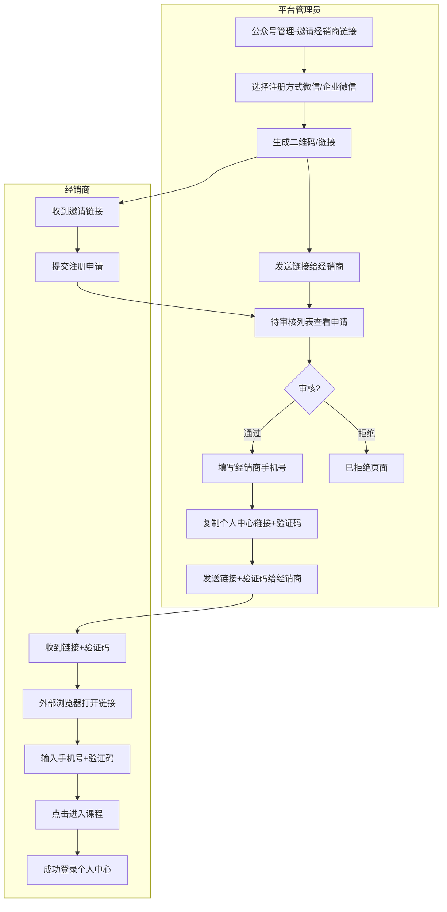

> **注**：原文未提供拒绝后的详细异常路径，仅描述"已拒绝的经销商在已拒绝页面删除记录才能再次提交申请"。

#### 9.1.2 SC-QGY-005 课程搭建泳道图

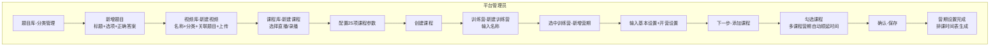

> **注**：原文仅展示单角色（平台管理员）操作流程，未提供跨角色视角。

#### 9.1.3 SC-QGY-007 会员邀请与审核泳道图

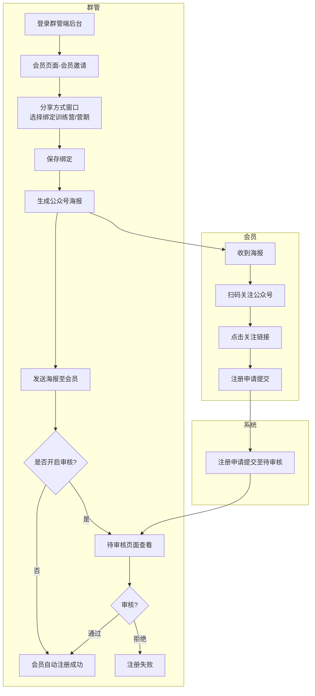

#### 9.1.4 SC-QGY-008 课程分享泳道图

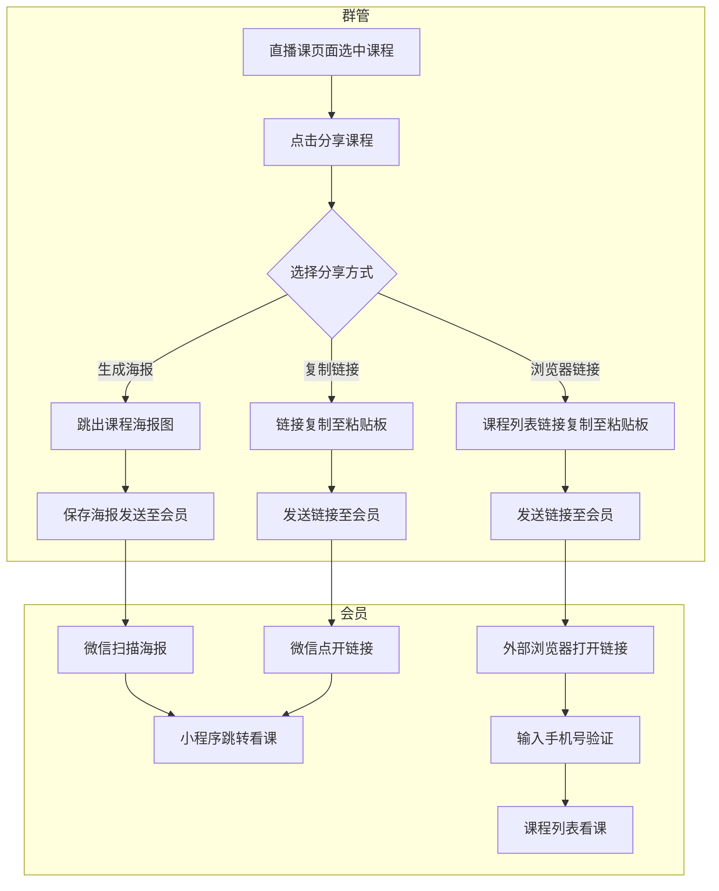

> **业务规则**：生成海报与复制链接为小程序跳转看课；浏览器链接需开启"会员注册验证"和"会员看课验证"参数。

#### 9.1.5 SC-QGY-014 分账对账泳道图

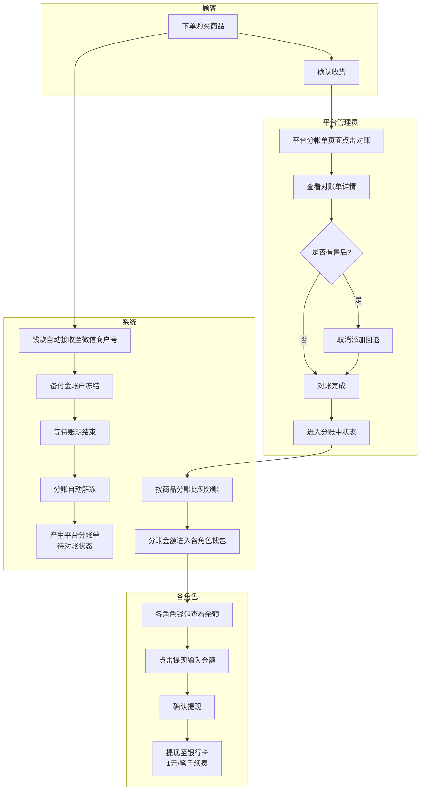

> **业务规则**：待对账状态时订单不允许售后，需在【对账单详情】点击【取消添加】后才能进行售后操作。

#### 9.1.6 SC-QGY-010 SCRM企微绑定与标签泳道图

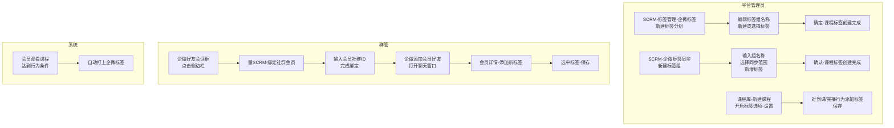

> **业务规则**：受企微最新风控政策影响，需先将企微好友绑定为社群会员，标签才能生效。

### §9.2 业务流程图（flowchart）（Stage 2.5 分析3）

#### 9.2.1 核心业务流程（五大环节）

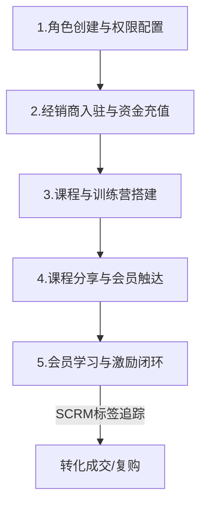

#### 9.2.2 经销商入驻与充值流程

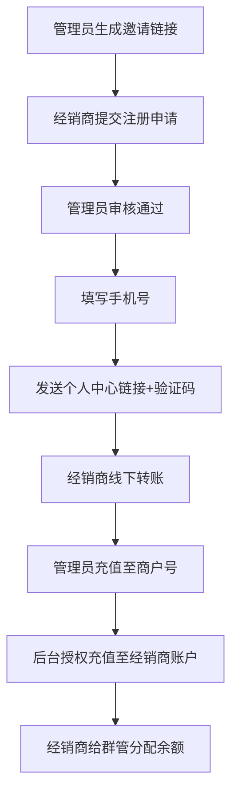

#### 9.2.3 课程分享流程

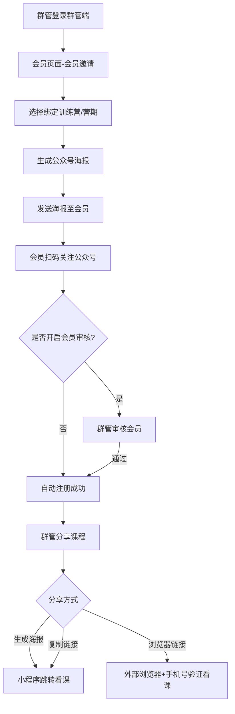

#### 9.2.4 分账对账流程

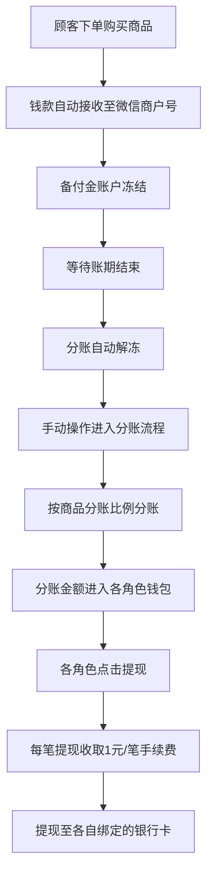

### §9.3 信息流分析（Stage 2.5 分析4）

#### 9.3.1 信息主体清单

> 对齐 doc-standards.yml info_entities，基于原文操作权限和页面关系提取。

| 信息主体名 | 归属业务系统 | 生产者（角色/动作） | 消费者（角色/动作） | 依赖的前置动作 |
|------------|-------------|---------------------|---------------------|----------------|
| 平台角色 | 权限管理 | 平台管理员/创建平台角色 | 平台操作员/登录系统分配权限 | 无 |
| 分管角色 | 权限管理 | 平台管理员/创建分管角色 | 分管操作员/登录系统分管范围 | 创建平台角色 |
| 操作员账号 | 权限管理 | 平台管理员/创建操作员 | 操作员/登录后台 | 创建角色 |
| 经销商信息 | 经销商管理 | 经销商/提交注册申请 | 平台管理员/审核；系统/授权充值 | 生成邀请链接 |
| 经销商余额 | 财务管理 | 平台管理员/授权充值；经销商/自主充值 | 经销商/分配群管余额；系统/发放红包 | 经销商审核通过+线下转账 |
| 群管余额 | 财务管理 | 经销商/分配群管余额 | 群管/发放红包；系统/红包扣减 | 经销商余额充足 |
| 群管信息 | 经销商管理 | 经销商/邀请群管+审核 | 群管/登录个人中心；经销商/查看群管数据 | 经销商审核通过 |
| 会员信息 | 会员管理 | 会员/扫码注册 | 群管/审核+管理；系统/打标签 | 群管生成海报+会员扫码 |
| 会员标签 | SCRM | 群管/手动打标签；系统/自动打标签 | 群管/筛选会员；经销商/会员分类统计 | 经销商创建标签 或 课程标签配置 |
| 题目 | 课程管理 | 平台管理员/创建题目 | 系统/课程答题关联 | 无 |
| 视频 | 课程管理 | 平台管理员/上传视频 | 系统/课程播放 | 题目创建（如需答题） |
| 课程 | 课程管理 | 平台管理员/创建课程 | 群管/分享课程；会员/观看课程 | 视频上传完成 |
| 训练营 | 课程管理 | 平台管理员/创建训练营 | 平台管理员/新增营期 | 课程创建完成 |
| 营期 | 课程管理 | 平台管理员/新增营期 | 群管/绑定营期邀请会员；会员/看课列表 | 训练营创建+添加课程 |
| 红包规则 | 激励管理 | 平台管理员/设置红包规则 | 系统/自动发放红包 | 经销商审核通过 |
| 积分规则 | 激励管理 | 平台管理员/设置积分规则 | 系统/自动发放积分 | 经销商审核通过 |
| 商品 | 商城 | 平台管理员/新增商品 | 会员/购买；系统/分账 | 无 |
| 订单 | 商城 | 会员/下单；群管/代下单 | 平台管理员/管理；系统/分账对账 | 商品上架 |
| 平台分帐单 | 分账管理 | 系统/订单产生自动生成 | 平台管理员/对账；系统/分账 | 订单产生+顾客确认收货 |
| 钱包余额 | 分账管理 | 系统/分账成功自动入账 | 各角色/提现 | 分账成功 |
| 企微标签 | SCRM | 平台管理员/创建标签组 | 企业微信/同步标签；群管/为会员打标签 | 企微主体配置 |
| 课程标签关联 | SCRM | 平台管理员/课程设置标签 | 系统/会员观课自动打标 | 企微标签创建+课程创建 |
| 授课计划 | SCRM | 群管/新建授课计划 | 企微群发助手/预约发送 | 营期+课程存在 |
| 群发记录 | SCRM | 群管/新建群发 | 企微群发助手/发送 | 无 |
| 话术 | SCRM | 群管/自定义话术；系统/AI智能话术 | 群管/一键应用至会话 | 无 |

#### 9.3.2 信息流转图（跨模块 flowchart）

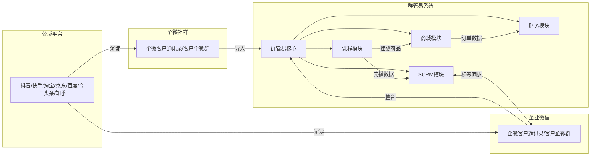

#### 9.3.3 信息流触发业务动作映射表

> 建立「信息变化 → 触发的业务动作」映射，仅基于原文已有的联动描述。

| 信息主体.字段变化 | 触发动作(FN) | 产生结果 | 来源 |
|-------------------|-------------|----------|------|
| 经销商.注册申请提交 | FN-QGY-PC-006 审核经销商 | 经销商进入待审核→审核通过/已拒绝 | 管理员端手册§2.2 |
| 经销商.手机号填写 | 系统（发送链接+验证码） | 经销商可登录个人中心 | 管理员端手册§2.2 |
| 经销商.余额增加 | FN-QGY-PC-030 分配群管余额 | 群管余额增加 | 经销商端手册§1.6 |
| 经销商.审核通过 | 系统（自动生成红包规则） | 默认新会员奖励+答题奖励规则生成 | 管理员端手册§2.4 |
| 经销商.审核通过 | 系统（自动生成积分规则） | 默认积分规则生成 | 管理员端手册§2.5 |
| 群管.余额增加 | 系统（红包发放扣减） | 会员领取红包后群管余额减少 | 业务流程描述 |
| 群管.注册申请提交 | FN-QGY-PC-016 审核群管 | 群管进入待审核→注册完成/已拒绝 | 管理员端手册§4.2 |
| 群管.手机号填写 | 系统（发送链接+验证码） | 群管可登录个人中心 | 管理员端手册§4.2 |
| 会员.注册申请提交 | FN-QGY-PC-018 审核会员 | 会员进入待审核→注册成功/已拒绝 | 管理员端手册§4.4 |
| 会员.观课完播 | 系统（发放红包/积分） | 会员获得红包奖励/积分奖励 | 业务流程描述 |
| 会员.答题正确 | 系统（发放红包） | 旧版商户号→微信零钱；新版→奖励中心 | 管理员端手册§2.4 |
| 会员.看课行为(到课/完播) | 系统（自动打企微标签） | 会员自动获得对应企微标签 | PPT§课程标签+管理员端§2.6 |
| 会员.状态=已禁用 | 系统（限制观课+领红包） | 已禁用会员无法观看课程及领取红包 | 群管端手册§1.5 |
| 课程.创建完成 | FN-QGY-PC-014 创建训练营营期 | 营期可关联课程 | 管理员端手册§3.4 |
| 营期.创建完成 | FN-QGY-PC-017 邀请会员（绑定营期） | 会员看课列表显示营期内课程 | 管理员端手册§4.3 |
| 订单.产生 | 系统（自动产生平台分帐单） | 分帐单进入待对账状态 | 分账对账手册§3.2.3 |
| 订单.顾客确认收货 | FN-QGY-PC-045 对账操作 | 分帐单进入对账中状态 | 分账对账手册§3.2.3 |
| 分帐单.对账完成 | 系统（进入分账流程） | 按商品分账比例执行分账 | 分账对账手册§3.2.3 |
| 分账.成功 | 系统（金额入账各角色钱包） | 各角色钱包余额增加 | 分账对账手册§3.1 |
| 钱包.余额>冻结额度 | FN-QGY-PC-046~050 提现 | 提现至绑定的银行卡 | 分账对账手册§4 |
| 商品.分账比例设置 | 系统（订单分账时按比例分配） | 分账金额按5角色比例分配 | 分账对账手册§1 |
| 企微标签.创建完成 | 企业微信（同步标签） | 标签在企微端可见 | PPT§标签管理 |
| 课程标签.关联课程设置 | 系统（会员观课行为触发打标） | 会员达到行为条件自动获得标签 | PPT§课程标签 |

### §9.4 状态机（stateDiagram-v2 + 过渡操作表）（Stage 2.5 分析5）

#### 9.4.1 经销商状态机

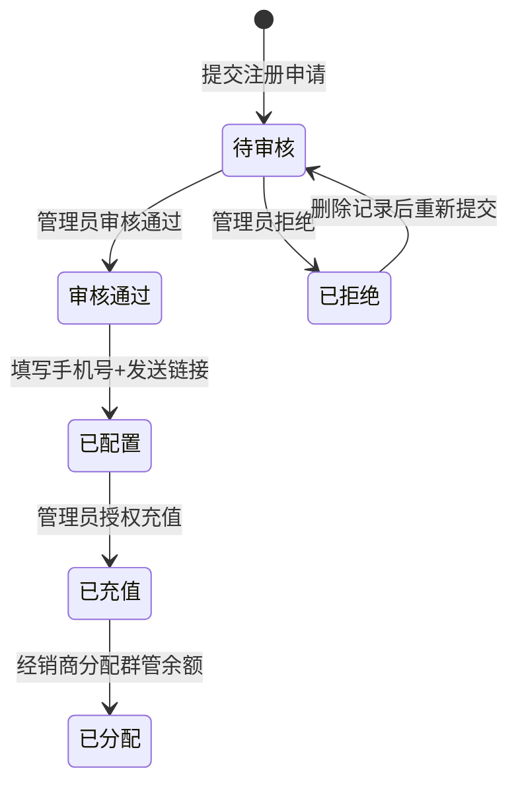

**经销商状态过渡操作表**

| 当前状态 | 触发操作(FN) | 目标状态 | 操作者 | 前置约束 | 后置动作 |
|----------|-------------|----------|--------|----------|----------|
| （初始） | FN-QGY-PC-005 邀请经销商 | 待审核 | 平台管理员 | 生成邀请链接 | 发送链接 |
| 待审核 | FN-QGY-PC-006 审核经销商 | 审核通过 | 平台管理员 | 经销商提交申请 | 填写手机号 |
| 待审核 | FN-QGY-PC-006 审核经销商 | 已拒绝 | 平台管理员 | 经销商提交申请 | 记录拒绝 |
| 审核通过 | FN-QGY-PC-006 填写手机号 | 已配置 | 平台管理员 | 审核通过 | 发送链接+验证码 |
| 已配置 | FN-QGY-PC-007 审核确认充值 | 已充值 | 平台管理员 | 经销商线下转账 | 余额增加 |

#### 9.4.2 群管状态机

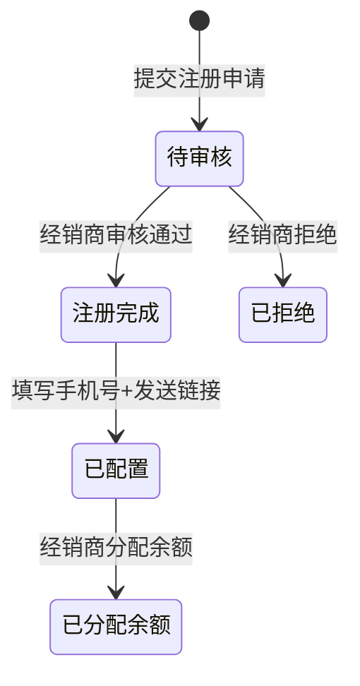

#### 9.4.3 会员状态机

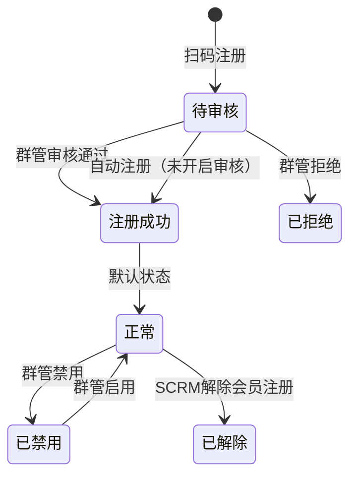

**会员状态过渡操作表**

| 当前状态 | 触发操作(FN) | 目标状态 | 操作者 | 前置约束 | 后置动作 |
|----------|-------------|----------|--------|----------|----------|
| （初始） | FN-QGY-PC-017 邀请会员 | 待审核 | 群管 | 绑定营期+生成海报 | 会员扫码注册 |
| 待审核 | FN-QGY-PC-018 审核会员 | 注册成功 | 群管 | 会员提交申请 | 可观看课程 |
| 待审核 | FN-QGY-PC-018 审核会员 | 注册成功 | 系统 | 未开启审核 | 自动注册 |
| 正常 | FN-QGY-PC-020 禁用会员 | 已禁用 | 群管 | 会员正常状态 | 移入小黑屋 |
| 已禁用 | FN-QGY-PC-020 启用会员 | 正常 | 群管 | 会员已禁用 | 恢复观课权限 |

#### 9.4.4 平台分帐单状态机

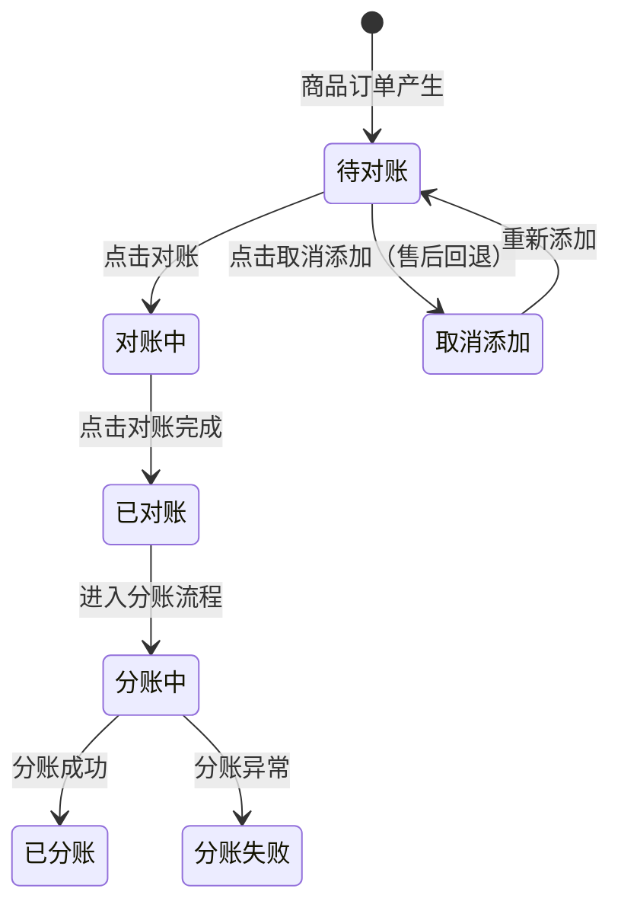

**平台分帐单状态过渡操作表**

| 当前状态 | 触发操作(FN) | 目标状态 | 操作者 | 前置约束 | 后置动作 |
|----------|-------------|----------|--------|----------|----------|
| （初始） | 商品订单产生 | 待对账 | 系统 | 顾客下单 | 自动产生分帐单 |
| 待对账 | FN-QGY-PC-045 对账操作 | 对账中 | 平台管理员 | 顾客确认收货 | 可查看详情 |
| 对账中 | FN-QGY-PC-045 对账完成 | 已对账 | 平台管理员 | 详情检查完毕 | 进入分账中 |
| 已对账 | 进入分账 | 分账中 | 系统 | 对账完成 | 按比例执行分账 |
| 分账中 | （分账成功） | 已分账 | 系统 | 执行成功 | 金额进入钱包 |
| 分账中 | （分账异常） | 分账失败 | 系统 | 执行失败 | 记录失败信息 |
| 待对账 | FN-QGY-PC-045 取消添加 | 取消添加 | 平台管理员 | 有售后订单 | 回退流程 |

### §9.4.5 业务操作矩阵（Stage 2.5 分析6）

> 对齐 doc-standards.yml raci_state_matrix：角色×状态×操作。仅基于原文已有的权限描述建立。

#### 经销商相关操作矩阵

| 业务操作(FN) | 角色 | 前置业务状态 | 触发后目标状态 | 后置影响模块/数据 |
|-------------|------|-------------|---------------|-------------------|
| FN-QGY-PC-005 邀请经销商 | 平台管理员 | 无 | 经销商=待审核 | 经销商列表-待审核新增 |
| FN-QGY-PC-006 审核经销商-通过 | 平台管理员 | 经销商=待审核 | 经销商=审核通过 | 经销商列表-审核通过新增 |
| FN-QGY-PC-006 审核经销商-拒绝 | 平台管理员 | 经销商=待审核 | 经销商=已拒绝 | 经销商列表-已拒绝新增 |
| FN-QGY-PC-006 填写经销商手机号 | 平台管理员 | 经销商=审核通过 | 经销商=已配置 | 可发送登录链接 |
| FN-QGY-PC-007 授权充值 | 平台管理员 | 经销商=已配置 | 经销商=已充值 | 经销商余额增加 |
| FN-QGY-PC-008 红包规则设置 | 平台管理员 | 经销商=审核通过 | — | 红包规则表新增/修改 |
| FN-QGY-PC-009 积分规则设置 | 平台管理员 | 经销商=审核通过 | — | 积分规则表新增/修改 |
| FN-QGY-PC-010 经销商功能设置 | 平台管理员 | 经销商=审核通过 | — | 功能设置参数变更 |
| FN-QGY-PC-029 经销商自主充值 | 经销商 | 经销商=已配置 | 充值待审核 | 充值待审核列表新增 |
| FN-QGY-PC-030 分配群管余额 | 经销商 | 经销商=已充值 | — | 经销商余额减少，群管余额增加 |
| FN-QGY-PC-031 经销商端功能设置 | 经销商 | 经销商=已配置 | — | 功能设置参数变更 |

#### 群管相关操作矩阵

| 业务操作(FN) | 角色 | 前置业务状态 | 触发后目标状态 | 后置影响模块/数据 |
|-------------|------|-------------|---------------|-------------------|
| FN-QGY-PC-015 邀请群管 | 经销商 | 经销商=已充值 | 群管=待审核 | 群管列表-待审核新增 |
| FN-QGY-PC-016 审核群管-通过 | 经销商 | 群管=待审核 | 群管=注册完成 | 群管列表新增 |
| FN-QGY-PC-016 审核群管-拒绝 | 经销商 | 群管=待审核 | 群管=已拒绝 | 已拒绝列表新增 |
| FN-QGY-PC-027 修改群管信息 | 经销商 | 群管=注册完成 | — | 群管信息变更 |
| FN-QGY-PC-026 一键更换经销商 | 平台管理员 | 群管=注册完成 | — | 群管归属经销商变更 |
| FN-QGY-PC-025 更换会员归属 | 经销商 | 群管=已分配余额 | — | 会员归属群管变更 |

#### 会员相关操作矩阵

| 业务操作(FN) | 角色 | 前置业务状态 | 触发后目标状态 | 后置影响模块/数据 |
|-------------|------|-------------|---------------|-------------------|
| FN-QGY-PC-017 邀请会员 | 群管 | 群管=已分配余额 | 会员=待审核 | 会员列表-待审核新增 |
| FN-QGY-PC-018 审核会员-通过 | 群管 | 会员=待审核 | 会员=注册成功 | 会员列表新增 |
| FN-QGY-PC-018 审核会员-自动 | 系统 | 会员=待审核（未开启审核） | 会员=注册成功 | 会员列表自动新增 |
| FN-QGY-PC-018 审核会员-拒绝 | 群管 | 会员=待审核 | 会员=已拒绝 | 已拒绝列表新增 |
| FN-QGY-PC-020 禁用会员 | 群管 | 会员=正常 | 会员=已禁用 | 小黑屋列表新增，无法观课领红包 |
| FN-QGY-PC-020 启用会员 | 群管 | 会员=已禁用 | 会员=正常 | 小黑屋移除，恢复观课权限 |
| FN-QGY-PC-021 修改会员信息 | 群管 | 会员=正常 | — | 会员信息变更 |
| FN-QGY-PC-022 修改会员标签 | 群管 | 会员=正常 | — | 会员标签变更 |
| FN-QGY-PC-024 导出会员看课记录 | 经销商 | 会员=正常 | — | 导出列表新增记录 |
| FN-QGY-SCRM-001 企微绑定会员 | 群管 | 会员=正常 | — | 企微好友与社群会员绑定 |
| FN-QGY-SCRM-006 解除会员注册 | 群管 | 会员=正常 | 会员=已解除 | 解除企微好友与社群会员绑定 |

#### 课程相关操作矩阵

| 业务操作(FN) | 角色 | 前置业务状态 | 触发后目标状态 | 后置影响模块/数据 |
|-------------|------|-------------|---------------|-------------------|
| FN-QGY-PC-011 创建题目 | 平台管理员 | 无 | — | 题目库新增 |
| FN-QGY-PC-012 上传视频 | 平台管理员 | 题目已创建（如需答题） | — | 视频库新增 |
| FN-QGY-PC-013 创建课程 | 平台管理员 | 视频已上传 | 课程=已启用 | 课程库新增 |
| FN-QGY-PC-014 创建训练营 | 平台管理员 | 课程已创建 | — | 训练营新增 |
| FN-QGY-PC-014 新增营期 | 平台管理员 | 训练营已创建 | 营期=未开始 | 营期新增+排课表生成 |
| FN-QGY-PC-019 分享课程 | 群管 | 营期已创建+会员已注册 | — | 会员可观看课程 |
| FN-QGY-SCRM-009 课程关联标签 | 平台管理员 | 课程已创建+标签已创建 | — | 课程标签关联表新增 |
| FN-QGY-SCRM-008 创建企微标签 | 平台管理员 | 无 | — | 企微标签表新增 |

#### 分账相关操作矩阵

| 业务操作(FN) | 角色 | 前置业务状态 | 触发后目标状态 | 后置影响模块/数据 |
|-------------|------|-------------|---------------|-------------------|
| FN-QGY-PC-040 分账比例设置 | 平台管理员 | 商品已创建 | — | 商品分账比例变更 |
| FN-QGY-PC-041 运费账单归属设置 | 平台管理员 | 无 | — | 运费归属配置变更 |
| FN-QGY-PC-042 优惠券账单归属设置 | 平台管理员 | 无 | — | 优惠券归属配置变更 |
| FN-QGY-PC-043 设置商户号 | 平台管理员 | 无 | — | 商户号配置新增 |
| FN-QGY-PC-044 钱包创建 | 平台管理员 | 商户号已设置 | — | 钱包记录新增 |
| FN-QGY-PC-045 对账操作 | 平台管理员 | 分帐单=待对账 | 分帐单=对账中 | 对账单详情可查看 |
| FN-QGY-PC-045 对账完成 | 平台管理员 | 分帐单=对账中 | 分帐单=已对账→分账中 | 进入分账流程 |
| FN-QGY-PC-045 取消添加 | 平台管理员 | 分帐单=待对账 | 分帐单=取消添加 | 可进行售后操作 |
| FN-QGY-PC-046 供应商提现 | 平台管理员 | 钱包余额>冻结额度 | — | 供应商余额减少，银行卡到账 |
| FN-QGY-PC-047 服务商提现 | 平台管理员 | 钱包余额>冻结额度 | — | 服务商余额减少，银行卡到账 |
| FN-QGY-PC-048 经销商提现 | 平台管理员 | 钱包余额>冻结额度 | — | 经销商余额减少，银行卡到账 |
| FN-QGY-PC-049 群管提现 | 平台管理员 | 钱包余额>冻结额度 | — | 群管余额减少，银行卡到账 |
| FN-QGY-PC-050 平台方提现 | 平台管理员 | 易宝资金已解冻 | — | 平台方余额减少，银行卡到账 |

#### SCRM相关操作矩阵

| 业务操作(FN) | 角色 | 前置业务状态 | 触发后目标状态 | 后置影响模块/数据 |
|-------------|------|-------------|---------------|-------------------|
| FN-QGY-SCRM-002 查看会员详情 | 群管 | 会员=正常 | — | 会员详情页面展示 |
| FN-QGY-SCRM-003 使用话术库 | 群管 | 无 | — | 话术应用至当前会话 |
| FN-QGY-SCRM-004 会员订单录入 | 群管 | 会员=正常 | — | 会员订单记录新增 |
| FN-QGY-SCRM-005 发送专属红包 | 群管 | 群管余额充足 | — | 红包记录同步至会员档案 |
| FN-QGY-SCRM-006 新建群发 | 群管 | 无 | — | 群发记录新增，发送至企微群发助手 |
| FN-QGY-SCRM-007 新建授课计划 | 群管 | 营期+课程存在 | — | 授课计划新增，预约时间发送 |
| FN-QGY-SCRM-010 查看标签 | 群管 | 会员已有标签 | — | 企微好友详情显示标签 |
| FN-QGY-SCRM-011 渠道活码 | 平台管理员 | 无 | — | 渠道活码配置新增 |
| FN-QGY-SCRM-012 群活码 | 平台管理员 | 无 | — | 群活码配置新增 |
| FN-QGY-SCRM-013 自动标签备注 | 系统 | 客户添加企微好友 | — | 自动打标签+备注 |
| FN-QGY-SCRM-014 自动建群 | 系统 | 群满 | — | 自动创建新群+继承管理员 |
| FN-QGY-SCRM-018 客户列表查看 | 平台管理员 | 无 | — | 客户列表展示 |
| FN-QGY-SCRM-019 客户标签管理 | 平台管理员 | 无 | — | 标签组+标签新增/修改 |
| FN-QGY-SCRM-020 客户群管理 | 平台管理员 | 无 | — | 客户群列表展示 |
| FN-QGY-SCRM-021 增长分析 | 平台管理员 | 无 | — | 增长维度数据展示 |

> **注**：原文未提供「部门」维度信息，上表基于原文角色权限描述建立，部门列已省略。原文也未提供完整的RACI（Responsible/Accountable/Consulted/Informed）责任分配矩阵，上表仅展示「角色×状态×操作」维度。

### §9.5 业务时序图（sequenceDiagram）（Stage 2.5 分析7）

#### 9.5.1 经销商入驻全流程

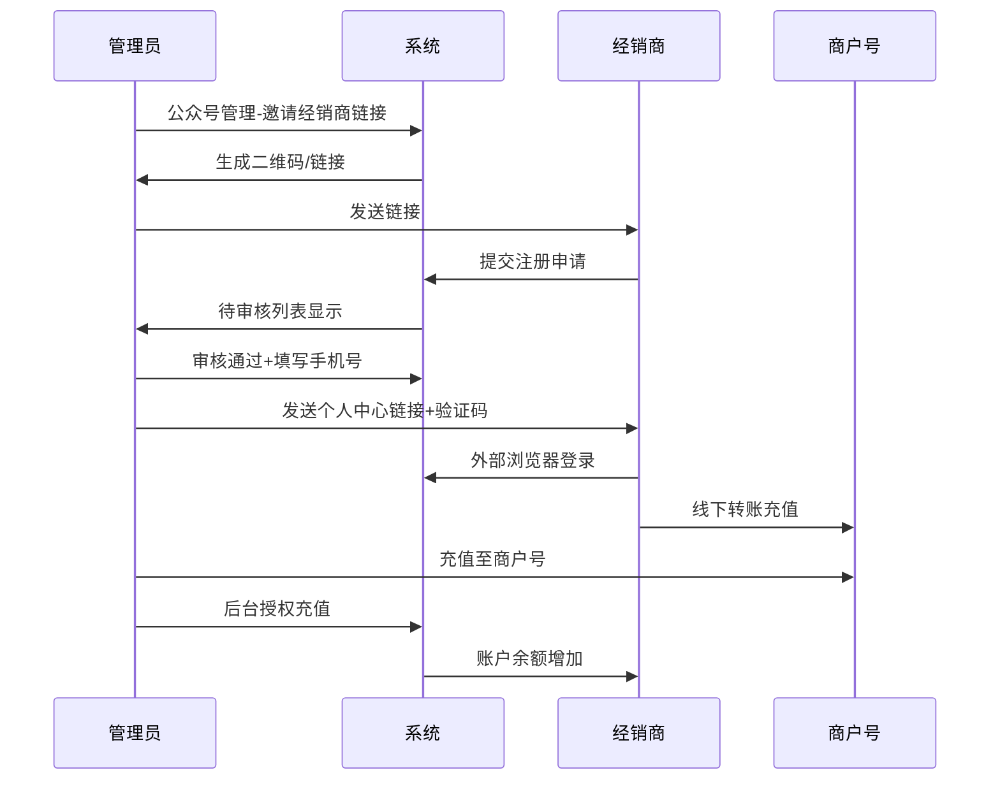

#### 9.5.2 课程分享与会员观课

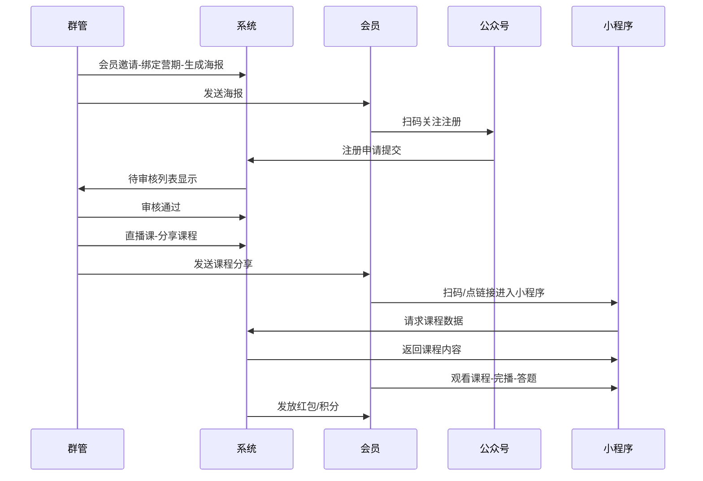

#### 9.4.3 分账对账时序图

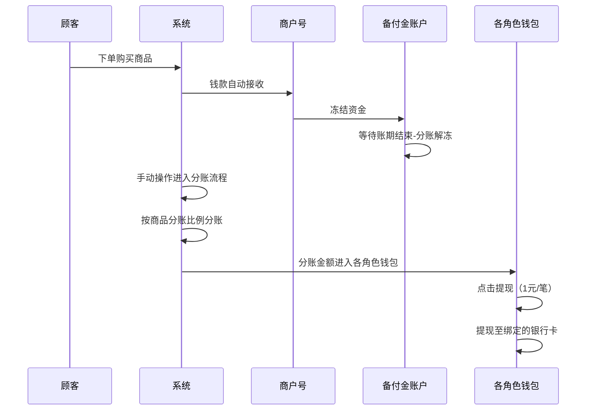

### §9.6 三方接口时序图（Stage 2.5 分析7续）

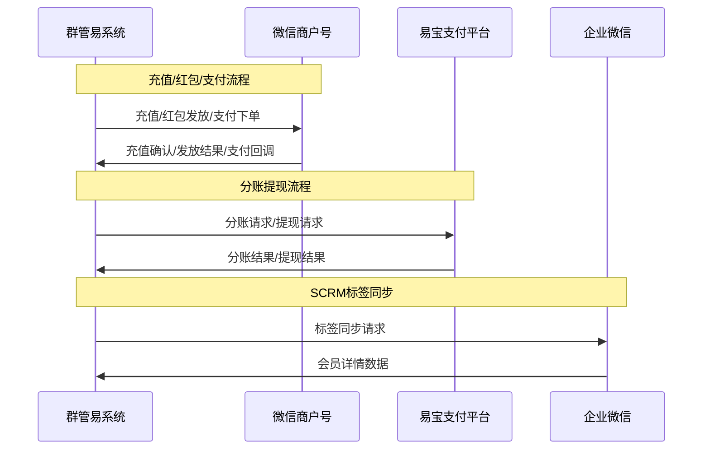

> **注**：原文未提供明确的接口路径定义，以上基于业务流程推断。

---

## §10 功能需求列表与用例（FN/UC）

### 10.1 模块：权限管理（MD-QGY-001）

#### FN-QGY-PC-001 创建平台角色
| 字段 | 值 |
|------|-----|
| 用例编号 | UC-QGY-PC-001 |
| 名称 | 创建平台角色 |
| 页面 | PG-QGY-PC-001 角色权限-平台角色页面 |
| 参与者 | 平台管理员 |
| 优先级 | P0 |
| 关联BG | BG-QGY-006 |
| 自动化类型 | 手动 |

**前置条件**：管理员已登录后台，进入【基础设置】>>【角色权限】>>【平台角色】页面。

**基本流程**：
1. [手动] 系统默认4个角色：财务、素材管理员、超级管理员、运营
2. [手动] 点击【新建角色】按钮
3. [手动] 输入角色名称，勾选分配功能权限
4. [手动] 点击保存

**后置条件**：新平台角色创建成功，可分配给操作员。

---

#### FN-QGY-PC-002 创建分管角色
| 字段 | 值 |
|------|-----|
| 用例编号 | UC-QGY-PC-002 |
| 名称 | 创建分管角色 |
| 页面 | PG-QGY-PC-002 角色权限-分管角色页面 |
| 参与者 | 平台管理员 |
| 优先级 | P0 |
| 关联BG | BG-QGY-006 |
| 自动化类型 | 手动 |

**前置条件**：进入【基础设置】>>【角色权限】>>【分管角色】页面。

**基本流程**：
1. [手动] 点击【新建角色】按钮
2. [手动] 输入角色名称，下拉列表选择角色类型，勾选分配功能权限
3. [手动] 点击【保存】

**分管角色三种类型**：
- **分管管理员**：关联经销商/群管；管理下属群管与会员；数据权限查看分管层级下所有报表；功能权限可创建角色/操作员/操作会员管理/财务管理
- **分管经销商**：关联经销商；管理下属群管与会员；数据权限查看分管经销商层级下报表；功能权限可操作会员管理/财务管理
- **分管群管**：关联群管；管理下属会员；数据权限查看分管群管层级下报表；功能权限可操作会员管理

---

#### FN-QGY-PC-003 创建平台操作员
| 字段 | 值 |
|------|-----|
| 用例编号 | UC-QGY-PC-003 |
| 名称 | 创建平台操作员 |
| 页面 | PG-QGY-PC-003 操作员管理-平台操作员页面 |
| 参与者 | 平台管理员 |
| 优先级 | P0 |
| 关联BG | BG-QGY-006 |
| 自动化类型 | 手动 |

**前置条件**：进入【基础设置】>>【操作员管理】>>【平台操作员】页面。

**基本流程**：
1. [手动] 点击【新增操作员】按钮，输入昵称与账号
2. [手动] 下拉列表选择角色
3. [手动] 点击【保存】

---

#### FN-QGY-PC-004 创建分管操作员+分管设置
| 字段 | 值 |
|------|-----|
| 用例编号 | UC-QGY-PC-004 |
| 名称 | 创建分管操作员+分管设置 |
| 页面 | PG-QGY-PC-004 操作员管理-分管操作员页面 |
| 参与者 | 平台管理员 |
| 优先级 | P0 |
| 关联BG | BG-QGY-006 |
| 自动化类型 | 手动 |

**基本流程**：
1. [手动] 点击【新增操作员】按钮，输入相关信息，点击【保存】
2. [手动] 选中目标分管操作员，点击【分管设置】按钮
3. [手动] 在弹出窗口选择经销商分组，右侧勾选经销商或群管绑定该分管操作员

**注**：创建分管经销商、分管群管步骤与分管操作员步骤相同。

---

### 10.2 模块：经销商管理（MD-QGY-002）

#### FN-QGY-PC-005 邀请经销商
| 字段 | 值 |
|------|-----|
| 用例编号 | UC-QGY-PC-005 |
| 名称 | 邀请经销商 |
| 页面 | PG-QGY-PC-005 公众号管理页面 |
| 参与者 | 平台管理员 |
| 优先级 | P0 |
| 关联BG | BG-QGY-001 |
| 自动化类型 | 手动 |

**基本流程**：
1. [手动] 进入【基础设置】>>【公众号管理】，选中公众号信息
2. [手动] 点击右侧操作【邀请经销商链接】文本按钮
3. [手动] 在【经销商邀请注册链接】窗口选择注册方式"微信"或"企业微信"
4. [手动] 若选择"企业微信"，选中经销商所在企微主体，输入邀请链接有效期
5. [手动] 点击【邀请链接】按钮
6. [系统自动] 生成二维码或链接
7. [手动] 发送给经销商申请人注册

**业务规则**：
- 若选择"微信"邀请经销商，则经销商仅可邀请个人微信群管
- 若选择"企业微信"邀请经销商，则经销商可邀请个人微信群管以及企业微信群管

---

#### FN-QGY-PC-006 审核经销商
| 字段 | 值 |
|------|-----|
| 用例编号 | UC-QGY-PC-006 |
| 名称 | 审核经销商 |
| 页面 | PG-QGY-PC-006 经销商列表页面 |
| 参与者 | 平台管理员 |
| 优先级 | P0 |
| 关联BG | BG-QGY-001 |
| 自动化类型 | 手动 |

**基本流程**：
1. [手动] 进入【会员管理】>>【经销商列表】>>【待审核】页面
2. [手动] 点击右侧操作【审核通过】文本按钮
3. [系统自动] 经销商注册完成

**备选流程**：若点击【拒绝】，已拒绝的经销商在【已拒绝】页面删除记录才能再次提交申请。

**后置动作**：
4. [手动] 在【审核通过】页面填写经销商申请人手机号码
5. [手动] 复制个人中心链接，查找【手机号自定义验证码】参数，复制验证码
6. [手动] 将个人中心链接与验证码一并发送至经销商

**业务规则**：此手机号是经销商首次通过外部浏览器登录个人中心时必需的验证信息。

---

#### FN-QGY-PC-007 审核确认经销商充值
| 字段 | 值 |
|------|-----|
| 用例编号 | UC-QGY-PC-007 |
| 名称 | 审核确认经销商充值 |
| 页面 | PG-QGY-PC-007 财务管理-经销商余额页面 |
| 参与者 | 平台管理员 |
| 优先级 | P0 |
| 关联BG | BG-QGY-004 |
| 自动化类型 | 手动 |

**前置条件**：经销商线下转账后，管理员已将充值金额充入商户号。

**基本流程**：
1. [手动] 进入【财务管理】>>【经销商余额】，选中经销商
2. [手动] 点击右侧【充值】文本按钮
3. [手动] 输入充值金额、手续费，上传充值截图
4. [手动] 点击【保存】，经销商账户授权充值完成

**业务规则**：经销商账户余额充足，才可为会员发放红包奖励。商户号充值步骤参考：https://www.kdocs.cn/l/crAcSqMTf06E

---

#### FN-QGY-PC-008 经销商红包发放规则设置
| 字段 | 值 |
|------|-----|
| 用例编号 | UC-QGY-PC-008 |
| 名称 | 经销商红包发放规则设置 |
| 页面 | PG-QGY-PC-008 基础设置-红包规则页面 |
| 参与者 | 平台管理员 |
| 优先级 | P0 |
| 关联BG | BG-QGY-002 |
| 自动化类型 | 手动 |

**基本流程**：
1. [手动] 进入【基础设置】>>【红包规则】页面
2. [系统自动] 经销商注册通过后系统默认自动生成"新会员奖励"、"答题奖励"规则
3. [手动] 选中目标规则点击【编辑】可修改，或点击【新建红包规则】创建新规则

**红包类型说明**：
- **答题奖励**：会员答题正确领取的红包，旧版商户号系统自动发送至微信零钱，新版商户号发送至会员奖励中心
- **新会员奖励**：会员首次注册领取的红包，由群管手动发送
- **完播奖励**：达到完播条件即可领取的红包

---

#### FN-QGY-PC-009 经销商积分发放规则设置
| 字段 | 值 |
|------|-----|
| 用例编号 | UC-QGY-PC-009 |
| 名称 | 经销商积分发放规则设置 |
| 页面 | PG-QGY-PC-009 基础设置-积分规则页面 |
| 参与者 | 平台管理员 |
| 优先级 | P0 |
| 关联BG | BG-QGY-002 |
| 自动化类型 | 手动 |

**基本流程**：
1. [手动] 进入【基础设置】>>【积分规则】页面
2. [系统自动] 经销商注册通过后系统自动生成一条默认规则
3. [手动] 选中目标规则点击【编辑】可修改，或点击【新建规则】创建新规则

**积分体系说明**：
- 积分获取：注册、每日登录、连续签到、完播、购买
- 积分消耗：兑换商品、抵扣现金、积分失效
- 支持积分等级体系

---

#### FN-QGY-PC-010 经销商功能设置
| 字段 | 值 |
|------|-----|
| 用例编号 | UC-QGY-PC-010 |
| 名称 | 经销商功能设置 |
| 页面 | PG-QGY-PC-010 经销商列表-功能设置页面 |
| 参与者 | 平台管理员 |
| 优先级 | P0 |
| 关联BG | BG-QGY-006 |
| 自动化类型 | 手动 |

**基本流程**：
1. [手动] 进入【会员管理】>>【经销商列表】，点击目标经销商右侧【更多】>>【功能设置】
2. [手动] 开启/停用相应功能，点击保存

**经销商功能参数说明**：

| 参数名 | 说明 |
|--------|------|
| 允许新会员观看 | 所有客户点击课程链接均可直接观看并自动注册 |
| 开启会员待审核 | 新客户注册申请需经后台审核 |
| 开启会员锁客（只限企微） | 群管企微好友可通过课程链接直接观看并注册 |
| 创建链接覆盖旧链接 | 自动作废历史注册链接，仅保留最新 |
| 允许导出会员 | 经销商可导出会员看课数据 |
| 启用独立商户号(无商户号) | 经销商可使用单独商户号发放红包 |
| 注册次数统计 | 统计会员注册次数，已注册过需先审核 |
| 会员注册验证 | 客户注册需填写手机号码 |
| 会员看课验证 | 会员第一次观看需填写手机号码 |
| 企微类型 | 启用使用企微插件方式，关闭使用企微服务商配置（默认） |
| SCRM自动描述 | 系统根据看课行为自动打企微描述 |
| SCRM自动标签 | 系统根据看课行为自动打企微标签 |

**业务规则**：若仅开启【允许新会员观看】，课程链接被转发后任何访问者均可观看领红包，存在被羊毛党恶意刷红包风险，建议与【开启会员待审核】一起开启。

---

### 10.3 模块：课程管理（MD-QGY-003）

#### FN-QGY-PC-011 创建课程题目
| 字段 | 值 |
|------|-----|
| 用例编号 | UC-QGY-PC-011 |
| 名称 | 创建课程题目 |
| 页面 | PG-QGY-PC-011 课程管理-题目库页面 |
| 参与者 | 平台管理员 |
| 优先级 | P0 |
| 关联BG | BG-QGY-002 |
| 自动化类型 | 手动 |

**基本流程（分类管理）**：进入【课程管理】>>【题目库】，点击【分类管理】，输入分类名称，点击【添加】。

**基本流程（新增题目）**：点击【新增题目】，输入题目标题、题目选项、正确答案，点击【保存】。

**业务规则**：如需通过看课答题让会员领取红包或积分，请先创建课程题目；若无需答题，可跳过此步骤。

---

#### FN-QGY-PC-012 创建课程视频
| 字段 | 值 |
|------|-----|
| 用例编号 | UC-QGY-PC-012 |
| 名称 | 创建课程视频 |
| 页面 | PG-QGY-PC-012 课程管理-视频库页面 |
| 参与者 | 平台管理员 |
| 优先级 | P0 |
| 关联BG | BG-QGY-002 |
| 自动化类型 | 手动 |

**基本流程**：进入【课程管理】>>【视频库】，点击【新建视频】，输入文件名称、分类、关联题目，上传本地视频/音频，点击【保存】。

**视频格式要求**：
- 预设：不要用1080p，可选择480P/720P
- 视频编码器：H.264 mp4格式（不可选择H.265）
- 配置文件：Main；帧率：30~40；码率：1000~1200kbps
- 音频：恒定比特率；扫描方式：逐行扫描
- 音频上传：小写mp3/wav格式

---

#### FN-QGY-PC-013 创建课程
| 字段 | 值 |
|------|-----|
| 用例编号 | UC-QGY-PC-013 |
| 名称 | 创建课程 |
| 页面 | PG-QGY-PC-013 课程管理-课程库页面 |
| 参与者 | 平台管理员 |
| 优先级 | P0 |
| 关联BG | BG-QGY-002 |
| 自动化类型 | 手动 |

**基本流程**：
1. [手动] 进入【课程管理】>>【课程库】，点击【新建课程】
2. [手动] 选择创建直播课程或录播课程，点击【去创建课程】
3. [手动] 选择会员看课页面参数选项，填写课程信息
4. [手动] 点击【创建】

**课程参数选项说明（25项）**：

| 序号 | 设置项 | 选项说明 | 备注 |
|------|--------|----------|------|
| 1 | 课程播放页面风格 | 课程风格（横屏/首次从头/满5分钟续播）/直播间风格（竖屏/直播/当前时间续播） | 必填，默认课程风格 |
| 2 | 是否显示课程介绍 | 播放页展示课程说明 | 打开/关闭 |
| 3 | 是否启用评论 | 会员可评论及展示 | 打开/关闭 |
| 4 | 虚拟人数 | 播放页虚拟人数展示 | 打开/关闭 |
| 5 | 是否启用榜单和课程邀请码 | 展示排行榜及邀请按钮 | 打开/关闭 |
| 6 | 是否显示进度条 | 播放页展示进度条 | 打开/关闭 |
| 7 | 是否允许用户手动暂停 | 会员可暂停 | 打开/关闭 |
| 8 | 随机暂停 | 视频随机暂停需手动继续 | 需填暂停次数 |
| 9 | 随机暂停签到 | 视频随机暂停需签到继续 | 需填签到次数 |
| 10 | 完播条件 | 进度百分比 | |
| 11 | 完播即领红包 | 无需答题达到完播可领红包 | 打开/关闭 |
| 12 | 奖励方式 | 按红包规则/按课程指定金额/按默认积分规则/按课程指定积分 | 必填 |
| 13 | 会员等级奖励 | 不同等级不同激励（需开通商城） | 打开/关闭 |
| 14 | 促转功能 | 视频结束后展示转场内容 | 可设封面/链接 |
| 15 | 课程展示商品 | 新增商品上架排序删除 | 需开通商城 |
| 16 | 广告条 | 展示广告链接或电话 | 打开/关闭 |
| 17 | 课程名称 | 列表及看课页展示名称 | 必填 |
| 18 | 标签 | 根据看课行为打企微标签 | |
| 19 | 分类 | 选择分类 | |
| 20 | 是否答题 | 播放期间是否答题 | 打开/关闭 |
| 21 | 选择视频 | 添加课程视频 | 必填 |
| 22 | 课程状态 | 是否启用 | |
| 23 | 课程封面图 | 列表/统计/首页展示封面 | 必填 |
| 24 | 分享海报底图 | 课程分享海报底图 | 必填，可预览调二维码 |
| 25 | 课程介绍 | 课程说明信息 | 需开启"显示课程介绍" |

---

#### FN-QGY-PC-014 创建训练营与营期
| 字段 | 值 |
|------|-----|
| 用例编号 | UC-QGY-PC-014 |
| 名称 | 创建训练营与营期 |
| 页面 | PG-QGY-PC-014 课程管理-训练营页面 |
| 参与者 | 平台管理员 |
| 优先级 | P0 |
| 关联BG | BG-QGY-002 |
| 自动化类型 | 手动 |

**基本流程（创建训练营）**：进入【课程管理】>>【训练营】，点击【新建训练营】，输入名称，点击【添加】。

**基本流程（新增营期）**：
1. [手动] 选中训练营，点击【新增营期】
2. [手动] 输入【基本设置】与【开营设置】信息，点击【下一步】

**开营设置参数**：

| 序号 | 设置项 | 说明 | 备注 |
|------|--------|------|------|
| 1 | 营期名称 | 输入营期名称 | 必填 |
| 2 | 公众号 | 选择系统配置的公众号 | 必填 |
| 3 | 经销商 | 选择关联经销商 | 必填，可多选 |
| 4 | 节目标识 | 视频水印版权保护 | 非必填 |
| 5 | 每日红包发放方式 | 按课程（多课多红包）/按营期（每日单红包） | 必填 |
| 6 | 营期类型 | 多课程营期/单课程营期 | 必填 |
| 7 | 开营时间 | 开营时间范围 | 必填 |
| 8 | 课程可见设置 | 课程可见范围 | 非必填 |
| 9 | 快捷设置 | 多课程营期排课时间表生成规则 | 需选多课程营期 |

3. [手动] 在【添加课程】环节点击【+添加课程】，勾选课程
4. [系统自动] 多课程营期预设结束时间自动顺延
5. [手动] 点击【确认】>>【保存】完成营期设置

---

### 10.4 模块：课程分享（MD-QGY-004）

#### FN-QGY-PC-015 邀请群管
| 字段 | 值 |
|------|-----|
| 用例编号 | UC-QGY-PC-015 |
| 名称 | 邀请群管 |
| 页面 | PG-QGY-PC-015 经销商端-管理页面 |
| 参与者 | 经销商 |
| 优先级 | P0 |
| 关联BG | BG-QGY-001 |
| 自动化类型 | 手动 |

**基本流程**：
1. [手动] 经销商登录经销商端后台，进入【管理】页面
2. [手动] 点击【群管邀请】图标按钮
3. [系统自动] 生成群管邀请二维码
4. [手动] 点击【确认】，邀请链接自动复制到剪贴板
5. [手动] 发送至群管申请注册

---

#### FN-QGY-PC-016 审核群管
| 字段 | 值 |
|------|-----|
| 用例编号 | UC-QGY-PC-016 |
| 名称 | 审核群管 |
| 页面 | PG-QGY-PC-016 经销商端-待审核群管页面 |
| 参与者 | 经销商 |
| 优先级 | P0 |
| 关联BG | BG-QGY-001 |
| 自动化类型 | 手动 |

**基本流程**：
1. [手动] 进入【管理】>>【待审核群管】页面
2. [手动] 点击【通过】按钮，群管注册完成

**备选流程**：已拒绝的群管在【已拒绝】页面删除记录才能再次提交申请。

**后置动作**：
3. [手动] 在【群管理员】群管信息下点击【更多】>>【改手机号码】
4. [手动] 填写群管申请人手机号码
5. [手动] 将个人中心链接与固定验证码发送至群管

---

#### FN-QGY-PC-017 邀请会员
| 字段 | 值 |
|------|-----|
| 用例编号 | UC-QGY-PC-017 |
| 名称 | 邀请会员 |
| 页面 | PG-QGY-PC-017 群管端-会员页面 |
| 参与者 | 群管 |
| 优先级 | P0 |
| 关联BG | BG-QGY-001 |
| 自动化类型 | 手动 |

**基本流程**：
1. [手动] 群管登录群管端后台，进入【会员】页面
2. [手动] 点击【会员邀请】按钮
3. [手动] 在【分享方式】窗口点击【请选择绑定训练营/营期】
4. [手动] 选择训练营-营期进行绑定，点击【保存】
5. [手动] 点击【生成公众号海报】
6. [系统自动] 生成海报邀请图
7. [手动] 发送至会员注册

**备选流程**：支持为邀请方式预设标签，新会员注册时自动绑定。

**业务规则**：绑定营期是会员通过浏览器看课的必要步骤。若仅通过小程序链接或海报入口观看，则无需绑定营期。

---

#### FN-QGY-PC-018 审核会员
| 字段 | 值 |
|------|-----|
| 用例编号 | UC-QGY-PC-018 |
| 名称 | 审核会员 |
| 页面 | PG-QGY-PC-018 群管端-待审核页面 |
| 参与者 | 群管 |
| 优先级 | P0 |
| 关联BG | BG-QGY-001 |
| 自动化类型 | 手动 |

**基本流程**：
1. [手动] 会员扫描海报二维码关注公众号并点击关注链接
2. [系统自动] 群管【会员】>>【待审核】页面显示
3. [手动] 点击【通过】按钮，会员注册完成

**业务规则**：如需启用会员审核流程，经销商需在功能设置中开启【是否开启审核】参数。未开启时自动注册成功。

---

#### FN-QGY-PC-019 分享课程
| 字段 | 值 |
|------|-----|
| 用例编号 | UC-QGY-PC-019 |
| 名称 | 分享课程 |
| 页面 | PG-QGY-PC-019 群管端-直播课页面 |
| 参与者 | 群管 |
| 优先级 | P0 |
| 关联BG | BG-QGY-001 |
| 自动化类型 | 手动 |

**基本流程**：
1. [手动] 群管进入群管端后台，点击【直播课】页面
2. [手动] 选中任意课程，点击下方【分享课程】
3. [手动] 选择分享方式

**三种分享方式**：
- **生成海报**：跳出课程海报图，群管保存发送至会员，会员微信扫码跳转小程序看课
- **复制链接**：课程链接自动复制至粘贴板，会员微信点开链接跳转小程序看课
- **浏览器链接**：课程列表链接复制至粘贴板，会员外部浏览器打开输入手机号验证看课

**业务规则**：生成海报与复制链接为小程序跳转看课。浏览器链接需开启"会员注册验证"和"会员看课验证"参数。

---

### 10.5 模块：会员管理（MD-QGY-005）

#### FN-QGY-PC-020 禁用/启用会员
| 字段 | 值 |
|------|-----|
| 用例编号 | UC-QGY-PC-020 |
| 名称 | 禁用/启用会员 |
| 页面 | PG-QGY-PC-020 群管端-会员页面 |
| 参与者 | 群管 |
| 优先级 | P1 |
| 关联BG | BG-QGY-005 |
| 自动化类型 | 手动 |

**基本流程（禁用）**：进入【会员】页面，点击需禁用会员所在行的【禁用】按钮，会员移入小黑屋。

**基本流程（启用）**：进入小黑屋页面，选择目标会员点击【启用】。

**基本流程（批量禁用）**：点击【批量】文本按钮，勾选会员批量禁用。

**业务规则**：已禁用的会员无法观看课程及领取红包。

---

#### FN-QGY-PC-021 修改会员信息
| 字段 | 值 |
|------|-----|
| 用例编号 | UC-QGY-PC-021 |
| 名称 | 修改会员信息 |
| 页面 | PG-QGY-PC-021 群管端-会员页面 |
| 参与者 | 群管 |
| 优先级 | P1 |
| 关联BG | BG-QGY-005 |
| 自动化类型 | 手动 |

**基本流程**：进入群管【会员】页面，点击目标会员【更多】按钮，可复制id、修改姓名、修改手机号、改备注、新会员奖励等。

---

#### FN-QGY-PC-022 添加/修改会员标签
| 字段 | 值 |
|------|-----|
| 用例编号 | UC-QGY-PC-022 |
| 名称 | 添加/修改会员标签 |
| 页面 | PG-QGY-PC-022 群管端-会员页面 |
| 参与者 | 群管 |
| 优先级 | P1 |
| 关联BG | BG-QGY-005 |
| 自动化类型 | 手动 |

**基本流程（单个）**：进入【会员】页面，点击目标会员【改标签】按钮，添加或更新标签。

**基本流程（批量）**：点击【批量】按钮，勾选会员批量更新标签。

**业务规则**：经销商需先在个人中心创建会员标签，此后该标签才会在群管个人中心显示。

---

#### FN-QGY-PC-023 会员标签设置（经销商端）
| 字段 | 值 |
|------|-----|
| 用例编号 | UC-QGY-PC-023 |
| 名称 | 会员标签设置 |
| 页面 | PG-QGY-PC-023 经销商端-管理页面 |
| 参与者 | 经销商 |
| 优先级 | P1 |
| 关联BG | BG-QGY-005 |
| 自动化类型 | 手动 |

**基本流程**：进入经销商【管理】页面，点击右上方【标签设置】，自定义会员标签或批量删除标签。

---

#### FN-QGY-PC-024 导出会员看课记录
| 字段 | 值 |
|------|-----|
| 用例编号 | UC-QGY-PC-024 |
| 名称 | 导出会员看课记录 |
| 页面 | PG-QGY-PC-024 经销商端-课程分析页面 |
| 参与者 | 经销商 |
| 优先级 | P1 |
| 关联BG | BG-QGY-005 |
| 自动化类型 | 手动 |

**前置条件**：经销商功能设置已开启【允许导出会员】。

**基本流程**：
1. [手动] 进入经销商【管理】>>【群管理员】标签页，选中目标群管
2. [系统自动] 跳转至【课程分析】页面
3. [手动] 选中课程信息，点击【导出会员记录】
4. [手动] 返回【管理】页面，点击右上角【导出列表】下载

---

#### FN-QGY-PC-025 更换会员归属
| 字段 | 值 |
|------|-----|
| 用例编号 | UC-QGY-PC-025 |
| 名称 | 更换会员归属 |
| 页面 | PG-QGY-PC-025 经销商端-更换会员归属页面 |
| 参与者 | 经销商 |
| 优先级 | P1 |
| 关联BG | BG-QGY-006 |
| 自动化类型 | 手动 |

**基本流程**：
1. [手动] 进入经销商【管理】>>【群管理员】，点击目标群管【更换会员归属】

**方式一：更换全部会员归属**：在【更换全部会员归属】标签页选择【接收群管】，点击【确认】。

**方式二：更换部分会员归属**：在【更换部分会员归属】标签页选择【训练营】>>【营期】>>【参与课程】>>【接收群管】，点击【确认】。

---

#### FN-QGY-PC-026 一键更换经销商
| 字段 | 值 |
|------|-----|
| 用例编号 | UC-QGY-PC-026 |
| 名称 | 一键更换经销商 |
| 页面 | PG-QGY-PC-026 后台-群管列表页面 |
| 参与者 | 平台管理员 |
| 优先级 | P1 |
| 关联BG | BG-QGY-006 |
| 自动化类型 | 手动 |

**基本流程**：进入【会员管理】>>【群管列表】，选择群管，点击【一键更换经销商】，选择接收经销商，选择是否同步会员标签，点击【保存】。

---

#### FN-QGY-PC-027 修改群管信息
| 字段 | 值 |
|------|-----|
| 用例编号 | UC-QGY-PC-027 |
| 名称 | 修改群管信息 |
| 页面 | PG-QGY-PC-027 经销商端-群管理员页面 |
| 参与者 | 经销商 |
| 优先级 | P1 |
| 关联BG | BG-QGY-006 |
| 自动化类型 | 手动 |

**基本流程**：进入经销商【管理】>>【群管理员】，点击目标群管【更多】按钮，可复制id、修改姓名、修改手机号、改备注、上传二维码等。

---

### 10.6 模块：经销商端操作（MD-QGY-006）

#### FN-QGY-PC-028 登录经销商端后台
| 字段 | 值 |
|------|-----|
| 用例编号 | UC-QGY-PC-028 |
| 名称 | 登录经销商端后台 |
| 页面 | PG-QGY-PC-028 个人中心登录页面 |
| 参与者 | 经销商 |
| 优先级 | P0 |
| 关联BG | BG-QGY-006 |
| 自动化类型 | 手动 |

**基本流程（个人微信注册）**：
1. [手动] 将个人中心链接复制至外部浏览器打开
2. [手动] 首次登录填写系统预留手机号及固定验证码
3. [手动] 点击【进入课程】
4. [系统自动] 后续登录通过链接直接进入无需验证

**基本流程（企业微信注册）**：通过企业微信【工作台】>>【量多多】>>【个人中心】进入，或会话侧边栏【量多多】进入。

---

#### FN-QGY-PC-029 经销商账户充值（自主充值）
| 字段 | 值 |
|------|-----|
| 用例编号 | UC-QGY-PC-029 |
| 名称 | 经销商账户充值（自主充值） |
| 页面 | PG-QGY-PC-029 经销商端-管理-充值页面 |
| 参与者 | 经销商 |
| 优先级 | P0 |
| 关联BG | BG-QGY-004 |
| 自动化类型 | 手动 |

**基本流程**：
1. [手动] 经销商线下转账（扫码充值或银行卡转账）
2. [手动] 进入经销商【管理】页面，点击【充值】按钮
3. [手动] 输入充值金额，上传充值截图
4. [手动] 点击【确认】，等待后台审核通过

**业务规则**：管理员在【财务管理】>>【经销商余额】>>【充值待审核】页面审核。

---

#### FN-QGY-PC-030 分配群管余额
| 字段 | 值 |
|------|-----|
| 用例编号 | UC-QGY-PC-030 |
| 名称 | 分配群管余额 |
| 页面 | PG-QGY-PC-030 经销商端-账户余额页面 |
| 参与者 | 经销商 |
| 优先级 | P0 |
| 关联BG | BG-QGY-004 |
| 自动化类型 | 手动 |

**基本流程**：
1. [手动] 进入【管理】页面，点击【账户余额】>>【分配记录】标签页
2. [手动] 点击【分配余额】，选择群管，输入分配金额
3. [手动] 点击【确认】

**备选流程（分配错误修正）**：分配金额填写负数即为扣除相应金额。

---

#### FN-QGY-PC-031 经销商功能设置（经销商端）
| 字段 | 值 |
|------|-----|
| 用例编号 | UC-QGY-PC-031 |
| 名称 | 经销商功能设置（经销商端） |
| 页面 | PG-QGY-PC-031 经销商端-功能设置页面 |
| 参与者 | 经销商 |
| 优先级 | P0 |
| 关联BG | BG-QGY-006 |
| 自动化类型 | 手动 |

**基本流程**：进入经销商【管理】页面，点击经销商头像进入功能设置页面，开启/停用相应功能。

**参数**：是否允许新会员查看、是否开启审核、是否开启会员限制（只限企微）、创建链接是否为新链接。

---

#### FN-QGY-PC-032 群管信息查看
| 字段 | 值 |
|------|-----|
| 用例编号 | UC-QGY-PC-032 |
| 名称 | 群管信息查看 |
| 页面 | PG-QGY-PC-032 经销商端-群管详情页 |
| 参与者 | 经销商 |
| 优先级 | P1 |
| 关联BG | BG-QGY-005 |
| 自动化类型 | 手动 |

**课程分析**：进入经销商【管理】>>【群管理员】，点击目标群管，跳转群管详情页，点击【课程分析】查看今日直播与往日直播课程分析数据。

**群管数据**：点击【群管数据】页签查看课程统计、答题统计、红包统计及会员情况。

---

### 10.7 模块：SCRM与社群运营（MD-QGY-007）

#### FN-QGY-SCRM-001 企微绑定会员
| 字段 | 值 |
|------|-----|
| 用例编号 | UC-QGY-SCRM-001 |
| 名称 | 企微绑定会员 |
| 页面 | PG-QGY-SCRM-001 企微会话框-SCRM侧边栏 |
| 参与者 | 群管 |
| 优先级 | P0 |
| 关联BG | BG-QGY-005 |
| 自动化类型 | 手动 |

**基本流程**：进入企微好友会话框，点击侧边栏图标，进入【SCRM】选择【绑定社群会员】，输入会员社群ID进行绑定。

**业务规则**：受企微最新风控政策影响，需先将企微好友绑定为社群会员，标签才能生效。

---

#### FN-QGY-SCRM-002 会员详情
| 字段 | 值 |
|------|-----|
| 用例编号 | UC-QGY-SCRM-002 |
| 名称 | 会员详情 |
| 页面 | PG-QGY-SCRM-002 企微-量SCRM-会员详情页面 |
| 参与者 | 群管 |
| 优先级 | P0 |
| 关联BG | BG-QGY-005 |
| 自动化类型 | 手动 |

**基本流程**：群管进入企业微信会话窗口，右侧显示SCRM功能导航栏，点击【量SCRM】进入【会员详情】页面。

**页面三个区域**：
- **顶部【今日直播课程】**：点击课程可直接分享至当前会话
- **中部【会员信息】**：支持备注、设置企微标签、查看注册信息、解除会员注册
- **底部【课程日历】与【看课数据】**：颜色区分（绿色已完播/蓝色未完播/红色未观看），支持按日期筛选

---

#### FN-QGY-SCRM-003 话术库
| 字段 | 值 |
|------|-----|
| 用例编号 | UC-QGY-SCRM-003 |
| 名称 | 话术库（智能+自定义） |
| 页面 | PG-QGY-SCRM-003 企微-量SCRM-话术库页面 |
| 参与者 | 群管 |
| 优先级 | P1 |
| 关联BG | BG-QGY-005 |
| 自动化类型 | 手动 |

**智能话术库**：进入【话术库】>>【智能话术库】，输入会员问题，AI助手自动生成回复建议。

**自定义话术库**：进入【话术库】>>【自定义话术库】，查看常见问题知识库，支持分类管理，点击【应用】一键应用至当前会话。

**业务规则**：AI智能客服为选配功能，非标配功能。

---

#### FN-QGY-SCRM-004 会员订单
| 字段 | 值 |
|------|-----|
| 用例编号 | UC-QGY-SCRM-004 |
| 名称 | 会员订单（手动录入+商城订单） |
| 页面 | PG-QGY-SCRM-004 企微-量SCRM-会员订单页面 |
| 参与者 | 群管 |
| 优先级 | P1 |
| 关联BG | BG-QGY-003 |
| 自动化类型 | 手动 |

**手动录入**：进入【会员订单】页面，点击【+添加记录】，手动录入订单信息。

**商城订单**：查看【商城订单】，若有接入T9商城系统可查看当前会员订单信息。

---

#### FN-QGY-SCRM-005 专属红包
| 字段 | 值 |
|------|-----|
| 用例编号 | UC-QGY-SCRM-005 |
| 名称 | 专属红包 |
| 页面 | PG-QGY-SCRM-005 企微-量SCRM-专属红包页面 |
| 参与者 | 群管 |
| 优先级 | P1 |
| 关联BG | BG-QGY-002 |
| 自动化类型 | 手动 |

**基本流程**：进入【专属红包】页面，输入红包信息，点击【塞钱进红包】，红包应用至当前会话，记录自动同步至会员档案。

---

#### FN-QGY-SCRM-006 课程转发-群发功能
| 字段 | 值 |
|------|-----|
| 用例编号 | UC-QGY-SCRM-006 |
| 名称 | 课程转发-群发功能 |
| 页面 | PG-QGY-SCRM-006 企微-量SCRM-课程转发-群发功能页面 |
| 参与者 | 群管 |
| 优先级 | P1 |
| 关联BG | BG-QGY-001 |
| 自动化类型 | 手动 |

**查看历史**：进入【群发功能】页面，通过【群发名称】筛选查看历史记录。

**新建群发**：点击【新建群发】，输入【群发名称】，【选择发送人群】，选择【社群课程】或【自定义内容】，点击【发送】，群发信息发送至企微【群发助手】，点击【发送】即可。

---

#### FN-QGY-SCRM-007 课程转发-授课计划
| 字段 | 值 |
|------|-----|
| 用例编号 | UC-QGY-SCRM-007 |
| 名称 | 课程转发-授课计划 |
| 页面 | PG-QGY-SCRM-007 企微-量SCRM-课程转发-授课计划页面 |
| 参与者 | 群管 |
| 优先级 | P1 |
| 关联BG | BG-QGY-001 |
| 自动化类型 | 手动 |

**查看历史**：进入【授课计划】页面，通过【计划名称】筛选查看历史记录。

**新建授课计划**：
1. [手动] 点击【新建授课计划】，输入【计划名称】，【选择营期】
2. [手动] 设置提醒时间【默认直播前】，从【预约课程】列表点击目标课程
3. [手动] 进入群发参数设置，完成后点击【完成】
4. [手动] 返回【新建授课计划】页面，点击【保存】
5. [系统自动] 群发消息根据预约时间发送至企微【群发助手】
6. [手动] 点击【发送】即可

---

#### FN-QGY-SCRM-008 企微标签管理
| 字段 | 值 |
|------|-----|
| 用例编号 | UC-QGY-SCRM-008 |
| 名称 | 企微标签管理 |
| 页面 | PG-QGY-SCRM-008 后台-SCRM-标签管理页面 |
| 参与者 | 平台管理员 |
| 优先级 | P0 |
| 关联BG | BG-QGY-005 |
| 自动化类型 | 手动 |

**创建企微标签**：
1. [手动] 进入【SCRM】>>【用户管理】>>【标签管理】>>【企微标签】
2. [手动] 选择目标企微主体，点击【新建标签分组】
3. [手动] 编辑标签组名称，新建标签或从标签库选择
4. [手动] 点击目标标签（可多选），点击【确定】

**为会员添加标签**：
1. [手动] 群管企微添加会员好友，打开聊天窗口
2. [手动] 点击拓展功能>>【会员详情】>>【添加新标签】
3. [手动] 选中标签，点击【保存】

---

#### FN-QGY-SCRM-009 课程标签管理
| 字段 | 值 |
|------|-----|
| 用例编号 | UC-QGY-SCRM-009 |
| 名称 | 课程标签管理 |
| 页面 | PG-QGY-SCRM-009 后台-SCRM-企微标签同步页面 |
| 参与者 | 平台管理员 |
| 优先级 | P0 |
| 关联BG | BG-QGY-005 |
| 自动化类型 | 手动 |

**创建课程标签**：
1. [手动] 进入【SCRM】>>【标签管理】>>【企微标签同步】页面
2. [手动] 点击【新建标签组】，输入标签组名称，选择同步范围
3. [手动] 点击【新增标签】添加标签，点击【确认】

**课程关联标签**：
1. [手动] 进入【课程管理】>>【课程库】，新建课程时开启【标签】选项
2. [手动] 点击【设置】，对到课行为和完播行为添加标签
3. [手动] 点击【保存】，会员观看达到行为条件即自动打标

---

#### FN-QGY-SCRM-010 查看标签
| 字段 | 值 |
|------|-----|
| 用例编号 | UC-QGY-SCRM-010 |
| 名称 | 查看标签 |
| 页面 | PG-QGY-SCRM-010 企微应用-会员详情 |
| 参与者 | 群管 |
| 优先级 | P1 |
| 关联BG | BG-QGY-005 |
| 自动化类型 | 手动 |

**基本流程**：进入企微应用，点击企微好友头像，即可查看会员标签。

---

### 10.8 模块：商城系统（MD-QGY-008）

#### FN-QGY-MALL-001 商品管理
| 字段 | 值 |
|------|-----|
| 用例编号 | UC-QGY-MALL-001 |
| 名称 | 商品管理 |
| 页面 | PG-QGY-MALL-001 商城-商品管理页面 |
| 参与者 | 平台管理员 |
| 优先级 | P0 |
| 关联BG | BG-QGY-003 |
| 自动化类型 | 手动 |

**基本流程**：进入【商城】>>【商品管理】，新增商品时设置分账比例，或编辑已有商品设置分账比例。

**商品类型**：支持发布药品、疗法(产品包)、普通商品，不同产品有不同信息维护界面。

---

#### FN-QGY-MALL-002 支付方式
| 字段 | 值 |
|------|-----|
| 用例编号 | UC-QGY-MALL-002 |
| 名称 | 支付方式 |
| 页面 | PG-QGY-MALL-002 H5手机端-支付界面 |
| 参与者 | 会员 |
| 优先级 | P0 |
| 关联BG | BG-QGY-003 |
| 自动化类型 | 手动 |

**支付方式**：在线支付、定金支付（查看定金支付详情）、物流代收（物流代收费用确认）。

---

#### FN-QGY-MALL-003 订单管理
| 字段 | 值 |
|------|-----|
| 用例编号 | UC-QGY-MALL-003 |
| 名称 | 订单管理 |
| 页面 | PG-QGY-MALL-003 商城-订单管理页面 |
| 参与者 | 平台管理员/经销商/群管 |
| 优先级 | P0 |
| 关联BG | BG-QGY-003 |
| 自动化类型 | 手动 |

**涵盖环节**：订单接收与展示、订单状态跟踪、物流信息管理、售后服务、批量操作与自动化。

---

#### FN-QGY-MALL-004 群管代下单
| 字段 | 值 |
|------|-----|
| 用例编号 | UC-QGY-MALL-004 |
| 名称 | 群管代下单 |
| 页面 | PG-QGY-MALL-004 H5手机端-创建订单与支付页面 |
| 参与者 | 群管 |
| 优先级 | P1 |
| 关联BG | BG-QGY-003 |
| 自动化类型 | 手动 |

**基本流程**：群管给会员创建订单，会员收到订单后确认信息完成付款。

---

#### FN-QGY-MALL-005 直播间挂载商品
| 字段 | 值 |
|------|-----|
| 用例编号 | UC-QGY-MALL-005 |
| 名称 | 直播间挂载商品 |
| 页面 | PG-QGY-MALL-005 H5手机端-看课界面 |
| 参与者 | 会员 |
| 优先级 | P1 |
| 关联BG | BG-QGY-003 |
| 自动化类型 | 手动 |

**基本流程**：会员在看课界面点击购物车一键跳转商城，选择商品，提交订单（两步即可）。

---

#### FN-QGY-MALL-006 客服助手
| 字段 | 值 |
|------|-----|
| 用例编号 | UC-QGY-MALL-006 |
| 名称 | 客服助手 |
| 页面 | PG-QGY-MALL-006 电脑微信端-客服助手 |
| 参与者 | 客服人员 |
| 优先级 | P1 |
| 关联BG | BG-QGY-003 |
| 自动化类型 | 手动 |

**功能说明**：接入微信官方客服工具，最多支持100个客服坐席，支持发送文本、图片、小程序卡片，电脑手机接入两不误。

---

#### FN-QGY-MALL-007 活动价
| 字段 | 值 |
|------|-----|
| 用例编号 | UC-QGY-MALL-007 |
| 名称 | 活动价 |
| 页面 | PG-QGY-MALL-007 H5手机端-药品商品详情 |
| 参与者 | 平台管理员 |
| 优先级 | P1 |
| 关联BG | BG-QGY-003 |
| 自动化类型 | 手动 |

**功能说明**：灵活设置商品价格，通过限时优惠吸引顾客关注，提升商品销量。适用场景：新品上市、会员回馈、节日促销、库存清仓。

---

#### FN-QGY-MALL-008 积分商城
| 字段 | 值 |
|------|-----|
| 用例编号 | UC-QGY-MALL-008 |
| 名称 | 积分商城 |
| 页面 | PG-QGY-MALL-008 H5手机端-积分商城 |
| 参与者 | 会员 |
| 优先级 | P1 |
| 关联BG | BG-QGY-002 |
| 自动化类型 | 手动 |

**功能说明**：积分可抵扣现金、兑换礼品或享受专属优惠。

**积分获取**：注册会员、每日登录、连续签到、完播、购买商品。

**积分消耗**：兑换商品、积分抵扣、积分失效。

**积分等级**：等级名称、等级最低积分、可配置。

---

### 10.9 模块：分账与对账（MD-QGY-009）

#### FN-QGY-PC-040 分账比例设置
| 字段 | 值 |
|------|-----|
| 用例编号 | UC-QGY-PC-040 |
| 名称 | 分账比例设置 |
| 页面 | PG-QGY-PC-040 商城-商品管理页面 |
| 参与者 | 平台管理员 |
| 优先级 | P0 |
| 关联BG | BG-QGY-004 |
| 自动化类型 | 手动 |

**基本流程**：进入【商城】>>【商品管理】，新增商品或编辑商品时设置分账比例。

**分账角色（5个）**：
- **供应商**：分得商品采购款，承担支付手续费，如需承担运费+10元，承担优惠券-10元
- **经销商**：分得商品实付款的1%
- **群管**：分得商品实付款的4%
- **服务商**：分得商品实付款的25%，如需承担优惠券-10元
- **平台**：分得订单总额-(供应商+经销商+群管+服务商)，如需承担运费+10元

**分账示例**（商品实付款100元，采购款36元，含10元优惠券+10元运费）：
- 供应商：36元
- 经销商：100×1%=1元
- 群管：100×4%=4元
- 服务商：100×25%=25元
- 平台：100-(36+1+4+25)=34.8元

**业务规则**：优惠券承担对象为服务商或供应商（商品管理处设置）；运费承担主体为平台方或供应商（商城配置-交易相关设置）。

---

#### FN-QGY-PC-041 运费账单归属设置
| 字段 | 值 |
|------|-----|
| 用例编号 | UC-QGY-PC-041 |
| 名称 | 运费账单归属设置 |
| 页面 | PG-QGY-PC-041 商城-商城配置-交易相关页面 |
| 参与者 | 平台管理员 |
| 优先级 | P0 |
| 关联BG | BG-QGY-004 |
| 自动化类型 | 手动 |

**基本流程**：进入【商城】>>【商城配置】>>【交易相关】，找到【运费账单归属设置】，选择运费由平台方或供应商收款分账。

---

#### FN-QGY-PC-042 优惠券账单归属设置
| 字段 | 值 |
|------|-----|
| 用例编号 | UC-QGY-PC-042 |
| 名称 | 优惠券账单归属设置 |
| 页面 | PG-QGY-PC-042 商城-商城配置-交易相关页面 |
| 参与者 | 平台管理员 |
| 优先级 | P0 |
| 关联BG | BG-QGY-004 |
| 自动化类型 | 手动 |

**基本流程**：进入【商城】>>【商城配置】>>【交易相关】，找到【优惠券账单归属设置】，选择优惠券由平台方或供应商收款分账。

---

#### FN-QGY-PC-043 设置商户号
| 字段 | 值 |
|------|-----|
| 用例编号 | UC-QGY-PC-043 |
| 名称 | 设置商户号（平台+供应商） |
| 页面 | PG-QGY-PC-043 财务-商户号管理/商城-供应商管理页面 |
| 参与者 | 平台管理员 |
| 优先级 | P0 |
| 关联BG | BG-QGY-004 |
| 自动化类型 | 手动 |

**新增平台商户号**：进入【财务】>>【商户号管理】新增商户号。

**配置微信支付商户号**：进入【商城】>>【商城配置】>>【交易相关】>>【微信支付商户号配置】，选择易宝商户号。

**供应商商户号设置**：进入【商城】>>【供应商管理】，新增供应商后点击【商户号】新增。每位供应商只能启用一个商户号。

---

#### FN-QGY-PC-044 分账角色钱包创建
| 字段 | 值 |
|------|-----|
| 用例编号 | UC-QGY-PC-044 |
| 名称 | 分账角色钱包创建 |
| 页面 | PG-QGY-PC-044 财务-分账管理-钱包管理页面 |
| 参与者 | 平台管理员 |
| 优先级 | P0 |
| 关联BG | BG-QGY-004 |
| 自动化类型 | 手动 |

**服务商钱包**：进入【财务】>>【分账管理】>>【钱包管理】>>【服务商钱包】>>【新建服务商钱包】，填写信息及商户号保存。

**经销商钱包**：进入【经销商钱包】>>【新建经销商钱包】，填写商户号及经销商，自动关联，保存。

**群管钱包**：进入【群管钱包】>>【新建群管钱包】，填写商户号及群管，自动关联，保存。

---

#### FN-QGY-PC-045 平台分帐单对账操作
| 字段 | 值 |
|------|-----|
| 用例编号 | UC-QGY-PC-045 |
| 名称 | 平台分帐单对账操作 |
| 页面 | PG-QGY-PC-045 财务-分账管理-平台分帐单页面 |
| 参与者 | 平台管理员 |
| 优先级 | P0 |
| 关联BG | BG-QGY-004 |
| 自动化类型 | 手动 |

**前置条件**：商品订单产生后平台自动产生分帐单，可在顾客确认收货后再对账。

**单个对账**：进入【平台分帐单】页面，点击【对账】。

**批量对账**：批量选择账单，点击【批量对账】。

**查看对账单详情**：进入【对账单管理】，点击【对账单详情】查看明细。

**售后订单处理**：在【对账单详情】点击【取消添加】回退流程，进行售后操作。待对账状态时订单不允许售后。

**对账完成**：检查完明细后点击【对账完成】，进入【分账中】状态。分账成功在【已分账】显示，失败在【分账失败】显示。

---

#### FN-QGY-PC-046 供应商提现
| 字段 | 值 |
|------|-----|
| 用例编号 | UC-QGY-PC-046 |
| 名称 | 供应商提现 |
| 页面 | PG-QGY-PC-046 财务-分账管理-供应商钱包管理页面 |
| 参与者 | 平台管理员 |
| 优先级 | P0 |
| 关联BG | BG-QGY-004 |
| 自动化类型 | 手动 |

**基本流程**：进入【供应商钱包管理】查看余额/冻结额度/可提现余额/已提现额度，点击【提现】，输入金额，点击【确认提现】。

**业务规则**：余额大于冻结额度才能提现；默认冻结额度2000元可自定义；如用户退款需从钱包抽回钱款。

---

#### FN-QGY-PC-047 服务商提现
| 字段 | 值 |
|------|-----|
| 用例编号 | UC-QGY-PC-047 |
| 名称 | 服务商提现 |
| 页面 | PG-QGY-PC-047 财务-分账管理-服务商钱包页面 |
| 参与者 | 平台管理员 |
| 优先级 | P0 |
| 关联BG | BG-QGY-004 |
| 自动化类型 | 手动 |

**基本流程**：进入【服务商钱包】查看信息，点击【提现】，输入金额，点击【确认提现】。

**业务规则**：只能选择启用一个商户号，防止分账错误。

---

#### FN-QGY-PC-048 经销商提现
| 字段 | 值 |
|------|-----|
| 用例编号 | UC-QGY-PC-048 |
| 名称 | 经销商提现 |
| 页面 | PG-QGY-PC-048 财务-分账管理-经销商钱包页面 |
| 参与者 | 平台管理员 |
| 优先级 | P0 |
| 关联BG | BG-QGY-004 |
| 自动化类型 | 手动 |

**基本流程**：进入【经销商钱包】查看信息，点击【提现】，输入金额，点击【确认提现】。

---

#### FN-QGY-PC-049 群管提现
| 字段 | 值 |
|------|-----|
| 用例编号 | UC-QGY-PC-049 |
| 名称 | 群管提现 |
| 页面 | PG-QGY-PC-049 财务-分账管理-群管钱包页面 |
| 参与者 | 平台管理员 |
| 优先级 | P0 |
| 关联BG | BG-QGY-004 |
| 自动化类型 | 手动 |

**基本流程**：进入【群管钱包】查看信息，点击【提现】，输入金额，点击【确认提现】。

---

#### FN-QGY-PC-050 平台方提现（易宝）
| 字段 | 值 |
|------|-----|
| 用例编号 | UC-QGY-PC-050 |
| 名称 | 平台方提现（易宝） |
| 页面 | PG-QGY-PC-050 易宝后台 |
| 参与者 | 平台管理员 |
| 优先级 | P0 |
| 关联BG | BG-QGY-004 |
| 自动化类型 | 手动 |

**设置交易密码**：登录【易宝】后台，点击【资金管理】>>【账户管理】>>【交易密码】设置。

**申请结算**：点击【对账管理】>>【待结算查询】>>【申请结算】，资金解冻后手动或自动结算。

**发起提现**：点击【资金管理】>>【账户提现】>>【发起提现】，填写金额及银行卡，点击【立即提现】。

**业务规则**：需先联系易宝工作人员解除发货管控限制（【订单发货管控加白】），否则小程序支付报错。

---

### 10.10 模块：数据分析（MD-QGY-010）

#### FN-QGY-PC-051 首页数据看板
| 字段 | 值 |
|------|-----|
| 用例编号 | UC-QGY-PC-051 |
| 名称 | 首页数据看板 |
| 页面 | PG-QGY-PC-051 后台-首页页面 |
| 参与者 | 平台管理员 |
| 优先级 | P1 |
| 关联BG | BG-QGY-005 |
| 自动化类型 | 系统自动 |

**基本流程**：管理员登录后台，点击【首页】查看关键数据概览看板。

---

#### FN-QGY-PC-052 数据报表
| 字段 | 值 |
|------|-----|
| 用例编号 | UC-QGY-PC-052 |
| 名称 | 数据报表 |
| 页面 | PG-QGY-PC-052 后台-数据报表页面 |
| 参与者 | 平台管理员 |
| 优先级 | P1 |
| 关联BG | BG-QGY-005 |
| 自动化类型 | 手动 |

**基本流程**：点击【数据报表】，选择统计类型，选择时间维度（每日/每月）。

**统计类型**：平台统计、经销商统计、群管统计、会员统计、营期统计、课程统计、财务报表、资源消耗、授权金额明细、活动数据。

---

#### FN-QGY-PC-053 财务数据-经销商余额
| 字段 | 值 |
|------|-----|
| 用例编号 | UC-QGY-PC-053 |
| 名称 | 财务数据-经销商余额 |
| 页面 | PG-QGY-PC-053 财务管理-经销商余额页面 |
| 参与者 | 平台管理员 |
| 优先级 | P1 |
| 关联BG | BG-QGY-004 |
| 自动化类型 | 手动 |

**基本流程**：点击【财务管理】>>【经销商余额】，查看不同企微主体下所有经销商"账户余额"与"预估可用天数"。

---

#### FN-QGY-PC-054 财务数据-红包记录
| 字段 | 值 |
|------|-----|
| 用例编号 | UC-QGY-PC-054 |
| 名称 | 财务数据-红包记录 |
| 页面 | PG-QGY-PC-054 财务管理-红包记录页面 |
| 参与者 | 平台管理员 |
| 优先级 | P1 |
| 关联BG | BG-QGY-004 |
| 自动化类型 | 手动 |

**基本流程**：点击【财务管理】>>【红包记录】，查看不同企微主体下所有会员"红包记录"。

---

#### FN-QGY-PC-055 订单数据报表
| 字段 | 值 |
|------|-----|
| 用例编号 | UC-QGY-PC-055 |
| 名称 | 订单数据报表 |
| 页面 | PG-QGY-PC-055 平台网页端-订单数据统计页面 |
| 参与者 | 平台管理员 |
| 优先级 | P1 |
| 关联BG | BG-QGY-003 |
| 自动化类型 | 系统自动 |

**功能说明**：订单数据统计报表从**平台、群管、经销商、客户、课程、商品**6个维度计算订单数量、订单总金额等数据。

---

#### FN-QGY-PC-056 群管端数据查看
| 字段 | 值 |
|------|-----|
| 用例编号 | UC-QGY-PC-056 |
| 名称 | 群管端数据查看 |
| 页面 | PG-QGY-PC-056 群管端-数据页面 |
| 参与者 | 群管 |
| 优先级 | P1 |
| 关联BG | BG-QGY-005 |
| 自动化类型 | 系统自动 |

**基本流程**：进入群管个人中心【数据】页面，展示核心运营指标。

**功能模块**：会员统计（会员总数、今日新增）、订单总数、标签分类统计、课程统计（观看人数、完播人数、完播率）、答题统计（答题人数、正确人数、正确率）、红包统计。支持按今日/昨日/本月/自定义时间筛选。

---

### 10.11 模块：系统配置（MD-QGY-011）

#### FN-QGY-PC-057 固定验证码查询
| 字段 | 值 |
|------|-----|
| 用例编号 | UC-QGY-PC-057 |
| 名称 | 固定验证码查询 |
| 页面 | PG-QGY-PC-057 基础配置-系统配置页面 |
| 参与者 | 平台管理员 |
| 优先级 | P0 |
| 关联BG | BG-QGY-006 |
| 自动化类型 | 手动 |

**基本流程**：进入【基础配置】>>【系统配置】，改为"300/页"，Ctrl+F搜索"验证码"或"手机号自定义验证码"，定位配置项查看验证码值。

---

#### FN-QGY-PC-058 手机号自定义验证码设置
| 字段 | 值 |
|------|-----|
| 用例编号 | UC-QGY-PC-058 |
| 名称 | 手机号自定义验证码设置 |
| 页面 | PG-QGY-PC-058 基础配置-系统配置页面 |
| 参与者 | 平台管理员 |
| 优先级 | P0 |
| 关联BG | BG-QGY-006 |
| 自动化类型 | 手动 |

**基本流程**：找到【手机号自定义验证码】，点击【编辑配置值】，设置四位数验证码，点击【保存】生效。

---

#### FN-QGY-PC-059 答错重置进度设置
| 字段 | 值 |
|------|-----|
| 用例编号 | UC-QGY-PC-059 |
| 名称 | 答错重置进度设置 |
| 页面 | PG-QGY-PC-059 基础配置-系统配置页面 |
| 参与者 | 平台管理员 |
| 优先级 | P0 |
| 关联BG | BG-QGY-002 |
| 自动化类型 | 手动 |

**基本流程**：搜索"答错次数满预设次数后是否重置进度"和"答错满X次重置进度"配置项，编辑配置值开启并设置次数X。

---

### 10.12 模块：SCRM获客与运营（MD-QGY-012）

#### FN-QGY-SCRM-011 渠道活码
| 字段 | 值 |
|------|-----|
| 用例编号 | UC-QGY-SCRM-011 |
| 名称 | 渠道活码 |
| 页面 | PG-QGY-SCRM-011 平台网页端-渠道码页面 |
| 参与者 | 平台管理员 |
| 优先级 | P1 |
| 关联BG | BG-QGY-001 |
| 自动化类型 | 手动 |

**功能说明**：智能分配客户，实时追踪不同渠道客户添加效果。客户扫描渠道活码自动添加员工企微为好友，自动打标签并发送预设欢迎语。适用场景：官网引流、门店引流、广告投放、直播引流、活动引流、社群拉新、自动建群。

---

#### FN-QGY-SCRM-012 企微群活码
| 字段 | 值 |
|------|-----|
| 用例编号 | UC-QGY-SCRM-012 |
| 名称 | 企微群活码 |
| 页面 | PG-QGY-SCRM-012 平台网页端-群活码页面 |
| 参与者 | 平台管理员 |
| 优先级 | P1 |
| 关联BG | BG-QGY-001 |
| 自动化类型 | 手动 |

**功能说明**：智能分配客户群，实时追踪不同渠道客户进群效果。支持渠道追踪、自动分群、按标签进群、全渠道引流进群。

---

#### FN-QGY-SCRM-013 自动标签与备注
| 字段 | 值 |
|------|-----|
| 用例编号 | UC-QGY-SCRM-013 |
| 名称 | 自动标签与备注 |
| 页面 | PG-QGY-SCRM-013 SCRM-运营留存页面 |
| 参与者 | 平台管理员 |
| 优先级 | P1 |
| 关联BG | BG-QGY-005 |
| 自动化类型 | 系统自动 |

**功能说明**：自动打标签、备注，掌握用户来源和忠诚度。支持自动标签、自动备注、关联员工、自动换人。

---

#### FN-QGY-SCRM-014 自动建群
| 字段 | 值 |
|------|-----|
| 用例编号 | UC-QGY-SCRM-014 |
| 名称 | 自动建群 |
| 页面 | PG-QGY-SCRM-014 SCRM-运营留存页面 |
| 参与者 | 平台管理员 |
| 优先级 | P1 |
| 关联BG | BG-QGY-001 |
| 自动化类型 | 系统自动 |

**功能说明**：群满自动创建新群，关联初始群管理员自动继承。支持自动建群、自动分配、关联群聊、自动继承。

---

#### FN-QGY-SCRM-015 好友欢迎语
| 字段 | 值 |
|------|-----|
| 用例编号 | UC-QGY-SCRM-015 |
| 名称 | 好友欢迎语 |
| 页面 | PG-QGY-SCRM-015 SCRM-运营留存页面 |
| 参与者 | 平台管理员 |
| 优先级 | P1 |
| 关联BG | BG-QGY-001 |
| 自动化类型 | 系统自动 |

**功能说明**：为员工配置好友欢迎语，支持文字、图片及图文信息。支持不同部门不同员工单独设置。可推送文字+图片+小程序等多种形式。

---

#### FN-QGY-SCRM-016 入群欢迎语
| 字段 | 值 |
|------|-----|
| 用例编号 | UC-QGY-SCRM-016 |
| 名称 | 入群欢迎语 |
| 页面 | PG-QGY-SCRM-016 SCRM-运营留存页面 |
| 参与者 | 平台管理员 |
| 优先级 | P1 |
| 关联BG | BG-QGY-001 |
| 自动化类型 | 系统自动 |

**功能说明**：对群聊配置入群欢迎语，支持文本、图片、视频、文件、链接等格式。

---

#### FN-QGY-SCRM-017 快捷话术
| 字段 | 值 |
|------|-----|
| 用例编号 | UC-QGY-SCRM-017 |
| 名称 | 快捷话术 |
| 页面 | PG-QGY-SCRM-017 SCRM-运营留存页面 |
| 参与者 | 平台管理员 |
| 优先级 | P1 |
| 关联BG | BG-QGY-005 |
| 自动化类型 | 手动 |

**功能说明**：为员工配置多种类型、多种服务场景快捷话术。实时同步在企微侧边栏。支持文字、图片、链接、小程序、文件、视频等多种形式。员工一键发送。

---

#### FN-QGY-SCRM-018 客户列表
| 字段 | 值 |
|------|-----|
| 用例编号 | UC-QGY-SCRM-018 |
| 名称 | 客户列表 |
| 页面 | PG-QGY-SCRM-018 SCRM-客户管理-客户列表页面 |
| 参与者 | 平台管理员 |
| 优先级 | P1 |
| 关联BG | BG-QGY-005 |
| 自动化类型 | 手动 |

**功能说明**：查看客户画像、跟进情况、所属成员。可按微信昵称、所属成员、添加时间等多维度查找。显示所属标签、添加时间及渠道、是否流失。

---

#### FN-QGY-SCRM-019 客户标签管理
| 字段 | 值 |
|------|-----|
| 用例编号 | UC-QGY-SCRM-019 |
| 名称 | 客户标签管理 |
| 页面 | PG-QGY-SCRM-019 SCRM-客户管理-客户标签页面 |
| 参与者 | 平台管理员 |
| 优先级 | P1 |
| 关联BG | BG-QGY-005 |
| 自动化类型 | 手动 |

**功能说明**：多维度客户标签，支持主动打标签、自动打标签。标签内容实时同步企微端。可根据标签分组发布，实现"千人千面"差异化运营。

---

#### FN-QGY-SCRM-020 客户群管理
| 字段 | 值 |
|------|-----|
| 用例编号 | UC-QGY-SCRM-020 |
| 名称 | 客户群管理 |
| 页面 | PG-QGY-SCRM-020 SCRM-客户管理-客户群管理页面 |
| 参与者 | 平台管理员 |
| 优先级 | P1 |
| 关联BG | BG-QGY-005 |
| 自动化类型 | 手动 |

**功能说明**：查看社群成员情况，实时跟进用户转化阶段。查看客户群活跃情况。会员看课情况、非会员情况一目了然。

---

#### FN-QGY-SCRM-021 数据分析-增长维度
| 字段 | 值 |
|------|-----|
| 用例编号 | UC-QGY-SCRM-021 |
| 名称 | 数据分析-增长维度 |
| 页面 | PG-QGY-SCRM-021 SCRM-数据分析页面 |
| 参与者 | 平台管理员 |
| 优先级 | P1 |
| 关联BG | BG-QGY-005 |
| 自动化类型 | 系统自动 |

**功能说明**：企业微信私域客户增长分析、销售额分析。多维度数据统计，渠道质量、投放效果直接看到。实时查看数据增长情况。

---

## §11 页面级用例（PG）

> 以下列出主要页面，因篇幅限制仅列出关键页面，其余PG均已在§10中关联。

| 页面编号 | 页面名称 | 所属模块 | 关联FN |
|----------|----------|----------|--------|
| PG-QGY-PC-001 | 角色权限-平台角色 | MD-QGY-001 | FN-QGY-PC-001 |
| PG-QGY-PC-002 | 角色权限-分管角色 | MD-QGY-001 | FN-QGY-PC-002 |
| PG-QGY-PC-003 | 操作员管理-平台操作员 | MD-QGY-001 | FN-QGY-PC-003 |
| PG-QGY-PC-004 | 操作员管理-分管操作员 | MD-QGY-001 | FN-QGY-PC-004 |
| PG-QGY-PC-005 | 公众号管理 | MD-QGY-002 | FN-QGY-PC-005 |
| PG-QGY-PC-006 | 经销商列表 | MD-QGY-002 | FN-QGY-PC-006,010 |
| PG-QGY-PC-007 | 财务管理-经销商余额 | MD-QGY-002 | FN-QGY-PC-007 |
| PG-QGY-PC-008 | 基础设置-红包规则 | MD-QGY-002 | FN-QGY-PC-008 |
| PG-QGY-PC-009 | 基础设置-积分规则 | MD-QGY-002 | FN-QGY-PC-009 |
| PG-QGY-PC-010 | 经销商列表-功能设置 | MD-QGY-002 | FN-QGY-PC-010 |
| PG-QGY-PC-011 | 课程管理-题目库 | MD-QGY-003 | FN-QGY-PC-011 |
| PG-QGY-PC-012 | 课程管理-视频库 | MD-QGY-003 | FN-QGY-PC-012 |
| PG-QGY-PC-013 | 课程管理-课程库 | MD-QGY-003 | FN-QGY-PC-013 |
| PG-QGY-PC-014 | 课程管理-训练营 | MD-QGY-003 | FN-QGY-PC-014 |
| PG-QGY-PC-015 | 经销商端-管理 | MD-QGY-004 | FN-QGY-PC-015 |
| PG-QGY-PC-016 | 经销商端-待审核群管 | MD-QGY-004 | FN-QGY-PC-016 |
| PG-QGY-PC-017 | 群管端-会员 | MD-QGY-004 | FN-QGY-PC-017 |
| PG-QGY-PC-018 | 群管端-待审核 | MD-QGY-004 | FN-QGY-PC-018 |
| PG-QGY-PC-019 | 群管端-直播课 | MD-QGY-004 | FN-QGY-PC-019 |
| PG-QGY-PC-040 | 商城-商品管理 | MD-QGY-009 | FN-QGY-PC-040 |
| PG-QGY-PC-045 | 财务-分账管理-平台分帐单 | MD-QGY-009 | FN-QGY-PC-045 |
| PG-QGY-SCRM-001 | 企微会话框-SCRM侧边栏 | MD-QGY-007 | FN-QGY-SCRM-001 |
| PG-QGY-SCRM-002 | 企微-量SCRM-会员详情 | MD-QGY-007 | FN-QGY-SCRM-002 |

---

## §12 业务规则（BR）

### BR-QGY-001 经销商邀请方式规则
- **触发条件**：管理员邀请经销商选择注册方式
- **行为**：选择"微信"则经销商仅可邀请个人微信群管；选择"企业微信"则可邀请个人微信群管及企业微信群管

### BR-QGY-002 经销商审核拒绝规则
- **触发条件**：管理员拒绝经销商注册
- **行为**：已拒绝的经销商在【已拒绝】页面删除记录才能再次提交

### BR-QGY-003 经销商手机号验证规则
- **触发条件**：经销商首次外部浏览器登录个人中心
- **行为**：需使用系统录入手机号和验证码登录

### BR-QGY-004 经销商余额发放红包规则
- **触发条件**：经销商为会员发放红包
- **行为**：经销商账户余额充足才可发放

### BR-QGY-005 红包发放方式规则
- **触发条件**：会员答题正确领取红包
- **行为**：旧版商户号自动发送至微信零钱；新版商户号发送至会员奖励中心

### BR-QGY-006 新会员奖励发放规则
- **触发条件**：会员首次注册
- **行为**：红包由群管手动发送

### BR-QGY-007 允许新会员观看风险规则
- **触发条件**：仅开启【允许新会员观看】
- **行为**：课程链接被转发后任何访问者均可观看领红包，存在被羊毛党恶意刷红包风险，建议与【开启会员待审核】一起开启

### BR-QGY-008 视频格式规则
- **触发条件**：上传课程视频
- **行为**：不用1080p选480P/720P；H.264 mp4（不可H.265）；帧率30~40；码率1000~1200kbps；逐行扫描；音频小写mp3/wav

### BR-QGY-009 课程风格续播规则
- **触发条件**：课程风格播放
- **行为**：横屏，首次从头开始，单次观看满5分钟后续从上次进度点续播

### BR-QGY-010 绑定营期规则
- **触发条件**：会员浏览器看课
- **行为**：绑定营期是必要步骤；小程序链接或海报入口无需绑定

### BR-QGY-011 浏览器链接看课规则
- **触发条件**：浏览器链接方式分享
- **行为**：需开启"会员注册验证"和"会员看课验证"，收集手机号验证登录

### BR-QGY-012 会员禁用规则
- **触发条件**：群管禁用会员
- **行为**：已禁用会员无法观看课程及领取红包

### BR-QGY-013 会员标签创建规则
- **触发条件**：群管为会员添加标签
- **行为**：经销商需先创建标签，此后才在群管端显示

### BR-QGY-014 分配余额错误修正规则
- **触发条件**：经销商分配错误
- **行为**：分配金额填写负数即扣除相应金额

### BR-QGY-015 分账角色承担规则
- **触发条件**：商品订单分账
- **行为**：优惠券承担对象为服务商或供应商；运费承担主体为平台方或供应商

### BR-QGY-016 供应商商户号规则
- **触发条件**：供应商设置商户号
- **行为**：每位供应商只能启用一个商户号

### BR-QGY-017 服务商商户号规则
- **触发条件**：服务商设置商户号
- **行为**：只能启用一个商户号

### BR-QGY-018 钱包提现规则
- **触发条件**：各角色钱包提现
- **行为**：余额大于冻结额度才能提现；默认冻结额度2000元可自定义；每笔提现1元/笔手续费

### BR-QGY-019 售后退款钱包规则
- **触发条件**：用户发起退款
- **行为**：需从钱包抽回钱款，余额足够才能抽回

### BR-QGY-020 待对账状态售后规则
- **触发条件**：订单处于【待对账】需售后
- **行为**：订单不允许售后，只能在【对账单详情】点击【取消添加】后再售后

### BR-QGY-021 易宝发货管控规则
- **触发条件**：使用易宝支付
- **行为**：需先联系易宝解除发货管控限制（订单发货管控加白），否则小程序支付报错

### BR-QGY-022 企微绑定会员规则
- **触发条件**：企微好友标签生效
- **行为**：需先将企微好友绑定为社群会员，标签才能生效

### BR-QGY-023 课程标签自动打标规则
- **触发条件**：会员观看课程达到行为条件
- **行为**：系统自动打上设置的企微标签

### BR-QGY-024 SCRM自动标签规则
- **触发条件**：经销商开启【SCRM自动标签】
- **行为**：系统根据看课行为自动打企微标签

### BR-QGY-025 群管审核拒绝规则
- **触发条件**：经销商拒绝群管注册
- **行为**：已拒绝的群管在【已拒绝】页面删除记录才能再次提交

### BR-QGY-026 会员审核开关规则
- **触发条件**：经销商设置【是否开启审核】
- **行为**：启用后新会员需审核；未开启时自动注册

### BR-QGY-027 注册次数统计规则
- **触发条件**：经销商开启【注册次数统计】
- **行为**：统计注册次数，已注册过的需先审核

### BR-QGY-028 防作弊机制规则
- **触发条件**：视频播放过程
- **行为**：随机暂停（手动继续）、随机暂停签到（手动签到）、答错满X次重置进度、会员注册审核、注册次数统计、会员看课验证（手机号）

---

## §13 数据实体（ENT）

### ENT-QGY-001 平台角色（PlatformRole）
| 字段 | 类型 | 说明 |
|------|------|------|
| role_id | string | 角色ID |
| role_name | string | 角色名称 |
| permissions | array | 功能权限列表 |

### ENT-QGY-002 分管角色（DeputyRole）
| 字段 | 类型 | 说明 |
|------|------|------|
| role_id | string | 角色ID |
| role_name | string | 角色名称 |
| role_type | enum | 分管管理员/分管经销商/分管群管 |
| permissions | array | 功能权限 |
| bound_dealers | array | 绑定经销商 |
| bound_group_managers | array | 绑定群管 |

### ENT-QGY-003 操作员（Operator）
| 字段 | 类型 | 说明 |
|------|------|------|
| operator_id | string | 操作员ID |
| nickname | string | 昵称 |
| account | string | 账号 |
| role_id | string | 关联角色ID |
| operator_type | enum | 平台操作员/分管操作员 |

### ENT-QGY-004 经销商（Dealer）
| 字段 | 类型 | 说明 |
|------|------|------|
| dealer_id | string | 经销商ID |
| name | string | 名称 |
| phone | string | 手机号 |
| status | enum | 待审核/审核通过/已拒绝/已配置/已充值 |
| register_type | enum | 微信/企业微信 |
| wechat_entity | string | 企微主体 |
| account_balance | decimal | 账户余额 |
| function_settings | object | 功能设置参数 |

### ENT-QGY-005 群管（GroupManager）
| 字段 | 类型 | 说明 |
|------|------|------|
| gm_id | string | 群管ID |
| name | string | 姓名 |
| phone | string | 手机号 |
| dealer_id | string | 所属经销商ID |
| status | enum | 待审核/注册完成/已拒绝/已配置/已分配余额 |
| balance | decimal | 余额 |
| remark | string | 备注 |
| qr_code | string | 二维码 |

### ENT-QGY-006 会员（Member）
| 字段 | 类型 | 说明 |
|------|------|------|
| member_id | string | 会员ID |
| nickname | string | 昵称 |
| phone | string | 手机号 |
| gm_id | string | 所属群管ID |
| status | enum | 待审核/注册成功/已拒绝/正常/已禁用/已解除 |
| tags | array | 会员标签 |
| social_id | string | 社群会员ID |

### ENT-QGY-007 题目（Question）
| 字段 | 类型 | 说明 |
|------|------|------|
| question_id | string | 题目ID |
| category | string | 分类 |
| title | string | 题目标题 |
| options | array | 选项 |
| correct_answer | string | 正确答案 |

### ENT-QGY-008 视频（Video）
| 字段 | 类型 | 说明 |
|------|------|------|
| video_id | string | 视频ID |
| file_name | string | 文件名称 |
| category | string | 分类 |
| related_questions | array | 关联题目 |
| file_url | string | 文件URL |
| format | string | 格式 |

### ENT-QGY-009 课程（Course）
| 字段 | 类型 | 说明 |
|------|------|------|
| course_id | string | 课程ID |
| course_name | string | 课程名称 |
| course_type | enum | 直播/录播 |
| play_style | enum | 课程风格/直播间风格 |
| show_intro | boolean | 显示课程介绍 |
| enable_comment | boolean | 启用评论 |
| virtual_count | boolean | 虚拟人数 |
| enable_ranking | boolean | 启用榜单 |
| show_progress_bar | boolean | 显示进度条 |
| allow_pause | boolean | 允许暂停 |
| random_pause | boolean | 随机暂停 |
| random_pause_count | int | 暂停次数 |
| random_pause_signin | boolean | 随机暂停签到 |
| signin_count | int | 签到次数 |
| completion_condition | int | 完播条件(%) |
| completion_redpacket | boolean | 完播即领红包 |
| reward_type | enum | 奖励方式 |
| reward_amount | decimal | 奖励金额/积分 |
| member_level_reward | boolean | 会员等级奖励 |
| enable_transfer | boolean | 促转功能 |
| show_products | boolean | 课程展示商品 |
| ad_bar | boolean | 广告条 |
| tags | array | 标签 |
| category | string | 分类 |
| enable_answer | boolean | 是否答题 |
| video_id | string | 关联视频 |
| course_status | boolean | 课程状态 |
| cover_image | string | 封面图 |
| poster_bg | string | 海报底图 |
| intro | text | 课程介绍 |

### ENT-QGY-010 训练营（TrainingCamp）
| 字段 | 类型 | 说明 |
|------|------|------|
| camp_id | string | 训练营ID |
| camp_name | string | 训练营名称 |

### ENT-QGY-011 营期（CampPeriod）
| 字段 | 类型 | 说明 |
|------|------|------|
| period_id | string | 营期ID |
| camp_id | string | 训练营ID |
| period_name | string | 营期名称 |
| official_account | string | 公众号 |
| dealer_ids | array | 关联经销商 |
| daily_redpacket_type | enum | 按课程/按营期 |
| period_type | enum | 多课程/单课程 |
| start_time | datetime | 开营开始 |
| end_time | datetime | 开营结束 |
| courses | array | 关联课程 |

### ENT-QGY-012 红包规则（RedPacketRule）
| 字段 | 类型 | 说明 |
|------|------|------|
| rule_id | string | 规则ID |
| dealer_id | string | 经销商ID |
| rule_type | enum | 新会员奖励/答题奖励/完播奖励 |
| amount | decimal | 金额 |
| status | enum | 待发放/已发放/已领取/已停用 |

### ENT-QGY-013 积分规则（PointRule）
| 字段 | 类型 | 说明 |
|------|------|------|
| rule_id | string | 规则ID |
| dealer_id | string | 经销商ID |
| rule_type | enum | 注册/登录/签到/完播/购买 |
| points | int | 积分值 |

### ENT-QGY-014 商品（Product）
| 字段 | 类型 | 说明 |
|------|------|------|
| product_id | string | 商品ID |
| product_name | string | 名称 |
| product_type | enum | 药品/普通商品/疗法 |
| price | decimal | 价格 |
| activity_price | decimal | 活动价 |
| split_ratio | object | 分账比例 |
| status | enum | 上架/下架 |

### ENT-QGY-015 订单（Order）
| 字段 | 类型 | 说明 |
|------|------|------|
| order_id | string | 订单ID |
| member_id | string | 会员ID |
| product_id | string | 商品ID |
| amount | decimal | 金额 |
| pay_method | enum | 在线支付/定金/物流代收 |
| status | enum | 订单状态 |
| logistics_info | string | 物流信息 |

### ENT-QGY-016 平台分帐单（PlatformSplitBill）
| 字段 | 类型 | 说明 |
|------|------|------|
| bill_id | string | 分帐单ID |
| order_id | string | 订单ID |
| status | enum | 待对账/对账中/已对账/分账中/已分账/分账失败/取消添加 |
| split_details | array | 分账明细 |

### ENT-QGY-017 钱包（Wallet）
| 字段 | 类型 | 说明 |
|------|------|------|
| wallet_id | string | 钱包ID |
| role_type | enum | 供应商/经销商/群管/服务商 |
| role_id | string | 角色ID |
| merchant_id | string | 商户号 |
| balance | decimal | 余额 |
| frozen_amount | decimal | 冻结额度 |
| withdrawable | decimal | 可提现余额 |
| withdrawn | decimal | 已提现额度 |

### ENT-QGY-018 企微标签（WechatTag）
| 字段 | 类型 | 说明 |
|------|------|------|
| tag_id | string | 标签ID |
| tag_group | string | 标签组名称 |
| tag_name | string | 标签名称 |
| tag_type | enum | 企微标签/课程标签 |
| sync_scope | string | 同步范围 |
| wechat_entity | string | 企微主体 |

### ENT-QGY-019 授课计划（TeachingPlan）
| 字段 | 类型 | 说明 |
|------|------|------|
| plan_id | string | 计划ID |
| plan_name | string | 计划名称 |
| period_id | string | 关联营期 |
| course_id | string | 关联课程 |
| reminder_time | datetime | 提醒时间 |
| send_params | object | 群发参数 |

### ENT-QGY-020 群发记录（MassSendRecord）
| 字段 | 类型 | 说明 |
|------|------|------|
| send_id | string | 群发ID |
| send_name | string | 群发名称 |
| target_audience | array | 发送人群 |
| content_type | enum | 社群课程/自定义内容 |
| send_time | datetime | 发送时间 |

---

## §14 验收标准

### 14.1 场景级验收标准（SC）

#### SC-QGY-001 经销商入驻全流程
- **场景描述**：管理员邀请→经销商注册→审核→填写手机号→发送链接验证码→经销商登录
- **前置条件**：管理员已登录后台，已配置公众号
- **步骤**：
  1. 管理员在公众号管理生成邀请链接（选择微信或企业微信）
  2. 经销商通过链接提交注册申请
  3. 管理员在待审核页面审核通过
  4. 管理员填写经销商手机号，复制个人中心链接和验证码发送
  5. 经销商在外部浏览器打开链接，输入手机号和验证码登录
- **预期结果**：经销商成功登录个人中心后台

#### SC-QGY-002 课程创建与训练营搭建
- **场景描述**：创建题目→上传视频→创建课程→创建训练营→新增营期→添加课程
- **前置条件**：管理员已登录后台
- **步骤**：
  1. 在题目库创建分类和题目
  2. 在视频库上传视频（H.264 mp4，480P/720P）
  3. 在课程库创建录播课程，配置25项参数
  4. 在训练营新建训练营，新增营期
  5. 设置基本设置和开营设置，添加课程生成排课时间表
- **预期结果**：训练营营期创建成功，排课时间表自动生成

#### SC-QGY-003 会员观课与激励闭环
- **场景描述**：群管邀请会员→注册→分享课程→观课→完播→答题→领取红包/积分
- **前置条件**：训练营已搭建，群管已注册
- **步骤**：
  1. 群管在会员页面点击会员邀请，绑定营期，生成海报
  2. 会员扫码关注公众号注册
  3. 群管审核会员（如开启审核）
  4. 群管分享课程（海报/链接/浏览器）
  5. 会员观看课程，达到完播条件，答题（可选）
  6. 系统发放红包/积分
- **预期结果**：会员成功领取红包/积分

#### SC-QGY-004 分账对账全流程
- **场景描述**：顾客下单→钱款冻结→分账解冻→手动分账→对账→提现
- **前置条件**：商品已设分账比例，各角色钱包已创建，商户号已配置
- **步骤**：
  1. 顾客下单，钱款自动接收至微信商户号
  2. 备付金冻结，等待账期结束
  3. 分账自动解冻，手动操作进入分账流程
  4. 按分账比例分账
  5. 平台分帐单对账操作
  6. 各角色钱包提现
- **预期结果**：各角色成功提现至绑定的银行卡

#### SC-QGY-005 SCRM标签自动打标
- **场景描述**：开启SCRM自动标签→创建课程标签→课程关联→会员观课→自动打标
- **前置条件**：经销商已开启SCRM自动标签
- **步骤**：
  1. 经销商在功能设置开启【SCRM自动标签】
  2. 管理员创建课程标签
  3. 课程库新建课程开启标签选项，设置到课/完播行为标签
  4. 会员观看课程达到行为条件
  5. 系统自动打企微标签
- **预期结果**：会员自动打上对应的企微标签

### 14.2 功能级验收矩阵（Give-When-Then）

| FN编号 | Given | When | Then |
|--------|-------|------|------|
| FN-QGY-PC-001 | 管理员在平台角色页面 | 新建角色，输入名称，勾选权限，保存 | 新平台角色创建成功 |
| FN-QGY-PC-005 | 管理员在公众号管理页面 | 选择公众号，邀请经销商，选择注册方式，生成链接 | 生成邀请二维码或链接 |
| FN-QGY-PC-006 | 经销商已提交注册 | 管理员在待审核页面点击审核通过 | 经销商注册完成 |
| FN-QGY-PC-007 | 经销商已转账，管理员已充入商户号 | 管理员在经销商余额页面充值，输入金额手续费截图，保存 | 经销商账户授权充值完成 |
| FN-QGY-PC-013 | 视频已上传 | 管理员在课程库新建课程，配置参数，创建 | 课程创建成功 |
| FN-QGY-PC-014 | 课程已创建 | 管理员新建训练营，新增营期，设置参数，添加课程，保存 | 营期创建成功，排课表生成 |
| FN-QGY-PC-017 | 群管已登录群管端 | 群管点击会员邀请，绑定营期，生成海报 | 生成公众号海报 |
| FN-QGY-PC-019 | 会员已注册 | 群管在直播课选择课程，分享课程，选择方式 | 生成海报/复制链接/浏览器链接 |
| FN-QGY-PC-030 | 经销商余额充足 | 经销商在管理页面分配余额，选择群管输入金额确认 | 群管余额增加 |
| FN-QGY-PC-040 | 管理员在商品管理 | 新增/编辑商品，设置分账比例，保存 | 分账比例设置成功 |
| FN-QGY-PC-045 | 订单已产生，顾客已确认收货 | 管理员在平台分帐单点击对账，查看详情，对账完成 | 进入分账中状态 |
| FN-QGY-SCRM-002 | 群管在企微会话窗口 | 点击量SCRM功能页 | 显示会员详情三个区域 |

---

## §15 指标登记

| 指标Key | 指标名称 | 定义 | 数据来源 | 关联BG |
|---------|----------|------|----------|--------|
| metric_qgy_001 | 系统可用率 | 系统正常运行时间占比 | 系统监控 | BG-QGY-001 |
| metric_qgy_002 | 每秒数据处理量 | 每秒处理数据条数 | 系统监控 | BG-QGY-001 |
| metric_qgy_003 | 会员总数 | 累计注册会员数 | 会员统计 | BG-QGY-001 |
| metric_qgy_004 | 今日新增会员 | 当日新注册数 | 会员统计 | BG-QGY-001 |
| metric_qgy_005 | 观看人数 | 课程观看人数 | 课程统计 | BG-QGY-002 |
| metric_qgy_006 | 完播人数 | 课程完播人数 | 课程统计 | BG-QGY-002 |
| metric_qgy_007 | 完播率 | 完播人数/观看人数 | 课程统计 | BG-QGY-002 |
| metric_qgy_008 | 答题人数 | 参与答题人数 | 答题统计 | BG-QGY-002 |
| metric_qgy_009 | 答题正确率 | 正确人数/答题人数 | 答题统计 | BG-QGY-002 |
| metric_qgy_010 | 红包发放总额 | 累计发放金额 | 红包统计 | BG-QGY-002 |
| metric_qgy_011 | 订单总数 | 累计订单数 | 订单统计 | BG-QGY-003 |
| metric_qgy_012 | 订单总金额 | 累计订单金额 | 订单统计 | BG-QGY-003 |
| metric_qgy_013 | 经销商账户余额 | 当前余额 | 财务数据 | BG-QGY-004 |
| metric_qgy_014 | 预估可用天数 | 余额预估可用天数 | 财务数据 | BG-QGY-004 |
| metric_qgy_015 | 分账成功率 | 成功数/总数 | 分账管理 | BG-QGY-004 |
| metric_qgy_016 | 标签覆盖率 | 已打标签会员/总会员 | SCRM数据 | BG-QGY-005 |
| metric_qgy_017 | 渠道扫码趋势 | 各渠道扫码添加趋势 | 增长分析 | BG-QGY-001 |

---

## §16 外部接口标注

| 接口名称 | 接口路径 | 方向 | 说明 |
|----------|----------|------|------|
| 微信商户号充值 | 原文未提供 | 群管易→微信商户号 | 充值至商户号 |
| 微信商户号红包发放 | 原文未提供 | 群管易→微信商户号 | 红包发放至会员 |
| 微信商户号支付 | 原文未提供 | 会员→微信商户号 | 商城订单支付 |
| 易宝分账 | 原文未提供 | 群管易→易宝 | 分账请求 |
| 易宝提现 | 原文未提供 | 群管易→易宝 | 提现至银行卡 |
| 企业微信标签同步 | 原文未提供 | 群管易→企业微信 | 标签同步 |
| 企业微信侧边栏 | 原文未提供 | 企业微信→群管易 | 会员详情请求 |
| T9商城系统 | 原文未提供 | 群管易→T9商城 | 会员订单查询 |
| 微信公众号 | 原文未提供 | 会员→公众号 | 扫码关注注册 |
| 微信小程序 | 原文未提供 | 会员→小程序 | 课程观看 |
| 微信官方客服 | 原文未提供 | 客服→微信官方 | 客服消息发送 |
| 商户号充值文档 | https://www.kdocs.cn/l/crAcSqMTf06E | 文档 | 充值方式参考 |

> **注**：原文为操作手册和介绍文档，未提供具体API接口路径。

---

## §17 需求深度分析摘要

### 17.1 业务系统识别

群管易系统属于**CRM/社群运营**领域，包含以下子系统：

| 子系统 | 类型 | 说明 |
|--------|------|------|
| 权限管理子系统 | 后端-账号管理 | 四级角色体系（平台/分管/经销商/群管） |
| 课程管理子系统 | 后端-内容管理 | 题目库/视频库/课程库/训练营 |
| 激励管理子系统 | 后端-规则引擎 | 红包规则/积分规则/会员等级 |
| 商城子系统 | 后端-电商系统 | 商品/订单/支付/分账 |
| SCRM子系统 | 后端-客户管理 | 企微标签/话术库/群发/授课计划 |
| 数据分析子系统 | 后端-报表系统 | 多维度统计报表 |

### 17.2 核心业务场景

1. **经销商入驻场景**：邀请→注册→审核→充值→分配余额
2. **课程搭建场景**：题目→视频→课程→训练营→营期→排课
3. **会员触达场景**：群管邀请→会员注册→课程分享→观课
4. **激励闭环场景**：观课→完播→答题→红包/积分→商城转化
5. **分账对账场景**：下单→冻结→解冻→分账→对账→提现
6. **SCRM运营场景**：企微绑定→标签管理→话术库→群发→授课计划

### 17.3 关键业务规则

- 四级角色体系实现数据隔离
- 红包发放依赖经销商余额充足
- 课程分享三种方式对应不同看课入口
- 分账五角色按比例分配
- 防作弊机制（随机暂停/签到/答错重置/注册审核/看课验证）

### 17.4 原型未提供的分析维度

- 完整的接口路径定义
- 异常流程的详细处理方案
- 性能指标的具体目标值
- 数据库设计方案
- 部署运维方案
- 会员等级体系的具体等级定义
- 商城售后流程的完整描述

---

> **文档结束**
>
> 本文档由 learn-project v6.0.0 忠实还原生成，所有内容忠实于源文档原文。发现的问题详见学习报告。
