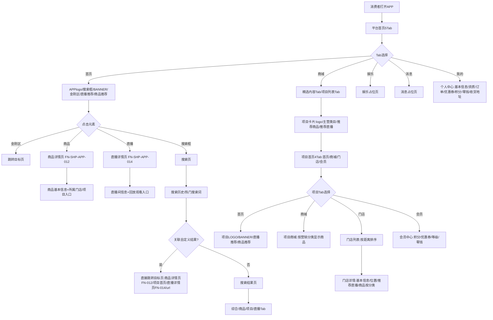
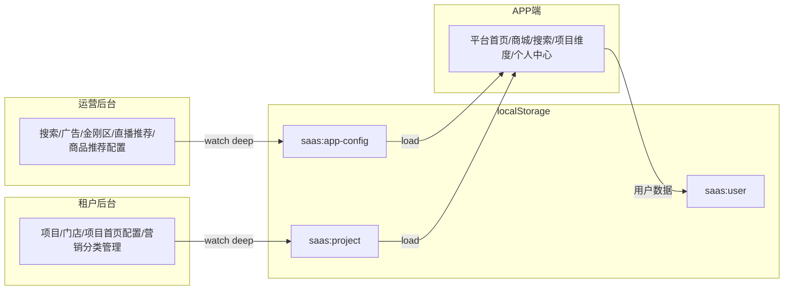
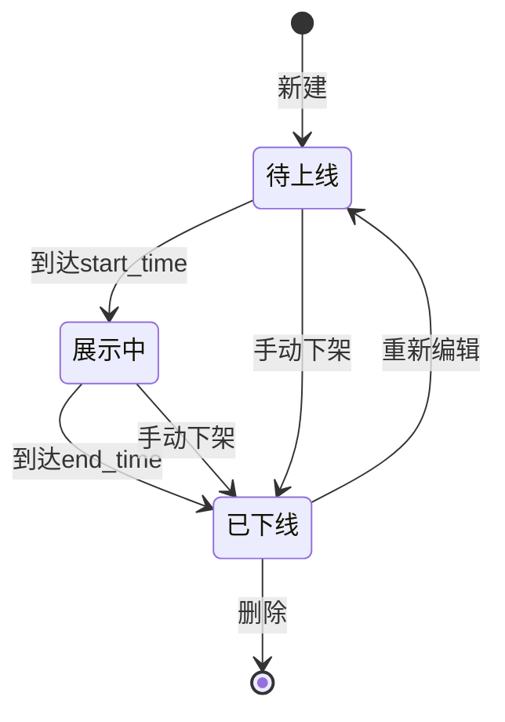
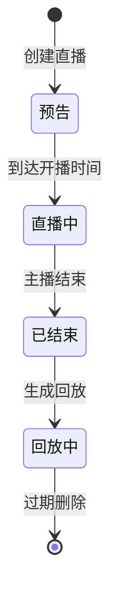
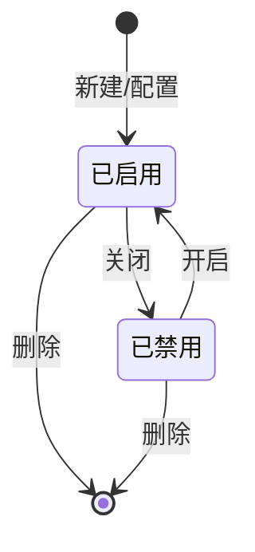
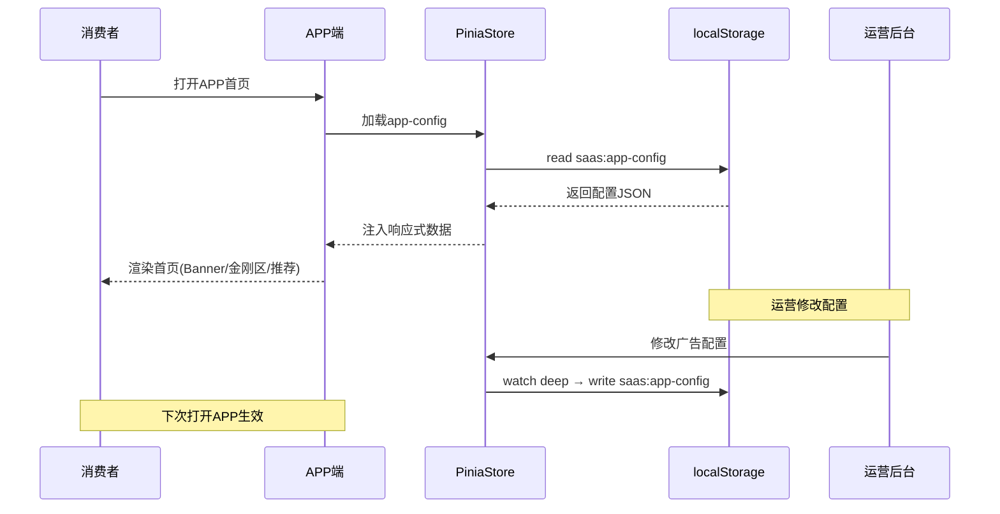

# 17-APP端电商域-PRD-v3.1.0.md

> **doc_id**: REQ-APP-PRD-v3.1.0
> **module**: APP端配置式装修电商
> **business_system**: SAAS电商平台 / SAAS运营后台 / SAAS租户后台
> **version**: v3.1.52
> **platform**: PC端(运营后台+租户后台) + 移动端APP(消费者)
> **author**: BA Agent
> **created**: 2026-08-07
> **last_updated**: 2026-08-14 (v3.1.52 手动推荐选择器改编辑模式——总数上限10条+预勾选已有+可取消勾选移除+确认全量同步)
> **source_brainstorm**: docs/00-brainstorm/APP端/confirmed/BR-脑暴文档-APP端-确认稿.md
> **需求流**: STR-SAAS-002 | **类型**: 新增 | **优先级**: P0

---

## §0.1 变更记录

| 版本 | 日期 | 变更摘要 |
|------|------|----------|
| v3.0.0 | 2026-08-07 | 初版需求归档：5Tab平台首页+4Tab项目首页+搜索体系+运营后台6页+租户后台3页 |
| v3.1.0 | 2026-08-07 | 需求补充：①项目维度Tab导航由「首页/门店/直播/会员」改为「首页/商城/门店/会员」；②新增项目商城页（按营销分类展示商品）；③个人中心扩充（APP资质信息/我的零钱/我的收货地址）；④门店列表按地理位置排序；⑤门店详情内容明确（基本信息+位置+推荐直播+商品按分类）；⑥项目会员页内容调整（积分/优惠券/等级/零钱）；⑦商城页项目卡片扩充（logo名称/主营类目/推荐商品/推荐直播）；⑧项目首页展示内容调整（项目LOGO+BANNER+直播推荐+商品推荐）；⑨新增精选内容Tab说明（商品+直播间） |
| v3.1.1 | 2026-08-07 | 遗漏修复：①补充FN-SHP-APP-012商品详情页功能定义；②补充FN-SHP-APP-014直播详情页功能定义；③补充ENT-PROJECT-008 MarketingCategory实体；④明确订单/优惠券详情不在本次范围（仅展示入口+计数）；⑤补充CONFIG-SHP-009营销分类配置项；⑥补充FN-006平台会员中心边界说明；⑦补充精选内容Tab聚合规则；⑧补充收货地址表单校验规则；⑨补充§3.1首页模块顺序列举；⑩补充§13.1验收矩阵缺失的6个FN验收行 |
| v3.1.2 | 2026-08-08 | 决策点确认：①修正ENT编号冲突(MarketingCategory=ENT-PROJECT-009，Tenant保留ENT-PROJECT-008)；②FN-009项目首页补齐金刚区模块(原PRD遗漏，确认5模块)；③FN-002商城页补充品类筛选功能说明(原PRD遗漏)；④FN-013项目会员中心补充积分规则模块(原PRD遗漏)；⑤FN-006平台会员中心补充平台级积分/优惠券/零钱汇总数字展示 |
| v3.1.3 | 2026-08-08 | 交叉验证修复（20项）：①P0-数据层：AdBanner/CustomSearchResult的jump_type Mock数据统一为PRD四值(product/project_home/live_page/fixed_url)；②productRecommendConfigs target_id修正为真实产品ID(prod-d-001等)；③customSearchResults修正引用不存在的实体；④AppUser Mock补充balance/qualification_info字段；⑤ProjectMember Mock补充coupons/balance字段；⑥Product Mock补充marketing_category字段；⑦ProjectHomeConfig Mock移除/lives死链(改为商城页或直播详情页)；⑧P0-交互层：KingKongGrid修复entry.name/label兼容显示；⑨KingKongGrid移除/lives路由跳转(改为项目首页)；⑩ProjectFrame Tab激活判断支持子路由(startsWith)；⑪StoreDetail LiveCard补绑定@click事件；⑫SearchResultPage placeholder修正为"商品、项目、直播"(BR-SHP-001合规)；⑬P1-逻辑层：ShippingAddressManage接入user-store持久化(新增shippingAddresses状态+addAddress/updateAddress/deleteAddress方法)；⑭MallPage精选内容实现7:3混合展示(featuredMixed列表)；⑮MallPage规则推荐引擎实现(手动推荐不足按销量/观看人数补足)；⑯ProjectMall接入MarketingCategory Store(marketingCategoriesByProject)；⑯P2-清理：移除app-schemas.ts FloorSchema/FloorTypeEnum死代码；⑰移除app-config-store floors状态/默认数据；⑱移除AdminLayout楼层管理菜单项；⑲移除data-service StoredAppConfig.floors字段；⑳修复PRD UC-001-02跳转类型描述与CONFIG-SHP-007枚举值不一致 |
| v3.1.4 | 2026-08-08 | 设计阶段完成：按design-flow V3.5.0(7步法+联合评审+反向匹配)产出完整设计交互文档(9章结构+评审+反向匹配=12章)。①Step1系统分析：APP端6列栅格/HIG/Grid Unit=8px，PC后台24列栅格/Ant Design/Grid Unit=4px；②Step2信息结构：24页面+6弹窗完整页面树+导航层级+UI编号清单+PRD UC映射表；③Step3设计系统：Design Tokens 6类(色彩/字体/间距/圆角/阴影/图标)+组件变体(按钮6/卡片5/输入框3)+材质效果；④Step4交互一致性：按钮四态/表单校验/空状态/错误状态/加载态/弹窗关闭/dirty检测/反馈策略；⑤Step5关键页面布局+草图：24页面+6弹窗Markdown线框图草图+UI编号清单；⑥Step6逐页面交互说明：45 UC全部按五段格式(触发→行为→反馈→后置)定义；⑦Step7交互文档9章+design-map.json；⑧Step8联合评审：3维度(多模块跳转/模态框/交互一致性)全部通过(严重0/中等0)；⑨Step9反向匹配：五维闭环(流程/数据/状态/体验/双向覆盖)全部PASS，BR覆盖率100%，UC覆盖度100%。PM红线C-D1~C-D10全部通过。文档路径：docs/03-design/v3.1.3/APP端电商域/app/SAAS-APP-APP端电商域-交互文档-v3.1.3.md |
| v3.1.7 | 2026-08-08 | 金刚区管理优化3项：①金刚区跳转类型改用JumpTargetPicker组件（与广告位/搜索管理统一），jump_type为product/project/live/url，KingKongEntry新增jump_type/jump_id/project_id字段（兼容旧link_type/link_value）；②金刚区新增"修改人"和"修改时间"字段（updated_by/updated_at），CRUD和状态切换时自动记录；③金刚区列表状态字段改为开关方式（el-switch），可直接在列表上切换active/disabled状态 |
| v3.1.8 | 2026-08-08 | 推荐引擎叠加模式重构：①推荐逻辑由"互斥"改为"叠加"——手动推荐（按sort_order升序）在前，默认规则结果去重补足至总数上限（BR-SHP-030新增）；②默认推荐规则固定一条，不可删除、不可新增其他规则，只能修改规则类型和参数；③手动推荐支持列表选择器弹窗（搜索+多选+批量添加）；④手动推荐支持上移/下移排序；⑤RecommendItem新增sort_order/is_default/updated_by/updated_at字段；⑥UC-OPS-PC-004-01/02、UC-OPS-PC-005-01/02流程更新；⑦UC-SHP-APP-001-01/002-01推荐渲染说明更新；⑧BR-SHP-007修订（互斥→叠加）、BR-SHP-026修订；⑨ENT-APP-005字段更新；⑩PG-OPS-PC-004/005新增列表选择器弹窗 |
| v3.1.9 | 2026-08-08 | 商城页三Tab重构+推荐管理分页：①商城页默认Tab由"精选"改为"项目列表"（BR-SHP-031新增）；②商城页Tab由2个(精选/项目列表)拆为3个(项目列表/精选商品/精选直播)——精选商品显示后台商品推荐的所有可见商品(按叠加模式排序无上限)，精选直播显示后台直播推荐的所有可见直播(按叠加模式排序无上限)；③商城页精选商品/直播支持加载更多分页(每页20条)；④首页直播推荐"更多"跳转精选直播Tab，首页"为你推荐"更多跳转精选商品Tab（通过/app/mall?tab=xxx路由参数）；⑤运营后台直播推荐管理/商品推荐管理的推荐效果预览列表和手动推荐列表增加分页(el-pagination，每页10条)；⑥UC-SHP-APP-002-01/02/03重构，UC-SHP-APP-001-01/02"更多"跳转更新；⑦BR-SHP-026修订(去除7:3混合改为独立Tab)，BR-SHP-031/032新增 |
| v3.1.10 | 2026-08-08 | 推荐规则多维度排序链重构：①推荐规则由单规则(rule_type+limit)重构为多维度排序链(sort_dimensions[])，支持勾选多个排序维度+叠加排序(ORDER BY语义)；②直播推荐维度新增"按项目"(多选)和"按主播类型"(总部/门店/供应商/个人，多选)——LiveRoom实体新增anchor_type字段(BR-SHP-035新增)；③商品推荐维度新增"按项目"(多选)，保留"按商品类目"(多选)/"按销量"/"按上架时间"；④多选维度支持拖拽排序优先级；⑤维度间支持上移/下移调整叠加排序顺序；⑥移除limit参数，改为无条数限制排序所有可见项；⑦新增display_limit字段控制首页推荐区展示条数(精选Tab不受限)；⑧维度语义为排序优先级(选中排前未选排后)非筛选；⑨BR-SHP-008/009/030修订，BR-SHP-034/035新增；⑩ENT-PROJECT-004(anchor_type)/ENT-APP-005(sort_dimensions/display_limit)字段更新；⑪旧版rule_type数据自动迁移为sort_dimensions |
| v3.1.11 | 2026-08-08 | 推荐管理体验优化3项：①运营后台直播推荐管理/商品推荐管理的手动推荐列表新增多选一键批量删除功能(el-table selection列+批量删除按钮+二次确认)；②默认推荐规则的叠加排序顺序区域新增排序逻辑说明面板(含操作者说明和开发人员说明，解释多维度叠加排序规则和各维度比较方式)；③验证APP端首页推荐区+商城页精选商品/精选直播Tab与运营后台配置的实时联动效果(通过Pinia store+localStorage持久化+computed响应式更新，运营后台配置变更后APP端自动刷新)；④BR-SHP-030补充修订(手动推荐支持多选批量删除) |
| v3.1.12 | 2026-08-08 | 后台分页统一+商城页Tab优化+直播状态同步：①搜索管理-热搜词管理列表增加分页(el-pagination，每页10条)；②搜索管理-自定义搜索结果列表增加分页(同上)；③广告位管理列表增加分页(同上)；④APP商城页去掉顶部搜索入口，重点突出Tab导航(项目列表/精选商品/精选直播)，Tab改为粘性定位+加大字号+加粗+下划线指示器加宽；⑤首页直播推荐模块及精选直播页LiveCard组件修复直播状态不同步问题——原写死"直播中"改为根据live.status动态显示(直播中/预告/回放/已结束)，对应不同标签颜色(红/橙/灰/灰) |
| v3.1.13 | 2026-08-08 | 商城页三Tab筛选功能增强+Project实体新增industry字段：①精选商品页增加按商品类目筛选(从精选商品数据动态提取类目选项，支持全部+各类目切换，筛选后重新分页)；②精选直播页增加按直播状态筛选(全部/直播中/预告/回放/已结束，筛选后重新分页)；③项目列表筛选由按品类(daily/health)改为按行业筛选(Project实体新增industry字段，枚举：日用品/保健品/食品饮料/家居家电/美妆个护，从项目数据动态提取行业选项)；④ENT-PROJECT-001新增industry字段；⑤旧数据自动兼容(industry为optional，缺省时不影响筛选) |
| v3.1.14 | 2026-08-08 | 项目首页布局优化7项：①顶部导航栏只保留项目名称，去掉搜索和分享按钮；②项目信息区保留(logo+名称+宣传语+门店数+商品数)；③项目Tab导航(首页/商城/门店/会员)从顶部移到底部固定(navbar样式，图标+文字)；④ProjectHome去掉重复的项目LOGO栏(名称和logo已在Frame信息区显示)；⑤搜索框保留不变(当前页内搜索BR-SHP-029)；⑥金刚区保留；⑦Banner与金刚区调换位置(Banner在前，金刚区在后) |
| v3.1.15 | 2026-08-08 | 项目维度页面优化：①项目首页顶部项目名称居中显示，去掉搜索入口；②项目首页推荐商品区域对齐(去掉灰色背景，padding统一)；③项目商城页去掉项目信息卡片(Frame的project-info仅首页Tab显示)；④项目商城页顶部增加商品/直播双Tab；⑤商品Tab：当前页内搜索只搜商品+左侧营销分类导航+右侧商品列表(外卖平台风格)；⑥直播Tab：当前页内搜索只搜直播+直播状态筛选(全部/直播中/预告/回放/已结束)+直播列表；⑦项目门店页去掉项目信息卡片；⑧项目门店页搜索改为当前页内搜索门店(按名称/地址)；⑨门店列表StoreCard增加推荐直播展示(前2个直播，按状态显示标签)；⑩租户后台项目首页配置增强：推荐商品/直播推荐改为列表选择器弹窗(搜索+多选+已选不显示)+批量删除(el-table selection列+二次确认)；⑪store新增livesByStore计算属性 |
| v3.1.16 | 2026-08-08 | 项目维度页面优化2：①项目首页顶部项目名称和logo信息全部去掉(ProjectFrame导航栏简化为仅返回按钮，删除project-info卡片)；②项目首页热门直播"更多"跳转商城页直播tab(/mall?tab=live)；③项目首页为你推荐"更多"跳转商城页商品tab(/mall?tab=product)；④项目商城页顶部Tab和搜索框置顶不随页面滑动(sticky定位)；⑤项目商城页支持路由query.tab初始化Tab；⑥项目门店页搜索框置顶不随页面滑动(sticky定位)；⑦项目门店页搜索去掉按地址搜索(只搜门店名称)；⑧项目门店页StoreCard去掉顶部大图标封面；⑨StoreCard名称旁显示小logo(40px)；⑩StoreCard去掉门店评分；⑪StoreCard增加联系人(contact_name)+电话(phone)展示和直接拨打电话按钮(tel:链接)；⑫Store实体新增contact_name字段(ENT-PROJECT-002更新)；⑬mock数据10个门店补充contact_name值 |
| v3.1.17 | 2026-08-08 | 门店详情页独立化+商品Tab左右分类：①门店详情页脱离项目框架，作为独立全屏页面显示（无底部导航），顶部显示门店名称，返回按钮返回项目门店列表页；②新增独立路由 /app/store/:storeId(StoreDetail)和/app/store/:storeId/items(StoreItems)，从ProjectFrame children中移出；③门店商品/直播列表页同样独立全屏，顶部显示门店名称，返回按钮返回门店详情页；④商品Tab采用左侧分类+右侧商品外卖平台风格布局；⑤projectId从route.query获取，不再依赖ProjectFrame路由参数 |
| v3.1.19 | 2026-08-08 | APP端优化5项+租户后台3项+数据模型升级：①APP首页搜索框以上全部置顶(sticky)；②全部商品卡去掉购物车图标+商品标签(ProductCard.vue)；③门店列表推荐商品增加名称+优化展示(标题/名称/价格三层)；④项目首页热门直播仅显示直播中/回放(最多4)+更多跳门店列表；⑤项目首页推荐商品按上架时间降序(最新50个)+更多跳商城商品Tab；⑥项目维度返回改为平台商城页(/app/mall)；⑦租户后台新增项目管理页(项目名称/LOGO/商城名称)；⑧租户后台Banner管理页(迁移运营后台完整功能)；⑨租户后台金刚区管理页(迁移运营后台完整功能)；⑩租户后台菜单重构(动态项目菜单6项)；⑪回退商品详情页错误修改+StoreMoreProducts；⑫Project新增mall_name；⑬ProjectHomeConfig的banner_images/quick_entries字段增强(enabled/title/jump_type/jump_target/start_time/end_time) |\n| v3.1.20 | 2026-08-08 | 项目首页热门直播"查看全部"跳转修正：①平台APP首页直播推荐"更多"跳转商城页精选直播Tab(/app/mall?tab=featuredLives)确认无误；②平台APP首页商品推荐"更多"跳转商城页精选商品Tab(/app/mall?tab=featuredProducts)确认无误；③项目首页热门直播"查看全部"由跳转门店列表改为跳转项目商城页直播Tab(/app/project/:projectId/mall?tab=live) |
| v3.1.21 | 2026-08-08 | 租户后台Banner/金刚区管理严格照搬运营后台逻辑+首页配置功能移除：①租户后台Banner管理严格照搬运营后台AdManage完整功能（新增广告/上传图片/跳转配置/展示时间精确到时分秒/排序/启用开关/修改人修改时间/分页），唯一区别为隐藏"项目主页"跳转类型+锁定项目ID(商品和直播仅限当前项目)；②租户后台金刚区管理严格照搬运营后台KingKongManage完整功能（新增入口/图标/名称/跳转配置/排序/启用开关/修改人修改时间），同样隐藏项目主页+锁定项目ID；③首页配置功能移除(删除ProjectHomeConfig.vue+移除路由+移除菜单)；④JumpTargetPicker组件增强(新增lockProjectId+hideProjectJump props支持项目级管理场景)；⑤ProjectHomeConfig的banner_images/quick_entries字段增强(jump_id/project_id_ref/sort_order/status/updated_by/updated_at)；⑥project-store新增ensureHomeConfig方法确保配置存在时自动创建；⑦ProjectHome.vue的onBannerClick/onQuickClick改为按jump_type+jump_id生成跳转(兼容旧link数据)；⑧Mock数据更新(旧quick_entries的jump_type从'project'改为'url'+补jump_id/project_id_ref/sort_order/status) |\n| v3.1.22 | 2026-08-08 | 平台APP个人中心(PlatformMine.vue)UI升级复刻参考设计：①顶部浅绿渐变背景区+"签到领好礼"金币按钮+扫一扫/设置图标；②用户头像+昵称+红色VIP徽章；③优惠券/积分双资产卡（白色圆角卡+彩色图标）；④深色VIP会员卡("VIP|已达到最高等级"/"查看权益")；⑤我的订单面板(全部订单+5个状态入口：待付款/待发货/待收货/待评价/售后退款)；⑥常用功能面板(我的零钱/直播预约/收货地址)；⑦猜你喜欢横向滚动商品列表(取前10个在售商品)；⑧移除原会员等级/积分/订单/地址等旧入口的冗余展示，页面底部留白适配全局底部导航 |\n| v3.1.23 | 2026-08-09 | 个人中心常用功能新增"工作台"入口：①常用功能面板新增工作台(🖥️)，排在首位，作为管理者的快捷入口（无需二级页面，alert占位） |
| v3.1.24 | 2026-08-09 | 项目会员页优化升级+平台入口选项目跳转：①ProjectMember.vue完全重写为资产卡+锚点导航+5模块(签到/等级权益/优惠券预览/积分入口/积分规则)；②资产卡固定顶部含头像+等级徽章+三列资产(积分/优惠券/零钱)+升级进度条；③新增sticky锚点导航(签到/等级/优惠券/积分/规则)，支持query.tab初始化滚动定位；④新增签到模块(7天周期格子+奖励+立即签到按钮)；⑤会员等级新增当前等级权益清单；⑥优惠券预览展示最近3张未使用券卡(满减/折扣/兑换三种样式)；⑦积分服务入口(积分商城/积分账单)；⑧新增Coupon实体(ENT-PROJECT-006A)和SignInState实体(ENT-PROJECT-006B)；⑨PlatformMine.vue各入口(优惠券/积分/零钱/签到/VIP)改为弹出项目选择器弹窗→选中项目跳转/app/project/:id/member?tab=xxx；⑩project-store新增coupons/signInStates状态+couponsByProjectUser/signInStateByProjectUser计算属性+doSignIn方法 |
| v3.1.25 | 2026-08-09 | 会员页优惠券改为二级页面：①移除ProjectMember.vue优惠券预览模块(原M3)；②锚点导航移除优惠券项(由5项改为4项：签到/等级/积分/规则)；③资产卡优惠券点击改为直接跳转二级页面ProjectCoupons；④新增ProjectCoupons.vue优惠券二级页面(独立全屏，支持全部/未使用/已使用/已过期筛选Tab+优惠券卡片列表)；⑤新增路由/app/project/:projectId/coupons(脱离ProjectFrame独立全屏) |
| v3.1.26 | 2026-08-09 | 会员等级卡片式重设计+积分板块合并：①会员等级由列表式改为卡片式横向滚动(各等级渐变色背景+徽章图标+达成状态标签+当前等级放大+阴影)；②当前等级权益改为标签式排列(圆角胶囊标签+渐变背景)；③积分服务与积分规则合并为统一"积分"板块(积分余额展示区+三入口:积分账单/积分兑换/积分明细+积分获取规则列表)；④锚点导航精简为3项(签到/等级/积分)；⑤积分规则项增加彩色渐变图标背景 |
| v3.1.27 | 2026-08-09 | 租户后台项目列表去掉首页配置入口+项目管理logo改为上传图片：①项目列表(ProjectManage.vue)操作列删除"首页配置"按钮及其goConfig函数(原跳转/tenant/projects/:id/home-config，路由表中无此路由实际为404入口清理)，操作列宽度从240px收窄为180px；②项目管理(ProjectProfileManage.vue)项目LOGO由URL输入框改为图片上传组件(el-upload+FileReader转base64+预览)，上传区域80×80px虚线框+Plus图标+"上传LOGO"文字，已上传显示预览图，支持JPG/PNG，大小≤2MB校验，建议尺寸200×200px |
| v3.1.6 | 2026-08-08 | 运营后台优化3项：①广告位管理展示时间精确到时分秒（date-picker由date类型改为datetime类型），广告位/热搜词/自定义搜索结果均新增"修改人"和"修改时间"字段，记录数据最后修改人和修改时间（CRUD/状态切换/关联操作时自动记录）；②热搜词管理移除"固定排序"字段（HotWord实体移除fixed_sort字段，表格移除固定排序列、编辑弹窗移除固定排序开关） |
| v3.1.5 | 2026-08-08 | 需求调整3项：①个人中心移除平台会员等级展示——会员等级仅在项目维度各项目独立存在，平台无独立会员等级体系(BR-SHP-028新增)。FN-005模块由7增至8(增加工作台)，FN-006边界说明修订(移除"平台统一会员卡")，UC-006-01移除MemberLevelConfig依赖+移除会员卡+等级特权列表。②个人中心新增"工作台"入口——后续二级页面可忽略，本期仅入口，BR-SHP-018更新为8模块。③项目首页搜索改为当前页面内搜索——搜索范围限当前项目内的商品和直播，不跳转平台搜索页(BR-SHP-029新增)，UC-009-02由"跳转/app/search"改为"当前页内搜索"，FN-009用户故事+模块表+验收矩阵同步更新 |
| v3.1.28 | 2026-08-09 | 文档全面审查修复（BA/UX/PM三方交叉审查+UC补全）：①UC数量三方校准——PRD实际47个UC(含9A-01/02+11-02+12-02+13-02等)全量确认，design-map同步校准；②APP端独立二级页UC补全——新增UC-SHP-APP-011-02(门店商品/直播列表页StoreItems)、UC-SHP-APP-012-02(更多商品分类页StoreMoreProducts)、UC-SHP-APP-013-02(优惠券二级页ProjectCoupons)；③租户后台FN补全——新增FN-TNT-PC-005(项目信息管理ProjectProfileManage)、FN-TNT-PC-006(项目Banner管理ProjectBannerManage)、FN-TNT-PC-007(项目金刚区管理ProjectKingKongManage)及对应UC；④FN-TNT-PC-003(项目首页配置)标注deprecated(v3.1.21移除，编号保留不重用)；⑤BR补全BR-SHP-036~040(contact_name/独立门店页/会员卡式/优惠券二级页/Logo上传)；⑥CONFIG-SHP-010标注deprecated(精选7:3比例已失效，v3.1.9改为独立Tab)；⑦ENT补全ENT-PROJECT-006A(Coupon)+ENT-PROJECT-006B(SignInState)；⑧§13验收矩阵补3租户FN行+移除FN-TNT-PC-003行；⑨§15多端差异矩阵补3行+修订项目首页配置行；⑩PRD 47 UC全量与设计文档/代码路由三方对齐 |
| v3.1.29 | 2026-08-09 | 交叉审核修复（全专家联合审核）：①删除UC-SHP-APP-009-02(项目首页搜索)——用户决策确认项目首页搜索功能已删除(v3.1.15/v3.1.16去掉搜索入口，原型ProjectHome.vue已移除搜索)，UC总数52→51；②BR-SHP-029标注deprecated(项目首页搜索已删除，编号保留不重用)；③FN-009用户故事删除"项目内搜索栏"描述；④FN-009模块表删除搜索栏行；⑤§13验收矩阵FN-009删除"项目内搜索栏(当前页搜索)"；⑥设计文档§10.2反向匹配报告FN 25→27/UC 52→51/BR 40→45/ENT 19→20(上次审核声称已修复但实际未修改，本次真正修复)；⑦设计文档§5.5/§6/§8/§9删除UC-009-02引用+搜索栏模块+跳转矩阵+追溯表；⑧用例卡清单UC总数52→51+APP端32→31+删除UC-009-02行；⑨design-map.json PG-009.uc删除009-02+total_uc 52→51；⑩app-use-cases.ts确认31个UC(UC-009-02已删除) |
| v3.1.33 | 2026-08-10 | 详情页与框架分离+门店商品点击修复+会员页优化+商城Tab改名+门店更多按钮调整（6项）：①商品详情页/直播详情页路由从/app children移出为独立路由，脱离MobileFrame和ProjectFrame容器，不再显示平台底部5Tab导航，详情页自带状态栏+手机壳容器(与StoreDetail/StoreItems一致)；②修复门店页商品点击无法跳转——StoreProductList.vue的ProductCard补绑定@click事件并emit productId给父组件StoreDetailContent，再emit给ProjectStores/StoreDetail跳转商品详情页；③会员页默认不滚动定位——initTab默认值由'level'改为空字符串，onMounted仅当URL携带tab参数时才滚动到对应锚点，进入页面默认显示最顶部；④会员页锚点导航"等级"改为"会员"(label)；⑤商城页Tab"项目列表"改名为"商城列表"(避免"项目"二字误解)；⑥门店页"更多"按钮逻辑调整——由"数量超过限制才显示"改为"showMore=true且有数据即显示"，让用户始终能通过"更多"进入二级页查看全部商品/直播 |
| v3.1.34 | 2026-08-10 | 推荐引擎职责分离+使用场景独立化+商城管理页3Tab：①规则引擎职责分离——RecommendRuleEntity/RecommendItem/RuleTemplate移除display_limit字段，规则引擎只负责获取数据集(排序)，不再管理展示条数；②使用场景独立化——RecommendScenario新增display_limit字段控制展示条数(首页推荐区=6，商城精选Tab=undefined无上限)；③删除sc-home-project场景(首页无项目推荐区)，新增sc-mall-projects场景(商城列表Tab管理项目推荐)；④运营后台菜单重组为4分组——首页推荐(直播推荐/商品推荐)+商城管理(商城)+规则引擎(规则引擎管理)+APP首页配置(搜索/广告/金刚区)；⑤新增MallManage.vue商城管理页(3Tab：商城列表/精选商品/精选直播)，每Tab内嵌ScenarioPanel组件复用规则引用+手动推荐+预览逻辑；⑥删除ProjectRecommendManage.vue+路由+菜单(项目推荐改由商城管理页商城列表Tab管理)；⑦RecommendRuleManage.vue移除展示条数列+表单项；⑧PlatformHome.vue首页推荐条数改从场景读取；⑨MallPage.vue商城列表Tab接入sc-mall-projects场景规则引擎排序 |
| v3.1.35 | 2026-08-10 | 首页推荐合并+展示条数配置+菜单重组：①直播推荐+商品推荐合并为"首页推荐"页HomeRecommendManage.vue(2Tab：直播推荐/商品推荐)，删除LiveRecommendManage.vue和ProductRecommendManage.vue两个独立页面；②首页推荐增加"展示条数"配置入口——Store层新增updateScenarioDisplayLimit方法，ScenarioPanel.vue新增showDisplayLimitEditor prop(默认false)，当为true时显示el-input-number(1-50，留空=无上限)；③菜单分组重组——"APP首页配置"改为"运营管理"el-sub-menu(首页推荐/商城管理/规则引擎/搜索管理/广告位管理/金刚区管理) |
| v3.1.36 | 2026-08-10 | 推荐引擎脱离+项目维度直播推荐默认规则（4项）：①平台APP首页直播推荐脱离规则引擎——改为按默认规则排序(BR-SHP-042：状态排序live→upcoming→replay+同状态按started_at倒序，排除ended)，保留手动推荐叠加(手动在前+默认规则补足)+展示条数配置；②运营后台首页推荐页直播Tab移除"规则引用"区域——新增showRuleSelector prop(默认true)，直播Tab传false改为显示"按默认规则读取"说明卡片，商品Tab保留规则引用不变；③项目维度(项目首页+门店首页)推荐直播采用默认规则(BR-SHP-041：状态排序live→upcoming→replay+同状态按started_at倒序，排除ended)，默认展示前4条；④商城精选直播Tab仍走规则引擎不变，首页直播推荐"更多"跳转精选直播Tab不变 |
| v3.1.37 | 2026-08-10 | 项目禁用分层拦截+运营平台项目列表+租户后台项目选择器：①运营平台新增"项目管理"菜单分组(独立分组，位于"运营管理"上方)，含"项目列表"一项(/admin/projects)，从租户后台迁移ProjectManage并增强——新增启用/禁用操作(切换status字段)+禁用原因输入+搜索筛选(按名称/ID/状态/租户)+分页(每页10条)+所属租户列+行业列；②租户后台移除"项目列表"入口(菜单和路由)，header-bar右侧新增项目下拉选择器(el-select绑定currentProjectId，切换项目跳转/tenant/projects/:id/profile)，未选项目时显示"请在顶部选择项目"提示；③新增BR-SHP-043项目禁用分层拦截规则——采用"软停用"策略(数据保留+前端隐藏+交易拦截+历史不受影响)，5层拦截：Layer1数据层过滤(activeProjects computed+filterByActiveProject过滤inactive项目的商品/直播)+Layer2路由层拦截(ProjectFrame进入时checkProjectActive+inactive弹窗返回)+Layer3详情层拦截(商品/直播/门店详情onMounted检查所属项目状态)+Layer4交易层拦截(下单/支付前后端二次校验，前端按钮禁用)+Layer5会员层处理(签到/下单/券使用禁用，积分/券/余额仍可查看)；④新增FN-SHP-ADMIN-007运营平台项目管理(项目列表CRUD+启用/禁用)；⑤修订FN-TNT-PC-001(移除项目列表，改为项目下拉选择器+当前项目功能)；⑥新增useProjectStatusFilter composable(过滤inactive项目内容)+useProjectActiveCheck composable(弹窗拦截inactive项目)；⑦ProjectMember/ProjectHome增加项目停用提示条+签到按钮禁用 |
| v3.1.38 | 2026-08-10 | 规则引用生效状态+商城列表场景缺失修复：①RecommendScenario新增effect_status字段(pending=数据同步中/active=已生效)，关联规则后自动进入pending异步处理完成后自动active，pending期间规则照常执行(状态仅作视觉提示)；②RuleEffectStatus类型定义(pending/active)；③Store层setScenarioRule触发2秒异步模拟(pending→active)，新增syncingScenarios记录+setScenarioEffectStatus方法；④ScenarioPanel规则引用卡片展示生效状态标签(待生效warning/已生效success)；⑤新增BR-SHP-044规则引用生效状态规则；⑥修复商城管理-商城列表选择规则提示"场景不存在"bug——recommendScenarios从localStorage加载旧数据时缺失新增场景(如sc-mall-projects)，增加默认场景合并+effect_status迁移逻辑 |
| v3.1.46 | 2026-08-12 | 商品卡精简+直播详情页空展位：①ProductCard.vue移除收藏按钮(心形图标.pc-like)——覆盖全部商品列表展示位置(平台首页/商城页/项目首页/项目商城页/搜索结果/门店商品列表，6处复用全局生效)；②ProductCard.vue移除商品名称下方门店标签(.pc-store-line/.pc-store-tag)——同步删除storeName computed与useProjectStore依赖；③LiveDetail.vue全部内容移除改为空页展位——删除封面/直播信息/回放入口/直播商品/所属项目入口，保留手机壳容器+顶部状态栏+返回按钮+用例卡，中间显示"直播详情页/页面建设中，敬请期待"占位说明，路由/app/live/:liveId及LiveCard跳转入口不变 |
| v3.1.47 | 2026-08-12 | 功能页面管理只读化+金刚区图标上传+输入框字符限制+展示条数上限调整（6项）：①FunctionPageManage.vue完全改造为只读+启用/禁用模式——删除"新增功能页面"按钮+新增/编辑弹窗+删除按钮，操作列改为el-switch启用/禁用开关+筛选/重置按钮；②金刚区图标由输入框改为el-upload上传图片（限制200KB+FileReader转base64），删除渐变色输入框，KingKongGrid按icon值以http/data:开头显示img否则保留emoji兼容旧数据；③11个管理页输入框maxlength+show-word-limit限制（运营平台7个+租户平台6个）；④租户后台"Banner管理"改名为"广告位管理"（6处）；⑤首页推荐展示条数上限调整（直播Tab max=10/商品Tab max=100/其他默认50，updateScenarioDisplayLimit按scenarioId动态校验） |
| v3.1.48 | 2026-08-13 | 禁用项目会员层权益"允许查看不允许使用"精化（用例卡+BR-SHP-043同步）：①运营后台项目禁用用例卡(UC-OPS-CONFIG-006)特别说明第十点细化——会员权益(积分/优惠券/余额/会员等级/签到)允许查看、不允许使用：积分明细可查看但积分商城兑换弹窗拦截"项目已停用，暂不支持兑换"、抵扣因无法下单(④⑤下单支付已拦截)自然不可用；券列表/券详情可查看但无抵扣入口；余额明细可查看但提现弹窗拦截"项目已停用，暂不支持提现"；签到按钮禁用不可获取奖励；会员等级/权益清单仅展示不可获取；②APP端项目首页用例卡(UC-SHP-STORE-001)特别说明+验收标准同步补充"仅可查看不允许使用"验收点(兑换/抵扣/提现均弹窗拦截)；③PRD BR-SHP-043 Layer5会员层描述同步精化为"允许查看不允许使用" |
| v3.1.49 | 2026-08-13 | 直播状态筛选去"已结束"选项+平台首页直播推荐去"N场直播中"文字：①MallPage.vue精选直播状态筛选liveStatusOptions移除"已结束"选项（与推荐引擎sortLivesByDefaultRule排除ended逻辑一致——已结束直播不进入推荐流，筛选项无意义）；②ProjectMall.vue项目商城直播Tab状态筛选statusOptions移除"已结束"选项（同上）；③StoreItems.vue门店二级页直播Tab状态筛选liveFilterOptions移除"已结束"选项（同上）；④PlatformHome.vue直播推荐区移除"N场直播中"文字标签及相关ph-sec-live-text/ph-sec-live-dot/liveCount计算属性和pulse动画CSS——直播状态已由LiveCard组件内部状态标签展示，板块标题仅保留"直播推荐"+图标+"更多"入口 |
| v3.1.50 | 2026-08-14 | 首页推荐展示条数去"留空=无上限"文案+规则引擎移除"按项目品类"维度（2项）：①ScenarioPanel.vue展示条数编辑器删除placeholder="留空=无上限"，hint由"（留空=首页展示全部；填6=首页只展示前6条）"改为"（填6=首页只展示前6条）"——实际范围限制为直播1-10/商品1-100（v3.1.47已设上限），不允许无上限；②recommend-dimensions.ts移除"按项目品类"维度——删除DIM_PROJECT_CATEGORY定义及PROJECT_CATEGORY_OPTIONS常量，从DIMENSION_REGISTRY注册表移除，项目类型规则可用维度为按项目/按行业/按会员数/按门店数（存量规则rule-project-industry-members使用industry+member_count不受影响） |
| v3.1.51 | 2026-08-14 | 首页推荐/商城管理场景面板优化（ScenarioPanel.vue单点修改，涉及首页推荐+商城管理全部5个Tab统一生效）：①列表选择器弹窗增加"最多选择10条"上限——勾选超过10条时提示并回滚勾选状态，弹窗内分页（每页10条）保留不变；②手动推荐列表去掉分页器改为全量展示，排序边界改为全局判断（首条不可上移/末条不可下移）；③推荐效果预览去掉分页器改为前30条截断全量展示（标题标注"前30条"） |
| v3.1.52 | 2026-08-14 | 手动推荐选择器改编辑模式（ScenarioPanel.vue单点修改，首页推荐+商城管理全部5个Tab统一生效）：①"最多10条"明确为手动推荐**总数上限**（含已有+本次勾选），非单次勾选上限，"已选N条"为当前总已选数量；②候选列表不再过滤已选项——打开弹窗预勾选当前已有手动推荐，可取消勾选=移除、勾选其它=新增，确认后全量同步（允许全取消=清空手动推荐）；③翻页/搜索变化时自动同步勾选，保证任何一页看到的已选项都是勾选态；④弹窗标题加"可取消已选 · 最多10条"，确认按钮"确认添加"改为"确认" |

---

## §0.0 终端冻结

| 业务系统 | 建议终端 | 理由 |
|----------|----------|------|
| SAAS运营后台 | PC端 | 运营配置操作密集，需大屏表格/表单 |
| SAAS租户后台 | PC端 | 项目/门店管理CRUD，需大屏表格 |
| SAAS电商平台 | 移动端APP | 消费者浏览购物场景，移动优先 |

**冻结声明**: 后续 UX/Arch/FD/QA/AC 不得再询问「支持哪些端」。

---

## §0 项目判定与需求路由

- **项目性质**: 存量项目（SAAS-APP，已有高保真原型 56 文件）
- **需求类型**: 新增（`--type=新增`，v2.0.0+v2.1.0 为初始版本，此PRD为正式需求归档）
- **analysis_depth**: full
- **version_bump**: minor → v3.0.0
- **脑暴类型**: planning（规划型，已产出脑暴确认稿）
- **上下文加载**: 脑暴确认稿 + 高保真原型代码 + Mock数据体系

---

## §1 背景与问题

### 1.1 业务背景

构建 SAAS 级「配置式装修」电商平台，为多租户提供统一的 APP 端电商能力。平台采用**四层层级模型**：平台→租户→项目→门店。消费者通过统一 APP 入口进入，可在平台首页浏览所有项目，也可进入项目维度查看门店、直播、会员。

### 1.2 问题现状

- 多租户缺乏统一的 APP 端电商能力，各租户独立开发成本高
- 运营配置分散，广告/金刚区/推荐/搜索缺乏统一管理入口
- 搜索体系缺失，用户无法快速发现商品/项目/直播
- 前后端数据未打通，原型展示与后台配置脱节

---

## §2 目标与度量

### 2.1 商业目标（BO）

| 编号 | 目标 | 度量方式 |
|------|------|----------|
| BO-SAASAPP-001 | 租户快速上线电商能力 | 租户接入→APP上线周期 ≤ 7天 |
| BO-SAASAPP-002 | 提升消费者留存与复购 | APP DAU/MAU、会员转化率、复购率 |

### 2.2 业务目标（BG）

| 编号 | 目标 | 关联BO |
|------|------|--------|
| BG-SAASAPP-001 | 提供完整的 APP 端电商体验（浏览/搜索/项目/会员） | BO-SAASAPP-002 |
| BG-SAASAPP-002 | 运营后台一站式配置 APP 展示内容 | BO-SAASAPP-001 |
| BG-SAASAPP-003 | 租户后台自主管理项目/门店/首页 | BO-SAASAPP-001 |
| BG-SAASAPP-004 | 搜索体系提升商品发现效率 | BO-SAASAPP-002 |

---

## §3 范围

### 3.1 In-Scope（本次版本）

- **APP-平台端**: 5 Tab 容器（首页/商城/娱乐/消息/我的）+ 搜索二级页 + 项目维度4Tab（首页/商城/门店/会员）
- **APP-平台首页**: 模块顺序「APPlogo → 搜索框 → BANNER位 → 金刚区 → 直播推荐区 → 商品推荐区」共6模块固定顺序（见 BR-SHP-012）
- **APP-商城页**: 默认Tab为项目列表，3个Tab切换（项目列表/精选商品/精选直播），精选商品显示后台商品推荐的所有可见商品，精选直播显示后台直播推荐的所有可见直播
- **APP-个人中心**: 基本信息 + 工作台入口 + APP资质信息 + 我的订单 + 我的优惠券 + 我的积分 + 我的零钱 + 我的收货地址（8模块，见 BR-SHP-018）。平台个人中心不展示平台会员等级，会员等级仅在项目维度（各项目独立等级）展示
- **项目维度4Tab**: 首页/商城/门店/会员（独立底部导航）
- **项目首页**: 项目LOGO + BANNER位 + 直播推荐 + 商品推荐（由租户后台管理，与APP首页管理分离，v3.1.29：项目首页搜索已删除）
- **项目商城页**: 按当前项目的营销分类展示商品，点击商品进入商品详情页（FN-SHP-APP-012）
- **项目门店页**: 门店列表按地理位置距离排序，点击进入门店详情
- **门店详情**: 门店基本信息 + 门店位置 + 推荐直播 + 商品（可按分类展示）
- **项目会员页**: 会员积分 + 会员优惠券 + 会员等级 + 会员零钱
- **商品详情页**: 商品基本信息展示 + 门店/项目入口（FN-SHP-APP-012）
- **直播详情页**: 直播间信息展示 + 回放观看入口（FN-SHP-APP-014）
- **运营后台**: 搜索管理/广告位/金刚区/直播推荐/商品推荐 5 管理页
- **租户后台**: 项目/门店/商品营销分类管理/项目信息/项目Banner/项目金刚区 6个活跃管理页(+1个deprecated: 项目首页配置已于v3.1.21移除，功能拆分为Banner管理+金刚区管理)
- **数据持久化**: localStorage + Pinia watch 自动同步
- **Mock数据**: 4项目+10门店+17商品+5直播+4会员等级

### 3.2 Out-of-Scope

- 实时直播推流/观看（仅展示直播卡片+回放标记，直播详情页仅展示直播间信息+回放入口，不含实时流播放）
- 支付/下单/结算流程（个人中心"我的订单""我的优惠券"仅展示入口+计数，**订单详情/优惠券详情不在本次范围**）
- 后端API对接（纯前端localStorage模拟）
- APP娱乐Tab/消息Tab完整功能（仅占位，不考虑内容）
- 多语言/国际化
- 直播作为项目维度独立Tab（直播内容融入项目首页推荐和门店详情推荐）

---

## §4 与既有模块关系

本项目为独立新增域，不继承审查域代码。复用既有架构模式：
- **五层架构**: services→contracts→stores→components→pages
- **多入口构建**: Vite rollupOptions.input（app/admin/tenant）
- **Hash路由**: createWebHashHistory
- **Element Plus**: PC后台UI组件
- **Zod Schema**: 契约层类型安全

---

## §5 业务目标映射（BO/BG）

| BG | 涉及FN | 涉及PG | 度量指标 |
|----|--------|--------|----------|
| BG-SAASAPP-001 | FN-SHP-APP-001~014(含009A, 不含006已合并说明) | PG-SHP-APP-001~014(含009A) | APP DAU、页面PV |
| BG-SAASAPP-002 | FN-OPS-PC-001~005 | PG-OPS-PC-001~005 | 配置操作次数、配置生效时长 |
| BG-SAASAPP-003 | FN-TNT-PC-001~007(不含003，003 deprecated) | PG-TNT-PC-001~007(不含003) | 租户管理操作次数 |
| BG-SAASAPP-004 | FN-SHP-APP-007~008 | PG-SHP-APP-007~008 | 搜索PV、搜索结果点击率 |

---

## §6 用户故事

### US-01 消费者浏览购物

> 作为消费者，我想打开APP浏览平台首页的Banner/金刚区/推荐商品/直播，
> 进入项目查看门店和直播，搜索好物，享受会员折扣，
> 以便快速发现和购买商品。

### US-02 平台运营配置

> 作为平台运营人员，我想在运营后台统一配置搜索热词/广告位/金刚区/推荐，
> 以便控制 APP 首页展示内容，无需开发介入。

### US-03 租户管理项目

> 作为租户管理员，我想管理自己的项目信息、门店信息和项目首页配置，
> 以便维护销售单元和门店详情。

---

## §7 五类图

### 7.1 业务流程图（flowchart）

### 7.2 信息流转图（跨模块 flowchart）

> **v3.1.0变更**: 运营后台移除楼层管理（保留5个管理页）；APP首页模块顺序明确（APPlogo→搜索框→BANNER→金刚区→直播推荐→商品推荐）；项目维度4Tab变更（首页/商城/门店/会员，移除独立直播Tab）；个人中心扩充（资质/零钱/收货地址）；门店列表按地理位置排序。
>
> **v3.1.1变更**: 补充商品详情页(FN-012)和直播详情页(FN-014)功能定义；补充营销分类管理(FN-TNT-PC-004)和MarketingCategory实体；明确订单/优惠券详情不在范围；补充精选内容聚合规则、收货地址校验规则、平台会员中心边界说明；补全验收矩阵。

### 7.3 状态机（stateDiagram-v2）

#### 7.3.1 广告位状态机

#### 7.3.2 直播状态机

#### 7.3.3 推荐配置状态机

### 7.4 业务时序图（sequenceDiagram）

### 7.5 三方接口时序图

> 本项目纯前端原型，无三方接口调用。数据持久化通过 localStorage 本地完成。

---

## §8 功能需求列表与用例（FN/UC）

### 8.1 电商平台·APP端

#### FN-SHP-APP-001 平台首页展示

| 字段 | 值 |
|------|-----|
| 功能编号 | FN-SHP-APP-001 |
| 所属模块 | APP-平台首页 |
| 所属业务系统 | SAAS电商平台 |
| 运行终端 | APP端 |
| 信息密度 | high |
| 所属业务流程 | 消费者浏览流程 |
| 页面编号 | PG-SHP-APP-001 |
| 页面路由 | /app/home |
| 组件名 | PlatformHome |

**用户故事**: 作为消费者，我想在平台首页从顶部往下依次看到APPlogo、搜索框、BANNER位、金刚区、直播推荐区、商品推荐区，以便快速发现内容。

**UC-SHP-APP-001-01 首页加载渲染**

- **前置条件**: 用户已打开APP
- **基本流程**:
  | 步骤 | 类型 | 操作 | 调用接口/路由 | 说明 |
  |------|------|------|--------------|------|
  | 1 | [系统自动] | 加载app-config-store | localStorage:saas:app-config | Pinia初始化 |
  | 2 | [系统自动] | 加载project-store | localStorage:saas:project | 获取项目/商品/直播数据 |
  | 3 | [系统自动] | 渲染顶部APPlogo | — | 品牌展示区（模块1） |
  | 4 | [系统自动] | 渲染搜索框（点击跳转搜索页） | — | 入口引导（模块2） |
  | 5 | [系统自动] | 渲染BANNER广告位轮播 | — | BannerCarousel组件，默认展示多张（模块3） |
  | 6 | [系统自动] | 渲染金刚区网格 | — | KingKongGrid组件（模块4） |
  | 7 | [系统自动] | 渲染直播推荐区 | — | LiveCard列表（模块5），叠加模式：手动推荐(sort_order升序) → 默认规则补足；"更多"跳转/app/mall?tab=featuredLives |
  | 8 | [系统自动] | 渲染商品推荐区 | — | ProductCard列表（模块6），叠加模式：手动推荐(sort_order升序) → 默认规则补足；"更多"跳转/app/mall?tab=featuredProducts |
- **备选流程**: 无配置数据时各板块显示空状态
- **数据范围(R/W)**: AdBanner(R), KingKongEntry(R), RecommendItem(R), LiveRoom(R), Product(R)
- **后置条件**: 首页完整渲染，用户可交互
- **关联UC**: UC-SHP-APP-001-02(Banner点击), UC-SHP-APP-001-03(金刚区点击), UC-SHP-APP-007-01(搜索跳转)
- **模块顺序说明**: 顶部从上到下依次为「APPlogo → 搜索框 → BANNER位 → 金刚区 → 直播推荐区 → 商品推荐区」

**UC-SHP-APP-001-02 Banner点击跳转**

- **前置条件**: 首页已渲染，Banner有跳转配置
- **基本流程**:
  | 步骤 | 类型 | 操作 | 说明 |
  |------|------|------|------|
  | 1 | [手动] | 用户点击Banner | — |
  | 2 | [系统自动] | 读取jump_type | product(商品详情页FN-012)/project_home(项目首页)/live_page(直播详情页FN-014)/fixed_url(固定url跳转) |
  | 3 | [系统自动] | 跳转目标页 | 携带jump_id/project_id |
- **备选流程**: jump_type为fixed_url时跳转指定路径（固定url跳转）
- **数据范围(R/W)**: AdBanner(R)
- **后置条件**: 跳转到目标页
- **关联UC**: UC-SHP-APP-009-01(项目首页), UC-SHP-APP-014-01(直播详情页)
- **跳转目标说明**: 跳转目标可配置为一个商品详情页(FN-012)、一个项目首页、一场直播的直播详情页(FN-014)，或固定url跳转

**UC-SHP-APP-001-03 金刚区点击跳转**

- **前置条件**: 首页已渲染，金刚区有跳转配置
- **基本流程**: 用户点击金刚区入口→读取link_type→跳转目标页
- **数据范围(R/W)**: KingKongEntry(R)
- **后置条件**: 跳转到目标页
- **关联UC**: UC-SHP-APP-009-01(搜索)

#### FN-SHP-APP-002 商城页

| 字段 | 值 |
|------|-----|
| 功能编号 | FN-SHP-APP-002 |
| 所属模块 | APP-商城 |
| 页面编号 | PG-SHP-APP-002 |
| 页面路由 | /app/mall |
| 组件名 | MallPage |

**用户故事**: 作为消费者，我想在商城页通过顶部Tab切换「项目列表」「精选商品」「精选直播」，默认展示项目列表，精选商品显示后台推荐的所有可见商品，精选直播显示后台推荐的所有可见直播，以便发现感兴趣的项目、商品和直播。

**UC-SHP-APP-002-01 项目列表展示（默认Tab）**
- **前置条件**: 用户在Tab2商城，默认展示项目列表Tab
- **基本流程**: 加载项目数据→渲染ProjectCard网格
- **项目卡片内容**: 项目logo名称、主营类目、主要推荐的商品（如果该项目下有直播还可以推荐直播）
- **品类筛选**: 项目列表支持按主营类目筛选，可选筛选项由项目的主营类目动态生成（如日常/健康等），用户可按品类过滤项目列表
- **数据范围(R/W)**: Project(R), Product(R), LiveRoom(R)
- **后置条件**: 展示所有项目
- **关联UC**: UC-SHP-APP-002-03

**UC-SHP-APP-002-02 精选商品展示**
- **前置条件**: 用户切换到精选商品Tab
- **基本流程**: 加载后台商品推荐的所有可见商品→渲染ProductCard列表（按叠加模式排序：手动推荐sort_order升序在前 → 默认规则补足，无上限显示所有可见商品）
- **分页**: 每页20条，"加载更多"按钮翻页
- **数据范围(R/W)**: RecommendItem(R), Product(R)
- **后置条件**: 展示所有精选商品
- **关联UC**: UC-SHP-APP-002-03

**UC-SHP-APP-002-03 精选直播展示**
- **前置条件**: 用户切换到精选直播Tab
- **基本流程**: 加载后台直播推荐的所有可见直播→渲染LiveCard列表（按叠加模式排序：手动推荐sort_order升序在前 → 默认规则补足，无上限显示所有可见直播）
- **分页**: 每页20条，"加载更多"按钮翻页
- **数据范围(R/W)**: RecommendItem(R), LiveRoom(R)
- **后置条件**: 展示所有精选直播
- **关联UC**: UC-SHP-APP-002-04

**UC-SHP-APP-002-04 项目卡片点击跳转**
- **前置条件**: 项目列表已渲染
- **基本流程**: 用户点击项目卡片→跳转/app/project/:projectId
- **数据范围(R/W)**: Project(R)
- **后置条件**: 进入项目首页
- **关联UC**: UC-SHP-APP-009-01

#### FN-SHP-APP-003 娱乐页（占位）

| 字段 | 值 |
|------|-----|
| 功能编号 | FN-SHP-APP-003 |
| 页面编号 | PG-SHP-APP-003 |
| 页面路由 | /app/entertainment |

**UC-SHP-APP-003-01 娱乐页占位展示**
- **前置条件**: 用户在Tab3娱乐
- **基本流程**: 渲染占位页面（预留游戏/互动入口）
- **数据范围(R/W)**: 无
- **后置条件**: 展示占位内容
- **关联UC**: 无

#### FN-SHP-APP-004 消息页（占位）

| 字段 | 值 |
|------|-----|
| 功能编号 | FN-SHP-APP-004 |
| 页面编号 | PG-SHP-APP-004 |
| 页面路由 | /app/message |

**UC-SHP-APP-004-01 消息页占位展示**
- **前置条件**: 用户在Tab4消息
- **基本流程**: 渲染占位页面（预留消息列表+分类）
- **数据范围(R/W)**: 无
- **后置条件**: 展示占位内容
- **关联UC**: 无

#### FN-SHP-APP-005 个人中心

| 字段 | 值 |
|------|-----|
| 功能编号 | FN-SHP-APP-005 |
| 页面编号 | PG-SHP-APP-005 |
| 页面路由 | /app/mine |
| 组件名 | PlatformMine |

**用户故事**: 作为消费者，我想在个人中心查看基本信息、工作台入口、APP资质信息、我的订单、我的优惠券、我的积分、我的零钱、我的收货地址，以便管理个人账户和资产。平台个人中心不展示会员等级（会员等级仅在项目维度各项目独立展示）。

**UC-SHP-APP-005-01 个人中心模块展示**
- **前置条件**: 用户在Tab5我的
- **基本流程**: 加载用户数据→渲染个人中心模块列表
- **模块构成**:
  | 模块 | 说明 | 数据来源 |
  |------|------|----------|
  | 基本信息 | 用户头像/昵称/手机号 | AppUser(R) |
  | 工作台 | 工作台入口（二级页面后续迭代，本期仅入口） | — |
  | APP资质信息 | APP相关资质展示 | AppUser(R) |
  | 我的订单 | 订单列表入口 | AppUser(R) |
  | 我的优惠券 | 优惠券列表入口 | AppUser(R) |
  | 我的积分 | 平台积分展示 | AppUser(R) |
  | 我的零钱 | 零钱余额展示 | AppUser(R) |
  | 我的收货地址 | 收货地址列表入口 | ShippingAddress(R) |
- **数据范围(R/W)**: AppUser(R), ShippingAddress(R)
- **后置条件**: 展示个人中心各模块
- **关联UC**: UC-SHP-APP-005-02(会员中心), UC-SHP-APP-005-03(收货地址)
- **会员等级说明**: 平台个人中心不展示平台级会员等级，会员等级属于项目维度（FN-SHP-APP-013各项目独立等级），平台无独立会员等级体系

**UC-SHP-APP-005-02 会员中心入口**
- **前置条件**: 个人中心已渲染
- **基本流程**: 用户点击会员中心→跳转/app/mine/member
- **数据范围(R/W)**: AppUser(R)
- **后置条件**: 进入平台会员中心
- **关联UC**: UC-SHP-APP-006-02

**UC-SHP-APP-005-03 我的收货地址管理**
- **前置条件**: 个人中心已渲染
- **基本流程**: 用户点击我的收货地址→跳转收货地址列表页→可新增/编辑/删除收货地址
- **数据范围(R/W)**: ShippingAddress(R/W)
- **后置条件**: 展示或管理收货地址
- **关联UC**: 无
- **表单校验规则（v3.1.1补充）**:
  | 字段 | 校验规则 | 必填 |
  |------|----------|------|
  | recipient_name | 1-20字符，不含特殊符号 | 是 |
  | phone | 中国大陆手机号格式 `/^1[3-9]\d{9}$/` | 是 |
  | province | 省市区联动选择，不可手动输入 | 是 |
  | city | 省市区联动选择，依赖province | 是 |
  | district | 省市区联动选择，依赖city | 是 |
  | detail_address | 5-100字符 | 是 |
  | is_default | 布尔值，设为默认时其他地址自动取消默认 | 否 |
- **业务约束**: 每个用户最多保存20条收货地址（CONFIG-SHP-011）

#### FN-SHP-APP-006 平台会员中心

| 字段 | 值 |
|------|-----|
| 功能编号 | FN-SHP-APP-006 |
| 页面编号 | PG-SHP-APP-006 |
| 页面路由 | /app/mine/member |
| 组件名 | PlatformMember |

> **边界说明（v3.1.1补充，v3.1.5修订）**: 本功能定位为「平台级资产汇总+项目会员入口聚合」，与 FN-SHP-APP-013 项目会员中心（项目维度，展示具体项目下的积分/优惠券/等级/零钱）为**不同层级**：006展示平台级资产汇总数字+所有项目的会员入口列表，013展示单一项目内的会员资产详情（含项目会员等级）。**平台暂无独立会员等级体系**，会员等级仅在项目维度各项目独立存在，因此006不展示平台统一会员卡。两者保留独立FN，006作为平台个人中心(005)的二级页，013作为项目维度4Tab之一。

**UC-SHP-APP-006-01 平台级资产汇总展示**
- **前置条件**: 用户进入会员中心
- **基本流程**: 加载用户数据→渲染平台级资产汇总数字→渲染项目会员入口列表
- **平台级资产汇总**（v3.1.2补充）:
  | 汇总项 | 说明 | 数据来源 |
  |--------|------|----------|
  | 平台总积分 | 用户在所有项目积分的汇总数字 | AppUser(R), ProjectMember(R) |
  | 平台总优惠券 | 用户在所有项目优惠券数量的汇总 | AppUser(R), ProjectMember(R) |
  | 平台总零钱 | 用户在所有项目零钱余额的汇总 | AppUser(R), ProjectMember(R) |
- **数据范围(R/W)**: AppUser(R), ProjectMember(R)
- **后置条件**: 展示平台级资产汇总+项目会员入口
- **关联UC**: UC-SHP-APP-006-02

**UC-SHP-APP-006-02 各项目会员入口**
- **前置条件**: 会员卡已展示
- **基本流程**: 渲染项目会员入口列表→用户点击→跳转项目会员中心
- **数据范围(R/W)**: Project(R), ProjectMember(R)
- **后置条件**: 跳转/app/project/:id/member
- **关联UC**: UC-SHP-APP-008-01

#### FN-SHP-APP-007 搜索页

| 字段 | 值 |
|------|-----|
| 功能编号 | FN-SHP-APP-007 |
| 页面编号 | PG-SHP-APP-007 |
| 页面路由 | /app/search |
| 组件名 | SearchPage |

**UC-SHP-APP-007-01 搜索页加载**
- **前置条件**: 用户点击搜索栏
- **基本流程**: 渲染搜索输入框→加载搜索历史(localStorage)→加载热搜词(带图标标签)
- **数据范围(R/W)**: HotWord(R), localStorage:search-history(R)
- **后置条件**: 展示搜索页
- **关联UC**: UC-SHP-APP-007-02, UC-SHP-APP-007-03

**UC-SHP-APP-007-02 热搜词点击跳转**
- **前置条件**: 搜索页已渲染
- **基本流程**:
  | 步骤 | 类型 | 操作 | 说明 |
  |------|------|------|------|
  | 1 | [手动] | 用户点击热搜词 | — |
  | 2 | [系统自动] | 检查csr_id关联 | 是否关联自定义结果 |
  | 3a | [系统自动] | 有关联→直接跳转目标页 | 商品详情页(FN-012)/项目首页/直播详情页(FN-014)/固定url跳转 |
  | 3b | [系统自动] | 无关联→跳转搜索结果页 | 携带q参数 |
- **数据范围(R/W)**: HotWord(R), CustomSearchResult(R)
- **后置条件**: 跳转目标页或搜索结果页
- **关联UC**: UC-SHP-APP-008-01

**UC-SHP-APP-007-03 搜索历史展示与清除**
- **前置条件**: 搜索页已加载
- **基本流程**: 展示搜索历史(最多12条)→用户可点击历史词搜索→用户可清除历史
- **数据范围(R/W)**: localStorage:search-history(R/W)
- **后置条件**: 历史展示或清除
- **关联UC**: UC-SHP-APP-007-02

#### FN-SHP-APP-008 搜索结果页

| 字段 | 值 |
|------|-----|
| 功能编号 | FN-SHP-APP-008 |
| 页面编号 | PG-SHP-APP-008 |
| 页面路由 | /app/search/result |
| 组件名 | SearchResultPage |

**UC-SHP-APP-008-01 搜索结果加载**
- **前置条件**: 用户输入关键词或点击热搜词（无关联）
- **基本流程**:
  | 步骤 | 类型 | 操作 | 说明 |
  |------|------|------|------|
  | 1 | [系统自动] | 读取q参数 | 关键词 |
  | 2 | [系统自动] | 匹配自定义搜索结果 | 按标题/描述匹配（手动配置的搜索结果优先展示） |
  | 3 | [系统自动] | 匹配引擎结果 | 默认按搜索引擎搜索商品/项目/直播 |
  | 4 | [系统自动] | 渲染Tab(综合/商品/项目/直播) | — |
  | 5 | [系统自动] | 自定义结果优先展示 | 置顶 |
- **备选流程**: 无匹配结果时显示空状态
- **数据范围(R/W)**: CustomSearchResult(R), Product(R), Project(R), LiveRoom(R)
- **后置条件**: 展示搜索结果
- **关联UC**: UC-SHP-APP-008-02
- **搜索结果配置说明**: 搜索结果默认按搜索引擎搜索，也可以在运营后台手动配置搜索结果。手动配置的搜索结果可以配置为一个商品详情页(FN-012)、一个项目的首页、一场直播的直播详情页(FN-014)，或者固定url跳转。

**UC-SHP-APP-008-02 Tab切换过滤**
- **前置条件**: 搜索结果已展示
- **基本流程**: 用户切换Tab(综合/商品/项目/直播)→过滤对应类型结果
- **数据范围(R/W)**: Product(R), Project(R), LiveRoom(R)
- **后置条件**: 展示过滤后结果
- **关联UC**: UC-SHP-APP-008-01

**UC-SHP-APP-008-03 搜索结果点击跳转**
- **前置条件**: 搜索结果已展示
- **基本流程**: 用户点击结果项→跳转目标页(商品详情页/项目首页/直播详情页)
- **数据范围(R/W)**: Product(R), Project(R), LiveRoom(R)
- **后置条件**: 跳转详情页
- **关联UC**: UC-SHP-APP-012-01(商品详情), UC-SHP-APP-014-01(直播详情), UC-SHP-APP-009-01(项目首页)

#### FN-SHP-APP-009 项目首页

| 字段 | 值 |
|------|-----|
| 功能编号 | FN-SHP-APP-009 |
| 所属模块 | 项目维度-首页 |
| 页面编号 | PG-SHP-APP-009 |
| 页面路由 | /app/project/:projectId |
| 组件名 | ProjectHome |

**用户故事**: 作为消费者，我想进入项目首页看到项目LOGO、金刚区快捷入口、BANNER位、直播推荐、商品推荐，项目首页有独立的底部导航（首页/商城/门店/会员），以便浏览该项目的商品和直播。（v3.1.29：项目首页搜索已删除，详见v3.1.15/v3.1.16变更记录）

**UC-SHP-APP-009-01 项目首页加载**
- **前置条件**: 用户进入项目维度
- **基本流程**: 加载项目数据→渲染项目独立底部导航（首页/商城/门店/会员）→渲染项目首页内容
- **项目首页内容**（从上到下）:
  | 模块 | 说明 | 数据来源 |
  |------|------|----------|
  | 项目LOGO | 项目logo+名称展示 | Project(R) |
  | 金刚区 | 快捷入口（热卖排行/新品首发/秒杀专区等），由租户后台配置 | ProjectHomeConfig(R) |
  | BANNER位 | 项目Banner轮播 | ProjectHomeConfig(R) |
  | 直播推荐 | 项目直播推荐 | ProjectHomeConfig(R), LiveRoom(R) |
  | 商品推荐 | 项目商品推荐 | ProjectHomeConfig(R), Product(R) |
- **数据范围(R/W)**: Project(R), ProjectHomeConfig(R), Product(R), LiveRoom(R)
- **后置条件**: 项目首页完整渲染
- **关联UC**: UC-SHP-APP-010-01(门店列表)
- **管理说明**: 项目首页的BANNER位、直播推荐、商品推荐由租户后台管理，与APP首页管理分离（APP首页由运营后台管理）

#### FN-SHP-APP-009A 项目商城页 ⭐ v3.1.0新增

| 字段 | 值 |
|------|-----|
| 功能编号 | FN-SHP-APP-009A |
| 所属模块 | 项目维度-商城 |
| 页面编号 | PG-SHP-APP-009A |
| 页面路由 | /app/project/:projectId/mall |
| 组件名 | ProjectMall |

**用户故事**: 作为消费者，我想在项目商城页根据当前项目的营销分类浏览每个分类下的所有商品，点击商品进入商品详情页，以便购买心仪的商品。

**UC-SHP-APP-009A-01 项目商城页加载**
- **前置条件**: 用户在项目维度Tab2商城
- **基本流程**:
  | 步骤 | 类型 | 操作 | 说明 |
  |------|------|------|------|
  | 1 | [系统自动] | 加载项目营销分类 | 获取当前项目的商品营销分类列表 |
  | 2 | [系统自动] | 渲染分类导航 | 按分类展示Tab/侧边栏 |
  | 3 | [系统自动] | 加载每个分类下的商品 | 按分类分组展示商品 |
  | 4 | [系统自动] | 渲染商品列表 | ProductCard列表 |
- **备选流程**: 无分类数据时显示空状态
- **数据范围(R/W)**: Project(R), Product(R), MarketingCategory(R)
- **后置条件**: 展示项目商城页
- **关联UC**: UC-SHP-APP-009A-02

**UC-SHP-APP-009A-02 商品点击跳转**
- **前置条件**: 项目商城页已渲染
- **基本流程**: 用户点击商品→跳转商品详情页(FN-SHP-APP-012)
- **数据范围(R/W)**: Product(R)
- **后置条件**: 进入商品详情页
- **关联UC**: UC-SHP-APP-012-01

#### FN-SHP-APP-010 门店页

| 字段 | 值 |
|------|-----|
| 功能编号 | FN-SHP-APP-010 |
| 所属模块 | 项目维度-门店 |
| 页面编号 | PG-SHP-APP-010 |
| 页面路由 | /app/project/:projectId/stores |
| 组件名 | ProjectStores |

**用户故事**: 作为消费者，我想在项目门店页看到当前项目下的所有门店，按地理位置距离排序，距离我最近的显示在最前面，点击门店可以进入门店首页，以便找到最近的门店。

**UC-SHP-APP-010-01 门店列表加载与排序**
- **前置条件**: 用户在项目维度Tab3门店
- **基本流程**:
  | 步骤 | 类型 | 操作 | 说明 |
  |------|------|------|------|
  | 1 | [系统自动] | 获取用户当前位置 | 浏览器定位API |
  | 2 | [系统自动] | 加载项目门店数据 | 获取当前项目下所有门店 |
  | 3 | [系统自动] | 计算各门店距离 | 根据用户位置和门店经纬度计算距离 |
  | 4 | [系统自动] | 按距离升序排序 | 距离最近的显示在最前面 |
  | 5 | [系统自动] | 渲染StoreCard列表 | 门店基本信息+距离展示 |
- **备选流程**: 无法获取用户位置时按默认顺序展示
- **数据范围(R/W)**: Store(R), Product(R)
- **后置条件**: 展示按距离排序的门店列表
- **关联UC**: UC-SHP-APP-011-01
- **排序规则**: 按地理位置距离排序，距离我最近的显示在最前面

#### FN-SHP-APP-011 门店详情

| 字段 | 值 |
|------|-----|
| 功能编号 | FN-SHP-APP-011 |
| 所属模块 | 项目维度-门店详情 |
| 页面编号 | PG-SHP-APP-011 |
| 页面路由 | /app/store/:storeId?projectId=xxx（独立页面，脱离项目框架） |
| 组件名 | StoreDetail |

**用户故事**: 作为消费者，我想在门店首页看到门店基本信息、门店位置、门店推荐的直播、以及门店的商品（商品可以按分类展示），以便了解门店详情和商品。

**UC-SHP-APP-011-01 门店详情加载**
- **前置条件**: 用户点击门店卡片
- **基本流程**: 加载门店信息→渲染门店详情页
- **门店详情内容**:
  | 模块 | 说明 | 数据来源 |
  |------|------|----------|
  | 门店基本信息 | 门店名称/电话/营业时间等 | Store(R) |
  | 门店位置 | 地图+地址展示 | Store(R) |
  | 推荐直播 | 门店关联的直播推荐 | LiveRoom(R) |
  | 门店商品 | 商品列表，可按分类展示 | Product(R) |
- **数据范围(R/W)**: Store(R), Product(R), LiveRoom(R)
- **后置条件**: 展示门店详情
- **关联UC**: UC-SHP-APP-011-02(门店商品/直播列表)
- **商品展示说明**: 商品可以按分类展示

**UC-SHP-APP-011-02 门店商品/直播列表加载** ⭐ v3.1.28新增
- **前置条件**: 用户在门店详情页点击"更多商品"或"更多直播"
- **基本流程**:
  | 步骤 | 类型 | 操作 | 说明 |
  |------|------|------|------|
  | 1 | [手动] | 用户点击"更多商品"或"更多直播" | — |
  | 2 | [系统自动] | 跳转/app/store/:storeId/items | 独立全屏页，脱离项目框架 |
  | 3 | [系统自动] | 加载门店信息 | 顶部显示门店名称 |
  | 4 | [系统自动] | 商品Tab：左侧营销分类+右侧商品列表(外卖平台风格) | Product(R) |
  | 5 | [系统自动] | 直播Tab：门店关联直播列表 | LiveRoom(R) |
- **备选流程**: 无商品/直播时显示空状态
- **数据范围(R/W)**: Store(R), Product(R), LiveRoom(R), MarketingCategory(R)
- **后置条件**: 展示门店商品/直播列表
- **关联UC**: UC-SHP-APP-012-01(商品详情), UC-SHP-APP-014-01(直播详情)
- **页面说明**: 独立全屏页(无底部导航)，返回按钮返回门店详情页；projectId从route.query获取

#### FN-SHP-APP-013 项目会员中心

| 字段 | 值 |
|------|-----|
| 功能编号 | FN-SHP-APP-013 |
| 所属模块 | 项目维度-会员 |
| 页面编号 | PG-SHP-APP-013 |
| 页面路由 | /app/project/:projectId/member |
| 组件名 | ProjectMember |

**用户故事**: 作为消费者，我想在项目会员页查看会员积分、会员优惠券、会员等级、会员零钱，以便了解我在该项目的会员权益和资产。

**UC-SHP-APP-013-01 项目会员中心展示**
- **前置条件**: 用户在项目维度Tab4会员
- **基本流程**: 加载会员配置→渲染项目会员中心
- **会员中心内容**:
  | 模块 | 说明 | 数据来源 |
  |------|------|----------|
  | 会员资产卡 | 头像+等级徽章+三列资产(积分/优惠券/零钱)+升级进度条 | ProjectMember(R), MemberLevelConfig(R) |
  | 签到 | 7天周期格子+奖励+立即签到按钮 | SignInState(R/W) |
  | 会员等级 | 卡片式横向滚动(渐变色背景+徽章+达成状态)+当前等级权益标签 | MemberLevelConfig(R), ProjectMember(R) |
  | 积分板块 | 积分余额展示+三入口(积分账单/积分兑换/积分明细)+积分获取规则 | ProjectMember(R) |
- **优惠券二级页面**: 点击资产卡优惠券→跳转ProjectCoupons二级页面(独立全屏，支持全部/未使用/已使用/已过期筛选Tab+优惠券卡片列表)
- **锚点导航**: sticky锚点导航(签到/等级/积分)，支持query.tab初始化滚动定位
- **平台入口跳转**: 平台个人中心(PlatformMine)各入口点击→弹出项目选择器→选中项目跳转/app/project/:id/member?tab=xxx定位对应模块
- **数据范围(R/W)**: MemberLevelConfig(R), ProjectMember(R), Coupon(R), SignInState(R/W)
- **后置条件**: 展示项目会员中心
- **关联UC**: UC-SHP-APP-005-01(个人中心入口→选项目跳转), UC-SHP-APP-013-02(优惠券二级页)
- **领域知识说明**: 个人中心和会员中心的所有内容可以深度学习SAAS系统中的知识库

**UC-SHP-APP-013-02 优惠券二级页加载** ⭐ v3.1.28新增
- **前置条件**: 用户在项目会员页点击资产卡优惠券
- **基本流程**:
  | 步骤 | 类型 | 操作 | 说明 |
  |------|------|------|------|
  | 1 | [手动] | 用户点击资产卡优惠券 | — |
  | 2 | [系统自动] | 跳转/app/project/:projectId/coupons | 独立全屏页，脱离项目框架 |
  | 3 | [系统自动] | 加载当前用户在该项目的优惠券 | Coupon(R) |
  | 4 | [系统自动] | 渲染筛选Tab(全部/未使用/已使用/已过期) | — |
  | 5 | [系统自动] | 渲染优惠券卡片列表 | 满减红/折扣黄/兑换蓝三种样式 |
- **备选流程**: 无优惠券时显示空状态
- **数据范围(R/W)**: Coupon(R), ProjectMember(R)
- **后置条件**: 展示优惠券二级页
- **关联UC**: UC-SHP-APP-013-01(项目会员中心)
- **页面说明**: 独立全屏页(无底部导航)，返回按钮返回项目会员页

#### FN-SHP-APP-012 商品详情页 ⭐ v3.1.1补充

| 字段 | 值 |
|------|-----|
| 功能编号 | FN-SHP-APP-012 |
| 所属模块 | APP-商品详情 |
| 所属业务系统 | SAAS电商平台 |
| 运行终端 | APP端 |
| 信息密度 | high |
| 所属业务流程 | 消费者浏览流程 |
| 页面编号 | PG-SHP-APP-012 |
| 页面路由 | /app/product/:productId |
| 组件名 | ProductDetail |

**用户故事**: 作为消费者，我想进入商品详情页查看商品基本信息（图片/价格/标题/描述）、所属门店和项目入口，以便了解商品详情并前往门店或项目。

**UC-SHP-APP-012-01 商品详情页加载**
- **前置条件**: 用户从平台首页推荐/商城精选/项目商城/搜索结果/Banner点击商品进入
- **基本流程**:
  | 步骤 | 类型 | 操作 | 说明 |
  |------|------|------|------|
  | 1 | [系统自动] | 解析路由参数 | 获取productId |
  | 2 | [系统自动] | 加载Product数据 | 从project-store获取商品详情 |
  | 3 | [系统自动] | 渲染商品主图 | 支持多图轮播 |
  | 4 | [系统自动] | 渲染商品标题/价格/原价/销量 | 商品基本信息 |
  | 5 | [系统自动] | 渲染商品描述 | 富文本描述 |
  | 6 | [系统自动] | 渲染所属门店入口 | 点击跳转门店详情(FN-011) |
  | 7 | [系统自动] | 渲染所属项目入口 | 点击跳转项目首页(FN-009) |
- **备选流程**: 商品不存在或已下架时显示"商品不可见"空状态
- **数据范围(R/W)**: Product(R), Store(R), Project(R)
- **后置条件**: 商品详情页完整渲染
- **关联UC**: UC-SHP-APP-011-01(门店详情), UC-SHP-APP-009-01(项目首页)
- **范围说明**: 本次仅展示商品信息+门店/项目入口，**不含加购/下单/结算/评论功能**（见 §3.2 Out-of-Scope）

**UC-SHP-APP-012-02 更多商品分类页加载** ⭐ v3.1.28新增
- **前置条件**: 用户在项目商城页或门店商品列表点击"更多商品"
- **基本流程**:
  | 步骤 | 类型 | 操作 | 说明 |
  |------|------|------|------|
  | 1 | [手动] | 用户点击"更多商品" | — |
  | 2 | [系统自动] | 跳转更多商品页 | 按分类展示全部商品 |
  | 3 | [系统自动] | 加载分类列表 | 左侧分类导航 |
  | 4 | [系统自动] | 加载当前分类商品 | 右侧商品列表 |
- **备选流程**: 无商品时显示空状态
- **数据范围(R/W)**: Product(R), MarketingCategory(R)
- **后置条件**: 展示更多商品分类页
- **关联UC**: UC-SHP-APP-012-01(商品详情)

#### FN-SHP-APP-014 直播详情页 ⭐ v3.1.1补充

| 字段 | 值 |
|------|-----|
| 功能编号 | FN-SHP-APP-014 |
| 所属模块 | APP-直播详情 |
| 所属业务系统 | SAAS电商平台 |
| 运行终端 | APP端 |
| 信息密度 | medium |
| 所属业务流程 | 消费者浏览流程 |
| 页面编号 | PG-SHP-APP-014 |
| 页面路由 | /app/live/:liveId |
| 组件名 | LiveDetail |

**用户故事**: 作为消费者，我想进入直播详情页查看直播间信息（标题/主播/封面/观看数）和回放观看入口，以便了解直播内容并观看回放。

**UC-SHP-APP-014-01 直播详情页加载**
- **前置条件**: 用户从平台首页推荐/商城精选/门店详情/Banner/搜索点击直播进入
- **基本流程**:
  | 步骤 | 类型 | 操作 | 说明 |
  |------|------|------|------|
  | 1 | [系统自动] | 解析路由参数 | 获取liveId |
  | 2 | [系统自动] | 加载LiveRoom数据 | 从project-store获取直播详情 |
  | 3 | [系统自动] | 渲染直播封面/标题/主播名 | 直播基本信息 |
  | 4 | [系统自动] | 渲染观看数/状态 | status(live/replay/ended/upcoming) |
  | 5 | [系统自动] | 渲染回放观看入口 | status=replay时展示 |
  | 6 | [系统自动] | 渲染所属项目入口 | 点击跳转项目首页(FN-009) |
- **备选流程**: status=upcoming时显示"直播未开始"；status=live时显示"直播进行中"（仅展示信息，不含实时流）
- **数据范围(R/W)**: LiveRoom(R), Project(R)
- **后置条件**: 直播详情页完整渲染
- **关联UC**: UC-SHP-APP-009-01(项目首页)
- **范围说明**: 本次仅展示直播信息+回放入口，**不含实时直播推流/观看**（见 §3.2 Out-of-Scope）

### 8.2 运营后台·PC端

#### FN-OPS-PC-001 搜索管理

| 字段 | 值 |
|------|-----|
| 功能编号 | FN-OPS-PC-001 |
| 所属模块 | 运营后台-搜索管理 |
| 所属业务系统 | SAAS运营后台 |
| 运行终端 | PC端 |
| 页面编号 | PG-OPS-PC-001 |
| 页面路由 | /admin/search |
| 组件名 | SearchManage |

**UC-OPS-PC-001-01 底纹词设置**
- **前置条件**: 运营人员登录运营后台
- **基本流程**: 编辑底纹词→保存到app-config-store
- **数据范围(R/W)**: AppConfig(W)
- **后置条件**: 底纹词更新，APP搜索栏显示
- **关联UC**: UC-OPS-PC-001-02

**UC-OPS-PC-001-02 热搜词CRUD**
- **前置条件**: 进入搜索管理页
- **基本流程**: 新增/编辑/删除热搜词→设置图标标签(hot/fire/new/popular/recommend/sale)→设置权重/状态→保存→自动记录修改人/修改时间
- **数据范围(R/W)**: HotWord(R/W)
- **后置条件**: 热搜词列表更新，记录最后修改人和修改时间
- **关联UC**: UC-OPS-PC-001-03

**UC-OPS-PC-001-03 热搜词关联自定义结果**
- **前置条件**: 热搜词已存在
- **基本流程**: 点击关联自定义结果→选择已有CustomSearchResult→保存csr_id→自动记录修改人/修改时间
- **数据范围(R/W)**: HotWord(W), CustomSearchResult(R)
- **后置条件**: 热搜词关联自定义结果，APP点击直接跳转，记录最后修改人和修改时间
- **关联UC**: UC-OPS-PC-001-04

**UC-OPS-PC-001-04 自定义搜索结果CRUD**
- **前置条件**: 进入搜索管理页
- **基本流程**: 新增/编辑/删除自定义结果→设置标题/描述/跳转类型(jump_type)/跳转目标(jump_id)→保存→自动记录修改人/修改时间
- **数据范围(R/W)**: CustomSearchResult(R/W)
- **后置条件**: 自定义结果列表更新，记录最后修改人和修改时间
- **关联UC**: UC-OPS-PC-001-03

#### FN-OPS-PC-002 广告位管理

| 字段 | 值 |
|------|-----|
| 功能编号 | FN-OPS-PC-002 |
| 页面编号 | PG-OPS-PC-002 |
| 页面路由 | /admin/ad |
| 组件名 | AdManage |

**UC-OPS-PC-002-01 广告位列表查看**
- **前置条件**: 进入广告位管理页
- **基本流程**: 加载广告列表→表格展示(ID/标题/位置/跳转/展示时间(精确到时分秒)/排序/状态/修改人/修改时间)
- **数据范围(R/W)**: AdBanner(R)
- **后置条件**: 展示广告列表
- **关联UC**: UC-OPS-PC-002-02

**UC-OPS-PC-002-02 广告位新增/编辑**
- **前置条件**: 点击新增/编辑
- **基本流程**: 填写标题→上传图片(base64)→选择位置→配置跳转(JumpTargetPicker)→设置展示时间(start_time/end_time，精确到时分秒)→设置排序→保存→自动记录修改人/修改时间
- **数据范围(R/W)**: AdBanner(W)
- **后置条件**: 广告列表更新，APP首页Banner展示，记录最后修改人和修改时间
- **关联UC**: UC-OPS-PC-002-03

**UC-OPS-PC-002-03 广告位删除**
- **前置条件**: 广告列表有数据
- **基本流程**: 点击删除→确认→从列表移除
- **数据范围(R/W)**: AdBanner(D)
- **后置条件**: 广告列表更新
- **关联UC**: UC-OPS-PC-002-01

#### FN-OPS-PC-003 金刚区管理

| 字段 | 值 |
|------|-----|
| 功能编号 | FN-OPS-PC-003 |
| 页面编号 | PG-OPS-PC-003 |
| 页面路由 | /admin/kingkong |
| 组件名 | KingKongManage |

**UC-OPS-PC-003-01 金刚区CRUD**
- **前置条件**: 进入金刚区管理页
- **基本流程**: 新增/编辑/删除金刚区入口→设置名称/图标/渐变色/跳转类型(jump_type)/跳转目标(jump_id)→保存→自动记录修改人/修改时间
- **数据范围(R/W)**: KingKongEntry(R/W)
- **后置条件**: 金刚区列表更新，APP首页金刚区展示，记录最后修改人和修改时间
- **关联UC**: 无
- **状态切换**: 列表状态列支持开关直接切换（active/disabled），切换时自动记录修改人/修改时间
- **跳转类型统一**: 使用JumpTargetPicker组件（与广告位/搜索管理统一），jump_type为product/project/live/url

#### FN-OPS-PC-004 直播推荐管理

| 字段 | 值 |
|------|-----|
| 功能编号 | FN-OPS-PC-004 |
| 页面编号 | PG-OPS-PC-004 |
| 页面路由 | /admin/live-recommend |
| 组件名 | LiveRecommendManage |

**UC-OPS-PC-004-01 手动推荐配置**
- **前置条件**: 进入直播推荐管理页
- **基本流程**: 点击"添加推荐直播"→弹出列表选择器（支持搜索+多选）→勾选目标直播→确认批量添加→可通过上移/下移调整排序→可切换状态(active/disabled)→可删除
- **数据范围(R/W)**: RecommendItem(W), LiveRoom(R)
- **后置条件**: 推荐配置更新，手动推荐按sort_order升序优先于默认规则
- **关联UC**: UC-OPS-PC-004-03

**UC-OPS-PC-004-02 默认规则配置**
- **前置条件**: 进入直播推荐管理页
- **基本流程**: 在"默认推荐规则"区域编辑规则类型(status/viewer_count)→设置参数(TOP N)→保存。默认规则固定一条(is_default=true)，不可删除、不可新增其他规则
- **数据范围(R/W)**: RecommendItem(W)
- **后置条件**: 默认规则更新，手动推荐不足时按此规则补足
- **关联UC**: UC-OPS-PC-004-03

**UC-OPS-PC-004-03 推荐效果预览**
- **前置条件**: 推荐配置已保存
- **基本流程**: 加载推荐结果→渲染LiveCard列表预览（叠加模式：手动推荐在前 + 默认规则补足，标注来源"手动/规则"）
- **数据范围(R/W)**: RecommendItem(R), LiveRoom(R)
- **后置条件**: 展示推荐效果
- **关联UC**: UC-OPS-PC-004-01

#### FN-OPS-PC-005 商品推荐管理

| 字段 | 值 |
|------|-----|
| 功能编号 | FN-OPS-PC-005 |
| 页面编号 | PG-OPS-PC-005 |
| 页面路由 | /admin/product-recommend |
| 组件名 | ProductRecommendManage |

**UC-OPS-PC-005-01 手动推荐配置**
- **前置条件**: 进入商品推荐管理页
- **基本流程**: 点击"添加推荐商品"→弹出列表选择器（支持搜索+多选）→勾选目标商品→确认批量添加→可通过上移/下移调整排序→可切换状态(active/disabled)→可删除
- **数据范围(R/W)**: RecommendItem(W), Product(R)
- **后置条件**: 推荐配置更新，手动推荐按sort_order升序优先于默认规则
- **关联UC**: UC-OPS-PC-005-03

**UC-OPS-PC-005-02 默认规则配置**
- **前置条件**: 进入商品推荐管理页
- **基本流程**: 在"默认推荐规则"区域编辑规则类型(sales/category/created_at/fixed)→设置参数→保存。默认规则固定一条(is_default=true)，不可删除、不可新增其他规则
- **数据范围(R/W)**: RecommendItem(W)
- **后置条件**: 默认规则更新，手动推荐不足时按此规则补足
- **关联UC**: UC-OPS-PC-005-03

**UC-OPS-PC-005-03 推荐效果预览**
- **前置条件**: 推荐配置已保存
- **基本流程**: 加载推荐结果→渲染ProductCard列表预览（叠加模式：手动推荐在前 + 默认规则补足，标注来源"手动/规则"）
- **数据范围(R/W)**: RecommendItem(R), Product(R)
- **后置条件**: 展示推荐效果
- **关联UC**: UC-OPS-PC-005-01

#### FN-SHP-ADMIN-007 项目列表管理（v3.1.37 新增）

| 字段 | 值 |
|------|-----|
| 功能编号 | FN-SHP-ADMIN-007 |
| 所属模块 | 运营后台-项目管理 |
| 所属业务系统 | SAAS运营后台 |
| 运行终端 | PC端 |
| 页面编号 | PG-OPS-PC-006 |
| 页面路由 | /admin/projects |
| 组件名 | ProjectListManage |

> **v3.1.37 新增**：从租户后台（FN-TNT-PC-001）迁移项目列表管理至运营平台，并增强为支持项目启用/禁用操作的项目全生命周期管理入口。租户后台不再展示项目列表，改为通过顶部下拉选择器切换项目。

**UC-OPS-PC-006-01 项目CRUD+启用/禁用**
- **前置条件**: 运营管理员登录运营后台
- **基本流程**: 新增/编辑/删除项目→设置名称/商城名/所属租户/行业/品类/logo/描述/排序→保存；列表支持按名称/ID搜索、按状态筛选(运营中/已停用)、按租户筛选、分页(每页10条)
- **数据范围(R/W)**: Project(R/W), Tenant(R)
- **后置条件**: 项目列表更新，禁用操作触发BR-SHP-043分层拦截
- **关联UC**: 无

**UC-OPS-PC-006-02 项目禁用**
- **前置条件**: 项目处于运营中状态
- **基本流程**: 点击"禁用"→弹出禁用确认弹窗→填写禁用原因(可选)→确认禁用→项目status改为inactive→BR-SHP-043分层拦截生效（该项目的商品/直播从商城/推荐/搜索隐藏，用户进入项目/详情/下单被拦截）
- **数据范围(R/W)**: Project(W status, description)
- **后置条件**: 项目及关联内容在前端隐藏，历史订单售后不受影响
- **关联UC**: UC-OPS-PC-006-01

**UC-OPS-PC-006-03 项目启用**
- **前置条件**: 项目处于已停用状态
- **基本流程**: 点击"启用"→项目status改为active→所有层自动恢复（商品/直播重新出现在列表/推荐/搜索，无需额外操作）
- **数据范围(R/W)**: Project(W status)
- **后置条件**: 项目及关联内容在前端恢复可见，用户可正常进入和下单
- **关联UC**: UC-OPS-PC-006-01

> **v3.1.0变更**: 移除楼层管理(FN-OPS-PC-006)，APP首页模块调整为6模块固定顺序（APPlogo→搜索框→BANNER→金刚区→直播推荐→商品推荐），运营后台保留5个管理页（搜索/广告位/金刚区/直播推荐/商品推荐）。
>
> **v3.1.37新增**: FN-SHP-ADMIN-007 项目列表管理（从租户后台迁移，增加启用/禁用操作+BR-SHP-043分层拦截）。

### 8.3 租户后台·PC端

#### FN-TNT-PC-001 项目管理（v3.1.37 修订：项目列表移至运营平台，本功能改为项目下拉选择器+当前项目管理）

| 字段 | 值 |
|------|-----|
| 功能编号 | FN-TNT-PC-001 |
| 所属模块 | 租户后台-项目管理 |
| 所属业务系统 | SAAS租户后台 |
| 运行终端 | PC端 |
| 页面编号 | PG-TNT-PC-001 |
| 页面路由 | /tenant/projects/:projectId/profile（v3.1.37：原/tenant/projects路由移除，改为项目选择器切换） |
| 组件名 | TenantLayout（项目选择器）+ ProjectProfileManage（当前项目编辑） |

> **v3.1.37 变更说明**：项目列表入口从租户后台移至运营平台（FN-SHP-ADMIN-007），租户后台不再展示项目列表页。租户后台通过 header-bar 顶部项目下拉选择器（el-select）切换当前项目，选中后导航到 /tenant/projects/:projectId/profile 管理当前项目信息。项目启用/禁用操作由运营平台统一管理，租户后台不参与。

**UC-TNT-PC-001-01 当前项目管理（v3.1.37 修订）**
- **前置条件**: 租户管理员登录租户后台，通过顶部下拉选择器选中项目
- **基本流程**: 选择项目→编辑当前项目名称/logo/品类/描述→保存（不可修改项目状态，状态由运营平台管理）
- **数据范围(R/W)**: Project(R/W，仅当前选中项目，status字段只读)
- **后置条件**: 当前项目信息更新
- **关联UC**: UC-TNT-PC-002-01

#### FN-TNT-PC-002 门店管理

| 字段 | 值 |
|------|-----|
| 功能编号 | FN-TNT-PC-002 |
| 页面编号 | PG-TNT-PC-002 |
| 页面路由 | /tenant/projects/:projectId/stores |
| 组件名 | StoreManage |

**UC-TNT-PC-002-01 门店CRUD**
- **前置条件**: 已选择项目
- **基本流程**: 新增/编辑/删除门店→设置名称/类型(pickup/sales/both)/地址/电话/营业时间/经纬度→保存
- **数据范围(R/W)**: Store(R/W)
- **后置条件**: 门店列表更新
- **关联UC**: UC-TNT-PC-001-01

#### ~~FN-TNT-PC-003 项目首页配置~~ ⚠️ deprecated（v3.1.21移除，编号保留不重用）

> **废弃说明（v3.1.21）**: 原功能"项目首页配置(ProjectHomeConfig)"已从租户后台移除（路由表无`/tenant/projects/:id/home-config`），首页Banner和金刚区改由独立的FN-TNT-PC-006(项目Banner管理)和FN-TNT-PC-007(项目金刚区管理)承担。本编号保留不重用，仅作历史记录。

| 字段 | 值 |
|------|-----|
| 功能编号 | ~~FN-TNT-PC-003~~ |
| 页面编号 | ~~PG-TNT-PC-003~~ |
| 页面路由 | ~~`/tenant/projects/:projectId/home-config`~~（已移除） |
| 组件名 | ~~ProjectHomeConfig~~ |
| 状态 | **deprecated**（v3.1.21移除，首页配置功能拆分为Banner管理+金刚区管理两个独立FN） |

**~~UC-TNT-PC-003-01 首页配置编辑~~** ⚠️ deprecated
- 已废弃，功能拆分为 UC-TNT-PC-006-01(Banner管理) 和 UC-TNT-PC-007-01(金刚区管理)

#### FN-TNT-PC-004 商品营销分类管理 ⭐ v3.1.1补充

| 字段 | 值 |
|------|-----|
| 功能编号 | FN-TNT-PC-004 |
| 所属模块 | 租户后台-营销分类管理 |
| 所属业务系统 | SAAS租户后台 |
| 运行终端 | PC端 |
| 页面编号 | PG-TNT-PC-004 |
| 页面路由 | /tenant/projects/:projectId/marketing-categories |
| 组件名 | MarketingCategoryManage |

**UC-TNT-PC-004-01 营销分类CRUD**
- **前置条件**: 已选择项目
- **基本流程**: 新增/编辑/删除营销分类→设置名称/图标/排序/状态→保存
- **数据范围(R/W)**: MarketingCategory(R/W)
- **后置条件**: 营销分类列表更新，APP项目商城页分类展示
- **关联UC**: UC-TNT-PC-001-01
- **业务约束**: 分类名称在同一项目内唯一；删除分类时若关联商品未清空，需提示"请先移除商品关联"

#### FN-TNT-PC-005 项目信息管理 ⭐ v3.1.19新增，v3.1.28补录FN/UC

| 字段 | 值 |
|------|-----|
| 功能编号 | FN-TNT-PC-005 |
| 所属模块 | 租户后台-项目信息管理 |
| 所属业务系统 | SAAS租户后台 |
| 运行终端 | PC端 |
| 页面编号 | PG-TNT-PC-005 |
| 页面路由 | /tenant/projects/:projectId/profile |
| 组件名 | ProjectProfileManage |

**UC-TNT-PC-005-01 项目信息编辑**
- **前置条件**: 已选择项目（从项目列表点击进入）
- **基本流程**:
  | 步骤 | 类型 | 操作 | 说明 |
  |------|------|------|------|
  | 1 | [系统自动] | 加载项目详情 | 获取项目名称/LOGO/商城名称/品类等 |
  | 2 | [手动] | 编辑项目名称 | 文本输入 |
  | 3 | [手动] | 上传项目LOGO | el-upload+FileReader转base64+预览，80×80px虚线框，JPG/PNG≤2MB，建议200×200px |
  | 4 | [手动] | 编辑商城名称 | 文本输入（Project.mall_name） |
  | 5 | [手动] | 点击保存 | 校验后写入 |
- **备选流程**: LOGO上传超2MB时提示"图片大小不能超过2MB"
- **数据范围(R/W)**: Project(R/W)
- **后置条件**: 项目信息更新，APP端项目首页/商城页同步展示
- **关联UC**: UC-TNT-PC-001-01(项目列表)
- **业务约束**: LOGO支持JPG/PNG格式，大小≤2MB，建议尺寸200×200px（BR-SHP-040）

#### FN-TNT-PC-006 项目Banner管理 ⭐ v3.1.19新增（迁移运营后台），v3.1.28补录FN/UC

| 字段 | 值 |
|------|-----|
| 功能编号 | FN-TNT-PC-006 |
| 所属模块 | 租户后台-Banner管理 |
| 所属业务系统 | SAAS租户后台 |
| 运行终端 | PC端 |
| 页面编号 | PG-TNT-PC-006 |
| 页面路由 | /tenant/projects/:projectId/banners |
| 组件名 | ProjectBannerManage |

**UC-TNT-PC-006-01 项目Banner CRUD**
- **前置条件**: 已选择项目
- **基本流程**:
  | 步骤 | 类型 | 操作 | 说明 |
  |------|------|------|------|
  | 1 | [系统自动] | 加载项目Banner列表 | AdBanner(position=project_home, project_id=当前项目) |
  | 2 | [手动] | 新增/编辑/删除Banner | 同运营后台AdManage完整功能 |
  | 3 | [手动] | 上传图片(base64)+配置跳转 | JumpTargetPicker(隐藏"项目主页"跳转+锁定project_id) |
  | 4 | [手动] | 设置展示时间(精确到时分秒)+排序+启用开关 | — |
  | 5 | [手动] | 保存 | 自动记录修改人/修改时间 |
- **数据范围(R/W)**: AdBanner(R/W)
- **后置条件**: Banner列表更新，APP项目首页Banner展示
- **关联UC**: UC-TNT-PC-001-01(项目列表)
- **功能说明**: 严格照搬运营后台AdManage完整功能，唯一区别为隐藏"项目主页"跳转类型+锁定project_id（仅可配置当前项目的商品/直播）

#### FN-TNT-PC-007 项目金刚区管理 ⭐ v3.1.19新增（迁移运营后台），v3.1.28补录FN/UC

| 字段 | 值 |
|------|-----|
| 功能编号 | FN-TNT-PC-007 |
| 所属模块 | 租户后台-金刚区管理 |
| 所属业务系统 | SAAS租户后台 |
| 运行终端 | PC端 |
| 页面编号 | PG-TNT-PC-007 |
| 页面路由 | /tenant/projects/:projectId/kingkong |
| 组件名 | ProjectKingKongManage |

**UC-TNT-PC-007-01 项目金刚区 CRUD**
- **前置条件**: 已选择项目
- **基本流程**:
  | 步骤 | 类型 | 操作 | 说明 |
  |------|------|------|------|
  | 1 | [系统自动] | 加载项目金刚区列表 | KingKongEntry(project_id=当前项目) |
  | 2 | [手动] | 新增/编辑/删除入口 | 同运营后台KingKongManage完整功能 |
  | 3 | [手动] | 设置名称/图标/渐变色/跳转配置 | JumpTargetPicker(隐藏"项目主页"跳转+锁定project_id) |
  | 4 | [手动] | 设置排序+启用开关 | 列表状态列开关切换 |
  | 5 | [手动] | 保存 | 自动记录修改人/修改时间 |
- **数据范围(R/W)**: KingKongEntry(R/W)
- **后置条件**: 金刚区列表更新，APP项目首页金刚区展示
- **关联UC**: UC-TNT-PC-001-01(项目列表)
- **功能说明**: 严格照搬运营后台KingKongManage完整功能，同样隐藏"项目主页"跳转+锁定project_id

---

## §9 业务规则（BR）

| 编号 | 规则 | depends_on |
|------|------|------------|
| BR-SHP-001 | 搜索范围仅限商品/项目/直播，不含门店 | — |
| BR-SHP-002 | 热搜词关联自定义结果后，点击直接跳转目标页 | BR-SHP-003 |
| BR-SHP-003 | 自定义搜索结果按标题/描述匹配关键词 | — |
| BR-SHP-004 | 搜索历史最多12条，存储于localStorage | — |
| BR-SHP-005 | 广告Banner按sort排序，仅展示status=enabled且在start_time~end_time区间内的 | — |
| BR-SHP-006 | 金刚区按sort排序，仅展示status=enabled | — |
| BR-SHP-007 | 推荐分手动+默认规则两种模式，叠加展示：手动推荐(按sort_order升序)在前，默认规则结果去重补足至总数上限（非互斥关系） | — |
| BR-SHP-008 | 直播推荐规则（v3.1.10修订）：多维度排序链模式，可用维度=按项目(多选)/按主播类型(多选)/按直播状态(固定优先级live>upcoming>replay>ended)/按观看人数(连续升降序)；维度语义为排序优先级(选中值排前未选排后)，维度间叠加排序(ORDER BY dim1,dim2...)；无条数限制，排序所有可见直播 | — |
| BR-SHP-009 | 商品推荐规则（v3.1.10修订）：多维度排序链模式，可用维度=按项目(多选)/按商品类目(多选,基于category字段)/按销量(连续升降序)/按上架时间(连续升降序)；维度语义为排序优先级(选中值排前未选排后)，维度间叠加排序(ORDER BY dim1,dim2...)；无条数限制，排序所有可见商品 | — |
| BR-SHP-010 | 会员四级：青铜(0)/白银(500)/黄金(2000)/铂金(5000)，按积分阈值升级 | — |
| BR-SHP-011 | 项目首页Banner由租户后台管理，平台首页Banner由运营后台管理，两者必须分离 | — |
| BR-SHP-012 | APP首页模块顺序固定：APPlogo→搜索框→BANNER位→金刚区→直播推荐区→商品推荐区 | — |
| BR-SHP-013 | 项目维度4Tab：首页/商城/门店/会员，独立底部导航 | — |
| BR-SHP-014 | 项目商城页按营销分类展示商品，点击商品进入商品详情页(FN-012) | — |
| BR-SHP-015 | 门店列表按地理位置距离排序，距离最近的显示在最前面 | — |
| BR-SHP-016 | 门店详情展示：门店基本信息+门店位置+推荐直播+商品（可按分类展示） | — |
| BR-SHP-017 | 项目会员页展示：会员积分+会员优惠券+会员等级+会员零钱 | — |
| BR-SHP-018 | 个人中心模块：基本信息+工作台+APP资质信息+我的订单+我的优惠券+我的积分+我的零钱+我的收货地址（8模块）。平台个人中心不展示会员等级，会员等级仅在项目维度各项目独立展示 | — |
| BR-SHP-019 | 商城页项目卡片展示：项目logo名称+主营类目+推荐商品+推荐直播 | — |
| BR-SHP-020 | 热门搜索词可在运营后台管理，可排序/修改/配置搜索结果 | — |
| BR-SHP-021 | 搜索结果默认按搜索引擎搜索，也可手动配置搜索结果（商品详情页/项目首页/直播详情页/固定url跳转） | — |
| BR-SHP-022 | BANNER跳转目标可配置：商品详情页/项目首页/直播详情页/固定url跳转 | — |
| BR-SHP-023 | 商品详情页仅展示商品信息+门店/项目入口，不含加购/下单/结算/评论 | — |
| BR-SHP-024 | 直播详情页仅展示直播信息+回放入口，不含实时直播推流/观看 | — |
| BR-SHP-025 | 商品营销分类为租户级配置，由租户后台CRUD管理，分类名称在同一项目内唯一 | — |
| BR-SHP-026 | 精选内容聚合规则（v3.1.9修订）：精选商品和精选直播独立Tab展示，各自按叠加模式(手动推荐sort_order升序优先→默认规则补足)排序，显示所有可见商品/直播(无上限)，支持加载更多分页(每页20条) | — |
| BR-SHP-027 | 收货地址表单校验：手机号格式、省市区联动、每用户最多20条 | — |
| BR-SHP-028 | 平台个人中心不展示平台会员等级，会员等级仅在项目维度各项目独立存在（平台暂无独立会员等级体系） | — |
| ~~BR-SHP-029~~ | ~~项目首页搜索为当前页面内搜索，搜索范围限当前项目内的商品和直播，不跳转平台搜索页~~ | ⚠️ **deprecated**（v3.1.29：项目首页搜索已删除，此规则保留编号不重用） |
| BR-SHP-030 | 推荐引擎叠加模式（v3.1.10修订，v3.1.11补充）：手动推荐(按sort_order升序)在前 + 默认规则按多维度排序链(sort_dimensions[])排序后去重补足；默认规则固定一条(is_default=true)不可删除不可新增；手动推荐支持列表选择器弹窗(搜索+多选+批量添加)、上移/下移排序、多选一键批量删除(el-table selection列+二次确认)；维度语义为排序优先级(选中排前未选排后非筛选)，维度间叠加排序(ORDER BY语义)，多选维度值支持拖拽排序优先级，维度间支持上移/下移调整排序链顺序 | — |
| BR-SHP-031 | 商城页默认Tab为"项目列表"，3个Tab切换（项目列表/精选商品/精选直播）；精选商品显示后台商品推荐的所有可见商品(无上限+分页)，精选直播显示后台直播推荐的所有可见直播(无上限+分页) | — |
| BR-SHP-032 | APP首页直播推荐"更多"跳转商城页精选直播Tab(/app/mall?tab=featuredLives)，APP首页"为你推荐"更多跳转商城页精选商品Tab(/app/mall?tab=featuredProducts) | — |
| BR-SHP-033 | 运营后台推荐管理(直播推荐/商品推荐)的推荐效果预览列表和手动推荐列表均需分页(el-pagination，每页10条) | — |
| BR-SHP-034 | 首页推荐区按display_limit截取展示（默认6条），精选Tab不受此限制（显示全部可见商品/直播+加载更多分页） | — |
| BR-SHP-035 | 主播类型枚举（LiveRoom.anchor_type）：headquarters(总部主播)/store(门店主播)/supplier(供应商主播)/personal(个人主播)，默认personal | — |
| BR-SHP-036 | 门店联系人字段（Store.contact_name）：StoreCard展示联系人+电话+拨打电话按钮(tel:链接)，便于消费者直接联系门店（v3.1.16新增） | — |
| BR-SHP-037 | 门店详情页独立化（v3.1.17新增）：门店详情页/门店商品直播列表页脱离项目框架作为独立全屏页面(无底部导航)，返回按钮返回项目门店列表页，projectId从route.query获取 | — |
| BR-SHP-038 | 项目会员页卡片式展示（v3.1.24/v3.1.26新增）：会员等级卡片式横向滚动(渐变色+徽章+达成状态+当前等级放大)，当前等级权益标签式排列，签到7天周期格子+连续签到奖励，积分板块合并(余额+三入口+规则) | — |
| BR-SHP-039 | 优惠券二级页独立化（v3.1.25新增）：项目会员页优惠券改为独立二级页面ProjectCoupons(脱离项目框架独立全屏)，支持全部/未使用/已使用/已过期筛选Tab+优惠券卡片列表(满减红/折扣黄/兑换蓝三种样式)，资产卡优惠券点击跳转 | — |
| BR-SHP-040 | 项目LOGO上传校验（v3.1.27新增）：租户后台项目信息管理LOGO由URL输入改为图片上传，支持JPG/PNG格式，大小≤2MB，建议尺寸200×200px，80×80px虚线框预览 | — |
| BR-SHP-041 | 项目维度推荐直播默认规则（v3.1.36新增）：项目首页+门店首页的推荐直播按默认规则排序——①按直播状态排序：live(直播中)→upcoming(预告)→replay(回放)；②同状态下按直播开始时间started_at倒序(最新在前)；③排除ended(已结束)状态；④默认展示前4条。此规则为硬编码实现(走sortLivesByDefaultRule函数)，不经过规则引擎，不占用规则配置；手动推荐配置优先于此规则(叠加模式：手动在前+默认规则补足) | 适用：ProjectHome.vue热门直播、StoreDetailContent.vue门店推荐直播 |
| BR-SHP-042 | 平台首页直播推荐脱离规则引擎（v3.1.36新增）：平台APP首页(PlatformHome)的直播推荐不再经过规则引擎，改用默认规则排序——①按直播状态排序：live→upcoming→replay；②同状态下按started_at倒序；③排除ended状态；④保留手动推荐叠加(手动在前+默认规则补足)；⑤展示条数从场景display_limit读取(默认6)；⑥后台首页推荐页直播Tab不再选规则，改为显示"按默认规则读取"说明卡。商城精选直播Tab(MallPage)仍走规则引擎不变，首页"更多"跳转精选直播Tab不变 | 适用：PlatformHome.vue直播推荐、HomeRecommendManage.vue直播Tab |
| BR-SHP-043 | 项目禁用分层拦截规则（v3.1.37新增）：项目禁用采用"软停用"策略——数据保留、前端隐藏、交易拦截、历史不受影响。5层拦截机制：**Layer1 数据层过滤**——project-store新增activeProjects/activeProjectIds computed，useProjectStatusFilter.filterByActiveProject过滤掉inactive项目的商品/直播/门店，商城列表/精选商品/精选直播/首页推荐/搜索结果均基于active项目数据源，Pinia响应式+computed自动重算无需手动清理缓存（后端对应：ES中将inactive项目商品标记project_status=inactive，搜索/推荐查询过滤）；**Layer2 路由层拦截**——ProjectFrame.onMounted调用checkProjectActive检查项目status，inactive弹ElMessageBox提示"项目已停用，暂无法访问"并router.back()返回上一页；**Layer3 详情层拦截**——商品详情(ProductDetail)/直播详情(LiveDetail)/门店详情(StoreDetail)的onMounted获取所属project_id并checkProjectActive，inactive弹窗返回（查看详情时项目恰好被禁用的场景）；**Layer4 交易层拦截**——下单提交/支付回调时后端二次校验项目状态，inactive拒绝下单/自动退款+站内信通知，前端下单按钮根据projectActive禁用（防并发场景）；**Layer5 会员层处理**——会员权益内容（积分/优惠券/余额/会员等级/签到）允许查看、不允许使用：权益仅只读展示，所有消耗/变更/交易类操作一律拦截。ProjectMember/ProjectHome显示停用提示条；签到按钮禁用不可签到、不可获取签到奖励；积分明细可查看，但积分商城兑换弹窗拦截（提示"项目已停用，暂不支持兑换"）不允许兑换，积分抵扣因无法下单（Layer4已拦截）自然不可用；优惠券列表/券详情可查看，因无法下单故不存在券抵扣入口；余额及账单明细可查看，但申请提现弹窗拦截（提示"项目已停用，暂不支持提现"）不允许提现；会员等级/权益清单仅展示不可获取。历史订单售后权利不受影响（项目禁用前产生的订单可正常退换货）。**触发方**：运营平台项目列表禁用/租户后台项目管理禁用均可。**启用恢复**：项目status改回active后，所有层自动恢复，商品/直播重新出现在列表/推荐/搜索，无需额外操作 | 适用：project-store.ts、useProjectStatusFilter.ts、useProjectActiveCheck.ts、MallPage.vue、PlatformHome.vue、SearchResultPage.vue、ProjectFrame.vue、ProductDetail.vue、LiveDetail.vue、StoreDetail.vue、ProjectMember.vue、ProjectHome.vue、ProjectListManage.vue |
| BR-SHP-044 | 规则引用生效状态（v3.1.38新增）：场景(RecommendScenario)关联规则后自动进入"待生效"(pending)状态，系统异步同步数据/缓存预热，完成后自动变为"已生效"(active)。pending期间规则照常执行，状态仅作视觉提示（运营后台ScenarioPanel规则引用卡片展示状态标签：待生效=warning/已生效=success）。异步处理在前端通过setTimeout模拟(2秒)，实际生产环境由后端异步任务完成。适用范围：除首页直播推荐(已脱离规则引擎BR-SHP-042)外的所有使用规则引用的场景——首页商品推荐+商城管理3个Tab(商城列表/精选商品/精选直播) | 适用：contracts/recommend-engine.ts、stores/app-config-store.ts、components/admin/ScenarioPanel.vue |
| BR-OPS-001 | 数据持久化通过localStorage，3个key：saas:app-config/saas:project/saas:user | — |
| BR-OPS-002 | Pinia store使用watch(deep)自动同步localStorage | — |
| BR-TNT-001 | 门店类型：pickup(提货点)/sales(销售点)/both(两者兼备) | — |
| BR-TNT-002 | 直播状态：live(直播中)/replay(回放)/ended(已结束)/upcoming(预告) | — |
| BR-TNT-003 | 项目首页管理在租户后台，APP首页管理在运营后台，必须分开，不能作为同一功能 | — |

---

## §10 集中配置清单（CONFIG）

| 编号 | 名称 | 类型 | 默认值 | 可配者 | 校验 |
|------|------|------|--------|--------|------|
| CONFIG-SHP-001 | 搜索历史最大条数 | 全局参数 | 12 | 平台运营 | >0 |
| CONFIG-SHP-002 | 热搜词图标标签枚举 | 枚举字典 | hot/fire/new/popular/recommend/sale | 平台运营 | 枚举值 |
| CONFIG-SHP-003 | 推荐好物固定数量 | 全局参数 | 8 | 平台运营 | >0 |
| CONFIG-SHP-004 | 会员等级阈值 | 规则引擎 | 0/500/2000/5000 | 平台运营 | 递增 |
| CONFIG-SHP-005 | 会员折扣率 | 规则引擎 | 无/98折/95折/9折 | 平台运营 | 0~1 |
| CONFIG-SHP-006 | 搜索结果跳转类型枚举 | 枚举字典 | product/project_home/live_page/fixed_url | 平台运营 | 枚举值 |
| CONFIG-SHP-007 | BANNER跳转类型枚举 | 枚举字典 | product/project_home/live_page/fixed_url | 平台运营 | 枚举值 |
| CONFIG-SHP-008 | 门店默认排序方式 | 全局参数 | distance | 平台运营 | 枚举值 |
| CONFIG-SHP-009 | 商品营销分类管理 | 租户级配置 | (由租户后台CRUD) | 租户管理员 | 唯一性(project_id+name) |
| ~~CONFIG-SHP-010~~ | ~~精选内容商品:直播比例~~ | ~~全局参数~~ | ~~7:3~~ | ~~平台运营~~ | ~~>0整数~~ |
| > **deprecated（v3.1.9）**: 精选内容由7:3混合展示改为独立Tab(精选商品/精选直播各自独立Tab，见BR-SHP-031)，本配置项已失效，编号保留不重用。 | — | — | — | — | — |
| CONFIG-SHP-011 | 每用户收货地址最大数量 | 全局参数 | 20 | 平台运营 | >0 |
| CONFIG-OPS-001 | 广告位置枚举 | 枚举字典 | platform_home/mall_top/project_home | 平台运营 | 枚举值 |
| CONFIG-OPS-002 | 推荐规则类型枚举 | 枚举字典 | status/viewer_count/sales/category/created_at/fixed | 平台运营 | 枚举值 |
| CONFIG-TNT-001 | 门店类型枚举 | 枚举字典 | pickup/sales/both | 租户管理员 | 枚举值 |
| CONFIG-TNT-002 | 直播状态枚举 | 枚举字典 | live/replay/ended/upcoming | 租户管理员 | 枚举值 |

---

## §11 数据实体（ENT）

| 编号 | 实体名 | 关键字段 | Schema文件 |
|------|--------|----------|------------|
| ENT-PROJECT-001 | Project | project_id, name, logo, category, **industry(daily_necessities/health_products/food_beverage/home_appliance/beauty_care)**, store_count, member_count, status | project-schemas.ts |
| ENT-PROJECT-002 | Store | store_id, project_id, name, type(pickup/sales/both), address, phone, **contact_name**, business_hours, lat, lng, distance | project-schemas.ts |
| ENT-PROJECT-003 | Product | product_id, project_id, store_id, name, image, price, original_price, sales, stock, category, tags, status, marketing_category(→MarketingCategory.category_id) | project-schemas.ts |
| ENT-PROJECT-004 | LiveRoom | live_id, project_id, title, cover, anchor_name, **anchor_type(headquarters/store/supplier/personal)**, viewer_count, status(live/replay/ended/upcoming), replay_url | project-schemas.ts |
| ENT-PROJECT-005 | MemberLevelConfig | level, name, points_threshold, discount, privileges, icon | project-schemas.ts |
| ENT-PROJECT-006 | ProjectMember | member_id, project_id, level, points, total_spent, current_level_points, next_level_points, coupons, balance | project-schemas.ts |
| ENT-PROJECT-007 | ProjectHomeConfig | project_id, banners[], quick_entries[], recommend_products[], live_recommend[], notice | project-schemas.ts |
| ENT-PROJECT-008 | Tenant | tenant_id, name, contact, status, created_at | project-schemas.ts |
| ENT-PROJECT-009 | MarketingCategory | category_id, project_id, name, icon, sort_order, status, created_at | project-schemas.ts |
| ENT-PROJECT-006A | Coupon ⭐ v3.1.24新增，v3.1.28补录 | coupon_id, project_id, user_id, type(满减full_reduction/折扣discount/兑换exchange), status(unused/used/expired), amount, threshold, discount, valid_end, tag | project-schemas.ts |
| ENT-PROJECT-006B | SignInState ⭐ v3.1.24新增，v3.1.28补录 | project_id, user_id, month_sign_days, week_signed(boolean[7]), week_rewards(number[7]), continuous_reward | project-schemas.ts |
| ENT-APP-001 | AdBanner | ad_id, title, image_url, position, jump_type(product/project/live/url), jump_id, project_id, start_time(精确到时分秒), end_time(精确到时分秒), sort, sort_order, status, updated_by, updated_at | app-schemas.ts |
| ENT-APP-002 | KingKongEntry | entry_id, name, icon, gradient, jump_type(product/project/live/url), jump_id, project_id, sort, sort_order, status, updated_by, updated_at | app-schemas.ts |
| ENT-APP-003 | HotWord | word, badge(hot/fire/new/popular/recommend/sale), weight, csr_id, status, updated_by, updated_at | app-config-store.ts |
| ENT-APP-004 | CustomSearchResult | csr_id, title, description, jump_type(product/project/live/url), jump_id, project_id, status, updated_by, updated_at | app-config-store.ts |
| ENT-APP-005 | RecommendItem | recommend_id, type(manual/rule), target_id, project_id, **rule.sort_dimensions[dim_type/direction/selected_values[]]**, status, sort_order(manual排序值), is_default(是否默认规则), **display_limit(首页展示条数)**, updated_by, updated_at | app-config-store.ts |
| ~~ENT-APP-006~~ | ~~FloorConfig~~ | ~~已移除：楼层管理功能下线，实体编号保留不重用~~ | ~~deprecated~~ |
| ENT-APP-007 | AppUser | user_id, nickname, avatar, phone, points, coupon_count, order_count, balance, qualification_info | app-schemas.ts |
| ENT-APP-008 | AppMessage | message_id, type(order/marketing/system/project/live), title, content, is_read | app-schemas.ts |
| ENT-APP-009 | ShippingAddress | address_id, user_id, recipient_name, phone, province, city, district, detail_address, is_default | app-schemas.ts |

---

## §12 统计指标清单（METRIC）

| 编号 | 名称 | industry_standard | 类型 | 实体 | 公式 | 维度 | 展示于 |
|------|------|-------------------|------|------|------|------|--------|
| METRIC-SHP-001 | APP DAU | AARRR-DAU | 计数 | AppUser | COUNT(DISTINCT user_id WHERE login_date=today) | 按日期 | 运营看板(预留) |
| METRIC-SHP-002 | 搜索PV | 电商-搜索PV | 计数 | HotWord | COUNT(search_event) | 按关键词/日期 | 运营看板(预留) |
| METRIC-SHP-003 | 搜索结果点击率 | 电商-搜索CTR | 比率 | HotWord | COUNT(result_click)/COUNT(search_event) | 按关键词 | 运营看板(预留) |
| METRIC-SHP-004 | Banner点击率 | 广告-CTR | 比率 | AdBanner | COUNT(banner_click)/COUNT(banner_view) | 按Banner/日期 | 运营看板(预留) |
| METRIC-SHP-005 | 会员转化率 | AARRR-留存 | 比率 | ProjectMember | COUNT(member)/COUNT(visitor) | 按项目 | 运营看板(预留) |
| METRIC-OPS-001 | 配置操作次数 | SaaS-配置频次 | 计数 | AppConfig | COUNT(config_change_event) | 按配置类型/操作人 | 运营看板(预留) |

> 注: 当前版本为前端原型，指标预留接口，实际统计需后端支持。

---

## §13 验收标准

### 13.1 功能验收矩阵

| FN | 验收点 | 验收方式 | 优先级 |
|----|--------|----------|--------|
| FN-SHP-APP-001 | 首页模块顺序正确(APPlogo→搜索框→BANNER→金刚区→直播推荐→商品推荐) | 人工验证APP首页 | P0 |
| FN-SHP-APP-002 | 商城页精选内容Tab(商品+直播)+项目列表Tab(logo/类目/推荐商品/推荐直播) | 人工验证商城页 | P0 |
| FN-SHP-APP-003 | 娱乐页占位展示（无需验收，预留位置正确即可） | 占位页无需验收 | — |
| FN-SHP-APP-004 | 消息页占位展示（无需验收，预留位置正确即可） | 占位页无需验收 | — |
| FN-SHP-APP-005 | 个人中心展示8模块(基本信息/工作台/资质/订单/优惠券/积分/零钱/收货地址)，不展示平台会员等级 | 人工验证个人中心 | P0 |
| FN-SHP-APP-006 | 平台会员中心展示平台级资产汇总(积分/优惠券/零钱)+各项目会员入口，点击跳转项目会员中心(无平台会员卡) | 人工验证会员中心入口 | P1 |
| FN-SHP-APP-007 | 搜索页展示历史+热搜词，点击跳转正确 | 人工验证搜索流程 | P0 |
| FN-SHP-APP-008 | 搜索结果按Tab过滤，自定义结果优先(商品详情页/项目首页/直播详情页/url) | 人工验证搜索结果 | P0 |
| FN-SHP-APP-009 | 项目首页独立底部导航(首页/商城/门店/会员)+项目LOGO/金刚区/BANNER/直播推荐/商品推荐 | 人工验证项目首页 | P0 |
| FN-SHP-APP-009A | 项目商城页按营销分类展示商品，点击进入商品详情 | 人工验证项目商城页 | P0 |
| FN-SHP-APP-010 | 门店列表按地理位置距离排序，最近的在前 | 人工验证门店列表 | P1 |
| FN-SHP-APP-011 | 门店详情展示基本信息+位置+推荐直播+商品(按分类) | 人工验证门店详情 | P1 |
| FN-SHP-APP-012 | 商品详情页展示商品信息+门店/项目入口(不含加购下单) | 人工验证商品详情页 | P0 |
| FN-SHP-APP-013 | 项目会员页展示会员积分/优惠券/等级/零钱 | 人工验证项目会员页 | P1 |
| FN-SHP-APP-014 | 直播详情页展示直播信息+回放入口(不含实时流) | 人工验证直播详情页 | P1 |
| FN-OPS-PC-001 | 搜索管理CRUD+热搜词关联自定义结果(可排序/修改/配置搜索结果) | 人工验证后台配置→APP生效 | P0 |
| FN-OPS-PC-002 | 广告位CRUD+图片上传+跳转配置(商品/项目首页/直播详情页/url) | 人工验证广告配置→APP Banner展示 | P0 |
| FN-OPS-PC-003 | 金刚区CRUD+跳转配置，APP首页金刚区展示 | 人工验证金刚区配置→APP展示 | P1 |
| FN-OPS-PC-004 | 直播推荐手动+规则配置+预览 | 人工验证推荐配置→APP推荐展示 | P1 |
| FN-OPS-PC-005 | 商品推荐手动+规则配置+预览 | 人工验证商品推荐→APP展示 | P1 |
| FN-TNT-PC-001 | 项目CRUD(名称/logo/品类/状态) | 人工验证项目管理 | P1 |
| FN-TNT-PC-002 | 门店CRUD(名称/类型/地址/经纬度) | 人工验证门店管理 | P1 |
| ~~FN-TNT-PC-003~~ | ~~项目首页配置~~ ⚠️ **deprecated**（v3.1.21移除，功能拆分为FN-TNT-PC-006+007） | ~~无需验收~~ | — |
| FN-TNT-PC-004 | 商品营销分类CRUD→APP项目商城页分类展示 | 人工验证分类管理→商城页展示 | P1 |
| FN-TNT-PC-005 | 项目信息编辑(名称/LOGO上传/商城名称) | 人工验证项目信息管理 | P1 |
| FN-TNT-PC-006 | 项目Banner CRUD(迁移运营后台功能+锁定项目) | 人工验证项目Banner配置→项目首页展示 | P1 |
| FN-TNT-PC-007 | 项目金刚区CRUD(迁移运营后台功能+锁定项目) | 人工验证项目金刚区配置→项目首页展示 | P1 |

### 13.2 端到端验收场景

| 场景 | 步骤 | 预期 |
|------|------|------|
| SC-01 运营配置广告→APP展示 | 运营后台新增广告→配置跳转(商品/项目首页/直播详情页/url)→APP首页展示Banner→点击跳转 | 广告正确展示+跳转 |
| SC-02 运营配置热搜词→APP搜索 | 运营后台新增热搜词→关联自定义结果→APP搜索页展示→点击直接跳转(商品/项目首页/直播详情页/url) | 热搜词展示+直接跳转 |
| SC-03 租户配置项目首页→APP展示 | 租户后台编辑项目首页Banner→APP项目首页展示(与APP首页管理分离) | 项目首页Banner更新 |
| SC-04 数据持久化 | 运营修改配置→刷新页面→配置仍存在 | localStorage持久化生效 |
| SC-05 项目商城页浏览 | 进入项目→切换到商城Tab→按营销分类浏览商品→点击商品进入详情 | 分类展示正确+跳转正确 |
| SC-06 门店列表排序 | 进入项目门店Tab→获取定位→门店按距离排序→点击门店进入详情 | 距离排序正确+门店详情展示 |
| SC-07 个人中心模块 | 进入个人中心→验证8个模块(基本信息/工作台/资质/订单/优惠券/积分/零钱/收货地址)→确认无平台会员等级展示 | 模块完整展示+无平台等级 |
| SC-08 项目会员页 | 进入项目会员Tab→验证会员积分/优惠券/等级/零钱 | 会员模块完整展示 |
| SC-09 商品详情页浏览 | 从任意入口点击商品→进入商品详情页→查看商品信息+门店/项目入口 | 商品详情展示正确+入口跳转正确 |
| SC-10 直播详情页浏览 | 从任意入口点击直播→进入直播详情页→查看直播信息+回放入口 | 直播详情展示正确 |
| SC-11 营销分类管理 | 租户后台新增营销分类→APP项目商城页分类展示→删除分类(关联商品时拦截) | 分类CRUD+约束生效 |

---

## §14 外部接口

> 本项目纯前端原型，无外部API调用。数据通过localStorage本地持久化。
> 后续后端对接时，需定义以下接口（预留）：

| 接口 | 方法 | 路径(预留) | 说明 |
|------|------|-----------|------|
| 获取APP配置 | GET | /api/app/config | 返回app-config全量 |
| 保存APP配置 | POST | /api/app/config | 运营保存配置 |
| 获取项目列表 | GET | /api/projects | 返回项目列表 |
| 获取门店列表 | GET | /api/projects/:id/stores | 返回门店列表 |
| 搜索 | GET | /api/search?q=xxx | 返回搜索结果 |

---

## §15 多端差异矩阵

| 功能 | APP端 | 运营后台PC | 租户后台PC |
|------|-------|-----------|-----------|
| 平台首页展示(6模块) | ✅ 展示 | — | — |
| 商城页(精选内容+项目列表) | ✅ 展示 | — | — |
| 个人中心(8模块，无平台会员等级) | ✅ 展示 | — | — |
| 项目首页展示(4Tab:首页/商城/门店/会员) | ✅ 展示 | — | — |
| 项目商城页(按营销分类) | ✅ 展示 | — | — |
| 门店列表(按距离排序) | ✅ 展示 | — | — |
| 门店详情(信息/位置/直播/商品分类) | ✅ 展示 | — | — |
| 项目会员页(积分/优惠券/等级/零钱) | ✅ 展示 | — | — |
| 商品详情页(商品信息+门店/项目入口) | ✅ 展示 | — | — |
| 直播详情页(直播信息+回放入口) | ✅ 展示 | — | — |
| 搜索(搜索页+结果页) | ✅ 搜索 | — | — |
| 广告位管理 | — | ✅ CRUD | — |
| 金刚区管理 | — | ✅ CRUD | — |
| 搜索管理(热搜词/自定义结果) | — | ✅ CRUD | — |
| 直播推荐管理 | — | ✅ 配置 | — |
| 商品推荐管理 | — | ✅ 配置 | — |
| 项目管理 | — | — | ✅ CRUD |
| 项目信息管理(名称/LOGO上传/商城名称) | — | — | ✅ 编辑 |
| 门店管理 | — | — | ✅ CRUD |
| ~~项目首页配置(与APP首页管理分离)~~ | — | — | ~~✅ 配置~~ ⚠️ **deprecated**（v3.1.21移除，拆分为Banner管理+金刚区管理） |
| 项目Banner管理(迁移运营后台+锁定项目) | — | — | ✅ CRUD |
| 项目金刚区管理(迁移运营后台+锁定项目) | — | — | ✅ CRUD |
| 商品营销分类管理 | — | — | ✅ CRUD |

---

## §16 需求深度分析摘要

### 16.1 影响的流程清单
- 消费者浏览流程（平台首页6模块→搜索→项目维度4Tab→项目商城→门店列表排序→门店详情→项目会员→商品详情/直播详情）
- 运营配置流程（搜索/广告/金刚区/直播推荐/商品推荐）
- 租户管理流程（项目/门店/项目首页配置/营销分类管理）
- 数据持久化流程（localStorage读写同步）

### 16.2 影响的模块清单
| 模块 | 影响级别 |
|------|----------|
| APP端-平台首页(6模块顺序) | UPDATED |
| APP端-商城页(精选内容+项目卡片扩充) | UPDATED |
| APP端-个人中心(7模块扩充) | UPDATED |
| APP端-搜索 | NEW |
| APP端-项目首页(4Tab导航变更) | UPDATED |
| APP端-项目商城页(新增) | NEW |
| APP端-门店列表(距离排序) | UPDATED |
| APP端-门店详情(内容明确) | UPDATED |
| APP端-项目会员页(内容调整) | UPDATED |
| APP端-商品详情页(新增) | NEW |
| APP端-直播详情页(新增) | NEW |
| 运营后台-搜索管理 | NEW |
| 运营后台-广告位 | NEW |
| 运营后台-金刚区 | NEW |
| 运营后台-直播推荐 | NEW |
| 运营后台-商品推荐 | NEW |
| 租户后台-项目管理 | NEW |
| 租户后台-门店管理 | NEW |
| 租户后台-项目首页配置(与APP首页管理分离) | NEW |
| 租户后台-商品营销分类管理 | NEW |
| 数据持久化服务 | NEW |

### 16.3 隐含需求摘要
| 需求 | 优先级 |
|------|--------|
| 搜索历史清除功能 | P1 |
| 广告展示时间自动上下架 | P1 |
| 推荐规则实时生效 | P1 |
| 门店距离计算（需获取用户定位） | P1 |
| 收货地址CRUD管理 | P1 |
| 商品营销分类管理（租户后台FN-TNT-PC-004） | P1 |
| 商品详情页（FN-SHP-APP-012） | P0 |
| 直播详情页（FN-SHP-APP-014） | P1 |
| 精选内容聚合规则 | P1 |
| 收货地址表单校验 | P1 |
| 数据导出/导入/重置 | P2 |
| APP首页与项目首页管理分离（运营后台vs租户后台） | P0 |

### 16.4 领域知识引用
- 电商域：商品/门店/直播/会员标准实体
- SAAS域：多租户数据隔离模式
- 搜索域：热搜词+自定义结果关联模式（商品详情页/项目首页/直播详情页/url）
- 会员域：个人中心和会员中心可深度学习SAAS系统知识库
- 地理位置域：门店距离排序计算
- 商品详情域：商品详情页标准展示模式
- 直播详情域：直播信息+回放标准展示模式
- 营销分类域：租户级分类CRUD标准模式
