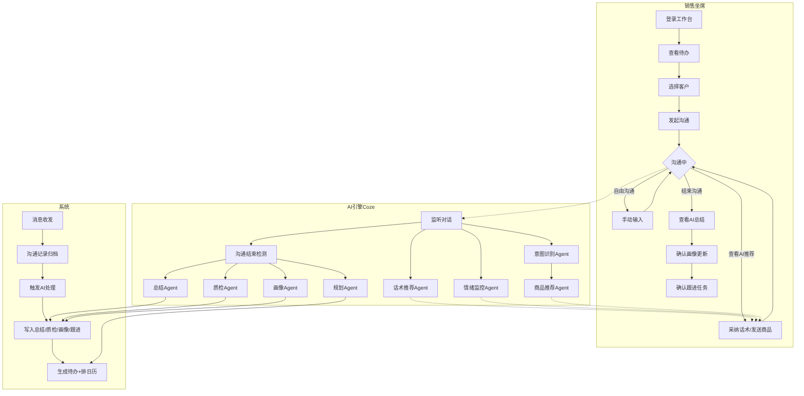
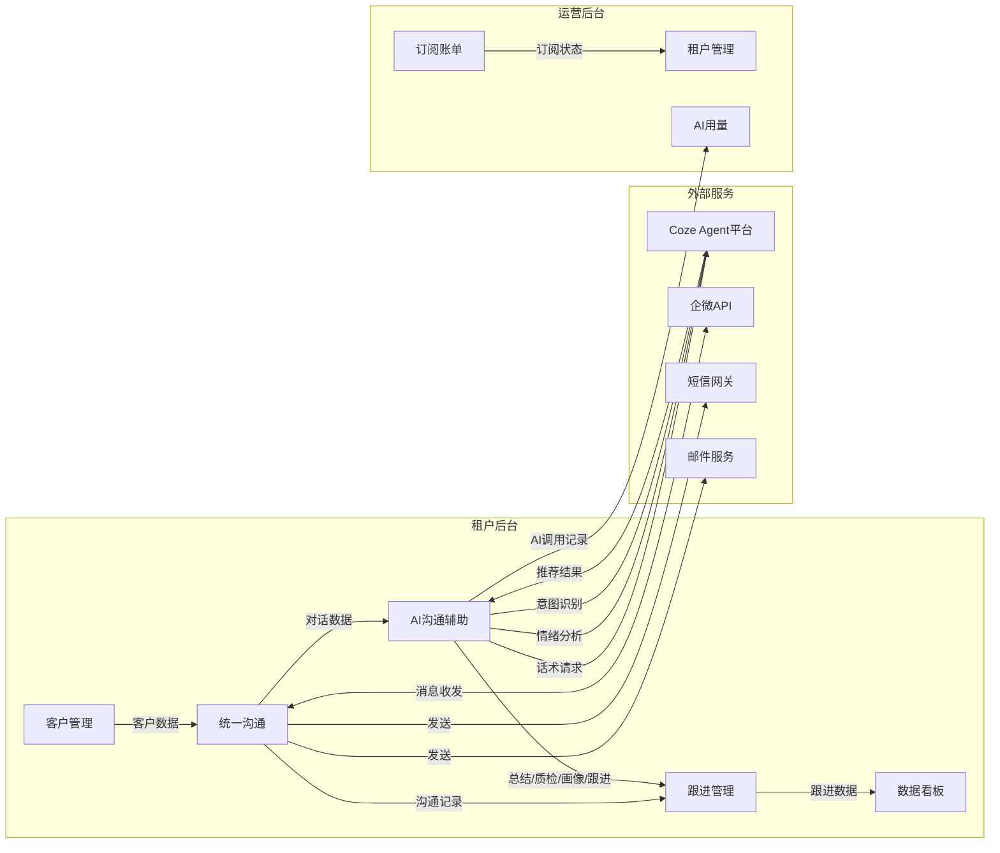
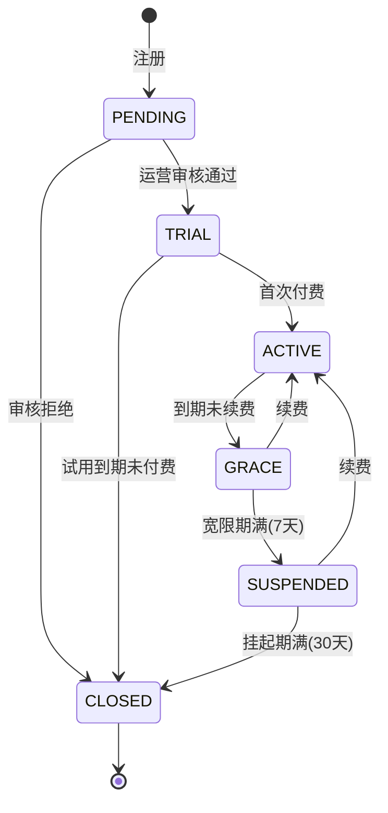
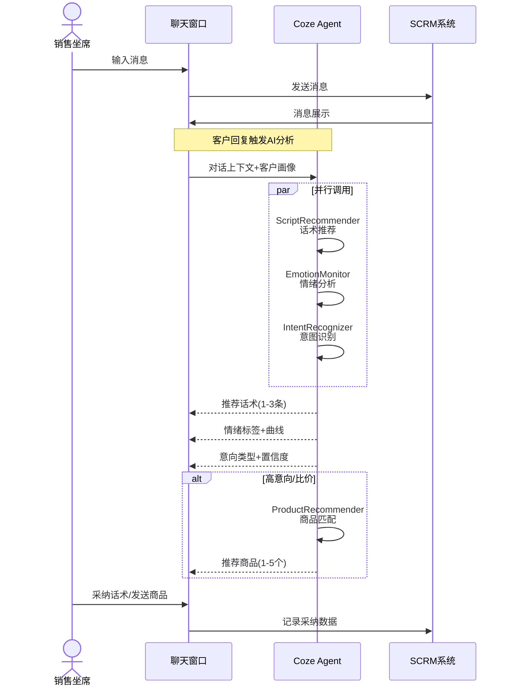
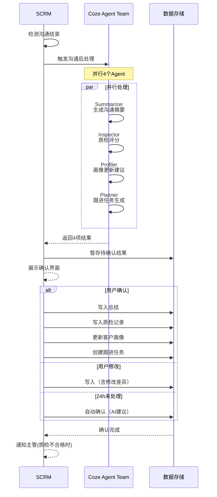

# AI-SCRM 超级需求文档 PRD v1.0.0

> **产品名称**：AI-SCRM 智能SCRM平台  
> **文档版本**：v1.0.0  
> **创建日期**：2026-07-18  
> **需求类型**：新增  
> **分析深度**：full  
> **BA**：BA Agent（POM V3.0.1需求分析流程）

---

## 1. 版本历史

| 版本 | 日期 | 作者 | 变更说明 |
|------|------|------|----------|
| v1.0.0 | 2026-07-18 | BA Agent | 初始创建，基于脑暴v3.0.0 + PO Backlog v2.0.0 全量需求分析 |
| v1.0.1 | 2026-07-20 | PM Agent | 补充企微多账号授权+客户群管理需求（FD开发阶段追加） |

---

## 2. 目录

1. 版本历史
2. 目录
3. 背景与问题陈述
4. 目标与成功度量
5. 范围（In-Scope / Non-Goals）
6. 系统类型声明
7. 业务目标映射（BO/BG）
8. 用户故事
9. 功能需求列表与用例（FN/UC）
10. 业务规则（BR）
11. 集中配置清单（CONFIG）
12. 数据实体（ENT）
13. 统计指标清单（METRIC）
14. 验收标准（双层矩阵）
15. 五类图
16. 外部接口标注
17. 需求深度分析摘要

---

## 3. 背景与问题陈述

### 3.1 业务背景

九天科技面向大健康、药业、美妆、百货四大行业提供SCRM SaaS服务。传统SCRM工具仅提供客户管理和沟通记录功能，缺乏AI能力增强销售效率，运营侧缺乏商业化SAAS引擎支撑租户生命周期和计费管理。

### 3.2 核心问题

| 问题 | 影响 | 严重性 |
|------|------|:------:|
| 销售沟通效率低 | 话术不统一、跟进易遗漏、客户意图判断靠经验 | 🔴 高 |
| 沟通质量难把控 | 无客观质检标准、客户情绪无预警、优秀话术难沉淀 | 🔴 高 |
| 客户画像不精准 | 依赖手动打标、画像更新滞后、缺乏AI自动提取 | 🟡 中 |
| 缺乏商业化SAAS引擎 | 无租户生命周期管理、无版本定价体系、无AI用量计费 | 🔴 高 |
| 移动办公缺失 | 销售外勤无法处理客户和待办 | 🟡 中 |

### 3.3 解决方案

构建**双系统架构**的AI-SCRM平台：

- **租户后台**：以「一条客户沟通」为主线的AI辅助闭环 SCRM
- **运营后台**：独立的SAAS商业引擎（租户管理、版本定价、订阅计费、AI用量管理）

**核心差异化**：SOP不是独立模块，而是嵌入真实客户沟通过程的AI辅助闭环 ——「沟通中实时辅助（话术+情绪+商品+意图）」+「沟通后自动处理（总结+质检+画像+跟进）」。

---

## 4. 目标与成功度量

### 4.1 产品北极星指标

> **专业版租户的「AI辅助沟通占比」> 40%**  
> 即专业版租户的沟通中，至少40%使用了AI实时辅助能力。

### 4.2 关键成功指标

| 指标 | 目标 | 度量方式 | 时间 |
|------|------|----------|------|
| AI辅助沟通占比 | >40%（专业版） | AI面板打开次数 / 总沟通次数 | 上线后3个月 |
| 话术采纳率 | >30% | 采纳次数 / 推荐次数 | 上线后3个月 |
| 客户跟进完成率 | 提升30% | 待办完成率 | 上线后3个月 |
| 客户流失率 | 降低20% | 月流失客户数 / 月初客户数 | 上线后6个月 |
| MRR月增长率 | >15% | 月度经常性收入环比增长 | 上线后6个月 |
| 租户注册转化率 | >10% | 注册→付费转化 | 上线后3个月 |

---

## 5. 范围（In-Scope / Non-Goals）

### 5.1 In-Scope（P0-P2 首版v1.0.0）

**P0 — MVP核心闭环（必须交付）**

| 编号 | 模块 | 系统 | 范围 |
|------|------|------|------|
| PBL-001 | 双系统骨架搭建 | 双系统 | 路由、布局、登录、Element Plus初始化 |
| PBL-002 | 租户工作台 | 租户后台 | 概览卡片、待办列表、最近沟通、消息提醒、快捷入口 |
| PBL-003 | 客户管理基础 | 租户后台 | 客户CRUD、列表筛选、标签管理 |
| PBL-004 | 统一沟通入口+沟通记录 | 租户后台 | 企微/电话/短信/邮件 统一入口、沟通记录归档 |
| PBL-005 | 沟通中AI辅助—话术推荐 | 租户后台 | Coze Agent实时话术推荐、话术库管理 |
| PBL-006 | 沟通中AI辅助—情绪监控 | 租户后台 | 实时情绪检测、情绪曲线、负面告警 |
| PBL-007 | 沟通中AI辅助—商品推荐+意图识别 | 租户后台 | 双意图识别、商品匹配推荐、一键发送 |
| PBL-008 | 沟通后AI处理 | 租户后台 | 自动总结、质检评分、画像更新、跟进生成 |

**P1 — 快速补齐**

| 编号 | 模块 | 系统 | 范围 |
|------|------|------|------|
| PBL-009 | 跟进管理 | 租户后台 | 统一待办中心、跟进日历 |
| PBL-010 | SAAS商业引擎 | 运营后台 | 租户管理、版本定价、订阅管理 |
| PBL-011 | 客户360视图+分群 | 租户后台 | 7信息面板、AI画像摘要、分群管理 |
| PBL-012 | 数据看板 | 租户后台 | 沟通分析、转化漏斗、员工绩效 |

**P2 — 增强规模化**

| 编号 | 模块 | 系统 | 范围 |
|------|------|------|------|
| PBL-013 | AI用量管理+营收分析 | 运营后台 | AI用量统计、成本核算、MRR/ARR看板 |
| PBL-014 | 权限管理+移动H5 | 租户后台 | RBAC+数据域权限、核心功能H5适配 |
| PBL-015 | 企微多账号授权+客户群 | 租户后台 | 一个租户授权多个企微账号、每个企微独立客户池和客户群、员工通过企微添加客户/加入客户群 |

### 5.2 Non-Goals（首版不涉及）

- ❌ 原生APP（P4阶段）
- ❌ AI智能排程（企业版独占，首版不交付）
- ❌ 多语言国际化
- ❌ 实时音视频通话
- ❌ 第三方CRM系统双向同步
- ❌ 工作流可视化编排器（v3.0.0已删除SOP引擎抽象概念）
- ❌ 自定义报表设计器

---

## 6. 系统类型声明

| 系统 | 类型 | 终端 | 信息密度 | 说明 |
|------|------|------|:------:|------|
| 租户后台（TNT） | B端管理后台 | PC Web → H5 → APP | 高 | 表格/列表/详情/聊天/看板/表单等多种页面类型 |
| 运营后台（OPS） | B端管理后台 | PC Web | 高 | 表格/列表/图表/配置/审批等多种页面类型 |

> **BA职责边界**：BA仅声明系统类型和信息密度。栅格系统和设计语言由UX设计师在系统分析阶段决定。

### 6.1 终端路线图

| 阶段 | 终端 | 业务系统 | 范围 |
|:----:|------|----------|------|
| P1-P2 | PC Web | 租户后台 + 运营后台 | 全功能 |
| P3 | Mobile H5 | 租户后台 | 核心功能（工作台/客户/待办/消息） |
| P4 | Mobile APP | 租户后台 | 原生体验，核心SCRM功能 |

---

## 7. 业务目标映射（BO/BG）

| 编号 | 目标 | 类型 | 度量 | 优先级 |
|------|------|:----:|------|:------:|
| BO-001 | 提升客户跟进效率 | BG | 跟进任务完成率提升30% | P0 |
| BO-002 | 降低人工沟通成本 | BG | AI处理占比>40%（专业版） | P0 |
| BO-003 | 实现客户全生命周期管理 | BG | 客户流失率降低20% | P1 |
| BO-004 | AI辅助沟通闭环嵌入客户沟通全流程 | BG | SOP执行合规率>90% | P0 |
| BO-005 | 移动办公支持 | BG | 移动端DAU占比>30%（P4后） | P2 |
| BO-006 | 客户分群精准营销 | BG | 营销转化率提升25% | P1 |
| BO-007 | SAAS商业化闭环 | BO | MRR月增长>15% | P0 |
| BO-008 | 租户自主注册+试用 | BO | 注册转化率>10% | P1 |
| BO-009 | 租户健康度评分体系 | BO | 流失预警准确率>80% | P2 |
| BO-010 | AI用量计费透明化 | BO | 账单准确率100% | P0 |
| BO-011 | 行业模板降低上手成本 | BO | 新租户3日内核心功能使用率>60% | P2 |
| BO-012 | 销售团队权限精细化管理 | BG | 数据越权事件=0 | P0 |
| BO-013 | 多行业租户并行支撑 | BO | 4行业覆盖率100% | P1 |
| BO-014 | 移动端核心功能可用 | BG | 核心功能移动端可用率100%（P4） | P2 |

---

## 8. 用户故事

### 8.1 核心Persona

| Persona | 角色 | 系统 | 核心诉求 |
|---------|------|------|----------|
| 销售坐席（Agent） | 一线销售人员 | 租户后台 | 快速查找客户、高效沟通、AI辅助话术、及时跟进 |
| 销售主管（Manager） | 团队管理者 | 租户后台 | 团队绩效、情绪监控、质检评分、数据看板 |
| 企业管理员（Admin） | 企业IT/管理员 | 租户后台 | 权限配置、系统设置、数据导出 |
| 运营专员（Operator） | 平台运营方 | 运营后台 | 租户审核、订单处理、版本定价配置 |
| 运营管理者（OpsManager） | 平台管理者 | 运营后台 | 营收分析、租户健康度、AI用量监控 |

### 8.2 Epic用户故事

**US-01：销售高效跟进客户**  
> 作为销售坐席，我登录工作台后能看到今天要跟进的客户和待办任务，点击客户进入沟通，AI实时给我推荐话术、提醒客户情绪变化、识别客户购买意向并推荐商品，沟通结束后AI自动帮我写总结、更新客户画像、生成下次跟进任务。整个过程让我的跟进效率提升一倍。

**US-02：主管掌控团队沟通质量**  
> 作为销售主管，我能看到团队的实时沟通情绪分布，发现负面情绪立即介入。每通沟通结束后AI自动质检评分，不合格的自动标记给我复审。数据看板展示团队转化漏斗和员工绩效排行，帮我有针对性地辅导团队成员。

**US-03：平台方运营SAAS商业**  
> 作为运营专员，我能管理所有租户的生命周期（审核注册→开通试用→版本升级→到期停用），配置版本功能矩阵和定价策略，处理订单和退款审批。AI用量和营收看板让我实时掌握商业健康度。

---

## 9. 功能需求列表与用例（FN/UC）

### 9.1 编号体系

- **FN 格式**：`FN-{模块缩写}-{终端缩码}-{NNN}`
- **UC 格式**：`UC-{模块缩写}-{终端缩码}-{NNN}`
- **BR 格式**：`BR-{模块缩写}-{NNN}`
- **ENT 格式**：`ENT-{系统缩写}-{NNN}`
- **模块缩码**：WB(工作台) / CM(客户管理) / UC(统一沟通) / CA(AI沟通辅助) / FM(跟进管理) / DB(数据看板) / TM(团队管理) / SS(系统设置) / WX(企微授权管理) / OW(运营工作台) / TN(租户管理) / VP(版本定价) / SB(订阅账单) / AU(AI用量) / RA(营收分析)

---

### 9.2 租户后台（TNT）× PC Web

#### 9.2.1 模块：工作台（WB）

---

**FN-WB-PC-001：工作台概览**

| 字段 | 内容 |
|------|------|
| 编号 | FN-WB-PC-001 |
| 用例编号 | UC-WB-PC-001 |
| 名称 | 工作台概览 |
| 页面 | 租户工作台 |
| 参与者 | 销售坐席、销售主管、企业管理员 |
| 优先级 | P0 |
| 关联BG | BO-001, BO-002 |
| 自动化类型 | 手动 |

**前置条件**：用户已登录租户后台，有角色权限。

**基本流程**：
1. 用户登录系统，默认进入工作台页面 [系统自动]
2. 系统加载个性化概览数据 [系统自动]
3. 系统展示概览卡片区：今日待办数、今日沟通数、本周新增客户数 [系统自动]
4. 系统展示待办列表区：最近5条待办任务（AI生成+手动创建）[系统自动]
5. 系统展示最近沟通区：最近10条沟通记录，显示客户名、沟通方式、时间、简短摘要 [系统自动]
6. 系统展示消息提醒区：未读系统消息、预警通知 [系统自动]
7. 用户点击任一快捷入口（客户管理/开始沟通/待办任务）→ 跳转对应页面 [手动]
8. 用户点击待办列表中的待办 → 展开快速处理（标记完成/查看详情/跳转执行）[手动]
9. 用户点击最近沟通记录 → 跳转沟通详情 [手动]

**备选流程**：
- 3a. 概览数据加载失败 → 显示「数据加载中，请稍候...」+ 重试按钮
- 5a. 无近期沟通记录 → 显示引导卡片「开始你的第一次客户沟通」
- 4a. 无待办任务 → 显示「暂无待办，干得漂亮！」

**异常流程**：
- E1: 网络中断 → 显示离线提示 + 数据缓存版
- E2: 权限不足 → 显示当前角色可访问的卡片（隐藏无权限卡片）
- E3: Session过期 → 弹窗提示重新登录

**数据范围**：R（读取：概览统计数据、待办列表、沟通记录列表、消息列表）

**后置条件**：无状态变更，纯数据展示。

**关联UC**：UC-WB-PC-002（待办快速处理）

---

**FN-WB-PC-002：待办快速处理**

| 字段 | 内容 |
|------|------|
| 编号 | FN-WB-PC-002 |
| 用例编号 | UC-WB-PC-002 |
| 名称 | 待办快速处理 |
| 页面 | 租户工作台 |
| 参与者 | 销售坐席、销售主管 |
| 优先级 | P0 |
| 关联BG | BO-001 |
| 自动化类型 | 手动 |

**前置条件**：工作台已加载待办列表。

**基本流程**：
1. 用户在工作台待办列表区点击某条待办的「完成」按钮 [手动]
2. 系统弹出确认提示「确定已完成此任务？」[系统自动]
3. 用户点击「确认」[手动]
4. 系统更新待办状态为「已完成」，从工作台待办列表移除 [系统自动]
5. 系统记录完成时间和操作人 [系统自动]

**备选流程**：
- 1a. 用户点击待办标题 → 跳转待办详情/执行页（FN-FM-PC-001）
- 1b. 待办类型为「跟进任务」→ 跳转跟进记录填写页

**异常流程**：
- E1: 待办已被其他人处理 → 提示「该任务已被处理」+ 刷新列表
- E2: 待办状态异常 → 提示「任务状态异常，请联系管理员」

**数据范围**：R/W（读取待办、更新待办状态）

**后置条件**：待办状态变更为「已完成」，操作记录写入。

**关联UC**：UC-WB-PC-001

---

#### 9.2.2 模块：客户管理（CM）

---

**FN-CM-PC-001：客户列表与搜索**

| 字段 | 内容 |
|------|------|
| 编号 | FN-CM-PC-001 |
| 用例编号 | UC-CM-PC-001 |
| 名称 | 客户列表与搜索 |
| 页面 | 客户列表页 |
| 参与者 | 销售坐席、销售主管、企业管理员 |
| 优先级 | P0 |
| 关联BG | BO-001, BO-003 |
| 自动化类型 | 手动 |

**前置条件**：用户已登录，有客户管理权限。

**基本流程**：
1. 用户点击左侧导航「客户管理」→ 进入客户列表页 [手动]
2. 系统分页加载客户列表（默认每页20条，按创建时间倒序）[系统自动]
3. 列表展示：客户姓名、手机号、公司、标签、最近沟通时间、负责坐席 [系统自动]
4. 用户在搜索框输入关键词（姓名/手机/公司）→ 系统实时搜索 [手动]
5. 用户点击标签筛选项 → 系统筛选含该标签的客户 [手动]
6. 用户点击表头排序（最近沟通时间/创建时间）→ 系统重排 [手动]
7. 用户点击分页器 → 系统加载对应页 [手动]

**备选流程**：
- 4a. 搜索结果为空 → 显示「未找到匹配的客户」+ 建议「试试其他关键词或创建新客户」
- 5a. 选择多个标签 → 系统取交集筛选（同时含所有选中标签的客户）
- 3a. 列表为空 → 显示引导卡片「添加你的第一个客户」

**异常流程**：
- E1: 加载超时 → 显示「加载失败」+ 重试按钮
- E2: 权限不足 → 仅显示自己负责的客户（数据域过滤）

**数据范围**：R（读取客户列表）

**后置条件**：无。

**关联UC**：UC-CM-PC-002, UC-CM-PC-003

---

**FN-CM-PC-002：新增客户**

| 字段 | 内容 |
|------|------|
| 编号 | FN-CM-PC-002 |
| 用例编号 | UC-CM-PC-002 |
| 名称 | 新增客户 |
| 页面 | 客户列表页 / 客户新增弹窗 |
| 参与者 | 销售坐席、企业管理员 |
| 优先级 | P0 |
| 关联BG | BO-001, BO-003 |
| 自动化类型 | 手动 |

**前置条件**：用户有客户新增权限。

**基本流程**：
1. 用户在客户列表页点击「新增客户」按钮 [手动]
2. 系统弹出新增客户弹窗 [系统自动]
3. 用户填写：姓名*、手机号、公司、来源（下拉选择）、初始标签（多选）[手动]
4. 用户点击「保存」[手动]
5. 系统校验必填项（姓名非空）[系统自动]
6. 系统创建客户记录，自动分配客户编号 [系统自动]
7. 系统关闭弹窗，客户列表刷新，新客户高亮显示 [系统自动]

**备选流程**：
- 3a. 手机号已存在 → 系统提示「该手机号已关联客户[姓名]，是否合并？」
- 5a. 姓名未填写 → 系统标红输入框 + 提示「请填写客户姓名」
- 5b. 手机号格式错误 → 系统标红 + 提示「请输入正确的手机号」
- 4a. 用户点击「取消」→ 关闭弹窗，不保存

**异常流程**：
- E1: 保存失败 → 提示「保存失败，请稍后重试」+ 保留已填数据
- E2: 达到客户数量上限（体验版限制）→ 提示升级版本

**数据范围**：W（创建客户记录）

**后置条件**：
- 客户记录创建成功，status = ACTIVE
- 客户编号自动生成（CUS-YYYYMMDD-NNNNNN）
- 创建人、创建时间自动记录

**关联UC**：UC-CM-PC-001

---

**FN-CM-PC-003：客户详情查看**

| 字段 | 内容 |
|------|------|
| 编号 | FN-CM-PC-003 |
| 用例编号 | UC-CM-PC-003 |
| 名称 | 客户详情查看 |
| 页面 | 客户详情页 |
| 参与者 | 销售坐席、销售主管 |
| 优先级 | P0 |
| 关联BG | BO-001, BO-003 |
| 自动化类型 | 手动 |

**前置条件**：用户有该客户的查看权限（数据域）。

**基本流程**：
1. 用户在客户列表点击客户姓名 → 进入客户详情页 [手动]
2. 系统加载客户详情数据 [系统自动]
3. 展示基本信息区：姓名、手机、公司、来源、标签、创建时间 [系统自动]
4. 展示操作按钮区：发起沟通、编辑客户、删除客户 [系统自动]
5. 展示沟通记录Tab：最近沟通记录列表，点击跳转详情 [系统自动]
6. 展示跟进记录Tab：该客户的所有跟进记录 [系统自动]
7. 用户点击「发起沟通」→ 跳转统一沟通页面（关联该客户）[手动]
8. 用户点击「编辑」→ 打开编辑弹窗（同新增，预填数据）[手动]

**备选流程**：
- 7a. 专业版+ → 沟通页面右侧自动显示AI辅助面板（话术/情绪/商品/意图）
- 5a. 无沟通记录 → 显示「暂无沟通记录」
- 4a. 点击删除 → 二次确认弹窗「确定删除客户XXX？删除后无法恢复」

**异常流程**：
- E1: 无权查看 → 提示「您没有权限查看该客户信息」
- E2: 客户已被删除 → 提示「客户不存在或已删除」+ 返回列表

**数据范围**：R（读取客户详情、沟通记录、跟进记录）

**后置条件**：无。

**关联UC**：UC-CM-PC-002, UC-UC-PC-001

---

**FN-CM-PC-004：标签管理**

| 字段 | 内容 |
|------|------|
| 编号 | FN-CM-PC-004 |
| 用例编号 | UC-CM-PC-004 |
| 名称 | 标签管理 |
| 页面 | 标签管理页 / 客户详情页 |
| 参与者 | 企业管理员、销售主管 |
| 优先级 | P0 |
| 关联BG | BO-003, BO-006 |
| 自动化类型 | 手动 |

**前置条件**：用户有标签管理权限。

**基本流程**：
1. 用户进入「标签管理」页面 [手动]
2. 系统展示标签树：系统预置标签 + 自定义标签（按分组展示）[系统自动]
3. 用户点击「新建标签组」→ 输入组名 → 保存 [手动]
4. 用户在标签组下点击「新建标签」→ 输入标签名+选择颜色 → 保存 [手动]
5. 用户选择某个自定义标签 → 点击「编辑」→ 修改名称/颜色 [手动]
6. 用户选择某个自定义标签 → 点击「删除」→ 确认后删除 [手动]
7. 系统预置标签不可编辑/删除，仅可启用/停用 [系统自动]

**备选流程**：
- 6a. 标签被客户使用中 → 提示「该标签已被X个客户使用，删除后将从客户移除」
- 5a. 修改标签名称 → 所有关联客户的标签同步更新

**异常流程**：
- E1: 标签组名称重复 → 提示「该分组已存在」
- E2: 同一组下标签名称重复 → 提示「该标签已存在」

**数据范围**：R/W（读取标签树、创建/修改/删除标签）

**后置条件**：标签变更后，关联客户的标签同步更新。

**关联UC**：UC-CM-PC-001, UC-CM-PC-002

---

#### 9.2.3 模块：统一沟通（UC）

---

**FN-UC-PC-001：发起沟通**

| 字段 | 内容 |
|------|------|
| 编号 | FN-UC-PC-001 |
| 用例编号 | UC-UC-PC-001 |
| 名称 | 发起沟通 |
| 页面 | 统一沟通页 |
| 参与者 | 销售坐席 |
| 优先级 | P0 |
| 关联BG | BO-001, BO-002, BO-004 |
| 自动化类型 | 手动 + 事件驱动 |

**前置条件**：用户已选择目标客户。

**基本流程**：
1. 用户从客户详情页点击「发起沟通」或从沟通入口选择客户 [手动]
2. 系统加载该客户的沟通历史（最近20条消息）[系统自动]
3. 系统加载客户画像侧边栏（基本信息+标签+最近沟通摘要）[系统自动]
4. 系统默认打开上次使用的沟通渠道（企微/电话/短信/邮件）[系统自动]
5. 用户可在顶部Tab切换沟通渠道 [手动]
6. 用户输入消息/点击拨打/编辑短信/写邮件 → 发送 [手动]
7. 系统记录本次沟通记录 [系统自动]

**备选流程**：
- 5a. 切换到企微聊天 → 显示聊天窗口（消息列表+输入框+发送）+ 专业版/企业版显示AI辅助面板
- 5b. 切换到电话 → 显示拨号盘 + 通话控制（拨打/挂断/录音）+ 通话后填写备注
- 5c. 切换到短信 → 短信编辑区 + 模板选择
- 5d. 切换到邮件 → 邮件编辑器（主题+正文+附件）

**异常流程**：
- E1: 企微/电话通道不可用 → 显示「渠道暂不可用」+ 提示其他可用渠道
- E2: 余额不足（短信）→ 提示「短信余额不足，请联系管理员充值」
- E3: 客户无手机号（电话/短信）→ 提示「请先完善客户手机号」

**数据范围**：R/W（读取沟通历史、发送消息、创建沟通记录）

**后置条件**：
- 新沟通记录创建
- 消息内容归档
- 如沟通时长>30秒，触发沟通后AI处理（专业版+）

**关联UC**：UC-UC-PC-002, UC-CA-PC-001~004

---

**FN-UC-PC-002：沟通记录管理**

| 字段 | 内容 |
|------|------|
| 编号 | FN-UC-PC-002 |
| 用例编号 | UC-UC-PC-002 |
| 名称 | 沟通记录管理 |
| 页面 | 沟通记录列表页 / 沟通记录详情页 |
| 参与者 | 销售坐席、销售主管 |
| 优先级 | P0 |
| 关联BG | BO-001, BO-004 |
| 自动化类型 | 手动 |

**前置条件**：用户有该客户的查看权限。

**基本流程**：
1. 用户进入「沟通记录」页面，或从客户详情查看沟通记录 [手动]
2. 系统分页加载沟通记录列表（按时间倒序）[系统自动]
3. 每条记录显示：沟通方式图标、客户姓名、沟通时长/条数、时间、AI总结摘要 [系统自动]
4. 用户可按沟通方式筛选（企微/电话/短信/邮件/全部）[手动]
5. 用户可按客户筛选 [手动]
6. 用户点击某条记录 → 进入沟通详情页 [手动]
7. 详情页展示：完整对话/通话记录、AI总结卡片（专业版+）、质检评分（专业版+）、画像更新记录（专业版+）[系统自动]

**备选流程**：
- 7a. 非专业版 → 不显示AI总结/质检/画像，仅显示纯沟通记录

**异常流程**：
- E1: 沟通记录内容加载失败 → 显示「内容加载失败，请刷新重试」

**数据范围**：R（读取沟通记录、AI总结、质检结果）

**后置条件**：无。

**关联UC**：UC-UC-PC-001, UC-CA-PC-005

---

#### 9.2.4 模块：AI沟通辅助（CA）

> **版本要求**：专业版及以上。基础版/体验版不显示AI辅助功能。

---

**FN-CA-PC-001：实时话术推荐**

| 字段 | 内容 |
|------|------|
| 编号 | FN-CA-PC-001 |
| 用例编号 | UC-CA-PC-001 |
| 名称 | 实时话术推荐 |
| 页面 | 企微聊天窗口（右侧AI辅助面板） |
| 参与者 | 销售坐席（专业版+） |
| 优先级 | P0 |
| 关联BG | BO-002, BO-004 |
| 自动化类型 | 系统自动 + 手动采纳 |

**前置条件**：用户版本为专业版或企业版；当前在企微聊天窗口；存在≥3条对话上下文。

**基本流程**：
1. 系统监听聊天窗口中的对话内容 [系统自动]
2. 每新增1-2条消息（客户或坐席），系统触发话术推荐分析 [系统自动]
3. 系统调用Coze Agent：ScriptRecommender，传入最近10条对话+客户画像 [事件驱动]
4. Agent返回1-3条推荐话术 + 推荐理由 [系统自动]
5. 右侧AI面板展示话术推荐列表，每条显示推荐理由标签 [系统自动]
6. 用户点击某条话术 → 话术自动填入输入框 [手动]
7. 用户可编辑后发送，或直接发送 [手动]
8. 系统记录采纳（话术ID + 会话ID + 是否编辑）[系统自动]

**备选流程**：
- 5b. 用户在输入框输入时 → 系统不重复触发推荐（防止干扰），仅在消息发送后重新触发
- 5c. 无匹配话术 → 显示「当前上下文暂无匹配话术」
- 7b. 用户手动输入回复（未采纳推荐话术）→ 系统仍记录话术采纳率为0

**异常流程**：
- E1: Coze API超时（>3秒）→ 前端显示骨架屏 + 「AI思考中...」→ 超时5秒后降级显示「AI响应超时，请稍后重试」
- E2: Coze API返回异常 → 降级显示本地预置话术库匹配结果
- E3: 上下文不足（<3条消息）→ 显示「对话内容不足，AI正在学习...」

**数据范围**：R（读取对话上下文、客户画像）+ W（记录话术采纳）

**后置条件**：话术采纳记录写入，用于统计采纳率。

**关联UC**：UC-CA-PC-002, UC-CA-PC-003, UC-CA-PC-004

---

**FN-CA-PC-002：实时情绪监控**

| 字段 | 内容 |
|------|------|
| 编号 | FN-CA-PC-002 |
| 用例编号 | UC-CA-PC-002 |
| 名称 | 实时情绪监控 |
| 页面 | 企微聊天窗口 + 主管情绪看板 |
| 参与者 | 销售坐席、销售主管（专业版+） |
| 优先级 | P0 |
| 关联BG | BO-002, BO-004 |
| 自动化类型 | 系统自动 + 事件驱动 |

**前置条件**：专业版+；沟通中。

**基本流程**：
1. 系统实时分析每条客户消息的情绪（正面/中性/负面）[系统自动]
2. 系统调用Coze Agent：EmotionMonitor [事件驱动]
3. 聊天窗口顶部显示「情绪指示器」：三色圆点（绿/黄/红）+ 当前情绪标签 [系统自动]
4. 系统维护本次沟通的「情绪曲线」：折线图展示情绪波动趋势 [系统自动]
5. 坐席可点击情绪指示器 → 展开情绪曲线详情 [手动]

**备选流程**：
- 5b. **负面告警**：客户连续3条消息为负面 → 系统弹窗告警「⚠️ 客户情绪负面，请注意沟通方式」+ 自动推荐安抚话术
- 5c. **主管视角**：主管情绪看板实时展示团队所有进行中沟通的情绪状态（绿色/黄色/红色标记）
- 5d. 主管可点击红色标记 → 打开该沟通详情→ 可选择「介入」发送内部提醒给坐席

**异常流程**：
- E1: 短消息（如「嗯」「好的」）→ 不改变情绪判断，维持上一状态
- E2: Coze超时 → 降级显示最近一次有效情绪结果

**数据范围**：R（读取消息内容）+ W（写入情绪记录）

**后置条件**：情绪记录写入，关联沟通记录ID。

**关联UC**：UC-CA-PC-001, UC-DB-PC-001

---

**FN-CA-PC-003：意图识别 + 商品推荐**

| 字段 | 内容 |
|------|------|
| 编号 | FN-CA-PC-003 |
| 用例编号 | UC-CA-PC-003 |
| 名称 | 意图识别 + 商品推荐 |
| 页面 | 企微聊天窗口（右侧AI辅助面板） |
| 参与者 | 销售坐席（专业版+） |
| 优先级 | P0 |
| 关联BG | BO-002, BO-004 |
| 自动化类型 | 系统自动 + 手动操作 |

**前置条件**：专业版+；沟通中。

**基本流程**：
1. 系统实时分析客户消息，识别交易意向类型 [系统自动]
2. 系统调用Coze Agent：IntentRecognizer [事件驱动]
3. 右侧面板展示「客户意向」区域，显示意向类型+置信度 [系统自动]
4. 意向类型：高意向🟢 / 比价🟡 / 顾虑🟠 / 否定/不感兴趣🔴 / 投诉🔴 [系统自动]
5. 当意向为「高意向」或「比价」时，系统调用Coze Agent：ProductRecommender [事件驱动]
6. Agent基于客户画像+历史购买+当前意向，推荐1-5个商品 [系统自动]
7. 右侧面板展示推荐商品卡片：商品名、价格、推荐理由、一键发送按钮 [系统自动]
8. 用户点击「一键发送」→ 商品卡片以消息形式发送给客户 [手动]
9. 系统记录推荐-发送转化 [系统自动]

**备选流程**：
- 5b. 无匹配商品 → 显示「暂无推荐商品」
- 4b. 客户意向变化（从顾虑→高意向）→ 面板动态更新，重新触发商品推荐
- 8b. 用户修改商品内容后发送 → 标记为「修改后发送」

**异常流程**：
- E1: Coze超时 → 显示「AI分析中...」→ 超时后降级为本地关键词匹配
- E2: 商品库为空 → 提示「请先在商品库中添加商品」

**数据范围**：R（对话、客户画像、商品库）+ W（客户意向记录、推荐-发送记录）

**后置条件**：意向记录+推荐记录写入。

**关联UC**：UC-CA-PC-001, UC-CA-PC-004

---

**FN-CA-PC-004：话术库管理**

| 字段 | 内容 |
|------|------|
| 编号 | FN-CA-PC-004 |
| 用例编号 | UC-CA-PC-004 |
| 名称 | 话术库管理 |
| 页面 | 话术库管理页 |
| 参与者 | 企业管理员、销售主管（专业版+） |
| 优先级 | P0 |
| 关联BG | BO-002, BO-004 |
| 自动化类型 | 手动 |

**前置条件**：专业版+；有话术库管理权限。

**基本流程**：
1. 用户进入「话术库管理」页 [手动]
2. 系统展示话术分类树：场景分类（开场白/需求挖掘/异议处理/促成/结束语/售后服务）[系统自动]
3. 每类下展示话术列表：话术内容、适用关键词、采纳次数、采纳率 [系统自动]
4. 用户点击「新增话术」→ 填写话术内容+选择场景分类+设置触发关键词 → 保存 [手动]
5. 用户点击某条话术→ 编辑/停用/删除 [手动]
6. 系统预置话术（基于行业模板）不可删除，仅可停用 [系统自动]

**备选流程**：
- 4b. 从高采纳率的AI推荐话术一键「添加到话术库」

**异常流程**：
- E1: 话术内容重复 → 提示「类似话术已存在」

**数据范围**：R/W（话术库CRUD）

**后置条件**：话术库变更实时生效（下次推荐时使用新话术库）。

**关联UC**：UC-CA-PC-001

---

**FN-CA-PC-005：沟通后AI自动处理**

| 字段 | 内容 |
|------|------|
| 编号 | FN-CA-PC-005 |
| 用例编号 | UC-CA-PC-005 |
| 名称 | 沟通后AI自动处理 |
| 页面 | 沟通详情页 / 系统后台自动 |
| 参与者 | 系统自动触发 |
| 优先级 | P0 |
| 关联BG | BO-002, BO-003, BO-004 |
| 自动化类型 | 系统自动 + 人工确认 |

**前置条件**：专业版+；一次沟通已结束（聊天窗口关闭/通话挂断/沟通时长>30秒）；有对话数据。

**基本流程**：
1. 系统检测沟通结束 [系统自动]
2. 系统并行调用4个Coze Agent [系统自动]：
   - **Summarizer**：生成沟通摘要（对话概要+关键决策点+客户情绪总结+下一步建议）
   - **Inspector**：质检评分（开场白/需求挖掘/异议处理/促成/结束语 5维打分）
   - **Profiler**：从对话提取标签→生成画像更新建议
   - **Planner**：识别跟进意图→生成跟进任务
3. 系统展示「AI沟通总结」卡片（摘要+质检分+画像建议+跟进任务预览）[系统自动]
4. 用户查看并确认：
   - a. 总结：可编辑后确认 [手动]
   - b. 质检：可查看评分明细，不合格标记→主管复审 [手动]
   - c. 画像更新：展示建议新增/修改的标签，用户勾选确认或拒绝 [手动]
   - d. 跟进任务：展示建议的跟进任务（类型/时间/话术/优先级），可修改后确认 [手动]
5. 用户点击「确认全部」→ 系统写入所有结果 [手动]
6. 系统通知主管（如有质检不合格标记）[系统自动]

**备选流程**：
- 5b. 用户修改某个建议 → 系统记录「AI建议 vs 人工修正」差异，用于模型优化
- 5c. 用户点击「稍后处理」→ 在待办列表中生成「处理沟通总结」待办，24小时后未处理自动确认
- 4c. 画像更新为空 → 显示「未识别到需更新的标签」

**异常流程**：
- E1: Coze Agent异常 → 那项标记为「AI处理异常，请手动完成」+ 提供手动表单
- E2: 4个Agent全部超时（>30秒）→ 整体降级提示「AI处理超时，请稍后在沟通详情中手动触发」

**数据范围**：R（对话数据、客户画像）+ W（总结/质检/画像/跟进任务写入）

**后置条件**：
- 沟通总结写入
- 质检评分+记录写入
- 客户画像标签更新
- 跟进任务创建（排入待办列表+跟进日历）

**关联UC**：UC-CM-PC-003, UC-FM-PC-001, UC-FM-PC-002

---

#### 9.2.5 模块：跟进管理（FM）

---

**FN-FM-PC-001：统一待办中心**

| 字段 | 内容 |
|------|------|
| 编号 | FN-FM-PC-001 |
| 用例编号 | UC-FM-PC-001 |
| 名称 | 统一待办中心 |
| 页面 | 待办列表页 |
| 参与者 | 销售坐席、销售主管 |
| 优先级 | P1 |
| 关联BG | BO-001 |
| 自动化类型 | 手动 |

**前置条件**：用户已登录。

**基本流程**：
1. 用户进入「待办任务」页 [手动]
2. 系统聚合所有来源待办：AI自动生成 + 手动创建 + SOP触发 [系统自动]
3. 系统按优先级排序：紧急程度 × 客户价值 × 距今时间 [系统自动]
4. 待办列表展示：类型图标、标题、关联客户、优先级标签、截止时间、来源标签 [系统自动]
5. 用户可按类型/优先级/客户筛选 [手动]
6. 用户点击待办 → 展开执行面板：
   - 跟进类型 → 跳转沟通（FN-UC-PC-001）
   - 填写备注 → 打开跟进记录表单
   - 标记完成 [手动]
7. 系统对待办去重合并：同一客户+同类型+同日期的多条待办合并为一条 [系统自动]

**备选流程**：
- 6b. 用户拖拽待办调整优先级（P0/P1/P2）
- 7a. 去重规则：合并后显示「共X条同类任务」，展开查看详情

**异常流程**：
- E1: 关联客户已被删除 → 保留待办，标记「客户已删除」

**数据范围**：R/W（读取待办列表、标记完成、创建跟进记录）

**后置条件**：待办状态变更，完成时间记录。

**关联UC**：UC-FM-PC-002, UC-CA-PC-005

---

**FN-FM-PC-002：跟进日历**

| 字段 | 内容 |
|------|------|
| 编号 | FN-FM-PC-002 |
| 用例编号 | UC-FM-PC-002 |
| 名称 | 跟进日历 |
| 页面 | 跟进日历页 |
| 参与者 | 销售坐席、销售主管 |
| 优先级 | P1 |
| 关联BG | BO-001 |
| 自动化类型 | 手动 |

**前置条件**：有待办/跟进任务数据。

**基本流程**：
1. 用户进入「跟进日历」页 [手动]
2. 系统展示周/月视图日历 [系统自动]
3. 日历日期格内显示当天待办数量+优先级标记 [系统自动]
4. 用户点击日期 → 展开当日待办列表 [手动]
5. 用户拖拽待办卡片 → 调整日期 [手动]
6. 点击待办 → 同FN-FM-PC-001执行流程 [手动]

**备选流程**：
- 5b. 拖拽到节假日/周末 → 系统自动调整到最近工作日
- 3b. 无待办日期 → 留空

**异常流程**：
- E1: 拖拽调整日期后时间冲突（与已有任务时间重叠）→ 提示「该时段已有N个任务」

**数据范围**：R/W（读取待办、更新待办日期）

**后置条件**：待办日期更新。

**关联UC**：UC-FM-PC-001

---

**FN-FM-PC-003：客户360视图**

| 字段 | 内容 |
|------|------|
| 编号 | FN-FM-PC-003 |
| 用例编号 | UC-FM-PC-003 |
| 名称 | 客户360视图 |
| 页面 | 客户360视图页 |
| 参与者 | 销售坐席、销售主管（基础版+） |
| 优先级 | P1 |
| 关联BG | BO-003, BO-006 |
| 自动化类型 | 手动查看 + 系统自动 |

**前置条件**：用户有该客户查看权限。

**基本流程**：
1. 用户从客户详情点击「360视图」Tab [手动]
2. 系统加载7个信息面板 [系统自动]：
   - ① 基本信息：姓名/手机/公司/来源/负责人/创建时间
   - ② 标签画像：标签雷达图 + 标签列表 + AI画像摘要（一段话描述）
   - ③ 沟通历史：沟通次数/总时长/渠道分布 + 最近5条摘要
   - ④ 订单/交易：交易次数/总金额/最近订单（可选集成）
   - ⑤ 跟进记录：跟进次数/完成率 + 最近跟进摘要
   - ⑥ 情绪趋势：最近30天情绪变化折线图
   - ⑦ 意向演变：历次沟通意向变化轨迹
3. 系统调用AI生成「客户画像摘要」：一段自然语言描述客户特征、偏好、价值、风险 [系统自动]
4. 用户可点击各面板「查看详情」→ 跳转对应详情页 [手动]

**备选流程**：
- 2g. 基础版 → 仅显示面板①②③⑤（不显示AI画像摘要/情绪趋势/意向演变）
- 3a. 无足够数据 → AI画像摘要显示「数据不足，请积累更多沟通记录」

**数据范围**：R（聚合读取多源客户数据）

**后置条件**：无。

**关联UC**：UC-CM-PC-003, UC-CA-PC-005

---

**FN-FM-PC-004：客户分群管理**

| 字段 | 内容 |
|------|------|
| 编号 | FN-FM-PC-004 |
| 用例编号 | UC-FM-PC-004 |
| 名称 | 客户分群管理 |
| 页面 | 分群管理页 |
| 参与者 | 销售主管、企业管理员（基础版+） |
| 优先级 | P1 |
| 关联BG | BO-006 |
| 自动化类型 | 手动 |

**前置条件**：基础版+；有客户数据。

**基本流程**：
1. 用户进入「分群管理」页 [手动]
2. 系统展示已有分群列表：分群名、客户数、创建时间、最近更新 [系统自动]
3. 用户点击「新建分群」→ 设置分群条件 [手动]
4. 条件设置支持：标签组合（且/或）、最近沟通时间范围、意向等级、消费金额范围 [手动]
5. 系统实时预览匹配的客户数 [系统自动]
6. 用户设置分群名称 → 保存 [手动]
7. 系统生成分群，展示匹配的客户列表 [系统自动]
8. 用户可对分群执行：群发消息、批量打标、导出客户列表 [手动]

**备选流程**：
- 8a. 群发消息 → 跳转消息群发页（批量选择模板或编辑内容）
- 8b. 分群条件修改 → 系统重新计算匹配客户

**异常流程**：
- E1: 匹配客户数为0 → 提示「当前条件未匹配到客户，请调整条件」

**数据范围**：R/W（分群CRUD、读取客户数据、批量操作）

**后置条件**：分群创建/更新。

**关联UC**：UC-CM-PC-001

---

#### 9.2.6 模块：数据看板（DB）

---

**FN-DB-PC-001：沟通分析看板**

| 字段 | 内容 |
|------|------|
| 编号 | FN-DB-PC-001 |
| 用例编号 | UC-DB-PC-001 |
| 名称 | 沟通分析看板 |
| 页面 | 数据看板页—沟通分析Tab |
| 参与者 | 销售主管（基础版+） |
| 优先级 | P1 |
| 关联BG | BO-001, BO-002 |
| 自动化类型 | 手动查看 |

**前置条件**：基础版+；有沟通数据。

**基本流程**：
1. 用户进入「数据看板」→「沟通分析」Tab [手动]
2. 系统加载图表数据 [系统自动]
3. 展示：沟通总量趋势（日/周/月）、按渠道分布饼图、AI辅助覆盖率趋势（专业版+）、话术采纳率趋势（专业版+）[系统自动]
4. 展示：情绪分布饼图（正面/中性/负面）、负面情绪客户Top10 [系统自动]
5. 用户可切换时间范围（最近7天/30天/本月/自定义）[手动]
6. 用户可点击图表数据区域 → 下钻查看详情列表 [手动]

**备选流程**：
- 3c. 基础版 → 仅显示沟通总量+渠道分布，不显示AI相关指标

**数据范围**：R（聚合统计沟通数据）

**后置条件**：无。

**关联UC**：UC-DB-PC-002

---

**FN-DB-PC-002：转化漏斗 + 员工绩效**

| 字段 | 内容 |
|------|------|
| 编号 | FN-DB-PC-002 |
| 用例编号 | UC-DB-PC-002 |
| 名称 | 转化漏斗 + 员工绩效 |
| 页面 | 数据看板页—转化&绩效Tab |
| 参与者 | 销售主管（基础版+） |
| 优先级 | P1 |
| 关联BG | BO-001 |
| 自动化类型 | 手动查看 |

**基本流程**：
1. 用户进入「数据看板」→「转化&绩效」Tab [手动]
2. 展示转化漏斗图：客户→沟通→高意向→成交 各阶段转化率 [系统自动]
3. 展示员工绩效排行表：员工名、沟通数、质检均分、成交数/率、客户满意度评分 [系统自动]
4. 用户可点击漏斗某阶段 → 查看该阶段的客户列表 [手动]
5. 用户可点击员工行 → 查看该员工详细绩效 [手动]
6. 用户可导出数据为Excel [手动]

**数据范围**：R（聚合统计）

**后置条件**：无。

---

#### 9.2.7 模块：企微授权管理（WX）

**业务背景**：一个租户（企业）可能拥有多个企业微信账号（如不同部门/子公司各自有独立企微），每个企微账号下有独立的客户池和客户群。租户员工可通过已授权的企微账号添加外部联系人（客户）并邀请客户加入客户群。系统需支持多企微账号授权、客户归属追踪、客户群管理。

---

**FN-WX-PC-001：企微多账号授权管理**

| 字段 | 内容 |
|------|------|
| 编号 | FN-WX-PC-001 |
| 用例编号 | UC-WX-PC-001 |
| 名称 | 企微多账号授权与绑定 |
| 页面 | 系统设置—企微授权管理 |
| 参与者 | 企业管理员 |
| 优先级 | P0 |
| 关联BG | BO-001, BO-012 |
| 自动化类型 | 手动 + 系统自动 |

**前置条件**：用户为企业管理员角色；租户已开通。

**基本流程**：
1. 企业管理员进入「系统设置」→「企微授权管理」页面 [手动]
2. 系统展示已授权的企微账号列表（企微名称、CorpID、授权员工数、绑定客户数、客户群数、授权时间、状态）[系统自动]
3. 用户点击「添加企微授权」按钮 [手动]
4. 系统弹出企微OAuth授权引导页，展示授权说明（系统将获取：外部联系人读写权限、客户群读写权限、消息推送权限）[系统自动]
5. 用户按引导在企微管理后台扫码完成授权 [手动]
6. 系统接收企微回调，保存授权凭证（CorpID、CorpSecret、access_token、refresh_token）[系统自动]
7. 系统首次同步：异步拉取该企微下的员工列表、外部联系人列表、客户群列表 [系统自动]
8. 授权完成，新企微账号出现在列表中（状态：同步中→已授权）[系统自动]

**备选流程**：
- 2a. 无已授权企微 → 显示引导卡片「授权你的第一个企业微信，导入客户」
- 5a. 用户取消授权 → 返回列表，状态不变
- 7a. 同步失败 → 状态显示「同步失败」，提供「重新同步」按钮

**异常流程**：
- E1: 企微授权已过期 → 状态显示「已过期」，提示重新授权
- E2: 同一CorpID重复授权 → 提示「该企微已授权，请查看已有授权」
- E3: 企微回调验证失败 → 提示「企微验证失败，请检查CorpSecret」

**数据范围**：R/W（读取已有授权、新增授权记录）

**后置条件**：企微授权记录创建，员工/客户/客户群数据开始首次同步。

**关联UC**：UC-WX-PC-002

---

**FN-WX-PC-002：员工通过企微管理客户与客户群**

| 字段 | 内容 |
|------|------|
| 编号 | FN-WX-PC-002 |
| 用例编号 | UC-WX-PC-002 |
| 名称 | 企微客户添加与客户群管理 |
| 页面 | 客户管理—客户详情 / 沟通—企微聊天 |
| 参与者 | 销售坐席 |
| 优先级 | P0 |
| 关联BG | BO-001, BO-003 |
| 自动化类型 | 手动 + 事件驱动 |

**前置条件**：租户已授权至少一个企微账号；员工已绑定企微账号下的员工身份；客户在企微外部联系人中存在。

**基本流程**：
1. 员工在客户详情页点击「企微添加」[手动]
2. 系统根据员工绑定的企微账号，调用企微API获取该客户的外部联系人状态 [系统自动]
3. 若客户未添加 → 展示企微添加引导（二维码/链接/弹窗添加到通讯录）[系统自动]
4. 客户在企微端同意添加 → 企微回调通知系统，系统标记客户与员工的企微好友关系 [事件驱动]
5. 员工在沟通页面选择客户后，可选择「邀请加入客户群」[手动]
6. 系统展示该员工所在企微的可用客户群列表（群名、现有成员数、是否已满）[系统自动]
7. 员工选择目标客户群，点击「邀请加入」[手动]
8. 系统调用企微API将客户邀请至指定客户群 [系统自动]
9. 客户在企微端确认加入 → 系统更新客户群成员列表 [事件驱动]

**备选流程**：
- 3a. 客户已是企微好友 → 直接显示「已添加，进入沟通」
- 5a. 员工所属企微下暂无客户群 → 引导「创建客户群」
- 6a. 客户已在目标群内 → 提示「该客户已在此群中」
- 7a. 客户群已满（200人）→ 提示「客户群已满，请选择其他群」

**异常流程**：
- E1: 员工未绑定企微身份 → 提示「请先在企业微信授权管理中绑定你的企微账号」
- E2: 企微API调用失败 → 提示「企微服务暂不可用，请稍后重试」
- E3: 客户拒绝入群 → 系统记录拒绝事件，提示员工

**数据范围**：R/W（读取企微好友关系、客户群列表，写入群邀请记录）

**后置条件**：企微好友关系更新，客户群成员列表更新。

**关联UC**：UC-WX-PC-001, UC-CM-PC-001

---

### 9.3 运营后台（OPS）× PC Web

#### 9.3.1 模块：运营工作台（OW）

---

**FN-OW-PC-001：运营工作台概览**

| 字段 | 内容 |
|------|------|
| 编号 | FN-OW-PC-001 |
| 用例编号 | UC-OW-PC-001 |
| 名称 | 运营工作台概览 |
| 页面 | 运营工作台 |
| 参与者 | 运营专员、运营管理者 |
| 优先级 | P1 |
| 关联BG | BO-007, BO-008, BO-009 |
| 自动化类型 | 手动 |

**前置条件**：运营角色登录。

**基本流程**：
1. 用户登录运营后台 → 默认进入运营工作台 [系统自动]
2. 展示KPI概览区：总租户数、活跃租户数、本月新增、MRR、续费率 [系统自动]
3. 展示预警列表区：即将到期租户、用量超标租户、健康度下降租户 [系统自动]
4. 展示租户健康度分布：健康/关注/风险 三类占比 [系统自动]
5. 展示快捷入口：租户管理、订单管理、版本定价 [系统自动]

**数据范围**：R（聚合统计运营数据）

**后置条件**：无。

---

#### 9.3.2 模块：租户管理（TN）

---

**FN-TN-PC-001：租户列表与生命周期管理**

| 字段 | 内容 |
|------|------|
| 编号 | FN-TN-PC-001 |
| 用例编号 | UC-TN-PC-001 |
| 名称 | 租户列表与生命周期管理 |
| 页面 | 租户管理列表页 / 租户详情页 |
| 参与者 | 运营专员 |
| 优先级 | P1 |
| 关联BG | BO-007, BO-008, BO-009, BO-010 |
| 自动化类型 | 手动 |

**前置条件**：运营角色登录。

**基本流程**：
1. 用户进入「租户管理」页 [手动]
2. 系统分页展示租户列表：租户名、行业、当前版本、状态、健康度评分、到期时间 [系统自动]
3. 用户可搜索（租户名/行业）、筛选（状态/版本/健康度）[手动]
4. 用户点击租户 → 进入租户详情 [手动]
5. 租户详情展示：基本信息+版本订阅+AI用量+操作日志 [系统自动]
6. 用户可操作状态流转：PENDING→审核→TRIAL→开通ACTIVE；ACTIVE→GRACE→SUSPENDED→CLOSED [手动]
7. 每次状态变更需确认 + 自动记录操作日志 [系统自动]

**备选流程**：
- 6a. 手动开通试用 → 设置试用天数（默认14天）
- 6b. 到期前7天/3天/1天 → 系统自动发送提醒

**异常流程**：
- E1: 到期未续费 → 状态自动变更为GRACE（宽限期7天）→ 仍不续费→SUSPENDED→30天后CLOSED

**数据范围**：R/W（租户查询、状态变更）

**后置条件**：租户状态变更，操作日志写入。

**关联UC**：UC-TN-PC-002, UC-SB-PC-001

---

**FN-TN-PC-002：租户健康度评分**

| 字段 | 内容 |
|------|------|
| 编号 | FN-TN-PC-002 |
| 用例编号 | UC-TN-PC-002 |
| 名称 | 租户健康度评分 |
| 页面 | 租户详情页—健康度Tab |
| 参与者 | 运营专员、运营管理者 |
| 优先级 | P2 |
| 关联BG | BO-009 |
| 自动化类型 | 系统自动 |

**前置条件**：有租户使用数据。

**基本流程**：
1. 系统每日自动计算租户健康度评分 [系统自动]
2. 评分维度：登录频率(20%) + 功能使用深度(25%) + 客户活跃度(25%) + 续费状态(20%) + AI使用率(10%，专业版+) [系统自动]
3. 健康度分类：健康(≥80分) / 关注(60-79分) / 风险(<60分) [系统自动]
4. 运营人员在租户详情查看雷达图+趋势 [手动]
5. 风险租户 → 运营工作台预警 + 建议干预措施 [系统自动]

**数据范围**：R（聚合计算）

**后置条件**：健康度评分每日更新。

---

#### 9.3.3 模块：版本与定价（VP）

---

**FN-VP-PC-001：版本矩阵配置**

| 字段 | 内容 |
|------|------|
| 编号 | FN-VP-PC-001 |
| 用例编号 | UC-VP-PC-001 |
| 名称 | 版本矩阵配置 |
| 页面 | 版本定价配置页 |
| 参与者 | 运营管理者 |
| 优先级 | P1 |
| 关联BG | BO-007 |
| 自动化类型 | 手动 |

**前置条件**：运营管理者权限。

**基本流程**：
1. 用户进入「版本定价」页 [手动]
2. 系统展示4个版本的功能对比矩阵（体验版/基础版/专业版/企业版）[系统自动]
3. 每行一个功能模块，每列一个版本，打勾表示该版本包含 [系统自动]
4. 用户可编辑每版本的月付价格、年付价格 [手动]
5. 用户可启用/停用某版本 [手动]
6. 保存 → 新价格对新订阅立即生效，已有订阅不受影响 [系统自动]

**数据范围**：R/W（版本配置读写）

**后置条件**：版本配置更新。

---

#### 9.3.4 模块：订阅与账单（SB）

---

**FN-SB-PC-001：订单管理与退款审批**

| 字段 | 内容 |
|------|------|
| 编号 | FN-SB-PC-001 |
| 用例编号 | UC-SB-PC-001 |
| 名称 | 订单管理与退款审批 |
| 页面 | 订单列表页 / 退款审批页 |
| 参与者 | 运营专员 |
| 优先级 | P1 |
| 关联BG | BO-007, BO-010 |
| 自动化类型 | 手动 + 规则自动 |

**前置条件**：运营角色登录。

**基本流程**：
1. 用户进入「订单管理」页 [手动]
2. 系统展示订单列表：订单号、租户、版本、金额、支付状态、时间 [系统自动]
3. 用户可按状态筛选（待支付/已支付/退款中/已退款/已取消）[手动]
4. 用户点击订单 → 查看详情 [手动]
5. 用户进入「退款审批」Tab [手动]
6. 系统展示待审批退款列表：订单号、租户、退款金额、申请理由、申请时间 [系统自动]
7. 退款金额按三阶梯自动计算（CONFIG-TNT-SB-001）：72h内全额 / 7天内70% / 30天内50% / 超过30天不可退 [系统自动]
8. 用户审批：通过/拒绝（填写理由）[手动]
9. 通过 → 系统执行退款 + 更新订单状态 [系统自动]

**异常流程**：
- E1: 退款金额异常（与阶梯规则不符）→ 标记需人工确认

**数据范围**：R/W（订单查询、退款审批、退款执行）

**后置条件**：订单状态变更，退款记录写入。

---

#### 9.3.5 模块：AI用量管理（AU）

---

**FN-AU-PC-001：AI用量统计与计费**

| 字段 | 内容 |
|------|------|
| 编号 | FN-AU-PC-001 |
| 用例编号 | UC-AU-PC-001 |
| 名称 | AI用量统计与计费 |
| 页面 | AI用量统计页 |
| 参与者 | 运营专员、运营管理者 |
| 优先级 | P2 |
| 关联BG | BO-010 |
| 自动化类型 | 系统自动统计 |

**前置条件**：专业版+租户有AI调用数据。

**基本流程**：
1. 系统自动统计每个租户的AI用量：按子Agent维度的调用次数+Token消耗 [系统自动]
2. 用户进入「AI用量管理」页 [手动]
3. 展示按租户维度的用量排行 + 趋势图 [系统自动]
4. 展示按子Agent维度的用量分布（话术/情绪/意图/商品/总结/质检/画像/规划）[系统自动]
5. 展示费用明细：Token单价×用量 [系统自动]
6. AI费用可合并到租户账单或单独出账 [系统自动]

**数据范围**：R（统计查询）

**后置条件**：无。

---

#### 9.3.6 模块：营收分析（RA）

---

**FN-RA-PC-001：营收分析看板**

| 字段 | 内容 |
|------|------|
| 编号 | FN-RA-PC-001 |
| 用例编号 | UC-RA-PC-001 |
| 名称 | 营收分析看板 |
| 页面 | 营收分析页 |
| 参与者 | 运营管理者 |
| 优先级 | P2 |
| 关联BG | BO-007 |
| 自动化类型 | 手动查看 |

**基本流程**：
1. 用户进入「营收分析」页 [手动]
2. 展示：MRR趋势图、新签/续费/流失/升级四象限、续费率趋势、LTV/CAC比值 [系统自动]
3. 用户切换时间范围 [手动]
4. 展示到期预警一览 [系统自动]

**数据范围**：R（聚合统计）

**后置条件**：无。

---

### 9.4 功能清单汇总

| 编号 | 名称 | 模块 | 系统 | 终端 | 优先级 | 版本要求 |
|------|------|------|------|------|:------:|----------|
| FN-WB-PC-001 | 工作台概览 | WB | TNT | PC | P0 | 全版本 |
| FN-WB-PC-002 | 待办快速处理 | WB | TNT | PC | P0 | 全版本 |
| FN-CM-PC-001 | 客户列表与搜索 | CM | TNT | PC | P0 | 全版本 |
| FN-CM-PC-002 | 新增客户 | CM | TNT | PC | P0 | 全版本 |
| FN-CM-PC-003 | 客户详情查看 | CM | TNT | PC | P0 | 全版本 |
| FN-CM-PC-004 | 标签管理 | CM | TNT | PC | P0 | 全版本 |
| FN-UC-PC-001 | 发起沟通 | UC | TNT | PC | P0 | 全版本 |
| FN-UC-PC-002 | 沟通记录管理 | UC | TNT | PC | P0 | 全版本 |
| FN-CA-PC-001 | 实时话术推荐 | CA | TNT | PC | P0 | 专业版+ |
| FN-CA-PC-002 | 实时情绪监控 | CA | TNT | PC | P0 | 专业版+ |
| FN-CA-PC-003 | 意图识别+商品推荐 | CA | TNT | PC | P0 | 专业版+ |
| FN-CA-PC-004 | 话术库管理 | CA | TNT | PC | P0 | 专业版+ |
| FN-CA-PC-005 | 沟通后AI自动处理 | CA | TNT | PC | P0 | 专业版+ |
| FN-FM-PC-001 | 统一待办中心 | FM | TNT | PC | P1 | 全版本 |
| FN-FM-PC-002 | 跟进日历 | FM | TNT | PC | P1 | 全版本 |
| FN-FM-PC-003 | 客户360视图 | FM | TNT | PC | P1 | 基础版+ |
| FN-FM-PC-004 | 客户分群管理 | FM | TNT | PC | P1 | 基础版+ |
| FN-DB-PC-001 | 沟通分析看板 | DB | TNT | PC | P1 | 基础版+ |
| FN-DB-PC-002 | 转化漏斗+员工绩效 | DB | TNT | PC | P1 | 基础版+ |
| FN-OW-PC-001 | 运营工作台概览 | OW | OPS | PC | P1 | 运营后台 |
| FN-TN-PC-001 | 租户列表与生命周期管理 | TN | OPS | PC | P1 | 运营后台 |
| FN-TN-PC-002 | 租户健康度评分 | TN | OPS | PC | P2 | 运营后台 |
| FN-VP-PC-001 | 版本矩阵配置 | VP | OPS | PC | P1 | 运营后台 |
| FN-SB-PC-001 | 订单管理与退款审批 | SB | OPS | PC | P1 | 运营后台 |
| FN-AU-PC-001 | AI用量统计与计费 | AU | OPS | PC | P2 | 运营后台 |
| FN-RA-PC-001 | 营收分析看板 | RA | OPS | PC | P2 | 运营后台 |

---

### 9.5 业务操作矩阵（角色×状态×操作）

> 四图浓缩（泳道图+信息流+流程图+状态机）→ 角色 × 状态 × 操作 交叉视图

#### 9.5.1 租户后台 — 客户管理域

| 角色 | 客户状态 | 可用操作 | 关联FN | 关联BR |
|------|----------|----------|--------|--------|
| 销售坐席 | ACTIVE | 查看客户列表、搜索筛选客户、新增客户、查看客户详情 | FN-CM-PC-001, FN-CM-PC-002, FN-CM-PC-003 | BR-CM-001, BR-CM-004 |
| 销售坐席 | ACTIVE | 编辑客户信息、给客户打标签 | FN-CM-PC-003, FN-CM-PC-004 | BR-CM-002 |
| 销售主管 | ACTIVE | 同坐席 + 删除客户（软删除） | FN-CM-PC-003 | BR-CM-003 |
| 企业管理员 | ACTIVE | 全量客户管理 + 标签管理（创建/编辑/删除标签组和标签） | FN-CM-PC-004 | BR-CM-002 |
| 企业管理员 | DELETED | 恢复已删除客户（30天内） | — | BR-CM-003 |

#### 9.5.2 租户后台 — 沟通域

| 角色 | 沟通状态 | 可用操作 | 关联FN | 关联BR |
|------|----------|----------|--------|--------|
| 销售坐席 | 未开始 | 发起沟通（选择渠道：企微/电话/短信/邮件） | FN-UC-PC-001 | BR-UC-002, BR-UC-003 |
| 销售坐席 | 进行中 | 发送/接收消息、切换沟通渠道 | FN-UC-PC-001 | BR-UC-003 |
| 销售坐席 | 进行中 | 采纳AI推荐话术（专业版+）、查看情绪指示器、查看意图识别、发送推荐商品 | FN-CA-PC-001, FN-CA-PC-002, FN-CA-PC-003 | BR-CA-001~004 |
| 销售坐席 | 已结束 | 查看AI总结、确认/修改质检结果、确认画像更新、确认跟进任务（专业版+） | FN-CA-PC-005 | BR-CA-005~007, BR-FM-003 |
| 销售坐席 | 全部 | 查看沟通记录列表、查看沟通详情 | FN-UC-PC-002 | BR-UC-001 |
| 销售主管 | 进行中 | 实时查看团队情绪分布、介入负面告警沟通 | FN-CA-PC-002 | BR-CA-003 |
| 销售主管 | 已结束 | 复审不合格质检、查看团队沟通质检统计 | FN-CA-PC-005, FN-DB-PC-001 | BR-CA-006, BR-CA-007 |

#### 9.5.3 租户后台 — 跟进管理域

| 角色 | 待办状态 | 可用操作 | 关联FN | 关联BR |
|------|----------|----------|--------|--------|
| 销售坐席 | PENDING | 查看待办列表、按优先级排序、执行待办（跳转沟通/填写跟进记录） | FN-FM-PC-001 | BR-FM-001, BR-FM-002 |
| 销售坐席 | PENDING | 调整待办优先级（P0⇌P1⇌P2）、修改截止日期 | FN-FM-PC-001 | BR-FM-002 |
| 销售坐席 | PENDING | 在跟进日历中拖拽待办调整日期 | FN-FM-PC-002 | — |
| 销售坐席 | IN_PROGRESS | 填写跟进记录 → 标记完成 | FN-FM-PC-001 | — |
| 销售坐席 | COMPLETED | 查看历史跟进记录 | FN-FM-PC-002 | — |
| 销售主管 | 全部 | 查看团队待办统计、查看团队跟进日历 | FN-FM-PC-001, FN-FM-PC-002 | — |

#### 9.5.4 运营后台 — 租户管理域

| 角色 | 租户状态 | 可用操作 | 关联FN | 关联BR |
|------|----------|----------|--------|--------|
| 运营专员 | PENDING | 审核通过（→TRIAL）、审核拒绝（→CLOSED） | FN-TN-PC-001 | BR-TN-001 |
| 运营专员 | TRIAL | 查看试用详情、手动转ACTIVE（特殊情况）、查看健康度 | FN-TN-PC-001, FN-TN-PC-002 | BR-TN-001 |
| 运营专员 | ACTIVE | 查看租户详情、查看订阅记录、查看AI用量 | FN-TN-PC-001, FN-AU-PC-001 | BR-TN-003 |
| 运营专员 | GRACE | 查看续费状态、手动发送续费提醒 | FN-TN-PC-001 | BR-TN-001 |
| 运营专员 | SUSPENDED | 查看挂起原因、手动催缴 | FN-TN-PC-001 | BR-TN-001 |
| 运营管理者 | 全部 | 配置版本矩阵、配置定价策略、查看营收分析 | FN-VP-PC-001, FN-RA-PC-001 | — |
| 运营专员 | PAID/REFUNDING | 审批退款、查看退款明细 | FN-SB-PC-001 | BR-SB-001 |

---

## 10. 业务规则（BR）

### 10.1 客户管理规则

| 编号 | 规则 | 依赖 |
|------|------|------|
| BR-CM-001 | 客户手机号唯一性校验：同一租户下手机号不可重复，新增时发现已有该手机号提示合并 | — |
| BR-CM-002 | 标签同步：自定义标签名称变更后，所有关联客户的该标签名称同步更新 | — |
| BR-CM-003 | 客户删除为软删除：标记deleted=true，30天后物理删除，期间可恢复 | — |
| BR-CM-004 | 体验版客户数上限200，达到上限后新增客户提示升级版本 | CONFIG-TNT-CM-001 |

### 10.2 沟通规则

| 编号 | 规则 | 依赖 |
|------|------|------|
| BR-UC-001 | 沟通记录不可删除（合规要求），仅可归档 | — |
| BR-UC-002 | 沟通结束后自动触发AI处理的条件：沟通时长>30秒 或 消息数>3条 | — |
| BR-UC-003 | 同一客户同时只允许一个活跃沟通会话 | — |

### 10.3 AI辅助规则

| 编号 | 规则 | 依赖 |
|------|------|------|
| BR-CA-001 | 话术推荐触发条件：上下文消息≥3条，且最后一次消息为对方发送 | — |
| BR-CA-002 | 话术推荐去重：同一上下文中，已推荐过且未被采纳的话术不重复推荐 | — |
| BR-CA-003 | 负面情绪告警触发条件：连续3条客户消息情绪为负面 | — |
| BR-CA-004 | AI处理超时降级：Coze API超时5秒后降级为本地规则引擎或提示手动处理 | CONFIG-TNT-CA-001 |
| BR-CA-005 | 沟通后AI处理确认机制：AI建议须人工确认后才生效，不可绕过 | — |
| BR-CA-006 | 质检评分规则：5维各20分（开场白/需求挖掘/异议处理/促成/结束语），总分<60为不合格 | — |
| BR-CA-007 | 不合格沟通自动标记为「主管复审」 | BR-CA-006 |

### 10.4 跟进管理规则

| 编号 | 规则 | 依赖 |
|------|------|------|
| BR-FM-001 | 待办去重合并：同客户+同类型+同日期 → 合并为一条（显示合计数量） | — |
| BR-FM-002 | 待办优先级自动排序：紧急程度(权重0.4) × 客户价值(权重0.3) × 距今时间倒数(权重0.3) | — |
| BR-FM-003 | AI生成的跟进任务24小时未处理 → 自动确认（采纳AI建议） | — |

### 10.5 SAAS商业规则

| 编号 | 规则 | 依赖 |
|------|------|------|
| BR-SB-001 | 退款三阶梯：72h内全额/7天内70%/30天内50%/超过30天不可退 | CONFIG-TNT-SB-001 |
| BR-TN-001 | 租户状态流转：PENDING→(审核)→TRIAL→ACTIVE→(到期)→GRACE→(7天)→SUSPENDED→(30天)→CLOSED | — |
| BR-TN-002 | 到期前7天/3天/1天系统自动发送续费提醒 | — |
| BR-TN-003 | 健康度评分维度权重：登录频率(0.2)+功能深度(0.25)+客户活跃(0.25)+续费状态(0.2)+AI使用率(0.1) | — |
| BR-AU-001 | 专业版+：AI用量包含在套餐内（超出部分按量计费）；体验版/基础版：无AI用量 | — |

### 10.6 企微授权规则（v1.0.1新增）

| 编号 | 规则 | 依赖 |
|------|------|------|
| BR-WX-001 | 一个租户可授权多个企微账号，同一CorpID不可重复授权（以数据库唯一约束兜底） | — |
| BR-WX-002 | 员工通过企微添加的客户，系统按「哪个企微账号+哪个员工」建立客户归属关系，同一客户可被不同企微账号下的不同员工添加 | — |
| BR-WX-003 | 客户群归属企微账号，客户群上限200人（企微限制），系统需在邀请前校验群容量 | — |
| BR-WX-004 | 企微access_token有效期2小时，系统在到期前5分钟自动刷新（通过refresh_token或重新请求） | — |
| BR-WX-005 | 企微回调事件（添加客户/入群/退群/群变更）需去重（callback_id唯一索引），避免重复创建记录 | — |
| BR-WX-006 | 客户与员工的企微好友关系解除时，系统保留历史沟通记录但标记关系为DELETED，客户数据不删除 | — |

---

## 11. 集中配置清单（CONFIG）

### 11.1 全局视图（按类型分组）

#### 全局参数

| 编号 | 名称 | 默认值 | 可配置范围 | 操作者 | 关联BR |
|------|------|--------|-----------|--------|--------|
| CONFIG-TNT-CM-001 | 体验版客户数上限 | 200 | 运营可配 | 运营管理员 | BR-CM-004 |
| CONFIG-TNT-CA-001 | AI API超时时间（秒） | 5 | 1-10 | 企业管理员 | BR-CA-004 |
| CONFIG-TNT-SB-001 | 退款72h比例 | 1.0 | 0-1.0 | 运营管理员 | BR-SB-001 |
| CONFIG-TNT-SB-002 | 退款7天比例 | 0.7 | 0-1.0 | 运营管理员 | BR-SB-001 |
| CONFIG-TNT-SB-003 | 退款30天比例 | 0.5 | 0-1.0 | 运营管理员 | BR-SB-001 |
| CONFIG-TNT-TN-001 | 试用默认天数 | 14 | 1-90 | 运营管理员 | BR-TN-001 |
| CONFIG-TNT-TN-002 | 宽限期天数 | 7 | 1-30 | 运营管理员 | BR-TN-001 |
| CONFIG-TNT-TN-003 | 挂起后关闭天数 | 30 | 1-90 | 运营管理员 | BR-TN-001 |
| CONFIG-TNT-CA-002 | AI沟通后自动确认时间（小时） | 24 | 1-72 | 企业管理员 | BR-FM-003 |
| CONFIG-TNT-WX-001 | 企微access_token刷新提前量（分钟） | 5 | 1-30 | 企业管理员 | BR-WX-004 |
| CONFIG-TNT-WX-002 | 客户群最大成员数 | 200 | 固定（企微限制） | — | BR-WX-003 |

#### 全局开关

| 编号 | 名称 | 默认值 | 操作者 | 说明 |
|------|------|:------:|--------|------|
| CONFIG-TNT-CA-S01 | 话术推荐开关 | ON | 企业管理员 | 关闭后AI面板不显示话术推荐 |
| CONFIG-TNT-CA-S02 | 情绪监控开关 | ON | 企业管理员 | 关闭后不进行情绪分析 |
| CONFIG-TNT-CA-S03 | 商品推荐开关 | ON | 企业管理员 | 关闭后不推荐商品 |
| CONFIG-TNT-CA-S04 | 意图识别开关 | ON | 企业管理员 | 关闭后不识别意图 |
| CONFIG-TNT-CA-S05 | 自动质检开关 | ON | 企业管理员 | 关闭后沟通结束不自动质检 |
| CONFIG-TNT-CA-S06 | 画像自动更新 | ON | 企业管理员 | 关闭后AI不自动建议标签更新 |

#### 枚举字典

| 编号 | 名称 | 枚举值 |
|------|------|--------|
| CONFIG-TNT-ENUM-001 | 客户来源 | 线上推广/线下活动/转介绍/电话/企微/其他 |
| CONFIG-TNT-ENUM-002 | 沟通渠道 | 企微聊天/电话/短信/邮件 |
| CONFIG-TNT-ENUM-003 | 租户状态 | PENDING/TRIAL/ACTIVE/GRACE/SUSPENDED/CLOSED |
| CONFIG-TNT-ENUM-004 | 客户意向 | 高意向/比价/顾虑/否定/投诉 |
| CONFIG-TNT-ENUM-005 | 订单状态 | 待支付/已支付/退款中/已退款/已取消 |
| CONFIG-TNT-ENUM-006 | 待办来源 | AI自动生成/手动创建/SOP触发 |
| CONFIG-TNT-ENUM-007 | 行业类型 | 大健康/药业/美妆/百货 |

### 11.2 业务系统视图（按系统×页面）

| 系统 | 页面 | 关联CONFIG |
|------|------|-----------|
| 租户后台 | 客户列表 | CONFIG-TNT-CM-001 |
| 租户后台 | AI辅助面板 | CONFIG-TNT-CA-001, CONFIG-TNT-CA-S01~S06, CONFIG-TNT-CA-002 |
| 租户后台 | 话术库管理 | CONFIG-TNT-CA-S01 |
| 运营后台 | 退款审批 | CONFIG-TNT-SB-001~003 |
| 运营后台 | 租户管理 | CONFIG-TNT-TN-001~003 |

---

## 12. 数据实体（ENT）

### 12.1 租户后台实体

| 编号 | 名称 | 核心字段 | 状态机 | 关联FN |
|------|------|----------|:------:|--------|
| ENT-TNT-001 | 客户(Customer) | id, tenant_id, name, phone, company, source, status, tags[], created_at, updated_at, deleted_at, owner_id | ACTIVE→DELETED | FN-CM-PC-001~004 |
| ENT-TNT-002 | 标签(Tag) | id, tenant_id, group_name, name, color, is_system, is_active | ACTIVE→INACTIVE | FN-CM-PC-004 |
| ENT-TNT-003 | 沟通记录(Communication) | id, tenant_id, customer_id, agent_id, channel_type, start_time, end_time, message_count, status | ACTIVE→ENDED→ARCHIVED | FN-UC-PC-001~002 |
| ENT-TNT-004 | 消息(Message) | id, comm_id, sender_type(agent/customer), content, content_type, emotion_label, sent_at | — | FN-UC-PC-001 |
| ENT-TNT-005 | 话术(Script) | id, tenant_id, category, content, keywords[], is_system, is_active, adopt_count, adopt_rate | ACTIVE→INACTIVE | FN-CA-PC-004 |
| ENT-TNT-006 | AI总结(Summary) | id, comm_id, summary_text, key_decisions[], emotion_summary, suggestions[], quality_score, confirmed | — | FN-CA-PC-005 |
| ENT-TNT-007 | 待办任务(Todo) | id, tenant_id, assignee_id, customer_id, type, source, title, description, priority, due_date, status | PENDING→IN_PROGRESS→COMPLETED→CANCELLED | FN-FM-PC-001~002 |
| ENT-TNT-008 | 商品(Product) | id, tenant_id, name, price, description, image_url, is_active | ACTIVE→INACTIVE | FN-CA-PC-003 |
| ENT-TNT-009 | 客户意向(Intent) | id, customer_id, comm_id, intent_type, confidence, detected_at | — | FN-CA-PC-003 |
| ENT-TNT-010 | 质检记录(QualityCheck) | id, comm_id, opening_score, discovery_score, objection_score, closing_score, ending_score, total_score, grade, review_status | PENDING→REVIEWED | FN-CA-PC-005 |
| ENT-TNT-011 | 企微授权(WeChatAccount) | id, tenant_id, corp_id, corp_name, corp_secret_enc, access_token, token_expires_at, employee_count, customer_count, group_count, sync_status, status | PENDING→SYNCING→AUTHORIZED→EXPIRED→REVOKED | FN-WX-PC-001 |
| ENT-TNT-012 | 企微客户群(WeChatGroup) | id, wx_account_id, group_id(wx), group_name, member_count, owner_id, owner_name, created_at, synced_at | — | FN-WX-PC-002 |
| ENT-TNT-013 | 企微好友关系(WeChatContact) | id, wx_account_id, employee_id, customer_id, external_user_id(wx), add_way, add_time, is_friend, in_groups[] | ACTIVE→DELETED | FN-WX-PC-002 |

### 12.2 运营后台实体

| 编号 | 名称 | 核心字段 | 状态机 | 关联FN |
|------|------|----------|:------:|--------|
| ENT-OPS-001 | 租户(Tenant) | id, name, industry, version_plan, status, health_score, trial_start, trial_end, created_at | PENDING→TRIAL→ACTIVE→GRACE→SUSPENDED→CLOSED | FN-TN-PC-001~002 |
| ENT-OPS-002 | 版本配置(VersionPlan) | id, name, features{}, monthly_price, yearly_price, is_active | ACTIVE→INACTIVE | FN-VP-PC-001 |
| ENT-OPS-003 | 订阅订单(SubscriptionOrder) | id, tenant_id, plan_id, amount, status, paid_at, refund_amount, refund_status | PENDING→PAID→REFUNDING→REFUNDED→CANCELLED | FN-SB-PC-001 |
| ENT-OPS-004 | AI用量记录(AIUsage) | id, tenant_id, agent_type, call_count, token_count, cost, period_date | — | FN-AU-PC-001 |

---

## 13. 统计指标清单（METRIC）

| 编号 | 名称 | 行业标准 | 类型 | 实体 | 公式 | 维度 | 关联BG | 关联FN |
|------|------|----------|------|------|------|------|--------|--------|
| METRIC-TNT-001 | 今日待办完成率 | CRM-任务完成率 | 比率 | Todo | COUNT(status=COMPLETED)/COUNT(total) | 时间/坐席/类型 | BO-001 | FN-WB-PC-001 |
| METRIC-TNT-002 | AI辅助沟通占比 | — | 比率 | Communication | COUNT(含AI面板)/COUNT(总沟通) | 时间/坐席 | BO-002 | FN-DB-PC-001 |
| METRIC-TNT-003 | 话术采纳率 | — | 比率 | Script | 采纳次数/推荐总次数 | 时间/场景分类/坐席 | BO-002 | FN-DB-PC-001 |
| METRIC-TNT-004 | 负面情绪占比 | CRM-客户满意度 | 比率 | Message | COUNT(emotion=负面)/COUNT(total) | 时间/坐席/客户 | BO-004 | FN-DB-PC-001 |
| METRIC-TNT-005 | 客户转化率 | CRM-转化率 | 比率 | Customer | 成交客户数/总客户数 | 时间/来源/坐席 | BO-001 | FN-DB-PC-002 |
| METRIC-TNT-006 | 客户流失率 | CRM-流失率 | 比率 | Customer | 月流失客户数/月初客户数 | 月度/行业 | BO-003 | FN-DB-PC-002 |
| METRIC-TNT-007 | 质检合格率 | — | 比率 | QualityCheck | COUNT(grade=合格)/COUNT(total) | 时间/坐席 | BO-004 | FN-DB-PC-002 |
| METRIC-OPS-001 | MRR | SaaS-MRR | 金额 | SubscriptionOrder | SUM(已支付月费)/月 | 月度/版本 | BO-007 | FN-RA-PC-001 |
| METRIC-OPS-002 | 续费率 | SaaS-续费率 | 比率 | SubscriptionOrder | 续费租户数/到期租户数 | 月度 | BO-007 | FN-RA-PC-001 |
| METRIC-OPS-003 | 注册转化率 | SaaS-转化率 | 比率 | Tenant | 付费租户数/注册租户数 | 月度/来源 | BO-008 | FN-RA-PC-001 |
| METRIC-OPS-004 | LTV/CAC | SaaS-LTV/CAC | 比率 | — | LTV / CAC | 版本 | BO-007 | FN-RA-PC-001 |
| METRIC-OPS-005 | 租户健康度均分 | — | 评分 | Tenant | AVG(health_score) | 月度/行业/版本 | BO-009 | FN-TN-PC-002 |
| METRIC-OPS-006 | AI用量总计 | — | 计数 | AIUsage | SUM(call_count) | 租户/Agent类型/时间 | BO-010 | FN-AU-PC-001 |

---

## 14. 验收标准（双层矩阵）

### 14.1 场景级E2E验收（SC）

| 编号 | 场景 | 步骤 | 预期结果 | Sprint |
|------|------|------|----------|:------:|
| SC-TNT-001 | 客户管理全流程 | 登录→工作台→新增客户→搜索→查看详情→打标签→筛选 | 客户数据正确创建、搜索精准、标签关联正确 | Sprint 1 |
| SC-TNT-002 | 统一沟通全流程 | 客户详情→发起沟通→企微聊天→发送消息→结束沟通→查看沟通记录 | 消息收发正确、记录归档完整 | Sprint 2 |
| SC-TNT-003 | AI沟通辅助全流程 | 企微聊天→话术推荐→采纳发送→情绪变化→负面告警→意图识别→商品推荐→一键发送 | 4项AI能力实时响应、推荐内容与上下文相关 | Sprint 3 |
| SC-TNT-004 | 沟通后AI处理全流程 | 沟通结束→自动总结→质检评分→画像更新→跟进生成→待办确认→日历查看→360视图 | 4步自动完成、画像准确、跟进合理 | Sprint 4 |
| SC-OPS-001 | SAAS商业全流程 | 创建租户→审核→开通试用→订阅专业版→支付→查看订阅→退款申请→审批→营收看板 | 状态流转正确、退款计算准确、营收数据正确 | Sprint 5 |

### 14.2 功能级验收矩阵

每个FN的验收标准以 Given-When-Then 格式定义：

| FN | Given | When | Then |
|------|-------|------|------|
| FN-CM-PC-002 | 用户在客户列表页 | 点击「新增客户」，填写姓名+手机+标签，点击保存 | 客户创建成功，列表刷新，新客户高亮显示 |
| FN-CM-PC-002 | 用户新增客户 | 填写已存在的手机号 | 系统提示「该手机号已关联客户[姓名]，是否合并？」 |
| FN-CM-PC-002 | 体验版租户 | 客户数已达200，新增客户 | 提示「已达上限，请升级版本」 |
| FN-UC-PC-001 | 专业版用户 | 从客户详情发起企微聊天 | 聊天窗口打开，右侧显示AI辅助面板 |
| FN-CA-PC-001 | 对话≥3条 | 客户发送新消息 | AI面板刷新推荐话术 |
| FN-CA-PC-002 | 客户连续发送负面消息 | 第3条负面消息到达 | 弹窗告警+推荐安抚话术 |
| FN-CA-PC-005 | 沟通结束（>30秒） | 系统自动触发处理 | 4项AI结果展示，等待用户确认 |
| FN-SB-PC-001 | 租户订阅3天后申请退款 | 运营审批 | 系统自动计算退款70%，审批通过后执行 |

---

## 15. 五类图

### 15.1 业务泳道图 — 「一条客户沟通」核心闭环

### 15.2 信息流转图 — 跨系统数据流

### 15.3 状态机 — 租户生命周期

**状态过渡操作表**：

| 当前状态 | 触发操作 | 目标状态 | 操作者 | 前置约束 | 后置动作 |
|----------|----------|----------|--------|----------|----------|
| PENDING | 运营审核通过 | TRIAL | 运营专员 | 租户信息完整 | 设置trial_end=now+14天，发送开通通知 |
| PENDING | 运营审核拒绝 | CLOSED | 运营专员 | 填写拒绝理由 | 发送拒绝通知 |
| TRIAL | 首次支付成功 | ACTIVE | 系统 | 支付完成 | 设置订阅周期，发送激活通知 |
| TRIAL | 试用到期未付费 | CLOSED | 系统定时 | trial_end已过，无支付记录 | 发送到期通知，7天后关闭 |
| ACTIVE | 到期未续费 | GRACE | 系统定时 | 订阅周期结束，无续费 | 设置grace_end=now+7天，发送续费提醒 |
| GRACE | 完成续费 | ACTIVE | 系统 | 支付完成 | 更新订阅周期，清除grace_end |
| GRACE | 宽限期满 | SUSPENDED | 系统定时 | grace_end已过，无续费 | 停用租户访问，发送停用通知 |
| SUSPENDED | 完成续费 | ACTIVE | 系统 | 支付完成 | 恢复租户访问，更新订阅周期 |
| SUSPENDED | 挂起期满 | CLOSED | 系统定时 | 30天无续费 | 数据归档，发送关闭通知 |

### 15.4 业务时序图 — 沟通中AI辅助

### 15.5 三方接口时序图 — 沟通后AI处理

---

## 16. 外部接口标注

### 16.1 Coze Agent API

| 接口 | 用途 | 调用方 | 关联Agent |
|------|------|--------|-----------|
| POST /v3/agent/run | 调用Agent执行 | SCRM后端 | 全部8个Agent |
| GET /v3/agent/usage | 查询AI用量 | 运营后台 | AU模块 |
| POST /v3/workflow/run | 触发工作流 | SCRM后端 | 沟通后处理编排 |

**8个Coze Agent清单**：

| Agent | 用途 | 输入 | 输出 | Sprint |
|-------|------|------|------|:------:|
| ScriptRecommender | 话术推荐 | 对话上下文+客户画像 | 1-3条话术+理由 | Sprint 3 |
| EmotionMonitor | 情绪监控 | 客户消息 | 情绪标签+曲线 | Sprint 3 |
| IntentRecognizer | 意图识别 | 客户消息 | 意向类型+置信度 | Sprint 3 |
| ProductRecommender | 商品推荐 | 意向+画像+商品库 | 1-5个商品 | Sprint 3 |
| Summarizer | 沟通总结 | 完整对话 | 摘要+决策点+建议 | Sprint 4 |
| Inspector | 质检评分 | 完整对话 | 5维评分+等级 | Sprint 4 |
| Profiler | 画像更新 | 完整对话+现有画像 | 建议标签+置信度 | Sprint 4 |
| Planner | 跟进生成 | 意图+画像+对话摘要 | 跟进任务列表 | Sprint 4 |

### 16.2 企微API（企业微信）

> **v1.0.1新增**：扩展企微API范围，支持多账号授权、客户群管理、外部联系人同步。

**认证与授权**：
| 接口 | 用途 |
|------|------|
| GET /cgi-bin/gettoken | 获取企业access_token（需CorpID+CorpSecret） |
| POST /cgi-bin/service/get_permanent_code | 第三方应用获取永久授权码（多企微授权场景） |

**外部联系人管理**：
| 接口 | 用途 |
|------|------|
| POST /cgi-bin/externalcontact/get | 获取外部联系人详情 |
| POST /cgi-bin/externalcontact/list | 获取外部联系人列表（分页） |
| POST /cgi-bin/externalcontact/batch/get_by_user | 批量获取指定员工的外部联系人 |
| POST /cgi-bin/externalcontact/add_contact_way | 配置「联系我」二维码/链接 |

**客户群管理（v1.0.1新增）**：
| 接口 | 用途 |
|------|------|
| POST /cgi-bin/externalcontact/groupchat/list | 获取客户群列表（分页，含状态过滤） |
| POST /cgi-bin/externalcontact/groupchat/get | 获取客户群详情（群名/群主/成员列表/入群方式） |
| POST /cgi-bin/externalcontact/groupchat/join_way | 配置客户群进群方式 |
| POST /cgi-bin/externalcontact/groupchat/transfer | 客户群群主转让 |

**消息推送**：
| 接口 | 用途 |
|------|------|
| POST /cgi-bin/message/send | 发送企业微信消息 |
| POST /cgi-bin/externalcontact/message/send | 发送外部联系人消息 |

**回调通知（事件驱动）**：
| 事件 | 说明 |
|------|------|
| add_external_contact | 员工添加外部联系人（客户） |
| del_external_contact | 员工删除外部联系人 |
| change_external_chat | 客户群变更（新建/成员变更/群名变更/解散） |

### 16.3 短信/邮件网关

| 接口 | 用途 |
|------|------|
| POST /sms/send | 发送短信 |
| POST /email/send | 发送邮件 |

---

## 17. 需求深度分析摘要

### 17.1 影响的流程清单

本需求分析覆盖 2 个业务系统 × 9 个流程主线：
1. 客户生命周期管理流（CM → FM）
2. 统一沟通流（UC → CA 实时辅助）
3. AI沟通辅助流（CA 实时：话术/情绪/意图/商品）
4. 沟通后AI处理流（CA 异步：总结/质检/画像/跟进）
5. 跟进管理流（FM：待办+日历+360+分群）
6. 数据看板流（DB：沟通分析+转化+绩效）
7. 租户生命周期管理流（TN：注册→关停）
8. SAAS订阅计费流（VP → SB：定价→订单→退款）
9. AI用量与营收分析流（AU → RA）

### 17.2 影响的模块清单

| 系统 | 模块 | 影响级别 | 说明 |
|------|------|:------:|------|
| 租户后台 | WB 工作台 | 🔴 新建 | Sprint 1 |
| 租户后台 | CM 客户管理 | 🔴 新建 | Sprint 1 |
| 租户后台 | UC 统一沟通 | 🔴 新建 | Sprint 2 |
| 租户后台 | CA AI沟通辅助 | 🔴 新建（核心差异化） | Sprint 3-4 |
| 租户后台 | FM 跟进管理 | 🟡 新建 | Sprint 4 |
| 租户后台 | DB 数据看板 | 🟡 新建 | Sprint 4 |
| 运营后台 | OW 运营工作台 | 🟡 新建 | Sprint 5 |
| 运营后台 | TN 租户管理 | 🟡 新建 | Sprint 5 |
| 运营后台 | VP 版本与定价 | 🟡 新建 | Sprint 5 |
| 运营后台 | SB 订阅与账单 | 🟡 新建 | Sprint 5 |
| 运营后台 | AU AI用量管理 | 🟢 新建 | Sprint 6 |
| 运营后台 | RA 营收分析 | 🟢 新建 | Sprint 6 |

### 17.3 隐含需求摘要

| 隐含需求 | 优先级 | 推导逻辑 | 处理 |
|----------|:------:|----------|------|
| 客户数据导入导出 | P2 | 有客户管理必有批量导入导出 | 标记P2，首版Non-Goal |
| 消息模板管理 | P2 | 短信/邮件沟通需要模板 | 标记P2，首版预置模板 |
| 操作审计日志 | P2 | 2B SAAS必有合规审计需求 | 标记P2，首版记录核心操作 |
| 多语言支持 | P3 | 2B场景国际客户可能性 | 标记P3，首版Non-Goal |
| 数据备份恢复 | P3 | 企业级SAAS常见需求 | 标记P3，首版Non-Goal |

### 17.4 领域知识引用摘要

| 领域知识 | 引用内容 | 应用位置 |
|----------|----------|----------|
| Coze Agent Team (v1.1.0) | 8个Agent协同架构、项目空间隔离 | §9.2.4 CA模块设计 |
| Coze 3.0 技能商店 | 行业模板快速部署策略 | BO-011, §5.2 Non-Goals |
| Coze Chat API | 实时对话处理、OAuth认证 | §16.1 外部接口 |
| SAAS多租户模式 | B2B SAAS逻辑隔离(tenant_id) | 脑暴D3决策 |
| CRM行业标准 | 客户生命周期、SOP自动化 | §15 五类图 |

---

> **下一步**：PM Review §7 checkpoint → 产物完整性门禁 G-REQ-01~14 → 用户确认 → 进入设计阶段（UX Agent）
