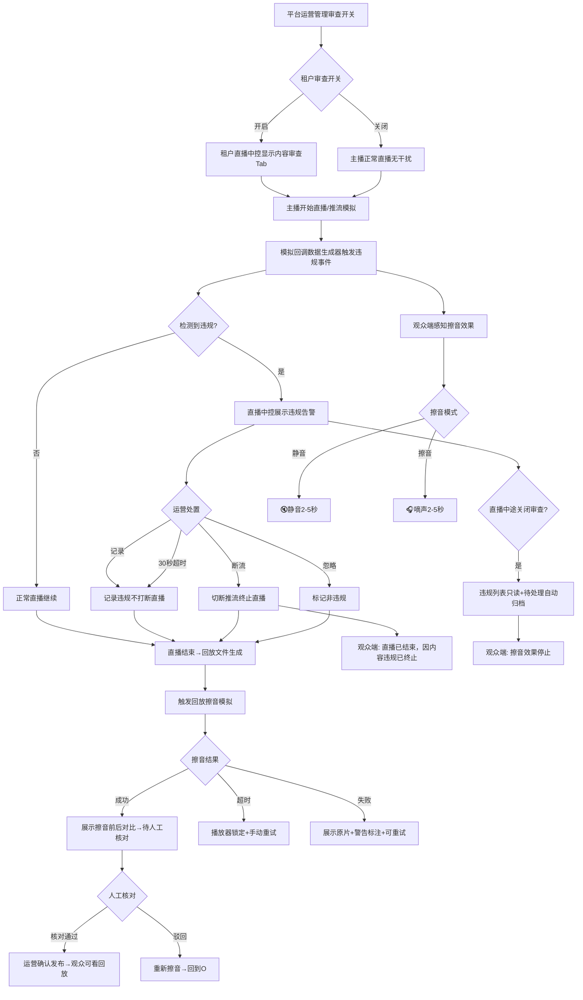
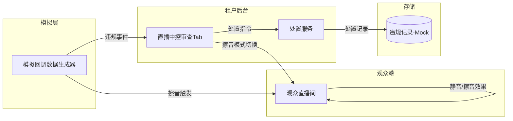
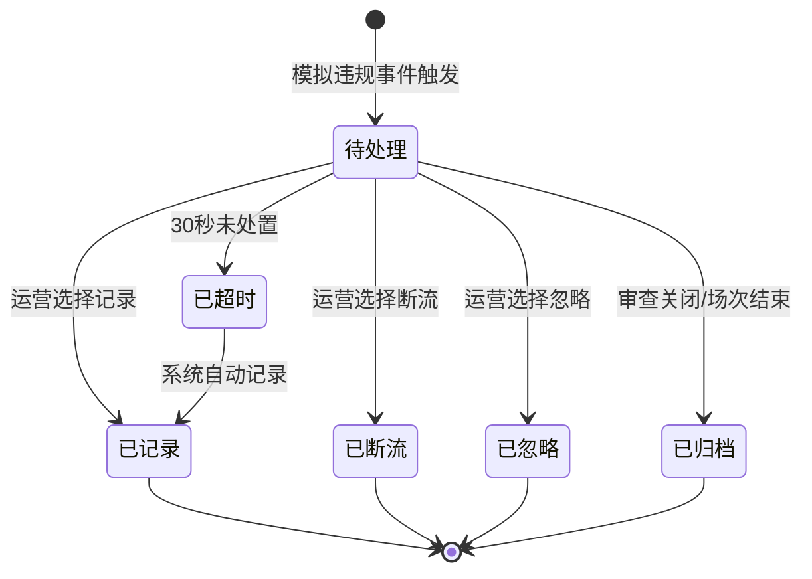
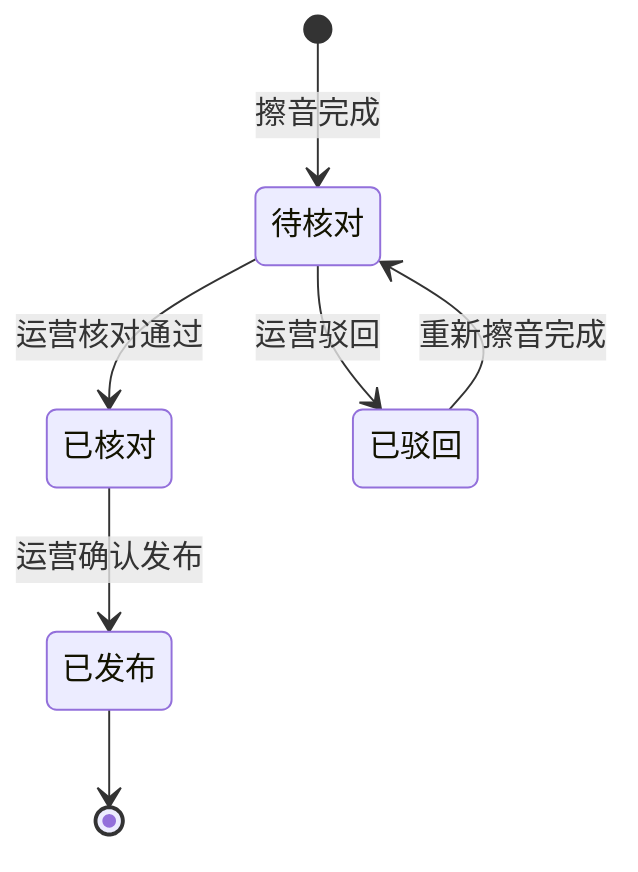
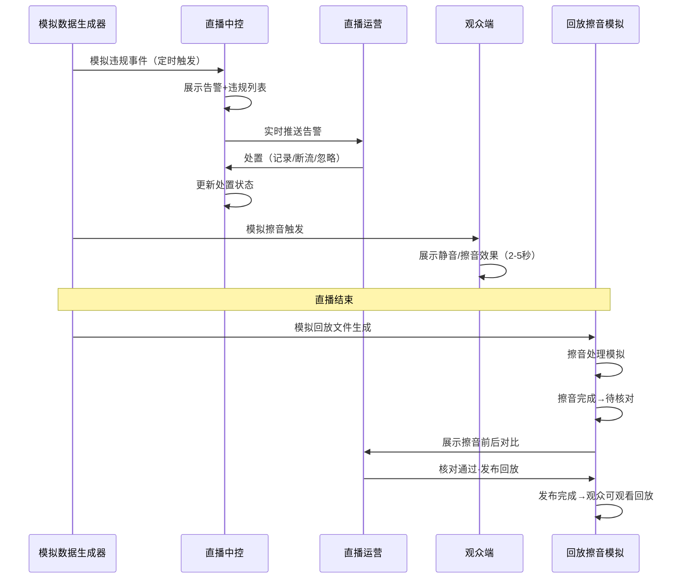
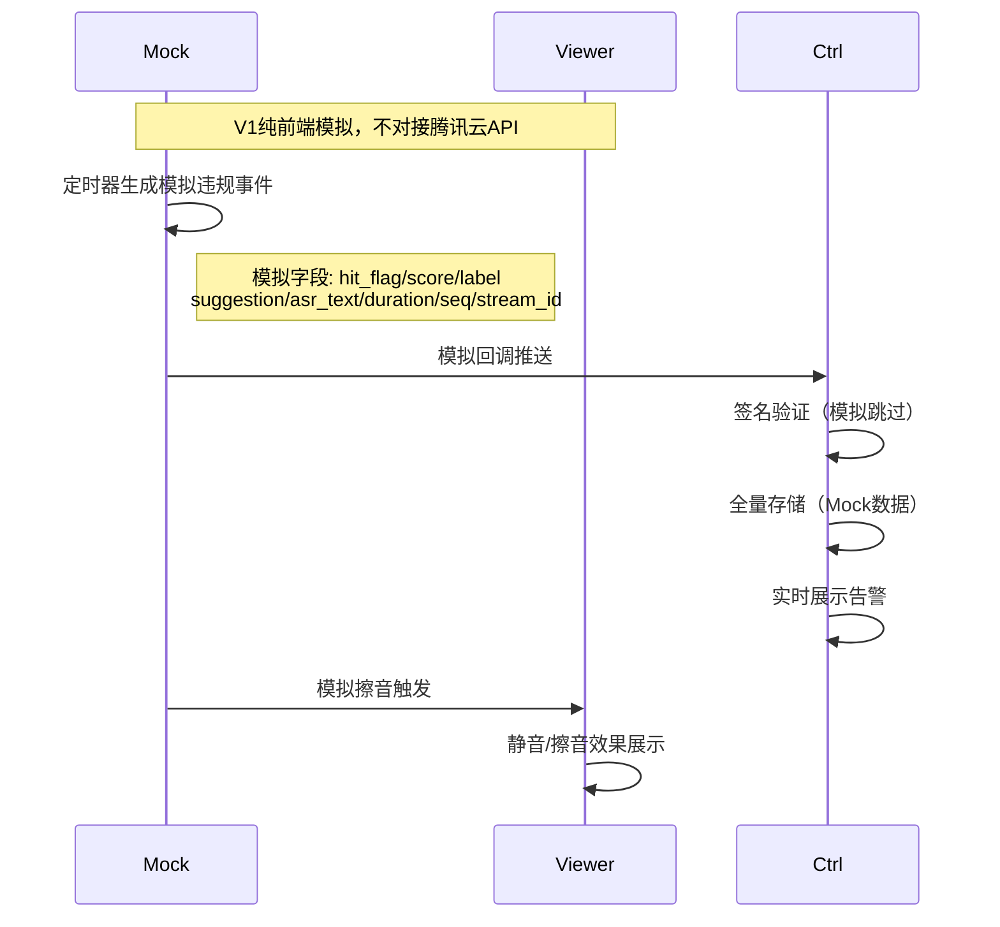

# 内容审查域 产品需求文档 PRD V1.0.0（重新跑版）

> **业务域**：内容审查域（D16） | **版本**：V1.0.0 | **日期**：2026-07-22
> **需求流**：STR-SAAS-001 | **类型**：新增 | **优先级**：P0
> **数据来源**：脑暴确认稿v1.1.0 + PO Backlog v1.0.0 + 已有PRD基线(16-内容审查域-PRD-v1.0.0) + 腾讯云直播审核文档
> **追溯链**：UC-AUDIT → FN-AUDIT → PG-AUDIT → SC-AUDIT → BG-AUDIT → BO-AUDIT
> **系统缩写**：SAAS | **终端缩码**：PC（运营后台/租户后台）+ APP（观众端H5 375px）
> **V1核心策略**：纯前端模拟，不对接腾讯云API，聚焦三终端效果模拟
> **PRD状态**：✅ 已冻结（2026-07-22 §18人工反馈全部确认通过）

---

## 1. 版本历史

| 版本 | 日期 | 变更内容 |
|------|------|----------|
| V1.0.2 | 2026-07-27 | 业务闭环修复：①BR-AUDIT-004 回放擦音完成后新增「人工核对→发布」步骤，擦音后不得直接开放回放 ②BR-AUDIT-015 变更「擦音完成→开放回放」为「擦音完成→人工核对→发布→开放回放」③ENT-AUDIT-004/005 新增 publish_status 字段（待核对/已核对/已发布/已驳回）④9.3 新增回放发布状态机 ⑤BR-AUDIT-017 增强：断流后直播场次列表自动同步状态（跨页签BC广播） |
| V1.0.1 | 2026-07-23 | 增量更新：①术语「内容审查」→「直播审查」全局对齐 ②新增 SC-AUDIT-012 监控画面强提示覆盖层验收 ③修复 SC-AUDIT-008 callbackLost 跨页签 BC 同步 |
| V1.0.0 | 2026-07-22 | 重新跑版——基于修复后配置重新执行POM流程。V1聚焦三终端效果模拟：运营后台开关+直播中控监控+观众端擦音效果+回放擦音。腾讯云配置人工完成，系统不管。纯前端Mock模拟回调数据。入口复用已有页面：运营后台租户管理列表（操作列平铺链接+二次确认弹窗）、租户后台直播列表（更多→查看历史违规列表/查看回放）。页面布局参考实际UI截图：PC直播中控台三栏布局右侧新增直播审查Tab/侧滑抽屉，H5直播间视频画面区中央叠加审查效果。 |

> **参考基线**：`knowledge/SAAS/需求文档/16-内容审查域-PRD-v1.0.0.md`（上一轮POM产出，15FN+12BR+6ENT）
> **V1范围调整**：从15FN缩减为6FN（5业务FN+1基础设施FN），移除V2/V3功能，移除弹幕过滤，"直播中控"统一改名"直播中控"

---

## 2. 目录

1. 背景与问题陈述
2. 目标与成功度量
3. 范围
4. 与既有模块关系
5. 业务目标映射
6. 用户故事
7. 五类图
8. 功能需求列表与用例（FN/UC）
9. 业务规则（BR）
10. 数据实体（ENT）
11. 验收标准
12. 指标登记
13. CONFIG集中配置
14. 外部接口标注
15. 需求深度分析摘要
16. 需求分析人工反馈确认点

---

## 3. 背景与问题陈述

内容审查域是SAAS平台的**平台级运营管控能力**，针对主播直播内容（音频/视频推流）进行实时审查和擦音处理，确保直播内容符合法律法规要求。

### V1核心目标

**验证直播内容审查的核心效果**——通过三终端模拟，展示实时擦音/静音和回放擦音/静音的完整效果链路。V1为纯前端原型模拟，不对接腾讯云API，腾讯云审核模板/擦音任务/敏感词库由人工在腾讯云控制台配置。

### 核心问题

| 问题编号 | 问题 | 严重程度 |
|----------|------|----------|
| AUDIT-ISSUE-001 | 直播中主播出现违禁词无实时擦音能力 | 🔴 高 |
| AUDIT-ISSUE-002 | 直播回放文件未经擦音处理即开放观看 | 🔴 高 |
| AUDIT-ISSUE-003 | 平台无统一的敏感词库管控机制 | 🟡 中（V2） |
| AUDIT-ISSUE-004 | 租户无法个性化扩展审查规则 | 🟡 中（V3） |

### 需求边界

| 管控对象 | 审查内容 | 技术方案 | V1 |
|---|---|---|---|
| 主播直播内容 | 音频/视频流 | 腾讯云直播审核+擦音（模拟） | ✅ |
| 观众文本消息 | 弹幕/聊天 | 腾讯云IM云端审核 | ❌ |

---

## 4. 目标与成功度量

| 目标编号 | 目标 | 度量指标 | 目标值 |
|----------|------|----------|--------|
| BO-AUDIT-01 | 违规内容发现率（模拟） | 审查覆盖率 | 100% |
| BO-AUDIT-02 | 实时擦音及时性（模拟） | 擦音延迟 | <3秒（模拟） |
| BO-AUDIT-03 | 回放擦音完整性（模拟） | 回放擦音覆盖率 | 100% |
| BO-AUDIT-04 | 违规处置效率 | 处置响应时间 | <30秒 |
| BO-AUDIT-05 | 三终端可演示 | 终端覆盖 | 3/3 |

---

## 5. 范围

### In-Scope（V1）

**运营后台(PC)**：
- 租户内容审查开关管理（入口：运营后台→租户管理列表→操作列新增「内容审查开关」链接，点击后二次确认）

**租户后台(PC) — 直播中控**：
- 模拟回调数据接收（前端Mock生成违规事件）
- 实时告警展示（红/黄/蓝三级）（入口：直播列表→操作列「更多」→查看历史违规列表；页面布局复用直播中控台，右侧为内容审查面板）
- 违规列表展示（时间/类型/内容片段/级别/处置建议/依据/状态）
- 违规处置操作（记录/断流/忽略）
- 擦音模式切换（静音/擦音）
- 回放擦音效果模拟（入口：直播列表→操作列「更多」→查看回放）

**观众端(H5 375px)**：
- 直播模拟（模拟直播过程+主播说话）
- 静音效果（🔇图标+进度条+画面变暗，2-5秒）
- 擦音效果（🎧图标+声波动画+嘀声，2-5秒）
- 断流结束提示（"直播已结束，该直播因内容违规已被终止"）
- 中控无数据场景模拟（30%概率"⚠直播中控尚未收到此违规回调"）

**共享基础设施**：
- 模拟回调数据生成器（定时器生成模拟违规事件，直播中控和观众端共享）
- **审查开关关闭时的系统行为**：开关关闭 → 模拟回调生成器不启动 → 直播列表不显示审查入口 → 直播中控无内容审查Tab → 观众端无擦音效果 → 回放不触发擦音（主播正常直播无干扰）

### 页面布局参考（V1）

基于当前系统已有 UI 截图与设计稿，V1 审查功能入口与面板位置如下：

| 终端 | 参考来源 | 布局说明 | 审查元素位置 |
|---|---|---|---|
| 运营后台(PC) | `租户管理.html` 截图 | 表格布局，操作列为平铺链接 | 操作列最后一项新增「内容审查开关」链接，点击后弹出二次确认弹窗 |
| 直播中控(PC) | `直播间布局.png` | 三栏布局：左侧聊天室 / 中间视频区 / 右侧面板 | 右侧「互动工具」Tab 旁新增「内容审查」Tab；历史违规列表以右侧侧滑抽屉形式打开 |
| 观众端(H5) | `直播间UI设计稿.png` + `lanhu_zhibojian/index.vue` | 375×812 移动端：顶部主播信息 / 中间视频画面 / 右侧互动浮标 / 左下角弹幕 / 底部操作栏 | 静音/擦音效果叠加在视频画面区中央；断流提示覆盖视频画面区；回调丢失提示显示在视频画面上方 |

### Non-Goals

- 腾讯云审核模板/擦音任务/敏感词库配置（人工在腾讯云控制台完成）
- 观众文本消息审查/弹幕过滤（腾讯云IM独立处理）
- 自研直播推流端审查能力（依赖腾讯云）
- 敏感词库管理（V2）
- 风控规则引擎（V2）
- 审核处置流程自动化（V2）
- 违规统计看板（V3）
- 平台管控策略下发（V3）
- 租户继承+个性化扩展（V3）

---

## 6. 与既有模块关系

| 关系类型 | 模块 | 依赖内容 | V1说明 |
|---|---|---|---|
| 依赖（上游） | 直播域(D09) | 场次状态机+直播间配置+直播中控+回放文件 | V1模拟场次状态；**入口复用直播列表操作列「更多」** |
| 依赖（上游） | 运营域(D13) | 租户管理列表 | **入口复用租户管理列表操作列**，新增「内容审查开关」平铺链接+二次确认弹窗 |
| 依赖（上游） | 平台域(D12) | Feature Flag | V1不涉及灰度（V3） |
| 被依赖（下游） | 录播域(D10) | 回放文件管理 | V1模拟回放擦音效果；入口复用直播列表「查看回放」 |
| 外部依赖 | 腾讯云直播审核 | 审核模板+擦音+回调 | V1纯模拟，不对接API；模板在腾讯云控制台人工配置 |
| 外部依赖 | 腾讯云AMS | 回放擦音API | V1纯模拟，不对接API |
| 复用规则 | BR-AUDIT-013 | 入口复用 | 所有审查相关入口必须复用已有页面，禁止新增独立菜单 |

---

## 7. 业务目标映射

| BG编号 | 业务目标 | 关联BO | 关联FN | 优先级 |
|---|---|---|---|---|
| BG-AUDIT-01 | 内容合规 | BO-AUDIT-01/02/03 | FN-AUDIT-PC-002/003/004, FN-AUDIT-APP-001 | P0 |
| BG-AUDIT-02 | 运营管控 | BO-AUDIT-04 | FN-AUDIT-PC-001/003 | P0 |
| BG-AUDIT-03 | 三终端可演示 | BO-AUDIT-05 | 全部FN | P0 |

---

## 8. 用户故事

| 编号 | 角色 | 故事 |
|---|---|---|
| US-AUDIT-001 | 平台运营 | 作为平台运营，我希望在运营后台租户管理列表操作列直接点击「内容审查开关」并二次确认后开启/关闭某租户的直播审查，以便控制审查范围 |
| US-AUDIT-002 | 直播运营 | 作为直播运营，我希望从直播列表进入历史违规列表（侧滑面板/直播中控台右侧面板），看到实时违规告警和完整依据，以便及时处置违规内容 |
| US-AUDIT-003 | 直播运营 | 作为直播运营，我希望在历史违规列表中对违规内容执行记录或断流处置，以便控制违规影响 |
| US-AUDIT-004 | 直播运营 | 作为直播运营，我希望在历史违规列表中切换擦音模式（静音/擦音），以便控制观众端的擦音效果 |
| US-AUDIT-005 | 观众 | 作为观众，我希望在直播中感知到擦音效果（静音/擦音），以便了解内容被审查处理 |
| US-AUDIT-006 | 直播运营 | 作为直播运营，我希望从直播列表进入回放详情页，看到回放擦音效果，以便确认回放内容已合规处理 |
| US-AUDIT-007 | 主播 | 作为主播，我希望在审查开关关闭时正常直播，不受审查功能干扰，以便专注直播内容 |

---

## 9. 五类图

### 9.1 业务流程图



### 9.2 信息流转图



### 9.3 状态机 — 违规处置状态机



**状态过渡操作表**：

| 当前状态 | 触发操作(FN) | 目标状态 | 操作者 | 前置约束 | 后置动作 |
|---|---|---|---|---|---|
| — | FN-AUDIT-PC-002 | 待处理 | 系统(模拟回调) | 模拟违规事件 | 存储违规数据+直播中控告警 |
| 待处理 | FN-AUDIT-PC-003 | 已记录 | 直播运营 | 运营查看依据 | 记录违规不打断直播 |
| 待处理 | FN-AUDIT-PC-003 | 已断流 | 直播运营 | 运营查看依据 | 模拟切断推流+终止直播 |
| 待处理 | FN-AUDIT-PC-003 | 已忽略 | 直播运营 | 运营判断非违规 | 标记忽略+备注理由 |
| 待处理 | 系统超时 | 已超时 | 系统(定时器) | 30秒未处置 | 自动记录+告警升级 |
| 待处理 | 审查关闭/场次结束 | 已归档 | 系统自动 | 审查开关关闭 或 场次状态转为已结束 | 违规保留可查看，不可再处置 |

### 9.3.1 状态机 — 回放发布状态机（V1.0.2新增）



**回放发布状态过渡操作表**：

| 当前状态 | 触发操作(FN) | 目标状态 | 操作者 | 前置约束 | 后置动作 |
|---|---|---|---|---|---|
| — | FN-AUDIT-PC-004 Step8 | 待核对 | 系统(自动) | 擦音任务状态=已完成 | 回放详情页显示「核对通过·发布回放」按钮 |
| 待核对 | FN-AUDIT-PC-004 Step8.1 | 已核对 | 直播运营 | 运营播放擦音前后对比、确认无遗漏违规 | 按钮变为「确认发布」+ 可驳回 |
| 待核对 | FN-AUDIT-PC-004 Step8.1.1 | 已驳回 | 直播运营 | 运营发现擦音遗漏或过度擦音 | 自动触发重新擦音 |
| 已核对 | FN-AUDIT-PC-004 Step8.2 | 已发布 | 直播运营 | 运营确认 | 允许观众播放回放（allow_play=true） |
| 已驳回 | 重新擦音完成 | 待核对 | 系统(自动) | retryMute完成 | 新一轮核对流程开始 |

### 9.4 业务时序图



### 9.5 三方接口时序图（V1模拟版）



---

## 10. 功能需求列表与用例（FN/UC）

### FN-AUDIT-INFRA-001 模拟回调数据生成器（V1基础设施）

| 字段 | 值 |
|---|---|
| 功能名称 | 模拟回调数据生成器 |
| 功能编号 | FN-AUDIT-INFRA-001 |
| 所属模块 | 内容审查域-基础设施 |
| 自动化类型 | [仿真需要]定时器驱动 |

**前置条件**：
1. 直播中控页面已打开 或 观众端直播间页面已打开（事件接收方必须就绪）
2. 当前场次状态为"直播中"

**基本流程**：
1. [仿真需要] 定时器启动——在直播中控页面或观众端页面加载后自动启动（默认5-15秒随机间隔生成违规事件），**页面关闭时自动销毁定时器**
2. [仿真需要] 生成模拟违规事件数据（前端纯内存生成，不持久化）：
   - hit_flag: 1（已触发）
   - score: 0-100随机（影响告警级别：>80红/L2红/50-79黄/L3黄/<50蓝/L4蓝）
   - label: 随机（Normal/Porn/Abuse/Ad/Custom）
   - sub_label: 随机子标签
   - suggestion: 随机（Block/Review/Pass）
   - asr_text: 模拟违规文本片段（含敏感词标记）
   - duration: 随机语音识别时长（秒）
   - seq: 递增音频序列号
   - stream_id: 模拟推流ID
   - audio_muted: 是否已擦音
   - mute_duration: 擦音时长（秒）
   - evidence_url: 模拟COS存储路径
3. [仿真需要] 事件分发——通过共享Store（Zustand Subscription Store）广播到：
   - 直播中控（展示告警+追加违规列表）
   - 观众端（触发擦音效果）
4. [仿真需要] 30%概率标记回调丢失场景——仅向观众端发送丢失提示，直播中控不追加该条违规记录

**数据范围(R/W)**：W: 模拟违规事件数据（内存，不持久化）

**后置条件**：
- 若直播中控已打开 → 违规列表追加一条新记录（30%概率标记回调丢失时不追加）
- 若观众端已打开 → 触发擦音效果感知（包含30%丢失场景提示）
- 若两者均未打开 → 本次事件丢弃（定时器继续，下次间隔重新生成）

**关联UC**：UC-AUDIT-001/002/003

---

### FN-AUDIT-PC-001 租户内容审查开关管理（V1）

| 字段 | 值 |
|---|---|
| 功能名称 | 租户内容审查开关管理 |
| 功能编号 | FN-AUDIT-PC-001 |
| 所属业务系统 | SAAS运营后台 |
| 运行终端 | PC |
| 自动化类型 | [手动]操作+[系统自动]生效 |

**前置条件**：平台运营已登录运营后台，并进入「租户管理」列表页

**基本流程**：
1. [手动] 平台运营进入运营后台→**租户管理**列表（复用已有 FN-OPS-009 租户管理入口）
2. [系统自动] 列表展示租户信息（租户编号/租户名称/联系电话/状态/注册时间等，📗显式照录 `租户管理.html` 字段）
3. [手动] 平台运营在目标租户行的「操作」列点击 **「内容审查开关」** 链接（V1新增，位于操作列已有链接之后，与"查看资质/版本订购记录/查看合同/资源订购记录/虚拟账户管理/启用禁用"平铺展示）
4. [系统自动] 弹出二次确认弹窗：
   - 标题：内容审查开关
   - 展示：租户名称 + 推流域名 + 当前状态（开启/关闭）+ 今日违规数
   - 影响说明：开启后该租户直播中控台显示内容审查Tab，关闭后隐藏（平台不可降级类仍强制执行）
5. [手动] 运营在弹窗内切换开关（开启/关闭）
6. [手动] 运营点击「确认」
7. [系统自动] 开关状态更新，该租户直播中控台显示/隐藏内容审查Tab
8. [系统自动] 操作列链接文案同步变化（开启时显示"关闭内容审查"，关闭时显示"开启内容审查"）

**备选流程**：
- 5a. 关闭审查时弹窗底部提示"平台不可降级类（涉黄/涉暴/公共安全/社会安全/违法乱纪/广告法）仍由腾讯云配置层强制执行"
- 5b. **直播中途关闭审查**：若该租户当前有「直播中」场次，关闭审查时弹窗额外展示"⚠当前有 N 场直播正在进行中，关闭后直播中控内容审查Tab将立即消失，已产生的违规记录保留但不再接收新违规"提醒，运营确认后生效
- 6a. 运营点击「取消」→ 弹窗关闭，不保存变更
- 7a. 开关变更时自动生成操作日志（操作人/时间/租户/原状态/新状态/租户编号）
- 8a. 审查关闭后，该租户直播列表操作列「更多」下拉菜单中「查看历史违规列表」入口隐藏（已有历史违规记录仍可通过直播详情页查看）

**数据范围(R/W)**：R: 租户列表 / W: 租户审查开关状态

**后置条件**：租户审查开关生效，直播中控内容审查Tab显示/隐藏

**关联UC**：UC-AUDIT-001

---

### FN-AUDIT-PC-002 直播中控内容审查Tab-模拟回调+实时告警（V1）

| 字段 | 值 |
|---|---|
| 功能名称 | 直播中控内容审查Tab |
| 功能编号 | FN-AUDIT-PC-002 |
| 所属业务系统 | SAAS租户后台 |
| 运行终端 | PC |
| 自动化类型 | [手动]入口+[系统自动]展示 |

**前置条件**：场次状态为"直播中/已结束"+租户审查开关已开启

**基本流程**：
1. [手动] 租户运营登录租户后台，进入「直播管理」→**直播列表**（复用已有直播列表页面，字段📗显式照录 `直播列表.html`：直播状态/直播间编号/直播封面/直播名称/直播总时长/累计观看人数/峰值在线人数/购物车/全局禁言/允许回放/直播间配置）
2. [手动] 在目标直播行的「操作」列点击「更多」下拉菜单
3. [系统自动] 下拉菜单展示：
   - 直播中控台
   - **查看历史违规列表（V1新增）**
   - 查看回放
   - 编辑
   - 删除
4. [手动] 租户运营点击「查看历史违规列表」
5. [系统自动] 打开**侧滑面板/抽屉**（从右侧滑出，宽度 400px，覆盖在直播中控台上方），标题为「{直播名称} - 历史违规列表」
6. [系统自动] 侧滑面板按直播中控台右侧面板布局呈现：
   - **顶部告警区**：高度约 80px，展示本场次实时/历史告警统计
     - 红色告警（L1核心/L2高危）数量
     - 黄色告警（L3中危）数量
     - 蓝色提示（L4低危）数量
     - 当前违规总数+审查状态
   - **中部违规列表区**：占据面板主要区域，滚动展示本场次违规记录（时间/类型/内容片段/级别/处置建议/处置依据/状态/模拟回调JSON）
   - **底部处置区**：固定高度，提供「记录/断流/忽略」快捷处置按钮 + 「静音/擦音」模式切换
7. [手动] 运营点击违规记录查看详情（完整违规数据+模拟回调JSON+证据文件）
8. [仿真需要] 通过共享Store自动接收FN-AUDIT-INFRA-001广播的模拟回调数据并追加到违规列表底部（新记录置顶），列表实时刷新无需手动刷新

**UI布局补充**：
- 直播中控台主界面保持现有三栏布局（左侧聊天室/中间视频区/右侧互动工具面板）
- 当审查开关开启时，右侧「互动工具」Tab 区域旁新增 **「内容审查」Tab**，作为实时审查快捷入口（与「互动工具/商品卡片/直播订单」并列）
- 点击「内容审查」Tab 时，右侧面板切换为内容审查面板（同侧滑面板内容），方便运营在直播过程中实时处置
- 历史违规列表侧滑面板与直播中控台右侧面板共用同一套组件，确保体验一致

**备选流程**：
- 2a. 若当前直播「允许回放=否」，隐藏「查看回放」入口（由录播域既有规则控制）
- 2b. 若当前租户审查开关**已关闭**，操作列「更多」下拉菜单不显示「查看历史违规列表」入口
- 6a. 30%概率出现"⚠直播中控尚未收到此违规回调"提示（模拟回调丢失场景）
- 6b. **违规列表排序**：默认按违规时间倒序（最新在上），运营可按「时间/级别/状态」切换排序方式
- 6c. **违规列表筛选**：顶部提供级别筛选（全部/L1/L2/L3/L4）和状态筛选（全部/待处理/已记录/已断流/已忽略/已超时）
- 6d. **已结束直播归档**：场次状态转为「已结束」后，侧滑面板顶部显示"本场次已结束（结束时间：HH:mm:ss）"，违规列表改为只读模式，隐藏底部处置按钮（处置操作不可用），已有违规记录保留可查看，定时器停止接收新违规
- 7a. 已结束直播的违规列表底部展示"本场次已结束，后续违规不再接收"提示
- 8a. 30%概率标记回调丢失时，该条违规不追加到列表

**数据范围(R/W)**：R: 模拟违规记录 / W: 无（只读展示）

**后置条件**：
- 若场次为「直播中」→ 违规数据实时展示+运营可见告警+底部处置按钮可用
- 若场次为「已结束」→ 违规列表只读+处置按钮隐藏+运营仍可查看历史记录

**关联UC**：UC-AUDIT-002

> **入口点标注**：直播中控内容审查Tab是实时审查的核心展示和处置入口——提示+列表+处置（记录/断流），处置依据完整便于判断。

---

### FN-AUDIT-PC-003 直播中控违规处置+擦音模式切换（V1）

| 字段 | 值 |
|---|---|
| 功能名称 | 直播中控违规处置+擦音模式切换 |
| 功能编号 | FN-AUDIT-PC-003 |
| 自动化类型 | [手动]处置+[系统自动]展示 |

**前置条件**：场次状态为"直播中"+存在违规记录（待处理状态）

**基本流程**：
1. [手动] 运营在违规列表中选择一条「待处理」违规记录，点击处置按钮：
   - a. **记录**：弹出处置确认弹窗，展示违规摘要（违规时间/类型/级别/内容片段），运营填写处置备注（必填，最少10字），点击「确认记录」→ 记录违规不打断直播，状态变为「已记录」
   - b. **断流**：弹出断流确认弹窗（红色警告样式），展示违规摘要 + "断流后直播将立即终止，观众端显示结束提示，此操作不可撤销"，运营填写处置理由（必填），点击「确认断流」→ 模拟切断推流，场次状态变为「已结束」，违规状态变为「已断流」
   - c. **忽略**：弹出忽略确认弹窗，展示违规摘要，运营填写忽略理由（必填），点击「确认忽略」→ 标记为非违规，违规状态变为「已忽略」
2. [系统自动] 处置结果更新违规记录状态+记录处置日志（操作人/时间/处置类型/备注）
3. [手动] 运营在场次信息栏切换擦音模式：
   - a. **静音模式**：检测到违规→音频直接静音（无声音）
   - b. **擦音模式**：检测到违规→敏感词部分用嘀声替换
4. [仿真需要] 擦音模式通过共享Store写入，广播同步到观众端（观众端由FN-AUDIT-APP-001订阅Store变化并实时切换效果展示）

**备选流程**：
- 1a. 处置超时（30秒未操作）→ 系统自动记录+告警升级通知
- 1b. 断流失败 → 提示错误+记录失败日志（模拟）

**数据范围(R/W)**：R: 违规记录 / W: 处置记录+擦音模式

**后置条件**：违规记录状态更新+处置日志记录+擦音模式同步到观众端

**关联UC**：UC-AUDIT-002

---

### FN-AUDIT-PC-004 回放擦音效果模拟（V1）

| 字段 | 值 |
|---|---|
| 功能名称 | 回放擦音效果模拟 |
| 功能编号 | FN-AUDIT-PC-004 |
| 自动化类型 | [事件驱动]+[仿真需要] |

**前置条件**：场次状态从"直播中"转为"已结束/回放中"+回放文件已生成（模拟）+租户审查开关已开启

**基本流程**：
1. [手动] 租户运营登录租户后台，进入「直播管理」→**直播列表**
2. [手动] 在目标已结束直播行的「操作」列点击「更多」下拉菜单
3. [手动] 点击「查看回放」
4. [系统自动] 跳转至回放详情页，展示回放文件信息（文件名/时长/大小/生成时间/状态）
5. [系统自动] 回放详情页加载「内容审查」模块：
   - 顶部：本场次违规统计（L1~L4数量）
   - 中部：回放视频播放器（默认展示擦音后版本，若未擦音则展示"正在擦音"占位）
   - 底部：擦音任务状态 + 操作按钮
6. [事件驱动] 检测到回放文件生成（模拟）→ 系统自动触发回放擦音任务
7. [仿真需要] 擦音处理中——前端模拟擦音进度条（0→100%，约5-10秒），展示"正在擦音..."加载动画，此时播放器不可交互
8. [仿真需要] 擦音完成——播放区域自动切换为擦音后版本，播放器恢复可交互，展示"擦音完成"提示，回放发布状态切换为「待核对」
9. [手动] 运营可点击「查看擦音前后对比」展开对比面板：
   - 擦音前：含敏感词的音频片段（可播放）
   - 擦音后：静音或嘀声替换（可播放）
   - 运营逐段核对擦音完整性，确认无遗漏违禁词/无过度擦音
10. [手动] **人工核对（BR-AUDIT-004/015强制步骤）**——运营核对完成后执行：
    - a. **核对通过**：点击「核对通过·发布回放」按钮 → 回放发布状态变为「已核对」→ 底部按钮变为「确认发布」
    - b. **驳回**：点击「驳回重新擦音」按钮 → 回放发布状态变为「已驳回」→ 自动触发重新擦音任务 → 擦音完成后回到「待核对」
11. [手动] 运营核对通过后点击「确认发布」→ 回放发布状态变为「已发布」→ 开放回放观看（allow_play=true），观众可正常播放擦音后版本
12. [手动] 运营可点击「重新擦音」重新触发擦音任务（模拟）→ 擦音完成后重置为「待核对」

**备选流程**：
- 5a. 若回放文件尚未生成，展示"回放文件生成中，请稍后"
- 5b. 若场次无任何违规记录，回放详情页不展示「内容审查」模块
- 7a. **擦音处理超时**（模拟30秒）→ 标记超时，展示"擦音处理超时，请手动重试"，播放器不可播放，「重新擦音」按钮高亮可用
- 7b. **擦音处理失败**（模拟10%概率）→ 标记失败，展示"擦音处理失败，原因：{模拟错误信息}"，播放器展示原片但标注"⚠ 该回放尚未完成擦音处理，可能包含违规内容"
- 9a. **对比面板交互**：左右分栏布局，左侧"擦音前"播放器+右侧"擦音后"播放器（宽度各50%），支持独立播放/暂停，运营可逐段对比；关闭对比面板后回到正常回放播放（播放擦音后版本）
- 10a. 重新擦音后，之前对比面板中的"擦音后"版本更新为新擦音结果

**数据范围(R/W)**：R: 回放文件信息（模拟）/ W: 擦音任务记录

**后置条件**：
- 正常路径：擦音完成→人工核对通过→确认发布→观众可观看擦音后版本
- 驳回路径：擦音完成→人工核对驳回→重新擦音→回到待核对
- 超时路径：回放未擦音+运营可手动重试+播放器锁定不可播放
- 失败路径：回放未擦音+展示原片但标注警告+运营可手动重试

**关联UC**：UC-AUDIT-003

---

### FN-AUDIT-APP-001 观众端直播模拟+静音/擦音效果+断流提示（V1）

| 字段 | 值 |
|---|---|
| 功能名称 | 观众端直播模拟+擦音效果感知+断流提示 |
| 功能编号 | FN-AUDIT-APP-001 |
| 所属业务系统 | SAAS平台APP |
| 运行终端 | APP（移动端H5 375px） |
| 自动化类型 | [事件驱动]+[仿真需要] |

**前置条件**：观众已进入直播间+主播正在直播中（模拟）+内容审查已开启

**基本流程**：
1. [系统自动] 观众进入直播间，展示直播画面+主播信息+弹幕+操作栏（参考 `lanhu_zhibojian/index.vue` 布局：顶部主播信息栏/中间视频画面区/右侧互动浮标/左下角弹幕区/底部输入操作栏）
2. [仿真需要] 订阅共享Store，接收FN-AUDIT-INFRA-001广播的模拟擦音触发事件（含擦音模式+违规级别+回调丢失标记）
3. [仿真需要] 观众端在**视频画面区中央**渲染擦音效果（根据共享Store中的擦音模式），效果层位于视频画面上方、弹幕区和右侧互动浮标下方：
   - a. **静音模式**：🔇图标 + 横向进度条 + 画面整体蒙层变暗（rgba(0,0,0,0.4)），持续2-5秒后恢复
   - b. **擦音模式**：🎧图标 + 声波动画 + "嘀———" 文字提示，持续2-5秒后恢复
4. [仿真需要] 30%概率触发回调丢失场景——"⚠直播中控尚未收到此违规回调"提示浮层显示在**视频画面上方、主播信息栏下方**（橙色警告样式，与步骤3擦音效果互斥，不会同时出现）
5. [事件驱动] 主播被断流处置时，观众端在**视频画面区中央**显示"直播已结束，该直播因内容违规已被终止"，音频停止并覆盖结束遮罩，底部保留"直播已结束"文案
6. [手动] 观众可查看商品弹出层（不影响审查感知，商品卡片位于右侧，审查效果层 z-index 高于商品卡片但低于关闭按钮）

**UI叠加位置说明**：
- 审查效果层 z-index 层级：主播信息栏/关闭按钮 > 审查效果层 > 视频画面/弹幕/商品卡片 > 底部操作栏
- 擦音图标居中显示，不遮挡主播面部核心区域（略微偏上或偏下，根据实际画面调整）
- 断流提示覆盖整个视频画面区，底部保留直播间已结束提示文案

**备选流程**：
- 2a. 擦音模式由FN-AUDIT-PC-003通过共享Store同步，观众端实时订阅无需主动拉取
- 4a. 中控无数据时提示"⚠直播中控尚未收到此违规回调"（橙色警告样式，显示于视频画面上方）
- 5a. 断流后音频停止，直播画面变为结束覆盖层

**数据范围(R/W)**：R: 擦音模式(共享Store) / W: 无（观众端只感知不写入）

**后置条件**：观众感知到擦音效果+断流时看到结束提示

**关联UC**：UC-AUDIT-004

> **擦音模式说明**：静音模式=音频直接静音（无声音）；擦音模式=敏感词部分用1000Hz嘀声替换，其他声音正常。两种模式由直播中控配置，通过共享Store广播，观众端实时订阅。

### 10.7 用例（UC）详细说明

> **说明**：本节按 POM 用例标准模板（前置条件 / 基本流程 / 备选流程 / 数据范围 R/W / 后置条件 / 关联 UC）对内容审查域用例进行逐项细化。每个 UC 同时给出「所属系统 / 所属模块 / 所属页面 / 参与人 / 影响数据」，确保与交互用例卡片、`docs/03-design/01-UI元素-UC映射-AUDIT.md` 完全一致。元素级帮助入口 ID 与页面中注入的 `?` 图标一一对应。

---

#### UC-AUDIT-001 租户内容审查开关管理

| 字段 | 值 |
|---|---|
| 用例编号 | UC-AUDIT-001 |
| 用例名称 | 租户内容审查开关管理 |
| 功能编号 | FN-AUDIT-PC-001 |
| 页面编号 | PG-AUDIT-PC-001 |
| 所属系统 | SAAS 平台 |
| 所属模块 | 内容审查 |
| 所属页面 | 租户管理列表（运营后台） |
| 优先级 | P0 |
| 参与人 | 平台运营人员 |
| 影响数据 | tenant.audit_enabled, tenant.mute_mode, tenant_audit_log, audit_switch_event |

**用例描述**：平台运营人员在租户管理列表中，查看每个租户是否已启用直播内容审查功能，并可通过操作列入口开启/关闭该租户的内容审查能力。开关变更会触发 5 级联动：直播中控 Tab 显示/隐藏、直播列表「更多」入口显示/隐藏、回放擦音任务触发/跳过、观众端效果展示/跳过、历史违规入口显示/隐藏。

**前置条件**：
1. 运营人员已登录 SAAS 平台运营后台；
2. 运营人员已进入「租户管理」页面；
3. 当前租户列表已加载。

**基本流程**：
1. [手动] 运营人员在列表中查看「是否启用」列，确认当前租户审查开关状态；
2. [手动] 运营人员点击「操作」列中的「内容审查开关」文字链接；
3. [系统自动] 系统弹出二次确认弹窗，展示租户名称、推流域名、当前状态、今日违规数、5 级联动影响说明；
4. [手动] 运营人员在弹窗内切换开关状态（开启/关闭）；
5. [手动] 运营人员点击「确认」；
6. [系统自动] 系统保存 tenant.audit_enabled 状态，并生成操作日志（操作人/时间/租户/原状态/新状态/租户编号）；
7. [事件驱动] 系统通过共享 Store/BroadcastChannel 广播 audit_switch_event，下游页面（直播中控、直播列表、回放任务、观众端、历史违规入口）实时联动。

**备选流程**：
- 5a. 运营人员在弹窗内点击「取消」→ 弹窗关闭，不保存变更；
- 6a. 保存失败 → 系统提示错误并保留原状态，操作日志不生成；
- 7a. 直播中途关闭审查 → 若该租户存在「直播中」场次，弹窗额外提示"当前有 N 场直播正在进行，关闭后中控内容审查 Tab 将立即消失，已产生的违规记录保留但不再接收新违规"，运营确认后生效；
- 7b. 平台不可降级类（涉黄/涉暴/公共安全/社会安全/违法乱纪/广告法）仍由腾讯云配置层强制执行，不受租户开关关闭影响。

**数据范围(R/W)**：
- R: tenant.audit_enabled, tenant.mute_mode, tenant.today_violation_count
- W: tenant.audit_enabled, tenant_audit_log, audit_switch_event

**后置条件**：
1. tenant.audit_enabled 更新；
2. 该租户所有审查相关入口/页面按开关状态联动；
3. 操作日志已记录。

**关联UC**：无（本 UC 为起点）

**元素级帮助入口**：

| 元素ID | 元素名称 | 对应BR |
|---|---|---|
| E-AUDIT-001-01 | 是否启用列 | BR-AUDIT-001 |
| E-AUDIT-001-02 | 操作列/直播审查开关 | BR-AUDIT-001 |
| E-AUDIT-001-03 | 二次确认弹窗 | BR-AUDIT-001 |

---

#### UC-AUDIT-002 直播中控内容审查 Tab + 违规处置

| 字段 | 值 |
|---|---|
| 用例编号 | UC-AUDIT-002 |
| 用例名称 | 直播中控内容审查 Tab + 违规处置 |
| 功能编号 | FN-AUDIT-PC-002 / FN-AUDIT-PC-003 |
| 页面编号 | PG-AUDIT-PC-002 / PG-AUDIT-PC-004 |
| 所属系统 | SAAS 平台 |
| 所属模块 | 内容审查 |
| 所属页面 | 直播中控内容审查 Tab（租户后台）/ 历史违规列表面板 |
| 优先级 | P0 |
| 参与人 | 主播 / 运营人员 |
| 影响数据 | violation_record, live_stream.audit_status, callback_lost_event, disposal_log, live_stream.mute_mode |

**用例描述**：主播或运营人员进入直播中控台，切换到「内容审查」Tab，查看实时告警统计、违规列表，并对 AI 识别的违规进行记录、断流或忽略处置。处置结果写入 violation_record 与 disposal_log；严重违规（L1）不可忽略。历史违规列表通过侧滑抽屉展示本场次所有违规，支持筛选与再次查看。

**前置条件**：
1. 当前租户已开启内容审查开关；
2. 直播正在进行中（或已结束但需查看历史违规）；
3. 用户已登录直播中控台或回放管理页面。

**基本流程**：
1. [手动] 用户进入直播中控台，点击右侧「内容审查」Tab；
2. [事件驱动] 系统接收 FN-AUDIT-INFRA-001 广播的模拟违规事件，刷新顶部告警统计区与违规列表；
3. [手动] 用户在筛选器中选择级别（L1/L2/L3/L4）、状态（待处理/已记录/已断流/已忽略）、排序方式；
4. [手动] 用户点击某条违规记录，查看详情面板（违规时间/类型/级别/内容片段/处置建议/证据文件/模拟回调 JSON）；
5. [手动] 用户根据违规级别与业务规则选择处置操作：
   - a. **记录**：弹出确认弹窗，填写处置备注（≥10 字），点击「确认记录」→ 状态变为「已记录」；
   - b. **断流**：弹出断流确认弹窗（红色警告），填写处置理由，点击「确认断流」→ 模拟切断推流，直播状态变为「已结束」，违规状态变为「已断流」；
   - c. **忽略**：弹出忽略确认弹窗，填写忽略理由，点击「确认忽略」→ 状态变为「已忽略」；
6. [系统自动] 系统更新 violation_record.disposal_status，写入 disposal_log，并根据处置类型同步 live_stream.audit_status；
7. [手动] 用户在场次信息栏切换擦音模式（静音/擦音）；
8. [事件驱动] 擦音模式通过共享 Store 广播到观众端，观众端实时切换效果。

**备选流程**：
- 2a. 回调丢失 → 顶部显示「回调丢失」提示，用户可手动刷新；
- 2b. 30 秒未处置 → 系统自动记录并告警升级；
- 5b. L1 严重违规点击「忽略」→ 按钮置灰，提示「L1 不可忽略」；
- 5c. L4 低危违规点击「断流」→ 按钮置灰，提示「L4 仅可记录」；
- 5d. 已结束直播的违规列表 → 只读展示，隐藏底部处置按钮；
- 7a. 网络断开 → 列表展示骨架屏，重连后自动刷新。

**数据范围(R/W)**：
- R: violation_record, live_stream.audit_status, live_stream.mute_mode, callback_lost_event
- W: violation_record.disposal_status, disposal_log, live_stream.mute_mode, live_stream.audit_status

**后置条件**：
1. 违规处置完成，历史违规列表可查询；
2. 断流处置后直播结束，观众端显示结束提示；
3. 擦音模式已同步到观众端。

**关联UC**：UC-AUDIT-001（开关）、UC-AUDIT-005（入口路由）

**元素级帮助入口**：

| 元素ID | 元素名称 | 对应BR |
|---|---|---|
| E-AUDIT-002-01 | 「内容审查」Tab | BR-AUDIT-002 |
| E-AUDIT-002-02 | 顶部告警统计区 | BR-AUDIT-003 |
| E-AUDIT-002-03 | 查看历史违规记录按钮 | BR-AUDIT-005 |
| E-AUDIT-002-04 | 违规列表筛选器 | BR-AUDIT-003 |
| E-AUDIT-002-05 | 违规列表项 | BR-AUDIT-003 |
| E-AUDIT-002-06-01 | 「记录」按钮 | BR-AUDIT-006 |
| E-AUDIT-002-06-02 | 「断流」按钮 | BR-AUDIT-007 |
| E-AUDIT-002-06-03 | 「忽略」按钮 | BR-AUDIT-008 |
| E-AUDIT-002-07 | 擦音模式切换 | BR-AUDIT-009 |

---

#### UC-AUDIT-003 回放擦音效果模拟 + 人工核对发布

| 字段 | 值 |
|---|---|
| 用例编号 | UC-AUDIT-003 |
| 用例名称 | 回放擦音效果模拟 + 人工核对发布 |
| 功能编号 | FN-AUDIT-PC-004 |
| 页面编号 | PG-AUDIT-PC-003 |
| 所属系统 | SAAS 平台 |
| 所属模块 | 内容审查 |
| 所属页面 | 回放详情审查页（租户后台） |
| 优先级 | P0 |
| 参与人 | 运营人员 / 审核员 |
| 影响数据 | replay.mute_task_status, replay.publish_status, replay.mute_segments, replay.mute_mode, violation_record, replay.audit_log |

**用例描述**：直播结束后，系统对回放文件进行 AI 擦音处理。运营人员在回放详情页查看擦音前后对比、时间轴违规标记、人工核对发布状态，并执行「核对通过·发布回放」或「驳回重新擦音」。仅当擦音任务完成且发布状态为「待核对」时才可操作发布；发布后观众端方可播放擦音后版本。

**前置条件**：
1. 直播已结束；
2. 回放文件已生成（模拟）；
3. 当前租户已开启内容审查；
4. 回放擦音任务已创建。

**基本流程**：
1. [系统自动] 回放详情页加载时，系统启动擦音任务，展示进度条（0→100%）；
2. [事件驱动] 擦音任务完成后，进度条标记违规时间点，播放器切换为擦音后版本，发布状态变为「待核对」；
3. [手动] 审核员查看擦音前后对比面板、违规列表、时间轴标记；
4. [手动] 审核员选择操作：
   - a. **核对通过·发布回放**：点击按钮 → 发布状态变为「已核对」→ 二次点击「确认发布」→ 发布状态变为「已发布」，allow_play=true；
   - b. **驳回重新擦音**：点击按钮 → 发布状态变为「已驳回」→ 自动触发重新擦音任务；
5. [系统自动] 若通过，回放开放观众播放；若驳回，回到步骤 1 重新擦音。

**备选流程**：
- 1a. 擦音任务失败 → 提示失败原因，展示原片但标注警告，提供「重新擦音」按钮；
- 1b. 擦音任务超时 → 提示超时，播放器锁定不可播放，提供「手动重试」；
- 2a. 任务进行中点击发布按钮 → 按钮置灰，提示等待完成；
- 4a. 发布状态非「待核对」时 → 隐藏发布/驳回按钮；
- 4b. 重新擦音后再次完成 → 发布状态重置为「待核对」，进入新一轮核对。

**数据范围(R/W)**：
- R: replay.mute_task_status, replay.publish_status, replay.mute_segments, violation_record, replay.media_url
- W: replay.mute_task_status, replay.publish_status, replay.mute_mode, replay.audit_log

**后置条件**：
1. 回放发布状态为 published 或 rejected/待重新擦音；
2. 已发布回放观众端可播放；
3. 审核日志已记录。

**关联UC**：UC-AUDIT-001（开关）、UC-AUDIT-005（入口路由）

**元素级帮助入口**：

| 元素ID | 元素名称 | 对应BR |
|---|---|---|
| E-AUDIT-003-01 | 回放播放器 | BR-AUDIT-010 |
| E-AUDIT-003-02 | 擦音任务进度条 | BR-AUDIT-011 |
| E-AUDIT-003-03 | 时间轴违规标记 | BR-AUDIT-012 |
| E-AUDIT-003-04 | 违规记录列表 | BR-AUDIT-012 |
| E-AUDIT-003-05 | 擦音模式选择 | BR-AUDIT-009 |
| E-AUDIT-003-06 | 「重新擦音」按钮 | BR-AUDIT-015 |
| E-AUDIT-003-07 | 「核对通过·发布回放」按钮 | BR-AUDIT-004 |
| E-AUDIT-003-08 | 「驳回重新擦音」按钮 | BR-AUDIT-015 |
| E-AUDIT-003-09 | 发布状态标签 | BR-AUDIT-004 |
| E-AUDIT-003-10 | 擦音前后对比面板 | BR-AUDIT-013 |

---

#### UC-AUDIT-004 观众端 - 内容审查效果感知

| 字段 | 值 |
|---|---|
| 用例编号 | UC-AUDIT-004 |
| 用例名称 | 观众端 - 内容审查效果感知 |
| 功能编号 | FN-AUDIT-APP-001 |
| 页面编号 | PG-AUDIT-APP-001 |
| 所属系统 | SAAS 平台 |
| 所属模块 | 内容审查 |
| 所属页面 | 观众端直播间（H5/APP） |
| 优先级 | P1 |
| 参与人 | 普通观众 |
| 影响数据 | live_stream.mute_mode, callback_lost_event, live_stream.audit_status（只读） |

**用例描述**：普通观众在直播间或回放中观看内容时，当主播触发违规且运营已处置，观众端可感知到擦音/静音效果、回调丢失提示或直播结束提示。观众端为只读感知，不暴露任何运营操作入口。

**前置条件**：
1. 当前租户已开启内容审查；
2. 观众已进入直播间或正在播放已发布回放；
3. 主播正在直播中（或回放已发布）。

**基本流程**：
1. [事件驱动] 主播发言触发 AI 违规识别；
2. [事件驱动] 运营处置后，系统向观众端推送擦音/静音指令（含模式、时长、级别）；
3. [系统自动] 观众端在视频画面区中央渲染对应效果：
   - a. 静音模式：🔇 图标 + 画面变暗蒙层，持续 2-5 秒后恢复；
   - b. 擦音模式：🎧 图标 + 声波动画 + "嘀———" 文字提示，持续 2-5 秒后恢复；
4. [事件驱动] 若回调丢失，观众端显示橙色警告提示"直播中控尚未收到此违规回调"；
5. [事件驱动] 若直播被断流，观众端显示"直播已结束，该直播因内容违规已被终止"，音频停止并覆盖结束遮罩。

**备选流程**：
- 3a. 网络抖动导致擦音指令未到达 → 显示回调丢失提示，恢复后自动补发；
- 3b. 直播已结束 → 展示回放入口或结束页；
- 4a. 断流提示覆盖整个视频画面，底部保留"直播已结束"文案。

**数据范围(R/W)**：
- R: live_stream.mute_mode, callback_lost_event, live_stream.audit_status
- W: 无（观众端只感知不写入）

**后置条件**：
1. 观众端始终符合合规要求；
2. 观感上无敏感内容；
3. 断流后观众看到结束提示并停止播放。

**关联UC**：UC-AUDIT-001（开关）、UC-AUDIT-002（处置）、UC-AUDIT-003（回放发布）

**元素级帮助入口**：

| 元素ID | 元素名称 | 对应BR |
|---|---|---|
| E-AUDIT-006-01 | 播放器区域 | BR-AUDIT-009 |
| E-AUDIT-006-02 | 擦音/静音效果提示 | BR-AUDIT-009 |
| E-AUDIT-006-03 | 回调丢失提示 | BR-AUDIT-016 |
| E-AUDIT-006-04 | 直播结束提示 | BR-AUDIT-007 |

---

#### UC-AUDIT-005 直播/回放管理 - 审查入口路由

| 字段 | 值 |
|---|---|
| 用例编号 | UC-AUDIT-005 |
| 用例名称 | 直播/回放管理 - 审查入口路由 |
| 功能编号 | FN-AUDIT-PC-002 / FN-AUDIT-PC-004 |
| 页面编号 | PG-AUDIT-PC-005 |
| 所属系统 | SAAS 平台 |
| 所属模块 | 内容审查 |
| 所属页面 | 直播/回放管理列表（租户后台） |
| 优先级 | P0 |
| 参与人 | 租户运营人员 |
| 影响数据 | live_stream.status, live_stream.audit_enabled, replay.mute_status, replay.publish_status, tenant.audit_enabled |

**用例描述**：租户运营人员在「直播管理」与「回放管理」列表中，识别已开启审查的场次，并通过「中控台」「更多-查看历史违规」「更多-查看回放」「核对并发布」等入口进入内容审查相关页面。列表中的状态标签、操作按钮与审查开关 5 级联动保持一致。

**前置条件**：
1. 当前租户已开启内容审查开关；
2. 用户已登录租户后台；
3. 直播/回放列表已加载。

**基本流程**：
1. [手动] 用户点击「直播管理」或「回放管理」Tab 切换列表；
2. [系统自动] 列表加载，根据 tenant.audit_enabled 与 live_stream.audit_status 显示审查相关状态标签与操作入口；
3. [手动] 用户在直播列表点击「中控台」或「更多」进入审查流程；
4. [手动] 用户在回放列表点击「核对并发布」进入回放审查详情；
5. [手动] 用户在更多菜单中选择「查看历史违规」打开右侧侧滑面板；
6. [系统自动] 各入口跳转后打开对应页面/面板，并携带 stream_id 等路由参数。

**备选流程**：
- 2a. 租户未开启审查 → 中控台入口隐藏或提示先开启；
- 2b. 回放擦音任务进行中 → 「核对并发布」按钮置灰，显示「擦音处理中…」；
- 2c. 直播状态为「已结束」→ 「中控台」按钮隐藏，「查看回放」入口显示；
- 3a. 已发布回放 → 操作列显示「查看已发布回放」按钮。

**数据范围(R/W)**：
- R: live_stream.status, live_stream.audit_enabled, replay.mute_status, replay.publish_status, tenant.audit_enabled
- W: 无（本 UC 以路由跳转为主，不直接写入业务数据）

**后置条件**：
1. 用户进入正确审查页面；
2. 列表状态与审查开关保持一致；
3. 路由参数正确传递。

**关联UC**：UC-AUDIT-001（开关）、UC-AUDIT-002（直播中控）、UC-AUDIT-003（回放审查）

**元素级帮助入口**：

| 元素ID | 元素名称 | 对应BR |
|---|---|---|
| E-AUDIT-005-01 | 直播管理/回放管理 Tab | BR-AUDIT-014 |
| E-AUDIT-005-02 | 直播状态标签 | BR-AUDIT-014 |
| E-AUDIT-005-03 | 「中控台」按钮 | BR-AUDIT-002 |
| E-AUDIT-005-04 | 「更多」下拉菜单 | BR-AUDIT-005 |
| E-AUDIT-005-05 | 擦音状态标签 | BR-AUDIT-011 |
| E-AUDIT-005-06 | 发布状态标签 | BR-AUDIT-004 |
| E-AUDIT-005-07 | 「核对并发布」按钮 | BR-AUDIT-004 |
| E-AUDIT-005-08 | 更多 - 查看历史违规 | BR-AUDIT-005 |
| E-AUDIT-005-09 | 更多 - 查看回放 | BR-AUDIT-010 |

---

#### UC 与 FN / PG 总览表

| UC 编号 | UC 名称 | 关联 FN | 关联 PG | 优先级 | 参与人 |
|---|---|---|---|---|---|
| UC-AUDIT-001 | 租户内容审查开关管理 | FN-AUDIT-PC-001 | PG-AUDIT-PC-001 | P0 | 平台运营人员 |
| UC-AUDIT-002 | 直播中控内容审查 Tab + 违规处置 | FN-AUDIT-PC-002/003 | PG-AUDIT-PC-002/004 | P0 | 主播/运营人员 |
| UC-AUDIT-003 | 回放擦音效果模拟 + 人工核对发布 | FN-AUDIT-PC-004 | PG-AUDIT-PC-003 | P0 | 运营人员/审核员 |
| UC-AUDIT-004 | 观众端 - 内容审查效果感知 | FN-AUDIT-APP-001 | PG-AUDIT-APP-001 | P1 | 普通观众 |
| UC-AUDIT-005 | 直播/回放管理 - 审查入口路由 | FN-AUDIT-PC-002/004 | PG-AUDIT-PC-005 | P0 | 租户运营人员 |

---

## 11. 业务规则（BR）

| 编号 | 规则 |
|---|---|
| BR-AUDIT-001 | 6类不可降级规则：涉黄/涉暴/公共安全/社会安全/违法乱纪/广告法为平台绝对不可降级类，租户不可修改 |
| BR-AUDIT-003 | 处置渐进式规则：L4低危→记录；L3中危→警告；L2高危→断流；L1核心→断流+封禁。运营可加严不可放宽 |
| BR-AUDIT-004 | 回放擦音后人工核对规则：回放文件生成后立即擦音，擦音完成后必须人工核对→确认发布，发布后才开放回放观看，观众不会看到未核对版本；擦音完成但未发布时播放器展示"待核对"占位，不得直接播放 |
| BR-AUDIT-005 | 回调全量接收规则（模拟）：模拟回调数据全量接收+全量展示，不截断不筛选 |
| BR-AUDIT-008 | 场次状态机联动规则："直播中"状态触发实时擦音；"回放中"状态触发回放擦音 |
| BR-AUDIT-009 | 告警分级规则：L1核心→红色告警；L2高危→红色告警；L3中危→黄色告警；L4低危→蓝色提示 |
| BR-AUDIT-010 | 处置依据完整规则：每条违规处置必须附完整依据链（违规数据+回调JSON+证据文件URL） |
| BR-AUDIT-011 | 处置超时规则：违规告警30秒未处置→系统自动记录+告警升级通知 |
| BR-AUDIT-012 | 关闭审查底线规则：租户关闭内容审查时，平台不可降级类仍由腾讯云配置层强制执行 |
| BR-AUDIT-013 | 入口复用规则：所有审查相关入口必须复用已有页面（运营后台租户管理列表、租户后台直播列表），禁止新增独立菜单 |
| BR-AUDIT-014 | 直播列表操作列统一规则：审查开关开启后，直播列表操作列「更多」才显示「查看历史违规列表」；已结束且允许回放的直播才显示「查看回放」 |
| BR-AUDIT-015 | 回放先擦音后核对再发布规则：回放文件生成后必须完成擦音→人工核对校验→发布，发布后才可查看/播放；未擦音时播放器展示"正在擦音"占位；擦音完成但未核对时展示"待核对"占位（含擦音前后对比面板，运营可逐段核对）；核对驳回则重新擦音；已发布后方允许观众播放 |
| BR-AUDIT-016 | 运营后台操作日志规则：内容审查开关变更必须记录操作日志（操作人/时间/租户/原状态/新状态） |
| BR-AUDIT-017 | 场次结束归档规则：场次状态转为「已结束」→ 违规列表面板切换为只读模式，隐藏处置按钮，定时器停止接收新违规，已有违规记录保留可查看。**V1.0.2增强**：断流后通过BroadcastChannel跨页签广播 `{streamId, status:'ended'}`，直播场次列表自动同步状态为「已结束」 |
| BR-AUDIT-018 | 审查关闭清理规则：租户审查开关关闭后，该租户所有直播列表操作列「更多」隐藏「查看历史违规列表」入口；已有历史违规记录保留但不再追加新记录 |
| BR-AUDIT-019 | 回放擦音异常降级规则：擦音超时→播放器锁定，展示"擦音处理超时，请手动重试"；擦音失败→展示原片但标注"该回放尚未完成擦音处理"警告，运营可重试 |
| BR-AUDIT-020 | 审查开关运行时变更规则：直播中途关闭审查→当前直播场次的违规列表立即切换为只读+隐藏处置按钮，已触发但未处置的违规自动标记为「已归档」 |

---

## 12. 数据实体（ENT）

### ENT-AUDIT-001 违规记录(ReviewViolation) — Mock版

| 字段 | 类型 | 说明 |
|---|---|---|
| violation_id | String | 违规ID |
| stream_id | String | 推流ID（模拟） |
| audit_type | Enum | 音频/视频/截图 |
| violation_type | Enum | 涉黄/涉暴/违禁词/广告法... |
| violation_level | Enum | L1核心/L2高危/L3中危/L4低危 |
| violation_content | String | 违规内容片段（模拟ASR文本） |
| violation_time | DateTime | 违规发生时间 |
| suggestion | Enum | pass/review/block |
| confidence | Integer | 置信度(0-100) |
| keyword | String | 命中敏感词（模拟） |
| evidence_url | String | 证据文件URL（模拟COS路径） |
| raw_callback | Text | 模拟回调原始JSON |
| audio_muted | Boolean | 是否已擦音 |
| mute_duration | Integer | 擦音时长(秒) |
| disposal_status | Enum | 待处理/已记录/已断流/已忽略/已超时/已归档 |
| created_at | DateTime | 记录时间 |

### ENT-AUDIT-002 处置记录(ReviewDisposal) — Mock版

| 字段 | 类型 | 说明 |
|---|---|---|
| disposal_id | String | 处置ID |
| violation_id | String | 关联违规ID |
| disposal_type | Enum | 记录/断流/忽略/自动记录/自动归档 |
| disposal_reason | Text | 处置理由 |
| operator | String | 处置人 |
| operated_at | DateTime | 处置时间 |

### ENT-AUDIT-003 租户审查配置(TenantAuditConfig) — Mock版

| 字段 | 类型 | 说明 |
|---|---|---|
| tenant_id | String | 租户ID |
| tenant_name | String | 租户名称 |
| industry | String | 行业 |
| stream_domain | String | 推流域名 |
| audit_enabled | Boolean | 审查开关 |
| today_violation_count | Integer | 今日违规数 |
| mute_mode | Enum | 静音/擦音（擦音模式切换） |

### ENT-AUDIT-004 回放擦音任务(ReplayMuteTask) — Mock版

| 字段 | 类型 | 说明 |
|---|---|---|
| task_id | String | 任务ID |
| stream_id | String | 推流/直播ID |
| replay_file_url | String | 回放原文件URL（模拟） |
| muted_file_url | String | 擦音后文件URL（模拟） |
| task_status | Enum | 待处理/处理中/已完成/失败/超时 |
| **publish_status** | **Enum** | **V1.0.2新增：待核对/已核对/已发布/已驳回**（BR-AUDIT-004/015） |
| progress | Integer | 擦音进度0-100 |
| started_at | DateTime | 开始时间 |
| completed_at | DateTime | 完成时间 |
| error_msg | Text | 错误信息（失败/超时） |

### ENT-AUDIT-005 回放文件(ReplayFile) — Mock版

| 字段 | 类型 | 说明 |
|---|---|---|
| file_id | String | 文件ID |
| stream_id | String | 关联直播ID |
| file_name | String | 文件名 |
| duration | Integer | 时长(秒) |
| file_size | Integer | 文件大小(MB) |
| created_at | DateTime | 生成时间 |
| play_url_original | String | 原始播放URL（模拟） |
| play_url_muted | String | 擦音后播放URL（模拟） |
| is_muted | Boolean | 是否已擦音 |
| **publish_status** | **Enum** | **V1.0.2新增：待核对/已核对/已发布/已驳回**（BR-AUDIT-004/015） |
| allow_play | Boolean | 是否允许播放（== publish_status === 'published'） |

---

## 13. 验收标准

### 场景级验收标准

| 编号 | 场景 | Given-When-Then |
|---|---|---|
| SC-AUDIT-001 | 租户审查开关 | Given平台运营登录 When开启某租户审查 Then该租户直播中控显示内容审查Tab |
| SC-AUDIT-002 | 实时擦音-静音 | Given观众观看直播 When模拟违规触发+静音模式 Then观众端🔇静音2-5秒后恢复 |
| SC-AUDIT-003 | 实时擦音-擦音 | Given观众观看直播 When模拟违规触发+擦音模式 Then观众端🎧嘀声2-5秒后恢复 |
| SC-AUDIT-004 | 直播中控处置 | Given直播中控有违规告警 When运营选择断流 Then模拟切断推流+处置记录 |
| SC-AUDIT-005 | 处置超时 | Given违规告警30秒未处置 When超时触发 Then系统自动记录+告警升级 |
| SC-AUDIT-006 | 回放擦音 | Given租户运营从直播列表点击「查看回放」 When回放文件生成 Then自动触发擦音+展示前后对比+擦音完成后开放播放；若擦音超时则播放器锁定+可重试；若擦音失败则展示原片+警告标注 |
| SC-AUDIT-007 | 断流提示 | Given主播被断流 When观众端感知 Then显示"直播已结束，因内容违规已终止" |
| SC-AUDIT-008 | 中控无数据 | Given模拟回调丢失（30%概率） When中控台setCallbackLost(true)→BroadcastChannel同步 Then观众端显示"⚠直播中控尚未收到此违规回调" |
| SC-AUDIT-009 | 历史违规入口 | Given租户运营在直播列表 When点击更多→查看历史违规列表 Then从右侧打开历史违规列表面板（侧滑抽屉） |
| SC-AUDIT-010 | 回放入口 | Given租户运营在已结束直播列表 When点击更多→查看回放 Then打开放回详情页并触发擦音任务 |
| SC-AUDIT-011 | 审查关闭正常直播 | Given平台运营关闭某租户审查开关 When该租户主播进行直播 Then模拟回调生成器不启动+直播列表无审查入口+直播中控无审查Tab+观众端无擦音效果+回放不触发擦音（主播正常直播无干扰） |
| SC-AUDIT-012 | 监控画面强提示覆盖层 | Given中控台直播审查Tab When收到任何级别违规 Then监控画面顶部居中显示红色/对应级别颜色强提示卡片（含违规级别+类型+快捷操作:断流/记录/忽略）；Given多条违规连续到达 When累计>3条 Then显示"+N条待处理"溢出计数；Given运营点击快捷操作 When完成断流/记录/忽略 Then相应卡片从覆盖层消失 |

### 功能级验收矩阵

| FN | Given | When | Then |
|---|---|---|---|
| FN-AUDIT-INFRA-001 | 页面加载 | 定时器触发 | 模拟违规事件生成+分发 |
| FN-AUDIT-PC-001 | 平台运营在租户管理列表 | 点击操作列「内容审查开关」→二次确认→切换开关→确认 | 弹窗展示开关+变更生效+记录操作日志 |
| FN-AUDIT-PC-002 | 租户运营在直播列表 | 点击更多→查看历史违规列表 | 打开右侧侧滑面板+展示告警统计+违规列表 |
| FN-AUDIT-PC-003 | 历史违规列表面板有待处理违规 | 运营处置/切换擦音模式 | 处置执行+状态更新+模式同步到观众端 |
| FN-AUDIT-PC-004 | 租户运营在直播列表 | 点击更多→查看回放 | 打开放回详情页+自动触发擦音+擦音完成后可播放 |
| FN-AUDIT-APP-001 | 观众在直播间视频画面区 | 模拟擦音触发 | 视频画面中央显示静音/擦音效果+断流提示覆盖视频区 |

---

## 14. 指标登记

| 指标编号 | 指标名 | 定义 | 来源 | 关联BG |
|---|---|---|---|---|
| METRIC-AUDIT-001 | 违规发现率（模拟） | 模拟违规发现数/模拟违规总数 | 模拟数据生成器 | BG-AUDIT-01 |
| METRIC-AUDIT-002 | 擦音延迟（模拟） | 从违规触发到擦音效果展示的时间 | 模拟时间戳 | BG-AUDIT-01 |
| METRIC-AUDIT-003 | 回放擦音覆盖率（模拟） | 已擦音回放数/总回放数 | 擦音任务记录 | BG-AUDIT-01 |
| METRIC-AUDIT-004 | 处置响应时间 | 从告警到处置完成的时间 | 违规记录+处置记录 | BG-AUDIT-02 |
| METRIC-AUDIT-005 | 三终端覆盖率 | 可演示终端数/总终端数 | 终端验收 | BG-AUDIT-03 |

---

## 15. CONFIG集中配置

| 编号 | 配置项 | 类型 | 默认值 | 说明 |
|---|---|---|---|---|
| CONFIG-AUDIT-001 | 模拟违规触发间隔 | 全局参数 | 5-15秒随机 | 模拟回调数据生成器触发频率 |
| CONFIG-AUDIT-002 | 擦音模式 | 枚举 | 静音 | 静音/擦音（直播中控可切换） |
| CONFIG-AUDIT-003 | 告警分级阈值 | 规则 | L1红/L2红/L3黄/L4蓝 | 违规级别→告警颜色映射 |
| CONFIG-AUDIT-004 | 处置策略映射 | 规则 | L4记录/L3警告/L2断流/L1断流+封禁 | 违规级别→处置策略 |
| CONFIG-AUDIT-005 | 处置超时时间 | 全局参数 | 30秒 | 违规告警未处置自动记录时间 |
| CONFIG-AUDIT-006 | 擦音效果持续时长 | 全局参数 | 2-5秒 | 观众端擦音效果展示时长 |
| CONFIG-AUDIT-007 | 回调丢失概率 | 全局参数 | 30% | 模拟"中控未收到回调"场景概率 |
| CONFIG-AUDIT-008 | 回放擦音超时 | 全局参数 | 30秒（模拟） | 回放擦音处理超时时间 |

---

## 16. 外部接口标注（V1模拟版）

| 接口编号 | 接口名 | 方向 | V1说明 |
|---|---|---|---|
| API-AUDIT-MOCK-001 | 模拟回调推送 | 模拟数据生成器→直播中控 | 前端Mock，不对接腾讯云 |
| API-AUDIT-MOCK-002 | 模拟擦音触发 | 模拟数据生成器→观众端 | 前端Mock，不对接腾讯云 |
| API-AUDIT-MOCK-003 | 擦音模式同步 | 直播中控→观众端 | 共享Store广播（Zustand Subscription Store） |

> **V1不对接的外部接口**（V2/V3实现）：
> - API-AUDIT-001: 直播审核回调（腾讯云→业务系统）
> - API-AUDIT-002: 审核模板配置（业务系统→腾讯云）
> - API-AUDIT-003: 敏感词库同步（业务系统→腾讯云）
> - API-AUDIT-004: AMS音频审核（业务系统→腾讯云）
> - API-AUDIT-005: AMS擦音回调（腾讯云→业务系统）
> - API-AUDIT-006: 回放文件通知（直播域→内容审查）
> - API-AUDIT-007: 断流指令（内容审查→直播域）

---

## 17. 需求深度分析摘要

### V1范围统计

| 维度 | 数量 | 说明 |
|---|---|---|
| FN | 6 | 基础设施1+运营后台1+直播中控3+观众端1 |
| BR | 16 | 含处置渐进式/回放擦音时机/告警分级/处置超时/入口复用/回放先擦音后开放/场次结束归档/审查关闭清理/回放异常降级/运行时变更等 |
| ENT | 5 | 违规记录+处置记录+租户审查配置+回放擦音任务+回放文件（均为Mock版） |
| CONFIG | 8 | 触发间隔/擦音模式/告警阈值/处置策略/超时/丢失概率 |
| METRIC | 5 | 发现率/延迟/覆盖率/响应时间/终端覆盖 |
| UC | 5 | 开关管理/直播中控处置/回放擦音/观众端感知/审查关闭正常直播 |
| 五类图 | 5 | 业务流程/信息流转/状态机/业务时序/接口时序 |

### 三终端路由/入口复用

| 终端 | 入口来源 | 路由 | FN | 说明 |
|---|---|---|---|---|
| 运营后台(PC) | 租户管理列表→操作列「内容审查开关」→二次确认弹窗 | /admin/tenant → 弹窗 | FN-AUDIT-PC-001 | 租户审查开关管理 |
| 租户后台(PC) | 直播列表→操作列「更多」→查看历史违规列表→右侧侧滑面板 | /tenant/live/:streamId/violations | FN-AUDIT-PC-002 | 本场次历史违规列表 |
| 租户后台(PC) | 直播中控台→右侧「内容审查」Tab | /tenant/live-control?tab=audit | FN-AUDIT-PC-002/003 | 实时审查快捷入口 |
| 租户后台(PC) | 直播列表→操作列「更多」→查看回放 | /tenant/live/:streamId/replay | FN-AUDIT-PC-004 | 回放详情页+擦音处理 |
| 租户后台(PC) | 历史违规列表面板内嵌处置+擦音模式切换 | /tenant/live/:streamId/violations | FN-AUDIT-PC-003 | 违规处置+擦音模式 |
| 观众端(H5) | 直播间页面→视频画面区中央叠加审查效果 | /h5/live/:roomId | FN-AUDIT-APP-001 | 直播模拟+擦音效果 |

### 参考基线对比

| 维度 | 已有PRD基线 | V1重新跑版 | 差异 |
|---|---|---|---|
| FN | 15（V1:6+V2:5+V3:5） | 6（V1聚焦） | 移除V2/V3，新增基础设施FN |
| BR | 12 | 16 | 保留V1相关规则，新增入口复用/回放先擦音后开放/操作日志/场次结束归档/审查关闭清理/回放异常降级/运行时变更规则 |
| ENT | 6 | 5 | 精简为V1必需实体，新增回放擦音任务+回放文件 |
| API | 7（真实） | 3（Mock） | V1纯模拟，不对接腾讯云 |
| 弹幕过滤 | 有 | 无 | 用户要求移除 |
| 入口设计 | 独立页面 | 复用已有页面 | 运营后台租户管理列表+租户后台直播列表 |
| 命名 | 中控室 | 直播中控 | 用户要求改名 |

---

## 18. 需求分析人工反馈确认点

> **⚠ 重要提示：以下是需求分析阶段必须人工确认的关键事项，请在进入UX设计前逐项确认。**
> **不要跳过——每条确认直接影响到下游Agent的设计/架构/开发/测试方向。**

### 18.1 核心决策确认

| # | 决策项 | 当前设定 | 影响范围 | 请确认 |
|---|---|---|---|---|
| D1 | V1纯仿真策略 | 全部Mock，不对接腾讯云API | 架构设计（无真实API层）、测试策略（仅前端验证） | ✅已确认 / ❌需调整 |
| D2 | 三终端范围 | 运营后台PC + 租户后台PC + 观众端H5(375px) | UX设计（3套布局）、FD开发（3端代码） | ✅已确认 / ❌需调整 |
| D3 | 入口复用策略 | 运营后台→租户管理列表操作列 + 租户后台→直播列表更多 | 不新增独立菜单，依赖既有模块 | ✅已确认 / ❌需调整 |
| D4 | 审查开关运行时变更 | 直播中途关闭审查→违规列表面板切换为只读+处置隐藏 | 场次状态联动、用户体验 | ✅已确认 / ❌需调整 |

### 18.2 待确认事项

| # | 确认项 | 说明 | 默认建议 |
|---|---|---|---|
| Q1 | **审查开关默认状态** | 新注册租户的审查开关默认开启还是关闭？ | 默认开启（平台级管控） |
| Q2 | **违规记录保留时长** | Mock数据需模拟保留策略吗？（如：已结束场次的违规记录保留7天后清理） | V1不处理保留策略，数据常驻内存 |
| Q3 | **擦音模式默认值** | 直播中控的擦音模式初始值（静音/擦音）？ | 默认静音 |
| Q4 | **回放擦音对比面板** | 是否需要擦音前/擦音后的音频波形对比？还是仅播放对比？ | V1仅播放对比（不做波形可视化） |
| Q5 | **断流后观众端行为** | 断流后观众端是停留在直播间页面还是自动跳转？ | 停留在直播间页面，展示结束覆盖层 |

### 18.3 边界场景确认

| # | 边界场景 | 当前处理 | 请确认 |
|---|---|---|---|
| B1 | 审查关闭后，已有历史违规记录是否仍可通过直播详情页查看？ | ✅ 保留可查看 | 确认 / 调整 |
| B2 | 直播中途关闭审查，已触发但未处置的违规自动归档 | ✅ 自动标记已归档 | 确认 / 调整 |
| B3 | 场次结束后违规列表只读，但如果违规在结束后才触发（技术延迟） | ✅ 场次结束后定时器停止，不接收新违规 | 确认 / 调整 |
| B4 | 回放擦音超时/失败后，观众看到的是什么？ | 超时：播放器锁定不可播放；失败：展示原片+警告标注 | 确认 / 调整 |

### 18.4 [仿真需要] 标注确认

> **🔴 关键提示：本PRD中所有标注为 `[仿真需要]` 的步骤为高保真仿真系统的底层技术实现（数据生成/Store广播/定时器/概率模拟/效果渲染），不是生产系统的业务逻辑。**
> **下游Agent（Arch/FD/QA）在处理这些步骤时，必须将其视为仿真模拟层，而非真实API调用或业务架构。**

| FN | 涉及步骤 | 仿真内容 | 生产对应 |
|---|---|---|---|
| FN-AUDIT-INFRA-001 | 全部4步 | 定时器生成违规事件+Store广播+概率模拟 | 腾讯云审核回调→消息队列→业务系统 |
| FN-AUDIT-PC-002 | 步骤8 | Store接收广播追加列表 | 真实API查询违规记录 |
| FN-AUDIT-PC-003 | 步骤4 | Store广播擦音模式到观众端 | 真实API推送+Socket同步 |
| FN-AUDIT-PC-004 | 步骤7/8 | 前端模拟擦音进度条+切换 | 真实AMS擦音API+回调 |
| FN-AUDIT-APP-001 | 步骤2/3/4 | Store订阅+效果渲染+丢失提示 | 真实Socket推送+媒体播放器处理 |

### 18.5 人工确认操作指引

**确认方式**：请逐项回复以下问题即可：

```
1. 核心决策 D1-D4：全部确认 / 需调整项：___
2. 待确认 Q1-Q5：全部按默认 / 需调整项：___
3. 边界场景 B1-B4：全部确认 / 需调整项：___
4. [仿真需要]标注：已理解并确认 / 有疑问：___
```

**确认完成后**，本PRD将冻结进入UX设计阶段。未确认项将在设计前由UX Agent再次确认。

---

## 19. Handoff 回传区

> **本章节由 `/handoff` 流程自动维护，记录原型验证阶段发现的 PRD↔原型偏差、UC 颗粒度问题和用户反馈。**

### 19.1 本次回传信息

| 字段 | 值 |
|---|---|---|
| Handoff 命令 | `/handoff --project=SAAS --module=直播审查 --type=迭代` |
| 执行时间 | 2026-07-27 |
| 对应 PRD | `16-内容审查域-PRD-v1.0.0.md` |
| 迭代类型 | 迭代 |
| 触发人 | 用户（/handoff Stage 3 审核后触发） |

### 19.2 用户反馈原文（累计）

> **第一轮反馈**  
> 1：需要触发 Stage 4 回传 BA 进行需求/原型修正  
> 2：目前看只有页面用例，所有按钮旁边都没有【？】交互用例说明帮助入口；红框处都没有用例说明，非常糟糕；以上仅仅是其中一个页面，其他页面需要非常全面和细致  
> 3：直播管理和回放管理都没有  
> 注意回传给 BA 后需要进一步详细处理，UC 颗粒度一定要细腻，同时需要检查用例编号所属页面所属模块所属系统的逻辑性，其次标注交互用例时需要准确位置
>
> **第二轮反馈（验收前）**  
> 1：需要对于 BA 产生的文档和注入的交互用例卡片检查一致性；  
> 2：往后不要出现这类问题；  
> 3：目前需要验收，验收团队需要依据用例的上下文依次验收所有相关闭环内容；  
> 4：目前用例的细节没有涵盖（所属系统、所属模块、所属页面、用例描述、参与人、影响数据）；  
> 5：元素级别的【？】在交互用例卡片中的定位不够准确，需要点击后很迅速定位到位置；  
> 6：截图所示按钮/列（记录、忽略、中控台、更多、核对并发布、是否启用、操作列、擦音状态、发布状态等）均缺失元素级【？】；  
> 7：采纳下一步建议：BA 读取 PRD §19 并补充完整 UC 章节，FD 按 §19.4 修复原型实现偏差。同时追问：根因是否是 BA 和设计师？因为 BA 不决定页面元素和按钮以及交互，如何从根源解决？

### 19.3 根因分析（由本次反馈沉淀）

| 根因层级 | 问题 | 责任环节 | 解决方式 |
|---|---|---|---|
| 流程缺 artifacts | 没有一份**页面元素 ↔ UC ↔ BR ↔ 数据影响**的映射产物，导致 FD 不知道每个按钮、标签、列应该对应哪个 UC | UX 设计阶段 | 新增强制产物 `UI-ELEMENT-UC-MAP-{系统}-{终端}.md`（见 §19.8） |
| 职责边界不清 | BA 只写功能，UX 只画页面，FD 只写代码，元素级用例说明没人负责 | PM/UX 阶段 | UX 在设计输出中必须维护元素映射，BA 做一致性校验，FD 按映射注入 `HelpIcon` |
| 验收标准缺失 | 没有定义「每个可交互元素必须有用例说明入口」的验收项 | 验收阶段 | 将 `G-HO-DELIVERY-04` 升级为准出闸门，并给出可执行的验收清单（见 §19.9） |
| 数据结构不足 | 用例卡片没有系统/模块/页面/参与人/影响数据字段 | 产物标准 | 已升级 `UseCaseCard` 接口并补全全部数据（见本轮代码变更） |

> **结论**：不是 BA 或设计师单点的问题，而是 **UX 设计输出缺少「元素级用例映射」** 这个中间产物。BA 不能替 UX 决定按钮，但 UX 必须给出每个按钮对应的 UC；FD 不能凭感觉贴 `?`，必须按映射贴。本轮已把该产物强制化。

### 19.4 已执行的 Handoff 动作（本轮新增）

| 动作 | 结果 | 影响文件 |
|---|---|---|
| 创建页面级用例卡组件 | ✅ 完成 | `src/components/use-case-card/HelpButton.vue` |
| 创建元素级帮助组件 | ✅ 完成 | `src/components/use-case-card/HelpIcon.vue` |
| 创建用例抽屉组件 | ✅ 完成 | `src/components/use-case-card/UseCaseDrawer.vue` |
| 升级用例卡片数据结构 | ✅ 完成 | 新增系统/模块/页面/用例描述/参与人/影响数据字段；元素级高亮闪烁+定位 |
| 注入页面级用例卡 | ✅ 完成 | `AuditSwitchPage.vue` / `LiveControlAuditPanel.vue` / `ReplayDetailAudit.vue` / `ViolationsPanel.vue` / `TenantDashboardEntry.vue` / `AudienceLiveRoom.vue` |
| 注入元素级帮助入口 | ✅ 完成 | `AlertStatsBar.vue` / `ViolationTable.vue` / `DisposalBar.vue`（记录/断流/忽略独立）/ `AuditSwitchPage.vue` / `TenantDashboardEntry.vue` / `ReplayDetailAudit.vue` / `LiveControlAuditPanel.vue` |
| 建立元素帮助高亮定位 | ✅ 完成 | 点击 `?` 后抽屉平滑滚动到对应条目，并闪烁 3.2s 高亮边框 |
| 建立元素映射产物 | ✅ 完成 | `docs/03-design/01-UI元素-UC映射-AUDIT.md` |

### 19.5 仍需 BA/UX/FD 闭环的问题

#### P0 - 需求文档层面（BA 处理）

| # | 问题 | 位置 | 处理要求 |
|---|---|---|---|
| P0-1 | **PRD 缺少独立 UC 章节** | 第 9 章功能需求列表 | 为每个 FN 补充完整 UC 六段：前置条件 / 基本流程（分步+[手动]/[系统自动]/[事件驱动]）/ 备选流程 / 数据范围(R/W) / 后置条件 / 关联 UC |
| P0-2 | **UC 颗粒度不足** | 全部 UC | 按用户要求「细腻」拆分：每个按钮、每个状态变化、每个异常分支都应有独立 UC 步骤；已新增 UC-AUDIT-005（直播管理列表入口）、UC-AUDIT-006（回放管理列表状态）、UC-AUDIT-004（观众端感知） |
| P0-3 | **用例编号逻辑性校验** | UC / PG / FN 全链路 | 校验编号所属页面 / 模块 / 系统一致性：UC-AUDIT-xxx 属于内容审查模块；PG-AUDIT-PC-xxx 为 PC 端页面；PG-AUDIT-APP-xxx 为 APP/H5 端页面 |

#### P0 - 原型实现层面（FD 处理）

| # | 问题 | 位置 | 处理要求 |
|---|---|---|---|
| P0-4 | **「内容审查开关」应为链接+弹窗，现为 Switch 直接生效** | `AuditSwitchPage.vue` | 操作列改为「内容审查开关」文字链接；点击后弹出二次确认；开启/关闭都需确认 |
| P0-5 | **违规历史列表应为 400px 侧滑面板，现为独立页面** | `ViolationsPanel.vue` | 改为 drawer 组件，从右侧滑出，覆盖在直播中控台上方 |
| P0-6 | **5 级联动链未实现** | 全部审查相关页面 | 租户审查开关状态变更后，需联动：直播中控台 Tab 显示/隐藏、直播列表「更多」入口显示/隐藏、回放擦音任务触发/跳过、观众端效果展示/跳过、历史违规入口显示/隐藏 |
| P0-7 | **「审查」Tab 标题应为「内容审查」** | `LiveControlAuditPanel.vue` | 将 rightTabs 中 label 从「审查」改为「内容审查」 |

#### P1 - 元素级帮助入口补充（FD 处理，本轮已补全）

| # | 元素 | 当前状态 | 处理要求 |
|---|---|---|---|
| P1-1 | `ReplayDetailAudit.vue` 播放器/进度条/状态标签/按钮 | ✅ 已补全 | 已添加 HelpIcon：E-AUDIT-003-01/03/04/05/07/08/09/10 |
| P1-2 | `AuditSwitchPage.vue` 表头/操作列 | ✅ 已补全 | 已添加 HelpIcon：E-AUDIT-001-01/02 |
| P1-3 | `TenantDashboardEntry.vue` Tab / 状态标签 / 「更多」菜单 | ✅ 已补全 | 已添加 HelpIcon：E-AUDIT-005-01/02/03/04/05/06/07/09 |
| P1-4 | `AudienceLiveRoom.vue` 审查标识 / 播放器 / 断流提示 | ✅ 已补全 | 已添加 HelpIcon：E-AUDIT-006-01/02/03/04 |
| P1-5 | `LiveControlAuditPanel.vue` 违规列表项 / 回调丢失提示 | ✅ 已补全 | `DisposalBar` 记录/断流/忽略已独立；`AlertStatsBar`/`ViolationTable` 已有；回调丢失提示可再补充 |

### 19.6 新增/确认的系统与模块归属（已按用户要求补全）

| 编号 | 类型 | 名称 | 所属系统 | 所属模块 | 终端 | 参与人 | 主要影响数据 |
|---|---|---|---|---|---|---|---|
| UC-AUDIT-001 | UC | 租户内容审查开关管理 | SAAS 平台 | 内容审查 | PC（运营后台） | 平台运营人员 | tenant.audit_enabled, tenant.mute_mode, tenant_audit_log |
| UC-AUDIT-002 | UC | 直播中控内容审查 Tab + 违规处置 | SAAS 平台 | 内容审查 | PC（租户后台） | 主播/运营人员 | violation_record, live_stream.audit_status, callback_lost_event, disposal_log |
| UC-AUDIT-003 | UC | 回放擦音效果模拟 + 人工核对发布 | SAAS 平台 | 内容审查 | PC（租户后台） | 运营人员/审核员 | replay.mute_task_status, replay.publish_status, replay.mute_segments, violation_record, replay.audit_log |
| UC-AUDIT-004 | UC | 观众端 - 内容审查效果感知 | SAAS 平台 | 内容审查 | H5/APP（观众端） | 普通观众 | live_stream.mute_mode, callback_lost_event, live_stream.audit_status |
| UC-AUDIT-005 | UC | 直播/回放管理 - 审查入口路由 | SAAS 平台 | 内容审查 | PC（租户后台） | 租户运营人员 | live_stream.status, live_stream.audit_enabled, replay.mute_status, replay.publish_status, tenant.audit_enabled |
| PG-AUDIT-PC-001 | PG | 运营后台租户管理列表 | SAAS 平台 | 内容审查 | PC | - | - |
| PG-AUDIT-PC-002 | PG | 直播中控内容审查 Tab | SAAS 平台 | 内容审查 | PC | - | - |
| PG-AUDIT-PC-003 | PG | 回放擦音详情页 | SAAS 平台 | 内容审查 | PC | - | - |
| PG-AUDIT-PC-004 | PG | 历史违规列表侧滑面板 | SAAS 平台 | 内容审查 | PC | - | - |
| PG-AUDIT-PC-005 | PG | 直播/回放管理列表 | SAAS 平台 | 内容审查 | PC | - | - |
| PG-AUDIT-APP-001 | PG | 观众端直播间 | SAAS 平台 | 内容审查 | H5/APP | - | - |

> **BA 注意**：UC-AUDIT-005 已合并覆盖直播管理列表与回放管理列表，无需 UC-AUDIT-006/007。

### 19.7 验收团队用例上下文验收清单（按用例依次执行）

验收团队按以下顺序，逐 UC 验证「PRD ↔ 原型 ↔ 用例卡片 ↔ 元素映射」四者一致：

#### UC-AUDIT-001 租户内容审查开关管理

| 检查项 | 验收标准 | 验收方法 |
|---|---|---|
| 系统/模块/页面 | 所属系统=SAAS 平台、模块=内容审查、页面=租户管理列表 | 打开用例卡片查看元数据 |
| 参与人/影响数据 | 参与人=平台运营人员；影响数据=tenant.audit_enabled 等 | 与 PRD ENT 对比 |
| 元素覆盖 | 是否启用列、操作列/直播审查开关、二次确认弹窗均有 `?` | 逐列 hover 检查 |
| 元素定位 | 点击每个 `?` 后抽屉迅速闪烁高亮到对应条目 | 肉眼观察 3 秒内定位 |
| 功能一致性 | 操作列现为 Switch；应改为链接+弹窗（P0-4） | 检查 PRD §19.5 P0-4 |
| 联动链 | 开关变更后，其他页面是否联动（P0-6） | 验证 5 级联动 |

#### UC-AUDIT-002 直播中控内容审查 Tab + 违规处置

| 检查项 | 验收标准 | 验收方法 |
|---|---|---|
| 系统/模块/页面 | 所属系统=SAAS 平台、模块=内容审查、页面=直播中控内容审查 Tab | 打开用例卡片 |
| 参与人/影响数据 | 参与人=主播/运营人员；影响数据=violation_record、live_stream.audit_status 等 | 与 PRD 对比 |
| 元素覆盖 | 内容审查 Tab、告警统计区、查看历史违规记录、筛选器、违规列表、记录/断流/忽略按钮、擦音模式切换均有 `?` | 逐元素检查 |
| 元素定位 | 点击记录/断流/忽略的 `?` 分别高亮到 E-AUDIT-002-06-01/02/03 | 逐个点击 |
| 功能一致性 | 历史违规入口应为侧滑面板（P0-5）；Tab 应为「内容审查」（P0-7） | 检查原型 |
| 业务规则 | L1 不可忽略、L4 仅可记录、断流终止直播 | 操作按钮状态验证 |

#### UC-AUDIT-003 回放擦音效果模拟 + 人工核对发布

| 检查项 | 验收标准 | 验收方法 |
|---|---|---|
| 系统/模块/页面 | 所属系统=SAAS 平台、模块=内容审查、页面=回放详情审查页 | 打开用例卡片 |
| 参与人/影响数据 | 参与人=运营人员/审核员；影响数据=replay.mute_task_status、publish_status 等 | 与 PRD 对比 |
| 元素覆盖 | 播放器、时间轴标记、违规列表、擦音模式、擦音前后对比、发布状态、核对通过/驳回重新擦音/重新擦音按钮均有 `?` | 逐元素检查 |
| 元素定位 | 点击「核对通过·发布回放」`?` 高亮到 E-AUDIT-003-07 | 点击验证 |
| 状态一致性 | 发布状态=待核对时显示操作按钮；其他状态按钮正确置灰或隐藏 | 切换状态验证 |

#### UC-AUDIT-004 观众端 - 内容审查效果感知

| 检查项 | 验收标准 | 验收方法 |
|---|---|---|
| 系统/模块/页面 | 所属系统=SAAS 平台、模块=内容审查、页面=观众端直播间 | 打开用例卡片 |
| 参与人/影响数据 | 参与人=普通观众；影响数据=live_stream.mute_mode、callback_lost_event 等 | 与 PRD 对比 |
| 元素覆盖 | 播放器、擦音/静音提示、回调丢失提示、直播结束提示均有 `?` | 逐元素检查 |
| 功能一致性 | 观众端无运营操作入口；仅感知效果 | 检查原型 |

#### UC-AUDIT-005 直播/回放管理 - 审查入口路由

| 检查项 | 验收标准 | 验收方法 |
|---|---|---|
| 系统/模块/页面 | 所属系统=SAAS 平台、模块=内容审查、页面=直播/回放管理列表 | 打开用例卡片 |
| 参与人/影响数据 | 参与人=租户运营人员；影响数据=live_stream.status、audit_enabled、replay.mute_status 等 | 与 PRD 对比 |
| 元素覆盖 | 直播管理/回放管理 Tab、状态标签、中控台按钮、更多下拉菜单、擦音状态、发布状态、核对并发布按钮、查看已发布回放按钮均有 `?` | 逐元素检查 |
| 元素定位 | 点击「核对并发布」`?` 高亮到 E-AUDIT-005-07 | 点击验证 |
| 入口一致性 | 中控台进入后默认聚焦内容审查 Tab；更多菜单按审查开关与场次状态动态显示 | 切换状态验证 |

### 19.8 流程级预防：UI 元素 ↔ UC 映射产物（强制）

为防止再次出现「元素与用例对不上」的问题，从本 PRD 开始，**UX 设计阶段必须产出** `UI-ELEMENT-UC-MAP-{系统}-{终端}.md`，具体见：

`docs/03-design/01-UI元素-UC映射-AUDIT.md`

该产物要求：

1. **每个页面必须列出所有可交互元素**：按钮、链接、开关、Tab、下拉菜单、表格列、状态标签、输入框等；
2. **每个元素必须绑定**：elementId → 所属 UC → 所属 BR → 数据影响 → 页面位置；
3. **FD 按映射注入 `HelpIcon`**，禁止凭感觉添加；
4. **BA 在 `/handoff` 前进行一致性校验**：检查 PRD 中的 UC 与映射中的元素是否一一对应；
5. **PM 将映射产物作为 handoff 准出门禁**：缺失映射或映射与原型不一致，不得进入验收。

### 19.9 Handoff 闭环检查清单

- [ ] BA 补充完整 UC 章节（P0-1）
- [ ] BA 细化 UC 颗粒度（P0-2）
- [ ] BA 校验编号逻辑性（P0-3）
- [ ] BA 校验 UC 与 UI-ELEMENT-UC-MAP 一致性（新增）
- [ ] FD 修复链接+弹窗交互（P0-4）
- [ ] FD 改为侧滑面板（P0-5）
- [ ] FD 实现 5 级联动链（P0-6）
- [ ] FD 修改 Tab 标题（P0-7）
- [ ] FD 完成所有元素级 `?` 注入（本轮已大部分完成）
- [ ] UX 确认元素帮助位置不破坏视觉布局
- [ ] QA 按 §19.7 验收清单逐 UC 验证
- [ ] QA 验证每个 HelpIcon 点击后抽屉正确高亮到对应条目

### 19.10 关联门禁

| 门禁 | 说明 | 状态 |
|---|---|---|
| G-HO-DELIVERY-01 | 三位一体机：PRD↔原型↔用例卡片对应性校验 | 未通过（P0-4/5/6/7 偏差） |
| G-HO-DELIVERY-04 | 交互用例卡一致性：每个可交互元素需有用例说明入口 | 本轮已补全，待 QA 验收 |
| G-REQ-17 | UC 六段格式完整性 | 未通过（PRD 缺独立 UC 章节） |
| **G-UX-DELIVERY-01** | **新增：UI 元素 ↔ UC 映射产物必须存在且通过 BA 一致性校验** | 已建立产物，待执行校验 |

---
