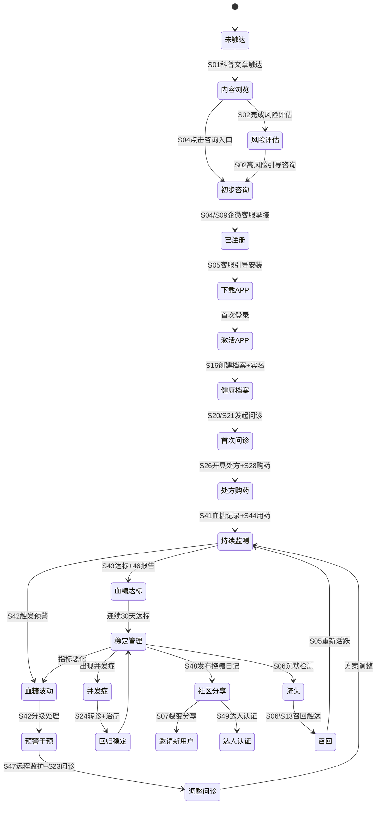
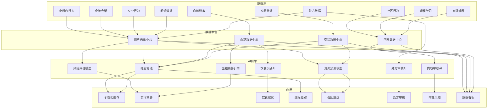

# SugarMate（糖友之家）— 脑暴确认文档 v4.1（全领域知识×全场景闭环×全专家审阅×决策确认）

> **议题**：糖友之家  
> **项目**：SugarMate（糖友之家）  
> **脑暴类型**：Planning（全领域知识深度整合×全场景闭环×全专家审阅）  
> **行业**：Medical（医疗健康×糖尿病慢病管理）  
> **版本**：v4.1（覆盖更新 v1/v2/v3/v4）  
> **状态**：✅ 9/9核心决策全部确认，可进入规划  
> **日期**：2026-07-27  

---

## 版本概要

| 版本 | 日期 | 变更摘要 |
|------|------|----------|
| v1 | 2026-07-27 | 初版，5FN，8阶段病程模型 |
| v2 | 2026-07-27 | 三端定位补充，15FN |
| v3 | 2026-07-27 | 全面重论，取消迭代边界，穷举全貌 |
| v4 | 2026-07-27 | 引入9个领域知识库+17专家×全场景五维闭环+16参与者+61场景 |
| v4.1 | 2026-07-27 | 用户确认D1-D8决策项，场景按决策调整，新增决策影响总览 |

---

## 一、领域知识引用全景（9个来源）

本次脑暴引入了平台知识库中所有与糖尿病健康平台相关的领域知识。

| 领域 | 知识文件 | 版本 | 关键引用场景 |
|------|----------|------|-------------|
| 🔴 互联网医院 | 互联网医院.yml | v1.3.0 | 在线问诊流程、处方开具/审核/流转SOP、药师独立审核、电子病历管理 |
| 🔴 互联网药店 | 互联网药店.yml | v1.2.0 | OTC分类管理、处方药专区（GSP合规）、处方外流承接、库存GSP管理 |
| 🔴 HIS系统 | HIS医院信息系统.yml | v1.0.0 | 门急诊病历同步、检查报告结构化、首诊验证、慢病病历 |
| 🔴 企业微信 | wechat-work.yml | v2.0.0 | 客户承接、标签体系、SOP话术、离职继承、客户群运营 |
| 🟡 微信支付 | wechat-pay.yml | v1.0.0 | JSAPI支付（小程序）、APP支付、退款、分账给商家 |
| 🟡 支付宝 | alipay.yml | v1.0.0 | APP支付、退款、分账 |
| 🟡 即时通信IM | 腾讯云即时通信IM.yml | v1.0.0 | 视频问诊RTC、直播群、客服IM、消息推送 |
| 🟡 点播VOD | 腾讯云点播VOD.yml | v1.0.0 | 视频课程上传/转码/播放、直播录制回放、AI审核 |
| 🟢 营销引擎 | 营销活动引擎规范.yml | — | 秒杀/拼团/砍价/满减/优惠券/A/B实验 |

---

## 二、16类参与者定义

| # | 参与者 | 角色定位 | 主要活动端 |
|----|--------|----------|-----------|
| P1 | 患者 Patient | C端核心用户，全链路唯一标识主体 | 小程序+APP |
| P2 | 医生 Doctor | 医疗服务提供者、处方开具者、远程监护人 | APP（医生端） |
| P3 | 药师 Pharmacist | 处方审核独立角色 | 后台 |
| P4 | 营养师 Nutritionist | 饮食管理与食谱设计 | APP+后台 |
| P5 | 健康管理师 HM | 慢病管理执行者、随访执行人 | APP+后台 |
| P6 | 企微客服 CS | 微信流量承接、标准化话术分诊 | 企微客户端 |
| P7 | 运营人员 Operator | 日常运营、营销活动、内容审核 | 后台 |
| P8 | 平台管理员 Admin | 系统配置、权限管理、财务结算 | 后台 |
| P9 | 合作医院 Hospital | HIS对接、首诊确认、专家支持 | HIS系统 |
| P10 | 合作药房 Pharmacy | 处方承接、配药、发货 | 药房ERP |
| P11 | OTC商家 | OTC药品入驻与经营 | 后台 |
| P12 | 器械商家 | 医疗器械入驻与经营 | 后台 |
| P13 | 食品品牌商 | 控糖食品供应 | 后台 |
| P14 | 患者家属 Family | 代理操作、预警接收 | APP |
| P15 | KOC达人 | 社区内容创作、分销推广 | APP |
| P16 | 系统 System | 自动触发、规则引擎 | 服务端 |

---

## 三、17位专家体系与分工（来源：17专家联合审阅v3.0）

### 控制层：定义医疗专业标准
| 专家 | 专业领域 | 领域知识来源 |
|------|----------|-------------|
| E1 控糖专家 | 血糖阈值标准/用药指南/达标定义 | 互联网医院·慢病管理 |
| E2 医生流程专家 | 复诊SOP/首诊合规/问诊质量 | 互联网医院·在线问诊 |
| E3 检验流程专家 | 报告解读/异常值判定/趋势分析 | HIS·检查检验 |
| E4 OTC业务专家 | OTC品种管理/库存周期/管控药品 | 互联网药店·OTC管理 |

### 设计层：落地产品架构
| 专家 | 专业领域 | 领域知识来源 |
|------|----------|-------------|
| E5 互联网医院产品专家 | 处方流转架构/问诊产品 | 互联网医院·处方流转 |
| E6 医院产品专家 | 院内院外打通/首诊衔接 | HIS·门急诊 |
| E7 商城产品专家 | 商品模型/交易/履约/售后 | 互联网药店·商品管理 |
| E8 商城专家 | 控糖食品选品/GI标准 | 互联网药店·商品分类 |

### 贯通层：打通数据闭环
| 专家 | 专业领域 | 领域知识来源 |
|------|----------|-------------|
| E9 技术架构专家 | 微服务/数据中台/可扩展 | 架构图集 |
| E10 交易专家 | 支付/退款/分账/对账 | 微信支付/支付宝 |
| E11 微信账户体系专家 | UnionID打通/隐私合规 | 企业微信·账户 |
| E12 SCRM业务专家 | 企微标签/SOP/客户生命周期 | 企业微信·SCRM |

### 追踪层：状态管理与数据追踪
| 专家 | 专业领域 | 领域知识来源 |
|------|----------|-------------|
| E13 慢病管理业务专家 | 管理计划/预警/达标追踪 | 互联网医院·慢病管理 |
| E14 电子处方业务专家 | 处方生命周期/CA签章/RxID | 互联网医院·处方流转 |
| E15 CMS专家 | 内容审核工作流/AI审核 | 点播VOD·AI审核 |
| E16 医疗器械专家 | 血糖仪/CGM数据协议标准 | HIS·设备对接 |

### 恢复层：异常补偿与商业可持续
| 专家 | 专业领域 | 领域知识来源 |
|------|----------|-------------|
| E17 商业专家 | 收入模型/成本结构/商业可持续 | 战略规划书 |
| E18 运营专家 | SOP自动化/触达引擎/召回策略 | 企业微信·SCRM |
| E19 直播政策风控专家 | 内容合规/直播审核/敏感词 | 点播VOD·AI审核 |

---

## 四、三端架构（最终确定）

```
┌──────────────────────────────────────────────────────────────────┐
│                      业务后台（运营中枢·统一能力）                    │
│  商品│订单│入驻│处方│医生│CMS│营销│SCRM│会员│看板│系统             │
│  └──────────────── 11大模块 · 全流程闭环支撑 ──────────────────┘   │
├─────────────────────┬────────────────────────────────────────────┤
│  小程序·获客前端     │          APP·商业前端                        │
│  · 健康科普直播       │  · 问诊 · 处方 · 商城 · 支付                   │
│  · 控糖食品交易       │  · 营销 · 直播 · 课程 · 社区                   │
│  · 咨询→企微         │  · 慢病管理 · 档案 · 预警 · CGM连接            │
│  · 引导APP           │  · 会员 · 消息                                │
└─────────────────────┴────────────────────────────────────────────┘
```

---

## 五、全场景×五维闭环分析

> 以下按"小程序→企微SCRM→APP问诊处方→APP商城→APP慢病管理→APP社区→APP直播课程→后台运营"组织，共 **8大业务域 × 53个关键场景**。
> 每个场景标注：触发参与者 + 闭环五维（场景S/流程F/信息I/状态T/分支E）+ 相关专家 + 领域知识引用。

---

### 5.1 小程序·获客业务域（8个场景）

---

#### 场景 S01：患者通过科普文章触达平台

| 维 | 内容 |
|----|------|
| S-触发 | 患者在微信搜索/朋友圈/社群看到糖尿病科普文章 |
| F-流程 | ①点击文章→②阅读→③底部显示"了解更多"CTA→④点击跳转科普专区→⑤浏览更多内容→⑥关注公众号/收藏小程序 |
| I-信息 | 阅读行为(WV/page_stay) → 用户画像(标签：对糖尿病关注) → 个性化内容推荐 → 后续推送匹配 |
| T-状态 | 用户状态：未触达 → 内容浏览 |
| E-分支 | ①阅读中途退出→记录退出位置下次从断点继续；②未点击CTA→3天后通过模板消息推送另一篇相关文章 |
| 专家 | E15_CMS专家(内容审核)+E18_运营专家(触达策略)+E19_风控专家(内容合规) |
| 知识库 | 点播VOD·AI审核（内容合规） |

---

#### 场景 S02：患者完成AI风险评估

| 维 | 内容 |
|----|------|
| S-触发 | 患者点击"测一测你的糖尿病风险"入口 |
| F-流程 | ①填写问卷(年龄/BMI/家族史/饮食习惯/运动频率)→②AI计算风险分数→③生成个性化风险报告→④根据风险等级推荐对应内容/服务→⑤提示"深度管理请下载APP" |
| I-信息 | 问卷答案→风险评估模型→风险等级+置信度→推荐引擎→分级内容/产品推荐 |
| T-状态 | 内容浏览 → 风险评估 |
| E-分支 | ①低风险→推荐科普+食品购买；②中风险→推荐在线问诊+下载APP；③高风险→紧急提醒+人工客服介入 |
| 专家 | E1_控糖专家(风险评估模型)+E13_慢病管理专家(分级标准)+E6_医院产品专家(高风险→首诊引导) |
| 知识库 | 互联网医院·慢病管理（风险分层标准） |

---

#### 场景 S03：患者在小程序购买控糖食品

| 维 | 内容 |
|----|------|
| S-触发 | 患者在商品详情页点击"立即购买" |
| F-流程 | ①选择规格/数量→②加入购物车(可继续逛)→③购物车→确认订单→④填写收货地址→⑤微信支付(JSAPI)→⑥支付成功→⑦订单确认页→⑧物流更新通知 |
| I-信息 | 商品SKU→订单→支付凭证→商家发货通知→物流单号→签收 |
| T-状态 | 订单：待付款→已支付→已发货→已签收 |
| E-分支 | ①库存不足→提示缺货+推荐替代品；②支付超时→自动取消+释放库存；③发起退款→退款审核→原路返回 |
| 专家 | E7_商城产品专家(交易链路)+E10_交易专家(支付退款)+E8_商城专家(GI值标注) |
| 知识库 | 微信支付·JSAPI支付+退款；互联网药店·商品分类 |

---

#### 场景 S04：患者点击咨询入口→企微客服承接

| 维 | 内容 |
|----|------|
| S-触发 | 患者在文章/商品/风险评估报告底部点击"咨询专家" |
| F-流程 | ①点击按钮→②跳转企微客服会话(首次自动发送欢迎语+SOP第一句话)→③客服按SOP询问基本信息(糖尿病类型/确诊时间/用药情况)→④打标签→⑤根据标签推荐对应服务→⑥引导下载APP |
| I-信息 | 来源页面URL→用户OpenID→会话内容→标签→客服话术记录 |
| T-状态 | 初步咨询 → 已注册(授权注册)→标签已打标 |
| E-分支 | ①用户不回复→配置48h内自动追问模板消息；②用户拒绝注册→仅保留标签不深入；③客服不在线→自动转留言+工作时间回访 |
| 专家 | E12_SCRM专家(标签体系+SOP)+E11_账户专家(UnionID打通)+E18_运营专家(转化SOP) |
| 知识库 | 企业微信·SCRM（客户标签、SOP话术、离职继承）；企业微信·账户（UnionID打通） |

---

#### 场景 S05：企微客服引导用户安装APP

| 维 | 内容 |
|----|------|
| S-触发 | 客服根据用户标签判断需引导安装APP |
| F-流程 | ①客服发送APP下载链接→②用户点击下载→③安装→④首次打开用微信授权登录→⑤自动关联企微标签→⑥进入APP首页(个性化推荐) |
| I-信息 | 客服发送链接(含归因参数source=wework&cs_id=xxx)→下载行为→安装事件→首次登录UnionID匹配→画像同步 |
| T-状态 | 已注册 → 下载APP → 激活APP |
| E-分支 | ①用户未下载→隔2天再次提醒；②已下载未注册→APP内引导微信授权登录；③已注册未创建档案→跳转档案创建引导 |
| 专家 | E11_账户专家(UnionID+Matching)+E12_SCRM专家(归因追踪)+E9_技术架构专家(归因链路) |
| 知识库 | 企业微信·账户；微信开放平台 |

---

#### 场景 S06：公众号模板消息召回沉默用户

| 维 | 内容 |
|----|------|
| S-触发 | 系统检测用户7天未访问小程序 |
| F-流程 | ①系统标记"沉默"→②匹配召回策略(最新科普/优惠券/活动)→③发送模板消息→④用户点击→⑤进入小程序→⑥更新活跃状态 |
| I-信息 | 上次访问时间→沉默阈值(7天)→用户标签→匹配策略→模板消息open_rate→回访行为 |
| T-状态 | 活跃 → 沉默 → 触达 → 回访 |
| E-分支 | ①触达未回访→加入14天二次触达；②二次仍未回访→标记为流失进入SCRM流失池 |
| 专家 | E18_运营专家(召回策略)+E12_SCRM专家(流失管理)+E17_商业专家(召回ROI) |
| 知识库 | 企业微信·SCRM（客户生命周期管理） |

---

#### 场景 S07：患者通过社群分享进入平台

| 维 | 内容 |
|----|------|
| S-触发 | 现有用户在企微社群/朋友圈分享内容/商品/活动 |
| F-流程 | ①分享→②新用户点击→③落地页展示(区分新老用户)→④新人专享优惠弹窗→⑤引导注册→⑥完成注册发放新人礼 |
| I-信息 | 分享者ID→分享内容→点击链接参数→新用户OpenID→分享者获得奖励→裂变归因 |
| T-状态 | 分享→点击→注册→双方奖励 |
| E-分支 | ①分享者已领取过此活动奖励→提示已完成；②新用户已注册过→显示正常内容不发新人礼 |
| 专家 | E18_运营专家(裂变活动)+E7_商城产品专家(新人专享)+E17_商业专家(获客成本) |
| 知识库 | 营销活动引擎规范（裂变/邀请有礼） |

---

#### 场景 S08：小程序视频号直播吸引新用户

| 维 | 内容 |
|----|------|
| S-触发 | 平台在视频号开启糖尿病专题讲座直播 |
| F-流程 | ①医生/营养师开播→②用户通过视频号/朋友圈/社群进入→③观看直播→④直播间弹窗小程序商品卡片→⑤用户点击购买→⑥直播中引导添加企微客服→⑦直播结束后沉淀回放 |
| I-信息 | 直播主题→观看人数→商品卡片点击→购买转化→添加企微按钮点击→回放存储 |
| T-状态 | 直播：预告→直播中→已结束→回放可用 |
| E-分支 | ①直播中断→自动生成回放到断点处；②违规内容→AI审核自动中断+人工复核 |
| 专家 | E19_风控专家(直播合规)+E15_CMS专家(回放管理)+E8_商城专家(带货选品) |
| 知识库 | 点播VOD·直播录制+AI审核；营销活动引擎 |

---

### 5.2 企微SCRM·承接与转化（7个场景）

---

#### 场景 S09：新用户通过企微客服创建客户档案

| 维 | 内容 |
|----|------|
| S-触发 | 用户扫码添加企微客服为好友或从小程序跳转企微会话 |
| F-流程 | ①用户添加企微客服→②自动发送欢迎语+简短问卷(联系上下文判断) →③客服按SOP询问：糖尿病类型/确诊时间/用药/目前在哪个医院看→④客服录入信息→⑤系统自动创建客户档案+标签→⑥同步到APP用户画像 |
| I-信息 | 用户微信ID→对话记录→结构化档案（类型/时间/用药/医院）→标签→APP画像同步 |
| T-状态 | 新客户→已建档（附完整标签集合） |
| E-分支 | ①用户不愿透露→标记"信息待完善"+仅留OpenID；②信息不完整→客服标记缺失字段后续追问 |
| 专家 | E12_SCRM专家(SOP+标签)+E6_医院产品专家(首诊信息)+E1_控糖专家(糖尿病分类) |
| 知识库 | 企业微信·SCRM（客户标签、SOP）；互联网医院·慢病管理（糖尿病分类） |

---

#### 场景 S10：客服根据标签推荐问诊服务

| 维 | 内容 |
|----|------|
| S-触发 | 客户标签为"1型/用药中/血糖控制不佳" |
| F-流程 | ①客服查看客户标签→②匹配推荐规则(1型+控制不佳→推荐专科医生问诊)→③发送问诊入口+医生推荐卡片→④用户点击→⑤跳转APP问诊(需APP)或H5问诊(无需APP)→⑥进入问诊 |
| I-信息 | 标签→推荐规则→推荐医生列表→点击行为→问诊入口来源 |
| T-状态 | 已建档 → 推荐问诊 → 发起问诊 |
| E-分支 | ①用户无APP→先以H5问诊+引导下载；②推荐医生无排班→推荐次优医生+预约提醒 |
| 专家 | E2_医生流程专家(推荐规则)+E5_互联网医院产品专家(问诊入口)+E12_SCRM专家(标签规则) |
| 知识库 | 互联网医院·在线问诊（医生匹配规则）；企业微信·SCRM |

---

#### 场景 S11：客户拒绝下载APP，客服采用H5兜底

| 维 | 内容 |
|----|------|
| S-触发 | 用户明确表示"不想下载APP" |
| F-流程 | ①用户拒绝→②客服标记"APP拒绝"标签→③切换H5通道(轻量版问诊/购药)→④使用H5完成服务→⑤服务完成后再次提醒"下载APP享受更多权益"→⑥记录拒绝原因 |
| I-信息 | 拒绝标签→H5使用记录→服务完成状态→二次引导转化率 |
| T-状态 | APP拒绝 → H5使用者 → 待再次引导 |
| E-分支 | ①H5体验过程中用户主动想下载→立即提供链接；②多次拒绝→降低推送频率 |
| 专家 | E9_技术架构专家(H5兜底架构)+E12_SCRM专家(客户分层)+E18_运营专家(再触达策略) |
| 知识库 | 企业微信·SCRM（客户分层） |

---

#### 场景 S12：客户群运营：定时推送控糖知识

| 维 | 内容 |
|----|------|
| S-触发 | 每日10:00系统定时推送 |
| F-流程 | ①CMS定时任务触发→②按群标签匹配内容(新糖友/老糖友/并发症群)→③企微群机器人发送消息→④用户点击/阅读→⑤群内讨论(客服引导)→⑥群活跃度统计 |
| I-信息 | 群标签→匹配内容→推送记录→阅读率→群活跃度 |
| T-状态 | 定时触发→推送→阅读/互动→活跃度更新 |
| E-分支 | ①推送失败→重试+报警；②群连续3天无互动→运营介入活跃 |
| 专家 | E15_CMS专家(内容管理)+E12_SCRM专家(群运营)+E18_运营专家(活跃策略) |
| 知识库 | 企业微信·SCRM（客户群）；点播VOD·内容管理 |

---

#### 场景 S13：标签驱动的精准营销触达

| 维 | 内容 |
|----|------|
| S-触发 | 运营配置了"未购药+血糖超标+30天内有问诊"的标签组合 |
| F-流程 | ①运营在SCRM后台配置组合标签+触达话术→②系统定时扫描匹配客户→③企微客服收到触达任务→④客服发送标准化话术→⑤用户回复→⑥客服跟进→⑦转化 |
| I-信息 | 标签组合条件→匹配用户列表→触达任务→客服执行记录→转化结果→效果统计 |
| T-状态 | 条件匹配→触达任务创建→执行→转化/未转化 |
| E-分支 | ①用户拉黑→标记"免打扰"；②触达无响应→3天后复核；③频繁触达投诉→降低频率 |
| 专家 | E12_SCRM专家(标签组合)+E18_运营专家(触达引擎)+E17_商业专家(转化ROI) |
| 知识库 | 企业微信·SCRM（标签驱动触达） |

---

#### 场景 S14：客服离职继承：客户无缝交接

| 维 | 内容 |
|----|------|
| S-触发 | A客服离职/调岗 |
| F-流程 | ①管理员在企微后台操作离职继承→②系统将A的客户分配给B→③B收到待承接客户列表→④B逐个发送问候消息(标准化话术)→⑤继承成功→⑥历史会话记录可查 |
| I-信息 | A客服ID→客户列表→分配B客服ID→继承记录→客户确认回复 |
| T-状态 | 待继承→已分配→B已打招呼→继承完成 |
| E-分支 | ①客户24h内回复→B正常对接；②客户48h未回复→系统再次提醒B；③部分客户拒绝→标记+转其他客服 |
| 专家 | E12_SCRM专家(离职继承)+E11_账户专家(客户归属) |
| 知识库 | 企业微信·SCRM（离职继承机制） |

---

#### 场景 S15：客服SOP话术自动推荐

| 维 | 内容 |
|----|------|
| S-触发 | 客服与用户对话中，系统实时分析用户意图 |
| F-流程 | ①用户发送消息→②NLP分析意图/情绪/关键词→③匹配SOP话术库→④推荐话术弹窗(客服可选择是否使用)→⑤客服发送→⑥话术使用率+转化效果记录 |
| I-信息 | 用户消息文本→NLP意图分析→匹配话术ID→话术使用记录→转化数据 |
| T-状态 | 实时分析→话术推荐→客服选择→发送→记录效果 |
| E-分支 | ①无匹配话术→记录为"话术缺口"+人工回复后回填话术库；②情绪负面→升级转人工处理 |
| 专家 | E12_SCRM专家(SOP话术)+E18_运营专家(话术效果优化) |
| 知识库 | 企业微信·SCRM（SOP话术库） |

---

### 5.3 APP·用户与档案（4个场景）

---

#### 场景 S16：新用户微信授权+创建健康档案

| 维 | 内容 |
|----|------|
| S-触发 | 用户首次打开APP |
| F-流程 | ①欢迎页→②微信授权登录→③获取UnionID→④匹配企微已有标签→⑤引导创建健康档案：糖尿病类型→确诊时间→身高体重→用药史→⑥绑定首诊医院(可选)→⑦实名认证(身份证+人脸)→⑧档案创建完成 |
| I-信息 | 微信UnionID→企微标签→健康档案字段→实名认证记录→HIS绑定 |
| T-状态 | 未激活→已登录→档案创建中→档案完整 |
| E-分支 | ①已有标签匹配到用户→预填部分档案信息；②无标签→全新填写；③实名认证失败→引导人工审核；④跳过绑定医院→可后续补充 |
| 专家 | E11_账户专家(UnionID打通)+E6_医院产品专家(HIS绑定)+E1_控糖专家(档案字段) |
| 知识库 | 互联网医院·电子病历管理；HIS·门急诊数据 |

---

#### 场景 S17：添加家庭成员代理管理

| 维 | 内容 |
|----|------|
| S-触发 | 用户点击"我的家人"→"添加家庭成员" |
| F-流程 | ①点击添加→②选择关系(父母/配偶/子女)→③输入成员基本信息→④成员授权确认(本人需微信授权或短信验证)→⑤创建子档案→⑥用户可切换身份查看/管理家人数据 |
| I-信息 | 主账户ID→关系→成员信息→子档案ID→授权记录→身份切换记录 |
| T-状态 | 无家庭成员→添加中→待授权→已授权 |
| E-分支 | ①成员拒绝授权→仅记录基本信息不做医疗操作；②成员已有独立账户→关联合并而非新建 |
| 专家 | E1_控糖专家(老人管理)+E11_账户专家(多账户关联) |
| 知识库 | 互联网医院·电子病历管理（家庭成员关联） |

---

#### 场景 S18：绑定首诊医院同步病历

| 维 | 内容 |
|----|------|
| S-触发 | 用户点击"绑定首诊医院" |
| F-流程 | ①搜索医院名称→②选择医院→③输入在医院的患者ID/就诊卡号→④发起HIS数据同步请求→⑤HIS验证匹配→⑥拉取近期病历摘要→⑦在APP档案中展示 |
| I-信息 | 医院编码→患者ID→HIS匹配验证→病历数据→结构化存储→APP档案展示 |
| T-状态 | 未绑定→绑定中→验证中→同步成功 |
| E-分支 | ①医院不支持该HIS→提示手动上传报告；②匹配失败→提示检查患者ID；③数据协议不兼容→降级为手动录入 |
| 专家 | E6_医院产品专家(HIS对接)+E9_技术架构专家(数据协议)+E3_检验流程专家(数据校验) |
| 知识库 | HIS·门急诊数据（病历同步）；HIS·检查检验（报告结构化） |

---

#### 场景 S19：实名认证（处方合规前置）

| 维 | 内容 |
|----|------|
| S-触发 | 用户首次使用问诊/购处方药等功能 |
| F-流程 | ①触发实名认证要求→②输入姓名+身份证号→③人脸识别→④公安库比对→⑤认证通过→⑥标记"已实名"→⑦解锁处方类功能 |
| I-信息 | 姓名+身份证号→人脸照片→公安库比对结果→认证标记 |
| T-状态 | 未实名→认证中→已实名 |
| E-分支 | ①人脸不通过→提供人工审核通道(身份证正反面)；②多次失败→限制当日重试次数 |
| 专家 | E14_电子处方专家(处方合规)+E11_账户专家(实名认证) |
| 知识库 | 互联网医院·在线问诊（身份验证合规）；互联网药店·处方药专区（实名购药要求） |

---

### 5.4 APP·在线问诊（6个场景）

---

#### 场景 S20：患者选择医生并发起图文问诊

| 维 | 内容 |
|----|------|
| S-触发 | 患者点击"在线问诊" |
| F-流程 | ①选择科室(内分泌科)→②浏览医生列表(职称/评分/擅长/价格)→③选择医生→④选择问诊类型(图文/视频)→⑤支付问诊费→⑥填写病情描述+上传图片(检测报告/血糖记录)→⑦提交→⑧等待医生接诊→⑨医生接诊→⑩图文对话交流→⑪问诊结束→⑫评价 |
| I-信息 | 医生ID→问诊订单→病情描述+附件→对话记录→诊断结论/建议 |
| T-状态 | 待支付→待接诊→问诊中→已完成→已评价 |
| E-分支 | ①医生24h未接诊→自动退款+推荐其他医生；②问诊中医生离线→延长有效期；③图文信息不足→医生建议切换视频问诊 |
| 专家 | E2_医生流程专家(接诊SOP)+E5_互联网医院产品专家(问诊产品)+E10_交易专家(退款) |
| 知识库 | 互联网医院·在线问诊（接诊SOP+质控标准） |

---

#### 场景 S21：视频问诊（实时音视频）

| 维 | 内容 |
|----|------|
| S-触发 | 患者选择视频问诊或在图文问诊中医生建议切换 |
| F-流程 | ①选择视频问诊→②预约医生排班时间→③支付→④到预约时间→⑤进入视频房间(腾讯云TRTC)→⑥医生与患者实时交流→⑦医生可共享屏幕展示检验报告→⑧问诊结束→⑨评价 |
| I-信息 | 预约时间→视频房间ID→RTC流→对话记录(语音转文字)→诊断结论 |
| T-状态 | 待预约→已预约→待开始→进行中→已完成 |
| E-分支 | ①网络差→自动降画质+提示切换图文；②医生迟到5min→自动提醒+超过15min退款；③一方掉线→3min内重连 |
| 专家 | E2_医生流程专家(视频问诊规范)+E5_互联网医院产品专家(音视频)+E9_技术架构专家(RTC) |
| 知识库 | 腾讯云即时通信IM·视频通话(TRTC)；互联网医院·在线问诊 |

---

#### 场景 S22：AI预问诊辅助医生决策

| 维 | 内容 |
|----|------|
| S-触发 | 患者提交问诊时系统自动启动 |
| F-流程 | ①患者填完病情描述→②AI预问诊引擎分析(症状提取/关键指标/用药史交叉)→③生成结构化预问诊报告(疑似问题+建议检查+优先级标记)→④推送至医生端(接诊前查看)→⑤医生参考加速诊断→⑥减轻医生重复问基础信息的工作量 |
| I-信息 | 病情自然语言→症状实体提取→关联档案数据→预问诊报告→医生诊断→AI辅助评分 |
| T-状态 | 问诊提交→AI分析→报告生成→医生查看→辅助诊断 |
| E-分支 | ①AI分析置信度低→提示医生重点关注；②症状关键信息缺失→AI追问补全 |
| 专家 | E2_医生流程专家(诊断流程)+E5_互联网医院产品专家(AI辅助)+E1_控糖专家(关键指标) |
| 知识库 | 互联网医院·在线问诊（智能预问诊） |

---

#### 场景 S23：问诊后患者评价与质控

| 维 | 内容 |
|----|------|
| S-触发 | 问诊结束后系统自动推送评价邀请 |
| F-流程 | ①问诊结束→②推送评价卡片(评分1-5+标签+文字)→③患者评价→④低分评价(≤2分)→自动触发质控工单→⑤质控审核对话记录→⑥确认问题(态度/专业/时效)→⑦处理(警告/培训/下架) |
| I-信息 | 评价分数→标签→文字→质控工单→审核结论→处理记录 |
| T-状态 | 待评价→已评价→(低分)质控中→已处理 |
| E-分支 | ①患者未评价→7天后默认好评；②争议评价→升级人工仲裁 |
| 专家 | E2_医生流程专家(质控标准)+E5_互联网医院产品专家(评价体系) |
| 知识库 | 互联网医院·在线问诊（问诊质控体系） |

---

#### 场景 S24：问诊转诊（需要线下进一步检查）

| 维 | 内容 |
|----|------|
| S-触发 | 医生判断患者需要线下检查(如糖化血红蛋白/眼底检查) |
| F-流程 | ①医生诊断→②"建议线下进一步检查"→③推荐附近合作医院+检查项目→④患者确认→⑤系统生成检查建议单→⑥患者到院检查→⑦HIS同步结果→⑧患者可再次线上问诊解读报告 |
| I-信息 | 检查项目推荐→合作医院列表→检查建议单→到院记录→HIS报告回传 |
| T-状态 | 问诊中→转诊建议→待检查→报告回传→复诊 |
| E-分支 | ①患者拒绝线下→医生出具保守方案；②附近无合作医院→患者自行选择+手动上传报告 |
| 专家 | E2_医生流程专家(转诊标准)+E6_医院产品专家(院院协作)+E3_检验流程专家(检查项目) |
| 知识库 | HIS·门急诊（线下检查）；互联网医院·在线问诊 |

---

#### 场景 S25：紧急情况电话介入

| 维 | 内容 |
|----|------|
| S-触发 | 患者描述中出现紧急关键词(酮症酸中毒/低血糖昏迷等) |
| F-流程 | ①NLP识别紧急关键词→②标记最高优先级→③立即通知医生→④医生确认紧急→⑤系统拨打患者电话(腾讯云语音通知)→⑥医生电话指导(立即就医)→⑦同步通知紧急联系人 |
| I-信息 | 紧急关键词→优先级标记→电话呼叫记录→处理结果→紧急联系人通知 |
| T-状态 | 识别紧急→优先级升级→电话介入→已处理 |
| E-分支 | ①电话无人接听→通知紧急联系人+客服持续跟进；②误判→医生可标记"非紧急" |
| 专家 | E2_医生流程专家(紧急处置)+E5_互联网医院产品专家(风险管控)+E1_控糖专家(紧急指标) |
| 知识库 | 互联网医院·在线问诊（紧急情况处置SOP） |

---

### 5.5 APP·电子处方（7个场景）

---

#### 场景 S26：医生在线开具电子处方

| 维 | 内容 |
|----|------|
| S-触发 | 医生诊断后认为需要开具处方 |
| F-流程 | ①医生在问诊界面点击"开具处方"→②选择药品(通用名/商品名/规格/用法用量)→③填写诊断+用药天数→④确认处方→⑤调用CA签章→⑥处方提交→⑦进入药师审核队列→⑧审核通过/驳回→⑨通过后生成RxID流转至合作药房 |
| I-信息 | 药品信息→诊断→用法用量→CA签名→RxID→审核记录→流转药房 |
| T-状态 | 问诊中→处方开具→待审核→审核中→已通过/已驳回→已流转 |
| E-分支 | ①药品不在合作药房目录→提示医生修改或建议替代；②CA签章失败→重试+记录 |
| 专家 | E14_电子处方专家(处方生命周期)+E2_医生流程专家(开方规范)+E1_控糖专家(用药合理性) |
| 知识库 | 互联网医院·电子处方（RxID生成、CA签章、流转）；互联网药店·处方流转 |

---

#### 场景 S27：药师审核处方

| 维 | 内容 |
|----|------|
| S-触发 | 医生提交处方，进入审核队列 |
| F-流程 | ①药师登录后台→②审核队列(待审核新处方)→③查看处方详情(患者/药品/诊断/用量)→④四查十对：查药品/配伍禁忌/用法用量/用药合理性/过敏史→⑤审核结论(通过/驳回/建议修改)→⑥通过→自动签名→流转；驳回→标注原因→退回医生 |
| I-信息 | 处方详情→审核记录→审核人+时间→通过/驳回原因→医生修改→重新审核 |
| T-状态 | 待审核→审核中→已通过/已驳回→(驳回)待修改→重新提交→重新审核 |
| E-分支 | ①处方超用量→驳回+建议修改剂量；②患者有过敏史→驳回+建议换药 |
| 专家 | E14_电子处方专家(审核SOP)+E4_OTC专家(用药知识)+E1_控糖专家(降糖药合理使用) |
| 知识库 | 互联网医院·处方审核（四查十对标准）；互联网药店·GSP合规 |

---

#### 场景 S28：处方流转至合作药房+用户购药

| 维 | 内容 |
|----|------|
| S-触发 | 处方审核通过，RxID生成 |
| F-流程 | ①RxID流转至合作药房ERP→②药房接单→③确认库存→④用户收到推送"处方已就绪，请购药"→⑤用户确认购药→⑥支付→⑦药房配药→⑧发货→⑨用户收货→⑩用药提醒启动 |
| I-信息 | RxID→药房接单确认→库存校验→支付→物流→收货→用药计划 |
| T-状态 | 待流转→已接单→待支付→配药中→已发货→已收货→用药中 |
| E-分支 | ①首选药房无库存→自动流转到次选药房；②用户拒绝当前药房→自选药房；③24h未支付→提醒+48h自动取消 |
| 专家 | E14_电子处方专家(RxID流转)+E7_商城产品专家(购药链路)+E10_交易专家(支付) |
| 知识库 | 互联网药店·处方流转（药房承接SOP）；微信支付·支付 |

---

#### 场景 S29：一键续方（复诊快速续方）

| 维 | 内容 |
|----|------|
| S-触发 | 患者处方到期/用完，触发续方 |
| F-流程 | ①系统检测处方到期→②推送续方提醒→③患者点击"一键续方"→④系统展示上次处方详情→⑤患者确认(同药同量)→⑥快速生成新处方→⑦医生快速审核(复用上次诊断)→⑧审核通过→⑨流转购药 |
| I-信息 | 历史处方→续方请求→快速审核→新处方(RxID-NEW)→购买 |
| T-状态 | 处方到期→续方请求→快速审核→新处方生成→购买 |
| E-分支 | ①病情有变化→不适用一键续方，需重新问诊；②药物调整→医生手动修改后走正常流程 |
| 专家 | E14_电子处方专家(续方规则)+E2_医生流程专家(续方审核标准) |
| 知识库 | 互联网医院·电子处方（续方机制） |

---

#### 场景 S30：PASS前置审方拦截不合理处方

| 维 | 内容 |
|----|------|
| S-触发 | 处方提交后触发PASS前置审方 |
| F-流程 | ①处方提交→②PASS系统自动审核(药物相互作用/禁忌症/超剂量/重复用药)→③通过→进入药师审核；不通过→④标注原因+风险等级→⑤退回医生→⑥医生修改/申诉→⑦重新进入审核 |
| I-信息 | 处方药品→PASS审核结果→风险等级→拦截原因→医生修正→重新审核 |
| T-状态 | 提交→PASS审核→(拦截)待修改→重新提交→(通过)药师审核 |
| E-分支 | ①医生申诉→高级审核员人工判断；②高风险→自动拒绝不可申诉 |
| 专家 | E14_电子处方专家(PASS对接)+E4_OTC专家(药物知识)+E1_控糖专家(安全阈值) |
| 知识库 | 互联网医院·处方审核（PASS前置审方机制） |

---

#### 场景 S31：处方用完后用药提醒

| 维 | 内容 |
|----|------|
| S-触发 | 系统按处方天数倒计时，药品用完前3天 |
| F-流程 | ①系统计算药品预计用完日→②提前3天推送提醒"您的XX药品即将用完"→③附续方/购药入口→④患者操作→⑤用完日仍未操作→再次提醒+标记需跟进→⑥客服或HM跟进 |
| I-信息 | 处方药品+用量→每日扣减→预估用完日→提醒推送→用户操作 |
| T-状态 | 用药中→即将用完→到期→未续方|
| E-分支 | ①患者已从其他渠道购药→标记"自行解决"；②连续2次未续方→升级为健康管理师介入 |
| 专家 | E13_慢病管理专家(用药追踪)+E18_运营专家(触达策略) |
| 知识库 | 互联网医院·慢病管理（用药依从性管理） |

---

#### 场景 S32：处方合规审计

| 维 | 内容 |
|----|------|
| S-触发 | 定期批量审计/监管部门抽查 |
| F-流程 | ①审计任务创建→②按条件筛选处方(时间段/医生/药品)→③逐项审计(诊断与用药匹配/CA签章完整/药师审核记录/RxID流转完整/患者实名)→④生成审计报告→⑤问题处方→追溯责任人→⑥整改→⑦归档 |
| I-信息 | 处方全生命周期数据→审计规则→审计结论→整改记录→归档 |
| T-状态 | 已归档→审计中→问题标记→整改→重新归档 |
| E-分支 | ①严重违规→监管上报+医生下架；②CA签章异常→技术排查 |
| 专家 | E14_电子处方专家(合规审计)+E11_账户专家(实名记录) |
| 知识库 | 互联网医院·处方合规；互联网药店·GSP合规 |

---

### 5.6 APP·综合商城（8个场景）

---

#### 场景 S33：患者浏览与搜索控糖食品

| 维 | 内容 |
|----|------|
| S-触发 | 患者进入商城首页 |
| F-流程 | ①首页展示个性化推荐(基于档案+血糖+购买历史)→②分类浏览(控糖食品/OTC/器械/处方药)→③搜索(支持按GI值/碳水/品牌筛选)→④商品列表→⑤商品详情(GI值标注+营养标签+糖友评价)→⑥收藏/加购 |
| I-信息 | 用户画像→推荐算法→商品展示→搜索关键词→筛选条件→浏览→收藏/加购 |
| T-状态 | 浏览→详情→收藏/加购 |
| E-分支 | ①搜索无结果→推荐近似商品；②商品缺货→显示"到货通知" |
| 专家 | E7_商城产品专家(商品搜索)+E8_商城专家(GI值筛选)+E1_控糖专家(GI值标准) |
| 知识库 | 互联网药店·商品分类（GI值标注规范）；营销活动引擎（推荐算法） |

---

#### 场景 S34：购买处方药（处方校验+审核）

| 维 | 内容 |
|----|------|
| S-触发 | 患者在处方药专区选择药品 |
| F-流程 | ①选择处方药→②触发处方校验(关联有效处方)→③有处方→展示用药建议→④加购→⑤购物车处方药独立分区→⑥下单时再次校验处方有效性→⑦支付→⑧后台药师再次复核→⑨发货 |
| I-信息 | 药品ID→有效处方ID→处方药品匹配→支付→药师复核→发货 |
| T-状态 | 选药→处方校验→(通过)下单→支付→复核→发货 |
| E-分支 | ①无有效处方→引导在线问诊开方；②处方药品不匹配→提示"药品与处方不一致"；③复核不通过→退款+原因说明 |
| 专家 | E14_电子处方专家(处方校验)+E7_商城产品专家(处方药专区)+E4_OTC专家(处方药管理) |
| 知识库 | 互联网药店·处方药专区（GSP合规+处方药销售规范） |

---

#### 场景 S35：购物车多品类合并下单

| 维 | 内容 |
|----|------|
| S-触发 | 用户从购物车点击"去结算" |
| F-流程 | ①系统检测购物车商品类型→②处方药→独立校验处方有效性→③OTC+食品+器械→正常下单→④拆分订单(处方药独立一单，其余合并)→⑤分别支付(处方药一单，其余合并支付)→⑥分别流转 |
| I-信息 | 商品类型检测→订单拆分→支付分流→不同履约通道 |
| T-状态 | 购物车→类型检测→订单拆分→分单支付→分单履约 |
| E-分支 | ①处方药校验失败→该品从结算中移除+提示；②合并订单中部分商品缺货→可部分取消 |
| 专家 | E7_商城产品专家(混合订单)+E10_交易专家(分单支付)+E14_电子处方专家(处方校验) |
| 知识库 | 互联网药店·商品管理（品类隔离） |

---

#### 场景 S36：限时秒杀活动

| 维 | 内容 |
|----|------|
| S-触发 | 运营配置了秒杀活动，用户看到秒杀入口 |
| F-流程 | ①秒杀活动开始→②用户进入秒杀页面→③查看秒杀商品(倒计时+限量)→④点击购买→⑤校验库存+每人限购数→⑥支付→⑦秒杀成功/失败 |
| I-信息 | 秒杀商品配置→库存预热→限购校验→订单→秒杀结果 |
| T-状态 | 活动预告→进行中→抢购→成功/失败 |
| E-分支 | ①库存抢完→显示"已抢光"+推荐替代品；②超限购→提示已达上限；③支付超时→释放库存 |
| 专家 | E7_商城产品专家(秒杀系统)+E10_交易专家(高并发支付)+E18_运营专家(秒杀策略) |
| 知识库 | 营销活动引擎（秒杀规则+限购） |

---

#### 场景 S37：优惠券领取与核销

| 维 | 内容 |
|----|------|
| S-触发 | 用户在领券中心/活动页/推送消息中获取优惠券 |
| F-流程 | ①用户领取→②优惠券入库→③下单时自动匹配最优券→④核销(订单金额满足门槛)→⑤优惠金额分摊→⑥支付(使用优惠后金额)→⑦券状态更新 |
| I-信息 | 券批次→领取记录→下单时匹配→核销→分摊→券状态 |
| T-状态 | 待领取→已领取→已核销/已过期 |
| E-分支 | ①不满足满减门槛→提示还需XX元；②券已过期→推荐其他可用券；③退货→券按比例退回 |
| 专家 | E7_商城产品专家(优惠券系统)+E10_交易专家(优惠分摊)+E18_运营专家(发券策略) |
| 知识库 | 营销活动引擎（优惠券规则+核销） |

---

#### 场景 S38：拼团购买医疗器械

| 维 | 内容 |
|----|------|
| S-触发 | 用户看到拼团商品，点击"发起拼团" |
| F-流程 | ①用户开团→②支付拼团价→③生成拼团链接→④分享至微信/社群→⑤好友参团→⑥团满→⑦全部发货；团不满→⑧到期自动退款 |
| I-信息 | 团信息→参团记录→成团/未成团→发货/退款 |
| T-状态 | 拼团中→已成团→已发货 / 未成团→已退款 |
| E-分支 | ①用户24h内补位→自动成团；②分享链接失效→系统自动匹配匿名团 |
| 专家 | E7_商城产品专家(拼团系统)+E18_运营专家(拼团策略)+E17_商业专家(获客成本) |
| 知识库 | 营销活动引擎（拼团规则） |

---

#### 场景 S39：退款/退货处理

| 维 | 内容 |
|----|------|
| S-触发 | 用户发起退款/退货申请 |
| F-流程 | ①用户选择订单→②选择退款原因→③上传凭证→④提交→⑤商家审核→⑥同意→⑦退款(微信/支付宝原路返回)/退货(用户寄回→商家收货→退款)→⑧拒绝→用户可申诉 |
| I-信息 | 订单ID→退款原因→凭证→审核结果→退款流水→退货物流→最终退款 |
| T-状态 | 待审核→已同意(待退货)→已退款/已拒绝→(申诉)平台介入 |
| E-分支 | ①处方药不支持退货→仅退款(未发货)/不支持(已发货)；②食品已拆封→不支持退货 |
| 专家 | E7_商城产品专家(售后系统)+E10_交易专家(退款流程)+E4_OTC专家(药品退货政策) |
| 知识库 | 互联网药店·商品售后（药品退货限制）；微信支付·退款/支付宝·退款 |

---

#### 场景 S40：积分商城兑换

| 维 | 内容 |
|----|------|
| S-触发 | 患者有积分余额，进入积分商城 |
| F-流程 | ①积分来源(签到/消费/任务/社区)→②积分余额→③积分商城商品(试纸/代餐小样/优惠券)→④选择兑换→⑤确认扣减积分→⑥生成0元订单/优惠券发放→⑦积分余额更新 |
| I-信息 | 积分来源→积分余额→兑换商品→积分扣减→订单/券发放→积分变动记录 |
| T-状态 | 浏览→兑换确认→扣减→完成 |
| E-分支 | ①积分不足→提示还差XX积分+推荐获取积分任务；②库存不足→到货提醒 |
| 专家 | E7_商城产品专家(积分系统)+E18_运营专家(积分策略) |
| 知识库 | 营销活动引擎（积分规则） |

---

### 5.7 APP·慢病管理核心（7个场景）

---

#### 场景 S41：血糖数据录入（手动+CGM自动同步）

| 维 | 内容 |
|----|------|
| S-触发 | 患者测量血糖后录入/设备自动上传 |
| F-流程 | ①手动：点击"+记录血糖"→选择时间点(空腹/早餐后/午餐前/午餐后/晚餐前/晚餐后/睡前)→输入数值→保存；②CGM：APP蓝牙扫描设备→配对→读取数据→转换为标准格式→每5min自动更新 |
| I-信息 | 血糖值+测量时间点+记录方式(手动/设备)→标准化存储→趋势计算 |
| T-状态 | 血糖记录：新增→存储→纳入趋势 |
| E-分支 | ①CGM连接断开→提示重新连接+断点数据补传；②异常高/低值→立即触发预警(见S42)；③数据上传失败→本地缓存+重试 |
| 专家 | E16_医疗器械专家(CGM协议)+E13_慢病管理专家(血糖管理)+E1_控糖专家(阈值设定) |
| 知识库 | HIS·设备对接（血糖数据协议）；互联网医院·慢病管理（血糖监测标准） |

---

#### 场景 S42：血糖异常预警

| 维 | 内容 |
|----|------|
| S-触发 | 血糖值超出预设安全范围 |
| F-流程 | ①血糖值进入系统→②预警引擎判断(高血糖>13.9/低血糖<3.9/连续2天超标)→③触发预警→④APP推送+短信(严重时)→⑤通知紧急联系人→⑥通知绑定医生/健康管理师→⑦在APP档案中标记预警事件→⑧提供处理建议→⑨未处理持续升级 |
| I-信息 | 血糖值→预警规则→预警等级(黄/橙/红)→推送记录→预警确认/未确认→升级记录 |
| T-状态 | 正常→预警触发→已通知→已确认/未确认→(未确认)升级→已处理 |
| E-分支 | ①低血糖→立即推送+短信+紧急联系人+120建议；②夜间预警→震动+闪光灯勿扰模式突破；③用户30min内确认→降级；④用户未确认→升级至医生+健康管理师主动联系 |
| 专家 | E13_慢病管理专家(预警规则)+E1_控糖专家(阈值分级)+E16_医疗器械专家(数据准确性) |
| 知识库 | 互联网医院·慢病管理（预警等级体系） |

---

#### 场景 S43：个性化达标计划设定与追踪

| 维 | 内容 |
|----|------|
| S-触发 | 患者创建档案后，系统推荐达标计划 |
| F-流程 | ①系统根据档案(年龄/类型/病程/用药/当前血糖)→②生成推荐达标计划(空腹目标/餐后目标/糖化目标/周运动量/日碳水摄入)→③医生/HM审核调整→④患者确认→⑤每日追踪：自动对比实际值与目标值→⑥达标→庆祝+奖励积分；未达标→调整建议 |
| I-信息 | 档案数据→达标模型→计划→每日实际值→达标率→调整建议 |
| T-状态 | 计划生成→待确认→执行中→(每日)达标/未达标→计划到期→重新评估 |
| E-分支 | ①患者长期未达标→HM介入调整；②患者自我调整→记录变更原因 |
| 专家 | E13_慢病管理专家(达标模型)+E1_控糖专家(个体化目标)+E18_运营专家(激励机制) |
| 知识库 | 互联网医院·慢病管理（达标管理+个体化方案） |

---

#### 场景 S44：用药提醒与打卡

| 维 | 内容 |
|----|------|
| S-触发 | 系统根据处方/用药计划生成提醒 |
| F-流程 | ①根据处方生成用药计划(药品/剂量/频次/时段)→②到时间推送提醒→③患者点击"已服药"打卡→④记录服药时间+药品→⑤漏服→记录漏服+推迟提醒→⑥连续漏服→升级提醒(HM关注) |
| I-信息 | 用药计划→提醒推送→打卡记录/漏服记录→用药依从率统计 |
| T-状态 | 待服药→已提醒→已打卡/已漏服→(连续漏服)升级 |
| E-分支 | ①患者外出→支持"稍后提醒"；②药品更换→医生调整后用药计划自动更新；③副作用→患者可反馈不适 |
| 专家 | E13_慢病管理专家(用药依从性)+E1_控糖专家(用药方案)+E14_电子处方专家(用药计划) |
| 知识库 | 互联网医院·慢病管理（用药依从性管理） |

---

#### 场景 S45：饮食记录与AI建议

| 维 | 内容 |
|----|------|
| S-触发 | 患者餐前/餐后记录饮食 |
| F-流程 | ①拍照识别：拍摄餐食→AI识别食物种类+分量→估算碳水+热量→②手动录入：搜索食物名称→选择分量→③记录后关联血糖变化(餐后2h)→④AI分析(哪些食物导致血糖波动大)→⑤个性化饮食建议→⑥推荐控糖食谱 |
| I-信息 | 食物图片→AI识别→成分估算→饮食记录→餐后血糖关联→分析结果→饮食建议 |
| T-状态 | 记录→AI分析→关联血糖→生成建议 |
| E-分支 | ①AI识别不准确→用户手动修正；②某食物反复导致血糖飙升→红牌警告 |
| 专家 | E13_慢病管理专家(饮食管理)+E8_商城专家(控糖食品)+E1_控糖专家(碳水标准) |
| 知识库 | 互联网医院·慢病管理（饮食管理指南）；互联网药店·控糖食品（GI值标准） |

---

#### 场景 S46：周/月健康报告

| 维 | 内容 |
|----|------|
| S-触发 | 每周日/每月1日系统自动生成 |
| F-流程 | ①系统汇总本周/月数据(血糖均值/波动/DTR/达标天数/用药依从率/运动量/饮食)→②生成可视化报告(趋势图+评分+对比上周期+建议)→③推送通知→④患者查看→⑤可分享给医生/家属→⑥医生/HM看到后给出点评 |
| I-信息 | 多维度数据聚合→评分模型→报告生成→推送→分享→医生点评 |
| T-状态 | 数据累计→周期到达→报告生成→已推送→已查看→已分享 |
| E-分支 | ①数据不足→标记"数据不完整"+鼓励多记录；②指标恶化→报告附带红色预警+强化管理建议 |
| 专家 | E13_慢病管理专家(报告标准)+E1_控糖专家(评价指标)+E3_检验流程专家(趋势解读) |
| 知识库 | 互联网医院·慢病管理（健康报告）；HIS·检查检验（指标解读） |

---

#### 场景 S47：医生远程监护患者血糖

| 维 | 内容 |
|----|------|
| S-触发 | 患者授权医生查看血糖数据后，医生主动/被动查看 |
| F-流程 | ①患者授权(长期)→②医生端显示授权患者列表→③医生点击查看血糖趋势+饮食+用药→④医生发现异常→⑤远程留言/发起问诊→⑥调整用药方案→⑦患者接收→⑧更新达标计划 |
| I-信息 | 授权关系→血糖数据共享→医生查看记录→远程建议→方案调整→患者确认 |
| T-状态 | 已授权→医生查看→建议已发送→患者已确认→方案已更新 |
| E-分支 | ①患者未授权→医生无法查看；②患者撤销授权→立即停止数据共享 |
| 专家 | E13_慢病管理专家(远程监护)+E2_医生流程专家(远程调整)+E1_控糖专家(方案调整标准) |
| 知识库 | 互联网医院·慢病管理（远程监护体系） |

---

### 5.8 APP·患者社区（4个场景）

---

#### 场景 S48：患者发布控糖日记

| 维 | 内容 |
|----|------|
| S-触发 | 患者点击"发布控糖日记" |
| F-流程 | ①选择发布类型(饮食/运动/血糖/心得)→②编写内容+配图→③可关联当日血糖数据→④发布→⑤系统内容审核(AI+人工)→⑥审核通过→展示在社区→⑦其他用户互动(点赞/评论/收藏) |
| I-信息 | 内容+图片→关联血糖→审核结果→发布时间→互动数据 |
| T-状态 | 编辑→待审核→已发布/已驳回→互动中 |
| E-分支 | ①内容违规(AI)→自动驳回+B提示原因；②含医疗建议→人工复核后决定 |
| 专家 | E15_CMS专家(内容审核)+E19_风控专家(医疗内容合规)+E13_慢病管理专家(内容真实性) |
| 知识库 | 点播VOD·AI审核（内容合规）；互联网医院·内容管理 |

---

#### 场景 S49：控糖达人认证与权益

| 维 | 内容 |
|----|------|
| S-触发 | 用户满足达人条件(血糖达标30天+发帖10篇+获赞500+实名认证) |
| F-流程 | ①系统自动检测→②达标推送"恭喜获得控糖达人认证"→③用户接受→④发放达人标识+专属权益(商品折扣/问诊券/专属活动)→⑤达人可在社区显示认证标识→⑥达人内容获得加权曝光 |
| I-信息 | 达标检测→认证邀请→接受→标识+权益→内容加权 |
| T-状态 | 普通用户→候选达人→已认证→享有权益 |
| E-分支 | ①条件不满足→显示进度条+鼓励完成；②达人违规→降级/取消认证 |
| 专家 | E18_运营专家(达人体系)+E15_CMS专家(内容加权)+E17_商业专家(达人价值) |
| 知识库 | 营销活动引擎（达人分级激励） |

---

#### 场景 S50：专家入驻社区答疑

| 维 | 内容 |
|----|------|
| S-触发 | 平台邀请/专家申请入驻社区答疑 |
| F-流程 | ①专家收到邀请/提交申请→②资质审核(执业证+擅长领域)→③审核通过→④开通答疑专区→⑤系统标记"专家"标识→⑥患者可在专区内向该专家提问→⑦专家解答→⑧优质回答被精选+推荐 |
| I-信息 | 专家资质→审核结果→答疑专区→问答内容→精选+推荐 |
| T-状态 | 待审核→已入驻→答疑中→精选回答 |
| E-分支 | ①专家超时未回复→系统退回问题+推荐其他专家；②回答质量低→运营降权 |
| 专家 | E2_医生流程专家(答疑标准)+E15_CMS专家(内容管理)+E18_运营专家(专家运营) |
| 知识库 | 互联网医院·在线问诊（医生资质审核） |

---

#### 场景 S51：社区内容违规处理与申诉

| 维 | 内容 |
|----|------|
| S-触发 | 用户内容被驳回/举报 |
| F-流程 | ①内容被AI审核驳回/被其他用户举报→②用户收到通知→③用户可查看违规原因→④申诉通道：提交申诉理由→⑤人工复核→⑥维持/撤销→⑦撤销则恢复展示 |
| I-信息 | 违规内容→驳回原因→申诉理由→复核结论→最终状态 |
| T-状态 | 已驳回→申诉中→复核中→维持/撤销→(撤销)恢复 |
| E-分支 | ①恶意举报→举报者被降低信用分；②多次违规→限制发帖权限 |
| 专家 | E15_CMS专家(审核工作流)+E19_风控专家(违规判定)+E11_账户专家(信用体系) |
| 知识库 | 点播VOD·AI审核 |

---

### 5.9 APP·直播与课程（4个场景）

---

#### 场景 S52：医生直播讲座+带货

| 维 | 内容 |
|----|------|
| S-触发 | 医生/营养师开播 |
| F-流程 | ①运营创建直播间→②配置商品卡片(控糖食品/血糖仪/试纸)→③医生开播→④患者进入观看→⑤医生科普+实物展示→⑥弹幕互动→⑦商品卡片弹出→⑧患者点击购买→⑨直播结束生成回放→⑩AI审核 |
| I-信息 | 直播配置→实时流→观看数据→商品卡片点击→购买订单→回放存储→审核 |
| T-状态 | 预告→直播中→已结束→回放可用→已审核 |
| E-分支 | ①直播中断→开启断点续播或仅保留回放；②违规内容→AI实时检测+自动中断；③商品售罄→即时下架卡片 |
| 专家 | E19_风控专家(直播合规)+E15_CMS专家(直播管理)+E8_商城专家(直播选品)+E7_商城产品专家(直播带货) |
| 知识库 | 点播VOD·直播录制+AI审核；腾讯云即时通信IM·直播群 |

---

#### 场景 S53：视频课程学习

| 维 | 内容 |
|----|------|
| S-触发 | 患者进入课程板块 |
| F-流程 | ①浏览课程列表(饮食/运动/用药/监测/并发症)→②选择课程→③进入课程详情→④开始学习→⑤视频播放(腾讯云VOD)→⑥章节切换→⑦完成学习→⑧课后测验(可选)→⑨获得学习积分→⑩推荐下一课 |
| I-信息 | 课程列表→学习进度→播放记录→测验成绩→积分→推荐课程 |
| T-状态 | 未学习→学习中→已完成→已测验 |
| E-分支 | ①播放卡顿→自动切换清晰度；②中断学习→下次从断点继续；③测验不合格→推荐重学相关章节 |
| 专家 | E15_CMS专家(课程管理)+E13_慢病管理专家(课程内容)+E18_运营专家(学习激励) |
| 知识库 | 腾讯云点播VOD·视频上传+转码+播放 |

---

#### 场景 S54：课程学习进度追踪与激励

| 维 | 内容 |
|----|------|
| S-触发 | 系统追踪患者课程学习计划 |
| F-流程 | ①系统根据患者档案推荐学习计划(如"新诊断糖友必修课")→②每日推送学习提醒→③患者学习→④进度更新→⑤完成里程碑(3/5/10课)→⑥发放奖励(积分/优惠券/勋章)→⑦学习数据纳入健康档案 |
| I-信息 | 学习计划→每日推送→学习进度→里程碑检测→奖励发放 |
| T-状态 | 未开始→学习中→里程碑达成→学习完成 |
| E-分支 | ①超3天未学习→调整推送时间；②完成所有必修课→推荐进阶课程 |
| 专家 | E15_CMS专家(课程体系)+E18_运营专家(学习激励)+E13_慢病管理专家(教育方案) |
| 知识库 | 点播VOD·内容管理 |

---

#### 场景 S55：每日控糖小知识推送

| 维 | 内容 |
|----|------|
| S-触发 | 每日定时推送(默认早8:00，用户可自定义) |
| F-流程 | ①CMS编辑知识卡片→②系统根据用户标签/阶段匹配内容→③每日定时推送到APP+企微→④用户点击阅读→⑤可收藏/分享→⑥系统记录阅读偏好→⑦优化次日推荐 |
| I-信息 | 知识卡片库→用户标签→匹配→推送→阅读率→收藏→偏好优化 |
| T-状态 | 编辑→入库→匹配→推送→已读/未读→偏好更新 |
| E-分支 | ①用户连续3天未读→调整推送时间或不推送；②用户关闭推送→保留历史可在APP查看 |
| 专家 | E15_CMS专家(内容管理)+E18_运营专家(推送策略)+E1_控糖专家(内容专业性) |
| 知识库 | 点播VOD·内容管理 |

---

### 5.10 后台·入驻与商家管理（4个场景）

---

#### 场景 S56：合作药房入驻流程

| 维 | 内容 |
|----|------|
| S-触发 | 药房提交入驻申请 |
| F-流程 | ①药房填写申请(名称/地址/药品经营许可证/营业执照/法人信息)→②提交→③平台审核→④实地考察(可选)→⑤审核通过→⑥签约电子合同→⑦药房ERP对接→⑧开通处方承接权限→⑨配置药品目录+库存 |
| I-信息 | 入驻申请+证照→审核记录→合同→ERP对接信息→药品目录+库存 |
| T-状态 | 提交→审核中→审核通过→待签约→已签约→ERP对接→已开通 |
| E-分支 | ①证照不齐→驳回+说明缺失项；②ERP对接失败→技术支持介入；③违规经营→暂停合作+整改 |
| 专家 | E7_商城产品专家(入驻系统)+E14_电子处方专家(处方承接)+E4_OTC专家(资质审核) |
| 知识库 | 互联网药店·GSP合规（药品经营许可证要求）；互联网医院·处方流转（药房承接） |

---

#### 场景 S57：OTC商家/器械商家/食品品牌商入驻

| 维 | 内容 |
|----|------|
| S-触发 | 商家提交入驻申请 |
| F-流程 | ①选择入驻类型(OTC/器械/食品)→②填写申请+提交对应资质(OTC需药品经营许可证/器械需医疗器械经营备案/食品需食品经营许可证)→③审核→④通过→签约→⑤开通商家后台→⑥商品上架→⑦审核→⑧双端可见 |
| I-信息 | 入驻类型→资质→审核→签约→商家后台→商品→上架审核→可见 |
| T-状态 | 提交→审核中→通过→已签约→已开通→商品上架中→在售 |
| E-分支 | ①不同类型资质要求不同→表单动态适配；②商品审核不通过→商家修改后重新提交 |
| 专家 | E7_商城产品专家(多类型入驻)+E4_OTC专家(药品质检)+E16_医疗器械专家(器械资质) |
| 知识库 | 互联网药店·OTC管理/GSP合规；互联网药店·器械管理 |

---

#### 场景 S58：商家商品上架审核

| 维 | 内容 |
|----|------|
| S-触发 | 商家在后台提交商品上架申请 |
| F-流程 | ①商家填写商品信息(名称/图片/规格/价格/GI值(食品)/注册证(器械)/批准文号(OTC))→②提交→③审核队列→④运营审核(信息完整性+合规性+定价合理性)→⑤通过→⑥双端展示；驳回→标注原因→商家修改→重新提交 |
| I-信息 | 商品信息→审核→通过/驳回原因→上架状态 |
| T-状态 | 待提交→审核中→已通过(在售)/已驳回→修改→重新审核 |
| E-分支 | ①敏感品(处方药)→需要额外审核；②价格异常→标记+单独审核 |
| 专家 | E7_商城产品专家(审核流程)+E4_OTC专家(药品审核)+E8_商城专家(GI值审核) |
| 知识库 | 互联网药店·商品审核（GSP合规要求） |

---

#### 场景 S59：商家结算（对账/分账/打款）

| 维 | 内容 |
|----|------|
| S-触发 | 按月/按周结算周期到达 |
| F-流程 | ①系统汇总本周期交易数据→②生成对账单(商家可见：GMV/退款/佣金/运费/应结金额)→③商家确认→④有异议→客服处理；无异议→⑤系统执行分账(微信/支付宝分账)→⑥佣金划入平台→⑦余款打入商家账户→⑧结算完成 |
| I-信息 | 交易数据→对账单→分账指令→支付渠道→结算记录 |
| T-状态 | 待对账→已确认/有异议→分账中→已结算 |
| E-分支 | ①商家对账有异议→冻结该笔+人工核查；②分账失败→重试+报警 |
| 专家 | E10_交易专家(分账结算)+E7_商城产品专家(结算系统)+E17_商业专家(佣金模型) |
| 知识库 | 微信支付·分账；支付宝·分账 |

---

### 5.11 后台·数据看板（2个场景）

---

#### 场景 S60：经营概览大屏

| 维 | 内容 |
|----|------|
| S-触发 | 管理员/运营登录后台首页 |
| F-流程 | ①首页展示核心指标看板：实时GMV/今日订单量/今日新增用户/活跃用户/问诊量/处方量→②支持按时间(今日/本周/本月/自定义)切换→③异常指标高亮(红色/黄色)→④点击钻取明细→⑤可配置展示哪些指标 |
| I-信息 | 多数据源聚合→实时/批量计算→指标展示→异常检测→钻取明细 |
| T-状态 | 实时更新→异常标记→钻取→明细 |
| E-分支 | ①数据延迟→显示"更新中"标记；②指标突变→自动告警+发送给管理员 |
| 专家 | E9_技术架构专家(数据中台)+E7_商城产品专家(看板指标)+E17_商业专家(关键指标定义) |
| 知识库 | 架构图集（数据中台架构） |

---

#### 场景 S61：用户全生命周期分析

| 维 | 内容 |
|----|------|
| S-触发 | 运营进入用户分析页面 |
| F-流程 | ①用户总览(总量/新增/活跃/留存/流失)→②转化漏斗(小程序访问→注册→创建档案→首次问诊→首次购药→复购)→③用户分层(按消费/活跃度/病程)→④用户画像筛选→⑤导出人群→⑥创建营销任务 |
| I-信息 | 用户行为日志→指标计算→漏斗转化率→分层标签→人群导出→营销任务 |
| T-状态 | 数据分析→漏斗查看→人群筛选→营销任务创建 |
| E-分支 | ①某层转化率异常→高亮+建议优化点；②人群导出>5000→异步生成 |
| 专家 | E18_运营专家(用户分析)+E12_SCRM专家(用户分层)+E17_商业专家(转化指标) |
| 知识库 | 企业微信·SCRM（用户分层） |

---

## 六、业务闭环全图

### 6.1 5条主闭环

| 闭环 | 路径 | 涉及场景数 | 核心指标 |
|------|------|-----------|----------|
| 🅐 获客转化闭环 | S01→S02→S04→S05→S16→S20 | 6场景 | 获客成本≤30元/人，小程序→APP转化率≥15% |
| 🅑 血糖干预闭环 | S41→S42→S20→S26→S28→S41 | 7场景 | 预警响应时间<5min，干预后血糖达标率提升≥20% |
| 🅒 商城交易闭环 | S33→S35→S36/S37/S38→S39 | 8场景 | 售罄率≤15%，售后率≤3%，复购率≥40% |
| 🅓 患者教育闭环 | S53→S54→S45→S41→S48 | 6场景 | 课程完成率≥60%，学习后行为改善率≥30% |
| 🅔 商业入驻闭环 | S56→S57→S58→S59 | 4场景 | 入驻审核时效<48h，商家满意度≥85% |

### 6.2 3条辅闭环

| 闭环 | 路径 | 涉及场景数 |
|------|------|-----------|
| 🅕 直播带货闭环 | S08→S52→S03/S35 | 3场景 |
| 🅖 流失召回闭环 | S06→S10→S13→S05 | 4场景 |
| 🅗 社区达人闭环 | S48→S49→S07 | 3场景 |

---

## 七、全局状态机（患者全病程）



---

## 八、信息全链路图



---

## 九、外部系统对接全景

| 外部系统 | 对接场景 | 协议/方式 | 关键参数 |
|----------|----------|-----------|----------|
| 微信开放平台 | S03支付/S05授权/S16登录/S07分享 | HTTPS API/OAuth2.0 | UnionID/OpenID/AccessToken |
| 支付宝开放平台 | S35支付/S39退款/S59分账 | HTTPS API | AppID/签名/异步通知 |
| 电子处方中心 | S26开具/S28流转/S31续方 | 卫健委标准接口 | RxID/医院编码/药品编码 |
| 合作药房ERP | S28接单/S31库存/S39发货 | HTTPS API/消息队列 | RxID/订单号/物流单号 |
| CA电子签章 | S26处方签名 | HTTPS API | 处方摘要+医生证书+时间戳 |
| PASS前置审方 | S30合理用药审核 | HTTPS API | 诊断+药品+用量+过敏史 |
| HIS系统 | S18病历同步/S23检查报告 | HL7/FHIR/HTTPS | 患者ID/就诊号/报告ID |
| CGM/血糖仪 | S41数据同步 | BLE协议 | 设备MAC/数据帧 |
| 腾讯云TRTC | S21视频问诊 | SDK集成 | 房间ID/用户ID/流ID |
| 腾讯云IM | S10/S15客服IM | SDK集成 | 用户ID/会话ID |
| 腾讯云VOD | S52直播/S53课程/S55内容 | SDK集成/API | 视频ID/播放URL |
| 短信平台 | S42预警/S47通知/S16验证码 | HTTPS API | 手机号/模板ID/验证码 |
| 物流平台 | S28/S35/S39物流追踪 | HTTPS API | 快递单号/快递公司 |
| 企微开放平台 | S04/S05/S09/S12/S13/S14 | API+SDK | CorpID/Secret/ExternalUserID |
| 公安库 | S19实名认证 | HTTPS API | 姓名+身份证号+人脸 |

---

## 十、✅ 已决策项（用户确认2026-07-27）

| # | 决策点 | ✅ 决策 | 场景影响与调整 |
|---|--------|---------|---------------|
| D1 | **入驻模式** | **C) 自营+平台混合** | S56-S59入驻管理：需支持自营商品管理+第三方商家入驻+分账两套体系 |
| D2 | **药房合作深度** | **B) +库存+结算** | S28购药下单需对接药房实时库存；S56/S59需支持库存同步+结算对账 |
| D3 | **医生来源** | **C) 混合（签约+开放入驻）** | S20-S25问诊需同时支持签约医生（内部排班制）和入驻医生（开放接诊制）两套问诊模式 |
| D4 | **会员付费** | **B) 免费+付费体系** | 全场景需设计会员分层：免费会员（基础功能）→ 付费会员（专属权益：优先问诊/折扣购药/专属课程/血糖报告解读） |
| D5 | **直播定位** | **B) 科普+带货** | S08直播预告融入商品链接；S52直播间需增加商品卡片/购物车/一键购买功能 |
| D6 | **社区定位** | **A) 轻社区** | S48-S51定位为内容消费社区：控糖日记/经验分享/话题讨论；暂不做达人认证体系/达人权益/圈子运营 |
| D7 | **CGM设备** | **A+B) 对接市面+自研** | S41-S42：优先对接市面主流CGM设备（雅培/德康/硅基等），同时架构预留自研设备数据接入通道 |
| D8 | **保险/数据** | **B) 架构预留** | 不立即开发保险/数据服务产品，但架构层面预留保险投保→理赔数据流和数据服务API扩展点 |
| D9 | **多病种** | **A) 专注糖尿病** | 产品定位聚焦糖尿病垂直领域，不做多病种扩展架构；深度打磨糖友之家全病程管理能力 |

### 决策影响总览

| 影响范围 | 调整说明 |
|----------|----------|
| 商城交易闭环🅒 | D2(B)库存对接→下单前需实时校验；D1(C)自营+平台→两套库存体系 |
| 在线问诊(S20-S25) | D3(C)签约+入驻双模式→需设计医生排班+开放接单两套流程 |
| 全场景 | D4(B)会员分层→所有场景增加会员权益判断和付费转化引导 |
| 直播带货闭环🅕 | D5(B)+带货→直播场景增加商品绑定和购买转化链路 |
| 社区达人闭环🅗 | D6(A)轻社区→调整为内容消费型社区，达人闭环简化为内容贡献者激励 |
| 商业入驻闭环🅔 | D1(C)混合→自营和平台两套入驻/管理流程并行 |
| CGM场景(S41-S42) | D7(A+B)对接+自研→先做设备对接层，预取自研SDK通道 |
| 架构层 | D8(B)预留→DB schema/API网关/数据中台预留保险和数据服务扩展点 |

---

## 十一、领域知识引用追踪

| 场景编号范围 | 引用领域知识 |
|-------------|-------------|
| S01-S08（小程序获客） | 点播VOD·AI审核、微信支付、营销引擎、企业微信 |
| S09-S15（企微SCRM） | 企业微信·SCRM（标签/SOP/离职继承/客户群）、互联网医院·慢病管理 |
| S16-S19（用户档案） | HIS·门急诊/检查检验、互联网医院·电子病历 |
| S20-S25（在线问诊） | 互联网医院·在线问诊（接诊SOP/质控/紧急处置）、腾讯云IM·TRTC |
| S26-S32（电子处方） | 互联网医院·处方审核+流转+CA+续方+PASS、互联网药店·GSP+处方药 |
| S33-S40（综合商城） | 互联网药店·商品管理+处方药专区、微信/支付宝支付、营销引擎 |
| S41-S47（慢病管理） | 互联网医院·慢病管理（血糖/预警/达标/用药/饮食/报告）、HIS·设备 |
| S48-S51（患者社区） | 点播VOD·AI审核、互联网医院·内容管理 |
| S52-S55（直播课程） | 腾讯云VOD·直播+转码、腾讯云IM·直播群 |
| S56-S59（入驻管理） | 互联网药店·GSP合规、微信/支付宝·分账 |
| S60-S61（数据看板） | 架构图集（数据中台） |

---

> 📁 产物路径：`projects/SugarMate/docs/00-brainstorm/糖友之家/confirmed/BR-脑暴文档-确认稿.md`  
> 📁 历史讨论稿：`process/BR-脑暴讨论稿-糖友之家-v1~v4.md`  
> 🔗 引用领域知识：9个领域知识库文件  
> 👥 引用专家：17位（来源：17专家联合深度审阅v3.0）  
> 📊 场景总数：61个关键业务场景（覆盖全平台8大业务域）
