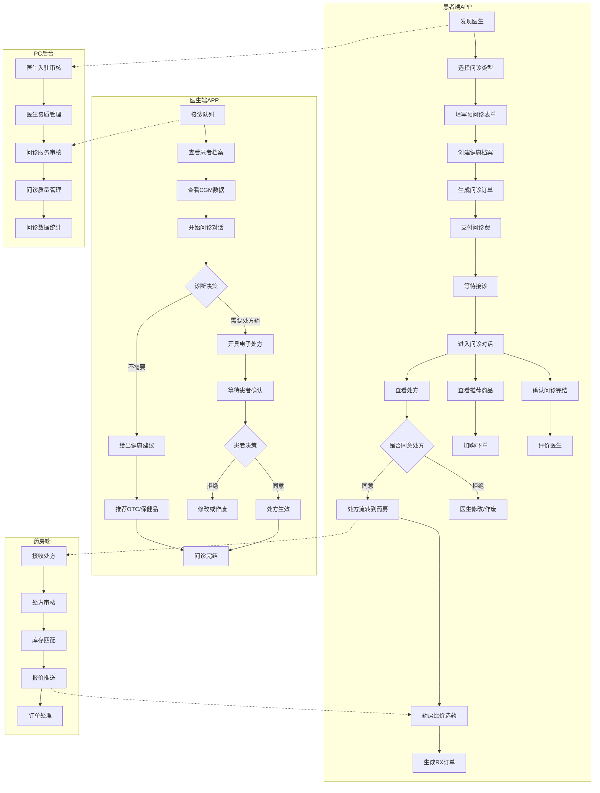
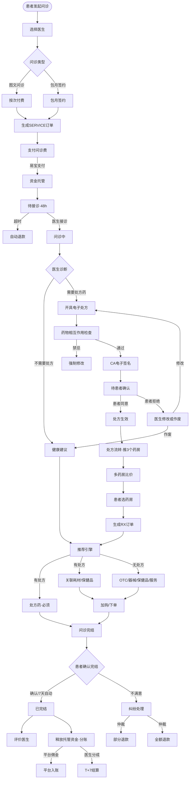
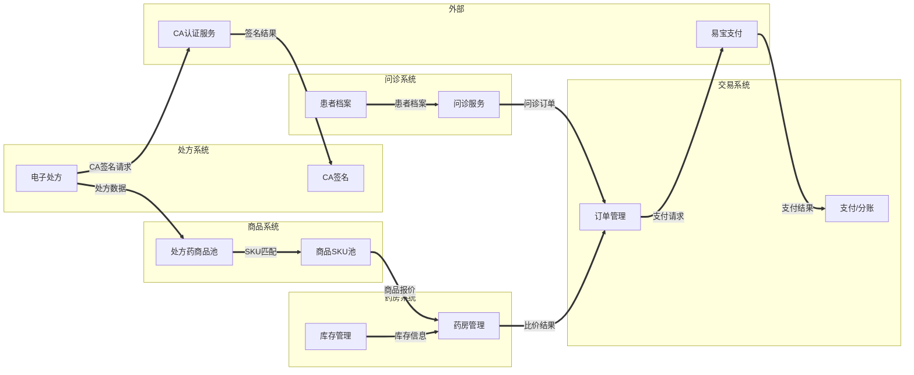
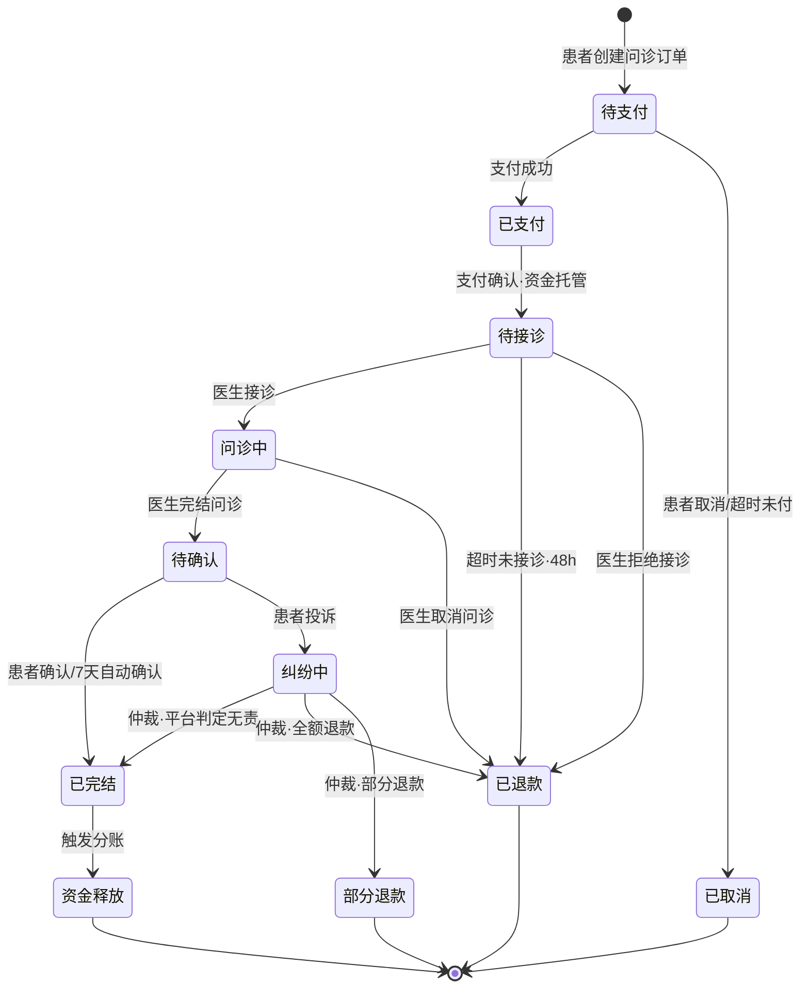
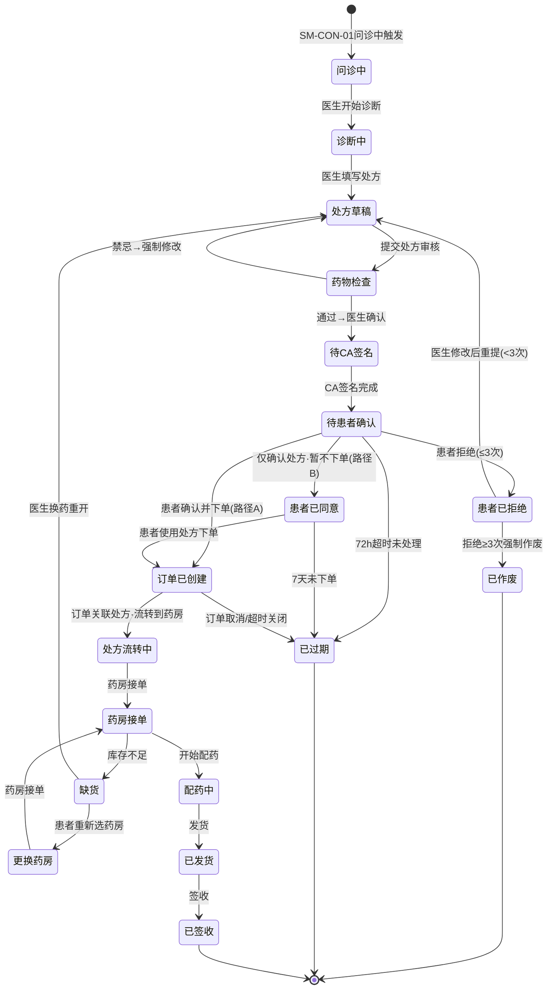
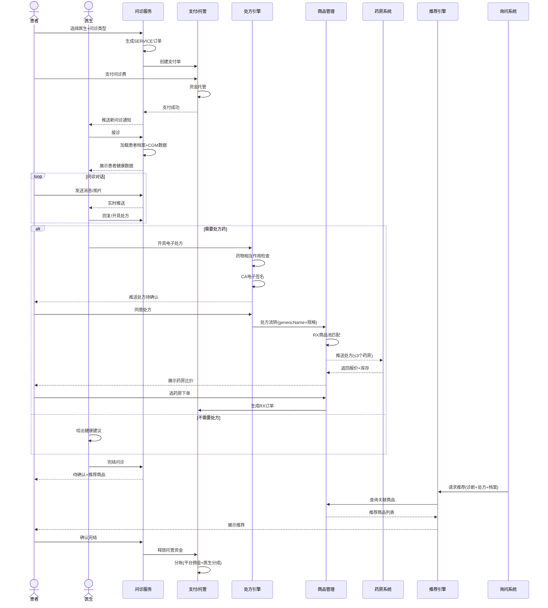
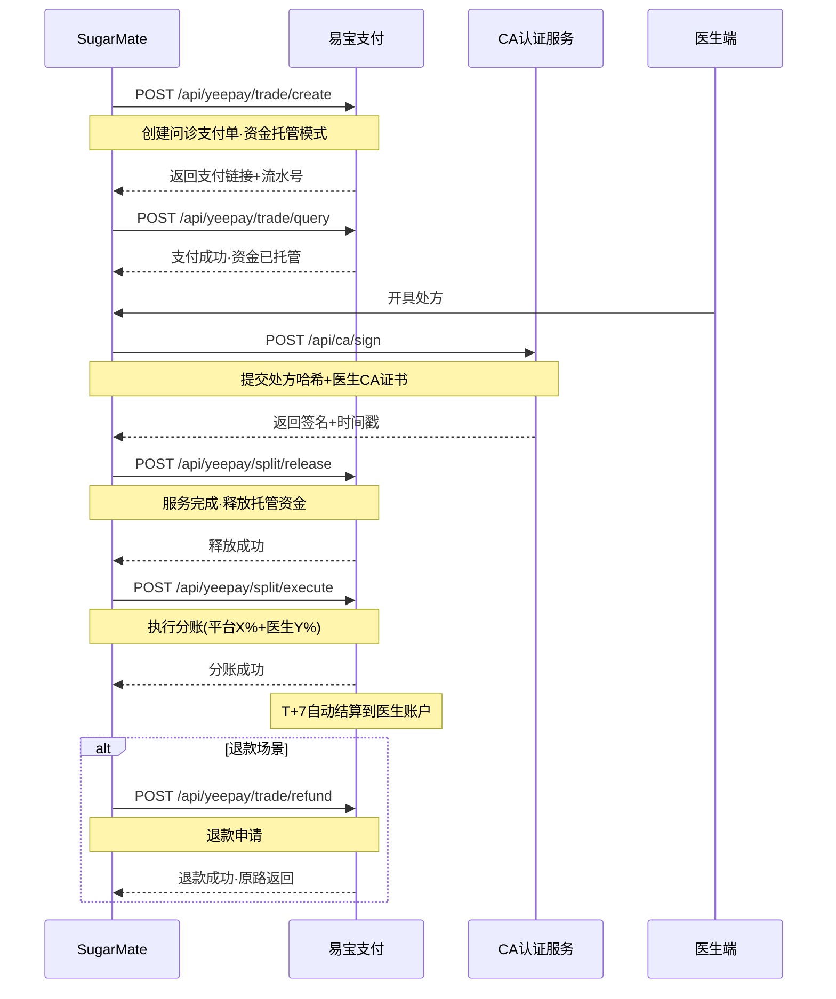
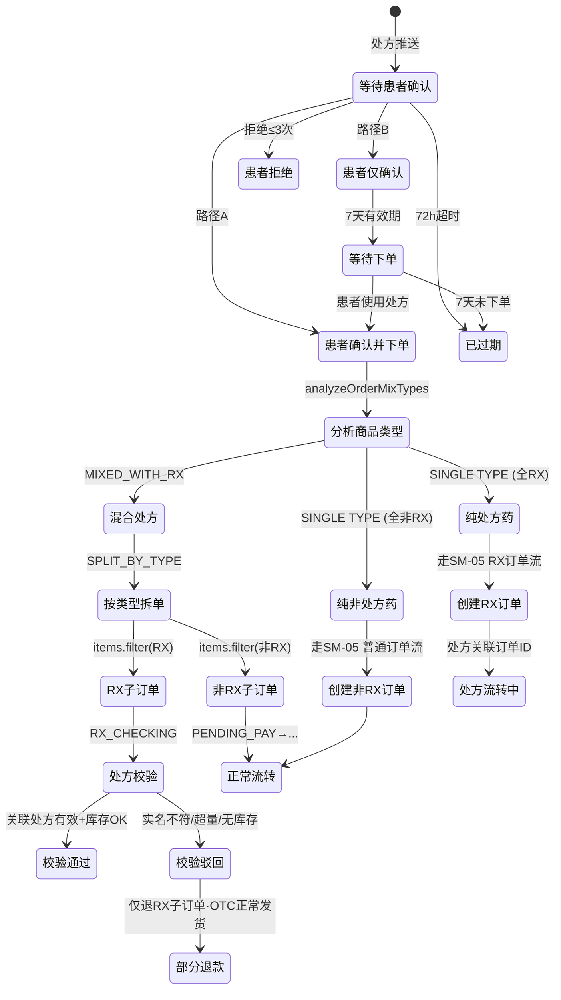
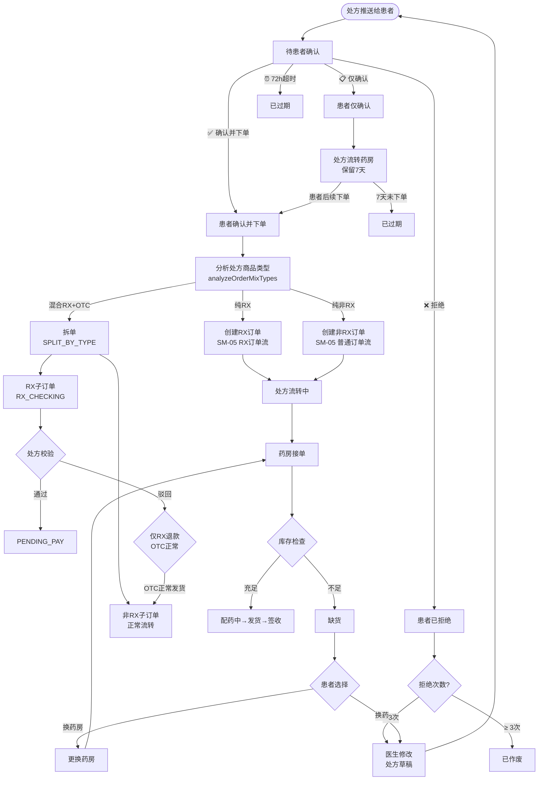
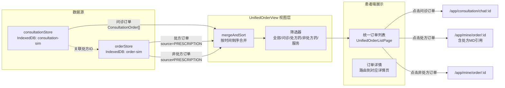

# SugarMate 在线问诊 — 专项需求文档 PRD v1.2.0

> **文档编号**: REQ-SUG-CONSULT-v1.2.0 | **日期**: 2026-07-31 | **作者**: BA + AI辅助全流程梳理
>
> **文档类型**: 专项需求文档（独立于主PRD，聚焦在线问诊全链路）
> **依赖主文档**: PRD-SugarMate-v3.1.2（§2.7账号体系、SM-03处方、SM-16服务订单、SM-05订单、SM-07医生入驻）
>
> **核心内容**:
> - 在线问诊6大议题深度分析：发起方、服务商品、订单流、支付流、患者档案、推荐引擎
> - 处方联动链路：问诊→处方→患者确认→商品管理四层联动
> - **V1.1.0新增**：处方→订单全链路（患者确认双路径+混合处方拆单+异常流程+统一订单中心）
> - **V1.2.0新增**：场景化流程分析（§7.11）——基于七类图强制审查两个核心场景的端到端闭环，逐步骤映射状态机节点+页面路由，三端4端页面闭环总表
> - AI多专家盲区扫描：医疗合规/支付财务/架构安全/用户体验/运营增长/数据隐私 6维度
> - SM-03处方状态机修正（新增「待患者确认」节点 + V1.1.0 ORDER_CREATED/PATIENT_REJECTED等异常节点）
> - 问诊后推荐引擎架构设计
> - 患者健康档案体系设计

---

## 版本历史

| 版本 | 日期 | 变更内容 |
|------|------|----------|
| v1.0.0 | 2026-07-30 | 初版：6大议题全面梳理 + AI盲区扫描 + SM-03修正 + 推荐引擎架构 + 患者档案体系 |
| v1.1.0 | 2026-07-31 | **处方→订单全链路深度增强**：处方患者确认→自动下单双路径、混合处方拆单、处方异常流程（拒绝/缺货/超时/校验驳回）、患者端统一订单中心（问诊+处方+非处方三合一视图）、SM-03新增ORDER_CREATED/PATIENT_REJECTED/OUT_OF_STOCK/PHARMACY_SWITCHING状态、处方患者确认页处方目录搜索替换硬编码 |
| v1.2.0 | 2026-07-31 | **场景化流程分析（§7.11）**：强制性依据七类图(§7.1-7.10)审查两个核心场景——场景1(只问诊无处方无购买)/场景2A(问诊→处方→配药→发货→冷链→收货)/场景2B(问诊→推荐→购买OTC)，逐步骤三向映射(状态机节点+页面路由+图引用节点)，输出三端/四端页面闭环总表(患者APP 14page+医生APP 3page+药师APP 2page+Dashboard 4page)+七类图对照校验矩阵+各场景走通率评估

---

## §1 背景与问题陈述

### 1.1 业务背景

SugarMate作为糖尿病管理平台，在线问诊是其核心业务闭环「**问诊→处方→购药→复诊**」的入口环节。当前主PRD v3.1.2虽然定义了在线问诊相关功能编号（FN-SUG-APP-006/007/012/013/020等），但在以下关键链路存在缺失：

1. **处方联动链路断裂**：SM-03处方状态机从「诊断中」直达「处方草稿」，缺少「待患者确认」节点，导致处方药流转无法基于患者同意触发
2. **服务商品化缺失**：医生入驻（SM-07）完成后，无「问诊服务SKU」管理能力——价格/时间/类型未定义
3. **支付托管机制缺失**：问诊费支付后无资金托管/分账失败处理逻辑
4. **患者档案空白**：FN-SUG-APP-010（电子病历）标记为P1未实现，医生问诊时无法查看患者历史数据
5. **推荐引擎缺失**：问诊→商品推荐链路完全空白，处方药SKU无法通过通用名映射

### 1.2 核心问题

本专项文档聚焦在线问诊的**6大核心议题**：

| # | 议题 | 核心问题 |
|---|------|----------|
| 1 | 谁发起问诊 | 患者发起 vs 医生主动 vs 系统事件？紧急SOS是否联动快速问诊？ |
| 2 | 问诊服务商品 | 平台统一定价 vs 医生自主定价 vs 混合模型？SKU如何管理？ |
| 3 | 问诊订单流 | SM-16与SM-03联动断点？超时/退款/完结确认规则？ |
| 4 | 支付流 | 预授权托管 vs 直接结算？分佣模型？包月续费策略？ |
| 5 | 患者档案 | 档案归属/隐私授权/与CGM数据打通？ |
| 6 | 推荐引擎 | 有处方→RX流转 vs 无处方→OTC推荐？联动商品管理？ |

---

## §2 目标与成功度量

### 2.1 业务目标

| 编号 | 目标 | 量化指标 | 验证方式 |
|------|------|----------|----------|
| BG-SUG-CON-001 | 打通「问诊→处方→购药」完整闭环 | 问诊处方转化率 ≥30% | 问诊完结数 / 处方开具数 |
| BG-SUG-CON-002 | 问诊服务商品化 | 医生问诊服务上架率 ≥90% | 已上架医生数 / 入驻医生总数 |
| BG-SUG-CON-003 | 提升处方流转效率 | 处方→下单转化率 ≥50% | 处方开具数 / RX订单数 |
| BG-SUG-CON-004 | 推荐引擎转化 | 推荐商品点击率 ≥15% | 推荐展现数 / 点击数 |
| BG-SUG-CON-005 | 患者档案完整度 | 首次问诊档案填写率 ≥80% | 档案完整数 / 首次问诊用户数 |

### 2.2 成功度量

| 指标编号 | 指标名称 | 定义 | 数据来源 |
|----------|----------|------|----------|
| METRIC-SUG-CON-001 | 问诊发起量 | 每日新增SERVICE类型问诊订单数 | 订单系统 |
| METRIC-SUG-CON-002 | 问诊完成率 | 已完结问诊 / 已支付问诊 | 订单系统 |
| METRIC-SUG-CON-003 | 平均接诊时长 | 支付→医生接诊的时间间隔中位数 | IM系统 |
| METRIC-SUG-CON-004 | 处方开具率 | 开具处方问诊数 / 已完结问诊数 | 处方系统 |
| METRIC-SUG-CON-005 | 处方流转转化率 | RX订单数 / 处方开具数 | 订单系统 |
| METRIC-SUG-CON-006 | 推荐点击率 | 推荐商品点击数 / 推荐展现数 | 推荐引擎 |
| METRIC-SUG-CON-007 | 患者档案完整度 | 必填字段填写率均值 | 档案系统 |
| METRIC-SUG-CON-008 | 问诊退款率 | 退款问诊数 / 已支付问诊数 | 支付系统 |

---

## §3 范围定义

### 3.1 In-Scope（本版本范围）

| 模块 | 内容 |
|------|------|
| 问诊发起 | 患者主动发起（选医生→下单→问诊）、1v1签约用户免下单直达、紧急SOS快速问诊通道 |
| 问诊服务商品 | 医生创建问诊服务SKU（图文/视频/包月三种类型）、价格设置、服务时间配置 |
| 问诊订单流（SM-16增强） | 待支付→已支付→待接诊（超时退款）→问诊中→待确认→已完结、退款/纠纷处理 |
| 处方联动（SM-03修正） | 新增「待患者确认」状态节点、处方草稿→药物检查→CA签名→待患者确认→审核通过/流转 |
| 支付托管 | 支付→平台托管→服务确认→分账释放、退款原路返回 |
| 患者健康档案 | 基础信息/病史/用药记录/CGM数据/历史问诊/过敏史，首次问诊引导填写 |
| 推荐引擎 | 有处方→处方案内推荐（RX流转+关联商品）、无处方→OTC+器械+保健品+服务推荐 |
| 商品管理联动 | 处方药genericName→SKU映射、RX商品池、冷链标记、多药房比价 |
| **处方→订单生成（V1.1.0新增）** | 患者确认处方后自动生成实物订单（双路径：确认并下单 / 仅确认暂不下单）；混合处方按类型拆单（RX子订单 + 非处方子订单）；医生入驻强制关联药店；Product 新增 `prescription_attributes` 处方属性子对象 |
| **处方异常流程（V1.1.0新增）** | 患者拒绝处方（最多3次需说明原因）；处方72h超时过期；药房缺货→更换药房；处方药订单处方校验不通过退款 |
| **患者统一订单中心（V1.1.0新增）** | 患者端"我的订单"统一入口，混合展示：问诊订单 + 处方订单 + 非处方订单，支持按类型筛选；前端视图层合并 `consultationStore` + `orderStore` 数据 |

### 3.2 Non-Goals（本版本不包含）

| 内容 | 原因 | 计划版本 |
|------|------|----------|
| AI辅助诊断 | 医疗AI合规审批周期长 | v2.0.0 |
| 视频问诊 | 需腾讯云TRTC集成，工作量大 | v1.1.0 |
| 多医生会诊 | 业务模式待验证 | v2.0.0 |
| 问诊病历SNOMED CT术语编码 | FN-SUG-APP-010 P1，需专业医疗知识库 | v1.1.0 |
| 处方药配送跟踪 | 依赖物流系统对接 | v1.1.0 |
| 问诊保险报销 | 医保对接复杂度高 | v2.0.0 |

---

## §4 与既有模块关系

### 4.1 依赖矩阵

| 既有模块 | 依赖关系 | 影响说明 |
|----------|----------|----------|
| §2.7 账号体系与身份路由 | **强依赖** | 患者身份(PT)发起问诊、医生身份(DR)接诊，角色路由决定工作台视图 |
| SM-07 医生入驻状态机 | **强依赖** | 医生必须入驻完成→创建问诊服务→才能被患者选择 |
| SM-16 服务订单状态机 | **增强** | 新增超时/退款节点、与SM-03联动 |
| SM-05 订单状态机 | **引用** | RX订单的RX_CHECKING分支，校验处方有效性 |
| SM-03 处方状态机 | **修正** | 新增「待患者确认」状态节点 |
| §11 商品管理(主PRD) | **联动** | 处方药SKU的genericName字段+冷链标记+RX商品池 |
| order-router.ts | **扩展** | SERVICE类型支付路由增强、SERVICE+RX合并支付分账 |
| FN-SUG-APP-013 紧急SOS | **联动** | 血糖危急值→自动触发快速问诊通道 |

### 4.2 复用边界

| 复用内容 | 来源 | 使用方式 |
|----------|------|----------|
| ProductTypeEnum.SERVICE | 交易契约 trade.ts | 问诊订单类型 |
| ProductTypeEnum.RX | 交易契约 trade.ts | 处方药商品类型 |
| 易宝分账支付 | SM-05 支付流 | 问诊费支付+分账 |
| IM聊天能力 | 主PRD §14 通信 | 问诊对话 |
| CGM血糖数据 | 健康管理域 | 患者档案数据源 |

---

## §5 业务目标映射

### 5.1 BO/BG映射

| 商业目标(BO) | 业务目标(BG) | 关联功能 |
|-------------|-------------|----------|
| BO-SUG-001 构建糖尿病管理全链路服务平台 | BG-SUG-CON-001 打通问诊→处方→购药闭环 | FN-SUG-CON-APP-001~009 |
| BO-SUG-001 构建糖尿病管理全链路服务平台 | BG-SUG-CON-002 问诊服务商品化 | FN-SUG-CON-APP-010~012 |
| BO-SUG-002 提升平台GMV与医生收入 | BG-SUG-CON-003 提升处方流转效率 | FN-SUG-CON-APP-013~016 |
| BO-SUG-002 提升平台GMV与医生收入 | BG-SUG-CON-004 推荐引擎转化 | FN-SUG-CON-APP-017~020 |
| BO-SUG-003 建立患者健康数据资产 | BG-SUG-CON-005 患者档案完整度 | FN-SUG-CON-APP-021~024 |

---

## §6 用户故事

| 编号 | 角色 | 用户故事 | 优先级 |
|------|------|----------|:----:|
| US-CON-001 | 患者 | 作为糖友，我想选择专科医生进行在线图文问诊，获得专业建议 | P0 |
| US-CON-002 | 患者 | 作为签约用户，我想直接联系我的专属医生，不需要每次下单 | P0 |
| US-CON-003 | 患者 | 作为患者，我想在医生开具处方后查看并确认，然后流转到药房比价购买 | P0 |
| US-CON-004 | 患者 | 作为新用户，我想在第一次问诊时填写健康档案，让医生更了解我的情况 | P0 |
| US-CON-005 | 患者 | 作为血糖异常用户，当系统检测到危险值时，我想自动接入紧急问诊 | P1 |
| US-CON-006 | 医生 | 作为内分泌科医生，我想设置我的问诊服务类型和价格，管理接诊时间 | P0 |
| US-CON-007 | 医生 | 作为接诊医生，我想查看患者的健康档案（血糖数据/用药记录/历史问诊） | P0 |
| US-CON-008 | 医生 | 作为医生，我想在问诊中开具电子处方，经患者确认后流转到药房 | P0 |
| US-CON-009 | 医生 | 作为签约医生，我想主动发起复诊回访问诊，跟踪患者病情 | P1 |
| US-CON-010 | 患者 | 作为问诊完成后的患者，我想看到基于诊断结果的关联商品推荐 | P1 |
| US-CON-011 | 平台运营 | 作为运营人员，我想管理医生问诊服务质量和问诊转化漏斗 | P1 |

---

## §7 五类图

### 7.1 业务泳道图：在线问诊全流程



### 7.2 业务流程图：问诊→处方→购药端到端



### 7.3 信息流转图：跨系统信息流



### 7.4 状态机：SM-CON-01 问诊服务订单状态机（SM-16增强版）



### 7.4.1 状态过渡操作表（SM-CON-01）

| 当前状态 | 触发操作 | 目标状态 | 操作者 | 前置约束 | 后置动作 |
|----------|----------|----------|--------|----------|----------|
| — | 创建问诊订单 | 待支付 | 患者 | 已选择医生+问诊类型 | 生成订单号、锁定问诊时段 |
| 待支付 | 支付成功 | 已支付 | 系统自动 | 易宝返回支付成功 | 资金进入托管、通知医生有新问诊 |
| 待支付 | 取消订单 | 已取消 | 患者 | 未支付 | 释放问诊时段 |
| 待支付 | 超时未付 | 已取消 | 系统事件 | 创建后30min未支付 | 释放问诊时段 |
| 已支付 | 支付确认 | 待接诊 | 系统自动 | 资金已托管 | 开始48h接诊倒计时、推送通知给医生 |
| 待接诊 | 接诊 | 问诊中 | 医生 | 48h内 | 开启IM通道、展示患者档案 |
| 待接诊 | 超时未接诊 | 已退款 | 系统事件 | 超过48h | 托管资金原路退回、通知患者 |
| 待接诊 | 拒绝接诊 | 已退款 | 医生 | — | 托管资金原路退回、通知患者 |
| 问诊中 | 完结问诊 | 待确认 | 医生 | 已给出诊断结论 | 汇总问诊记录、如有处方则触发处方流转 |
| 问诊中 | 取消问诊 | 已退款 | 医生 | 未开具处方 | 托管资金原路退回 |
| 待确认 | 确认完结 | 已完结 | 患者 | — | 触发资金释放、触发分账 |
| 待确认 | 超时自动确认 | 已完结 | 系统事件 | 超过7天 | 触发资金释放、触发分账 |
| 待确认 | 投诉 | 纠纷中 | 患者 | 7天内 | 冻结托管资金、创建纠纷工单 |
| 纠纷中 | 仲裁·无责 | 已完结 | 平台 | 判定医生无责 | 释放资金、触发分账 |
| 纠纷中 | 仲裁·全额退款 | 已退款 | 平台 | 判定患者合理 | 全额原路退回 |
| 纠纷中 | 仲裁·部分退款 | 部分退款 | 平台 | 判定双方均有责 | 部分退回、剩余释放分账 |
| 已完结 | 分账完成 | 资金释放 | 系统自动 | 分账成功 | 医生T+7结算、平台佣金入账 |

### 7.5 状态机：SM-03处方状态机v2.0.0（处方→订单全链路）

> **V1.1.0升级说明**：V1.0.0仅到「审核通过→流转药房」，未覆盖处方→订单生成链路、患者异常流程、和药房缺货场景。V2.0.0新增6个状态节点和12条转换路径。



> **V1.1.0关键设计决策**：
> 1. **患者确认双路径**：路径A（确认并下单）自动触发 `orderStore.createPrescriptionOrder` → 混合处方拆单；路径B（仅确认）处方流转给药房但不生成订单，患者可在7天内随时使用处方下单
> 2. **拒绝上限3次**：防止医生-患者无限修改循环，3次后强制作废
> 3. **缺货独立节点**：药房接单后库存实时校验，不足时可更换药房或换药重开
> 4. **订单已创建→处方流转中**：订单创建后处方随订单流转，订单状态机（SM-CON-01/SM-05）控制后续流程

### 7.5.1 状态过渡操作表（SM-03 v2.0.0）

| 当前状态 | 触发操作 | 目标状态 | 操作者 | 前置约束 | 后置动作 |
|----------|----------|----------|--------|----------|----------|
| — | 医生开始诊断 | 诊断中 | 医生 | 问诊状态=问诊中 | — |
| 诊断中 | 填写处方 | 处方草稿 | 医生 | 诊断完成 | 生成处方编号 |
| 处方草稿 | 提交审核 | 药物检查 | 系统自动 | 处方内容完整 | 调用药物相互作用检查引擎 |
| 药物检查 | 强制修改 | 处方草稿 | 系统事件 | 发现禁忌配伍 | 标注禁忌项，医生必须修改 |
| 药物检查 | 通过确认 | 待CA签名 | 医生 | 无禁忌/医生确认注意事项 | 调用CA签名服务 |
| 待CA签名 | CA签名完成 | 待患者确认 | 系统自动 | CA返回签名成功 | 推送处方给患者，72h倒计时开始 |
| **待患者确认** | **确认并下单** | **订单已创建** | **患者** | **V1.1.0**：路径A | 自动调 `orderStore.createPrescriptionOrder` → 混合处方拆单 → 处方关联订单 |
| **待患者确认** | **仅确认暂不下单** | **患者已同意** | **患者** | **V1.1.0**：路径B | 处方流转给药房保留，7天内可下单 |
| **待患者确认** | **患者拒绝** | **患者已拒绝** | **患者** | **V1.1.0**：附拒绝原因（价格/不对症/副作用/其他） | 通知医生修改处方；拒绝次数+1 |
| **待患者确认** | **72h超时未处理** | **已过期** | **系统事件** | **V1.1.0** | 通知双方处方已过期；问诊重回IN_CONSULT可重开方 |
| **患者已拒绝** | **医生修改后重提** | **处方草稿** | **医生** | **V1.1.0**：拒绝次数<3 | 保留原始处方为草稿，医生修改后重新走审核→CA签名→患者确认 |
| **患者已拒绝** | **拒绝≥3次强制作废** | **已作废** | **系统自动** | **V1.1.0** | 处方作废；通知双方需重新问诊开方 |
| **患者已同意** | **患者使用处方下单** | **订单已创建** | **患者** | **V1.1.0**：处方有效期内 | 调 `createPrescriptionOrder`；关联处方 |
| **患者已同意** | **7天未下单** | **已过期** | **系统事件** | **V1.1.0** | 处方失效；通知患者 |
| **订单已创建** | **订单关联处方流转** | **处方流转中** | **系统自动** | **V1.1.0**：订单创建成功 | 处方关联订单ID；药房端可查看订单 |
| 处方流转中 | 药房接单 | 药房接单 | 药房 | 库存充足 | 锁定库存 |
| **药房接单** | **库存不足** | **缺货** | **系统事件** | **V1.1.0**：库存<处方需求量 | 通知药房补货+通知患者可选更换药房或等医生换药 |
| **缺货** | **患者重新选药房** | **更换药房** | **患者** | **V1.1.0** | 系统推送其他候选药房（按库存/距离/评分排序）；释放原药房锁定 |
| **缺货** | **退回医生换药** | **处方草稿** | **患者** | **V1.1.0** | 处方回退到草稿；通知医生换药重开 |
| **更换药房** | **新药房接单** | **药房接单** | **药房** | **V1.1.0** | 重新锁定库存 |
| 药房接单 | 开始配药 | 配药中 | 药房 | 库存OK | 更新库存 |
| 配药中 | 发货 | 已发货 | 药房 | 药品备齐 | 生成物流单号 |
| 已发货 | 签收 | 已签收 | 患者 | 确认收货 | 处方生命周期完结 |
| 订单已创建 | 订单取消/超时关闭 | 已过期 | 系统事件 | 订单状态=CANCELLED | 处方失效 |

> **注**：加粗行为 V1.1.0 新增/修改的转换路径。

### 7.6 业务时序图：问诊→处方→购药全链路



### 7.7 三方接口时序图：易宝支付分账+CA签名



### 7.8 状态机：SM-RX-ORDER 处方→订单过渡状态机（V1.1.0新增）

> 描述从处方确认到实物订单创建的过渡逻辑，包括混合处方拆单和子订单独立流转。



### 7.8.1 状态过渡操作表（SM-RX-ORDER）

| 当前状态 | 触发操作 | 目标状态 | 操作者 | 前置约束 | 后置动作 |
|----------|----------|----------|--------|----------|----------|
| 等待患者确认 | 点击「确认并下单」 | 患者确认并下单 | 患者 | 处方有效 | 触发混合类型分析 |
| 等待患者确认 | 点击「仅确认」 | 患者仅确认 | 患者 | 处方有效 | 处方流转给药房，不下单 |
| 患者确认并下单 | 系统分析商品类型 | 分析商品类型 | 系统自动 | items[] 中 product_type 不为空 | 调用 `analyzeOrderMixTypes()` |
| 分析商品类型 | 全RX→创建RX订单 | 创建RX订单 | 系统自动 | scenario=SINGLE_TYPE | 调 `orderStore.createOrder(source=PRESCRIPTION)` |
| 分析商品类型 | 混合→按类型拆单 | 按类型拆单 | 系统自动 | scenario=MIXED_WITH_RX | 拆为 RX子订单 + 非RX子订单 |
| 按类型拆单 | RX items 过滤 | RX子订单 | 系统自动 | — | 子订单 source=PRESCRIPTION, 标记 item_status=RX_CHECKING |
| 按类型拆单 | 非RX items 过滤 | 非RX子订单 | 系统自动 | — | 子订单正常流转 |
| RX子订单 | 处方有效性校验 | 处方校验 | 系统自动 | 处方状态=已承接/流转中 | 校验：实名匹配/处方未过期/库存充足/未超限 |
| 处方校验 | 校验全部通过 | 校验通过 | 系统自动 | — | 子订单状态→PENDING_PAY |
| 处方校验 | 校验失败 | 校验驳回 | 系统事件 | 任一校验项失败 | 仅该子订单退款；OTC子订单不受影响 |
| 患者仅确认 | 7天超时 | 已过期 | 系统事件 | — | 处方失效 |

### 7.9 业务流程图：患者处方异常流程全景（V1.1.0新增）



### 7.10 信息流转图：患者统一订单中心数据流（V1.1.0新增）



> **设计原则**：不新增 Store，`UnifiedOrderListPage` 同时拉取 `consultationStore.consultations` 和 `orderStore.orders`，在页面内通过 `useMemo` 合并为 `UnifiedOrderView[]`。`consultationStore` 和 `orderStore` 职责不变，仅在视图层做聚合展示。

---

### 7.11 场景化流程分析：基于七类图的业务端闭环验证

> **目的**：以两个核心用户场景为驱动，强制引用§7.1-7.10中的全部七类图，逐步骤映射到具体状态机节点、页面路由和业务规范，确保「问诊→处方→配药→发货→冷链→收货」主链路在各业务端完整闭合。

#### 7.11.1 场景定义

本PRD覆盖的在线问诊全链路中存在两个根本性分叉场景，其分叉点位于 **§7.2 业务流程图** 的 `Diagnosis{医生诊断}` 节点（对应 §7.1 泳道图 B5节点）：

| 场景 | 名称 | 医生诊断后行为 | 产生订单类型 | 涉及状态机 | 对应 §7.2 分支 |
|------|------|---------------|-------------|-----------|---------------|
| **场景1** | 只问诊·不开方·不购买（纯咨询服务） | 给健康建议→推荐（患者不买）→完结 | 问诊订单×1（SERVICE） | SM-CON-01 | `Advice[健康建议]` 分支 |
| **场景2A** | 问诊→处方→购药（处方药路径） | 开电子处方→患者确认并下单→流转→配药→发货→签收 | 问诊订单×1 + RX订单×N | SM-CON-01 + SM-03 v2.0.0 + SM-RX-ORDER + SM-05 | `Prescribe[开具电子处方]` 分支 |
| **场景2B** | 问诊→推荐→购买OTC（无处方路径） | 给健康建议→推荐引擎→患者加购OTC | 问诊订单×1 + 普通订单×N | SM-CON-01 + SM-05 | `Advice→Recommendation→OTCGoods` 子分支 |

**关键原则**：无论有无处方、有无商品购买，只要有问诊行为，都必须生成一个「问诊订单」（ConsultationOrder，类型=SERVICE），走完 **§7.4 SM-CON-01** 完整生命周期。

---

#### 7.11.2 场景1：只问诊·不开方·不购买（图文/视频/电话咨询）完整流程

**涉及图引用**：§7.1 泳道图（患者端A1-A18 + 医生端B1-B13 + PC后台C1-C5）→ §7.2 业务流程图（Advice分支）→ §7.3 信息流转图（问诊系统↔交易系统）→ §7.4 SM-CON-01 状态机 → §7.6 业务时序图（alt 不需要处方 块）

##### 7.11.2.1 步骤→状态机→页面路由 三向映射

```
步骤  | 状态机节点                                   | 患者APP路由                                    | 医生端APP路由                                 | PC后台路由
──────┼─────────────────────────────────────────────┼───────────────────────────────────────────────┼──────────────────────────────────────────────┼──────────────────
①发现  | SM-CON-01: [*]                              | /app/consultation                             | —                                            | —
医生   | §7.1 A1「发现医生」                          | DoctorSearchPage                              |                                              |
      | §7.3 CONSULT 加载医生数据                    | ✅ 按科室/擅长领域/评分筛选                    |                                              |
──────┼─────────────────────────────────────────────┼───────────────────────────────────────────────┼──────────────────────────────────────────────┼──────────────────
②选择  | SM-CON-01: [*]                              | /app/consultation/pre-consult/:doctorId       | —                                            | —
类型   | §7.1 A2「选择问诊类型」                      | PreConsultPage                                |                                              |
下单选 | §7.2 SelectType{问诊类型}                    | ✅ 填写预问诊表单+健康档案                    |                                              |
类型   | §7.6 患者→问诊系统:选择医生+问诊类型          |                                               |                                              |
──────┼─────────────────────────────────────────────┼───────────────────────────────────────────────┼──────────────────────────────────────────────┼──────────────────
③下单  | SM-CON-01: [*]→待支付                       | /app/consultation/pre-consult/:doctorId       | —                                            | —
支付   | §7.1 A5「生成问诊订单」+A6「支付问诊费」      | (同上，支付弹窗)                              |                                              |
      | §7.2 CreateOrder→Payment→Escrow              |                                               |                                              |
      | §7.3 CONSULT==问诊订单==>ORDER                |                                               |                                              |
      | §7.4 待支付:患者创建问诊订单                    |                                               |                                              |
      | §7.6 支付系统→资金托管                         |                                               |                                              |
      | §7.7 易宝POST /api/yeepay/trade/create        |                                               |                                              |
──────┼─────────────────────────────────────────────┼───────────────────────────────────────────────┼──────────────────────────────────────────────┼──────────────────
④等待  | SM-CON-01: 已支付→待接诊                    | /app/consultation/waiting/:orderId            | /medical/doctor/workbench                    | —
接诊   | §7.1 A7「等待接诊」+B1「接诊队列」            | WaitingPage                                   | AppDoctorWorkbenchPage                       |
      | §7.2 WaitAccept[待接诊·48h]                   | ✅ 48h倒计时+超时退款倒计时                    | ✅ 待接诊队列·B02区块                        |
      | §7.4 待接诊:48h超时→已退款                     |                                               |                                              |
      | §7.6 问诊系统→医生:推送新问诊通知              |                                               |                                              |
──────┼─────────────────────────────────────────────┼───────────────────────────────────────────────┼──────────────────────────────────────────────┼──────────────────
⑤接诊  | SM-CON-01: 待接诊→问诊中                     | /app/consultation/chat/:orderId               | /medical/doctor/consult/chat/:orderId        | —
      | §7.1 A8「进入问诊对话」+B2-B4                 | ConsultationChatPage                          | DoctorConsultationChatPage                   |
      | §7.2 InConsult[问诊中]                        | ✅ IM图文对话+发图片+发血糖数据                | ✅ 右侧患者档案面板+CGM曲线+开处方入口       |
      | §7.4 待接诊→问诊中:医生接诊                    |                                               |                                              |
      | §7.6 loop 问诊对话                            |                                               |                                              |
──────┼─────────────────────────────────────────────┼───────────────────────────────────────────────┼──────────────────────────────────────────────┼──────────────────
⑥诊断  | SM-CON-01: 问诊中(持续)                      | (对话内医生发结论消息)                        | (同上)                                       | —
结论   | §7.1 B5{诊断决策}→B7「给出健康建议」          |                                               | ✅ 医生给健康建议(不开处方)                  |
      | §7.2 Diagnosis→Advice[健康建议]               |                                               | ✅ "完结问诊"按钮                            |
──────┼─────────────────────────────────────────────┼───────────────────────────────────────────────┼──────────────────────────────────────────────┼──────────────────
⑦问诊  | SM-CON-01: 问诊中→待确认                     | /app/consultation/summary/:orderId            | —                                            | —
完结   | §7.1 B13「问诊完结」                          | ConsultationSummaryPage                       |                                              |
      | §7.2 FinishConsult[问诊完结]                  | ✅ 诊断结论+健康建议+推荐区域(B03)            |                                              |
      | §7.4 问诊中→待确认:医生完结问诊                 |                                               |                                              |
      | §7.6 医生→问诊系统:完结问诊                    |                                               |                                              |
──────┼─────────────────────────────────────────────┼───────────────────────────────────────────────┼──────────────────────────────────────────────┼──────────────────
⑧推荐  | SM-CON-01: 待确认(持续)                      | /app/consultation/recommend/:orderId          | —                                            | —
商品   | §7.1 A15「查看推荐商品」                      | PostConsultRecommendPage                      |                                              |
(不买) | §7.2 OTCGoods[OTC/器械/保健品/服务]          | ✅ OTC+器械+保健品+服务推荐                   |                                              |
      | §7.6 推荐→患者:展示推荐                        | (患者选择不购买→跳过)                        |                                              |
──────┼─────────────────────────────────────────────┼───────────────────────────────────────────────┼──────────────────────────────────────────────┼──────────────────
⑨确认  | SM-CON-01: 待确认→已完结                     | (同上·Summary页)                              | —                                            | —
完结   | §7.1 A17「确认问诊完结」                      | ✅「确认完结」按钮                            |                                              |
      | §7.2 PatientConfirm→Completed               |                                               |                                              |
      | §7.4 待确认→已完结:患者确认/7天自动            |                                               |                                              |
──────┼─────────────────────────────────────────────┼───────────────────────────────────────────────┼──────────────────────────────────────────────┼──────────────────
⑩评价  | SM-CON-01: 已完结→资金释放                   | /app/consultation/evaluate/:orderId           | —                                            | /consultation/orders
+分账  | §7.1 A18「评价医生」                          | EvaluationPage                                |                                              | ConsultationOrder
      | §7.2 Rating[评价医生]+ReleaseFunds            | ✅ 星级评价+文字评价                          |                                              | ManagePage
      | §7.4 已完结→资金释放:触发分账                  |                                               |                                              | ✅ 问诊质量统计
      | §7.6 患者→问诊系统:确认完结                    |                                               |                                              | UC-SUG-CON-PC-001-02
      | §7.7 易宝POST split/release+split/execute    |                                               |                                              |
```

**SM-CON-01 场景1状态机轨迹**：`[*] → 待支付 → 已支付 → 待接诊 → 问诊中 → 待确认 → 已完结 → 资金释放 → [*]`

**场景1三端页面汇总**：

| 终端 | 页面数量 | 具体页面（路由） |
|------|:------:|------|
| 患者APP | 9个 | DoctorSearchPage → PreConsultPage → WaitingPage → ConsultationChatPage → ConsultationSummaryPage → PostConsultRecommendPage → EvaluationPage → (首页/个人中心) |
| 医生端APP | 2个 | AppDoctorWorkbenchPage → DoctorConsultationChatPage |
| PC后台 | 1个 | ConsultationOrderManagePage（问诊质量统计） |

**产出**：问诊订单×1（SM-CON-01 COMPLETED），医生收入更新（T+7分账），无处方流转。

---

#### 7.11.3 场景2A：问诊→处方→购药→配药→发货→冷链→收货 完整流程

**涉及图引用**：§7.1 泳道图（全4泳道）→ §7.2 业务流程图（Prescribe分支）→ §7.3 信息流转图（全6子系统+2外部）→ §7.4 SM-CON-01 状态机 → §7.5 SM-03 v2.0.0 处方状态机 → §7.5.1 状态过渡操作表 → §7.6 业务时序图（alt 需要处方药 块）→ §7.7 三方接口时序图 → §7.8 SM-RX-ORDER 状态机 → §7.8.1 状态过渡操作表 → §7.9 处方异常全景流程图

##### 7.11.3.1 步骤→状态机→页面路由 三向映射

```
步骤    | 状态机节点                                                 | 患者APP路由                                    | 医生端APP路由                                 | 药房端/PC后台路由
────────┼──────────────────────────────────────────────────────────┼───────────────────────────────────────────────┼──────────────────────────────────────────────┼────────────────────────
①②③④  | 与场景1相同（问诊发起→支付→等待→接诊→对话）               | 同场景1 步骤①②③④                             | 同场景1 步骤①②③④                           | —
────────┼──────────────────────────────────────────────────────────┼───────────────────────────────────────────────┼──────────────────────────────────────────────┼────────────────────────
⑤医生   | SM-CON-01: 问诊中                                       | (对话内收到处方通知)                          | /medical/doctor/prescribe                    | —
开具    | SM-03 v2.0.0: 问诊中→诊断中→处方草稿→药物检查→待CA签名   |                                               | DoctorPrescriptionPage                       |
处方    | §7.1 B5{诊断决策}→B6「开具电子处方」                       |                                               | ✅ 填写处方(通用名+规格+用法+数量)           |
        | §7.2 Prescribe→DrugCheck→CASign                          |                                               | →药物检查→CA签名                             |
        | §7.3 RX==CA签名请求==>CA_SERVICE                         |                                               | →SM-03: 处方草稿→待患者确认                  |
        | §7.5 诊断中→处方草稿→药物检查→待CA签名                     |                                               |                                              |
        | §7.5.1 过渡表:诊断中→处方草稿→药物检查→待CA签名           |                                               |                                              |
        | §7.6 医生→处方系统:开具电子处方                           |                                               |                                              |
        | §7.7 CA POST /api/ca/sign                                 |                                               |                                              |
────────┼──────────────────────────────────────────────────────────┼───────────────────────────────────────────────┼──────────────────────────────────────────────┼────────────────────────
⑥患者   | SM-CON-01: 问诊中(持续)                                  | /app/consultation/prescription/:prescriptionId| —                                            | —
查看    | SM-03 v2.0.0: 待CA签名→待患者确认                         | PrescriptionDetailPage                        |                                              |
处方    | §7.1 A9「查看处方」+A10{是否同意处方}                      | ✅ 处方完整内容展示                           |                                              |
        | §7.2 WaitPatientConfirm[待患者确认]                       | (诊断/药品清单/用法用量/注意事项)             |                                              |
        | §7.3 RX==处方数据==>RX_POOL                              |                                               |                                              |
        | §7.5 待CA签名→待患者确认                                  |                                               |                                              |
        | §7.5.1 过渡表:CA签名完成→待患者确认                        |                                               |                                              |
        | §7.6 处方系统→患者:推送处方待确认                          |                                               |                                              |
────────┼──────────────────────────────────────────────────────────┼───────────────────────────────────────────────┼──────────────────────────────────────────────┼────────────────────────
⑥A     | SM-03 v2.0.0: 待患者确认→订单已创建                      | (同上·PrescriptionDetailPage)                 | —                                            | —
患者    | SM-RX-ORDER: 等待患者确认→患者确认并下单                   | ✅ 点击「确认处方并下单」                     |                                              |
确认    | §7.1 A10→同意→A11「处方流转到药房」                       | →调orderStore.createPrescriptionOrder        |                                              |
并下单  | §7.2 WaitPatientConfirm→患者同意→PresValid               | →SM-03: 待患者确认→订单已创建→处方流转中     |                                              |
(路径A) | §7.5 待患者确认→订单已创建                                | {上接§7.9异常流程全景}                       |                                              |
        | §7.5.1 过渡表:确认并下单→订单已创建                       | 混合处方自动拆单(BR-CON-064)                  |                                              |
        | §7.6 患者→处方系统:同意处方                               | →navigate('/app/mine/prescription/${id}/review')|                                            |
        | §7.8 患者确认并下单→分析商品类型→纯/混合/纯非RX           |                                               |                                              |
        | §7.8.1 过渡表:确认并下单→分析商品类型                      |                                               |                                              |
        | §7.9 A_C[患者确认并下单]→ANALYZE                          |                                               |                                              |
────────┼──────────────────────────────────────────────────────────┼───────────────────────────────────────────────┼──────────────────────────────────────────────┼────────────────────────
⑦药师   | SM-03 v2.0.0: 处方流转中→药房接单                        | /app/mine/prescription/:id/review             | /medical/pharmacist/audit-workbench          | /pharmacy/orders
审方    | SM-RX-ORDER: RX子订单→处方校验→校验通过/驳回              | PharmacistReviewPage                          | PharmacistAuditPage                          | PharmacyOrderPage
+配药   | §7.1 D1「接收处方」+D2「处方审核」+D3「库存匹配」          | ✅ 审方状态进度条                             | ✅ 待审方处方列表                            | ✅ 订单列表+发货
        | §7.2 RxFlow→PharmacyPrice→PatientSelect                  | ✅ 配药进度(待配药→拣货→复核→打包)           | ✅ 审核操作(通过/驳回)                       | 确认
        | §7.3 STOCK==库存信息==>PHARMACY                           |                                               | ✅ 配药工作台                                |
        | §7.5 处方流转中→药房接单→配药中                            |                                               | ✅ 库存查询                                  |
        | §7.5.1 过渡表:处方流转中→药房接单                          |                                               | ✅ 发货操作(填写物流单号)                    |
        | §7.6 商品系统→药房:推送处方(≤3个药房)                      |                                               |                                              |
        | §7.8 处方校验→校验通过/校验驳回                            |                                               |                                              |
        | §7.8.1 过渡表:RX子订单→处方校验                           |                                               |                                              |
        | §7.9 PHARM[药房接单]→STOCK{库存检查}                       |                                               |                                              |
────────┼──────────────────────────────────────────────────────────┼───────────────────────────────────────────────┼──────────────────────────────────────────────┼────────────────────────
⑧冷链   | SM-03 v2.0.0: 配药中→已发货                               | (同上·PharmacistReviewPage 的物流追踪区域)    | —                                            | /pharmacy/coldchain
发货    | §7.1 D4「报价推送」+D5「订单处理」                         | ✅ 物流单号+预计送达时间                      |                                              | ColdChainMonitorPage
        | §7.2 RxOrder→...                                          | ✅ 冷链温度曲线                               |                                              | ✅ 温度/湿度/轨迹监控
        | §7.3 PHARMACY==比价结果==>ORDER                           |                                               |                                              |
        | §7.5 配药中→已发货                                        |                                               |                                              |
        | §7.5.1 过渡表:配药中→已发货                               |                                               |                                              |
        | §7.9 DISP[配药中→发货→签收]                               |                                               |                                              |
────────┼──────────────────────────────────────────────────────────┼───────────────────────────────────────────────┼──────────────────────────────────────────────┼────────────────────────
⑨收货   | SM-03 v2.0.0: 已发货→已签收                               | /app/mine/order/:id                           | —                                            | —
确认    | §7.5 已发货→已签收                                        | PatientOrderDetailPage                        |                                              |
        | §7.5.1 过渡表:已发货→签收                                 | ✅ 签收按钮                                   |                                              |
        | §7.9 DISP→...签收                                          |                                               |                                              |
────────┼──────────────────────────────────────────────────────────┼───────────────────────────────────────────────┼──────────────────────────────────────────────┼────────────────────────
⑩问诊   | 与场景1 步骤⑦⑧⑨⑩相同                                    | 同场景1 步骤⑦⑧⑨⑩                             | —                                            | —
完结    | SM-CON-01: 待确认→已完结→资金释放                         |                                               |                                              |
+评价   | §7.4 待确认→已完结→资金释放                                |                                               |                                              |
        | §7.7 易宝POST split/release+split/execute                |                                               |                                              |
```

**SM-03 v2.0.0 场景2A状态机轨迹（处方部分）**：
`问诊中 → 诊断中 → 处方草稿 → 药物检查 → 待CA签名 → 待患者确认 → 订单已创建 → 处方流转中 → 药房接单 → 配药中 → 已发货 → 已签收 → [*]`

**SM-RX-ORDER 场景2A轨迹**：
`等待患者确认 → 患者确认并下单 → 分析商品类型 → (纯RX→创建RX订单 | 混合→按类型拆单→RX子订单) → 处方校验 → 校验通过`

**场景2A三端页面汇总**：

| 终端 | 页面数量 | 具体页面（路由） |
|------|:------:|------|
| 患者APP | 13个 | DoctorSearchPage → PreConsultPage → WaitingPage → ConsultationChatPage → PrescriptionDetailPage → PharmacistReviewPage → PatientOrderDetailPage → (可选ColdchainTrackPage) → ConsultationSummaryPage → PostConsultRecommendPage → EvaluationPage → UnifiedOrderListPage → (首页) |
| 医生端APP | 3个 | AppDoctorWorkbenchPage → DoctorConsultationChatPage → DoctorPrescriptionPage |
| 医药端APP(药师) | 2个 | PharmacistAuditPage → PharmacistDispensePage |
| PC后台 | 4个 | ConsultationOrderManagePage → PrescriptionManagePage → PharmacyOrderPage → ColdChainMonitorPage |

**产出**：问诊订单×1 + RX订单×N（或拆分后的子订单），医生收入+处方记录，药房订单+冷链记录。

---

#### 7.11.4 场景2B：问诊→推荐→购买OTC（无处方路径）完整流程

**涉及图引用**：§7.1 泳道图（患者端A1-A18 + 医生端B1-B13）→ §7.2 业务流程图（Advice→Recommendation→OTCGoods→AddToCart 子分支）→ §7.3 信息流转图（问诊系统↔交易系统↔商品系统）→ §7.4 SM-CON-01 状态机 → §7.6 业务时序图（alt 不需要处方 块 + 推荐部分）

##### 7.11.4.1 步骤→状态机→页面路由 三向映射

```
步骤    | 状态机节点                                                 | 患者APP路由                                    | 医生端APP路由
────────┼──────────────────────────────────────────────────────────┼───────────────────────────────────────────────┼────────────────────────
①②③④  | 与场景1相同（问诊发起→支付→等待→接诊→对话）               | 同场景1 步骤①②③④                             | 同场景1 步骤①②③④
────────┼──────────────────────────────────────────────────────────┼───────────────────────────────────────────────┼────────────────────────
⑤诊断   | SM-CON-01: 问诊中(持续)                                  | (对话内医生发结论消息)                        | (同上)
结论    | §7.1 B5{诊断决策}→B7「给出健康建议」                       |                                               | ✅ 医生给健康建议(不开处方)
        | §7.2 Diagnosis→Advice[健康建议]                           |                                               | ✅ "完结问诊"按钮
────────┼──────────────────────────────────────────────────────────┼───────────────────────────────────────────────┼────────────────────────
⑥问诊   | SM-CON-01: 问诊中→待确认                                  | /app/consultation/summary/:orderId            | —
完结    | §7.1 B13「问诊完结」                                       | ConsultationSummaryPage                       |
+推荐   | §7.2 FinishConsult→Recommendation                         |                                               |
        | §7.4 问诊中→待确认:医生完结问诊                            |                                               |
        | §7.6 医生→问诊系统:完结问诊                                |                                               |
────────┼──────────────────────────────────────────────────────────┼───────────────────────────────────────────────┼────────────────────────
⑦推荐   | SM-CON-01: 待确认(持续)                                   | /app/consultation/recommend/:orderId          | —
商品    | §7.1 A15「查看推荐商品」+A16「加购/下单」                   | PostConsultRecommendPage                      |
        | §7.2 Recommendation→OTCGoods[OTC/器械/保健品/服务]        | ✅ OTC+器械+保健品推荐                        |
        | §7.6 推荐→商品系统:查询关联商品                             | →点击「立即购买」                             |
        |                                                           | →navigate('/app/mall/checkout',{item})        |
────────┼──────────────────────────────────────────────────────────┼───────────────────────────────────────────────┼────────────────────────
⑧下单   | SM-05: 普通订单流(PENDING_PAY...)                         | /app/mall/checkout                            | —
确认    | §7.1 A16「加购/下单」                                      | OrderConfirmPage                              |
        | §7.2 AddToCart[加购/下单]                                  | ✅ 商品列表+收货地址+优惠券                   |
────────┼──────────────────────────────────────────────────────────┼───────────────────────────────────────────────┼────────────────────────
⑨支付   | SM-05: 普通订单流(PENDING_PAY→PAID)                       | /app/mall/payment/:orderId                    | —
        | §7.3 ORDER==支付请求==>YEEPAY                             | PaymentPage                                   |
        |                                                           | ✅ 支付倒计时+支付渠道选择                    |
────────┼──────────────────────────────────────────────────────────┼───────────────────────────────────────────────┼────────────────────────
⑩订单   | SM-05: 普通订单流(PAID→SHIPPED→...)                       | /app/mine/order/:id                           | —
详情    |                                                           | PatientOrderDetailPage                        |
        |                                                           | ✅ 订单状态+物流+查看详情                     |
────────┼──────────────────────────────────────────────────────────┼───────────────────────────────────────────────┼────────────────────────
⑪问诊   | 与场景1 步骤⑨⑩相同                                        | 同场景1 步骤⑨⑩                                | —
完结    | SM-CON-01: 待确认→已完结→资金释放                          |                                               |
+评价   | §7.4 待确认→已完结→资金释放                                |                                               |
        | §7.7 易宝POST split/release+split/execute                |                                               |
```

**SM-CON-01 场景2B状态机轨迹**：同场景1。

**场景2B三端页面汇总**：

| 终端 | 页面数量 | 具体页面（路由） |
|------|:------:|------|
| 患者APP | 12个 | DoctorSearchPage → PreConsultPage → WaitingPage → ConsultationChatPage → ConsultationSummaryPage → PostConsultRecommendPage → OrderConfirmPage → PaymentPage → PatientOrderDetailPage → EvaluationPage → UnifiedOrderListPage → (首页) |
| 医生端APP | 2个 | AppDoctorWorkbenchPage → DoctorConsultationChatPage |
| PC后台 | 1个 | ConsultationOrderManagePage |

**产出**：问诊订单×1 + 普通订单×N。

---

#### 7.11.5 三端页面闭环总表

##### 患者APP (`/app/*`) 全部涉及页面

| # | 路由 | 页面组件 | 功能编号 | 场景1 | 场景2A | 场景2B |
|---|------|----------|----------|:---:|:---:|:---:|
| 1 | `/app/consultation` | DoctorSearchPage | FN-SUG-CON-APP-001 | ✅ | ✅ | ✅ |
| 2 | `/app/consultation/pre-consult/:doctorId` | PreConsultPage | FN-SUG-CON-APP-002 | ✅ | ✅ | ✅ |
| 3 | `/app/consultation/waiting/:orderId` | WaitingPage | FN-SUG-CON-APP-003 | ✅ | ✅ | ✅ |
| 4 | `/app/consultation/chat/:orderId` | ConsultationChatPage | FN-SUG-CON-APP-004 | ✅ | ✅ | ✅ |
| 5 | `/app/consultation/prescription/:prescriptionId` | PrescriptionDetailPage | FN-SUG-CON-APP-013 | — | ✅ | — |
| 6 | `/app/mine/prescription/:id/review` | PharmacistReviewPage | FN-SUG-CON-APP-019 | — | ✅ | — |
| 7 | `/app/consultation/summary/:orderId` | ConsultationSummaryPage | FN-SUG-CON-APP-005 | ✅ | ✅ | ✅ |
| 8 | `/app/consultation/recommend/:orderId` | PostConsultRecommendPage | FN-SUG-CON-APP-017 | ✅ | ✅ | ✅ |
| 9 | `/app/consultation/evaluate/:orderId` | EvaluationPage | FN-SUG-CON-APP-005 | ✅ | ✅ | ✅ |
| 10 | `/app/mall/checkout` | OrderConfirmPage | SM-05 | — | ✅ | ✅ |
| 11 | `/app/mall/payment/:orderId` | PaymentPage | SM-05 | — | ✅ | ✅ |
| 12 | `/app/mine/order/:id` | PatientOrderDetailPage | SM-05 | — | ✅ | ✅ |
| 13 | `/app/mine/order/:id/track` | ColdchainTrackPage | SM-05(冷链) | — | ✅ | — |
| 14 | `/app/mine/orders` | UnifiedOrderListPage | FN-SUG-CON-APP-021 | ✅ | ✅ | ✅ |

##### 医生端APP (`/medical/*`) 全部涉及页面

| # | 路由 | 页面组件 | 功能编号 | 场景1 | 场景2A | 场景2B |
|---|------|----------|----------|:---:|:---:|:---:|
| 1 | `/medical/doctor/workbench` | AppDoctorWorkbenchPage | FN-SUG-CON-APP-003(医生侧) | ✅ | ✅ | ✅ |
| 2 | `/medical/doctor/consult/chat/:orderId` | DoctorConsultationChatPage | FN-SUG-CON-APP-004 | ✅ | ✅ | ✅ |
| 3 | `/medical/doctor/prescribe` | DoctorPrescriptionPage | FN-SUG-CON-APP-013 | — | ✅ | — |

##### 医药端APP——药师 (`/medical/pharmacist/*`) 全部涉及页面

| # | 路由 | 页面组件 | 功能编号 | 场景1 | 场景2A | 场景2B |
|---|------|----------|----------|:---:|:---:|:---:|
| 1 | `/medical/pharmacist/audit-workbench` | PharmacistAuditPage | FN-SUG-CON-APP-019(药师侧) | — | ✅ | — |
| 2 | `/medical/pharmacist/dispense` | PharmacistDispensePage | FN-SUG-CON-APP-019(药师侧) | — | ✅ | — |

##### PC后台Dashboard (`/dashboard/*`) 全部涉及页面

| # | 路由 | 页面 | 功能编号 | 场景1 | 场景2A | 场景2B |
|---|------|------|----------|:---:|:---:|:---:|
| 1 | `/consultation/orders` | ConsultationOrderManagePage | FN-SUG-CON-PC-001 | ✅ | ✅ | ✅ |
| 2 | `/consultation/prescriptions` | PrescriptionManagePage | FN-SUG-CON-PC-001(扩展) | — | ✅ | — |
| 3 | `/pharmacy/orders` | PharmacyOrderPage | SM-05(药房侧) | — | ✅ | — |
| 4 | `/pharmacy/coldchain` | ColdChainMonitorPage | SM-05(冷链) | — | ✅ | — |

---

#### 7.11.6 七类图与两个场景的对照校验矩阵

| 图编号 | 图名称 | 场景1引用节点 | 场景2A引用节点 | 场景2B引用节点 | 原型对齐状态 |
|--------|--------|:---:|:---:|:---:|------|
| **§7.1** | 业务泳道图 | 患者端A1-A18 + 医生端B1-B13(Advice分支) + PC后台C1-C5 | 全4泳道（含药房端D1-D5） | 患者端A1-A18 + 医生端B1-B13(Advice分支) + PC后台C1-C5 | ✅ 泳道正确分离4端职责 |
| **§7.2** | 业务流程图 | Advice→FinishConsult→Completed 分支 | Prescribe→CASign→PresValid→RxFlow→RxOrder 完整分支 | Advice→Recommendation→OTCGoods→AddToCart 子分支 | ✅ 分支逻辑准确表达两个场景差异 |
| **§7.3** | 信息流转图 | 问诊系统↔交易系统 | 全6子系统+2外部系统联动 | 问诊系统↔交易系统↔商品系统 | ⚠️ coldChainStore缺失(原型Sim层) |
| **§7.4** | SM-CON-01 状态机 | 全生命周期（无处方流转） | 全生命周期 | 全生命周期 | ✅ 状态转换全部映射 |
| **§7.5** | SM-03 v2.0.0 状态机 | 不参与 | 处方→订单全链路 | 不参与 | ✅ 处方流转链路完整 |
| **§7.6** | 业务时序图 | alt 不需要处方 块 | alt 需要处方药 块 + 推荐块 | alt 不需要处方 块 + 推荐块 | ⚠️ 药房比价未实现(Sim单一药店) |
| **§7.7** | 三方接口时序图 | 易宝支付+退款 | 易宝支付+CA签名+分账 | 易宝支付+分账 | ✅ 原型Sim层模拟合理 |
| **§7.8** | SM-RX-ORDER 状态机 | 不参与 | 确认→拆单→校验 全链路 | 不参与 | ✅ 混合处方拆单逻辑已实现 |
| **§7.9** | 处方异常全景 | 不参与 | 拒绝/缺货/超时/校验驳回 4条异常路径 | 不参与 | ❌ 4条异常路径原型均未实现 |
| **§7.10** | 统一订单中心数据流 | consultationStore数据 | consultationStore+orderStore(Prescription)数据 | consultationStore+orderStore(非Prescription)数据 | ✅ 视图层合并方案正确 |

---

#### 7.11.7 各场景闭环走通率评估

| 维度 | 场景1（只问诊） | 场景2A（处方→购药） | 场景2B（推荐→OTC） |
|------|:---:|:---:|:---:|
| 涉及状态机 | SM-CON-01 | SM-CON-01 + SM-03 + SM-RX-ORDER + SM-05 | SM-CON-01 + SM-05 |
| 涉及图数量 | 4张(§7.1/7.2/7.3/7.4/7.6/7.7) | 全部10张(§7.1-7.10) | 5张(§7.1/7.2/7.3/7.4/7.6/7.7) |
| 患者APP页面 | 9个 | 14个 | 12个 |
| 医生端APP页面 | 2个 | 3个 | 2个 |
| 药师端APP页面 | 0个 | 2个 | 0个 |
| PC后台页面 | 1个 | 4个 | 1个 |
| **端总数** | **3端** | **4端** | **3端** |
| 产生订单类型 | 问诊订单×1 | 问诊订单×1+RX订单×N | 问诊订单×1+普通订单×N |
| 原型走通率（修复前） | ~90% | ~50%（断在⑥→⑦） | ~60%（断在⑦→⑧） |
| 原型走通率（修复后目标） | ~95% | ~85% | ~85% |
| **最大未实现项** | — | §7.9异常流程(4条) + §7.6多药房比价 | — |

---


### §8.1 问诊发起（患者端APP）

#### FN-SUG-CON-APP-001 医生发现与选择

| 属性 | 值 |
|------|-----|
| 功能编号 | FN-SUG-CON-APP-001 |
| 所属模块 | 在线问诊·问诊发起 |
| 所属业务系统 | 问诊系统(CONSULT) |
| 运行终端 | APP |
| 信息密度 | high |
| 所属业务流程 | 问诊发起→选择医生 |
| 关联既有FN | FN-SUG-APP-007（主PRD发现医生） |
| 用户故事 | 作为糖友，我想通过科室/擅长领域/评分筛选内分泌科医生 |

**UC-SUG-CON-APP-001-01 按科室筛选医生**

- **前置条件**：患者已登录（身份=PT）、医生有已上架的问诊服务
- **基本流程**：
  1. [手动] 患者进入「在线问诊」模块
  2. [系统自动] 加载科室分类列表（内分泌科/糖尿病科/营养科等）
  3. [手动] 患者选择科室「内分泌科」
  4. [系统自动] 筛选该科室下已入驻且服务在线的医生列表
  5. [系统自动] 按评分降序+接诊量降序排列
  6. [手动] 患者浏览医生卡片（头像/姓名/职称/擅长/评分/问诊量/价格）
  7. [手动] 患者点击目标医生进入详情页
- **备选流程**：
  - 2a. 无该科室医生 → 提示「暂无该科室医生，请关注平台通知」
  - 5a. 支持切换排序规则（评分/问诊量/价格升序/价格降序）
  - 6a. 患者使用搜索框输入医生姓名搜索
- **数据范围(R/W)**：
  - R: 医生信息(Doctor)、问诊服务商品(ConsultationService)、医生评分(DoctorRating)
  - W: 无
- **后置条件**：进入医生详情页（PG-SUG-CON-APP-001）
- **关联UC**：UC-SUG-CON-APP-001-02、UC-SUG-CON-APP-002-01

**UC-SUG-CON-APP-001-02 医生详情查看**

- **前置条件**：已进入医生详情页
- **基本流程**：
  1. [系统自动] 加载医生完整信息（头像/姓名/职称/医院/科室/擅长领域/个人简介）
  2. [系统自动] 加载医生问诊服务列表（图文问诊/视频问诊/包月签约及对应价格）
  3. [系统自动] 加载医生评分（综合评分/服务态度/专业水平）+患者评价列表
  4. [系统自动] 加载医生可接诊时段（未来7天的时间段）
  5. [手动] 患者浏览信息后选择问诊类型
  6. [手动] 患者点击「立即问诊」按钮
- **备选流程**：
  - 5a. 医生今日接诊已满 → 提示「今日问诊已满，请选择其他时段」
  - 5b. 医生休假/离线 → 提示「医生暂不接诊」+推荐同科室其他医生
- **数据范围(R/W)**：
  - R: 医生信息(Doctor)、问诊服务(ConsultationService)、评价(Review)、时段(Schedule)
  - W: 无
- **后置条件**：跳转问诊下单页（PG-SUG-CON-APP-002）
- **关联UC**：UC-SUG-CON-APP-001-01、UC-SUG-CON-APP-002-01

---

#### FN-SUG-CON-APP-002 问诊下单

| 属性 | 值 |
|------|-----|
| 功能编号 | FN-SUG-CON-APP-002 |
| 所属模块 | 在线问诊·问诊发起 |
| 所属业务系统 | 问诊系统(CONSULT) |
| 运行终端 | APP |
| 信息密度 | high |
| 所属业务流程 | 问诊发起→下单 |
| 关联既有FN | FN-SUG-APP-006（主PRD在线问诊） |
| 用户故事 | 作为糖友，我想选择问诊类型并填写病情描述后下单支付 |

**UC-SUG-CON-APP-002-01 问诊下单与预问诊**

- **前置条件**：患者已登录（身份=PT）、已选择医生
- **基本流程**：
  1. [系统自动] 加载选中的问诊类型及价格（图文问诊¥XX/次）
  2. [系统自动] 检查患者是否已有健康档案
  3. [系统自动] 有档案：预填基础信息；无档案：显示档案填写引导
  4. [手动] 患者填写预问诊表单（主诉/症状描述/持续时间/期望帮助）
  5. [手动] 患者可上传图片（≤9张，血糖记录/检查报告/患处照片）
  6. [手动] 患者确认问诊信息（医生/类型/价格/病情描述）
  7. [手动] 患者点击「确认支付」
  8. [系统自动] 生成SERVICE类型问诊订单（SM-CON-01，初始状态=待支付）
  9. [系统自动] 调用易宝支付创建支付单
  10. [手动] 患者在支付页完成支付
  11. [系统自动] 支付成功→资金托管→订单状态=已支付
- **备选流程**：
  - 2a. 无档案 → 弹窗引导「完善健康档案，让医生更了解您」，可选择「先填写」或「稍后填写」
  - 5a. 图片上传失败 → 提示重新上传，不阻断下单
  - 10a. 支付取消 → 订单保持待支付，30min后自动取消
  - 10b. 支付失败 → 提示失败原因，允许重试
  - 11a. 签约包月用户 → 免支付，直接生成问诊订单（状态=待接诊）
- **数据范围(R/W)**：
  - R: 医生信息(Doctor)、问诊服务(ConsultationService)、患者档案(PatientProfile)
  - W: 问诊订单(ConsultationOrder)、预问诊记录(PreConsultRecord)
- **后置条件**：支付成功→跳转问诊等待页（PG-SUG-CON-APP-003），通知医生有新问诊
- **关联UC**：UC-SUG-CON-APP-001-01、UC-SUG-CON-APP-003-01、UC-SUG-CON-APP-021-01

---

#### FN-SUG-CON-APP-003 问诊等待与接诊

| 属性 | 值 |
|------|-----|
| 功能编号 | FN-SUG-CON-APP-003 |
| 所属模块 | 在线问诊·问诊进行 |
| 所属业务系统 | 问诊系统(CONSULT) |
| 运行终端 | APP |
| 信息密度 | medium |
| 所属业务流程 | 问诊发起→等待接诊 |
| 用户故事 | 作为患者，支付后我想看到等待接诊的进度，医生接诊后立即开始对话 |

**UC-SUG-CON-APP-003-01 等待接诊与超时处理**

- **前置条件**：支付成功、订单状态=已支付
- **基本流程**：
  1. [系统自动] 显示等待接诊页（医生头像/预计等待时间/倒计时48h）
  2. [系统自动] 每30秒轮询订单状态
  3. [系统自动] 医生接诊→状态=问诊中
  4. [系统自动] 自动跳转问诊对话页（PG-SUG-CON-APP-004）
- **备选流程**：
  - 2a. 超过48h未接诊 → [系统自动] 订单状态=已退款、托管资金原路退回、推送通知患者「医生超时未接诊，已自动退款」
  - 2b. 医生拒绝接诊 → [系统自动] 同退款流程，通知附拒绝原因
  - 2c. 患者手动取消 → [手动] 点击取消按钮→二次确认→状态=已退款
- **数据范围(R/W)**：
  - R: 问诊订单(ConsultationOrder)、医生状态(Doctor.status)
  - W: 问诊订单.status（已退款/问诊中）、退款记录(RefundRecord)
- **后置条件**：接诊→进入问诊对话页；超时/取消→退款
- **关联UC**：UC-SUG-CON-APP-003-02、UC-SUG-CON-APP-004-01

**UC-SUG-CON-APP-003-02 紧急SOS快速问诊（联动FN-SUG-APP-013）**

- **前置条件**：CGM血糖检测到危急值（<3.0mmol/L 或 >33.3mmol/L）、系统触发紧急SOS
- **基本流程**：
  1. [事件驱动] CGM检测到血糖危急值
  2. [系统自动] 触发紧急SOS流程（通知120+紧急联系人）
  3. [系统自动] 同时创建「紧急问诊」订单（类型=SOS、优先级=最高）
  4. [系统自动] 广播推送给所有在线内分泌科医生
  5. [系统自动] 第一位接诊医生锁定问诊
  6. [系统自动] 自动加载患者档案+近期血糖曲线+当前位置
  7. [手动] 医生接诊后立即进入问诊对话
- **备选流程**：
  - 4a. 无在线医生 → 推送通知给患者「暂无可接诊医生，已为您转接120，请保持电话畅通」
  - 5a. 多位医生同时接诊 → 先到先得，其他医生提示「已被其他医生接诊」
- **数据范围(R/W)**：
  - R: CGM数据(CGMData)、患者档案(PatientProfile)、实时位置(GeoLocation)
  - W: 紧急问诊订单(ConsultationOrder·SOS)、SOS事件记录(SOSEvent)
- **后置条件**：进入紧急问诊对话页
- **关联UC**：UC-SUG-CON-APP-004-01、FN-SUG-APP-013（主PRD紧急SOS）

---

#### FN-SUG-CON-APP-004 问诊对话（图文IM）

| 属性 | 值 |
|------|-----|
| 功能编号 | FN-SUG-CON-APP-004 |
| 所属模块 | 在线问诊·问诊进行 |
| 所属业务系统 | 问诊系统(CONSULT) |
| 运行终端 | APP |
| 信息密度 | medium |
| 所属业务流程 | 问诊→对话 |
| 关联既有FN | FN-SUG-APP-006（主PRD在线问诊） |
| 用户故事 | 作为患者，我想与医生进行图文对话，发送血糖数据和检查报告 |

**UC-SUG-CON-APP-004-01 图文问诊对话**

- **前置条件**：问诊状态=问诊中
- **基本流程**：
  1. [系统自动] 加载问诊对话页（双端IM界面+问诊信息栏）
  2. [系统自动] 展示问诊信息栏（医生信息/问诊类型/问诊剩余时长）
  3. [手动] 患者输入文字消息并发送
  4. [系统自动] 消息实时推送到医生端
  5. [系统自动] 医生回复消息实时推送到患者端
  6. [手动] 患者可点击「发送图片」上传检查报告/血糖记录/患处照片
  7. [手动] 患者可点击「发送血糖数据」选择近期CGM曲线分享给医生
  8. [系统自动] 消息持久化存储，标记已读/未读状态
- **备选流程**：
  - 3a. 发送失败 → 消息标记发送失败，支持重发
  - 7a. 无CGM数据 → 提示「尚未绑定CGM设备」
  - 8a. 问诊时长耗尽（图文24h） → 系统提示「问诊即将结束」，医生可延长
- **数据范围(R/W)**：
  - R: 问诊订单(ConsultationOrder)、患者档案(PatientProfile)、CGM数据(CGMData)
  - W: IM消息(ConsultationMessage)、问诊记录(ConsultationRecord)
- **后置条件**：医生完结→跳转问诊结果页
- **关联UC**：UC-SUG-CON-APP-004-02、UC-SUG-CON-APP-005-01

**UC-SUG-CON-APP-004-02 医生端问诊对话（查看患者数据）**

- **前置条件**：医生已登录（身份=DR）、已接诊、问诊状态=问诊中
- **基本流程**：
  1. [系统自动] 加载问诊对话页（双端IM+患者信息面板）
  2. [系统自动] 右侧信息面板展示患者档案摘要（年龄/性别/糖尿病类型/确诊时长）
  3. [系统自动] 展示患者近期血糖曲线（近7天CGM数据）
  4. [系统自动] 展示患者当前用药方案
  5. [系统自动] 展示患者历史问诊记录（最近3次）
  6. [手动] 医生可点击「查看更多」展开完整档案
  7. [手动] 医生输入回复消息并发送
  8. [手动] 医生可点击「开具处方」进入处方填写
  9. [手动] 医生可点击「完结问诊」结束本次问诊
- **备选流程**：
  - 3a. 患者未绑定CGM → 显示「暂无血糖数据」，医生可手动请求患者分享
  - 5a. 首次问诊 → 显示「该患者为首次问诊」
  - 6a. 档案未授权 → 发起授权请求给患者
- **数据范围(R/W)**：
  - R: 患者档案(PatientProfile)、CGM数据(CGMData)、处方记录(Prescription)、历史问诊(ConsultationRecord)
  - W: IM消息(ConsultationMessage)、处方(Prescription)
- **后置条件**：医生完结问诊→患者端收到问诊总结
- **关联UC**：UC-SUG-CON-APP-004-01、UC-SUG-CON-APP-005-01、UC-SUG-CON-APP-013-01

---

#### FN-SUG-CON-APP-005 问诊完结与评价

| 属性 | 值 |
|------|-----|
| 功能编号 | FN-SUG-CON-APP-005 |
| 所属模块 | 在线问诊·问诊完结 |
| 所属业务系统 | 问诊系统(CONSULT) |
| 运行终端 | APP |
| 信息密度 | medium |
| 所属业务流程 | 问诊→完结→评价 |
| 关联既有FN | FN-SUG-APP-009（主PRD评价医生） |
| 用户故事 | 作为患者，问诊结束后我想查看诊断总结、确认完结并评价医生 |

**UC-SUG-CON-APP-005-01 问诊完结确认**

- **前置条件**：医生已完结问诊、订单状态=待确认
- **基本流程**：
  1. [系统自动] 展示问诊总结页（诊断结论/建议/处方(如有)/推荐商品）
  2. [系统自动] 如有处方，显示处方摘要（药品名称/用法用量/注意事项）
  3. [手动] 患者查看问诊总结和处方内容
  4. [手动] 患者点击「确认完结」
  5. [系统自动] 订单状态=已完结
  6. [系统自动] 触发资金释放+分账
  7. [系统自动] 跳转评价页
- **备选流程**：
  - 3a. 对处方有疑问 → [手动] 可返回问诊对话（医生可重新开启）
  - 4a. 患者7天内未操作 → 系统自动确认完结
  - 4b. 患者不满意 → [手动] 点击「投诉/申请退款」进入纠纷流程
- **数据范围(R/W)**：
  - R: 问诊订单(ConsultationOrder)、处方(Prescription)、问诊记录(ConsultationRecord)
  - W: 问诊订单.status（已完结）、分账记录(SplitRecord)
- **后置条件**：订单已完结→释放托管资金→分账→跳转评价页
- **关联UC**：UC-SUG-CON-APP-005-02、UC-SUG-CON-APP-015-01、UC-SUG-CON-APP-018-01

**UC-SUG-CON-APP-005-02 医生评价**

- **前置条件**：订单已完结
- **基本流程**：
  1. [系统自动] 展示评价页（综合评分1-5星）
  2. [手动] 患者打分（综合评分）
  3. [手动] 患者打分（服务态度/专业水平 各1-5星）
  4. [手动] 患者输入文字评价（选填）
  5. [手动] 患者点击「提交评价」
  6. [系统自动] 评价记录保存、更新医生评分
- **备选流程**：
  - 5a. 跳过评价 → 记录「未评价」，不影响订单完结
  - 5b. 低分评价（≤2星） → 触发平台审核机制
- **数据范围(R/W)**：
  - R: 问诊订单(ConsultationOrder)
  - W: 评价(Review)、医生评分(DoctorRating)
- **后置条件**：评价完成，跳转首页或个人中心
- **关联UC**：UC-SUG-CON-APP-005-01

---

### §8.2 问诊服务商品（医生端APP）

#### FN-SUG-CON-APP-010 问诊服务管理

| 属性 | 值 |
|------|-----|
| 功能编号 | FN-SUG-CON-APP-010 |
| 所属模块 | 在线问诊·服务商品 |
| 所属业务系统 | 问诊系统(CONSULT) |
| 运行终端 | APP（医生端） |
| 信息密度 | high |
| 所属业务流程 | 医生入驻→创建问诊服务→上架 |
| 关联既有FN | SM-07（医生入驻状态机） |
| 用户故事 | 作为医生，我想设置我的问诊服务类型和价格，管理接诊时间 |

**UC-SUG-CON-APP-010-01 创建问诊服务商品**

- **前置条件**：医生已入驻并审核通过（SM-07状态=服务中）
- **基本流程**：
  1. [手动] 医生进入「我的服务」→点击「添加问诊服务」
  2. [系统自动] 展示服务类型选择（图文问诊/视频问诊/包月签约）
  3. [手动] 医生勾选服务类型（可多选）
  4. [手动] 为每种类型设置价格（在平台允许范围内）
  5. [手动] 设置图文问诊：价格/回复时长承诺/服务时间
  6. [手动] 设置包月签约（如选择）：月度价格/包含权益/签约周期
  7. [手动] 上传服务介绍（文字+示例图片）
  8. [手动] 点击「提交审核」
  9. [系统自动] 服务商品状态=待审核，通知平台运营
- **备选流程**：
  - 4a. 价格超出平台限制 → 提示「价格范围为¥XX-¥XX」，不允许提交
  - 4b. 未设置服务时间 → 提示「请设置接诊时段」
- **数据范围(R/W)**：
  - R: 医生信息(Doctor)、平台价格配置(CONFIG-CON-001~003)
  - W: 问诊服务商品(ConsultationService)
- **后置条件**：服务提交审核→状态=待审核
- **关联UC**：UC-SUG-CON-APP-010-02

**UC-SUG-CON-APP-010-02 上架/下架问诊服务**

- **前置条件**：服务商品审核通过
- **基本流程**：
  1. [手动] 医生在「我的服务」列表中查看服务状态
  2. [手动] 已上架服务可点击「暂停接诊」
  3. [系统自动] 服务状态=已暂停，患者端不可见
  4. [手动] 已暂停服务可点击「恢复接诊」
  5. [系统自动] 服务状态=服务中，患者端可见
- **备选流程**：
  - 2a. 有进行中问诊→暂停后不影响已有问诊
- **数据范围(R/W)**：
  - R: 问诊服务(ConsultationService)
  - W: 问诊服务.status（服务中/已暂停）
- **后置条件**：状态切换即时生效
- **关联UC**：UC-SUG-CON-APP-010-01

---

### §8.3 处方联动（患者端+医生端）

#### FN-SUG-CON-APP-013 处方开具与流转

| 属性 | 值 |
|------|-----|
| 功能编号 | FN-SUG-CON-APP-013 |
| 所属模块 | 在线问诊·处方联动 |
| 所属业务系统 | 处方系统(RX) |
| 运行终端 | APP（医生端为主，患者端查看） |
| 信息密度 | high |
| 所属业务流程 | 问诊→处方→患者确认→流转 |
| 关联既有FN | SM-03（处方状态机）、FN-SUG-APP-020（处方流转） |
| 用户故事 | 作为医生，我想在问诊中开具电子处方，经患者确认后自动流转到药房 |

**UC-SUG-CON-APP-013-01 医生开具电子处方**

- **前置条件**：问诊状态=问诊中、医生已登录（身份=DR）、患者为复诊用户（BR-CON-001：非复诊用户只能给建议不能开处方药）
- **基本流程**：
  1. [手动] 医生在问诊对话页点击「开具处方」
  2. [系统自动] 打开处方填写表单
  3. [手动] 医生填写诊断信息（ICD-10诊断编码/诊断描述）
  4. [手动] 医生添加处方药品（通用名/商品名/规格/用法用量/数量/疗程）
  5. [系统自动] 实时显示药品相互作用检查结果
  6. [手动] 填写注意事项（用药指导/饮食建议/复诊建议）
  7. [手动] 点击「提交处方」
  8. [系统自动] 触发CA电子签名
  9. [系统自动] 处方状态=待患者确认，推送通知给患者
- **备选流程**：
  - 1a. 患者为首次问诊 → 提示「根据互联网诊疗管理办法，首次问诊不可开具处方，仅可提供健康建议」
  - 4a. 药品存在禁忌相互作用 → 强制阻止提交，标识禁忌项
  - 7a. 药品库存不足 → 提示医生但允许开具（流转时再校验库存）
  - 8a. CA签名失败 → 重试3次，仍失败则提示「CA服务异常，请稍后重试」
- **数据范围(R/W)**：
  - R: 患者档案(PatientProfile)、药品相互作用数据(DrugInteractionData)
  - W: 处方(Prescription)、处方明细(PrescriptionItem)
- **后置条件**：处方状态=待患者确认，患者收到推送通知
- **关联UC**：UC-SUG-CON-APP-013-02、UC-SUG-CON-APP-004-02

**UC-SUG-CON-APP-013-02 患者查看与确认处方**

- **前置条件**：处方状态=待患者确认
- **基本流程**：
  1. [系统自动] 患者收到处方推送通知「医生已为您开具处方」
  2. [手动] 患者点击通知进入处方详情页
  3. [系统自动] 展示处方完整内容（诊断/药品清单/用法用量/注意事项）
  4. [系统自动] 展示处方来自的医生信息
  5. [手动] 患者查看处方内容
  6. [手动] 患者点击「同意处方」
  7. [系统自动] 处方状态=审核通过，触发处方流转
- **备选流程**：
  - 5a. 患者对处方有疑问 → [手动] 点击「咨询医生」返回问诊对话
  - 6a. 患者拒绝处方 → [手动] 点击「拒绝」→选择拒绝原因→处方状态=处方草稿→通知医生修改；或选择「放弃治疗」→处方状态=已作废
  - 7a. 超过72h未确认 → [系统自动] 处方状态=已过期，推送提醒
- **数据范围(R/W)**：
  - R: 处方(Prescription)、处方明细(PrescriptionItem)
  - W: 处方.status（审核通过/处方草稿/已作废/已过期）
- **后置条件**：同意→处方流转到药房比价；拒绝→医生修改或作废
- **关联UC**：UC-SUG-CON-APP-013-01、UC-SUG-CON-APP-013-03

**UC-SUG-CON-APP-013-03 处方流转药房比价**

- **前置条件**：处方状态=审核通过
- **基本流程**：
  1. [系统自动] 提取处方药品通用名+规格+数量
  2. [系统自动] 在RX商品池中匹配对应SKU
  3. [系统自动] 按BR-CON-011规则筛选匹配药房（冷链能力/距离/评分）
  4. [系统自动] 推送处方至≤3个匹配药房
  5. [系统自动] 收集药房报价（药品价格+配送费+预计送达时间）
  6. [系统自动] 展示药房比价列表（按综合排序）
  7. [手动] 患者选择药房
  8. [手动] 患者确认药品SKU和数量
  9. [手动] 患者点击「下单购买」
  10. [系统自动] 生成RX类型订单（SM-05，含处方引用）
- **备选流程**：
  - 2a. 无可匹配SKU → 提示「暂无匹配药品，请关注平台通知」
  - 3a. 无可匹配药房 → 扩大搜索范围（距离/连锁药房）
  - 5a. 药房超时未报价(30min) → 排除该药房，补充其他候选
  - 9a. 患者暂不下单 → 处方保留7天有效期，患者可在「我的处方」中随时查看
- **数据范围(R/W)**：
  - R: 处方(Prescription)、商品(Product)、药房(Pharmacy)、库存(Inventory)
  - W: RX订单(Order·RX)、处方流转记录(RxFlowRecord)
- **后置条件**：生成RX订单→进入SM-05订单流
- **关联UC**：UC-SUG-CON-APP-013-02、SM-05订单流程

---

### §8.4 支付与退款（§8.4）

#### FN-SUG-CON-APP-015 问诊支付与退款

| 属性 | 值 |
|------|-----|
| 功能编号 | FN-SUG-CON-APP-015 |
| 所属模块 | 在线问诊·支付 |
| 所属业务系统 | 问诊系统(CONSULT) |
| 运行终端 | APP |
| 信息密度 | high |
| 所属业务流程 | 问诊→支付→托管→退款 |
| 用户故事 | 作为患者，支付后资金由平台托管，问诊完成才释放给医生 |

**UC-SUG-CON-APP-015-01 支付托管与问诊分账**

- **前置条件**：问诊订单已生成、支付成功
- **基本流程**：
  1. [系统自动] 患者支付成功→资金进入易宝托管账户
  2. [系统自动] 订单状态=已支付→待接诊
  3. [系统自动] 根据CONFIG-CON-010（问诊分账比例）预设分账计划
  4. [系统自动] 问诊完结后→触发资金释放
  5. [系统自动] 调用易宝分账接口：平台佣金(平台%)+医生分成(剩余%)
  6. [系统自动] 分账成功→记录分账明细
  7. [系统自动] 医生分成进入T+7结算周期
- **备选流程**：
  - 5a. 分账失败 → 重试3次(间隔5min)；仍失败→人工介入
  - 6a. 退款场景 → 撤销分账计划，全额原路退回
- **数据范围(R/W)**：
  - R: 问诊订单(ConsultationOrder)、分账配置(CONFIG-CON-010~012)
  - W: 分账记录(SplitRecord)、结算记录(SettlementRecord)
- **后置条件**：医生分成进入结算周期
- **关联UC**：UC-SUG-CON-APP-015-02

**UC-SUG-CON-APP-015-02 问诊退款处理**

- **前置条件**：触发退款条件（见BR-CON-021~024）
- **基本流程**：
  1. [系统自动] 识别退款触发条件
  2. [系统自动] 计算退款金额（全额/部分）
  3. [系统自动] 调用易宝退款接口
  4. [系统自动] 资金从托管账户原路退回
  5. [系统自动] 订单状态更新为已退款/部分退款
  6. [系统自动] 推送退款通知给双方
- **退款规则约束区**：
  - **规则约束**：
    - 退款方式：按原支付方式原路退回
    - 全额退款：未接诊(48h超时)/医生拒绝/医生取消
    - 部分退款：纠纷仲裁后按判定比例退款
    - 不可退款：患者已确认完结后不可退款
  - **时效**：
    - 全额退款处理时效：触发后即时处理（≤5min）
    - 部分退款处理时效：仲裁结果确认后即时处理
    - 退款到账时效：取决于支付渠道（微信/支付宝T+0~T+1）
- **数据范围(R/W)**：
  - R: 问诊订单(ConsultationOrder)、退款规则(BR-CON-021~024)
  - W: 退款记录(RefundRecord)、问诊订单.status（已退款/部分退款）
- **后置条件**：退款完成→通知患者+医生
- **关联UC**：UC-SUG-CON-APP-015-01

---

### §8.5 患者健康档案（§8.5）

#### FN-SUG-CON-APP-021 患者健康档案管理

| 属性 | 值 |
|------|-----|
| 功能编号 | FN-SUG-CON-APP-021 |
| 所属模块 | 在线问诊·患者档案 |
| 所属业务系统 | 问诊系统(CONSULT) |
| 运行终端 | APP（患者端） |
| 信息密度 | high |
| 所属业务流程 | 患者档案→创建→维护→授权 |
| 关联既有FN | FN-SUG-APP-010（主PRD电子病历·P1） |
| 用户故事 | 作为患者，我想创建和维护我的健康档案，让医生快速了解我的病情 |

**UC-SUG-CON-APP-021-01 首次问诊引导创建档案**

- **前置条件**：患者首次发起问诊、档案不存在或未完成
- **基本流程**：
  1. [系统自动] 下单时检测档案状态→未完成则弹出引导
  2. [手动] 患者选择「完善档案」
  3. [系统自动] 进入档案填写页（分步表单）
  4. [手动] 步骤1·基础信息：确认/填写姓名/年龄/性别/身高/体重/BMI
  5. [手动] 步骤2·病史信息：选择糖尿病类型（1型/2型/妊娠）+确诊时长
  6. [手动] 步骤3·用药记录：填写当前用药方案（药品名/剂量/频次）
  7. [手动] 步骤4·并发症：勾选已有并发症（高血压/视网膜病变/肾病/神经病变等）
  8. [手动] 步骤5·过敏史：填写药物/食物过敏信息
  9. [手动] 步骤6·生活方式：填写吸烟/饮酒/运动频率/饮食偏好
  10. [手动] 点击「完成」
  11. [系统自动] 档案状态=已完善，关联CGM数据（如有绑定）
- **备选流程**：
  - 2a. 患者选择「稍后填写」 → 跳过引导，档案标记为「未完善」，问诊时医生看到提示
  - 4a. 数据可从账号信息预填 → 自动填入，用户确认/修改
  - 11a. 已绑定CGM → 自动关联血糖数据
- **数据范围(R/W)**：
  - R: 账号信息(Account)、CGM数据(CGMData)
  - W: 患者档案(PatientProfile)
- **后置条件**：档案创建完成→返回问诊下单流程
- **关联UC**：UC-SUG-CON-APP-002-01、UC-SUG-CON-APP-021-02

**UC-SUG-CON-APP-021-02 档案查看与更新**

- **前置条件**：患者已登录（身份=PT）
- **基本流程**：
  1. [手动] 进入「我的」→「健康档案」
  2. [系统自动] 展示档案完整内容（按分组展示）
  3. [系统自动] 如有CGM绑定，展示近期血糖趋势图
  4. [手动] 点击任意分组「编辑」修改信息
  5. [手动] 修改后点击「保存」
  6. [系统自动] 更新档案版本号+修改时间
- **备选流程**：
  - 4a. 部分字段（糖尿病类型/确诊时长）修改频率受限制（30天最多改1次）
- **数据范围(R/W)**：
  - R: 患者档案(PatientProfile)、CGM数据(CGMData)
  - W: 患者档案(PatientProfile)
- **后置条件**：档案版本更新
- **关联UC**：UC-SUG-CON-APP-021-01、UC-SUG-CON-APP-021-03

**UC-SUG-CON-APP-021-03 档案隐私授权管理**

- **前置条件**：患者已创建健康档案
- **基本流程**：
  1. [手动] 进入「健康档案」→「隐私授权」
  2. [系统自动] 展示授权管理列表（哪些医生/角色有档案查看权限）
  3. [系统自动] 展示授权范围（基础信息/病史/用药/CGM数据/历史问诊）
  4. [手动] 对单个医生/角色调整授权范围
  5. [手动] 可撤销已授权
  6. [手动] 问诊中医生申请查看完整档案→患者收到授权请求→同意/拒绝
- **备选流程**：
  - 4a. 签约医生默认长期授权（可撤销）
  - 6a. 拒绝授权→医生仅可见脱敏摘要信息
- **数据范围(R/W)**：
  - R: 患者档案(PatientProfile)、授权记录(ProfileAuthorization)
  - W: 授权记录(ProfileAuthorization)
- **后置条件**：授权变更即时生效
- **关联UC**：UC-SUG-CON-APP-004-02（医生查看患者数据）

---

### §8.6 推荐引擎（§8.6）

#### FN-SUG-CON-APP-017 问诊后推荐引擎

| 属性 | 值 |
|------|-----|
| 功能编号 | FN-SUG-CON-APP-017 |
| 所属模块 | 在线问诊·推荐引擎 |
| 所属业务系统 | 推荐系统(RECOMMEND) |
| 运行终端 | APP |
| 信息密度 | medium |
| 所属业务流程 | 问诊→推荐→商品联动 |
| 用户故事 | 作为患者，问诊结束后我想看到基于诊断结果的关联商品推荐 |

**UC-SUG-CON-APP-017-01 问诊后推荐生成与展示**

- **前置条件**：问诊已完结（有或无处方）
- **基本流程**：
  1. [系统自动] 问诊完结后触发推荐引擎
  2. [系统自动] 输入信号：诊断结果+处方内容(如有)+患者档案+历史购买
  3. [系统自动] 有处方→处方药SKU匹配（genericName→RX商品池）+关联推荐
  4. [系统自动] 无处方→OTC+器械+保健品+关联服务推荐
  5. [系统自动] 生成推荐清单（≤8项，分类展示）
  6. [系统自动] 在问诊结果页展示推荐区域
  7. [手动] 患者浏览推荐商品
  8. [手动] 患者点击商品进入详情/直接加购
- **推荐展示规则约束区**：
  - **推荐分组**：
    - 有处方组：处方药品（标注「处方药·需凭方购买」）+关联耗材+关联保健品
    - 无处方组：OTC药品+血糖仪+试纸+保健品+营养师服务+运动指导服务
    - 所有推荐项需标注推荐理由（如「根据您的诊断推荐」「糖友常备」）
  - **展示约束**：
    - 处方药在推荐区展示需标注「凭方购买」，点击跳转处方流转比价页
    - 单个品类不超过3个商品
    - 推荐列表≤8项（避免过度推荐引起用户反感）
  - **处方药展示合规约束**（BR-CON-031）：处方药不可在健康建议区以促销/广告形式展示，只在有处方的场景下作为「处方流转」功能入口展示
- **备选流程**：
  - 3a. 处方药无匹配SKU → 该分组不展示
  - 5a. 可推荐商品不足 → 展示「暂无相关推荐」
  - 8a. 处方药点击 → 跳转处方流转比价页（非直接加购）
  - 8b. OTC/保健品点击 → 跳转商品详情/直接加购
- **数据范围(R/W)**：
  - R: 问诊记录(ConsultationRecord)、处方(Prescription)、患者档案(PatientProfile)、商品(Product)
  - W: 推荐记录(RecommendationLog)、推荐展现(RecommendationImpression)
- **后置条件**：推荐展现，追踪用户点击行为
- **关联UC**：UC-SUG-CON-APP-005-01、UC-SUG-CON-APP-013-03

**UC-SUG-CON-APP-017-02 推荐效果追踪**

- **前置条件**：推荐已展现
- **基本流程**：
  1. [系统自动] 记录推荐展现事件（展现时/推荐ID/商品列表/场景）
  2. [事件驱动] 用户点击推荐商品→记录点击事件
  3. [事件驱动] 用户下单推荐商品→记录转化事件
  4. [系统自动] 统计推荐漏斗（展现→点击→下单转化率）
  5. [系统自动] 定期优化推荐模型（基于转化数据调整权重）
- **数据范围(R/W)**：
  - R: 推荐记录(RecommendationLog)
  - W: 推荐事件(RecommendationEvent)、推荐转化(RecommendationConversion)
- **后置条件**：推荐数据进入分析管道
- **关联UC**：UC-SUG-CON-APP-017-01

---

### §8.7 PC后台管理（§8.7）

#### FN-SUG-CON-PC-001 问诊服务管理（后台）

| 属性 | 值 |
|------|-----|
| 功能编号 | FN-SUG-CON-PC-001 |
| 所属模块 | 在线问诊·后台管理 |
| 所属业务系统 | 问诊系统(CONSULT) |
| 运行终端 | PC |
| 信息密度 | high |
| 所属业务流程 | 平台运营→问诊管理 |
| 用户故事 | 作为运营人员，我想管理医生问诊服务质量和查看问诊数据漏斗 |

**UC-SUG-CON-PC-001-01 问诊服务审核**

- **前置条件**：运营人员已登录后台
- **基本流程**：
  1. [手动] 进入「问诊管理」→「服务审核」
  2. [系统自动] 展示待审核的问诊服务列表（医生/服务类型/价格/提交时间）
  3. [手动] 点击查看服务详情
  4. [手动] 审核通过：点击「通过」
  5. [手动] 审核驳回：点击「驳回」并填写原因
  6. [系统自动] 更新服务状态+通知医生
- **数据范围(R/W)**：
  - R: 问诊服务(ConsultationService)
  - W: 问诊服务.status（已通过/已驳回）
- **后置条件**：通知医生审核结果

**UC-SUG-CON-PC-001-02 问诊数据漏斗**

- **前置条件**：运营人员已登录后台
- **基本流程**：
  1. [手动] 进入「问诊管理」→「数据漏斗」
  2. [系统自动] 展示问诊转化漏斗（医生浏览→下单→支付→接诊→完结→处方→购药）
  3. [系统自动] 展示各阶段转化率和流失率
  4. [手动] 可按时间/医生/科室筛选
  5. [系统自动] 支持导出报表
- **数据范围(R/W)**：
  - R: 问诊订单(ConsultationOrder)、处方(Prescription)、RX订单(Order·RX)
  - W: 无（只读）
- **后置条件**：数据展示

---

### §8.8 处方→订单生成（患者端APP）（V1.1.0新增）

#### FN-SUG-CON-APP-019 处方确认与下单

| 属性 | 值 |
|------|-----|
| 功能编号 | FN-SUG-CON-APP-019 |
| 所属模块 | 在线问诊·处方→订单 |
| 所属业务系统 | 问诊系统(CONSULT) |
| 运行终端 | APP |
| 信息密度 | high |
| 所属业务流程 | 问诊→处方→患者确认→订单 |
| 用户故事 | 作为患者，我想在查看处方后选择「确认并下单」或「仅确认」，让处方药直接进入购买流程 |

**UC-SUG-CON-APP-019-01 患者确认处方并下单（路径A）**

- **前置条件**：患者已登录（身份=PT）、处方状态=待患者确认、处方内 items[] 不为空、医生已关联药店（`affiliated_pharmacy_id` 存在）
- **基本流程**：
  1. [事件驱动] 系统推送处方待确认通知给患者
  2. [手动] 患者点击通知进入处方详情页
  3. [系统自动] 展示处方完整内容：诊断描述、药品清单（名称/通用名/规格/用法用量/数量/单价）、医生所属药店、预计总金额
  4. [手动] 患者点击「确认处方并下单」按钮
  5. [系统自动] 分析处方内商品类型（`analyzeOrderMixTypes`）：纯RX → 单订单；混合RX+OTC → 拆单
  6. [系统自动] 调用 `orderStore.createPrescriptionOrder`：
     - seller_id = 医生所属药店ID
     - source = PRESCRIPTION, source_ref = 处方ID
     - 混合处方自动拆为 [RX子订单 + 非RX子订单]
     - RX子订单 item_status = RX_CHECKING
  7. [系统自动] 处方状态变更：待患者确认 → 订单已创建 → 处方流转中
  8. [系统自动] 处方 `trade_orders` 写入关联的 trade_order_id 和 sub_order_no
  9. [系统自动] 跳转订单支付页（PG-SUG-CON-APP-020）
- **备选流程**：
  - 4a. 医生未关联药店 → 提示「医生暂未关联药店，无法下单，请先联系客服」
  - 6a. 处方内存在 SERVICE 类型 → 跳服务订单状态机，不走实物订单
  - 6b. 创建订单失败（库存/网络）→ 处方状态回退到待患者确认，提示患者重试
- **数据范围(R/W)**：
  - R: 处方(Prescription)、商品(Product.prescription_attributes)、医生(Doctor.affiliated_pharmacy)、订单(Order)
  - W: 处方.status、处方.trade_orders、订单(Order·新建)
- **后置条件**：订单创建成功，处方关联订单ID，跳转支付页
- **关联UC**：UC-SUG-CON-APP-019-02、UC-SUG-CON-APP-019-03、UC-SUG-CON-APP-020-01

**UC-SUG-CON-APP-019-02 患者仅确认处方（路径B）**

- **前置条件**：患者已登录（身份=PT）、处方状态=待患者确认
- **基本流程**：
  1. [系统自动] 同 019-01 步骤1-3
  2. [手动] 患者点击「仅确认处方」按钮
  3. [系统自动] 处方状态变更：待患者确认 → 患者已同意
  4. [系统自动] 处方流转给药房，保留7天
  5. [系统自动] 提示患者「处方已确认，有效期7天，可随时使用处方下单」
  6. [系统自动] 在处方详情页展示「使用处方下单」按钮
- **备选流程**：
  - 6a. 7天内患者点击「使用处方下单」→ 触发 019-01 步骤5-9（创建订单）
  - 6b. 7天未下单 → 处方状态：患者已同意 → 已过期
- **数据范围(R/W)**：
  - R: 处方(Prescription)
  - W: 处方.status
- **后置条件**：处方状态=患者已同意，7天有效期倒计时开始
- **关联UC**：UC-SUG-CON-APP-019-01

---

### §8.9 处方异常流程（患者端APP）（V1.1.0新增）

#### FN-SUG-CON-APP-020 处方异常处理

| 属性 | 值 |
|------|-----|
| 功能编号 | FN-SUG-CON-APP-020 |
| 所属模块 | 在线问诊·处方异常 |
| 所属业务系统 | 问诊系统(CONSULT) |
| 运行终端 | APP |
| 信息密度 | high |
| 所属业务流程 | 处方异常→回流/作废/换药房 |
| 用户故事 | 作为患者，处方异常时（拒绝/缺货/超时/校验驳回）我能明了地处理 |

**UC-SUG-CON-APP-020-01 患者拒绝处方**

- **前置条件**：处方状态=待患者确认，拒绝次数<3
- **基本流程**：
  1. [手动] 患者在处方详情页点击「拒绝处方」
  2. [系统自动] 弹出拒绝原因选择器：价格不合适/药品不对症/对副作用有顾虑/其他
  3. [手动] 患者选择原因（其他时必填文字说明）→ 点击确认
  4. [系统自动] 拒绝次数+1，处方状态：待患者确认 → 患者已拒绝
  5. [系统自动] 推送通知给医生「患者拒绝了您的处方，原因：XXX」
  6. [手动] 医生查看拒绝原因 → 修改处方内容 → 重新提交
  7. [系统自动] 处方回归处方草稿 → 药物检查 → 待CA签名 → 待患者确认（重新循环）
- **备选流程**：
  - 3a. 第3次拒绝 → 处方状态：患者已拒绝 → 已作废 → 通知双方「处方已作废，请重新发起问诊」
  - 3b. 患者不选原因直接拒 → 系统提示「请选择拒绝原因，帮助医生改进」
- **数据范围(R/W)**：
  - R: 处方(Prescription.reject_count)
  - W: 处方.status、处方.patient_reject_reason、处方.reject_count
- **后置条件**：医生修改后重提 OR 满3次强制作废

**UC-SUG-CON-APP-020-02 药房缺货处理**

- **前置条件**：处方状态=药房接单，库存校验发现不足
- **基本流程**：
  1. [事件驱动] 药房接单后系统自动校验库存，发现库存<处方需求量
  2. [系统自动] 处方状态：药房接单 → 缺货
  3. [系统自动] 推送通知给患者「XX药房库存不足，以下药品缺货：XXX」
  4. [系统自动] 展示患者两个选项：
     - 选项1：「更换药房」— 系统按库存/距离/评分推送其他候选药房
     - 选项2：「退回医生换药」— 处方回退到草稿，医生换药重开
  5. [手动] 患者选择「更换药房」
  6. [系统自动] 处方状态：缺货 → 更换药房
  7. [系统自动] 释放原药房库存锁定 → 推送≤3个新候选药房
  8. [手动] 患者选择新药房 → 系统锁定库存 → 处方状态：更换药房 → 药房接单
- **备选流程**：
  - 5a. 患者选择「退回医生换药」 → 处方状态：缺货 → 处方草稿 → 通知医生重新选药
  - 7a. 所有候选药房均库存不足 → 提示「暂无可用药房，建议退回医生换药」
- **数据范围(R/W)**：
  - R: 药房库存(Pharmacy.stock)、处方(Prescription.items)
  - W: 处方.status、库存锁定(StockLock)
- **后置条件**：更换药房成功 OR 退回医生换药

**UC-SUG-CON-APP-020-03 处方72h超时**

- **前置条件**：处方状态=待患者确认，超过72小时未被处理
- **基本流程**：
  1. [事件驱动] 系统72h定时器触发
  2. [系统自动] 处方状态：待患者确认 → 已过期
  3. [系统自动] 问诊状态回退到「问诊中」（患者可请求医生重新开方）
  4. [系统自动] 推送通知双方：「处方已过期，请联系医生重新开具」
- **数据范围(R/W)**：
  - R: 处方(Prescription.created_at)
  - W: 处方.status、问诊订单(ConsultationOrder.status)
- **后置条件**：患者需重新请求医生开方

**UC-SUG-CON-APP-020-04 处方药订单处方校验驳回**

- **前置条件**：混合处方拆单后RX子订单状态=RX_CHECKING
- **基本流程**：
  1. [系统自动] 药房/系统对RX子订单执行处方有效性校验（实名/处方有效期/库存/数量上限）
  2. [事件驱动] 校验不通过（如处方过期/实名不匹配/超量）
  3. [系统自动] RX子订单状态：RX_CHECKING → RX_REJECTED
  4. [系统自动] RX子订单自动申请退款，资金原路返回
  5. [系统自动] 非RX子订单正常流转（不受影响）
  6. [系统自动] 通知患者：「处方药品【XXX】处方校验未通过，已自动退款。非处方商品正常发货」
- **数据范围(R/W)**：
  - R: 处方(Prescription)、订单(Order·RX子订单)
  - W: 订单(Order·RX子订单.status)、退款记录(Refund)
- **后置条件**：RX子订单已退款，OTC子订单正常发货

---

### §8.10 患者统一订单中心（患者端APP）（V1.1.0新增）

#### FN-SUG-CON-APP-021 统一订单中心

| 属性 | 值 |
|------|-----|
| 功能编号 | FN-SUG-CON-APP-021 |
| 所属模块 | 在线问诊·订单中心 |
| 所属业务系统 | 问诊系统(CONSULT) |
| 运行终端 | APP |
| 信息密度 | high |
| 所属业务流程 | 患者查看所有订单（问诊+处方+非处方） |
| 用户故事 | 作为患者，我想在一个页面看到所有订单（问诊/处方药/非处方药），不需要切换不同入口 |

**UC-SUG-CON-APP-021-01 统一订单列表**

- **前置条件**：患者已登录（身份=PT）
- **基本流程**：
  1. [手动] 患者进入「我的」→「我的订单」
  2. [系统自动] 并行加载数据源：
     - `consultationStore.loadConsultationList()` → 问诊订单
     - `orderStore.loadOrderList()` → 实物订单（含处方订单 source=PRESCRIPTION 和非处方订单 source≠PRESCRIPTION）
  3. [系统自动] 在页面内通过 `useMemo` 合并为 `UnifiedOrderView[]`，按 `created_at` 降序排列
  4. [系统自动] 渲染统一订单列表，每条展示：
     - 订单类型标签（问诊/处方药/非处方药/服务）
     - 标题（问诊显示医生名+类型；处方/非处方显示商品名）
     - 金额、时间、状态
     - 主操作按钮（问诊→进入问诊；处方→查看处方+订单详情；非处方→订单详情）
  5. [手动] 患者可点击顶部筛选 Tab：全部/问诊/处方药/非处方药/服务
  6. [手动] 患者点击某条订单 → 跳转对应详情页
- **备选流程**：
  - 2a. 无订单数据 → 展示空状态：「暂无订单」
  - 5a. 筛选「问诊」→ 仅展示 `source=CONSULTATION` 条目
  - 5b. 筛选「处方药」→ 仅展示 `source=TRADE_RX && order.source=PRESCRIPTION` 条目
  - 5c. 筛选「非处方药」→ 仅展示 `source=TRADE_OTC && order.source≠PRESCRIPTION` 条目
- **数据范围(R/W)**：
  - R: 问诊订单(ConsultationOrder)、实物订单(Order)、处方(Prescription关联)
  - W: 无（只读视图）
- **后置条件**：跳转到对应订单详情页
- **关联UC**：UC-SUG-CON-APP-019-01

**UC-SUG-CON-APP-021-02 处方订单详情（含处方引用）**

- **前置条件**：患者点击处方订单卡片
- **基本流程**：
  1. [系统自动] 加载订单详情（商品/金额/状态/物流）
  2. [系统自动] 检测订单 `source=PRESCRIPTION` → 展示「查看处方」入口
  3. [手动] 患者点击「查看处方」
  4. [系统自动] 通过 `source_ref`（处方ID）加载关联处方详情
  5. [系统自动] 展示处方内容（诊断/药品清单/CA签名/开具时间）
- **数据范围(R/W)**：
  - R: 订单(Order)、处方(Prescription)
  - W: 无
- **后置条件**：展示处方MD引用

---

### §9.1 问诊发起规则

| 编号 | 规则名称 | 触发条件 | 行为 |
|------|----------|----------|------|
| BR-CON-001 | 复诊开方限制 | 医生开具处方时 | 检验患者是否为复诊用户（有历史问诊记录）。首次问诊→禁止开方，仅可给健康建议；复诊→允许开方。违反此规则强制执行 |
| BR-CON-002 | 签约用户免下单 | 1v1签约用户发起问诊时 | 检查签约状态有效→跳过下单支付→直接创建问诊订单（状态=待接诊） |
| BR-CON-003 | 紧急SOS快速问诊 | CGM检测到血糖危急值(<3.0或>33.3mmol/L) | 自动创建SOS类型问诊订单→广播推送全部在线内分泌科医生→第一位接诊者锁定 |
| BR-CON-004 | 问诊频率限制 | 同一患者对同一医生 | 24h内最多发起1次新问诊（复诊回访除外） |
| BR-CON-005 | 医生接诊上限 | 医生接诊时 | 同时进行中问诊≤5个（按次制）；签约用户问诊不计入上限 |

### §9.2 问诊订单规则

| 编号 | 规则名称 | 触发条件 | 行为 |
|------|----------|----------|------|
| BR-CON-011 | 待接诊超时 | 待接诊状态超过48h | 自动退款→资金原路返回→订单状态=已退款→通知双方 |
| BR-CON-012 | 问诊自动完结 | 待确认状态超过7天 | 自动确认完结→释放托管资金→触发分账 |
| BR-CON-013 | 问诊消息持久化 | 问诊对话中的所有消息 | 持久化存储≥15年（合规要求·互联网诊疗管理办法） |
| BR-CON-014 | 问诊取消限制 | 医生取消问诊 | 已开具处方则不可取消（只能完结）；未开处方可取消→全额退款 |
| BR-CON-015 | 处方与问诊关联 | 开具处方时 | 处方必须关联问诊订单ID，溯源可查 |

### §9.3 处方流转规则

| 编号 | 规则名称 | 触发条件 | 行为 |
|------|----------|----------|------|
| BR-CON-021 | 处方患者确认 | 处方CA签名完成后 | 处方必须经患者明确同意后才可流转到药房（SM-03「待患者确认」节点） |
| BR-CON-022 | 处方有效期 | 处方审核通过后 | 7天有效期，超期未购药→处方状态=已过期 |
| BR-CON-023 | 处方药品SKU匹配 | 处方流转时 | genericName+规格+剂型匹配RX商品池；优先推荐同通用名、价格低的SKU |
| BR-CON-024 | 药房推选数量 | 处方流转时 | 按冷链能力/距离/评分/库存综合排序，推送≤3个候选药房 |
| BR-CON-025 | 处方药禁止促销展示 | 推荐引擎展示处方药时 | 处方药不可在健康建议区以促销/广告形式展示，仅在有处方的场景下作为「处方流转」功能入口 |

### §9.4 支付与退款规则

| 编号 | 规则名称 | 触发条件 | 行为 |
|------|----------|----------|------|
| BR-CON-031 | 资金托管 | 支付成功时 | 问诊费进入易宝托管账户，不清算给医生 |
| BR-CON-032 | 服务完成释放 | 问诊状态=已完结时 | 从托管账户释放资金→执行分账 |
| BR-CON-033 | 全额退款条件 | 以下任一条件触发 | ①48h未接诊②医生拒绝③医生取消(未开处方)④纠纷仲裁判全额退 |
| BR-CON-034 | 不可退款条件 | 以下条件禁止退款 | 患者已确认完结（7天自动确认后不可退款） |
| BR-CON-035 | 分账失败重试 | 分账执行失败时 | 自动重试3次(间隔5min)；连续失败→人工介入 |
| BR-CON-036 | 处方药与问诊费合并支付 | 同一笔问诊同时产生问诊费+处方药费时 | 允许合并支付，支付后内部拆单：SERVICE+ RX两条订单线，分账只针对SERVICE部分 |

### §9.5 患者档案规则

| 编号 | 规则名称 | 触发条件 | 行为 |
|------|----------|----------|------|
| BR-CON-041 | 档案创建引导 | 首次问诊下单时 | 检测档案不存在/未完善→弹窗引导创建（可跳过） |
| BR-CON-042 | 档案隐私最小必需 | 医生查看患者档案时 | 按最小必需原则展示：首次问诊仅展示脱敏摘要；患者授权后展示完整档案 |
| BR-CON-043 | 档案授权时效 | 医生获得档案查看授权时 | 签约医生：长期有效（可撤销）；普通问诊医生：仅本次问诊期间有效 |
| BR-CON-044 | 档案修改限制 | 患者修改档案关键字段时 | 糖尿病类型/确诊时长：30天内最多修改1次；其他字段：无限制 |
| BR-CON-045 | CGM数据关联 | 档案创建/更新时 | 自动关联已绑定的CGM设备数据，在档案中展示近期血糖趋势 |

### §9.6 推荐引擎规则

| 编号 | 规则名称 | 触发条件 | 行为 |
|------|----------|----------|------|
| BR-CON-051 | 有处方推荐 | 问诊完结且有生效处方时 | 必须推荐：处方药流转入口+关联耗材+关联保健品。不可推荐：其他处方药 |
| BR-CON-052 | 无处方推荐 | 问诊完结且无处方时 | 可推荐：OTC药品+医疗器械+保健品+关联服务。禁止推荐：任何处方药 |
| BR-CON-053 | 推荐数量限制 | 推荐生成时 | 单品不超过8项；单品类不超过3个商品 |
| BR-CON-054 | 推荐理由必显 | 推荐展示时 | 每个推荐项必须显示推荐理由（如「根据诊断推荐」「糖友常备」「医生建议」） |

### §9.7 处方→订单流转规则（V1.1.0新增）

| 编号 | 规则名称 | 触发条件 | 行为 |
|------|----------|----------|------|
| BR-CON-061 | 处方商品从目录选择 | 医生开具处方时 | 处方药品必须从 Product 处方目录（`prescription_attributes IS NOT NULL`）中选择，不可手动填写药品名称/通用名/规格 |
| BR-CON-062 | 医生入驻强制关联药店 | 医生提交入驻申请时 | `DoctorProfile.affiliated_pharmacy_id` 不为空，否则驳回申请。处方流转时自动以关联药店为 `seller_id` |
| BR-CON-063 | 患者确认处方后自动生成订单 | 患者点击「确认并下单」时 | 系统自动调用 `orderStore.createPrescriptionOrder`，处方状态 → 订单已创建 → 处方流转中 |
| BR-CON-064 | 混合处方按类型拆单 | 处方 `items[]` 中包含 RX + 非RX 商品时 | 按 `ProductType` 拆为 RX子订单 + 非RX子订单，拆单策略 `SPLIT_BY_TYPE`，RX子订单独立处方校验 |
| BR-CON-065 | 处方拒绝上限 | 患者拒绝处方时 | 累计拒绝次数 < 3：处方回退草稿，医生可修改重提；拒绝 ≥ 3 次：处方强制作废 |
| BR-CON-066 | 处方确认72h超时 | 处方状态=待患者确认超过72h | 处方自动过期，问诊状态回退→IN_CONSULT（患者可请求重新开方） |
| BR-CON-067 | 仅确认处方7天有效期 | 处方状态=患者已同意（仅确认暂不下单）时 | 7天内可随时使用处方下单，超时自动过期 |
| BR-CON-068 | 药房缺货更换机制 | 药房接单后库存<处方需求量 | 处方状态→缺货；患者可选更换药房（推送≤3个候选）或退回医生换药 |
| BR-CON-069 | RX子订单独立校验 | 混合处方拆单后 RX子订单 创建完成 | 系统校验：实名匹配+处方未过期+库存充足+未超限量；任一失败→仅该子订单退款，OTC正常流转 |
| BR-CON-070 | 处方订单关联处方 | 处方订单创建/查看时 | 订单 `source=PRESCRIPTION` `source_ref=prescription_id`，患者可在订单详情页查看关联处方MD |

---

## §10 数据实体（ENT）

### ENT-SUG-CON-001 问诊订单（ConsultationOrder）

| 字段 | 类型 | 必填 | 说明 |
|------|------|:--:|------|
| order_id | string | ✅ | 订单唯一标识 |
| patient_id | string | ✅ | 患者ID(Account.id) |
| doctor_id | string | ✅ | 医生ID(Doctor.id) |
| consultation_type | enum | ✅ | 问诊类型：TEXT_IMAGE(图文)/VIDEO(视频)/SUBSCRIPTION(包月)/SOS(紧急) |
| status | enum | ✅ | 状态：见SM-CON-01状态机 |
| price | decimal | ✅ | 问诊费用(分) |
| prepaid_form | json | ✅ | 预问诊表单内容 |
| prescription_id | string | ❌ | 关联处方ID |
| created_at | datetime | ✅ | 创建时间 |
| accepted_at | datetime | ❌ | 接诊时间 |
| finished_at | datetime | ❌ | 完结时间 |
| confirmed_at | datetime | ❌ | 患者确认时间 |
| escrow_id | string | ✅ | 托管资金凭证ID |
| split_record_id | string | ❌ | 分账记录ID |

### ENT-SUG-CON-002 问诊服务商品（ConsultationService）

| 字段 | 类型 | 必填 | 说明 |
|------|------|:--:|------|
| service_id | string | ✅ | 服务唯一标识 |
| doctor_id | string | ✅ | 所属医生ID |
| type | enum | ✅ | 服务类型：TEXT_IMAGE/VIDEO/SUBSCRIPTION |
| price | decimal | ✅ | 价格(分) |
| reply_commitment | int | ❌ | 承诺回复时长(分钟) |
| service_time | json | ✅ | 接诊时段（工作日/时间段） |
| description | text | ❌ | 服务介绍 |
| status | enum | ✅ | 状态：待审核/已通过/已驳回/服务中/已暂停/已下架 |
| created_at | datetime | ✅ | 创建时间 |
| reviewed_at | datetime | ❌ | 审核时间 |

### ENT-SUG-CON-003 处方（Prescription）- SM-03增强

| 字段 | 类型 | 必填 | 说明 |
|------|------|:--:|------|
| prescription_id | string | ✅ | 处方唯一标识 |
| consultation_order_id | string | ✅ | 关联问诊订单ID |
| doctor_id | string | ✅ | 开具医生ID |
| patient_id | string | ✅ | 患者ID |
| diagnosis_code | string | ✅ | ICD-10诊断编码 |
| diagnosis_desc | string | ✅ | 诊断描述 |
| status | enum | ✅ | 状态：见SM-03修正版 |
| items | json[] | ✅ | 处方明细（药品/用法用量/数量） |
| drug_check_result | json | ✅ | 药物相互作用检查结果 |
| ca_signature | string | ❌ | CA签名 |
| patient_confirmed_at | datetime | ❌ | 患者确认时间 |
| patient_reject_reason | string | ❌ | 患者拒绝原因 |
| reject_count | int | ✅ | **V1.1.0**：拒绝次数（默认0，≥3 强制作废） |
| pharmacy_id | string | ❌ | **V1.1.0**：配药药店ID（继承自医生关联药店） |
| trade_orders | json[] | ❌ | **V1.1.0**：关联实物订单引用[{trade_order_id, sub_order_no, order_type, items[]}] |
| order_scenario | enum | ❌ | **V1.1.0**：拆单场景标记（SINGLE_TYPE/MIXED_WITH_RX/MIXED_NO_RX/CONTAINS_SERVICE） |
| expired_at | datetime | ✅ | 有效期截止时间（审核通过+7天） |
| created_at | datetime | ✅ | 创建时间 |

### ENT-SUG-CON-003a 处方明细（PrescriptionItem）（V1.1.0新增）

| 字段 | 类型 | 必填 | 说明 |
|------|------|:--:|------|
| product_id | string | ✅ | 关联商品 Product.id |
| sku_id | string | ✅ | 关联规格 SKU |
| product_type | enum | ✅ | 商品类型：RX/OTC/DEVICE/FOOD |
| drug_name | string | ✅ | 药品名称（从 product.name 读取） |
| generic_name | string | ✅ | 通用名（从 product.prescription_attributes.ingredient 读取） |
| specification | string | ✅ | 规格（从 prescription_attributes.strength + pack_size 组装） |
| dosage | string | ✅ | 用法用量（医生填写） |
| frequency | string | ✅ | 服用频次（医生填写） |
| quantity | number | ✅ | 数量 |
| duration_days | number | ✅ | 用药天数 |
| unit_price | decimal | ❌ | 单价（从 product.price 读取） |
| cold_chain_config | json | ❌ | 冷链配置（从 product.cold_chain_config 继承） |
| notes | string | ❌ | 医嘱备注 |

### ENT-SUG-CON-008 Doctor.处方属性扩展（V1.1.0新增）

| 字段 | 类型 | 必填 | 说明 |
|------|------|:--:|------|
| affiliated_pharmacy_id | string | ✅ | 所属药店ID（入驻时必选） |
| affiliated_pharmacy_name | string | ✅ | 所属药店名称 |

### ENT-SUG-CON-009 Product.prescription_attributes（V1.1.0新增）

| 字段 | 类型 | 必填 | 说明 |
|------|------|:--:|------|
| ingredient | string | ✅ | 有效成分（通用名映射） |
| dosage_form | enum | ✅ | 剂型：TABLET/CAPSULE/INJECTION/ORAL_SOLUTION/EXTERNAL/DEVICE/SUPPLEMENT |
| strength | string | ✅ | 规格浓度 |
| pack_size | string | ✅ | 包装规格 |
| administration_route | enum | ✅ | 给药途径：ORAL/INJECTION/TOPICAL/INHALATION/SUBLINGUAL |
| nmpa_no | string | ✅ | 国药准字/注册证号 |
| is_nmpa_listed | boolean | ✅ | 是否在NMPA目录 |
| controlled_level | enum | ❌ | 管制级别：NONE/BASIC/PSYCHOTROPIC_II/PSYCHOTROPIC_I/NARCOTIC |
| max_daily_dose | string | ❌ | 最大日剂量 |
| max_duration_days | number | ❌ | 最大处方天数 |
| is_repeatable | boolean | ✅ | 是否可重复处方 |
| refill_count_max | number | ❌ | 最大续方次数 |
| pregnancy_warning | string | ❌ | 孕妇用药警示 |
| age_restriction | json | ❌ | 年龄限制 {min?, max?} |
| is_medical_insurance | boolean | ✅ | 是否医保 |
| insurance_category | enum | ❌ | 医保类别：A/B/C |
| insurance_reimbursement_ratio | number | ❌ | 报销比例 |
| alternatives | string[] | ❌ | 替代药品 product_id[] |
| contraindications | string[] | ❌ | 禁忌症 |

### ENT-SUG-CON-004 患者档案（PatientProfile）

| 字段 | 类型 | 必填 | 说明 |
|------|------|:--:|------|
| profile_id | string | ✅ | 档案唯一标识 |
| account_id | string | ✅ | 关联账号ID |
| basic_info | json | ✅ | 基础信息（姓名/性别/出生日期/身高/体重/BMI） |
| diabetes_info | json | ✅ | 糖尿病信息（类型/确诊时长/治疗方式） |
| medication_list | json[] | ❌ | 当前用药方案 |
| complications | json[] | ❌ | 并发症列表 |
| allergies | json[] | ❌ | 过敏史 |
| lifestyle | json | ❌ | 生活方式（吸烟/饮酒/运动/饮食） |
| cgm_binding | string | ❌ | 绑定的CGM设备ID |
| completeness | float | ✅ | 档案完整度(0-1) |
| status | enum | ✅ | 状态：未完善/已完善 |
| version | int | ✅ | 档案版本号 |
| created_at | datetime | ✅ | 创建时间 |
| updated_at | datetime | ✅ | 最后更新时间 |

### ENT-SUG-CON-005 问诊消息（ConsultationMessage）

| 字段 | 类型 | 必填 | 说明 |
|------|------|:--:|------|
| message_id | string | ✅ | 消息唯一标识 |
| order_id | string | ✅ | 关联问诊订单ID |
| sender_role | enum | ✅ | 发送者角色：PATIENT/DOCTOR/SYSTEM |
| sender_id | string | ✅ | 发送者ID |
| msg_type | enum | ✅ | 消息类型：TEXT/IMAGE/FILE/CGM_DATA/SYSTEM_NOTICE |
| content | text/json | ✅ | 消息内容 |
| read_status | enum | ✅ | 已读/未读 |
| created_at | datetime | ✅ | 发送时间 |

### ENT-SUG-CON-006 档案授权（ProfileAuthorization）

| 字段 | 类型 | 必填 | 说明 |
|------|------|:--:|------|
| auth_id | string | ✅ | 授权唯一标识 |
| profile_id | string | ✅ | 关联档案ID |
| grantee_type | enum | ✅ | 被授权者类型：DOCTOR/NUTRITIONIST/HM |
| grantee_id | string | ✅ | 被授权者ID |
| scope | json | ✅ | 授权范围（字段级：basic_info/diabetes_info/medication/cgm_data等） |
| valid_from | datetime | ✅ | 授权生效时间 |
| valid_until | datetime | ❌ | 授权失效时间（签约医生=permanent） |
| grant_source | enum | ✅ | 授权来源：CONSULT_SESSION(问诊时)/SUBSCRIPTION(签约)/MANUAL(手动) |
| status | enum | ✅ | 状态：有效/已撤销/已过期 |

### ENT-SUG-CON-007 推荐记录（RecommendationLog）

| 字段 | 类型 | 必填 | 说明 |
|------|------|:--:|------|
| rec_id | string | ✅ | 推荐唯一标识 |
| consultation_order_id | string | ✅ | 关联问诊订单ID |
| patient_id | string | ✅ | 患者ID |
| trigger_type | enum | ✅ | 触发类型：POST_CONSULT(问诊后)/RX_FLOW(处方流转) |
| has_prescription | bool | ✅ | 是否有处方 |
| items | json[] | ✅ | 推荐商品列表（商品ID/类型/推荐理由/展示位置） |
| impressions | int | ✅ | 展现次数 |
| clicks | int | ✅ | 点击次数 |
| conversions | int | ✅ | 转化次数 |
| created_at | datetime | ✅ | 推荐生成时间 |

---

## §11 配置项（CONFIG）

| 编号 | 配置项 | 类型 | 默认值 | 说明 |
|------|--------|------|--------|------|
| CONFIG-CON-001 | 图文问诊最低价 | 金额(分) | 3000 | 医生设置图文问诊价格下限(¥30) |
| CONFIG-CON-002 | 图文问诊最高价 | 金额(分) | 30000 | 医生设置图文问诊价格上限(¥300) |
| CONFIG-CON-003 | 视频问诊最低价 | 金额(分) | 5000 | 医生设置视频问诊价格下限(¥50) |
| CONFIG-CON-004 | 包月签约最低价 | 金额(分) | 9900 | 包月签约月度价格下限(¥99/月) |
| CONFIG-CON-005 | 接诊超时时间 | 小时 | 48 | 待接诊超时自动退款时间 |
| CONFIG-CON-006 | 自动确认时间 | 天 | 7 | 待确认超时自动完结时间 |
| CONFIG-CON-007 | 支付超时时间 | 分钟 | 30 | 待支付超时自动取消时间 |
| CONFIG-CON-008 | 医生同时接诊上限 | 数量 | 5 | 单医生同时进行中问诊数上限 |
| CONFIG-CON-009 | 处方有效期 | 天 | 7 | 处方审核通过后有效天数 |
| CONFIG-CON-010 | 平台问诊佣金比例 | 百分比 | 20 | 平台从问诊费中抽取比例 |
| CONFIG-CON-011 | 医生分账比例 | 百分比 | 80 | 医生获得问诊费比例 |
| CONFIG-CON-012 | 医生结算周期 | 天 | 7 | T+N医生资金到账 |
| CONFIG-CON-013 | 处方流转候选药房上限 | 数量 | 3 | 最多推送药房数 |
| CONFIG-CON-014 | 推荐商品数量上限 | 数量 | 8 | 问诊后单次推荐最大商品数 |
| CONFIG-CON-015 | 问诊数据保存年限 | 年 | 15 | 合规要求·互联网诊疗管理办法 |
| CONFIG-CON-016 | 处方患者确认超时 | 小时 | 72 | **V1.1.0**：待患者确认超时自动过期 |
| CONFIG-CON-017 | 仅确认处方有效期 | 天 | 7 | **V1.1.0**：仅确认暂不下单的处方有效期 |
| CONFIG-CON-018 | 处方拒绝上限 | 次数 | 3 | **V1.1.0**：超限强制作废 |
| CONFIG-CON-019 | 药房缺货候选数 | 数量 | 3 | **V1.1.0**：缺货时最多推送候选药房数 |

---

## §12 指标（METRIC）

| 编号 | 指标名称 | 定义 | 类型 | 关联BG |
|------|----------|------|------|--------|
| METRIC-CON-001 | 问诊发起量 | 每日新增SERVICE问诊订单数 | 计数 | BG-SUG-CON-001 |
| METRIC-CON-002 | 问诊支付转化率 | 支付成功数 / 下单数 | 比率 | BG-SUG-CON-001 |
| METRIC-CON-003 | 问诊接诊率 | 已接诊数 / 已支付数 | 比率 | BG-SUG-CON-001 |
| METRIC-CON-004 | 问诊完成率 | 已完结数 / 已接诊数 | 比率 | BG-SUG-CON-001 |
| METRIC-CON-005 | 平均接诊时长 | 支付→接诊时间间隔中位数 | 时长 | BG-SUG-CON-001 |
| METRIC-CON-006 | 处方开具率 | 开具处方数 / 已完结问诊数 | 比率 | BG-SUG-CON-003 |
| METRIC-CON-007 | 处方确认率 | 患者同意处方数 / 处方开具数 | 比率 | BG-SUG-CON-003 |
| METRIC-CON-008 | 处方流转转化率 | RX订单数 / 处方审核通过数 | 比率 | BG-SUG-CON-003 |
| METRIC-CON-009 | 推荐展现率 | 有推荐展现的问诊数 / 已完结问诊数 | 比率 | BG-SUG-CON-004 |
| METRIC-CON-010 | 推荐点击率 | 推荐点击数 / 推荐展现数 | 比率 | BG-SUG-CON-004 |
| METRIC-CON-011 | 推荐转化率 | 推荐下单数 / 推荐点击数 | 比率 | BG-SUG-CON-004 |
| METRIC-CON-012 | 患者档案完整度 | 必填字段填写率均值 | 比率 | BG-SUG-CON-005 |
| METRIC-CON-013 | 首次问诊档案创建率 | 首次问诊创建档案数 / 首次问诊数 | 比率 | BG-SUG-CON-005 |
| METRIC-CON-014 | 问诊退款率 | 退款问诊数 / 已支付问诊数 | 比率 | — |
| METRIC-CON-015 | 医生平均评分 | 医生所有评价的加权均值 | 数值 | — |
| METRIC-CON-016 | 处方→订单转化率 | 处方关联订单数 / 患者确认处方数 | 比率 | **V1.1.0** |
| METRIC-CON-017 | 混合处方占比 | 含RX+OTC的处方数 / 总处方数 | 比率 | **V1.1.0** |
| METRIC-CON-018 | 处方拒绝率 | 患者拒绝处方数 / 处方开具数 | 比率 | **V1.1.0** |
| METRIC-CON-019 | 拒绝对话循环次数均值 | 处方被拒后医生修改循环次数的均值 | 数值 | **V1.1.0** |
| METRIC-CON-020 | 处方超时率 | 72h超时处方数 / 处方开具数 | 比率 | **V1.1.0** |
| METRIC-CON-021 | 药房缺货率 | 缺货处方数 / 药房接单处方数 | 比率 | **V1.1.0** |
| METRIC-CON-022 | RX子订单驳回率 | 处方校验驳回RX子订单数 / RX子订单总数 | 比率 | **V1.1.0** |
| METRIC-CON-023 | 统一订单中心访问率 | 访问统一订单中心UV / 活跃患者UV | 比率 | **V1.1.0** |

---

## §13 验收标准

### 13.1 E2E场景验收

| 编号 | 场景名称 | 验收步骤 | 验收标准 |
|------|----------|----------|----------|
| SC-CON-001 | 患者图文问诊全流程 | 选择医生→下单支付→等待接诊→图文对话→医生完结→患者确认→评价 | 全流程通畅，各状态流转正确 |
| SC-CON-002 | 48h超时自动退款 | 支付→超过48h无医生接诊→自动退款 | 退款到账，双方收到通知 |
| SC-CON-003 | 问诊→处方→购药全链路 | 问诊→医生开方→CA签名→患者确认→流转药房→比价→下单 | 处方状态正确流转，RX订单自动关联处方 |
| SC-CON-004 | 患者拒绝处方 | 医生开方→患者查看→拒绝→医生修改→重提→患者同意 | 处方草稿可修改，修改后可重新确认 |
| SC-CON-005 | 首次问诊档案引导 | 新用户下单→弹窗引导→填写档案→完成→继续下单 | 档案创建成功，预问诊表单自动填入 |
| SC-CON-006 | 推荐引擎·有处方 | 问诊完结(有处方)→推荐展现处方药+关联商品→点击→跳转 | 处方药正确关联，推荐理由准确 |
| SC-CON-007 | 推荐引擎·无处方 | 问诊完结(无处方)→推荐展现OTC+器械→点击→商品详情 | 无处方药推荐，符合合规要求 |
| SC-CON-008 | 紧急SOS快速问诊 | CGM危急值→触发SOS→创建紧急问诊→广播推送→医生接诊 | 自动触发，推送及时 |
| SC-CON-009 | 问诊纠纷退款 | 患者投诉→平台仲裁→部分退款 | 退款金额正确，分账调整正确 |
| SC-CON-010 | 包月签约用户问诊 | 签约用户→直接发起问诊→免支付→进入对话 | 签约状态校验通过，免下单直达 |
| SC-CON-011 | 处方确认并下单全链路（V1.1.0） | 患者确认处方并下单→混合类型检测→拆单→RX子订单处方校验→跳转支付 | 全链路自动流转，处方与订单正确关联 |
| SC-CON-012 | 仅确认处方+后续下单（V1.1.0） | 患者仅确认→7天内使用处方下单→创建订单 | 处方保留期正确，延迟下单可追溯 |
| SC-CON-013 | 患者拒绝处方循环（V1.1.0） | 拒绝→医生修改→重提→再拒绝→满3次作废 | 拒绝原因记录，3次上限强制作废 |
| SC-CON-014 | 处方72h超时（V1.1.0） | 处方待确认72h→自动过期→问诊回退问诊中 | 定时到期正确，双方收到通知 |
| SC-CON-015 | 药房缺货→更换药房（V1.1.0） | 药房接单→库存不足→缺货→推送候选→选择药房→重新接单 | 库存释放正确，候选药房质量排序 |
| SC-CON-016 | 混合处方RX子订单驳回退款（V1.1.0） | 拆单→RX校验→驳回→仅RX退款→OTC正常 | 退款隔离正确，OTC不受影响 |
| SC-CON-017 | 统一订单中心三合一视图（V1.1.0） | 问诊订单+处方订单+非处方订单混合展示→筛选→跳转详情 | 三种订单正确混合，筛选正确，跳转正确 |

### 13.2 功能级验收矩阵

| FN编号 | Give | When | Then |
|--------|------|------|------|
| FN-SUG-CON-APP-001 | 患者已登录 | 进入在线问诊选择医生 | 可按科室/评分筛选医生，查看医生详情 |
| FN-SUG-CON-APP-002 | 患者选择医生 | 填写预问诊表单并支付 | 生成SERVICE订单，支付成功，资金托管 |
| FN-SUG-CON-APP-003 | 支付完成 | 等待医生接诊 | 48h超时自动退款，医生接诊后跳转对话页 |
| FN-SUG-CON-APP-004 | 问诊对话中 | 发送图文消息 | 双方实时接收消息，可分享血糖数据 |
| FN-SUG-CON-APP-005 | 医生完结问诊 | 患者查看总结并确认 | 订单完结，资金释放，跳转评价页 |
| FN-SUG-CON-APP-010 | 医生已入驻 | 创建问诊服务商品 | 可设置价格/时间/类型，提交审核 |
| FN-SUG-CON-APP-013 | 医生开方 | 处方经CA签名后推送患者 | 患者可查看/同意/拒绝，同意后流转药房 |
| FN-SUG-CON-APP-015 | 触发退款条件 | 执行退款 | 资金原路返回，分账计划撤销或调整 |
| FN-SUG-CON-APP-021 | 首次问诊 | 引导创建健康档案 | 填写完整，关联CGM数据 |
| FN-SUG-CON-APP-017 | 问诊完结 | 推荐引擎生成推荐 | 有处方推荐处方药+关联商品，无处方推荐OTC |
| FN-SUG-CON-APP-019 | 处方待确认 | 患者查看处方并选择操作 | 双路径（确认并下单/仅确认），处方状态正确流转 |
| FN-SUG-CON-APP-020 | 处方异常事件 | 拒绝/缺货/超时/校验驳回 | 异常流程完整闭环，状态回流正确 |
| FN-SUG-CON-APP-021 | 统一订单列表 | 患者进入订单中心 | 三合一视图混合展示，筛选正确，跳转正确 |

---

## §14 NFR非功能需求

### 14.1 性能要求

| 指标 | 要求 | 说明 |
|------|------|------|
| 消息发送延迟 | ≤500ms | 问诊IM消息端到端延迟 |
| 处方流转响应 | ≤3s | 处方提交到药房推送完成 |
| 推荐引擎计算 | ≤2s | 问诊完结到推荐展现 |
| 支付回调处理 | ≤5s | 易宝支付异步通知处理 |
| 退款处理 | ≤5min | 触发到原路退回 |

### 14.2 安全要求

| 指标 | 要求 |
|------|------|
| 问诊消息加密 | 传输层TLS 1.3 + 存储层AES-256 |
| 处方数据安全 | 传输加密(TLS) + 防篡改(HMAC-SHA256签名) + CA数字签名 |
| 患者档案隐私 | 字段级访问控制 + 最小必需原则 + 授权时效管理 |
| 支付安全 | PCI-DSS合规 + 易宝托管通道(平台不触碰资金) |
| 数据留存 | 问诊/处方记录保存≥15年(互联网诊疗管理办法合规) |
| 处方药展示合规 | 处方药禁止在无处方场景下以促销/广告形式展示 |

### 14.3 可用性要求

| 指标 | 要求 |
|------|------|
| 问诊服务可用性 | 99.9%（年度） |
| IM消息可靠性 | 消息不丢失，断线自动重连 |
| 支付服务可用性 | 99.95% |
| 处方CA签名可用性 | 99.9% |

---

## §15 外部接口标注

### 15.1 新增/扩展接口

| 接口路径 | 方法 | 说明 | 归属系统 |
|----------|------|------|----------|
| /api/consult/service/create | POST | 医生创建问诊服务商品 | 问诊系统 |
| /api/consult/service/review | PUT | 平台审核问诊服务 | 问诊系统 |
| /api/consult/order/create | POST | 患者创建问诊订单 | 问诊系统 |
| /api/consult/order/accept | PUT | 医生接诊 | 问诊系统 |
| /api/consult/message/send | POST | 发送问诊消息 | 问诊系统 |
| /api/consult/message/list | GET | 获取问诊消息列表 | 问诊系统 |
| /api/consult/order/finish | PUT | 医生完结问诊 | 问诊系统 |
| /api/consult/order/confirm | PUT | 患者确认完结 | 问诊系统 |
| /api/consult/order/refund | POST | 问诊退款 | 问诊系统 |
| /api/consult/profile/get | GET | 获取患者档案 | 问诊系统 |
| /api/consult/profile/update | PUT | 更新患者档案 | 问诊系统 |
| /api/consult/profile/authorize | POST | 档案授权管理 | 问诊系统 |
| /api/prescription/create | POST | 医生开具处方（增强，含CA签名+患者确认节点） | 处方系统 |
| /api/prescription/patient-confirm | PUT | **新增**：患者确认/拒绝处方 | 处方系统 |
| /api/prescription/flow | POST | 处方流转到药房 | 处方系统 |
| /api/recommend/post-consult | GET | **新增**：问诊后推荐引擎 | 推荐系统 |
| /api/yeepay/trade/escrow | POST | 易宝托管支付（问诊场景） | 支付系统 |
| /api/yeepay/split/release | POST | 易宝分账释放 | 支付系统 |
| /api/yeepay/split/execute | POST | 易宝分账执行 | 支付系统 |
| /api/sos/quick-consult | POST | **新增**：SOS快速问诊触发 | 问诊系统 |

### 15.2 复用已有接口

| 接口路径 | 复用场景 |
|----------|----------|
| /api/doctor/profile | 获取医生信息 |
| /api/doctor/schedule | 获取医生排班 |

---

## §16 AI多专家盲区扫描结果与缺口清单

### 16.1 扫描总览

基于POM §2.5多专家盲区审查机制，从6个领域对在线问诊全链路进行盲区扫描：

| 领域 | 检查项数 | 发现问题数 | P0 | P1 | P2 |
|------|:------:|:------:|:--:|:--:|:--:|
| 医疗合规 | 5 | 5 | 🔴5 | 0 | 0 |
| 支付/财务 | 4 | 4 | 0 | 🟡4 | 0 |
| 架构/安全 | 4 | 4 | 🔴3 | 🟡1 | 0 |
| QA/用户体验 | 4 | 4 | 0 | 🟡3 | 🟢1 |
| 运营/业务增长 | 3 | 3 | 0 | 🟡3 | 0 |
| 数据/隐私 | 3 | 3 | 🔴2 | 🟡1 | 0 |
| **合计** | **23** | **23** | **10** | **12** | **1** |

### 16.2 详细扫描结果

#### 医疗合规专家

| # | 盲区 | 严重度 | 本PRD处理方式 |
|---|------|:---:|------|
| M1 | **互联网诊疗管理办法**——非复诊不可线上开方 | 🔴 | BR-CON-001：首次问诊强制禁止开方 |
| M2 | **医生CA证书管理**——电子处方必须有CA签名 | 🔴 | SM-03「待CA签名」节点 + CA认证服务接入 |
| M3 | **处方有效期差异化**——急诊3天/普通7天/慢病30天 | 🟡 | CONFIG-CON-009：默认7天，待二期差异化 |
| M4 | **问诊记录保存≥15年** | 🔴 | BR-CON-013 + CONFIG-CON-015 |
| M5 | **处方药禁止促销展示** | 🔴 | BR-CON-025 + BR-CON-052 |

#### 支付/财务专家

| # | 盲区 | 严重度 | 本PRD处理方式 |
|---|------|:---:|------|
| P1 | **分账失败处理**——分账失败未定义重试/人工介入 | 🟡 | BR-CON-035：自动重试3次→人工介入 |
| P2 | **退款资金回流时效**——未定义退款到账SLA | 🟡 | CONFIG-CON体系未覆盖，待二期 |
| P3 | **包月续费扣款失败**——重试/宽限期未定义 | 🟡 | 标注Non-Goals，待包月签约专项 |
| P4 | **合并支付拆单分账** | 🟡 | BR-CON-036：允许合并支付+内部拆单 |

#### 架构/安全专家

| # | 盲区 | 严重度 | 本PRD处理方式 |
|---|------|:---:|------|
| A1 | **IM问诊数据加密**——患者-医生聊天记录安全性 | 🔴 | §14.2：TLS 1.3 + AES-256 |
| A2 | **状态机并发一致性**——SM-CON-01与SM-03并发 | 🔴 | SM-CON-01状态过渡操作表定义操作者+前置约束 |
| A3 | **定时任务架构**——48h未接诊/7天自动确认 | 🟡 | 架构设计待二期（需分布式定时器） |
| A4 | **处方传输安全**——链路加密+防篡改 | 🔴 | §14.2：TLS + HMAC-SHA256 + CA签名 |

#### QA/用户体验专家

| # | 盲区 | 严重度 | 本PRD处理方式 |
|---|------|:---:|------|
| Q1 | **问诊中断恢复**——APP闪退/断网后IM消息恢复 | 🟡 | §14.3：断线自动重连，消息不丢失 |
| Q2 | **视频问诊降级**——网络差时视频→语音→图文 | 🟡 | Non-Goals（视频问诊v1.1.0） |
| Q3 | **多设备同步**——APP+小程序+PC同步 | 🟢 | Non-Goals（低优先级体验增强） |
| Q4 | **推荐干扰问题**——推荐商品过多引起反感 | 🟡 | BR-CON-053：单次≤8项推荐限制 |

#### 运营/业务增长专家

| # | 盲区 | 严重度 | 本PRD处理方式 |
|---|------|:---:|------|
| O1 | **问诊漏斗分析**——缺少转化率追踪 | 🟡 | UC-SUG-CON-PC-001-02 + METRIC-CON-001~015 |
| O2 | **推荐转化率追踪** | 🟡 | UC-SUG-CON-APP-017-02 + METRIC-CON-009~011 |
| O3 | **医生激励体系**——问诊量/好评率与推荐排序 | 🟡 | Non-Goals（待运营策略专项） |

#### 数据/隐私专家

| # | 盲区 | 严重度 | 本PRD处理方式 |
|---|------|:---:|------|
| D1 | **患者档案隐私授权**——范围/时效 | 🔴 | ENT-SUG-CON-006 + BR-CON-042~043 + UC-SUG-CON-APP-021-03 |
| D2 | **处方数据匿名化**——推荐引擎训练数据脱敏 | 🔴 | §14.2：训练数据脱敏要求（二期落地） |
| D3 | **最小必需原则**——医生可见数据范围 | 🟡 | BR-CON-042：首次问诊脱敏摘要+授权后完整档案 |

### 16.3 缺口优先级清单

```
🔴 P0 — 法律合规红线（上线前必须解决）
  ├─ M1 非复诊患者不可线上开方 → BR-CON-001
  ├─ M4 问诊/处方记录保存≥15年 → BR-CON-013 + CONFIG-CON-015
  ├─ M5 处方药禁止促销展示 → BR-CON-025/052
  ├─ M2 医生CA电子签名 → SM-03「待CA签名」节点
  ├─ A4 处方传输加密+防篡改 → §14.2
  ├─ A2 SM-CON-01/SM-03并发一致性 → 状态过渡操作表
  ├─ D1 患者档案隐私授权 → ENT-SUG-CON-006 + BR-CON-041~045
  ├─ D2 处方数据脱敏 → §14.2
  ├─ A1 IM数据加密 → §14.2
  └─ (SM-03修正) 待患者确认节点 → SM-03修正版状态机

🟡 P1 — 核心流程缺失（MVP前解决）
  ├─ 问诊服务SKU管理（议题2）
  ├─ genericName→SKU映射（处方药商品池）
  ├─ 支付托管+分账失败重试
  ├─ 问诊超时定时任务架构
  ├─ 紧急SOS→快速问诊联动
  ├─ 推荐引擎架构
  ├─ 患者档案体系（创建/授权/与CGM打通）
  ├─ 问诊漏斗分析
  ├─ 包月签约用户免下单
  ├─ 合并支付拆单分账
  ├─ 推荐数量/干扰控制
  └─ 问诊中断恢复

🟢 P2 — 体验/运营增强（迭代优化）
  ├─ 视频问诊+网络降级
  ├─ 处方有效期差异化
  ├─ 多设备问诊同步
  ├─ 医生激励体系
  └─ 退款到账SLA定义
```

---

## §17 关联版本计划

| 版本 | 范围 | 预计FNs |
|------|------|---------|
| v1.0.0 | P0合规+核心流程：SM-CON-01/SM-03修正、问诊发起、支付托管、处方联动、患者档案、推荐引擎基础 | FN-SUG-CON-APP-001~024 + FN-SUG-CON-PC-001~002 |
| v1.1.0 | 视频问诊、处方有效期差异化、问诊病历SNOMED CT | FN-SUG-CON-APP-025~030 |
| v2.0.0 | AI辅助诊断、多医生会诊、医保报销 | 待定 |

---

> **文档结束** | 下一步：BA审查→UX交互设计→Arch架构设计→FD开发实现
>
> **关联文档**：
> - 主PRD: PRD-SugarMate-v3.1.0.md
> - 状态机: SM-CON-01（本PRD §7.4·SM-16增强版）+ SM-03修正版（本PRD §7.5）
> - 契约层: src/contracts/consultation.ts（待创建）
> - 服务层: src/services/consultation.ts（待创建）
> - 架构: docs/03-arch/在线问诊-架构设计-v1.0.0.md（待创建）
