# SugarMate · ER图推导与反推复核（v3.0.0）

**产出日期**：2026-07-28  
**产出依据**：脑暴确认稿 v5.0（11域61场景93FN）+ PRD v2.1.0 ENT定义（58个实体）+ 三方专家审计报告  
**产出目标**：基于五端架构（小程序/消费者APP/平台运营后台/直播APP/PC业务后台）推导完整ER关系图，并用场景反推验证每个实体的必要性

---

## 一、业务域实体分区总览

### 1.1 分区总表

| 分区ID | 业务域 | 已有ENT | 缺失补充 | 五端归属 |
|:---:|--------|:---:|:---:|------|
| A | 用户身份与会员 | 11 | — | 小程序·APP·直播APP |
| B | 问诊处方诊断 | 11（含签约服务） | 2（药剂师/营养师/HM角色） | PC业务后台·APP |
| C | 商城交易与物流 | 8 | 3（购物车/收藏/发票） | APP·PC业务后台·平台运营后台 |
| D | 慢病管理与监测 | 5 | 1（健康报告） | APP·PC业务后台 |
| E | 入驻资质与培训 | 6 | — | PC业务后台·平台运营后台 |
| F | 直播 | 6 | 3（直播预约/课程/学习进度） | 直播APP·APP·平台运营后台 |
| G | 结算分账与客服 | 9 | 3（支付记录/优惠券/SCRM标签） | 平台运营后台·PC业务后台 |
| H | 内容与社区 | 3 | 3（圈子/话题/点赞收藏） | APP·平台运营后台 |
| I | 系统合规 | 1 | — | 全端 |
| **合计** | — | **60** | **15（建议新增）** | — |

---

## 二、ER图（Mermaid）

### 2.1 全局ER总图

```mermaid
erDiagram
    %% ============= ZONE A: 用户身份与会员 =============
    User ||--o| HealthProfile : has
    User ||--o{ FamilyLink : "family_of"
    User ||--|| MemberAccount : owns
    User ||--o{ SignInRecord : signs
    User ||--o{ RiskAssessment : assessed_by

    MemberAccount ||--o{ PointRecord : generates
    MemberAccount ||--|| MemberBenefit : enjoys
    MemberAccount ||--o{ TierAudit : audited_by
    PointRecord ||--o{ PointBatch : batched_into
    PointRecord ||--o{ PointReversal : reversed_by
    MemberBenefit ||--o{ BenefitMigration : migrated_by

    HealthProfile ||--o{ GlucoseAlert : receives

    %% ============= ZONE B: 问诊处方诊断 =============
    Doctor ||--o{ Diagnosis : makes
    Doctor ||--o{ Consultation : conducts
    Doctor ||--o{ Prescription : issues
    Doctor ||--o{ ConsultationReview : reviewed_by
    Pharmacist ||--o{ RxAudit : performs
    Nutritionist ||--o{ SubscribedService : provides
    HealthManager ||--o{ SubscribedService : provides
    HealthManager ||--o{ GlucoseAlert : handles

    User ||--o{ Consultation : initiates
    User ||--o{ Prescription : receives
    User ||--o{ SubscribedService : subscribes
    User ||--o{ Diagnosis : has

    Consultation ||--o{ ConsultationReply : contains
    Consultation ||--|| Prescription : "results_in"
    Consultation ||--|| ConsultationReview : rated_by

    Prescription ||--o{ RxItem : contains
    Prescription ||--|| CASignature : signed_by
    Prescription ||--|| RxAudit : audited_by

    Drug ||--o{ RxItem : "used_as"

    %% ============= ZONE C: 商城交易与物流 =============
    Merchant ||--o{ Product : sells
    Merchant ||--o{ Order : receives
    Merchant ||--o{ MerchantEarning : earns
    Pharmacy ||--o{ Product : sells
    Pharmacy ||--o{ Order : receives

    User ||--o{ Cart : owns
    User ||--o{ Order : places
    User ||--o{ Address : has
    User ||--o{ Favorite : marks

    Cart ||--o{ Product : contains
    Order ||--o{ OrderItem : contains
    Order ||--|| PaymentRecord : paid_by
    Order ||--|| Delivery : shipped_via
    Order ||--o{ Refund : refunded_by
    Order ||--o{ Invoice : invoiced_by

    Product ||--o{ OrderItem : "appears_in"
    Product ||--o{ RxItem : "fulfilled_by"
    Product ||--o{ Favorite : favorited_by

    Delivery ||--o{ TempRecord : logged_by
    Delivery }o--|| LogisticsProvider : handled_by
    Delivery ||--|| Address : "delivered_to"

    Prescription ||--o{ Order : "fulfilled_by"

    %% ============= ZONE D: 慢病管理与监测 =============
    User ||--o{ CGMDevice : binds
    CGMDevice ||--o{ GlucoseRecord : produces
    GlucoseRecord ||--o{ GlucoseAlert : triggers
    User ||--o{ MealRecord : records
    User ||--o{ ExerciseRecord : logs
    User ||--o{ HealthReport : generates
    HealthReport ||--o{ GlucoseRecord : summarizes
    HealthReport ||--o{ MealRecord : summarizes
    HealthReport ||--o{ ExerciseRecord : summarizes
    SubscribedService ||--o{ HealthReport : "generated_for"

    %% ============= ZONE E: 入驻资质与培训 =============
    OnboardApp ||--o{ CertRecord : submits
    OnboardApp ||--|| Contract : signs
    OnboardApp ||--o{ TrainingRecord : completes
    OnboardApp ||--o{ MerchantRating : rated_by

    Doctor ||--|| OnboardApp : "onboarded_as"
    Pharmacist ||--|| OnboardApp : "onboarded_as"
    Nutritionist ||--|| OnboardApp : "onboarded_as"
    HealthManager ||--|| OnboardApp : "onboarded_as"
    Merchant ||--|| OnboardApp : "onboarded_as"
    Pharmacy ||--|| OnboardApp : "onboarded_as"

    %% ============= ZONE F: 直播 =============
    Doctor ||--o{ LiveRoom : hosts
    Pharmacist ||--o{ LiveRoom : hosts
    Nutritionist ||--o{ LiveRoom : hosts
    AnchorQual ||--|| LiveRoom : "required_for"

    LiveRoom ||--o{ LiveStreamRec : records
    LiveRoom ||--o{ LiveMessage : contains
    LiveRoom ||--|| LiveAuditLog : audited_by
    LiveRoom ||--|| LiveReplay : generates
    LiveRoom ||--o{ LiveBooking : booked_by
    LiveRoom ||--o{ LiveProduct : features

    User ||--o{ LiveMessage : sends
    User ||--o{ LiveBooking : books

    Product ||--o{ LiveProduct : featured_in

    Course ||--o{ LiveRoom : "delivered_via"
    User ||--o{ CourseProgress : tracks
    Course ||--o{ CourseProgress : tracked_by

    %% ============= ZONE G: 结算分账 =============
    Order ||--o{ SettlementV2 : settled_in
    Order ||--o{ MerchantEarning : earns
    SettlementV2 ||--o{ SettlementDispute : disputed_by
    SettlementV2 ||--o{ PaymentRecord : linked_to
    DisputeCase ||--o{ SettlementV2 : related_to
    MerchantRating ||--o{ SettlementV2 : "influences"
    PlatformRule ||--o{ SettlementV2 : governs
    Campaign ||--o{ Coupon : issues
    Order ||--o{ Coupon : used_in

    %% ============= ZONE H: 内容与社区 =============
    User ||--o{ Post : writes
    User ||--o{ Comment : posts
    Post ||--o{ Comment : receives
    Post }o--|| Circle : belongs_to
    Circle ||--o{ Topic : contains
    ContentAudit ||--|| Post : reviews
    ContentAudit ||--|| Comment : reviews
    User ||--o{ Like : performs
    Post ||--o{ Like : received_by
    Comment ||--o{ Like : received_by
    SCRMTag ||--o{ User : tags

    %% ============= ZONE I: 客服工单 =============
    User ||--o{ CSConversation : initiates
    User ||--o{ CSTicket : creates
    CSConversation ||--o{ CSTicket : escalates_to
    KBEntry ||--o{ CSConversation : referenced_by
    Order ||--o{ CSTicket : related_to
    Consultation ||--o{ CSTicket : related_to

    %% ============= ZONE J: 合规系统 =============
    AuditLog ||--o{ User : tracks
    AuditLog ||--o{ Doctor : tracks
    AuditLog ||--o{ Order : tracks
    AuditLog ||--o{ Prescription : tracks
```



### 2.2 域级ER分组图

#### A2-A5：五端×实体归属映射

| 终端 | 核心实体组 | 实体数量 |
|------|-----------|:---:|
| **小程序（获客）** | User、RiskAssessment、SCRMTag | 3 |
| **消费者APP** | User、HealthProfile、MemberAccount、Consultation、Prescription、Order、CGMDevice、GlucoseRecord、MealRecord、ExerciseRecord、HealthReport、Post、Comment、LiveMessage、CourseProgress、Cart、Favorite、Address、Like | 19 |
| **直播APP（主播）** | LiveRoom、LiveStreamRec、LiveProduct、AnchorQual | 4 |
| **平台运营后台** | OnboardApp、Contract、ContentAudit、DisputeCase、SettlementV2、SettlementDispute、Campaign、PlatformRule、CSTicket、Course、MerchantRating、KBEntry | 12 |
| **PC业务后台** | Doctor、Pharmacist、Nutritionist、HealthManager、Diagnosis、RxAudit、Prescription(医)、Product、Order(商)、Delivery、MerchantEarning、TrainingRecord、LiveAuditLog | 13 |
| **全端共享** | AuditLog、Notification、PaymentRecord | 3 |

---

## 三、实体清单（60现有 + 15建议新增）

### 3.1 现有实体（v2.0.0 + v2.1.0）

#### Zone A：用户身份与会员（11个）

| ENT编号 | 名称 | 主键 | 关键属性 | 状态 |
|:---:|------|------|------|:---:|
| ENT-SUG-001 | 用户（患者） | userId | 手机号/微信openId/实名信息/会员等级/注册来源 | ✅ |
| ENT-SUG-002 | 用户健康档案 | userId→HealthProfile | 身高/体重/BMI/糖尿病类型(ICD-11)/确诊日期/并发症/过敏史 | ✅ |
| ENT-SUG-003 | 家属关联 | patientId+familyMemberId | 关联类型/权限(查看/预警/代付) | ✅ |
| ENT-SUG-051 | 会员账户 | user_id | member_level/growth_value/total_points/level_expire_time | ✅ |
| ENT-SUG-052 | 积分流水 | record_id | type(获取/消耗)/channel/parent_batch_id | ✅ |
| ENT-SUG-053 | 会员权益包 | package_id | member_level/discount_rate/free_shipping_count | ✅ |
| ENT-SUG-054 | 积分批次 | batch_id | parent_batch_id/frozen_points/FIFO回补链 | ✅ |
| ENT-SUG-055 | 积分回退日志 | reversal_id | refund_order_id/reversed_points/reversed_growth | ✅ |
| ENT-SUG-056 | 权益迁移日志 | migration_id | plan_version/affected_users | ✅ |
| ENT-SUG-057 | 签到记录 | record_id | sign_date/streak_count/is_repair | ✅ |
| ENT-SUG-058 | 等级年审记录 | audit_id | audit_year/current_tier/target_tier/buffer_end_date | ✅ |

#### Zone B：问诊处方诊断（10+1个）

| ENT编号 | 名称 | 主键 | 关键属性 | 状态 |
|:---:|------|------|------|:---:|
| ENT-SUG-004 | 医生 | doctorId | 科室/职称/执业证号/签约类型/问诊价格 | ✅ |
| ENT-SUG-005 | 诊断记录 | recordId | ICD-11/ICD-10编码/诊断类型(主/次) | ✅ |
| ENT-SUG-006 | 问诊记录 | consultId | 类型(图文/视频)/主诉/状态/费用 | ✅ |
| ENT-SUG-007 | 问诊回复 | replyId | content/附件/SNOMED_CT编码 | ✅ |
| ENT-SUG-008 | 处方 | rxId | CA签名ID/冷链标记/状态/有效期限 | ✅ |
| ENT-SUG-009 | 处方药品明细 | itemId | 用法/剂量/频次/天数/总用量 | ✅ |
| ENT-SUG-010 | 药品 | drugId | 通用名/处方类型Rx-OTC/冷链标记/相互作用JSON | ✅ |
| ENT-SUG-011 | CA签名 | signId | 证书编号/签名时间/签名数据 | ✅ |
| ENT-SUG-012 | 处方审核 | auditId | 审核结果/驳回原因/审核时间 | ✅ |
| ENT-SUG-031 | 合规审计日志 | logId | 操作类型/操作人/IP/设备 | ✅ |
| ENT-SUG-049 | 签约服务 | subId | providerId/服务类型(医生/营养师/HM)/费用 | ✅ |
| （隐含） | 药剂师 | pharmacistId | 执业药师证/关联药房 | ⚠️ 未独立ENT，通过ENT-004扩展 |
| （隐含） | 营养师 | nutritionistId | 注册营养师证 | ⚠️ 未独立ENT |
| （隐含） | 健康管理师 | hmId | 健康管理师资格证 | ⚠️ 未独立ENT |

#### Zone C：商城交易与物流（7+1个）

| ENT编号 | 名称 | 主键 | 关键属性 | 状态 |
|:---:|------|------|------|:---:|
| ENT-SUG-013 | 商品 | productId | 类别(器械/食品/OTC/处方药)/价格/库存/商家ID | ✅ |
| ENT-SUG-014 | 订单 | orderId | 订单类型(普通/处方药)/金额/支付方式/状态 | ✅ |
| ENT-SUG-015 | 退款单 | refundId | reason/金额/状态 | ✅ |
| ENT-SUG-016 | 配送单 | deliveryId | 物流单号/冷链标记/配送地址 | ✅ |
| ENT-SUG-017 | 温控记录 | recordId | 温度/设备编号/是否异常 | ✅ |
| ENT-SUG-018 | 商家 | merchantId | 营业执照/药品经营许可证/GSP证书 | ✅ |
| ENT-SUG-046 | 物流商 | lpId | 冷链能力/对接方式/状态/评分 | ✅ |

#### Zone D：慢病管理与监测（5个）

| ENT编号 | 名称 | 主键 | 关键属性 | 状态 |
|:---:|------|------|------|:---:|
| ENT-SUG-020 | CGM设备 | deviceId | 品牌/型号/MARD/绑定时间 | ✅ |
| ENT-SUG-021 | 血糖记录 | recordId | 血糖值(mmol/L)/LOINC编码(2345-7)/来源类型 | ✅ |
| ENT-SUG-022 | 血糖预警 | alertId | 级别(黄/橙/红)/触发时间/处理结果 | ✅ |
| ENT-SUG-023 | 饮食记录 | recordId | mealType/食物列表JSON/碳水(g)/热量(kcal) | ✅ |
| ENT-SUG-024 | 运动记录 | recordId | 运动类型/消耗热量(kcal)/时长(min) | ✅ |

#### Zone E：入驻资质与培训（6个·全v2.1.0新增）

| ENT编号 | 名称 | 主键 | 关键属性 | 状态 |
|:---:|------|------|------|:---:|
| ENT-SUG-032 | 入驻申请 | appId | 商家类型/申请状态/审核人 | ✅ |
| ENT-SUG-033 | 证照档案 | certId | 证照类型/证照编号/有效期/OCR结果 | ✅ |
| ENT-SUG-034 | 电子合同 | contractId | 合同类型/签署状态/CA签名ID | ✅ |
| ENT-SUG-035 | 培训记录 | recordId | 课程ID/考试成绩/通过状态 | ✅ |
| ENT-SUG-036 | 商家评级 | ratingId | 评分/等级/计算周期/暂停原因 | ✅ |
| ENT-SUG-050 | 商家收益记录 | earnId | 收入类型/金额/关联订单ID/结算状态 | ✅ |

#### Zone F：直播（6个·全v2.1.0新增）

| ENT编号 | 名称 | 主键 | 关键属性 | 状态 |
|:---:|------|------|------|:---:|
| ENT-SUG-037 | 直播房间 | roomId | 推流地址/播放地址/状态/主题 | ✅ |
| ENT-SUG-038 | 直播推流记录 | streamId | 开始/结束时间/码率/分辨率/断流次数 | ✅ |
| ENT-SUG-039 | 直播弹幕 | msgId | content/审核状态/发送时间 | ✅ |
| ENT-SUG-040 | 直播审核记录 | auditId | auditType(画面/弹幕/音频)/处理结果 | ✅ |
| ENT-SUG-041 | 直播回放 | replayId | vodFileId/播放URL/时长/保留期 | ✅ |
| ENT-SUG-042 | 主播资质 | qualId | 审核状态/资质类型/有效期 | ✅ |

#### Zone G：结算分账与客服（9个·大部分v2.1.0新增）

| ENT编号 | 名称 | 主键 | 关键属性 | 状态 |
|:---:|------|------|------|:---:|
| ENT-SUG-019 | 结算单(旧) | settlementId | 周期/金额/状态 | ✅ |
| ENT-SUG-043 | 结算单(多商家) | settleId | 商家类型/结算周期/订单列表JSON/费率 | ✅ |
| ENT-SUG-044 | 对账异议 | disputeId | 商家说明/处理人/处理结果 | ✅ |
| ENT-SUG-045 | 纠纷案件 | caseId | 投诉人/类型/证据/裁决结果 | ✅ |
| ENT-SUG-047 | 平台规则配置 | ruleId | 规则类型/规则JSON/生效时间 | ✅ |
| ENT-SUG-048 | 营销活动 | campaignId | 名称/类型/规则JSON/开始/结束时间 | ✅ |
| ENT-SUG-028 | 客服会话 | convId | source(企微/IM)/标签/状态 | ✅ |
| ENT-SUG-029 | 客服工单 | ticketId | 类型/内容/优先级/状态 | ✅ |
| ENT-SUG-030 | 知识库条目 | entryId | 分类/标题/内容/使用次数 | ✅ |

#### Zone H：内容与社区（3个）

| ENT编号 | 名称 | 主键 | 关键属性 | 状态 |
|:---:|------|------|------|:---:|
| ENT-SUG-025 | 社区帖子 | postId | content/话题标签/审核状态 | ✅ |
| ENT-SUG-026 | 评论 | commentId | targetType/targetId/content/审核状态 | ✅ |
| ENT-SUG-027 | 内容审核记录 | auditId | contentType/AI评分/审核结果 | ✅ |

### 3.2 建议新增实体（15个·P0级）

| 建议编号 | 名称 | 主键 | 关键属性 | 关联现有ENT | 源自场景 | 优先级 |
|:---:|------|------|------|------|------|:---:|
| **NEW-001** | **药剂师** | pharmacistId | 执业药师证/关联药房/审核状态/绑定药房列表 | ENT-004（医生）类比 | S28·处方审核 | P0 |
| **NEW-002** | **营养师** | nutritionistId | 注册营养师证/擅长领域/签约类型 | ENT-004（医生）类比 | S43·饮食管理 | P0 |
| **NEW-003** | **健康管理师** | hmId | 健康管理师资格证/服务范围/签约类型 | ENT-004（医生）类比 | S42·血糖管理 | P0 |
| **NEW-004** | **健康报告** | reportId | userId/reportType(日报/周报/月报)/TIR/生成时间 | ENT-002·021·023·024 | S45·健康报告 | P0 |
| **NEW-005** | **支付记录** | paymentId | orderId/支付方式/交易号/金额/状态/回调时间 | ENT-014·Order | S21·22·26·27·36 | P0 |
| **NEW-006** | **优惠券** | couponId | campaignId/面额/使用门槛/有效期/状态 | ENT-048·Campaign | S37·优惠券 | P0 |
| **NEW-007** | **购物车** | cartId | userId/productId/数量/加购时间 | ENT-001·013·014 | S35·购物车 | P0 |
| **NEW-008** | **收货地址** | addressId | userId/详细地址/经纬度/是否默认 | ENT-001·016 | S26·27·36 | P0 |
| **NEW-009** | **收藏夹** | favoriteId | userId/targetType/targetId/收藏时间 | ENT-001·004·013·025 | S30·34·40 | P0 |
| **NEW-010** | **发票** | invoiceId | orderId/发票类型/抬头/税号/金额 | ENT-014·Order | S32·购药发票 | P1 |
| **NEW-011** | **课程** | courseId | 课程类型(科普/管理/好物)/章节列表JSON/付费类型 | ENT-037·LiveRoom | S52·53·54·55 | P1 |
| **NEW-012** | **课程学习进度** | progressId | userId/courseId/章节进度/完成率 | ENT-001·NEW-011 | S55·学习打卡 | P1 |
| **NEW-013** | **直播商品关联** | lpId | roomId/productId/推送时间/点击次数/成交金额 | ENT-037·013 | S52·直播带货 | P0 |
| **NEW-014** | **SCRM客户标签** | tagId | userId/tagType/标签值/来源(手动/AI)/时间 | ENT-001 | S09~15·SCRM | P0 |
| **NEW-015** | **风险评估记录** | assessmentId | userId/评估类型(DiabetesRisk)/分值/等级/推荐方案 | ENT-001·002 | S03·风险评估 | P0 |

---

## 四、反推复核矩阵（Entity × Scenario × FN）

### 4.1 逐场景反推

对脑暴61场景逐一验证每个场景所需的实体是否已在ER图中定义。

#### 域A：小程序获客域（S01-S08）

| 场景 | FN编号 | 所需实体 | 覆盖状态 |
|------|--------|------|:---:|
| S01·微信授权登录 | FN-SUG-MP-001 | User, AuditLog | ✅ |
| S02·科普内容浏览 | FN-SUG-MP-002~005 | User, HealthProfile(浏览记录) | ✅ |
| S03·AI风险评估 | FN-SUG-MP-006/007 | User, HealthProfile, **RiskAssessment(NEW-015)** | ⚠️ 缺NEW-015 |
| S04·小程序问诊入口 | FN-SUG-MP-008 | User, Doctor, Consultation | ✅ |
| S05·分享裂变 | FN-SUG-MP-009 | User | ✅ |
| S06·直播预告 | FN-SUG-MP-010 | User, LiveRoom | ✅ |
| S07·商品轻展示 | FN-SUG-MP-011 | Product | ✅ |
| S08·APP引导下载 | FN-SUG-MP-012 | User | ✅ |

#### 域B：企微SCRM域（S09-S15）

| 场景 | FN编号 | 所需实体 | 覆盖状态 |
|------|--------|------|:---:|
| S09·企微添加好友 | FN-SUG-SCRM-001 | User, CSConversation | ✅ |
| S10·用户画像 | FN-SUG-SCRM-002 | User, **SCRMTag(NEW-014)** | ⚠️ 缺NEW-014 |
| S11·SOP触达 | FN-SUG-SCRM-003 | User, SCRMTag | ⚠️ 缺NEW-014 |
| S12·1v1会话 | FN-SUG-SCRM-004 | CSConversation | ✅ |
| S13·社群运营 | FN-SUG-SCRM-005 | User | ✅ |
| S14·转化追踪 | FN-SUG-SCRM-006 | User, SCRMTag | ⚠️ 缺NEW-014 |
| S15·企业风控 | FN-SUG-SCRM-007 | AuditLog | ✅ |

#### 域C：用户档案域（S16-S19）

| 场景 | FN编号 | 所需实体 | 覆盖状态 |
|------|--------|------|:---:|
| S16·注册登录 | FN-SUG-APP-001 | User | ✅ |
| S17·健康档案 | FN-SUG-APP-002 | User, HealthProfile | ✅ |
| S18·家属关联 | FN-SUG-APP-003/004 | User, FamilyLink | ✅ |
| S19·个人中心 | FN-SUG-APP-005 | User | ✅ |

#### 域D：在线问诊域（S20-S25）

| 场景 | FN编号 | 所需实体 | 覆盖状态 |
|------|--------|------|:---:|
| S20·医生搜索选择 | FN-SUG-APP-006 | User, Doctor | ✅ |
| S21·图文问诊 | FN-SUG-APP-007~009 | User, Doctor, Consultation, ConsultationReply, **PaymentRecord(NEW-005)** | ⚠️ 缺NEW-005 |
| S22·视频问诊 | FN-SUG-APP-010 | User, Doctor, Consultation, LiveRoom(TRTC) | ✅ |
| S23·电子处方开具 | FN-SUG-APP-011~013 | Doctor, Prescription, RxItem, CASignature, Drug | ✅ |
| S24·问诊记录管理 | FN-SUG-APP-015 | User, Consultation, ConsultationReply | ✅ |
| S25·在线复诊 | FN-SUG-APP-016 | User, Doctor, Consultation, HealthProfile | ✅ |

#### 域E：电子处方+购药域（S26-S32）

| 场景 | FN编号 | 所需实体 | 覆盖状态 |
|------|--------|------|:---:|
| S26·处方购药 | FN-SUG-APP-017~020 | User, Prescription, Product, Order, Delivery, TempRecord, **PaymentRecord(NEW-005)** | ⚠️ 缺NEW-005 |
| S27·OTC购药 | FN-SUG-APP-021~023 | User, Product, Order, **Cart(NEW-007)**, PaymentRecord | ⚠️ 缺NEW-005/007 |
| S28·药房调配 | FN-SUG-APP-024 | Pharmacy, Order, Delivery | ✅ |
| S29·用药提醒 | FN-SUG-APP-025 | User, Prescription, RxItem | ✅ |
| S30·药品收藏 | FN-SUG-APP-026 | User, Product, **Favorite(NEW-009)** | ⚠️ 缺NEW-009 |
| S31·药品比价 | FN-SUG-APP-027 | Product, Merchant, Pharmacy | ✅ |
| S32·购药发票 | FN-SUG-APP-028/029 | Order, **Invoice(NEW-010)** | ⚠️ 缺NEW-010 |

#### 域F：综合商城域（S33-S40）

| 场景 | FN编号 | 所需实体 | 覆盖状态 |
|------|--------|------|:---:|
| S33·商城首页 | FN-SUG-APP-030 | Product, Campaign, Coupon(NEW-006) | ⚠️ 缺NEW-006 |
| S34·商品详情 | FN-SUG-APP-031 | Product, Merchant, Favorite(NEW-009) | ⚠️ 缺NEW-009 |
| S35·购物车 | FN-SUG-APP-032~034 | User, Product, **Cart(NEW-007)** | ❌ 缺NEW-007 |
| S36·订单结算 | FN-SUG-APP-035 | Order, Address(NEW-008), Coupon(NEW-006), PaymentRecord(NEW-005) | ❌ 缺NEW-005/006/008 |
| S37·优惠券积分 | FN-SUG-APP-036/037 | Coupon(NEW-006), MemberAccount, PointRecord | ⚠️ 缺NEW-006 |
| S38·售后服务 | FN-SUG-APP-038~040 | Order, Refund, DisputeCase | ✅ |
| S39·物流跟踪 | FN-SUG-APP-041 | Delivery, TempRecord, LogisticsProvider | ✅ |
| S40·商品评价 | FN-SUG-APP-042 | User, Product, Order, Comment | ✅ |

#### 域G：慢病管理域（S41-S47）

| 场景 | FN编号 | 所需实体 | 覆盖状态 |
|------|--------|------|:---:|
| S41·CGM监测 | FN-SUG-APP-043/044 | CGMDevice, GlucoseRecord | ✅ |
| S42·血糖管理 | FN-SUG-APP-045~047 | GlucoseRecord, GlucoseAlert, HealthReport(NEW-004) | ⚠️ 缺NEW-004 |
| S43·饮食管理 | FN-SUG-APP-048/049 | MealRecord, Nutritionist(NEW-002) | ⚠️ 缺NEW-002 |
| S44·运动管理 | FN-SUG-APP-050 | ExerciseRecord | ✅ |
| S45·健康报告 | FN-SUG-APP-051 | **HealthReport(NEW-004)** | ❌ 缺NEW-004 |
| S46·用药管理 | FN-SUG-APP-052 | User, Prescription, RxItem | ✅ |
| S47·复诊管理 | FN-SUG-APP-053 | User, Doctor, Consultation | ✅ |

#### 域H：患者社区域（S48-S51）

| 场景 | FN编号 | 所需实体 | 覆盖状态 |
|------|--------|------|:---:|
| S48·社区首页 | FN-SUG-APP-054 | Post, Circle | ✅（Circle隐含） |
| S49·发帖互动 | FN-SUG-APP-055/056 | Post, Comment, Like, ContentAudit | ⚠️ Like隐含 |
| S50·糖友圈 | FN-SUG-APP-057 | Circle, Topic, Post | ⚠️ Circle/Topic隐含 |
| S51·健康打卡 | FN-SUG-APP-058/059 | SignInRecord, User, MemberAccount | ✅ |

#### 域I：直播课程域（S52-S55）

| 场景 | FN编号 | 所需实体 | 覆盖状态 |
|------|--------|------|:---:|
| S52·直播课程 | FN-SUG-LIVE-001~005 + FN-SUG-APP-060~062 | LiveRoom, LiveStreamRec, LiveProduct(NEW-013), AnchorQual | ⚠️ 缺NEW-013 |
| S53·系列课程 | FN-SUG-APP-063~065 | **Course(NEW-011)**, **CourseProgress(NEW-012)** | ❌ 缺NEW-011/012 |
| S54·课程推荐 | FN-SUG-APP-066 | Course, User, SCRMTag(NEW-014) | ❌ 缺NEW-011/014 |
| S55·学习打卡 | FN-SUG-APP-067 | CourseProgress(NEW-012), SignInRecord, MemberAccount | ❌ 缺NEW-012 |

#### 域J：商家入驻域（S56-S59）

| 场景 | FN编号 | 所需实体 | 覆盖状态 |
|------|--------|------|:---:|
| S56·商家入驻 | FN-SUG-OP-001~004 | OnboardApp, CertRecord, Contract, Merchant/Doctor/Pharmacist/Nutritionist/HM | ⚠️ 缺NEW-001~003独立ENT |
| S57·商品管理 | FN-SUG-OP-005~008 | Product, Merchant, Pharmacy | ✅ |
| S58·订单管理 | FN-SUG-OP-009~011 | Order, Delivery, Refund | ✅ |
| S59·财务结算 | FN-SUG-OP-012~015 | SettlementV2, SettlementDispute, MerchantEarning | ✅ |

#### 域K：数据看板域（S60-S61）

| 场景 | FN编号 | 所需实体 | 覆盖状态 |
|------|--------|------|:---:|
| S60·运营数据看板 | FN-SUG-OP-016~020 | User, Order, Consultation, Product(聚合) | ✅ |
| S61·业务异常监控 | FN-SUG-OP-021 | AuditLog, GlucoseAlert, DisputeCase | ✅ |

---

### 4.2 反推复核统计

| 维度 | 数量 | 说明 |
|------|:---:|------|
| 总场景数 | 61 | 脑暴确认稿 v5.0 |
| ER覆盖完整场景 | 42/61 (69%) | 已有ENT可支撑 |
| ER覆盖不足场景 | 14/61 (23%) | 需补充新增ENT |
| ER覆盖缺失场景 | 5/61 (8%) | 核心实体完全缺失（Cart/Course/HealthReport） |
| 已有ENT | 60 | ENT-SUG-001~058 + 2隐含 |
| 建议新增ENT | 15 | NEW-001~015 |
| 新增后总ENT | 75 | 可覆盖61场景100% |

---

## 五、关键实体识别（KE）——高价值实体标注

对75个实体进行**三因素加权评分**，识别关键实体：

| 评分因素 | 权重 | 说明 |
|----------|:---:|------|
| 跨域引用次数 | 40% | 实体被多少其他实体引用 |
| 业务闭环参与数 | 35% | 参与几条主闭环 |
| 数据敏感度 | 25% | 是否含加密/审计要求数据 |

| 排名 | 实体 | 跨域引用 | 闭环参与 | 数据敏感 | 综合 | 等级 |
|:---:|------|:---:|:---:|:---:|:---:|:---:|
| 1 | User | 30+ | 8/8 | 高(PII) | 98 | KE-1 |
| 2 | Order | 12 | 5/8 | 中 | 88 | KE-2 |
| 3 | Consultation | 8 | 4/8 | 高(医疗) | 85 | KE-3 |
| 4 | Prescription | 7 | 3/8 | 高(处方) | 82 | KE-4 |
| 5 | Doctor | 8 | 3/8 | 高(执业) | 80 | KE-5 |
| 6 | Product | 9 | 2/8 | 中 | 75 | KE-6 |
| 7 | OnboardApp | 10 | 1/8 | 高(资质) | 72 | KE-7 |
| 8 | SettlementV2 | 7 | 2/8 | 高(资金) | 70 | KE-8 |
| 9 | LiveRoom | 6 | 1/8 | 中 | 62 | KE-9 |
| 10 | GlucoseRecord | 4 | 2/8 | 高(医疗) | 60 | KE-10 |

**KE-1~5（绝对关键实体）** 的设计缺陷会直接影响核心业务闭环，需在PRD v3.0.0中优先完善。

---

## 六、与五端架构的实体映射

### 6.1 五端×实体映射矩阵

```
┌────────────────┬──────────────────────────────────────────────────────┐
│ 小程序          │ User + RiskAssessment(NEW-015) + SCRMTag(NEW-014)    │
│ (获客/轻量)     │ 仅授权/评估/浏览，无深度数据写入                      │
├────────────────┼──────────────────────────────────────────────────────┤
│ 消费者APP       │ User + HealthProfile + FamilyLink + MemberAccount    │
│ (全功能)         │ + Consultation + Prescription + Order + CGMDevice   │
│                 │ + GlucoseRecord + MealRecord + ExerciseRecord        │
│                 │ + HealthReport(NEW-004) + Post + Comment + Like      │
│                 │ + Cart(NEW-007) + Address(NEW-008) + Favorite(NEW-009)│
│                 │ + LiveMessage + LiveBooking + CourseProgress(NEW-012) │
│                 │ + PaymentRecord(NEW-005) + Invoice(NEW-010)          │
├────────────────┼──────────────────────────────────────────────────────┤
│ 平台运营后台     │ OnboardApp + CertRecord + Contract + TrainingRecord  │
│ (纯运营管理)     │ + MerchantRating + SettlementV2 + SettlementDispute  │
│                 │ + DisputeCase + Campaign + Coupon(NEW-006)           │
│                 │ + PlatformRule + ContentAudit + Course(NEW-011)      │
│                 │ + CSTicket + CSConversation + KBEntry                │
├────────────────┼──────────────────────────────────────────────────────┤
│ 直播APP          │ LiveRoom + LiveStreamRec + LiveProduct(NEW-013)     │
│ (主播工具)       │ + AnchorQual + LiveAuditLog + LiveReplay            │
├────────────────┼──────────────────────────────────────────────────────┤
│ PC业务后台       │ Doctor + Pharmacist(NEW-001) + Nutritionist(NEW-002)│
│ (入驻角色工作台) │ + HealthManager(NEW-003) + Diagnosis + Prescription  │
│                 │ + RxAudit + Drug + Product + Order(商) + Delivery    │
│                 │ + TempRecord + LogisticsProvider + MerchantEarning   │
│                 │ + SubscribedService + LiveAuditLog                   │
├────────────────┼──────────────────────────────────────────────────────┤
│ 全端共享         │ AuditLog + Notification(隐含)                        │
└────────────────┴──────────────────────────────────────────────────────┘
```

### 6.2 终端归属修正项（基于团队最新五端定义）

原PRD中实体`Doctor`、`Nutritionist`、`HealthManager`的终端归属曾标注为APP端，现已修正为PC业务后台。实体本身的属性需要补充PC端特有字段（如工作台配置、快捷键设定等），删除APP端特征的字段（如GPS定位、推送通知token——小程序的推送走微信，APP的推送走消费者APP）。

---

## 七、与专家审计报告的对照

| 审计发现 | ER覆盖 | 行动 |
|----------|:---:|------|
| **PA: 供给边终端不一致** | ENT-004/隐含DR/NT/HM缺少PC业务后台属性 | NEW-001~003独立ENT+PC属性补充 |
| **PA: 无分账比例/营养师HM分账** | SettlementV2缺少providerType枚举 | ENT-043补充providerType(医生/药房/营养师/HM) |
| **PA: 无冷启动策略** | — | 非ER问题，属商业策略层 |
| **CA: 直播APP含观众功能** | LiveMessage等实体的五端归属修正 | ENT-039归属修正：弹幕数据存储不变，访问权限按终端隔离 |
| **CA: FN编号体系需改为5终端缩码** | 所有ENT引用FN需同步更新 | PRD v3.0.0全局编号重映射 |
| **PR: 订单无独立SM** | Order实体缺少statusEnum完整定义 | ENT-014增加SM-05完整状态枚举 |
| **PR: 入驻状态机SM-07~10缺失** | OnboardApp需支持per-role状态机 | ENT-032增加roleType字段区分5类入驻 |
| **PR: 分账结算闭环缺失** | SettlementV2缺少退款回退字段 | ENT-043增加refundReversalAmount |

---

## 八、ER完整性校验规则

### 8.1 必填校验

- [x] 每个场景至少1个主体实体
- [⚠️] 9个场景缺失核心实体（S03/S10/S27/S35/S36/S42/S45/S52/S53）→需新增15个ENT
- [x] 每个实体有明确主键
- [x] 关系类型标注（1:1/1:N/N:M）
- [x] 跨境（User/Order）含加密要求
- [x] 医疗数据（Prescription/GlucoseRecord/Consultation）标注LOINC/SNOMED_CT/ICD编码

### 8.2 反推一致性校验

| 校验项 | 结果 |
|--------|:---:|
| 61场景→75 ENT全覆盖 | ✅（新增15后） |
| 5端架构→实体归属无冲突 | ⚠️（NEW-001~003需独立ENT） |
| 8条主辅闭环→每个闭环的核心实体链完整 | ✅（新增后） |
| 23个SM→每个SM对应实体有状态字段 | ⚠️（20个SM缺失·属Process Auditor审计范围） |
| FN→ENT引用一致性 | ⚠️（需PRD v3.0.0全局重编号后验证） |

---

## 九、结论与下一步

### 9.1 ER现状评分

| 维度 | 评分 | 说明 |
|------|:---:|------|
| 实体定义完整度 | 65/100 | 60个现有ENT + 核心角色未独立 |
| 关系标注准确度 | 80/100 | 主要关系已标注，N:M中间表部分缺 |
| 五端归属正确性 | 70/100 | ENT归属已修正，属性待补充PC特征 |
| 场景覆盖率 | 69%→100% | 新增15个后100%覆盖61场景 |
| **综合** | **71/100** | B级·合格但需补充 |

### 9.2 风险评估

| 风险 | 等级 | 说明 |
|------|:---:|------|
| 药剂师/营养师/HM未独立ENT | 🔴 P0 | 当前通过Doctor ENT扩展，审核/结算/权限无法精确定义 |
| 购物车无ENT | 🔴 P0 | Cart直接对应S35场景·35，缺少无法描述购物车状态和合并逻辑 |
| 支付记录无ENT | 🔴 P0 | 支付→退款→分账的流水无法追溯 |
| 健康报告无ENT | 🟡 P1 | S45场景核心产物无实体定义 |
| 课程/学习进度无ENT | 🟡 P1 | S52-S55四个场景无实体支撑 |

### 9.3 下一步

ER推导与反推复核完成。15个新增ENT需在PRD v3.0.0中正式纳入，K-ENT-1~5优先完善属性定义。反推一致性校验的⚠️项随PRD v3.0.0的SM补齐和FN重新编号后关闭。

---

**文档版本**：v1.0.0  
**关联文档**：PRD-SugarMate-v3.0.0.md / BR-脑暴文档-确认稿-v5.0.md  
**下一阶段**：产出整合版PRD v3.0.0（含ER图+全部15个新增ENT）
