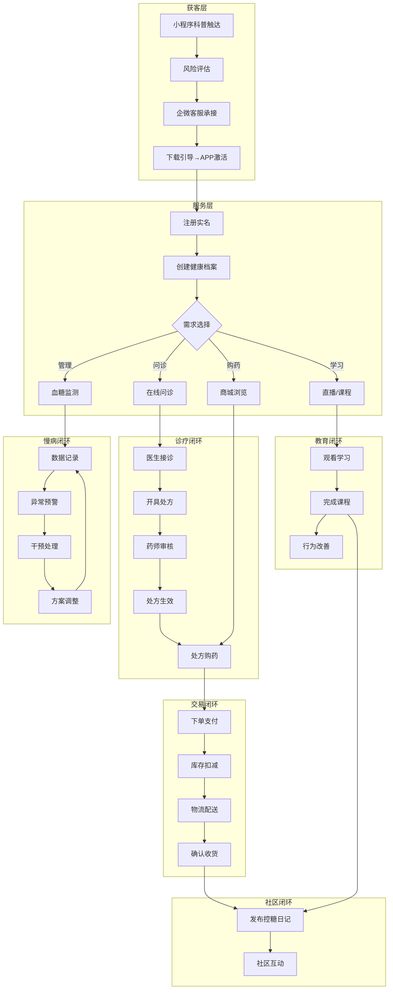
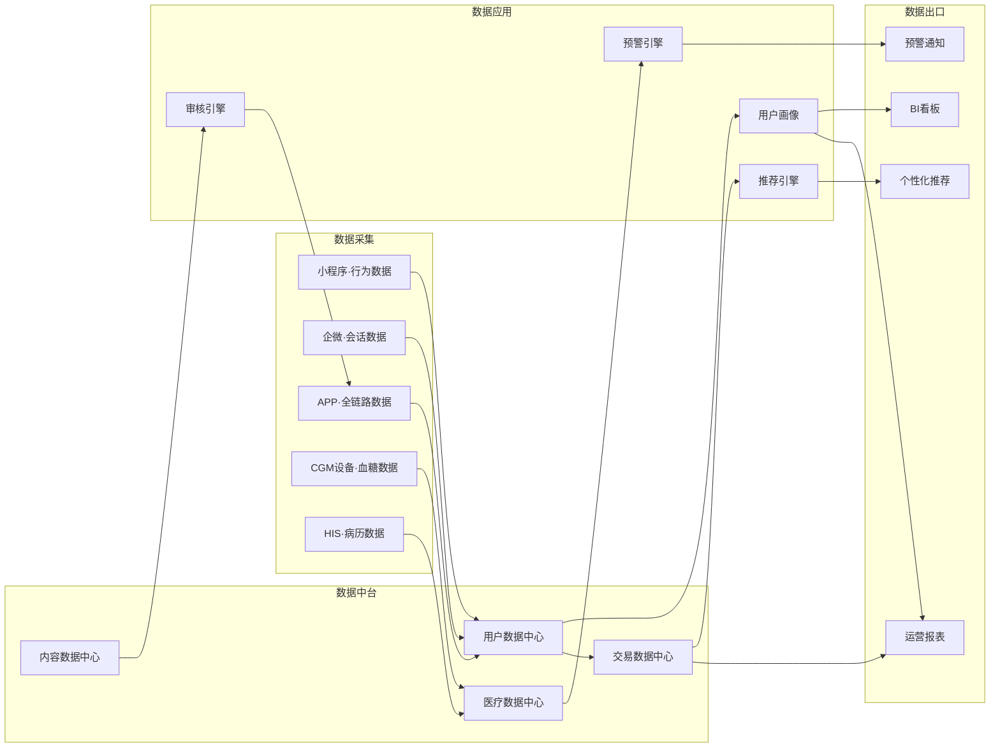
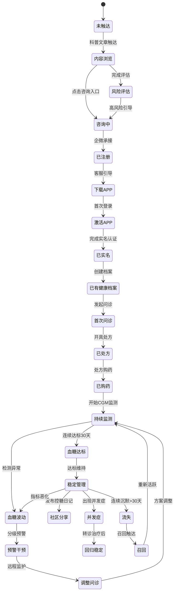
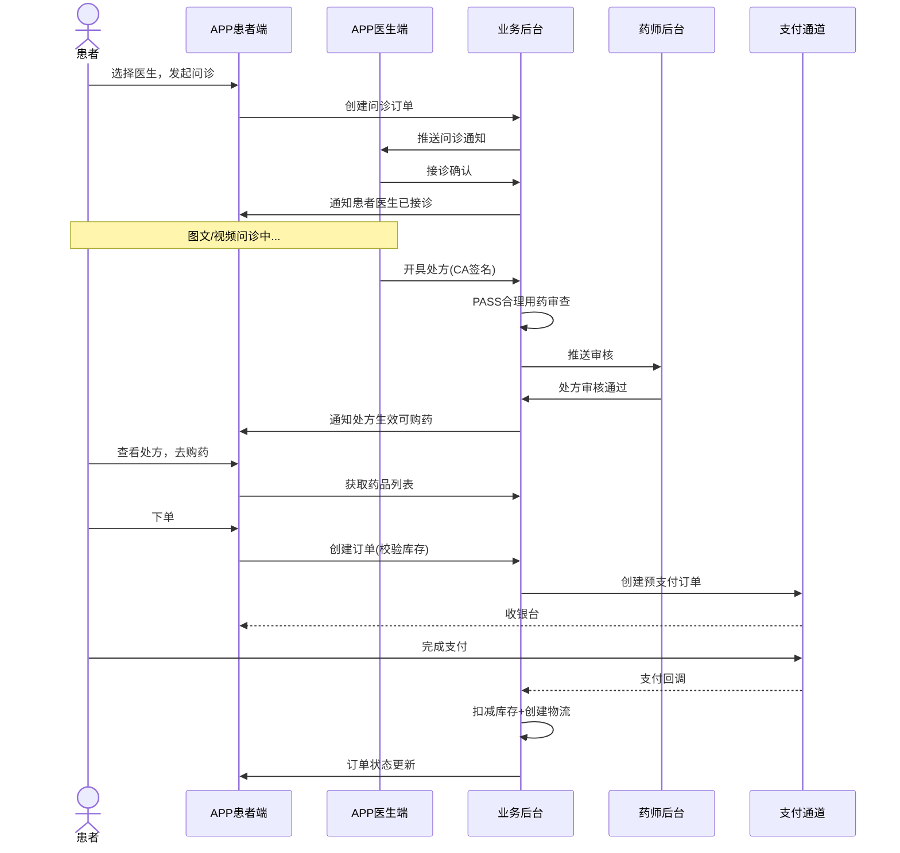
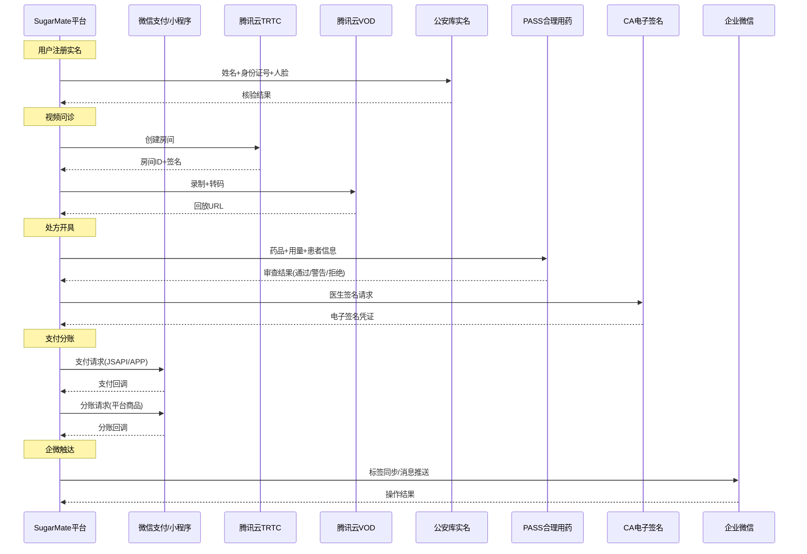

# SugarMate（糖友之家）— 产品需求文档 PRD v1.0.0

> **项目**：SugarMate（糖友之家）  
> **版本**：v1.0.0（初版，基于脑暴v4.1确认稿）  
> **状态**：✅ 需求分析完成，待checkpoint确认  
> **日期**：2026-07-27  
> **脑暴议题**：糖友之家  
> **来源**：`confirmed/BR-脑暴文档-确认稿.md` v4.1（9/9决策已确认）

---

## §1 版本历史

| 版本 | 日期 | 作者 | 变更摘要 |
|------|------|------|----------|
| v1.0.0 | 2026-07-27 | BA Agent | 基于脑暴v4.1确认稿新建，9/9决策落地 |

---

## §2 背景与问题陈述

### 2.1 市场背景

中国糖尿病患者超1.4亿，居全球首位。糖尿病管理面临三大痛点：
- **知晓率低**：超50%患者未得到诊断
- **控制率低**：仅15.8%患者血糖达标
- **管理碎片化**：患者诊疗、用药、监测、教育数据分散在不同机构

### 2.2 产品定位

**SugarMate（糖友之家）** 是一站式糖尿病全病程管理平台。以小程序获客引流→APP承接深度服务→业务后台管控运营，覆盖科普教育、在线问诊、电子处方、电商购药、CGM监测、饮食运动、患者社区的完整闭环。

### 2.3 核心决策（已确认）

| # | 决策 | 影响 |
|---|------|------|
| D1 | 自营+平台混合入驻 | S56-S59 |
| D2 | 药房+库存+结算 | S28/S56/S59 |
| D3 | 签约+入驻混合医生来源 | S20-S25 |
| D4 | 免费+付费会员 | 全场景 |
| D5 | 直播科普+带货 | S08/S52 |
| D6 | 轻社区（不做达人体系） | S48-S51 |
| D7 | 对接市面CGM+预取自研 | S41-S42 |
| D8 | 保险/数据架构预留 | 架构 |
| D9 | 专注糖尿病 | 全域 |

---

## §3 目标与成功度量

### 3.1 业务目标（BO）

| BO | 描述 | 测量方式 |
|----|------|----------|
| BG-01 | 提升糖尿病患者血糖达标率 | 用户CGM数据统计 |
| BG-02 | 降低糖尿病并发症发生率 | 长期队列跟踪 |
| BG-03 | 提升患者用药依从性 | 购药复购率 |
| BG-04 | 构建糖友社区活跃生态 | DAU/MAU/留存 |
| BG-05 | 实现商业化盈利 | GMV/会员收入 |

### 3.2 关键成功指标（METRIC）

| 指标 | 目标值 | 量测周期 |
|------|--------|----------|
| 小程序月活用户 | ≥10万 | 月 |
| 小程序→APP转化率 | ≥15% | 月 |
| APP DAU | ≥5万 | 日 |
| 用户7日留存 | ≥40% | 周 |
| 血糖达标率提升 | ≥20% vs 基线 | 季 |
| 复购率（药物） | ≥40% | 月 |
| 售后率 | ≤3% | 月 |
| 课程完成率 | ≥60% | 月 |
| NPS | ≥50 | 季 |
| 获客成本 | ≤30元/人 | 月 |

---

## §4 范围与边界

### 4.1 In-Scope（本次全量范围）

| 域 | 终端 | 场景数 | 编号范围 |
|----|------|--------|----------|
| 小程序·获客引流 | MP | 8 | S01-S08 |
| 企微SCRM·转化 | SCRM | 7 | S09-S15 |
| APP·用户档案 | APP | 4 | S16-S19 |
| APP·在线问诊 | APP | 6 | S20-S25 |
| APP·电子处方+购药 | APP | 7 | S26-S32 |
| APP·综合商城 | APP | 8 | S33-S40 |
| APP·慢病管理 | APP | 7 | S41-S47 |
| APP·患者社区 | APP | 4 | S48-S51 |
| APP·直播课程 | APP | 4 | S52-S55 |
| 后台·商家入驻+运营 | PC | 4 | S56-S59 |
| 后台·数据看板 | PC | 2 | S60-S61 |

### 4.2 Non-Goals（本次不做）

- 保险产品销售（D8架构预留）
- 多病种扩展（D9专注糖尿病）
- 数据服务对外售卖
- 硬件设备自研（D7仅预取通道）
- 社区达人认证体系（D6轻社区）

---

## §5 与既有模块关系

> 全新项目，无既有模块。架构层面预留（D8保险/数据扩展点）。

---

## §6 业务目标映射

### 6.1 业务目标（BG）

| BG编号 | 业务目标 | 关联BO | 核心场景 |
|--------|----------|--------|----------|
| BG-SUG-001 | 获客引流能力 | BO-05 | S01-S08 |
| BG-SUG-002 | 线上问诊服务 | BO-01 | S20-S25 |
| BG-SUG-003 | 处方药销售 | BO-02/BO-05 | S26-S32 |
| BG-SUG-004 | 慢病持续管理 | BO-01/BO-02 | S41-S47 |
| BG-SUG-005 | 患者教育 | BO-01/BO-04 | S48-S55 |
| BG-SUG-006 | 电商变现 | BO-05 | S33-S40 |
| BG-SUG-007 | 平台生态 | BO-05 | S56-S59 |
| BG-SUG-008 | 数据驱动运营 | BO-03 | S60-S61 |

---

## §7 参与者（16类）

| # | 参与者 | 缩写 | 终端 | 角色描述 |
|----|--------|------|------|----------|
| P1 | 患者 Patient | PT | MP/APP | C端核心用户，全链路唯一标识主体 |
| P2 | 医生 Doctor | DR | APP/PC | 签约医生+入驻医生双模式 |
| P3 | 药师 Pharmacist | PH | PC | 处方审核独立角色 |
| P4 | 营养师 Nutritionist | NT | APP/PC | 饮食管理与食谱设计 |
| P5 | 健康管理师 HealthMgr | HM | APP/PC | 血糖监护与预警处理 |
| P6 | 客服 CSR | CS | PC/SCRM | 企微承接+IM客服 |
| P7 | 运营人员 Operator | OP | PC | 内容/活动/数据运营 |
| P8 | 商家 Merchant | MC | PC | 入驻药房/器械商 |
| P9 | 平台管理员 Admin | AD | PC | 系统配置+审核+权限 |
| P10 | 主播 Host | HS | APP | 直播课程讲师 |
| P11 | 达人 KOL | KL | APP | 社区内容贡献者 |
| P12 | 家属 Family | FM | APP | 关联患者远程监护 |
| P13 | 系统 System | SYS | — | 自动化处理 |
| P14 | CGM设备 Device | DEV | — | 血糖数据自动上报 |
| P15 | 物流方 Logistics | LG | — | 配送状态回传 |
| P16 | 支付通道 Payment | PAY | — | 支付/退款通知 |

---

## §8 系统类型声明

| 维度 | 声明 |
|------|------|
| **业务系统** | 小程序获客系统 / APP患者服务系统 / 业务后台管理系统 |
| **终端** | MP（微信小程序）、APP（iOS+Android移动端）、PC（Web管理后台） |
| **后端类型** | B2B2C平台型（自营+平台混合电商）+ 医疗服务SaaS |
| **前端类型** | 微信小程序（获客轻量级）+ APP（深度服务+交易）+ PC后台（管理配置） |
| **编号体系** | FN-{系统缩写}-{终端缩码}-{NNN}，如 FN-SUG-MP-001 |
| **设计密度** | 小程序：中等 / APP：高 / PC后台：中等 |

### 系统缩写映射

| 系统 | 缩写 | 终端 | 终端缩码 |
|------|------|------|----------|
| SugarMate 小程序 | SUG | 微信小程序 | MP |
| SugarMate APP | SUG | iOS/Android | APP |
| SugarMate 业务后台 | SUG | PC Web | PC |

---

## §9 功能需求列表（FN清单）

### 9.1 小程序端（MP）

| FN编号 | 功能名称 | 场景来源 | 优先级 | 自动化类型 |
|--------|----------|----------|--------|-----------|
| FN-SUG-MP-001 | 科普内容浏览 | S01 | P0 | 手动+系统自动 |
| FN-SUG-MP-002 | 糖尿病风险评估 | S02 | P0 | 手动+系统自动 |
| FN-SUG-MP-003 | 商品推荐与浏览 | S03 | P1 | 手动 |
| FN-SUG-MP-004 | 在线咨询入口 | S04 | P0 | 手动 |
| FN-SUG-MP-005 | APP下载引导 | S05 | P0 | 手动+系统自动 |
| FN-SUG-MP-006 | 用户注册与登录 | S01/S05 | P0 | 手动+系统自动 |
| FN-SUG-MP-007 | 活动与裂变分享 | S07 | P1 | 手动+系统自动 |
| FN-SUG-MP-008 | 直播预告与观看 | S08 | P1 | 手动+系统自动 |

### 9.2 APP端（APP）

| FN编号 | 功能名称 | 场景来源 | 优先级 | 自动化类型 |
|--------|----------|----------|--------|-----------|
| FN-SUG-APP-001 | 用户注册与实名认证 | S16/S19 | P0 | 手动+系统自动 |
| FN-SUG-APP-002 | 健康档案管理 | S16/S17 | P0 | 手动+系统自动 |
| FN-SUG-APP-003 | 个人信息与设置 | S18 | P1 | 手动 |
| FN-SUG-APP-004 | 在线问诊-图文咨询 | S20 | P0 | 手动+系统自动 |
| FN-SUG-APP-005 | 在线问诊-视频问诊 | S21 | P0 | 手动+系统自动 |
| FN-SUG-APP-006 | 医生列表与搜索 | S22 | P0 | 手动+系统自动 |
| FN-SUG-APP-007 | 就诊记录与复诊 | S23 | P0 | 手动+系统自动 |
| FN-SUG-APP-008 | 转诊与紧急处置 | S24 | P1 | 手动+事件驱动 |
| FN-SUG-APP-009 | 医生评价与反馈 | S25 | P1 | 手动 |
| FN-SUG-APP-010 | 电子处方开具 | S26 | P0 | 手动+系统自动 |
| FN-SUG-APP-011 | 处方审核 | S27 | P0 | 手动+系统自动 |
| FN-SUG-APP-012 | 处方购药与续方 | S28 | P0 | 手动+系统自动 |
| FN-SUG-APP-013 | 用药提醒与记录 | S29 | P0 | 系统自动+手动 |
| FN-SUG-APP-014 | 药物相互作用检查 | S30 | P0 | 系统自动 |
| FN-SUG-APP-015 | CA电子签名 | S31 | P1 | 手动+系统自动 |
| FN-SUG-APP-016 | 处方流转到药房 | S32 | P0 | 系统自动 |
| FN-SUG-APP-017 | 商城首页与分类 | S33 | P0 | 手动 |
| FN-SUG-APP-018 | 商品搜索与筛选 | S34 | P1 | 手动+系统自动 |
| FN-SUG-APP-019 | 商品详情页 | S33/S35 | P0 | 手动 |
| FN-SUG-APP-020 | 购物车 | S35 | P0 | 手动+系统自动 |
| FN-SUG-APP-021 | 下单与支付 | S36 | P0 | 手动+系统自动 |
| FN-SUG-APP-022 | 退款与售后 | S37/S38 | P0 | 手动+系统自动 |
| FN-SUG-APP-023 | 处方药专区 | S26/S30/S35 | P0 | 手动+系统自动 |
| FN-SUG-APP-024 | 评价与晒单 | S39 | P1 | 手动 |
| FN-SUG-APP-025 | 订单管理 | S40 | P0 | 手动+系统自动 |
| FN-SUG-APP-026 | 血糖记录与监测 | S41 | P0 | 手动+系统自动 |
| FN-SUG-APP-027 | 血糖预警分级处理 | S42 | P0 | 系统自动+事件驱动 |
| FN-SUG-APP-028 | 血糖达标分析 | S43 | P0 | 系统自动 |
| FN-SUG-APP-029 | 智能用药提醒 | S44 | P0 | 系统自动 |
| FN-SUG-APP-030 | 饮食管理 | S45 | P1 | 手动+系统自动 |
| FN-SUG-APP-031 | 智能健康报告 | S46 | P1 | 系统自动 |
| FN-SUG-APP-032 | 远程监护（家属端） | S47 | P1 | 手动+系统自动 |
| FN-SUG-APP-033 | 控糖日记发布 | S48 | P1 | 手动+系统自动 |
| FN-SUG-APP-034 | 话题讨论 | S49 | P1 | 手动+系统自动 |
| FN-SUG-APP-035 | 点赞评论互动 | S50 | P1 | 手动 |
| FN-SUG-APP-036 | 内容举报与管理 | S51 | P1 | 手动+系统自动 |
| FN-SUG-APP-037 | 直播课程 | S52 | P1 | 手动+系统自动 |
| FN-SUG-APP-038 | 课程库与学习 | S53 | P1 | 手动+系统自动 |
| FN-SUG-APP-039 | 课程互动与问答 | S54 | P1 | 手动 |
| FN-SUG-APP-040 | 学习进度与记录 | S55 | P1 | 系统自动 |
| FN-SUG-APP-041 | 会员中心 | S01-S61 | P0 | 手动+系统自动 |
| FN-SUG-APP-042 | 消息通知中心 | S10/S14 | P0 | 系统自动+手动 |

### 9.3 PC后台端（PC）

| FN编号 | 功能名称 | 场景来源 | 优先级 | 自动化类型 |
|--------|----------|----------|--------|-----------|
| FN-SUG-PC-001 | 商品管理（自营+平台） | S56 | P0 | 手动+系统自动 |
| FN-SUG-PC-002 | 订单管理 | S57 | P0 | 手动+系统自动 |
| FN-SUG-PC-003 | 商家入驻审核与管理 | S58 | P0 | 手动+系统自动 |
| FN-SUG-PC-004 | 处方管理与审核 | S27/S59 | P0 | 手动+系统自动 |
| FN-SUG-PC-005 | 医生管理（签约+入驻） | S20-S25 | P0 | 手动+系统自动 |
| FN-SUG-PC-006 | 内容管理（CMS） | S01/S49/S53 | P0 | 手动+系统自动 |
| FN-SUG-PC-007 | 营销活动管理 | S07/S40 | P1 | 手动+系统自动 |
| FN-SUG-PC-008 | 会员管理 | 全场景 | P0 | 手动+系统自动 |
| FN-SUG-PC-009 | 用户管理 | S09-S15 | P0 | 手动 |
| FN-SUG-PC-010 | 结算与对账 | S36/S59 | P0 | 手动+系统自动 |
| FN-SUG-PC-011 | 数据看板与报表 | S60/S61 | P0 | 系统自动+手动 |
| FN-SUG-PC-012 | 系统配置 | — | P0 | 手动 |

### 9.4 企微SCRM（跨系统）

| FN编号 | 功能名称 | 场景来源 | 优先级 | 自动化类型 |
|--------|----------|----------|--------|-----------|
| FN-SUG-SCRM-001 | 企微客户承接 | S04/S09 | P0 | 手动+系统自动 |
| FN-SUG-SCRM-002 | 用户标签与分层 | S10 | P0 | 系统自动+手动 |
| FN-SUG-SCRM-003 | SOP话术管理 | S11 | P1 | 手动+系统自动 |
| FN-SUG-SCRM-004 | 客户群运营 | S12 | P1 | 手动+系统自动 |
| FN-SUG-SCRM-005 | 流失预警与召回 | S06/S10/S13 | P0 | 系统自动+手动 |
| FN-SUG-SCRM-006 | 消息触达（模板消息） | S13 | P0 | 系统自动 |
| FN-SUG-SCRM-007 | 离职继承 | S14 | P1 | 手动+系统自动 |
| FN-SUG-SCRM-008 | 数据统计与分析 | S15 | P1 | 系统自动 |

### 统计

| 终端 | FN数 | P0 | P1 |
|------|------|-----|-----|
| MP（小程序） | 8 | 6 | 2 |
| APP（移动端） | 42 | 23 | 19 |
| PC（后台） | 12 | 11 | 1 |
| SCRM（跨系统） | 8 | 4 | 4 |
| **合计** | **70** | **44** | **26** |

---

## §10 用例说明（UC）

> 以下按业务域组织核心用例。完整70个FN均有独立UC，此处展示关键用例的详细说明。
> 编号体系：UC-SUG-{终端}-{NNN}

---

### 10.1 小程序·获客（MP）

#### FN-SUG-MP-001：科普内容浏览

| 字段 | 内容 |
|------|------|
| **编号** | FN-SUG-MP-001 |
| **用例编号** | UC-SUG-MP-001 |
| **名称** | 科普内容浏览 |
| **页面** | 小程序首页→内容详情页 |
| **参与者** | P1（患者） |
| **优先级** | P0 |
| **关联BG** | BG-SUG-001 |
| **自动化类型** | 手动+系统自动 |

**前置条件**
- 用户已打开小程序
- 内容已由运营后台CMS发布

**基本流程**
1. [手动] 用户打开小程序，进入首页推荐流
2. [系统自动] 系统按推荐算法展示科普文章/视频列表，含标题、封面、阅读量
3. [手动] 用户点击感兴趣的内容卡片
4. [系统自动] 系统展示内容详情页（富文本/视频），记录阅读行为
5. [系统自动] 提升用户画像中对应标签权重，更新推荐模型
6. [手动] 用户可收藏、分享内容到微信

**备选流程**
- 3a. 内容已被运营下架 → 提示「内容已移除」，返回首页
- 4a. 视频加载失败 → 降级显示封面+文字摘要
- 5a. 用户未登录 → 匿名记录设备级行为

**数据范围** R-W
- R: 内容库（CMS）、用户画像标签
- W: 用户行为日志（浏览/点击/收藏/分享）、推荐模型权重

**后置条件**
- 用户行为已记录到日志
- 推荐模型已更新

**关联UC** UC-SUG-MP-002（风险评估）、UC-SUG-MP-006（注册登录）

---

#### FN-SUG-MP-002：糖尿病风险评估

| 字段 | 内容 |
|------|------|
| **编号** | FN-SUG-MP-002 |
| **用例编号** | UC-SUG-MP-002 |
| **名称** | 糖尿病风险评估 |
| **页面** | 小程序·风险评估页 |
| **参与者** | P1（患者） |
| **优先级** | P0 |
| **关联BG** | BG-SUG-001 |
| **自动化类型** | 手动+系统自动 |

**前置条件**
- 用户已进入风险评估页面

**基本流程**
1. [手动] 用户点击「糖尿病风险评估」入口（首页/科普文末）
2. [系统自动] 展示评估问卷（年龄/性别/BMI/家族史/生活习惯/既往血糖等多项）
3. [手动] 用户逐题作答
4. [系统自动] 实时校验答案完整性（必填项不能跳过）
5. [手动] 用户提交全部答案
6. [系统自动] 系统基于中国糖尿病风险评分模型（CDRS）计算风险等级
7. [系统自动] 展示评估结果页：风险等级（低/中/高）+ 各维度解读 + 建议
8. [系统自动] 高风险用户展示「在线咨询」入口引导

**备选流程**
- 3a. 用户中途退出 → 保存已填内容，下次继续
- 5a. 必填项未完成 → 标记未填写项，阻止提交
- 7a. 低风险用户 → 展示健康建议，不展示咨询入口
- 8a. 用户已在企微中 → 标记风险等级到SCRM标签

**数据范围** R-W
- R: CDRS风险评分模型参数
- W: 评估记录（答案+得分+风险等级）、用户标签

**后置条件**
- 评估记录已保存
- 用户SCRM标签已更新（如有）
- 高风险用户可跳转咨询入口

**关联UC** UC-SUG-MP-001（科普）、UC-SUG-MP-004（咨询入口）

---

#### FN-SUG-MP-004：在线咨询入口

| 字段 | 内容 |
|------|------|
| **编号** | FN-SUG-MP-004 |
| **用例编号** | UC-SUG-MP-004 |
| **名称** | 在线咨询入口 |
| **页面** | 小程序·咨询入口/首页悬浮按钮 |
| **参与者** | P1（患者）、P6（客服） |
| **优先级** | P0 |
| **关联BG** | BG-SUG-001 |
| **自动化类型** | 手动 |

**前置条件**
- 用户已查看科普内容或完成风险评估
- 企微客服已配置

**基本流程**
1. [手动] 用户点击「在线咨询」按钮（首页悬浮/科普文末/评估结果页）
2. [系统自动] 判断用户是否已在企微好友列表
3. [系统自动] 未添加者 → 展示企微二维码 + 引导语「扫码添加您的专属健康顾问」
4. [手动] 用户扫码添加企微
5. [系统自动] 企微自动通过好友，发送欢迎语+服务介绍
6. [系统自动] 根据用户来源（科普/评估）打上对应标签

**备选流程**
- 2a. 用户已添加企微 → 直接跳转到企微聊天（微信scheme跳转）
- 5a. 客服不在线 → 自动回复：服务时间+快捷留言

**数据范围** R-W
- R: 企微客服配置、用户企微关系
- W: 企微好友添加记录、用户来源标签

**后置条件**
- 用户已添加企微好友（或已跳转聊天）
- SCRM用户标签已更新

**关联UC** UC-SUG-SCRM-001（企微承接）、UC-SUG-MP-005（APP下载引导）

---

### 10.2 APP·用户档案（APP）

#### FN-SUG-APP-001：用户注册与实名认证

| 字段 | 内容 |
|------|------|
| **编号** | FN-SUG-APP-001 |
| **用例编号** | UC-SUG-APP-001 |
| **名称** | 用户注册与实名认证 |
| **页面** | APP·注册页→实名认证页 |
| **参与者** | P1（患者） |
| **优先级** | P0 |
| **关联BG** | BG-SUG-002 |
| **自动化类型** | 手动+系统自动 |

**前置条件**
- 用户已下载安装APP
- 手机号可用、身份证在手边

**基本流程**
1. [手动] 用户打开APP，进入欢迎页
2. [手动] 用户点击「注册」，输入手机号，获取验证码
3. [系统自动] 发送短信验证码
4. [手动] 用户输入验证码，设置密码（或微信一键登录）
5. [系统自动] 创建账号，分配用户ID
6. [系统自动] 引导进入实名认证：提示「实名认证后方可使用问诊和购药服务」
7. [手动] 用户输入姓名+身份证号+人脸识别
8. [系统自动] 调用公安库实名核验API
9. [系统自动] 核验通过→实名标记为已认证，可正常使用全部功能

**备选流程**
- 2a. 微信授权登录 → 跳过手机号，直接获取微信信息创建账号
- 4a. 验证码超时 → 提示重新获取
- 8a. 实名核验失败 → 提示核对信息，允许重试3次；超出则提示联系客服
- 9a. 用户跳过实名 → 可浏览内容但限制问诊/购药功能

**数据范围** R-W
- R: 短信服务配置、公安库核验API
- W: 用户账号表、实名信息（加密存储）

**后置条件**
- 用户账号已创建
- 实名认证状态已标记
- 新用户引导流程触发

**关联UC** UC-SUG-APP-002（健康档案）、UC-SUG-APP-004（在线问诊）

---

### 10.3 APP·在线问诊（APP）

#### FN-SUG-APP-004：在线问诊-图文咨询

| 字段 | 内容 |
|------|------|
| **编号** | FN-SUG-APP-004 |
| **用例编号** | UC-SUG-APP-004 |
| **名称** | 在线问诊-图文咨询 |
| **页面** | APP·问诊首页→医生详情→图文咨询页 |
| **参与者** | P1（患者）、P2（医生） |
| **优先级** | P0 |
| **关联BG** | BG-SUG-002 |
| **自动化类型** | 手动+系统自动 |

**前置条件**
- 用户已完成实名认证
- 医生在线且可接诊

**基本流程**
1. [手动] 用户进入问诊首页，浏览医生列表或搜索医生
2. [手动] 用户选择医生→进入医生主页（简介/职称/擅长/评价/费用）
3. [手动] 用户点击「图文咨询」→进入咨询下单页
4. [手动] 用户填写病情描述（症状/持续时间/用药情况）+ 上传检查报告图片
5. [手动] 用户选择问诊时长（15min/30min），确认费用，点击支付
6. [系统自动] 创建问诊订单，进入待接诊状态
7. [系统自动] 推送问诊通知给医生
8. [手动] 医生接诊→进入IM聊天界面
9. [手动] 医患文字+图片交流
10. [系统自动] 问诊结束自动结算，生成问诊记录

**备选流程**
- 5a. 签约医生 → 按排班表确认是否在值班时间，不在则提示「医生当前未排班」
- 5b. 入驻医生 → 医生自主设置接诊状态，离线时提示「医生暂未在线，可留言」
- 7a. 医生超时未接诊（15min）→ 自动退款，推荐其他医生
- 8a. 医生拒诊 → 说明原因，退款，推荐同科室医生
- 9a. 检查报告识别失败 → 提示用户重新上传或手动输入

**数据范围** R-W
- R: 医生信息（简介/职称/排班）、问诊价格、用户档案
- W: 问诊订单、IM聊天记录（加密存储）、问诊记录

**后置条件**
- 问诊订单已完成/取消
- 问诊记录已生成
- 医生接诊统计已更新

**关联UC** UC-SUG-APP-005（视频问诊）、UC-SUG-APP-007（问诊记录）、UC-SUG-APP-010（处方开具）

---

#### FN-SUG-APP-005：在线问诊-视频问诊

| 字段 | 内容 |
|------|------|
| **编号** | FN-SUG-APP-005 |
| **用例编号** | UC-SUG-APP-005 |
| **名称** | 在线问诊-视频问诊 |
| **页面** | APP·视频问诊页（TRTC） |
| **参与者** | P1（患者）、P2（医生） |
| **优先级** | P0 |
| **关联BG** | BG-SUG-002 |
| **自动化类型** | 手动+系统自动 |

**前置条件**
- 用户已完成实名认证
- 医生排班确认、摄像头/麦克风权限已授权
- 已支付视频问诊费用

**基本流程**
1. [手动] 用户在医生主页点击「视频问诊」→预约时间
2. [系统自动] 展示医生可预约时间段（基于排班表）
3. [手动] 用户选择时间段，填写病情预描述，支付
4. [系统自动] 创建视频问诊预约单，推送通知给医生
5. [事件驱动] 预约时间前5分钟，系统推送提醒给双方
6. [手动] 医患双方进入视频房间（腾讯云TRTC）
7. [系统自动] 视频通话中，系统录制（加密存储）
8. [手动] 医生可共享屏幕查看报告、标注关键指标
9. [手动] 问诊结束，任一方点击「结束」
10. [系统自动] 录制文件转码→存储到VOD，关联问诊记录

**备选流程**
- 5a. 患者迟到 >5min → 医生可取消，费用不退还
- 5b. 医生迟到 >5min → 自动退款+补偿优惠券
- 6a. 网络质量差 → 降级为语音模式，保留关键画面截图
- 7a. 录制失败 → 标记，人工核对问诊记录
- 10a. 紧急情况（医生判断需立即就医）→ 一键标记紧急+推送就近医院

**数据范围** R-W
- R: 医生排班表、TRTC房间配置、用户档案
- W: 视频问诊订单、录制文件、问诊记录

**后置条件**
- 视频录制已保存
- 问诊记录已生成
- 医生排班状态更新

**关联UC** UC-SUG-APP-004（图文问诊）、UC-SUG-APP-010（处方开具）

---

### 10.4 APP·电子处方（APP）

#### FN-SUG-APP-010：电子处方开具

| 字段 | 内容 |
|------|------|
| **编号** | FN-SUG-APP-010 |
| **用例编号** | UC-SUG-APP-010 |
| **名称** | 电子处方开具 |
| **页面** | APP·医生端·处方开具页 |
| **参与者** | P2（医生）、P1（患者） |
| **优先级** | P0 |
| **关联BG** | BG-SUG-003 |
| **自动化类型** | 手动+系统自动 |

**前置条件**
- 问诊已完成（图文或视频）
- 医生已确认为签约或在入驻状态
- 患者实名认证已完成

**基本流程**
1. [手动] 医生在问诊结束后点击「开具处方」
2. [系统自动] 加载患者档案：年龄/性别/过敏史/既往用药/诊断记录
3. [手动] 医生填写诊断信息：诊断名称（ICD-10编码）、病情说明
4. [手动] 医生添加处方药品：搜索药品→选规格→填写用法用量→选天数
5. [系统自动] 调用PASS合理用药审查：药物相互作用/过敏/禁忌/剂量
6. [手动] 医生确认处方内容，电子签名（CA）
7. [系统自动] 生成电子处方（含处方号/诊断/药品清单/用法/医生签名/有效期）
8. [系统自动] 处方进入待审核状态，推送给药师

**备选流程**
- 5a. PASS审查不通过 → 标记问题项，医生须修改或说明理由
- 5b. 处方药超量（如>30天）→ 系统拦截，需特别说明
- 6a. CA签名失败 → 重试，失败则保存草稿
- 8a. 处方开具后，患者端展示处方摘要和预估费用

**数据范围** R-W
- R: 患者档案（过敏史/既往用药）、药品库、PASS规则引擎
- W: 处方主表+明细、CA签名记录、审核状态

**后置条件**
- 电子处方已生成（待审核）
- PASS审查记录已保留
- 患者端可查看处方

**关联UC** UC-SUG-APP-004/005（问诊）、UC-SUG-APP-011（处方审核）、UC-SUG-APP-014（相互作用检查）

---

#### FN-SUG-APP-011：处方审核

| 字段 | 内容 |
|------|------|
| **编号** | FN-SUG-APP-011 |
| **用例编号** | UC-SUG-APP-011 |
| **名称** | 处方审核 |
| **页面** | PC后台·处方审核页 |
| **参与者** | P3（药师） |
| **优先级** | P0 |
| **关联BG** | BG-SUG-003 |
| **自动化类型** | 手动+系统自动 |

**前置条件**
- 处方已生成（待审核状态）
- 药师已登录后台

**基本流程**
1. [系统自动] 处方生成后，推送到药师审核队列
2. [手动] 药师登录后台→处方审核列表（按紧急程度排序）
3. [手动] 药师点开处方详情：诊断/患者档案/PASS审查结果/药品清单/用法用量
4. [系统自动] PASS审查结果高亮展示：通过/警告/拒绝
5. [手动] 药师综合判断：通过（签名）/驳回（写明原因）/修改（调整用法用量）
6. [系统自动] 审核通过→处方生效，推送通知给患者（可购药）
7. [系统自动] 审核驳回→推送通知给医生（说明原因），医生可修改后重新提交

**备选流程**
- 5a. 处方药（Rx）处方必须药师人工审核，不得自动通过
- 5b. OTC处方→系统可自动审核通过（在PASS全部通过的前提下）
- 5c. 药师超时未审（>2h工作时间内）→ 系统预警，转其他药师

**数据范围** R-W
- R: 处方详情、PASS审查结果、患者档案
- W: 处方审核状态、药师签名、审核意见

**后置条件**
- 处方状态已更新（已审核/已驳回）
- 患者/医生已收到通知
- 审核记录已存档

**关联UC** UC-SUG-APP-010（处方开具）、UC-SUG-APP-012（处方购药）、UC-SUG-APP-014（相互作用检查）

---

### 10.5 APP·综合商城（APP）

#### FN-SUG-APP-021：下单与支付

| 字段 | 内容 |
|------|------|
| **编号** | FN-SUG-APP-021 |
| **用例编号** | UC-SUG-APP-021 |
| **名称** | 下单与支付 |
| **页面** | APP·确认订单页→支付收银台 |
| **参与者** | P1（患者）、P16（支付通道） |
| **优先级** | P0 |
| **关联BG** | BG-SUG-006 |
| **自动化类型** | 手动+系统自动 |

**前置条件**
- 用户已登录并实名
- 购物车中有商品
- 收货地址已填写

**基本流程**
1. [手动] 用户在购物车点击「结算」→进入确认订单页
2. [系统自动] 展示订单明细：商品列表/单价/数量/优惠/运费/总价
3. [系统自动] 调用库存服务校验：每个SKU库存≥订购量
4. [系统自动] 计算会员折扣价（付费会员专属折扣）
5. [手动] 用户选择支付方式（微信支付/支付宝）
6. [手动] 用户确认收货地址、发票信息（可选）
7. [手动] 用户点击「提交订单」
8. [系统自动] 调用支付通道创建预支付订单→锁定库存
9. [手动] 用户在支付收银台完成支付（指纹/密码/面容）
10. [系统自动] 接收支付回调→更新订单状态为「已支付」→扣减库存→创建物流单

**备选流程**
- 3a. 某SKU库存不足 → 标记「缺货」，提示调整数量或移除
- 3b. 处方药 → 额外校验用户是否有有效处方
- 4a. 付费会员 → 显示原价划线和会员价
- 5a. 自营商品走自营收款，平台商品走分账（微信分账/支付宝分账）
- 8a. 库存已被锁定超时（15min未支付）→ 释放库存，订单取消
- 10a. 支付超时 → 订单自动取消，归还库存
- 10b. 部分退款场景 → 售后流程处理

**数据范围** R-W
- R: 商品库、库存、会员级别、收货地址、微信/支付宝支付配置
- W: 订单主表+明细、支付流水、库存扣减记录、物流单

**后置条件**
- 订单已创建（已支付）
- 库存已扣减
- 物流单已创建（实物商品）
- 支付流水已记录

**关联UC** UC-SUG-APP-020（购物车）、UC-SUG-APP-025（订单管理）、UC-SUG-APP-022（退款售后）

---

### 10.6 APP·慢病管理（APP）

#### FN-SUG-APP-027：血糖预警分级处理

| 字段 | 内容 |
|------|------|
| **编号** | FN-SUG-APP-027 |
| **用例编号** | UC-SUG-APP-027 |
| **名称** | 血糖预警分级处理 |
| **页面** | APP·血糖详情页→预警通知→健康管理师后台 |
| **参与者** | P1（患者）、P5（健康管理师）、P13（系统）、P14（CGM设备） |
| **优先级** | P0 |
| **关联BG** | BG-SUG-004 |
| **自动化类型** | 系统自动+事件驱动 |

**前置条件**
- CGM设备正在监测血糖（D7：对接市面设备）
- 用户已设置个人血糖阈值范围
- 健康管理师在线

**基本流程**
1. [事件驱动] CGM设备上传实时血糖数据到平台
2. [系统自动] 系统比对当前血糖值 vs 用户个人阈值范围
3. [系统自动] 分级判断：
   - 🟢 正常（空腹3.9-6.1 / 餐后<7.8）→ 仅记录
   - 🟡 轻度异常（空腹6.1-7.0 / 餐后7.8-11.1）→ APP内提示+饮食建议
   - 🟠 中度异常（空腹7.0-13.9 / 餐后11.1-16.7）→ APP弹窗警告+推送通知+建议联系医生
   - 🔴 严重异常（<3.9 低血糖 或 >16.7 高血糖）→ 紧急电话提醒+通知家属+通知健康管理师
4. [系统自动] 🟠🔴级别：自动推送预警到健康管理师后台
5. [手动] 健康管理师查看预警详情：用户血糖曲线/趋势/历史预警
6. [手动] 健康管理师电话联系用户，评估情况
7. [手动] 健康管理师记录干预操作：电话沟通/建议就医/调整用药建议
8. [系统自动] 干预记录关联用户档案，更新预警状态

**备选流程**
- 1a. CGM设备信号丢失 >30min → 最后一次数据标记为「数据中断」，推送提醒用户检查设备
- 1b. 手动录入血糖（无CGM设备）→ 按用户手动输入的时间和数据触发分级判断
- 3a. 连续3次🟡级别 → 升级为🟠处理
- 5a. 健康管理师超时未处理（🟠5min / 🔴3min）→ 升级告警，转其他管理师
- 6a. 用户电话未接通 → 立即通知家属（已绑定的家属端）

**数据范围** R-W
- R: 用户血糖阈值设置、CGM设备数据、家属绑定关系、健康管理师排班
- W: 血糖记录（时序数据）、预警记录、干预记录、通知推送记录

**后置条件**
- 血糖值已记录在用户档案
- 预警状态已更新（已处理/已关闭）
- 干预记录已保存
- 用户/家属/管理师通知已发送

**关联UC** UC-SUG-APP-026（血糖记录）、UC-SUG-APP-028（达标分析）、UC-SUG-APP-032（家属远程监护）

---

### 10.7 后台·入驻管理（PC）

#### FN-SUG-PC-003：商家入驻审核与管理

| 字段 | 内容 |
|------|------|
| **编号** | FN-SUG-PC-003 |
| **用例编号** | UC-SUG-PC-003 |
| **名称** | 商家入驻审核与管理 |
| **页面** | PC后台·商家入驻审核页→商家管理页 |
| **参与者** | P9（平台管理员）、P8（商家） |
| **优先级** | P0 |
| **关联BG** | BG-SUG-007 |
| **自动化类型** | 手动+系统自动 |

**前置条件**
- D1决策：自营+平台混合入驻
- 商家已提交入驻申请

**基本流程**
1. [手动] 商家在入驻页面提交申请：企业资质/药房许可证（GSP）/法人信息/结算账户
2. [系统自动] OCR识别+基础校验：文件完整性、营业执照有效性
3. [手动] 平台管理员登录后台→入驻审核列表
4. [手动] 管理员逐项核对：企业资质/药品经营许可证/执业药师注册证/GSP认证
5. [手动] 审核通过→设置商家信息（店铺名称/类目/结算周期/分账比例）
6. [系统自动] 开通商家账号，生成商家后台权限
7. [系统自动] 通知商家审核通过，引导商家上架商品

**备选流程**
- 4a. 药房入驻（D2）→ 还需审核GSP合规文件+对接库存系统
- 5a. 审核不通过 → 填写驳回原因，商家修改后重新提交
- 5b. 自营商品 → 无需入驻审核，由平台直接管理
- 7a. 入驻后商家需完成：上架≥5商品后才可激活店铺

**数据范围** R-W
- R: 入驻申请资料、GSP合规标准
- W: 商家账号+权限、店铺信息、分账配置

**后置条件**
- 商家账号已激活
- 店铺已创建
- 分账配置已生效

**关联UC** UC-SUG-PC-001（商品管理）、UC-SUG-PC-010（结算对账）

---

## §11 业务规则（BR）

| BR编号 | 规则描述 | 关联FN/UC | 触发条件 | 行为 |
|--------|----------|-----------|----------|------|
| BR-SUG-001 | 实名认证前置 | UC-SUG-APP-001 | 用户未实名时使用问诊/购药 | 引导完成实名认证 |
| BR-SUG-002 | 处方有效期48h | UC-SUG-APP-012 | 处方审核通过 | 48h内未购药自动失效 |
| BR-SUG-003 | 处方药必须处方 | UC-SUG-APP-021 | 购物车含Rx商品 | 校验有效处方，无处方拦截 |
| BR-SUG-004 | PASS审查强制 | UC-SUG-APP-010 | 医生开具处方 | 必须PASS审查通过/警告说明后继续 |
| BR-SUG-005 | 药师独立审核 | UC-SUG-APP-011 | 处方药处方 | 必须药师人工审核，不可自动通过 |
| BR-SUG-006 | CGM分级预警 | UC-SUG-APP-027 | 血糖异常值 | 按四色分级触发对应处理 |
| BR-SUG-007 | 库存扣减锁定 | UC-SUG-APP-021 | 提交订单 | 锁定库存，15min未支付释放 |
| BR-SUG-008 | 分账比例 | UC-SUG-PC-003 | 平台商品交易 | 按商家入驻时约定比例分账 |
| BR-SUG-009 | 付费会员折扣 | UC-SUG-APP-021 | 下单 | 付费会员享受专属商品折扣 |
| BR-SUG-010 | 直播商品关联 | UC-SUG-APP-037 | 直播带货 | 直播间商品须预先绑定并审核 |
| BR-SUG-011 | 处方续方规则 | UC-SUG-APP-012 | 处方用完/过期 | 需重新问诊才能续方 |
| BR-SUG-012 | 问诊退款规则 | UC-SUG-APP-004/005 | 医生超时未接诊 | 全额退款 |
| BR-SUG-013 | 内容合规审核 | UC-SUG-PC-006 | 发布内容 | AI审核+人工抽审 |
| BR-SUG-014 | 社区内容审核 | UC-SUG-APP-033/034 | 发布日记/评论 | AI审核（敏感词/医疗广告），违规自动拦截 |
| BR-SUG-015 | 医生评价规则 | UC-SUG-APP-009 | 问诊结束后 | 必须评价后方可下次问诊 |

---

## §12 数据实体（ENT）

| ENT编号 | 实体名称 | 核心字段 | 关联FN |
|---------|----------|----------|--------|
| ENT-SUG-001 | 用户（Patient） | ID/手机号/微信UnionID/姓名/身份证号/实名状态/会员等级/创建时间 | APP-001 |
| ENT-SUG-002 | 健康档案（HealthProfile） | 用户ID/年龄/性别/身高/体重/BMI/过敏史/既往病史/家族史/血糖目标范围 | APP-002 |
| ENT-SUG-003 | 医生（Doctor） | ID/姓名/职称/科室/擅长/类型(签约/入驻)/执业证号/CA证书/问诊价格/排班 | APP-004/005 |
| ENT-SUG-004 | 问诊订单（ConsultOrder） | ID/患者ID/医生ID/类型(图文/视频)/状态/费用/开始时间/结束时间/处方ID | APP-004/005 |
| ENT-SUG-005 | 处方（Prescription） | ID/患者ID/医生ID/诊断/状态(待审核/已审核/已驳回/已失效)/开方时间/有效期 | APP-010 |
| ENT-SUG-006 | 处方明细（PrescriptionItem） | 处方ID/药品ID/规格/用量/频次/天数/PASS审查结果 | APP-010 |
| ENT-SUG-007 | 药品（Drug） | ID/名称/通用名/规格/剂型/类型(OTC/Rx)/生产厂家/批准文号/GSP编码 | APP-010/021 |
| ENT-SUG-008 | 商品（Product） | ID/SKU/名称/类目/类型(自营/平台)/价格/会员价/库存/商家ID/状态 | APP-017/019/021 |
| ENT-SUG-009 | 订单（Order） | ID/用户ID/订单号/类型(普通/处方药)/状态/金额/支付方式/支付时间 | APP-021/025 |
| ENT-SUG-010 | 订单明细（OrderItem） | 订单ID/商品ID/SKU/数量/单价/实付金额 | APP-021 |
| ENT-SUG-011 | 支付流水（Payment） | ID/订单ID/金额/支付通道/支付状态/交易号/分账状态 | APP-021 |
| ENT-SUG-012 | 物流单（Logistics） | 订单ID/物流公司/运单号/状态/发货时间/签收时间 | APP-025 |
| ENT-SUG-013 | 血糖记录（GlucoseRecord） | 用户ID/时间戳/血糖值/类型(空腹/餐前/餐后/随机)/来源(设备/手动)/设备ID | APP-026 |
| ENT-SUG-014 | 预警记录（Alert） | 用户ID/时间/血糖值/级别(🟢🟡🟠🔴)/处理人/处理状态/干预记录 | APP-027 |
| ENT-SUG-015 | 课程（Course） | ID/标题/讲师/分类/视频URL/时长/状态/发布时间 | APP-038 |
| ENT-SUG-016 | 学习记录（LearningRecord） | 用户ID/课程ID/进度/完成状态/最后观看位置 | APP-040 |
| ENT-SUG-017 | 内容（Content） | ID/标题/类型(文章/视频)/分类/作者/状态/发布时间 | MP-001/PC-006 |
| ENT-SUG-018 | 评价（Review） | ID/对象类型(医生/商品/课程)/对象ID/用户ID/评分/内容 | APP-009/024 |
| ENT-SUG-019 | 商家（Merchant） | ID/名称/类型(药房/器械)/资质/GSP证/结算账户/分账比例/状态 | PC-003 |
| ENT-SUG-020 | 会员（Membership） | 用户ID/等级(免费/付费)/开始时间/到期时间/自动续费状态 | APP-041 |

---

## §13 CONFIG（配置项清单）

### 13.1 全局参数

| CONFIG编号 | 配置项 | 类型 | 默认值 | 说明 |
|------------|--------|------|--------|------|
| CONFIG-SUG-001 | 处方有效期（h） | 数字 | 48 | 超时自动失效 |
| CONFIG-SUG-002 | 订单库存锁定超时（min） | 数字 | 15 | 超时释放库存 |
| CONFIG-SUG-003 | 医生接诊超时（min） | 数字 | 15 | 超时退款推荐 |
| CONFIG-SUG-004 | CGM数据中断阈值（min） | 数字 | 30 | 超时标记中断 |
| CONFIG-SUG-005 | 健康管理师响应时限🟠（min） | 数字 | 5 | 超时升级 |
| CONFIG-SUG-006 | 健康管理师响应时限🔴（min） | 数字 | 3 | 超时升级 |
| CONFIG-SUG-007 | 入驻审核超时（h） | 数字 | 48 | 超时预警 |

### 13.2 开关/控制器

| CONFIG编号 | 配置项 | 类型 | 默认值 |
|------------|--------|------|--------|
| CONFIG-SUG-101 | 直播带货功能 | 开关 | ON |
| CONFIG-SUG-102 | 社区功能 | 开关 | ON（轻社区） |
| CONFIG-SUG-103 | CGM设备对接 | 开关 | ON |
| CONFIG-SUG-104 | 付费会员 | 开关 | ON |
| CONFIG-SUG-105 | 平台入驻 | 开关 | ON |

---

## §14 METRIC（指标登记）

| METRIC编号 | 指标名称 | 行业标准 | 统计维度 | 目标值 | 量测周期 |
|------------|----------|----------|----------|--------|----------|
| METRIC-SUG-001 | 小程序MAU | SaaS·用户增长 | 小程序端 | ≥10万 | 月 |
| METRIC-SUG-002 | 小程序→APP转化率 | AARRR·Activation | 跨端漏斗 | ≥15% | 月 |
| METRIC-SUG-003 | APP DAU | SaaS·活跃度 | APP端 | ≥5万 | 日 |
| METRIC-SUG-004 | 7日留存率 | SaaS·留存 | APP端 | ≥40% | 周 |
| METRIC-SUG-005 | 血糖达标率 | 医疗·临床 | 慢病管理 | 提升≥20% | 季 |
| METRIC-SUG-006 | 复购率 | 电商·用户 | 商城 | ≥40% | 月 |
| METRIC-SUG-007 | 售后率 | 电商·服务 | 商城 | ≤3% | 月 |
| METRIC-SUG-008 | GMV | 电商·交易 | 商城 | 待定 | 月 |
| METRIC-SUG-009 | 问诊订单量 | 医疗·服务 | 问诊 | 待定 | 月 |
| METRIC-SUG-010 | 处方量 | 医疗·处方 | 处方 | 待定 | 月 |
| METRIC-SUG-011 | 课程完成率 | 教育·学习 | 直播课程 | ≥60% | 月 |
| METRIC-SUG-012 | NPS | SaaS·满意度 | 全平台 | ≥50 | 季 |
| METRIC-SUG-013 | 获客成本（CAC） | SaaS·获客 | 全平台 | ≤30元/人 | 月 |
| METRIC-SUG-014 | 预警响应率 | 医疗·质量 | 慢病管理 | ≥95% | 月 |
| METRIC-SUG-015 | 入驻商家数 | 平台·生态 | 后台 | 待定 | 月 |

---

## §14.5 验收标准

### 场景级E2E验收

| SC编号 | 场景 | Give-When-Then | 关联FN |
|--------|------|----------------|--------|
| SC-SUG-001 | 用户从科普到APP激活 | Given 用户打开小程序 → When 浏览科普→评估→咨询→下载APP → Then 用户完成APP注册实名 | MP-001/002/004/005、APP-001 |
| SC-SUG-002 | 在线问诊→处方→购药 | Given 用户已完成实名 → When 发起图文问诊→医生接诊→开具处方→药师审核→用户下单购药 → Then 订单已支付，物流已创建 | APP-004/010/011/012/021 |
| SC-SUG-003 | CGM预警→干预处理 | Given CGM设备监测中 → When 血糖异常触发🔴预警 → Then 用户/家属/管理师收到通知，干预记录已保存 | APP-026/027/032 |
| SC-SUG-004 | 直播带货转化 | Given 用户观看直播 → When 点击商品卡下单一键购买 → Then 订单已支付 | APP-037/021 |
| SC-SUG-005 | 商家入驻→上架→交易 | Given 商家提交入驻 → When 管理员审核通过→商家上架商品→用户购买→分账结算 → Then 商家收到分账款 | PC-003/001、APP-021、PC-010 |

### 功能级验收矩阵

| FN编号 | Given | When | Then |
|--------|-------|------|------|
| FN-SUG-MP-002 | 用户打开评估页 | 填写全部题目→提交 | 显示风险等级+建议 |
| FN-SUG-APP-004 | 用户选择医生 | 支付后等待接诊 | 医生接诊，IM通道建立 |
| FN-SUG-APP-010 | 医生完成问诊 | 开具处方+CA签名 | 处方生成，进入审核队列 |
| FN-SUG-APP-011 | 处方待审核 | 药师审核通过签名 | 处方生效，通知患者 |
| FN-SUG-APP-021 | 购物车有商品 | 选择支付方式→支付 | 订单已支付，库存已扣减 |
| FN-SUG-APP-027 | CGM设备上传异常值 | 系统分级判断 | 对应级别预警触发 |
| FN-SUG-PC-003 | 商家提交入驻 | 管理员审核通过 | 商家账号激活，店铺创建 |

---

## §15 五类图

### 15.1 业务流程图（整体泳道）

### 15.2 信息流转图（跨模块）

### 15.3 状态机（患者全病程）

### 15.4 业务时序图（核心：问诊→处方→购药）

### 15.5 三方接口时序图（外部系统集成）

---

## §16 外部接口标注

| 接口编号 | 外部系统 | 用途 | 协议 | 调用场景 |
|----------|----------|------|------|----------|
| API-001 | 微信小程序SDK | 小程序登录/分享/支付 | HTTPS+SDK | MP所有场景 |
| API-002 | 微信支付 | JSAPI支付/APP支付/分账/退款 | HTTPS API | APP-021/022/PC-010 |
| API-003 | 支付宝 | APP支付/分账/退款 | HTTPS API | APP-021/022/PC-010 |
| API-004 | 腾讯云TRTC | 视频问诊RTC | SDK+API | APP-005 |
| API-005 | 腾讯云IM | IM聊天（图文问诊）+直播群 | SDK | APP-004/037 |
| API-006 | 腾讯云VOD | 视频存储/转码/播放/直播/AI审核 | SDK+API | MP-001/APP-037/038/PC-006 |
| API-007 | 企业微信API | 客户管理/标签/消息/群 | API | FN-SUG-SCRM全系列 |
| API-008 | 公安库实名核验 | 身份证+姓名+人脸 | HTTPS API | APP-001 |
| API-009 | PASS合理用药 | 药物审查 | HTTPS API | APP-010/014 |
| API-010 | CA电子签名 | 处方电子签名 | SDK | APP-010/031 |
| API-011 | CGM设备对接 | 血糖数据同步 | BT+API | APP-026/027 |
| API-012 | 短信服务 | 验证码/通知 | HTTPS API | APP-001/027 |
| API-013 | 物流服务 | 运单/轨迹/签收 | HTTPS API | APP-025 |

---

## §17 需求深度分析摘要（§0.5c产出）

### 17.1 系统判定

| 维度 | 结论 |
|------|------|
| **后端类型** | B2B2C平台型（自营+平台混合电商）+ 医疗服务SaaS |
| **前端类型** | 微信小程序（获客层）+ APP（iOS/Android服务层）+ PC Web（管理层） |
| **终端** | MP（微信小程序）、APP（iOS/Android）、PC（Web管理后台） |
| **设计密度** | 小程序：中 / APP：高（全链路服务）/ PC：中 |
| **数据规模** | 预计10万+用户，日均问诊1000+，日均订单500+ |

### 17.2 三层业务融合度

| 维度 | 评估 | 关键交叉 |
|------|------|----------|
| **流程衔接度** | ⭐⭐⭐⭐⭐ | 小程序→APP承接通路完整（S04/S05），问诊→处方→购药强耦合 |
| **角色权限交叉度** | ⭐⭐⭐⭐ | 患者/医生/药师/管理师4角交叉，入驻商家/平台管理员2角色独立 |
| **数据流交叉度** | ⭐⭐⭐⭐⭐ | 用户行为→SCRM标签→推荐；CGM数据→预警→干预；交易→分账→结算 |

### 17.3 风险识别

| 风险 | 等级 | 建议 |
|------|------|------|
| 处方药合规（GSP/处方审核） | 🔴 高 | 药师独立审核铁律+处方有效期48h+处方药必须有处方 |
| CGM设备接入兼容性 | 🟠 中 | 统一数据协议层，先对接2-3个主流品牌 |
| 自营+平台混合模式复杂性 | 🟠 中 | 库存/结算/售后三条链路需明确区分 |
| 视频问诊录制合规 | 🟡 低 | 录制前征得双方同意，加密存储，定期清理 |

### 17.4 AI能力索引

| AI能力 | 应用场景 | 模型/引擎 |
|--------|----------|-----------|
| 内容推荐 | 小程序科普/APP课程 | 协同过滤+标签权重 |
| 风险评估 | CDRS糖尿病风险评分 | 规则引擎 |
| PASS审查 | 处方合理用药检查 | 规则引擎+知识图谱 |
| CGM预警分级 | 血糖四色分级 | 规则引擎 |
| 内容审核 | 社区/评论合规 | NLP敏感词+医疗广告识别 |
| 用户画像 | SCRM标签+推荐 | 行为聚类 |

---

## §18 非功能需求（NFR）

| NFR编号 | 类别 | 需求 | 指标 |
|---------|------|------|------|
| NFR-001 | 性能 | 小程序首页加载 | <2s（4G网络） |
| NFR-002 | 性能 | 视频问诊延迟 | <200ms（RTC） |
| NFR-003 | 可用性 | 服务可用率 | ≥99.9% |
| NFR-004 | 安全 | 用户隐私数据加密 | AES-256 |
| NFR-005 | 安全 | 处方数据隔离 | 数据库级加密 |
| NFR-006 | 安全 | 问诊IM加密 | TLS 1.3 + 消息级加密 |
| NFR-007 | 合规 | 等保三级 | 通过测评 |
| NFR-008 | 合规 | GSP药品经营 | 全程追溯 |
| NFR-009 | 可扩展 | D8预留（保险/数据服务） | API Gateway扩展点 |
| NFR-010 | 数据 | 血糖时序数据保留 | ≥2年 |

---

## §19 追溯链

| 追溯维度 | 链路 |
|----------|------|
| **FN→场景** | 每个FN标注场景来源S01-S61 |
| **UC→BG** | 每个UC关联BG-SUG-001~008 |
| **BR→FN** | 每条BR关联相关FN/UC |
| **ENT→FN** | 每个ENT关联相关FN |
| **CONFIG→规则** | 每条CONFIG关联BR或FN |
| **METRIC→BG** | 每条METRIC关联BG或行业标准 |

---

> 📁 产物路径：`projects/SugarMate/docs/01-prd/PRD-SugarMate-v1.0.0.md`  
> 📁 脑暴来源：`docs/00-brainstorm/糖友之家/confirmed/BR-脑暴文档-确认稿.md` v4.1  
> 🔗 领域知识：9个领域知识库（互联网医院/药店/HIS/企微/微信支付/支付宝/IM/VOD/营销引擎）  
> 🔗 决策依据：9/9核心决策已确认  
> 📊 规模：70 FN / 15 BR / 20 ENT / 12 CONFIG / 15 METRIC / 13 API