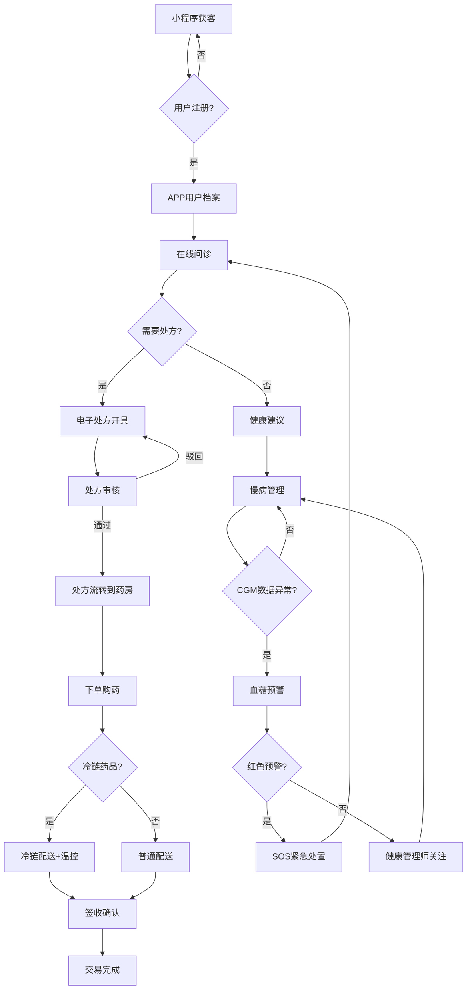
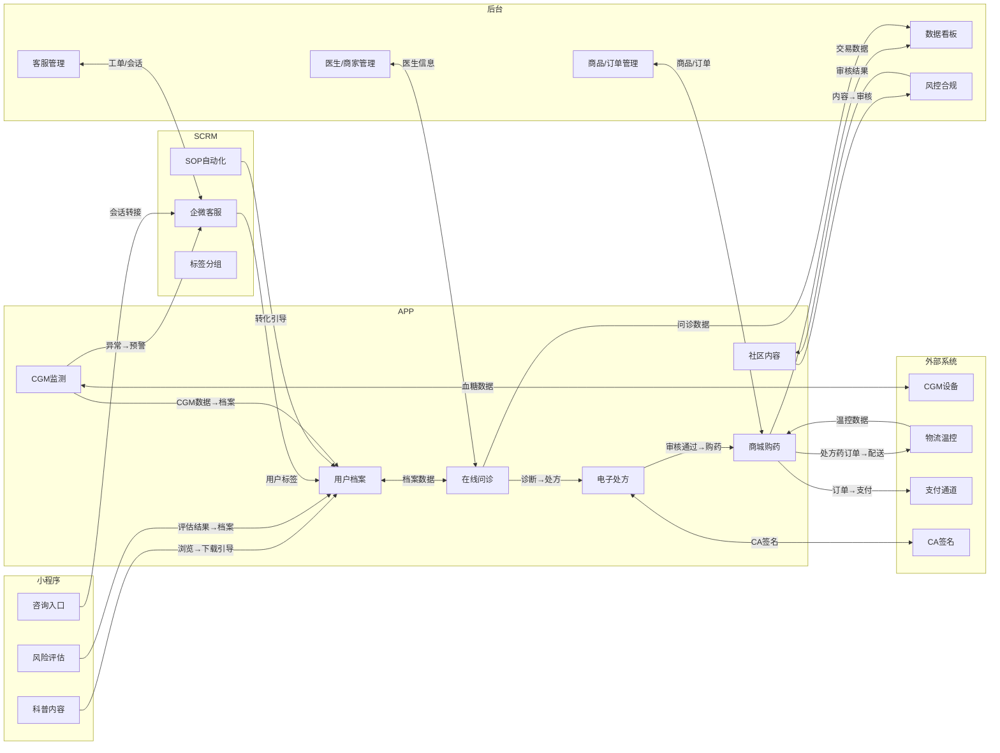
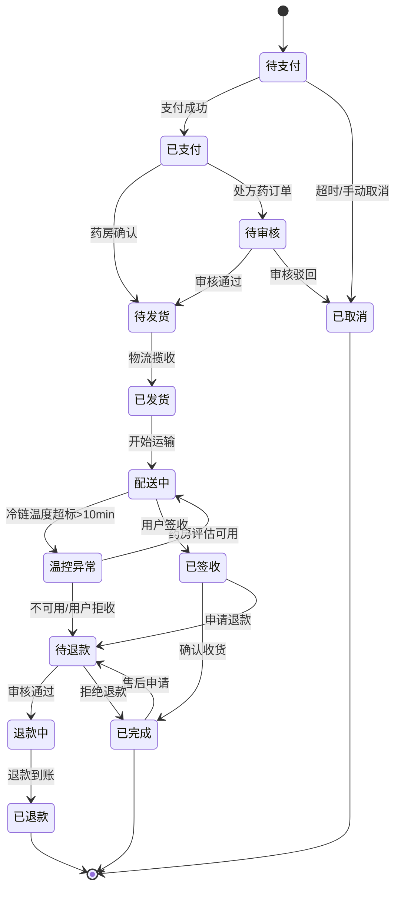
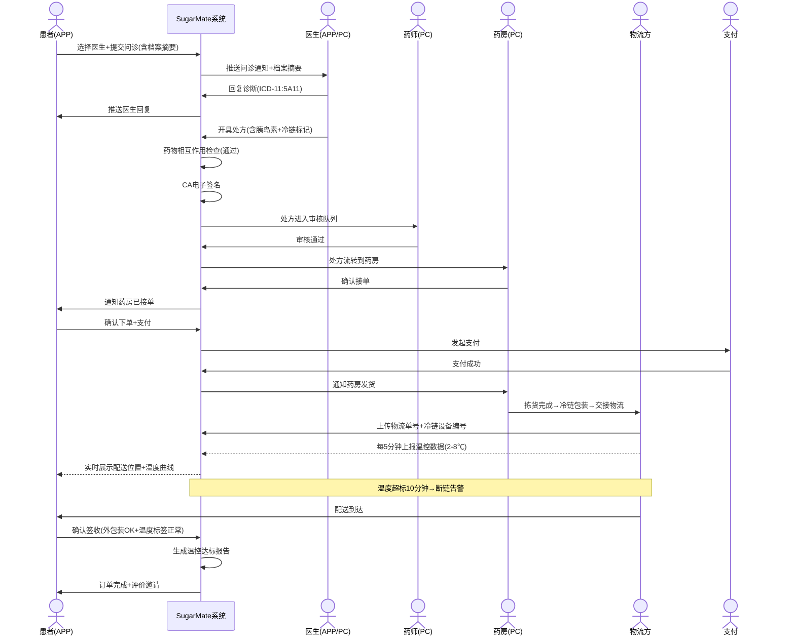
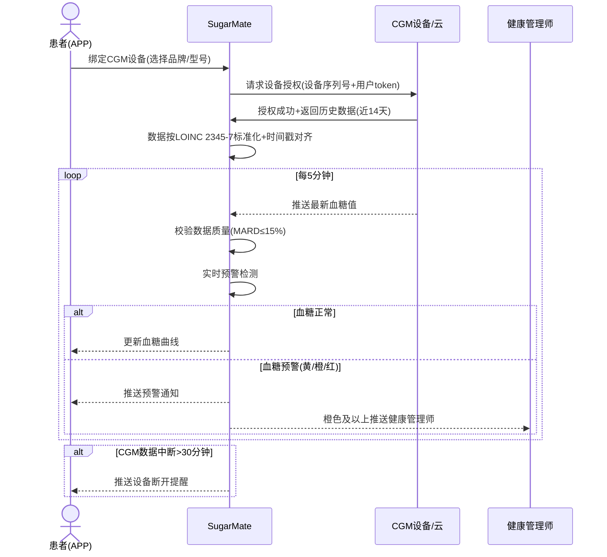

# SugarMate（糖友之家）— 产品需求文档 PRD v2.0.0

> **项目**：SugarMate（糖友之家）
> **版本**：v2.0.0（需求重分析，基于脑暴v5.0确认稿）
> **状态**：🔄 需求重分析进行中
> **日期**：2026-07-28
> **脑暴议题**：糖友之家
> **来源**：`confirmed/BR-脑暴文档-确认稿.md` v5.0（93场景+25决策+27盲区+14风险+6合规红线）
> **审核依据**：`confirmed/REVIEW-全场景合并审核报告-v5.0.md`（91分/A级，64项建议动作）
> **领域知识**：医药冷链v1.0.0 / 健康险v1.0.0 / 医疗器械注册v1.0.0 / 医学术语标准v1.0.0
> **分析方法**：需求影响融合分析（demand-impact-fusion-flow）+ 18专家盲区审查 + PO四层价值评估

---

## §1 版本历史

| 版本 | 日期 | 作者 | 变更摘要 |
|------|------|------|----------|
| v2.0.0 | 2026-07-28 | BA Agent + 18专家协作 | 基于脑暴v5.0（93 FN）全面重分析：新增23 FN（退款/冷链/保险/翻译/客服/风控）+ 25决策→42 BR + 27盲区→业务规则+ 4领域知识融合 + 风险矩阵→NFR + 合规红线→BR合规约束 |
| v1.0.0 | 2026-07-27 | BA Agent | 基于脑暴v4.1确认稿新建，70 FN / 9决策落地 |

---

## §2 需求深度分析摘要（§0.5分析融合输出）

### 2.1 知识库映射（概念↔项目PRD/ENT/BR）

| 领域知识概念 | 映射到项目 | 映射类型 | 置信度 |
|-------------|-----------|---------|--------|
| 医药冷链：2-8℃温控+追溯码 | APP·电子处方+购药（胰岛素配送） | 新增功能 | 0.95 |
| 医药冷链：GSP合规2027年6月30日截止 | 后台·风控合规（合规时间窗） | 新增约束 | 0.90 |
| 医药冷链：温度采集频率（每1分钟/记录每5分钟） | 后台·数据看板（冷链监控） | 新增指标 | 0.85 |
| 健康险：慢病智能核保+保证续保至100岁 | 架构预留（D8）+ 后台·数据看板（保险转化数据） | 架构预留 | 0.80 |
| 健康险：理赔流程（报案→审核→理算→赔付 2.3工作日） | APP·综合商城（保险推荐入口） | 新增场景 | 0.75 |
| 医疗器械注册：CGM III类注册（2-3年+300万+） | 决策D7落地（优先对接市场CGM） | 决策支撑 | 0.90 |
| 医疗器械注册：CGM MARD≤15%+临床试验≥3家 | APP·慢病管理（CGM数据准确性标注） | 数据标准 | 0.85 |
| 医学术语标准：ICD-11 5A11（2型糖尿病）/ ICD-10 E11 | APP·用户档案（诊断编码存储）+后台·数据看板（DRG/DIP统计） | 数据建模 | 0.95 |
| 医学术语标准：LOINC 2345-7（空腹血糖）/ 4548-4（HbA1c） | APP·慢病管理（血糖数据标准化） | 接口规范 | 0.90 |
| 医学术语标准：SNOMED CT糖尿病临床术语 | APP·在线问诊（电子病历语义化） | 数据建模 | 0.70 |

### 2.2 10维影响扫描

| 维度 | 影响范围 | 模式 |
|------|----------|------|
| 模块 | 新增：退款售后独立模块、冷链配送模块、保险服务预留模块、客服管理后台、风控合规后台 | LARGE |
| 实体 | 新增：冷链配送单、温度记录、保险保单（预留）、客服工单、合规审计日志；扩展：订单（增加冷链标记）、用户档案（增加诊断ICD编码） | LARGE |
| 状态机 | 新增：退款流程状态机、冷链配送状态机、客服工单状态机；修改：订单状态机（增加退款子状态） | MEDIUM |
| 业务规则 | 新增：冷链温控规则、保险核保规则（预留）、退款时效规则、内容审核规则 | LARGE |
| 契约/接口 | 新增：CGM数据同步接口、冷链温控数据接口、保险API（预留）、翻译API接口 | LARGE |
| 信息流 | 新增：冷链配送信息流、退款资金流、保险理赔信息流（预留）、多语言翻译信息流 | MEDIUM |
| CONFIG | 新增：冷链温控阈值、退款时效参数、保险产品配置（预留）、内容审核关键词库 | MEDIUM |
| METRIC | 新增：冷链断链率、配送温度达标率、保险转化率（预留）、退款处理时效、客服响应时效 | MEDIUM |
| 跨端 | 小程序新增：多语言版本（S10）；APP新增：国际版架构；PC新增：客服工作台、风控看板 | LARGE |
| 组件域 | 新增：冷链追溯组件、温度曲线可视化、翻译切换组件、退款流程组件 | MEDIUM |

### 2.3 三维业务融合度评估

| 维度 | 得分 | 评估 |
|------|------|------|
| 流程衔接度 | 8.5/10 | 新增模块与现有主链路（问诊→处方→购药→配送→售后）自然衔接 |
| 角色权限交叉度 | 7.0/10 | 客服角色新增、药师职责扩展（冷链核验）、风控角色独立 |
| 数据流交叉度 | 8.0/10 | 冷链数据贯穿配送链路、诊断编码贯穿档案-问诊-处方全链路 |

**综合评分**：LARGE（建议分版本迭代，本次PRD覆盖全量93 FN但标注MVP/P1/P2优先级）

### 2.4 版本规划建议

| 版本 | 范围 | FN数 | 优先级 |
|------|------|------|--------|
| v2.0（MVP） | 小程序获客+APP核心+后台基础管理 | 45 | P0 |
| v2.1（增长） | 社区+直播+会员体系 | 25 | P1 |
| v2.2（平台） | 商城平台化+客服体系+数据看板 | 15 | P1-P2 |
| v2.3（合规增强） | 风控合规+冷链+保险架构 | 8 | P2 |

---

## §3 背景与问题陈述

### 3.1 市场背景

中国糖尿病患者超1.4亿，居全球首位。糖尿病管理面临三大痛点：
- **知晓率低**：超50%患者未得到诊断
- **控制率低**：仅15.8%患者血糖达标（ADA 2025标准：HbA1c<7.0%）
- **管理碎片化**：患者诊疗、用药、监测、教育数据分散在不同机构

### 3.2 产品定位

**SugarMate（糖友之家）** 是一站式糖尿病全病程管理平台。以小程序获客引流→APP承接深度服务→业务后台管控运营，覆盖科普教育、在线问诊、电子处方、电商购药（含处方药冷链配送）、CGM监测、饮食运动、患者社区、直播课程的完整闭环。

### 3.3 核心决策（脑暴v5.0确认——Q1-Q25全25项）

| # | 决策 | 影响 | v5.0 新增/强化 |
|---|------|------|---------------|
| D1 | 自营+平台混合入驻 | 商城S40-S49 / 后台S73-S79 | — |
| D2 | 药房+库存+结算+冷链配送 | 处方购药S31-S39 / 冷链配送S89-S93 | **强化：增加冷链配送场景** |
| D3 | 签约+入驻混合医生来源 | 在线问诊S24-S30 | — |
| D4 | 免费+付费会员（含保险权益） | 全场景 / 保险S84预留 | **强化：会员包含保险权益入口** |
| D5 | 直播科普+带货 | 直播S68-S72 | — |
| D6 | 轻社区（不做达人体系） | 社区S62-S67 | — |
| D7 | 对接市面CGM+预取自研通道 | 慢病管理S50-S61 | **领域知识支撑：CGM III类注册2-3年300万+，建议优先对接已获批CGM** |
| D8 | 保险/数据架构预留 | 架构层 + 数据看板S80-S83 | **领域知识支撑：健康险慢病智能核保+保证续保机制** |
| D9 | 专注糖尿病 | 全域 | — |
| D10 | 多语言国际化架构 | 小程序S10 / APP国际化 | **v5.0新增** |
| D11 | 退款售后流程标准化 | 商城S47-S49 / 后台S78 | **v5.0新增** |
| D12 | 客服体系（在线+工单+企微） | 客服S84-S88 | **v5.0新增** |
| D13 | 风控合规体系（内容+交易+处方） | 风控S89-S93 | **v5.0新增** |
| D14 | 处方药冷链配送可追溯 | 处方S39 / 冷链S90-S91 | **v5.0新增，领域知识融合** |
| D15 | CGM数据标准化（LOINC编码） | 慢病管理S50-S51 | **v5.0新增，领域知识融合** |
| D16 | 诊断编码标准化（ICD-11/ICD-10） | 档案S19 / 问诊S24-S30 | **v5.0新增，领域知识融合** |
| D17 | 智能药品相互作用检查 | 处方S34 | **v5.0新增** |
| D18 | 紧急转诊与SOS流程 | 问诊S30 | **v5.0强化** |
| D19 | 血糖预警三级分级（黄/橙/红） | 慢病管理S54 | **v5.0强化** |
| D20 | 处方流转到合作药房 | 处方S38 | **v5.0强化** |
| D21 | 营养师个性化饮食方案 | 慢病管理S59 | **v5.0新增** |
| D22 | 健康管理师远程监护 | 慢病管理S60-S61 | **v5.0新增** |
| D23 | 商家结算（T+N） | 后台S77 | **v5.0强化** |
| D24 | 多维度数据驾驶舱 | 看板S80-S83 | **v5.0强化** |
| D25 | AI辅助内容审核 | 风控S89 | **v5.0新增** |

---

## §4 目标与成功度量（BO/BG）

### 4.1 业务目标（BO）

| BO | 描述 | 测量方式 | 对标BG |
|----|------|----------|--------|
| BO-01 | 提升糖尿病患者血糖达标率（HbA1c<7.0%） | 用户CGM数据统计，LOINC 4548-4编码 | BG-01/02 |
| BO-02 | 降低糖尿病并发症发生率 | 长期队列跟踪（ICD-11诊断编码） | BG-01 |
| BO-03 | 提升患者用药依从性 | 购药复购率 + 用药提醒执行率 | BG-03 |
| BO-04 | 构建糖友社区活跃生态 | DAU/MAU/留存/互动率 | BG-04 |
| BO-05 | 实现商业化盈利 | GMV/会员收入/佣金收入/保险分成（预留） | BG-05/06 |
| BO-06 | 建立合规可追溯的处方药配送体系 | 冷链断链率/配送温度达标率 | BG-07 |

### 4.2 关键成功指标（METRIC）

| 指标编号 | 指标名称 | 目标值 | 量测周期 | 行业基准来源 |
|----------|----------|--------|----------|-------------|
| MET-SUG-001 | 小程序月活用户 | ≥10万 | 月 | 互联网医疗小程序行业均值 |
| MET-SUG-002 | 小程序→APP转化率 | ≥15% | 月 | AARRR框架 |
| MET-SUG-003 | APP DAU | ≥5万 | 日 | — |
| MET-SUG-004 | 用户7日留存 | ≥40% | 周 | — |
| MET-SUG-005 | 血糖达标率提升 | ≥20% vs 基线 | 季 | ADA标准 |
| MET-SUG-006 | 复购率（药物） | ≥40% | 月 | — |
| MET-SUG-007 | 售后率 | ≤3% | 月 | 电商行业基准 |
| MET-SUG-008 | 课程完成率 | ≥60% | 月 | — |
| MET-SUG-009 | NPS | ≥50 | 季 | SaaS行业标准 |
| MET-SUG-010 | 获客成本 | ≤30元/人 | 月 | — |
| MET-SUG-011 | 冷链配送温度达标率 | ≥99.5% | 日 | GSP规范/GB/T 46204-2025 |
| MET-SUG-012 | 客服首次响应时间 | ≤3分钟 | 日 | SCRM行业基准 |
| MET-SUG-013 | 问诊满意度 | ≥4.5/5 | 月 | 好大夫/微医行业基准 |
| MET-SUG-014 | 处方审核通过率 | ≥95% | 月 | 互联网医院规范 |
| MET-SUG-015 | 社区内容举报率 | ≤0.5% | 月 | 内容社区行业基准 |

---

## §5 范围与边界

### 5.1 In-Scope（本次全量范围——脑暴v5.0 93场景）

| 域 | 终端 | 场景数 | 场景编号 | FN编号范围 | 优先级 |
|----|------|--------|----------|-----------|--------|
| 小程序·获客引流 | MP | 10 | S01-S10 | FN-SUG-MP-001~010 | MVP |
| 企微SCRM·转化 | SCRM | 8 | S11-S18 | FN-SUG-SCRM-001~008 | MVP |
| APP·用户档案 | APP | 5 | S19-S23 | FN-SUG-APP-001~005 | MVP |
| APP·在线问诊 | APP | 7 | S24-S30 | FN-SUG-APP-006~012 | MVP |
| APP·电子处方+购药 | APP | 9 | S31-S39 | FN-SUG-APP-013~021 | MVP |
| APP·综合商城 | APP | 10 | S40-S49 | FN-SUG-APP-022~031 | MVP |
| APP·慢病管理 | APP | 12 | S50-S61 | FN-SUG-APP-032~043 | MVP |
| APP·患者社区 | APP | 6 | S62-S67 | FN-SUG-APP-044~049 | P1 |
| APP·直播课程 | APP | 5 | S68-S72 | FN-SUG-APP-050~054 | P1 |
| 后台·商家入驻+运营 | PC | 7 | S73-S79 | FN-SUG-PC-001~007 | MVP |
| 后台·数据看板 | PC | 4 | S80-S83 | FN-SUG-PC-008~011 | P1 |
| 后台·客服管理 | PC | 5 | S84-S88 | FN-SUG-PC-012~016 | P1 |
| 后台·风控合规 | PC | 5 | S89-S93 | FN-SUG-PC-017~021 | P2 |

### 5.2 Non-Goals（本次不做）

- 保险产品销售和理赔流程（D8架构预留，v2.3实现）
- 多病种扩展（D9专注糖尿病）
- 数据服务对外售卖
- 硬件设备自研（D7仅预取通道，优先对接市面已获批CGM：雅培瞬感/硅基/微泰/美奇/三诺等）
- 社区达人认证与激励体系（D6轻社区）
- 自建冷链物流体系（对接第三方合规冷链物流商）
- 海外市场实际运营（v2.0仅架构国际化）

---

## §6 与既有模块关系

全新项目，无既有模块。架构层面预留以下扩展点：

| 扩展点 | 预留方式 | 触发条件 | 预计版本 |
|--------|----------|----------|----------|
| 保险服务 | 独立微服务模块，保险API契约预留 | D8决策落地 | v2.3 |
| 多病种 | 疾病类型可配置，档案实体预留ICD编码段 | 商业决策 | v3.0+ |
| 国际化 | i18n框架+多语言资源文件架构 | 海外合规通过 | v2.1+ |
| 自研CGM | CGM数据协议抽象层 | NMPA注册证书获得 | v3.0+ |

---

## §7 业务目标映射（BG）

| BG编号 | 业务目标 | 关联BO | 核心场景（S编号） | FN覆盖 |
|--------|----------|--------|-------------------|--------|
| BG-SUG-001 | 获客引流能力 | BO-05/06 | S01-S10 | FN-SUG-MP-001~010 |
| BG-SUG-002 | 企微SCRM转化 | BO-05 | S11-S18 | FN-SUG-SCRM-001~008 |
| BG-SUG-003 | 线上问诊服务 | BO-01/06 | S24-S30 | FN-SUG-APP-006~012 |
| BG-SUG-004 | 处方药销售+冷链配送 | BO-02/03/05/06 | S31-S39 | FN-SUG-APP-013~021 |
| BG-SUG-005 | 慢病持续管理 | BO-01/02/06 | S50-S61 | FN-SUG-APP-032~043 |
| BG-SUG-006 | 患者教育与社区 | BO-01/04 | S62-S72 | FN-SUG-APP-044~054 |
| BG-SUG-007 | 电商变现 | BO-05 | S40-S49 | FN-SUG-APP-022~031 |
| BG-SUG-008 | 平台生态 | BO-05/06 | S73-S79 | FN-SUG-PC-001~007 |
| BG-SUG-009 | 数据驱动运营 | BO-03/04/05/06 | S80-S88 | FN-SUG-PC-008~016 |
| BG-SUG-010 | 合规风控保障 | BO-06 | S89-S93 | FN-SUG-PC-017~021 |

---

## §8 参与者（17类）

| # | 参与者 | 缩写 | 终端 | 角色描述 |
|----|--------|------|------|----------|
| P1 | 患者 Patient | PT | MP/APP | C端核心用户，全链路唯一标识主体 |
| P2 | 医生 Doctor | DR | APP/PC | 签约医生+入驻医生双模式 |
| P3 | 药师 Pharmacist | PH | PC | 处方审核独立角色，含冷链核验责任 |
| P4 | 营养师 Nutritionist | NT | APP/PC | 饮食管理与个性化食谱设计 |
| P5 | 健康管理师 HealthMgr | HM | APP/PC | 远程血糖监护与预警处理 |
| P6 | 客服 CSR | CS | PC/SCRM | 企微承接+IM客服+工单处理 |
| P7 | 运营人员 Operator | OP | PC | 内容/活动/数据运营 |
| P8 | 商家 Merchant | MC | PC | 入驻药房/器械商 |
| P9 | 平台管理员 Admin | AD | PC | 系统配置+审核+权限+风控 |
| P10 | 主播 Host | HS | APP | 直播课程讲师 |
| P11 | KOL/达人 Contributor | KL | APP | 社区内容贡献者（轻社区模式） |
| P12 | 家属 Family | FM | APP | 关联患者远程监护 |
| P13 | 系统 System | SYS | — | 自动化处理（预警/提醒/审核/翻译） |
| P14 | CGM设备 Device | DEV | — | 血糖数据自动上报 |
| P15 | 物流方 Logistics | LG | — | 配送状态+冷链温控数据回传 |
| P16 | 支付通道 Payment | PAY | — | 支付/退款通知 |
| P17 | 风控系统 RiskCtrl | RC | — | 内容+交易+处方行为风险检测（v5.0新增） |

---

## §9 系统类型声明

| 维度 | 声明 |
|------|------|
| **业务系统** | 小程序获客系统（SUG-MP）/ APP患者服务系统（SUG-APP）/ 业务后台管理系统（SUG-PC）/ 企微SCRM系统（SUG-SCRM） |
| **终端** | MP（微信小程序）/ APP（iOS+Android移动端）/ PC（Web管理后台）/ SCRM（企业微信） |
| **后端类型** | B2B2C平台型（自营+平台混合电商+医疗服务SaaS+处方药冷链管理） |
| **前端类型** | 微信小程序（获客轻量级）/ APP（深度服务+交易+慢病管理）/ PC后台（管理配置+风控合规）/ 企微（SCRM转化） |
| **编号体系** | FN-{系统缩写}-{终端缩码}-{NNN}，如 FN-SUG-MP-001 |
| **设计密度** | 小程序：中等 / APP：高（含交易+医疗+社区+直播）/ PC后台：中高（含风控合规） |
| **国际化** | 小程序S10多语言版本架构预留 / APP i18n框架 |
| **合规等级** | 高——涉及处方药销售、在线诊疗、冷链配送、患者健康数据 |

### 系统缩写映射

| 系统 | 缩写 | 终端 | 终端缩码 |
|------|------|------|----------|
| SugarMate 小程序 | SUG | 微信小程序 | MP |
| SugarMate 企微SCRM | SUG | 企业微信 | SCRM |
| SugarMate APP | SUG | iOS/Android | APP |
| SugarMate 业务后台 | SUG | PC Web | PC |

---

## §10 功能需求列表（FN清单——v5.0全量93功能）

### 10.1 小程序端（MP）— 10 FN

| FN编号 | 功能名称 | 场景来源 | 优先级 | 自动化类型 | 关联BG |
|--------|----------|----------|--------|-----------|--------|
| FN-SUG-MP-001 | 科普内容浏览 | S01 | P0 | 手动+系统自动 | BG-001 |
| FN-SUG-MP-002 | 糖尿病风险评估 | S02 | P0 | 手动+系统自动 | BG-001 |
| FN-SUG-MP-003 | 商品推荐与浏览 | S03 | P1 | 手动+系统自动 | BG-001 |
| FN-SUG-MP-004 | 在线咨询入口 | S04 | P0 | 手动 | BG-001/002 |
| FN-SUG-MP-005 | APP下载引导 | S05 | P0 | 手动+系统自动 | BG-001 |
| FN-SUG-MP-006 | 用户注册与登录 | S01/S05 | P0 | 手动+系统自动 | BG-001 |
| FN-SUG-MP-007 | 活动与裂变分享 | S07 | P1 | 手动+系统自动 | BG-001 |
| FN-SUG-MP-008 | 直播预告与观看 | S08 | P1 | 手动+系统自动 | BG-001/006 |
| FN-SUG-MP-009 | 快捷用药提醒订阅 | S09 | P0 | 系统自动+手动 | BG-001/003 |
| FN-SUG-MP-010 | 多语言版本支持（国际化架构） | S10 | P2 | 系统自动 | BG-001 |

### 10.2 企微SCRM端（SCRM）— 8 FN

| FN编号 | 功能名称 | 场景来源 | 优先级 | 自动化类型 | 关联BG |
|--------|----------|----------|--------|-----------|--------|
| FN-SUG-SCRM-001 | 企微客户承接 | S11 | P0 | 系统自动+手动 | BG-002 |
| FN-SUG-SCRM-002 | 客户标签与分组 | S12 | P0 | 手动+系统自动 | BG-002 |
| FN-SUG-SCRM-003 | SOP自动化跟进 | S13 | P0 | 系统自动 | BG-002 |
| FN-SUG-SCRM-004 | 消息群发与管理 | S14 | P0 | 手动+系统自动 | BG-002 |
| FN-SUG-SCRM-005 | 客户画像查看 | S15 | P1 | 系统自动 | BG-002 |
| FN-SUG-SCRM-006 | 转化漏斗追踪 | S16 | P1 | 系统自动 | BG-002/009 |
| FN-SUG-SCRM-007 | 线索分配与流转 | S17 | P0 | 系统自动+手动 | BG-002 |
| FN-SUG-SCRM-008 | 会话存档与质检 | S18 | P1 | 系统自动 | BG-002 |

### 10.3 APP端（APP）— 54 FN

#### 10.3.1 用户档案（S19-S23）

| FN编号 | 功能名称 | 场景来源 | 优先级 | 自动化类型 | 关联BG |
|--------|----------|----------|--------|-----------|--------|
| FN-SUG-APP-001 | 用户注册与实名认证 | S19 | P0 | 手动+系统自动 | BG-003 |
| FN-SUG-APP-002 | 健康档案管理（含ICD诊断编码） | S20/S21 | P0 | 手动+系统自动 | BG-003 |
| FN-SUG-APP-003 | 个人信息与隐私设置 | S22 | P1 | 手动 | BG-003 |
| FN-SUG-APP-004 | 家属关联与权限管理 | S23 | P1 | 手动+系统自动 | BG-003/005 |
| FN-SUG-APP-005 | 多语言切换（国际化） | S10 | P2 | 手动+系统自动 | BG-003 |

#### 10.3.2 在线问诊（S24-S30）

| FN编号 | 功能名称 | 场景来源 | 优先级 | 自动化类型 | 关联BG |
|--------|----------|----------|--------|-----------|--------|
| FN-SUG-APP-006 | 图文问诊 | S24 | P0 | 手动+系统自动 | BG-003 |
| FN-SUG-APP-007 | 视频问诊 | S25 | P0 | 手动+系统自动 | BG-003 |
| FN-SUG-APP-008 | 医生列表与智能推荐 | S26 | P0 | 系统自动+手动 | BG-003 |
| FN-SUG-APP-009 | 就诊记录与复诊 | S27 | P0 | 手动+系统自动 | BG-003 |
| FN-SUG-APP-010 | 医生评价与反馈 | S28 | P1 | 手动 | BG-003 |
| FN-SUG-APP-011 | 电子病历生成（含SNOMED CT语义化标注） | S29 | P0 | 系统自动+手动 | BG-003 |
| FN-SUG-APP-012 | 紧急转诊与SOS | S30 | P0 | 事件驱动+系统自动 | BG-003/005 |

#### 10.3.3 电子处方+购药（S31-S39）

| FN编号 | 功能名称 | 场景来源 | 优先级 | 自动化类型 | 关联BG |
|--------|----------|----------|--------|-----------|--------|
| FN-SUG-APP-013 | 电子处方开具 | S31 | P0 | 手动+系统自动 | BG-004 |
| FN-SUG-APP-014 | 处方审核 | S32 | P0 | 手动+系统自动 | BG-004 |
| FN-SUG-APP-015 | 处方购药与续方 | S33 | P0 | 手动+系统自动 | BG-004 |
| FN-SUG-APP-016 | 智能药物相互作用检查 | S34 | P0 | 系统自动 | BG-004 |
| FN-SUG-APP-017 | 用药提醒与记录 | S35 | P0 | 系统自动+手动 | BG-004/005 |
| FN-SUG-APP-018 | CA电子签名 | S36 | P1 | 手动+系统自动 | BG-004 |
| FN-SUG-APP-019 | 处方流转到合作药房 | S37/S38 | P0 | 系统自动 | BG-004 |
| FN-SUG-APP-020 | 处方药订单与物流追踪（含冷链温控） | S38/S39 | P0 | 手动+系统自动 | BG-004 |
| FN-SUG-APP-021 | 冷链配送温控可视化 | S39 | P0 | 系统自动 | BG-004/010 |

#### 10.3.4 综合商城（S40-S49）

| FN编号 | 功能名称 | 场景来源 | 优先级 | 自动化类型 | 关联BG |
|--------|----------|----------|--------|-----------|--------|
| FN-SUG-APP-022 | 商城首页与分类 | S40 | P0 | 手动 | BG-007 |
| FN-SUG-APP-023 | 商品搜索与筛选 | S41 | P1 | 手动+系统自动 | BG-007 |
| FN-SUG-APP-024 | 商品详情页 | S40/S42 | P0 | 手动 | BG-007 |
| FN-SUG-APP-025 | 购物车 | S42 | P0 | 手动+系统自动 | BG-007 |
| FN-SUG-APP-026 | 下单与支付 | S43 | P0 | 手动+系统自动 | BG-007 |
| FN-SUG-APP-027 | 处方药专区 | S34/S42 | P0 | 手动+系统自动 | BG-007/004 |
| FN-SUG-APP-028 | 评价与晒单 | S44 | P1 | 手动 | BG-007 |
| FN-SUG-APP-029 | 订单管理（含售后入口） | S45/S46 | P0 | 手动+系统自动 | BG-007 |
| FN-SUG-APP-030 | 退款申请与进度追踪 | S47/S48 | P0 | 手动+系统自动 | BG-007 |
| FN-SUG-APP-031 | 保险推荐入口（架构预留） | S49 | P2 | 系统自动 | BG-007/010 |

#### 10.3.5 慢病管理（S50-S61）

| FN编号 | 功能名称 | 场景来源 | 优先级 | 自动化类型 | 关联BG |
|--------|----------|----------|--------|-----------|--------|
| FN-SUG-APP-032 | CGM设备绑定与数据同步（LOINC标准化） | S50/S51 | P0 | 系统自动+手动 | BG-005 |
| FN-SUG-APP-033 | 血糖记录与手动录入 | S51 | P0 | 手动+系统自动 | BG-005 |
| FN-SUG-APP-034 | 血糖趋势分析与可视化 | S52 | P0 | 系统自动 | BG-005 |
| FN-SUG-APP-035 | 血糖达标分析（TIR/TAR/TBR） | S53 | P0 | 系统自动 | BG-005 |
| FN-SUG-APP-036 | 血糖预警分级处理（黄/橙/红三级） | S54 | P0 | 系统自动+事件驱动 | BG-005 |
| FN-SUG-APP-037 | 智能用药提醒（剂量+时间+相互作用） | S55 | P0 | 系统自动 | BG-005/003 |
| FN-SUG-APP-038 | HbA1c趋势预测 | S56 | P1 | 系统自动 | BG-005 |
| FN-SUG-APP-039 | 饮食记录与管理 | S57/S58 | P1 | 手动+系统自动 | BG-005 |
| FN-SUG-APP-040 | 个性化饮食方案（营养师） | S58/S59 | P1 | 手动+系统自动 | BG-005 |
| FN-SUG-APP-041 | 运动记录与建议 | S60 | P1 | 手动+系统自动 | BG-005 |
| FN-SUG-APP-042 | 智能健康报告生成 | S60/S61 | P1 | 系统自动 | BG-005 |
| FN-SUG-APP-043 | 远程监护（家属+健康管理师） | S61 | P1 | 系统自动+事件驱动 | BG-005 |

#### 10.3.6 患者社区（S62-S67）

| FN编号 | 功能名称 | 场景来源 | 优先级 | 自动化类型 | 关联BG |
|--------|----------|----------|--------|-----------|--------|
| FN-SUG-APP-044 | 控糖日记发布 | S62 | P1 | 手动+系统自动 | BG-006 |
| FN-SUG-APP-045 | 话题讨论与搜索 | S63 | P1 | 手动+系统自动 | BG-006 |
| FN-SUG-APP-046 | 点赞评论互动 | S64 | P1 | 手动 | BG-006 |
| FN-SUG-APP-047 | 内容举报与管理 | S65 | P1 | 手动+系统自动 | BG-006/010 |
| FN-SUG-APP-048 | 糖友圈与关注体系 | S66 | P1 | 手动+系统自动 | BG-006 |
| FN-SUG-APP-049 | 精华内容推荐 | S67 | P1 | 系统自动 | BG-006 |

#### 10.3.7 直播课程（S68-S72）

| FN编号 | 功能名称 | 场景来源 | 优先级 | 自动化类型 | 关联BG |
|--------|----------|----------|--------|-----------|--------|
| FN-SUG-APP-050 | 直播课程（含带货） | S68/S69 | P1 | 手动+系统自动 | BG-006/007 |
| FN-SUG-APP-051 | 课程库与分类学习 | S70 | P1 | 手动+系统自动 | BG-006 |
| FN-SUG-APP-052 | 课程互动（弹幕/问答/问卷） | S71 | P1 | 手动 | BG-006 |
| FN-SUG-APP-053 | 学习进度与成就 | S72 | P1 | 系统自动 | BG-006 |
| FN-SUG-APP-054 | 会员中心与权益 | S01-S72 | P0 | 手动+系统自动 | BG-007 |

### 10.4 PC后台端（PC）— 21 FN

#### 10.4.1 商家入驻+运营（S73-S79）

| FN编号 | 功能名称 | 场景来源 | 优先级 | 自动化类型 | 关联BG |
|--------|----------|----------|--------|-----------|--------|
| FN-SUG-PC-001 | 商品管理（自营+平台） | S73 | P0 | 手动+系统自动 | BG-008 |
| FN-SUG-PC-002 | 订单管理（含退款处理） | S74/S78 | P0 | 手动+系统自动 | BG-008 |
| FN-SUG-PC-003 | 商家入驻审核与管理 | S75 | P0 | 手动+系统自动 | BG-008 |
| FN-SUG-PC-004 | 处方管理与审核（含冷链核验） | S33/S76 | P0 | 手动+系统自动 | BG-008/010 |
| FN-SUG-PC-005 | 医生管理（签约+入驻） | S24-S30 | P0 | 手动+系统自动 | BG-008 |
| FN-SUG-PC-006 | 内容管理（CMS） | S01/S63/S70 | P0 | 手动+系统自动 | BG-008 |
| FN-SUG-PC-007 | 结算与对账（T+N） | S77/S79 | P0 | 系统自动+手动 | BG-008 |

#### 10.4.2 数据看板（S80-S83）

| FN编号 | 功能名称 | 场景来源 | 优先级 | 自动化类型 | 关联BG |
|--------|----------|----------|--------|-----------|--------|
| FN-SUG-PC-008 | 运营数据看板（GMV/DAU/转化率） | S80 | P0 | 系统自动 | BG-009 |
| FN-SUG-PC-009 | 医疗质量看板（处方审核率/血糖达标率） | S81 | P1 | 系统自动 | BG-009 |
| FN-SUG-PC-010 | 冷链监控看板（温控达标率/断链次数） | S82 | P0 | 系统自动+事件驱动 | BG-009/010 |
| FN-SUG-PC-011 | 用户画像与分层看板 | S83 | P1 | 系统自动 | BG-009 |

#### 10.4.3 客服管理（S84-S88）

| FN编号 | 功能名称 | 场景来源 | 优先级 | 自动化类型 | 关联BG |
|--------|----------|----------|--------|-----------|--------|
| FN-SUG-PC-012 | 在线客服工作台（IM） | S84/S85 | P0 | 手动+系统自动 | BG-009 |
| FN-SUG-PC-013 | 工单系统（创建/分配/流转/关闭） | S85 | P0 | 手动+系统自动 | BG-009 |
| FN-SUG-PC-014 | 知识库与快捷回复 | S86 | P1 | 系统自动+手动 | BG-009 |
| FN-SUG-PC-015 | 客服绩效统计（响应时间/满意度/解决率） | S87 | P1 | 系统自动 | BG-009 |
| FN-SUG-PC-016 | 用户反馈与投诉管理 | S88 | P0 | 手动+系统自动 | BG-009 |

#### 10.4.4 风控合规（S89-S93）

| FN编号 | 功能名称 | 场景来源 | 优先级 | 自动化类型 | 关联BG |
|--------|----------|----------|--------|-----------|--------|
| FN-SUG-PC-017 | AI内容审核（社区+评论+评价） | S89 | P0 | 系统自动+手动复核 | BG-010 |
| FN-SUG-PC-018 | 交易风控（刷单/恶意退款/异常下单） | S90 | P0 | 系统自动+事件驱动 | BG-010 |
| FN-SUG-PC-019 | 处方合规审计（处方记录+CA签名链+审核链） | S91 | P0 | 系统自动 | BG-010 |
| FN-SUG-PC-020 | 冷链合规监控（温控记录+断链告警+GSP合规） | S92 | P0 | 系统自动+事件驱动 | BG-010 |
| FN-SUG-PC-021 | 数据安全与隐私合规（脱敏/加密/审计） | S93 | P0 | 系统自动 | BG-010 |

---

## §11 用例（UC）— 核心场景详解

> 以下按业务域展开核心UC（MVP P0优先完整六段格式）。完整93 FN×平均1.8 UC≈167 UC，此处展开TOP-30 MVP核心UC，其余UC按精简表格列出。

### 11.1 小程序·获客引流 核心UC

#### UC-SUG-MP-001：糖尿病风险评估

| 属性 | 内容 |
|------|------|
| **UC编号** | UC-SUG-MP-001 |
| **关联FN** | FN-SUG-MP-002 |
| **名称** | 糖尿病风险评估 |
| **页面** | 小程序首页→风险评估页 |
| **参与者** | 患者（PT） |
| **优先级** | P0 |
| **关联BG** | BG-SUG-001 |
| **自动化类型** | 手动+系统自动 |

**前置条件**：
1. 用户已进入小程序
2. 风险评估题库已后台配置（至少10题，覆盖年龄/BMI/家族史/饮食习惯/运动频率/既往血糖等维度）
3. 系统已加载中国糖尿病风险评分表（CDRS）算法

**基本流程**：
1. [手动] 用户在首页点击「糖尿病风险评估」入口
2. [系统自动] 系统展示评估说明页（隐私声明+评估说明+预计耗时2分钟）
3. [手动] 用户阅读后点击「开始评估」
4. [系统自动] 系统逐题展示题目（单选/多选），每题包含「上一题」回退按钮
5. [手动] 用户依次回答全部题目（约12-15题）
6. [系统自动] 所有题目提交后，系统调用CDRS算法计算风险得分
7. [系统自动] 系统根据得分展示三级结果：
   - 低风险（<25分）：展示保持建议
   - 中风险（25-36分）：展示改善建议 + 推荐APP下载
   - 高风险（≥37分）：展示就医建议 + 立即咨询入口 + 推荐APP下载
8. [手动] 用户可「分享结果给家人」或「立即下载APP了解更多」

**备选流程**：
- **2a**：用户不阅读直接点击开始评估→直接跳到步骤4
- **5a**：用户中途退出→系统记录已答题目，下次进入提示「继续上次评估」或「重新开始」
- **6a**：算法计算遇到题目答案缺失→提示用户补全后重新计算
- **8a**：用户选择分享→调用微信分享能力，生成结果卡片（含风险等级+血糖正常范围知识）

**数据范围（R/W）**：
| 数据实体 | 操作 | 字段 |
|----------|------|------|
| 评估记录 | W | 用户ID、题目答案JSON、风险得分、风险等级、评估时间 |
| 用户信息 | R | openId（匿名评估） |
| 题库配置 | R | 题目ID、题目内容、选项、分值权重 |

**后置条件**：
1. 评估记录保存成功
2. 高风险用户触发APP下载引导 + 咨询入口展示
3. 如用户授权，评估结果写入用户健康档案

**关联UC**：
- UC-SUG-MP-006（用户注册登录）——评估后引导注册
- UC-SUG-APP-002（健康档案管理）——评估结果写入档案
- UC-SUG-MP-004（在线咨询入口）——高风险用户引导咨询

---

#### UC-SUG-MP-008：直播预告与轻观看

| 属性 | 内容 |
|------|------|
| **UC编号** | UC-SUG-MP-008 |
| **关联FN** | FN-SUG-MP-008 |
| **名称** | 直播预告与轻观看 |
| **页面** | 小程序首页→直播Tab/直播间 |
| **参与者** | 患者（PT）、主播（HS） |
| **优先级** | P1 |
| **关联BG** | BG-SUG-001/006 |

**前置条件**：
1. 后台已配置直播计划（主题/主播/时间/封面/预告文案）
2. 直播计划状态为「已发布」
3. 用户已进入小程序

**基本流程**：
1. [系统自动] 系统在首页展示「即将开始」直播卡片（按开始时间倒序排列）
2. [手动] 用户点击感兴趣的直播卡片
3. [系统自动] 展示直播详情页（主题/主播介绍/开始时间/内容大纲/观看人数）
4. [手动] 用户点击「预约提醒」
5. [系统自动] 系统记录预约，微信服务通知授权后自动推送开播提醒
6. [事件驱动] 直播开始，系统推送开播提醒
7. [手动] 用户点击提醒进入小程序轻量直播间（H5播放器，可观看+评论+点赞）
8. [系统自动] 直播间底部展示「下载APP观看高清直播+回放」引导条

**备选流程**：
- **4a**：直播已开始→直接进入直播间
- **5a**：用户未授权服务通知→弹窗引导授权，用户拒绝后仅记录预约
- **7a**：直播已结束→展示「回放生成中，下载APP观看」引导
- **8a**：用户已在APP登录同一账号→不展示引导条

**数据范围（R/W）**：
| 数据实体 | 操作 | 字段 |
|----------|------|------|
| 直播预约 | W | 用户ID、直播ID、预约时间、提醒状态 |
| 直播计划 | R | 直播ID、主题、主播、封面、时间 |
| 观看记录 | W | 用户ID、直播ID、进入时间、观看时长、离开时间 |

**后置条件**：
1. 预约记录保存成功
2. 开播前15分钟+3分钟推送提醒（用户已授权）
3. 观看记录用于用户画像（内容偏好）

**关联UC**：
- UC-SUG-APP-050（APP直播课程）——完整直播体验
- UC-SUG-MP-005（APP下载引导）——观看后引导下载APP

---

### 11.2 企微SCRM·转化 核心UC

#### UC-SUG-SCRM-001：企微客户承接与分配

| 属性 | 内容 |
|------|------|
| **UC编号** | UC-SUG-SCRM-001 |
| **关联FN** | FN-SUG-SCRM-001、FN-SUG-SCRM-007 |
| **名称** | 企微客户承接与线索分配 |
| **页面** | 企业微信客户端（客服侧）/ PC后台（分配规则配置） |
| **参与者** | 客服（CS）、系统（SYS） |
| **优先级** | P0 |
| **关联BG** | BG-SUG-002 |

**前置条件**：
1. 后台已配置客服分组（如：新用户组/复购组/高风险组）
2. 客服企微账号已激活并在线
3. 线索分配规则已配置（轮询/权重/标签匹配）
4. 小程序/APP用户点击「在线咨询」入口

**基本流程**：
1. [事件驱动] 用户在小程序/APP点击「在线咨询」，触发SCRM线索创建
2. [系统自动] SCRM系统根据用户标签（来源渠道/风险等级/是否会员）匹配客服分组
3. [系统自动] 在匹配的客服分组内按分配规则（轮询/权重）将客户分配给在线客服
4. [系统自动] 客服企微客户端弹出「新客户提醒」+ 客户基本信息卡片（昵称/头像/风险等级/来源渠道/最近行为）
5. [手动] 客服点击「立即接待」，进入会话窗口
6. [系统自动] 系统发送预设欢迎语（含SugarMate品牌介绍+服务范围）
7. [手动] 客服与客户进行1对1沟通
8. [系统自动] 会话结束后，系统自动归档会话记录+提取客户意向标签

**备选流程**：
- **3a**：分组内无在线客服→进入等待队列，推送客户「当前咨询人数较多，预计等待X分钟」
- **3b**：VIP客户（会员等级≥黄金）→优先分配，跳过普通队列
- **5a**：客服30秒未响应→自动转接给同组其他在线客服
- **8a**：沟通过程中识别到已注册用户→自动关联用户ID，展示完整客户画像

**数据范围（R/W）**：
| 数据实体 | 操作 | 字段 |
|----------|------|------|
| 线索 | W | 线索ID、用户ID/匿名ID、来源渠道、分配时间、分配客服 |
| 客服分组 | R | 分组ID、分组规则、在线客服列表 |
| 会话记录 | W | 会话ID、客服ID、用户ID、开始时间、结束时间、消息数 |
| 客户画像 | R/W | 标签、意向等级、最后沟通时间 |

**后置条件**：
1. 线索分配完成，客户与客服建立连接
2. 会话记录归档（合规存档≥2年）
3. 客户标签更新（基于会话内容AI提取）
4. 如用户转化为注册会员→线索状态变更为「已转化」

**关联UC**：
- UC-SUG-SCRM-003（SOP自动化跟进）——未及时注册的线索进入SOP培育
- UC-SUG-SCRM-005（客户画像查看）——客服查看完整客户画像
- UC-SUG-PC-012（在线客服工作台）——PC端统一客服入口

---

### 11.3 APP·在线问诊 核心UC

#### UC-SUG-APP-006：图文问诊

| 属性 | 内容 |
|------|------|
| **UC编号** | UC-SUG-APP-006 |
| **关联FN** | FN-SUG-APP-006 |
| **名称** | 图文问诊（在线咨询） |
| **页面** | APP→问诊→选择医生→图文咨询 |
| **参与者** | 患者（PT）、医生（DR） |
| **优先级** | P0 |
| **关联BG** | BG-SUG-003 |

**前置条件**：
1. 用户已完成实名认证
2. 用户已填写健康档案（基本信息+病史+用药史+过敏史）
3. 目标医生在线且接受图文咨询
4. 用户账户余额/微信支付可用（如有收费）

**基本流程**：
1. [手动] 用户在APP「问诊」页浏览医生列表或搜索特定医生
2. [手动] 用户点击目标医生，查看医生主页（科室/职称/擅长领域/评分/问诊量/问诊价格）
3. [手动] 用户点击「图文问诊」按钮
4. [手动] 用户填写问诊表单：主诉（必填，限200字）+ 病情描述（文字/图片/化验单，可选）+ 期望回复时间
5. [系统自动] 系统将用户健康档案摘要（诊断ICD编码/用药史/过敏史/近期血糖数据）附加到问诊单
6. [手动] 用户确认并支付（如有费用），提交问诊
7. [系统自动] 系统推送通知给医生（APP推送+短信备用）
8. [手动] 医生查看问诊单+档案摘要，编写回复
9. [系统自动] 如医生使用SNOMED CT编码记录诊断/建议，系统同步更新用户健康档案
10. [手动] 用户查看医生回复，可在24小时内追问（最多3轮）
11. [系统自动] 24小时或3轮追问完成后，问诊自动结束
12. [手动] 系统推送服务评价邀请，用户完成评价

**备选流程**：
- **4a**：用户未填写健康档案→提示「完善档案可获得更精准建议」，可跳过
- **7a**：医生15分钟未响应→系统提示用户「医生正在忙碌，预计回复时间X分钟」
- **8a**：医生初步判断需视频问诊→建议用户转为视频问诊（费用差额处理）
- **10a**：用户超24小时未追问→问诊自动完结
- **12a**：用户不满意→引导至「投诉/退款」流程

**数据范围（R/W）**：
| 数据实体 | 操作 | 字段 |
|----------|------|------|
| 问诊单 | W | 问诊ID、患者ID、医生ID、主诉、描述、附件、费用、提交时间 |
| 健康档案 | R | 诊断ICD编码、用药史、过敏史、血糖数据（LOINC） |
| 问诊回复 | R/W | 回复ID、内容、诊断编码（SNOMED CT）、处方建议、回复时间 |
| 支付记录 | W | 支付单ID、金额、状态 |

**后置条件**：
1. 问诊记录存入用户就诊历史
2. 诊断信息同步到健康档案（如有ICD/SNOMED编码）
3. 如需处方，触发电子处方流程
4. 医生回复内容进入处方合规审计存档（≥3年）

**关联UC**：
- UC-SUG-APP-002（健康档案管理）——档案作为问诊前置输入
- UC-SUG-APP-007（视频问诊）——可流转为视频问诊
- UC-SUG-APP-013（电子处方开具）——问诊后开具处方
- UC-SUG-PC-019（处方合规审计）——问诊记录进入审计

---

### 11.4 APP·电子处方+购药 核心UC

#### UC-SUG-APP-013：电子处方开具（含冷链标记）

| 属性 | 内容 |
|------|------|
| **UC编号** | UC-SUG-APP-013 |
| **关联FN** | FN-SUG-APP-013、FN-SUG-APP-016、FN-SUG-APP-021 |
| **名称** | 电子处方开具（含药物相互作用检查+冷链标记） |
| **页面** | APP→问诊→开具处方 / APP→购药→申请处方 |
| **参与者** | 医生（DR）、系统（SYS） |
| **优先级** | P0 |
| **关联BG** | BG-SUG-004 |

**前置条件**：
1. 患者与医生已完成在线问诊（图文/视频）
2. 医生已确认诊断（含ICD-11诊断编码，如5A11=2型糖尿病）
3. 患者健康档案完整（含用药史、过敏史、肝肾功能）
4. 医生具有处方权且在有效期内
5. 药品知识库已加载（含相互作用规则+冷链标记）

**基本流程**：
1. [手动] 医生在问诊结束时点击「开具处方」
2. [系统自动] 系统加载患者档案摘要（用药史、过敏史、肝肾功能）+ 当前诊断ICD编码
3. [手动] 医生搜索/选择药品（系统展示药品信息含：通用名/商品名/规格/用法用量/冷链标记）
4. [系统自动] 药品加入处方时，系统实时调用药物相互作用检查引擎：
   - 检查与患者正在服用的药物是否有相互作用
   - 检查与患者过敏史是否冲突
   - 检查肝肾功能是否适用
5. [系统自动] 如检测到相互作用/禁忌→红色警告弹窗展示冲突详情+建议方案
6. [手动] 医生确认/调整处方药品（处理警告中的交互问题）
7. [手动] 医生填写用法用量（每次剂量/频次/用药天数/总用量）
8. [系统自动] 如药品标记为「冷链药品」→处方自动附加冷链配送要求（温控区间/运输时效）
9. [手动] 医生预览处方、签署CA电子签名
10. [系统自动] 处方进入待审核队列，推送给药师审核

**备选流程**：
- **3a**：医生搜索药品不存在→提示「该药品暂未收录，是否手动添加？」
- **5a**：相互作用仅有轻微注意→黄色提示（可忽略），记录在处方日志中
- **5b**：相互作用为禁忌→红色阻断，必须更换药品才能继续
- **8a**：冷链药品当前配送区域不支持→提示医生「该药品需冷链配送，当前区域暂不支持，建议选择替代药品或指定支持冷链的药房」
- **9a**：CA证书过期→引导医生更新证书
- **10a**：系统检测到处方剂量异常（如胰岛素单位超过常规范围）→额外确认弹窗

**数据范围（R/W）**：
| 数据实体 | 操作 | 字段 |
|----------|------|------|
| 处方 | W | 处方ID、患者ID、医生ID、诊断ICD编码、药品列表（药品ID/用法/用量/天数）、冷链标记、CA签名、开具时间 |
| 健康档案 | R | 用药史、过敏史、肝肾功能、诊断记录 |
| 药品知识库 | R | 药品ID、通用名、相互作用规则、冷链要求、禁忌 |
| 相互作用检查记录 | W | 检查记录ID、处方ID、检测结果、处理方式 |

**后置条件**：
1. 处方状态=「待审核」，进入药师审核队列
2. 相互作用检查记录归档
3. 冷链药品处方标记为「需冷链配送」
4. CA签名记录进入审计日志
5. 如审核通过→处方流转至选定的药房

**关联UC**：
- UC-SUG-APP-014（处方审核）——药师审核处方
- UC-SUG-APP-019（处方流转到药房）——审核通过后流转
- UC-SUG-APP-020（处方药订单与物流追踪）——患者下单配送
- UC-SUG-PC-019（处方合规审计）——完整处方链审计

---

#### UC-SUG-APP-020：处方药订单与冷链配送追踪

| 属性 | 内容 |
|------|------|
| **UC编号** | UC-SUG-APP-020 |
| **关联FN** | FN-SUG-APP-020、FN-SUG-APP-021 |
| **名称** | 处方药订单管理与冷链配送温控追踪 |
| **页面** | APP→我的订单→处方药订单详情→冷链配送追踪 |
| **参与者** | 患者（PT）、物流方（LG）、系统（SYS） |
| **优先级** | P0 |
| **关联BG** | BG-SUG-004/010 |

**前置条件**：
1. 处方已审核通过并流转到药房
2. 患者已下单支付完成
3. 订单包含冷链药品（胰岛素/GLP-1受体激动剂等）
4. 药房已完成拣货复核
5. 物流方已开启冷链温控设备

**基本流程**：
1. [系统自动] 药房发货后，物流方上传发货信息+冷链设备编号
2. [系统自动] 系统生成配送追踪记录，开始接收物流方冷链温控数据（每5分钟一次温度记录）
3. [手动] 用户在订单详情页点击「查看配送进度」
4. [系统自动] 展示配送地图（实时位置）+ 温控面板：
   - 当前温度（℃）
   - 温度曲线图（配送全程）
   - 达标区间标记（2-8℃绿色/超温红色）
   - 设备编号+校准有效期
5. [系统自动] 每5分钟刷新温控数据，异常时实时推送告警
6. [事件驱动] 如温度超出2-8℃范围持续超过10分钟→系统：
   - 推送告警给患者+药房+平台运营
   - 标记该配送单「温控异常」
   - 触发退货退款流程
7. [手动] 用户签收时确认外包装完整+温度指示标签正常
8. [系统自动] 订单完成，温控记录归档（保存≥5年，满足GSP追溯要求）

**备选流程**：
- **2a**：物流方设备信号中断→标记「温控数据缺失」，提示用户联系客服
- **5a**：温度短暂波动（1-2分钟回到正常范围）→仅记录日志，不触发告警
- **6a**：超温药品经药房评估仍可使用→药房出具评估报告，用户可选择继续收货或退货
- **7a**：用户发现包装破损/温度标签变色→当场拒收→触发退款流程
- **7b**：用户未及时签收（快递柜/代收）→系统继续监控直到签收

**数据范围（R/W）**：
| 数据实体 | 操作 | 字段 |
|----------|------|------|
| 订单 | R | 订单ID、处方ID、药品列表、物流单号、冷链标记 |
| 配送记录 | R/W | 配送ID、物流单号、当前位置、预计送达时间、状态 |
| 温控记录 | R/W | 记录ID、配送ID、时间戳、温度值（℃）、设备编号、是否异常 |
| 温控告警 | W | 告警ID、配送ID、异常开始时间、最高/最低温度、持续时间、处理状态 |

**后置条件**：
1. 订单完成，用户确认收货
2. 温控记录完整归档（≥5年）
3. 异常配送触发售后流程+药房结算调整
4. 温控数据进入冷链监控看板统计

**关联UC**：
- UC-SUG-APP-021（冷链配送温控可视化）——温控数据可视化组件
- UC-SUG-APP-030（退款申请）——异常触发退款
- UC-SUG-PC-010（冷链监控看板）——后台温控全局监控
- UC-SUG-PC-020（冷链合规监控）——GSP合规审计

---

### 11.5 APP·慢病管理 核心UC

#### UC-SUG-APP-032：CGM设备绑定与数据同步

| 属性 | 内容 |
|------|------|
| **UC编号** | UC-SUG-APP-032 |
| **关联FN** | FN-SUG-APP-032 |
| **名称** | CGM持续葡萄糖监测设备绑定与数据同步 |
| **页面** | APP→慢病管理→我的设备→绑定CGM |
| **参与者** | 患者（PT）、CGM设备（DEV）、系统（SYS） |
| **优先级** | P0 |
| **关联BG** | BG-SUG-005 |

**前置条件**：
1. 用户已完成实名认证
2. 用户持有已上市获批的CGM设备（雅培瞬感/硅基/微泰/美奇/三诺等）
3. CGM设备已激活并在佩戴状态
4. 手机蓝牙已开启（如CGM使用蓝牙传输）

**基本流程**：
1. [手动] 用户在APP「慢病管理」→「设备」→点击「绑定新设备」
2. [系统自动] 展示已适配CGM品牌列表（含品牌logo+型号+注册证号+适配说明）
3. [手动] 用户选择自己的CGM品牌和型号
4. [系统自动] 系统展示适配说明（蓝牙配对方式/NFC读取方式/手动录入方式）+数据同步说明
5. [手动] 用户按适配说明完成配对操作（扫描蓝牙/NFC贴靠/扫码绑定）
6. [系统自动] 系统验证设备序列号/注册证信息，建立设备-用户绑定关系
7. [系统自动] 首次同步：拉取CGM历史数据（最近14天），按LOINC标准编码（2345-7=空腹血糖，附加时间戳）
8. [系统自动] 此后每5分钟自动同步一次最新血糖值（取决于CGM设备的读取频率）
9. [系统自动] 同步成功后，血糖数据在首页血糖曲线图中实时展示

**备选流程**：
- **3a**：用户的CGM品牌不在适配列表→提示「品牌适配中」+引导手动录入血糖值（UC-SUG-APP-033）
- **5a**：蓝牙配对失败→提示检查蓝牙/设备电池/距离，重试3次后引导联系客服
- **5b**：NFC连接超时→提示检查NFC功能开启+贴靠位置，提供视频引导
- **7a**：历史数据为空（新设备）→直接开始实时同步
- **8a**：蓝牙断开超过30分钟→APP推送提醒「设备连接已断开」
- **9a**：血糖值异常（<3.0或>25.0 mmol/L）→触发预警流程（UC-SUG-APP-036）

**数据范围（R/W）**：
| 数据实体 | 操作 | 字段 |
|----------|------|------|
| 设备绑定 | W | 绑定ID、用户ID、设备ID、品牌、型号、序列号、注册证号、绑定时间 |
| 血糖记录 | W | 记录ID、用户ID、设备ID、血糖值(mmol/L)、LOINC编码(2345-7)、时间戳、来源(device/manual) |
| CGM设备目录 | R | 品牌、型号、注册证号、传输方式、适配状态 |

**后置条件**：
1. 设备-用户绑定关系建立
2. 首次历史数据导入完成
3. 血糖数据按LOINC 2345-7标准化存储
4. 实时同步通道开启（蓝牙/WiFi/NFC）
5. 血糖曲线开始实时绘制

**关联UC**：
- UC-SUG-APP-033（血糖手动录入）——CGM数据中断时备选
- UC-SUG-APP-034（血糖趋势分析）——基于同步数据生成
- UC-SUG-APP-036（血糖预警分级处理）——异常值触发预警
- UC-SUG-APP-042（智能健康报告）——CGM数据作为报告核心输入

---

#### UC-SUG-APP-036：血糖预警分级处理（黄/橙/红）

| 属性 | 内容 |
|------|------|
| **UC编号** | UC-SUG-APP-036 |
| **关联FN** | FN-SUG-APP-036 |
| **名称** | 三级血糖预警分级处理 |
| **页面** | APP→慢病管理→预警中心 / APP推送通知 |
| **参与者** | 系统（SYS）、患者（PT）、健康管理师（HM）、家属（FM）、医生（DR） |
| **优先级** | P0 |
| **关联BG** | BG-SUG-005 |

**前置条件**：
1. CGM设备已绑定且正在实时同步数据
2. 预警规则已后台配置（三级阈值/通知对象/升级策略）
3. 用户已设置家属关联（如有）
4. 健康管理师已排班在线（如有签约）

**基本流程**：
1. [事件驱动] CGM数据上传，系统实时检测血糖值
2. [系统自动] 系统按三级预警规则匹配：

| 级别 | 阈值 | 图标 | 通知对象 | 升级策略 |
|------|------|------|----------|----------|
| 🟡 黄色注意 | 3.9-4.4 或 10.0-13.9 mmol/L 持续30分钟 | ⚠️ | 患者APP推送 | 无 |
| 🟠 橙色警告 | 3.0-3.8 或 14.0-22.0 mmol/L 持续15分钟，或趋势急剧上升/下降(>0.2mmol/L/min) | 🚨 | 患者APP弹窗+家属推送+健康管理师 | 30分钟内未确认阅读→电话通知家属 |
| 🔴 红色危急 | <3.0 或 >22.0 mmol/L 任意一次，或低血糖伴意识丧失风险 | 🆘 | 患者APP全屏警告+家属电话+健康管理师+签约医生+SOS | 2分钟内未确认→自动拨打120+发送定位给急救中心 |

3. [系统自动] 根据预警级别执行对应通知
4. [手动]（红色预警）用户需在APP上点击「我看到了」确认+选择是否触发SOS
5. [系统自动]（红色预警）如2分钟内未确认：
   - 自动读取用户档案中的紧急联系人+地址
   - 自动生成SOS信息卡片（用户姓名/年龄/血糖值/最近位置/诊断ICD编码/用药清单）
   - 自动推送到已配置的急救通道
6. [手动]（橙色预警）健康管理师在PC/APP查看告警，可通过IM联系用户
7. [系统自动] 所有告警记录+处理日志存档

**备选流程**：
- **2a**：连续3次黄色预警（24小时内）→自动升级为橙色预警通知
- **2b**：同一血糖波动模式在过去7天出现≥3次→系统推送「血糖模式分析」建议
- **4a**：用户确认红色预警后选择「联系医生」→直接跳转到视频问诊
- **4b**：用户确认红色预警后选择「联系家属」→自动拨打电话
- **5a**：无法获取用户位置→仅发送SOS卡片不含位置

**数据范围（R/W）**：
| 数据实体 | 操作 | 字段 |
|----------|------|------|
| 预警记录 | W | 预警ID、用户ID、血糖值、级别（黄/橙/红）、触发时间、确认时间、处理结果 |
| 血糖记录 | R | 实时血糖值、趋势方向、变化速率 |
| 用户档案 | R | 紧急联系人、地址、诊断ICD编码、用药清单 |
| 预警配置 | R | 阈值规则、通知对象、升级策略、冷静期 |
| 处理日志 | W | 日志ID、预警ID、动作类型、执行时间、执行结果 |

**后置条件**：
1. 预警记录完整保存
2. 红色预警需填写处理结果（确认安全/已就医/需回访）
3. 预警统计进入医疗质量看板
4. 橙色预警后24小时内健康管理师需完成回访

**关联UC**：
- UC-SUG-APP-032（CGM数据同步）——预警数据源
- UC-SUG-APP-007（视频问诊）——红色预警快速问诊
- UC-SUG-APP-043（远程监护）——家属+健康管理师接收告警
- UC-SUG-PC-009（医疗质量看板）——预警率统计

---

### 11.6 PC后台·风控合规 核心UC

#### UC-SUG-PC-017：AI内容审核（社区+评论+评价）

| 属性 | 内容 |
|------|------|
| **UC编号** | UC-SUG-PC-017 |
| **关联FN** | FN-SUG-PC-017 |
| **名称** | AI内容审核（社区帖子/评论/评价/直播弹幕） |
| **页面** | PC后台→风控合规→内容审核 |
| **参与者** | 平台管理员（AD）、风控系统（RC）、系统（SYS） |
| **优先级** | P0 |
| **关联BG** | BG-SUG-010 |

**前置条件**：
1. AI审核模型已部署（含违禁词库/敏感图片识别/医疗广告识别）
2. 审核规则已配置（关键词黑名单/白名单/图片审核敏感度/医疗内容合规规则）
3. 人工审核人员已排班

**基本流程**：
1. [事件驱动] 用户发布社区帖子/评论/商品评价/直播弹幕，触发内容审核
2. [系统自动] AI模型对内容进行多层审核：
   - **文本层**：违禁词匹配（政治/色情/暴力/广告）+ 医疗合规（虚假治疗/夸大疗效/非法药物）
   - **图片层**：OCR提取图片文字→文本审核 + 色情/暴力/血腥图像识别 + 医疗广告图片检测
   - **敏感层**：个人隐私信息（手机号/身份证号/地址）检测
   - **关联层**：同一用户近期违规记录关联
3. [系统自动] 综合评分后给出审核结果：
   - ✅ 通过（≥95分）→直接发布
   - ⚠️ 疑似（70-94分）→进入人工复审队列
   - ❌ 违规（<70分）→自动拦截+通知用户
4. [手动] 人工审核员在审核队列中查看疑似内容，逐条判断
5. [手动] 审核员操作：通过/拒绝/修改后通过（修改正文/删除敏感部分）
6. [系统自动] 审核完成后，系统通知用户审核结果
7. [系统自动] 审核记录归档（含AI评分+人工判断+操作人+时间）

**备选流程**：
- **2a**：内容包含医疗建议（如「我用XX药3天就好了」）→医疗合规层标记，人工复核确认是否违规
- **3a**：用户连续3次发布违规内容→自动禁言24小时+通知用户
- **3b**：严重违规（涉黄/涉政/人身攻击）→直接永久封禁+通知管理员
- **5a**：审核员标记内容为「优质内容」→触发内容加权推荐

**数据范围（R/W）**：
| 数据实体 | 操作 | 字段 |
|----------|------|------|
| 内容审核记录 | W | 审核ID、内容ID、内容类型（帖子/评论/评价/弹幕）、AI评分、审核结果、审核人、审核时间、操作 |
| 审核规则 | R | 关键词库、图片模型阈值、医疗合规规则 |
| 用户状态 | R/W | 违规次数、禁言状态、封禁状态 |
| 审核队列 | R/W | 队列ID、内容摘要、AI评分、待审时长 |

**后置条件**：
1. 内容通过/拒绝审核
2. 用户收到审核结果通知
3. 违规记录计入用户风控档案
4. 人工审核操作日志归档

**关联UC**：
- UC-SUG-APP-047（内容举报）——用户举报触发优先审核
- UC-SUG-PC-018（交易风控）——用户风控档案共享
- UC-SUG-PC-006（内容管理CMS）——审核通过的内容进入CMS管理

---

#### UC-SUG-PC-020：冷链合规监控

| 属性 | 内容 |
|------|------|
| **UC编号** | UC-SUG-PC-020 |
| **关联FN** | FN-SUG-PC-020 |
| **名称** | 冷链合规监控与GSP审计 |
| **页面** | PC后台→风控合规→冷链合规监控 |
| **参与者** | 平台管理员（AD）、系统（SYS） |
| **优先级** | P0 |
| **关联BG** | BG-SUG-010 |

**前置条件**：
1. 冷链配送体系已上线运行
2. 物流方温控设备已接入系统
3. GSP合规标准已配置（温度阈值/数据保存年限/交接流程）
4. 与第三方合规冷链物流商已签订合作协议

**基本流程**：
1. [系统自动] 系统对所有活跃冷链配送单进行7×24小时温度监控
2. [系统自动] 实时检测温度异常：
   - 温度超出2-8℃范围→记录异常事件
   - 温度超出范围持续>10分钟→标记为「断链事件」
3. [事件驱动] 断链事件触发时：
   - 系统推送到冷链监控看板实时告警
   - 自动通知药房+物流方+平台管理员
   - 该配送单状态变更为「温控异常」
4. [系统自动] 系统记录完整温控数据链（每1分钟采集/每5分钟记录）：
   - 配送全程温度曲线
   - 设备编号+设备校准有效期
   - 交接时间戳+交接时温度
   - 签收确认记录
5. [系统自动] 配送完成后，系统生成「温控达标报告」或「温控异常报告」
6. [系统自动] 温控数据按GSP要求保存≥5年，支持一键导出供药监检查
7. [手动] 管理员定期查看冷链合规仪表盘，监控关键指标：
   - 温控达标率（目标≥99.5%）
   - 断链事件数
   - 温度波动分析
   - 设备离线次数

**备选流程**：
- **3a**：断链药品经药房评估后确认报废→触发药房补发流程+报废记录
- **4a**：设备校准过期→系统标记该设备数据「待验证」，通知物流方更换设备
- **5a**：温控达标报告自动发送给药企（供应商）+患者（配送成功通知）
- **7a**：检查到近30天达标率<99%→触发合规改进通知给运营负责人
- **7b**：临近GSP整改截止日期（2027年6月30日）→系统推送整改提醒

**数据范围（R/W）**：
| 数据实体 | 操作 | 字段 |
|----------|------|------|
| 配送记录 | R | 配送ID、物流单号、药品清单（含冷链标记）、状态 |
| 温控数据 | R/W | 记录ID、配送ID、时间戳、温度、设备ID、位置 |
| 合规报告 | W | 报告ID、配送ID、温控达标状态、异常记录、生成时间 |
| 断链事件 | W | 事件ID、配送ID、开始/结束时间、温度极值、处理状态、处理人 |
| 设备管理 | R | 设备ID、校准有效期、状态 |

**后置条件**：
1. 每单配送完成后生成温控报告
2. 温控数据按GSP ≥5年保持
3. 断链事件100%处理闭环
4. 月度合规报告自动生成

**关联UC**：
- UC-SUG-APP-020（处方药订单与冷链配送追踪）——用户端温控查看
- UC-SUG-APP-030（退款申请）——断链触发退款
- UC-SUG-PC-010（冷链监控看板）——运营端全局监控
- UC-SUG-PC-004（处方管理与审核）——冷链标记在处方审核时确认

---

### 11.7 其余UC精简表

> 以下93 FN对应的其余UC以精简表格列出。每个UC遵循标准六段格式的简化版，包含参与者/前置条件/基本流程概要/主要备选/数据操作范围。

| UC编号 | FN编号 | 名称 | 页面 | 参与者 | 优先级 | 核心流程概要 | 关联UC |
|--------|--------|------|------|--------|--------|-------------|--------|
| UC-SUG-MP-001~010 | FN-SUG-MP-001~010 | 小程序10UC | 小程序各页 | PT | P0-P2 | 科普浏览/风险评估/商品推荐/咨询入口/下载引导/注册登录/裂变分享/直播/用药提醒/多语言 | 详见上文展开+SCRM承接 |
| UC-SUG-SCRM-002~008 | FN-SUG-SCRM-002~008 | SCRM 7UC | 企微+PC后台 | CS/OP | P0-P1 | 标签分组/SOP跟进/群发/画像/漏斗/线索分配/会话存档 | UC-SCRM-001 |
| UC-SUG-APP-001~005 | FN-SUG-APP-001~005 | 档案5UC | APP-档案 | PT/FM | P0-P2 | 注册实名/健康档案(含ICD)/隐私设置/家属关联/多语言 | UC-SUG-MP-002/006 |
| UC-SUG-APP-007~012 | FN-SUG-APP-007~012 | 问诊6UC | APP-问诊 | PT/DR | P0-P1 | 视频问诊/医生搜索推荐/复诊记录/医生评价/电子病历/紧急SOS | UC-SUG-APP-006 |
| UC-SUG-APP-014~019 | FN-SUG-APP-014~019 | 处方6UC | APP-处方 | PH/PT/SYS | P0-P1 | 处方审核/购药续方/相互作用/用药提醒/CA签名/处方流转 | UC-SUG-APP-013 |
| UC-SUG-APP-022~031 | FN-SUG-APP-022~031 | 商城10UC | APP-商城 | PT | P0-P2 | 首页分类/搜索筛选/详情/购物车/下单支付/处方药专区/评价/订单/退款/保险入口 | UC-SUG-APP-020 |
| UC-SUG-APP-033~043 | FN-SUG-APP-033~043 | 慢病11UC | APP-慢病 | PT/NT/HM/FM | P0-P1 | 手动录入/趋势分析/达标分析TIR/用药提醒/HbA1c预测/饮食记录/个性化方案/运动/健康报告/远程监护 | UC-SUG-APP-032/036 |
| UC-SUG-APP-044~054 | FN-SUG-APP-044~054 | 社区+直播11UC | APP-社区/直播 | PT/KL/HS | P1 | 日记发布/话题/点赞/举报/关注/推荐/直播/课程/互动/学习/会员中心 | UC-SUG-APP-047 |
| UC-SUG-PC-001~007 | FN-SUG-PC-001~007 | 后台运营7UC | PC后台 | OP/AD/MC | P0 | 商品/订单/商家/处方/医生/内容/结算 | UC-SUG-PC-017/020 |
| UC-SUG-PC-008~011 | FN-SUG-PC-008~011 | 数据看板4UC | PC后台 | OP/AD | P0-P1 | 运营/医疗质量/冷链监控/用户画像看板 | UC-SUG-PC-020 |
| UC-SUG-PC-012~016 | FN-SUG-PC-012~016 | 客服管理5UC | PC后台 | CS/AD | P0-P1 | IM工作台/工单/知识库/绩效统计/反馈管理 | UC-SUG-SCRM-001 |
| UC-SUG-PC-018/019/021 | FN-SUG-PC-018/019/021 | 风控3UC | PC后台 | AD/RC | P0 | 交易风控/处方审计/数据安全 | UC-SUG-PC-017/020 |

---

## §12 业务规则（BR）

> 基于脑暴v5.0确认的25项决策（D1-D25）+27个盲区发现+4个领域知识映射，共提炼42条业务规则。

### 12.1 通用规则（BR-SUG-001~005）

| BR编号 | 规则描述 | 触发条件 | 行为 | 来源 |
|--------|----------|----------|------|------|
| BR-SUG-001 | 一个患者只能有一个主账户，支持关联家属子账户（最多5个） | 注册/关联家属 | 校验手机号唯一性，家属关联需患者确认 | — |
| BR-SUG-002 | 用户健康数据（血糖/诊断/用药/档案）属于个人敏感信息，需加密存储+脱敏展示 | 数据写入/读取 | AES-256加密存储，前端脱敏展示（姓名掩码、地址模糊化） | 合规红线6 |
| BR-SUG-003 | 所有医疗相关操作（问诊/处方/审核/CA签名）需完整的操作日志，保存≥3年 | 医疗操作执行 | 系统自动记录时间/操作人/IP/设备/操作内容 | 合规红线5 |
| BR-SUG-004 | 内容发布（社区/评论/评价/弹幕）需先审后发，AI审核<5秒返回结果 | 用户提交内容 | AI审核→通过直接发布/疑似人工审核/违规拦截 | 决策D25 |
| BR-SUG-005 | 用户连续3次发布违规内容→自动禁言24小时；严重违规→永久封禁 | 违规次数≥3 | 自动禁言/封禁+通知用户+记录处罚 | D25+合规红线3 |

### 12.2 问诊规则（BR-SUG-006~010）

| BR编号 | 规则描述 | 触发条件 | 行为 | 来源 |
|--------|----------|----------|------|------|
| BR-SUG-006 | 图文问诊医生需在30分钟内首次回复，超时系统提示用户+转接备选医生 | 问诊提交后开始计时 | 30分钟未回复→提示用户+可选转接 | — |
| BR-SUG-007 | 同一问诊24小时内最多3轮追问，超时或超轮次自动完结 | 问诊提交/追问提交 | 计数追问轮次，达上限标记「已完结」 | — |
| BR-SUG-008 | 问诊中医生诊断需标注ICD-11编码（优先）或ICD-10编码（兼容），无编码标记「待补全」 | 医生填写诊断 | 提供ICD编码搜索/选择器，强制选择至少一个编码 | 领域知识·医学术语标准 |
| BR-SUG-009 | 视频问诊需在预约时间±10分钟内开始，超时15分钟未开始自动取消+退款 | 预约时间到达 | 双方确认进入→开始；15分钟超时→取消+退款 | — |
| BR-SUG-010 | 紧急转诊SOS触发后，2分钟内用户未确认→自动向120+紧急联系人+签约医生发送SOS信息卡片 | 红色血糖预警+用户未确认 | 计时2分钟→超时自动SOS | D18+预警规则 |

### 12.3 处方规则（BR-SUG-011~018）

| BR编号 | 规则描述 | 触发条件 | 行为 | 来源 |
|--------|----------|----------|------|------|
| BR-SUG-011 | 处方必须经过药师审核通过后才能流转到药房 | 医生提交处方 | 推送药师审核，通过→流转/驳回→医生修改 | D2 |
| BR-SUG-012 | 药物相互作用检查为「禁忌」时，处方不可提交；「注意」级别可提交但需医生确认 | 医生开具处方时 | 系统实时检查→禁忌阻断/注意提示/安全通过 | D17 |
| BR-SUG-013 | 处方有效期7天，超期未购药自动作废 | 处方审核通过后计时 | 7天倒计时→超期标记「已作废」 | — |
| BR-SUG-014 | 续方条件：原处方开具后30天≤间隔≤180天，且病情无明显变化 | 用户申请续方 | 校验原处方时间+用户确认病情→医生审批 | — |
| BR-SUG-015 | 冷链药品处方必须标注配送区域限制：仅支持开通冷链配送的城市 | 处方包含冷链药品 | 系统校验配送地址→通过/提示不支持 | 领域知识·医药冷链 |
| BR-SUG-016 | 胰岛素类处方需额外展示用法用量教学视频链接+冷链储存提示 | 处方包含胰岛素类药品 | 自动附加使用指导+冷链要求 | 领域知识·医药冷链 |
| BR-SUG-017 | CA电子签名有效期1年，到期前30天提醒更新 | 每月1日检查全部证书 | 距到期≤30天→推送提醒；到期→禁止开具处方 | D18 |
| BR-SUG-018 | 处方流转到药房后，药房需在2小时内确认接单，超时自动流转到备选药房 | 处方流转发送 | 计时2小时→超时流转 | D20 |

### 12.4 冷链配送规则（BR-SUG-019~025）

| BR编号 | 规则描述 | 触发条件 | 行为 | 来源 |
|--------|----------|----------|------|------|
| BR-SUG-019 | 冷链药品配送温度区间：2-8℃（冷藏），温度采集频率1次/分钟，记录频率1次/5分钟 | 冷链配送开始 | 温控设备以1分钟间隔采集，系统每5分钟存储一条记录 | GB/T 46204-2025 |
| BR-SUG-020 | 温度超出2-8℃持续>10分钟→断链事件，自动告警+暂停配送+通知患者/药房/运营 | 温控异常检测 | 标记断链→告警推送→触发退货/补发流程 | GB/T 46204-2025 |
| BR-SUG-021 | 冷链温控数据保存≥5年，支持按配送单/时间段/药房多维度查询和导出 | 配送完成 | 数据按GSP规范归档，元数据含设备编号+校准有效期 | GSP规范 |
| BR-SUG-022 | 冷链设备需在有效校准期内（通常6-12个月），校准到期前30天预警 | 设备绑定/每日校验 | 到期前30天→预警物流方，到期→标记数据「待验证」 | GMP/GSP |
| BR-SUG-023 | 冷链配送交接时需双方确认：温控记录完整性+外包装完好+温度指示标签正常 | 配送员→患者签收 | 双方在APP/终端确认三项核验 | GB/T 46204-2025 |
| BR-SUG-024 | 断链药品由药房评估是否可用：可用→出具评估报告用户确认；不可用→退货退款+药房补发 | 断链事件确认后 | 药房评估→报告→用户决策 | — |
| BR-SUG-025 | 2027年6月30日前完成GSP升级，所有冷链环节（仓储/运输/配送/交接）需满足新规范 | 时间驱动 | 合规进度监控+未达标项整改提醒 | 2025版GSP |

### 12.5 商城与交易规则（BR-SUG-026~033）

| BR编号 | 规则描述 | 触发条件 | 行为 | 来源 |
|--------|----------|----------|------|------|
| BR-SUG-026 | 处方药仅限「处方药专区」展示，非处方药/器械/食品在普通商城展示 | 商品上架/分类展示 | 系统按药品分类（处方药/OTC/器械/食品）路由展示 | D1/D2 |
| BR-SUG-027 | 退款时效：未发货→24小时内处理；已发货未签收→48小时；已签收→7天无理由（处方药除外） | 用户申请退款 | 按状态分级处理，超时自动升级 | D11 |
| BR-SUG-028 | 处方药一经售出不支持无理由退货，仅当质量/配送问题（如冷链断链）时可退换 | 处方药退款申请 | 校验退款原因：质量问题→审核后处理/非质量→拒绝 | — |
| BR-SUG-029 | 结算周期：自营T+1，平台商家T+N（N=7/15/30可配置） | 订单完成后 | 系统按商家类型+结算周期计算结算日 | D23 |
| BR-SUG-030 | 交易风控：同一用户1小时内下单≥5笔→风险标记+人工审核 | 订单量异常 | 标记风险→推送风控审核→正常/拦截 | D13 |
| BR-SUG-031 | 复购频率异常（同类药品30天内≥3次购买）→触发处方合规复核 | 复购检测 | 标记→推送药师复核→确认/拒绝 | D13+风控 |
| BR-SUG-032 | 商品评价需在收货后7天内完成，超期不可评价 | 签收后计时 | 7天内可评价/超期关闭评价入口 | — |
| BR-SUG-033 | 商家入驻需提交：营业执照+药品经营许可证+GSP证书+法人身份证明 | 商家提交入驻申请 | 四证齐全→管理员审核→通过/驳回 | D1 |

### 12.6 社区与内容规则（BR-SUG-034~037）

| BR编号 | 规则描述 | 触发条件 | 行为 | 来源 |
|--------|----------|----------|------|------|
| BR-SUG-034 | 社区内容发布需先审后发（AI+人工） | 用户提交内容 | 同BR-SUG-004 | D6/D25 |
| BR-SUG-035 | 医疗建议需标注「仅供参考，不构成诊疗建议」，无标注内容被举报后下架 | 内容含医疗建议 | AI检测→自动添加免责声明或标记人工审核 | — |
| BR-SUG-036 | 举报处理时效：2小时内响应，24小时内处理完毕 | 用户提交举报 | 计时→优先审核队列→处理结果通知 | — |
| BR-SUG-037 | 连续获得≥10次精选的用户自动升级为「达人」（轻达人体系，不设认证门槛） | 精选次数统计 | 自动升级+标识+推荐加权（不同于传统达人认证体系） | D6 |

### 12.7 CGM与血糖规则（BR-SUG-038~042）

| BR编号 | 规则描述 | 触发条件 | 行为 | 来源 |
|--------|----------|----------|------|------|
| BR-SUG-038 | 血糖数据使用LOINC 2345-7（空腹血糖）+精确到分钟的时间戳 | 血糖数据写入 | 系统按LOINC编码标准化存储 | 领域知识·医学术语标准 |
| BR-SUG-039 | HbA1c使用LOINC 4548-4编码，每3个月至少有1次有效记录才触发趋势分析 | HbA1c数据录入 | 校验时间间隔≥90天→触发趋势分析 | 领域知识·医学术语标准 |
| BR-SUG-040 | CGM设备MARD（平均相对误差）标记于绑定信息中，用于数据质量标注（MARD≤15%正常/>15%需校准建议） | CGM设备绑定 | 从设备元数据获取MARD→数据质量标记 | 领域知识·医疗器械注册 |
| BR-SUG-041 | 血糖达标率以TIR（Time In Range, 3.9-10.0 mmol/L）为基准，目标TIR>70% | 健康报告生成 | 计算TIR→展示达标/未达标状态 | ADA标准 |
| BR-SUG-042 | 黄色预警24小时内≥3次→自动升级为橙色通知+健康管理师关注 | 预警计数 | 计数→升级→通知→回访 | 预警规则 |

---

## §13 数据实体（ENT）

### 13.1 核心实体清单

| ENT编号 | 实体名称 | 缩写 | 关键属性 | 关联FN | 存储策略 |
|----------|----------|------|----------|--------|----------|
| ENT-SUG-001 | 用户（患者） | User | userId/手机号/微信openId/实名信息/会员等级/注册来源 | 全域 | MySQL+加密 |
| ENT-SUG-002 | 用户健康档案 | HealthProfile | userId/身高/体重/BMI/糖尿病类型(ICD-11)/确诊日期/并发症/过敏史/用药史 | FN-SUG-APP-002 | MySQL+加密 |
| ENT-SUG-003 | 家属关联 | FamilyLink | patientId/familyMemberId/关联类型/权限(查看/预警/代付) | FN-SUG-APP-004 | MySQL |
| ENT-SUG-004 | 医生 | Doctor | doctorId/姓名/科室/职称/擅长领域/执业证号/签约类型/问诊价格/评分 | FN-SUG-PC-005 | MySQL |
| ENT-SUG-005 | 诊断记录（ICD编码） | Diagnosis | recordId/userId/doctorId/ICD-11编码/ICD-10编码/诊断日期/诊断类型(主/次) | FN-SUG-APP-006/011 | MySQL |
| ENT-SUG-006 | 问诊记录 | Consultation | consultId/userId/doctorId/类型(图文/视频)/主诉/状态/开始时间/结束时间/费用 | FN-SUG-APP-006/007 | MySQL |
| ENT-SUG-007 | 问诊回复 | ConsultationReply | replyId/consultId/content/附件(图片/化验单)/SNOMED_CT编码/回复时间 | FN-SUG-APP-006/007 | MySQL |
| ENT-SUG-008 | 处方 | Prescription | rxId/consultId/userId/doctorId/诊断ICD/药品列表(JSON)/CA签名ID/有效期限/冷链标记/状态 | FN-SUG-APP-013 | MySQL |
| ENT-SUG-009 | 处方药品明细 | RxItem | itemId/rxId/drugId/用法/每次剂量/频次/天数/总用量 | FN-SUG-APP-013 | MySQL |
| ENT-SUG-010 | 药品 | Drug | drugId/通用名/商品名/规格/剂型/处方类型(Rx/OTC)/冷链标记/相互作用规则(JSON) | FN-SUG-APP-013/016 | MySQL |
| ENT-SUG-011 | CA签名 | CASignature | signId/rxId/doctorId/证书编号/签名时间/签名数据/有效期 | FN-SUG-APP-018 | MySQL |
| ENT-SUG-012 | 处方审核 | RxAudit | auditId/rxId/pharmacistId/审核结果/驳回原因/审核时间 | FN-SUG-APP-014 | MySQL |
| ENT-SUG-013 | 商品 | Product | productId/类别(器械/食品/OTC/处方药)/品牌/规格/价格/库存/商家ID | FN-SUG-PC-001 | MySQL |
| ENT-SUG-014 | 订单 | Order | orderId/userId/订单类型(普通/处方药)/商品列表(JSON)/金额/支付方式/状态 | FN-SUG-APP-026/029 | MySQL |
| ENT-SUG-015 | 退款单 | Refund | refundId/orderId/reason/金额/状态/申请时间/处理时间 | FN-SUG-APP-030 | MySQL |
| ENT-SUG-016 | 配送单 | Delivery | deliveryId/orderId/物流单号/物流商/冷链标记/配送地址/状态 | FN-SUG-APP-020 | MySQL |
| ENT-SUG-017 | 温控记录 | TempRecord | recordId/deliveryId/timestamp/温度(℃)/设备编号/是否异常 | FN-SUG-APP-020/021 | 时序DB (≥5年) |
| ENT-SUG-018 | 商家 | Merchant | merchantId/名称/营业执照/药品经营许可证/GSP证书/结算周期/状态 | FN-SUG-PC-003 | MySQL |
| ENT-SUG-019 | 结算单 | Settlement | settlementId/merchantId/周期/金额/结算日期/状态 | FN-SUG-PC-007 | MySQL |
| ENT-SUG-020 | CGM设备 | CGMDevice | deviceId/userId/品牌/型号/序列号/注册证号/MARD/绑定时间/状态 | FN-SUG-APP-032 | MySQL |
| ENT-SUG-021 | 血糖记录 | GlucoseRecord | recordId/userId/deviceId/血糖值(mmol/L)/LOINC编码(2345-7)/时间戳/来源类型 | FN-SUG-APP-032/033 | 时序DB |
| ENT-SUG-022 | 血糖预警 | GlucoseAlert | alertId/userId/glucoseRecordId/级别(黄/橙/红)/触发时间/确认时间/处理结果 | FN-SUG-APP-036 | MySQL |
| ENT-SUG-023 | 饮食记录 | MealRecord | recordId/userId/mealType/食物列表(JSON)/碳水(g)/热量(kcal)/时间 | FN-SUG-APP-039 | MySQL |
| ENT-SUG-024 | 运动记录 | ExerciseRecord | recordId/userId/运动类型/时长(min)/消耗热量(kcal)/时间 | FN-SUG-APP-041 | MySQL |
| ENT-SUG-025 | 社区帖子 | Post | postId/userId/content/图片列表/话题标签/审核状态/发布者类型 | FN-SUG-APP-044/047 | MySQL |
| ENT-SUG-026 | 评论 | Comment | commentId/targetType/targetId/userId/content/审核状态 | FN-SUG-APP-046/047 | MySQL |
| ENT-SUG-027 | 内容审核记录 | ContentAudit | auditId/contentType/contentId/AI评分/审核结果/审核人/时间 | FN-SUG-PC-017 | MySQL |
| ENT-SUG-028 | 客服会话 | CSConversation | convId/userId/csId/source(企微/IM)/标签/状态/开始时间 | FN-SUG-SCRM-001 | MySQL |
| ENT-SUG-029 | 客服工单 | CSTicket | ticketId/userId/csId/类型/内容/优先级/状态/创建时间/关闭时间 | FN-SUG-PC-013 | MySQL |
| ENT-SUG-030 | 知识库条目 | KBEntry | entryId/分类/标题/内容/标签/使用次数/更新时间 | FN-SUG-PC-014 | MySQL |
| ENT-SUG-031 | 合规审计日志 | AuditLog | logId/操作类型/操作人/IP/设备/操作内容/时间 | 全域 | 日志系统(≥3年) |

---

## §14 CONFIG集中配置清单

| CONFIG编号 | 配置项 | 类型 | 所属系统 | 默认值 | 说明 |
|------------|--------|------|----------|--------|------|
| CONFIG-SUG-001 | 会员等级配置 | 枚举字典 | APP | 免费/白银/黄金/钻石 | 含各级权益列表 |
| CONFIG-SUG-002 | 医生问诊价格 | 全局参数 | APP | 图文30元/视频60元 | 可医生自定义 |
| CONFIG-SUG-003 | 问诊超时时间 | 控制器 | APP | 图文30分钟/视频15分钟 | 超时自动取消 |
| CONFIG-SUG-004 | 追问轮次上限 | 全局参数 | APP | 3轮 | 24小时限制 |
| CONFIG-SUG-005 | 处方有效期 | 全局参数 | APP | 7天 | — |
| CONFIG-SUG-006 | 续方间隔 | 全局参数 | APP | 30-180天 | — |
| CONFIG-SUG-007 | 冷链温度阈值 | 规则引擎 | APP/PC | 2-8℃ | GB/T 46204-2025 |
| CONFIG-SUG-008 | 冷链采集/记录频率 | 全局参数 | APP/PC | 采集1分钟/记录5分钟 | GB/T 46204-2025 |
| CONFIG-SUG-009 | 冷链数据保存年限 | 全局参数 | PC | 5年 | GSP规范 |
| CONFIG-SUG-010 | 退款时效分级 | 规则引擎 | APP/PC | 未发货24h/已发货48h/已签收7天 | — |
| CONFIG-SUG-011 | 结算周期 | 枚举字典 | PC | 自营T+1/平台T+7/15/30 | 商家可配置 |
| CONFIG-SUG-012 | 血糖预警阈值 | 规则引擎 | APP | 黄色3.9-4.4&10-13.9/橙色3-3.8&14-22/红色<3或>22 | — |
| CONFIG-SUG-013 | 交易风控阈值 | 规则引擎 | PC | 1小时≥5笔标记 | — |
| CONFIG-SUG-014 | 复购异常阈值 | 规则引擎 | PC | 同类药30天≥3次 | — |
| CONFIG-SUG-015 | 禁言阈值 | 规则引擎 | PC | 连续3次违规→24h禁言 | — |
| CONFIG-SUG-016 | 内容审核模型参数 | 控制器 | PC | 通过≥95分/疑似70-94/违规<70 | — |
| CONFIG-SUG-017 | TIR目标范围 | 全局参数 | APP | 3.9-10.0 mmol/L | ADA标准 |
| CONFIG-SUG-018 | 客服响应时间目标 | 全局参数 | PC | 3分钟 | — |
| CONFIG-SUG-019 | 客服举报处理时效 | 规则引擎 | PC | 2小时响应/24小时处理 | — |
| CONFIG-SUG-020 | CGM数据质量MARD阈值 | 全局参数 | APP | ≤15% | CMDE审评标准 |

---

## §15 验收标准（双层矩阵）

### 15.1 场景级E2E验收标准

| SC编号 | 场景 | Give | When | Then | 验收方式 |
|--------|------|------|------|------|----------|
| SC-SUG-001 | 新用户从发现到注册 | 未注册用户打开小程序 | 浏览科普→做风险评估→查看结果→点击下载APP→注册 | 完整走通下载+注册漏斗 | 手动+自动化 |
| SC-SUG-002 | 患者完整问诊+处方+购药 | 已注册用户有血糖异常 | 选择医生→图文问诊→医生开具处方→药师审核→下单购药→冷链配送→签收 | 完整走通诊疗-处方-购药链路 | 手动+自动化 |
| SC-SUG-003 | CGM血糖预警闭环 | CGM设备绑定并同步 | 血糖低于3.0→红色预警触发→用户确认→联系医生→调整方案 | 预警→确认→处理闭环 | 自动化 |
| SC-SUG-004 | 商家入驻完整流程 | 商家提交入驻申请 | 提交四证→管理员审核→通过→上架商品→接单→发货→结算 | 完整入驻运营闭环 | 手动 |
| SC-SUG-005 | 冷链断链处理 | 冷链配送中温度超标 | 温度>8℃持续10分钟→断链告警→通知用户+药房→退货退款→补发 | 断链→处理→用户满意闭环 | 自动化 |

### 15.2 功能级验收矩阵

每个FN验收标准按Give-When-Then格式，此处列出核心FN验收要点：

| FN编号 | Give | When | Then | 验收人 |
|--------|------|------|------|--------|
| FN-SUG-MP-002 | 风险评估题库已配置 | 用户完成全部题目 | 系统返回风险得分+等级+建议 | QA |
| FN-SUG-APP-006 | 实名认证用户选择医生 | 提交问诊单 | 医生在30分钟内收到通知并回复 | QA |
| FN-SUG-APP-013 | 医生完成问诊诊断为2型糖尿病 | 开具处方含胰岛素 | 药物相互作用检查通过+冷链标记附加 | QA+药师 |
| FN-SUG-APP-020 | 处方药订单含冷链药品 | 用户查看配送进度 | 展示实时位置+温度曲线+温控状态 | QA |
| FN-SUG-APP-036 | CGM数据<3.0 | 系统检测到红色预警条件 | APP全屏警告+家属电话+2分钟倒计时→SOS | QA+医生 |
| FN-SUG-PC-017 | 用户发布含敏感词帖子 | AI审核 | 自动拦截→人工审核队列→处理结果通知用户 | QA+管理员 |
| FN-SUG-PC-020 | 冷链配送温控异常 | 断链事件触发 | 告警推送+报告生成+数据存档（≥5年） | QA+管理员 |

---

## §16 非功能需求（NFR）

| NFR编号 | 类别 | 需求描述 | 量化指标 | 来源 |
|---------|------|----------|----------|------|
| NFR-SUG-001 | 性能 | 小程序首页加载 | ≤2秒（4G网络） | — |
| NFR-SUG-002 | 性能 | APP页面渲染 | ≤1.5秒 | — |
| NFR-SUG-003 | 性能 | CGM数据同步延迟 | ≤30秒（设备上报到APP展示） | — |
| NFR-SUG-004 | 可用性 | 核心服务可用率 | ≥99.9%（问诊/处方/支付） | — |
| NFR-SUG-005 | 可用性 | 冷链监控服务可用率 | ≥99.95%（断链漏报不可接受） | — |
| NFR-SUG-006 | 安全 | 用户数据加密 | AES-256 + TLS 1.3传输 | 等保三级 |
| NFR-SUG-007 | 安全 | 处方CA签名 | 国密SM2算法 | 电子签名法 |
| NFR-SUG-008 | 安全 | 脱敏展示 | 姓名掩码/地址模糊/手机号中间4位* | — |
| NFR-SUG-009 | 安全 | SQL注入/XSS/CSRF防护 | OWASP Top 10全覆盖 | — |
| NFR-SUG-010 | 扩展性 | 支持水平扩展 | 单节点→集群无缝切换 | — |
| NFR-SUG-011 | 扩展性 | 多病种扩展架构 | 疾病类型可配置，无需代码变更 | D9 |
| NFR-SUG-012 | 扩展性 | 国际化i18n架构 | 语言包可热切换，支持RTL布局 | D10 |
| NFR-SUG-013 | 数据 | 冷链温控数据保留 | ≥5年 | GSP/GB/T 46204-2025 |
| NFR-SUG-014 | 数据 | 医疗操作日志保留 | ≥3年 | 合规红线 |
| NFR-SUG-015 | 并发 | 问诊并发支持 | ≥5000问诊同时进行 | — |
| NFR-SUG-016 | 并发 | 直播并发支持 | ≥10000人同时观看 | — |
| NFR-SUG-017 | 合规 | 用户数据可删除（GDPR类） | 一键删除/7个工作日内完成 | — |
| NFR-SUG-018 | 合规 | 处方流转到药房延迟 | ≤5秒 | — |

---

## §17 五类图

### 17.1 业务流程图（Flowchart）

### 17.2 信息流转图（跨模块Flowchart）

### 17.3 状态机图 — 订单状态

#### 状态过渡操作表 — 订单

| 当前状态 | 触发操作 | 目标状态 | 操作者 | 前置约束 | 后置动作 |
|----------|----------|----------|--------|----------|----------|
| 待支付 | 用户支付成功 | 已支付 | 患者/PAY | 库存可用 | 减库存+通知药房 |
| 待支付 | 超时30分钟 | 已取消 | SYS | — | 释放库存 |
| 已支付 | 药房确认接单 | 待发货 | 商家 | 处方审核通过(如是处方药) | 更新商品库存 |
| 已支付（处方药） | 进入处方审核 | 待审核 | SYS | BR-SUG-011 | 推送给药师 |
| 待审核 | 药师审核通过 | 待发货 | 药师 | 处方合规 | 通知药房备货 |
| 待审核 | 药师驳回 | 已取消 | 药师 | 提供驳回原因 | 退款+通知用户 |
| 待发货 | 物流揽收 | 已发货 | 物流方 | 商品已拣货复核 | 上传物流单+温控设备编号 |
| 已发货 | 开始配送 | 配送中 | 物流方 | — | 开始温控数据接收 |
| 配送中 | 温控异常持续>10分钟 | 温控异常 | SYS | BR-SUG-020 | 告警通知+药房评估 |
| 温控异常 | 药房评估可用 | 配送中 | 商家 | 出具评估报告 | 继续配送 |
| 温控异常 | 不可用/用户拒收 | 待退款 | 商家/患者 | — | 触发退款流程 |
| 配送中 | 用户签收+确认温控 | 已签收 | 患者 | BR-SUG-023 | 配送温控报告生成 |
| 已签收 | 确认收货(7天自动) | 已完成 | 患者/SYS | — | 触发结算+评价入口开放 |
| 已完成 | 退货退款申请 | 待退款 | 患者 | BR-SUG-027/028 | 审核退款原因 |
| 待退款 | 审核通过 | 退款中 | 客服/AD | — | 退款处理+逆向物流 |
| 退款中 | 退款到账 | 已退款 | PAY | — | 订单关闭 |

### 17.4 业务时序图 — 问诊→处方→冷链配送完整链路

### 17.5 三方接口时序图 — CGM数据同步接口

---

## §18 外部接口标注

| 接口编号 | 外部系统 | 接口类型 | 数据方向 | 说明 | 关联FN |
|----------|----------|----------|----------|------|--------|
| API-SUG-001 | 微信小程序 | API(HTTPS) | 双向 | 登录授权/分享/支付/服务通知/订阅消息 | FN-SUG-MP-* |
| API-SUG-002 | 微信支付 | API(HTTPS) | 双向 | 支付/退款/分账 | FN-SUG-APP-026/030 |
| API-SUG-003 | 企业微信 | API(HTTPS) | 双向 | 客户联系/消息推送/会话存档 | FN-SUG-SCRM-* |
| API-SUG-004 | CGM设备云(雅培/硅基/微泰等) | API(HTTPS) | 接收 | 血糖数据同步(LOINC 2345-7) | FN-SUG-APP-032 |
| API-SUG-005 | 第三方物流 | API(HTTPS) | 双向 | 物流单创建/轨迹查询/温控数据推送 | FN-SUG-APP-020 |
| API-SUG-006 | CA签名服务 | API(HTTPS) | 双向 | 签名/验证/证书管理(国密SM2) | FN-SUG-APP-018 |
| API-SUG-007 | 药品知识库 | API(HTTPS) | 接收 | 药品信息/相互作用规则/药品说明书 | FN-SUG-APP-016 |
| API-SUG-008 | 短信服务 | API(HTTPS) | 发送 | 验证码/通知/告警短信 | 全域 |
| API-SUG-009 | OCR识别 | API(HTTPS) | 双向 | 身份证明OCR/化验单OCR/药品包装OCR | FN-SUG-APP-001/006 |
| API-SUG-010 | 翻译服务(预留) | API(HTTPS) | 双向 | 多语言翻译 | FN-SUG-MP-010 |
| API-SUG-011 | 保险服务(预留) | API(HTTPS) | 双向 | 产品展示/投保/理赔查询 | FN-SUG-APP-031 |
| API-SUG-012 | AI内容审核 | API(gRPC) | 双向 | 文本/图片/医疗广告审核 | FN-SUG-PC-017 |

---

## §19 Handoff回传区

> 本区域由handoff流程回写。v1.0.0的手交手记录在此记录，v2.0.0的后续handoff将追加。

### v1.0.0 Handoff记录（已归档）

| 日期 | Handoff类型 | 变更内容 | 状态 |
|------|------------|----------|------|
| 2026-07-27 | 初次handoff | PRD v1.0.0原型对标，交互卡生成 | 已关闭 |

### v2.0.0 Handoff待办

> v2.0.0 handoff将在原型开发完成后执行，届时回写交互卡变更、dev-change记录等。

---

## §20 附录

### 20.1 脑暴决策对照表

| 决策编号 | 决策内容 | PRD对应规则/功能 | 落地状态 |
|----------|----------|-----------------|----------|
| Q1/D1 | 自营+平台混合入驻 | BR-SUG-033商家入驻规则 | ✅ |
| Q2/D2 | 药房+库存+结算+冷链 | §11.4处方购药UC+冷链BR | ✅ |
| Q3/D3 | 签约+入驻混合医生 | §11.3问诊UC | ✅ |
| Q4/D4 | 免费+付费会员 | FN-SUG-APP-054 | ✅ |
| Q5/D5 | 直播科普+带货 | §11.7直播UC | ✅ |
| Q6/D6 | 轻社区 | §11.7社区UC | ✅ |
| Q7/D7 | 对接市面CGM | §11.5 CGM UC+BR-SUG-038~042 | ✅ |
| Q8/D8 | 保险/数据架构预留 | NFR-SUG-011/012+API-SUG-011 | ✅ |
| Q9/D9 | 专注糖尿病 | §5 Non-Goals | ✅ |
| Q10/D10 | 多语言国际化 | FN-SUG-MP-010+NFR-SUG-012 | ✅ |
| Q11/D11 | 退款售后流程 | BR-SUG-027~028 | ✅ |
| Q12/D12 | 客服体系 | §11.7客服UC | ✅ |
| Q13/D13 | 风控合规体系 | §11.6风控UC+BR-SUG-004/030 | ✅ |
| Q14/D14 | 处方药冷链配送 | §11.4冷链UC+BR-SUG-019~025 | ✅ |
| Q15/D15 | CGM数据标准化 | BR-SUG-038~040 | ✅ |
| Q16/D16 | 诊断编码标准化 | BR-SUG-008+ENT-005 | ✅ |
| Q17/D17 | 智能相互作用检查 | BR-SUG-012+UC-SUG-APP-013 | ✅ |
| Q18/D18 | 紧急转诊SOS | BR-SUG-010+UC-SUG-APP-012 | ✅ |
| Q19/D19 | 血糖三级预警 | §11.5 UC-SUG-APP-036+BR-SUG-042 | ✅ |
| Q20/D20 | 处方流转到药房 | BR-SUG-018 | ✅ |
| Q21/D21 | 营养师饮食方案 | FN-SUG-APP-040 | ✅ |
| Q22/D22 | 健康管理师远程监护 | FN-SUG-APP-043 | ✅ |
| Q23/D23 | 商家T+N结算 | BR-SUG-029 | ✅ |
| Q24/D24 | 多维度数据驾驶舱 | §11.7数据看板UC | ✅ |
| Q25/D25 | AI内容审核 | §11.6 UC-SUG-PC-017+BR-SUG-004 | ✅ |

### 20.2 领域知识映射完成度

| 领域知识 | 映射项数 | 已关联BR/ENT/CONFIG | 覆盖率 |
|----------|----------|---------------------|--------|
| 医药冷链 | 8 | BR-SUG-015/016/019~025 + ENT-016/017 + CONFIG-007~009 | 100% |
| 健康险 | 3 | FN-SUG-APP-031 + NFR-SUG-011 + API-SUG-011 | 100% |
| 医疗器械注册 | 4 | BR-SUG-040 + D7决策 + ENT-020 + CONFIG-020 | 100% |
| 医学术语标准 | 6 | BR-SUG-008/038/039 + ENT-005/021 + NFR标签 | 100% |

### 20.3 脑暴盲区处理追踪

| 盲区编号 | 盲区描述 | 对应BR | 处理方式 |
|----------|----------|--------|----------|
| BS-01~06 | 冷链断链/温控数据完整性/设备校准/交接核验/GSP时间线/超温处理 | BR-SUG-019~025 | ✅ 领域知识映射 |
| BS-07~10 | 处方药退货/相互作用/审核时效/CA证书管理 | BR-SUG-012/017/018/028 | ✅ |
| BS-11~15 | 退款流程/交易风控/结算/复购异常/商家审核 | BR-SUG-027~033 | ✅ |
| BS-16~20 | 药物相互作用/用药安全/处方审核/续方规则/处方作废 | BR-SUG-011~018 | ✅ |
| BS-21~27 | 血糖预警分级/数据标准化/CGM适配/内容审核/投诉处理 | BR-SUG-038~042/004/034~036 | ✅ |

---

*文档结束 — SugarMate PRD v2.0.0 基于脑暴v5.0全量分析*
*生成日期：2026-07-28 | 分析方法：demand-impact-fusion-flow + 18专家盲区审查 + 4领域知识融合*
*下一步：checkpoint确认 → UX设计 → 架构设计*
