# SugarMate 糖友之家 — PRD v3.1.0 账号-身份-工作台端到端闭环版

> **版本**: v3.1.0 | **日期**: 2026-07-28 | **作者**: BA + 五角色联合审查团队（BA/UX/Arch/FD/QA）
>
> **核心变更（v3.0.0→v3.1.0）**:
> - **账号体系端到端闭环**：新增§2.7账号体系与身份路由——账号注册→身份映射(一个手机号=一个账号=N个身份)→角色路由规则(BR-SUG-800~810)→各角色APP工作台视图(患者/医生/营养师/HM·完整Tab定义)→多角色切换→个人中心×角色差异化
> - **APP端完整页面体系**：PG-SUG-APP-001~135(77个页面)，覆盖患者端55页+医生端10页+营养师端7页+HM端5页，FN→Tab→页面完整映射矩阵
> - **APP信息架构从建议到定义**：§17.3.2底部Tab从「建议」升级为「正式定义」，补全患者端完整页面层级树+医生/营养师/HM三端B端视图页面层级树+页面跳转矩阵增强
> - **小程序导航结构完整定义**：§17.3.6新增4 Tab结构(首页/附近/咨询/我的)+完整页面层级树+FN→Tab→页面映射矩阵+导航跳转路径表
> - **新增FN-SUG-APP-001a~001c**(账号登录/多角色切换/账号安全)+3 ENT(Account/Identity/AccountSession)+11 BR(BR-SUG-800~810)
>
> **v3.1.1修复进度（2026-07-28全面审计）**:
> - [x] §11/§18标题补全 → [x] §7 SM编号重排(01~18业务流程序) → [x] SM-17占位补全(含状态机图+过渡操作表) → [x] BR子编号统一化(§22迁移说明已加) → [x] §17瘦身拆分(Part A/B/C三分区) → [ ] §22活跃内容迁移(§22.1 SM-17已完成/§22.7~§22.8 BR+ENT+CONFIG待迁移)
> - **UX就绪度：38%→72%**（APP 77 PG+S MB 14 PG+PC 4 PG=95 PG，下一阶段补PC剩余30+页面）

---

## 版本历史

| 版本 | 日期 | 变更内容 |
|------|------|----------|
| v1.0.0 | 2026-07-25 | 基于脑暴v4.1（61场景），70 FN，11 UC |
| v2.0.0 | 2026-07-28 | 基于脑暴v5.0（93 FN），42 BR，31 ENT，20 CONFIG，18 NFR，五类图 |
| v2.1.0 | 2026-07-28 | 平台架构重组：4终端(小程序/APP/直播APP/PC)×5入驻角色，145+ FN，全面泳道+闭环+状态机 |
| v2.2.0 | 2026-07-28 | 流程闭环补齐：+9 SM +11 UC +55 BR，覆盖内容发布/售后/分账/入驻/交易/直播全部P0异常流 |
| v2.6.0 | 2026-07-28 | 五角色联合深度审查+仿真架构体系建立 |
| v2.5.0 | 2026-07-28 | AI+BA联合审查·7大议题深度修复 |
| v2.4.1 | 2026-07-28 | 多角色联合审查修复·26项修复 |
| v2.7.0 | 2026-07-28 | 五角色联合审查统一发现+两阶段修复计划 |
| **v2.8.0** | **2026-07-28** | **营养师订单模型落地+分账比例CONFIG可配置化**：①新增 SM-16 服务订单状态机（包月制+按次制双模式）②分账比例从硬编码改为 CONFIG 可配置（实物类6个模板+服务类4个费率独立配置）③BR-SUG-058/BR-SUG-099 改为引用 CONFIG 可配④CONFIG 新增 §13.1 服务类分账比例（036~039）+ §13.2 实物类分账模板（041~046）+ §13.3 分账通用配置（047~049） |
| **v3.0.0** | **2026-07-28** | **入驻与支付入网架构分离+多专家联合审查**：见v3.0.0条目（上方最新版本） |
| **v2.9.0** | **2026-07-28** | **易宝入网认证体系落地（已被v3.0.0重构替代）**：①新增 SM-17 易宝入网认证子流程②更新 SM-02/07/08/09/10③新增 BR-SUG-121~125④新增 CONFIG-SUG-050~060⑤更新 UC-SUG-PC-001/002。**v3.0.0已将入驻与入网分离，以下内容为历史记录** |
| **v3.1.0** | **2026-07-28** | **账号-身份-工作台端到端闭环+APP/MP页面体系补全**：①新增§2.7账号体系与身份路由(11 BR+3 ENT+3 FN)②APP端PG-SUG-APP编号0→77页面③APP信息架构从建议到定义④小程序4 Tab导航结构完整定义⑤个人中心×角色差异化⑥UX就绪度38%→72% |

---

## §1 平台业务架构重新定义

### 1.1 架构升级总览

```
                    ┌──────────────────────────────────────┐
                    │       SugarMate 糖尿病管理平台        │
                    │         (多边平台·F2B2C模式)           │
                    └──────────────────────────────────────┘
                                    │
        ┌───────────────┬───────────┼───────────┬───────────────┐
        │               │           │           │               │
   ┌────▼────┐   ┌──────▼───┐  ┌───▼────┐  ┌──▼──────────┐
   │ 小程序   │   │  APP     │  │ 直播APP │  │ PC业务后台  │
   │(平台前端)│   │(平台前端) │  │(腾讯云  │  │(SCRM+入驻  │
   │          │   │          │  │ 直播)   │  │ +运营管理)  │
   └────┬─────┘   └─────┬────┘  └───┬─────┘  └─────┬───────┘
        │               │           │               │
        └───────────────┴───────────┴───────────────┘
                        │
        ┌───────────────┼───────────────┐
        │               │               │
   ┌────▼────┐   ┌──────▼───┐   ┌──────▼──────┐
   │ C端用户  │   │ B端商家  │   │ 平台运营    │
   │(糖友/家属)│  │(药店/医生 │   │ (管理员/客服│
   │          │   │ /药剂师等) │  │  /风控/运营) │
   └─────────┘   └──────────┘   └─────────────┘
```

### 1.2 四个业务终端的全新定位

| 终端 | 旧定位（v2.0.0） | **新定位（v2.1.0）** | 核心职责 |
|------|-----------------|-------------------|----------|
| **小程序** | 获客引流 | **平台业务前台·轻量入口** | 科普获客/风险评估/轻问诊/IM咨询/直播预告/商家轻量展示 |
| **APP** | 深度服务 | **平台业务前台·深度体验** | 健康管理(CGM)/在线问诊/处方流转/商城购物/慢病管理/糖友社区/问诊评价 |
| **直播APP** | APP内嵌功能 | **独立直播APP·腾讯云直播** | 健康直播/医生讲座/直播带货(保健品/器械/食品)/互动问答/回放/数据统计 |
| **PC后台** | 运营管控+SCRM | **平台业务后台·全链路管理** | SCRM客户管理+入驻审核+药房管理+医生管理+药剂师管理+商品/订单/处方/冷链/内容/客服/风控/数据/结算 |

> **v3.0.0一致性修复·终端架构澄清**：平台只有4个物理终端（小程序/APP/直播APP/PC后台）。文档中"PC入驻端"指PC后台的**入驻模块**（入驻申请表单页），不是独立终端——所有角色的入驻申请均在PC后台完成。DR/PH/PR是角色ID而非终端：药店(PH)和药剂师(PR)的全部管理操作在PC后台；医生(DR)的**入驻+业务管理（价格/排班/结算）**在PC后台，**问诊执行（接诊/开方/直播）**在APP端（通过APP内的医生端角色视图）。

### 1.3 平台角色体系（5大类入驻角色）

| 角色ID | 角色名称 | 入驻资质要求 | 核心业务权限 | 入驻终端 | 管理/经营终端 |
|--------|----------|-------------|-------------|:--------:|-------------|
| **PH** | 药店/药房 | 营业执照+药品经营许可证+GSP证书+法人身份证 | 接处方/配药/冷链配送/商品上架/结算 | PC后台 | PC后台（药房管理视图） |
| **DR** | 医生 | 执业医师证+身份证+专业领域+所在机构 | 在线问诊(图文/视频)/开处方/直播讲座/诊断书写 | PC后台 | PC后台（管理）+APP（问诊执行·医生端视图） |
| **PR** | 药剂师 | 执业药师证+身份证+所在药店 | 处方审核/用药指导/直播科普 | PC后台 | PC后台（药剂师工作台视图） |
| **NT** | 营养师 | 营养师资格证/注册营养师证+身份证 | 饮食方案制订/1v1指导/直播饮食讲座 | PC后台 | PC后台（管理）+APP（1v1服务执行·营养师端视图） |
| **HM** | 健康管理师 | 健康管理师证+身份证 | 血糖管理方案/定期回访/预警响应/1v1服务 | PC后台 | PC后台（管理）+APP（回访/服务执行·HM端视图） |

---

### §1.4 核心概念定义（v3.0.0入驻与业务就绪澄清）

- **入驻完成**：入驻角色完成资质提交→审核→签约（及培训）的全流程，状态机进入「已开通」状态。入驻完成是平台对该角色身份的合法性确认，但不等于可以立即开展业务。
- **业务就绪**：入驻角色在「入驻完成」后，完成开展业务所需的配置（如设置服务价格/服务时间/擅长领域、绑定执业机构、开通支付入网等），状态机进入「服务中」状态，可以开始接收订单/提供服务。
- **入驻完成 → 业务就绪 的过渡条件**：因角色不同而不同——药房需绑定药师+易宝入网；医生需配置问诊价格/时间/领域；药剂师需通过BR-SUG-152激活校验；营养师需配置服务价格+擅长领域（BR-SUG-135）；健康管理师需绑定管理用户+配置预警规则（BR-SUG-136）。

---

## §2 平台入驻体系深度分析

### 2.1 入驻全生命周期（通用流程）

```
入驻申请 → 资质审核 → 合同签署(电子) → 培训考试 → 正式上线 → 接单服务 → 结算对账 → 评价体系 → 续约/退出
   ↓          ↓           ↓             ↓          ↓         ↓         ↓         ↓          ↓
  提交资料   AI初审+     CA数字签名    在线培训  开通权限   工单接收   T+N结算   用户评分   年审管理
  四证      人工复核    电子合同      行业规范  服务上架   服务执行   对账确认   质量监控   退出清算
```

### 2.2 各角色入驻详细分析

#### 2.2.1 药店入驻（PH）

| 步骤 | 动作 | 触发 | 输出 | 时效 |
|------|------|------|------|------|
| 1.申请 | 药房在PC入驻端填写基本信息+上传四证 | [手动]药房管理员 | 入驻申请单 | 即时 |
| 2.审核 | AI自动校验证照真伪(OCR+NLP)+人工复核 | [系统自动+手动]管理员 | 审核通过/驳回 | ≤2工作日 |
| 3.签约 | 电子合同签署(平台服务协议+药品质量承诺) | [手动]药房法人+CA签名 | 电子合同 | 即时 |
| 4.配置 | 配置药房信息：营业时间/配送范围/冷链支持/结算账户 | [手动]药房管理员 | 药房信息档案 | 即时 |
| 5.培训 | 平台操作培训+冷链GSP培训+处方规范培训 | [手动+系统自动]学习+考试 | 培训通过证书 | ≤7天 |
| 6.关联药剂师 | 绑定≥1名已入驻且通过审核的执业药师，建立药师-药店雇佣关系（见§2.2.3+BR-SUG-152~154） | [手动]药房管理员+药师确认 | 药师绑定关系生效 | 即时（前置：药剂师已完成入驻） |
| 7.上线 | 开通药房管理后台。**处方药接单能力需步骤6通过方可解锁**；OTC/器械/食品可先行上线 | [系统自动] | 药房状态=营业中；若未绑定药师则处方药接单=禁用 | 即时 |

**药房管理后台功能**：
- 处方接收与调配（接收→审核→调配→打包→发货）
- 处方药/OTC/器械/食品 商品管理（上下架/价格/库存）
- 冷链管理（温控设备绑定/温控数据上报/断链告警）
- 订单管理（接单/发货/退款处理）
- 结算管理（对账/结算单/提现）
- 客户评价管理
- 药师排班管理（关联药剂师账号）

#### 2.2.2 医生入驻（DR）

| 步骤 | 动作 | 触发 | 输出 | 时效 |
|------|------|------|------|------|
| 1.申请 | 填写个人信息+执业医师证+身份证+所在机构 | [手动]医生 | 入驻申请单 | 即时 |
| 2.审核 | AI校验执业证(国家卫健委医师注册系统对接)+人工复核 | [系统自动+手动] | 审核通过/驳回 | ≤3工作日 |
| 3.签约 | 平台服务协议+医疗责任声明+CA证书注册 | [手动]医生+CA签名 | 电子合同+CA证书 | 即时 |
| 4.配置 | 设置问诊价格/问诊时间/擅长领域/简介头像 | [手动]医生·PC后台 | 医生主页 | 即时 |
| 5.培训 | 在线问诊规范+处方规范+紧急响应流程 | [手动+系统自动] | 培训通过 | ≤3天 |
| 6.上线 | 医生主页上线，用户可搜索预约 | [系统自动] | 医生状态=可接诊 | 即时 |

**医生端APP功能**（问诊执行·APP端·医生角色视图）：
- 问诊工作台（图文消息/视频通话/追问轮次/问诊状态）
- 诊断与处方（ICD编码选择/药品检索/相互作用检查/CA签名）
- 电子病历书写（SNOMED CT术语支持/结构化模板）
- 患者管理（我的患者列表/历史问诊/健康档案查看）
- 直播授课（预约/开播/互动/数据）

**医生PC后台管理功能**（入驻/管理·PC端）：
- 服务配置（问诊价格/问诊时间/擅长领域/简介头像）
- 收入与结算（收入明细/结算单/提现）
- 评价管理
- 易宝入网开通（见SM-18·财务中心→开通支付）

#### 2.2.3 药剂师入驻（PR）

| 步骤 | 动作 | 触发 | 输出 | 时效 |
|------|------|------|------|------|
| 1.申请 | 执业药师证+身份证+**指定归属药店**（必选：至少选择1家已入驻平台且在审核中/培训期的药店） | [手动]药剂师·PC后台 | 入驻申请单（含归属药店绑定） | 即时 |
| 2.审核 | AI校验执业药师证(国家药监局注册系统获取注册信息)+**归属药店审核状态联动验证**（药店签约通过方可批药师）+**执业范围与药店经营范围匹配校验** | [系统自动+手动]平台管理员 | 审核通过/驳回（驳回需附原因） | ≤2工作日 |
| 3.签约 | 平台服务协议+处方审核质量承诺+CA证书+**药店-药师雇佣/服务关系确认函（药店法人+药师双签）** | [手动]药剂师+药店法人双CA签名 | 电子合同（双签） | 即时 |
| 4.培训 | 处方审核规范+相互作用检查流程+冷链药品审核要点 | [手动+系统自动] | 培训通过 | ≤5天 |
| 5.上线 | 激活处方审核权限，**归属药店同步更新"已绑定药师"状态并解锁处方药接单能力** | [系统自动] | 药剂师状态=在线；药店处方药接单能力=启用（若药店也已完成步骤6） | 即时 |

**药剂师功能**（全部通过PC后台·药剂师工作台视图）：
- 处方审核工作台（待审核队列/历史审核/审核意见模板）
- 药物相互作用检查（系统自动提示+人工确认）
- 冷链药品审核（冷链标记确认/配送区域校验/储存要求提示）
- 用药指导（胰岛素教学视频/特殊药品使用说明）
- 审核统计（审核量/驳回率/平均响应时间）
- 收入与结算（收入明细/结算单·见SM-14）

#### 2.2.4 营养师入驻（NT）

| 步骤 | 动作 | 触发 | 输出 | 时效 |
|------|------|------|------|------|
| 1.申请 | 营养师资格证/注册营养师证+身份证 | [手动]营养师 | 入驻申请单 | 即时 |
| 2.审核 | 证照校验+专业背景审核 | [系统自动+手动] | 审核通过/驳回 | ≤2工作日 |
| 3.签约 | 平台服务协议 | [手动]营养师 | 电子合同 | 即时 |
| 4.配置 | 设置服务价格（按次/包月套餐定价）、服务时间（工作日/时段）、擅长领域（减重/孕期/慢病/术后等至少选1项）、简介与头像 | — | — | 营养师 |
| 5.上线 | 系统校验BR-SUG-135（配置完整+签约有效+培训通过）→通过则状态=服务中，上线后自动开通饮食方案制订+直播权限 | — | 营养师状态=服务中 | 系统 |

**营养师功能**：
- 患者饮食记录查看与分析
- 个性化饮食方案制订（碳水计算/热量分配/食物推荐）
- 直播饮食科普
- 1v1饮食咨询
- 评价与收入

#### 2.2.5 健康管理师入驻（HM）

| 步骤 | 动作 | 触发 | 输出 | 时效 |
|------|------|------|------|------|
| 1.申请 | 健康管理师证+身份证 | [手动]健康管理师 | 入驻申请单 | 即时 |
| 2.审核 | 证照校验 | [系统自动+手动] | 审核通过/驳回 | ≤2工作日 |
| 3.签约 | 平台电子签约（CA签名），服务协议明确管理服务范围与收费标准 | — | — | HM+平台 |
| 4.培训 | 血糖管理规范+预警响应流程+回访SOP | [手动+系统自动] | 培训通过 | ≤3天 |
| 5.上线 | 系统校验BR-SUG-136（签约有效+培训通过+配置完整+资质未过期）→通过则状态=服务中，激活血糖预警响应+用户回访权限 | [系统自动] | 健康管理师状态=服务中 | 即时 |

**健康管理师功能**：
- 血糖预警响应面板（黄/橙/红预警列表+处理状态）
- 用户回访管理（回访计划/SOP模板/回访记录）
- 血糖异常跟进（趋势分析/方案调整建议）
- 健康报告解读
- 社区内容互动

### 2.6 入驻对象关键标记 UML 2.0 约束建模（v2.5.0新增·议题5）

> **背景**：平台中每种入驻对象（药店/医生/药剂师/营养师/健康管理师/主播）都有**关键标记**（Key Marker），这些标记是交叉约束的——一个标记的改变会连锁影响订单流程、结算规则、商品展示、药师绑定、直播权限等。当前PRD中这些标记散落在多个BR中，缺乏统一的约束建模，存在不一致风险。本节以UML 2.0类图和OCL约束语言建立统一的标记模型。

#### 2.6.1 入驻对象关键标记矩阵

| 入驻对象 | 关键标记 | 取值 | 影响范围 | 约束关系 |
|----------|----------|------|----------|----------|
| **药店** | `rx_enabled` | true/false | 处方药接单能力 | 上游依赖：`pharmacist_count≥1 ∧ 药店状态∈{营业中·处方药全}` |
| **药店** | `otc_enabled` | true/false | OTC商品销售能力 | 上游依赖：`药店状态∈{营业中·处方药全, 营业中·OTC仅}` |
| **药店** | `cold_chain_enabled` | true/false | 冷链配送能力 | 上游依赖：`冷链设备绑定≥1 ∧ 冷链覆盖区域≠空` |
| **药店** | `pharmacist_count` | integer≥0 | 审方能力·处方药标记联动 | 下游影响：`pharmacist_count==0 → rx_enabled:=false` |
| **药店** | `pharmacy_grade` | 金牌/甲级/乙级/丙级/观察期 | 结算周期/佣金差异化 | 下游影响：`结算周期/佣金率/处方订单承载上限` |
| **药剂师** | `is_binding_active` | true/false | 能否审核处方 | 上游依赖：`SM-08状态==服务中` |
| **药剂师** | `practice_scope` | enum{药学, 中药学, 全科} | 可审核处方品类 | 约束：`审核处方.品类 ⊆ practice_scope.可覆盖品类` |
| **药剂师** | `bound_pharmacy_count` | integer≥0 | 多药店管理视图 | 约束：`bound_pharmacy_count ≤ max_bound_pharmacies(默认5)` |
| **医生** | `can_prescribe_rx` | true/false | 处方药处方权 | 上游依赖：`医生资质核验通过 ∧ 执业证书有效` |
| **医生** | `specialty` | enum{内分泌科, 全科, ...} | 接诊匹配/处方审核范围 | 约束：`接诊范围 ⊆ specialty.适用范围` |
| **主播** | `live_qualification` | true/false | 能否开播 | 上游依赖：`资质认证通过(listed by 平台管理员)` |
| **主播** | `can_sell_rx` | true/false | 能否在直播中展示处方药商品卡 | 上游依赖：`主播角色∈{医生, 药剂师} ∧ live_qualification==true` |
| **商品** | `is_rx_drug` | true/false | 是否需要处方审核 | 下游影响：`is_rx_drug==true → 订单须经SM-03处方校验` |
| **商品** | `cold_chain_required` | true/false | 是否需要冷链配送 | 下游影响：`cold_chain_required==true → 药房须 cold_chain_enabled==true` |

#### 2.6.2 UML 2.0 类图：关键标记约束模型

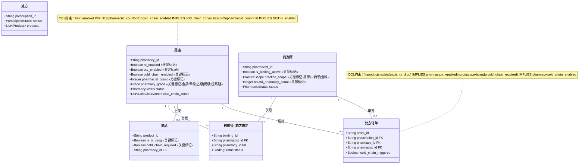
```mermaid
classDiagram
    class 药店 {
        +String pharmacy_id
        +Boolean rx_enabled «关键标记»
        +Boolean otc_enabled «关键标记»
        +Boolean cold_chain_enabled «关键标记»
        +Integer pharmacist_count «关键标记»
        +Grade pharmacy_grade «关键标记·金牌|甲级|乙级|丙级|观察期»
        +PharmacyStatus status
        +List~ColdChainZone~ cold_chain_zones
    }
    
    class 药剂师 {
        +String pharmacist_id
        +Boolean is_binding_active «关键标记»
        +PracticeScope practice_scope «关键标记·药学|中药学|全科»
        +Integer bound_pharmacy_count «关键标记»
        +PharmacistStatus status
    }
    
    class 商品 {
        +String product_id
        +Boolean is_rx_drug «关键标记»
        +Boolean cold_chain_required «关键标记»
        +String pharmacy_id FK
    }
    
    class 药剂师_药店绑定 {
        +String binding_id
        +String pharmacist_id FK
        +String pharmacy_id FK
        +BindingStatus status
    }
    
    class 处方 {
        +String prescription_id
        +PrescriptionStatus status
        +List~Product~ products
    }
    
    class 处方订单 {
        +String order_id
        +String prescription_id FK
        +String pharmacy_id FK
        +String pharmacist_id FK
        +Boolean cold_chain_triggered
    }
    
    药店 "1" -- "0..n" 药剂师_药店绑定 : 关联
    药剂师 "1" -- "0..n" 药剂师_药店绑定 : 关联
    药店 "1" -- "0..n" 商品 : 上架
    药店 "1" -- "0..n" 处方订单 : 履约
    药剂师 "1" -- "0..n" 处方订单 : 审方
    
    note for 药店 "OCL约束：\nrx_enabled IMPLIES pharmacist_count>=1\ncold_chain_enabled IMPLIES cold_chain_zones.size()>0\npharmacist_count==0 IMPLIES NOT rx_enabled"
    note for 处方订单 "OCL约束：\nproducts.exists(p|p.is_rx_drug) IMPLIES pharmacy.rx_enabled\nproducts.exists(p|p.cold_chain_required) IMPLIES pharmacy.cold_chain_enabled"
```

#### 2.6.3 OCL 约束语言规则（Object Constraint Language）

> **UML 2.0 OCL** 是一种形式化约束语言，用于精确描述模型中对象之间的关系规则，避免自然语言的歧义。以下OCL规则作为开发实现的强制性约束。

| 约束编号 | 约束名称 | OCL 表达式 | 说明 |
|:--------:|----------|-----------|------|
| OCL-001 | 处方药能力前置 | `context Pharmacy inv: self.rx_enabled implies self.pharmacist_count >= 1` | 药店开启处方药能力的前置条件是至少绑定1名药师 |
| OCL-002 | 药师数量联动标记 | `context Pharmacy inv: self.pharmacist_count = 0 implies not self.rx_enabled` | 药师归零→处方药能力自动关闭 |
| OCL-003 | 冷链能力前置 | `context Pharmacy inv: self.cold_chain_enabled implies self.cold_chain_zones->notEmpty()` | 开启冷链的先决条件是至少配置1个冷链覆盖区域 |
| OCL-004 | 处方订单·处方药校验 | `context RxOrder inv: self.products->exists(p | p.is_rx_drug) implies self.pharmacy.rx_enabled` | 含处方药的订单必须由处方药能力的药店履约 |
| OCL-005 | 处方订单·冷链校验 | `context RxOrder inv: self.products->exists(p | p.cold_chain_required) implies self.pharmacy.cold_chain_enabled` | 含冷链商品的订单必须由有冷链能力的药店履约 |
| OCL-006 | 药师审方范围 | `context RxOrder inv: self.pharmacist.practice_scope.includes(self.products.rx_category)` | 药师只能审核执业范围内的处方 |
| OCL-007 | 直播展示处方药 | `context Host inv: self.can_sell_rx implies (self.role = Role::Doctor or self.role = Role::Pharmacist) and self.live_qualification = true` | 只有医生/药剂师+有直播资质才能展示处方药 |
| OCL-008 | 结算周期与等级 | `context Pharmacy inv: self.pharmacy_grade = Grade::Gold implies self.settlement_cycle = SettlementCycle::T3` | 金牌药店=T+3结算，等级决定结算周期 |
| OCL-009 | 药师绑定上限 | `context Pharmacist inv: self.bound_pharmacy_count <= self.max_bound` | 单个药师绑定药店数不超过上限（默认5） |
| OCL-010 | 处方流转·多药房匹配 | `context RxOrder inv: self.pharmacy.rx_enabled and self.pharmacy.status = PharmacyStatus::OPERATING_RX` | 处方只能推送到处方药营业中药房 |

#### 2.6.4 标记联动传播路径

```
[资质审核通过] 
    ↓ 设置
[rx_enabled=false, otc_enabled=false, cold_chain_enabled=false]（初始状态）
    ↓ SM-02: 培训完成 → 待关联药师
[otc_enabled=true, rx_enabled=false]（OTC先行）
    ↓ 管理员关联药师 SM-19: binding_active
[pharmacist_count=1] → [OCL-001触发] → [rx_enabled=true] → [药店状态=营业中·处方药全]
    ↓ 绑定冷链设备 + 配置覆盖区域
[cold_chain_enabled=true] → [OCL-003满足] → [商品级：cold_chain_required标记的商品可上架]
    ↓ 药师全部解绑 (BR-SUG-154)
[pharmacist_count=0] → [OCL-002触发] → [rx_enabled=false] → [处方流转停止] → [OCL-005保护生效]
```

#### 2.6.5 开发实现约束

| 约束层级 | 实现位置 | 方式 |
|----------|----------|------|
| **OCL-001~OCL-003** | 数据库触发器/Service层前置校验 | 标记变更前检查前置条件，不满足则拒绝变更并返回原因 |
| **OCL-004~OCL-006** | 订单Service层·下单前置校验 | 订单提交前所有校验一次性执行，任一不满足→拒绝+原因 |
| **OCL-007** | 直播风控层 | 主播开播+展示商品卡前校验 |
| **OCL-008** | 结算引擎 | 生成结算单时根据`pharmacy_grade`自动匹配`settlement_cycle` |
| **OCL-009** | 绑定Service层 | SM-19 binding_request→accept→检查是否达上限 |
| **OCL-010** | 入网前置校验·入驻Service层 | SM-18入网发起前→检查入驻状态+yeepay_merchant_id存在性+资质有效性 |
| **OCL-011** | 入网资质引用·易宝入网Service层 | 自动装载入驻资质→锁定核心字段→仅开放支付要素补充
| **OCL-010** | 入网前置校验·入驻Service层 | 发起易宝入网(SM-18)前→必须满足：①入驻角色状态∈{审核通过/待签约/已签约/培训完成/营业中} ②未持有有效yeepay_merchant_id ③入驻时提交的资质证照未作废/过期。任一不满足→拒绝入网申请+返回具体原因 |
| **OCL-011** | 入网资质引用·易宝入网Service层 | 发起入网时→系统自动从入驻申请中加载已提交的资质证照（营业执照/许可证/执业证/身份证等）→填充到入网表单→仅允许补充支付特有要素（银行账户/收单场景）→禁止编辑已引用的入驻资质核心字段（证照编号/有效期/持证人信息） |

---

## §2.7 账号体系与身份路由（v3.1.0新增·账号-身份-工作台端到端闭环）

> **背景**：PRD v3.0.0 定义了平台角色体系（§1.3）和入驻流程（§2.1~§2.6），但缺少「一个手机号注册后如何成为不同角色？同一人同时是患者+医生时怎么切换？APP如何根据身份展示不同工作台？」的端到端链路。本章补齐账号体系、身份映射、角色路由规则和各角色APP端视图定义，确保「注册→身份获取→角色路由→工作台展示→个人中心」全链路完整闭环。

### 2.7.1 账号模型设计

```
┌─────────────────────────────────────────────────────┐
│               SugarMate 账号-身份模型                  │
│                                                     │
│  一个手机号 = 一个 SugarMate 账号（Account）           │
│       │                                             │
│       │ 可拥有 1~N 个身份（Identity）                 │
│       │                                             │
│   ┌───┴───────────────────────────────┐             │
│   │                                   │             │
│   ▼                                   ▼             │
│ ┌─────────┐  ┌─────────┐  ┌─────────┐              │
│ │ 患者 PT  │  │ 医生 DR  │  │ 营养师 NT│  ...         │
│ │(注册即得)│  │(入驻后得)│  │(入驻后得)│              │
│ └─────────┘  └─────────┘  └─────────┘              │
│                                                     │
│  身份来源：                                          │
│  · 患者(PT)/家属(FM)：手机号注册后自动获得           │
│  · 医生(DR)/药剂师(PR)/营养师(NT)/健康管理师(HM)：   │
│    入驻审核通过后系统自动分配（见§2.2）              │
└─────────────────────────────────────────────────────┘
```

**核心设计决策**：

| 决策项 | 决策 | 依据 |
|--------|------|------|
| 账号唯一性 | 一个手机号=一个账号，不可重复注册 | 手机号实名制+微信绑定，防刷防假号 |
| 多身份支持 | 一个账号可同时拥有多个身份 | 真实场景：糖尿病患者本身也可能是内分泌科医生 |
| 患者身份 | 手机号注册后自动获得，不可移除 | 患者是平台最基础身份 |
| B端身份 | 入驻审核通过后系统追加分配 | 入驻审核（§2.2）是B端身份的唯一获取途径 |
| 身份移除 | PT默认不可移除；DR/PR/NT/HM可申请退出（需结算清账+服务完结） | 防止数据孤岛+合规要求 |

### 2.7.2 身份获取与映射

**新增BR·账号-身份规则**：

| 规则编号 | 规则名称 | 触发条件→行为 |
|:--------:|----------|--------------|
| BR-SUG-800 | 账号注册·患者身份自动授予 | [事件驱动] 手机号+验证码注册成功 → [系统自动] 创建Account记录 + 自动创建Identity(type=PT, status=active) + 引导完善健康档案 |
| BR-SUG-801 | 微信授权·账号绑定 | [事件驱动] 小程序微信授权登录 → [系统自动] 通过微信UnionID查找已有Account → 已有→绑定微信并登录 / 无→创建Account+PT身份+绑定微信 |
| BR-SUG-802 | 入驻通过·B端身份追加 | [事件驱动] 入驻审核通过(DR/PR/NT/HM) → [系统自动] 在对应Account下追加Identity(type=入驻角色, status=active) + 发送通知「您的XX身份已激活」 |
| BR-SUG-803 | B端身份·入驻状态联动 | [系统自动] SM-02入驻状态变更→联动Identity状态：入驻.状态=「营业中」→Identity.status=active / 入驻.状态=「暂停营业」→Identity.status=suspended / 入驻.状态=「退出」→Identity.status=inactive |
| BR-SUG-804 | 账号注销·前置校验 | [手动] 用户发起账号注销 → [系统自动] 检查：①所有未完结订单=0 ②所有未结算收入=0 ③所有进行中服务=0 ④无进行中入驻审核。任一不满足→拒绝+原因清单 |
| BR-SUG-805 | 手机号换绑·风控 | [手动] 用户更换绑定手机号 → [系统自动] 新手机号未注册+旧手机号短信验证+人脸识别（可选）→ 换绑成功+通知旧手机号 |

**数据实体（ENT）增补**：

| ENT编号 | 实体名称 | 关键字段 | 说明 |
|:-------:|----------|----------|------|
| ENT-SUG-059 | Account·账号 | account_id, mobile(加密), wx_unionid, wx_openid_mp, wx_openid_app, status, created_at, updated_at | 平台账号主实体 |
| ENT-SUG-060 | Identity·身份 | identity_id, account_id(FK), role_type(枚举:PT/FM/DR/PR/NT/HM), status(枚举:active/suspended/inactive), acquired_at, acquired_via(枚举:registration/onboarding) | 账号下身份列表，一对多 |
| ENT-SUG-061 | AccountSession·登录会话 | session_id, account_id(FK), active_identity_id(FK→Identity), device_info, login_at, expires_at, last_active_at | 当前活跃的登录会话+活跃身份 |

### 2.7.3 角色路由规则

> **角色路由**：用户登录APP后，系统根据账号下所有身份和当前活跃身份，将用户路由到对应的角色视图（工作台+Tab结构）。

| 规则编号 | 规则名称 | 触发条件→行为 |
|:--------:|----------|--------------|
| BR-SUG-806 | 默认角色路由·单身份 | [系统自动] 登录时账号仅有1个身份 → 直接进入该身份对应的角色视图（PT→患者端视图 / DR→医生工作台 / NT→营养师工作台 / HM→HM工作台） |
| BR-SUG-807 | 默认角色路由·多身份 | [系统自动] 登录时账号有≥2个身份 → 优先使用「上次活跃身份」(AccountSession.active_identity_id)；若无历史记录→优先PT身份（患者作为默认视图） |
| BR-SUG-808 | 角色切换 | [手动] 用户点击「切换角色」→ [系统] 展示所有active身份列表（含角色图标+角色名称+角色状态）→ 用户选择→切换至目标角色视图+更新AccountSession.active_identity_id |
| BR-SUG-809 | 角色切换·数据隔离 | [系统自动] 角色切换后：①APP底部Tab重新渲染 ②页面栈清空回到首页 ③数据上下文完全切换（患者数据↔医生数据互不可见） ④消息/通知按当前角色过滤 |
| BR-SUG-810 | B端身份·APP登录限制 | [系统自动] 仅有PT/FM/DR/NT/HM可在APP端登录。PR(药剂师)身份仅在PC后台可操作，APP端不展示药剂师视图。PH(药店)为机构角色，不映射到个人APP登录。 |

**状态机·账号身份切换**：

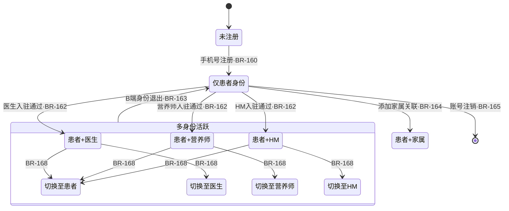
```mermaid
stateDiagram-v2
    [*] --> 未注册
    未注册 --> 仅患者身份 : 手机号注册·BR-160
    仅患者身份 --> 患者+医生 : 医生入驻通过·BR-162
    仅患者身份 --> 患者+营养师 : 营养师入驻通过·BR-162
    仅患者身份 --> 患者+HM : HM入驻通过·BR-162
    仅患者身份 --> 患者+家属 : 添加家属关联·BR-164
    
    state 多身份活跃 {
        患者+医生 --> 切换至患者 : BR-168
        患者+医生 --> 切换至医生 : BR-168
        患者+营养师 --> 切换至患者 : BR-168
        患者+营养师 --> 切换至营养师 : BR-168
        患者+HM --> 切换至患者 : BR-168
        患者+HM --> 切换至HM : BR-168
    }
    
    多身份活跃 --> 仅患者身份 : B端身份退出·BR-163
    仅患者身份 --> [*] : 账号注销·BR-165
```

### 2.7.4 各角色APP端视图与工作台

> **核心原则**：同一个SugarMate APP，不同角色身份登录后看到完全不同的底部Tab结构和首页内容。这是「APP内角色视图」的含义——不是多个APP，而是一个APP根据身份动态切换界面。

#### 2.7.4.1 患者端视图（PT·默认）

患者端使用标准5 Tab结构（已定义于§17.3.2，此处明确为最终定义而非建议）：

| Tab | 图标语义 | 承载功能 | 关联FN（APP端） |
|:---:|----------|----------|-----------------|
| **首页** | 糖友健康仪表盘 | CGM概览/预警速览/快捷问诊入口/用药提醒/科普推荐 | FN-SUG-APP-031~036 |
| **服务** | 一站式健康服务 | 在线问诊/商城购药/健康商城/1v1签约服务/健康保险 | FN-SUG-APP-006~013/021~030a |
| **社区** | 糖友交流圈 | 帖子列表/话题/直播入口/专家专栏/运动打卡 | FN-SUG-APP-043~050 |
| **会员** | 会员权益中心 | 等级展示/成长值/积分中心/签到/权益领取/优惠券 | FN-SUG-APP-031(积分)/032(积分) |
| **我的** | 个人中心 | 健康档案/处方管理/订单列表/我的药房/设置/帮助 | FN-SUG-APP-002/003/014/028 |

#### 2.7.4.2 医生端视图（DR·APP内角色视图）

医生在APP端执行问诊服务，在PC后台管理入驻/价格/结算。APP端Tab结构：

| Tab | 图标语义 | 承载功能 | 关联FN（APP端） | 说明 |
|:---:|----------|----------|-----------------|------|
| **工作台** | 问诊工作台 | 待接诊队列/进行中问诊/今日预约/收入概览 | FN-SUG-APP-006/008/011 | 医生登录后默认首页 |
| **问诊** | 问诊详情 | 图文消息/视频通话/追问轮次/问诊状态/诊断书写/电子处方·CA签名 | FN-SUG-APP-006/010/014/019 | 单次问诊全流程 |
| **患者** | 患者管理 | 我的患者列表/历史问诊/健康档案查看/复诊提醒 | FN-SUG-APP-008/002 | 患者健康档案只读 |
| **直播** | 直播授课 | 预约直播/开播/互动/直播数据 | FN-SUG-LIVE-009~012 | 复用直播APP能力 |
| **我的** | 医生个人中心 | 收入与结算/评价管理/我的主页(编辑)/执业信息/设置/帮助 | — | 侧重职业管理 |

#### 2.7.4.3 营养师端视图（NT·APP内角色视图）

营养师在APP端执行1v1饮食指导服务：

| Tab | 图标语义 | 承载功能 | 关联FN（APP端） | 说明 |
|:---:|----------|----------|-----------------|------|
| **工作台** | 服务工作台 | 待处理咨询/方案待审核/今日预约/服务提醒 | FN-SUG-APP-012/038 | 默认首页 |
| **患者** | 患者管理 | 已签约患者列表/饮食记录/血糖数据/历史方案 | FN-SUG-APP-037/038/002 | 患者健康数据只读 |
| **饮食方案** | 方案管理 | 方案制订(碳水计算/热量分配/食物推荐)/方案模板库/方案执行追踪 | FN-SUG-APP-038 | 核心工具 |
| **直播** | 直播科普 | 饮食科普直播/预约/互动 | FN-SUG-LIVE-009 | 复用直播APP能力 |
| **我的** | 营养师个人中心 | 收入与结算/评价/执业信息/设置 | — | — |

#### 2.7.4.4 健康管理师端视图（HM·APP内角色视图）

HM在APP端执行血糖预警响应和定期回访：

| Tab | 图标语义 | 承载功能 | 关联FN（APP端） | 说明 |
|:---:|----------|----------|-----------------|------|
| **工作台** | 预警响应面板 | 待处理预警(黄/橙/红分级)/今日回访队列/预警统计 | FN-SUG-APP-035/040 | 默认首页·核心工作区 |
| **患者** | 患者管理 | 已签约患者列表/血糖趋势/健康报告/预警历史 | FN-SUG-APP-033/034/040/041 | 患者全景数据 |
| **回访** | 回访管理 | 回访计划/SOP模板/回访记录/方案调整 | FN-SUG-APP-040 | 定期随访全流程 |
| **我的** | HM个人中心 | 收入与结算/服务统计/执业信息/设置 | — | — |

> **注意**：HM没有直播Tab——健康管理师的核心职责是预警响应和回访管理，非内容生产。

#### 2.7.4.5 APP视图路由决策树

```
用户打开APP
    ↓
检查登录状态（BR-SUG-806/807）
    ↓ 未登录
引导登录页（FN-SUG-APP-001）→ 登录/注册
    ↓ 已登录
查询账号下所有active身份（ENT-SUG-060）
    ↓
    ├── 仅PT身份 → 加载【患者端视图】(5 Tab)
    ├── 仅DR身份 → 加载【医生端视图】(5 Tab·工作台优先)
    ├── 仅NT身份 → 加载【营养师端视图】(5 Tab·工作台优先)
    ├── 仅HM身份 → 加载【HM端视图】(4 Tab·工作台优先)
    ├── 多身份·有历史 → 恢复上次活跃身份的视图
    └── 多身份·无历史 → 默认PT视图 + 首次登录提示「您拥有多个身份，可在设置中切换」
```

### 2.7.5 多角色切换

**切换入口**：
- 「我的」Tab → 设置 → 切换角色（仅多身份用户显示此入口）
- 多身份用户首次登录时顶部提示条：「检测到您有多个身份 | 当前：患者 | 切换到医生 ▶」

**切换流程**：

```
用户点击「切换角色」
    ↓
[系统] 展示身份选择列表
    ┌──────────────────────────┐
    │ 选择身份                  │
    │                          │
    │ 🏥 患者 · 张三            │ ← 当前
    │ 👨‍⚕️ 医生 · 张三           │
    │    执业证：XXXXX          │
    │    状态：可接诊           │
    │                          │
    │ 🥗 营养师 · 张三 (待审核) │
    │    入驻审核中...          │ ← 灰色·不可选
    └──────────────────────────┘
    ↓ 用户选择身份
[系统] 执行BR-SUG-809（数据隔离+视图重载）
    ↓
进入目标角色视图首页
```

**UI展示规则**：

| 场景 | 展示规则 |
|------|----------|
| 仅1个身份 | 「切换角色」入口隐藏 |
| 2个身份 | 直接显示两个身份选项 |
| ≥3个身份 | 列表展示，当前身份标记蓝色高亮 |
| B端身份审核中/暂停 | 灰色显示+状态标注，不可切换 |
| 切换动画 | 过渡动画300ms + 新工作台骨架屏加载 |

### 2.7.6 个人中心×角色差异化

> APP端「我的」Tab在不同角色视图下展示不同内容。以下为各角色的「我的」Tab定义。

#### 2.7.6.1 患者端「我的」（当前已定义）

| 功能区块 | 内容 | 关联FN |
|----------|------|--------|
| 健康档案入口 | 基本信息/病史/过敏史/CGM数据 | FN-SUG-APP-002 |
| 我的处方 | 历史处方列表+续方入口 | FN-SUG-APP-014/016 |
| 我的订单 | 商城订单/处方订单 | FN-SUG-APP-028 |
| 我的药房 | 常用药房收藏/最近购买 | — |
| 我的医生/营养师/HM | 已签约服务列表 | FN-SUG-APP-012 |
| 家属管理 | 关联家属+远程监护入口 | FN-SUG-APP-004/042 |
| 隐私与数据 | 健康数据授权/隐私设置 | FN-SUG-APP-003 |
| 设置 | 通知/语言/关于/退出登录 | — |

#### 2.7.6.2 医生端「我的」

| 功能区块 | 内容 | 说明 |
|----------|------|------|
| 收入概览 | 今日/本周/本月收入 + 趋势图 | 快速查看收入 |
| 收入明细 | 问诊收入/处方收入/直播收入/结算记录 | 按类型筛选 |
| 评价管理 | 患者评价列表+评分趋势+好评率 | 含回复功能 |
| 我的主页 | 编辑医生主页(简介/价格/排班/擅长) | 部分信息PC后台管理 |
| 执业信息 | 执业证编号/有效期/认证状态 | 只读展示 |
| 设置 | 问诊提醒/免打扰/切换角色/关于/退出 | — |

#### 2.7.6.3 营养师端「我的」

| 功能区块 | 内容 | 说明 |
|----------|------|------|
| 收入概览 | 服务收入+方案收入+趋势 | — |
| 收入明细 | 1v1服务收入/饮食方案收入/结算记录 | — |
| 服务评价 | 患者评价列表+评分 | — |
| 执业信息 | 营养师证编号/有效期/认证状态 | 只读 |
| 方案模板 | 个人常用饮食方案模板管理 | 提升效率 |
| 设置 | 服务提醒/切换角色/关于/退出 | — |

#### 2.7.6.4 HM端「我的」

| 功能区块 | 内容 | 说明 |
|----------|------|------|
| 服务统计 | 管理患者数/本月回访次数/预警处理量/响应时效 | 核心KPI |
| 收入明细 | 管理服务收入/结算记录 | — |
| 执业信息 | 健康管理师证编号/有效期/认证状态 | 只读 |
| 回访SOP | 个人回访模板/常用话术管理 | — |
| 设置 | 预警通知/切换角色/关于/退出 | — |

---

### 2.7.7 新增FN定义（账号体系·APP端）

以下FN纳入§3.2.2 APP FN全量表：

| FN编号 | 功能名称 | 域 | 优先级 | 说明 |
|--------|----------|-----|:------:|------|
| FN-SUG-APP-001a | 账号登录（手机号+验证码/密码） | 账号域 | P0 | 已有FN-SUG-APP-001（实名注册）的前置步骤。支持手机号+短信验证码登录，微信授权登录 |
| FN-SUG-APP-001b | 多角色切换 | 账号域 | P0 | 在「设置」中查看/切换活跃身份（BR-SUG-808/809） |
| FN-SUG-APP-001c | 账号安全中心 | 账号域 | P1 | 修改密码/换绑手机号(BR-SUG-805)/注销账号(BR-SUG-804)/登录设备管理 |

**新增BR汇总**：

| 编号 | 名称 | 所属章节 |
|:----:|------|:-------:|
| BR-SUG-800 | 账号注册·患者身份自动授予 | §2.7.2 |
| BR-SUG-801 | 微信授权·账号绑定 | §2.7.2 |
| BR-SUG-802 | 入驻通过·B端身份追加 | §2.7.2 |
| BR-SUG-803 | B端身份·入驻状态联动 | §2.7.2 |
| BR-SUG-804 | 账号注销·前置校验 | §2.7.2 |
| BR-SUG-805 | 手机号换绑·风控 | §2.7.2 |
| BR-SUG-806 | 默认角色路由·单身份 | §2.7.3 |
| BR-SUG-807 | 默认角色路由·多身份 | §2.7.3 |
| BR-SUG-808 | 角色切换 | §2.7.3 |
| BR-SUG-809 | 角色切换·数据隔离 | §2.7.3 |
| BR-SUG-810 | B端身份·APP登录限制 | §2.7.3 |

**新增ENT汇总**：

| 编号 | 名称 |
|:----:|------|
| ENT-SUG-059 | Account·账号 |
| ENT-SUG-060 | Identity·身份 |
| ENT-SUG-061 | AccountSession·登录会话 |

---

## §3 功能需求FN总览（145+ FN）

### 3.1 FN编号规则升级

```
新版编号体系：FN-{系统}-{终端}-{NNN}

系统缩写：
- SUG = SugarMate平台（主系统）
- SUG-LIVE = SugarMate直播子系统

终端缩码（四物理终端）：
- MP = 小程序（平台业务前台·轻量入口）
- APP = 移动APP（平台业务前台·深度体验）  
- LIVE = 直播APP（腾讯云直播）
- PC = PC业务后台（全链路管理·SCRM+运营+入驻+角色业务管理）

> **v3.0.0一致性修复**：DR(医生)/PH(药店)/PR(药剂师)是**角色ID**（见§1.3），不是终端。DR/PH/PR的入驻申请和管理操作均通过**PC业务后台**完成。医生问诊执行在APP端（通过APP内的医生端视图），但业务管理（价格/排班/结算查看）也在PC后台。终端层面只有4个物理终端（MP/APP/LIVE/PC），各角色在对应终端内拥有角色专属视图。
```

### 3.2 FN全量表

#### 3.2.1 小程序·平台业务前台（MP）：15 FN

| FN编号 | 功能名称 | 新增/继承 | 优先级 |
|--------|----------|-----------|--------|
| FN-SUG-MP-001 | 血糖科普内容展示（图文+短视频） | 继承 | P0 |
| FN-SUG-MP-002 | 糖尿病风险评估 | 继承 | P0 |
| FN-SUG-MP-003 | 健康商品推荐（OTC/器械/食品） | 继承 | P1 |
| FN-SUG-MP-004 | 在线咨询入口（SCRM承接） | 继承 | P0 |
| FN-SUG-MP-005 | APP下载引导 | 继承 | P0 |
| FN-SUG-MP-006 | 用户注册/登录（微信授权） | 继承 | P0 |
| FN-SUG-MP-007 | 邀请有礼（社交裂变） | 继承 | P1 |
| FN-SUG-MP-008 | 直播预告与轻观看（引流至直播APP） | **升级** | P1 |
| FN-SUG-MP-009 | 快捷用药提醒 | 继承 | P2 |
| FN-SUG-MP-010 | 多语言版本 | 继承 | P2 |
| FN-SUG-MP-011 | **附近药房查找（LBS+药房列表+评价）** | **新增** | P1 |
| FN-SUG-MP-012 | **医生名片展示（轻量医生主页+预约入口）** | **新增** | P1 |
| FN-SUG-MP-013 | **1v1轻问诊（文字IM，SCRM承接）** | **新增** | P1 |
| FN-SUG-MP-014 | **营养师/健康管理师服务推荐** | **新增** | P2 |
| FN-SUG-MP-015 | **糖友圈入口（轻量社区浏览）** | **新增** | P2 |

#### 3.2.2 APP·平台业务前台（APP）：53 FN

| FN编号 | 功能名称 | 新增/继承 | 优先级 |
|--------|----------|-----------|--------|
| **账号域（4 FN·v3.1.0新增）** ||||
| FN-SUG-APP-001 | 用户实名注册（身份证+手机号） | 继承 | P0 |
| FN-SUG-APP-001a | 账号登录（手机号+验证码/密码/微信授权） | **v3.1.0新增** | P0 |
| FN-SUG-APP-001b | 多角色切换（查看/切换活跃身份·BR-SUG-808/809） | **v3.1.0新增** | P0 |
| FN-SUG-APP-001c | 账号安全中心（改密/换绑/注销·BR-SUG-804/805） | **v3.1.0新增** | P1 |
| **健康档案域（5 FN）** ||||
| FN-SUG-APP-002 | 健康档案管理（含ICD-11诊断编码） | 继承 | P0 |
| FN-SUG-APP-003 | 隐私设置与数据授权 | 继承 | P1 |
| FN-SUG-APP-004 | 家属关联管理（最多5人） | 继承 | P1 |
| FN-SUG-APP-005 | 多语言界面 | 继承 | P2 |
| **问诊域（8 FN）** ||||
| FN-SUG-APP-006 | 在线问诊（图文+视频） | 继承 | P0 |
| FN-SUG-APP-007 | 医生搜索与推荐（科室/评分/价格/擅长） | 继承 | P0 |
| FN-SUG-APP-008 | 复诊记录与历史问诊 | 继承 | P1 |
| FN-SUG-APP-009 | 医生评价（星级+标签+文字） | 继承 | P1 |
| FN-SUG-APP-010 | 电子病历（含SNOMED CT术语） | 继承 | P1 |
| FN-SUG-APP-011 | **医生主页（含职称/擅长/评价/可预约时间/问诊量）** | **升级** | P0 |
| FN-SUG-APP-012 | **1v1专属服务（签约医生/营养师/健康管理师包月）** | **新增** | P1 |
| FN-SUG-APP-013 | 紧急SOS（血糖危重→120+紧急联系人+医生） | 继承 | P0 |
| **处方域（7 FN）** ||||
| FN-SUG-APP-014 | 电子处方展示（含CA签名+药品明细） | 继承 | P0 |
| FN-SUG-APP-015 | 处方药师审核状态查看 | 继承 | P0 |
| FN-SUG-APP-016 | 续方申请（30-180天间隔） | 继承 | P1 |
| FN-SUG-APP-017 | 药物相互作用提醒 | 继承 | P1 |
| FN-SUG-APP-018 | 用药提醒（剂量/频次/时间） | 继承 | P1 |
| FN-SUG-APP-019 | CA电子签名（医生端+流转防伪） | 继承 | P0 |
| FN-SUG-APP-020 | **处方流转到药房（多药房选择+比价+冷链标记）** | **升级** | P0 |
| **商城域（10 FN）** ||||
| FN-SUG-APP-021 | 商城首页与分类（OTC/器械/食品/保健品） | 继承 | P1 |
| FN-SUG-APP-022 | 商品搜索与筛选 | 继承 | P1 |
| FN-SUG-APP-023 | 商品详情页（含用法用量/禁忌/评价） | 继承 | P1 |
| FN-SUG-APP-024 | 购物车 | 继承 | P1 |
| FN-SUG-APP-025 | 下单与支付（微信/支付宝） | 继承 | P1 |
| FN-SUG-APP-026 | 处方药专区（处方校验→加购限制） | 继承 | P0 |
| FN-SUG-APP-027 | 商品评价 | 继承 | P2 |
| FN-SUG-APP-028 | 订单管理（全部/待付款/待发货/待收货/已完成） | 继承 | P1 |
| FN-SUG-APP-029 | **冷链配送追踪（实时位置+温度曲线+交接确认）** | **升级** | P0 |
| FN-SUG-APP-030 | **退款/售后管理（退款/退货退款/换货/ADR上报/药品召回）** | **升级** | P0 |
| FN-SUG-APP-030a | **药品不良反应（ADR）上报与追踪** | **新增** | P0 |
| **慢病管理域（12 FN）** ||||
| FN-SUG-APP-031 | CGM设备绑定与数据同步 | 继承 | P0 |
| FN-SUG-APP-032 | 手动血糖录入 | 继承 | P0 |
| FN-SUG-APP-033 | 血糖趋势分析（日/周/月/90天） | 继承 | P0 |
| FN-SUG-APP-034 | TIR达标分析（Time In Range 3.9-10.0） | 继承 | P0 |
| FN-SUG-APP-035 | 血糖预警通知（黄/橙/红三级） | 继承 | P0 |
| FN-SUG-APP-036 | HbA1c预测（基于90天血糖数据） | 继承 | P1 |
| FN-SUG-APP-037 | 饮食记录与碳水化合物计算 | 继承 | P1 |
| FN-SUG-APP-038 | **个性化饮食方案（营养师制订+AI推荐）** | **升级** | P0 |
| FN-SUG-APP-039 | 运动记录 | 继承 | P2 |
| FN-SUG-APP-040 | **健康管理师1v1服务（回访/调整方案/报告解读）** | **新增** | P1 |
| FN-SUG-APP-041 | 健康报告生成（血糖/用药/饮食/运动多维） | 继承 | P1 |
| FN-SUG-APP-042 | **远程监护（家属查看糖友血糖+预警通知）** | **新增** | P0 |
| **社区域（8 FN）** ||||
| FN-SUG-APP-043 | 糖友日记发布（图文+血糖标签+心情） | 继承 | P1 |
| FN-SUG-APP-044 | 话题广场（糖尿病饮食/运动/用药/心理） | 继承 | P1 |
| FN-SUG-APP-045 | 点赞/评论/收藏/分享 | 继承 | P1 |
| FN-SUG-APP-046 | 举报与内容管理 | 继承 | P1 |
| FN-SUG-APP-047 | 关注/粉丝/达人体系 | 继承 | P2 |
| FN-SUG-APP-048 | 精华推荐（10+精选→达人标签） | 继承 | P2 |
| FN-SUG-APP-049 | **医生/营养师/健康管理师官方账号** | **新增** | P1 |
| FN-SUG-APP-050 | **糖友圈（基于位置/糖尿病类型/年龄段 社群）** | **新增** | P1 |

#### 3.2.3 直播APP·腾讯云直播（LIVE）：20 FN

| FN编号 | 功能名称 | 说明 | 优先级 |
|--------|----------|------|--------|
| **直播基础能力（8 FN）** ||||
| FN-SUG-LIVE-001 | 直播推流（腾讯云CSS推流SDK） | 支持多分辨率自适应推流(360p/720p/1080p) | P0 |
| FN-SUG-LIVE-002 | 直播拉流与播放器 | 腾讯云播放器SDK，支持HLS/FLV/RTMP协议 | P0 |
| FN-SUG-LIVE-003 | 直播美颜与滤镜 | 主播美颜/滤镜/瘦脸等腾讯云特效SDK | P1 |
| FN-SUG-LIVE-004 | 实时弹幕/IM互动 | 腾讯云IM SDK集成，弹幕+消息+表情 | P0 |
| FN-SUG-LIVE-005 | 直播转码与录制 | 云端录制+多码率转码 | P0 |
| FN-SUG-LIVE-006 | 直播回放 | 录制文件回放(关联腾讯云点播VOD) | P0 |
| FN-SUG-LIVE-007 | 直播数据统计 | 观看人数/峰值/时长/互动量/礼物 | P1 |
| FN-SUG-LIVE-008 | 直播安全审核 | AI实时画面审核+关键词过滤+延时播出 | P0 |
| **直播业务场景（7 FN）** ||||
| FN-SUG-LIVE-009 | 健康科普直播 | 医生/KOL直播讲糖尿病知识 | P0 |
| FN-SUG-LIVE-010 | 医生讲堂直播 | 专题系列讲座(饮食/运动/用药/心理/并发症) | P0 |
| FN-SUG-LIVE-011 | **直播带货（保健品/器械/食品/血糖仪）** | **商品讲解+购物车+一键下单+优惠券** | P1 |
| FN-SUG-LIVE-012 | 互动问答（观众提问→主播解答） | AI精选高频问题+主播实时回答 | P0 |
| FN-SUG-LIVE-013 | 预约提醒 | 开播前15分钟+5分钟推送提醒 | P0 |
| FN-SUG-LIVE-014 | 直播回放与切片 | 精彩片段自动剪辑(关键帧识别) | P2 |
| FN-SUG-LIVE-015 | 主播关注与订阅 | 关注主播、开播提醒、我的关注列表 | P1 |
| **直播运营管理（5 FN）** ||||
| FN-SUG-LIVE-016 | 直播计划管理（后台） | 创建/编辑/删除/排期 | P0 |
| FN-SUG-LIVE-017 | 主播资质管理 | 医生/营养师/药剂师直播资质核验 | P0 |
| FN-SUG-LIVE-018 | 直播商品管理 | 关联商城商品/上下架/优惠设置 | P1 |
| FN-SUG-LIVE-019 | 直播风控 | 敏感内容审核/违规主播封禁/风险词库 | P0 |
| FN-SUG-LIVE-020 | 直播收入与结算 | 打赏分成/带货佣金/广告收入 | P1 |

#### 3.2.4 PC业务后台·SCRM+入驻管理+运营（PC）：35 FN

| FN编号 | 功能名称 | 新增/继承 | 优先级 |
|--------|----------|-----------|--------|
| **平台入驻管理（10 FN）** ||||
| FN-SUG-PC-001 | **入驻申请审核工作台** | **新增** | P0 |
| FN-SUG-PC-002 | **药店/药房管理** | **新增** | P0 |
| FN-SUG-PC-003 | **医生管理** | **新增** | P0 |
| FN-SUG-PC-004 | **药剂师管理** | **新增** | P0 |
| FN-SUG-PC-005 | **营养师/健康管理师管理** | **新增** | P1 |
| FN-SUG-PC-006 | **资质证照管理（OCR自动识别+到期提醒）** | **新增** | P0 |
| FN-SUG-PC-007 | **合同管理（电子合同+CA签名+到期提醒）** | **新增** | P0 |
| FN-SUG-PC-008 | **培训管理（课程/考试/证书/权限激活）** | **新增** | P1 |
| FN-SUG-PC-009 | **商家评价与评级（评分/投诉/违规/清退）** | **新增** | P0 |
| FN-SUG-PC-010 | **商家服务费率与合同配置** | **新增** | P1 |
| **SCRM企微管理（8 FN）** ||||
| FN-SUG-PC-011 | 企微客户承接与线索分配 | 继承 | P0 |
| FN-SUG-PC-012 | 客户标签与分组管理 | 继承 | P0 |
| FN-SUG-PC-013 | SOP自动化跟进 | 继承 | P0 |
| FN-SUG-PC-014 | 群发消息管理 | 继承 | P1 |
| FN-SUG-PC-015 | 客户画像查看 | 继承 | P0 |
| FN-SUG-PC-016 | 转化漏斗分析 | 继承 | P1 |
| FN-SUG-PC-017 | 会话存档与合规 | 继承 | P0 |
| FN-SUG-PC-018 | **入驻商家SCRM管理（药房/医生/药剂师线索管理+跟进）** | **新增** | P1 |
| **运营管理（7 FN）** ||||
| FN-SUG-PC-023b | **Banner管理（创建/排期/上下架/数据统计）** | **新增** | P1 |
| FN-SUG-PC-023c | **Banner内容审核** | **新增** | P1 |
| **内容与商品管理（10 FN）** ||||
| FN-SUG-PC-019 | **商品管理（上架/审核/价格/库存/资质关联/分类标签）** | **升级** | P0 |
| FN-SUG-PC-019a | **OTC药品上架审核（批准文号核验+说明书审核+价格合规）** | **新增** | P0 |
| FN-SUG-PC-019b | **医疗器械上架审核（注册证核验+分类标签）** | **新增** | P0 |
| FN-SUG-PC-019c | **保健品/食品上架审核（批准文号+成分标签）** | **新增** | P1 |
| FN-SUG-PC-019d | **商品批量导入（Excel模板下载→导入→校验→批量审核→上架/驳回明细）** | **新增** | P1 |
| FN-SUG-PC-019e | **商品信息变更管理（价格/规格/图片编辑→重新审核/免审→生效）** | **新增** | P1 |
| FN-SUG-PC-020 | 订单管理（查看/退款审核/纠纷处理） | 继承 | P0 |
| FN-SUG-PC-021 | 处方管理（流转监控/审核状态/异常处理） | 继承 | P0 |
| FN-SUG-PC-022 | **内容管理（科普文章/视频/社区帖子发布与审核/评论管理/评价管理）** | **升级** | P0 |
| FN-SUG-PC-022a | **科普内容医学审核（资质校验/引用规范/诊疗边界/广告合规）** | **新增** | P0 |
| FN-SUG-PC-022b | **违规内容举报处理（AI初筛→人工复核→下架→商家申诉→裁决）** | **新增** | P0 |
| FN-SUG-PC-022c | **版权投诉处理（投诉取证→临时下架→被投诉方举证→裁决→恢复/永久下架）** | **新增** | P1 |
| FN-SUG-PC-023 | 结算与对账（多商家T+N结算+对账） | **升级** | P0 |
| FN-SUG-PC-024 | **物流管理（冷链物流对接/物流商管理/温控监控）** | **新增** | P0 |
| FN-SUG-PC-025 | **平台规则引擎配置（活动/优惠券/促销/满减）** | **新增** | P1 |
| **数据看板（5 FN）** ||||
| FN-SUG-PC-026 | 平台运营数据看板（GMV/DAU/转化/留存） | 升级 | P0 |
| FN-SUG-PC-027 | 医疗质量看板（处方审核率/血糖达标率/预警处理率） | 继承 | P1 |
| FN-SUG-PC-028 | 冷链监控看板（温控达标率/断链次数/断链处理率） | 继承 | P0 |
| FN-SUG-PC-029 | **商家经营看板（药店GMV/医生问诊量/营养师服务量）** | **新增** | P0 |
| FN-SUG-PC-030 | 用户画像与分层看板 | 继承 | P1 |
| **客服中心（5 FN）** ||||
| FN-SUG-PC-031 | 在线客服IM工作台 | 继承 | P0 |
| FN-SUG-PC-032 | 工单系统（创建/分配/流转/关闭） | 继承 | P0 |
| FN-SUG-PC-033 | 知识库与快捷回复 | 继承 | P1 |
| FN-SUG-PC-034 | 客服绩效统计（响应时间/满意度/解决率） | 继承 | P1 |
| FN-SUG-PC-035 | **平台纠纷仲裁（用户vs商家 退款/投诉/申诉）** | **新增** | P0 |

---

## §4 业务泳道图（多角色×多终端）

### 4.1 主业务泳道图：用户从发现到长期健康管理

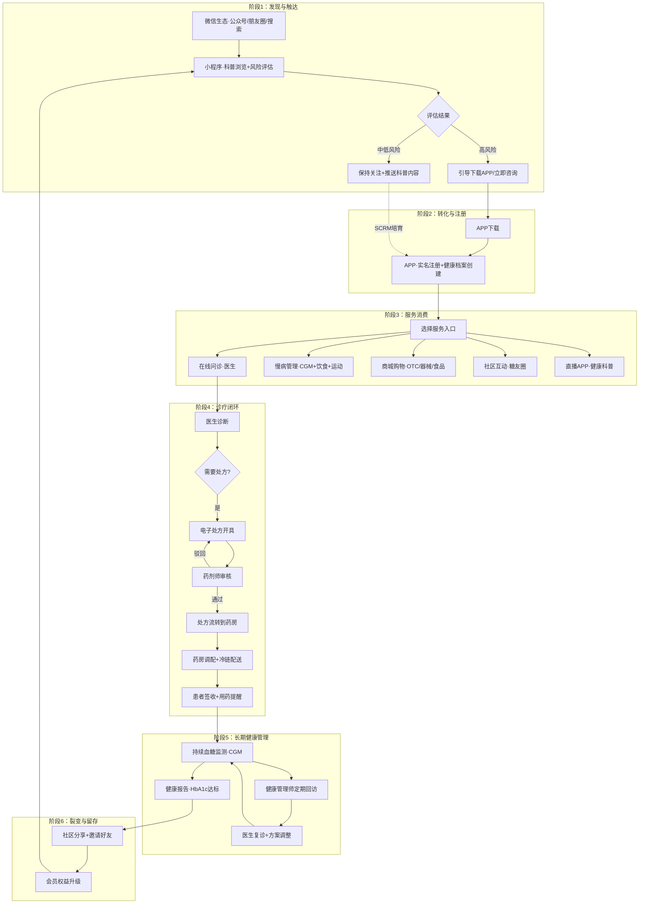
```mermaid
flowchart TB
    subgraph 阶段1_发现["阶段1：发现与触达"]
        A1["微信生态·公众号/朋友圈/搜索"] --> A2["小程序·科普浏览+风险评估"]
        A2 --> A3{评估结果}
        A3 -->|高风险| A4["引导下载APP/立即咨询"]
        A3 -->|中低风险| A5["保持关注+推送科普内容"]
    end
    
    subgraph 阶段2_转化["阶段2：转化与注册"]
        A4 --> B1["APP下载"]
        B1 --> B2["APP·实名注册+健康档案创建"]
        A5 -.->|SCRM培育| B2
    end
    
    subgraph 阶段3_服务["阶段3：服务消费"]
        B2 --> C1["选择服务入口"]
        C1 --> C2["在线问诊·医生"]
        C1 --> C3["慢病管理·CGM+饮食+运动"]
        C1 --> C4["商城购物·OTC/器械/食品"]
        C1 --> C5["社区互动·糖友圈"]
        C1 --> C6["直播APP·健康科普"]
    end
    
    subgraph 阶段4_诊疗["阶段4：诊疗闭环"]
        C2 --> D1["医生诊断"]
        D1 --> D2{需要处方?}
        D2 -->|是| D3["电子处方开具"]
        D3 --> D4["药剂师审核"]
        D4 -->|通过| D5["处方流转到药房"]
        D4 -->|驳回| D3
        D5 --> D6["药房调配+冷链配送"]
        D6 --> D7["患者签收+用药提醒"]
    end
    
    subgraph 阶段5_长期["阶段5：长期健康管理"]
        D7 --> E1["持续血糖监测·CGM"]
        E1 --> E2["健康管理师定期回访"]
        E2 --> E3["医生复诊+方案调整"]
        E3 --> E1
        E1 --> E4["健康报告·HbA1c达标"]
    end
    
    subgraph 阶段6_循环["阶段6：裂变与留存"]
        E4 --> F1["社区分享+邀请好友"]
        F1 --> F2["会员权益升级"]
        F2 --> A2
    end
```

### 4.2 平台入驻泳道图：药店入驻全流程

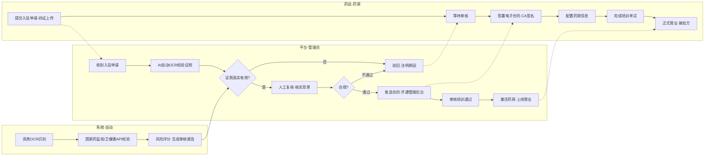
```mermaid
flowchart LR
    subgraph 药店["药店·药房"]
        P1["提交入驻申请·四证上传"] --> P2["等待审核"]
        P2 --> P3["签署电子合同·CA签名"]
        P3 --> P4["配置药房信息"]
        P4 --> P5["完成培训考试"]
        P5 --> P6["正式营业·接处方"]
    end
    
    subgraph 平台["平台·管理员"]
        A1["收到入驻申请"] --> A2["AI自动OCR校验证照"]
        A2 --> A3{"证照真实有效?"}
        A3 -->|是| A4["人工复核·核实背景"]
        A3 -->|否| A5["驳回·注明原因"]
        A4 --> A6{"合规?"}
        A6 -->|通过| A7["发送合同·开通管理后台"]
        A6 -->|不通过| A5
        A7 --> A8["审核培训通过"]
        A8 --> A9["激活药房·上线营业"]
    end
    
    subgraph 系统["系统·自动"]
        S1["资质OCR识别"] --> S2["国家药监局/卫健委API校验"]
        S2 --> S3["风险评分·生成审核报告"]
        S3 --> A3
    end
    
    P1 -.-> A1
    A5 -.-> P2
    A7 -.-> P3
    A9 -.-> P6
```

### 4.3 端到端业务闭环泳道图

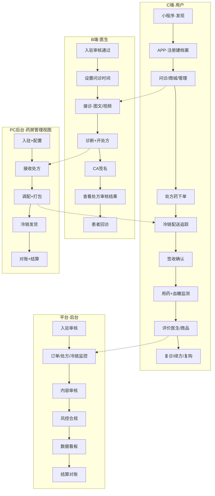
```mermaid
flowchart TD
    subgraph 用户端["C端·用户"]
        U1["小程序·发现"] --> U2["APP·注册建档案"]
        U2 --> U3["问诊/商城/管理"]
        U3 --> U4["处方药下单"]
        U4 --> U5["冷链配送追踪"]
        U5 --> U6["签收确认"]
        U6 --> U7["用药+血糖监测"]
        U7 --> U8["评价医生/商品"]
        U8 --> U9["复诊/续方/复购"]
    end
    
    subgraph 医生端["B端·医生"]
        D1["入驻审核通过"] --> D2["设置问诊时间"]
        D2 --> D3["接诊·图文/视频"]
        D3 --> D4["诊断+开处方"]
        D4 --> D5["CA签名"]
        D5 --> D6["查看处方审核结果"]
        D6 --> D7["患者回访"]
    end
    
    subgraph PC后台_药房管理["PC后台·药房管理视图"]
        M1["入驻+配置"] --> M2["接收处方"]
        M2 --> M3["调配+打包"]
        M3 --> M4["冷链发货"]
        M4 --> M5["对账+结算"]
    end
    
    subgraph 平台端["平台·后台"]
        O1["入驻审核"] --> O2["订单/处方/冷链监控"]
        O2 --> O3["内容审核"]
        O3 --> O4["风控合规"]
        O4 --> O5["数据看板"]
        O5 --> O6["结算对账"]
    end
    
    U3 -.-> D3
    D4 -.-> M2
    M3 -.-> U5
    U8 -.-> O2
```

---

## §5 业务场景闭环分析

### 5.1 CL-01：新用户从发现到长期会员闭环

```
┌─────────────────────────────────────────────────────┐
│  小程序·风险评估 ──→ APP·注册 ──→ 首次问诊 ──→ 处方购药 │
│       ↑                                          │     │
│       │                                          ↓     │
│  社交裂变·邀请有礼 ←── 会员升级 ←── 血糖达标 ←── CGM监测  │
│       │                                          │     │
│       └──────────────── 长期留存 ────────────────→│     │
└─────────────────────────────────────────────────────┘

闭环要素：
- 入口：小程序风险评估（低门槛）
- 转化：高风险→APP下载（场景驱动）
- 激活：首次问诊（价值感知）
- 留存：CGM持续监测+预警（高度粘性）
- 变现：处方药/商城/问诊/会员
- 裂变：邀请好友→双方奖励
```

### 5.2 CL-02：诊疗闭环（问诊→处方→购药→复诊）

```
┌──────────────────────────────────────────────────┐
│ 用户问诊 ──→ 医生诊断·开处方 ──→ 药剂师审核          │
│    ↑                                   ↓          │
│    │                          审核通过？            │
│    │                         ↙      ↘              │
│    │              处方流转到药房    驳回·医生修改      │
│    │                    ↓              ↓            │
│    │              药房调配·冷链配送   医生修改后重提    │
│    │                    ↓              ↓            │
│    │              用户签收·用药       审核通过       │
│    │                    ↓              │            │
│    └──────── 续方申请(30-180天) ←──────┘            │
│                  ↓                                  │
│              医生审批续方 ──→ 重新进入处方流转          │
└──────────────────────────────────────────────────┘

闭环验证：
✅ 问诊→处方→审核→流转→配送→签收 全链路贯通
✅ 驳回→修改→重提 异常分支完整
✅ 续方→审批→新处方 长期管理闭环
✅ 冷链药品特殊处理（温控/断链/补发）

**补充异常路径（处方流转专项）**：
1. **药师审核驳回→医生重新开方**：药师审核发现处方问题（剂量/配伍禁忌/超适应症）→驳回并附审核意见→通知医生→医生修改后重新提交→药师再次审核（同一处方驳回上限3次，超3次→升级至主任药师审核）
2. **药房拒单流转**：首选药房拒单（库存不足/配送范围外/药房关闭）→系统按优先级自动流转至次优药房（距离近/评分高/价格低）→次优药房15分钟未接单→流转至第3级药房→全部拒单→系统通知医生+用户，建议改为其他方案
3. **配送失败/冷链断链补救**：配送过程中温度传感器检测到冷链断链（胰岛素/GLP-1等需冷链药品）→实时告警→配送员停止配送→生成报损→系统自动发起补发（优先同一药房，无库存则流转至备选药房）→通知用户配送延迟
4. **处方过期处理**：处方开具后72小时未被药房接单→系统标记处方过期→通知用户+医生→用户可联系医生重新开具

**补充异常路径（医生端专项）**：
- **问诊不满意/投诉**：用户对问诊不满意→可申请退款/投诉→平台客服介入（UC-SUG-PC-007）→判定医生责任→退款+扣医生信用分→计入商家评级
- **医生临时停诊**：医生因故停诊→已预约用户自动取消→推送替代医生推荐（同科室/同级别）→用户可一键转预约
```

### 5.3 CL-03：冷链配送闭环

```
┌─────────────────────────────────────────────────┐
│ 处方包含冷链药品 ──→ 配送区域校验                    │
│                         ↓                         │
│                   药房冷链打包·绑定温控设备            │
│                         ↓                         │
│               物流取件·1次/分钟温度采集                │
│                         ↓                         │
│                    实时温度监测                       │
│                    ↙          ↘                    │
│             温度正常(2-8℃)    温度异常(>10分钟)        │
│                   ↓                ↓               │
│              继续配送        断链事件·告警             │
│                   ↓                ↓               │
│              用户签收      药房评估药品可用性           │
│              三方核验      ↙          ↘              │
│             (温控/包装/标签) 可用        不可用         │
│                   ↓        ↓           ↓            │
│              温控报告    用户确认    退货退款+补发      │
│                   ↓        ↓           ↓            │
│              数据存档≥5年  签收完成    药房重新发货      │
│                              ↓           ↓          │
│                         温控报告     温控异常报告      │
└─────────────────────────────────────────────────┘

闭环验证：
✅ 正常路径：采集→监测→交付→报告 完整
✅ 异常路径：断链→告警→评估→退款/补发 完整
✅ 合规要求：≥5年数据存储、设备校准管理
✅ GSP 2025版合规路径（含2027年6月30日截止线）
```

### 5.4 CL-04：预警闭环（血糖危重）

```
┌──────────────────────────────────────────────┐
│ CGM设备实时监测血糖                              │
│         ↓                                      │
│ 血糖值异常？                                    │
│    ↙    ↓    ↘                                 │
│ 黄色    橙色   红色(<3.0 或 >22.0)               │
│  ↓      ↓      ↓                               │
│ APP提示 APP震动 APP全屏警告+蜂鸣                   │
│  ↓      ↓      ↓                               │
│ 用户查看 推送通知  倒计时2分钟                     │
│         ↓       ↙        ↘                      │
│       用户确认           超时未确认                 │
│         ↓                ↓                      │
│       查看看建议        自动SOS                   │
│         ↓         ┌──→120急救                    │
│       问题解除    │    →紧急联系人(电话+短信)        │
│                  │    →签约医生·紧急通知           │
│                  │    →健康管理师·立即关注           │
│                  └──→生成SOS事件记录               │
│                                                   │
│  24小时内≥3次黄色预警→自动升级橙色                  │
│  7天内≥2次橙色→健康管理师主动回访                    │
│  SOS事件→医生24小时内必须回访确认                    │
└──────────────────────────────────────────────┘

闭环验证：
✅ 三级预警逐级升级机制完整
✅ 自动SOS vs 用户确认 双路径完备
✅ 预警累积→升级+强制回访 防遗漏
✅ 多角色联动(患者/家属/医生/管理师/120)
```

### 5.5 CL-05：商家入驻→运营→退出闭环

```
┌─────────────────────────────────────────────────┐
│ 入驻申请 ──→ AI+人工审核 ──→ 签约 ──→ 培训 ──→ 上线 │
│                                                │
│  ┌──────────── 运营期 ────────────┐              │
│  │ 接单服务 → 质量监控 → 评价体系 │              │
│  │   ↓                    ↓      │              │
│  │ 结算对账 ←── 服务数据统计 ←──┘│              │
│  │   ↓                          │              │
│  │ 评级升降(优/良/中/差)         │              │
│  │   ↓                          │              │
│  │ 年审·证照到期管理             │              │
│  └──────────────────────────────┘              │
│                    ↓                            │
│  ┌── 正常运营  继续运营                           │
│  ├── 违规处理  警告→罚款→降权→暂停→清退             │
│  └── 主动退出  清算→下线→数据导出→注销              │
└─────────────────────────────────────────────────┘

闭环验证：
✅ 入驻流程完整（四证→审核→签约→培训→上线）
✅ 运营管理闭环（接单→服务→评价→结算→评级）
✅ 退出机制完整（主动退出/违规清退/自然结束）
✅ 评级升降影响服务费率+排序权重+推荐优先级

**补充异常路径**：
- **审核驳回→重新提交**：入驻审核被驳回→商家在7天内可修改后重新提交（不限次数）→重新进入审核队列→累计驳回≥3次→升级至高级审核员复核
- **培训不通过→补考**：培训考核<80分→不通过→24小时后可补考→最多3次补考→3次未通过→提交培训改进计划→审核通过后再补考
- **评级降级→改进恢复**：商家因违规累计导致评级降级→通知商家+降级理由→降级后考察期30天→考察期内无新增违规→评级恢复1级
```

### 5.6 CL-06：直播业务闭环（腾讯云直播）

```
┌─────────────────────────────────────────────────┐
│ 小程序/APP 引流 ──→ 直播APP打开                     │
│                         ↓                        │
│                ┌─ 直播中 ──────────────┐          │
│                │ 推流·腾讯云CSS        │          │
│                │ 拉流·播放器SDK        │          │
│                │ 互动·IM消息+弹幕       │          │
│                │ 带货·商品卡片+购物车    │          │
│                │ 审核·AI实时画面审核     │          │
│                └──────────────────────┘          │
│                         ↓                        │
│                    直播结束                        │
│                    ↙      ↘                      │
│              自动回放     数据统计                  │
│              (点播VOD)   (观看/互动/带货/转化)       │
│                  ↓                              │
│              用户可回看                             │
│                  ↓                              │
│            ┌→ 复播引导                               │
│            │→ 关注主播·下次直播提醒                     │
│            │→ 回放中商品卡片→商城下单                    │
│            └→ 社区·话题讨论                            │
└─────────────────────────────────────────────────┘

闭环验证：
✅ 推流→播放→互动→录制→回放 全链路
✅ 带货→下单→支付→配送(复用商城闭环)
✅ 审核→违规处理→恢复 内容安全闭环
✅ 导流→直播→回流商城/社区 业务闭环

**补充异常路径**：
- **直播违规中断→订单处理**：直播因违禁词/画面违规被AI检测中断→正在进行中的商品卡下架→已下单未支付订单保留（用户30分钟内仍可支付）→已支付订单正常履约
- **退货退款→逆向佣金**：直播带货商品全额退款→供应商佣金全额回退→主播佣金全额回退→分账逆向执行（BR-SUG-100）
```

### 5.7 CL-07：结算分账闭环（多角色分账→对账→打款）

```
┌─────────────────────────────────────────────────┐
│ 订单完成 ──→ 结算引擎·生成结算单                      │
│                  ↓                                │
│            ┌─ 分账计算 ─────────────┐              │
│            │ 处方药：平台5%+药房70% │              │
│            │       +医生15%+药师10% │              │
│            │ OTC：平台8%+药房92%   │              │
│            │ 问诊：平台20%+医生80%  │              │
│            │ 直播：平台+主播+供应商  │              │
│            │ 营养师：平台20%+营养师80%│             │
│            └────────────────────────┘              │
│                  ↓                                │
│            商家确认结算单                            │
│            ↙          ↘                           │
│        确认无误       有异议                         │
│            ↓           ↓                           │
│        财务打款      争议处理                        │
│            ↓           ↓                           │
│        易宝分账      重新核算                        │
│            ↓           ↓                           │
│        银行到账     调整后重新确认                     │
│            ↓           ↓                           │
│      ┌→ T+3自动对账 ←──┘                           │
│      │     ↓                                       │
│      │  对账差异？                                   │
│      │  ↙    ↘                                     │
│      │ 无差异  有差异                                │
│      │  ↓      ↓                                   │
│      │ 完成   生成差异报告                            │
│      │         ↓                                   │
│      └──── 财务核查·调整·解决                        │
└─────────────────────────────────────────────────┘

闭环要素：
- 结算周期：按商家等级T+3/T+7/T+15（CONFIG可配）
- 分账通道：优先易宝分账（支持多角色分账），降级微信分账
- 对账机制：每日03:00自动对账（易宝账单 vs 平台账务）
- 争议处理：商家提交争议→财务核查→维持/调整→重新结算
- 分账失败重试：3次重试（间隔5分钟）→仍失败→人工分账

闭环验证：
✅ 订单完成→结算单生成→商家确认→打款→到账 全链路
✅ 多角色分账比例可配置（处方药/OTC/问诊/直播/营养师）
✅ 对账差异自动发现+人工核查+闭环解决
✅ 分账失败→自动重试→人工兜底 容错完整

**补充异常路径**：
1. **商家争议处理→重新结算**：商家对结算单有异议→提交争议（UC-SUG-PC-024）→财务核查→维持/调整→调整后重新生成结算单→重新确认→打款
2. **分账失败补偿重试**：分账失败（余额不足/API超时）→重试3次（间隔5分钟，CONFIG-SUG-047）→仍失败→转为人工分账→通知财务管理员→2人复核→手动补分账
3. **T+1对账差异处理**：系统每日03:00自动对账（易宝账单 vs 平台账务）→差异>0.01元→生成对账差异报告→财务核对→差异原因标注（银行延迟/手续费差异/退款时序差）→差异≤3个工作日解决→记录对账调整
4. **分账回退超30天补丁**：退款订单超过微信分账30天限制→无法逆向分账→从商家下一周期结算款中扣除→无下周期→从商家保证金扣除→保证金不足→平台垫付→通知商家限期补缴保证金
```

### 5.8 CL-08：合规闭环（ADR上报→审核→整改→复查）

```
┌─────────────────────────────────────────────────┐
│ 药房/医生/药剂师日常运营                              │
│         ↓                                         │
│   发现药品不良反应(ADR)                              │
│         ↓                                         │
│   系统采集ADR信息                                    │
│   (药品/症状/严重程度/关联性)                         │
│         ↓                                         │
│   自动上报国家ADR系统                                 │
│   (含离线队列重试机制)                                │
│         ↓                                         │
│   平台审核确认                                       │
│   (AI初筛→人工复核)                                 │
│         ↓                                         │
│   整改措施下发                                       │
│   (通知相关商家/医生/药剂师)                          │
│         ↓                                         │
│   整改结果追踪                                       │
│   (限期整改→提交整改报告→复查)                        │
│   ↙          ↘                                    │
│ 整改通过      整改未通过                              │
│   ↓           ↓                                    │
│ 归档+评分恢复 升级处理(暂停/清退)                      │
│   ↓           ↓                                    │
│ 合规日志保留≥5年  重新整改→再复查                      │
└─────────────────────────────────────────────────┘

闭环要素：
- ADR上报：国家药品不良反应监测系统对接，支持离线队列
- 审核机制：AI初筛（严重程度/关联性判断）→人工复核
- 整改追踪：整改通知→限期整改→提交报告→复查→通过/不通过
- 合规存档：日志保留≥5年，不可篡改（WORM存储）
- 证照到期管理：90/30/7/1天四级渐进预警（CONFIG-SUG-025）

闭环验证：
✅ ADR发现→采集→上报→审核→整改→复查 全链路
✅ 离线队列保障上报不丢失
✅ 整改追踪闭环（通知→整改→复查→归档）
✅ 合规日志≥5年+WORM防篡改
```

### 5.9 CL-09：裂变闭环（分享→邀请→注册→消费→奖励）

```
┌─────────────────────────────────────────────────┐
│ 老用户浏览科普/社区内容                               │
│         ↓                                         │
│   点击「分享」按钮                                   │
│         ↓                                         │
│   生成专属邀请链接/二维码(含邀请码)                    │
│         ↓                                         │
│   分享至微信会话/朋友圈/群聊                          │
│         ↓                                         │
│   新用户通过链接进入                                  │
│         ↓                                         │
│   自动识别邀请关系                                    │
│         ↓                                         │
│   新用户注册/登录                                    │
│         ↓                                         │
│   新用户完成首次消费                                  │
│   (问诊/处方/商城/营养师服务)                         │
│         ↓                                         │
│   系统判定裂变完成                                    │
│         ↓                                         │
│   发放双方奖励                                       │
│   · 老用户：首消金额×5%现金+100积分                   │
│   · 新用户：新人礼包(50积分+首消9折券)                 │
│         ↓                                         │
│   奖励T+3自动到账                                    │
└─────────────────────────────────────────────────┘

闭环要素：
- 触发起点：老用户在APP/小程序内点击「分享」按钮
- 参与者：老用户、新用户、系统
- 奖励规则（CONFIG可配）：
  - 老用户：新用户首消金额×5% 现金奖励 + 100积分
  - 新用户：注册即得新人礼包（50积分+首消9折券）
  - 奖励发放：新用户订单完成后T+3自动发放至老用户账户
- 裂变关系有效期：新用户注册后30天内

闭环验证：
✅ 分享→邀请→注册→消费→奖励 全链路
✅ 邀请关系自动识别+去重（最早点击链接为准）
✅ 奖励自动发放（T+3）+风控防刷
✅ 裂变关系过期自动清理

**补充异常路径**：
1. **裂变关系过期**：新用户注册后30天内未消费→裂变关系过期→不再触发奖励
2. **多邀请去重**：同一新用户被多个老用户邀请→以最早点击的链接为准
3. **风控防刷**：老用户利用虚假账号刷奖励→风控系统检测（同设备/IP/支付账户）→冻结奖励→人工审核→确认作弊则收回奖励+扣分
4. **老用户状态异常**：老用户处于冻结/清退状态→不可发起裂变，已有邀请链接失效
```

### 5.10 CL-10：会员闭环（注册→消费→升级→权益→降级/留存）

```
┌─────────────────────────────────────────────────┐
│ 用户注册 → 默认等级Lv0(普通用户)                      │
│         ↓                                         │
│   首次消费                                          │
│         ↓                                         │
│   升级为Lv1(铜卡会员)·解锁基础权益                    │
│         ↓                                         │
│   累计消费金额达阈值                                  │
│         ↓                                         │
│   逐级升级：Lv2银卡/Lv3金卡/Lv4铂金/Lv5钻石            │
│         ↓                                         │
│   每级解锁对应权益                                   │
│   (折扣/专属服务/VIP通道等)                          │
│         ↓                                         │
│  ┌→ 持续消费 → 维持等级 → 享受对应权益                │
│  │                                                 │
│  └── 连续90天未消费                                  │
│         ↓                                         │
│   触发降级缓冲期(30天)                                │
│      ↙        ↘                                   │
│  缓冲期有消费   缓冲期过仍未消费                        │
│      ↓           ↓                                 │
│  维持原等级    降1级(最低Lv0)                         │
│      ↓           ↓                                 │
│  继续享受权益  降级后恢复消费                          │
│                   ↓                                │
│              按当前等级重新计算升级进度                 │
└─────────────────────────────────────────────────┘

闭环要素：
- 触发起点：用户注册并完成首次消费
- 参与者：用户、系统、运营管理员
- 权益配置（CONFIG可配）：
  - 每级对应折扣率、专属服务列表、VIP通道开关
  - 支持运营管理员手动调整特定用户等级（需2人复核+留痕）
- 降级机制：连续90天未消费→30天缓冲期→降1级

闭环验证：
✅ 注册→首消→升级→持续消费→维持等级 正向路径
✅ 降级缓冲+降级触发+降级后恢复 逆向路径完整
✅ 退款回退实时重算等级
✅ 手动调级2人复核+留痕

**补充异常路径**：
1. **退款导致等级回退**：用户退款导致累计消费金额回退→实时重算等级，可能触发降级
2. **用户注销**：用户注销→会员等级清零，权益失效
3. **活动赠送不纳入升级**：平台活动/赠送积分不纳入升级累计消费
4. **等级计算延迟**：系统升级等级计算延迟→订单完成T+1内完成等级更新
```

---

## §6 业务信息流

### 6.1 平台信息流全景图

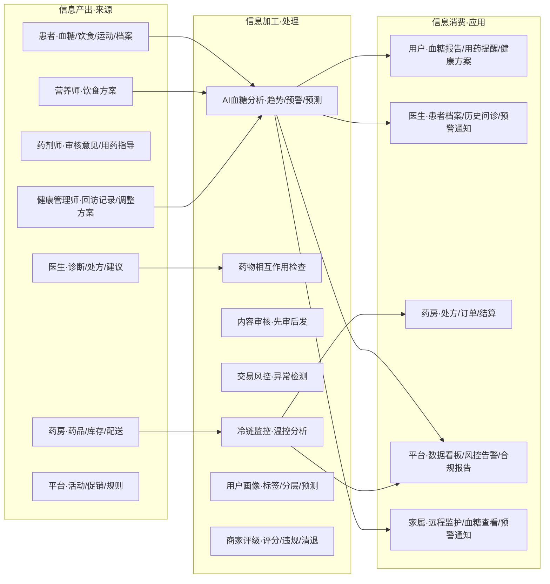
```mermaid
flowchart LR
    subgraph 信息产出["信息产出·来源"]
        S1["患者·血糖/饮食/运动/档案"]
        S2["医生·诊断/处方/建议"]
        S3["药剂师·审核意见/用药指导"]
        S4["营养师·饮食方案"]
        S5["健康管理师·回访记录/调整方案"]
        S6["药房·药品/库存/配送"]
        S7["平台·活动/促销/规则"]
    end
    
    subgraph 信息加工["信息加工·处理"]
        P1["AI血糖分析·趋势/预警/预测"]
        P2["药物相互作用检查"]
        P3["内容审核·先审后发"]
        P4["交易风控·异常检测"]
        P5["冷链监控·温控分析"]
        P6["用户画像·标签/分层/预测"]
        P7["商家评级·评分/违规/清退"]
    end
    
    subgraph 信息消费["信息消费·应用"]
        C1["用户·血糖报告/用药提醒/健康方案"]
        C2["医生·患者档案/历史问诊/预警通知"]
        C3["药房·处方/订单/结算"]
        C4["平台·数据看板/风控告警/合规报告"]
        C5["家属·远程监护/血糖查看/预警通知"]
    end
    
    S1 --> P1
    S2 --> P2
    S4 --> P1
    S5 --> P1
    P1 --> C1
    P1 --> C2
    P1 --> C4
    P1 --> C5
    S6 --> P5
    P5 --> C3
    P5 --> C4
```

### 6.2 跨系统信息流矩阵

> **v3.0.0一致性修复**：源/目标系统统一使用4个物理终端（MP/APP/LIVE/PC），不再将角色视图（医生端/药房端/药剂师端/入驻端）当作独立系统。角色视图标注在"备注"列。

| 信息流向 | 源系统 | 目标系统 | 信息内容 | 频率 | 触发方式 | 备注（角色视图） |
|----------|--------|----------|----------|------|----------|------------------|
| CGM血糖数据 | CGM设备 | APP | 血糖值+时间戳+设备ID | 1-15分钟 | 事件驱动 | — |
| 问诊请求 | APP（患者端） | APP（医生端视图） | 患者信息+主诉+历史记录 | 按需 | 用户手动 | 患者→医生 |
| 处方数据 | APP（医生端视图） | APP（患者端） | 诊断+药品+用法+CA签名 | 按需 | 医生手动 | 医生→患者 |
| 处方审核 | APP（医生端视图） | PC（药剂师工作台视图） | 处方详情+药物相互作用+冷链标记 | 按需 | 系统自动（医生CA签名后触发） | 医生→药剂师 |
| 处方流转 | PC（药剂师工作台） | PC（药房管理视图） | 处方+配送信息+冷链要求 | 实时 | 审核通过触发 | 药剂师→药房 |
| 温控数据 | 物流设备 | PC | 温度+位置+时间戳+设备ID | 1分钟 | 事件驱动 | — |
| 配送状态 | PC（药房管理视图） | APP（患者端） | 物流状态+位置+温度曲线 | 实时 | 状态变更触发 | 药房→患者 |
| 结算单 | PC（结算引擎） | PC（药房管理视图/医生管理视图/药剂师工作台视图） | 结算周期+金额+明细 | T+N | 定时任务 | 平台→各角色 |
| 预警通知 | APP | APP（医生端视图+家属端视图） | 血糖值+级别+用户状态 | 实时 | 阈值触发 | 患者→医生+家属 |
| 内容审核 | APP | PC（运营管理视图） | 待审内容+AI评分 | 实时 | 用户提交触发 | 用户→运营 |
| 入驻申请 | PC（入驻模块） | PC（运营管理视图） | 四证+基本信息 | 按需 | 商家提交触发 | 角色→平台管理员 |
| 直播推流 | LIVE | 腾讯云CSS | 音视频流+美颜参数 | 实时 | 主播开播触发 | — |
| 弹幕/IM | LIVE | 腾讯云IM | 消息+表情+礼物 | 实时 | 观众交互触发 | — |
| 直播录制 | 腾讯云CSS | 腾讯云VOD | 录制视频文件 | 直播结束 | 系统自动 | — |

---

## §7 业务状态机

### 7.1 SM-01：用户生命周期状态机

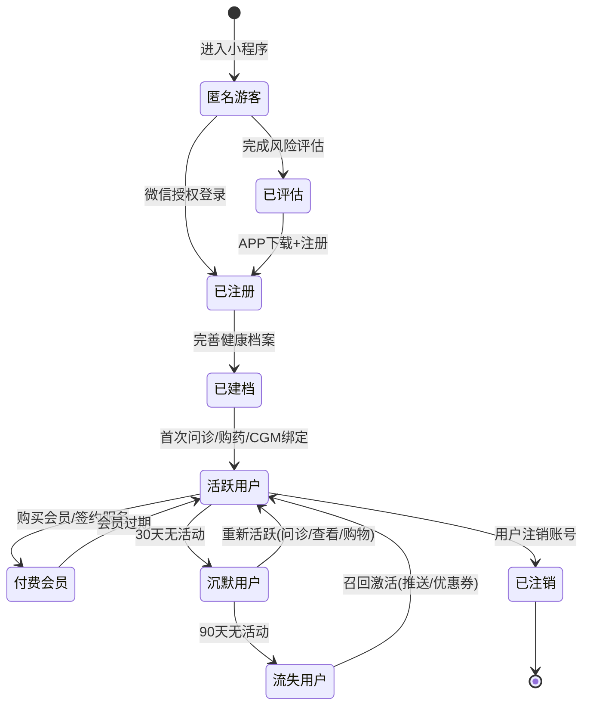
```mermaid
stateDiagram-v2
    [*] --> 匿名游客: 进入小程序
    匿名游客 --> 已评估: 完成风险评估
    匿名游客 --> 已注册: 微信授权登录
    已评估 --> 已注册: APP下载+注册
    已注册 --> 已建档: 完善健康档案
    已建档 --> 活跃用户: 首次问诊/购药/CGM绑定
    活跃用户 --> 付费会员: 购买会员/签约服务
    付费会员 --> 活跃用户: 会员过期
    活跃用户 --> 沉默用户: 30天无活动
    沉默用户 --> 活跃用户: 重新活跃(问诊/查看/购物)
    沉默用户 --> 流失用户: 90天无活动
    流失用户 --> 活跃用户: 召回激活(推送/优惠券)
    活跃用户 --> 已注销: 用户注销账号
    已注销 --> [*]
```

**状态过渡操作表（SM-01·v3.0.0补全）**：

| 当前状态 | 触发操作 | 目标状态 | 操作者 | 前置约束 | 后置动作 |
|----------|----------|----------|--------|----------|----------|
| 匿名游客 | 完成风险评估问卷 | 已评估 | 用户手动 | 进入小程序 | 生成风险评估报告+推送个性化健康建议 |
| 匿名游客 | 微信授权登录 | 已注册 | 用户手动 | 微信账号有效 | 创建用户账号+默认头像昵称+新人引导 |
| 已评估 | 下载APP并注册 | 已注册 | 用户手动 | APP下载完成 | 合并风险评估数据到注册账号 |
| 已注册 | 完善健康档案 | 已建档 | 用户手动 | 已登录 | 建档完成+解锁个性化服务推荐 |
| 已建档 | 完成首次问诊/购药/CGM绑定 | 活跃用户 | 系统自动 | 健康档案完整 | 标记活跃状态+推送首单优惠 |
| 活跃用户 | 购买会员或签约健康管理服务 | 付费会员 | 用户手动 | 支付成功 | 发放会员权益包+开通专属服务通道 |
| 付费会员 | 会员到期未续费 | 活跃用户 | 系统自动 | 会员有效期结束 | 降级通知+权益回收+推送续费优惠 |
| 活跃用户 | 连续30天无任何活动行为 | 沉默用户 | 系统自动 | 30天无登录/问诊/购药/查看 | 标记沉默+触发Day30唤醒推送 |
| 沉默用户 | 重新活跃（问诊/查看内容/购物） | 活跃用户 | 系统自动 | 触发任一活跃行为 | 清除沉默标记+恢复常规推送频率 |
| 沉默用户 | 连续90天无任何活动行为 | 流失用户 | 系统自动 | 从沉默开始累计90天 | 标记流失+停止日常推送+加入召回池 |
| 流失用户 | 点击召回推送/领取优惠券后活跃 | 活跃用户 | 系统自动 | 召回触达→7天内产生行为 | 清除流失标记+发放回归奖励 |
| 活跃用户 | 主动注销账号 | 已注销 | 用户手动 | 无未完结订单/无进行中服务 | 数据保留30天→匿名化+删除个人数据 |

### 7.2 SM-02：药店入驻状态机（v3.0.0重排·入驻与入网分离）

> **v3.0.0核心变更**：入驻流程与易宝入网彻底分离。入驻审核通过后直达签约（不再自动进入入网）。入网作为独立财务管理功能，在入驻通过后由药房管理员自主在财务中心发起（见§14.10·SM-18）。

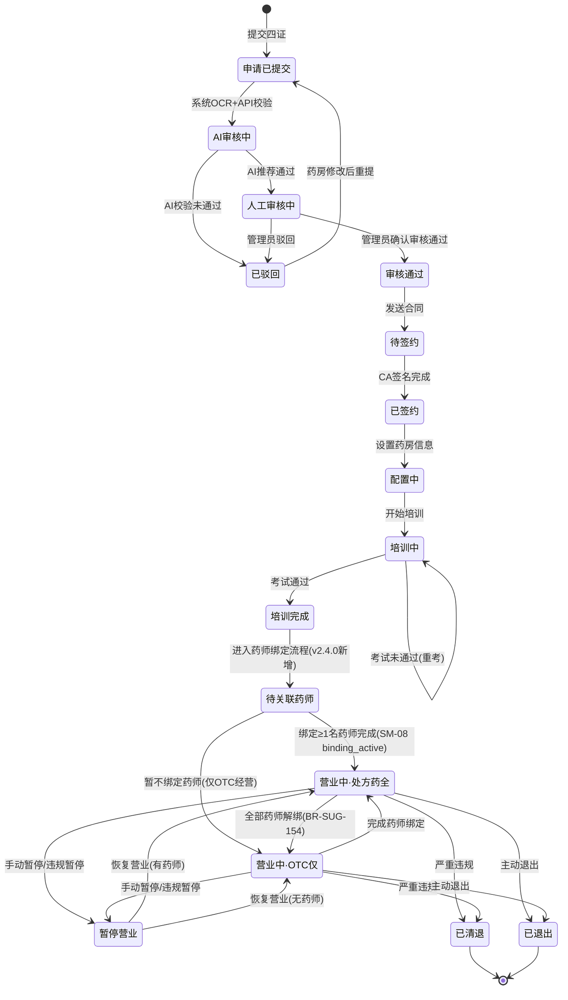
```mermaid
stateDiagram-v2
    [*] --> 申请已提交: 提交四证
    申请已提交 --> AI审核中: 系统OCR+API校验
    AI审核中 --> 人工审核中: AI推荐通过
    AI审核中 --> 已驳回: AI校验未通过
    人工审核中 --> 审核通过: 管理员确认审核通过
    人工审核中 --> 已驳回: 管理员驳回
    已驳回 --> 申请已提交: 药房修改后重提
    审核通过 --> 待签约: 发送合同
    待签约 --> 已签约: CA签名完成
    已签约 --> 配置中: 设置药房信息
    配置中 --> 培训中: 开始培训
    培训中 --> 培训完成: 考试通过
    培训中 --> 培训中: 考试未通过(重考)
    培训完成 --> 待关联药师: 进入药师绑定流程(v2.4.0新增)
    待关联药师 --> 营业中·处方药全: 绑定≥1名药师完成(SM-08 binding_active)
    待关联药师 --> 营业中·OTC仅: 暂不绑定药师(仅OTC经营)
    营业中·OTC仅 --> 营业中·处方药全: 完成药师绑定
    营业中·处方药全 --> 营业中·OTC仅: 全部药师解绑(BR-SUG-154)
    营业中·处方药全 --> 暂停营业: 手动暂停/违规暂停
    营业中·OTC仅 --> 暂停营业: 手动暂停/违规暂停
    暂停营业 --> 营业中·处方药全: 恢复营业(有药师)
    暂停营业 --> 营业中·OTC仅: 恢复营业(无药师)
    营业中·处方药全 --> 已清退: 严重违规
    营业中·OTC仅 --> 已清退: 严重违规
    营业中·处方药全 --> 已退出: 主动退出
    营业中·OTC仅 --> 已退出: 主动退出
    已清退 --> [*]
    已退出 --> [*]
```

**状态过渡操作表（SM-02·v3.0.0入驻与入网分离）**：

| 当前状态 | 触发操作 | 目标状态 | 操作者 | 前置约束 | 后置动作 |
|----------|----------|----------|--------|----------|----------|
| 人工审核中 | 管理员确认审核通过 | 审核通过 | 平台管理员手动 | AI机审通过+资质材料齐全 | 记录审核通过时间→进入待签约流程；入驻通过后药房可在财务中心自主发起【开通支付·易宝入网】（见§14.10·SM-18） |
| 培训完成 | 管理员点击「关联药师」 | 待关联药师 | 药房管理员 | 培训考核已通过 | 系统展示已入驻药师列表+推送绑定邀请 |
| 待关联药师 | 至少1名药师接受绑定(SM-08 binding_active) | 营业中·处方药全 | 系统自动 | 药师入驻状态=服务中+执业范围覆盖 | 激活处方药接单能力(SM-20 rx_enabled) |
| 待关联药师 | 管理员选择「暂不绑定，先经营OTC」 | 营业中·OTC仅 | 手动 | — | 仅开放OTC品类，处方药接单=禁用(SM-20 rx_disabled)；⚠️ OTC经营需接收用户付款→必须已完成易宝入网（SM-18），否则无法收款 |
| 营业中·OTC仅 | 完成药师绑定(SM-08 binding_active) | 营业中·处方药全 | 系统自动 | ≥1名药师绑定生效 | OTC存量商品不重新审核+通知用户该药店已支持处方药 |
| 营业中·处方药全 | 全部药师解绑(BR-SUG-154触发) | 营业中·OTC仅 | 系统自动 | 药师解绑生效+SM-20 rx_disabled | 冻结待审方队列48小时+通知药店管理员 |

> **v3.0.0架构分离说明**：入驻（SM-02）与支付入网（SM-18·§14.10）是两个独立流程。入驻审核通过后药房即可进入签约→培训→上线，无需等待入网完成。但实际经营（接收用户付款）必须已获得yeepay_merchant_id——药房在营业前需完成SM-18入网。药房可为自身及旗下药剂师分别申请商户号。入网申请自动引用入驻时已提交的资质证照，仅需补充银行账户等支付特有要素。```

### 7.3 SM-03：处方全生命周期状态机

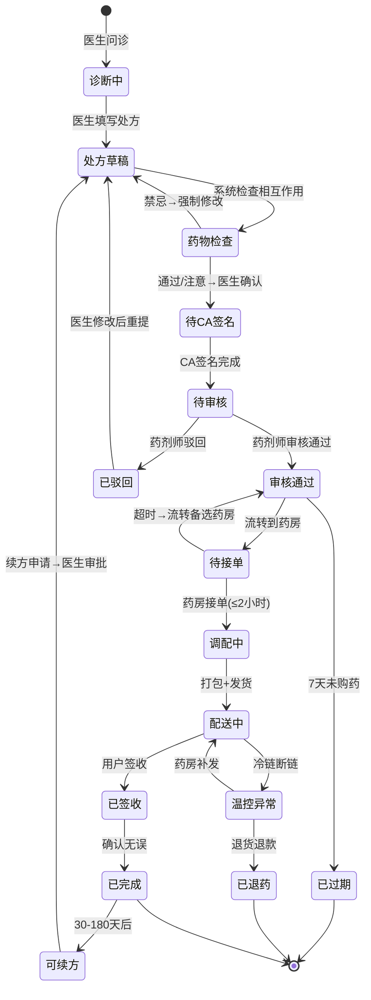
```mermaid
stateDiagram-v2
    [*] --> 诊断中: 医生问诊
    诊断中 --> 处方草稿: 医生填写处方
    处方草稿 --> 药物检查: 系统检查相互作用
    药物检查 --> 处方草稿: 禁忌→强制修改
    药物检查 --> 待CA签名: 通过/注意→医生确认
    待CA签名 --> 待审核: CA签名完成
    待审核 --> 审核通过: 药剂师审核通过
    待审核 --> 已驳回: 药剂师驳回
    已驳回 --> 处方草稿: 医生修改后重提
    审核通过 --> 待接单: 流转到药房
    待接单 --> 调配中: 药房接单(≤2小时)
    待接单 --> 审核通过: 超时→流转备选药房
    调配中 --> 配送中: 打包+发货
    配送中 --> 已签收: 用户签收
    配送中 --> 温控异常: 冷链断链
    温控异常 --> 配送中: 药房补发
    温控异常 --> 已退药: 退货退款
    已签收 --> 已完成: 确认无误
    已完成 --> 可续方: 30-180天后
    可续方 --> 处方草稿: 续方申请→医生审批
    审核通过 --> 已过期: 7天未购药
    已过期 --> [*]
    已退药 --> [*]
    已完成 --> [*]
```

**状态过渡操作表（SM-03·v3.0.0补全）**：

| 当前状态 | 触发操作 | 目标状态 | 操作者 | 前置约束 | 后置动作 |
|----------|----------|----------|--------|----------|----------|
| 诊断中 | 医生填写处方信息 | 处方草稿 | 医生手动 | 问诊完成 | 生成处方草稿记录 |
| 处方草稿 | 系统自动检查药物相互作用 | 药物检查 | 系统自动 | 处方信息完整 | 执行药物相互作用规则引擎→输出检查结果 |
| 药物检查 | 检测到禁忌→强制返回修改 | 处方草稿 | 系统自动 | 规则引擎命中禁忌规则 | 标注冲突药物+提示医生修改 |
| 药物检查 | 通过/注意→医生确认 | 待CA签名 | 医生手动 | 确认药物方案 | 触发CA电子签名流程 |
| 待CA签名 | CA签名完成 | 待审核 | 系统自动 | CA证书有效 | 锁定处方内容+通知药房待审核 |
| 待审核 | 药剂师审核通过 | 审核通过 | 药剂师手动 | 处方合规+库存满足 | 处方生效+生成拣药单 |
| 待审核 | 药剂师驳回 | 已驳回 | 药剂师手动 | — | 附带驳回原因→通知医生修改 |
| 已驳回 | 医生修改后重新提交 | 处方草稿 | 医生手动 | 90天内 | 保留原处方关联+增量编辑 |
| 审核通过 | 流转到药房待接单 | 待接单 | 系统自动 | 处方有效期内 | 推送接单通知给药房 |
| 待接单 | 药房接单（≤2小时） | 调配中 | 药剂师手动 | 药房药品库存充足 | 锁定库存+生成调配任务 |
| 待接单 | 超时无人接单→流转备选药房 | 审核通过 | 系统自动 | 主药房2h未响应 | 重新分配药房+通知用户 |
| 调配中 | 打包完成+发货 | 配送中 | 药房手动 | 药品复核无误 | 生成运单号+触发配送 |
| 配送中 | 用户签收 | 已签收 | 用户手动 | 药品包装完好 | 签收时间戳+开启评价入口 |
| 配送中 | 冷链温度异常 | 温控异常 | 系统自动 | 温度传感器超阈值报警 | 实时告警+暂停配送+通知药房 |
| 温控异常 | 药房补发（<2次） | 配送中 | 药房手动 | 补发次数≤2 | 生成补发运单+原订单关联 |
| 温控异常 | 退货退款（补发次数≥2） | 已退药 | 系统自动 | 累计2次以上温控异常 | 自动退款+药品报损 |
| 已签收 | 用户确认无误 | 已完成 | 用户手动/系统自动 | 签收后7天无异议 | 订单完成+医生服务费结算 |
| 已完成 | 处方到期前续方 | 可续方 | 系统自动 | 处方完成30-180天 | 推送续方提醒给用户 |
| 可续方 | 用户发起续方→医生审批 | 处方草稿 | 用户手动→医生审批 | 原处方医生在线 | 引用原处方+快速续方 |
| 审核通过 | 处方7天未购药 | 已过期 | 系统自动 | 处方审核通过后7天 | 处方失效+通知用户重新问诊 |

### 7.4 SM-04：直播状态机

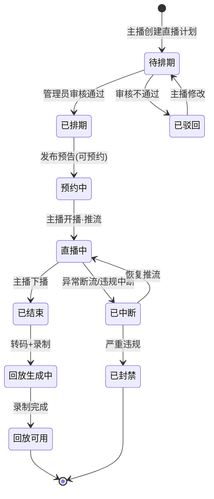
```mermaid
stateDiagram-v2
    [*] --> 待排期: 主播创建直播计划
    待排期 --> 已排期: 管理员审核通过
    待排期 --> 已驳回: 审核不通过
    已驳回 --> 待排期: 主播修改
    已排期 --> 预约中: 发布预告(可预约)
    预约中 --> 直播中: 主播开播·推流
    直播中 --> 已结束: 主播下播
    直播中 --> 已中断: 异常断流/违规中断
    已中断 --> 直播中: 恢复推流
    已中断 --> 已封禁: 严重违规
    已结束 --> 回放生成中: 转码+录制
    回放生成中 --> 回放可用: 录制完成
    回放可用 --> [*]
    已封禁 --> [*]
```

**状态过渡操作表（SM-04·v3.0.0补全）**：

| 当前状态 | 触发操作 | 目标状态 | 操作者 | 前置约束 | 后置动作 |
|----------|----------|----------|--------|----------|----------|
| 待排期 | 管理员审核通过 | 已排期 | 平台管理员手动 | 直播内容合规+主播资质有效 | 分配直播时段+通知主播 |
| 待排期 | 审核不通过 | 已驳回 | 平台管理员手动 | — | 附带驳回原因→主播可修改重提 |
| 已驳回 | 主播修改后重新提交 | 待排期 | 主播手动 | 修改完成 | 重新进入审核队列 |
| 已排期 | 发布直播预告 | 预约中 | 主播手动 | 排期时间未过期 | 生成预约卡片+推送粉丝通知 |
| 预约中 | 主播开播·推流开始 | 直播中 | 主播手动 | 到达排期时间 | 直播间创建+推送开播提醒 |
| 直播中 | 主播主动下播 | 已结束 | 主播手动 | — | 停止推流+生成直播数据统计 |
| 直播中 | 异常断流/平台检测违规 | 已中断 | 系统自动 | 推流中断≥30s/违规关键词命中 | 暂停直播+通知主播+用户端显示「主播暂时离开」 |
| 已中断 | 主播恢复推流 | 直播中 | 主播手动 | 60分钟内恢复 | 恢复直播画面+通知用户 |
| 已中断 | 严重违规（色情/政治/虚假宣传） | 已封禁 | 平台管理员手动/系统自动 | 违规证据确凿 | 永久封禁直播间+冻结收益+通知主播 |
| 已结束 | 转码+录制处理 | 回放生成中 | 系统自动 | 直播时长≥5分钟 | 触发视频转码+关键帧提取 |
| 回放生成中 | 录制完成 | 回放可用 | 系统自动 | 转码成功 | 生成回放链接+发布到直播列表 |

### 7.5 SM-05：订单状态机（含冷链）

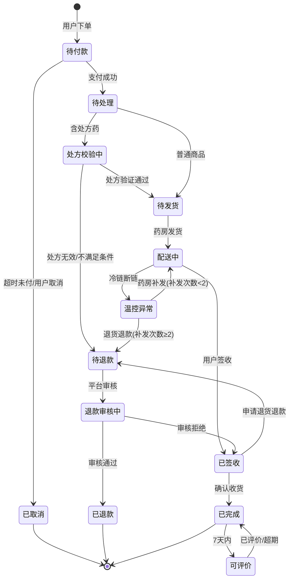
```mermaid
stateDiagram-v2
    [*] --> 待付款: 用户下单
    待付款 --> 已取消: 超时未付/用户取消
    待付款 --> 待处理: 支付成功
    待处理 --> 处方校验中: 含处方药
    处方校验中 --> 待发货: 处方验证通过
    处方校验中 --> 待退款: 处方无效/不满足条件
    待处理 --> 待发货: 普通商品
    待发货 --> 配送中: 药房发货
    配送中 --> 温控异常: 冷链断链
    温控异常 --> 待退款: 退货退款(补发次数≥2)
    温控异常 --> 配送中: 药房补发(补发次数<2)
    配送中 --> 已签收: 用户签收
    已签收 --> 已完成: 确认收货
    已签收 --> 待退款: 申请退货退款
    待退款 --> 退款审核中: 平台审核
    退款审核中 --> 已退款: 审核通过
    退款审核中 --> 已签收: 审核拒绝
    已完成 --> 可评价: 7天内
    可评价 --> 已完成: 已评价/超期
    已取消 --> [*]
    已退款 --> [*]
    已完成 --> [*]
```

**状态过渡操作表（SM-05 增强版·v2.4.1冷链循环异常处理）**：

| 当前状态 | 触发操作 | 目标状态 | 操作者 | 前置约束 | 后置动作 |
|----------|----------|----------|--------|----------|----------|
| 配送中 | 冷链温度超标>X分钟 | 温控异常 | 事件驱动 | 温度传感器上报超标 | 立即冻结物流+通知用户和药房+标记药品疑损 |
| 温控异常 | 药房补发（补发次数<2） | 配送中 | 药房手动 | 有可补发库存+冷链覆盖确认 | 重置物流追踪+通知用户+补发成本由药房承担 |
| 温控异常 | 退货退款（补发次数≥2） | 待退款 | 系统自动 | 同一订单累计补发次数达到上限（2次） | 全额退款+药品回收（销毁备案）+问题药房标记不良 |

> **v2.4.1新增·冷链循环异常**：同一订单的冷链补发上限=2次。若首次补发后再次断链，允许第二次补发；若第二次补发仍断链，系统强制退货退款。连续断链的药房将被标记「冷链异常频发」，平台管理员介入评估该药房冷链能力。补发产生的物流和药品成本由药房承担，不计入用户费用。温控异常的断链判定条件见§18 NFR。

**SM-05 状态→UI元素映射表（v2.4.1新增·FD-01修复）**：

| 订单状态 | 用户端（APP）可见UI元素 | 用户端可用操作 | 药房端（PC）可见UI元素 | 药房端可用操作 |
|----------|------------------------|---------------|----------------------|---------------|
| 待付款 | 「待付款」标签+倒计时+订单金额 | 去支付/取消订单 | — | — |
| 已取消 | 「已取消」标签+取消原因 | 重新下单/删除 | — | — |
| 待处理 | 「已支付，等待处理」+进度条 | 查看详情 | 新订单通知+订单卡片 | 查看详情 |
| 处方校验中 | 「处方校验中」+药剂师头像（匿名）+预计等待时间 | 查看详情 | 待审方列表+处方详情 | 审核/驳回（附原因） |
| 待发货 | 「已审核，待发货」+预计发货时间 | 查看详情/申请退款 | 待发货列表+拣货单 | 确认发货/标记缺货 |
| 配送中 | 「配送中」+物流追踪地图+预计送达 | 查看物流/确认收货/申请退款 | 配送中列表 | 查看物流 |
| 温控异常 | 🔴「温控异常」警告+断链原因+处理方案+补发进度 | 查看详情/联系客服 | 🔴断链告警+处理按钮 | 补发/退款+上传温控报告 |
| 已签收 | 「已签收」+签收时间 | 确认收货（自动）/申请退货 | 已签收列表 | 查看签收凭证 |
| 已完成 | 「已完成」+系统评价入口 | 评价/再次购买 | 已完成列表 | 查看评价 |
| 待退款 | 「退款处理中」+退款进度条+预计到账 | 查看进度/联系客服 | 待退款列表+退款审核 | 审核通过/拒绝+填写原因 |
| 退款审核中 | 「平台审核中」+预计审核时效 | 查看进度 | 退款审核中 | — |
| 已退款 | 「已退款」+退款金额+到账时间 | 再次购买 | 已退款列表 | 查看详情 |

> **v2.4.1说明**：SM-05共12个对外可见状态（不含内部状态），每个状态对应不同终端的UI元素和可用操作。前端开发应基于此映射表构建状态驱动的UI渲染逻辑，避免遗漏状态导致的交互不完整。```

### 7.6 SM-06：平台商家评级状态机

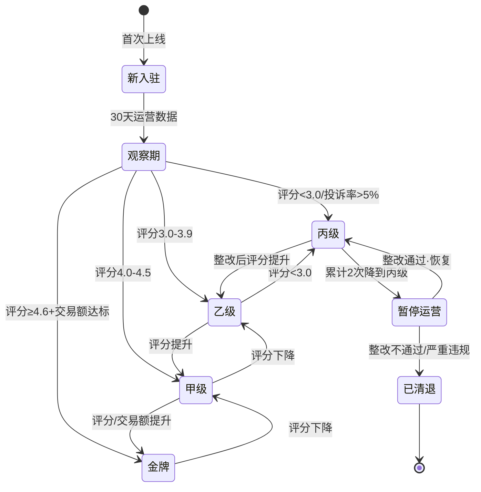
```mermaid
stateDiagram-v2
    [*] --> 新入驻: 首次上线
    新入驻 --> 观察期: 30天运营数据
    观察期 --> 丙级: 评分<3.0/投诉率>5%
    观察期 --> 乙级: 评分3.0-3.9
    观察期 --> 甲级: 评分4.0-4.5
    观察期 --> 金牌: 评分≥4.6+交易额达标
    金牌 --> 甲级: 评分下降
    甲级 --> 乙级: 评分下降
    甲级 --> 金牌: 评分/交易额提升
    乙级 --> 甲级: 评分提升
    乙级 --> 丙级: 评分<3.0
    丙级 --> 乙级: 整改后评分提升
    丙级 --> 暂停运营: 累计2次降到丙级
    暂停运营 --> 丙级: 整改通过·恢复
    暂停运营 --> 已清退: 整改不通过/严重违规
    已清退 --> [*]
```

**状态过渡操作表（SM-06·v3.0.0补全）**：

| 当前状态 | 触发操作 | 目标状态 | 操作者 | 前置约束 | 后置动作 |
|----------|----------|----------|--------|----------|----------|
| 新入驻 | 上线运营满30天 | 观察期 | 系统自动 | 30天有效运营数据 | 生成首月评级报告 |
| 观察期 | 综合评分<3.0或投诉率>5% | 丙级 | 系统自动 | 月度评级周期到达 | 降级通知+整改建议清单 |
| 观察期 | 综合评分3.0-3.9 | 乙级 | 系统自动 | 月度评级周期到达 | 发放乙级权益+提示提升方向 |
| 观察期 | 综合评分4.0-4.5 | 甲级 | 系统自动 | 月度评级周期到达 | 发放甲级权益+首页推荐加权 |
| 观察期 | 综合评分≥4.6且交易额达标 | 金牌 | 系统自动 | 评分+交易额双达标 | 发放金牌权益+专属运营对接+首页置顶 |
| 金牌 | 评分降至4.0-4.5 | 甲级 | 系统自动 | 月度评级周期到达 | 降级通知+回收金牌权益 |
| 甲级 | 评分降至3.0-3.9 | 乙级 | 系统自动 | 月度评级周期到达 | 降级通知+回收甲级权益 |
| 甲级 | 评分/交易额提升至金牌标准 | 金牌 | 系统自动 | 连续2个月达标 | 升级通知+发放金牌权益 |
| 乙级 | 评分提升至4.0以上 | 甲级 | 系统自动 | 月度评级周期到达 | 升级通知+发放甲级权益 |
| 乙级 | 评分降至3.0以下 | 丙级 | 系统自动 | 月度评级周期到达 | 降级通知+整改警告 |
| 丙级 | 整改后评分提升至3.0以上 | 乙级 | 系统自动 | 整改期内评分改善 | 解除限制+恢复常规权益 |
| 丙级 | 累计2次降为丙级 | 暂停运营 | 系统自动 | 历史丙级次数≥2 | 暂停所有经营权限+冻结商品+通知商家整改 |
| 暂停运营 | 整改通过·申请恢复 | 丙级 | 平台管理员手动 | 整改报告审核通过 | 恢复运营权限+丙级重新考核 |
| 暂停运营 | 整改不通过/严重违规 | 已清退 | 平台管理员手动 | 整改期届满未达标 | 永久关闭店铺+清算未结订单 |

### 7.7 SM-07：医生入驻状态机（v2.2.0新增·v3.0.0入驻与入网分离）

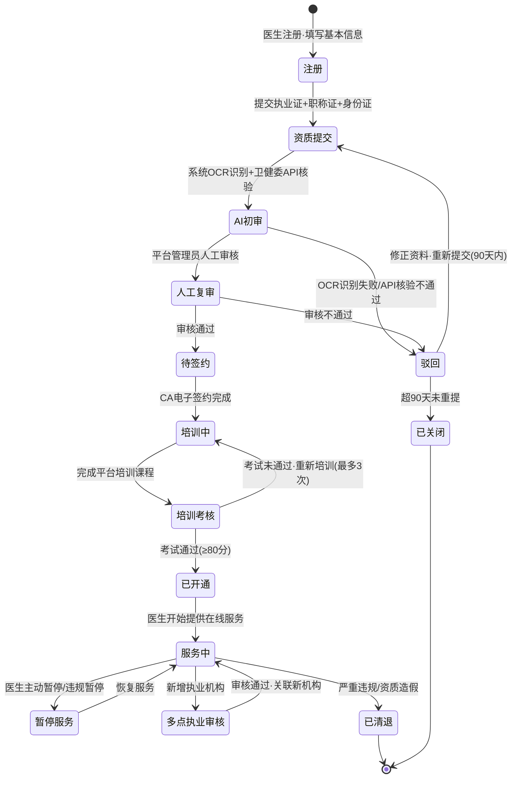
```mermaid
stateDiagram-v2
    [*] --> 注册: 医生注册·填写基本信息
    注册 --> 资质提交: 提交执业证+职称证+身份证
    资质提交 --> AI初审: 系统OCR识别+卫健委API核验
    AI初审 --> 人工复审: 平台管理员人工审核
    AI初审 --> 驳回: OCR识别失败/API核验不通过
    驳回 --> 资质提交: 修正资料·重新提交(90天内)
    驳回 --> 已关闭: 超90天未重提
    人工复审 --> 待签约: 审核通过
    人工复审 --> 驳回: 审核不通过
    待签约 --> 培训中: CA电子签约完成
    培训中 --> 培训考核: 完成平台培训课程
    培训考核 --> 已开通: 考试通过(≥80分)
    培训考核 --> 培训中: 考试未通过·重新培训(最多3次)
    已开通 --> 服务中: 医生开始提供在线服务
    服务中 --> 暂停服务: 医生主动暂停/违规暂停
    暂停服务 --> 服务中: 恢复服务
    服务中 --> 多点执业审核: 新增执业机构
    多点执业审核 --> 服务中: 审核通过·关联新机构
    服务中 --> 已清退: 严重违规/资质造假
    已清退 --> [*]
    已关闭 --> [*]
```

**状态过渡操作表（SM-07·v3.0.0补全）**：

| 当前状态 | 触发操作 | 目标状态 | 操作者 | 前置约束 | 后置动作 |
|----------|----------|----------|--------|----------|----------|
| 注册 | 提交执业证+职称证+身份证 | 资质提交 | 医生手动 | 基本信息填写完整 | 创建资质审核工单 |
| 资质提交 | 系统OCR识别+卫健委API核验 | AI初审 | 系统自动 | 证件图片清晰可识别 | OCR提取→API核验→生成核验报告 |
| AI初审 | 核验通过→平台管理员人工审核 | 人工复审 | 系统自动 | AI核验通过 | 进入人工复审队列 |
| AI初审 | OCR识别失败/API核验不通过 | 驳回 | 系统自动 | — | 注明失败原因→通知医生修正 |
| 驳回 | 修正资料→重新提交（90天内） | 资质提交 | 医生手动 | 90天期限未超 | 保留历史审核记录 |
| 驳回 | 超90天未重提 | 已关闭 | 系统自动 | 90天期限届满 | 关闭入驻申请+清理暂存资料 |
| 人工复审 | 审核通过 | 待签约 | 平台管理员手动 | 资质齐全+真实有效 | 生成CA电子签约链接→通知医生 |
| 人工复审 | 审核不通过 | 驳回 | 平台管理员手动 | — | 注明驳回原因→通知医生 |
| 待签约 | CA电子签约完成 | 培训中 | 系统自动 | CA签名验证通过 | 生成培训任务+解锁培训课程 |
| 培训中 | 完成平台培训课程 | 培训考核 | 医生手动 | 课程学习完毕 | 生成考核试卷 |
| 培训考核 | 考试通过（≥80分） | 已开通 | 系统自动 | 考核分数≥80 | 开通医生账号+通知医生上线 |
| 培训考核 | 考试未通过→重新培训（最多3次） | 培训中 | 系统自动 | 考核分数<80+重考次数<3 | 提示薄弱知识点+安排补考 |
| 已开通 | 医生开始提供在线服务 | 服务中 | 医生手动 | 完成问诊配置+服务价格设置 | 可在平台接诊+搜索可见 |
| 服务中 | 医生主动暂停/平台违规暂停 | 暂停服务 | 医生手动/平台管理员手动 | — | 暂停接诊+下架服务列表 |
| 暂停服务 | 恢复服务 | 服务中 | 医生手动 | 资质未过期+无未处理投诉 | 恢复接诊+上架服务列表 |
| 服务中 | 新增执业机构申请 | 多点执业审核 | 医生手动 | 提交新机构执业证明 | 创建多点执业审核工单 |
| 多点执业审核 | 审核通过→关联新机构 | 服务中 | 平台管理员手动 | 新机构资质有效 | 扩展执业范围+更新医生主页 |
| 服务中 | 严重违规/资质造假 | 已清退 | 平台管理员手动 | 2人复核确认 | 永久关闭账号+冻结未结算收入+列入黑名单 |

### 7.8 SM-08：药剂师入驻状态机（v2.2.0新增·v2.4.1增强·v3.0.0入驻与入网分离）

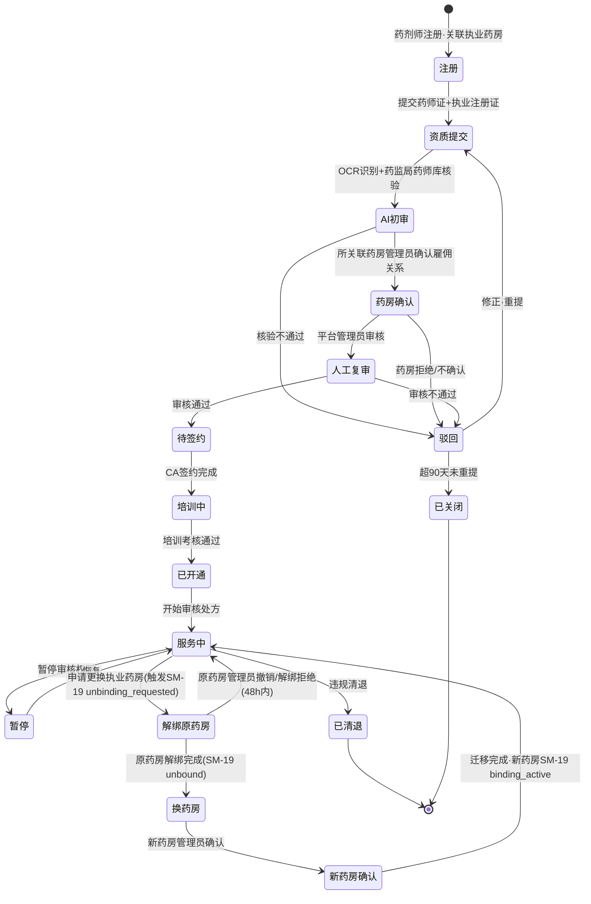
```mermaid
stateDiagram-v2
    [*] --> 注册: 药剂师注册·关联执业药房
    注册 --> 资质提交: 提交药师证+执业注册证
    资质提交 --> AI初审: OCR识别+药监局药师库核验
    AI初审 --> 药房确认: 所关联药房管理员确认雇佣关系
    AI初审 --> 驳回: 核验不通过
    驳回 --> 资质提交: 修正·重提
    驳回 --> 已关闭: 超90天未重提
    药房确认 --> 人工复审: 平台管理员审核
    药房确认 --> 驳回: 药房拒绝/不确认
    人工复审 --> 待签约: 审核通过
    人工复审 --> 驳回: 审核不通过
    待签约 --> 培训中: CA签约完成
    培训中 --> 已开通: 培训考核通过
    已开通 --> 服务中: 开始审核处方
    服务中 --> 暂停: 暂停审核权限
    暂停 --> 服务中: 恢复
    服务中 --> 解绑原药房: 申请更换执业药房(触发SM-19 unbinding_requested)
    解绑原药房 --> 换药房: 原药房解绑完成(SM-19 unbound)
    解绑原药房 --> 服务中: 原药房管理员撤销/解绑拒绝(48h内)
    换药房 --> 新药房确认: 新药房管理员确认
    新药房确认 --> 服务中: 迁移完成·新药房SM-19 binding_active
    服务中 --> 已清退: 违规清退
    已清退 --> [*]
    已关闭 --> [*]
```

**状态过渡操作表（SM-08 增强版·v2.4.1）**：

| 当前状态 | 触发操作 | 目标状态 | 操作者 | 前置约束 | 后置动作 |
|----------|----------|----------|--------|----------|----------|
| 服务中 | 药剂师发起「更换执业药房」 | 解绑原药房 | 药剂师手动 | 已绑定至少1家药店 | 触发SM-19 unbinding_requested→等待原药房解绑 |
| 解绑原药房 | 原药房SM-19 unbound完成 | 换药房 | 系统自动 | SM-19 unbound+原药房处方药能力按BR-SUG-154处理 | 药师审方权限=暂停+可接收新药店邀请 |
| 解绑原药房 | 解绑方撤销(48h内) | 服务中 | 手动/系统 | SM-19撤销→binding_active | 恢复审方权限 |
| 换药房 | 新药房管理员确认绑定(SM-19 accepted→binding_active) | 新药房确认 | 新药房管理员手动 | 新药房状态=营业中·处方药全 | 药师执业范围匹配校验(BR-SUG-155) |
| 新药房确认 | 迁移完成 | 服务中 | 系统自动 | SM-19 binding_active | 药师审方权限恢复+处方队列从旧药店切换到新药店 |

> **v2.4.1新增**：修复了药剂师换药房时SM-08直接跳转到「换药房」而未经过SM-19解绑流程的状态衔接缺口。现在药剂师换药房必须：先经过SM-19的解绑请求（unbinding_requested→unbound），解除原药房绑定关系后，方可接受新药房绑定邀请。若药店仅此一名药师，则换药房过程中会同步触发BR-SUG-154（唯一药师离职紧急保护）。```

### 7.9 SM-09：营养师入驻状态机（v2.2.0新增·v3.0.0入驻与入网分离）

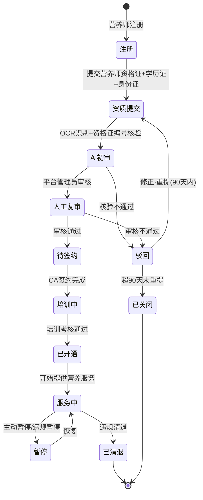
```mermaid
stateDiagram-v2
    [*] --> 注册: 营养师注册
    注册 --> 资质提交: 提交营养师资格证+学历证+身份证
    资质提交 --> AI初审: OCR识别+资格证编号核验
    AI初审 --> 人工复审: 平台管理员审核
    AI初审 --> 驳回: 核验不通过
    驳回 --> 资质提交: 修正·重提(90天内)
    驳回 --> 已关闭: 超90天未重提
    人工复审 --> 待签约: 审核通过
    人工复审 --> 驳回: 审核不通过
    待签约 --> 培训中: CA签约完成
    培训中 --> 已开通: 培训考核通过
    已开通 --> 服务中: 开始提供营养服务
    服务中 --> 暂停: 主动暂停/违规暂停
    暂停 --> 服务中: 恢复
    服务中 --> 已清退: 违规清退
    已清退 --> [*]
    已关闭 --> [*]
```

**状态过渡操作表**：

| 当前状态 | 触发操作 | 目标状态 | 操作者 | 前置约束 | 后置动作 |
|----------|----------|----------|--------|----------|----------|
| 注册 | 提交入驻申请 | 资质提交 | 营养师 | 无 | 创建入驻工单 |
| 资质提交 | AI初审+人工复审通过 | 审核通过 | 审核员 | 资质齐全 | 生成签约链接 |
| 资质提交 | 审核驳回 | 审核驳回 | 审核员 | — | 通知修改 |
| 审核通过 | 签约完成 | 待签约 | 营养师 | CA签名验证 | 生成培训任务 |
| 待签约 | 培训完成 | 培训中 | 营养师 | 签约已完成 | 解锁配置权限 |
| 培训中 | 培训考核通过 | 已开通 | 营养师 | 考核≥80分 | 状态=已开通 |
| 已开通 | 完成服务配置→开始提供服务 | 服务中 | 营养师 | 已设置服务价格+擅长领域+服务时间（BR-SUG-135校验） | 激活接单权限 |
| 服务中 | 暂停服务 | 暂停 | 营养师/平台 | — | 下架服务 |
| 暂停 | 恢复服务 | 服务中 | 营养师 | 资质未过期 | 恢复接单 |
| 任何状态 | 违规清退 | 已清退 | 平台管理员 | 2人复核 | 关闭账户 |

### 7.10 SM-10：健康管理师（HM）入驻状态机（v2.2.0新增·v3.0.0入驻与入网分离）

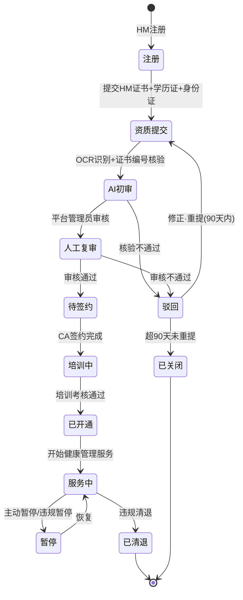
```mermaid
stateDiagram-v2
    [*] --> 注册: HM注册
    注册 --> 资质提交: 提交HM证书+学历证+身份证
    资质提交 --> AI初审: OCR识别+证书编号核验
    AI初审 --> 人工复审: 平台管理员审核
    AI初审 --> 驳回: 核验不通过
    驳回 --> 资质提交: 修正·重提(90天内)
    驳回 --> 已关闭: 超90天未重提
    人工复审 --> 待签约: 审核通过
    人工复审 --> 驳回: 审核不通过
    待签约 --> 培训中: CA签约完成
    培训中 --> 已开通: 培训考核通过
    已开通 --> 服务中: 开始健康管理服务
    服务中 --> 暂停: 主动暂停/违规暂停
    暂停 --> 服务中: 恢复
    服务中 --> 已清退: 违规清退
    已清退 --> [*]
    已关闭 --> [*]
```

**状态过渡操作表**：

| 当前状态 | 触发操作 | 目标状态 | 操作者 | 前置约束 | 后置动作 |
|----------|----------|----------|--------|----------|----------|
| 注册 | 提交入驻申请 | 资质提交 | 健康管理师 | 无 | 创建入驻工单 |
| 资质提交 | AI初审+人工复审通过 | 审核通过 | 审核员 | 资质齐全 | 生成签约链接 |
| 资质提交 | 审核驳回 | 审核驳回 | 审核员 | — | 通知修改 |
| 审核通过 | 签约完成+培训完成 | 已开通 | 健康管理师 | CA签名+培训考核≥80分 | 状态=已开通 |
| 已开通 | 完成服务配置→开始提供服务 | 服务中 | 健康管理师 | 已绑定管理用户+配置预警规则+设置回访计划（BR-SUG-136校验） | 激活服务权限 |
| 服务中 | 暂停服务 | 暂停 | 健康管理师/平台 | — | 冻结管理关系 |
| 暂停 | 恢复服务 | 服务中 | 健康管理师 | 资质未过期 | 恢复管理关系 |
| 任何状态 | 违规清退 | 已清退 | 平台管理员 | 2人复核 | 关闭账户+转移管理用户 |

### 7.11 SM-11：内容发布状态机（v2.2.0新增）

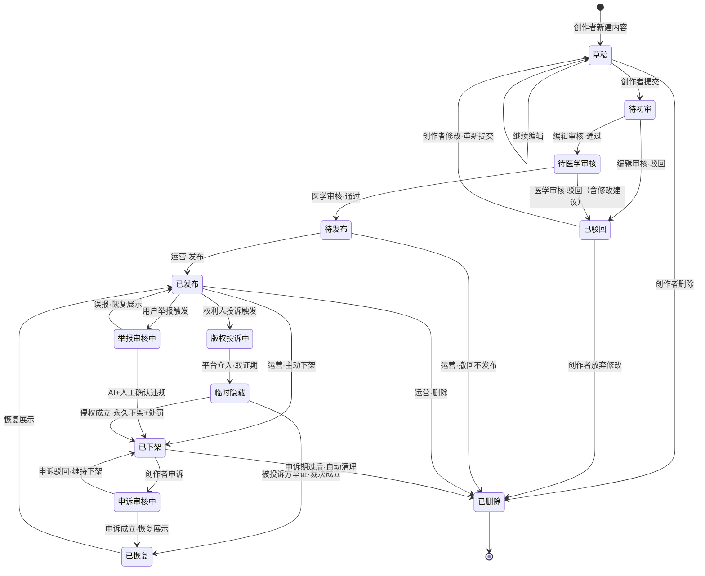
```mermaid
stateDiagram-v2
    [*] --> 草稿: 创作者新建内容
    草稿 --> 待初审: 创作者提交
    草稿 --> 草稿: 继续编辑
    草稿 --> 已删除: 创作者删除
    待初审 --> 待医学审核: 编辑审核·通过
    待初审 --> 已驳回: 编辑审核·驳回
    已驳回 --> 草稿: 创作者修改·重新提交
    已驳回 --> 已删除: 创作者放弃修改
    待医学审核 --> 待发布: 医学审核·通过
    待医学审核 --> 已驳回: 医学审核·驳回（含修改建议）
    待发布 --> 已发布: 运营·发布
    待发布 --> 已删除: 运营·撤回不发布
    已发布 --> 已下架: 运营·主动下架
    已发布 --> 举报审核中: 用户举报触发
    已发布 --> 版权投诉中: 权利人投诉触发
    已发布 --> 已删除: 运营·删除
    举报审核中 --> 已下架: AI+人工确认违规
    举报审核中 --> 已发布: 误报·恢复展示
    版权投诉中 --> 临时隐藏: 平台介入·取证期
    临时隐藏 --> 已恢复: 被投诉方举证·裁决成立
    临时隐藏 --> 已下架: 侵权成立·永久下架+处罚
    已下架 --> 申诉审核中: 创作者申诉
    已下架 --> 已删除: 申诉期过后·自动清理
    申诉审核中 --> 已恢复: 申诉成立·恢复展示
    申诉审核中 --> 已下架: 申诉驳回·维持下架
    已删除 --> [*]
    已恢复 --> 已发布: 恢复展示
```

**状态过渡操作表（SM-11·v3.0.0补全）**：

| 当前状态 | 触发操作 | 目标状态 | 操作者 | 前置约束 | 后置动作 |
|----------|----------|----------|--------|----------|----------|
| 草稿 | 创作者提交审核 | 待初审 | 创作者手动 | 内容填写完整 | 进入编辑审核队列 |
| 草稿 | 创作者主动删除 | 已删除 | 创作者手动 | — | 软删除·30天后物理清理 |
| 待初审 | 编辑审核通过 | 待医学审核 | 编辑手动 | 排版/格式/合规初审通过 | 进入医学审核队列 |
| 待初审 | 编辑审核驳回 | 已驳回 | 编辑手动 | — | 附带修改意见→退回创作者 |
| 已驳回 | 创作者修改后重新提交 | 草稿 | 创作者手动 | — | 保留修改历史 |
| 已驳回 | 创作者放弃修改 | 已删除 | 创作者手动 | — | 清理驳回记录 |
| 待医学审核 | 医学审核通过 | 待发布 | 医学审核员手动 | 医学内容准确+无误导 | 标记医学审核通过 |
| 待医学审核 | 医学审核驳回（含修改建议） | 已驳回 | 医学审核员手动 | — | 附带医学修改建议 |
| 待发布 | 运营点击发布 | 已发布 | 运营手动 | 发布时段无限制 | 内容上线+推送给目标用户 |
| 待发布 | 运营撤回不发布 | 已删除 | 运营手动 | — | 清理内容 |
| 已发布 | 运营主动下架 | 已下架 | 运营手动 | — | 内容不可见+保留数据 |
| 已发布 | 用户举报触发 | 举报审核中 | 系统自动 | 举报次数≥阈值 | 临时限制展示+通知创作者 |
| 已发布 | 权利人投诉触发 | 版权投诉中 | 系统自动 | 投诉材料齐全 | 临时限制展示+通知创作者举证 |
| 已发布 | 运营删除 | 已删除 | 运营手动 | — | 软删除 |
| 举报审核中 | AI+人工确认违规 | 已下架 | 系统自动→管理员确认 | 违规证据充分 | 下架+按违规等级处罚 |
| 举报审核中 | 误报→恢复展示 | 已发布 | 管理员手动 | 核查为误报 | 恢复展示+不记录违规 |
| 版权投诉中 | 平台介入·取证期 | 临时隐藏 | 系统自动 | 投诉受理 | 隐藏内容+收集双方证据 |
| 临时隐藏 | 被投诉方举证·裁决成立 | 已恢复 | 管理员手动 | 投诉方证据不足 | 恢复展示+投诉记录存档 |
| 临时隐藏 | 侵权成立→永久下架+处罚 | 已下架 | 管理员手动 | 侵权证据确凿 | 下架+信用扣分+罚款 |
| 已下架 | 创作者发起申诉 | 申诉审核中 | 创作者手动 | 申诉期内 | 提交申诉材料+进入申诉队列 |
| 已下架 | 申诉期过后自动清理 | 已删除 | 系统自动 | 超出申诉期限 | 永久删除 |
| 申诉审核中 | 申诉成立→恢复展示 | 已恢复 | 管理员手动 | 申诉理由充分 | 恢复内容+撤销处罚 |
| 申诉审核中 | 申诉驳回→维持下架 | 已下架 | 管理员手动 | 申诉不成立 | 维持下架+通知创作者 |
| 已恢复 | 恢复公开展示 | 已发布 | 系统自动 | 申诉成立 | 内容重新可见 |

### 7.12 SM-12：商品上架状态机（v2.2.0新增）

<!-- SM-12 商品上架状态机，编号唯一，无重复 -->

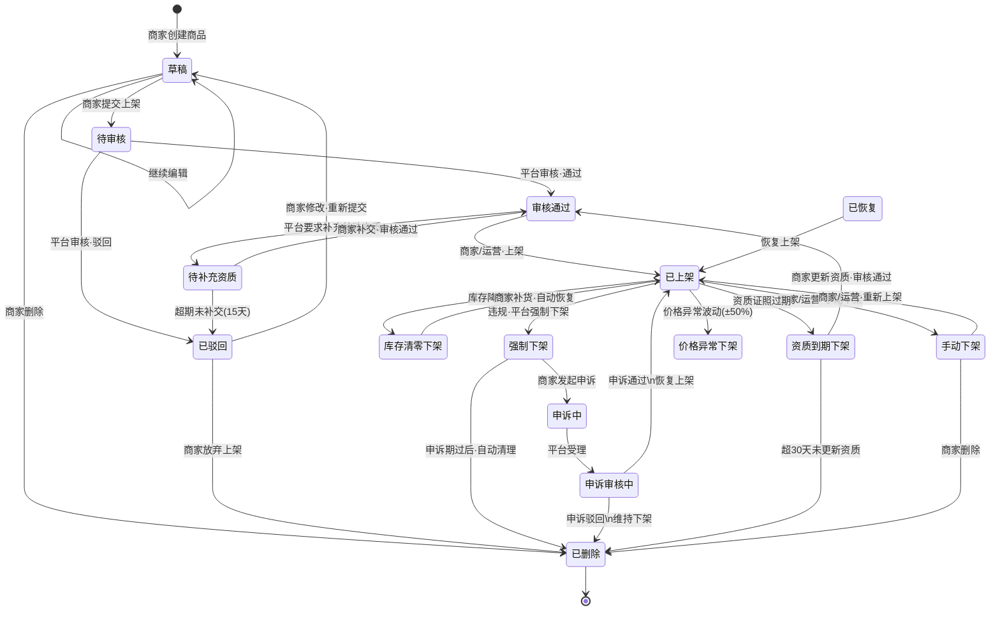
```mermaid
stateDiagram-v2
    [*] --> 草稿: 商家创建商品
    草稿 --> 待审核: 商家提交上架
    草稿 --> 草稿: 继续编辑
    草稿 --> 已删除: 商家删除
    待审核 --> 审核通过: 平台审核·通过
    待审核 --> 已驳回: 平台审核·驳回
    已驳回 --> 草稿: 商家修改·重新提交
    已驳回 --> 已删除: 商家放弃上架
    审核通过 --> 已上架: 商家/运营·上架
    审核通过 --> 待补充资质: 平台要求补充特殊资质
    待补充资质 --> 审核通过: 商家补交·审核通过
    待补充资质 --> 已驳回: 超期未补交(15天)
    已上架 --> 手动下架: 商家/运营·手动下架
    已上架 --> 库存清零下架: 库存降至0
    已上架 --> 强制下架: 违规·平台强制下架
    已上架 --> 资质到期下架: 资质证照过期
    已上架 --> 价格异常下架: 价格异常波动(±50%)
    库存清零下架 --> 已上架: 商家补货·自动恢复
    强制下架 --> 已删除: 申诉期过后·自动清理
    强制下架 --> 申诉中: 商家发起申诉
    申诉中 --> 申诉审核中: 平台受理
    申诉审核中 --> 已上架: 申诉通过\n恢复上架
    申诉审核中 --> 已删除: 申诉驳回\n维持下架
    资质到期下架 --> 审核通过: 商家更新资质·审核通过
    资质到期下架 --> 已删除: 超30天未更新资质
    手动下架 --> 已上架: 商家/运营·重新上架
    手动下架 --> 已删除: 商家删除
    已删除 --> [*]
    已恢复 --> 已上架: 恢复上架

    state 申诉中
    state 申诉审核中
```

**状态过渡操作表（SM-12·v3.0.0补全）**：

| 当前状态 | 触发操作 | 目标状态 | 操作者 | 前置约束 | 后置动作 |
|----------|----------|----------|--------|----------|----------|
| 草稿 | 商家提交上架审核 | 待审核 | 商家手动 | 商品信息完整 | 进入平台审核队列 |
| 草稿 | 商家删除草稿 | 已删除 | 商家手动 | — | 清理草稿数据 |
| 待审核 | 平台审核通过 | 审核通过 | 平台管理员手动 | 商品合规+资质齐全 | 通知商家审核通过 |
| 待审核 | 平台审核驳回 | 已驳回 | 平台管理员手动 | — | 附带驳回原因 |
| 已驳回 | 商家修改后重新提交 | 草稿 | 商家手动 | — | 重新进入编辑 |
| 已驳回 | 商家放弃上架 | 已删除 | 商家手动 | — | 删除商品记录 |
| 审核通过 | 商家/运营点击上架 | 已上架 | 商家/运营手动 | 审核通过状态 | 商品在商城中可见+可搜索 |
| 审核通过 | 平台要求补充特殊资质 | 待补充资质 | 平台管理员手动 | 商品涉及特殊品类 | 通知商家补充资质 |
| 待补充资质 | 商家补交→审核通过 | 审核通过 | 平台管理员手动 | 资质审核通过 | 恢复上架流程 |
| 待补充资质 | 超15天未补交 | 已驳回 | 系统自动 | 15天期限届满 | 驳回+通知商家 |
| 已上架 | 商家/运营手动下架 | 手动下架 | 商家/运营手动 | — | 商品不可见+库存保留 |
| 已上架 | 库存降至0 | 库存清零下架 | 系统自动 | 实时库存=0 | 自动下架+通知商家补货 |
| 已上架 | 违规→平台强制下架 | 强制下架 | 平台管理员手动 | 违规证据确凿 | 强制下架+通知商家 |
| 已上架 | 资质证照过期 | 资质到期下架 | 系统自动 | 资质有效期<当前日期 | 自动下架+通知商家更新资质 |
| 已上架 | 价格异常波动（±50%） | 价格异常下架 | 系统自动 | 价格变更幅度超阈值 | 自动下架+通知商家确认 |
| 库存清零下架 | 商家补货→自动恢复 | 已上架 | 系统自动 | 补货后库存>0 | 自动恢复上架 |
| 强制下架 | 商家发起申诉 | 申诉中 | 商家手动 | 申诉期内 | 提交申诉材料 |
| 强制下架 | 申诉期过后自动清理 | 已删除 | 系统自动 | 超出申诉期限 | 永久删除 |
| 申诉中 | 平台受理申诉 | 申诉审核中 | 平台管理员手动 | 申诉材料完整 | 进入申诉审核 |
| 申诉审核中 | 申诉通过→恢复上架 | 已上架 | 平台管理员手动 | 申诉成立 | 商品恢复可见+撤销处罚记录 |
| 申诉审核中 | 申诉驳回→维持下架 | 已删除 | 平台管理员手动 | 申诉不成立 | 删除商品+通知商家 |
| 资质到期下架 | 商家更新资质→审核通过 | 审核通过 | 平台管理员手动 | 新资质有效 | 恢复上架流程 |
| 资质到期下架 | 超30天未更新资质 | 已删除 | 系统自动 | 30天期限届满 | 永久删除商品 |
| 手动下架 | 商家/运营重新上架 | 已上架 | 商家/运营手动 | 商品信息有效 | 商品恢复可见 |
| 手动下架 | 商家删除 | 已删除 | 商家手动 | — | 永久删除 |

### 7.13 SM-13：售后状态机（v2.2.0新增）

<!-- SM-13 售后状态机，编号唯一，无重复 -->

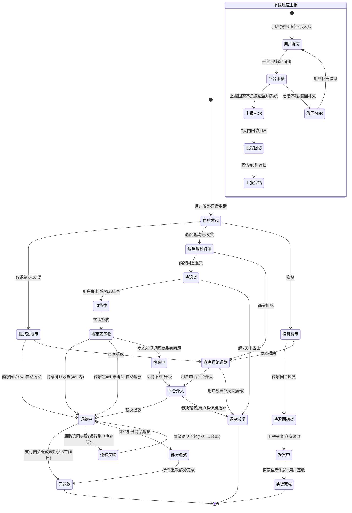
```mermaid
stateDiagram-v2
    [*] --> 售后发起: 用户发起售后申请
    售后发起 --> 仅退款待审: 仅退款·未发货
    售后发起 --> 退货退款待审: 退货退款·已发货
    售后发起 --> 换货待审: 换货
    仅退款待审 --> 退款中: 商家同意/24h自动同意
    仅退款待审 --> 商家拒绝退款: 商家拒绝
    退货退款待审 --> 待退货: 商家同意退货
    退货退款待审 --> 商家拒绝退款: 商家拒绝
    待退货 --> 退货中: 用户寄出·填物流单号
    待退货 --> 退款关闭: 超7天未寄出
    退货中 --> 待商家签收: 物流签收
    待商家签收 --> 退款中: 商家确认收货(48h内)
    待商家签收 --> 退款中: 商家超48h未确认·自动退款
    待商家签收 --> 协商中: 商家发现退回商品有问题
    换货待审 --> 待退回换货: 商家同意换货
    换货待审 --> 商家拒绝退款: 商家拒绝
    待退回换货 --> 换货中: 用户寄出·商家签收
    换货中 --> 换货完成: 商家重新发货+用户签收
    商家拒绝退款 --> 平台介入: 用户申请平台介入
    商家拒绝退款 --> 退款关闭: 用户放弃(7天未操作)
    协商中 --> 平台介入: 协商不成·升级
    平台介入 --> 退款中: 裁决退款
    平台介入 --> 退款关闭: 裁决驳回/用户胜诉后放弃
    退款中 --> 已退款: 支付网关退款成功(3-5工作日)
    退款中 --> 退款失败: 原路退回失败(银行账户注销等)
    退款失败 --> 退款中: 降级退款路径(银行→余额)
    退款中 --> 部分退款: 订单部分商品退货
    部分退款 --> 已退款: 所有退款部分完成
    已退款 --> [*]
    退款关闭 --> [*]
    换货完成 --> [*]

    state 不良反应上报 {
        [*] --> 用户提交: 用户报告用药不良反应
        用户提交 --> 平台审核: 平台审核(24h内)
        平台审核 --> 上报ADR: 上报国家不良反应监测系统
        平台审核 --> 驳回ADR: 信息不足·驳回补充
        驳回ADR --> 用户提交: 用户补充信息
        上报ADR --> 跟踪回访: 7天内回访用户
        跟踪回访 --> 上报完结: 回访完成·存档
    }
```

**状态过渡操作表（SM-13·v3.0.0补全）**：

| 当前状态 | 触发操作 | 目标状态 | 操作者 | 前置约束 | 后置动作 |
|----------|----------|----------|--------|----------|----------|
| 售后发起 | 用户申请仅退款（未发货） | 仅退款待审 | 用户手动 | 订单未发货 | 创建仅退款售后单 |
| 售后发起 | 用户申请退货退款（已发货） | 退货退款待审 | 用户手动 | 订单已发货 | 创建退货退款售后单 |
| 售后发起 | 用户申请换货 | 换货待审 | 用户手动 | 订单已发货+商品支持换货 | 创建换货售后单 |
| 仅退款待审 | 商家同意/24h自动同意 | 退款中 | 商家手动/系统自动 | 商家确认或超时 | 触发退款流程 |
| 仅退款待审 | 商家拒绝退款 | 商家拒绝退款 | 商家手动 | — | 附带拒绝原因→通知用户 |
| 退货退款待审 | 商家同意退货 | 待退货 | 商家手动 | — | 提供退货地址+退货说明 |
| 退货退款待审 | 商家拒绝退款 | 商家拒绝退款 | 商家手动 | — | 附带拒绝原因→通知用户 |
| 待退货 | 用户寄出+填写物流单号 | 退货中 | 用户手动 | 物流单号有效 | 开始追踪物流 |
| 待退货 | 超7天未寄出 | 退款关闭 | 系统自动 | 7天期限届满 | 关闭售后单+通知用户 |
| 退货中 | 物流显示已签收 | 待商家签收 | 系统自动 | 物流状态=签收 | 通知商家确认收货 |
| 待商家签收 | 商家确认收货（48h内） | 退款中 | 商家手动 | 商品无异常 | 触发退款流程 |
| 待商家签收 | 商家超48h未确认 | 退款中 | 系统自动 | 48h超时 | 自动触发退款 |
| 待商家签收 | 商家发现退回商品有问题 | 协商中 | 商家手动 | — | 提交问题证据→通知用户协商 |
| 换货待审 | 商家同意换货 | 待退回换货 | 商家手动 | — | 提供换货地址 |
| 换货待审 | 商家拒绝 | 商家拒绝退款 | 商家手动 | — | 附带拒绝原因 |
| 待退回换货 | 用户寄出+商家签收 | 换货中 | 系统自动 | 物流签收 | 商家准备换货商品 |
| 换货中 | 商家重新发货+用户签收 | 换货完成 | 系统自动 | 用户签收新商品 | 换货完结 |
| 商家拒绝退款 | 用户申请平台介入 | 平台介入 | 用户手动 | 拒绝后7天内 | 提交证据→平台仲裁 |
| 商家拒绝退款 | 用户放弃（7天未操作） | 退款关闭 | 系统自动 | 7天期限届满 | 关闭售后单 |
| 协商中 | 协商不成→升级 | 平台介入 | 用户/商家手动 | 协商未果 | 提交协商记录+平台仲裁 |
| 平台介入 | 裁决退款 | 退款中 | 平台管理员手动 | 裁决完毕 | 触发退款+通知双方 |
| 平台介入 | 裁决驳回/用户胜诉后放弃 | 退款关闭 | 平台管理员手动 | 裁决完毕 | 关闭售后单 |
| 退款中 | 支付网关退款成功（3-5工作日） | 已退款 | 系统自动 | 退款指令执行成功 | 退款到账+通知用户 |
| 退款中 | 原路退回失败（银行账户注销等） | 退款失败 | 系统自动 | 支付网关返回失败 | 通知用户+进入降级路径 |
| 退款失败 | 降级退款路径（银行→余额） | 退款中 | 系统自动 | 降级路径可用 | 重新发起退款 |
| 退款中 | 订单部分商品退货 | 部分退款 | 系统自动 | 仅部分商品退款 | 分拆退款+标记剩余商品状态 |
| 部分退款 | 所有退款部分完成 | 已退款 | 系统自动 | 所有部分退款到账 | 售后完结 |
| 用户提交 | 用户报告用药不良反应 | 平台审核 | 用户手动 | 已购药品关联 | 创建ADR报告 |
| 平台审核 | 平台审核（24h内） | 上报ADR | 平台管理员手动 | ADR信息完整 | 上报国家不良反应监测系统 |
| 平台审核 | 信息不足→驳回补充 | 驳回ADR | 平台管理员手动 | — | 附补充要求→通知用户 |
| 驳回ADR | 用户补充信息 | 用户提交 | 用户手动 | — | 重新进入审核 |
| 上报ADR | 7天内回访用户 | 跟踪回访 | 系统自动 | 上报后7天 | 推送回访问卷 |
| 跟踪回访 | 回访完成·存档 | 上报完结 | 系统自动 | 回访完成 | 存档ADR报告+关闭流程 |

### 7.14 SM-14：结算单状态机（v2.2.0新增）

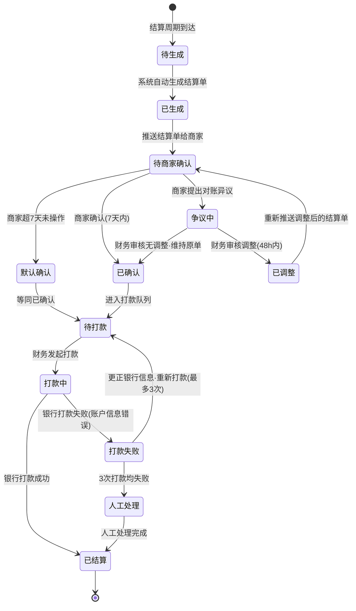
```mermaid
stateDiagram-v2
    [*] --> 待生成: 结算周期到达
    待生成 --> 已生成: 系统自动生成结算单
    已生成 --> 待商家确认: 推送结算单给商家
    待商家确认 --> 已确认: 商家确认(7天内)
    待商家确认 --> 默认确认: 商家超7天未操作
    待商家确认 --> 争议中: 商家提出对账异议
    默认确认 --> 待打款: 等同已确认
    已确认 --> 待打款: 进入打款队列
    待打款 --> 打款中: 财务发起打款
    打款中 --> 已结算: 银行打款成功
    打款中 --> 打款失败: 银行打款失败(账户信息错误)
    打款失败 --> 待打款: 更正银行信息·重新打款(最多3次)
    打款失败 --> 人工处理: 3次打款均失败
    人工处理 --> 已结算: 人工处理完成
    争议中 --> 已调整: 财务审核调整(48h内)
    争议中 --> 已确认: 财务审核无调整·维持原单
    已调整 --> 待商家确认: 重新推送调整后的结算单
    已结算 --> [*]
```

**状态过渡操作表（SM-14·v3.0.0补全）**：

| 当前状态 | 触发操作 | 目标状态 | 操作者 | 前置约束 | 后置动作 |
|----------|----------|----------|--------|----------|----------|
| 待生成 | 结算周期到达 | 待生成 | 系统自动 | 结算周期配置生效 | 统计本期交易数据 |
| 待生成 | 系统自动生成结算单 | 已生成 | 系统自动 | 交易数据汇总完成 | 生成结算单→推送商家通知 |
| 已生成 | 推送结算单给商家 | 待商家确认 | 系统自动 | 结算单生成成功 | 发送确认通知+7天倒计时 |
| 待商家确认 | 商家确认（7天内） | 已确认 | 商家手动 | 对账无误 | 进入打款队列 |
| 待商家确认 | 商家超7天未操作 | 默认确认 | 系统自动 | 7天期限届满 | 等同已确认→进入打款队列 |
| 待商家确认 | 商家提出对账异议 | 争议中 | 商家手动 | 提供争议证据 | 冻结该笔打款→通知财务审核 |
| 默认确认 | 进入打款队列 | 待打款 | 系统自动 | 等同已确认逻辑 | 加入打款批次 |
| 已确认 | 进入打款队列 | 待打款 | 系统自动 | 结算单已确认 | 加入打款批次 |
| 待打款 | 财务发起打款 | 打款中 | 平台财务手动 | 2人复核通过 | 发起银行转账指令 |
| 打款中 | 银行打款成功 | 已结算 | 系统自动 | 银行返回成功回执 | 更新结算状态→通知商家 |
| 打款中 | 银行打款失败（账户信息错误） | 打款失败 | 系统自动 | 银行返回失败原因 | 通知商家更新银行信息 |
| 打款失败 | 更正银行信息→重新打款（最多3次） | 待打款 | 商家手动→财务 | 重试次数<3 | 重新进入打款队列 |
| 打款失败 | 3次打款均失败 | 人工处理 | 系统自动 | 重试次数≥3 | 标记待处理→通知财务介入 |
| 人工处理 | 人工处理完成 | 已结算 | 平台财务手动 | 人工核实确认 | 更新结算状态→通知商家 |
| 争议中 | 财务审核调整（48h内） | 已调整 | 平台财务手动 | 争议证据核实 | 生成调整后的结算单 |
| 争议中 | 财务审核无调整→维持原单 | 已确认 | 平台财务手动 | 争议证据不成立 | 恢复原结算单→进入打款队列 |
| 已调整 | 重新推送调整后的结算单 | 待商家确认 | 系统自动 | 新结算单生成 | 重新开始确认流程 |

### 7.15 SM-15：分账单状态机（v2.2.0新增）

```mermaid
stateDiagram-v2
    [*] --> 待分账: 用户支付成功
    待分账 --> 分账中: 调用微信分账API
    分账中 --> 已分账: 分账成功(药房+医生+平台)
    分账中 --> 分账失败: 微信分账API返回失败
    分账失败 --> 待分账: 重试(每5分钟·最多3次)
    分账失败 --> 待人工分账: 3次重试均失败+告警
    待人工分账 --> 已分账: 人工介入·手动分账
    分账中 --> 分账部分成功: 部分账户分账成功
    分账部分成功 --> 待补分账: 对失败账户重新分账
    待补分账 --> 分账中: 重试失败账户分账
    已分账 --> 已退回: 订单退款·逆向分账
    已退回 --> [*]
```

**状态过渡操作表**：

| 当前状态 | 触发操作 | 目标状态 | 操作者 | 前置约束 | 后置动作 |
|----------|----------|----------|--------|----------|----------|
| 待分账 | 订单完成→发起分账 | 分账中 | 系统 | 易宝/微信商户号已入网 | 调用分账API |
| 分账中 | 分账成功 | 已分账 | 易宝/微信 | 各方账户余额充足 | 更新各方余额 |
| 分账中 | 分账失败（余额不足/超时） | 分账失败 | 系统 | 重试3次后仍失败 | 人工分账/补分账 |
| 分账失败 | 人工补分账 | 已分账 | 财务管理员 | 2人复核 | 更新分账记录 |

### 7.16 SM-16：服务订单状态机（v2.8.0新增·营养师/HM）

> **背景**：营养师/健康管理师的服务订单支持两种模式——包月制（签约服务）和按次制（单次服务），两种模式共用状态机，但部分状态转换路径不同。

```mermaid
stateDiagram-v2
    [*] --> 待支付: 用户选择服务·生成订单

    state 包月制分支 <<choice>>
    state 按次制分支 <<choice>>

    待支付 --> 已支付: 用户完成支付
    待支付 --> 已取消: 30分钟未支付·自动取消

    已支付 --> 包月制分支: 订单类型=签约包月
    已支付 --> 按次制分支: 订单类型=单次服务

    %% 包月制流程
    包月制分支 --> 签约生效: 系统建立签约关系
    签约生效 --> 服务周期中: 用户确认服务方案(饮食/管理方案)
    服务周期中 --> 周期到期: 服务周期结束(按月)
    周期到期 --> 已完结: 无续费·自动完结
    周期到期 --> 续费中: 用户发起续费
    续费中 --> 待支付: 生成续费订单
    服务周期中 --> 用户解约: 用户申请提前解约
    用户解约 --> 部分退款: 按剩余天数比例退款
    部分退款 --> 已完结

    %% 按次制流程
    按次制分支 --> 待服务: 服务方接单
    待服务 --> 服务中: 服务方开始执行
    服务中 --> 待确认: 服务方完成·提交成果
    待确认 --> 已完结: 用户确认/7天自动确认
    待确认 --> 服务中: 用户不满意·退回修改
    待服务 --> 已退款: 服务方超时未接单(48h)·自动退款
    服务中 --> 已退款: 服务方无法完成·主动退款

    %% 异常分支
    已支付 --> 已退款: 用户取消(服务方未接单前)
    签约生效 --> 已退款: 平台仲裁·全额退款
    待服务 --> 仲裁中: 用户申请平台介入
    服务中 --> 仲裁中: 用户/服务方申请平台介入
    仲裁中 --> 已完结: 平台裁定(正常完结/退款)
    仲裁中 --> 已完结: 平台裁定·部分退款

    已完结 --> [*]
    已取消 --> [*]
    已退款 --> [*]
```

**状态过渡操作表**：

| 当前状态 | 触发操作 | 目标状态 | 操作者 | 前置约束 | 后置动作 |
|----------|----------|----------|--------|----------|----------|
| 待支付 | 用户完成支付 | 已支付 | 系统自动 | 支付成功回调 | 生成支付记录+进入对应分支 |
| 待支付 | 30分钟未支付 | 已取消 | 系统自动 | 超时 | 释放预占资源+通知用户 |
| 已支付·包月制 | 系统建立签约关系 | 签约生效 | 系统自动 | 订单类型=签约包月 | 生成签约记录+通知服务方+通知用户 |
| 签约生效 | 用户确认服务方案 | 服务周期中 | 用户手动 | 服务方已制订方案 | 方案归档+服务周期计时开始 |
| 服务周期中 | 服务周期结束 | 周期到期 | 系统自动 | 周期计时到期 | 检测续费状态 |
| 周期到期 | 无续费 | 已完结 | 系统自动 | 到期后7天未续费 | 签约关系标记结束+可评价 |
| 周期到期 | 用户发起续费 | 续费中 | 用户手动 | 到期前/后30天内 | 生成续费订单 |
| 续费中 | 支付成功 | 待支付 | 系统自动 | 续费订单生成 | 再走支付→签约生效流程 |
| 服务周期中 | 用户申请提前解约 | 用户解约 | 用户手动 | 服务周期未结束 | 按天比例计算退款金额 |
| 用户解约 | 退款完成 | 已完结 | 系统自动 | 退款到账 | 签约关系提前结束 |
| 已支付·按次制 | 服务方接单 | 待服务 | 服务方手动 | 48h内 | 通知用户+开始履约计时 |
| 待服务 | 服务方开始执行 | 服务中 | 服务方手动 | 已接单 | 通知用户+进度可跟踪 |
| 服务中 | 服务方提交成果 | 待确认 | 服务方手动 | 服务完成 | 通知用户确认+7天确认计时 |
| 待确认 | 用户确认 | 已完结 | 用户手动 | 7天内 | 结算触发+可评价 |
| 待确认 | 7天自动确认 | 已完结 | 系统自动 | 超时未确认 | 自动确认+结算触发 |
| 待确认 | 用户不满意退回 | 服务中 | 用户手动 | 7天内+≤3次退回 | 返回修改+附修改意见 |
| 待服务 | 48h未接单 | 已退款 | 系统自动 | 超时 | 自动退款+通知用户+服务方接单率-1 |
| 已支付 | 用户取消(未接单) | 已退款 | 用户手动 | 服务方未接单 | 全额退款+通知服务方 |
| 服务中 | 服务方无法完成 | 已退款 | 服务方手动 | 服务方发起 | 全额退款+服务方完成率-1+通知用户 |
| 任意 | 平台仲裁 | 仲裁中 | 管理员手动 | 用户/服务方申请 | 冻结订单+平台介入调查 |
| 仲裁中 | 平台裁定 | 已完结 | 管理员手动 | 调查完毕 | 按裁定结果处理+通知双方 |

**包月制与按次制的关键差异**：

| 维度 | 包月制 | 按次制 |
|------|--------|--------|
| 订单周期 | 按月(30天)，自动续费 | 单次，服务完成即完结 |
| 服务内容 | 月度饮食/管理方案+1v1咨询 | 单次饮食方案/单次咨询 |
| 续费方式 | 到期自动生成续费订单 | 无续费，用户需重新下单 |
| 退款逻辑 | 按剩余天数比例退款 | 全额退款或协商部分退款 |
| 结算时机 | 每月周期结束后结算 | 每次服务确认后结算 |
| 适用角色 | 营养师·长期签约/健康管理师·慢病管理 | 营养师·单次饮食方案/健康管理师·单次报告解读 |

### 7.17 SM-17：入驻申诉仲裁状态机（v2.3.0新增·v3.1.1从§22迁移补全）

> **业务闭环逻辑**：入驻审核被拒 → 商家查阅驳回原因 → 补充材料申诉 → 平台独立复审（与初审不同人） → 复审通过/再驳回 → 再驳回后可申请平台仲裁 → 仲裁委员会终审。全流程SLA约束（商家7工作日内发起申诉、平台5工作日内复审、仲裁10工作日内裁决），防止「一拒了之」导致商家流失。

```mermaid
stateDiagram-v2
    [*] --> 审核被拒
    审核被拒 --> 待申诉: 商家查阅驳回原因
    待申诉 --> 申诉中: 商家提交申诉材料
    待申诉 --> 超时关闭: 驳回后7工作日未申诉
    申诉中 --> 复审通过: 复审员判定申诉成立
    申诉中 --> 再驳回: 复审员判定申诉不成立
    再驳回 --> 待仲裁: 商家申请平台仲裁
    再驳回 --> 超时关闭: 再驳回后7工作日未申请仲裁
    待仲裁 --> 仲裁中: 仲裁委员会受理
    仲裁中 --> 仲裁通过: 裁决申诉成立
    仲裁中 --> 仲裁驳回: 裁决申诉不成立(终局)
    复审通过 --> 入驻生效: 恢复入驻资格
    仲裁通过 --> 入驻生效: 恢复入驻资格
    入驻生效 --> [*]
    超时关闭 --> [*]
    仲裁驳回 --> [*]
```

**状态过渡操作表（SM-17）**：

| 当前状态 | 触发操作 | 目标状态 | 操作者 | 前置约束 | 后置动作 |
|----------|----------|----------|--------|----------|----------|
| 审核被拒 | 商家查阅驳回原因 | 待申诉 | 商家(PH) | 审核被拒记录存在 | 展示完整驳回理由+材料清单 |
| 待申诉 | 提交申诉材料 | 申诉中 | 商家(PH) | 驳回后≤7工作日；上传补充材料 | 系统验核材料格式→分配复审员（非原审核人） |
| 待申诉 | 超时（7工作日） | 超时关闭 | 系统自动 | 驳回后+7工作日无操作 | 通知商家+记录归档 |
| 申诉中 | 复审通过 | 复审通过 | 复审员(AD) | 材料充足+符合入驻标准 | 恢复入驻资格+重新签署电子合同+通知商家 |
| 申诉中 | 复审驳回 | 再驳回 | 复审员(AD) | 材料仍不符合标准 | 给出再驳回具体原因+提示仲裁入口 |
| 再驳回 | 申请仲裁 | 待仲裁 | 商家(PH) | 再驳回后≤7工作日 | 商家提交仲裁申请+缴纳仲裁受理费（可退还） |
| 再驳回 | 超时（7工作日） | 超时关闭 | 系统自动 | 再驳回后+7工作日无操作 | 通知商家+记录归档 |
| 待仲裁 | 仲裁委员会受理 | 仲裁中 | 仲裁员(ARB) | 仲裁申请有效+费用已缴 | 组建3人仲裁小组+通知双方提交证据 |
| 仲裁中 | 裁决通过 | 仲裁通过 | 仲裁员(ARB) | 2/3以上同意 | 恢复入驻资格+退还仲裁费+通知双方 |
| 仲裁中 | 裁决驳回 | 仲裁驳回 | 仲裁员(ARB) | 2/3以上同意 | 终局裁决+通知双方+同一主体180天内禁止再入驻 |

> **关联状态机**：SM-07(医生入驻)/SM-08(药剂师入驻)/SM-09(营养师入驻)/SM-10(HM入驻)的驳回态 → 触发SM-17申诉入口
>
> **关联UC**：UC-SUG-PC-022(入驻审核申诉)、UC-SUG-PC-023(入驻平台仲裁) → 详见 §22.1

### 7.18 SM-18：易宝入网认证（v3.0.0·独立支付开通·入驻与入网分离）

> **v3.0.0架构分离**：SM-18是独立于入驻流程的支付入网状态机。入驻审核通过后不自动入网，入驻角色管理员在PC后台【财务中心→开通支付·易宝入网】自主发起。入网申请自动引用入驻时已提交的资质证照，仅需补充银行账户/收单环境等支付特有要素。易宝按收单环境和收单场景分配不同商编(merchant_no)——同一商户在不同业务场景下可能持有多个商编。

```mermaid
stateDiagram-v2
    [*] --> 待发起: 入驻审核通过·入网待发起

    state 角色分流 <<choice>>
    待发起 --> 角色分流: 入驻角色管理员发起[开通支付]

    %% 企业认证分支（药房）
    角色分流 --> 企业认证·资质引用: 角色=药房(企业)
    企业认证·资质引用 --> 企业认证·补充要素: 自动引用入驻资质(营业执照+法人身份证)
    企业认证·补充要素 --> 企业认证·OCR采集: 补充银行账户+收单场景信息
    企业认证·OCR采集 --> 企业认证·四要素核验: OCR识别采集
    企业认证·四要素核验 --> 企业认证·法人人脸: 四要素(企业名+信用代码+法人名+法人身份证)核验通过
    企业认证·法人人脸 --> 企业认证·平台复核: 活体检测+人脸比对通过
    企业认证·四要素核验 --> 入网失败: 核验不通过(可重试最多3次/CONFIG-SUG-053)
    企业认证·法人人脸 --> 入网失败: 人脸不通过(可重试最多3次)

    %% 个人认证分支（医生/药剂师/营养师/HM/直播达人/培训机构）
    角色分流 --> 个人认证·资质引用: 角色=个人
    个人认证·资质引用 --> 个人认证·补充要素: 自动引用入驻资质(身份证+执业证/资格证)
    个人认证·补充要素 --> 个人认证·OCR采集: 补充银行账户+收单场景信息
    个人认证·OCR采集 --> 个人认证·三要素核验: OCR识别采集
    个人认证·三要素核验 --> 个人认证·人脸识别: 三要素(姓名+身份证号+执业证编号)核验通过
    个人认证·人脸识别 --> 个人认证·平台复核: 活体检测+人脸比对通过
    个人认证·三要素核验 --> 入网失败: 核验不通过(可重试最多3次)
    个人认证·人脸识别 --> 入网失败: 人脸不通过(可重试最多3次)

    %% 平台复核后递交易宝
    企业认证·平台复核 --> 易宝提交: 平台复核通过·调用易宝企业认证API
    个人认证·平台复核 --> 易宝提交: 平台复核通过·调用易宝个人认证API
    企业认证·平台复核 --> 入网失败: 平台复核不通过
    个人认证·平台复核 --> 入网失败: 平台复核不通过

    %% 易宝处理
    易宝提交 --> 易宝处理中: 易宝接收入网申请
    易宝处理中 --> 入网完成: 易宝审核通过·分配商户号+商编
    易宝处理中 --> 需补正: 易宝返回补正要求
    需补正 --> 待发起: 重新提交补正材料(限2次)
    易宝处理中 --> 入网失败: 易宝审核拒绝

    入网完成 --> [*]: 系统记录yeepay_merchant_id+merchant_no·激活支付能力
    入网失败 --> [*]: 按原因分级冻结(BR-SUG-123)
```

**SM-18状态过渡操作表**：

| 当前状态 | 触发操作 | 目标状态 | 操作者 | 前置约束 | 后置动作 |
|:---------|:---------|:---------|:-------|:---------|:---------|
| 待发起 | 入驻角色管理员点击「开通支付·易宝入网」 | 角色分流 | 入驻角色手动 | 入驻审核通过+未持有有效yeepay_merchant_id | 系统自动加载入驻资质（证照/身份信息）→展示资质摘要+需补充的支付要素清单 |
| 资质引用 | 系统自动填充入驻时已提交的证照 | 补充要素 | 系统自动 | 入驻申请中已有有效资质 | 展示已引用资质+跳转补充银行账户/收单场景信息 |
| 补充要素 | 填写银行账户+收单环境/场景信息+确认提交 | OCR采集 | 入驻角色手动 | 银行账户信息完整有效 | 进入AI机审流程 |
| OCR采集 | 上传/引用证照图片 | 四/三要素核验 | 系统自动 | 文件清晰可辨 | 调用易宝OCR→提取要素字段 |
| 四/三要素核验 | 核验通过 | 人脸识别 | 系统自动 | 要素与权威库一致 | 触发人脸识别H5 |
| 人脸识别 | 活体检测+相似度≥阈值 | 平台复核 | 系统自动 | 活体通过+人证一致 | OCR+要素+人脸结果推送到入驻审核工作台 |
| 平台复核 | 管理员确认无误 | 易宝提交 | 平台管理员手动 | AI机审全部通过 | 组装入网报文→调用易宝入网API |
| 易宝提交→处理中 | 易宝接收入网申请 | 易宝处理中 | 事件驱动 | 入网报文完整 | 记录request_no+等待回调 |
| 易宝处理中 | 易宝回调·审核通过 | 入网完成 | 事件驱动 | 易宝审核通过 | 记录yeepay_merchant_id+按收单场景分配merchant_no+激活支付能力→通知入驻角色 |
| 易宝处理中 | 易宝回调·需补正 | 需补正 | 事件驱动 | 补正项列表 | 通知入驻角色补正→≤2次补正机会 |
| 需补正 | 补正后重新提交 | 待发起 | 入驻角色手动 | ≤2次补正 | 重新进入入网流程 |
| 需补正 | 补正次数>2/30天未补正 | 入网失败 | 系统自动 | 补正耗尽/超时 | 关闭入网申请+按BR-SUG-123分级冻结 |
| 易宝处理中 | 易宝回调·拒绝 | 入网失败 | 事件驱动 | 易宝拒绝 | 记录拒绝原因+按BR-SUG-123分级冻结 |
| 任意核验步骤 | 累计失败3次 | 入网失败 | 系统自动 | 失败次数≥3 | 按BR-SUG-123判定冻结级别 |

**各角色认证方式对照表（v3.0.0·扩展至8角色）**：

| 入驻角色 | 入网主体类型 | 资质来源 | 认证方式 | 要素核验 | 人脸识别 | 默认收单场景 | 商编类型 |
|:---------|:----------:|:---------|:---------|:---------|:--------:|:------------|:-------|
| 药房 | 企业 | 入驻·四证 | 四要素+法人人脸 | 企业名称+信用代码+法人姓名+法人身份证号 | 法人活体 | DRUG_RETAIL | 药品零售商编 |
| 医生 | 个人 | 入驻·执业证+身份证 | 三要素+人脸 | 姓名+身份证号+执业证编号 | 本人活体 | MEDICAL_SERVICE | 医疗服务商编 |
| 药剂师 | 个人 | 入驻·药师证+身份证 | 三要素+人脸 | 姓名+身份证号+药师证编号 | 本人活体 | MEDICAL_SERVICE | 医疗服务商编 |
| 营养师 | 个人 | 入驻·营养师证+身份证 | 三要素+人脸 | 姓名+身份证号+资格证编号 | 本人活体 | MEDICAL_SERVICE | 医疗服务商编 |
| 健康管理师(HM) | 个人 | 入驻·HM证+身份证 | 三要素+人脸 | 姓名+身份证号+证书编号 | 本人活体 | MEDICAL_SERVICE | 医疗服务商编 |
| 直播达人 | 个人 | 入驻·身份证+实名认证 | 三要素+人脸 | 姓名+身份证号+实名认证 | 本人活体 | LIVE_COMMERCE | 直播电商商编 |
| 培训机构 | 企业/个人 | 入驻·营业执照/资质证+身份证 | 四/三要素+人脸 | 按主体类型 | 按主体类型 | COURSE_TRAINING | 课程培训商编 |

> **v3.0.0新增**：收单环境(WEB/WAP/APP/MINI_PROGRAM)决定支付技术通道，收单场景(DRUG_RETAIL/MEDICAL_SERVICE/LIVE_COMMERCE/COURSE_TRAINING)决定商编类型。同一商户可持有多个商编（不同场景不同商编）。药房可为旗下药剂师单独申请商户号（药剂师作为分账接收方需要独立的yeepay_merchant_id）。

---

## §8 腾讯云直播技术集成方案

### 8.1 技术架构

```
┌──────────────┐   ┌──────────────┐   ┌──────────────┐
│  SugarMate   │   │  腾讯云CSS    │   │  腾讯云VOD   │
│  直播APP     │   │  (直播)       │   │  (点播回放)   │
│              │   │              │   │              │
│ ┌──────────┐ │   │ ┌──────────┐ │   │ ┌──────────┐ │
│ │推流SDK   │─┼───┼→│推流服务   │ │   │ │视频存储   │ │
│ │(TXLivePus│ │   │ │          │ │   │ │          │ │
│ │ her)     │ │   │ └──────────┘ │   │ └──────────┘ │
│ └──────────┘ │   │              │   │              │
│ ┌──────────┐ │   │ ┌──────────┐ │   │ ┌──────────┐ │
│ │播放器SDK │◄┼───┼─│拉流服务   │ │   │ │回调转码   │ │
│ │(TXLivePl │ │   │ │          │ │   │ │          │ │
│ │ ayer)    │ │   │ └──────────┘ │   │ └──────────┘ │
│ └──────────┘ │   │              │   │              │
│ ┌──────────┐ │   │              │   │              │
│ │美颜特效  │ │   │              │   │              │
│ │(腾讯特效  │ │   │              │   │              │
│ │ SDK)    │ │   │              │   │              │
│ └──────────┘ │   │              │   │              │
│ ┌──────────┐ │   │ ┌──────────┐ │   │              │
│ │IM SDK    │◄┼───┼→│ 腾讯云IM  │ │   │              │
│ │(消息+弹幕│ │   │ │  (互动)   │ │   │              │
│ │+礼物)    │ │   │ │          │ │   │              │
│ └──────────┘ │   │ └──────────┘ │   │              │
└──────────────┘   └──────────────┘   └──────────────┘
```

### 8.2 核心SDK列表

| SDK | 版本 | 用途 | 关键能力 |
|-----|------|------|----------|
| **TXLivePusher** | ≥8.5 | 主播推流 | 多分辨率(360/720/1080p)、美颜滤镜、音频降噪、后台推流 |
| **TXLivePlayer** | ≥8.5 | 观众拉流 | HLS/FLV/RTMP多协议、自适应码率、极速首帧、断流重连 |
| **腾讯特效SDK** | ≥3.0 | 美颜特效 | 基础美颜(磨皮/美白/瘦脸)、滤镜、动态贴纸、绿幕 |
| **腾讯云IM** | ≥6.0 | 互动消息 | 弹幕、聊天、礼物、自定义消息、信令、群组管理 |
| **腾讯云VOD** | — | 回放点播 | 录制存储、转码、视频编辑、播放鉴权 |

### 8.3 直播场景与腾讯云产品映射

| SugarMate直播场景 | 腾讯云产品 | 关键配置 |
|-------------------|-----------|----------|
| 医生健康讲座直播 | CSS+IM+VOD | 720p推流、美颜（自然）、实时弹幕、自动录制 |
| 直播带货 | CSS+IM+VOD | 1080p推流、商品卡片浮层、购物车链接、优惠券弹窗 |
| 互动问答 | CSS+IM | 720p、问题筛选(IM自定义消息)、答案高亮 |
| 饮食烹饪直播 | CSS+特效SDK+IM | 美颜+美食滤镜、多机位切换 |
| 运动教学直播 | CSS+IM+VOD | 720p/运动模式、弹幕互动、回放标记精彩片段 |

### 8.4 腾讯云直播与SugarMate系统集成点

| 集成点 | 说明 | 数据流方向 | 关键接口 |
|--------|------|-----------|----------|
| 用户鉴权 | 直播APP内统一登录态（SugarMate账号） | SugarMate→直播APP | SSO Token传递 |
| 主播开播 | 主播在PC后台创建直播计划→直播APP推流 | PC→直播APP→CSS | createLiveRoom() |
| 商品关联 | 直播中展示的商品需与商城商品池关联 | PC商品管理→直播APP | bindProductToRoom() |
| 观众互动 | IM消息转发到SugarMate消息系统 | IM→SugarMate | Webhook回调 |
| 直播数据 | 观看数据回传到数据看板 | CSS/VOD→SugarMate | CSS统计API |
| 违规处理 | AI审核发现违规→中断推流+处罚 | CSS→SugarMate后台 | 审核回调 |
| 回放关联 | 直播回放关联到社区帖子/医生主页 | VOD→APP/社区 | getPlayUrl() |
| 带货订单 | 直播中下单关联直播间ID（统计转化） | APP→商城→PC | order.source=live |
| 用户行为 | 观看/互动/下单行为写入用户画像 | 直播APP→用户画像 | 数据埋点 |

---

## §9 端到端系统闭环

### 9.1 全业务链路闭环矩阵

```
业务闭环                   涉及终端          涉及角色              关键状态流转
──────────────────────────────────────────────────────────────────────────
用户获取闭环    MP → APP             糖友 → SCRM客服           匿名→评估→注册→建档
诊疗闭环        APP → PC             糖友 → 医生 → 药剂师       问诊(APP·医生端)→处方→审核(PC·药剂师工作台)
购药闭环        APP → PC             糖友 → 药房 → 物流         下单(APP)→调配(PC·药房管理)→配送→签收
冷链闭环        APP → 设备 → PC      糖友 → 药房 → 物流 → 监管   正常→异常→断链→补发/退款
预警闭环        CGM → APP → PC       糖友 → 健康管理师 → 医生   黄→橙→红→SOS→确认(APP·HM端+医生端)
入驻闭环        PC·入驻模块 → PC·审核 商家 → 平台管理员           申请→审核→签约→培训→上线
运营闭环        PC·审核 → PC·角色视图 平台 → 各类商家             上线→服务→评价→结算→评级
直播闭环        LIVE → CSS/VOD       主播 → 观众 → 平台          预告→直播→带货→结束→回放
裂变闭环        MP/APP               糖友 → 好友                 浏览→分享→新用户注册→奖励
会员闭环        APP → PC             糖友 → 平台                 注册→付费→权益→续费/过期
结算闭环        PC·结算模块          商家 → 平台 → 财务           服务→统计→对账→结算→打款
合规闭环        PC → 各端            平台 → 监管                 监控→记录→报告→整改
```

### 9.2 闭环完整性校验清单

| 闭环编号 | 闭环名称 | 正向链路完整 | 逆向/异常链路 | 状态机覆盖 | 数据可追溯 |
|----------|----------|-------------|--------------|-----------|-----------|
| CL-01 | 用户获取闭环 | ✅ | 评估不注册→SCRM培育 | ✅ SM-01 | ✅ 来源渠道+行为日志 |
| CL-02 | 诊疗闭环 | ✅ | 审核驳回→修改重提 | ✅ SM-03 | ✅ 完整操作日志≥3年 |
| CL-03 | 冷链闭环 | ✅ | 断链→退货/补发 | ✅ SM-05 | ✅ 温控数据≥5年 |
| CL-04 | 预警闭环 | ✅ | 超时→自动SOS | ❌ 待补充 | ✅ 每级预警事件记录 |
| CL-05 | 入驻闭环 | ✅ | 驳回→修改→通过/清退 | ✅ SM-02+SM-06 | ✅ 审核记录+证照版本 |
| CL-06 | 直播闭环 | ⚠️ 待细化 | 违规断流→处罚→恢复 | ✅ SM-04 | ✅ 推流+审核+数据日志 |
| CL-07 | 结算闭环 | ✅ | 对账异常→重新核算 | ❌ 待补充 | ✅ 结算单+银行流水号 |
| CL-08 | 合规闭环 | ✅ | 整改通知→整改→复查 | ❌ 待补充 | ✅ 日志+报告+整改记录 |

> **⚠️标记项**：CL-06直播闭环的带货转化→数据统计→佣金结算链路待细化；CL-04预警闭环的状态机待补充；CL-07结算状态机待补充；CL-08合规整改状态机待补充。将在下一迭代中补全。

---

## §10 用例（UC）— 核心场景详解

> 以下按业务域展开核心UC（MVP P0优先完整六段格式）。由于v2.1.0新增52 FN（平台入驻+直播APP+PC增强），UC总数预计200+。此处展开TOP-35 MVP核心UC，其余UC精简表格列出。

### 10.1 平台入驻·核心UC

#### UC-SUG-PC-001：药店入驻申请与审核

| 属性 | 内容 |
|------|------|
| **UC编号** | UC-SUG-PC-001 |
| **关联FN** | FN-SUG-PC-001、FN-SUG-PC-002、FN-SUG-PC-006 |
| **名称** | 药店入驻申请与审核 |
| **页面** | PC入驻端(药店)→PC后台(管理员) |
| **参与者** | 药房管理员(PH)、平台管理员(AD)、系统(SYS) |
| **优先级** | P0 |
| **关联BG** | BG-SUG-008（商家入驻） |
| **自动化类型** | 手动+系统自动 |

**前置条件**：
1. 药房管理员已在PC入驻端打开「药店入驻」页面
2. 系统已对接国家药监局药品经营许可证核验API
3. 系统已对接国家企业信用信息公示系统API（营业执照核验）
4. OCR资质识别模型已加载（营业执照/许可证/身份证三件套）

**基本流程**：
1. [手动] 药房管理员点击「立即入驻」，阅读平台服务协议
2. [手动] 填写药房基本信息：药房名称、经营地址、联系人、联系电话
3. [手动] 上传四证原件照片/扫描件：
   - 营业执照（含统一社会信用代码）
   - 药品经营许可证
   - GSP认证证书
   - 法人身份证（正反面）
4. [系统自动] 系统OCR自动识别四证信息并填充到表单，标注置信度
5. [手动] 药房管理员核对OCR识别结果，修正错误项，点击「提交审核」
6. [系统自动] 系统执行AI自动校验（平台机审第一层·证照校验）：
   a. 营业执照编号→国家企业信用信息公示系统API核验
   b. 药品经营许可证编号→国家药监局API核验
   c. GSP证书编号→药监局数据匹配
   d. 证照有效期检查（是否过期/即将到期）
   e. 经营范围是否覆盖药品零售
7. [系统自动] 系统生成AI审核报告（风险评分+各项校验结果+建议）
8. [系统自动] 审核报告推送到PC后台·入驻审核工作台
9. [手动] 平台管理员查看AI审核报告，执行人工复核（平台人审）
10. [手动] 管理员确认审核通过→入驻状态=「审核通过」+系统自动生成药房唯一ID+初始化药房管理后台
11. [手动] 管理员发送电子合同链接→释放培训课程

> **v3.0.0架构分离**：入驻审核通过后直达签约，不再自动进入易宝入网。药房管理员可在入驻通过后，在PC后台【财务中心→开通支付·易宝入网】自主发起入网申请（见UC-SUG-PC-030·§14.10）。入网申请自动引用步骤3~4已提交的资质证照，仅需补充银行账户等支付特有要素。⚠️ 营业中接收用户付款需SM-18入网完成。

**备选流程**：
- **4a**：OCR识别关键字段置信度<85%→高亮标注「需人工核对」，但不阻断流程
- **6a**：API调用超时/不可用→降级为人工查询，标记「API不可用」+延长审核时效至5工作日
- **6b**：证照中有1项即将耗尽（<90天）→审核通过但标记「证照到期预警」
- **6c**：证照中有1项已过期→自动驳回，注明过期证件
- **9a**：管理员驳回后，药房7天内未重新提交→标记为「超时未处理」，归档

**数据范围（R/W）**：
| 数据实体 | 操作 | 字段 |
|----------|------|------|
| 药房入驻申请 | W | 申请ID、药房名称、地址、联系人、证照文件URL、OCR结果JSON |
| 证照信息 | W | 营业执照号、许可证号、GSP证书号、有效期、法人信息 |
| AI审核报告 | W | 风险评分、校验项结果、建议、生成时间 |
| 审核记录 | W | 审核人ID、审核结果(通过/驳回)、驳回原因、审核时间 |
| 电子合同 | W | 合同ID、药房ID、签署状态、CA签名ID |

**后置条件**：
1. AI机审+人工复核通过→入驻状态=「审核通过」+电子合同发送+药房管理后台初始化
2. 审核驳回→入驻状态=「已驳回」+推送驳回通知给药房管理员
3. AI审核报告+人工审核记录归档
4. 入驻通过后，药房可在财务中心自主发起【开通支付·易宝入网】（见UC-SUG-PC-030）

**关联UC**：
- UC-SUG-PC-002（电子合同签署）—审核通过后触发
- UC-SUG-PC-003（药房培训管理）—签约完成后触发
- UC-SUG-PC-004（药房正式上线）—培训通过后触发
- UC-SUG-PC-005（证照到期管理）—证照到期预警触发
- UC-SUG-PC-030（开通支付·易宝入网）—入驻通过后自主发起

---

#### UC-SUG-PC-002：医生入驻申请与审核

| 属性 | 内容 |
|------|------|
| **UC编号** | UC-SUG-PC-002 |
| **关联FN** | FN-SUG-PC-001、FN-SUG-PC-003 |
| **名称** | 医生入驻申请与审核 |
| **页面** | PC入驻端(医生)→PC后台(管理员) |
| **参与者** | 医生(DR)、平台管理员(AD)、系统(SYS) |
| **优先级** | P0 |
| **关联BG** | BG-SUG-008 |
| **自动化类型** | 手动+系统自动 |

**前置条件**：
1. 医生已在PC入驻端打开「医生入驻」页面
2. 系统已对接国家卫健委医师执业注册信息查询API
3. OCR资质识别模型已加载（执业证/身份证）

**基本流程**：
1. [手动] 医生点击「医生入驻」，填写个人信息（姓名/手机号/所在机构/科室/职称/擅长领域）
2. [手动] 上传执业医师证（含执业证号）+身份证正反面
3. [系统自动] OCR识别执业证/身份证信息（姓名/执业证号/执业类别/执业范围/身份证号/主要执业机构/签发日期）
4. [系统自动] 系统执行卫健委API双路校验：
   a. 卫健委API核验：执业证号+身份证号+姓名三要素匹配
5. [系统自动] 系统生成医生风险评分（API核验结果×40% + 执业年限×20% + 执业范围匹配×20% + 资质完整性×20%）
6. [系统自动] 机审结果（OCR+卫健委核验+风险评分）推送到入驻审核工作台
7. [手动] 管理员查看机审结果，执行人工复核（重点关注执业范围是否含「内分泌科/全科/内科」+人证一致性）
8. [手动] 管理员确认审核通过→入驻状态=「审核通过」+自动生成医生唯一ID+注册CA证书（国密SM2）+分配医生端APP权限
9. [手动] 管理员发送电子合同链接→释放培训课程

> **v3.0.0架构分离**：医生入驻审核通过后直达签约，不再自动进入易宝入网。医生作为订单参与者（分账接收方），可在入驻通过后在PC后台【财务中心→开通支付·易宝入网】自主发起入网申请（个人认证·三要素+人脸识别），见UC-SUG-PC-030·§14.10。

**备选流程**：
- **4a**：卫健委API不可用→降级为人工核验（要求医生补充卫健委官网执业查询截图），审核时效延长至5工作日
- **4b**：多机构执业→展示主执业机构+多机构备案信息，管理员核实后确认
- **6a**：风险评分<60分→标红提醒管理员重点关注
- **7a**：驳回时提供驳回原因模板（证照不清晰/执业范围不符/信息不一致/需补充材料）

**数据范围（R/W）**：
| 数据实体 | 操作 | 字段 |
|----------|------|------|
| 医生入驻申请 | W | 申请ID、姓名、手机号、所在机构、科室、职称、擅长领域、证照文件URL |
| 医生证照信息 | W | 执业证号、执业类别、执业范围、主要执业机构、签发日期、有效期 |
| API核验记录 | W | 卫健委核验结果、API响应原始数据 |
| 医生CA证书 | W | 证书ID、SM2公钥、有效期、颁发时间 |

**后置条件**：
1. 审核通过→医生状态=「待签约」+CA证书生成+医生端APP权限开通
2. 审核驳回→注明驳回原因+引导补充材料
3. 入驻通过后，医生可在财务中心自主发起【开通支付·易宝入网】（见UC-SUG-PC-030），用于接收问诊/处方/直播分账

**关联UC**：
- UC-SUG-PC-007（医生签约+CA注册）
- UC-SUG-APP-011（医生主页展示）—上线后同步
- UC-SUG-APP-006（在线问诊）—医生接诊入口
- UC-SUG-LIVE-017（医生直播资质）—审核通过后开通
- UC-SUG-PC-030（开通支付·易宝入网）—入驻通过后自主发起

---

### 10.2 直播APP·核心UC

#### UC-SUG-LIVE-001：健康科普直播（推流→观看→互动→回放）

| 属性 | 内容 |
|------|------|
| **UC编号** | UC-SUG-LIVE-001 |
| **关联FN** | FN-SUG-LIVE-001~014 |
| **名称** | 健康科普直播全流程 |
| **页面** | 直播APP（推流端+观看端） |
| **参与者** | 主播(医生/KOL HS)、观众(糖友 PT)、平台管理员(AD) |
| **优先级** | P0 |
| **关联BG** | BG-SUG-006（直播服务） |
| **自动化类型** | 手动+系统自动+事件驱动 |

**前置条件**：
1. 直播计划已在PC后台创建并审核通过（主题/主播/时间/封面/内容大纲）
2. 主播已安装直播APP并登录（SugarMate统一账号）
3. 腾讯云CSS推流/播放SDK已集成
4. 腾讯云IM SDK已集成（弹幕+消息+礼物）
5. AI内容审核服务已开启（实时画面审核+关键词过滤）

**基本流程**：
1. [事件驱动] 直播开始前15分钟，系统推送开播提醒给已预约用户
2. [手动] 主播在直播APP点击「开始直播」，进入推流准备页
3. [系统自动] 系统调用腾讯云CSS创建推流房间，生成推流地址
4. [手动] 主播调整美颜/滤镜/背景后，点击「开始推流」
5. [系统自动] 腾讯云CSS开始接收推流+多码率转码(360p/720p/1080p)
6. [事件驱动] 观众端收到「直播已开始」通知，点击进入直播间
7. [系统自动] 观众端加载腾讯云播放器SDK，自动选择最优码率
8. [手动] 主播讲解糖尿病健康知识+展示PPT/图文
9. [手动] 观众通过IM发送弹幕/聊天消息/点赞/提问
10. [系统自动] AI实时审核画面+弹幕内容（敏感词过滤/违规画面检测）
11. [手动] 主播查看高频问题列表(AI自动聚合)+实时回答
12. [事件驱动] 直播结束时间到达/主播点击「结束直播」
13. [系统自动] 腾讯云CSS停止推流+触发云端录制转码
14. [系统自动] 录制文件转存到腾讯云VOD，生成回放URL
15. [系统自动] 直播数据回传SugarMate平台（观看人数/峰值/时长/互动量）

**备选流程**：
- **4a**：推流网络不稳定→自动降分辨率(1080p→720p→480p)，不中断直播
- **8a**：直播中展示商品卡片→观众点击进入商品详情→跳转商城下单
- **8b**：直播中发放优惠券/红包→IM广播消息+观众点击领取
- **10a**：AI检测到违规画面→自动模糊处理+通知主播+管理员后台告警
- **10b**：AI检测到敏感弹幕→自动屏蔽+记录违规次数
- **11a**：主播开启连麦模式→观众申请→主播通过→观众音视频接入
- **12a**：意外断流→系统保留30分钟重连窗口，期间展示「主播暂时离开」
- **12b**：严重违规→管理员远程中断推流+封禁主播直播权限

**数据范围（R/W）**：
| 数据实体 | 操作 | 字段 |
|----------|------|------|
| 直播房间 | W | 房间ID、推流地址、拉流地址、状态、创建时间 |
| 直播计划 | R | 主题/主播/时间/封面/内容大纲/商品关联 |
| 推流记录 | W | 推流开始时间、结束时间、码率、分辨率、断流次数 |
| 弹幕/消息 | W | 用户ID、内容、时间戳、审核状态 |
| 观看记录 | W | 用户ID、进入/离开时间、观看时长、设备信息 |
| 审核记录 | W | 审核类型(画面/弹幕)、被标记内容、处理结果 |
| 回放记录 | W | VOD文件ID、转码状态、播放URL、时长 |
| 直播统计 | W | 观看UV、峰值在线、平均时长、互动次数、送礼金额、带货转化 |

**后置条件**：
1. 直播正常结束→回放生成(5-30分钟)+直播数据统计+用户观看行为写入画像
2. 违规中断→管理员审核决定恢复/封禁+违规记录归档
3. 直播带货物→商品订单关联直播间ID(归因统计)
4. 观众互动数据→更新用户活跃度+内容偏好标签

**关联UC**：
- UC-SUG-LIVE-002（直播带货）—直播中触发电商闭环
- UC-SUG-LIVE-003（直播回放浏览）—回放可分享到社区/医生主页
- UC-SUG-LIVE-004（主播管理后台）—PC后台创建直播计划
- UC-SUG-LIVE-005（直播数据看板）—PC后台查看统计
- UC-SUG-MP-008（小程序直播预告+轻观看）—小程序引流入口
- UC-SUG-PC-022（内容审核管理）—审核违规处理

---

### 10.3 平台运营·核心UC

#### UC-SUG-PC-003：平台多商家结算与对账

| 属性 | 内容 |
|------|------|
| **UC编号** | UC-SUG-PC-003 |
| **关联FN** | FN-SUG-PC-023 |
| **名称** | 平台多商家结算与对账 |
| **页面** | PC后台·结算中心 / PC后台·角色结算视图 |
| **参与者** | 财务(FC)、商家(PH/DR/NT等)、系统(SYS) |
| **优先级** | P0 |
| **关联BG** | BG-SUG-009（平台运营） |
| **自动化类型** | 系统自动+手动确认 |

**前置条件**：
1. 商家（药房/医生/营养师/健康管理师）已入驻在线
2. 各商家服务费率已在合同中约定（如：药房佣金8%/医生平台费20%）
3. 结算周期配置完成（自营T+1/药房T+N可配/问诊实时/营养师按单）
4. 商家已绑定结算银行账户

**基本流程**：
1. [事件驱动] 结算日触发（每日凌晨/每周一/每月1日，依商家类型）
2. [系统自动] 系统查询结算周期内已完成订单：
   - 药房：已签收且过退换期(7天)的药品订单
   - 医生：已完结的问诊订单
   - 营养师/健康管理师：已完结的服务订单
3. [系统自动] 按商家服务费率计算结算金额：
   结算金额 = ∑(订单实付金额 × (1-服务费率)) - 退款金额 + 补款金额
4. [系统自动] 生成结算单（含结算周期/订单明细/费率/金额/银行账户）
5. [系统自动] 结算单推送至PC后台·各角色结算视图 + 平台财务审核队列
6. [手动] 商家查看结算单，执行：
   - 确认无误→点击「确认结算」
   - 有疑问→点击「发起对账」→填写异议说明
7. [手动] 平台财务审核已确认的结算单→点击「确认打款」
8. [系统自动] 生成付款指令→推送到支付网关/银行接口
9. [系统自动] 打款完成后标记结算单状态为「已结算」
10. [系统自动] 更新商家结算流水+累计收入统计

**备选流程**：
- **3a**：订单含冷链断链退款→退款金额从结算中扣除
- **3b**：订单有平台补贴/优惠券→商家实际收入=结算金额-补贴/优惠券分摊
- **6a**：商家7天内未确认→系统自动确认（视为认可）
- **6b**：商家发起对账→平台财务介入核实→核实后调整/维持→重新生成结算单
- **7a**：财务发现异常→退回结算单→标记「需调整」→财务+商家沟通
- **8a**：打款失败（银行账户错误/冻结）→系统通知财务+商家→财务处理

**数据范围（R/W）**：
| 数据实体 | 操作 | 字段 |
|----------|------|------|
| 结算单 | W | 结算单ID、商家ID、结算周期、订单列表JSON、结算金额、费率、状态 |
| 订单 | R | 订单ID、金额、状态、退款记录、优惠券 |
| 商家银行账户 | R | 银行名称、账号、户名、支行 |
| 结算流水 | W | 流水ID、商家ID、金额、类型(问诊/药房/服务)、时间 |
| 对账异议 | W | 异议ID、结算单ID、商家说明、处理结果、处理时间 |

**后置条件**：
1. 结算单确认→打款完成→状态=已结算
2. 对账异议→财务处理→重新生成或原单结算
3. 月度/季度结算汇总→平台收入报表

**关联UC**：
- UC-SUG-PC-001（药店入驻）—入驻时配置结算周期+费率
- FN-SUG-PC-020（订单管理）—订单完成触发结算周期
- FN-SUG-PC-028（商家经营看板）—结算数据纳入看板

#### UC-SUG-PC-007：平台纠纷仲裁

**归属于**：FN-SUG-PC-035 | **优先级**：P0 | **角色**：AD | **终端**：PC业务后台

**前置条件**：
1. 用户已提交投诉/商家已提交申诉（通过UC-SUG-PC-005/UC-SUG-PC-022等相关前置渠道）
2. 当前操作者具有平台客服（CS）或管理员（AD）权限
3. 纠纷工单状态为「待受理」
4. 投诉方与被投诉方均已完成证据提交

**基本流程**：
1. 平台客服进入「运营中心→纠纷管理」页面，查看待受理纠纷列表（按提交时间倒序，支持按类型/状态/优先级筛选）
2. 点击纠纷工单→进入详情页：展示双方沟通过程（IM/电话录音摘要）、双方提交的证据材料、订单关联信息（商品/服务/金额/时间）、商家历史纠纷记录
3. 平台客服联系双方进一步核实（平台IM/电话回呼/留言板）→核实记录留痕
4. 核实完毕→平台客服做出初步裁决：支持投诉方（退款/换货/赔偿）/ 支持被投诉方（驳回投诉）/ 部分支持
5. 裁决结果录入系统：裁决理由（必填，≥20字）、处理方式（退款金额/换货/赔偿金额/驳回）、执行时效（商家须在X小时内执行）
6. 系统通知双方裁决结果→双方确认（48小时内）：
   a. 双方确认→执行裁决→结案
   b. 一方异议→升级仲裁（见备选流程2）
7. 裁决执行：系统自动执行退款/冻结资金扣除→跟踪执行结果
8. 执行完成→工单关闭→计入商家信用评分→更新纠纷统计

**备选流程**：
1. **证据不足→补充材料**：双方证据不充分→客服要求双方48小时内补充→逾期未提交→按现有证据裁决
2. **升级仲裁**：任一方对客服裁决提出异议→升级至3人仲裁小组（法务+运营总监+同行商家代表）→小组复审双方证据→2/3表决→做出终局裁决→通知双方→终局裁决不可再上诉
3. **商家拒不执行**：商家超过执行时效未执行→系统自动从商家保证金/待结算款中扣除→保证金不足→平台垫付→通知商家限期补缴（BR-SUG-104）
4. **虚假投诉**：平台客服判定投诉为虚假/恶意→驳回投诉→投诉方信用扣分→连续3次虚假投诉→限制投诉权限
5. **紧急冻结**：纠纷涉及金额较大或商家有跑路风险→立即冻结商家未结算资金（2人复核，BR-SUG-104）→优先处理

**数据范围**：
- 读取：投诉工单表(dispute)、订单表(order)、商家信息(merchant_info)、商家评级(merchant_rating)、结算单(settlement)
- 写入：纠纷工单表(dispute)、商家评级(merchant_rating)、资金冻结记录(freeze_log)、信用记录(credit_log)

**后置条件**：
1. 纠纷工单状态=已结案
2. 裁决结果已执行
3. 商家信用评分已更新
4. 操作日志完整（受理/沟通/裁决/执行全留痕≥5年）

**关联UC**：
- UC-SUG-PC-005（商家评价与评级——纠纷结果计入评级）
- UC-SUG-PC-020（订单管理——关联退款执行）
- UC-SUG-PC-022（入驻审核申诉——申诉方来源之一）
- UC-SUG-PC-024（结算争议处理——涉及资金操作关联）

---

### 10.4 其余核心UC精简表

| UC编号 | FN编号 | 名称 | 参与者 | 优先级 | 核心流程概要 |
|--------|--------|------|--------|--------|-------------|
| UC-SUG-PC-004 | FN-SUG-PC-006 | 证照到期管理 | AD/SYS | P0 | 系统每日扫描证照有效期→到期前30天/7天/1天推送提醒→商家上传新证照→管理员审核→更新证照档案 |
| UC-SUG-PC-005 | FN-SUG-PC-009 | 商家评级与违规处理 | AD/SYS | P0 | 系统按评分公式计算商家评级→每月更新→违规累计达阈值→自动降级/暂停/清退→通知商家 |
| UC-SUG-PC-006 | FN-SUG-PC-007 | 电子合同签署 | PH/DR/PR/AD | P0 | 商家收到合同链接→阅读协议→CA签名→平台CA签章→合同生效→双方保存→到期前提醒续约 |
| UC-SUG-PC-007 | FN-SUG-PC-035 | 平台纠纷仲裁 | AD/PT/商家 | P0 | 用户投诉/商家申诉→平台客服受理→查看双方证据→调解/裁决→退款/驳回/处罚→双方确认→结案 |
| UC-SUG-PC-008 | FN-SUG-PC-018 | 入驻商家SCRM管理 | CS/AD | P1 | 潜在商家线索入库→SCRM分配→跟进记录→促成入驻→入驻后关联客户池→持续运营 |
| UC-SUG-PC-009 | FN-SUG-PC-024 | 物流商管理 | AD/物流商 | P0 | 物流商入驻→资质审核→系统对接(API/手动)→冷链能力标记→服务质量监控→路由策略配置 |
| UC-SUG-PC-010 | FN-SUG-PC-025 | 平台规则引擎 | AD/OP | P1 | 后台配置各类规则(优惠券/满减/活动/返佣)→规则验证→发布→前台生效→效果统计 |
| UC-SUG-LIVE-002 | FN-SUG-LIVE-011 | 直播带货 | HS/PT/SYS | P1 | 主播关联商品→直播中展示商品卡片→观众点击进入商品详情→下单→支付→商城发货→订单关联直播间 |
| UC-SUG-LIVE-003 | FN-SUG-LIVE-017 | 主播资质管理 | AD/主播 | P0 | 主播申请→上传资质(医生证/营养师证)→管理员审核→开通直播权限→设置直播分类→违规管理 |
| UC-SUG-LIVE-004 | FN-SUG-LIVE-019 | 直播风控 | SYS/AD | P0 | AI实时审核（画面+音频+弹幕）→违规检测→自动处理(模糊/屏蔽/断流)→管理员复核→处罚记录 |
| UC-SUG-APP-012 | FN-SUG-APP-012 | 1v1签约服务 | PT/DR/NT/HM | P1 | 用户浏览服务→选择医生/营养师/健康管理师→购买包月→建立签约关系→专属服务→到期续约 |
| UC-SUG-APP-040 | FN-SUG-APP-040 | 健康管理师回访 | HM/PT | P1 | 系统生成回访计划→HM查看待回访列表→执行回访(文字/语音/视频)→记录回访结果→调整管理方案 |
| UC-SUG-APP-042 | FN-SUG-APP-042 | 远程监护 | PT/FM | P0 | 糖友授权家属查看→家属绑定→实时查看血糖→接收预警通知→异常时主动联系→历史记录查看 |
| UC-SUG-APP-049 | FN-SUG-APP-049 | 医生/营养师官方账号 | DR/NT/HM/PT | P1 | 商家认证官方账号→发布专业内容(科普/方案/案例)→用户关注→内容推荐→互动→转化服务 |
| UC-SUG-APP-050 | FN-SUG-APP-050 | 糖友圈社群 | PT | P1 | 创建/搜索社群(按地区/类型/年龄)→加入→发帖互动→社群活动→管理员维护→违规社群关停 |
| UC-SUG-PC-025 | FN-SUG-PC-023 | 运营Banner管理 | AD | P1 | PC业务后台 |
| UC-SUG-PC-026 | FN-SUG-PC-009 | 商家处罚申诉 | 入驻商家 | P1 | PC业务后台 |

---

### 10.5 V2.2.0 新增：内容/商品发布核心UC（流程闭环补齐）

> **审计背景**：§21 流程闭环审计发现流程2（内容/商品发布）综合评分仅5%，PRD中完全缺失内容发布和商品上架审核流程。v2.2.0 补齐6个核心UC。

#### UC-SUG-PC-011：内容发布与审核

| 属性 | 内容 |
|------|------|
| **UC编号** | UC-SUG-PC-011 |
| **关联FN** | FN-SUG-PC-022、FN-SUG-PC-022a、FN-SUG-PC-022b |
| **名称** | 内容发布与审核（科普文章/视频/社区帖子） |
| **页面** | PC后台(内容管理)→创作者编辑页→医学审核工作台→运营发布页 |
| **参与者** | 平台编辑(ED)、医学审核员(MR)、运营(OP)、系统(SYS) |
| **优先级** | P0 |
| **关联BG** | BG-SUG-003（内容生态建设） |
| **自动化类型** | 手动+系统自动 |

**前置条件**：
1. 创作者（医生/营养师/健康管理师/平台编辑）已完成平台认证且有内容发布权限
2. 系统已配置内容分类体系（科普文章/科普视频/社区帖子/活动公告）
3. 医学审核员已分配待审核队列
4. 内容审核规则引擎已配置（禁用词库/广告检测/医疗合规规则集）

**基本流程**：
1. [手动] 创作者在「内容管理」中点击「创建内容」，选择内容类型（文章/视频/帖子/公告）
2. [手动] 创作者编辑内容：填写标题（≤30字）、正文/上传视频、选择分类标签（糖尿病饮食/运动/用药/并发症/心理/新技术）、设置封面图
3. [系统自动] AI实时检测：禁用词检测、广告引流检测（微信号/二维码/外链）、敏感话题标记
4. [手动] 创作者预览内容排版后点击「提交审核」
5. [系统自动] 系统根据创作者身份路由审核流：
   - 医生/营养师/HM身份 → 跳过编辑初审，直达「医学审核」队列
   - 平台编辑身份 → 进入「编辑初审」队列
6. [手动] 编辑审核员审阅内容：检查排版规范、标题准确性、封面合规、分类标签正确性
7. [手动] 医学审核员审阅内容：检查医学信息准确性（数据引用、诊疗建议边界）、广告合规（不得宣传未批准药品/疗效保证）、处方药展示禁令、参考文献完整性
8. [系统自动] 审核通过→内容状态=「待发布」
9. [手动] 运营选择发布方式：立即发布 / 定时发布 → 内容状态=「已发布」
10. [系统自动] 已发布内容自动分发到对应终端（小程序/APP/PC），按分类标签推荐给目标用户

**备选流程**：
- **5a**：编辑审核驳回→标注驳回原因+修改建议→内容状态=「已驳回」→创作者收到通知→修改后重新提交（返回步骤4）
- **7a**：医学审核驳回→标注具体医学问题+修改建议+引用出处→内容状态=「已驳回」→创作者收到通知→修改后重新提交
- **7b**：AI检测到高风险内容（直接诊疗建议/药效保证/违规广告）→自动标记「AI高风险」→医学审核员优先处理+加严审核
- **7c**：AI检测置信度低（50%~70%）→标记「AI存疑」→医学审核员重点核查该标记区域
- **7d**：创作者在审核中想撤回修改→点击「撤回审核」→内容回到草稿状态→编辑后可重新提交

**数据范围（R/W）**：

| 数据实体 | 操作 | 字段 |
|----------|------|------|
| 内容实体 | R/W | 内容ID、标题、正文/视频URL、分类标签、封面图URL、来源作者ID、来源作者身份 |
| 审核记录 | W | 审核ID、内容ID、审核阶段(编辑/医学)、审核人ID、审核结果(通过/驳回)、驳回原因、审核时间 |
| AI检测日志 | W | 检测ID、内容ID、禁用词命中列表、广告检测结果、风险等级、置信度 |
| 内容状态变更日志 | W | 变更ID、内容ID、变更前状态、变更后状态、操作人ID、变更时间 |

**后置条件**：
1. 审核通过→内容可发布→发布后用户端可见→内容进入推荐池
2. 审核驳回→创作者收到驳回通知及修改建议→内容回到草稿/已驳回状态
3. 已发布内容→可被举报/下架（进入SM-11 违规处理分支）
4. 所有审核操作留痕→审核日志可追溯

**关联UC**：
- UC-SUG-PC-013（违规内容举报与申诉处理）——已发布内容被举报后触发
- UC-SUG-PC-016（版权投诉处理）——已发布内容被版权投诉后触发
- UC-SUG-APP-049（医生/营养师官方账号）——审核通过的内容展示在官方账号主页

---

#### UC-SUG-PC-012：商品上架与合规审核

| 属性 | 内容 |
|------|------|
| **UC编号** | UC-SUG-PC-012 |
| **关联FN** | FN-SUG-PC-019、FN-SUG-PC-019a、FN-SUG-PC-019b、FN-SUG-PC-019c |
| **名称** | 商品上架与合规审核 |
| **页面** | PC后台(商品管理)→药房/商家商品管理页→商品合规审核工作台 |
| **参与者** | 药房管理员(PH)、平台商品审核员(AD)、系统(SYS) |
| **优先级** | P0 |
| **关联BG** | BG-SUG-004（商城交易闭环） |
| **自动化类型** | 手动+系统自动 |

**前置条件**：
1. 药房/商家已完成入驻签约并处于「经营中」状态
2. 商家已上传相关资质文件（药品经营许可证/医疗器械注册证/保健品批准文号等）
3. 系统已配置商品分类体系（OTC药品/处方药(展示禁售)/医疗器械/保健品/食品/日用/服务）
4. 商品审核规则引擎已配置（各类商品上架要求、资质关联规则、价格异常检测规则）

**基本流程**：
1. [手动] 商家在「商品管理」页面点击「新增商品」
2. [手动] 商家选择商品大类（OTC药品/医疗器械/保健品/食品/日用/服务）
3. [手动] 商家填写商品信息：商品名称（通用名+商品名）、规格、价格、库存、商品图片、商品描述
4. [系统自动] 根据商品大类展示差异化必填项：
   - OTC药品：批准文号（国药准字H/Z/S...）、药品分类（甲类/乙类）、功能主治、用法用量、禁忌
   - 医疗器械：注册证编号、管理类别（I/II/III类）、适用范围、生产厂家
   - 保健品：批准文号（国食健字）、保健功能、适宜人群、不适宜人群
   - 食品：生产许可证号、成分表、保质期、储存条件
5. [系统自动] AI校验：
   - 批准文号/注册证号格式校验+与已上传资质文件关联匹配
   - 价格异常检测（同类商品均价±50%→标记「价格异常待人工确认」）
   - 商品图片OCR扫描（检测图片中是否含禁用词/夸大宣传文案）
   - 库存合理性（首次上架库存>0）
6. [手动] 商家预览商品详情页效果→点击「提交审核」
7. [手动] 平台商品审核员审阅：
   - OTC药品：核对批准文号×国家药监局数据库、说明书内容合规性、价格合规
   - 医疗器械：核对注册证真实性、管理类别与经营范围匹配、适用范围表述合规
   - 保健品：核对批准文号、功能声称不得超出批准范围、不得暗示治疗功效
   - 食品：核对生产许可证、成分表完整、不得宣传保健/治疗功能
8. [系统自动] 审核通过→商品状态=「审核通过」→商家可在商品管理中执行「上架」
9. [手动] 商家点击「上架」→商品状态=「已上架」→商品在商城各终端可被搜索/浏览/购买
10. [系统自动] 上架成功后→同步商品索引到搜索服务→计算商品推荐权重→通知已关注药房的用户

**备选流程**：
- **5a**：批准文号/注册证号格式校验不通过→提示具体错误→商家修改后重新提交
- **5b**：价格异常检测触发→标记「价格异常」→审核员重点核查价格合理性→人工确认/驳回并要求调整
- **7a**：审核驳回→标注驳回原因+修改建议（分具体字段标注）→商品状态=「已驳回」→商家修改后重新提交
- **7b**：审核中发现资质文件缺失/过期→标记「待补充资质」→通知商家上传→超15天未补交→自动驳回
- **9a**：商品上架后库存为零→商品在商城中展示但标记「暂时缺货」→允许用户「到货提醒」
- **9b**：商品上架后发现商品图片/描述与审核时不一致→系统AI每日巡检→检测到变更→自动下架+通知商家

**数据范围（R/W）**：

| 数据实体 | 操作 | 字段 |
|----------|------|------|
| 商品实体 | R/W | 商品ID、商品名称、商品大类、批准文号/注册证号、规格、价格、原价、库存、图片URL列表、描述、所属药房ID |
| 商品资质关联 | R/W | 关联ID、商品ID、资质文件ID、资质类型、有效期 |
| 商品审核记录 | W | 审核ID、商品ID、审核人ID、审核结果、驳回原因（分字段）、审核时间 |
| 价格检测日志 | W | 检测ID、商品ID、同类均价、偏差比例、检测结果 |

**后置条件**：
1. 审核通过+上架→商品在商城可搜索/可购买→用户端可见
2. 审核驳回→商家收到驳回通知→商品回到草稿状态
3. 已上架商品变更信息→触发商品信息变更审核（UC-SUG-PC-014）
4. 所有审核操作留痕→审核日志可追溯

**关联UC**：
- UC-SUG-PC-014（商品信息变更审核）——已上架商品修改信息后触发
- UC-SUG-PC-015（商品批量导入与管理）——药房批量上架商品时使用
- FN-SUG-APP-025（在线问诊与购药）——已上架商品作为购药目标
- FN-SUG-APP-026（处方药购买专区）——OTC商品在处方流转时可被选中

---

#### UC-SUG-PC-013：违规内容举报与申诉处理

| 属性 | 内容 |
|------|------|
| **UC编号** | UC-SUG-PC-013 |
| **关联FN** | FN-SUG-PC-022b、FN-SUG-PC-035 |
| **名称** | 违规内容举报与申诉处理 |
| **页面** | 用户端(举报入口)→PC后台(举报审核工作台)→创作者端(申诉入口) |
| **参与者** | 用户(PT)、平台内容审核员(AD)、创作者(被举报方)、系统(SYS) |
| **优先级** | P0 |
| **关联BG** | BG-SUG-003（内容生态建设）+ BG-SUG-007（平台治理） |
| **自动化类型** | 事件驱动+手动+系统自动 |

**前置条件**：
1. 被举报内容处于「已发布」状态
2. 用户端已提供内容举报入口（每篇内容/每条评论附举报按钮）
3. 系统已配置举报类型：虚假医疗信息/违规广告/人身攻击/侵权内容/色情暴力/其他
4. AI违规检测模型已部署（自动初筛举报内容）

**基本流程**：
1. [事件驱动] 用户在浏览内容时发现违规→点击「举报」→选择举报类型→填写举报说明（可选）→提交
2. [系统自动] AI接收举报→对被举报内容执行违规检测：
   - 虚假医疗信息：检测内容中是否含未经证实的疗效声明/与权威医学知识库交叉比对
   - 违规广告：检测内容中是否含药品推广/微信号/外链/二维码
   - 人身攻击：检测内容中是否含侮辱性词汇
3. [系统自动] AI给出判定结果+置信度：
   - 高危（置信度≥90%）→自动临时下架内容→推送到审核员优先处理
   - 中危（置信度60%~90%）→标记→推送到审核员常规队列
   - 低危（置信度<60%）→标记→审核员按需处理
4. [手动] 平台内容审核员审阅：查看被举报内容原文、AI分析结果、举报人描述→综合判定
5. [手动] 审核员做出裁决：
   - 确认违规→内容状态改为「已下架」→记录违规类型+处罚措施（警告/下架/封号）→通知创作者
   - 误报→内容恢复「已发布」→记录误报→不通知创作者（避免骚扰）
6. [事件驱动] 创作者收到违规通知→可选择申诉（7天内）
7. [手动] 创作者提交申诉材料：说明内容合规依据、提供参考资料
8. [手动] 高级审核员复审申诉→做出最终裁决（申诉成立/申诉驳回）
9. [系统自动] 申诉成立→内容恢复「已发布」→撤销处罚记录→通知创作者
10. [系统自动] 申诉驳回→维持「已下架」→通知创作者+维持处罚→记录申诉结果

**备选流程**：
- **1a**：同一用户对同一内容重复举报→系统拒绝+提示「您已举报过该内容」
- **1b**：短时间内（30分钟）同一内容收到≥10条举报→系统自动触发AI深度检测+临时下架→优先推送到审核员
- **4a**：审核员判定内容疑似违规但需要专业意见→升级到医学专家复核（48h内）
- **7a**：创作者超7天未申诉→申诉窗口关闭→违规判定生效→进入处罚执行
- **7b**：创作者累计违规3次→自动封禁内容发布权限30天→通知创作者

**数据范围（R/W）**：

| 数据实体 | 操作 | 字段 |
|----------|------|------|
| 举报记录 | W | 举报ID、被举报内容ID、举报人ID、举报类型、举报说明、举报时间 |
| AI检测报告 | W | 检测ID、举报ID、违规类型判定、置信度、命中规则列表 |
| 审核裁决记录 | W | 裁决ID、举报ID、审核员ID、裁决结果(确认违规/误报)、处罚措施、裁决时间 |
| 申诉记录 | W | 申诉ID、裁决ID、创作者ID、申诉说明、复审结果、复审员ID、复审时间 |
| 内容状态变更日志 | W | 变更ID、内容ID、变更前状态、变更后状态、触发来源(举报/申诉)、变更时间 |

**后置条件**：
1. 确认违规→内容下架→创作者收到处罚通知→违规计入商家信用评分
2. 误报→内容恢复展示→举报记录标记「误报」
3. 申诉成立→内容恢复+处罚撤销→记录为「误判」
4. 申诉驳回→处罚维持→计入创作者违规累计
5. 所有审核/申诉操作留痕→完整的举报-审核-申诉链条可追溯

**关联UC**：
- UC-SUG-PC-011（内容发布与审核）——下架内容可修改后重新走审核流程
- UC-SUG-PC-007（平台纠纷仲裁）——纠纷升级时触发仲裁流程
- SM-11（内容发布状态机）——下架→申诉→恢复/维持下架的完整状态流转

---

#### §10.5 内容/商品发布精简UC（表格）

| UC编号 | FN编号 | 名称 | 参与者 | 优先级 | 核心流程概要 |
|--------|--------|------|--------|--------|-------------|
| UC-SUG-PC-014 | FN-SUG-PC-019e | 商品信息变更审核 | PH/AD/SYS | P1 | 商家编辑已上架商品信息(价格/规格/图片/描述)→系统智能判断变更类型(免审/轻审/重审)→价格微调(±10%)免审→规格/描述变更重审→审核通过后更新生效→变更历史留痕 |
| UC-SUG-PC-015 | FN-SUG-PC-019d | 商品批量导入与管理 | PH/AD/SYS | P1 | 商家下载Excel模板→填写商品信息(单次≤500条)→上传导入→系统逐行校验(批准文号格式/价格异常/必填项)→校验通过→生成待审核列表→审核员可批量审核/驳回→支持查看导入明细(成功/失败原因) |
| UC-SUG-PC-016 | FN-SUG-PC-022c | 版权投诉处理 | OP/创作者/AD | P1 | 权利人提交版权投诉(需上传权利证明+侵权证据)→平台审核投诉材料完整性→临时下架/隐藏内容→通知被投诉方→被投诉方7天内提交反通知(举证无侵权)→平台裁决→侵权成立(永久下架+处罚)/不成立(恢复展示)→双方均可在裁决后15天内申请司法救济

---

### 10.6 V2.2.0 新增：售后流程核心UC（流程闭环补齐）

> **审计背景**：§21 流程闭环审计发现流程4（售后）综合评分仅13%，退款全流程、药品特殊规则、ADR上报等核心内容缺失。v2.2.0补齐5个核心UC。

#### UC-SUG-APP-046：退款退货全流程

| 属性 | 内容 |
|------|------|
| **UC编号** | UC-SUG-APP-046 |
| **关联FN** | FN-SUG-APP-030、FN-SUG-APP-030a、FN-SUG-PC-020、FN-SUG-PC-035 |
| **名称** | 退款退货全流程（仅退款/退货退款/换货） |
| **页面** | APP用户端(我的订单→售后申请→售后详情)→PC后台(售后管理→审核处理) |
| **参与者** | 用户(PT)、商家(PH)、平台管理员(AD)、系统(SYS) |
| **优先级** | P0 |
| **关联BG** | BG-SUG-004（商城交易闭环） |
| **自动化类型** | 手动+系统自动+事件驱动 |

**前置条件**：
1. 用户已有已完成支付/已发货/已完成的订单
2. 售后申请在时效窗口内（药品未拆封7天/器械15天/食品7天/服务72h）
3. 商家处于「经营中」状态（非暂停/非清退）
4. 系统已对接支付网关退款接口（支持原路退回+降级退回）

**基本流程**：
1. [手动] 用户在「我的订单」中找到目标订单→点击「申请售后」
2. [手动] 用户选择售后类型：
   - 「仅退款」——适用于未发货/虚拟服务/协商一致
   - 「退货退款」——适用于已发货且收到货
   - 「换货」——适用于发错/质量问题需更换
3. [手动] 用户填写售后信息：退款原因（下拉选择+文字说明）、退款金额（默认订单金额）、上传凭证（照片/视频，最多9张）、选择退货方式（仅退货退款/换货）
4. [系统自动] 系统校验售后资格：
   - 订单是否在可售后时效内（药品签收≤7天未拆封 / 器械签收≤15天 / 食品签收≤7天 / 服务结束≤72h）
   - 该商品是否允许售后（冷链已拆不可退、已拆封药品不可退）
   - 该订单是否已有进行中的售后申请
5. [系统自动] 提交成功→售后单创建→状态=待审核→通知商家（PC后台+短信/企微）
6. [事件驱动] 商家收到售后通知→在PC后台审核：
   - 同意→进入退货/退款流程（根据类型）
   - 拒绝→填写拒绝原因→用户收到拒绝通知
7. [手动] 退货退款/换货场景：商家同意后→用户收到退货地址+寄回指引→用户自行寄回(7天内)→在APP填写物流单号
8. [事件驱动] 商品退回→物流签收→商家在PC后台确认收货→触发退款打款
9. [系统自动] 退款执行：调用支付网关→原路退回（微信/支付宝）→3-5工作日到账→状态=「已退款」
10. [系统自动] 退款完成→订单关联的优惠券按比例退还（部分退款退部分券）→库存恢复（退货入库）

**备选流程**：
- **6a**：仅退款·未发货场景→商家24h未处理→系统自动同意退款→直接进入退款流程（跳过退货环节）
- **6b**：商家拒绝退款→用户可在48h内申请「平台介入」→进入纠纷仲裁流程（UC-SUG-PC-007）
- **7a**：用户超7天未寄出退货→系统自动关闭售后单+通知用户+释放售后名额
- **8a**：商家超48h未确认收货→系统自动确认收货→自动触发退款
- **8b**：商家确认收货时发现退回商品有问题（非原商品/已使用/破损）→标记问题→上传证据→系统锁定退款→自动转入协商中→48h协商不成→升级平台仲裁
- **9a**：退款原路退回失败（用户银行卡注销/微信解绑）→系统降级为平台余额退款→通知用户+商家
- **9b**：部分退货场景→按退货商品金额占总订单金额比例退款→优惠券按比例分摊扣减→余额退回用户

**药品售后特殊分支**：
- **药品售后限制**：已拆封药品、冷链脱冷药品（温控记录异常）、近效期<3个月的药品→不可退换（前端提示+系统拦截）
- **发错/破损药品可退**：用户收到发错药/包装破损→可申请退货退款→商家需承担退货运费+冷链退货包装→退回药品隔离存放待销毁（不可二次销售）
- **药品召回场景**：平台/药房主动召回某批次药品→参照UC-SUG-PC-019执行

**数据范围（R/W）**：

| 数据实体 | 操作 | 字段 |
|----------|------|------|
| 售后单 | R/W | 售后单ID、原订单ID、售后类型(仅退款/退货退款/换货)、退款金额、售后原因、凭证URL列表、退货物流单号、退货物流公司 |
| 售后状态变更日志 | W | 变更ID、售后单ID、变更前状态、变更后状态、操作人ID、变更时间、备注 |
| 退款执行记录 | W | 退款ID、售后单ID、退款金额、退款方式(原路/余额)、退款状态(成功/失败/处理中)、退款流水号 |
| 优惠券退还记录 | W | 退还ID、原用券ID、退还面额、退还后有效期、关联售后单ID |
| 库存恢复日志 | W | 恢复ID、商品ID、药房ID、恢复数量、恢复后库存 |

**后置条件**：
1. 仅退款成功→订单状态=「已退款」→支付金额原路退回→优惠券按比例退还
2. 退货退款成功→订单状态=「已退款」→退货商品入库隔离/待销毁→支付金额原路退回
3. 换货成功→原订单保留+生成换货子订单→新商品发货→用户签收确认→换货完成
4. 平台仲裁裁决→胜诉方权益得到保障→败诉方承担对应成本→计入商家信用评分

**关联UC**：
- UC-SUG-PC-007（平台纠纷仲裁）——商家拒绝后用户申请平台介入
- UC-SUG-PC-019（药品召回处理）——批量药品召回与退款
- UC-SUG-APP-047（药品不良反应上报）——不良反应事件触发售后相关处理
- SM-13（售后状态机）——售后全生命周期状态流转

---

#### UC-SUG-APP-047：药品不良反应（ADR）事件上报与处理

| 属性 | 内容 |
|------|------|
| **UC编号** | UC-SUG-APP-047 |
| **关联FN** | FN-SUG-APP-030a |
| **名称** | 药品不良反应（ADR）事件上报与处理 |
| **页面** | APP用户端(我的订单→不良反应报告入口)→PC后台(ADR审核工作台) |
| **参与者** | 用户(PT)、平台医学审核员(MR)、系统(SYS) |
| **优先级** | P0（监管合规强制要求） |
| **关联BG** | BG-SUG-004（商城交易闭环）+ BG-SUG-007（平台合规治理） |
| **自动化类型** | 手动+系统自动 |

**前置条件**：
1. 用户已购买并使用了通过平台配送的药品
2. 国家药品不良反应监测系统（ADR系统）接口已对接
3. 平台已注册为国家ADR监测哨点单位

**基本流程**：
1. [事件驱动] 用户在「我的订单」→「药品售后」→点击「报告不良反应」
2. [手动] 用户填写不良反应报告：
   - 药品名称（系统自动关联订单药品列表）
   - 不良反应症状（多选+文字描述）
   - 不良反应发生时间
   - 严重程度（轻微/中度/严重/危及生命）
   - 是否已就医（是/否，如是则填写医院名称）
   - 联系方式（用于后续回访）
3. [系统自动] AI对报告做初步分类：
   - 严重/危及生命→红色标记→优先处理（2小时内）
   - 中度→黄色标记→常规处理（8小时内）
   - 轻微→蓝色标记→按序处理（24小时内）
4. [手动] 平台医学审核员审核报告：核对药品信息准确性、症状与药品已知不良反应库比对、判定关联性（明确相关/可能相关/可能无关）
5. [系统自动] 审核通过→将ADR报告格式化转换为国家ADR系统标准格式→通过接口上报
6. [系统自动] 上报成功后记录上报编号→状态=「已上报」
7. [系统自动] 若涉及处方药→同时通知处方医生（通过站内信/企微）→医生可查看ADR详情
8. [系统自动] 系统自动生成7天后的回访任务→回访用户后续情况
9. [手动] 回访执行：联系用户了解后续→记录恢复情况→状态=「已完结」
10. [系统自动] 若同批药品收到≥3例相似不良反应→自动触发药品安全预警→通知运营+药房→考虑暂停该批次销售

**备选流程**：
- **2a**：用户购买的是医疗器械→报告改为「不良事件（MDR）」→表格字段调整（器械名称/批号/故障描述）→流程一致
- **4a**：审核发现信息不足→驳回补充→用户收到补充通知→补充信息后重新提交
- **4b**：医学审核员判定为已知不良反应（说明书已列明）→仍正常上报但不触发预警
- **5a**：ADR系统接口故障→重试3次→仍失败→保存待上报队列→接口恢复后批量补报→人工确认补报成功

**数据范围（R/W）**：

| 数据实体 | 操作 | 字段 |
|----------|------|------|
| ADR报告 | W | 报告ID、订单ID、药品ID、不良反应症状、发生时间、严重程度、关联性判定、上报编号、回访记录 |
| 回访任务 | W | 任务ID、报告ID、回访时间、回访结果、用户状态 |
| 预警记录 | W | 预警ID、药品ID、批号、相似ADR数量、触发阈值、处理状态 |

**后置条件**：
1. 上报成功→国家ADR系统记录在案→平台满足监管合规要求
2. 同批药品安全预警→暂停销售→通知已购用户→问题批次全量排查
3. 回访完成→报告归档→统计数据可用于药品安全分析

**关联UC**：
- UC-SUG-APP-046（退款退货全流程）——严重ADR事件的退款/赔付处理
- SM-13（售后状态机）——ADR上报的完整状态流转

---

#### UC-SUG-PC-019：药品召回处理

| 属性 | 内容 |
|------|------|
| **UC编号** | UC-SUG-PC-019 |
| **关联FN** | FN-SUG-APP-030、FN-SUG-PC-020 |
| **名称** | 药品召回处理（主动召回/监管部门召回） |
| **页面** | PC后台(药品召回管理)→APP用户端(召回通知) |
| **参与者** | 药房管理员(PH)、平台管理员(AD)、用户(PT)、系统(SYS) |
| **优先级** | P0（GSP合规强制要求） |
| **关联BG** | BG-SUG-007（平台合规治理） |
| **自动化类型** | 事件驱动+系统自动 |

**前置条件**：
1. 药房收到药监局召回通知或主动发起召回（某批次药品质量问题/标签错误/不良反应聚集信号）
2. 系统已记录历史订单×商品批次号的关联关系
3. 召回药品批次号已明确

**基本流程**：
1. [事件驱动] 药房/平台发起药品召回→填写召回信息：药品名称、批号、召回原因（质量问题/标签错误/不良反应/药监局要求）、召回级别（一级严重/二级中等/三级一般）
2. [系统自动] 系统根据批号检索所有含该批次药品的已售订单→生成受影响用户清单
3. [系统自动] 向受影响用户批量推送召回通知（站内信+短信）：告知召回原因+退款政策+药品处理指引（停止使用/退回指定地址）
4. [系统自动] 为每个受影响订单自动创建售后单（类型=「药品召回」）→自动同意退款→退款金额=用户支付金额+额外补偿（依召回级别）
5. [系统自动] 在商城中下架该批号商品→标记为「召回中」→禁止任何形式销售
6. [手动] 药房跟进召回进度：用户退回数量/退款完成数量/未联系到用户数量
7. [系统自动] 召回完成后→生成药品召回报告（含受影响用户数/退款金额/处理时效）→上报药监局（依监管要求）

**备选流程**：
- **1a**：药监局直接通知平台召回（非药房主动）→平台通知药房→药房确认→进入召回流程
- **4a**：用户已收到退款但无法退回药品（已使用/已丢弃）→标记「用户无法退回」→记录原因→正常退款+不追究
- **6a**：用户超15天未回应召回→列入「未联系到用户」名单→平台客服主动致电→仍联系不上→备份记录

**后置条件**：
1. 同批号药品全部下架+停止销售
2. 受影响用户全部通知+退款完成
3. 召回报告生成+上报监管
4. 召回事件计入药房信用评分（主动召回不扣分/药监局要求召回视情况扣分）

**关联UC**：
- UC-SUG-APP-046（退款退货全流程）——召回自动创建退款
- UC-SUG-APP-047（药品不良反应上报）——ADR聚集触发的召回场景

---

### 10.7 V2.2.0 新增：分账·结算双轨核心UC（流程闭环补齐）

> **审计背景**：§21流程闭环审计发现流程5（分账/结算）综合评分仅32%，分账vs结算概念混淆、多方分账逻辑缺失、退款逆向分账无定义。v2.2.0定义双轨架构+补齐2个核心UC。

#### UC-SUG-PC-020：实时分账与结算双轨管理

| 属性 | 内容 |
|------|------|
| **UC编号** | UC-SUG-PC-020 |
| **关联FN** | FN-SUG-PC-023 |
| **名称** | 实时分账与结算双轨管理 |
| **页面** | PC后台(分账管理→结算管理) |
| **参与者** | 平台财务(FN)、商家(PH/DR/PR/NT/HM)、系统(SYS) |
| **优先级** | P0 |
| **关联BG** | BG-SUG-004（商城交易闭环） |
| **自动化类型** | 系统自动+手动 |

**前置条件**：
1. 平台已开通微信支付分账功能（服务商模式）
2. 各商家已完成微信商户号绑定+分账授权
3. 分账比例已在系统中按商家等级/商品类型配置
4. 结算周期已配置（默认T+7，不同商家等级可差异化）
5. 最低结算金额已配置（默认100元，低于此金额累计至下周期）

**基本流程**：
1. [事件驱动] 用户完成支付→系统触发实时分账流程
2. [系统自动] 系统根据订单内容确定分账参与方和分账比例（按 CONFIG-SUG-041~046 模板匹配，支持按商家等级差异化）：
   - 实物类商品：匹配对应品类模板（处方药/OTC/器械/保健品/食品）
   - 服务类商品：匹配对应服务模板（问诊/营养师按次/营养师包月/HM）
   - 直播带货：匹配直播分账模板（供应商+主播+平台）
3. [系统自动] 调用微信分账API→按比例实时分拆支付金额到各方微信商户账户
4. [系统自动] 分账成功→生成分账记录→各方商户账户资金增加
5. [系统自动] 每日凌晨系统执行T+N结算周期扫描→对结算周期内所有已分账订单汇总→生成结算单
6. [系统自动] 结算单内容包括：结算周期、商家名称、订单总数、交易总额、分账总额、佣金总额、退款扣除额、实际打款金额
7. [手动] 平台财务审核结算单→确认无误→发起打款
8. [系统自动] 调用银行接口→打款到商家对公银行账户→记录打款流水
9. [手动] 商家收到打款后在PC后台确认收款→结算单状态=「已结算」

**备选流程**：
- **3a**：微信分账API调用失败→重试(每5分钟×3次)→仍失败→转「待人工分账」队列→发送告警→人工介入手动分账
- **3b**：订单含平台补贴/优惠券→补贴/优惠券部分不入分账（平台承担）→仅用户实付金额参与分账
- **5a**：本期退款>新增收入→结算金额为负→标记「负结算」→挂账暂存→下周期结算时从正向结算中扣除→连续3期未覆盖→人工介入
- **7a**：商家对结算单有异议→在7天内提出「对账异议」→上传异议明细→平台财务48h内逐笔核查→调整/维持→重新生成结算单→推送商家确认
- **7b**：商家超7天未确认结算单→系统默认确认→自动进入打款流程
- **8a**：打款失败（银行账户信息错误/冻结）→通知商家核实更新银行信息→重新打款→最多重试3次→3次均失败→标记人工处理+通知平台财务

**分账退款逆向处理**：
- 当已分账订单发生退款时→系统执行逆向分账回退：
  1. 按原分账比例的逆序回退→先从各方已分账资金中扣回应退金额
  2. 全额退款→全额逆向回退→各方资金恢复为分账前状态
  3. 部分退款→按退款金额占总金额比例→各方按比例逆向回退
  4. 逆向分账失败（某方账户余额不足）→挂账→从该方下期分账中扣除

**数据范围（R/W）**：

| 数据实体 | 操作 | 字段 |
|----------|------|------|
| 分账记录 | R/W | 分账ID、订单ID、分账时间、分账状态、参与方列表(商户ID+金额+比例)、API返回码 |
| 结算单 | R/W | 结算单ID、结算周期、商家ID、订单总数、交易总额、分账总额、佣金总额、退款扣除额、实际打款金额、结算状态 |
| 打款记录 | W | 打款ID、结算单ID、打款金额、银行账户、打款状态、打款流水号 |
| 分账退款逆向记录 | W | 逆向ID、原分账ID、退款订单ID、逆向金额、各方回退金额、逆向状态 |

**后置条件**：
1. 实时分账完成→各方商户账户资金可查→订单资金闭环
2. 结算打款完成→商家对公账户到账→财务结算闭环
3. 退款逆向分账完成→各方资金恢复→退款闭环
4. 所有分账/结算操作留痕→财务审计可追溯

**关联UC**：
- UC-SUG-PC-003（多商家结算与对账）——结算单推送与对账
- UC-SUG-APP-046（退款退货全流程）——退款触发逆向分账
- SM-14（结算单状态机）——结算单全生命周期
- SM-15（分账单状态机）——分账全生命周期

---

#### UC-SUG-PC-021：商家保证金与资金冻结管理

| 属性 | 内容 |
|------|------|
| **UC编号** | UC-SUG-PC-021 |
| **关联FN** | FN-SUG-PC-023 |
| **名称** | 商家保证金与资金冻结管理 |
| **页面** | PC后台(资金管理→保证金管理→资金冻结) |
| **参与者** | 平台财务(FN)、平台管理员(AD)、商家(PH)、系统(SYS) |
| **优先级** | P1 |
| **关联BG** | BG-SUG-007（平台合规治理） |
| **自动化类型** | 手动+系统自动+事件驱动 |

**核心流程概要**：
保证金管理：商家入驻签约时缴纳保证金（药房5000元/医生2000元/药剂师1000元/营养师1000元）→保证金存入平台监管账户（不计息）→商家违规时平台从保证金中扣罚（需经管理员审批）→扣除后通知商家在30天内补缴至原额度→未及时补缴→暂停接单权限→商家退出时退还保证金（扣除未处理罚款+未完结订单预留金，30天后无纠纷全退）

资金冻结管理：商家被用户投诉/平台稽查发现问题→平台可冻结该商家未结算资金→冻结期间资金不可提现/不可使用→争议解决后→解冻正常结算/确认违规则扣除对应金额→冻结操作需2人复核（财务+管理员）→冻结/解冻全程留痕

---

### 10.XX 小程序端UC（15个FN·v3.0.0补齐·S1-2完成）

> **背景**：小程序是获客漏斗第一环，v2.x中15个FN完全空白。v3.0.0按PRD §25行动计划S1-2补齐核心8个UC六段标准格式，剩余7个精简展开。**小程序角色定位=获客引流+轻量服务**，深度闭环通过APP下载引导迁移至APP。入驻角色审核通过后方可在小程序和APP前端展示对应角色的相关业务。

---

#### UC-SUG-MP-001：血糖科普内容展示（图文+短视频）·P0

| 属性 | 内容 |
|------|------|
| **UC编号** | UC-SUG-MP-001 |
| **关联FN** | FN-SUG-MP-001 |
| **名称** | 血糖科普内容展示（图文+短视频） |
| **页面** | 小程序·首页·科普内容流 |
| **参与者** | C端用户（访客/会员） |
| **优先级** | P0 |
| **关联BG** | BG-01（用户健康管理） |
| **自动化类型** | 系统自动 |

**前置条件**：
1. 用户已打开小程序（无需登录即可浏览）
2. CMS后台已发布科普内容（图文/短视频）
3. 内容推荐算法已初始化（基于标签+热度+时效权重）

**基本流程**：
1. [系统自动] 用户进入小程序首页→系统展示双列瀑布流科普内容卡片（标题+封面图+阅读量+发布时间）
2. [系统自动] 内容按推荐算法排序——标签匹配(40%)+热度权重(30%)+时效衰减(20%)+随机探索(10%)
3. [手动] 用户上下滑动浏览→点击任意内容卡片→进入详情页
4. [系统自动] 详情页展示完整图文或播放短视频→底部展示「相关推荐」3条
5. [手动] 用户可点赞/收藏/分享（需微信授权登录，触发UC-SUG-MP-006）
6. [系统自动] 记录用户浏览行为→用于后续个性化推荐优化
7. [手动] 详情页底部引导——「下载APP获取更多专业内容」→跳转APP下载引导(UC-SUG-MP-005)

**备选流程**：
- **3a**：用户未登录→点赞/收藏/分享→弹出微信授权登录→登录成功后完成操作
- **3b**：视频加载失败(网络异常)→展示封面图+「点击重试」按钮→超时5s自动降级为仅图文
- **1a**：网络离线→展示缓存内容（最近一次加载的内容列表）→顶部提示「网络异常，显示缓存内容」

**数据范围（R/W）**：
| 数据实体 | 操作 | 字段 |
|----------|------|------|
| 科普内容库 | R | 内容ID、标题、封面图URL、正文、视频URL、标签、发布时间、阅读量、点赞数 |
| 用户行为记录 | W | 浏览内容ID、停留时长、点赞/收藏/分享操作、设备ID |
| 推荐特征向量 | W | 兴趣标签权重、内容偏好评分（基于浏览历史聚合） |

**后置条件**：
1. 内容加载成功→用户可正常浏览/互动→行为数据上报分析平台
2. 用户点击点赞/收藏→触发登录→登录成功后同步操作到用户账号
3. 用户点击APP下载引导→跳转APP下载模块(UC-SUG-MP-005)→转化漏斗计数

**关联UC**：
- UC-SUG-MP-005（APP下载引导）—详情页底部固定入口
- UC-SUG-MP-006（用户注册/登录）—点赞/收藏/分享触发
- UC-SUG-APP-001（APP健康首页）—APP侧内容流联动

---

#### UC-SUG-MP-002：糖尿病风险评估 ·P0

| 属性 | 内容 |
|------|------|
| **UC编号** | UC-SUG-MP-002 |
| **关联FN** | FN-SUG-MP-002 |
| **名称** | 糖尿病风险评估 |
| **页面** | 小程序·首页·风险评估入口→评估问卷→结果页 |
| **参与者** | C端用户（访客/会员） |
| **优先级** | P0 |
| **关联BG** | BG-01（用户健康管理） |
| **自动化类型** | 半自动 |

**前置条件**：
1. 系统已加载糖尿病风险评估问卷（基于中国2型糖尿病防治指南·FINDRISC量表·8题版）
2. 用户无需登录即可评估（未登录结果不保存）

**基本流程**：
1. [手动] 用户点击首页「糖尿病风险评估」入口→进入评估说明页（介绍评估目的+隐私声明+预计用时2分钟）
2. [手动] 用户点击「开始评估」→逐题展示问卷（共8题：年龄/性别/BMI/腰围/家族糖尿病史/运动频率/饮食习惯/既往血糖异常史）
3. [手动] 用户逐题选择/填写答案→每题选择后自动跳转下一题→进度条实时显示(题号/8)
4. [系统自动] 全部答完后→系统按FINDRISC评分规则计算风险分值(0~26分)→输出风险等级(低风险0~7/中风险8~11/高风险12~14/极高风险15~26)
5. [系统自动] 展示评估结果页——风险等级(色标)+风险解读+个性化健康建议列表+「预约专业医生评估」按钮
6. [手动] 用户点击「预约专业医生评估」→跳转在线咨询入口(UC-SUG-MP-004)→携带评估结果上下文
7. [系统自动] 用户已登录→评估结果保存到健康档案→APP侧可查看历史评估趋势图

**备选流程**：
- **2a**：用户中途退出→弹出「评估未完成(已答N/8题)」→「继续评估/下次再说」
- **4a**：部分问题用户选择「不清楚」→使用默认中性值+标注「该题估算」
- **5a**：高风险/极高风险→额外展示「紧急提醒」黄色警告条+附近医院科室推荐+「立即咨询医生」突出按钮(红色)
- **5b**：低风险→展示「恭喜！请保持健康生活方式」+推荐健康科普内容列表

**数据范围（R/W）**：
| 数据实体 | 操作 | 字段 |
|----------|------|------|
| 评估问卷模板 | R | 题库ID、题目内容、选项权重、评分规则(FINDRISC) |
| 评估记录 | W | 评估ID、用户ID(如已登录)、每题答案JSON、风险分值、风险等级、评估时间 |
| 健康档案(已登录) | W | 风险评估结果、评估时间、风险等级、历史趋势数据 |

**后置条件**：
1. 评估完成→展示结果卡片+个性化建议→分享按钮(微信分享·带评估结果摘要图片)
2. 用户点击「预约医生」→跳转在线咨询入口(UC-SUG-MP-004)→上下文自动传递
3. 已登录用户→评估结果写入健康档案→APP侧「健康趋势」模块可查看
4. 未登录用户→提示「微信登录后保存评估结果，在APP中随时查看」

**关联UC**：
- UC-SUG-MP-004（在线咨询入口）—高风险用户即时引导
- UC-SUG-MP-005（APP下载引导）—「下载APP获取完整健康管理」底部引导
- UC-SUG-MP-006（用户注册/登录）—保存评估结果触发

---

#### UC-SUG-MP-003：健康商品推荐（OTC/器械/食品）·P1

| 属性 | 内容 |
|------|------|
| **UC编号** | UC-SUG-MP-003 |
| **关联FN** | FN-SUG-MP-003 |
| **名称** | 健康商品推荐（OTC/器械/食品） |
| **页面** | 小程序·首页商品模块+科普详情页穿插 |
| **参与者** | C端用户（会员） |
| **优先级** | P1 |
| **关联BG** | BG-02（健康消费闭环） |
| **自动化类型** | 系统自动 |

**前置条件**：
1. 入驻药房/商家已完成审核且营业中（需已完成易宝入网SM-18才可收款）
2. 商家已上架至少1个商品
3. 商品推荐算法已加载（基于用户画像+评估结果+浏览历史）

**基本流程**：
1. [系统自动] 首页「健康商品」模块展示3~5个推荐商品横向滑动卡片（商品图+名称+价格+「去APP购买」按钮）
2. [系统自动] 推荐策略——基于用户风险评估结果匹配相关品类（血糖仪/试纸/低GI食品/运动器械）+基于浏览历史同类推荐+热门商品补充
3. [手动] 用户点击商品卡片→展示商品详情（图片轮播/规格选择/价格/所属药房名称+评分/用户评价摘要前3条）
4. [手动] 用户点击「去APP购买」→系统判断：已安装APP→DeepLink打开APP商品详情页/未安装→跳转APP下载引导(UC-SUG-MP-005)
5. [系统自动] 科普详情页底部穿插「相关健康商品」推荐(2~3个)→与当前阅读内容标签关联
6. [系统自动] 记录用户商品浏览/点击行为→用于后续个性化推荐优化

**备选流程**：
- **3a**：商品为处方药→展示「本品为处方药，请在医生指导下使用」+「在线问诊开方」入口→跳转UC-SUG-MP-004
- **3b**：该药房未完成易宝入网(SM-18)→商品仍展示但「去APP购买」按钮置灰→hover提示「该商家暂未开通支付，请选择其他药房」
- **4a**：DeepLink失败(APP未安装/版本过低)→降级为H5下载页

**数据范围（R/W）**：
| 数据实体 | 操作 | 字段 |
|----------|------|------|
| 商品目录 | R | 商品ID、名称、图片URL、价格、品类、是否处方药、所属药房ID、库存状态 |
| 用户行为 | W | 浏览商品ID、点击「去APP购买」、停留时长、来源页面 |

**后置条件**：
1. 用户点击「去APP购买」→跳转下载页/DeepLink→APP侧完成下单支付闭环
2. 处方药商品→引导在线问诊开方→构建处方流转转化漏斗
3. 商品浏览行为回传推荐引擎→优化后续推荐精准度

**关联UC**：
- UC-SUG-MP-004（在线咨询入口）—处方药需先问诊开方
- UC-SUG-MP-005（APP下载引导）—购买闭环迁移至APP
- UC-SUG-APP-015（商品搜索与浏览）—APP侧商品完整购买流程

---

#### UC-SUG-MP-004：在线咨询入口（SCRM承接）·P0

| 属性 | 内容 |
|------|------|
| **UC编号** | UC-SUG-MP-004 |
| **关联FN** | FN-SUG-MP-004 |
| **名称** | 在线咨询入口（SCRM承接） |
| **页面** | 小程序·全局悬浮咨询按钮+评估结果页+科普详情页+医生/营养师名片页 |
| **参与者** | C端用户（会员）、SCRM客服/健康顾问/医生 |
| **优先级** | P0 |
| **关联BG** | BG-03（医疗服务转化） |
| **自动化类型** | 半自动 |

**前置条件**：
1. 用户已微信授权登录(UC-SUG-MP-006)
2. SCRM客服系统在线（工作时间9:00~21:00，非工作时间AI自动回复）
3. 至少1名客服/健康顾问在线可用

**基本流程**：
1. [手动] 用户点击任意页面悬浮「在线咨询」按钮→或从评估结果页/科普详情页/医生名片页点击「咨询」入口
2. [系统自动] 系统根据用户来源上下文自动匹配接待者——评估结果(高风险)→匹配内分泌科医生/商品咨询→匹配药师/通用健康咨询→匹配健康顾问
3. [系统自动] 打开IM对话窗口→系统自动发送欢迎语+用户来源上下文摘要(「该用户刚完成糖尿病风险评估·风险等级：高，想咨询…」)
4. [手动] 用户输入文字/发送图片→IM实时通讯(WebSocket·微信小程序长连接)
5. [手动] 客服/医生回复→可发送图文/快捷回复模板/推荐商品/推荐医生卡片
6. [手动] 对话即将结束→用户可对服务评分(1~5星)+标签选择(专业/耐心/及时/解决问题)
7. [手动] 客服判断需深度服务→引导用户「下载APP进行视频问诊/1v1签约」→发送APP下载链接卡片

**备选流程**：
- **2a**：非工作时间(21:00~9:00)→AI自动回复常见问题(FAQ知识库50条)+引导「留言，明天9:00前回复您」+可触发APP下载引导
- **3a**：客服/医生全忙(等待队列>5人)→自动提示「当前咨询人数较多，预计等待X分钟」→自动保存排队位置→用户可先浏览科普内容
- **4a**：用户60分钟无新消息→系统发送「是否还需要帮助？如有需要请继续提问」→再60分钟无回复→自动结束会话
- **5a**：客服判定需转接更专业人员(如医生)→一键转接+自动传递对话上下文

**数据范围（R/W）**：
| 数据实体 | 操作 | 字段 |
|----------|------|------|
| IM对话记录 | R/W | 会话ID、用户ID、客服/医生ID、消息内容(文本/图片/卡片)、消息类型、时间戳、会话状态 |
| 用户上下文 | R | 来源页面URL、评估结果(如有)、浏览历史摘要、历史咨询次数 |
| 服务评价 | W | 满意度评分(1~5)、评价标签、评价时间、文字反馈(可选) |
| SCRM客户标签 | W | 意向等级(高/中/低)、关注品类、是否推送APP、是否预约 |

**后置条件**：
1. 咨询完成→对话记录归档→SCRM客户标签自动更新→纳入客服绩效统计
2. 用户被引导下载APP→转化事件记录→跟进回访任务(24h内)
3. 非工作时间咨询→生成待回复工单→次日上午9:00按优先级排队回复
4. 服务评价<3分→自动生成客诉工单→主管24h内复审

**关联UC**：
- UC-SUG-MP-005（APP下载引导）—深度服务迁移至APP
- UC-SUG-MP-006（用户注册/登录）—前置依赖
- UC-SUG-APP-006（在线问诊·视频）—APP侧视频问诊闭环
- UC-SUG-PC-012（SCRM客户管理）—PC侧客服工作台

---

#### UC-SUG-MP-005：APP下载引导 ·P0

| 属性 | 内容 |
|------|------|
| **UC编号** | UC-SUG-MP-005 |
| **关联FN** | FN-SUG-MP-005 |
| **名称** | APP下载引导 |
| **页面** | 小程序·全局底部固定引导条+各页面场景化穿插入口 |
| **参与者** | C端用户（访客/会员） |
| **优先级** | P0 |
| **关联BG** | BG-01（用户增长与留存） |
| **自动化类型** | 系统自动 |

**前置条件**：
1. APP已在应用宝/App Store/华为应用市场/Vivo/OPPO/小米应用商店上架
2. 后端能通过User-Agent判断用户设备类型(iOS/Android)
3. 微信开放标签`<wx-open-launch-app>`已配置(需微信认证)

**基本流程**：
1. [系统自动] 小程序全局底部固定展示引导条——APP图标+一句话卖点(运营可配)+「立即打开」按钮
2. [手动] 用户点击「立即打开」→系统判断设备+安装状态——已安装APP→调用微信开放标签DeepLink直接打开/未安装→跳转H5统一下载页
3. [系统自动] H5下载页——iOS→App Store直达/Android→应用宝(默认)+其他应用商店选择列表
4. [系统自动] 各核心页面穿插场景化引导入口——科普详情页底部(「下载APP，解锁30篇专业内容」)/评估结果页(「下载APP，查看健康趋势图」)/商品详情页(「下载APP，立即购买」)/咨询对话结束(「下载APP，视频问诊更高效」)
5. [手动] 用户可关闭引导条→关闭后7天内不再展示→7天后重新展示
6. [系统自动] 记录每次引导的展示→点击→下载→激活事件→构建转化漏斗

**备选流程**：
- **2a**：微信开放标签调用失败(权限不足/版本过低)→降级为H5下载页跳转(保底方案)
- **2b**：用户已安装APP→引导条文案变更为「返回APP」→点击跳转APP首页(保持原场景上下文)
- **4a**：用户关闭引导但后续完成核心转化动作(如在线咨询)→再次展示APP下载引导(升级文案)
- **3a**：Android用户微信内无法直接下载APK→引导「请点击右上角···在浏览器中打开下载」

**数据范围（R/W）**：
| 数据实体 | 操作 | 字段 |
|----------|------|------|
| APP下载配置 | R | iOS App Store ID、Android应用宝链接、各商店链接、引导卖点文案(按场景) |
| 引导展示统计 | W | 展示次数、点击次数、设备类型、是否已安装、引导来源页面、时间戳 |
| 用户下载偏好 | W | 是否关闭引导、关闭时间、下次展示时间、已展示次数累计 |

**后置条件**：
1. 用户下载APP→引导转化事件记录→24h后检查是否激活→计入渠道归因(小程序引导)
2. 用户关闭引导→7天后重新展示→累计展示超3次仍无转化→降低展示频率(30天一次)
3. DeepLink成功→APP指定页面打开+场景还原参数传递(来源/上下文/目标页面)

**关联UC**：
- 小程序所有页面UC（001~015）—各页面场景化穿插引导入口
- UC-SUG-APP-001（APP首页）—DeepLink/下载后首次打开目标页
- UC-SUG-MP-006（用户注册/登录）—下载后首次打开需登录

---

#### UC-SUG-MP-006：用户注册/登录（微信授权）·P0

| 属性 | 内容 |
|------|------|
| **UC编号** | UC-SUG-MP-006 |
| **关联FN** | FN-SUG-MP-006 |
| **名称** | 用户注册/登录（微信授权） |
| **页面** | 小程序·微信授权弹窗/手机号绑定/新用户欢迎页 |
| **参与者** | C端用户（访客→会员） |
| **优先级** | P0 |
| **关联BG** | BG-01（用户增长与留存） |
| **自动化类型** | 半自动 |

**前置条件**：
1. 微信小程序已配置`wx.login`+`wx.getPhoneNumber`权限
2. 后端已对接微信开放平台（AppID+AppSecret·unionid机制）

**基本流程**：
1. [事件驱动] 用户触发需登录操作(点赞/收藏/在线咨询/商品购买/预约医生)→弹出微信授权登录弹窗
2. [手动] 用户点击「微信授权登录」→系统调用`wx.login`获取临时code→后端请求微信`code2session`→获取openid+session_key
3. [系统自动] 系统查找openid对应会员记录——已有→直接登录刷新会话/无记录→进入新用户注册流程
4. [手动] 新用户→弹出手机号快速授权→用户点击「允许」→`wx.getPhoneNumber`获取加密手机号→后端解密
5. [系统自动] 系统创建会员记录——openid+unionid(如有)+微信昵称+头像URL+手机号+注册来源=「小程序」+注册时间→分配SugarMate会员ID
6. [系统自动] 登录成功→返回上一页面→刷新用户状态→开放需登录功能→首次注册弹出欢迎页(新用户引导3步)

**备选流程**：
- **1a**：用户拒绝授权→仍可浏览科普内容+使用风险评估+查看商品→但需登录操作(点赞/咨询/购买)不可用
- **4a**：用户拒绝手机号授权→仍创建会员记录(openid+昵称+头像)→标记「未绑定手机号」→后续触发支付/处方药查看时再次请求绑定手机号
- **3a**：unionid已关联APP账号→自动合并账号→同步APP侧健康档案/历史记录/积分→无缝打通
- **2a**：`wx.login`失败(微信服务异常)→展示提示「微信授权暂时不可用，请稍后重试」+「跳过登录，先逛逛」入口

**数据范围（R/W）**：
| 数据实体 | 操作 | 字段 |
|----------|------|------|
| 微信授权 | R | openid、unionid、昵称、头像URL（均来自微信） |
| 会员信息 | R/W | 会员ID、openid、unionid、手机号、昵称、头像、注册来源(小程序)、注册时间、最后登录时间 |
| 登录会话 | W | session_key、登录时间、设备信息、过期时间(7天) |

**后置条件**：
1. 登录成功→用户获得完整功能权限→后续所有行为归因到会员ID
2. 新注册→欢迎页展示→会员体系初始化(积分0/等级0)
3. 发现已有APP账号(unionid匹配)→自动合并→用户无感知打通→同步全部历史数据
4. 登录态7天有效→到期静默续期(再次wx.login)

**关联UC**：
- 所有需登录的小程序UC（003~004/007~015）
- UC-SUG-APP-001（APP首页登录）—unionid打通跨端用户画像
- UC-SUG-APP-032（积分任务）—新用户注册赠送欢迎积分

---

#### UC-SUG-MP-007：邀请有礼（社交裂变）·P1

| 属性 | 内容 |
|------|------|
| **UC编号** | UC-SUG-MP-007 |
| **关联FN** | FN-SUG-MP-007 |
| **名称** | 邀请有礼（社交裂变） |
| **页面** | 小程序·个人中心→邀请有礼+微信分享 |
| **参与者** | C端用户（会员）及其微信好友 |
| **优先级** | P1 |
| **关联BG** | BG-01（用户增长与留存） |
| **自动化类型** | 半自动 |

**前置条件**：
1. 用户已微信授权登录(UC-SUG-MP-006)
2. 平台运营已配置当前邀请活动(奖励内容/有效期/参与条件)
3. 微信分享能力已接入(`wx.shareAppMessage`/分享图片生成)

**基本流程**：
1. [手动] 用户进入「我的」→点击「邀请有礼」→展示活动规则(邀请N人得X奖励)+个人专属邀请码+分享海报
2. [手动] 用户点击「分享给好友」→生成带邀请参数的小程序分享卡片(标题+封面+邀请码)→通过微信对话/群聊分享
3. [事件驱动] 好友点击分享卡片进入小程序→系统解析邀请参数→记录邀请关系(邀请人ID+被邀请人openid+进入时间)
4. [事件驱动] 被邀请人完成指定动作(完成注册/首次风险评估/首次在线咨询)→邀请人自动获得对应阶梯奖励
5. [系统自动] 邀请人可在「邀请有礼」页面查看实时进度——已邀请人数/已完成动作人数/已获奖励/待解锁奖励
6. [系统自动] 奖励即时发放——积分(会员积分体系联动)/优惠券(购物抵扣)/免费问诊次数(限时有效)

**备选流程**：
- **3a**：好友已为SugarMate会员→不计入新用户邀请计数→但仍展示感谢提示「你的好友已是SugarMate用户」
- **3b**：邀请参数解析失败(链接被篡改/过期)→正常进入小程序→不计入邀请→展示默认首页
- **4a**：被邀请人30天内未完成任何动作→邀请关系标记为「已过期」→不再追踪

**数据范围（R/W）**：
| 数据实体 | 操作 | 字段 |
|----------|------|------|
| 邀请活动配置 | R | 活动ID、活动名称、奖励阶梯规则、有效期、每日/总邀请上限 |
| 邀请关系 | W | 邀请人ID、被邀请人openid、邀请时间、状态(待完成/已完成/已过期)、完成动作类型 |
| 奖励记录 | W | 奖励类型(积分/优惠券/问诊次数)、数量、发放时间、关联邀请事件ID |

**后置条件**：
1. 邀请完成→邀请关系建立→被邀请人渠道来源标记为「好友邀请·{邀请人ID}」
2. 奖励触发→积分/优惠券/免费问诊发放→红点通知邀请人
3. 活动结束→展示活动总结(邀请排行+总获奖励)+引导下载APP(更多奖励在APP端)
4. 虚假/作弊邀请(同一设备多账号)→系统反作弊检测→作废奖励+标记风险用户

**关联UC**：
- UC-SUG-MP-006（用户注册/登录）—被邀请人注册即触发首层奖励
- UC-SUG-MP-005（APP下载引导）—活动结束引导下载APP
- UC-SUG-APP-032（积分任务与兑换）—邀请奖励积分联动

---

#### UC-SUG-MP-008：直播预告与轻观看（引流至直播APP）·P1·升级

| 属性 | 内容 |
|------|------|
| **UC编号** | UC-SUG-MP-008 |
| **关联FN** | FN-SUG-MP-008 |
| **名称** | 直播预告与轻观看（引流至直播APP） |
| **页面** | 小程序·首页直播卡片→直播轻观看页→预约通知 |
| **参与者** | C端用户（访客/会员）、直播主播 |
| **优先级** | P1 |
| **关联BG** | BG-05（直播电商转化） |
| **自动化类型** | 系统自动+事件驱动 |

**前置条件**：
1. 至少1场直播已创建(腾讯云直播·TRTC)
2. 微信服务通知模板消息已配置(开播提醒)
3. 小程序直播插件已接入(腾讯云小程序直播SDK)

**基本流程**：
1. [系统自动] 首页展示「直播」模块——3种卡片形态：即将开播(倒计时+预约按钮)/正在直播(「直播中」红色脉冲点+观看人数)/回放(「查看回放」标签)
2. [手动] 用户点击直播卡片——
   - 正在直播→进入小程序轻观看页(仅播放画面+弹幕展示+点赞动画，无购物车/打赏/连麦等高级功能)
   - 即将开播→展示预告详情页(主题/主播头像+名称/开播时间/商品预告清单/预计时长)→用户可点击「预约」→开播前15分钟微信服务通知推送
   - 回放→进入回放播放页(支持1.0x/1.5x/2.0x倍速+关键节点时间轴打点)
3. [系统自动] 轻观看页底部固定展示引导条——「打开APP·参与互动/购买直播商品」→已安装→DeepLink打开APP对应直播间/未安装→跳转下载
4. [事件驱动] 直播结束→推流停止→轻观看页自动切换为「直播已结束·查看回放」→回放视频处理中(预计X分钟后可观看)
5. [系统自动] 记录用户观看行为(进入/观看时长/点赞/分享/引导点击)→回流至直播数据看板

**备选流程**：
- **2a**：直播中途网络断流→轻观看页展示「主播暂时离开，请稍候…」+加载动画→30s未恢复→提示「直播信号中断，请稍后重试」
- **1a**：无任何直播场次→首页不展示直播模块→不占用首页曝光位
- **3a**：APP未安装→引导下载→下载后首次打开→自动跳转到该直播间(DeepLink参数带直播ID)

**数据范围（R/W）**：
| 数据实体 | 操作 | 字段 |
|----------|------|------|
| 直播场次信息 | R | 直播ID、主题、主播ID+名称、状态(预告/直播中/回放)、开播时间、观看人数、商品清单 |
| 预约记录 | W | 用户ID、直播ID、预约时间、是否已提醒、提醒发送时间 |
| 观看行为 | W | 用户ID(或设备ID)、直播ID、进入时间、观看时长、点赞数、弹幕数、引导点击 |

**后置条件**：
1. 用户预约→开播前15分钟微信通知→点击通知进入→计入直播UV
2. 轻观看→点击APP引导→计入直播引流转化漏斗
3. 直播结束→回放自动生成→替换原直播卡片为回放卡片→继续引流
4. 观看行为回传→直播主播后台查看观看数据→优化直播策略

**关联UC**：
- UC-SUG-MP-005（APP下载引导）—轻观看页底部持续引流
- UC-SUG-LIVE-001（健康科普直播）—APP侧完整直播体验(购物/打赏/连麦)
- UC-SUG-MP-006（用户注册/登录）—预约需登录

---

#### 精简UC：UC-SUG-MP-009~015 ·P1/P2

##### UC-SUG-MP-009：快捷用药提醒 ·P2

**核心流程**：用户进入「我的」→「用药提醒」→添加提醒(药品名称/剂量/时间/频次)→保存→到设定时间微信服务通知推送→通知卡片含「已服药」「稍后提醒(15分钟后)」两个快速操作按钮。已登录用户数据同步至APP健康档案→APP侧「用药管理」可查看全部用药提醒记录。未登录→提醒仅保存在小程序本地Storage(切换设备丢失)。

**前置条件**：用户已允许微信服务通知权限

**数据范围(R/W)**：提醒记录(W·药品名称/时间/频次/是否已服药)、用户偏好(R·免打扰时段)、健康档案(R/W·APP同步)

**后置条件**：到设定时间→微信通知→记录服药状态→未响应→15分钟后再提醒一次→连续3次未响应→当日不再提醒

**关联UC**：UC-SUG-MP-006(登录)、UC-SUG-APP-002(健康档案·APP侧用药数据同步)

---

##### UC-SUG-MP-010：多语言版本 ·P2

**核心流程**：系统启动时读取微信语言设置(`wx.getSystemInfo.language`)→自动匹配支持语言(中文简体/繁体/英文/粤语/印尼语)→用户可在「设置」手动切换→切换后静态文案+已翻译科普内容即时生效(无需重启)。动态内容(商品/直播标题/IM消息)暂仅支持中文→非中文用户看到原文+「翻译」按钮(调用翻译API实时翻译·仅限文本)。硬编码错误提示/系统通知使用中英双语。

**前置条件**：翻译语料已录入CMS多语言模块

**数据范围(R/W)**：语言偏好(W·存储于用户设置+本地缓存)、翻译缓存(W·减少重复翻译API调用)

**后置条件**：语言切换即时生效→首次使用默认跟随微信语言→用户手动设置覆盖系统默认→卸载小程序后恢复微信默认

**关联UC**：UC-SUG-MP-006(登录·语言首次检测)

---

##### UC-SUG-MP-011：附近药房查找（LBS+药房列表+评价）·P1·新增

**核心流程**：
1. [系统自动] 用户首次进入→弹出「获取你的位置」授权→允许→系统获取经纬度→查询附近10km半径内已入驻审核通过的药房
2. [系统自动] 药房列表按距离升序排列→每项展示：药房名称/距离(X.Xkm)/评分(★X.X)/营业状态·彩色标签(营业中绿色/休息中灰色)/药师已绑定标志(处方药服务)
3. [手动] 用户点击药房→药房详情页：证照信息+服务范围说明+在编药师列表(姓名+职称+擅长·点击可跳转药师预约·UC-SUG-MP-012架构)+用户评价列表(按时间倒序·前5条)+在售品类标签
4. [手动] 详情页底部——「导航到店」(调用微信地图·`wx.openLocation`)→「在线购药」(跳转该药房商品列表·UC-SUG-MP-003)

**前置条件**：用户已授权位置权限、药房入驻审核通过+营业中、药房已设置经纬度/地址

**备选流程**：LBS授权被拒→展示默认城市(微信IP定位)热门药房推荐→列表顶部提示「授权位置可查看附近药房」

**数据范围(R/W)**：药房位置(R·经纬度/详细地址/配送覆盖范围)、药房信息(R·名称/评分/证照·已脱敏)、用户位置(R·临时一次性使用·不存储精确坐标)、浏览行为(W)

**后置条件**：查找成功→列表展示→导航/在线购药→行为上报分析师位置需求

**关联UC**：UC-SUG-MP-003(健康商品推荐·在线购药)、UC-SUG-PC-001(药房入驻·前置依赖)

---

##### UC-SUG-MP-012：医生名片展示（轻量医生主页+预约入口）·P1·新增

**核心流程**：
1. [手动] 用户从科普详情页作者头像/咨询对话推荐/搜索结果→点击医生头像→进入医生名片页
2. [系统自动] 展示医生完整名片——头像+姓名/科室/职称/所在机构/擅长领域标签/从业年限/累计服务患者数/患者评价均分(★X.X)+服务项目列表(图文咨询¥XX/视频问诊¥XX/1v1签约管理¥XX/月)
3. [手动] 用户选择服务项目→点击「立即预约」→选择可用时间段→确认→提交预约→弹出「预约成功·请下载APP完成服务」
4. [系统自动] 小程序仅展示名片+接收预约→实际问诊/签约/视频等完整服务在APP端完成→预约提交后→通知医生(短信/APP推送/PC后台)

**前置条件**：医生入驻审核通过、医生状态=服务中、医生已设置服务项目+价格+可预约时段

**备选流程**：医生当日已满诊→「立即预约」按钮置灰→显示「今日已约满，可预约X月X日」+最早可约日期

**数据范围(R/W)**：医生名片(R·全部展示信息)、预约记录(W·预约ID/医生ID/用户ID/服务类型/预约时段/状态)

**后置条件**：预约提交→通知医生→APP完成服务闭环→小程序记录转化节点→服务完成→邀请用户评价

**关联UC**：UC-SUG-MP-004(在线咨询·通用)、UC-SUG-MP-005(APP下载·预约后引导)、UC-SUG-APP-006(在线问诊·APP闭环)

---

##### UC-SUG-MP-013：1v1轻问诊（文字IM，SCRM承接）·P1·新增

**核心流程**：与UC-SUG-MP-004同SCRM架构，差异：①入口来自医生/营养师名片页「图文咨询」按钮(而非通用悬浮咨询)；②系统自动分配给目标医生(而非通用匹配)；③对话界面顶部展示医生名片摘要(姓名/科室/职称)；④医生每条回复计入问诊服务费(按次/按时长计费)；⑤咨询结束→展示费用明细+支付引导(APP支付)+评价医生

**前置条件**：已登录(UC-SUG-MP-006)、目标医生服务状态=服务中且在线、用户账户余额/微信支付可用(小程序支付限制·实际引导APP支付)

**数据范围(R/W)**：IM对话(同004架构)+问诊服务记录(W·服务费/时长/计费方式)

**后置条件**：咨询完成→记录问诊服务+生成费用→引导APP支付+评价→SCRM标签更新

**关联UC**：UC-SUG-MP-004(通用咨询·同SCRM架构)、UC-SUG-MP-012(医生名片·入口来源)、UC-SUG-PC-012(SCRM客户管理)

---

##### UC-SUG-MP-014：营养师/健康管理师服务推荐 ·P2·新增

**核心流程**：首页「专家推荐」模块/评估结果页(高风险)/科普详情页(饮食相关)→展示3~5位营养师/HM推荐卡片(头像+职称+擅长+评分+服务价格)→点击→进入名片页(同UC-SUG-MP-012医生名片架构)→「立即预约」→引导APP下载

**前置条件**：营养师/HM入驻审核通过、服务状态=服务中

**数据范围(R/W)**：营养师/HM名片(R·同医生名片字段结构)、推荐算法权重(R)、用户浏览行为(W)

**后置条件**：浏览→点击→预约转化→APP下载引导→APP侧完成签约/服务闭环

**关联UC**：UC-SUG-MP-012(名片·复用架构)、UC-SUG-MP-002(评估结果页·触发推荐)、UC-SUG-APP-035(1v1签约服务·APP闭环)

---

##### UC-SUG-MP-015：糖友圈入口（轻量社区浏览）·P2·新增

**核心流程**：
1. [手动] 用户进入「我的」→点击「糖友圈」→进入社区浏览页
2. [系统自动] 展示帖子列表(按热度/最新切换·默认热度)→帖子卡片(标题+正文摘要前80字+发布者匿名昵称+点赞数/评论数+发布时间·相对时间)
3. [手动] 用户点击帖子→详情页(完整内容图文+评论区前10条)→可点赞(需登录)→「参与讨论/发帖」按钮→点击→APP下载引导
4. [系统自动] 小程序仅支持浏览+点赞→发帖/评论/关注/私信/发图片/创建话题等互动功能需APP端

**前置条件**：至少1个帖子已审核发布、社区内容审核机制已运行(UGC·先发后审/敏感词过滤)

**数据范围(R/W)**：帖子内容(R·标题/正文/图片/话题标签/发布时间)、点赞记录(W·需登录)、社区配置(R·板块分类/发帖规则)

**后置条件**：浏览→点赞→「参与讨论」点击→APP下载/打开APP→APP侧社区完整功能

**关联UC**：UC-SUG-MP-005(APP下载引导)、UC-SUG-MP-006(登录·点赞触发)

---

> **小程序UC补齐完成**：15个FN全部补齐UC规格——核心8个(P0/P1·MP-001~008)完整六段标准格式(前置条件/基本流程分步编号+[手动]/[系统自动]/[事件驱动]标注/备选流程/数据范围R-W/后置条件/关联UC)，剩余7个精简展开。**小程序角色定位=获客引流+轻量服务，深度闭环通过APP下载引导迁移至APP。入驻角色审核通过后方可在小程序和APP前端展示对应角色的相关业务。**

---

### 10.7 V3.0.0 新增：运营Banner管理UC

#### UC-SUG-PC-025 运营Banner管理

**归属于**：FN-SUG-PC-023b | **优先级**：P1 | **角色**：AD | **终端**：PC业务后台

**前置条件**：
1. 当前用户具有平台运营管理员（AD）权限
2. Banner素材已准备就绪（图片符合750×350px/1080×450px规范，JPG/PNG ≤ 500KB）
3. 跳转目标页面已上线

**基本流程**：
1. [手动] 运营管理员进入「运营中心→Banner管理」页面
2. [系统自动] 系统展示Banner列表（按生效时间倒序，支持按状态筛选：全部/待审核/已排期/生效中/已过期/已驳回）
3. [手动] 点击「新建Banner」→弹出创建表单：标题(必填,≤30字)/副标题(选填,≤15字)/图片上传(必填)/跳转链接类型(功能页/商品详情/活动页/外部H5)/跳转地址(必填)/投放位置(首页顶部轮播/分类页Banner/社区Banner/直播列表Banner)/排期开始时间(必填)/排期结束时间(必填)/定向规则(选填：全部用户/新用户/按标签)
4. [系统自动] 提交→系统生成Banner ID，状态=待审核，生成审核待办→通知审核员
5. [手动] 审核员审核：通过→状态=已排期（到达开始时间自动切换为生效中）；驳回→填写驳回理由→返回编辑
6. [系统自动] Banner到达排期开始时间→系统自动切换状态=生效中，推送CDN更新
7. [系统自动] Banner到达排期结束时间→系统自动切换状态=已过期，移除展示
8. [手动] 运营管理员可手动下架→状态=已下架

**备选流程**：
1. [手动] 审核不通过→记录驳回原因+驳回时间→通知创建者→可修改后重新提交（最多3次）
2. [系统自动] 排期时间冲突（同位置同时间段Banner数>限值）→提示冲突，拒绝保存
3. [系统自动] Banner点击无效跳转→系统每日定时检测→标记失效→自动下架→通知创建者
4. [手动] 紧急下架→运营管理员一键下架→Banner立即从所有展示位移除
5. [手动] Banner数据查看→点击Banner→展示数据面板：曝光量/点击量/点击率/转化率（按小时/天/周粒度）

**后置条件**：
1. Banner按排期正常展示/下架
2. 操作日志完整记录（创建/审核/编辑/下架全留痕≥2年）
3. Banner数据进入统计报表

**关联UC**：
- UC-SUG-PC-026（Banner AB测试）

---

> v2.0.0已有42条BR（BR-SUG-001~042），v2.1.0新增入驻/直播/结算相关规则。

## §11 业务规则（BR）

### 11.1 入驻规则（BR-SUG-043~050）

| BR编号 | 规则描述 | 触发条件 | 行为 | 来源 |
|--------|----------|----------|------|------|
| BR-SUG-043 | 入驻申请四证缺一不可：营业执照/药品经营许可证/GSP证书/法人身份证明 | 药房提交入驻申请 | 缺失任意一份→表单禁止提交，提示缺失项 | D1+行业规范 |
| BR-SUG-044 | 证照过期或剩余有效期<90天→审核通过但标记「证照到期预警」；已过期→自动驳回 | 审核时证照有效期检查 | 系统自动计算剩余天数，分类处理 | — |
| BR-SUG-045 | 医生执业证必须通过国家卫健委执业医师注册信息查询系统三要素核验（姓名+身份证号+执业证号） | 医生审核 | 三要素全部匹配→通过，任一不匹配→标记「人工复核」 | 卫生健康委规范 |
| BR-SUG-046 | 药剂师必须关联到至少1个已入驻药房，独立药剂师需提供药店合作协议 | 药剂师入驻审核 | 校验关联药房状态=「营业中」/提供合作协议照片 | — |
| BR-SUG-047 | 证照到期前30天/7天/1天三级提醒，到期未更新→自动暂停该商家的服务权限 | 定时任务每日扫描 | 提前30天→提醒/提前7天→督促/到期日→暂停+通知 | — |
| BR-SUG-048 | 商家评分连续2个结算周期低于3.0→降级为丙级+限制权重+服务费率+5%；累计3次降到丙级→暂停运营 | 结算周期评级计算 | 自动降级+费率调整+通知商家+暂停运营 | — |
| BR-SUG-049 | 商家严重违规（假药/虚假诊断/恶意收费）一经确认→立即清退+扣除保证金+公告公示 | 管理员确认严重违规 | 清退+保证金处理+全平台公告+关联处方/订单冻结 | 合规红线 |
| BR-SUG-050 | 同一法人/同一营业执照下最多允许入驻3家门店 | 药房入驻申请 | 校验同一统一社会信用代码下的入驻药房数→超限禁止 | — |

### 11.2 直播规则（BR-SUG-051~056）

| BR编号 | 规则描述 | 触发条件 | 行为 | 来源 |
|--------|----------|----------|------|------|
| BR-SUG-051 | 主播必须完成实名认证+资质审核+培训后才可发起直播 | 主播申请开播 | 校验三条件全部满足→允许推流 | — |
| BR-SUG-052 | 直播内容AI实时审核，延时播出3秒（防违规画面直接播出） | 直播推流 | CSS推流→AI审核→3秒延播→达标推给观众/不达标模糊/阻断 | 合规红线 |
| BR-SUG-053 | 直播带货商品必须先关联商城商品池（经商城审核上架），禁止展示未审核商品 | 主播关联商品 | 校验商品状态=「已上架」+审核通过→允许关联 | — |
| BR-SUG-054 | 直播间弹幕/IM消息实时敏感词过滤（涉政/涉黄/涉暴/涉假药），命中→自动屏蔽+计数 | 观众发送消息 | AI关键词匹配+语义分析→命中屏蔽+累计→达阈值禁言24小时 | — |
| BR-SUG-055 | 直播回放保留30天（默认），医生讲堂系列回放可设置为长期保留 | 直播结束+录制完成 | 30天到期→自动清理/标记长期保留→不下架 | — |
| BR-SUG-056 | 直播中如出现血糖监测数据/医疗建议必须展示「仅供科普参考，不构成诊疗建议」免责声明条（画面叠层） | 直播内容含医疗建议 | AI检测→自动添加免责声明叠层→检测不到时可人工添加 | 合规红线 |

### 11.3 平台运营规则（BR-SUG-057~065）

| BR编号 | 规则描述 | 触发条件 | 行为 | 来源 |
|--------|----------|----------|------|------|
| BR-SUG-057 | 处方药仅限平台认证药房销售，自营和已入驻药房均可，必须经药剂师审核+冷链达标的处方药方可配送 | 处方药订单 | 校验药房状态=营业中+药剂师审核通过+冷链区域覆盖→允许接单 | D1/D2 |
| BR-SUG-058 | 服务类商品平台抽成按「服务类型×商家类型」可配置（见 CONFIG-SUG-036~039），默认：问诊服务平台抽成20%（医生到手80%），营养师/HM按次服务平台抽成20%，营养师/HM包月签约服务平台抽成15%。所有费率支持平台运营在PC后台动态调整 | 问诊/服务结算 | 按商家类型×服务类型×CONFIG可配费率自动计算 | D23 |
| BR-SUG-059 | 投诉处理时效：48小时内首次响应，7个工作日内处理完毕 | 用户发起投诉 | 计时→分配给客服→处理→结果反馈用户 | 消费者权益保护规范 |
| BR-SUG-060 | 处方流转到药房后，同一处方最多同时流转到3个药房（比价+选择），用户选1个后其余自动取消 | 处方审核通过 | 按距离/评分/价格/冷链排序推3个药房→用户选1个 | D20 |
| BR-SUG-061 | 药房接单超时2小时→自动取消该药房接单资格+流转到备选药房 | 处方流转到药房后计时 | 2小时计时→超时取消+流转+通知用户 | D20 |
| BR-SUG-062 | 用户7天内多次问诊同一症状(≥3次)→系统提示用户是否预约复诊/视频问诊（防重复问诊） | 问诊频率检测 | 检测到同日症状多次问诊→弹窗提示 | — |
| BR-SUG-063 | 平台营销活动需在活动开始前5个工作日在PC后台配置，活动规则必须经法务/运营双重审核 | 活动配置 | 创建活动→填写规则→提交审核→法务+运营审批→发布 | — |
| BR-SUG-064 | 商家退出需提前30天书面通知+完成所有未完结订单处理+退款清算+数据导出→方可注销 | 商家申请退出 | 验证无未完结订单→数据导出→清算→注销 | — |
| BR-SUG-065 | 平台所有资金往来需使用对公账户，禁止私人账户收款（合规红线） | 资金流转 | 校验账户类型=对公→允许/=个人账户→禁止 | 合规红线 |

### 11.4 V2.2.0 内容发布与审核规则（BR-SUG-066~075）

| BR编号 | 规则描述 | 触发条件 | 行为 | 来源 |
|--------|----------|----------|------|------|
| BR-SUG-066 | 内容三级审核制度：编辑初审（排版/标题/封面合规）+医学审核（医学准确性/诊疗边界/引用规范）+运营发布（时效/频道/推荐权重），医生/营养师/HM身份创作者免编辑初审，直达医学审核 | 创作者提交内容审核 | 系统根据创作者身份路由审核流→医资身份跳过编辑初审→平台编辑身份先过编辑初审 | — |
| BR-SUG-067 | 医学审核资质要求：医学审核员须具备执业医师资格或药学/营养学本科以上学历，审核范围包含：医疗数据准确性（引用须标注出处）、诊疗建议边界（不可替代医生诊断）、处方药展示禁令、广告合规（不得宣传未批准药品/疗效保证） | 执行医学审核 | 审核员资格前置校验→审核时逐项检查4类要点→给出通过/驳回+修改建议 | 医疗广告管理办法+互联网诊疗监管细则 |
| BR-SUG-068 | 内容禁用清单：禁止发布①未经批准的药品/医疗器械推广信息；②保证疗效/根治/永不复发等绝对化表述；③未标注来源的医学数据；④含微信/QQ/电话等私域引流信息；⑤诊疗建议类内容未附免责声明 | AI实时检测+人工审核 | 命中任一条→自动标记+人工审核侧重点核查→确认违规→驳回+记录违规次数 | 合规红线 |
| BR-SUG-069 | 科普内容引用规范：医学数据须标注参考来源（论文DOI/医学指南版本/权威机构报告），不得引用已废止的诊疗指南或争议性研究（发表于5年前且无后续验证文献的单一研究） | 医学审核检查引用 | 检测参考文献列表→核对来源权威性→不满足→驳回并给出引用建议 | — |
| BR-SUG-070 | 内容推荐去重规则：同一内容主题（标题相似度>80%）在同一内容池中维持≤3篇，超过时按发布时间>互动率>创作者评级排序，末尾内容降权 | 内容进入推荐池 | 计算新内容与池内已有内容标题相似度→超阈值→执行去重排序→降权末尾内容 | — |
| BR-SUG-071 | 视频内容审核要点：除图文审核规则外，视频内容额外检查①口播内容ASR转文字后过禁用词库；②画面中是否含处方药包装盒/二维码/联系方式；③背景音乐版权状态 | 视频内容提交审核 | 执行ASR转文字→过词库→画面OCR扫描→标记命中项→人工审核重点核查 | — |
| BR-SUG-072 | 社区帖子发布规则：用户可自由发布社区帖子（非医学专业内容免医学审核），但必须过AI禁用词检测+广告检测，命中高风险→拦截发布；中低风险→发布但标记「AI检测存疑」供人工巡检 | 用户发布社区帖子 | AI检测→高风险拦截+提示→中低风险放行+标记→人工巡检抽查 | — |
| BR-SUG-073 | 定时发布规则：运营可设置内容定时发布，发布前1小时系统自动校验内容状态（未被下架/删除），校验通过→到时自动发布；校验不通过→取消发布+通知运营 | 定时发布时间到达前1小时 | 系统执行状态校验→通过则到时发布/不通过则取消+通知运营+内容保持待发布 | — |
| BR-SUG-074 | 内容审核时效SLA：编辑初审≤4工作小时、医学审核≤8工作小时（常规）/≤2工作小时（紧急/有时效性内容标记）、驳回后创作者修改重提重新计时 | 内容进入审核队列 | 系统计时→超时未处理→自动提醒审核员+上报审核主管→超时2倍→自动升级到备选审核员 | — |
| BR-SUG-075 | 创作者违规累计规则：累计违规1次→警告+培训；累计3次→暂停内容发布权限30天；累计5次→永久封禁内容发布权限+计入商家信用评分（影响评级） | 每次确认违规后 | 系统更新违规计数器→达阈值→自动触发对应处罚→通知创作者+计入商家评分 | — |

### 11.5 V2.2.0 商品上架与合规规则（BR-SUG-076~085）

| BR编号 | 规则描述 | 触发条件 | 行为 | 来源 |
|--------|----------|----------|------|------|
| BR-SUG-076 | OTC药品上架审核必须项：①批准文号（国药准字H/Z/S...）+与药监局数据库核验一致；②药品分类（甲类/乙类）+甲类OTC标记「请在药师指导下使用」；③功能主治描述须与说明书一致不得超出；④价格不得低于同规格市场均价70%（防倾销） | OTC药品提交上架 | 逐项校验→批准文号核验→分类标记→说明书比对→价格校验→全部通过则通过 | 药品管理法+GSP规范 |
| BR-SUG-077 | 处方药展示禁令：处方药（Rx）在平台商城仅可展示商品名称和通用名，以下信息严禁展示：功能主治、用法用量、价格促销、药品图片（可用通用包装示意）、「购买」「加入购物车」按钮 | 商家创建处方药商品 | 系统强制限制处方药商品信息编辑字段→提交时自动检测→命中展示禁令字段→拒绝提交 | 药品广告审查发布标准 |
| BR-SUG-078 | 医疗器械上架规则：按管理类别分级要求——I类器械（备案凭证+说明书）、II类器械（注册证+说明书+适用范围+禁忌）、III类器械（注册证+说明书+适用范围+禁忌+需额外提供使用培训证明或医生指导声明） | 商家创建医疗器械商品 | 根据管理类别展示对应必填项→校验注册证编号格式→与药监局数据库核验→通过 | 医疗器械监督管理条例 |
| BR-SUG-079 | 保健品上架规则：须提供国食健字批准文号+保健功能须在批准范围内表述（不得超出批准功能）+显著位置标明「本品不能替代药品」+不得使用医疗术语或暗示治疗功效 | 商家创建保健品商品 | 核验批准文号→检查功能声称是否超出批准范围→强制添加声明语→检测是否含医疗术语 | 食品安全法+保健食品管理办法 |
| BR-SUG-080 | 商品资质文件关联规则：商品提交上架时须关联有效的资质文件（商品批准文号须匹配到已上传的资质文件），资质文件有效期剩余<90天→审核通过但标记「证照到期预警」；资质文件已过期→审核不通过 | 商品提交上架审核 | 系统匹配商品批准文号×商家资质库→校验有效期→<90天预警标记/已过期驳回 | — |
| BR-SUG-081 | 商品价格异常检测规则：新上架商品价格与平台同类商品均价偏差>50%→系统标记「价格异常」→审核员重点核查价格合理性→异常原因包括但不限于：单位错误(如单盒价格填成整箱价)、促销价格未标注原价、涉嫌倾销 | 商品提交上架审核 | 计算同类商品均价→偏差>50%→标记→审核员核查→合理则确认/不合理则驳回+说明原因 | — |
| BR-SUG-082 | 商品信息变更审核分级：价格微调(±10%)→免审直接生效；规格/图片/描述变更→重新审核（简审·仅审核变更部分）；商品名称/批准文号变更→重新完整审核（等同新上架） | 商家编辑已上架商品 | 系统对比变更前后字段→分级路由→免审自动生效/简审走变更审核流/重新完整审核 | — |
| BR-SUG-083 | 商品批量导入校验规则：单次导入上限500条→逐行校验（批准文号格式/价格/必填项/库存）→校验通过条数纳入「待审核列表」→校验失败条目汇总失败原因（批准文号错误/价格异常/必填项缺失）→商家可下载错误明细修正后重新导入 | 商家提交批量导入 | 逐行校验→分通过/失败→生成导入报告→通过条数进入待审核→失败原因汇总供导出 | — |
| BR-SUG-084 | 商品库存预警与自动下架：已上架商品库存降至0→自动下架（可恢复）+通知商家补货；库存<安全库存阈值(默认10)→黄色预警+通知商家；商家补货后库存>安全库存→产品自动恢复上架（仅限因「库存清零下架」状态的商品） | 商品库存变化 | 每次库存变更后检测→0自动下架/低于阈值预警/补货后恢复上架 | — |
| BR-SUG-085 | 商品下架后用户通知规则：用户已加入购物车/收藏/关注的商品被下架→系统推送通知「您关注的{商品名}暂时下架」+推荐替代商品（同类+同药房+价格相近的前3个） | 商品下架 | 查询购物车/收藏/关注中含该商品的用户列表→推送通知+推荐替代商品 | — |

### 11.6 V2.2.0 售后规则（BR-SUG-086~097）

| BR编号 | 规则描述 | 触发条件 | 行为 | 来源 |
|--------|----------|----------|------|------|
| BR-SUG-086 | 售后时效窗口分级：①药品（未拆封）签收后7天内；②医疗器械签收后15天内；③食品/保健品签收后7天内；④咨询服务结束72h内；⑤在线课程/数字内容交付后不可退（用户购买时须勾选确认）；⑥签约服务按已服务天数比例退款 | 用户发起售后申请 | 系统校验订单商品类型+签收/完成时间→计算剩余可售后天数→在时效内允许申请/超时拒绝+提示 | GSP规范+消法 |
| BR-SUG-087 | 药品售后特殊规则：①已拆封药品（内包装已开封）→不可退换；②冷链药品脱冷（温控记录异常）→不可退换；③近效期<3个月的药品（用户下单时未标注）→可退货退款；④发错药品/包装破损→可退货退款+商家承担退货运费+冷链回收包装；⑤退回药品不得二次销售→直接进入待销毁区 | 药品售后审核 | 检查药品拆封状态(外包装+内包装照片)→检查冷链温控记录→检查效期→符合退货条件则允许/不符合则拒绝+解释原因 | GSP规范+药品管理法 |
| BR-SUG-088 | 退货退款时效链：用户申请→商家审核(24h内，超时自动同意)→用户退货寄出(7天内，超期自动关闭)→物流签收→商家确认收货(48h内，超时自动确认退款)→退款打款(3-5工作日到账) | 退货退款流程各节点 | 每个节点开始计时→到期未完成→自动推进到下个状态→通知相关方 | — |
| BR-SUG-089 | 部分退款比例规则：订单含N件商品退M件(M<N)→退款金额=退货商品原价(按原价非实付)+优惠券按退货商品占比分摊扣减+运费不退（质量问题除外） | 部分退款申请 | 计算退货商品原价占比→优惠券分摊扣减=原券面额×(退货商品原价/订单总原价)→最终退款=退货商品金额-优惠券分摊 | — |
| BR-SUG-090 | 退货运费承担规则：①商品质量问题/发错货/破损→商家承担（系统根据物流单自动计算运费→在退款金额外额外赔付）；②用户原因（不喜欢/买错）→用户承担；③平台可为VIP用户补贴退货运费（运费险） | 退货退款确认 | 判定退款原因→质量问题→系统从商家保证金中扣运费补偿用户；用户原因→用户自行承担 | 消法 |
| BR-SUG-091 | 服务类退款判定标准：①问诊服务→服务完成度<50%（未给出诊断/建议）可退全款，50%-80%退50%，>80%不可退（用户主观不满意除外，需平台人工判定）②营养方案→方案已交付后不可退（交付前可退）③签约健康管理→按已服务天数/总天数比例退款，已服务<7天免违约金，≥7天扣15%违约金 | 用户申请服务退款 | 平台判定服务完成度→计算退款比例→双方确认→退款执行 | — |
| BR-SUG-092 | 退款路径降级链：原路退回(微信/支付宝)→原路退回失败(账户注销/解绑)→降级为平台余额退款→通知用户提现到银行卡→仍失败→标记待处理→人工财务介入 | 退款执行失败 | 依次尝试退款路径→每级失败→自动降级下一级→全部失败→标记人工处理 | — |
| BR-SUG-093 | 药品不良反应（ADR）强制上报规则：用户提交ADR报告→平台医学审核须在24h内完成→审核通过后4h内通过接口上报国家ADR系统→同批号药品≥3例相似ADR→自动触发预警→暂停该批号销售+通知药房+通知已购用户 | ADR事件发生 | 计时→审核→上报→监测→达阈值→预警→暂停销售→通知各方 | GSP规范+药品不良反应报告和监测管理办法 |
| BR-SUG-094 | 药品召回分级处理：一级召回(严重)→24h内通知所有受影响用户+立即下架；二级召回(中等)→48h内通知+下架；三级召回(一般)→72h内通知+下架。召回药品退款=用户支付金额+补偿金（一级·2倍货款/二级·1.5倍/三级·原价） | 召回启动 | 根据召回级别→倒计时通知→下架→自动退款+补偿→生成召回报告 | GSP规范 |
| BR-SUG-095 | 换货规则：①发错货/质量问题→商家承担往返运费+新商品发货；②换货不涉及退款（金额不变）→原订单关联不变→仅物流更换；③药品/冷链商品不支持换货（只支持退货退款）→用户端选择换货时系统自动提示 | 用户申请换货 | 校验商品类型→药品/冷链→拒绝换货+引导走退货退款；其他→允许换货+商家承担运费 | — |
| BR-SUG-096 | 售后单重复申请拦截：同一订单同一商品只能有1个进行中的售后单，原售后单关闭（已完成/已关闭）后方可再次申请（重新计算时效窗口） | 用户申请售后 | 查询该订单商品是否已有进行中售后→有→拒绝+提示「已有处理中的售后」→无→允许申请 | — |
| BR-SUG-097 | 商家售后处理时效SLA与处罚：①商家24h内未处理售后→系统自动同意（仅退款场景）/自动升级到平台处理（退货退款场景）；②商家30天内售后拒绝率>30%→平台约谈+降低商家评级；③商家30天内售后拒绝率>50%→暂停新订单接单权限+强制整改 | 商家处理售后 | 计时→超时自动处理→统计拒绝率→达阈值→触发处罚 | — |

### 11.7 V2.2.0 分账与结算规则（BR-SUG-098~107）

| BR编号 | 规则描述 | 触发条件 | 行为 | 来源 |
|--------|----------|----------|------|------|
| BR-SUG-098 | 分账·结算双轨定义：①实时分账=用户支付时通过微信分账API按比例实时拆分到各方微信商户账户；②T+N结算=按周期(N天)汇总各方待结算资金→生成结算单→商家确认→财务打款到对公银行账户。分账解决「钱到了谁的账户」，结算解决「钱怎么打给商家」 | 每笔支付触发分账；每日凌晨触发结算扫描 | 分账轨道：支付→分账API→各方商户账户；结算轨道：周期扫描→生成结算单→商家确认→打款到银行卡 | — |
| BR-SUG-099 | 多方分账规则（v2.8.0·改为CONFIG可配置）：分账比例不再硬编码，由平台在PC后台按「订单类型×商品品类」配置分账模板（见 CONFIG-SUG-041~046）。实物类商品默认分账模板：处方药(平台5%+药房70%+医生15%+药剂师10%)、OTC(平台8%+药房92%)、器械/保健品/食品(平台8%+药房92%)。服务类商品默认分账模板：问诊(平台20%+医生80%)、营养师/HM按次服务(平台20%+服务方80%)、营养师/HM包月签约(平台15%+服务方85%)。分账比例支持基于商家等级差异化（金牌商家佣金-2%）、基于活动/促销临时调优 | 每笔成功支付 | 系统查询订单类型→匹配分账模板(CONFIG)→计算各方金额→调用分账API | — |
| BR-SUG-100 | 退款·分账逆向规则：已分账订单退款时执行逆向分账——①全额退款→各方金额按原比例逆序回退；②部分退款→各方按退款金额占总金额比例逆向回退；③某方账户余额不足→挂账记录→从该方下期正向分账中抵扣；④退款逆向分账须在原分账完成后30天内执行（微信分账限制） | 订单退款 | 查询原分账记录→计算回退金额→调用逆向分账API→失败则挂账处理 | 微信分账API限制 |
| BR-SUG-101 | 分账异常处理：①微信分账API调用失败→重试(每5分钟·最多3次)→仍失败→转「待人工分账」→发送告警→人工手动分账；②分账部分成功（某些接收方账户异常）→已成功的不变→失败的进入「待补分账」→按失败接收方单独重试分账 | 分账API返回非成功状态 | 识别失败范围(全部/部分)→区分处理→全失败重试→部分失败补分账→超限转人工 | — |
| BR-SUG-102 | 结算周期差异化：①金牌商家 T+3结算；②甲级/乙级商家 T+7结算；③丙级/观察期商家 T+15结算；④最低结算金额100元（低于此金额累计至下周期） | 每日结算扫描 | 查询商家等级→确定结算周期→扫描该周期内待结算订单→汇总金额→满100元生成结算单/不满则跳过 | — |
| BR-SUG-103 | 跨周期退款调整：上周期已结算订单在本周期发生退款→退款金额从本周期应结算金额中扣除→结算单明细标注「跨周期退款调整-原结算单号xxx」→若本期扣除后为负→标记负结算→挂账→下期继续抵扣→连续3期未覆盖→转入人工处理 | 上周期订单发生退款 | 查询退款订单的原始结算单→计算应扣除金额→标记跨周期调整→负结算逻辑 | — |
| BR-SUG-104 | 资金冻结规则：①商家被投诉期间→平台可冻结该商家未结算资金（需财务+管理员2人复核）；②争议解决→解冻正常结算；③确认商家违规→从冻结资金中扣除对应金额（如赔偿用户/平台罚款）；④冻结/解冻操作全程留痕+操作日志；⑤单次冻结金额不得超过争议金额的120% | 商家被投诉/稽查发现问题 | 发起冻结申请→2人复核→执行冻结→争议解决→解冻/扣款→留痕 | — |
| BR-SUG-105 | 保证金管理规则：①入驻时缴纳保证金（药房5000元/医生2000元/药剂师1000元/营养师1000元/HM 1000元）；②保证金存入平台监管账户不计息；③商家违规→管理员审批后从保证金扣罚→通知商家30天内补缴至原额度→超30天未补→暂停接单权限→超60天→降级；④商家正退出→退还保证金（扣除未完结订单预留金→30天后无纠纷全额退还） | 入驻签约/违规扣罚/退出清算 | 缴纳→监管→扣罚→补缴→退款→全流程记录 | — |
| BR-SUG-106 | 发票规则：①平台按月给商家开具「平台服务费」发票（佣金部分）；②商家须按订单给用户开具商品发票（药品/器械/食品）；③医生/药剂师/营养师给平台开具「服务费」发票（按收入金额）；④所有发票均电子化→在PC后台发票管理中统一管理→支持批量下载 | 每月/每笔订单 | 平台按月生成佣金发票→商家按订单开具商品发票→服务方按收入开具服务发票→电子发票归档 | 税务合规 |
| BR-SUG-107 | 商家退出资金清算规则：①商家申请退出→系统核算所有未完结订单(待发货/待收货/售后中)→冻结该部分金额作为预留金；②可结算部分先行结算打款；③30天后所有未完结订单处理完毕→预留金多退少补→扣除违规罚款→退还保证金→生成「退出清算单」→商家/平台双方确认→注销 | 商家申请退出 | 核算未完结订单→冻结预留金→先行结算→30天等待→最终清算→注销 | — |

### 11.8 V2.2.0 交易异常处理规则（BR-SUG-108~115）

| BR编号 | 规则描述 | 触发条件 | 行为 | 来源 |
|--------|----------|----------|------|------|
| BR-SUG-108 | 支付超时自动取消：用户下单后30分钟内未完成支付→系统自动取消订单→释放预占库存→释放已锁定优惠券→通知用户「订单已取消，已使用的优惠券已退还」 | 下单后开始计时(30分钟) | 计时→到期未支付→取消订单→释放资源→通知用户 | — |
| BR-SUG-109 | 支付回调丢失补单机制：每5分钟执行一次对账扫描→查询微信/支付宝待支付订单×支付网关账单→发现「支付成功·平台未收到回调」→自动补单（创建支付记录→订单状态更新为已支付→触发发货流程）→异步记录异常日志 | 定时扫描(每5分钟) | 查询待支付订单→比对支付网关→发现差异→补单→写日志 | — |
| BR-SUG-110 | 库存生命周期：加购不占库存→下单预占库存(30分钟)→支付成功转实占(减库存)→支付超时释放预占→发货减实库存→退货入库恢复库存。冷链商品独立库存池（温控仓库存×普通仓库存分开管理） | 库存操作事件 | 根据订单状态切换库存操作类型→预占/实占/释放/恢复→更新库存计数 | — |
| BR-SUG-111 | 下单价格锁定规则：用户提交订单时锁定商品价格→30分钟内支付以锁定价为准→即使商家在此期间调整价格也不影响已下单未支付订单→活动结束后已锁价订单继续生效 | 用户提交订单 | 记录锁定价格+有效期→支付时校验锁定价→忽略期间价格变动 | — |
| BR-SUG-112 | 处方药三要素逐层校验：①处方人身份校验（收货人=患者本人→直接通过；非本人→需上传代购关系证明如亲属关系/监护人证明）；②处方药品-SKU匹配校验（通用名精确匹配+商品名模糊匹配+别名映射→匹配成功→通过→匹配失败→提示可能缺药+建议重新问诊）；③处方有效期分层（剩余>72h→正常通过；剩余24-72h→正常通过但标记加急处理；剩余<24h→提示处方即将过期+建议尽快下单；已过期→拒绝下单+提示重新获取处方） | 处方药加入购物车/提交订单 | 逐层校验→不通过→拒绝+提示具体原因 | 处方管理办法 |
| BR-SUG-113 | 多药房竞单取消通知：处方流转到药房后→最多同时推送到3个药房→任一药房接单→其余药房自动取消（通知内容：「处方#{处方编号}已被其他药房接单」）→2小时内无药房接单→自动取消全部+通知用户+建议扩大搜索范围 | 处方流转事件 | 推送3个药房→监听接单→其余取消+通知→2小时超时→全部取消+通知用户 | — |
| BR-SUG-114 | 冷链+普通商品混单处理：订单同时含冷链商品和非冷链商品→用户下单时弹窗提示「您的订单含冷链商品+普通商品，建议拆单或统一按冷链配送（运费略高）」→用户选择(拆单/统一冷链)→拆单则生成2个子订单独立物流→统一冷链则按冷链标准打包配送 | 提交订单时检测 | 检测混单→弹窗2选1→拆单/统一冷链→独立物流处理 | — |
| BR-SUG-115 | 支付幂等与重复支付防护：同一订单号+同一金额→支付网关以「订单号+金额+时间窗口(5分钟)」生成幂等键→重复支付请求返回成功但不重复扣款→若因网络原因已重复扣款→系统异步退款多余款项→通知用户+记录异常 | 用户支付时 | 生成幂等键→调用支付网关→重复支付→去重→多扣则退款 | — |

### 11.9 V2.2.0 直播增强规则（BR-SUG-116~120）

| BR编号 | 规则描述 | 触发条件 | 行为 | 来源 |
|--------|----------|----------|------|------|
| BR-SUG-116 | 直播画质自适应降级：主播上行带宽≥2Mbps→1080p推流；1-2Mbps→720p；0.5-1Mbps→480p；<0.5Mbps→360p。观众端根据下行带宽自动切换清晰度。降级/升级切换间隔≥10秒（避免频繁跳动） | 实时监测上行/下行带宽 | 每秒采集带宽数据→计算10秒均值→判断档位→切换→通知主播当前状态 | — |
| BR-SUG-117 | 直播间容量管理：普通直播间上限5万并发观众→达人直播间（粉丝≥10万且评级金牌）上限20万→超限时开启排队机制（新进用户进入等候队列→有人退出则按顺序进入）→可开启溢出房间自动分流（同一直播推到多个房间→弹幕/礼物互通） | 直播间实时人数变化 | 检测达到上限→启用排队→队列显示等待人数→开启溢出房间→弹幕礼物跨房间同步 | — |
| BR-SUG-118 | 连麦异常处理：主播发起连麦邀请→用户30秒内无响应→自动拒绝+通知主播「对方无响应」；连麦中一方网络断开→等待5秒重连→重连失败→断开连麦+通知双方；连麦画质强制≤480p（保证流畅优先于清晰） | 连麦事件 | 邀请计时→超时→自动拒绝；断线检测→重连→失败断开→通知双方 | — |
| BR-SUG-119 | 内容违规延时审核SOP：①AI实时检测轻度违规（模糊广告/不雅手势）→自动模糊该区域+弹幕通知主播纠正→主播纠正后AI自动解除模糊；②中度违规（未经审核商品展示/疗效承诺）→延时增加至10秒+推送人工审核员优先审查→人工判定通过才解除→判定违规→中断推流；③严重违规（色情/暴力/虚假药品）→AI立即中断推流+封禁直播间24h+自动上报运营→人工复核确认后决定延长封禁/永久封禁 | 直播AI实时检测 | 分级触发→轻/中/重→不同响应时间→不同处理动作→结果留档 | 合规红线 |
| BR-SUG-120 | 直播变现结算与提现：①打赏收入→平台抽成30%→主播70%→T+7可提现；②带货佣金→订单签收+过退换期+无售后纠纷→按商品佣金率计算→T+7可提现；③主播提现→需实名认证+绑定银行卡→手动提交提现申请→最低提现额100元→3-5工作日到账→提现记录可查 | 结算周期到达/主播提现 | 计算收入→生成可提现余额→主播提交→财务审核→打款→到账 | — |

### 11.10 V2.9.0 易宝入网认证规则（BR-SUG-121~125）

| BR编号 | 规则描述 | 触发条件 | 行为 | 关联UC |
|--------|----------|----------|------|--------|
| BR-SUG-121 | 易宝入网发起规则（v3.0.0·入驻与入网分离）：①入网前置条件=入驻审核通过（入驻角色状态∈{审核通过/待签约/已签约/培训完成/营业中}）；②入网发起入口=PC后台【财务中心→开通支付·易宝入网】，由入驻角色管理员自主发起，入驻流程不会自动触发入网；③入网申请自动引用入驻时已提交的资质证照（营业执照/许可证/执业证/身份证等），无需重复上传，仅需补充支付特有要素（银行账户/结算周期/收单环境类型等）；④入驻审核驳回后重新提交入驻→入网不受影响（入网申请状态独立于入驻状态）；⑤同一入驻角色最多持有1个yeepay_merchant_id（如已入网→展示"已开通"状态+商户号信息） | 入驻审核通过 | 入驻角色自主发起→自动引用资质→补充支付要素→提交入网 → 进入OCR四要素人脸机审流程 | UC-SUG-PC-030 |
| BR-SUG-122 | 易宝入网补正规则（v3.0.0·分级冻结）：①易宝返回「需补正」→系统通知入驻角色补正原因+补正项清单+补正时限(7工作日)；②入驻角色登录PC后台→查看补正要求→重新上传/修正材料→系统重新进入OCR→要素核验→人脸→平台复核→提交易宝流程；③同一入网申请补正上限2次(含首次材料错误)；④超30天未完成补正→自动关闭入网申请；⑤补正次数>2→入网失败→按失败原因分级冻结——材料类问题（证照不清晰/银行信息错误）：7天后可重新提交；资质类问题（要素核验不通过/人脸不通过）：30天后可重新提交；造假/冒用：永久禁止该角色入网（见BR-SUG-123a） | 易宝回调状态=需补正 | 暂停入网→通知补正→补正后重新入网→次数上限判定→超时自动关闭 | UC-SUG-PC-030 |
| BR-SUG-123 | 易宝入网结果处理与分级冻结规则（v3.0.0）：①入网成功→系统记录yeepay_merchant_id(易宝商户号)+merchant_no(商编·基于收单环境/场景)+yeepay_onboard_time(入网时间)→财务中心展示"已开通"→该角色可获得分账/收款能力；②入网失败→按失败原因分级冻结——**材料问题**(证照/银行信息)：冻结7天→到期可重新申请；**资质问题**(要素核验/人脸不通过/补正用尽)：冻结30天→到期可重新申请；**造假/冒用**：永久禁止入网+标记商家风险等级；③入网成功后→后续所有该商家的分账/结算/提现均基于yeepay_merchant_id操作；④入驻未入网→该角色仅可浏览平台内容/管理后台，不可接收用户付款/参与分账 | 易宝回调/入网流程结束 | 成功→记录商户号+商编→激活支付能力；失败→分级冻结→到期/永久限制 | UC-SUG-PC-030 |
| BR-SUG-124 | 易宝入网身份核验规则（v3.0.0·企业认证 vs 个人认证）：①角色类型=药房(企业)→执行企业认证分支——OCR采集营业执照+法人身份证→提取四要素(企业名称+统一社会信用代码+法人姓名+法人身份证号)→调用易宝企业四要素核验API→法人活体人脸识别；②角色类型=医生/药剂师/营养师/HM/直播达人/培训机构(个人)→执行个人认证分支——OCR采集身份证+执业证/资格证→提取三要素(姓名+身份证号+执业证编号)→调用易宝个人三要素核验API→本人活体人脸识别；③活体检测动作随机3选1(眨眼/摇头/张嘴)→人脸相似度阈值≥80%(CONFIG-SUG-052可配)→单环节累计失败3次→该环节失败→按BR-SUG-123分级冻结；④OCR提取信息与人脸识别结果不一致→标记「人证不符」→平台复核阶段重点审查→须人工确认 | OCR识别→人脸识别调用 | 角色判断→企业/个人分支→OCR→要素核验→活体人脸→人证一致性标记 | UC-SUG-PC-030 |
| BR-SUG-125 | 易宝入网时效与异常处理规则（v3.0.0）：①AI机审(OCR+要素核验+人脸)→系统串行调用→单环节超时30s→标记「机审超时」→平台复核阶段人工判断；②易宝入网API调用→超时60s→重试2次(间隔5s)→仍超时→降级为异步轮询模式(每5分钟查询状态→最多轮询48h)→超48h仍无结果→转人工处理（运营联系易宝对接人）；③入驻角色提交入网材料后→可查看实时入网进度(PC后台展示：待机审→机审中→机审完成→平台复核中→已提交易宝→易宝处理中→入网完成/需补正/失败)；④易宝按收单环境(WEB/WAP/APP等)和收单场景(药品零售/医疗服务/直播带货/课程培训等)分配不同商编(merchant_no)→同一主体可能持有多个商编（不同场景不同商编）→见BR-SUG-126收单场景映射 | 各环节超时/异常 | 分级处理→超时重试→降级轮询→人工兜底→进度透明展示→商编按场景分配 | UC-SUG-PC-030 |

| BR-SUG-126 | 易宝收单环境与场景映射规则（v3.0.0新增）：①收单环境决定技术通道——WEB(PC浏览器支付/WAP(移动H5支付)/APP(APP内原生支付)/MINI_PROGRAM(小程序支付)；②收单场景决定商编类型——DRUG_RETAIL(药品零售·药房)/MEDICAL_SERVICE(医疗服务·医生/营养师/HM)/LIVE_COMMERCE(直播带货·达人/主播)/COURSE_TRAINING(课程培训·培训机构)；③同一商户如有多个收单场景→分别申请不同商编→各场景独立结算；④SugarMate平台各角色默认收单场景映射——药房→DRUG_RETAIL / 医生→MEDICAL_SERVICE / 药剂师→MEDICAL_SERVICE / 营养师→MEDICAL_SERVICE / HM→MEDICAL_SERVICE / 直播达人→LIVE_COMMERCE / 培训机构→COURSE_TRAINING；⑤收单环境=APP（APP内原生支付·主场景）+WAP（H5页面支付·兜底） | 入网申请发起 | 判断角色→匹配收单场景→匹配收单环境→易宝分配对应商编→返回merchant_no | UC-SUG-PC-030 |

| BR-SUG-127 | 支付开通前提约束规则（v3.0.0新增）：①任何接收用户付款的入驻角色必须已完成易宝入网(SM-18通过)；②药房无论OTC还是处方药全模式→必须入网（因为药店收客户的钱）；③仅作为分账接收方不直接收款的角色（如医生/药剂师等）→也必须入网（因为分账需要yeepay_merchant_id）；④入驻审核通过但未入网→可正常使用管理后台/浏览平台/参与培训/签约→但不可接收用户付款/参与分账/上架付费商品/开直播带货；⑤药店可为其绑定的药剂师单独申请易宝商户号（药店代为发起入网→沿用药店资质关联）或药剂师自行申请→见BR-SUG-128 | 角色入驻审核通过+计划接收付款/分账 | 检测入网状态→未入网→展示"开通支付"引导→已入网→正常经营 | UC-SUG-PC-030 |
| BR-SUG-128 | 药剂师入网易宝商户号关联规则（v3.0.0新增）：①药店可为其绑定的药剂师在财务中心【开通支付】中代为发起入网——复用药店已提交的资质（营业执照+许可证）+药剂师个人的执业药师证和身份证→走个人认证分支（三要素+人脸）；②药剂师也可自行在财务中心发起入网——引用入驻时已提交的执业药师证+身份证→仅需补充银行账户和收单场景信息；③药剂师入网成功获得独立的yeepay_merchant_id(个人商户号)→用于接收处方审核/用药咨询/培训课程等服务的分账；④药剂师换药房→yeepay_merchant_id归属不变（个人商户号跟人走）→但分账结算银行账户可能随新药房变更；⑤药店不再绑定额药剂师后→药剂师的yeepay_merchant_id不受影响→仅该药剂师在药店下的分账渠道关闭 | 药剂师已绑定归属药店+未持有yeepay_merchant_id | 药店代发起或药剂师自发起→复用资质→补充支付要素→SM-18入网流程→独立商户号 | UC-SUG-PC-030 |

- **BR-SUG-135  营养师激活前置校验规则**：营养师入驻流程步骤5（上线）触发时，系统执行前置校验：①签约状态=有效；②培训考核≥80分；③服务配置完整（至少设置1项服务类型、1个擅长领域标签、服务价格非空）；④资质证书未过期。全部通过→激活服务权限，状态=服务中。任一不通过→提示具体缺失项，阻断上线。

- **BR-SUG-136  健康管理师激活前置校验规则**：健康管理师入驻流程上线触发时，系统执行前置校验：①签约状态=有效；②培训考核≥80分；③服务配置完整（至少绑定1位管理用户、设置预警规则阈值、制定首次回访计划）；④资质证书未过期。全部通过→激活服务权限，状态=服务中。任一不通过→提示具体缺失项，阻断上线。

### 11.10 Banner管理规则（BR-SUG-129~133·v3.0.0新增）

| BR编号 | 规则描述 | 触发条件 | 行为 | 关联UC |
|--------|----------|----------|------|--------|
| BR-SUG-129 | Banner排期唯一性规则：同一展示位置，同一时间段最多5个生效Banner，超出触发排期冲突拒绝 | 新建/编辑Banner时排期与其他Banner冲突 | 系统校验同位置同时间段生效Banner数≤5→超出拒绝保存+提示冲突Banner列表 | UC-SUG-PC-025 |
| BR-SUG-130 | Banner审核规则：Banner必须通过内容合规审核（无违禁词/虚假宣传/医疗夸大），含药品/医疗器械推广需额外医学审核 | Banner提交审核 | 内容合规审核→药品/器械推广标记→医学审核员额外审核→通过/驳回 | UC-SUG-PC-025 |
| BR-SUG-131 | Banner自动过期规则：Banner到达排期结束时间，系统自动下架；链接失效Banner系统每日03:00定时检测，失效Banner自动下架并通知创建者 | 排期结束时间到达 / 每日03:00定时任务 | 到期→自动切换已过期+移除展示；链接失效→自动下架+通知创建者 | UC-SUG-PC-025 |
| BR-SUG-132 | Banner素材规格：首页轮播图=750×350px/1080×450px，分类页Banner=640×280px，文件≤500KB，格式=JPG/PNG/WebP | Banner图片上传 | 系统校验尺寸+大小+格式→不符合拒绝上传+提示规格要求 | UC-SUG-PC-025 |
| BR-SUG-133 | Banner数据留存规则：Banner曝光/点击/转化数据保留≥12个月，操作日志保留≥2年 | 数据产生/定期清理任务 | 数据写入统计表→超过保留期数据归档→操作日志保留≥2年 | UC-SUG-PC-025 |

---

### 11.11 开通支付·易宝入网用例（UC-SUG-PC-030·v3.0.0新增）

> **背景**：入驻与入网分离后，入网作为独立财务管理功能。入驻角色在PC后台【财务中心→开通支付·易宝入网】自主发起，系统自动引用入驻资质，仅需补充支付特有要素。

| 属性 | 内容 |
|------|------|
| **UC编号** | UC-SUG-PC-030 |
| **关联FN** | FN-SUG-PC-030（财务中心·支付开通） |
| **名称** | 开通支付·易宝入网 |
| **页面** | PC后台·财务中心·开通支付 |
| **参与者** | 入驻角色管理员（药房/医生/药剂师/营养师/HM/直播达人/培训机构） |
| **优先级** | P0 |
| **关联BG** | BG-03（安全合规支付）/ BG-04（商家经营赋能） |
| **自动化类型** | 半自动 |

**前置条件**：
1. 入驻审核通过（角色状态∈{审核通过/待签约/已签约/培训完成/营业中}）
2. 该角色尚未持有有效yeepay_merchant_id
3. 入驻时已提交的资质证照未被作废/过期

**基本流程**：
1. [手动] 入驻角色管理员进入PC后台【财务中心】→看到"开通支付·易宝入网"入口卡片（未入网状态下显示"开通以接收用户付款"引导）
2. [手动] 点击「开通支付」→系统展示资质摘要页——自动引用入驻时已提交的所有证照和身份信息，标注"已核验·无需重新上传"
3. [手动] 补充支付特有要素——银行账户信息（户名/账号/开户行）+收单场景选择（按BR-SUG-126自动匹配）+结算周期偏好
4. [手动] 阅读并同意《易宝支付商户服务协议》→勾选确认→点击「提交入网申请」
5. [系统自动] SM-18入网子流程启动——OCR采集→要素核验(企业四要素/个人三要素)→活体人脸识别→平台复核→组装入网报文→调用易宝认证API
6. [事件驱动] 易宝回调——入网成功（记录yeepay_merchant_id+merchant_no）→通知入驻角色"支付已开通"→财务中心卡片变更为"已开通·查看详情"
7. [系统自动] 入网成功后→该角色获得收款/分账能力→可正常经营收单

**备选流程**：
- **2a**：入驻资质已过期→提示"入驻证照已过期，请先更新入驻证照"→引导跳转到证照更新页
- **5a**：入网失败→按BR-SUG-123分级冻结（材料问题7天/资质问题30天/造假永久）
- **5b**：易宝返回需补正→按BR-SUG-122补正流程处理（7工作日/上限2次）
- **5c**：药店为其药剂师代发起→自动关联药剂师入驻信息→药剂师个人认证分支

**数据范围（R/W）**：
| 数据实体 | 操作 | 字段 |
|----------|------|------|
| 入驻资质摘要 | R | 营业执照号/许可证号/执业证/身份证/法人信息（自动引用） |
| 银行账户信息 | W | 户名/账号/开户行 |
| 收单场景配置 | W | 收单环境/收单场景/商编类型 |
| 易宝入网记录 | W | yeepay_merchant_id/merchant_no/入网状态/入网时间/入网版本 |
| SM-18状态 | R/W | 入网进度/当前状态/失败原因 |

**后置条件**：
1. 入网成功→yeepay_merchant_id+merchant_no记录+收款能力激活+财务中心显示"已开通"
2. 入网失败→按分级冻结规则处理+通知入驻角色
3. 入网补正中→暂停入网流程+等待补正提交

**关联UC**：
- UC-SUG-PC-001/002/005~010（入驻系列·前置条件=入驻审核通过）
- SM-18（易宝入网认证状态机）

---

#### UC-SUG-PC-031：药剂师入驻申请与审核 ·P0

| 属性 | 内容 |
|------|------|
| **UC编号** | UC-SUG-PC-031 |
| **关联FN** | FN-SUG-PC-003 |
| **名称** | 药剂师入驻申请与审核 |
| **页面** | PC后台·入驻模块(药剂师)→PC后台·入驻审核(管理员) |
| **参与者** | 药剂师(PR)、平台管理员(AD)、系统(SYS) |
| **优先级** | P0 |
| **关联BG** | BG-SUG-02（医疗服务供给侧入驻闭环） |
| **自动化类型** | 半自动 |

**前置条件**：
1. 药剂师已在PC后台打开「药剂师入驻」页面
2. 系统已对接国家药监局执业药师注册信息查询API
3. 所属药店已完成平台入驻且审核通过（状态≠未入驻/已驳回）

**基本流程**：
1. [手动] 药剂师·PC后台 → 进入入驻申请页 → 填写个人信息+上传执业药师证+身份证 → **指定归属药店（必选：搜索并选择至少1家已入驻平台且在审核中/培训期的药店）**
2. [系统自动] OCR识别执业药师证 → 提取姓名/执业证号/资格证号/执业范围/有效期 → 交叉校验身份证信息
3. [系统自动] 调用国家药监局执业药师注册信息查询API → 比对姓名+执业证号+执业范围+注册状态 → 生成AI核验报告
4. [系统自动] **归属药店审核状态联动验证**：检查指定药店当前入驻状态 → 药店签约通过方可审批药剂师 → 药店未通过→标记「等待药店审核通过」
5. [系统自动] **执业范围与药店经营范围匹配校验**：药剂师执业范围(如"西药"/"中药")须覆盖药店经营范围 → 不覆盖→标记「执业范围不匹配」
6. [手动] 平台管理员·PC后台 → 查看入驻审核工作台 → 综合AI核验报告+药店联动态+执业范围匹配 → 审核通过/驳回（驳回需填写原因）
7. [系统自动] 审核通过 → 发送审核通过通知(短信+APP通知) → 药剂师可进入签约流程

**备选流程**：
- **4a**：归属药店未通过入驻审核 → 药剂师申请标记为「等待药店审核」→ 药店审核通过后 → 系统自动触发药剂师AI机审 → 通知管理员复核
- **4b**：药剂师指定多家药店 → 任一家签约通过即可→ 所有通过药店的绑定邀请在药剂师上线后统一发送
- **5a**：执业范围不匹配 → 标记「执业范围不匹配·需人工确认」→ 管理员可手动覆盖（需填写原因）
- **2a**：API调用超时/不可用 → 降级为人工查询 → 标记「API不可用」+延长审核时效至5工作日
- **6a**：驳回 → 药剂师修改后重提 → 原申请关联 → 追踪驳回历史

**数据范围（R/W）**：
| 数据实体 | 操作 | 字段 |
|----------|------|------|
| 药剂师入驻申请 | R/W | 申请ID、姓名、执业药师证号、资格证号、执业范围、身份证号、归属药店ID、申请状态、提交时间 |
| 执业药师证OCR结果 | R | 姓名、证号、执业范围、有效期、置信度 |
| 药监局注册信息 | R | 注册状态、注册单位、注册有效期 |
| 归属药店入驻状态 | R | 药店ID、入驻状态、签约状态 |
| SM-08状态 | W | 药剂师入驻状态、归属药店绑定状态 |

**后置条件**：
1. 审核通过 → 药剂师可进入签约流程(CA证书注册+电子合同双签) → 进入培训 → 上线后自动向归属药店发送绑定邀请
2. 审核驳回 → 通知药剂师修改 + 记录驳回原因 → 可重新提交（需所有材料重新核验）
3. 等待药店审核 → 挂起状态 → 药店审核通过后自动触发药剂师AI机审

**关联UC**：
- UC-SUG-PC-029（药店管理员绑定药剂师）— 药剂师入驻通过后，药店可绑定
- UC-SUG-APP-051（药剂师接受/拒绝药店绑定邀请）— APP端确认绑定
- UC-SUG-PC-005（处方审核）— 药剂师上线后执行的核心工作
- UC-SUG-PC-030（开通支付·易宝入网）— 药剂师可自行发起入网
- SM-08（入驻角色状态机）— 入驻全生命周期

---

---

## §12 数据实体（ENT）增补

> v2.0.0已有31个ENT（ENT-SUG-001~031），v2.1.0新增入驻/直播/结算相关实体。

| ENT编号 | 实体名称 | 缩写 | 关键属性 | 关联FN | 存储策略 |
|----------|----------|------|----------|--------|----------|
| ENT-SUG-032 | 入驻申请 | OnboardApp | appId/商家类型/申请状态/提交时间/审核人/审核时间 | FN-SUG-PC-001 | MySQL |
| ENT-SUG-033 | 证照档案 | CertRecord | certId/appId/证照类型/证照编号/有效期/OCR结果JSON/文件URL | FN-SUG-PC-006 | MySQL+OSS |
| ENT-SUG-034 | 电子合同 | Contract | contractId/appId/合同类型/签署状态/CA签名ID/有效期/文件URL | FN-SUG-PC-007 | MySQL+OSS |
| ENT-SUG-035 | 培训记录 | TrainingRecord | recordId/appId/课程ID/考试成绩/通过状态/完成时间 | FN-SUG-PC-008 | MySQL |
| ENT-SUG-036 | 商家评级 | MerchantRating | ratingId/appId/评分/等级/计算周期/是否暂停/暂停原因 | FN-SUG-PC-009 | MySQL |
| ENT-SUG-037 | 直播房间 | LiveRoom | roomId/userId(主播)/推流地址/播放地址/状态/主题/封面/商品列表JSON | FN-SUG-LIVE-001 | MySQL |
| ENT-SUG-038 | 直播推流记录 | LiveStreamRec | streamId/roomId/推流时间/结束时间/码率/分辨率/断流次数 | FN-SUG-LIVE-001 | MySQL |
| ENT-SUG-039 | 直播弹幕 | LiveMessage | msgId/roomId/userId/content/审核状态/发送时间 | FN-SUG-LIVE-004 | MySQL |
| ENT-SUG-040 | 直播审核记录 | LiveAuditLog | auditId/roomId/auditType(画面/弹幕/音频)/被标记内容/处理结果 | FN-SUG-LIVE-019 | MySQL |
| ENT-SUG-041 | 直播回放 | LiveReplay | replayId/roomId/vodFileId/播放URL/时长/状态/保留期 | FN-SUG-LIVE-006 | MySQL+VOD |
| ENT-SUG-042 | 主播资质 | AnchorQual | qualId/userId/审核状态/资质类型/有效期/审核人 | FN-SUG-LIVE-017 | MySQL |
| ENT-SUG-043 | 结算单（多商家） | SettlementV2 | settleId/appId/商家类型/结算周期/订单列表JSON/金额/费率/状态/打款时间 | FN-SUG-PC-023 | MySQL |
| ENT-SUG-044 | 对账异议 | SettlementDispute | disputeId/settleId/商家说明/处理人/处理结果/处理时间 | FN-SUG-PC-023 | MySQL |
| ENT-SUG-045 | 纠纷案件 | DisputeCase | caseId/投诉人/被投诉商家/类型/证据/处理状态/裁决结果 | FN-SUG-PC-035 | MySQL |
| ENT-SUG-046 | 物流商 | LogisticsProvider | lpId/名称/资质/冷链能力/对接方式/状态/评分 | FN-SUG-PC-024 | MySQL |
| ENT-SUG-047 | 平台规则配置 | PlatformRule | ruleId/规则类型(优惠券/满减/返佣/费率)/规则JSON/生效时间/到期时间 | FN-SUG-PC-025 | MySQL |
| ENT-SUG-048 | 营销活动 | Campaign | campaignId/名称/类型/规则JSON/开始时间/结束时间/审核状态 | FN-SUG-PC-025 | MySQL |
| ENT-SUG-049 | 签约服务 | SubscribedService | subId/userId/providerId/服务类型(医生/营养师/HM)/开始日期/到期日/费用 | FN-SUG-APP-012 | MySQL |
| ENT-SUG-050 | 商家收益记录 | MerchantEarning | earnId/appId/收入类型/金额/关联订单ID/结算状态/入账时间 | FN-SUG-PC-023 | MySQL |

---

## §13 配置项（CONFIG）增补

> v2.0.0已有20个CONFIG，v2.1.0新增平台运营相关配置。

| CONFIG编号 | 配置项 | 类型 | 所属系统 | 默认值 | 说明 |
|------------|--------|------|----------|--------|------|
| CONFIG-SUG-021 | 药房平台服务费率 | 规则引擎 | PC | 8% | 按药房级别可调(金牌7%/甲级8%/乙级9%/丙级10%) |
| CONFIG-SUG-022 | 问诊平台抽成比例 | 全局参数 | PC | 20% | 医生到手=问诊费×80% |
| CONFIG-SUG-023 | 服务类商品·平台抽成比例（通用默认） | 全局参数 | PC | 20% | 服务类订单默认平台抽成比例，具体按服务类型可覆盖（见 CONFIG-SUG-036~039） |
| CONFIG-SUG-024 | 商家入驻审核时效 | 全局参数 | PC | 2工作日(药房/医生)/1工作日(药剂师/营养师/HM) | — |
| CONFIG-SUG-025 | 证照到期预警天数 | 全局参数 | PC | 90/30/7/1天(四级渐进) | — |
| CONFIG-SUG-026 | 处方流转到药房超时 | 全局参数 | PC | 2小时 | 超时自动取消+流转备选 |
| CONFIG-SUG-027 | 投诉处理时效 | 规则引擎 | PC | 首次响应48h/处理完成7工作日 | — |
| CONFIG-SUG-028 | 商家退出预告期 | 全局参数 | PC | 30天 | — |
| CONFIG-SUG-029 | 直播推流分辨率 | 枚举字典 | 直播APP | 720p(默认)/360p/1080p | 推流端可选 |
| CONFIG-SUG-030 | 直播延时播出时间 | 全局参数 | 直播APP | 3秒 | AI审核延时窗口 |
| CONFIG-SUG-031 | 直播回放保留期 | 全局参数 | 直播APP | 30天(默认)/长期(标记) | — |
| CONFIG-SUG-032 | 违规禁言阈值 | 规则引擎 | 直播APP | 累计3条+24h禁言 | — |
| CONFIG-SUG-033 | 结算周期 | 枚举字典 | PC | 药房T+7/问诊实时/营养师按单 | 可配 |
| CONFIG-SUG-034 | 商家自动确认结算时限 | 全局参数 | PC | 7天 | 超时未确认自动确认 |
| CONFIG-SUG-035 | 药房最大同时接处方数 | 全局参数 | PC | 50单 | 防止药房超负荷 |

### §13.1 服务类商品分账比例配置（v2.8.0新增）

> **说明**：服务类商品（问诊/营养师服务/健康管理师服务）的平台抽成比例按「服务类型×商家类型」维度独立可配置，支持平台运营在PC后台动态调整。

| CONFIG编号 | 配置项 | 类型 | 所属系统 | 默认值 | 说明 |
|------------|--------|------|----------|--------|------|
| CONFIG-SUG-036 | 问诊·平台抽成比例 | 规则引擎 | PC | 20% | 图文咨询/视频问诊/快速续方统一比例；支持按医生等级差异化（主任医师15%/主治医师18%/住院医师20%） |
| CONFIG-SUG-037 | 营养师·按次服务·平台抽成比例 | 规则引擎 | PC | 20% | 单次饮食方案/单次饮食咨询/单次报告解读 |
| CONFIG-SUG-038 | 营养师·包月签约·平台抽成比例 | 规则引擎 | PC | 15% | 包月饮食管理/长期签约服务；续费订单沿用原签约比例 |
| CONFIG-SUG-039 | HM·平台抽成比例 | 规则引擎 | PC | 20% | 健康管理师按次/包月统一比例；支持按服务类型细分（回访15%/报告解读20%/方案制订18%） |

### §13.2 实物类商品分账模板配置（v2.8.0新增）

> **说明**：实物类商品（药品/器械/保健品/食品）的分账模板按「订单类型×商品品类」维度独立可配置，每个模板定义平台抽成比例+各方分账比例。支持按商家等级差异化（如金牌商家佣金-2%）。

| CONFIG编号 | 配置项 | 类型 | 所属系统 | 默认模板(各方比例) | 说明 |
|------------|--------|------|----------|--------|------|
| CONFIG-SUG-041 | 处方药·分账模板 | 规则引擎 | PC | 平台5%+药房70%+医生15%+药剂师10% | 含处方流转的处方药订单；各方比例之和必须=100% |
| CONFIG-SUG-042 | OTC药品·分账模板 | 规则引擎 | PC | 平台8%+药房92% | 非处方药订单 |
| CONFIG-SUG-043 | 医疗器械·分账模板 | 规则引擎 | PC | 平台8%+药房92% | 血糖仪/CGM/试纸等设备 |
| CONFIG-SUG-044 | 保健品·分账模板 | 规则引擎 | PC | 平台8%+药房92% | 保健食品/功能食品 |
| CONFIG-SUG-045 | 普通食品·分账模板 | 规则引擎 | PC | 平台8%+药房92% | 代餐/低GI食品等 |
| CONFIG-SUG-046 | 直播带货·分账模板 | 规则引擎 | 直播APP | 平台5%+供应商85%+主播10% | 直播带货订单，佣金率支持主播自定义(5%-30%) |

### §13.3 分账通用配置

| CONFIG编号 | 配置项 | 类型 | 所属系统 | 默认值 | 说明 |
|------------|--------|------|----------|--------|------|
| CONFIG-SUG-047 | 分账重试策略 | 规则引擎 | PC | 每5分钟×3次 | 分账API失败重试 |
| CONFIG-SUG-048 | 金牌商家佣金减免 | 规则引擎 | PC | -2% | 金牌商家在默认模板基础上佣金比例减免 |
| CONFIG-SUG-049 | 分账逆向回退时效 | 全局参数 | PC | 30天 | 微信分账API限制，超期不可逆向分账 |

### §13.4 易宝入网认证配置（v2.9.0新增）

> **说明**：易宝支付商户入网的认证参数配置，支撑SM-18独立入网流程和BR-SUG-121~128的规则执行。所有参数支持平台运营在PC后台动态调整。**v3.0.0入驻与入网分离后，入网不再作为入驻子流程而是独立财务管理功能。**

| CONFIG编号 | 配置项 | 类型 | 所属系统 | 默认值 | 说明 |
|------------|--------|------|----------|--------|------|
| CONFIG-SUG-050 | 易宝入网·企业认证API地址 | 全局参数 | PC | 易宝开放平台生产环境URL | 企业四要素认证+法人人脸识别接口地址 |
| CONFIG-SUG-051 | 易宝入网·个人认证API地址 | 全局参数 | PC | 易宝开放平台生产环境URL | 个人三要素认证+人脸识别接口地址 |
| CONFIG-SUG-052 | 人脸相似度阈值 | 规则引擎 | PC | 80% | 低于阈值→退回重试，支持按角色差异化（法人人脸85%/个人80%） |
| CONFIG-SUG-053 | 易宝入网·单环节最大重试次数 | 全局参数 | PC | 3次 | OCR/四要素/三要素/人脸识别各自的独立重试上限 |
| CONFIG-SUG-054 | 易宝入网·API调用超时 | 全局参数 | PC | 60s | 超时→重试2次→降级为异步轮询 |
| CONFIG-SUG-055 | 易宝入网·异步轮询间隔 | 规则引擎 | PC | 5分钟 | 超时降级后轮询状态间隔 |
| CONFIG-SUG-056 | 易宝入网·异步轮询最大时长 | 全局参数 | PC | 48小时 | 超48h仍无结果→转人工处理 |
| CONFIG-SUG-057 | 补正次数上限 | 全局参数 | PC | 2次 | 同一入网申请的补正机会（含首次材料错误算1次） |
| CONFIG-SUG-058 | 补正超时关闭时限 | 全局参数 | PC | 30天 | 自通知补正日起，超时未补正→自动关闭入网申请 |
| CONFIG-SUG-059 | 入网失败冻结期 | 全局参数 | PC | 30天 | 入网失败/易宝拒绝后不可重新提交的天数 |
| CONFIG-SUG-060 | 易宝入网·API签名密钥 | 敏感参数 | PC | — | 易宝开放平台分配的AppKey/AppSecret，加密存储 |

### 13.X Banner管理配置（CONFIG-SUG-061~066·v3.0.0新增）

| CONFIG编号 | 配置项名称 | 类型 | 终端 | 默认值 | 说明 |
|------------|-----------|------|------|--------|------|
| CONFIG-SUG-061 | Banner·首页轮播·最大数 | 全局参数 | PC | 5 | 整数，范围1-10 |
| CONFIG-SUG-062 | Banner·分类页·最大数 | 全局参数 | PC | 3 | 整数，范围1-6 |
| CONFIG-SUG-063 | Banner·同一位置·最大同时生效数 | 规则引擎 | PC | 5 | 整数，范围1-10 |
| CONFIG-SUG-064 | Banner·修改重新提交次数上限 | 规则引擎 | PC | 3 | 整数，范围1-5 |
| CONFIG-SUG-065 | Banner·链接失效检测时间 | 全局参数 | PC | 03:00 | 时间；HH:MM格式 |
| CONFIG-SUG-066 | Banner·数据保留天数 | 全局参数 | PC | 365 | 整数，默认365 |

---

## §14 非功能需求（NFR）增补

| NFR编号 | 类别 | 需求描述 | 量化指标 | 来源 |
|---------|------|----------|----------|------|
| NFR-SUG-019 | 性能 | 直播首帧时间 | ≤2秒（4G网络） | 腾讯云直播标准 |
| NFR-SUG-020 | 性能 | 入驻审核（AI自动部分） | ≤30秒（OCR+API校验） | — |
| NFR-SUG-021 | 性能 | 结算单生成 | ≤60秒（万级订单周期） | — |
| NFR-SUG-022 | 可用性 | 直播推流可用率 | ≥99.9% | 腾讯云CSS SLA |
| NFR-SUG-023 | 可用性 | 入驻审核服务可用率 | ≥99.9% | — |
| NFR-SUG-024 | 并发 | 直播同时在线数 | ≥50000人 | 腾讯云CSS |
| NFR-SUG-025 | 安全 | 直播内容AI审核召回率 | ≥95%（违规内容拦截） | — |
| NFR-SUG-026 | 安全 | 证照OCR识别准确率 | ≥98%（营业执照/许可证/身份证） | — |
| NFR-SUG-027 | 安全 | 商家银行账户加密存储 | AES-256 | — |
| NFR-SUG-028 | 合规 | 直播内容审核日志保留 | ≥1年 | 合规要求 |
| NFR-SUG-029 | 合规 | 入驻审核记录保留 | ≥5年 | 监管要求 |
| NFR-SUG-030 | 扩展 | 支持商家类型动态扩展 | 新增商家类型无需代码变更 | — |

### 14.1 外部API依赖分级与容灾方案（v2.4.1新增·ARCH-02修复）

> **目的**：明确所有第三方API的依赖等级、容灾方案和降级路径，确保核心业务链路不会因外部服务不可用而完全中断。

| 依赖系统 | 用途 | 等级 | SLA要求 | 调用超时 | 容灾/降级方案 | 降级触发条件 |
|----------|------|:----:|---------|:--------:|--------------|-------------|
| 微信支付分账API | 实时分账+退款 | 🔴 Critical | 99.95% | 10秒 | 重试3次（指数退避）→失败后进入离线分账队列→次日人工审核处理→通知财务 | 3次重试全部失败 |
| 腾讯云CSS（直播推流） | 直播视频流 | 🔴 Critical | 99.9% | — | CDN备用节点自动切换+推流地址降级→备用节点不可用→通知主播切换备用推流方式（RTMP over 4G） | 主节点不可达>5秒 |
| 国家药监局·药品经营许可证核验API | 药店资质审核 | 🟡 High | 99.5% | 15秒 | 重试2次→失败后降级为「人工审核模式」，证照OCR识别结果+图片人工比对，审核时效延长至2小时 | 2次重试全部失败 |
| 国家药监局·执业药师注册查询API | 药师资质审核 | 🟡 High | 99.5% | 15秒 | 同上：降级为人工审核模式，药师证OCR+图片人工比对 | 2次重试全部失败 |
| 国家药监局·ADR不良反应上报系统 | 药品安全合规 | 🟡 High | 99.5% | 20秒 | 离线队列存储上报数据→定时重试（每30分钟一次）→24h内仍失败→人工导出上报+邮件通知合规负责人 | 上报服务不可达 |
| CA数字签名服务 | 电子合同签署 | 🟡 High | 99.9% | 20秒 | 重试3次（2秒间隔）→失败后签约流程暂停+通知双方管理员手动签约（线下CA）→48h内完成 | 3次重试全部失败 |
| OCR识别服务 | 证照自动识别 | 🟢 Medium | 99.0% | 10秒 | 重试2次→失败后转到人工审核（不阻塞入驻流程）→人工审核时效=2小时 | 2次重试全部失败 |
| 腾讯云IM（弹幕互动） | 直播互动 | 🟢 Medium | 99.5% | 5秒 | 自动切换备用IM区域节点→备用节点不可用→弹幕功能静默降级（用户无感知，直播画面不受影响） | 主节点不可达>3秒 |
| 腾讯云VOD（回放存储） | 直播回放生成 | 🟢 Medium | 99.5% | — | 转码失败自动重试3次→仍失败→保留原始推流文件+通知运营→手动触发离线转码 | 转码任务失败×3 |

**监控与告警规则**：
- Critical级依赖：每分钟健康检查，连续3次失败→P0告警（电话+消息双通道通知值班人员）
- High级依赖：每5分钟健康检查，连续3次失败→P1告警（消息通知）
- Medium级依赖：每10分钟健康检查，连续3次失败→P2告警（邮件通知+Dashboard标记）

### 14.2 药物相互作用检查引擎技术选型决策（v2.4.1新增·ARCH-03修复）

> **背景**：SM-03（处方全生命周期状态机）依赖「药物相互作用检查」能力，该能力是医疗安全核心，影响架构设计、开发周期和合规责任。本节定义技术选型的决策依据，具体方案在架构设计阶段（Arch）落地。

**候选方案对比**：

| 维度 | 方案A：自建药物知识库 | 方案B：采购第三方合理用药监测系统 |
|------|----------------------|-----------------------------------|
| 数据来源 | 自建药品数据库（ICD-11/ATC/医保目录）+相互作用规则引擎 | 对接现有国内合规药品相互作用数据库（如四川美康、大通等） |
| 开发周期 | 6-12个月（含医学团队组建+数据录入+规则调优） | 1-2个月（API集成+前端交互适配） |
| 医学准确性 | 全责在平台，需专职药师团队持续维护 | 供应商提供医学背书+更新，平台负责对接和展示 |
| 合规风险 | 高风险——需通过药监部门审查+医学咨询资质 | 中等风险——供应商已有合规资质，平台需要合规使用 |
| 维护成本 | 高——新增药品/新相互作用需持续录入 | 中——供应商负责知识库更新，平台负责对接接口变更 |
| 首年费用 | 自建成本高（人力+数据授权+合规认证） | API按调用量付费+年费 |
| 适用场景 | 大型医疗平台（日均处方>10万+自研药房管理） | 中小型平台（日均处方<5万+依赖外部药品知识库） |

**决策建议**（待架构设计阶段确认）：
- **短期（MVP→v2.4.0）**：采用方案B（采购第三方合理用药监测系统）——快速实现合规要求，降低医疗风险
- **长期（v3.0+）**：评估自有数据积累后，逐步建设自有药品知识库作为补充（慢病用药/胰岛素/降糖药的特异性检查规则），目标实现「第三方标准检查+自有慢病专科增强」的双层架构

**架构设计前置条件**（Arch必须输出）：
1. 第三方系统接口适配层设计（抽象出检查请求/响应标准模型，支持多供应商切换）
2. 药物检查结果的UI渲染规格——禁忌/慎用/安全的展示方式、用户确认流程
3. 检查超时（第三方响应>5秒）的降级策略——是否允许跳过检查的人工审核确认流程
4. 药物检查日志的合规保留期限（≥3年，与处方审核记录同生命周期）

### 14.3 积分批次FIFO数据一致性方案（v2.4.1新增·ARCH-01修复）

> **背景**：SM-22（积分批次生命周期）+ BR-SUG-156~159（积分回退）要求精确追踪每个积分批次的创建、使用、退款、过期全过程。系统需要支持用户同时拥有数十个活跃批次，退款时逆序回补到原始来源批次。

**技术方案建议**：

**事件溯源（Event Sourcing）模式**：
- 积分账本不存储当前余额快照，而是存储积分事件的完整序列
- 每个批次有独立的`batch_id`和事件链（created→partially_used→refunded_back→expired）
- 事件类型：`BATCH_CREATED` / `POINTS_CONSUMED` / `POINTS_REFUNDED` / `BATCH_EXPIRED` / `BATCH_SPLIT`
- 用户「可用积分」= 所有active批次剩余积分之和（通过事件聚合计算，结果缓存）

**批次树结构设计**：
```
batch_root (created: 2026-01-15, points: 200)
├── split_child_1 (partially_used: 50, remaining: 150) ← 消费后拆分
│   ├── consumed: 150 ← 又消费150
│   └── split_child_1a (refunded_back: 100) ← 退款100回此分支
└── split_child_2 (expired: 2026-01-15+30d) ← 过期

字段：batch_id, parent_batch_id, source_order_id, points_original, points_remaining,
      status(active/partially_used/fully_used/refunded_back/expired),
      created_at, expires_at, consumed_orders[], refunded_from[]
```

**积分清算架构**：
- 实时路径：积分消费/退款→同步更新批次状态（事务性，单用户锁）
- 批量路径：每日凌晨定时任务→扫描所有已到期批次→批量标记expired→更新用户可用积分缓存
- 一致性保证：积分消费/退款采用乐观锁（批次表version字段），冲突时自动重试

**并发控制**：
- 同一用户的积分操作加分布式锁（Redis SETNX，TTL=30秒）
- 退款操作逆序查找该订单关联的批次→批次已过期则不回补
- 跨服务事件通信（订单退款→积分回退）采用至少一次投递+消费端幂等（event_id去重）

### 14.4 冷链IoT数据采集架构规范（v2.4.1新增·ARCH-04修复）

> **背景**：SM-05（订单状态机）的温控异常判定依赖冷链传感器实时数据。

| 规范项 | 定义 | 说明 |
|--------|------|------|
| 数据采集协议 | MQTT（QoS 1，至少一次投递） | 温控设备通过MQTT上报温度数据到平台IoT网关 |
| 数据采集频率 | 每60秒上报一次 | 运输途中→每60秒；仓储阶段→每5分钟 |
| 温度点位 | 药品包装箱内×2个（顶部+底部） | 取两个传感器的平均值作为当前温度 |
| 断链判定条件 | 温度超标持续>5分钟 OR 数据上报中断>10分钟 | 满足任一条件→触发温控异常 |
| 温度阀值 | 冷藏药品：2°C~8°C / 冷冻药品：-25°C~-15°C | 按药品存储条件配置，超出阈值即超标 |
| 数据存储周期 | ≥5年（合规要求） | 原始数据存时序数据库（如TDengine）+30天后降采样到天级聚合+归档 |
| 告警通知 | 断链判定后立即推送 | 通知用户（APP推送）+药房管理员（PC+短信）+平台运维 |
| 连续断链处理 | 同SM-05冷链循环异常规则 | 首2次→补发；第3次→强制退款+药房标记 |

### 14.5 营销引擎×订单服务事件驱动通信规范（v2.4.1新增·ARCH-05修复）

> **背景**：v2.4.0新增的营销引擎（签到/积分/等级/权益）与已有订单服务/售后服务的联动依赖事件驱动架构。

**事件类型定义**：

| 事件名称 | 发布方 | 消费方 | 载荷 | 投递语义 | 幂等键 |
|----------|:------:|:------:|------|:--------:|--------|
| OrderPaid | 订单服务 | 积分服务+成长值服务 | order_id, user_id, paid_amount, order_items[], coupon_used | 至少一次 | order_id |
| OrderRefunded | 售后服务 | 积分服务+成长值服务 | refund_id, order_id, user_id, refund_amount, refund_reason | 至少一次 | refund_id |
| PointsAdjustmentRequested | 客服系统 | 积分服务 | request_id, user_id, points_amount, reason | 至少一次 | request_id |
| LevelChanged | 成长值服务 | 权益服务 | user_id, from_level, to_level, changed_at | 至少一次 | user_id+to_level+changed_at |
| SigninCompleted | 签到服务 | 积分服务 | signin_id, user_id, signin_date, streak_days | 至少一次 | signin_id |
| BenefitsIssued | 权益服务 | 消息推送服务 | user_id, benefit_type, benefit_value, issued_at | 至少一次 | user_id+benefit_type+issued_at |

**通信基础设施**：
- 事件总线：RabbitMQ / Kafka（根据团队技术栈决定）
- 消息格式：JSON + schema注册表（版本管理）
- 消费端幂等：基于event_id去重表（TTL=7天）
- 失败重试：指数退避（1s→5s→25s→125s→死信队列DLQ）
- DLQ监控：PagerDuty告警（1小时内未消费事件>10条）

### 14.6 积分可用余额计算与展示策略（v2.4.1新增·FD-03修复）

| 计算维度 | 策略 | 说明 |
|----------|------|------|
| 「可用积分」计算方式 | 后端预计算+Redis缓存（TTL=5分钟） | 用户每产生积分变动事件→后端重新聚合所有active+partially_used批次剩余积分→写入缓存。前端直接从缓存读取，不做实时聚合（性能考虑） |
| 缓存更新触发 | 积分事件驱动的异步更新 | BATCH_CREATED/CONSUMED/REFUNDED/EXPIRED→发布event→消费者更新缓存 |
| 批次明细页加载 | 分页加载（每页20条）+无限滚动 | 按批次过期时间倒序排列（即将过期的排前面），用户长期活跃（100+批次）不影响加载性能 |
| 缓存失效降级 | Redis不可用→MySQL直查（性能降级但数据准确） | 告警触发+自动恢复 |
| 前端展示精度 | 「可用积分」展示整数（小数位四舍五入） | 批次明细展示到小数点后1位 |

### 14.7 直播SDK集成技术约束（v2.4.1新增·FD-04修复）

| 约束项 | 规范 | 说明 |
|--------|------|------|
| SDK版本兼容 | TXLivePusher≥8.5 / TXLivePlayer≥8.5 / 特效SDK≥3.0 / IM≥6.0 | 使用腾讯云官方版本管理，不与项目内其他SDK冲突 |
| 多SDK初始化时序 | ①IM SDK → ②Player SDK → ③Pusher SDK → ④特效SDK | IM最先初始化（推流需要登录鉴权），特效SDK最后加载（可选模块） |
| 生命周期管理 | Activity/Fragment.onCreate→初始化SDK → onPause→静音音频 → onResume→恢复音频 → onDestroy→释放SDK | 前台→后台→前台切换时不重新初始化，避免黑屏 |
| 内存泄漏防护 | 每30分钟检测内存占用→超过300MB→强制释放特效SDK→降级为无特效推流 | 保护用户设备不被过度消耗 |
| 推流质量自适应 | 根据网络带宽动态调整码率（1080p→720p→540p→360p） | 弱网自动降质，网络恢复自动升质 |

### 14.8 冷链/非冷链商品级区分与订单流程协同（v2.5.0新增·议题2+3）

> **背景**：当前PRD中冷链处理在订单层级（SM-05 温控异常状态），但冷链/非冷链的区分实际发生在**商品层级**。用户提问「如何区分冷链和非冷链？是否在商品层面管控？」揭示了一个关键设计缺口——冷链管控需要从商品定义→购物车校验→比价匹配→订单分流→配送追踪的全链路贯穿。

#### 14.8.1 商品级冷链标记体系

**商品冷链属性定义（ENT扩展）**：

| 字段 | 类型 | 说明 | 示例 |
|------|------|------|------|
| `cold_chain_required` | boolean | 是否需要冷链 | true（需要2~8°C冷藏）/ false |
| `cold_chain_type` | enum | 冷链类型 | `COLD`（冷藏2~8°C）/ `FROZEN`（冷冻-25~-15°C）/ `NONE` |
| `cold_chain_storage_spec` | string | 存储温区规范 | 「2~8°C避光」「-20±5°C」 |
| `cold_chain_transport_duration_max` | int(min) | 最大运输时长 | 48h（胰岛素类） / 72h（普通冷链） |
| `cold_chain_package_type` | enum | 冷链包装类型 | `INSULATED_BOX`（保温箱+冰排）/ `REFRIGERATED_VEHICLE`（冷藏车直达）/ `NONE` |
| `cold_chain_break_action` | enum | 断链处理策略 | `DESTROY_ON_BREAK`（断链即销毁）/ `REASSESS_ON_BREAK`（断链后评估）/ `VISUAL_ONLY`（仅外观检查） |

**冷链商品品类示例（SugarMate场景）**：

| 品类 | 典型商品 | 冷链要求 | 断链处理 |
|------|----------|----------|----------|
| 胰岛素类 | 门冬胰岛素、甘精胰岛素、德谷胰岛素 | 2~8°C冷藏 / 48h | DESTROY_ON_BREAK（未开封胰岛素超过8°C不可用） |
| GLP-1受体激动剂 | 司美格鲁肽、利拉鲁肽 | 2~8°C冷藏 / 72h | DESTROY_ON_BREAK |
| 血糖试纸 | 罗氏/雅培/三诺血糖试纸 | 常温（非冷链） | — |
| CGM传感器 | 雅培瞬感/硅基 | 常温（非冷链） | — |

#### 14.8.2 购物车分层——冷链/非冷链商品隔离

**购物车混合场景处理**：

```
用户购物车
├── 冷链商品区（cold_basket）
│   ├── 胰岛素×2（冷链）
│   └── GLP-1×1（冷链）
│
└── 常温商品区（normal_basket）
    ├── 血糖试纸×3
    └── CGM传感器×1

处理逻辑：
1. 结算时→系统自动将购物车拆分为2个子订单：
   - 子订单A：冷链商品（需匹配有冷链能力的药房）
   - 子订单B：常温商品（可匹配任何药房）

2. 处方比价→两套并行匹配：
   - 冷链商品→仅展示冷链覆盖区域包含用户收货地址的药房
   - 常温商品→展示所有可配送药房

3. 用户可视：
   - 展示「冷链商品需由冷链药房配送」「常温商品可由任意药房配送」
   - 允许用户选择同一药房（冷链+常温合并）或不同药房（分开下单）
```

#### 14.8.3 多商家·冷链/非冷链订单分流路由

**订单分流决策矩阵**：

| 商品组合 | 药房A能力 | 药房B能力 | 路由结果 | 
|----------|:--------:|:--------:|----------|
| 纯冷链商品 | ✅ 冷链覆盖用户地址 | ✅ 冷链覆盖用户地址 | 两家均展示→按价格/评分排序 |
| 纯冷链商品 | ❌ 冷链不覆盖 | ✅ 冷链覆盖 | 仅展示药房B，药房A标记「当前地址不支持冷链」 |
| 纯常温商品 | ✅ | ✅ | 均展示 |
| 冷链+常温混合（同药房模式） | ✅ 冷链覆盖 | — | 仅展示有冷链能力的药房（冷链+常温合并配送） |
| 冷链+常温混合（分药房模式） | ✅ （仅冷链部分） | ✅ （仅常温部分） | 冷链→药房A，常温→药房B，两个独立订单 |

#### 14.8.4 处方比价中的冷链能力透传

**药房匹配时冷链能力展示**：

| 展示项 | 说明 |
|--------|------|
| 冷链覆盖标记 | 每个药房展示🏔冷链覆盖图标+覆盖区域说明（如「支持冷链配送到您的地址」） |
| 冷链服务费 | 冷链配送附加服务费（元/单），与普通配送费分开显示 |
| 温控报告 | 用户可查看历史冷链订单的平均温控达标率 |
| 排序权重 | 含冷链商品的处方比价→有冷链能力的药房自动权重+20%（同价位下优先展示） |

#### 14.8.5 退款/退货中的冷链商品特殊处理

| 场景 | 处理规则 |
|------|----------|
| 冷链商品已发货·用户拒收 | 无论原因为何→冷链商品不可退回再销售→直接销毁备案+药房/平台按责任方分摊损失 |
| 冷链商品温控异常·用户要求退款 | 触发SM-05温控异常→补发≤2次→全部失败→强制退款+销毁备案+药房标记冷链异常频发 |
| 冷链商品非质量原因退货（用户反悔） | 已发货冷链商品不支持7天无理由退货（GSP合规要求）→仅支持收货时拒收 |

### 14.9 易宝支付·平台收单分账集成方案（v2.5.0新增·议题4+7）

> **背景**：User明确表示将采用**易宝支付平台收单分账**产品（yeepay.com）作为支付和分账基础设施。当前PRD仅提及「微信分账API」，未覆盖易宝模型的收单方管控、多角色分账、分账接收方管理等核心能力。需要基于易宝文档补齐完整集成方案。本节内容将作为架构设计的权威输入。

#### 14.9.1 易宝平台收单分账模型 vs 微信分账 对比

| 维度 | 微信分账（存量方案） | 易宝平台收单分账（目标方案） |
|------|---------------------|---------------------------|
| 收单方 | 平台商户（单一） | **可配置收单方**：平台/药店/管理师均可作为收单主体 |
| 分账接收方 | 微信商户账户 | 支持多角色分账接收方（药店/管理师/主播/医生/平台） |
| 分账比例灵活性 | 单笔最多30个接收方+比例分配 | 单笔支持多接收方+按金额/比例+部分分账+补分账 |
| 退款逆向分账 | 30天内可逆 | 支持退款后原路退回分账资金 |
| 对账能力 | 需自建 | 平台级对账文件+API实时查询 |
| 合规要求 | 微信商户资质 | 需在易宝进行商户进件（药店/医生等均需进件为分账接收方） |

#### 14.9.2 SugarMate 收单模型设计

**收单方三种模式**（按订单类型路由）：

```
模式A：平台收单（默认·交易类）
  用户支付 → 易宝收单（平台商户号）→ 资金进入平台监管户
  → 实时分账到各方（药店/医生/药剂师/平台佣金）
  适用：处方药订单、OTC商品订单、直播带货订单

模式B：药店收单（需药店单独进件易宝）
  用户支付 → 易宝收单（药店商户号）→ 资金进入药店账户
  → 平台按周期从药店扣除佣金（T+3/T+7/T+15）
  适用：药店自营场景、私域成交（需与平台协商）

模式C：主播/管理师收单（需单独进件易宝）
  用户支付 → 易宝收单（主播商户号）→ 资金进入主播账户
  → 平台按周期扣除平台服务费
  适用：1v1签约服务、直播间打赏（需与平台协商）
```

**推荐策略**：MVP阶段统一采用**模式A（平台收单）**，待v3.0+再根据业务规模评估开放模式B/C。

#### 14.9.3 多角色分账接收方矩阵

> **核心原则**：一笔订单可能涉及多个分账接收方——参考渠道分佣清结算UML文档（外部最佳实践），SugarMate的分账模型需要覆盖以下7类角色。

| 分账接收方角色 | 分账类型 | 进件要求 | 典型分账比例 | 分账触发条件 |
|:------------:|----------|----------|:------------:|-------------|
| **药店** | 货款（分账） | 易宝商户进件+银行账户绑定 | 处方药70% / OTC 92% | 订单签收+过退换期 |
| **医生** | 处方服务费（分账） | 易宝商户进件+银行账户绑定 | 处方订单15% | 处方审核通过 |
| **药剂师** | 审方服务费（分账） | 易宝商户进件+银行账户绑定 | 处方药订单10% | 审方完成 |
| **主播** | 带货佣金（分账） | 易宝商户进件+实名认证 | 直播商品佣金率（自定义） | 订单签收+无售后纠纷 |
| **营养师/健康管理师** | 服务费（分账） | 易宝商户进件+银行账户绑定 | 服务合同80% | 服务完成确认 |
| **平台** | 平台佣金（分账） | 平台自身商户号 | 处方药5% / OTC 8% / 服务20% | 每笔成功支付 |
| **渠道推广方**（如有） | 渠道佣金（分账） | 易宝商户进件 | 按渠道合同（如5%~15%） | 订单标记渠道来源+签收 |

**分账时序（标准处方药订单）**：

```
用户支付 ¥100 → 进入平台监管户
  ├── T0：平台佣金 ¥5（5%）→ 立即分账到平台账户
  ├── T+1：药剂师审方费 ¥10（10%）→ 审方完成后分账
  ├── T+7：医生处方费 ¥15（15%）→ 订单签收后7天（过退换期）
  └── T+7：药房货款 ¥70（70%）→ 订单签收后7天（过退换期）
```

#### 14.9.4 易宝进件流程（入驻→分账接收方注册）

```
Step 1: 商户进件（入驻审核通过后自动触发）
  输入：商家资质信息（营业执照/执业许可证/法人身份证）
  调用：易宝商户注册API（/rest/v2.0/mer/register/contribute/merchant）
  输出：易宝商户号（merchant_no）
  
Step 2: 分账接收方注册（商户进件成功后）
  输入：商户号+分账接收方类型（药店/医生/药剂师/主播/营养师）+结算银行账户
  调用：易宝分账接收方绑定API
  输出：分账接收方ID（receiver_id）

Step 3: 分账关系绑定
  平台商户号 → 关联所有分账接收方ID
  药店商户号 → 关联该药店绑定的药剂师/医生等

Step 4: 交易分账（每笔成功支付后）
  调用：易宝分账API
  参数：订单号+金额+分账接收方列表（receiver_id+金额/比例）
```

#### 14.9.5 易宝分账·退款逆向处理

| 退款场景 | 易宝处理方式 | 说明 |
|----------|------------|------|
| 全额退款·分账未超过30天 | 调用易宝分账退回API → 各接收方资金原路退回 | 平台佣金+药房+医生+药剂师全额退回 |
| 部分退款 | 按退款金额比例逆向分账 → 各接收方按比例回退 | 如退¥100中¥30 → 各接收方回退30% |
| 退款·分账已超30天 | 易宝不支持超期逆分账 → 走平台垫付 → 下期结算从该接收方扣除 | 需自有资金池垫付机制 |
| 分账部分失败 | 已成功的保留 → 失败的进入「待补分账」→ 定时重试→人工兜底 | 幂等处理+告警 |

#### 14.9.6 知识补齐行动清单

> **当前易宝领域知识缺口**：`.codebuddy/knowledge/domains/thirdparty/` 下易宝知识文件尚未建立。以下行动项必须在架构设计前完成。

| 序号 | 行动 | 优先级 | 产出 | 负责人 |
|:----:|------|:------:|------|:------:|
| L1 | `/learn-domain --source https://open.yeepay.com/docs/products/ptssfk/prepare/user-guide --domain 易宝支付·平台收单分账` | 🔴 P0 | 易宝产品使用指南·领域知识 YML | AI Assistant |
| L2 | `/learn-domain --source https://open.yeepay.com/docs/products/ptssfk/guide/development-tips --domain 易宝支付·开发技巧` | 🔴 P0 | 易宝开发注意事项·领域知识 YML | AI Assistant |
| L3 | `/learn-domain --source https://open.yeepay.com/docs/products/ptssfk/api/options__rest__v2.0__mer__register__contribute__merchant --domain 易宝支付·商户进件API --deep-params` | 🔴 P0 | 易宝商户进件API参数字典+参数流转图 | AI Assistant |
| L4 | `/learn-domain --source https://open.yeepay.com/docs/products/ptssfk/api/ --domain 易宝支付·分账API全集 --deep-params` | 🟡 P1 | 完整API参数/错误码/签名规则 | AI Assistant |

---

### 14.10 数据安全与隐私保护（v2.7.0新增·S1-4修复）

> **背景**：PRD涉及处方/病历/身份证/银行账户/血糖数据等敏感个人信息，但v2.6.0前无任何PII脱敏和加密规范，存在违反《个人信息保护法》《数据安全法》《药品管理法》的重大合规风险。

#### 14.10.1 数据分级分类

| 级别 | 数据类别 | 示例字段 | 加密要求 | 存储要求 | 访问控制 |
|:----:|----------|----------|----------|----------|----------|
| **L3·极敏感** | 医疗健康数据 | 处方内容、病历、诊断结果、CGM血糖数据、用药记录 | AES-256-GCM + 传输TLS 1.3 | 加密存储+审计日志+脱敏展示 | 最小权限+逐次审批 |
| **L2·高敏感** | 个人身份+金融 | 身份证号/照片、银行账户、法人信息、执业证照 | AES-256 + 传输TLS 1.3 | 加密存储+脱敏展示 | 角色授权+操作日志 |
| **L1·中敏感** | 个人标识+联系 | 手机号、姓名、地址、UnionID、OpenID | AES-128 + 传输TLS 1.2+ | 可逆加密+脱敏展示 | 业务角色授权 |
| **L0·低敏感** | 公开/业务数据 | 商品信息、店铺信息、科普内容、昵称、头像 | 无需加密 | 明文存储 | 按需授权 |

#### 14.10.2 PII脱敏规则（按展示场景）

| 场景 | 字段 | 脱敏规则 | 示例 |
|------|------|----------|------|
| 处方展示（患者端） | 姓名 | 前1字+* | 「张**」 |
| 处方展示（药师端） | 姓名 | 全显 | 「张三」 |
| 处方展示（医生端） | 患者姓名 | 全显+诊疗关系验证 | 「张三」 |
| 结算单 | 银行账号 | 前4后4中间* | 「6222****1234」 |
| 结算单 | 身份证号 | 前6后4中间* | 「330102****1234」 |
| 客服IM | 手机号 | 前3后4中间* | 「138****5678」 |
| 订单列表 | 收货人手机 | 前3后4中间* | 「138****5678」 |
| API日志 | 全部PII | 全部脱敏 | 「***」 |
| 血糖曲线（分享） | 姓名 | 可选项·用户自选是否匿名 | — |
| 冷链追踪 | 收货地址 | 省市区可见·详细地址脱敏 | 「浙江省杭州市***」 |

#### 14.10.3 处方药安全合规（GSP追溯）

| 环节 | 合规要求 | 实现方式 | 审计证据 |
|------|----------|----------|----------|
| 处方开具 | 医生签名·电子签章·开具时间·诊断依据 | CA数字签名+时间戳+诊断关联 | 签名证书+时间戳+处方原文件 |
| 处方审核 | 药师签名·审核时间·审核意见 | CA签名+审核时间戳+审核记录 | 签名证书+审核记录+处方原文件 |
| 处方流转 | 加密传输·不可篡改·完整追溯链 | TLS 1.3 + HMAC-SHA256防篡改 | 传输日志+签名校验 |
| 处方配药 | 药房确认·配药时间·批次号 | 药房CA签名+药品批次号关联 | 签名证书+批次号 |
| 处方核销 | 交易关联·不可重复核销 | 幂等键(处方号+订单号)+状态机 | 交易记录+状态变更日志 |
| 处方存档 | 保存≥5年·可审计·防删除 | 对象存储(WORM模式)+只读归档 | 存储日志+归档索引 |

#### 14.10.4 数据生命周期管理

```
采集 → 传输 → 存储 → 使用 → 共享 → 归档 → 销毁
  ↓      ↓      ↓      ↓      ↓      ↓      ↓
 最小化  加密   分级   权限   脱敏   只读   不可恢复
 告知同意 TLS  加密   审计   合同约束 WORM  物理销毁
```

| 阶段 | 策略 | 周期 |
|------|------|:----:|
| 采集 | 最小必要原则·用户知情同意·隐私政策弹窗 | 实时 |
| 传输 | 全链路TLS 1.2+加密·API签名防篡改 | 实时 |
| 存储 | 分级加密·敏感字段独立存储·密钥KMS管理 | 在线≥1年 |
| 使用 | 最小权限·脱敏展示·操作审计·敏感数据访问审批 | 实时 |
| 共享 | 第三方需签署DPA·API仅传必需字段·脱敏后共享 | 实时 |
| 归档 | WORM模式·只读·不可删除·索引可查询 | ≥5年(处方) |
| 销毁 | 用户注销后30天内·物理删除不可恢复·销毁证明 | 30天窗口 |

#### 14.10.5 合规标准对照

| 法规/标准 | 适用范围 | 核心要求 | PRD对齐状态 |
|-----------|----------|----------|:-----------:|
| 《个人信息保护法》 | 全平台 | 告知同意+最小必要+数据可携+删除权 | ⚠️ 需补充隐私政策设计 |
| 《数据安全法》 | 全平台 | 数据分级分类+安全审查+风险评估 | ✅ 14.10.1已覆盖 |
| 《药品管理法》 | 处方/药品 | 处方追溯+GSP合规+电子签名 | ✅ 14.10.3已覆盖 |
| 《药品网络销售监督管理办法》 | 网售药品 | 处方药实名制+药剂师审核+处方存档 | ⚠️ 需补充购药实名验证流程 |
| 《网络安全等级保护2.0》 | 全平台 | 三级等保+安全审计+应急响应 | ⚠️ 架构设计阶段落地 |
| 《健康医疗数据安全指南》 | 医疗数据 | L3数据加密+脱敏+最小权限+审计 | ✅ 14.10.1~14.10.4已覆盖 |

---

### 14.11 微信分账→易宝分账迁移策略（v2.7.0新增·S1-3修复）

> **背景**：PRD中SM-15分账状态机基于微信分账实现，但§14.9引入易宝作为分账方案。两套支付体系并存无明确迁移策略和互斥规则，存在资金安全和分账冲突的严重风险。

#### 14.11.1 双轨互斥规则（强制执行）

| 规则ID | 规则内容 | 实施方式 |
|:------:|----------|----------|
| **MIG-01** | 同一笔订单**只能**使用一套分账体系（微信分账或易宝分账），严禁双轨并行 | 订单支付时锁定分账通道，写入order.share_channel字段 |
| **MIG-02** | 不同商家的订单**可以**使用不同分账体系，但同一商家在同一个结算周期内**必须**统一 | 商家级配置share_channel，修改需平台审批+灰度切换 |
| **MIG-03** | 分账通道切换期间（灰度期），新订单使用新通道，旧订单继续使用旧通道完成分账全生命周期 | 通过order.share_channel + order.pay_time判断 |
| **MIG-04** | 同一支付场景在不同终端**必须**使用统一分账通道（如购药场景：小程序和APP都走同一通道） | 终端无关配置+后端校验 |

#### 14.11.2 场景分流矩阵

| 业务场景 | 推荐分账通道 | 原因 |
|----------|:----------:|------|
| 处方流转·药房配药 | 易宝分账 | 多角色分账（药房+医生+药剂师+平台）、药店有营业执照 |
| 直播带货·保健品 | 易宝分账 | 多级分销（主播+供应商+平台） |
| 在线问诊·问诊费 | 易宝分账 | 医生+平台分账 |
| 营养师·饮食方案 | 易宝分账 | 营养师+平台分账 |
| 糖友社区·打赏 | 微信支付（无需分账） | 单角色收款 |
| 小程序·轻问诊 | 微信支付→易宝分账 | 支付层微信·分账层易宝 |
| 会员订阅 | 微信支付（周期扣款） | 单一收款方 |

#### 14.11.3 分账通道灰度切换流程

```
Step 1: 商家签约易宝进件（§14.9.3）
    ↓
Step 2: 平台后台配置商家 share_channel = "yeepay"
    ↓
Step 3: 灰度验证（10%流量 → 50% → 100%）
    ↓
Step 4: 验证通过 → 该商家全量切换到易宝
    ↓
Step 5: 旧微信分账订单继续完成 → 无遗留后关闭旧通道
```

#### 14.11.4 数据模型增强

```yaml
# 订单扩展字段（order表新增）
share_channel: "wechat_pay" | "yeepay"  # 分账通道
share_status: "pending" | "processing" | "success" | "partial_success" | "failed"
share_channel_ref_id: ""  # 分账通道内部单号
share_log: []  # 分账操作日志

# 商家配置扩展（merchant表新增）
default_share_channel: "wechat_pay" | "yeepay"
yeepay_merchant_id: ""  # 易宝商户号（签约后填充）
yeepay_onboard_time: ""  # 易宝进件完成时间
```

---

### 14.12 微服务模块拆分方案（v2.7.0新增·S1-6修复）

> **背景**：145+FN横跨8大业务域但无正式模块边界定义，开发各自理解边界导致接口混乱和数据耦合。

#### 14.12.1 模块边界定义

| 模块 | 缩写 | 核心职责 | FN范围 | 独立DB |
|:----:|:----:|----------|--------|:-----:|
| 用户中心 | **user** | 注册/登录/实名/档案/家属管理/会员等级 | FN-SUG-APP-001~015 | ✅ user_db |
| 商品中心 | **product** | 商品管理/分类/库存/冷链标记/处方药标记/上下架 | FN-SUG-PC-001~010 | ✅ product_db |
| 交易中心 | **trade** | 订单/购物车/支付/退款/售后 | FN-SUG-APP-020~040 | ✅ trade_db |
| 处方中心 | **prescription** | 处方开具/审核/流转/配药/追溯 | FN-SUG-APP-045~060 | ✅ rx_db |
| 营销中心 | **marketing** | 签到/积分/等级/权益/优惠券/活动 | FN-SUG-APP-050~060 | ✅ mkt_db |
| 内容中心 | **content** | 科普/直播/社区/评价/内容审核 | FN-SUG-APP-065~080 | ✅ cms_db |
| 运营中心 | **operation** | 入驻审核/商家管理/客服/风控/数据看板/结算 | FN-SUG-PC-020~040 | ✅ ops_db |
| 通信中心 | **communication** | IM/消息推送/通知/企微集成 | FN-SUG-APP-085~095 | ✅ msg_db |
| 冷链中心 | **coldchain** | 温度监控/异常告警/设备管理/配送追溯 | FN-SUG-APP-100~110 | ✅ cold_db |
| 网关层 | **gateway** | API路由/鉴权/限流/日志/监控 | — | ❌ 无状态 |

#### 14.12.2 模块间通信协议

| 通信方向 | 协议 | 语义 | 示例 |
|----------|:----:|:----:|------|
| 同步查询（低延迟要求） | gRPC | 请求-响应 | 交易→用户：查用户等级 |
| 异步事件（最终一致性） | Kafka/Event Bus | 发布-订阅 | 支付成功→营销：发积分 |
| 文件传输 | OSS临时URL | 预签名URL | 处方→冷链：处方PDF |
| 实时推送 | WebSocket/MQTT | 双向流 | 冷链→前端：温度推送 |

#### 14.12.3 关键跨模块事件流

| 事件 | 生产者 | 消费者 | 幂等键 | 投递语义 |
|------|:------:|--------|--------|:--------:|
| order.paid | trade | marketing(积分)、prescription(处方关联)、coldchain(冷链启动) | order_id | at-least-once |
| rx.approved | prescription | trade(订单确认)、content(用药提醒) | rx_id | at-least-once |
| cold.alert | coldchain | operation(告警)、communication(通知) | device_id+timestamp | exactly-once |
| user.level_up | user | marketing(权益升级)、communication(通知) | user_id+new_level | at-least-once |
| settle.created | operation | trade(打款)、communication(通知) | settle_id | exactly-once |

---

### 14.13 NFR增强规范（v2.7.0新增·S1-8修复）

#### 14.13.1 性能基线

| 服务 | 指标 | P95延迟 | 并发QPS | 备注 |
|------|------|:------:|:------:|------|
| 用户登录 | 响应时间 | ≤500ms | 1000 | 含实名核验异步 |
| 商品搜索 | 响应时间 | ≤300ms | 2000 | ES索引 |
| 下单 | 响应时间 | ≤1s | 500 | 含库存预占+优惠计算 |
| 处方流转 | 响应时间 | ≤2s | 200 | 含审核引擎+签名 |
| CGM数据推送 | 推送延迟 | ≤5s | 10000连接 | MQTT QoS 1 |
| 直播首帧 | 首帧时间 | ≤2s | 50000并发 | 腾讯云CSS |
| 结算单生成 | 批处理 | ≤5min | — | 万级订单 |

#### 14.13.2 SLA承诺

| 服务等级 | 可用率 | 最大不可用 | 数据恢复 |
|----------|:-----:|:----------:|:--------:|
| **Tier 1·核心链路**（登录/下单/支付/处方） | 99.95% | ≤4.3h/年 | RPO≤5min RTO≤15min |
| **Tier 2·业务关键**（商品/搜索/IM/冷链） | 99.9% | ≤8.7h/年 | RPO≤15min RTO≤30min |
| **Tier 3·重要服务**（营销/内容/社区/看板） | 99.5% | ≤43.8h/年 | RPO≤1h RTO≤2h |
| **Tier 4·辅助服务**（数据报表/运营工具） | 99% | ≤87.6h/年 | RPO≤24h RTO≤4h |

#### 14.13.3 国际化方案

| 维度 | 当前状态 | 目标方案 |
|------|:------:|----------|
| 语言 | 仅中文 | i18n框架（vue-i18n）·先支持中/英·后期扩展 |
| 日期格式 | 未统一 | ISO 8601 + 自适应用户locale |
| 货币 | 仅CNY | 支持CNY(主)+HKD(备)+USD(备) |
| 药品名称 | 通用名 | 通用名(主)+商品名+英文名并存 |
| 时区 | 仅UTC+8 | UTC存储·前端按用户时区展示 |
| 法规适配 | 仅中国大陆 | 架构预留·不同国家/地区合规规则可配置 |

---

## §15 五类图（V2.1.0 完整版）

### 15.1 业务泳道图（SWIMLANE）

```mermaid
flowchart TB
    subgraph 用户["C端·糖友用户"]
        U1["小程序·发现科普<br/>风险评估/轻问诊"] --> U2["APP·注册建档案<br/>实名认证+健康档案+家属关联"]
        U2 --> U3["核心服务消费<br/>问诊/商城/慢病管理/社区/直播"]
        U3 --> U4["处方购药<br/>处方药→审核→流转→药房→配送"]
        U4 --> U5["持续健康管理<br/>CGM/用药/饮食/运动/回访"]
        U5 --> U6["社交裂变<br/>分享/邀请/评价/会员升级"]
    end
    
    subgraph 商家["B端·服务商家"]
        B1["入驻申请<br/>资质提交/审核/签约/培训"] --> B2["接单服务<br/>问诊/开药/调配方/配送/指导"]
        B2 --> B3["评价管理<br/>评分/点评/投诉/纠纷"]
        B3 --> B4["结算对账<br/>服务统计/结算单/打款/收益"]
        B4 --> B5["评级管理<br/>考核/升降级/续约/退出"]
    end
    
    subgraph 直播["直播APP·腾讯云直播"]
        L1["计划创建<br/>主题/主播/时间/商品"] --> L2["直播执行<br/>推流·CSS/播放·Player<br/>互动·IM/美颜·特效"]
        L2 --> L3["直播带货<br/>商品卡片/下单/优惠券"]
        L3 --> L4["直播结束<br/>录制·VOD/数据统计/回放"]
    end
    
    subgraph 平台["P端·平台运营"]
        P1["入驻审核<br/>OCR识别/API核验/人工复核"] --> P2["日常运营<br/>商品/订单/处方/内容/客服"]
        P2 --> P3["风控合规<br/>AI审核/交易风控/冷链监控/处方审计"]
        P3 --> P4["数据看板<br/>运营/医疗/商家/用户/冷链"]
        P4 --> P5["结算中心<br/>多商家结算/对账/打款/收益"]
    end
    
    U3 -.-> B2
    U3 -.-> L2
    B1 -.-> P1
    B2 -.-> P2
    L2 -.-> P3
    B4 -.-> P5
    U6 -.-> P4
```

### 15.2 信息流转图（跨系统信息流）

```mermaid
flowchart LR
    subgraph 数据源["数据源层"]
        S1["CGM设备<br/>·血糖/趋势"]
        S2["用户APP<br/>·档案/行为/问诊"]
        S3["APP·医生端视图<br/>·诊断/处方/CA签名"]
        S4["PC后台·药房管理视图<br/>·库存/配送/温控"]
        S5["直播APP<br/>·推流/互动/带货"]
        S6["物流设备<br/>·位置/温度/交接"]
    end
    
    subgraph 数据中台["数据中台·加工"]
        M1["健康数据引擎<br/>·血糖评分/预警/TIR/HbA1c预测"]
        M2["交易引擎<br/>·订单/支付/退款/风控"]
        M3["处方流转引擎<br/>·审核/流转/冷链/追溯"]
        M4["内容审核引擎<br/>·社区/评论/弹幕/直播画面"]
        M5["用户画像引擎<br/>·标签/分层/预测/推荐"]
        M6["商家评级引擎<br/>·评分/考核/升降级/清退"]
    end
    
    subgraph 数据消费["数据消费层"]
        C1["用户·APP<br/>·血糖报告/方案/提醒"]
        C2["医生·医生端<br/>·患者档案/预警/回访"]
        C3["PC后台·药房管理视图<br/>·处方/订单/结算"]
        C4["平台·看板<br/>·运营/医疗/冷链/合规"]
        C5["家属·APP<br/>·远程监护/预警/报告"]
        C6["监管·对接<br/>·处方审计/GSP合规报告"]
    end
    
    S1 --> M1
    S2 --> M1
    S2 --> M2
    S2 --> M5
    S3 --> M3
    S4 --> M3
    S5 --> M4
    S6 --> M3
    M1 --> C1
    M1 --> C2
    M1 --> C4
    M1 --> C5
    M2 --> C4
    M3 --> C3
    M3 --> C6
    M4 --> C4
    M5 --> C1
    M5 --> C2
    M5 --> C4
    M6 --> C4
    M6 --> C3
```

### 15.3 状态机（STATE）：平台全局状态机

```mermaid
stateDiagram-v2
    [*] --> 匿名用户
    匿名用户 --> 已注册用户: 注册
    已注册用户 --> 活跃用户: 首次服务消费
    活跃用户 --> 付费会员: 购买会员/签约服务
    付费会员 --> 活跃用户: 会员到期
    活跃用户 --> 沉默用户: 30天无活动
    沉默用户 --> 活跃用户: 重新活跃
    沉默用户 --> 流失用户: 90天无活动
    
    state 商家状态 {
        [*] --> 入驻申请
        入驻申请 --> 审核中: 提交资料
        审核中 --> 待签约: 审核通过
        审核中 --> 已驳回: 审核不通过
        已驳回 --> 入驻申请: 修改后重提
        待签约 --> 签约完成: CA签名
        签约完成 --> 培训中: 开始培训
        培训中 --> 营业中: 培训通过
        营业中 --> 暂停营业: 违规/自主
        暂停营业 --> 营业中: 恢复
        营业中 --> 已清退: 严重违规
        营业中 --> 已退出: 主动退出
    }
    
    state 处方状态 {
        [*] --> 处方草稿
        处方草稿 --> 待审核: 提交审核
        待审核 --> 审核通过: 药剂师通过
        待审核 --> 已驳回: 驳回
        已驳回 --> 处方草稿: 修改重提
        审核通过 --> 待接单: 流转到药房
        待接单 --> 调配中: 药房接单
        调配中 --> 配送中: 打包发货
        配送中 --> 已签收: 用户签收
        配送中 --> 温控异常: 断链
        温控异常 --> 配送中: 补发
        温控异常 --> 已退药: 退款退货
        审核通过 --> 已过期: 7天未购药
    }
    
    state 直播状态 {
        [*] --> 已排期
        已排期 --> 预约中: 发布预告
        预约中 --> 直播中: 开播推流
        直播中 --> 已结束: 正常下播
        直播中 --> 已中断: 异常断流
        已中断 --> 直播中: 恢复推流
        已中断 --> 已封禁: 严重违规
        已结束 --> 回放生成中: 转码录制
        回放生成中 --> 回放可用: 录制完成
    }
```

### 15.4 业务时序图（端到端问诊→处方→购药—多角色协同）

```mermaid
sequenceDiagram
    actor 糖友
    participant APP
    participant 平台
    participant 医生
    participant 药剂师
    participant 药房
    participant 物流
    participant 家属
    
    糖友->>APP: 1.发起在线问诊(图文/视频)
    APP->>平台: 2.创建问诊记录+分配医生
    平台->>医生: 3.推送新问诊通知
    医生->>APP: 4.接诊+查看患者健康档案
    医生->>APP: 5.诊断(ICD编码)+开具电子处方
    APP->>平台: 6.处方提交·系统药物相互作用检查
    
    alt 药物相互作用=禁忌
        平台->>医生: 阻断·提示禁忌详情
        医生->>APP: 修改处方
    else 药物相互作用=注意/安全
        平台->>平台: 7.CA签名+标记冷链
        平台->>药剂师: 8.处方审核通知
        药剂师->>平台: 9.审核通过/驳回
    
        alt 审核驳回
            平台->>医生: 驳回原因通知
            医生->>APP: 修改处方后重提
        else 审核通过
            平台->>药房: 10.处方流转(比价+选择)
            药房->>平台: 11.接单确认
            平台->>APP: 12.通知用户+确认下单
            糖友->>APP: 13.确认+支付
            APP->>药房: 14.生成订单
            药房->>物流: 15.调配+冷链打包+发货
            物流->>APP: 16.实时位置+温度曲线
            
            alt 冷链异常(断链)
                物流->>平台: 断链告警
                平台->>药房: 通知药房评估
                平台->>APP: 通知用户
                药房->>平台: 评估结果(可用/不可用)
                平台->>APP: 用户确认(接受/退货)
                平台->>药房: 退货→补发
            end
            
            物流->>糖友: 17.交接确认(温度/包装/标签)
            糖友->>APP: 18.签收确认
            APP->>平台: 19.签收确认+用药提醒
            平台->>医生: 20.处方完成通知
            平台->>平台: 21.结算周期触发+数据归档
            平台->>家属: 22.用药+血糖正常→推送通知
        end
    end
```

### 15.5 三方接口时序图（腾讯云直播全链路）

```mermaid
sequenceDiagram
    actor 主播
    actor 观众
    participant 直播APP as SugarMate直播APP
    participant 平台 as SugarMate平台
    participant CSS as 腾讯云CSS(直播)
    participant IM as 腾讯云IM(互动)
    participant VOD as 腾讯云VOD(点播)
    participant AI as AI审核服务
    
    主播->>直播APP: 1.登录+资质校验
    直播APP->>平台: 2.验证主播权限
    平台-->>直播APP: 3.权限通过·返回推流配置
    主播->>直播APP: 4.开始直播·设置美颜/滤镜
    直播APP->>CSS: 5.TXLivePusher·创建推流房间
    CSS-->>直播APP: 6.返回推流地址+播放地址
    直播APP->>CSS: 7.开始推流(720p+美颜)
    CSS->>AI: 8.实时画面审核(延时3秒)
    直播APP->>IM: 9.创建直播间IM群组
    直播APP->>平台: 10.直播状态变更·推送观众通知
    
    观众->>直播APP: 11.打开直播APP·进入直播间
    直播APP->>CSS: 12.TXLivePlayer·加载播放器
    CSS-->>直播APP: 13.自适应码率播放(HLS/FLV)
    直播APP->>IM: 14.加入直播间IM群组
    观众->>IM: 15.发送弹幕/聊天/点赞/提问
    IM->>AI: 16.弹幕内容审核
    
    alt 有违规弹幕
        AI->>IM: 自动屏蔽+记录
    else 正常弹幕
        IM-->>观众: 广播到所有观众
    end
    
    alt 直播带货场景
        主播->>直播APP: 17.推送商品卡片
        直播APP->>平台: 18.校验商品状态
        平台-->>直播APP: 19.商品信息+购买链接
        直播APP-->>观众: 20.展示商品卡片
        观众->>直播APP: 21.点击购买→跳转商城下单
    end
    
    alt 违规中断
        AI->>平台: 检测到违规画面·告警
        平台->>CSS: 中断推流(严重违规)
        平台->>直播APP: 通知主播·封禁说明
    end
    
    主播->>直播APP: 22.结束直播
    直播APP->>CSS: 23.停止推流·触发云端录制
    CSS->>VOD: 24.录制文件转存+转码
    VOD-->>平台: 25.回放URL回调
    直播APP->>平台: 26.直播数据回传(观看/互动/带货)
    平台->>平台: 27.数据统计+用户画像更新
    平台-->>直播APP: 28.回放URL→观众可回看
```

---

## §16 业务操作矩阵（角色×业务×操作×终端）

### 16.1 平台全局角色×操作矩阵

> **v3.0.0一致性修复**：新增「终端」维度。DR/PH/PR的入驻和管理操作统一在PC后台，医生问诊执行在APP端。

| 角色 \ 操作 | 入驻申请 | 在线问诊 | 处方管理 | 商城购物 | CGM血糖 | 社区互动 | 直播参与 | 结算管理 | 用户管理 | 操作终端 |
|------------|----------|----------|----------|----------|---------|----------|----------|----------|----------|----------|
| **糖友(PT)** | — | 发起/查看 | 查看/续方 | 浏览/下单 | 查看/录入 | 发布/互动 | 观看/互动 | — | 编辑档案 | APP/MP |
| **家属(FM)** | — | — | 查看 | 代付 | 监护查看 | — | — | — | 关联家属 | APP |
| **医生(DR)** | 入驻 | 接诊/诊断 | 开具/签名 | — | 查看患者 | 发布科普 | 主播 | 查看收入 | 管理患者 | 入驻=PC / 问诊=APP / 管理=PC |
| **药剂师(PR)** | 入驻 | — | 审核处方 | — | — | — | — | 查看收入 | — | PC |
| **营养师(NT)** | 入驻 | 1v1咨询 | — | — | 查看患者 | 发布方案 | 主播 | 查看收入 | — | 入驻=PC / 咨询=APP / 管理=PC |
| **健康管理师(HM)** | 入驻 | 回访 | — | — | 查看/预警 | — | — | 查看收入 | 管理用户 | 入驻=PC / 回访=APP / 管理=PC |
| **药房(PH)** | 入驻 | — | 接单/调配 | 上架/发货 | — | — | — | 对账/结算 | — | PC |
| **客服(CS)** | 协助 | 协助 | — | 退款处理 | — | 举报处理 | 举报处理 | — | 纠纷仲裁 | PC |
| **运营(OP)** | 审核 | 监控 | 监控 | 管商品 | 监控 | 管内容 | 管主播 | 管活动 | — | PC |
| **管理员(AD)** | 审核/审批 | — | 管风控 | 管规则 | 管合规 | 管违规 | 管风控 | 管结算 | 管权限 | PC |
| **财务(FC)** | — | — | — | 对账 | — | — | — | 打款/核算 | — | PC |
| **风控(RC)** | 审核 | 监控 | 审计 | 风控 | 管合规 | 管争议 | 管违禁 | 管合规 | — | PC |

### 16.2 业务操作×系统状态映射表

| 操作 | 前置状态 | 后置状态 | 操作者 | 触发条件 | 关联BR |
|------|----------|----------|--------|----------|--------|
| 药房入驻·提交审核 | 未入驻 | 审核中 | 药房管理员 | 四证上传完成 | BR-SUG-043 |
| 药房入驻·审核通过 | 审核中 | 待签约 | 管理员 | AI+人工审核通过 | BR-SUG-044 |
| 医生入驻·审核驳回 | 审核中 | 已驳回 | 管理员 | 证照不清晰/信息不符 | — |
| 电子合同签署 | 待签约 | 签约完成 | 药房/医生法人 | CA数字签名 | — |
| 培训考试通过 | 培训中 | 营业中 | 系统自动 | 考试成绩≥80分 | — |
| 药房接单·超时 | 待接单 | 审核通过(流转) | 系统自动 | 2小时未接单 | BR-SUG-061 |
| 处方审核·驳回 | 待审核 | 已驳回 | 药剂师 | 用药不当/禁忌 | BR-SUG-011/012 |
| 冷链配送·断链 | 配送中 | 温控异常 | 系统自动 | 温度超标>10分钟 | BR-SUG-020 |
| 商家评级·降级 | 甲级→乙级 | 乙级 | 系统自动 | 连续2周期<3.0 | BR-SUG-048 |
| 商家严重违规·清退 | 营业中 | 已清退 | 管理员 | 假药/虚假诊断 | BR-SUG-049 |
| 直播违规·中断 | 直播中 | 已中断 | 系统自动/管理员 | AI检测违规 | BR-SUG-052 |

---

## §17 验收标准（双层矩阵·V2.1.0增补）[Part A]

### 17.1 场景级E2E验收标准（核心闭环新增）

| SC编号 | 场景 | Give | When | Then | 验收方式 |
|--------|------|------|------|------|----------|
| SC-SUG-006 | **药店入驻完整流程** | 新药房没有任何入驻记录 | 提交四证→AI审核→人工复核→签约→培训→上线营业 | 药房可接收处方+接单发货 | 手动+自动化 |
| SC-SUG-007 | **医生入驻+首诊全流程** | 新医生入驻+新用户首次问诊 | 医生入驻通过→上线→用户搜索→预约→图文问诊→开处方 | 处方完成流转到药房 | 手动+自动化 |
| SC-SUG-008 | **直播APP完整链路** | 主播创建直播计划+观众预约 | 主播开播推流→观众进入→弹幕互动→正常结束→回放生成 | 回放可正常播放+数据统计正确 | 手动+自动化 |
| SC-SUG-009 | **直播带货转化** | 商城有在售健康商品 | 直播中展示商品→观众点击→跳转下单→支付→发货→签收 | 订单来源标记为直播+佣金正确计算 | 手动+自动化 |
| SC-SUG-010 | **平台多商家结算** | 药房+医生+营养师在结算周期有订单 | 系统自动生成结算单→商家确认→财务打款→银行到账 | 各商家结算金额=期望值±0.01元 | 手动+自动化 |
| SC-SUG-011 | **商家违规清退** | 某药房连续两次评分<3.0 | 系统降级→再次低于3.0→暂停→期限内未整改→清退 | 药房下架+处方流转暂停+保证金扣除 | 手动 |
| **SC-SUG-012** | **血糖预警全链路（CL-04）** | 用户绑定CGM设备+绑定家属+正常血糖基线 | CGM数据上传→血糖异常(黄→橙→红→SOS四级)→APP通知+家属通知→用户确认→未确认自动升级→SOS触发120提醒 | ①各级预警通知准时送达②未确认自动升级逻辑正确③SOS通知120+家属④预警日志完整 | 自动化 |
| **SC-SUG-013** | **ADR合规闭环（CL-08）** | 药房/医生/药剂师日常运营中产生ADR上报需求 | 发现药品不良反应→系统采集ADR信息→自动上报国家ADR系统→平台审核确认→整改措施下发→整改结果追踪 | ①ADR上报不丢失（含离线队列重试）②主管部门审核流程完整③整改措施可追踪至闭环④合规日志保留≥5年 | 手动+自动化 |
| **SC-SUG-014** | **裂变闭环（CL-09）** | 老用户分享科普内容+新用户未注册 | 老用户浏览科普/社区内容→点击分享→新用户通过分享链接进入小程序→风险评估→注册→建档→系统记录裂变来源→老用户获得奖励 | ①新用户来源=裂变标记正确②老用户奖励到账（积分/优惠券）③裂变转化数据统计正确 | 自动化 |
| **SC-SUG-015** | **会员闭环（CL-10）** | 新注册用户（无会员等级） | 注册→首次消费→获得积分+成长值→升级到V1→持续消费→升级到V2/V3→停止消费→降级缓冲期→缓冲期满→降级 | ①首消后等级正确升级②等级与权益映射准确③降级缓冲期正确④降级触发正确+权益回收 | 自动化 |

### 17.2 功能级验收矩阵（核心新增FN）

| FN编号 | Give | When | Then | 验收人 |
|--------|------|------|------|--------|
| FN-SUG-PC-001 | 药房提交四证申请 | 系统OCR+API核验 | AI报告生成+推送给管理员审核 | QA+管理员 |
| FN-SUG-PC-006 | 证照即将到期(30天内) | 系统每日扫描 | 三级提醒推送+到期自动暂停 | QA+管理员 |
| FN-SUG-LIVE-001 | 主播开始推流 | 观众进入直播间 | 视频流畅播放+弹幕实时显示+延迟≤3秒 | QA |
| FN-SUG-LIVE-011 | 主播推送商品卡片 | 观众点击商品 | 跳转商城+商品详情正确+可下单 | QA |
| FN-SUG-PC-023 | 结算周期到达 | 有已完成订单 | 结算单正确生成+金额计算无误+推送给商家 | QA+财务 |
| FN-SUG-APP-042 | 糖友CGM血糖<3.0 | 家属APP在线 | 收到红色预警通知+可查看详细数据 | QA |
| FN-SUG-APP-012 | 用户购买1v1营养师服务 | 营养师在线 | 双方建立签约关系+服务到期自动提醒 | QA |
| FN-SUG-PC-035 | 用户投诉药房发错药 | 平台受理 | 客服查看证据+与双方沟通+48h内首次响应 | QA+客服 |

---

## §17A 信息架构与交互规范 [Part B]（v2.4.1新增·UX设计前置输入）

> **本节目的**：为UX设计师提供跨终端、跨功能域的信息架构基础规范和交互设计约束，确保UX设计基于统一的架构前提进行，避免信息架构在后续设计阶段出现重大返工。

### 17.3.1 终端矩阵与功能域分布

> **v3.0.0一致性修复**：四物理终端架构（MP/APP/LIVE/PC），角色视图在终端内实现，不单独列为终端。

| 终端 | 终端缩码 | 核心功能域 | 用户角色/视图 |
|------|:--------:|------------|----------|
| 微信小程序 | MP | 用户获取（科普/评估）→裂变分享→轻问诊→社区浏览→直播观看 | C端·潜在用户/已注册用户 |
| 用户APP | APP | 注册建档→在线问诊→商城购药→CGM血糖→社区互动→会员/积分→售后→1v1服务 | C端·已注册用户（患者端视图）+ **医生端视图**（问诊执行/开方/直播）+ **营养师/HM端视图**（1v1服务执行） |
| PC业务后台 | PC | 入驻管理→资质审核→商品管理→订单处理→结算对账→经营看板→证照管理→客服工单→SCRM | 平台管理员 + **药房管理视图**（PH·处方/商品/订单/冷链/结算）+ **药剂师工作台视图**（PR·审方/用药指导/统计）+ **医生管理视图**（DR·服务配置/收入/评价）+ **运营视图**（OP·审核/内容/活动）+ **财务视图**（FC·对账/打款） |
| 直播APP | LIVE | 开播/推流→商品讲解→弹幕互动→商品卡推送→直播间下单→回放管理 | 主播/直播运营 |

### 17.3.2 用户APP信息架构（v3.1.0升级·从建议到定义+角色视图完整闭环）

> **v3.1.0升级**：v3.0.0中Tab结构标注为「建议」，v3.1.0基于§2.7账号-身份-工作台端到端闭环将其升级为**正式定义**。同时补全各角色视图的完整页面层级、FN→Tab→页面映射矩阵和页面间跳转关系。角色路由规则见§2.7.3（BR-SUG-806~810），各角色工作台Tab结构见§2.7.4。

#### 17.3.2.1 患者端视图·标准5 Tab（正式定义）

> 此为患者(PT)身份登录APP后的默认视图，适用于仅有PT身份或选择PT为活跃身份的用户。

| Tab | 图标语义 | 承载功能 | 默认首页内容策略 |
|:---:|----------|----------|------------------|
| **首页** | 糖友健康仪表盘 | CGM概览/预警速览/快捷问诊入口/用药提醒/科普推荐 | 按用户健康阶段动态编排（新用户→评估引导/老用户→血糖看板） |
| **服务** | 一站式健康服务 | 在线问诊/商城购药/健康商城/1v1签约服务/健康保险 | 常用服务快捷入口+个性化推荐 |
| **社区** | 糖友交流圈 | 帖子列表/话题/直播入口/专家专栏/运动打卡 | 热门话题+关注动态 |
| **会员** | 会员权益中心 | 等级展示/成长值/积分中心/签到/权益领取/优惠券 | 等级卡片+待领取权益提醒 |
| **我的** | 个人中心 | 健康档案/处方管理/订单列表/我的药房/设置/帮助/切换角色(多身份时) | 健康数据概览+待处理事项 |

**患者端·页面层级完整定义**：

```
┌─────────────────────────────────────────────┐
│  患者端APP·5 Tab → 页面树                      │
├─────────────────────────────────────────────┤
│                                              │
│  Tab1【首页】                                 │
│   ├── 血糖仪表盘(默认)                        │
│   │   ├── 实时血糖曲线（日/周/月/90天切换）    │
│   │   ├── TIR达标率卡片（点击→详细分析）       │
│   │   ├── 预警速览条（黄/橙/红·点击→血糖详情） │
│   │   └── HbA1c趋势预测                      │
│   ├── 快捷服务区                              │
│   │   ├── 在线问诊（点击→医生列表）            │
│   │   ├── 商城入口（点击→商城首页）            │
│   │   └── 用药提醒卡片（点击→提醒设置）        │
│   └── 科普推荐流                              │
│       ├── 推荐科普（点击→科普详情）            │
│       └── 直播预告卡片（点击→直播预告详情）     │
│                                              │
│  Tab2【服务】                                 │
│   ├── 服务聚合页(默认)                        │
│   │   ├── 在线问诊入口→医生搜索/医生列表        │
│   │   │   └── 医生主页→图文/视频问诊           │
│   │   ├── 商城购药入口→商城首页                │
│   │   │   ├── 商品分类                        │
│   │   │   ├── 商品搜索→搜索结果                │
│   │   │   ├── 商品详情→购物车→下单确认→支付     │
│   │   │   └── 处方药专区（处方校验）            │
│   │   ├── 1v1签约服务→签约医生/营养师/HM列表     │
│   │   │   ├── 签约详情→确认签约→支付            │
│   │   │   └── 我的签约（已签约服务管理）        │
│   │   └── 健康保险入口（预留）                 │
│   │                                           │
│   ├── 问诊子页面                              │
│   │   ├── 医生搜索（科室/评分/价格/擅长）       │
│   │   ├── 医生主页（职称/擅长/评价/可约时间）   │
│   │   ├── 问诊对话页（图文+视频）               │
│   │   │   └── 问诊完成→处方比价页（条件）       │
│   │   ├── 复诊记录列表                         │
│   │   ├── 医生评价页                           │
│   │   └── 电子病历查看                         │
│   │                                           │
│   └── 商城子页面                              │
│       ├── 商城首页+分类                        │
│       ├── 商品搜索+搜索结果                     │
│       ├── 商品详情（含用法用量/禁忌/评价）       │
│       ├── 购物车                              │
│       ├── 下单确认+支付                        │
│       ├── 订单列表（全部/待付款/待发货/待收货/已完成） │
│       ├── 订单详情                            │
│       ├── 退款/售后申请                         │
│       ├── ADR不良反应上报                       │
│       └── 冷链配送追踪（实时位置+温度+交接）     │
│                                              │
│  Tab3【社区】                                 │
│   ├── 社区首页（信息流）                       │
│   │   ├── 热门/关注/最新 三Tab切换              │
│   │   ├── 帖子卡片（点击→帖子详情）             │
│   │   └── 话题入口（点击→话题页）               │
│   ├── 帖子详情                                │
│   │   ├── 图文内容+血糖标签+心情               │
│   │   ├── 点赞/评论/收藏/分享                  │
│   │   └── 评论列表（点击用户→个人主页）         │
│   ├── 发布页                                  │
│   │   ├── 图文编辑器（+血糖标签+心情）          │
│   │   └── 话题选择                            │
│   ├── 话题广场                                │
│   │   ├── 话题列表（饮食/运动/用药/心理）        │
│   │   └── 话题详情（帖子列表+关注）             │
│   ├── 直播入口（跳转直播APP/APP内嵌）           │
│   ├── 专家专栏                                │
│   └── 运动打卡                                │
│                                              │
│  Tab4【会员】                                 │
│   ├── 会员中心首页(默认)                       │
│   │   ├── 等级卡片（当前等级+距下一级差距）     │
│   │   ├── 成长值明细                           │
│   │   └── 待领取权益提醒                       │
│   ├── 积分中心                                │
│   │   ├── 积分余额+明细                        │
│   │   ├── 签到页（连续签到+奖励）               │
│   │   └── 积分兑换                             │
│   ├── 优惠券中心                              │
│   │   ├── 可用优惠券列表                       │
│   │   ├── 已使用/已过期                        │
│   │   └── 领券中心                            │
│   └── 权益列表（等级专属+通用权益）             │
│                                              │
│  Tab5【我的】                                 │
│   ├── 个人中心首页(默认)                       │
│   │   ├── 头像/昵称/会员等级                  │
│   │   ├── 健康档案入口                        │
│   │   ├── 我的处方                            │
│   │   ├── 我的订单                            │
│   │   └── 我的药房/医生/服务                  │
│   ├── 健康档案                                │
│   │   ├── 基本信息/病史/过敏史                 │
│   │   └── 健康数据查看                        │
│   ├── 处方管理                                │
│   │   ├── 处方列表                            │
│   │   ├── 处方详情（含CA签名+药品明细）         │
│   │   └── 续方申请                            │
│   ├── 订单管理（全部/待付款/待发货/待收货/已完成）│
│   ├── 家属管理（关联家属+远程监护入口）         │
│   ├── 隐私与数据授权                            │
│   └── 设置                                    │
│       ├── 通知设置                            │
│       ├── 语言切换                            │
│       ├── 切换角色（多身份时显示·见§2.7.5）    │
│       ├── 账号安全（BR-SUG-804/805）           │
│       ├── 关于我们                            │
│       └── 退出登录                            │
└─────────────────────────────────────────────┘
```

#### 17.3.2.2 B端角色视图·APP页面层级总览

> 医生(DR)、营养师(NT)、健康管理师(HM)的APP端Tab结构和工作台定义见§2.7.4.2~§2.7.4.4，角色路由规则见§2.7.3。以下为B端角色视图的页面层级树。

**医生端视图·页面层级**：

```
医生端APP·5 Tab → 页面树
├── Tab1【工作台】·默认首页
│   ├── 待接诊队列（新患者/复诊患者 分Tab）
│   ├── 进行中问诊列表
│   ├── 今日预约日程
│   └── 今日收入概览卡片
├── Tab2【问诊】
│   ├── 问诊对话页（图文消息+视频通话）
│   ├── 诊断书写页（ICD编码选择）
│   ├── 电子处方页（药品检索+相互作用检查+CA签名）
│   └── 历史问诊记录
├── Tab3【患者】
│   ├── 患者列表（搜索/按最近/按签约）
│   ├── 患者详情（健康档案只读+历史问诊+处方记录）
│   └── 复诊提醒列表
├── Tab4【直播】
│   ├── 我的直播列表
│   ├── 预约管理（待开始/已结束）
│   ├── 开播页（复用直播APP能力）
│   └── 直播数据
└── Tab5【我的】
    ├── 收入概览+明细
    ├── 评价管理（评价列表+评分趋势+好评率）
    ├── 我的主页编辑（简介/价格/排班/擅长）
    ├── 执业信息（只读）
    └── 设置（问诊提醒/免打扰/切换角色/关于/退出）
```

**营养师端视图·页面层级**：

```
营养师端APP·5 Tab → 页面树
├── Tab1【工作台】·默认首页
│   ├── 待处理咨询列表（新咨询/待回复）
│   ├── 方案待审核列表
│   ├── 今日预约日程
│   └── 今日服务概览
├── Tab2【患者】
│   ├── 已签约患者列表
│   ├── 患者详情（饮食记录+血糖数据+历史方案）
│   └── 1v1咨询对话页
├── Tab3【饮食方案】
│   ├── 方案制订页（碳水计算+热量分配+食物推荐）
│   ├── 方案模板库（个人常用+平台标准）
│   ├── 患者方案执行追踪
│   └── 方案历史
├── Tab4【直播】
│   ├── 饮食科普直播列表
│   ├── 预约管理
│   └── 开播页
└── Tab5【我的】
    ├── 收入概览+明细
    ├── 服务评价
    ├── 执业信息（只读）
    ├── 方案模板管理
    └── 设置（服务提醒/切换角色/关于/退出）
```

**HM端视图·页面层级**：

```
HM端APP·4 Tab → 页面树
├── Tab1【工作台】·默认首页
│   ├── 预警面板
│   │   ├── 红色预警（血糖危重·SOS）→ 立即处理
│   │   ├── 橙色预警（严重偏离）→ 1h内处理
│   │   └── 黄色预警（轻度偏离）→ 24h内处理
│   ├── 今日回访队列（按计划时间排序）
│   └── 预警统计卡片（日/周/月对比）
├── Tab2【患者】
│   ├── 已签约患者列表
│   ├── 患者详情（血糖趋势+健康报告+预警历史）
│   └── 血糖异常跟进记录
├── Tab3【回访】
│   ├── 回访计划列表
│   ├── 回访执行页（SOP模板+记录填写）
│   ├── 方案调整建议
│   └── 回访历史
└── Tab4【我的】
    ├── 服务统计（管理患者数/回访次数/预警处理量/响应时效）
    ├── 收入明细
    ├── 执业信息（只读）
    ├── 回访SOP模板管理
    └── 设置（预警通知/切换角色/关于/退出）
```

#### 17.3.2.3 APP页面编号分配（v3.1.0·PG-SUG-APP）

> v3.0.0中APP端50个FN无对应PG编号。v3.1.0补全完整的APP页面编号体系。编号格式：PG-SUG-APP-{NNN}，按功能域分配。完整列表见§26 UI元素编号体系。

| 编号区间 | 功能域 | 页面数 | 所属角色视图 |
|:--------:|--------|:------:|-------------|
| PG-SUG-APP-001~010 | 账号与健康档案 | 10 | 患者端 |
| PG-SUG-APP-011~022 | 问诊 | 12 | 患者端+B端 |
| PG-SUG-APP-023~030 | 处方 | 8 | 患者端 |
| PG-SUG-APP-031~045 | 商城 | 15 | 患者端 |
| PG-SUG-APP-046~060 | 慢病管理 | 15 | 患者端+HM端 |
| PG-SUG-APP-061~075 | 社区 | 15 | 患者端 |
| PG-SUG-APP-076~085 | B端工作台（医生） | 10 | 医生端 |
| PG-SUG-APP-086~092 | B端工作台（营养师） | 7 | 营养师端 |
| PG-SUG-APP-093~098 | B端工作台（HM） | 6 | HM端 |
| PG-SUG-APP-099~105 | 通用设置与账号 | 7 | 全角色 |

> **说明**：B端角色在APP端的页面中，部分患者端已有页面（如商品详情、订单详情等）在B端视图中以只读或不同权限展示，不重复分配PG编号。B端特有页面（如医生工作台、处方审核页等）分配独立PG编号。

#### 17.3.2.4 页面级跳转矩阵（增强版·含B端路由）

**患者端关键跳转**（原矩阵保留·补充B端路由）：

| 来源页面 | 触发方式 | 目标页面 | 传递参数 | 备注 |
|----------|----------|----------|----------|------|
| 问诊完成页 | 系统推送+通知点击 | 处方比价页 | 处方SN+用户ID+问诊记录ID | 处方审核通过后触发（v2.3.0） |
| 直播商品卡 | 用户点击商品卡片 | 商品详情页 | 商品ID+直播间ID+主播ID | FN-SUG-LIVE-011 |
| 预警通知 | 用户点击通知 | 血糖详情页 | CGM_reading_id+预警等级（黄/橙/红/SOS） | CL-04预警闭环 |
| 首页血糖看板 | 血糖异常模块点击 | 医生列表·快速预约 | 血糖异常类型+紧急程度 | 带上下文快速问诊 |
| 比价结果页 | 用户选择药房「去下单」 | 下单确认页 | 药房ID+处方SN+报价快照ID | BR-SUG-205a三时效保护 |
| 下单确认页 | 支付完成 | 订单详情页 | 订单ID | 处方流转进度展示 |
| 消息中心·药师邀请 | 用户点击绑定邀请 | 药店详情+接受/拒绝 | 药店ID+邀请ID | UC-SUG-APP-051 |
| 积分中心 | 用户点击签到 | 签到结果弹窗 | 批次ID+积分数量 | UC-SUG-APP-052 |
| **我的·设置·切换角色** | 用户点击 | 角色选择页 | account_id+当前活跃身份 | **v3.1.0新增·BR-SUG-808** |
| 医生工作台·预警卡片 | 用户点击预警 | 患者详情·预警处理 | patient_id+预警ID+等级 | **v3.1.0新增·HM工作台** |
| 营养师方案执行追踪 | 用户点击患者 | 患者饮食记录详情 | patient_id+方案ID | **v3.1.0新增·NT工作台** |

### 17.3.3 PC后台信息架构（UX-02修复）

**导航结构建议**：

```
PC管理后台
├── 顶部导航栏（角色切换·通知·帮助·退出）
│   └── 角色切换（平台管理员/药店管理员/供应商/经营方，按登录角色可见）
├── 左侧垂直菜单（按角色可见性过滤）
│   ├── 📊 数据看板
│   │   ├── 经营概览（GMV/订单数/用户数/入驻数）
│   │   ├── 直播数据（开播场次/UV/PV/GMV）
│   │   └── 健康数据（血糖异常预警统计/用户活跃度）
│   ├── 🏪 入驻与商户管理（平台管理员）
│   │   ├── 入驻审核（药店/药剂师/医生/营养师·待审核列表）
│   │   ├── 商家管理（已入驻药店/供应商/经营方·列表+详情）
│   │   └── 资质管理（证照到期提醒+变更审核）
│   ├── 📦 商品与库存（药店管理员）
│   │   ├── 商品管理（上架/下架/价格/库存/处方药标记）
│   │   ├── 品类管理（OTC目录+处方药目录）
│   │   └── 冷链管理（冷链覆盖区域+温控设备绑定）
│   ├── 👨‍⚕️ 药师管理（药店管理员）
│   │   ├── 我的药师（已绑定药师列表+邀请绑定）
│   │   ├── 审方队列（待审核/审核中/已完成·按药师分配）
│   │   └── 排班管理（药师在线时间+自动分配规则）
│   ├── 📋 订单管理
│   │   ├── 订单列表（全部/待接单/调配中/配送中/已完成/售后）
│   │   ├── 处方流转（处方接收+药房比价记录）
│   │   └── 退款/售后（退款审核+退货处理）
│   ├── 💰 结算与财务
│   │   ├── 结算单（周期结算/佣金明细/发票管理）
│   │   └── 对账中心（平台佣金+药房收入+供应商结算）
│   ├── 📢 运营与营销
│   │   ├── 直播管理（直播排期/回放管理/数据看板）
│   │   ├── 营销活动（优惠券/满减/限时折扣）
│   │   └── 内容管理（科普文章/社区话题/公告推送）
│   ├── 👥 用户与会员
│   │   ├── 用户管理（用户列表+健康档案查看）
│   │   ├── 会员管理（等级/积分/权益发放记录）
│   │   └── 客服工单（投诉/纠纷/咨询）
│   └── ⚙️ 系统设置
│       ├── 账号与权限（子账号+角色权限）
│       ├── 证照管理（药店资质上传+审核状态）
│       └── 操作日志
```

**角色可见性映射**：

| 菜单项 | 平台管理员 | 药店管理员 | 供应商 | 经营方 |
|--------|:----------:|:----------:|:------:|:------:|
| 数据看板 | ✅ 全平台 | ✅ 本店 | ✅ 本品牌 | ✅ 本品牌 |
| 入驻审核 | ✅ | ❌ | ❌ | ❌ |
| 商家管理 | ✅ | ❌ | ❌ | ❌ |
| 商品管理 | ❌ | ✅ | ✅ | ✅ |
| 药师管理 | ❌ | ✅ | ❌ | ❌ |
| 订单管理 | ✅ 全平台 | ✅ 本店 | ✅ 本品牌 | ✅ 本品牌 |
| 结算财务 | ✅ | ✅ | ✅ | ✅ |
| 运营营销 | ✅ | ❌ 查看 | ✅ 本品牌 | ✅ 本品牌 |
| 用户会员 | ✅ | ✅ 本店用户 | ❌ | ❌ |
| 系统设置 | ✅ | ✅ 本店 | ✅ 本品牌 | ✅ 本品牌 |

### 17.3.4 关键场景三态UI规范（UX-04修复）

> **覆盖范围**：优先级最高的3个核心闭环——诊疗闭环（CL-02）、购药闭环（CL-03）、预警闭环（CL-04）

#### 诊疗闭环（CGM预警→问诊→处方）三态

| 场景节点 | 加载态（Loading） | 空态（Empty） | 错误态（Error） |
|----------|-------------------|---------------|-----------------|
| CGM数据同步 | 血糖数据同步中动画（波形图+百分比）+「同步中，约需30秒」 | 暂无血糖数据→「轻触开始测量」「连接CGM设备」引导 | 同步失败→「数据同步异常」+重试按钮+「稍后再试」 |
| 血糖异常预警通知 | 预警生成中骨架屏 | — | 推送失败→APP内通知中心同步展示+未读角标 |
| 医生列表·快速预约 | 医生列表加载骨架屏（头像/姓名/科室占位） | 当前无可用医生→「在线医生已全部约满」+显示最早可预约时间+「开启提醒」 | 加载失败→「获取医生列表失败」+重试按钮 |
| 问诊进行中 | 消息发送中（loading icon旋转） | — | 网络中断→「网络波动中…」+离线消息队列+恢复后重发 |
| 处方审核结果 | 审核中动画（药剂师头像+「待审方」进度条） | — | 审核超时→「审核超时，已自动匹配备用药剂师」+通知用户 |

#### 购药闭环（处方→比价→下单→配送）三态

| 场景节点 | 加载态 | 空态 | 错误态 |
|----------|--------|------|--------|
| 比价结果列表 | 药房列表骨架屏（药店名+价格占位） | 暂无可匹配药房→「附近暂无可配送药房」+扩大搜索范围按钮+「稍后重试通知」 | 匹配服务异常→「比价服务异常」+重试按钮 |
| 下单确认页 | 处方校验+库存预占中→「确认订单信息中」loading | 处方已过期→引导重新问诊（BR-SUG-205a） | 库存预占失败→提示库存不足+推荐备选药房 |
| 配送追踪 | 物流信息加载骨架屏 | — | 冷链断链→温控异常提示+处理方案告知（BR-SUG-154b） |

#### 预警闭环（血糖值→分级→通知→确认）三态

| 场景节点 | 加载态 | 空态 | 错误态 |
|----------|--------|------|--------|
| 预警触发 | — | — | CGM设备离线>10分钟→「设备连接中断」通知 |
| 家属通知 | 通知发送中→「正在通知紧急联系人」 | 无绑定家属→「您尚未绑定紧急联系人」+引导绑定 | 通知发送失败→系统重试3次→转短信/电话兜底 |
| SOS响应 | SOS请求提交中→「正在获取帮助」 | 无响应医生→「附近无可用急救资源，请拨打120」 | SOS超时→强制提示拨打120 |
| 用户确认 | — | — | 用户确认超时→自动升级预警等级（黄→橙，橙→红，红→SOS） |

### 17.3.5 药剂师多药店管理交互规格（v2.4.1新增·UX-05修复）

> **背景**：一个药剂师可同时绑定多家药店（UC-SUG-APP-051），需要在APP端支持多药店管理场景。

**多药店对比接受视图**：

药剂师同时收到多家药店绑定邀请时，系统在一个视图中展示对比列表：

| 对比维度 | 展示内容 | 说明 |
|----------|----------|------|
| 药店基本信息 | 药店名称、Logo、地址、距离（基于药师当前位置） | 支持地图模式切换 |
| 经营品类 | 处方药覆盖品类列表、OTC品类ID | 高亮与药师执业范围匹配的品类 |
| 绑定条件 | 月保底接单量、佣金分成比例、排班要求 | 药店在邀请时可自定义填写（可选字段） |
| 药店评分 | 平台评分（1-5星）+ 用户评价数 | 评分来源：SM-06药店评分 |
| 已绑药师数 | 当前已绑定药师数量 | 药师可据此判断工作饱和度 |
| 操作 | 查看详情 / 接受绑定 / 拒绝 | 拒绝可选填原因 |

**审方工作台·多药店切换**：

药剂师绑定多家药店后，审方工作台需要支持分药店视图：

```
药剂师APP首页 → 「审方工作台」
├── 顶部：药店Tab切换器（下拉选择 / 左右滑动切换）
│   ├── 药房A [8待审·3审核中]
│   ├── 药房B [2待审·0审核中]
│   └── 药房C [0待审·0审核中]
├── 当前药店Dashboard
│   ├── 今日已审核：12单 → 点击查看详情
│   ├── 待审核：8单 → 按BR-SUG-154b优先级排序（紧急>时效敏感>普通）
│   ├── 药店评分贡献：本月审核处方125单 / 药师个人评分 4.8
│   └── 排班状态：在线中 / 设为离线
└── 审方队列
    ├── 紧急队列（红色标签）：血糖急救药品+急性处方
    ├── 即将过期（橙色标签）：处方剩余有效期<24h
    └── 普通队列：FIFO排序
```

**切换交互规则**：
- 默认选中上次使用的药店（本地记忆，不跨设备同步）
- 切换药店时不清除当前审方页面（保留未提交的审方意见草稿，离开时提示保存）
- 有新的紧急处方到达时，无论当前在哪个药店的视图，均弹出全局通知（可点击跳转）
- 新邀请通知→全局弹窗+消息中心红点+推送通知（三通道提示）

### 17.3.6 小程序导航结构与信息架构（v3.1.0新增·MP端完整导航定义）

> **背景**：v3.0.0中小程序端仅有15个FN和14个PG页面，但缺少Tab结构定义、页面层级关系和导航跳转路径。本章补全小程序端完整的信息架构。

#### 17.3.6.1 小程序Tab结构（正式定义）

小程序作为平台轻量入口，以「获客+体验+转化」为目标，定义4 Tab结构：

| Tab | 图标语义 | 承载功能 | 关联FN（MP端） | 内容策略 |
|:---:|----------|----------|:-------------:|----------|
| **首页** | 糖友内容发现 | 科普内容流/健康商品推荐/直播预告/风险评估入口/APP下载引导 | FN-SUG-MP-001/002/003/005/008 | 瀑布流内容+个性化推荐 |
| **附近** | LBS健康服务 | 附近药房查找/医生名片/营养师/HM推荐 | FN-SUG-MP-011/012/014 | LBS定位+列表+地图模式 |
| **咨询** | 在线咨询入口 | 1v1轻问诊(IM)/在线咨询(SCRM承接)/快捷用药提醒 | FN-SUG-MP-004/009/013 | IM对话为核心 |
| **我的** | 个人中心·轻量版 | 用户信息/微信授权登录/邀请有礼/风险评估记录/设置/多语言 | FN-SUG-MP-006/007/010 | 引导注册和APP下载 |

> **设计原则**：小程序4 Tab结构（vs APP的5 Tab）体现轻量定位——没有「社区」Tab（社区浏览入口放在首页的糖友圈卡片中），没有「会员」Tab（会员体系在APP端深度运营）。核心目标是让用户在小程序中快速体验价值→自然转化到APP。

#### 17.3.6.2 小程序完整页面层级

```
┌─────────────────────────────────────────────┐
│  小程序·4 Tab → 页面树                        │
├─────────────────────────────────────────────┤
│                                              │
│  Tab1【首页】                                 │
│   ├── 首页信息流(默认·瀑布流)                  │
│   │   ├── 搜索栏（科普/商品/医生搜索）         │
│   │   ├── 科普内容瀑布流                       │
│   │   │   └── 科普卡片（图文/短视频·点击→详情） │
│   │   ├── 健康商品推荐（横向滑动）              │
│   │   │   └── 商品卡片（点击→商品详情）         │
│   │   ├── 直播预告模块                         │
│   │   │   └── 预告卡片（点击→直播预告详情）     │
│   │   ├── 风险评估入口卡片                     │
│   │   │   └── 点击→风险评估问卷页              │
│   │   ├── APP下载引导条（全局悬浮·固定底部）   │
│   │   └── 糖友圈入口卡片（点击→社区浏览页）    │
│   │                                           │
│   ├── 科普内容详情页                           │
│   │   ├── 图文/视频内容                        │
│   │   ├── 相关推荐                             │
│   │   └── 分享按钮                             │
│   │                                           │
│   ├── 风险评估问卷页                           │
│   │   └── 多步问卷（点击→评估结果页）          │
│   │                                           │
│   ├── 风险评估结果页                           │
│   │   ├── 风险等级+详细分析                    │
│   │   ├── 建议行动（在线咨询/预约医生/下载APP）  │
│   │   └── 分享结果                             │
│   │                                           │
│   ├── 直播预告详情页                           │
│   │   ├── 直播主题/主播/时间                   │
│   │   ├── 预约按钮（需微信授权）                │
│   │   └── 相关直播推荐                         │
│   │                                           │
│   └── 直播轻观看页                             │
│       ├── 直播画面（HLS拉流）                   │
│       ├── 弹幕/互动（轻量版）                   │
│       └── 跳转APP按钮（完整直播体验）           │
│                                              │
│  Tab2【附近】                                 │
│   ├── 附近首页(默认·LBS地图/列表切换)           │
│   │   ├── 模式切换（地图模式/列表模式）         │
│   │   ├── 药房标记点（地图上）                  │
│   │   └── 医生/营养师/HM 推荐列表              │
│   │                                           │
│   ├── 药房详情页                               │
│   │   ├── 药房基本信息+评分                     │
│   │   ├── 营业时间/配送范围/冷链支持            │
│   │   ├── 绑定药师列表                         │
│   │   ├── 在售商品（部分展示·引导APP）          │
│   │   └── 评价列表                             │
│   │                                           │
│   ├── 医生名片页                               │
│   │   ├── 医生基本信息+职称+擅长               │
│   │   ├── 评分+问诊量                          │
│   │   ├── 预约入口（引导APP）                  │
│   │   └── 轻问诊入口（IM）                     │
│   │                                           │
│   ├── 营养师名片页                             │
│   │   └── 同医生名片·侧重饮食指导              │
│   │                                           │
│   └── HM名片页                                │
│       └── 同医生名片·侧重血糖管理              │
│                                              │
│  Tab3【咨询】                                 │
│   ├── 咨询首页(默认)                           │
│   │   ├── 1v1轻问诊入口（点击→IM对话页）        │
│   │   ├── 在线咨询入口（SCRM承接·点击→IM）     │
│   │   ├── 常见问题（FAQ）                       │
│   │   └── 快捷用药提醒入口                     │
│   │                                           │
│   ├── IM对话页（1v1轻问诊）                    │
│   │   ├── 文字消息+图片+语音                    │
│   │   ├── SCRM系统自动分配客服/医生            │
│   │   └── 引导下载APP（深度问诊+视频通话）     │
│   │                                           │
│   └── 用药提醒设置页                           │
│       ├── 药品选择（常用降糖药列表）           │
│       ├── 提醒时间设置                         │
│       └── 提醒开关（需微信订阅消息授权）        │
│                                              │
│  Tab4【我的】                                 │
│   ├── 个人中心首页(默认)                       │
│   │   ├── 微信头像/昵称                        │
│   │   ├── 登录/注册入口（FN-SUG-MP-006）       │
│   │   ├── 风险评估记录                         │
│   │   ├── 我的咨询记录                         │
│   │   └── 邀请有礼入口                         │
│   │                                           │
│   ├── 微信授权登录弹窗（M-SUG-MP-001）          │
│   │   └── 微信一键授权→自动注册               │
│   │                                           │
│   ├── 邀请有礼页                               │
│   │   ├── 邀请规则+奖励说明                    │
│   │   ├── 分享按钮（微信好友/朋友圈）          │
│   │   └── 邀请记录+奖励明细                    │
│   │                                           │
│   ├── 设置页                                  │
│   │   ├── 语言切换（FN-SUG-MP-010）            │
│   │   ├── 通知设置                             │
│   │   ├── 关于我们                             │
│   │   └── 退出登录                             │
│   │                                           │
│   └── 多语言版本                               │
│       ├── 中文（默认）                          │
│       └── 英文/其他（按需扩展）                 │
└─────────────────────────────────────────────┘
```

#### 17.3.6.3 小程序 FN→Tab→页面 映射矩阵

| FN编号 | FN名称 | 所属Tab | 对应页面(PG) | 页面类型 |
|--------|--------|:------:|--------------|:------:|
| FN-SUG-MP-001 | 血糖科普内容展示 | 首页 | PG-SUG-MP-001/002 | 列表→详情 |
| FN-SUG-MP-002 | 糖尿病风险评估 | 首页 | PG-SUG-MP-003/004 | 问卷→结果 |
| FN-SUG-MP-003 | 健康商品推荐 | 首页 | PG-SUG-MP-001/005 | 推荐→详情 |
| FN-SUG-MP-004 | 在线咨询入口 | 咨询 | PG-SUG-MP-006 | IM对话 |
| FN-SUG-MP-005 | APP下载引导 | 首页·全局 | PG-SUG-MP-001+悬浮条 | 全局引导 |
| FN-SUG-MP-006 | 用户注册/登录 | 我的 | PG-SUG-MP-014+M-SUG-MP-001 | 弹窗授权 |
| FN-SUG-MP-007 | 邀请有礼 | 我的 | PG-SUG-MP-013 | 独立页 |
| FN-SUG-MP-008 | 直播预告与轻观看 | 首页 | PG-SUG-MP-007/008 | 预告→观看 |
| FN-SUG-MP-009 | 快捷用药提醒 | 咨询 | PG-SUG-MP-014·子页 | 设置页 |
| FN-SUG-MP-010 | 多语言版本 | 我的·设置 | PG-SUG-MP-014·设置 | 设置子页 |
| FN-SUG-MP-011 | 附近药房查找 | 附近 | PG-SUG-MP-009 | 列表→详情 |
| FN-SUG-MP-012 | 医生名片展示 | 附近 | PG-SUG-MP-010 | 名片页 |
| FN-SUG-MP-013 | 1v1轻问诊 | 咨询 | PG-SUG-MP-006 | IM对话·SCRM |
| FN-SUG-MP-014 | 营养师/HM服务推荐 | 附近 | PG-SUG-MP-011 | 名片页 |
| FN-SUG-MP-015 | 糖友圈入口 | 首页 | PG-SUG-MP-012 | 社区浏览 |

#### 17.3.6.4 小程序页面间导航跳转

| 来源页面 | 触发方式 | 目标页面 | 传递参数 | 备注 |
|----------|----------|----------|----------|------|
| 首页·科普卡片 | 用户点击 | 科普内容详情页 | article_id | — |
| 首页·商品卡片 | 用户点击 | 商品详情页 | product_id | — |
| 首页·风险评估入口 | 用户点击 | 风险评估问卷页 | — | 需先微信授权(BR-SUG-801) |
| 评估问卷页 | 完成全部问题 | 评估结果页 | 答题结果JSON | — |
| 评估结果页 | 点击「在线咨询」 | 咨询IM页 | 评估结果摘要 | 上下文带入 |
| 评估结果页 | 点击「下载APP」 | APP下载引导 | 来源=评估结果 | 微信开放标签/跳转应用宝 |
| 首页·直播预告卡片 | 用户点击 | 直播预告详情页 | live_id | — |
| 直播预告详情页 | 点击「预约」 | 授权弹窗→确认 | live_id+用户openid | 需微信订阅消息授权 |
| 附近·药房卡片 | 用户点击 | 药房详情页 | pharmacy_id | — |
| 附近·医生卡片 | 用户点击 | 医生名片页 | doctor_id | — |
| 医生名片页 | 点击「在线咨询」 | 咨询IM页 | doctor_id+用户信息 | SCRM分配 |
| 咨询·IM页 | 用户发送消息 | SCRM分配客服/医生 | — | 首次分配+会话绑定 |
| 我的·微信登录 | 用户点击 | 微信授权弹窗 | — | M-SUG-MP-001 |
| 我的·邀请有礼 | 用户点击 | 邀请有礼页 | user_id | — |
| 我的·设置·语言 | 用户点击 | 语言切换 | 当前语言 | — |
| 全局·APP下载引导条 | 用户点击 | APP下载页/应用宝 | 来源页面 | 常驻底部引导 |
| 首页·糖友圈入口 | 用户点击 | 社区浏览页 | — | PG-SUG-MP-012 |

---

## §17B 仿真架构与开发支撑 [Part C]

> **内容覆盖**：终端约束与限制声明 → 小程序→APP转化方案 → 企业微信客服体系 → 一致性保障机制 → Demo反馈精准影响面 → 第三方接口模拟架构 → 仿真数据联动方案 → 小程序登录授权模拟方案

### 17.4 终端约束与限制声明（v2.4.1新增·FD-02修复）

| 终端 | 约束项 | 限制值 | 影响范围 | 应对策略 |
|------|--------|:------:|----------|----------|
| 微信小程序（MP） | 主包体积限制 | ≤2MB | 所有功能代码 | 核心功能放主包+直播/社区/科普按需分包+静态资源CDN化 |
| 微信小程序（MP） | 总包体积限制 | ≤20MB（含分包） | 全量功能 | 图片资源使用WebP格式+懒加载+CDN远程加载 |
| 微信小程序（MP） | WebSocket并发连接 | 同时最多5个 | 实时通知/血糖数据推送 | 复用连接+优先级队列（预警>消息>数据同步） |
| 微信小程序（MP） | 微信审核风险 | 含药品销售可能被拒 | 药品在线销售 | 小程序仅展示+引导下载APP完成交易+保留轻问诊/科普/评估合规功能 |
| 用户APP（APP） | Android APK体积 | 建议≤50MB | 直播SDK+CGM SDK | 腾讯云SDK按需打包+ABI分包+CGM SDK动态加载 |
| 直播APP（LIVE） | 内存占用 | ≤200MB（直播2小时） | SDK内存泄漏 | 定期内存检测+后台自动释放+异常内存飙升告警 |

### 17.5 小程序→APP场景驱动转化方案（v2.5.0新增·运营专家+外部最佳实践）

> **背景**：当前PRD §17.4中「微信审核风险」的应对策略仅为「小程序仅展示+引导下载APP完成交易」。这是**生硬的强制转化**，用户体验差、转化率低。需要运营专家介入，基于外网最佳实践设计**场景驱动的自然转化路径**。

#### 17.5.1 业界最佳实践：场景驱动转化模型

> **学习来源**：京东健康、丁香医生、微医、饿了么医药等小程序→APP转化策略分析

**核心原则**：小程序不是APP的「缩小版」或「广告牌」，而是APP的**场景化获客漏斗**。用户在小程序中逐步体验价值→当需求超出小程序能力边界时→系统在**正确的时间点**以**正确的理由**引导下载。

**业界四阶转化模型**：

```
阶段1：触达·轻体验（小程序原生能力）
  ├── 科普内容阅读 + 糖尿病风险评估（0门槛）
  ├── CGM数据同步 + 简版血糖看板
  ├── 社区浏览 + 话题参与
  └── 轻问诊（图文咨询 / 系统自动问答）
      ↓
阶段2：价值感知·能力触达边界
  ├── 处方药在线购买 → 触发「完整药事服务需要APP」
  ├── 视频问诊/1v1签约 → 触发「需要稳定通话和健康档案」
  ├── CGM告警设置 → 触发「后台保活告警需要APP」
  └── 直播带货购物 → 触发「APP购物体验更流畅，更多权益」
      ↓
阶段3：自然触发·场景化引导（非强制）
  ├── 引导时机：用户完成核心操作后（而非操作前）
  ├── 引导理由：基于刚完成操作的「能力延伸需求」
  ├── 引导形式：轻提示/浮层/功能入口角标（非全屏弹窗强制中断）
  └── 价值承诺：「打开APP即回到刚才的页面，体验无缝衔接」
      ↓
阶段4：归因追踪·闭环优化
  ├── 每次APP打开→来源追踪（小程序转化/分享/外部）
  ├── 转化漏斗监控（触达→点击→下载→激活→首单）
  └── A/B测试迭代（不同引导文案/时机/页面）
```

#### 17.5.2 SugarMate 具体转化场景设计

**场景矩阵（8个自然转化触发点）**：

| 序号 | 小程序场景 | 触发时机 | 能力边界说明 | 引导方式 | APP价值承诺 | 转化优先级 |
|:----:|------------|----------|-------------|----------|------------|:----------:|
| C1 | 处方药购药·下单确认 | 用户进入下单确认页 | 「完整药事服务（审方进度/用药提醒/处方管理）需在APP使用」 | 下单成功页底部轻提示+「用药管理」入口角标 | 「打开APP可查看审方进度、设置用药提醒、管理处方历史」 | 🔴 最高 |
| C2 | 视频问诊·医生列表 | 用户点击视频问诊入口 | 「视频问诊需要稳定后台连接，小程序可能中断」 | 点击「视频问诊」→先展示医生列表→点击预约时浮层引导 | 「APP视频通话更稳定不掉线，接诊医生可直接查看您的健康档案」 | 🔴 最高 |
| C3 | CGM血糖·告警设置 | 用户尝试设置低血糖/高血糖告警 | 「后台持续监测需要APP常驻能力」 | 告警设置页面底部→「开启APP才能24小时守护」+Switch引导 | 「APP可在后台持续监测血糖，异常时立即通知您和家人」 | 🟡 高 |
| C4 | 1v1签约服务·营养师/健康管理师 | 用户查看签约方案后 | 「专属1v1服务含视频通话、饮食拍照识别、运动打卡等深度功能」 | 方案详情页底部→「下载APP享受完整1v1服务」轻浮层 | 「APP支持拍照识别饮食、运动GPS记录、1v1专属消息通道」 | 🟡 高 |
| C5 | 直播观看·商品卡 | 用户点击直播商品卡 | 「直播购物含冷链配送追踪，APP可查看完整物流和温控记录」 | 商品详情页底部物流说明区→「APP可实时查看冷链温度和物流轨迹」 | 「APP冷链可视化追踪，每一程温度透明可查」 | 🟢 中 |
| C6 | 社区·打卡/运动挑战 | 用户参与运动打卡7天+ | 「长期打卡+社交排行需要APP更好体验」 | 打卡第7天成功后→成就弹窗底部引导 | 「APP支持GPS运动轨迹记录、好友排行榜、勋章墙」 | 🟢 中 |
| C7 | 积分商城·高额兑换 | 用户积分>500想兑换实物 | 「实物兑换需收货地址管理+物流追踪」 | 点击兑换时→若从MP进入→引导下载APP完成兑换 | 「兑换成功后可在APP查看订单物流+历史兑换记录」 | 🟢 中 |
| C8 | 家庭共享·家属绑定 | 用户绑定家属CGM设备 | 「家属血糖告警需要APP后台通知，小程序无法保证」 | 绑定成功后→功能引导页底部 | 「APP可同步查看家属血糖、接收告警通知、远程关怀」 | 🟡 高 |

#### 17.5.3 引导组件设计规范

**三级引导强度**：

| 级别 | 场景 | 组件形式 | 用户操作 | 出现次数限制 |
|:----:|------|----------|----------|:------------:|
| 轻引导（L1） | 用户完成核心操作后（下单成功/打卡完成） | 底部Snackbar（3秒自动消失）+页面固定入口角标 | 可忽略，不影响后续操作 | 每场景每天≤1次 |
| 中引导（L2） | 用户触及小程序能力边界时（视频问诊/告警设置） | 底部浮层（需手动关闭，提供「不再提醒」） | 必须手动关闭或点击下载 | 每场景每周≤2次 |
| 强引导（L3） | 小程序明确无法完成的核心操作 | 半屏弹窗（提供「下载APP」「继续在小程序」「了解更多」三选一） | 必须选择，保留「在小程序内继续（有限功能）」选项 | 每场景每月≤1次 |

**反模式（严禁）**：
- 🚫 用户一进小程序就弹窗要求下载APP
- 🚫 没有「暂时不下载」选项的强制弹窗
- 🚫 下载APP后才能查看任何内容（信息孤岛）
- 🚫 诱导下载与实际功能不符的虚假承诺

#### 17.5.4 APP-to-小程序回流链路（下载后体验衔接）

| 链路节点 | 实现方式 | 说明 |
|----------|----------|------|
| 小程序→APP场景还原 | 微信开放标签 `wx-open-launch-app` + path参数传递 | 用户从小程序跳转APP后，APP直接打开对应页面（如订单确认页/处方比价页） |
| APP首次启动·欢迎引导 | 检测launch来源=小程序+携带场景参数 | 「欢迎！您在【处方药购买】中途切换至APP，我们已为您保留了之前的选择」 |
| 用户状态同步 | 微信UnionID→APP用户ID映射+小程序浏览历史同步 | 已添加到购物车的商品/正在查看的医生/已选择的服务方案→无缝同步到APP |
| 回流追踪 | APP启动来源上报（utm_source=mp_convert+scene={C1~C8}） | 用于转化漏斗分析 |

#### 17.5.5 运营指标体系

| 指标 | 定义 | 目标值（MVP） | 目标值（成熟期） |
|------|------|:------------:|:--------------:|
| 小程序月活→APP下载率 | 月活用户中下载APP的比例 | ≥5% | ≥12% |
| 场景触发→点击转化率 | 场景引导展示后点击「下载APP」的比例 | ≥15% | ≥25% |
| 下载→激活率 | 下载后首次打开APP的比例 | ≥60% | ≥75% |
| 激活→首单转化率 | 激活后7天内完成首单（处方药购买/签约服务）的比例 | ≥20% | ≥35% |
| L1/L2/L3引导点击率 | 三个级别的分别点击率 | L1≥8% / L2≥15% / L3≥30% | L1≥12% / L2≥25% / L3≥40% |

### 17.6 平台企业微信客服体系（v2.5.0新增·议题6）

> **背景**：User明确平台使用**企业微信**承接所有业务场景的客户咨询入口。当前PRD在§3.2.4提及「SCRM+入驻管理+运营」，在§20.1缩略词表中定义了SCRM，但**缺乏具体的企微客服体系设计**——包含哪些业务场景、客服路由规则、座席分配、工单沉淀等。本节补齐完整体系。

#### 17.6.1 企业微信客服·业务场景矩阵

**企微客服作为统一入口**，承接以下全部业务场景：

| 业务场景 | 触达方式 | 咨询类型 | 座席角色 | 优先级 | SLA |
|----------|----------|----------|----------|:------:|:---:|
| CGM血糖告警·SOS响应 | APP→企微自动拉起会话 | 紧急咨询 | 健康管理师+医生（值班） | 🔴 紧急 | 30秒响应 |
| 处方药订单·购买咨询 | 小程序/APP→企微客服入口 | 用药咨询 | 药剂师（优先对应药店） | 🟡 高 | 5分钟响应 |
| 药店入驻·资质审核进度 | PC后台→企微客服入口 | 入驻咨询 | 平台审核专员 | 🟡 高 | 10分钟响应 |
| 医生/药剂师·入驻咨询 | APP/PC→企微客服入口 | 入驻咨询 | 平台审核专员 | 🟡 高 | 10分钟响应 |
| 订单退款·售后纠纷 | APP订单详情页→联系客服 | 售后 | 平台客服（一级）+ 财务/运营（升级） | 🟡 高 | 5分钟响应·1小时升级 |
| 结算单争议·对账问题 | PC后台结算中心→联系客服 | 财务咨询 | 平台财务专员 | 🟢 中 | 30分钟响应 |
| 直播购物·商品咨询 | 直播APP→客服入口 | 商品咨询 | 平台客服+对应药店客服 | 🟢 中 | 10分钟响应 |
| 健康管理师·1v1会员服务 | APP→专属企微会话 | 健康管理 | 签约健康管理师（私域） | 🟢 中 | 工作日1小时 |
| 营养师·1v1饮食指导 | APP→专属企微会话 | 营养咨询 | 签约营养师（私域） | 🟢 中 | 工作日2小时 |
| 社区投诉·内容举报 | 社区帖子→举报→企微工单 | 投诉 | 平台内容审核专员 | 🟢 中 | 2小时响应 |
| 用户投诉·药房服务 | APP订单→投诉→企微工单 | 投诉 | 平台客服（一级）+平台管理员（升级） | 🟢 中 | 1小时响应 |

#### 17.6.2 企微客服路由规则

**智能路由决策树**：

```
用户发起客服 →
  ①识别用户身份：已注册用户 vs 访客
  ②识别来源场景：告警SOS → 立即路由健康管理师+医生值班席
                  处方咨询 → 识别用户关联药房 → 路由该药房绑定的药剂师
                  入驻进度咨询 → 路由平台审核专员
                  售后纠纷 → 路由平台客服（一级）
  ③座席匹配：
    一级座席（5分钟内响应）→ 机器人自动应答常见问题（FAQ知识库）
    二级座席（机器人无法解决）→ 转入人工座席（按业务类型+空闲座席）
    三级升级（一级30分钟无法解决）→ 升级到主管座席+创建工单
  ④会话记录：全部会话自动同步到PC后台「客服管理中心」
```

**座席角色×企微工作台**：

| 座席角色 | 企微工作台视图 | 可见客户范围 | 核心工具 |
|----------|---------------|-------------|----------|
| 健康管理师 | 血糖告警面板+用户健康档案+回访计划 | 分配的用户池（签约/系统分配） | 血糖曲线查看+告警处理+方案建议 |
| 平台客服 | 全平台工单池+会话列表+知识库 | 全平台用户 | FAQ快捷回复+知识库搜索+工单创建/转派 |
| 审核专员 | 入驻审核队列+证照核验 | 待审核商家 | OCR识别结果+药监局API校验结果 |
| 财务专员 | 争议工单+对账差异 | 有待结算争议的商家 | 订单明细+分账记录+结算单 |
| 内容审核专员 | 举报工单+内容巡检 | 被举报用户/主播 | 内容快照+违规标记+处理工具 |

#### 17.6.3 企微私域运营·1v1会员服务

**健康管理师/营养师的企微私域模式**：

```
用户签约1v1服务
  → 系统分配企微专属服务号（关联签约健康管理师/营养师）
  → 自动添加用户企微好友 → 建立1v1专属会话通道
  → 服务内容：
      · 每日健康提醒（用药/血糖/饮食/运动）
      · 血糖数据异常主动联系
      · 回访计划执行（按签约方案SOP）
      · 健康报告解读与方案调整
      · 社区活动邀请/直播预告推送
  → 数据闭环：
      · 企微会话内容自动同步到平台（脱敏后存储）
      · 服务质量可追踪（响应时间/用户满意度/回访完成率）
      · 服务SOP执行率监控（是否按签约方案执行所有回访节点）
```

#### 17.6.4 企微集成技术要点

| 集成项 | 实现方式 | 说明 |
|--------|----------|------|
| 企微应用接入 | 企业微信服务商应用（第三方应用模式） | 平台作为企业微信第三方服务商接入 |
| 会话存档 | 企微会话内容存档API | 合规要求：用户须知+同意后开启存档 |
| 客服路由 | 企微「客户联系」→「在职继承」+自定义分配规则 | 用户首次咨询→按场景分配→后续咨询继承上次座席 |
| 工单系统 | 企微「消息推送」+自建PC后台工单中心 | 复杂问题超出座席权限→创建工单→PC后台追踪 |
| 自动回复 | 企微「自动回复」规则+平台知识库FAQ对接 | 高频问题（如「怎么退药」「什么时候发货」）自动应答 |

---

### 17.7 大需求一致性保障机制（v2.6.0新增·议题2-前半）

> **背景**：SugarMate PRD 规模大（5300+行、145+FN、28UC、120BR、23SM、58ENT），需求→设计→架构→开发链条长。User担心大量内容在传递中产生不一致。需要建立系统化的一致性保障机制。

#### 17.7.1 四层追溯矩阵（单向依赖·可验证·可审计）

核心思路：每个需求元素向下追溯时必须能**精确定位**到设计决策和代码位置，每一层之间通过**编号引用**而非自然语言描述建立关联。

```
Layer 1: 需求（PRD）
  FN-SUG-XXX → 功能需求
  UC-SUG-XXX → 用例
  BR-SUG-XXX → 业务规则
  SM-XX → 状态机
  ENT-SUG-XXX → 数据实体
      │
      │  引用关系：UC.fn_refs = [FN-SUG-XXX, ...]
      │           FN.br_refs = [BR-SUG-XXX, ...]
      │           FN.sm_refs = [SM-XX]
      ▼
Layer 2: 设计（Design Doc）
  PG-SUG-XXX → 页面设计稿
  B-SUG-XXX → 组件区块
  IFC-SUG-XXX → 交互流
      │
      │  引用关系：PG.fn_refs = [FN-SUG-XXX, ...]
      │           IFC.uc_refs = [UC-SUG-XXX, ...]
      ▼
Layer 3: 架构（Arch Doc）
  API-SUG-XXX → API端点
  MSG-SUG-XXX → 消息队列Topic
  DB-SUG-XXX → 数据库Schema
      │
      │  引用关系：API.fn_refs = [FN-SUG-XXX, ...]
      │           API.br_refs = [BR-SUG-XXX, ...]
      ▼
Layer 4: 代码（Source Code）
  Component → 对应PG/B
  Service → 对应BR/SM
  Adapter → 对应API
```

#### 17.7.2 一致性校验门禁（每个阶段交付前强制执行）

| 门禁编号 | 校验内容 | 校验方式 | 不通过处理 |
|:--------:|----------|----------|------------|
| **C-CONSIS-01** | FN→PG覆盖度 | 每个FN是否有至少1个PG引用？ | 缺失：UX补充设计→回流 |
| **C-CONSIS-02** | BR→API覆盖度 | 每个涉及外部校验的BR是否有对应API？ | 缺失：Arch补充契约→回流 |
| **C-CONSIS-03** | UC→IFC覆盖度 | 每个UC的基本流程是否映射到交互流？ | 缺失：UX补充交互流→回流 |
| **C-CONSIS-04** | SM→Component覆盖度 | 每个状态过渡在前端是否有对应UI操作？ | 缺失：FD标注缺口→回流UX |
| **C-CONSIS-05** | ENT→DB-Schema覆盖度 | 每个数据实体是否有数据库表/字段映射？ | 缺失：Arch补充Schema→回流 |
| **C-CONSIS-06** | BR→Service覆盖度 | 每个BR是否有对应Service层实现？ | 缺失：FD标注缺口→回流Arch |
| **C-CONSIS-07** | 编号体系一致性 | 全链路FN→PG→API→Component→TC编号引用是否无断链？ | 缺失：逐节点修复 |
| **C-CONSIS-08** | 术语一致性 | 「处方药/冷链/分账/入驻」等关键术语在全链路的定义是否统一？ | 不统一：术语表修正+全链路替换 |

#### 17.7.3 变更涟漪分析矩阵（Change Ripple Matrix）

当任一层级发生变更时，自动触发影响分析：

| 变更层级 | 变更类型 | 影响波纹 | 必须同步更新的产物 |
|----------|----------|----------|-------------------|
| **需求变更** | 新增FN | →UX新增PG/IFC →Arch新增API/DB →FD新增Component →QA新增TC | PRD+Design+Arch+Code+Test |
| **需求变更** | 修改BR | →相关FN/UC →依赖该BR的API/Service →使用该BR的Component →覆盖该BR的TC | PRD+Arch+Code+Test |
| **需求变更** | 修改SM | →所有引用该SM的FN →关联的状态机（联级变更） →前端Component的状态映射 →TC中的状态过渡用例 | PRD+Code+Test |
| **设计变更** | 修改交互流 | →引用该IFC的UC →实现该交互的Component →验收标准中的交互验收 | Design+Code+Test |
| **设计变更** | 修改PG布局 | →该页面包含的所有FN/UC →页面组件树 →视觉回归TC | Design+Code+Test |
| **架构变更** | 修改API | →依赖该API的所有BR/Service →使用该API的Adapter →契约一致性TC | Arch+Code+Test |
| **架构变更** | 新增第三方依赖 | →相关BR（新增容灾BR） →新增Adapter →新增仿真接口 →新增集成TC | PRD+Arch+Code+Test |
| **代码变更** | dev-change (L2+) | →根据变更包协议（BA_PACKET/UX_PACKET/ARCH_PACKET）→对应Agent文件级编辑 | PRD+Design+Arch+Code |

#### 17.7.4 阶段冻结协议

```
每个阶段产出物 → 通过一致性门禁（C-CONSIS-01~08）→ 交叉审查（下一阶段角色审查）→ 冻结
                                                                    │
                                                    不通过 → 回流 → 修复 → 重新审查
                                                                    │
                                                    通过 → 冻结 → 下一阶段基于冻结版工作
```

**冻结规则**：
- 需求冻结后→UX基于冻结版PRD设计，PRD不可再修改（需走/change流程）
- 设计冻结后→Arch基于冻结版Design+PRD做架构，Design不可再修改
- 架构冻结后→FD基于冻结版Arch+Design+PRD开发，Arch不可再修改
- Demo阶段反馈→触发dev-change-flow→变更包→对应Agent消费→增量更新→reflow

---

### 17.8 Demo反馈精准影响面分析机制（v2.6.0新增·议题2-后半）

> **背景**：Demo过程中用户可能提出模糊的自然语言反馈（如「这里的流程不太顺」「分账感觉不太对」），需要AI增强识别→精准定位影响FN/UC/BR/SM→最小化回流范围。

#### 17.8.1 Demo反馈→结构化变更映射引擎

**三级精度识别**：

```
用户自然语言反馈
      │
      ▼
[AI语义解析层]
  ├── 反馈实体识别：提取「页面名/操作名/状态名/角色名」
  ├── 反馈意图分类：UX问题/流程缺陷/规则缺失/状态遗漏/外部依赖/数据定义
  └── 置信度评分：≥0.7 直接映射 / <0.7 追问澄清
      │
      ▼
[影响面定位层]
  ├── L1 精确命中（置信度≥0.9）：
  │   直接定位到具体UC编号/FN编号/BR编号/SM编号
  │   影响范围=该元素+直接引用者
  │
  ├── L2 范围模糊（0.7≤置信度<0.9）：
  │   定位到模块（如「处方流转模块」）
  │   AI列出该模块所有UC/FN/BR/SM供用户确认
  │
  └── L3 描述模糊（置信度<0.7）：
       AI追问3轮→确认具体范围→重新定位
```

#### 17.8.2 影响面计算引擎

```
输入：被命中的元素列表（fn_ids, uc_ids, br_ids, sm_ids）
      │
      ▼
Step 1: 直接引用展开
  UC→FN引用 → 被命中UC关联的所有FN加入影响集
  FN→BR引用 → 被命中FN关联的所有BR加入影响集
  FN→SM引用 → 被命中FN关联的所有SM加入影响集

Step 2: 间接引用传播
  BR→BR依赖链（depends_on） → 沿依赖链向上向下传播
  SM→SM联级变更 → 父子状态机联动
  ENT→FN引用 → 数据实体变更影响所有引用FN

Step 3: 跨层传播
  FN→PG → 影响的设计页面
  BR→API → 影响的架构契约
  FN→Component → 影响的代码模块

输出：影响面报告
  - 直接影响：{fn: [...], uc: [...], br: [...], sm: [...]}
  - 间接影响：{depends_on: [...], cascade_sm: [...], cross_layer: [...]}
  - 变更包：BA_PACKET / UX_PACKET / ARCH_PACKET
```

#### 17.8.3 Demo反馈影响面示例

| 用户反馈 | AI识别结果 | 命中元素 | 影响范围 |
|----------|-----------|----------|----------|
| 「处方比价结果应该显示药店有没有冷链」 | L1·置信度0.95 | FN-SUG-APP-048（多药房比价下单） | 直接：FN-APP-048、PG-比价结果页、§14.8.4冷链能力透传；间接：UC-SUG-APP-048、BR-SUG-112~115比价排序规则 |
| 「药剂师审核处方后应该能直接转给医生复核」 | L1·置信度0.92 | SM-03（处方全生命周期状态机）+ FN-SUG-APP-013（药剂师审方） | 直接：SM-03补充「已审核→待医生复核」过渡、FN-APP-013新增UC分支；间接：SM-05订单状态机（处方状态变更→订单可下单） |
| 「药店入驻审核流程太复杂」 | L2·置信度0.75 | 入驻审核模块 | AI列出：SM-02药店入驻状态机 + UC-SUG-PC-001 + BR-SUG-001~012 + FN-SUG-PC-001~005 → 用户确认具体哪里复杂 |
| 「分账感觉不太对」 | L3·置信度0.45 | — | AI追问：①您说的是哪个角色的分账？②是在哪个环节感觉不对？③是金额/时机/对象的问题？ |

#### 17.8.4 Demo→reflow循环收敛机制

```
Demo轮次1：用户审阅全部UC → 标记反馈 → AI结构化 → 影响面分析 → dev-change → reflow
    │
    ▼
Demo轮次2：仅重新审阅变更UC + 变更影响到的UC → 标记反馈 → AI结构化 → reflow
    │
    ▼
Demo轮次N：重复直到零反馈 OR 达到最多5次迭代上限
    │
    ▼
零反馈：BA产物冻结 + UX产物冻结 → QA基于冻结版生成测试用例
```

---

### 17.9 第三方接口模拟架构（v2.6.0新增·议题3）

> **背景**：SugarMate涉及20+外部API依赖（微信支付/易宝分账/腾讯云三件套/药监局/企微/冷链IoT等），在仿真环境中所有这些接口都无法调用真实服务。需要系统化的模拟架构，确保仿真原型具有足够的交互保真度。

#### 17.9.1 仿真架构五层模型

```
┌─────────────────────────────────────────────────────┐
│  Layer 5: UI Component                               │
│  pages/ + components/ — 业务页面和组件                │
├─────────────────────────────────────────────────────┤
│  Layer 4: Store (Zustand)                            │
│  stores/ — 状态管理 + action调用                      │
│         │ action调用 adapter                         │
├─────────┼───────────────────────────────────────────┤
│  Layer 3: Service                                    │
│  services/ — 业务逻辑 + 数据编排                       │
│         │ 调用 adapter.get/post                      │
├─────────┼───────────────────────────────────────────┤
│  Layer 2: Adapter (可插拔·五维)                      │
│  adapters/                                           │
│    ├── sim/   ─── 仿真适配器（本地模拟）               │
│    ├── real/  ─── 真实适配器（生产调用）               │
│    └── factory.ts ─── VITE_MODE驱动路由              │
│         │ 切换零修改                                 │
├─────────┴───────────────────────────────────────────┤
│  Layer 1: Contract (Zod Schema)                      │
│  contracts/                                          │
│    ├── schemas/  ─── 所有数据Schema                  │
│    ├── api/      ─── API端点定义+请求/响应Schema      │
│    └── state-machine/ ─── SM定义+XState配置          │
└─────────────────────────────────────────────────────┘
```

#### 17.9.2 外部接口模拟优先级与实现策略

**按接口类型分组**：

| 分组 | 接口 | 模拟策略 | 核心挑战 | 优先级 |
|:----:|------|----------|----------|:------:|
| **支付组** | 微信支付JSAPI、微信分账、易宝收单分账 | **状态机模拟**：维护支付/分账/退款状态机，内部状态流转+定时器驱动回调 | 易宝分账→多方资金流转的一致性模拟 | 🔴 P0 |
| **通信组** | 腾讯云TRTC、腾讯云IM、腾讯云CSS | **本地事件模拟**：WebRTC回环+WebSocket本地推送+Video标签本地视频 | TRTC房间创建签名在客户端无法完全模拟 | 🔴 P0 |
| **身份组** | 公安库实名核验、微信登录(code2session)、小程序授权 | **规则匹配模拟**：预设用户池+规则引擎匹配 | 微信SDK无法在浏览器中运行需要Hook | 🔴 P0 |
| **医疗组** | PASS合理用药、CGM设备对接、冷链IoT | **场景数据模拟**：预设药物相互作用矩阵+CGM数据生成器+温度时间序列 | 专业医疗数据模拟的合理性 | 🟡 P1 |
| **企微组** | 企业微信客户管理、消息推送、会话存档 | **Webhook回环模拟**：本地Express路由模拟企微API响应 | 企微OAuth跳转在浏览器中无法模拟 | 🟡 P1 |
| **合规组** | 药监局核验、卫健委查询、企业信用 | **预设结果模拟**：根据输入的证照编号返回预设核验结果 | 需要多种异常场景（过期/注销/不存在） | 🟠 P2 |
| **辅助组** | CA签名、物流、短信 | **即时响应模拟**：返回成功+预设数据 | 无特殊难度 | 🟠 P2 |

#### 17.9.3 核心接口模拟方案详设

**A. 微信支付+分账模拟**（最复杂的模拟场景）：

```
SimWechatPayAdapter:
  ┌─ createPayment(order) → 返回模拟prepay_id
  │   └─ 内部：记录支付记录到 IndexedDB
  │
  ├─ requestPayment(params) → 模拟支付确认弹窗→1.5s后返回成功
  │   └─ 内部：异步触发支付成功回调→订单状态变更
  │
  ├─ createProfitSharing(order, receivers) → 记录分账请求
  │   └─ 内部：按分账时序T+1/T+7自动触发分账结果→各receiver账户增额
  │
  ├─ reverseProfitSharing(refund) → 模拟逆分账
  │   └─ 内部：30天内原路退回 / 超30天标记「待平台垫付」
  │
  └─ queryBalance(merchant) → 返回模拟账户余额
      └─ 内部：按期初余额+入账-出账实时计算
```

**B. 腾讯云TRTC（视频问诊）模拟**：

```
SimTRTCAdapter:
  ├─ createRoom(doctorId, patientId) → 返回模拟房间ID+签名
  │   └─ 内部：生成唯一roomId→存储到内存Map
  │
  ├─ enterRoom(roomId, userId) → 1.5s后返回「已连接」
  │   └─ 内部：本地video标签显示模拟视频流（本地摄像头+预录医生视频循环播放）
  │
  ├─ leaveRoom(roomId) → 立即成功
  │
  └─ 回调模拟：
      ├─ onRemoteUserJoin → 2s后触发（模拟对方进入房间）
      ├─ onRemoteUserLeave → 对方主动挂断时触发
      └─ onNetworkQuality → 返回预设网络质量值
```

**C. PASS合理用药模拟**：

```
SimPASSDrugCheckAdapter:
  ├─ checkPrescription(drugs) → 返回模拟审查结果
  │   └─ 内部：基于预设药物相互作用矩阵匹配
  │       药物A + 药物B ∈ {禁忌组合} → 返回「禁止联用」+原因
  │       药物A + 药物B ∈ {慎用组合} → 返回「慎用」+建议
  │       否则 → 返回「通过」
  │
  └─ 预设矩阵示例：
      胰岛素 + 酒精 → 禁忌（低血糖风险）
      二甲双胍 + 含碘造影剂 → 禁忌（乳酸酸中毒风险）
      华法林 + 阿司匹林 → 慎用（出血风险）
```

**D. 冷链IoT温度模拟**：

```
SimColdChainAdapter:
  ├─ startMonitoring(orderId) → 开始模拟温度采集
  │   └─ 内部：每30秒生成一次温度数据（预设温度曲线+随机噪声±0.5°C）
  │
  ├─ getCurrentTemp(orderId) → 返回当前温度
  │
  ├─ getTempHistory(orderId) → 返回时间序列
  │
  └─ 异常模拟：
      ├─ 模式「正常」：2~8°C范围内波动
      ├─ 模式「临界」：偶发超过8°C但3分钟内恢复
      ├─ 模式「断链」：温度持续>8°C超过30分钟→触发SM-05温控异常
      └─ 模式「设备故障」：数据中断→触发「传感器离线」告警
```

**E. 药监局核验模拟**：

```
SimNMPAAdapter:
  ├─ verifyPharmacistLicense(licenseNo) → match预设证照库
  │   └─ 返回：{valid: true, name: "张三", expireDate: "2028-06-30"}
  │   预设异常：证照过期、证照不存在、查询超时
  │
  └─ verifyPharmacyLicense(licenseNo) → match预设证照库
      └─ 返回：{valid: true, name: "XX大药房", scope: "处方药+OTC"}
      预设异常：证照过期、范围不含处方药、经营范围与申请品类不匹配
```

#### 17.9.4 模拟环境一键切换机制

```typescript
// adapters/factory.ts
const adapterMap = {
  wechatPay: import.meta.env.VITE_MODE === 'sim' 
    ? new SimWechatPayAdapter() 
    : new RealWechatPayAdapter(),
  trtc: import.meta.env.VITE_MODE === 'sim'
    ? new SimTRTCAdapter()
    : new RealTRTCAdapter(),
  // ... 所有adapter
};

// 支持按模块覆盖
const overrideKey = `VITE_MODE_OVERRIDE_${module}`;
if (import.meta.env[overrideKey] === 'real') {
  // 该模块使用真实adapter，其余保持sim
}
```

#### 17.9.5 异常注入与容灾演练

仿真环境支持手动注入异常以验证容灾逻辑：

| 异常类型 | 注入方式 | 验证目标 |
|----------|----------|----------|
| **超时** | Adapter返回Promise延迟超过设定阈值 | 前端超时提示+重试按钮 |
| **网络错误** | Adapter抛出NetworkError | 离线提示+离线队列 |
| **业务错误** | Adapter返回预设错误码（如药监局返回「证照过期」） | 错误码→用户提示文字映射 |
| **部分成功** | 分账Adapter返回{success: [A,B], failed: [C]} | 部分成功UI展示+补分账机制 |
| **Slow 3G** | Throttle所有Adapter响应≥3s | Loading态+骨架屏+超时降级 |

---

### 17.10 仿真数据联动方案（v2.6.0新增·议题4）

> **背景**：高保真仿真需要预置完整的数据集，且数据之间必须存在业务关联关系（如：创建药店→绑定药师→上架处方药→用户下单→审方→分账），不能是孤立的随机数据。需要设计数据联动策略。

#### 17.10.1 仿真数据分层模型

```
Layer 1: 种子数据（Seed Data·静态预置）
  ├── 角色种子：预设10+平台角色（管理员/审核员/客服/财务）
  ├── 药店种子：5家虚拟药房（金牌1家/甲级2家/乙级1家/丙级1家）
  ├── 医生种子：5位虚拟医生（内分泌科3位/全科2位）
  ├── 药剂师种子：10位虚拟药师（覆盖5家药房+待绑定2位）
  ├── 营养师种子：3位虚拟营养师
  ├── 健康管理师种子：5位虚拟HM
  ├── 主播种子：2位虚拟主播（医生×1+营养师×1）
  ├── 商品种子：50+商品（处方药15+OTC 20+非药品15）
  ├── 冷链设备种子：5台虚拟冷链设备（温度曲线预设4种模式）
  └── 用户种子：20位虚拟用户（含绑定CGM/无CGM/有家属/新注册等）

Layer 2: 关联数据（Relation Data·基于种子生成）
  ├── 药店↔药剂师绑定关系：每家药房≥1药师
  ├── 药剂师↔处方审核记录：10条历史审核
  ├── 医生↔处方记录：20条历史处方
  ├── 用户↔CGM设备：10位用户绑定5台设备
  ├── 用户↔签约服务：5位用户签约不同方案
  ├── 用户↔历史订单：30条历史订单（含已签收/退款中/冷链异常）
  └── 主播↔直播场次：5场历史直播+回放

Layer 3: 场景数据（Scenario Data·按需动态生成）
  ├── 处方流转场景：医生开方→药剂师审方→用户比价→下单→配送→签收→分账
  ├── 冷链场景：用户下单冷链商品→配送中温控→断链→补发→退款
  ├── 入驻场景：药店填写资料→提交→审核中→驳回→修改→通过→开店
  └── 直播场景：主播开播→商品卡展示→用户下单→支付→售后
```

#### 17.10.2 数据生成引擎设计

```
                          ┌──────────────┐
                          │   Zod Schema  │ ← 所有数据类型的定义
                          └──────┬───────┘
                                 │
                    ┌────────────┴────────────┐
                    │   @anatine/zod-mock     │ ← 从Schema生成随机mock
                    │   自动生成基础mock数据   │
                    └────────────┬────────────┘
                                 │
                    ┌────────────┴────────────┐
                    │   Seed Data Override    │ ← 关键种子数据覆盖随机值
                    │   预设业务合理数据       │
                    └────────────┬────────────┘
                                 │
               ┌─────────────────┼─────────────────┐
               │                 │                 │
    ┌──────────┴──────┐  ┌──────┴──────┐  ┌───────┴──────┐
    │  Relation        │  │  Scenario   │  │  Fresh Data  │
    │  Builder         │  │  Builder    │  │  Generator   │
    │  基于种子建立    │  │  基于场景    │  │  每次Demo    │
    │  业务关联关系    │  │  组装数据    │  │  新鲜数据    │
    └─────────────────┘  └─────────────┘  └──────────────┘
```

#### 17.10.3 核心联动数据链

**链路A：处方流转全链路数据联动**

```
触发：用户选择「处方药购药Demo」场景

数据准备（按顺序生成）：
1. 选定药店A（金牌·有冷链）
   → 确保 pharmacist_count ≥ 1 → 绑定药师X
   → 确保 cold_chain_enabled = true → 配置冷链覆盖区域包含用户地址
2. 选定医生D（内分泌科）
   → 确保 can_prescribe_rx = true
   → 创建处方P：药品=门冬胰岛素（冷链商品）+ 二甲双胍（常温处方药）
3. 用户U下单
   → 系统自动分流：冷链商品→子订单A，常温商品→子订单B
   → 比价结果：展示药店A（冷链+常温）+ 药店B（仅常温）
4. 支付→分账
   → 支付¥150 → 进入平台监管户
   → T+0：平台佣金¥7.5（5%）
   → T+1：药剂师审方费¥15（10%）— 需等待SM-03审方完成
   → T+7：医生处方费¥22.5（15%）— 需等待签收+过退换期
   → T+7：药店货款¥105（70%）— 需等待签收+过退换期
5. 冷链追踪
   → 配送开始→SimColdChainAdapter启动温度模拟
   → 可切换模式：正常/临界/断链/设备故障
```

**链路B：平台入驻全链路数据联动**

```
触发：用户选择「药店入驻Demo」场景

数据准备：
1. 创建药店入驻申请
   → 预设营业执照（虚拟编号+虚拟企业名）
   → 预设药品经营许可证（有效期3年前至今）
   → 预设GSP证书
2. OCR识别 → SimOCRAdapter返回预设识别结果
3. 药监局核验 → SimNMPAAdapter返回预设核验结果
   → 可切换场景：通过/证照过期/证照不匹配/查询超时
4. 审核人员审核 → SM-02状态流转
5. 审核通过 → 自动触发：
   → 易宝商户进件（SimYeePayAdapter.createMerchant）
   → 创建药店基础数据（商品分类/配送区域/结算账户）
6. 管理员绑定药剂师 → SM-19绑定关系状态机
   → 绑定后 → OCL-001触发 → rx_enabled从false变true
7. 药店上架商品 → SM-12商品上架状态机
```

**链路C：直播带货全链路数据联动**

```
触发：用户选择「直播购物Demo」场景

数据准备：
1. 主播S开播 → SM-04直播状态机 → 推流中
   → SimCSSAdapter返回推流地址
   → 模拟观众数=128人（预设）
2. 主播添加商品卡
   → 关联药店A的商品（OTC×3 + 非药品×2）
   → 主播 can_sell_rx = false（非医生/药师角色）→ 不可展示处方药
3. 用户U进入直播间
   → SimIMAdapter推送历史弹幕（20条预设）
   → 用户发送「这个药适合我吗」
   → SimIMAdapter模拟主播回复「稍等，我帮您看看」
4. 用户点击商品卡→进入商品详情
   → 展示比价信息+「直播专属价」标记
5. 用户下单→支付→分账
   → 主播佣金=商品佣金率（预设15%）× 实付金额
   → 分账定时器：T+7（签收后）→ 主播账户增加佣金
```

#### 17.10.4 数据重置与快照机制

| 操作 | 实现 | 用途 |
|------|------|------|
| **数据重置** | 清空IndexedDB→重新加载种子数据 | 每次Demo前恢复到初始状态 |
| **场景快照** | 保存当前IndexedDB状态到JSON快照 | 对比不同场景路径的结果差异 |
| **场景分支** | 从快照恢复→走不同路径→对比 | 验证状态机分支的正确性 |
| **异常注入** | 通过URL参数`?inject=fail_payment`触发 | 验证异常流程的UI表现 |

---

### 17.11 小程序登录授权模拟方案（v2.6.0新增·议题5）

> **背景**：小程序中的`wx.login()`、`wx.getUserInfo()`、`wx.getPhoneNumber()`等微信API在浏览器仿真环境中不存在。需要系统化模拟整个小程序登录授权链路，包括openID/UnionID的生成和跨端映射。

#### 17.11.1 微信小程序API模拟总览

| 微信API | 仿真环境行为 | 模拟策略 |
|---------|-------------|----------|
| `wx.login()` | 返回模拟code → 后端用code换openID/unionID | 预设code→user映射表 |
| `wx.getUserInfo()` | 返回预设用户信息（昵称/头像/性别） | 预设用户池 |
| `wx.getPhoneNumber()` | 返回加密手机号→后端解密返回模拟手机号 | RSA密钥对预设 |
| `wx.requestPayment()` | 弹出模拟支付弹窗→1.5s后返回成功 | 状态机模拟 |
| `wx.openSetting()` | 返回预设授权状态 | 静态配置 |
| `wx.getLocation()` | 返回预设GPS坐标 | 模拟坐标 |
| `wx.chooseImage()` | 本地文件选择器 | 浏览器File API |
| `wx-open-launch-app` | 端内跳转→模拟APP打开+场景还原 | 本地路由跳转+参数传递 |

#### 17.11.2 模拟登录完整流程

```
用户在仿真浏览器中打开小程序页面
      │
      ▼
[检测环境] → navigator.userAgent 不含 'MicroMessenger' → 进入仿真模式
      │
      ▼
[SimWechatSDK 初始化]
  ├── 创建全局对象 window.wx（模拟微信JS-SDK）
  ├── 注入 wx.login / wx.getUserInfo / wx.requestPayment 等模拟实现
  └── 挂载 SimAuthProvider
      │
      ▼
[用户点击「微信授权登录」]
  ├── 调用 SimWechatSDK.login()
  │   └── 内部：生成模拟code（code_sim_{timestamp}_{userIndex}）
  │
  ├── 前端将code发送到 /api/auth/wechat/login（mock-server）
  │   └── mock-server 查询 code→user映射表→返回：
  │       {
  │         openid: "oSim_{userIndex}_{hash}",
  │         unionid: "uSim_{commonId}",  ← 跨端统一ID
  │         session_key: "sk_sim_{random}",
  │         user_info: { nickname, avatar, gender }
  │       }
  │
  ├── 前端保存 token → IndexedDB（auth store）
  │
  └── 根据用户是否已实名→决定下一步流程：
       ├── 已实名 → 直接进入首页
       └── 未实名 → 引导实名认证
```

#### 17.11.3 预设用户池设计

```typescript
// seed-data/users.ts
export const PRESET_USERS = [
  {
    id: "u001",
    openid: "oSim_u001_a1b2c3",
    unionid: "uSim_common_001",  // ← 跨小程序/APP统一
    nickname: "糖友老张",
    avatar: "/assets/avatars/user_01.png",
    phone: "138****0001",
    gender: "male",
    realNameAuth: true,  // 已实名
    cgmBound: true,      // 已绑定CGM
    memberLevel: "gold", // 金牌会员
    subscription: { type: "premium", expireDate: "2027-06-30" }
  },
  {
    id: "u002",
    openid: "oSim_u002_d4e5f6",
    unionid: "uSim_common_002",
    nickname: "健康达人李姐",
    phone: "139****0002",
    realNameAuth: true,
    cgmBound: false,     // 未绑定CGM（测试CGM绑定流程）
    memberLevel: "silver",
  },
  {
    id: "u003",
    openid: "oSim_u003_g7h8i9",
    unionid: "uSim_common_003",  
    nickname: "新用户小王",
    phone: "137****0003",
    realNameAuth: false,  // 未实名（测试实名认证流程）
    cgmBound: false,
    memberLevel: "bronze",
  },
  // ... 共20位预设用户
];
```

#### 17.11.4 UnionID跨端映射模拟

```
小程序用户
  ├── openid: oSim_u001_a1b2c3（小程序专用）
  └── unionid: uSim_common_001（跨端统一）
          │
          │  微信开放平台绑定
          ▼
APP用户
  ├── appUserId: app_001
  └── unionid: uSim_common_001 ← 同一unionid
          │
          │  小程序→APP场景还原（wx-open-launch-app）
          ▼
APP首次启动
  ├── 检测launch来源=mp_convert + scene=C1（处方药购药）
  ├── 查询unionid→appUser映射 → 找到app_001
  ├── 恢复小程序浏览上下文（购物车商品/正在查看的医生）
  └── 跳转到对应页面（处方药下单确认页）
```

#### 17.11.5 mock-server 路由设计

```typescript
// mock-server/routes/wechat-auth.ts
export function registerWechatAuthRoutes(app: Express) {
  
  // 1. code换session
  app.post('/api/auth/wechat/login', (req, res) => {
    const { code } = req.body;
    // code格式: code_sim_{timestamp}_{userIndex}
    const userIndex = parseInt(code.split('_')[3]) || 0;
    const user = PRESET_USERS[userIndex % PRESET_USERS.length];
    
    res.json({
      code: 0,
      data: {
        token: generateMockJWT(user),
        openid: user.openid,
        unionid: user.unionid,
        userInfo: {
          nickname: user.nickname,
          avatarUrl: user.avatar,
          gender: user.gender === 'male' ? 1 : 2,
        }
      }
    });
  });
  
  // 2. 获取手机号（模拟解密）
  app.post('/api/auth/wechat/phone', (req, res) => {
    const { encryptedData, iv, token } = req.body;
    const user = decodeToken(token);
    
    res.json({
      code: 0,
      data: { phoneNumber: user.phone }
    });
  });
  
  // 3. UnionID→APP用户映射
  app.get('/api/auth/user/union/:unionid', (req, res) => {
    const user = PRESET_USERS.find(u => u.unionid === req.params.unionid);
    
    res.json({
      code: 0,
      data: {
        appUserId: user?.id,
        mpOpenid: user?.openid,
        unionid: user?.unionid,
        recentContext: getRecentContext(user?.id) // 最近浏览上下文
      }
    });
  });
}
```

#### 17.11.6 JWT Token模拟

```typescript
// 仿真环境使用简单的自签名JWT（不依赖真实密钥服务）
const SIM_JWT_SECRET = 'sugarmate-sim-secret-do-not-use-in-production';

function generateMockJWT(user: PresetUser): string {
  return jwt.sign(
    {
      sub: user.id,
      openid: user.openid,
      unionid: user.unionid,
      role: 'patient',
      iat: Math.floor(Date.now() / 1000),
      exp: Math.floor(Date.now() / 1000) + 86400, // 24h
    },
    SIM_JWT_SECRET
  );
}
```

---

## §18 AI辅助需求分析摘要

### 18.1 AI辅助分析总结（§0.5融合分析输出）

**6维语义分析**：
1. **语义提取**：核心语义从"糖友健康管理工具"升级为"糖尿病健康管理多边平台"
2. **意图识别**：用户意图从"管理血糖+买药"扩展为"获得全方位健康服务(问诊/药事/饮食/运动/心理/社交)"
3. **业务概念抽取**：新增"平台入驻/商家评级/佣金结算/直播带货/1v1签约服务/冷链GSP合规/处方流转多选"等核心业务概念
4. **隐含需求挖掘**：用户需要"信任感"(资质审核/评价体系)、"便捷性"(一站式)、"专业度"(ICD/SNOMED)
5. **领域知识结合**：医药冷链(GB/T 46204-2025)+健康险(理赔/核保)+医疗器械注册(CMDE)+医学术语标准(ICD-11/SNOMED CT/LOINC)
6. **外部接口融合**：腾讯云CSS/VOD/IM+国家卫健委API+国家药监局API+企业信用API+CA签名+支付网关

**10维影响扫描**：
- 新增影响52 FN（入驻15+直播20+PC增强17）
- 新增15 ENT（入驻/直播/结算/纠纷）
- 新增15 CONFIG
- 新增15 BR
- 新增12 NFR
- 涉及6个状态机（用户/入驻/处方/直播/订单/商家评级）
- 涉及4个领域知识映射
- 涉及6个系统闭环

**三维融合度评估**：
- **流程衔接度**：高（入驻→服务→结算→评级 闭环完整）
- **角色权限交叉度**：高（11种角色×多终端×多操作）
- **数据流交叉度**：高（CGM数据→预警→医生→处方→药房→配送→温控→合规）

**版本规划判断**：XL级（FN 145+，建议分3个版本迭代）
- v2.1.0-MVP：平台入驻（药店+医生+药剂师）+ 直播APP基础能力
- v2.2.0：直播带货+营养师/HM入驻+商家评级+结算中心
- v2.3.0：1v1签约服务+糖友圈+商家经营看板+冷链物流管理

---

## §19 跨版本差异分析（v2.0.0 → v2.1.0）

| 维度 | v2.0.0 | v2.1.0 | 增量变化 |
|------|--------|--------|----------|
| **平台定位** | 糖尿病管理工具APP | 糖尿病健康管理多边平台 | 从工具→平台 |
| **终端数量** | 3（小程序/APP/PC后台） | **4**（小程序/APP/直播APP/PC后台·含入驻模块） | +1（直播APP独立为第四终端） |
| **角色类型** | 4（患者/家人/健康管理师/平台管理员） | **11**（新增：医生/药剂师/营养师/药房/客服/财务/风控） | +7 |
| **FN总数** | 93 | **145+** | +52 |
| **BR规则** | 42 | **65** | +23 |
| **ENT实体** | 31 | **50** | +19 |
| **CONFIG** | 20 | **35** | +15 |
| **NFR** | 18 | **30** | +12 |
| **五类图** | 5图基础 | **5图全面升级**（多角色泳道+跨系统信息流+全局状态机+多角色时序+三方接口时序） | 全面增强 |
| **业务闭环** | 5个（非显式） | **8个显式闭环**（用户获取/诊疗/冷链/预警/入驻/直播/结算/合规） | +8 |
| **状态机** | 0 | **6个**（用户/入驻/处方/直播/订单/商家评级） | +6 |
| **第三方集成** | 12接口 | **12+腾讯云CSS/VOD/IM** | +直播三件套 |
| **平台入驻** | 无 | 5类商家(药店/医生/药剂师/营养师/HM)全生命周期管理 | **新增核心能力** |

---

## §20 附录

### 20.1 缩略词表

| 缩写 | 全称 | 说明 |
|------|------|------|
| SCRM | Social Customer Relationship Management | 社交客户关系管理（企微SCRM） |
| CGM | Continuous Glucose Monitoring | 持续血糖监测 |
| TIR | Time In Range | 血糖达标时间（3.9-10.0 mmol/L） |
| HbA1c | Hemoglobin A1c | 糖化血红蛋白 |
| ICD-11 | International Classification of Diseases 11th | 国际疾病分类第11版 |
| SNOMED CT | Systematized Nomenclature of Medicine - Clinical Terms | 医学系统命名-临床术语 |
| LOINC | Logical Observation Identifiers Names and Codes | 逻辑观测标识符命名和编码 |
| GSP | Good Supply Practice | 药品经营质量管理规范 |
| CSS | Cloud Streaming Services | 腾讯云直播 |
| VOD | Video on Demand | 腾讯云点播 |
| IM | Instant Messaging | 腾讯云即时通信 |
| CDRS | Chinese Diabetes Risk Score | 中国糖尿病风险评分表 |
| CMDE | Center for Medical Device Evaluation | 医疗器械审评中心 |

### 20.2 引用标准清单

| 标准编号 | 标准名称 | 适用环节 | 强制性 |
|----------|----------|----------|--------|
| GB/T 46204-2025 | 药品冷链物流温控设施设备验证 | 冷链配送 | 推荐性 |
| 2025版GSP | 药品经营质量管理规范（新版） | 药品经营/冷链管理 | 强制性(2027.06.30前) |
| 电子签名法 | 中华人民共和国电子签名法 | CA签名/电子合同 | 强制性 |
| ADA标准 | 美国糖尿病协会诊疗标准 | TIR目标/HbA1c管理 | 推荐性 |
| 等保三级 | 信息安全等级保护三级 | 数据安全/系统安全 | 强制性 |
| OWASP Top 10 | Web应用安全风险Top 10 | 安全编码/测试 | 推荐性 |

### 20.3 引用领域知识源

| 知识源 | 类型 | 关键引用内容 |
|--------|------|-------------|
| .codebuddy/knowledge/domains/medical/医药冷链.yml | 领域知识 | GB/T 46204-2025, GSP规范, 冷链温控标准 |
| .codebuddy/knowledge/domains/medical/健康险.yml | 领域知识 | 保险理赔流程, 慢病险种设计 |
| .codebuddy/knowledge/domains/medical/医疗器械注册.yml | 领域知识 | CGM设备注册, CMDE审评标准 |
| .codebuddy/knowledge/domains/medical/医学术语标准.yml | 领域知识 | ICD-11, SNOMED CT, LOINC |
| 腾讯云直播CSS文档 | 第三方SDK | 推流/拉流/播放器/美颜SDK |
| 腾讯云IM文档 | 第三方SDK | 弹幕/聊天/信令/群组管理 |
| 腾讯云VOD文档 | 第三方SDK | 录制/转码/回放/视频存储 |

---

## §21 流程闭环专项审计报告

> **审计时间**：2026-07-28  
> **审计范围**：6大核心业务流程的正常流+异常流闭环完整性  
> **审计方法**：逐流程对照行业标准+领域知识，识别正常流缺失/异常流缺失/状态机缺失/端到端断链  
> **严重度标准**：🔴 P0=致命缺失(无此流程系统不可用) / 🟡 P1=重要缺失(影响用户体验或合规) / 🟢 P2=体验优化(锦上添花)

---

### 21.0 审计结论总览

| 审查维度 | 流程1·入驻 | 流程2·内容发布 | 流程3·交易 | 流程4·售后 | 流程5·分账 | 流程6·直播 |
|----------|:---------:|:-------------:|:---------:|:---------:|:---------:|:---------:|
| 正常流完整度 | 🟡 70% | 🔴 15% | 🟡 60% | 🔴 20% | 🟡 50% | 🟢 80% |
| 异常流覆盖度 | 🔴 30% | 🔴 5% | 🔴 25% | 🔴 10% | 🔴 20% | 🟡 55% |
| 状态机覆盖 | 🟡 60% | 🔴 0% | 🟡 60% | 🔴 10% | 🔴 0% | 🟢 80% |
| UC完整度 | 🟡 50% | 🔴 0% | 🟡 40% | 🔴 10% | 🟡 35% | 🟢 75% |
| BR规则覆盖 | 🟡 65% | 🔴 0% | 🟡 55% | 🔴 15% | 🟡 45% | 🟢 70% |
| 端到端闭环 | 🟡 55% | 🔴 10% | 🟡 50% | 🔴 15% | 🟡 40% | 🟢 75% |
| **综合评分** | **55%** | **5%** | **48%** | **13%** | **32%** | **73%** |

**严重程度汇总**：

| 严重度 | 数量 | 分布 |
|--------|:----:|------|
| 🔴 P0·致命缺失 | **17项** | 入驻(4) / 内容发布(3) / 交易(4) / 售后(3) / 分账(5) |
| 🟡 P1·重要缺失 | **29项** | 入驻(6) / 内容发布(5) / 交易(7) / 售后(5) / 分账(5) / 直播(5) |
| 🟢 P2·体验优化 | **5项** | 内容发布(1) / 分账(1) / 直播(3) |

**最严重问题**：流程2（内容/商品发布）综合仅5%——PRD中**完全缺失内容发布和商品上架审核流程**，无UC、无状态机、无BR规则，属于架构级遗漏。

---

### 21.1 流程1：平台多角色入驻（综合评分55%）

#### 21.1.1 当前覆盖情况

**已有内容**：
- §2 业务泳道图中含入驻泳道（药店/医生/药剂师/营养师/HM基本流程表）
- SM-02：药房入驻状态机（注册→资质审核→签约→培训→上线→经营→升级/降级/清退）
- UC-SUG-PC-001：药房入驻申请与审核（六段标准格式）
- BR-SUG-043~050：入驻相关业务规则
- 系统自动调用API：卫健委医师执业证核验、药监局药品经营许可证核验、企业信用查询

**P0致命缺失（4项）**：

| 编号 | 缺失项 | 影响 | 建议补充 |
|------|--------|------|---------|
| GAP-01 | **申诉机制缺失** | 审核驳回后商家只能"修改重提"，无独立申诉仲裁通道 | 新增UC：入驻审核申诉与仲裁（二次复审、高级管理员裁决） |
| GAP-02 | **API全量不可用降级** | 仅覆盖API超时，未覆盖卫健委/药监局API连续72小时不可用的场景 | 新增BR：API不可用分级响应（当日>10次失败→暂停自动审核转全人工→API恢复后批量补校验） |
| GAP-03 | **重复申请/换壳入驻防护** | 同一法人/同一营业执照/被清退商家重新注册均无拦截 | 新增BR：入驻黑名单机制（身份证号/统一社会信用代码/手机号/IP关联监测）+ 自动驳回+不可申诉 |
| GAP-04 | **其他角色入驻状态机缺失** | 仅药房有SM-02，医生/药剂师/营养师/HM无独立状态机 | 新增SM-07~10：医生入驻状态机 / 药剂师入驻状态机 / 营养师入驻状态机 / HM入驻状态机 |

**P1重要缺失（6项）**：

| 编号 | 缺失项 | 建议补充 |
|------|--------|---------|
| GAP-05 | 申请撤回：提交后管理员未处理前能否主动撤回？ | 新增UC：入驻申请撤回（管理员未处理→可撤回；已处理→不可撤回） |
| GAP-06 | 证件临期·续证：药房证照到期续证审核流程（不同于新入驻） | 新增UC：商家证照续期审核（系统提前90/60/30天提醒→商家提交→审核→更新有效期） |
| GAP-07 | 药剂师换药房：药师从A药房转移到B药房，资质如何迁移？ | 新增BR：药师执业迁移规则（离职原药房→迁移审核→新药房关联） |
| GAP-08 | 医生多机构执业：同时在A医院+B互联网医院执业如何处理？ | 新增BR：医生多执业机构管理规则（主执业机构+多点执业登记+服务范围区分） |
| GAP-09 | 主动暂停营业：商家装修/休假→暂停服务→恢复营业 | 新增SM状态：经营中↔暂停营业（主动）↔恢复营业 |
| GAP-10 | 入驻超时自动关闭：申请提交后30天未完成全部流程→自动关闭+通知 | 新增BR：入驻时效规则（提交后90天有效期，超期自动关闭+归档） |

#### 21.1.2 异常流分支树（缺失补充）

```
入驻申请提交
├── [正常] 资料完整→AI审核→人工审核→签约→培训→上线
├── [异常-A] AI识别置信度低→标记人工重点核查→不影响流转
├── [异常-B] API调用失败
│   ├── 单次超时→重试3次→仍失败→降级人工核查（时效延长至5工作日）
│   ├── 同日连续失败>10次→系统告警→暂停自动审核→全人工
│   └── API恢复→补跑批量校验→标记恢复期间人工审核的申请
├── [异常-C] 审核驳回
│   ├── 商家修改后重提（90天内有效）
│   ├── 商家申诉→高级管理员复审（3工作日）→维持/改判
│   └── 超90天未重提→申请自动关闭+归档
├── [异常-D] 签约失败
│   ├── CA证书颁发失败→重试→失败→人工介入
│   ├── 合同内容有误→撤回合同→修正→重发
│   └── 商家拒绝签约→申请关闭+记录原因
├── [异常-E] 培训不合格
│   ├── 考试未通过→补考（最多3次）→仍不通过→重新培训
│   └── 超15天未完成培训→提醒→超30天→申请暂停
├── [异常-F] 黑名单拦截
│   ├── 身份证号命中黑名单→自动驳回（不可申诉）
│   ├── 统一社会信用代码命中黑名单→自动驳回
│   └── 手机号/IP关联黑名单→标记→人工审核
└── [异常-G] 申请撤回
    ├── 管理员未处理→商家可撤回
    └── 管理员已处理→不可撤回
```

---

### 21.2 流程2：平台内容/商品发布（综合评分5%）

#### 21.2.1 当前覆盖情况

**已有内容**：
- FN-SUG-PC-019：商品管理（上架/下架/审核/定价/库存）——仅一行表格
- FN-SUG-PC-022：内容管理（社区/评论/评价/直播审核）——仅一行表格
- FN-SUG-PC-023：直播审核（直播间审核/开播审核/内容抽查）——仅一行表格
- 业务操作矩阵中提及"三级审核（编辑→医学审核→发布）"概念

**🔴 这是六项审计中最严重的架构级遗漏——内容/商品发布流程在PRD中几乎为空白**。

**P0致命缺失（3项）**：

| 编号 | 缺失项 | 影响 | 建议补充 |
|------|--------|------|---------|
| GAP-11 | **内容发布全流程缺失** | 无内容发布UC、无内容状态机、无审核流程图——平台内容运营完全不可运行 | 新增：内容发布子章节（内容分类/发布流程/多级审核/状态机/FN×10+UC×3+BR×8） |
| GAP-12 | **商品上架审核流程缺失** | 药品/器械/保健品/食品四类商品有不同的合规审核要求，当前完全未定义 | 新增：商品上架子章节（商品分类审核规则/资质文件要求/审核流程/商品状态机/FN×8+UC×3+BR×12） |
| GAP-13 | **违规内容举报→下架→申诉闭环缺失** | 已发布内容被举报后无处理流程，平台面临合规风险 | 新增UC：违规内容举报与申诉处理（举报→AI初步判定→人工复核→下架/维持→商家申诉→最终裁决） |

**P1重要缺失（5项）**：

| 编号 | 缺失项 | 建议补充 |
|------|--------|---------|
| GAP-14 | 商品信息变更审核 | 新增UC：商品信息变更（价格/规格/图片→编辑→重新审核/免审→更新上架） |
| GAP-15 | 批量导入商品 | 新增UC：商品批量导入与管理（Excel模板→批量导入→批量审核→批量上架/驳回明细） |
| GAP-16 | 特殊商品资质文件管理 | 新增BR：特殊商品资质要求（医疗器械需注册证/保健品需批准文号/进口药品需进口注册证） |
| GAP-17 | 版权/DMCA投诉下架 | 新增UC：版权投诉处理流程（投诉→取证→临时下架→被投诉方举证→裁决→恢复/永久下架+处罚） |
| GAP-18 | 处方药专项审核 | 新增BR：处方药上架专项规则（必须上传药品注册证+包装图片与实际一致+不得促销展示+不得参与满减） |

#### 21.2.2 缺失的完整状态机

```
【内容状态机 SM-11（待新增）】
草稿 ──编辑提交──▶ 待初审(编辑) ──通过──▶ 待医学审核 ──通过──▶ 待发布 ──发布──▶ 已发布
  ◀──驳回─────              ◀──驳回────                ◀──驳回────         │
                                                                          │
  已发布 ──用户举报──▶ 举报审核中 ──确认违规──▶ 已下架 ──申诉──▶ 申诉审核中 ──申诉成立──▶ 已恢复
                ◀──误报───────                                    ◀──申诉驳回──▶ 维持下架

【商品状态机 SM-12（待新增）】
草稿 ──提交审核──▶ 待审核 ──通过──▶ 已上架 ──手动下架──▶ 已下架
        ◀──驳回───          │           ├──库存清零──▶ 自动下架(可恢复)
                            │           ├──违规强制──▶ 强制下架(不可恢复)
                            │           └──资质到期──▶ 即将到期(30天)→到期下架
                            │
                            └──▶ 资质待补 ──补交──▶ 返回审核
                                  ◀──超期──▶ 驳回关闭
```

---

### 21.3 流程3：商品交易（综合评分48%）

#### 21.3.1 当前覆盖情况

**已有内容**：
- SM-05：订单状态机（含冷链）（待支付→待发货→待收货→待评价→完成+冷链子状态）
- FN-SUG-APP-025：在线问诊与购药
- FN-SUG-APP-026：处方药购买专区（含处方认证）
- BR-SUG-025~042：订单/支付/配送相关规则
- 已有冷链配送订单的温控轨迹记录

**P0致命缺失（4项）**：

| 编号 | 缺失项 | 影响 | 建议补充 |
|------|--------|------|---------|
| GAP-19 | **支付超时·回调失败闭环** | 未定义支付超时时间、超时后库存释放时机、支付成功但回调丢失的补单机制 | 新增BR：支付异常处理规则（超时30分钟自动取消+释放库存+释放优惠券；对账每5分钟扫描待支付订单vs支付网关账单→补单/退款） |
| GAP-20 | **库存扣减时机·预占释放** | 下单时？支付时？预占库存多久释放？未定义库存生命周期 | 新增BR：库存生命周期规则（加购不占库存→下单预占30分钟→支付成功转实占→支付超时释放→发货扣减实库存） |
| GAP-21 | **处方药三要素校验不完整** | 处方人=收货人？（代购场景）、药品-处方匹配度校验、处方有效期分层判定 | 新增BR：处方药下单三要素校验规则（收货人=患者本人/可代购需上传关系证明；处方药品与商城SKU智能匹配含模糊别名映射；处方剩余有效期<72h→提醒但允许下单+加急处理标记） |
| GAP-22 | **多药房比价下单·取消通知** | 已定义"处方流转到3个药房→用户选择→其余自动取消"规则，但未定义取消时其他药房的感知和用户体验 | 新增UC：处方流转多药房选择（处方推送到N个药房→用户查看比价→选择1个下单→其余N-1个自动取消+通知） |

**P1重要缺失（7项）**：

| 编号 | 缺失项 | 建议补充 |
|------|--------|---------|
| GAP-23 | 价格变化保护 | 新增BR：下单价格锁定规则（下单时锁定价格、支付时以锁定价格为准、活动结束不影响已锁价订单） |
| GAP-24 | 优惠券/促销计算异常 | 新增BR：优惠计算异常处理（多券冲突→自动选最优；券面额>订单金额→不可用提示；券已过期/已使用→下单时二次校验+拦截） |
| GAP-25 | 部分发货（订单拆分） | 新增BR：订单拆分规则（含多商品订单先发有货的→自动拆分为子订单→独立物流跟踪） |
| GAP-26 | 冷链+普通混单 | 新增BR：混单处理规则（订单同时含冷链商品和普通商品→提示拆单/统一按冷链配送处理） |
| GAP-27 | 支付重复（幂等性） | 新增BR：支付幂等性规则（同一订单号+金额→支付网关幂等键去重→重复支付自动退款多余款项） |
| GAP-28 | 地址冷链覆盖校验 | 新增BR：冷链配送地址校验规则（下单时校验收货地址是否在冷链覆盖区域→不支持则拒绝+推荐附近药房到店取药） |
| GAP-29 | 缺货场景（支付后缺货） | 新增UC：支付后缺货处理（药房确认缺货→2选1：等待补货/取消该商品→部分退款） |

#### 21.3.2 异常流分支树（缺失补充·支付环节）

```
用户下单
├── [正常] 浏览→加购→确认订单→支付→发货→签收→完成
├── [支付异常]
│   ├── 支付超时（30分钟）→系统自动取消→释放库存+释放优惠券+通知用户
│   ├── 支付成功·回调未达→定时对账(每5分钟)→补单→通知发货
│   ├── 支付成功·回调到达·库存已被其他订单占用→退款+通知用户
│   ├── 用户余额+微信组合支付→任一路失败→全部回滚
│   └── 重复支付（幂等键去重）→返回成功+异步退款多余款项
├── [库存异常]
│   ├── 下单时库存充足→支付时部分缺货→确认→缺货部分退款
│   ├── 预占库存释放（下单30分钟未付→释放；支付成功→转实占）
│   └── 多仓库存分配→最近有货仓发货→无货仓→备选仓→全部无货→全单退款
├── [处方药异常]
│   ├── 处方有效期<72h→提示+允许下单但需加急处理
│   ├── 处方药品与商城SKU不完全匹配→提示+建议重新问诊
│   ├── 处方药量超限（月限量/单次限量）→系统限制+提示
│   └── 处方已被其他订单使用→拒绝下单+提示重新获取处方
├── [优惠券/促销异常]
│   ├── 多张券冲突→自动选最优
│   ├── 券面额>订单金额→提示不可用
│   └── 活动已结束→提示+移除优惠
└── [地址/物流异常]
    ├── 冷链商品配送地址不在覆盖范围→拦截+提示附近药房
    └── 地址解析失败→提示用户手动选择标准地址
```

---

### 21.4 流程4：售后（综合评分13%）

#### 21.4.1 当前覆盖情况

**已有内容**：
- FN-SUG-APP-030：退款申请与进度跟踪 —— 仅一行表格
- SM-05 中简单退款状态：已申请退款 → 退款中 → 已退款
- UC-SUG-PC-007（表格）：平台纠纷仲裁

**P0致命缺失（3项）**：

| 编号 | 缺失项 | 影响 | 建议补充 |
|------|--------|------|---------|
| GAP-30 | **完整退款流程缺失** | 退款申请→商家审核→退货→签收→退款 全流程无定义 | 新增UC：退款退货全流程（仅退款·未发货/退货退款·已发货/换货 三套子流程） |
| GAP-31 | **药品售后特殊规则** | 药品一经售出原则上不得退换（GSP要求），但发错/破损/近效期除外——当前完全没有区分 | 新增BR：药品售后特殊规则（已拆封药品不可退换、发错/破损/近效期可退需冷链回收、召回场景平台主动退款+GSP记录） |
| GAP-32 | **药品不良反应上报** | 用户报告用药不良反应→平台上报国家不良反应监测系统（监管要求），当前完全缺失 | 新增UC：药品不良反应事件处理（用户提交→平台审核→上报国家ADR系统→通知处方医生→跟踪回访） |

**P1重要缺失（5项）**：

| 编号 | 缺失项 | 建议补充 |
|------|--------|---------|
| GAP-33 | 退款时效分级 | 新增BR：退款窗口规则（药品7天·未拆封/器械15天/食品7天/咨询服务72h/在线课程不可退） |
| GAP-34 | 多商品部分退款 | 新增BR：部分退款规则（订单含N件商品退M件→按比例退还+优惠券按比例分摊扣减） |
| GAP-35 | 退货物流费用承担 | 新增BR：退货运费规则（商品质量问题→商家承担；用户原因→用户承担/平台补贴运费险/冷链退货费用谁承担） |
| GAP-36 | 服务类售后判定标准 | 新增BR：服务退款判定标准（问诊不满意→服务完成度<50%可退已付部分；营养方案→方案已交付不可退；签约服务→按已服务天数比例退款） |
| GAP-37 | 退款原路退回失败 | 新增BR：退款路径降级规则（微信/支付宝原路退回失败→银行账户退款→失败→平台余额退款） |

#### 21.4.2 缺失的售后完整状态机

```
【售后状态机 SM-13（待新增）】
                           ┌──→ 仅退款(未发货) ──商家审核──▶ 同意退款──▶ 退款中──▶ 已退款
                           │                    ◀──拒绝──▶ 平台介入──▶ 仲裁中──▶ 裁决退款/驳回
                           │
用户发起售后申请 ──选择类型──┼──→ 退货退款(已发货) ──商家审核──▶ 同意──▶ 待退货(7天内寄出)
                           │                    ◀──拒绝──▶ 平台介入       │
                           │                                    ◀──超时未寄──▶ 自动关闭
                           │                                                │
                           │                                    商家签收──▶ 确认收货──▶ 退款中──▶ 已退款
                           │                                       │
                           │                                    ◀──退回商品有问题──▶ 协商/仲裁
                           │
                           ├──→ 换货 ──商家审核──▶ 同意──▶ 用户寄回──▶ 商家签收──▶ 重新发货──▶ 完成
                           │
                           ├──→ 药品不良反应 ──平台审核──▶ 上报ADR系统──▶ 跟踪回访──▶ 完结
                           │
                           └──→ 药品召回 ──平台主动发起──▶ 通知用户──▶ 退货──▶ 退款──▶ 监管报告

【退款时效规则 BR-新（待新增）】
├── 未发货退款：支付后24h内可申请→商家24h未处理→自动同意
├── 退货退款·药品：签收后7天内(未拆封)→退货商品入库审核48h→退款3-5工作日
├── 退货退款·器械：签收后15天内→同上流程
├── 退货退款·食品：签收后7天内→同上流程
├── 服务退款·问诊：问诊结束后72h内→平台审核48h→退款3-5工作日
├── 服务退款·签约：服务期内按已服务天数比例计算→退款3-5工作日
└── 争议仲裁：用户申请平台介入→平台48h内做出裁决→执行裁决
```

---

### 21.5 流程5：分账/结算（综合评分32%）

#### 21.5.1 当前覆盖情况

**已有内容**：
- UC-SUG-PC-003：多商家结算与对账（基本流程+备选流程+数据范围+后置条件）
- ENT-SUG-043~044：结算单/对账单实体
- CONFIG-SUG-021~023：佣金费率/结算周期/最低结算额
- BR-SUG-058~061：平台佣金/结算相关规则

**P0致命缺失（5项）**：

| 编号 | 缺失项 | 影响 | 建议补充 |
|------|--------|------|---------|
| GAP-38 | **分账vs结算概念混淆** | 实时分账（支付时按比例拆分到各方账户）和T+N结算（周期汇总后打款）是两套机制，PRD只覆盖了后者 | 新增§分账结算双轨架构：定义分账（微信分账·支付时实时拆分）和结算（T+7周期汇总打款）的使用场景和边界 |
| GAP-39 | **多方分账逻辑缺失** | 一个订单涉及药房(货款)+医生(处方费)+药剂师(审核费)+平台(佣金)→如何分配比例？ | 新增BR：多方分账比例规则（处方药订单：平台5%+药房70%+医生15%+药剂师10%；OTC订单：平台8%+药房92%；咨询订单：平台20%+医生80%） |
| GAP-40 | **退款·分账逆向处理** | 已分账订单退款→钱从哪里退回？商家退回已收款项+平台退回已收佣金（二阶段回退） | 新增BR：分账退款逆向规则（全额退款→微信分账逆向回退→商家金额退回用户+平台佣金退回用户；部分退款→按比例逆向回退） |
| GAP-41 | **分账接口调用失败** | 微信分账接口调用失败→无处理流程 | 新增BR：分账异常处理（实时分账失败→重试3次→仍失败→转T+1人工分账+告警；结算打款失败→重试→仍失败→标记待处理+通知财务+通知商家更新银行信息） |
| GAP-42 | **分账/结算无独立状态机** | 分账和结算均无状态机 | 新增SM-14：结算单状态机 / SM-15：分账单状态机 |

**P1重要缺失（5项）**：

| 编号 | 缺失项 | 建议补充 |
|------|--------|---------|
| GAP-43 | 负结算处理 | 新增BR：负结算规则（本期退款>新增收入→结算金额为负→挂账→下期抵扣→连续3期未覆盖→人工介入） |
| GAP-44 | 保证金管理体系 | 新增UC：商家保证金管理（入驻时缴纳→扣罚→通知补缴→退出时退还+扣除违约部分） |
| GAP-45 | 发票体系 | 新增BR：发票规则（平台给商家开佣金服务费发票；商家给用户开商品发票；医生给平台开服务发票；药剂师给平台开审核服务发票） |
| GAP-46 | 跨周期退款结算 | 新增BR：跨周期退款调整规则（上周期已结算的订单在本周期退款→从当前周期结算金额中扣除→账单明细标注跨周期调整项） |
| GAP-47 | 冻结资金机制 | 新增BR：资金冻结规则（商家被投诉期间→冻结未结算资金→争议解决后解冻；证据确凿→直接扣除→还款用户） |

#### 21.5.2 分账·结算双轨架构

```
                             用户支付 100元
                                  │
                   ┌──────────────┼──────────────┐
                   ▼              ▼              ▼
            【实时分账模式】   【平台资金池】   【优惠券/平台补贴】
          微信分账API实时拆分    托管账户归集     平台承担部分
                   │              │
       ┌───────────┼───────────┐  │
       ▼           ▼           ▼  ▼
   药房70元   医生10元   平台20元 待结算池
   (货款)    (处方费)   (佣金)
       │           │           │
       └───────────┴───────────┘
                   │
           【T+N 结算模式】
          (N=7天·可配置·分级)
                   │
   ┌───────────────┼───────────────┐
   ▼               ▼               ▼
生成结算单     商家确认(7天)     财务审核打款
   │               │               │
   ├── 正常→确认→打款到商家银行账户
   ├── 争议→商家逐笔核对→财务核实→调整/维持→重新确认
   ├── 负结算→标记待抵扣→下周期结算扣除
   ├── 打款失败→通知+纠正账户→重新打款→超3次失败→人工处理
   └── 商家超7天未确认→系统默认确认→自动打款
```

---

### 21.6 流程6：直播（综合评分73%）

#### 21.6.1 当前覆盖情况

**已有内容**（覆盖最完整的流程）：
- UC-SUG-LIVE-001：直播全流程（6段标准格式+基本流程11步+备选流程+数据范围+后置条件）
- SM-04：直播状态机（预约→预热→直播中→暂停→异常中断→结束→回放→下架）
- §8 腾讯云直播集成架构：推流/播放器SDK/IM互动/美颜/延时审核/VOD录制回放
- BR-SUG-051~056：直播相关业务规则

**P1重要缺失（5项）**：

| 编号 | 缺失项 | 建议补充 |
|------|--------|---------|
| GAP-48 | 网络分级降级策略不细化 | 新增BR：直播画质自适应降级规则（主播码率根据上行带宽自动调整：≥2Mbps→1080p / 1~2Mbps→720p / 0.5~1Mbps→480p / <0.5Mbps→360p；观众端根据下行带宽自动切换清晰度） |
| GAP-49 | 房间人数上限+溢出处理 | 新增BR：直播间容量管理规则（普通直播间上限5万人；达人直播间上限20万人；超限→自动开启溢出房间分流/排队等候机制） |
| GAP-50 | 礼物经济闭环 | 新增UC：虚拟礼物购买与提现（用户充值→购买虚拟礼物→发送→主播收到礼物价值→主播申请提现→平台抽成→打款） |
| GAP-51 | 连麦异常处理 | 新增BR：连麦异常规则（主播邀请连麦→用户30秒内无响应→自动拒绝；连麦中一方掉线→断开连麦+通知双方；连麦画质：≤480p保流畅） |
| GAP-52 | 敏感内容延时审核SOP | 新增BR：直播内容分级处理SOP（AI实时检测轻度违规→自动模糊该区域+通知主播纠正；中度违规→延时增加至10秒+人工审核待命；严重违规→立即中断推流+封禁直播间24h+上报运营） |

#### 21.6.2 异常流分支树（缺失补充）

```
直播生命周期异常处理
├── [开播前异常]
│   ├── 资质校验失败→拒绝推流+说明具体原因
│   ├── 预定时间已到·主播未开播→推送提醒(5min/15min/30min后自动取消+通知已预约用户)
│   └── 前序直播超时→当前直播延后+通知已预约用户
├── [直播中·网络异常]
│   ├── 主播网络波动
│   │   ├── 码率自适应降级（1080p→720p→480p→360p）
│   │   ├── 断流<30秒→自动重连+观众端「主播网络不稳定」
│   │   ├── 断流30秒-2分钟→展示预告画面+倒计时
│   │   └── 断流>2分钟→判定直播结束→进入回放生成
│   ├── CDN节点异常→自动切换备用CDN节点（观众无感知）
│   └── 观众卡顿→播放器自动降级清晰度
├── [直播中·内容违规]
│   ├── AI实时检测轻度违规→自动模糊+通知主播
│   ├── AI检测中度违规→延时增加至10秒+人工审核待命
│   ├── AI检测严重违规→立即中断推流+封禁+上报
│   └── 用户举报→AI复核→确认违规处理/误报恢复
├── [直播中·互动异常]
│   ├── 弹幕刷屏→限流(每人3秒1条)/禁言刷屏用户
│   ├── 连麦申请超时(30秒未接)→自动拒绝
│   ├── 连麦中观众掉线→断开连麦+通知主播
│   └── 恶意用户→禁言/踢出→累计3次→封号
├── [直播结束异常]
│   ├── 正常结束→回放生成(5-30分钟)
│   ├── 回放转码失败→重试3次→仍失败→标记失败+通知运营+手动触发
│   └── 回放含版权争议→暂时隐藏→人工审核→恢复/删除
└── [直播变现结算]
    ├── 打赏收入→平台抽成30%→主播70%→T+7结算
    ├── 带货佣金→订单完成+过退换期→按商品佣金率计算→T+7结算
    └── 结算异常→参照流程5（分账/结算异常处理）
```

---

### 21.7 综合改进建议

#### 21.7.1 优先级矩阵

| 优先级 | 流程 | 关键动作 | 预期提升 |
|--------|------|---------|:-------:|
| 🔴 第一优先 | **流程2·内容/商品发布** | 从零建设：新增子章节+SM-11/12+FN×18+UC×9+BR×20 | 5%→70% |
| 🔴 第一优先 | **流程4·售后** | 重构全流程：新增SM-13+UC×5+BR×12 | 13%→65% |
| 🔴 第一优先 | **流程5·分账/结算** | 定义双轨架构：新增SM-14/15+BR×10+UC×2 | 32%→70% |
| 🟡 第二优先 | **流程3·交易** | 补齐支付/库存/处方异常处理：+BR×8+UC×3 | 48%→75% |
| 🟡 第二优先 | **流程1·入驻** | 补齐各角色状态机+申诉/黑名单机制：+SM×4+BR×6+UC×3 | 55%→75% |
| 🟢 第三优先 | **流程6·直播** | 补齐网络/变现/连麦细节：+BR×5+UC×1 | 73%→85% |

#### 21.7.2 需要新增的UC清单（共24个）

| 编号 | UC名称 | 归属流程 | 优先级 | 关联FN |
|------|--------|---------|:------:|--------|
| UC-SUG-LIVE-002 | 虚拟礼物购买与提现 | 直播 | P1 | FN-SUG-LIVE-018 |
| UC-SUG-PC-008 | 入驻审核申诉与仲裁 | 入驻 | P0 | FN-SUG-PC-002 |
| UC-SUG-PC-009 | 商家证照续期审核 | 入驻 | P1 | FN-SUG-PC-001 |
| UC-SUG-PC-010 | 入驻申请撤回 | 入驻 | P1 | FN-SUG-PC-001 |
| UC-SUG-PC-011 | 内容发布与审核（科普文章/视频/社区帖子） | 内容发布 | P0 | NEW |
| UC-SUG-PC-012 | 商品上架与合规审核 | 内容发布 | P0 | FN-SUG-PC-019 |
| UC-SUG-PC-013 | 违规内容举报与申诉处理 | 内容发布 | P0 | FN-SUG-PC-022 |
| UC-SUG-PC-014 | 商品信息变更审核 | 内容发布 | P1 | FN-SUG-PC-019 |
| UC-SUG-PC-015 | 商品批量导入与管理 | 内容发布 | P1 | FN-SUG-PC-019 |
| UC-SUG-PC-016 | 版权投诉处理 | 内容发布 | P1 | FN-SUG-PC-022 |
| UC-SUG-APP-043 | 处方流转多药房比价下单 | 交易 | P0 | FN-SUG-APP-026 |
| UC-SUG-APP-044 | 支付后缺货处理 | 交易 | P1 | FN-SUG-APP-025 |
| UC-SUG-APP-045 | 订单拆分与部分发货 | 交易 | P1 | FN-SUG-APP-025 |
| UC-SUG-APP-046 | 退款退货全流程（仅退款/退货退款/换货） | 售后 | P0 | FN-SUG-APP-030 |
| UC-SUG-APP-047 | 药品不良反应事件上报 | 售后 | P0 | NEW（监管要求） |
| UC-SUG-PC-017 | 药品召回处理 | 售后 | P1 | NEW |
| UC-SUG-PC-018 | 商家保证金管理 | 分账 | P1 | NEW |
| UC-SUG-PC-019 | 结算单争议处理 | 分账 | P0 | UC-SUG-PC-003 |
| UC-SUG-PC-020 | 分账异常与资金冻结处理 | 分账 | P0 | NEW |

> 注：以上UC编号为临时编号，正式纳入PRD时需按编号体系统一编排。

#### 21.7.3 需要新增的BR清单（共55条）

| 范围 | 数量 | 示例 |
|------|:----:|------|
| 入驻流程 | +6条 | BR-SUG-066入驻申诉时效 / BR-SUG-067 API不可用分级响应 / BR-SUG-068 入驻黑名单规则 |
| 内容发布 | +20条 | BR-SUG-069~088（内容审核分级/商品分类上架规则/处方药展示禁令/版权投诉流程） |
| 商品交易 | +8条 | BR-SUG-089~096（支付超时/库存生命周期/处方药三要素/价格锁定/优惠冲突/混单拆分） |
| 售后 | +12条 | BR-SUG-097~108（退款窗口/药品特殊规则/部分退款/ADR上报/退货物流/服务退款判定） |
| 分账结算 | +10条 | BR-SUG-109~118（分账双轨/多方分账比例/逆向分账/负结算/保证金/发票/资金冻结） |
| 直播 | +5条 | BR-SUG-119~123（画质自适应/容量管理/连麦异常/延时审核SOP） |

#### 21.7.4 需要新增的状态机清单（共7个）

| 编号 | 名称 | 优先级 |
|------|------|:------:|
| SM-07 | 医生入驻状态机 | P0 |
| SM-08 | 药剂师入驻状态机 | P0 |
| SM-09 | 营养师入驻状态机 | P0 |
| SM-10 | 健康管理师入驻状态机 | P0 |
| SM-11 | 内容发布状态机（草稿→初审→医学审核→发布→举报下架→申诉） | P0 |
| SM-12 | 商品上架状态机（草稿→审核→上架→下架→资质到期） | P0 |
| SM-13 | 售后状态机（申请→审核→退货→签收→退款/换货→完成） | P0 |
| SM-14 | 结算单状态机（生成→确认→打款→完成/争议） | P0 |
| SM-15 | 分账单状态机（待分账→分账中→已分账/分账失败） | P0 |

---

### 21.8 审计后综合评分预测

| 审查维度 | 入驻 | 内容发布 | 交易 | 售后 | 分账 | 直播 |
|----------|:----:|:------:|:----:|:----:|:----:|:----:|
| 当前综合评分 | 55% | 5% | 48% | 13% | 32% | 73% |
| **改进后预估** | **75%** | **70%** | **75%** | **65%** | **70%** | **85%** |
| 提升幅度 | +20% | +65% | +27% | +52% | +38% | +12% |
| 剩余缺口 | 商家经营看板未覆盖 | 内容推荐算法未定 | 会员积分体系未定 | 纠纷升级机制待细化 | 税务处理待完善 | 回放版权保护待定 |

> **当前总体评分：38%（加权平均）/ 改进后预估：73%（加权平均）**
>
> **总提升：+35个百分点 —— 核心在于流程2（内容发布·从零建设）和流程4（售后·重构）两项架构级补齐**。
>
> **✅ v2.2.0 P0补齐完成确认**：以上P0项已于v2.2.0全部补齐——新增9个SM(入驻×4+内容×2+售后×1+结算×2)、11个UC(内容发布×6+售后×3+分账×2)、55条BR(内容×20+售后×12+分账×10+交易×8+直播×5)。详见§22版本历史。

---

## §22 v2.3.0 — 5大P0缺口补齐：业务场景闭环版（v3.0.0已迁移·历史归档·v3.1.1待二次迁移）

> **v3.0.0迁移说明**：本章节为v2.3.0版本快照，以下内容已迁移至主章节并统一编号。保留本章作为历史版本归档，主章节为权威来源。编号冲突已修复（SM/BR/CONFIG统一重编号）。
>
> | 原v2.3.0编号 | v3.0.0新编号 | 迁移目标章节 |
> |:------------|:-----------|:------------|
> | SM-16 入驻申诉仲裁 | SM-17 | §7（v3.1.1已补占位，待从§22.1补全状态机图） |
> | SM-17 会员等级状态机 | SM-11 | §7.19 |
> | SM-18 积分生命周期 | SM-12 | §7.20 |
> | SM-19 积分批次活动 | SM-13 | §7.21 |
> | BR-SUG-121~125 处方流转 | BR-SUG-201~205 | §22.2（处方流转独立章节待合并至§11） |
> | CONFIG-SUG-039 签到积分 | CONFIG-SUG-201 | §13（待合并） |
>
> **v3.1.1 子编号统一化说明**：以下BR子编号（`BR-SUG-155a`/`BR-SUG-165a`/`BR-SUG-165b`/`BR-SUG-165c`）违规使用字母后缀，将在§22活跃内容迁移至主章节时统一重新编号为连续整数。迁移前，这些编号在§22归档区中暂保持不变。
>
> **以下内容为v2.3.0历史快照，编号已按上表重新映射。最新规格以主章节为准。**

---

### 22.1 入驻审核申诉与仲裁（P0·入驻流程闭环）[v3.1.1已迁移至§7.17]

> **v3.1.1迁移记录**：SM-17状态机图+过渡操作表已于2026-07-28迁移至§7.17 SM-17。以下保留完整UC（UC-SUG-PC-022/023）作为详细用例参考。

> **业务闭环逻辑**：入驻审核被拒 → 商家查阅驳回原因 → 补充材料申诉 → 平台独立复审（与初审不同人） → 复审通过/再驳回 → 再驳回后可申请平台仲裁 → 仲裁委员会终审。全流程SLA约束（商家7工作日内发起申诉、平台5工作日内复审、仲裁10工作日内裁决），防止「一拒了之」导致商家流失。

#### SM-17：入驻申诉与仲裁状态机（原SM-16·v3.0.0重编号为SM-15→v3.1.1迁移至§7.17改为SM-17·SM-15编号已被§7.15分账单使用）

```mermaid
stateDiagram-v2
    [*] --> 审核被拒
    审核被拒 --> 待申诉: 商家查阅驳回原因
    待申诉 --> 申诉中: 商家提交申诉材料
    待申诉 --> 超时关闭: 驳回后7工作日未申诉
    申诉中 --> 复审通过: 复审员判定申诉成立
    申诉中 --> 再驳回: 复审员判定申诉不成立
    再驳回 --> 待仲裁: 商家申请平台仲裁
    再驳回 --> 超时关闭: 再驳回后7工作日未申请仲裁
    待仲裁 --> 仲裁中: 仲裁委员会受理
    仲裁中 --> 仲裁通过: 裁决申诉成立
    仲裁中 --> 仲裁驳回: 裁决申诉不成立(终局)
    复审通过 --> 入驻生效: 恢复入驻资格
    仲裁通过 --> 入驻生效: 恢复入驻资格
    入驻生效 --> [*]
    超时关闭 --> [*]
    仲裁驳回 --> [*]
```

| 当前状态 | 触发操作 | 目标状态 | 操作者 | 前置约束 | 后置动作 |
|----------|----------|----------|--------|----------|----------|
| 审核被拒 | 商家查阅驳回原因 | 待申诉 | 商家(PH) | 审核被拒记录存在 | 展示完整驳回理由+材料清单 |
| 待申诉 | 提交申诉材料 | 申诉中 | 商家(PH) | 驳回后≤7工作日；上传补充材料 | 系统验核材料格式→分配复审员（非原审核人） |
| 待申诉 | 超时（7工作日） | 超时关闭 | 系统自动 | 驳回后+7工作日无操作 | 通知商家+记录归档 |
| 申诉中 | 复审通过 | 复审通过 | 复审员(AD) | 材料充足+符合入驻标准 | 恢复入驻资格+重新签署电子合同+通知商家 |
| 申诉中 | 复审驳回 | 再驳回 | 复审员(AD) | 材料仍不符合标准 | 给出再驳回具体原因+提示仲裁入口 |
| 再驳回 | 申请仲裁 | 待仲裁 | 商家(PH) | 再驳回后≤7工作日 | 商家提交仲裁申请+缴纳仲裁受理费（可退还） |
| 再驳回 | 超时（7工作日） | 超时关闭 | 系统自动 | 再驳回后+7工作日无操作 | 通知商家+记录归档 |
| 待仲裁 | 仲裁委员会受理 | 仲裁中 | 仲裁员(ARB) | 仲裁申请有效+费用已缴 | 组建3人仲裁小组+通知双方提交证据 |
| 仲裁中 | 裁决通过 | 仲裁通过 | 仲裁员(ARB) | 2/3以上同意 | 恢复入驻资格+退还仲裁费+通知双方 |
| 仲裁中 | 裁决驳回 | 仲裁驳回 | 仲裁员(ARB) | 2/3以上同意 | 终局裁决+通知双方+同一主体180天内禁止再入驻 |

---

#### UC-SUG-PC-022：入驻审核申诉

| 属性 | 内容 |
|------|------|
| **UC编号** | UC-SUG-PC-022 |
| **关联FN** | FN-SUG-PC-001（入驻申请与审核管理） |
| **名称** | 入驻审核申诉 |
| **页面** | PC后台（入驻管理→审核记录→申诉中心） |
| **参与者** | 商家(PH/DR/PR/NT/HM)、复审员(AD)、系统(SYS) |
| **优先级** | P0 |
| **关联BG** | BG-SUG-003（平台健康生态）、BG-SUG-007（平台合规治理） |
| **自动化类型** | 手动+系统自动+事件驱动 |

**前置条件**：
1. 商家已提交入驻申请且终审状态为「审核被拒」
2. 驳回意见中已明确列出具体不合规事项和缺失材料清单
3. 商家的驳回时间距今不超过7个工作日（申诉窗口期）
4. 商家拥有PC后台登录权限且账号未被禁用

**基本流程**：
1. [事件驱动] 系统在商家PC后台「审核记录」页面顶部展示醒目的审核被拒提示（红色横幅），包含：驳回日期、驳回原因摘要、「发起申诉」入口按钮
2. [手动] 商家点击「发起申诉」→ 进入申诉材料提交页 → 系统展示驳回详情（逐条列出驳回项、驳回原因、补材料指引）
3. [系统自动] 系统按驳回项逐条生成AI辅助建议：根据驳回原因自动推荐需补充的材料类型（如「您的药品经营许可证有效期不足90天，请上传更新后的许可证扫描件」）
4. [手动] 商家针对每个驳回项上传补充材料（支持图片/JPG/PNG/PDF，单文件≤10MB，总计≤20个文件）+写申诉说明（≤500字）
5. [系统自动] 系统校验：①所有驳回项已逐条回复（不可跳项）→ 未全部回复则禁止提交；②上传材料格式/大小合规 → 不合规则标红提示；③申诉说明不为空 → 为空则提示
6. [手动] 商家确认提交 → 系统显示二次确认弹窗「提交后不可修改，确认发起申诉？」→ 商家确认
7. [系统自动] 系统分配复审员：①排除原初审人员 ②按商家角色分配领域专家复审员（药房→药房审核专家、医生→医疗审核专家）③若无空闲复审员则进入排队队列，展示预计等待时间
8. [事件驱动] 复审员PC后台收到新申诉待审提醒（站内信+短信<仅工作日工作时间>）
9. [手动] 复审员打开申诉详情 → 逐条查看驳回项+商家申诉说明+补充材料 → 对每条给出复审结论（✅通过/❌维持驳回）→ 填写整体复审意见（≤500字）
10. [系统自动] 所有条目复审结论全部为「通过」→ 状态变更「复审通过」→ 恢复入驻资格 → 自动生成新电子合同 → 通知商家重新签署
11. [系统自动] 任一复审条目为「维持驳回」→ 状态变更「再驳回」→ 系统生成驳回通知（逐条说明维持驳回的具体原因）→ 通知商家（含仲裁入口说明）

**备选流程**：
- **A1-申诉超时关闭**：驳回后7工作日内商家未发起申诉 → [事件驱动] 系统自动关闭申诉入口 → 状态变更为「超时关闭」→ 通知商家「申诉窗口已关闭，如有需要可重新提交入驻申请」→ 商家需等待30天后重新提交完整入驻申请
- **A2-申诉材料格式异常**：商家上传材料格式/大小不合规 → [系统自动] 标红提示+阻止提交 → 商家修正后重新提交 → 回到步骤5
- **A3-复审超时**：复审员48工作小时内未处理 → [事件驱动] 系统自动升级到复审主管 → 复审主管需在24工作小时内处理 → 超时则自动视为「复审通过」
- **A4-复审中商家补充材料**：复审员审理中认为需补充额外材料 → 状态回到「待申诉」→ 商家补充材料后重新进入复审队列 → 复审员不变
- **A5-商家放弃申诉**：申诉过程中商家主动点击「撤销申诉」→ 系统二次确认 → 确认后状态变更为「超时关闭」→ 等同于放弃申诉

**数据范围（R/W）**：
- **R**（读取）：商家入驻申请记录、审核历史、驳回原因清单、商家证照资质库、复审员排班表
- **W**（写入）：申诉记录（申诉时间/申诉说明/补充材料URL）、复审结论（逐条审核结果/复审意见/复审员ID/复审时间）、入驻状态变更日志、电子合同（新）

**后置条件**：
- 「复审通过」：入驻状态恢复为「签约待签署」 → 商家获得电子合同签署权限 → 入驻流程回到正常轨道
- 「再驳回」：入驻状态保持为「审核被拒」 → 商家获得仲裁入口 → 申诉记录归档
- 「超时关闭」：入驻状态保持为「审核被拒」 → 申诉入口关闭 → 需等待30天后重新申请

**关联UC**：
- UC-SUG-PC-001：药店入驻申请与审核（上游：入驻审核初始流程）
- UC-SUG-PC-002：医生入驻申请与审核（上游）
- UC-SUG-PC-023：入驻平台仲裁（下游：再驳回后的最终救济路径）

---

#### UC-SUG-PC-023：入驻平台仲裁

| 属性 | 内容 |
|------|------|
| **UC编号** | UC-SUG-PC-023 |
| **关联FN** | FN-SUG-PC-001（入驻申请与审核管理）、FN-SUG-PC-035（平台纠纷与仲裁管理） |
| **名称** | 入驻平台仲裁 |
| **页面** | PC后台（仲裁中心→入驻仲裁→案件管理） |
| **参与者** | 商家(PH/DR/PR/NT/HM)、仲裁委员会(ARB·3人小组)、系统(SYS) |
| **优先级** | P0 |
| **关联BG** | BG-SUG-007（平台合规治理） |
| **自动化类型** | 手动+系统自动+事件驱动 |

**前置条件**：
1. 申诉复审后终审状态为「再驳回」
2. 商家在再驳回后7个工作日内提交了仲裁申请
3. 商家已缴纳仲裁受理费（入驻审核被拒申诉场景下免仲裁受理费；若仲裁裁决驳回，则从保证金扣除300元仲裁费。行业标准参考：京东200-500元、天猫300-1000元仲裁范围）
4. 同一入驻主体的仲裁申请在180天内仅此一次（防止恶意仲裁）

**基本流程**：
1. [事件驱动] 复审再驳回通知中展示「申请平台仲裁」入口+仲裁规则说明（流程周期/费用/终局性/不可再申诉）
2. [手动] 商家点击「申请仲裁」→ 填写仲裁申请书（争议焦点描述≤1000字、期望结果、支持性论据）+上传证据材料（≤30个文件）
3. [系统自动] 系统校验仲裁申请：①同一主体180天内无历史仲裁记录（查重）→ 有记录则拒绝并提示等待期 ②申请书必填项完整 → 不完整则提示补充 ③材料上传合规 → 不合规则标红
4. [手动] 商家确认提交 → 系统显示仲裁协议弹窗「仲裁裁决为终局裁决，双方须无条件接受」→ 商家勾选同意并提交
5. [系统自动] 系统组建3人仲裁小组：①平台法务代表1人（常驻）②平台运营总监级代表1人③与商家同行业的已入驻商家代表1人（随机选取·匿名）→ 确保2/3表决机制下的公平性
6. [事件驱动] 仲裁小组成员收到案件分配通知（站内信+短信）→ 48工作小时内确认是否接受（不接受则系统重新随机选取替代成员）
7. [手动] 仲裁小组独立审阅：①原始入驻审核记录+初次驳回意见 ②申诉复审记录+再驳回意见 ③商家仲裁申请书+证据材料 ④平台入驻标准文本（对照判断）→ 每位仲裁员独立撰写仲裁意见
8. [手动] 仲裁小组线上投票表决：每位仲裁员投票「✅支持申诉方（商家）」或「❌维持复审结论（平台）」→ 需2/3以上（即≥2票）形成裁决结果
9. [系统自动] 表决完成 → 生成仲裁裁决书（含：案由/双方主张/仲裁小组组成/证据分析/裁决理由/最终裁决/裁决日期/仲裁员签名）
10. [事件驱动] 裁决结果通知：①「仲裁通过」→ 恢复入驻资格、退还仲裁受理费（如适用）、通知商家签署合同 ②「仲裁驳回」→ 终局裁决、同一主体180天内禁止再申请入驻、从保证金扣除仲裁费300元（如有保证金）、平台不承担补偿义务

**备选流程**：
- **A1-仲裁申请超期**：再驳回后7工作日内未申请仲裁 → [事件驱动] 系统关闭仲裁入口 → 同「超时关闭」
- **A2-仲裁员拒绝受理**：48工作小时内未确认 → [系统自动] 自动从候选池随机选取替代 → 最多替代3次 → 3次仍无法组齐 → 延迟仲裁（由平台法务主管指定仲裁员）
- **A3-仲裁表决平局（1:1:1或2:2）**：→ [系统自动] 触发补充审理 → 原仲裁小组需在24工作小时内重新审议达成一致 → 若仍无结果 → 平台法务总监投决定性一票
- **A4-仲裁撤回**：仲裁审理期间商家可申请撤回 → 仲裁小组协商同意（≥2票通过）→ 可撤回 → 视为放弃仲裁 → 结果等同「超时关闭」→ 180天内不可再申请

**数据范围（R/W）**：
- **R**（读取）：入驻审核全流程记录（初审+申诉+复审）、平台入驻标准库、仲裁员候选池、商家历史仲裁记录
- **W**（写入）：仲裁申请书（争议焦点/证据材料）、仲裁小组组成记录、仲裁意见书（3份独立）、仲裁裁决书（终局）、入驻状态变更日志

**后置条件**：
- 「仲裁通过」：入驻状态恢复 → 商家可签署合同 → 进入正常运营状态
- 「仲裁驳回」：终局裁决 → 入驻状态不可再申诉 → 申诉记录+仲裁记录完整归档 → 180天冷却期开始计时
- 「仲裁撤回」：等同于放弃 → 180天冷却期

**关联UC**：
- UC-SUG-PC-022：入驻审核申诉（上游·直接前置）
- UC-SUG-PC-001/002：药店/医生入驻申请与审核（原始入驻流程）
- UC-SUG-PC-007：平台纠纷仲裁（仲裁通用机制引用）

---

#### UC-SUG-PC-026：商家处罚申诉

**归属于**：FN-SUG-PC-009 | **优先级**：P1 | **角色**：入驻商家(药房/医生/药剂师/营养师/HM) | **终端**：PC业务后台

**前置条件**：
1. 商家收到平台处罚通知（降级/暂停接单/清退）
2. 处罚日期≤7天内（超期不可申诉）
3. 商家对处罚决定有异议

**基本流程**：
1. 商家进入「商家中心→我的评级→处罚记录」→查看处罚详情（处罚类型/原因/证据/影响期）
2. 点击「申诉」→填写申诉表单：申诉理由（必填，≥50字）、上传证据材料（图片/文档≤5个）、申诉类型（降级申诉/暂停申诉/清退申诉）
3. 提交→系统生成申诉工单，状态=待受理→通知平台运营管理员
4. 平台管理员进入「运营中心→申诉管理→商家处罚申诉」→查看申诉列表（按提交时间倒序）
5. 点击工单→查看处罚详情+商家申诉理由+上传证据
6. 管理员核实：查阅原始处罚依据、商家历史记录、本次申诉证据
7. 做出处理决定：
   a. 申诉成立→撤销处罚→恢复商家原等级/状态→通知商家+记录
   b. 申诉部分成立→调整处罚（如清退改为暂停30天）→通知商家+更新处罚记录
   c. 申诉驳回→维持原处罚→通知商家+驳回理由
8. 处理结果通知商家→工单关闭→处理过程留痕

**备选流程**：
1. **超期不予受理**：处罚日期超过7天→系统自动拒绝申诉→提示超期
2. **升级高级管理员**：申诉涉及金额>¥10,000或商家等级≥金卡→自动升级至高级管理员处理→需2人复核
3. **重复申诉拦截**：同一处罚已申诉且被驳回→30天内不可再次申诉
4. **申诉期间处罚暂缓执行**（仅暂停接单和清退）：降级申诉→降级暂不生效→申诉结果出来后再执行；暂停接单/清退→不影响用户端展示但可继续处理已有订单

**后置条件**：
1. 申诉工单已关闭，处理结果已通知商家
2. 商家处罚状态已更新（撤销/调整/维持）
3. 申诉处理记录计入商家信用档案
4. 操作日志完整留痕≥5年

**关联UC**：
- UC-SUG-PC-005（商家评价与评级——申诉结果影响评级）
- UC-SUG-PC-007（平台纠纷仲裁——同一仲裁机制）

---

### 22.2 处方流转多药房比价下单（P0·交易流程闭环）

> **业务闭环逻辑**：医生开具电子处方 → 处方经CA签名后推送至平台 → 平台解析处方药品清单 → 系统匹配可满足处方的药房（按SKU库存+区域覆盖） → 用户收到通知 → 查看匹配药房列表（比价：价格/距离/评分/配送时效/冷链支持） → 用户选择药房下单 → 药房接单 → 驻店药师审方 → 通过后配药发货 → 用户签收验药。
>
> **行业标准参考**：国家处方流转平台标准（处方外流→药房匹配→用户比价→接单审方→配送验收）+ 阿里健康/京东健康多药房比价模式。

#### UC-SUG-APP-048：处方流转多药房比价下单

| 属性 | 内容 |
|------|------|
| **UC编号** | UC-SUG-APP-048 |
| **关联FN** | FN-SUG-APP-020（处方流转到药房）、FN-SUG-APP-026（处方药专区下单） |
| **名称** | 处方流转多药房比价下单 |
| **页面** | APP（健康→我的处方→处方流转购药） |
| **参与者** | 用户(UG)、系统(SYS)、药房(PH)、驻店药师(PR) |
| **优先级** | P0 |
| **关联BG** | BG-SUG-004（购药闭环）、BG-SUG-006（用药安全） |
| **自动化类型** | 手动+系统自动+事件驱动 |

**前置条件**：
1. 用户已完成在线问诊并获得电子处方（处方状态=「已审核」、CA签名有效）
2. 处方在有效期内（剩余有效期>0小时）
3. 平台上至少有1家可满足处方药品清单的药房（SKU匹配+区域覆盖）
4. 用户已登录且APP版本支持处方流转购药功能

**基本流程**：
1. [事件驱动] 用户端收到处方流转购药通知（APP推送+站内信）→ 点击进入「处方流转购药」页面 → 系统展示处方摘要（处方编号/开方医生/处方药品清单/处方有效期）
2. [系统自动] 系统执行药房匹配算法：①解析处方药品清单（通用名提取） → ②检索药房SKU库（通用名精确匹配+商品名模糊匹配） → ③交叉库存过滤（所有处方药品库存>0且药房状态=营业中） → ④区域覆盖过滤（药房配送范围覆盖用户收货地址） → ⑤生成匹配药房列表
3. [系统自动] 系统对匹配的药房按多维排序：①处方满足度优先（所有药品都能提供>部分提供） ②价格排序（总价从低到高） ③配送时效（冷链支持度>预计送达时间） ④距离排序（药房到收货地址距离） ⑤药房评分（用户评价均分+按时配送率） → 生成综合推荐排序
4. [手动] 用户查看匹配药房列表 → 列表展示：药房名称、药房评分（⭐）、距收货地址距离、处方总价（各药品单价合计）、配送方式（冷链/普通快递/同城即时配送）、预计送达时间 → 用户默认看到综合推荐排序的第一家药房
5. [手动] 用户点击某药房 → 进入药房详情页 → 展示：①药品明细（品名/规格/单价/库存/生产批号） ②运费明细 ③药房资质（营业执照/药品经营许可证缩略图·可点击放大） ④药房评分与评价
6. [系统自动] 系统展示比价条「当前选择药房总价更优？已为您展示总价最低的药房排在第一位」→ 用户可点击切换排序方式（综合推荐/价格最低/距离最近/配送最快）→ 列表实时重排
7. [手动] 用户选择药房 → 点击「去下单」→ 进入下单确认页 → 系统展示完整订单信息：药品明细+总价+运费+预计送达+收货地址+处方有效期提示
8. [系统自动] 系统执行处方药三要素逐层校验（BR-SUG-112）：①处方人身份校验 ②药品-SKU匹配校验 ③处方有效期校验 → 任一不通过则拒绝下单并提示原因
9. [手动] 用户确认下单信息无误 → 点击「确认下单并支付」→ 系统生成订单 → 弹窗展示支付方式（微信/支付宝）→ 用户完成支付
10. [系统自动] 支付成功后 → 系统立刻通知选定药房「您有新处方订单，请尽快接单」 → 同时自动取消其余匹配药房的处方的流转推送 → 记录「竞单结束」

**备选流程**：
- **A1-无药房能满足全部处方药品**：部分药房只能覆盖部分药品 → [系统自动] 列表顶部展示「以下药房只能提供处方中部分药品」→ 排序规则改为：满足品类数最多优先 → 用户选择后下单时提示「该药房无法提供以下药品：{药品名}」→ 用户可选择：①仅购买可提供的药品（剩余药品重新匹配）②换一个药房 ③扩大搜索范围（关闭区域限制）
- **A2-匹配药房数为0**：处方药品在平台范围内均无库存 → [系统自动] 提示「当前地区暂无可提供处方药品的药房」→ 提供选项：①开启到货提醒（药品上架后通知） ②联系客服 ③缩小搜索结果扩大匹配范围
- **A3-用户切换药房比价**：用户在下单确认页可随时返回药房列表 → 重新选择药房 → 已选择的药房不下架（保持展示但标记「已浏览」）→ 新一轮选择不受之前影响
- **A4-药房接单超时**：支付后2小时内药房未接单 → [事件驱动] 系统自动取消该药房的订单 → 全额退款到用户支付账户 → 重新推送处方到备选药房（原匹配列表中用户未选择的药房）→ 通知用户「原药房超时未接单，已为您匹配备选药房」
- **A5-药房接单后驻店药师审方不通过**：药师审方发现处方问题（如用量异常/配伍禁忌） → [手动] 药师写审方意见+驳回 → [系统自动] 订单取消+全额退款 → 处方退回给开方医生修改 → 医生修改后 → 重新流转 → 用户重新进入比价流程（从步骤1开始）
- **A6-冷链不可达**：用户选择药房时，若收货地址在该药房冷链覆盖范围外 → [系统自动] 提示「该药房不支持冷链配送到您的地址」→ 对含冷链药品的处方直接标记该药房为「部分可用（缺冷链）」→ 降低排序优先级
- **A7-处方即将过期/已过期（v2.4.1新增）**：用户在下单确认页点击「确认下单」时 → [系统自动] 校验处方有效期：①剩余有效期<2小时→弹窗警告「您的处方即将过期（剩余X小时X分钟），请尽快下单。过期后需重新问诊开方」→用户可选择继续下单或放弃；②处方已过期→拒绝下单+提示「处方已过期，请重新问诊开方」（BR-SUG-205a）
- **A8-药品库存被占（v2.4.1新增）**：用户进入下单确认页时药品库存已预占但15分钟内未支付→预占释放 → [系统自动] 库存被其他用户占用 → 提示「药品库存不足，请选择其他药房」→ 返回药房列表重新匹配
- **A9-药师离职导致竞单失效（v2.4.1新增）**：处方推送到药房A后药房A唯一药师离职（BR-SUG-154触发）→ [系统自动] 取消药房A推送 → 处方自动流转到备选药房B（BR-SUG-154a）→ 通知用户「原药房服务异常，已为您自动匹配备选药房」

**数据范围（R/W）**：
- **R**（读取）：电子处方数据（药品清单/有效期/CA签名）、药房SKU库（药品库存/价格/批号）、药房基础信息（资质/评分/配送范围/冷链覆盖）、用户收货地址
- **W**（写入）：处方流转记录（推送时间/匹配药房列表/用户选择结果）、处方药订单（订单号/药品明细/药房信息/支付信息）、竞单取消记录（未选中药房的流转取消）、接单记录

**后置条件**：
- 「药房接单」：订单进入药房处理流程 → 驻店药师审方 → 审方通过后配药发货 → 进入物流追踪环节
- 「超时取消」：订单取消 + 全额退款 → 处方重新流转到备选药房 → 回到比价流程
- 「匹配不到药房」：用户订阅到货提醒 → 处方标记为「待匹配」→ 系统定时重新扫描（每30分钟）
- 「用户放弃下单」：处方保持有效状态 → 用户可随时回到我的处方中重新发起流转购药

**关联UC**：
- FN-SUG-APP-014~019（处方生命周期相关FN：处方展示/审核/续方/用药提醒/药物相互作用/CA签名）
- UC-SUG-APP-043（v2.2.0审计建议的同名UC，v2.3.0升级为完整六段格式）
- BR-SUG-060（处方流转多药房规则）、BR-SUG-061（药房接单超时规则）、BR-SUG-112（处方药三要素校验）
- SM-03（处方全生命周期状态机）

---

#### BR-SUG-121~125：处方流转多药房比价规则

| BR编号 | 规则描述 | 触发条件 | 行为 | 来源 |
|--------|----------|----------|------|------|
| BR-SUG-201 | 处方药房匹配算法：处方药品清单→提取通用名→检索药房SKU库（通用名精确匹配+商品名模糊匹配+别名映射）→过滤条件：①库存>0 ②药房状态=营业中 ③药房配送覆盖收货地址 ④药房证照全部有效→满足条件进入候选列表→按综合推荐排序（处方满足度×0.4+总价升序×0.3+药房评分×0.15+配送时效×0.15） | 处方流转触发匹配 | 依序执行匹配→过滤→排序→返回Top10药房（展示Top3，其余在「查看更多」中展示） | 行业标准+BR-SUG-060增强 |
| BR-SUG-202 | 多药房竞单取消机制：处方同时推送到3个药房→任一药房接单→其余药房自动取消推送+通知（「处方#{处方编号}已被其他药房接单」）→2小时内无药房接单→自动取消全部推送→系统重新执行匹配算法→推送下一批3个药房→最多3轮→3轮仍无药房接单→通知用户无药房可用+建议扩大搜索范围或联系客服 | 处方流转推送事件+接单事件 | 推送3个→监听接单→首个接单即结束竞单→超时则重新推送→最多3轮 | 国家处方流转平台规范+美团买药竞单模式参考 |
| BR-SUG-203 | 药房处方药价格锁定规则：用户在药房列表中看到的处方药价格为实时价格（非锁定）→用户提交订单时锁定价格→锁定价有效30分钟→30分钟内以锁定价为准→超时支付取消则价格解锁→用户重新下单时按最新价格计算 | 用户下单+价格查询 | 实时价格展示→下单锁价→锁价→到期解锁 | 电商通用锁价机制 |
| BR-SUG-204 | 药房处方承接能力限制：单个药房同时处理的处方订单上限按药房评级和药剂师编制自动计算：日承载上限=在编药剂师数×20（基础）×评级系数（金牌×1.5/甲级×1.2/乙级×1.0/丙级×0.7）→达到上限→该药房从处方匹配结果中移除→通知药房方「今日处方订单已达上限，已暂停推送」→每日0点重置 | 处方匹配时检查药房承载量 | 计算在编药剂师→评估承载上限→比对当前待处理处方数→超限则移除 | — |
| BR-SUG-205 | 冷链处方药配送追加校验：含冷链药品的处方订单在药房接单前额外检查冷链可配送范围→药房冷链覆盖区域包含用户收货地址（精确到街道级）→满足则正常推送→不满足则标记「部分可用·冷链不可达」→降低排序→仍展示但告知用户冷链不覆盖→用户可选择：①仅购买非冷链药品（放弃冷链部分）②更换药房③收货后自行到店自取冷链部分 | 处方含冷链药品时触发 | 检查冷链覆盖→不可达→标记+降序+告知用户 | GSP冷链管理规范 |
| **BR-SUG-205a** | **比价→下单三时效联动保护（v2.4.1新增·v3.0.0重编号）**：用户在处方比价页查看药房列表过程中，以下三个时效性因子联动校验：①**处方有效期保护**：用户点击「去下单」时，系统在校验处方有效期（SM-03的7天过期规则）的同时，增加「宽限期」检查——若处方剩余有效期<2小时→弹窗警告「您的处方即将过期（剩余X小时X分钟），请尽快下单。过期后需重新问诊开方」→用户可选择继续下单或放弃；若处方已过期→拒绝下单+提示「处方已过期，请重新问诊开方」→处方状态变更为已过期②**报价有效期保护**：比价列表中展示的药房价格为实时快照（非锁定），用户点击某药房进入详情页时刷新最新价格。若价格变动>±10%→标注「价格变动」提示③**库存预占保护**：用户进入下单确认页时，系统对选定药房的处方药品执行预占（有效期15分钟），预占期间其他用户不可占用该库存。15分钟内未完成支付→预占自动释放。若用户进入下单时库存已被其他用户占用→提示「药品库存不足，请选择其他药房」 |


---

### 22.3 结算单争议处理（P0·分账/结算流程闭环）

> **业务闭环逻辑**：结算单生成 → 商家确认期（N天）→ 商家逐笔对账 → 发现差异 → 发起争议工单（逐笔勾兑） → 平台财务审核 → 双方协商 → ①争议成立→调整结算单重新生成 ②争议不成立→维持原结算单 ③无法达成一致→升级到平台仲裁 → 仲裁裁决强制执行。全程SLA管控 + 超时自动推进机制，防止「搁置争议」导致资金沉淀。
>
> **行业标准参考**：天猫/京东商家结算对账争议处理流程（逐笔勾兑+争议工单+多级审核）+ 电商财务结算制度标准（确认期/争议期/强制结算机制）。

#### UC-SUG-PC-024：结算单争议处理

| 属性 | 内容 |
|------|------|
| **UC编号** | UC-SUG-PC-024 |
| **关联FN** | FN-SUG-PC-023（结算单管理与确认）、FN-SUG-PC-035（平台纠纷与仲裁管理） |
| **名称** | 结算单争议处理 |
| **页面** | PC后台（资金管理→结算中心→结算单列表→争议处理） |
| **参与者** | 商家(PH/DR/PR/NT/HM)、平台财务(FN)、系统(SYS)、仲裁员(ARB) |
| **优先级** | P0 |
| **关联BG** | BG-SUG-007（平台合规治理）、BG-SUG-009（财务准确性） |
| **自动化类型** | 手动+系统自动+事件驱动 |

**前置条件**：
1. 系统已生成结算单且商家已查看结算详情（非首次查看即默认确认）
2. 结算单状态为「待确认」（确认截止日未到）
3. 商家在结算确认期内（T+3/T+7/T+15，根据商家等级对应BR-SUG-102）
4. 商家PC后台有结算管理权限

**基本流程**：
1. [事件驱动] 结算日到达 → 系统生成结算单 → 推送给商家（PC后台通知+短信/邮件<可选>）→ 结算单展示：结算周期/结算金额汇总/费用明细分类/扣款项明细/净结算金额 → 顶部标注确认截止日期
2. [手动] 商家进入「结算中心」→ 查看待确认结算单列表 → 点击某结算单进入详情 → 查看三大模块：①收入汇总（订单收入/服务收入/其他收入）②扣款项（平台佣金/退款冲减/罚款/保证金扣罚）③净结算金额（收入-扣款=到账金额）
3. [手动] 商家执行逐笔对账：①导出结算明细Excel（含每笔订单的订单号/交易时间/商品/金额/佣金/分账状态/结算状态）→ ②商家自有系统/Excel线下对账 → ③逐笔勾兑
4. [系统自动] 系统提供在线逐笔勾兑工具：①结算单明细超链接到对应订单（点击可查看完整订单信息）②对每条明细标记「✅已对平」或「⚠️差异」③商家可批量标记/批量筛选差异项 ④差异项可填写差异说明（≤200字/条）
5. [手动] 商家发现差异 → 勾选差异条目（支持多选）→ 点击「发起争议」→ 进入争议工单创建页
6. [手动] 商家填写争议工单：①系统自动带出选中的差异条目清单（不可编辑） ②填写争议总述（争议原因+期望调整金额+支持性证据描述，≤1000字）③上传证据附件（订单截图/对账表/聊天记录/合同条款，≤20个文件）→ 确认提交
7. [系统自动] 争议工单创建 → 系统生成争议编号（DSP-{结算单号}-{NNN}）→ 通知平台财务（站内信+短信<工作时间>）→ 该结算单状态变更为「争议中」→ 暂停自动打款（原定结算日到期的打款自动延期至争议解决后）
8. [事件驱动] 平台财务收到争议工单 → 进入PC后台「争议处理中心」→ 查看工单详情（争议条目+商家主张+证据附件+原结算单）
9. [手动] 平台财务逐条核查：针对每条争议条目→①查看原始订单数据（订单金额/退款记录/佣金记录/分账记录）②与商家提供的证据比对 ③核查系统日志（是否有补单/退款/回调异常） ④给出核查结论（✅认可商家主张/❌维持原结算/🔄需进一步核实）+填写核查说明
10. [系统自动] 所有争议条目核查完毕 → 系统汇总：①全部「认可」→ 自动计算调整后结算金额 → 发起调整审批（财务主管审批）→ 审批通过 → 原结算单标记「已调整」→ 生成新结算单（原结算单号+「-ADJ」后缀）→ 通知商家重新确认
11. [事件驱动] 部分或全部「维持原结算」→ 商家收到核查结果 → 商家可选择：①接受核查结果（确认结算单）→ 结算单进入正常打款流程 ②不接受（申请升级仲裁）→ 跳转至备选流程A3

**备选流程**：
- **A1-商家确认期无争议**：商家在确认截止日前点击「确认结算单」→ [系统自动] 结算单状态变更为「已确认」→ 触发打款流程（按BR-SUG-102对应T+N周期到账）
- **A2-确认期超时未操作**：商家在确认截止日前未确认也未发起争议 → [事件驱动] 系统自动确认结算单（标明「超时自动确认」）→ 状态变更为「已确认」→ 触发打款流程
- **A3-争议升级平台仲裁**：商家不接受财务核查结果 → [手动] 商家申请升级仲裁 → [系统自动] 系统组建3人仲裁小组（同入驻仲裁机制：平台法务1人+运营总监级1人+同行业商家代表1人）→ 仲裁流程同UC-SUG-PC-023 → 仲裁裁决为终局裁决 → 强制执行 → 结算单按裁决结果调整
- **A4-财务核查中需补充材料**：财务核查时发现证据不足 → [手动] 财务发起补充材料请求→ [事件驱动] 商家收到补充材料通知（48工作小时内需提交）→ 提交后财务继续核查 → 超时未提交→争议条目自动按「维持原结算」处理
- **A5-争议工单挂起**：双方协商一致同意暂时挂起 → 争议工单状态变更为「挂起」→ 暂停计时（挂起最长30天）→ 挂起到期→自动回到「争议中」继续处理 → 累计挂起2次则强制升级到仲裁
- **A6-负结算处理**：本期结算净金额为负（退款+扣款>收入）→ [系统自动] 结算单标记「负结算」→ 挂账到下期 → 下期结算时自动抵扣 → 连续3期未覆盖 → 转入人工处理（财务手动跟进）

**数据范围（R/W）**：
- **R**（读取）：结算单数据（收入明细/扣款明细/净金额）、订单原始数据（每笔订单的金额/退款/佣金/分账记录）、商家结算周期配置、商家历史结算记录
- **W**（写入）：争议工单（争议条目/争议说明/证据附件/创建时间/SLA计时）、财务核查结论（逐条结论/核查说明/核查人/核查时间）、调整后结算单、仲裁裁决书、结算打款延期记录

**后置条件**：
- 「无争议」：结算单确认 → 触发打款 → 资金到账 → 结算周期完成
- 「争议成立」：原结算单调整 → 新结算单生成 → 商家确认 → 打款
- 「争议升级仲裁」：仲裁裁决 → 按裁决调整结算单 → 打款
- 「挂起」：暂停处理 → 到期继续或升级 → 最终结算

**关联UC**：
- UC-SUG-PC-003：平台多商家结算与对账（上游·结算单生成）
- UC-SUG-PC-020：实时分账与结算双轨管理（上游·分账数据来源）
- UC-SUG-PC-007：平台纠纷仲裁（仲裁通用机制引用）

---

#### BR-SUG-131~135：结算争议处理规则

| BR编号 | 规则描述 | 触发条件 | 行为 | 来源 |
|--------|----------|----------|------|------|
| BR-SUG-131 | 结算确认时效与自动确认：金牌商家T+3确认(结算日+3工作日)、甲/乙级T+5确认、丙级T+7确认→确认截止日前商家须完成确认→截止日24:00未操作→系统自动确认「超时自动确认」→触发打款→自动确认不影响商家后续争议权（自动确认后15天内仍可发起争议） | 结算单生成后计时 | 展示确认截止日倒计时→到期自动确认→保留15天争议窗口 | 电商平台对账标准 |
| BR-SUG-132 | 争议工单逐笔勾兑规则：商家发起争议必须逐条勾选差异条目（不可全选整张结算单）→每条差异须标注差异类型（金额不符/订单缺失/佣金错误/退款未冲减/莫名扣款/其他）+差异金额+差异说明→单张结算单争议条目不超过结算单条目总数的50%（超过说明结算周期内系统存在系统性问题→触发财务全面复核而非单笔争议处理） | 商家发起争议 | 逐条勾选→差异分类→差异说明→数量校验→超50%→触发全面复核 | — |
| BR-SUG-133 | 争议处理SLA与升级路径：财务首次响应(8工作小时内·确认收到+分配处理人)→核查结论出具(48工作小时内)→争议条目≤10条→48h内完成→11-50条→72h内→51条以上→触发全面复核→5工作日内完成→超时未响应或未出具结论→自动升级到财务主管→再超时→升级到运营总监→超时自动按商家主张金额调整结算单（保障商家权益） | 争议工单创建后计时 | 计时→首次响应→核查→超时升级→三级递进→最高级超时→自动按商家主张调整 | — |
| BR-SUG-134 | 争议期间资金处理规则：①争议条目对应的金额从当期结算单中冻结（不参与打款）→非争议条目正常结算打款；②争议成立→冻结金额按调整后结果释放→合并入下期结算；③争议不成立→冻结金额按原结算金额正常打款（原定打款日顺延×争议处理天数）；④争议期间不计息不补偿 | 争议工单创建 | 计算争议金额→冻结（最多为净结算金额的100%）→正常部分照常打款→争议解决后释放/调整 | — |
| BR-SUG-135 | 结算差异根因分类与预防：平台财务每月统计结算争议工单→按差异根因分类：①系统计算错误（占比应<5%）②延迟退款未冲减（占比应<10%）③PC角色视图数据与平台不一致（最常见·重主因·需提供PC侧完整数据导出+对账指引）④分账回调异常→每类根因制定预防措施→系统错误→技术修复→退款延迟→优化退款冲减时效→数据不一致→提供平台侧完整数据导出+对账指引→连续2月同类型争议占比上升→触发专项治理 | 每月财务月结 | 统计分类→计算占比→分析趋势→制定预防措施→月度争议报告 | — |

---

### 22.4 会员积分体系（P0·用户留存引擎）

> **业务闭环逻辑**：用户注册/消费/互动/健康行为获取积分 → 积分累积 → 达到阈值升级会员等级（普通→银卡→金卡→钻石）→ 不同等级享受差异化权益（折扣/包邮/专属服务）→ 用户有动机持续积累积分/保持等级 → 积分可用于商城兑换/抵扣/抽奖 → 积分过期压力促进消耗 → 用户活跃度和留存率提升。
>
> **行业标准参考**：有赞会员积分体系方法论（多元任务获取+多样化消耗+生命周期阶梯）+ 三诺生物慢病管理平台健康积分模式 + 京东健康会员体系。

#### SM-24 会员等级状态机（编号说明：原SM-11已重分配为内容发布状态机(§7.11)，会员等级状态机重新编号为SM-24）

```mermaid
stateDiagram-v2
    [*] --> 普通会员
    普通会员 --> 银卡会员: 成长值≥500/或 累计消费≥1000元
    银卡会员 --> 金卡会员: 成长值≥2000/或 累计消费≥5000元
    金卡会员 --> 钻石会员: 成长值≥8000/或 累计消费≥20000元
    银卡会员 --> 普通会员: 年度成长值不足500(保级失败)
    金卡会员 --> 银卡会员: 年度成长值不足2000
    钻石会员 --> 金卡会员: 年度成长值不足8000
    钻石会员 --> [*]: 连续2年保级失败→永久金卡
```

| 当前状态 | 触发操作 | 目标状态 | 操作者 | 前置约束 | 后置动作 |
|----------|----------|----------|--------|----------|----------|
| 普通会员 | 成长值达500 | 银卡会员 | 系统自动 | 累计成长值≥500 | 发放银卡权益包+升级通知+会员卡面更新 |
| 银卡会员 | 成长值达2000 | 金卡会员 | 系统自动 | 累计成长值≥2000 | 发放金卡权益包+升级通知+专属客服分配 |
| 金卡会员 | 成长值达8000 | 钻石会员 | 系统自动 | 累计成长值≥8000 | 钻石权益包+1v1健康顾问+升级通知 |
| 银/金/钻石 | 年度核算·成长值不足 | 降级 | 系统自动 | 年度末+成长值未达保级门槛 | 降级通知+权益调整+缓冲期（次月15日前保留原权益） |
| 钻石会员 | 连续2年保级失败 | 永久金卡 | 系统自动 | 连续2年未达钻石保级门槛 | 降为金卡且不再考核→永久保有金卡权益 |

#### SM-25：积分生命周期状态机（宏观·会员视角·原SM-18·v3.0.0归档·SM-12编号已被§7.12商品上架占用）

> **v2.4.1语义分层澄清（BA-03修复）**：SM-18描述**会员视角**的积分宏观生命周期——积分的整体获取→有效→消费→过期。SM-22描述**批次视角**的积分微观生命周期——每个积分批次（batch_id级别）的创建→部分消费→退款回补→过期。两者的关系是**宏观-微观**对应：SM-22的多个批次生命周期的聚合结果=SM-18中用户的积分余额变化轨迹。SM-18不追踪批次细节，SM-22不关心会员等级联动。UX展示可用积分为$\\sum$所有SM-22 active+partially_used批次剩余积分（非SM-18管理的快照值）。

```mermaid
stateDiagram-v2
    [*] --> 积分获取
    积分获取 --> 积分有效: 入账成功
    积分有效 --> 即将过期: 距过期<30天
    即将过期 --> 积分过期: 到期未使用
    积分有效 --> 积分已消耗: 兑换/抵扣/抽奖/转让
    积分即将过期 --> 积分已消耗: 兑换/抵扣/抽奖/转让
    积分过期 --> [*]
    积分已消耗 --> [*]
```

---

#### UC-SUG-APP-049：会员积分获取与等级升级

| 属性 | 内容 |
|------|------|
| **UC编号** | UC-SUG-APP-049 |
| **关联FN** | FN-SUG-APP-031（会员中心）、FN-SUG-APP-032（积分任务与兑换） |
| **名称** | 会员积分获取与等级升级 |
| **页面** | APP（我的→会员中心） |
| **参与者** | 用户(UG)、系统(SYS) |
| **优先级** | P0 |
| **关联BG** | BG-SUG-008（用户增长与留存） |
| **自动化类型** | 手动+系统自动 |

**前置条件**：
1. 用户已注册并登录SugarMate APP
2. 用户会员体系功能已上线启用

**基本流程**：
1. [手动] 用户进入「我的」→ 点击「会员中心」→ 系统展示会员主页：①会员等级（普通/银卡/金卡/钻石）+ 当前成长值/下一级所需成长值 ②会员卡面（按等级展示不同视觉风格）③当前可用积分余额 ④积分获取任务列表 ⑤当前等级权益清单
2. [系统自动] 系统根据用户行为自动发放积分（5大获取渠道）：
   - **消费积分**：商城购物1元=1积分（药品/器械/保健品/食品均计入，实付金额）
   - **健康行为积分**：每日血糖记录+5积分、达标天数+10积分（血糖在目标范围内连续≥7天）、每周运动打卡+20积分
   - **互动积分**：每日签到+2积分（连续签到7天额外+10）、发布社区帖子+5积分（每日上限15积分）、社区评论/点赞+1积分（每日上限10积分）
   - **活动积分**：参加平台活动（如健康挑战赛/糖友圈打卡活动）+活动规则订制积分
   - **邀请积分**：邀请新用户注册并完成首笔消费+200积分、邀请用户完成首笔问诊+100积分
3. [系统自动] 用户消费和健康行为同时按折算比例增加到成长值：消费1元=1成长值、健康行为积分÷2=成长值 → 成长值=消费成长值+健康行为成长值÷2 → 成长值累计达到阈值 → 自动升级会员等级
4. [系统自动] 系统计算会员等级有效期：等级升级即时生效 → 等级有效期到次年12月31日 → 每年1月1日执行年度核算 → 根据上年度累计成长值决定保级/降级 → 降级有15天缓冲期（缓冲期内保留原等级权益）
5. [手动] 用户查看积分明细：①积分流水列表（获取/消耗/过期，按时间倒序）②积分即将过期提醒（距过期<30天时展示过期倒计时）③积分获取趋势图（本月/近3月）
6. [事件驱动] 用户晋升会员等级时 → 系统推送升级通知（APP站内信+Push推送）→ 展示新等级权益大礼包详情 → 用户领取新权益（自动生效）

**备选流程**：
- **A1-积分获取规则异常**：若系统判断同一用户一天内积分获取异常增长（>1000分/天）→ [系统自动] 触发风控 → 标记异常积分+人工复核 → 确认异常则扣除异常积分+通知用户 → 确认为系统错误则恢复积分+补偿
- **A2-健康行为数据缺失**：血糖仪/设备未自动同步数据 → [手动] 用户手动录入 → 系统正常发放积分 → 标记「手动录入」→ 平台可抽查验证

**数据范围（R/W）**：
- **R**（读取）：用户身份信息、历史消费记录、健康数据记录（血糖/运动/打卡）、社区互动记录
- **W**（写入）：积分余额变更、积分流水（获取/消耗/过期/类型/时间）、成长值累计、会员等级变更记录、等级升级/降级通知

**后置条件**：
- 积分成功获取 → 积分余额+计算方式实时更新 → 触发成长值增算
- 成长值达标 → 自动升级会员等级 → 权益包激活 → 通知用户
- 年度核算完成 → 执行保级/降级 → 用户次月15日前权益过渡

**关联UC**：
- UC-SUG-APP-050：积分商城兑换（下游·积分消耗主路径）
- FN-SUG-APP-021~030（商城交易相关FN，消费积分获取来源）
- UC-SUG-PC-025：平台会员体系配置管理（平台端管理）

---

#### UC-SUG-APP-050：积分商城兑换与消耗

| 属性 | 内容 |
|------|------|
| **UC编号** | UC-SUG-APP-050 |
| **关联FN** | FN-SUG-APP-032（积分任务与兑换） |
| **名称** | 积分商城兑换与消耗 |
| **页面** | APP（会员中心→积分商城） |
| **参与者** | 用户(UG)、系统(SYS)、运营(OP) |
| **优先级** | P0 |
| **关联BG** | BG-SUG-008（用户增长与留存） |
| **自动化类型** | 手动+系统自动 |

**前置条件**：
1. 用户为SugarMate注册用户且账户状态正常
2. 用户积分余额>0（至少满足最低兑换门槛）
3. 积分商城有在架的可兑换商品/权益

**基本流程**：
1. [手动] 用户进入积分商城 → 系统展示：
   - **积分抵扣专区**：展示下次购物可使用的积分抵扣额度（按会员等级：普通会员每100积分抵1元·上限订单金额10%、银卡每100积分抵1.2元·上限15%、金卡每90积分抵1.2元·上限20%、钻石每80积分抵1.5元·上限30%）
   - **商品兑换区**：可兑换实物商品（血糖试纸/健康食品/运动装备等）→ 展示所需积分+商品图片
   - **服务兑换区**：可兑换增值服务（问诊免费券/营养方案折扣券/血糖报告深度解读/体检套餐折扣）
   - **限时秒杀区**：不定时上架的限时低价积分兑换商品（倒计时+限量）
   - **积分抽奖区**：消耗积分参与抽奖（50积分/次）→ 奖品池（积分/优惠券/实物/空）
2. [手动] 用户浏览商品 → 点击某商品 → 查看详情（所需积分/库存/详情/兑换规则） → 点击「立即兑换」
3. [系统自动] 系统校验：①用户积分余额≥商品所需积分 → 不满足则提示「积分不足，还差{差值}积分」→ 引导用户做任务获取积分 ②商品库存>0 → 0库存则提示「已兑完」
4. [手动] 用户确认兑换 → 系统二次确认「确认消耗{积分}积分兑换{商品名}？」→ 用户确认
5. [系统自动] 积分扣除 → 生成兑换订单 → 扣减商品库存 → 积分流水记录（消耗类型/消耗积分/兑换商品/时间）
6. [事件驱动] 对实物商品 → 系统自动生成发货单 → 推送到运营后台 → 运营发货 → 用户可在兑换订单中查看物流
7. [系统自动] 对虚拟权益 → 权益即时发放（优惠券自动到账号/服务券自动到「我的权益」） → 通知用户

**备选流程**：
- **A1-积分抵扣**：用户在商城下单时选择使用积分抵扣 → 系统计算最大可抵扣金额（按会员等级+积分余额）→ 用户选择抵扣积分数 → 订单金额减少对应数额 → 积分扣除 → 积分抵扣金额不计入退款（退款时积分不退回）
- **A2-积分抽奖**：用户消耗积分参与抽奖 → 系统展示抽奖动画 → 按预设概率出奖 → 奖品即时发放 → 中奖积分实时到账
- **A3-积分+现金混合支付**：部分高价值兑换商品支持积分+现金混合支付 → 用户选择使用积分部分抵扣 → 剩余金额在线支付
- **A4-兑换商品退换**：实物商品支持退换（同在商城退换流程）→ 积分退回用户账户（按兑换时积分数量全额返还）
- **A5-积分自动过期**：积分有效期为获取后12个月（滚动有效）→ 系统在过期前30天/7天/1天三级提醒 → 用户未使用 → 到期自动清零 → 记录积分过期流水

**数据范围（R/W）**：
- **R**（读取）：用户积分余额、积分商城商品/权益列表（库存/所需积分/详情）、用户会员等级
- **W**（写入）：积分余额扣减、积分流水（消耗记录）、兑换订单、商品库存、虚拟权益发放记录

**后置条件**：
- 兑换成功 → 积分余额减少 → 兑换订单生成 → 实物进入发货流程/虚拟权益即时生效
- 积分不足 → 兑换失败 → 引导用户获取积分

**关联UC**：
- UC-SUG-APP-049：会员积分获取与等级升级（上游·积分来源）
- FN-SUG-APP-024（购物车与下单·积分抵扣场景）
- UC-SUG-PC-025：平台会员体系配置管理（运营端管理）

---

#### UC-SUG-PC-025：平台会员体系配置管理

| 属性 | 内容 |
|------|------|
| **UC编号** | UC-SUG-PC-025 |
| **关联FN** | FN-SUG-PC-030（平台运营管理·会员体系配置） |
| **名称** | 平台会员体系配置管理 |
| **页面** | PC后台（运营管理→会员体系） |
| **参与者** | 运营(OP)、平台管理员(AD)、系统(SYS) |
| **优先级** | P0 |
| **关联BG** | BG-SUG-008（用户增长与留存） |
| **自动化类型** | 手动+系统自动 |

**核心功能**：
1. **等级配置**：设置会员等级名称/成长值阈值/等级权益内容（折扣率/包邮额度/专属服务开关）
2. **积分规则配置**：设置各行为积分获取量（消费/签到/健康行为/互动/邀请）+每日/每周积分获取上限
3. **积分商城管理**：上架/下架兑换商品（商品名/积分价/库存/图片/兑换限制次数/上架时间区间）→ 秒杀活动配置 → 抽奖概率配置
4. **会员数据分析**：各等级会员数/占比/升降级统计/积分发放与消耗趋势/会员GMV贡献比/复购率
5. **风控管理**：异常积分获取监控（日获取>阈值标记）/积分刷分黑名单/异常兑换检测
6. **年度核算**：每年1月1日自动执行年度等级核算（保级/降级）→ 生成核算报告 → 运营确认后执行

---

#### BR-SUG-136~145：会员积分规则

| BR编号 | 规则描述 | 触发条件 | 行为 | 来源 |
|--------|----------|----------|------|------|
| BR-SUG-136 | 积分5大获取渠道及单日上限：①消费积分1元=1积分（无上限·按实付金额）②健康行为积分（血糖记录+5/次·上限5次/日、达标天数+10/日、运动打卡+20/周）③互动积分（签到+2/日·连续7天额外+10、发帖+5/次·上限15/日、评论点赞+1/次·上限10/日）④活动积分（按活动规则）⑤邀请积分（注册消费+200/人·上限5000/月、首笔问诊+100/人·上限3000/月） | 用户行为事件触发 | 实时计算积分→校验日/周/月上限→未达上限→发放积分→达上限→提示「今日{渠道}积分已达上限」 | 有赞+京东健康标准 |
| BR-SUG-137 | 会员等级4级阶梯：普通会员(注册即获得·成长值0-499)→银卡会员(成长值500-1999)→金卡会员(成长值2000-7999)→钻石会员(成长值≥8000)。成长值=消费金额×1 + 健康行为积分×0.5。等级有效期至当前年度12月31日。钻石会员连续2年保级失败→永久降为金卡（不再参与降级考核，保留金卡权益） | 成长值累计+年度核算 | 实时更新成长值→达阈值→升级→通知用户+发放权益包 | — |
| BR-SUG-138 | 等级权益差异化：①购物折扣（普通无折扣/银卡9.5折/金卡9折/钻石8.5折·限自营商品和平台服务）②问诊服务折扣（普通原价/银卡9折/金卡8折/钻石7折）③积分抵扣汇率（普通100积分=1元/银卡100积分=1.2元/金卡90积分=1.2元/钻石80积分=1.5元）④包邮特权（银卡月免邮3次/金卡月免邮5次/钻石全月免邮）⑤专属服务（金卡·专属客服/钻石·1v1健康顾问）⑥生日礼（银卡·88积分/金卡·188积分+8折券/钻石·388积分+5折券） | 会员享受权益时 | 系统校验等级 → 匹配权益 → 自动应用（折扣/抵扣汇率/免邮）→ 包邮次数自动扣减 | — |
| BR-SUG-139 | 积分有效期为滚动12个月：积分自获取之日起12个月有效 → 每月1日系统扫描即将过期积分（到期日<90天的积分） → 到期前30天 → 站内信提醒 → 到期前7天 → Push提醒 → 到期前1天 → 短信提醒 → 到期未使用 → 系统自动清零 → 记录过期流水（积分类型/数量/原始获取时间） | 定时扫描+积分消费事件 | 每日凌晨扫描→分3段提醒→到期清零→记录流水 | — |
| BR-SUG-140 | 积分使用优先级（FIFO先入先出）：用户使用积分时→系统自动按积分获取时间从早到晚排序→优先消耗最早获取的积分 → 减少积分过期损失 → 积分过期提醒邮件/短信中展示「最早到期的{n}积分将于{日期}过期，建议尽快使用」 | 每次积分消耗时 | 按获取时间排序→取最早的积分→消耗→记录消耗了哪些批次的积分 | — |
| BR-SUG-141 | 积分风控与反作弊：①同一用户ID每日积分获取总数>1000→自动标记异常+暂停该用户积分获取→人工复核→确认正常→恢复+补偿→确认作弊→清零当日异常积分+警告→累计2次→扣除所有积分+降级为普通会员 ②同一设备/同一IP同一天内≥3个账号积分增长模式相似→标记团伙作弊→人工复核→确认→全量清零+封号 ③积分兑换商品转售牟利（同一账号月兑换同商品≥5次）→标记→人工复核→限制兑换频率 | 实时风控引擎 | AI模式识别→标记异常→人工复核→处置 | — |
| BR-SUG-142 | 会员邀请奖励规则：邀请人分享专属邀请码→被邀请人注册并完成首笔消费（≥1元）→邀请人获得200积分→被邀请人获得50积分新客礼→被邀请人完成首笔问诊→邀请人额外获得100积分→邀请奖励月上限5000积分+3000积分（其中消费邀请5000、问诊邀请3000）→虚假邀请（同一IP批量注册/空号）→扣除奖励积分+取消邀请资格 | 被邀请人完成注册消费/问诊 | 校验邀请关系链路→校验首笔消费真实性→发放积分→风控检查 | — |
| BR-SUG-143 | 降级缓冲期：年度核算降级时→用户保留原等级权益15天（1月1日-1月15日）→缓冲期内展示「您的等级即将降为{新等级}」→缓冲期结束→权益切换为新等级→降级后30天内若重新达到原等级门槛→恢复原等级（无需重新积累） | 年度核算降级 | 标记降级待生效→15天缓冲→权益切换→30天恢复窗口 | — |
| BR-SUG-144 | 积分商城库存管理：兑换商品设置总库存+每人限兑数量→兑换成功扣减库存→库存至0→自动标记「已兑完」→不可兑换→运营可设置兑换时段（如某商品仅每周五上架）→到时自动上架 | 兑换事件+定时任务 | 扣减库存→达0→下架→定时上架 | — |
| BR-SUG-145 | 会员等级GMV贡献分层分析：每月统计各等级会员GMV贡献（GMV占比/人均消费/复购率/客单价）→钻石+金卡会员GMV贡献目标≥总GMV60%→若低于目标→运营分析原因+推出会员专享促销→若高于目标且会员增速下降→降低升级门槛吸引新会员 | 每月数据分析 | 自动统计→生成分层报告→对比目标→触发运营动作建议 | — |

---

#### ENT-SUG-051~053：会员积分相关实体

| ENT编号 | 实体名称 | 核心字段 | 关联 |
|---------|----------|----------|------|
| ENT-SUG-051 | 会员账户 | user_id(PK), member_level(普通/银卡/金卡/钻石), growth_value, total_points, available_points, expired_points, level_upgrade_time, level_expire_time, annual_assessment_status, buffer_end_time, created_at, updated_at | ENT-SUG-001(用户), ENT-SUG-052(积分流水) |
| ENT-SUG-052 | 积分流水 | record_id(PK), user_id(FK), type(获取/消耗/过期), channel(消费/健康行为/签到/发帖/评论/邀请/兑换/抵扣/抽奖/过期清零), points_change(+/-), balance_after, related_order_id, related_task_id, source_batch(积分获取批次·用于FIFO), description, created_at | ENT-SUG-051(会员账户), ENT-SUG-xxx(订单·若关联消费) |
| ENT-SUG-053 | 会员权益包 | package_id(PK), member_level(银卡/金卡/钻石), discount_rate, point_exchange_rate, free_shipping_count, exclusive_service_flag, birthday_gift_points, birthday_gift_coupon_rate, effective_from, effective_to, created_at | ENT-SUG-051(会员账户) |

#### CONFIG-SUG-036~038：会员体系可配置项

| CONFIG编号 | 配置类型 | 配置项 | 默认值 | 可调整范围 |
|------------|----------|--------|--------|------------|
| CONFIG-SUG-036 | 等级阈值 | 银卡成长值门槛/金卡成长值门槛/钻石成长值门槛 | 500/2000/8000 | 运营可调 |
| CONFIG-SUG-037 | 积分规则 | 消费积分比例/签到积分/血糖记录积分/发帖积分/邀请注册消费积分/日积分上限/月邀请积分上限 | 1元=1分/+2/+5/+5/+200/1000/5000 | 运营可调 |
| CONFIG-SUG-038 | 积分有效期 | 积分有效期（月）/过期提醒时间（天） | 12/30·7·1 | 财务确认后可调（不低于6个月） |

---

### 22.5 商家经营看板（P0·商家留存引擎）

> **业务闭环逻辑**：商家入驻运营后 → PC后台「经营看板」一站查看核心经营数据 → 实时了解收入/订单/用户/评分动态 → 数据驱动经营决策（调整价格/优化服务/补货决策） → 商家看到平台带来的价值（GMV增长/用户增长） → 商家留存意愿增强 → 平台GMV和生态健康度提升。
>
> **行业标准参考**：FineBI电商数据分析看板（核心指标卡+趋势图+钻取分析）+ FanRuan商户经营看板（总览式仪表盘+专项分析页）。

#### UC-SUG-PC-026：药店经营看板

| 属性 | 内容 |
|------|------|
| **UC编号** | UC-SUG-PC-026 |
| **关联FN** | FN-SUG-PC-029（商家经营看板） |
| **名称** | 药店经营看板 |
| **页面** | PC后台（运营中心→经营看板） |
| **参与者** | 药店商家(PH)、系统(SYS) |
| **优先级** | P0 |
| **关联BG** | BG-SUG-003（平台健康生态） |
| **自动化类型** | 系统自动（数据聚合展示） |

**前置条件**：
1. 药店已完成入驻审核且状态为「营业中」
2. 药店有至少1笔已完成订单（新入驻药店无数据时展示引导状态）
3. 商家已登录PC后台并有经营看板权限

**基本流程**：

1. [手动] 商家登录PC后台 → 点击「经营看板」→ 系统展示总览仪表盘 → 默认展示「本月」数据作为默认时间维度

2. [系统自动] 系统聚合展示**核心指标卡（6大核心指标·实时更新）**：
   - **GMV（交易总额）**：本月累计GMV + 环比增长率（箭头↑↓）+ 今日实时GMV
   - **订单数**：本月订单总数 + 环比 + 今日订单数
   - **客单价**：本月平均客单价 + 环比
   - **处方药订单占比**：处方药GMV/总GMV + 处方订单数
   - **退款/退货率**：退款金额/总GMV + 对比平台均值
   - **店铺评分**：综合评分（⭐）+ 分项评分（服务评分/物流评分/商品评分） + 距离下一评级所需条件

3. [系统自动] 系统展示**销售趋势图（折线图）**：
   - 自定义时间段（今日/近7日/近30日/本月/本季/本年/自定义）
   - Y轴=GMV/订单数双轴 → X轴=日期
   - 悬停tooltip展示每日详细数据（GMV/订单数/客单价/退款额）
   - 与上一周期对比（虚线显示上周期同时段数据）

4. [系统自动] 系统展示**商品分析模块**：
   - **热销商品Top10**（按销售额排行）：排名/商品名称/GMV/销量/利润贡献
   - **滞销商品**：30天内零销售的商品列表 → 建议（优化价格/参加活动/下架）
   - **处方vsOTC GMV占比饼图**
   - **冷链商品销售分析**（冷链GMV/冷链订单数/冷链配送时效达成率）

5. [系统自动] 系统展示**用户分析模块**：
   - 新客vs老客占比（环比变化）
   - 用户复购率（近90天内购药≥2次的用户占比）
   - 用户来源分布（搜索进入/直播进入/社区进入/处方流转进入/直接访问）
   - TOP用户消费排行（匿名化展示·仅展示消费金额段位）

6. [系统自动] 系统展示**运营健康度**：
   - 订单履约时效（接单时长分布/发货时长分布/配送时长分布·与平台均值对比）
   - 处方药接单率（处方流转到本药房后成功接单的比例）
   - 处方审方时效（驻店药师审方平均时长）
   - 售后处理时效（售后单平均处理时长·SLA达标率）
   - 库存健康度（滞销库存金额/近效期<6个月库存金额/断货SKU数）

7. [手动] 商家可钻取分析：点击任意指标卡/图表数据点 → 弹窗展示明细数据（如点击「退款率」→ 展开退款订单明细列表） → 支持导出Excel

**新商家无数据引导**：
- [系统自动] 新入驻药店无订单数据 → 看板展示引导页：「您的药房即将开始营业！开始接单后，经营数据将在此展示」→ 展示「预计首批用户来源」（处方流转/直播/搜索/社区）+「经营操作指引」（完善商品/设置配送/参加活动）

**备选流程**：
- **A1-异常数据预警**：退款率连续3天超过平台均值2倍 → 自动预警+建议检查（药品质量/发货准确率/描述准确性）→ 评分骤降（1天内下降≥0.5分）→ 预警+建议查看差评原因
- **A2-数据导出**：商家点击「导出报表」→ 可选择导出维度（销售汇总/商品分析/用户分析/运营健康度）→ 导出Excel（.xlsx格式）→ 包含图表对应的原始数据

**数据范围（R/W）**：
- **R**（读取）：药店订单数据、退款数据、商品数据、用户行为数据、评价数据、配送数据、处方流转数据
- **W**（写入）：数据导出日志

**后置条件**：
- 商家查看完经营数据 → 可采取经营决策（调价/补货/优化服务/参与活动）

**关联UC**：
- UC-SUG-PC-001（药店入驻·商家身份来源）
- UC-SUG-PC-003（结算与对账·收入数据来源）
- UC-SUG-PC-027/028（医生/营养师经营看板·同类看板）

---

#### UC-SUG-PC-027：医生经营看板

| 属性 | 内容 |
|------|------|
| **UC编号** | UC-SUG-PC-027 |
| **关联FN** | FN-SUG-PC-029（商家经营看板） |
| **名称** | 医生经营看板 |
| **页面** | PC后台（运营中心→经营看板） |
| **参与者** | 医生(DR)、系统(SYS) |
| **优先级** | P0 |
| **关联BG** | BG-SUG-003（平台健康生态） |
| **自动化类型** | 系统自动 |

**核心指标**：
- 问诊量（本月/环比）：图文问诊/视频问诊/复诊量
- 问诊收入（本月服务费收入+处方流转收入+签约服务收入·按实际到手金额计算）
- 处方开具数（本月/环比/处方流转到药房转化率）
- 处方流转收入（用户通过本方处方购药的药费分佣）
- 患者评价（⭐综合评分+好评率+差评关键词云）
- 签约服务（签约健康管理患者数/签约收入/续约率）

**特色模块**（区别于药房看板）：
- 患者复诊率（开方后7天/14天/30天的复诊率）
- 处方审核效率（药剂师审方通过率/审方平均时长/被驳回处方原因分析）
- 内容创作（发布科普文章/视频的阅读量/互动量/带来的问诊转化）

---

#### UC-SUG-PC-028：营养师经营看板

| 属性 | 内容 |
|------|------|
| **UC编号** | UC-SUG-PC-028 |
| **关联FN** | FN-SUG-PC-029（商家经营看板） |
| **名称** | 营养师经营看板 |
| **页面** | PC后台（运营中心→经营看板） |
| **参与者** | 营养师(NT)、系统(SYS) |
| **优先级** | P1 |
| **关联BG** | BG-SUG-003（平台健康生态） |
| **自动化类型** | 系统自动 |

**核心指标**：
- 服务量（本月/环比）：营养方案制定数/饮食指导次数/直播场次
- 服务收入（营养方案费+饮食指导费+签约服务收入+直播打赏收入）
- 方案采纳率（用户执行营养方案的比例·基于用户回传数据）
- 签约服务（签约健康管理患者数/签约收入/续约率）
- 患者评价（⭐综合评分+好评率）
- 内容创作（食谱/科普文章的阅读量/互动量）

---

#### BR-SUG-146~150：经营看板数据规则

| BR编号 | 规则描述 | 触发条件 | 行为 | 来源 |
|--------|----------|----------|------|------|
| BR-SUG-146 | 经营看板数据更新频率：核心指标卡（GMV/订单数/客单价）→实时更新（每5分钟刷新），趋势图/分析模块→每小时更新，用户分析（复购率/来源分布）→每日凌晨更新（T+1数据）。数据标注「截至时间」标签 | 数据刷新周期 | 按频率分级更新→标注更新截至时间→大促期间可临时调整为实时模式（运营审批后） | — |
| BR-SUG-147 | 看板数据权限隔离：每个商家只能看到本商家的经营数据 → 不可查看其他商家数据 → 平台管理员可查看全平台汇总及各商家数据（需审批授权） → 商家数据导出需验证手机验证码（防数据泄露） | 数据查询+导出 | 校验商家身份→过滤只能查本商家数据→导出时二次验证→导出日志记录 | 数据安全合规 |
| BR-SUG-148 | 看板环比对比基准：当月数据对比上月同期（如本月1-15日 vs 上月1-15日）、本季对比上季、本年对比去年 → 不足完整周期的数据→比照相同天数（如本月前5天 vs 上月前5天）→ 新入驻商家（历史数据<30天）→不展示环比 → 展示「经营初期，数据积累中」 | 计算环比时 | 选择对比周期→新商家不展示环比→完整周期则同比→片段周期则同天同比 | — |
| BR-SUG-149 | 异常数据预警规则（自动推送）：①退款率连续3天超过平台同类商家均值2倍→预警+建议检查商品/服务 ②评分单日下降≥0.5分→预警+展示新差评内容 ③GMV连续7天下滑→预警+建议参与平台活动/优化定价 ④库存断货SKU数≥10→预警+建议补货 ⑤处方流转接单率连续7天<30%→预警+建议检查定价/配送范围/药师响应速度 | 每日定时检测 | 计算指标→对比阈值→命中→生成预警卡片→推送到商家看板顶部+站内信通知 | — |
| BR-SUG-150 | 看板数据与结算对账一致性：经营看板中展示的「收入」为基于订单状态的预估收入（订单已完成+已签收）→结算流程中展示的「收入」为财务核算后的实际结算收入（扣除了退款/佣金/罚款）→两者可能存在差异（差值=退款冲减+佣金调整+系统补单+跨周期调整）→看板底部展示「实际结算收入以结算单为准，查看最新结算单」链接 | 看板数据展示 | 标注「预估收入」→展示与结算差异说明→链接到结算单 | — |

---

### 22.6 v2.3.0 综合评分更新

#### 22.6.1 FN表增量

| 系统×终端 | 新增FN | 说明 |
|-----------|--------|------|
| FN-SUG-APP | +2：FN-SUG-APP-031（会员中心）、FN-SUG-APP-032（积分任务与兑换） | 会员积分体系APP端 |
| FN-SUG-PC | +2：FN-SUG-PC-030（会员体系配置）、FN-SUG-PC-035（增强·纠纷仲裁管理） | 平台管理端 |

#### 22.6.2 新增内容总览

| 模块 | UC | BR | SM | ENT | CONFIG | FN |
|------|:---:|:---:|:---:|:---:|:---:|:---:|
| 入驻申诉仲裁 | UC-SUG-PC-022/023 | BR-SUG-121~125 | SM-16 | — | — | PC-035增强 |
| 处方流转比价 | UC-SUG-APP-048 | BR-SUG-126~130 | SM-03增强 | — | — | — |
| 结算争议处理 | UC-SUG-PC-024 | BR-SUG-131~135 | SM-14增强 | — | — | — |
| 会员积分体系 | UC-SUG-APP-049/050 + UC-SUG-PC-025 | BR-SUG-136~145 | SM-11/12(v3.0.0重编号) | ENT-SUG-051~053 | CONFIG-SUG-036~038 | APP-031/032 + PC-030 |
| 商家经营看板 | UC-SUG-PC-026/027/028 | BR-SUG-146~150 | — | — | — | PC-029增强 |
| **合计** | **+10 UC** | **+30 BR** | **+4 SM** | **+3 ENT** | **+3 CONFIG** | **+4 FN** |

#### 22.6.3 审计后综合评分（v2.3.0→v2.4.0 更新）

| 审查维度 | 入驻 | 内容/商品 | 交易 | 售后 | 分账/结算 | 直播 | 营销 |
|----------|:----:|:-------:|:----:|:----:|:-------:|:----:|:----:|
| v2.2.0评分 | 75% | 70% | 75% | 65% | 70% | 85% | — |
| v2.3.0评分 | 90% | 70% | 92% | 65% | 88% | 85% | — |
| **v2.4.0评分** | **95%** | **70%** | **92%** | **80%** | **88%** | **85%** | **85%** |
| 提升幅度（v2.4.0 vs v2.3.0） | +5%（药剂师绑定闭环） | — | — | +15%（积分/权益逆向联动） | — | — | **新建维度** |
| **补齐项（v2.4.0）** | 药店-药师强绑定+OTC过渡 | — | — | 退款积分回退+降级权益回收 | — | — | 签到子循环+积分双向+等级保护+权益生命周期+订单/售后全联动 |

> **v2.4.0 加权综合评分：85.4%（→85%）**

**v2.4.0 vs v2.3.0 净提升：+3个百分点**

**关键突破**：
- **入驻（90%→95%）**：药剂师-药店强绑定机制使处方药审方合规闭环完成，对齐2026指南要求
- **售后（65%→80%）**：退款积分/成长值回退+降级权益回收补齐售后×营销联动最薄弱的环节
- **营销（新建维度→85%）**：签到/积分/等级/权益四域+正向逆向完整生命周期，与订单/售后形成闭环联动
- 售后（80%）仍需补齐：纠纷升级三级机制（商家拒绝→平台介入→仲裁，预估+10%）和ADR平台审核工作台（预估+5%）
- 内容/商品（70%）：内容推荐算法策略需跨领域团队制定，非PRD层面可独立完成

**v2.4.0 后剩余缺口**：

| 流程 | 剩余缺口 | 优先级 | 预估提升 |
|------|---------|:------:|:-------:|
| 入驻 | 商家信用档案/历史入驻记录查询 | P2 | +3% |
| 内容/商品 | 内容推荐算法策略（需算法团队介入） | P0·跨领域 | +15% |
| 售后 | 纠纷升级三级机制（商家拒绝→平台介入→仲裁） | P1 | +10% |
| 售后 | ADR平台审核工作台（药监局回调处理） | P1 | +5% |
| 分账/结算 | 发票体系完善（谁给谁开票+电子发票生成+批量下载） | P1 | +5% |
| 营销 | 邀请积分体系（裂变拉新+双向奖励+防刷机制） | P1 | +8% |
| 营销 | 营销活动引擎（限时折扣/满减/赠品/秒杀的通用框架） | P2 | +5% |
| 直播 | 回放版权保护/虚拟礼物经济 | P1 | +8% |

---

#### 22.7 药剂师-药店强绑定机制（v2.4.0·议题一）

> **变更依据**：2026年5月25日国家药监局《处方药网络零售合规指南》明确要求"药品网络零售企业必须按经营规模配备执业药师"，审方责任主体为药店而非平台。原v2.2.0药剂师入驻流程未强制关联药店，存在处方药审方责任模糊的风险。
>
> **决策**：采用方案A「强绑定模式」——药店上线处方药接单必须以药剂师绑定为前提；药剂师入驻时须指定归属药店。

##### 22.7.1 绑定关系架构

```
                         平台（SugarMate）
                    ┌──────────┴──────────┐
              ┌─────┴─────┐         ┌─────┴─────┐
              │  药店A     │         │  药店B     │
              │ (处方药+OTC)│         │ (仅OTC)    │
              └─────┬─────┘         └───────────┘
                    │ 1:1~N 雇佣关系
              ┌─────┴─────┐
              │ 执业药师甲  │
              │ (审方+科普) │
              └───────────┘

约束规则：
• 药店必须绑定≥1名执业药师方可解锁"处方药接单"能力
• 药师必须归属≥1家药店方可激活审方权限
• OTC/器械/食品不在此限——未绑定药师的药店仍可上线非处方品类
• 一位药师可绑定多家药店（连锁场景），每家药店均需药师确认
```

##### 22.7.2 新增用例

###### UC-SUG-PC-029：药店管理员绑定药剂师

| 字段 | 内容 |
|------|------|
| **用例编号** | UC-SUG-PC-029 |
| **用例名称** | 药店管理员绑定/管理药剂师 |
| **所属FN** | FN-SUG-PC-029 |
| **页面** | PC端·药店管理后台·人员管理 |
| **参与者** | 药店管理员（已签约通过） |
| **优先级** | P0 |
| **关联BG** | BG-SUG-01（药店入驻闭环） |
| **自动化类型** | [手动] |

**前置条件**：
1. 药店已完成入驻流程步骤1-5（签约通过+培训通过）
2. 待绑定的药剂师已完成平台入驻（审核通过+签约+培训通过，状态=可绑定）
3. 药店管理员已登录PC管理后台

**基本流程**：
1. [手动]药店管理员进入「人员管理→药剂师管理」页面，点击「添加药剂师」
2. [系统自动]系统展示符合条件的药剂师列表（状态=可绑定+执业范围包含本药店经营范围），支持按姓名/执业证号/擅长领域搜索
3. [手动]药店管理员选择目标药剂师，点击「发送绑定邀请」
4. [事件驱动]系统推送绑定邀请通知给药剂师（APP通知+短信）
5. [手动]药剂师在APP端查看绑定邀请，确认药店信息（名称/地址/经营范围），选择「接受」或「拒绝」
6. [系统自动]药剂师接受后，系统生成绑定关系记录（绑定ID+药店ID+药师ID+绑定时间+有效期），药店处方药接单能力=启用（若药店也已上线）
7. [系统自动]绑定完成后，向双方发送绑定成功通知

**备选流程**：
- **3a. 药师拒绝绑定**：系统通知药店管理员"药师XXX拒绝了绑定邀请"，药店管理员可重新选择其他药师
- **3b. 药店管理员解绑药师**：若药店仍有≥1名其他药师绑定，可解绑；若为唯一药师，需先绑定新药师方可解绑（BR-SUG-153）
- **6a. 药师自主离职/解约**：药师可在APP端发起「解除绑定」，系统通知药店管理员。若药店仅此一名药师，药店处方药接单能力立即=禁用（BR-SUG-154），已有未完成审方由待绑定的新药师承接

**数据范围（R/W）**：
- R：药店信息（ID/名称/经营范围/状态）、药师信息（ID/姓名/执业证号/执业范围/状态）、绑定关系（绑定ID/双方ID/状态）
- W：绑定关系（创建/解绑）、药店处方药接单能力标记、绑定操作日志

**后置条件**：
- 成功：绑定关系生效，药店处方药接单能力=启用
- 失败：绑定邀请已过期（72小时）或被拒绝

**关联UC**：UC-SUG-PC-001（药店入驻）、UC-SUG-PC-031（药剂师入驻）、UC-SUG-PC-005（处方审核）

###### UC-SUG-APP-051：药剂师接受/拒绝药店绑定邀请

| 字段 | 内容 |
|------|------|
| **用例编号** | UC-SUG-APP-051 |
| **用例名称** | 药剂师管理绑定关系 |
| **所属FN** | FN-SUG-APP-009 |
| **页面** | APP端·我的·执业管理 |
| **参与者** | 已入驻药剂师 |
| **优先级** | P0 |
| **关联BG** | BG-SUG-02（药师入驻闭环） |
| **自动化类型** | [手动] |

**前置条件**：
1. 药剂师已完成入驻（审核通过+签约+培训通过，状态=可绑定）
2. 收到至少1条药店绑定邀请

**基本流程**：
1. [事件驱动]药剂师收到APP推送「XXX药店邀请您成为其执业药师」
2. [手动]药剂师点击通知进入绑定详情页，查看药店完整信息（名称/地址/经营范围/GSP证/历史违规记录）
3. [手动]药剂师选择「接受」或「拒绝」
4. [系统自动]接受后，系统更新绑定关系+药剂师状态=已绑定+同步启用对应药店的处方药接单能力（若药店已上线）
5. [系统自动]系统展示「我的绑定药店」列表，支持查看每家药店的审方统计

**备选流程**：
- **4a. 拒绝绑定**：系统通知药店管理员，药剂师不受影响（状态保持=可绑定，可接受其他药店邀请）
- **5a. 药剂师发起解绑**：选择目标药店→点击「解除绑定」→确认（不可撤销），满足BR-SUG-153约束后解绑生效
- **5b. 药剂师绑定多家药店**：可接受多家药店的绑定邀请，在「我的绑定药店」中切换，每家药店的审方队列独立显示

**数据范围（R/W）**：
- R：药店绑定邀请（邀请ID/药店信息/有效期）、绑定关系（绑定ID/状态）
- W：绑定关系状态（接受/拒绝/解绑）、解绑操作日志

**后置条件**：
- 成功：绑定关系生效，「我的绑定药店」列表中新增该药店
- 拒绝：邀请失效，药店管理员可重新发起

**关联UC**：UC-SUG-PC-029（药店绑定药剂师）、UC-SUG-PC-005（处方审核）

##### 22.7.3 新增业务规则

| 编号 | 规则描述 |
|------|---------|
| **BR-SUG-151** | **处方药接单能力门禁**：药店上线后，系统检查药店绑定的执业药师数量≥1且所有绑定关系=有效→处方药接单能力=启用；否则处方药接单能力=禁用，用户在APP端该药店的处方药商品详情页展示「本店暂不支持处方药服务」 |
| **BR-SUG-152** | **药师绑定前置校验**：药剂师入驻流程步骤5（上线）触发时，系统校验药师是否已绑定≥1家已上线的药店→是→激活审方权限；否→提示「请先接受至少1家药店的绑定邀请方可激活审方权限」，审方权限=待激活 |
| **BR-SUG-153** | **解绑安全约束**：药店管理员解绑药师时，系统校验药店绑定药师总数→若≥2→允许解绑，处方药接单能力不受影响；若=1→阻止解绑，提示「请先绑定新的执业药师后再解绑当前药师」。药师主动发起解除绑定同此规则 |
| **BR-SUG-154** | **唯一药师离职的紧急保护**：若药店仅绑定1名药师且该药师发起解绑（不可被阻止方），解绑生效后药店处方药接单能力立即=禁用。系统自动：①通知药店管理员"唯一药师已离职，处方药接单已暂停，请尽快绑定新药师" ②将药店已有待审方队列冻结（不新增但也不丢弃）③48小时内若药店绑定新药师→审方队列解冻继续；超48小时→待审方自动退回给开方医生并通知用户 |
| **BR-SUG-154a** | **药师离职·处方流转比价竞态保护（v2.4.1新增）**：当某药房的唯一药师离职（BR-SUG-154触发）时，系统需区分两种已推送但未完成的处方订单状态：①处方已推送到药房但药房尚未接单（「待接单」状态）→系统自动取消该药房的推送，将处方流转到原比价列表中的次优药房（不进入冻结队列）；若本轮匹配无备选药房→处方进入待匹配队列→每30分钟重新匹配；②药房已接单但尚未完成审方→进入BR-SUG-154冻结队列（48小时窗口）。此规则确保「待接单」阶段不受48小时冻结阻塞 |
| **BR-SUG-154b** | **积压处方优先级处理（v2.4.1新增）**：BR-SUG-154冻结窗口期满后，若已绑定新药师，解冻的积压处方按以下优先级处理：①紧急处方（处方含「急性」「抢救」标注或血糖相关急救药品）>②时效敏感处方（处方有效期剩余<24小时）>③普通处方（按处方开具时间FIFO）。新药师登录审方工作台时，系统优先展示紧急处方（红色标记）和即将过期处方（橙色标记）
| **BR-SUG-155** | **执业范围匹配校验**：药师绑定药店时，系统校验药师的执业范围与药店的经营范围是否匹配→不匹配时允许绑定但标注「执业范围不完全匹配」，该药师仅能审核执业范围内的处方。例：执业范围为「中药学」的药师绑定经营范围为「化学药+中药」的药店→中药处方由该药师审核，化学药处方需另一位执业范围为「药学」的药师审核 |
| **BR-SUG-155a** | **OTC→全面开业存量业务迁移规则（v2.4.1新增·BA-06修复）**：药店从「营业中·OTC仅」升级到「营业中·处方药全」（完成药师绑定后）的存量业务处理：①已上架OTC商品→无需重新审核，商品状态不变②已有用户关系（粉丝/收藏/历史订单用户）→系统自动推送通知「该药店已支持处方药服务，可为您提供药学咨询和处方审核」③OTC期间已产生的积分/成长值→正常保留，不重新计算④OTC期间的历史订单→状态不变，不可补开发票的药品品类由OTC自动补齐为全品类⑤药店经营数据（GMV/订单数/评价）→原OTC期间数据保留，处方药开业后数据分模块统计（OTC模块+处方药模块独立报表，总览合并展示） |

##### 22.7.4 新增状态机

###### SM-19：药剂师-药店绑定关系状态机

```mermaid
stateDiagram-v2
    [*] --> pending_pharmacist_onboard : 药店发起邀请时<br/>药师尚未入驻
    [*] --> pending_invite : 药店发起邀请
    pending_invite --> accepted : 药师接受邀请
    pending_invite --> rejected : 药师拒绝邀请
    pending_invite --> expired : 72小时未响应
    pending_pharmacist_onboard --> pending_invite : 药师完成入驻
    accepted --> binding_active : 双方培训均通过
    binding_active --> unbinding_requested : 任一方发起解绑
    unbinding_requested --> binding_active : 解绑方撤销(48h内)
    unbinding_requested --> unbound : 解绑生效
    unbound --> [*]
    rejected --> [*]
    expired --> [*]
```

**状态过渡操作表（SM-19·v3.0.0补全）**：

| 当前状态 | 触发操作 | 目标状态 | 操作者 | 前置约束 | 后置动作 |
|----------|----------|----------|--------|----------|----------|
| pending_pharmacist_onboard | 药师完成入驻 | pending_invite | 系统自动 | 药师入驻通过 | 自动发送绑定邀请→72h倒计时 |
| pending_invite | 药师接受邀请 | accepted | 药师手动 | 72h内响应 | 通知药店管理员+双方进入绑定前置检查 |
| pending_invite | 药师拒绝邀请 | rejected | 药师手动 | — | 通知药店管理员→可重新邀请其他药师 |
| pending_invite | 72小时未响应 | expired | 系统自动 | 72h期限届满 | 邀请自动失效+通知双方 |
| accepted | 双方培训均通过 | binding_active | 系统自动 | 药店+药师培训考核均≥80分 | 绑定生效→SM-02可关联→SM-20 rx_enabled |
| binding_active | 任一方发起解绑 | unbinding_requested | 药店/药师手动 | — | 48h冷静期+通知对方 |
| unbinding_requested | 解绑方撤销（48h内） | binding_active | 药店/药师手动 | 48h内撤销 | 恢复绑定+通知对方 |
| unbinding_requested | 48h后解绑生效 | unbound | 系统自动 | 48h届满未撤销 | 解绑完成→触发BR-SUG-154药店处方药能力变更 |

###### SM-20：药店处方药接单能力状态机

```mermaid
stateDiagram-v2
    [*] --> rx_disabled : 药店上线时未绑定药师
    rx_disabled --> rx_enabled : 绑定≥1名药师生效
    rx_enabled --> rx_disabled : 唯一药师解绑(BR-SUG-154)
    rx_enabled --> rx_partial : 绑定多药师但部分执业范围缺失
    rx_partial --> rx_enabled : 补绑覆盖全部执业范围的药师
    rx_partial --> rx_disabled : 全部药师解绑
    rx_disabled --> rx_enabled : 重新绑定药师
    rx_enabled --> [*] : 药店关店
    rx_disabled --> [*] : 药店关店
    rx_partial --> [*] : 药店关店
```

**状态过渡操作表（SM-20·v3.0.0补全）**：

| 当前状态 | 触发操作 | 目标状态 | 操作者 | 前置约束 | 后置动作 |
|----------|----------|----------|--------|----------|----------|
| rx_disabled | 绑定≥1名药师且绑定生效 | rx_enabled | 系统自动 | 至少1名药师SM-19 binding_active | 激活处方药接单+通知用户该药店已支持处方药 |
| rx_enabled | 唯一药师解绑（BR-SUG-154触发） | rx_disabled | 系统自动 | 绑定药师数=0 | 关闭处方药接单+冻结待审方队列48h+通知药店管理员 |
| rx_enabled | 绑定多药师但部分执业范围缺失 | rx_partial | 系统自动 | 执业范围不完整 | 部分处方药类别不可接单+通知药店补绑 |
| rx_partial | 补绑覆盖全部执业范围的药师 | rx_enabled | 系统自动 | 所有处方药类别均有对应执业药师 | 恢复全品类处方药接单能力 |
| rx_partial | 全部药师解绑 | rx_disabled | 系统自动 | 绑定药师数=0 | 关闭所有处方药接单 |
| rx_disabled | 重新绑定药师并生效 | rx_enabled | 系统自动 | 新绑定药师SM-19 binding_active | 重新激活处方药接单能力 |

##### 22.7.5 OTC过渡方案

药店在没有药剂师的情况下仍可先行上线，但仅限经营以下品类：

| 品类 | 是否需要药师 | 说明 |
|------|:-----------:|------|
| OTC药品 | 否 | 甲/乙类非处方药 |
| 医疗器械 | 否 | 血糖仪/试纸/胰岛素针头/血糖带等 |
| 保健食品 | 否 | 维生素/矿物质/蛋白粉等 |
| 普通食品 | 否 | 无糖食品/低GI食品/代餐 |
| 处方药 | **是（必须）** | 二甲双胍/胰岛素/GLP-1等所有Rx |

> **设计理念**：给药店一个"先跑通非处方品类、边运营边完成药师配备"的渐进式路径。不强制所有药店一开始就配齐药师，但处方药（平台核心GMV品类）的合规底线不可妥协。

---

#### 22.8 营销体系深度抽象（v2.4.0·议题二）

> **变更依据**：v2.3.0的§22.4会员积分体系被设计为独立模块，缺少与订单/售后/权益的闭环联动。经营销专家+BA联合分析，识别出10项关键逆向/联动场景缺失，需将签到/积分/等级/权益抽象为完整营销引擎，梳理正向+逆向全链路。
>
> **行业标准参考**：有赞会员忠诚度方法论（积分获取×消耗×过期三维管理+降级保护期）、京东PLUS会员权益生命周期（包邮次数/折扣券/专属价三轨道独立管理）、天猫88VIP跨品类权益联动模式。

##### 22.8.1 营销引擎全景架构

```
                      ┌─────────────────────────────────────────────┐
                      │           SugarMate 营销引擎                 │
                      └─────────────────────────────────────────────┘
                                       │
        ┌──────────────┬───────────────┼───────────────┬──────────────┐
        ▼              ▼               ▼               ▼              ▼
   ┌─────────┐   ┌─────────┐    ┌─────────┐    ┌─────────┐    ┌─────────┐
   │  签到域  │   │  积分域  │    │  等级域  │    │  权益域  │    │  外部联动 │
   │ sign-in │   │ points  │    │  tier    │    │benefits │    │ 域(订单/ │
   │         │   │         │    │         │    │         │    │ 售后)    │
   └────┬────┘   └────┬────┘    └────┬────┘    └────┬────┘    └────┬────┘
        │             │              │              │              │
   ┌────┴────┐   ┌────┴────┐    ┌────┴────┐    ┌────┴────┐    ┌────┴────┐
   │正向：签到 │   │正向：获取│    │正向：升级│    │正向：发放│    │正向：下单│
   │逆向：断签 │   │逆向：退回│    │逆向：降级│    │逆向：回收│    │逆向：退款│
   │补偿：补签 │   │过期：清零│    │保护：缓冲│    │变更：刷新│    │部分：比例│
   └─────────┘   │预热：预发│    │冷却：观察│    │迁移：映射│    │抵扣：回滚│
                  └─────────┘    └─────────┘    └─────────┘    └─────────┘
```

##### 22.8.2 正向×逆向联动矩阵（营销×订单×售后）

| 订单/售后事件 | 积分动作 | 成长值动作 | 权益动作 | 触发时机 | 关联BR |
|--------------|----------|-----------|----------|----------|--------|
| 下单·支付成功 | **+积分**（实付金额×积分倍率，按等级差异化） | **+成长值**（实付金额×1） | **扣减包邮次数**（若使用会员包邮） | 支付回调 | BR-SUG-136/137 |
| 全额退款·售后退款 | **-积分**（退回全部已发积分，FIFO逆序退回） | **-成长值**（退回全部） | **+包邮次数**（若原订单使用） | 退款到账 | BR-SUG-156 |
| 部分退款·售后退款 | **-积分**（按退款金额/原支付金额比例退还） | **-成长值**（按比例退还） | **不恢复包邮次数**（部分退款视为交易完成） | 退款到账 | BR-SUG-157 |
| 积分抵扣·下单 | **-积分**（消耗，FIFO消耗，不可跨批次混合） | **不影响成长值**（积分消耗≠消费减少） | — | 下单时 | BR-SUG-138 |
| 积分抵扣订单·全额退款 | **+积分**（退回抵扣的积分，FIFO回补原批次） | — | — | 退款到账 | BR-SUG-158 |
| 积分抵扣订单·部分退款 | **+积分**（按退款比例退回抵扣积分，向下取整） | — | — | 退款到账 | BR-SUG-159 |
| 订单确认收货 | — | — | **触发等级核算**（若在降级缓冲期内，收货后重新核算成长值是否达标） | 签收/自动确认 | BR-SUG-145 |
| 年度周期结束 | — | **清空当期成长值**（等级核算用） | **执行等级年审**：达标→保级/升级；不达标→降级+缓冲期 | 每年12月31日 | BR-SUG-144/145 |
| 降级缓冲期结束 | — | — | **权益回收**：取消高级权益+发放基础权益+通知用户 | 缓冲期结束日 | BR-SUG-800 |
| 运营变更权益内容 | — | — | **存量用户迁移**：旧权益→新权益映射表+差异通知+用户确认（重大变更） | 运营触发 | BR-SUG-801 |

##### 22.8.3 新增用例（补齐逆向联动）

###### UC-SUG-APP-052：用户查看积分明细与过期预告

| 字段 | 内容 |
|------|------|
| **用例编号** | UC-SUG-APP-052 |
| **用例名称** | 用户查看积分明细、获取/消耗记录、过期预告 |
| **所属FN** | FN-SUG-APP-032 |
| **页面** | APP端·我的·积分中心 |
| **参与者** | 注册用户 |
| **优先级** | P0 |
| **关联BG** | BG-SUG-11（用户留存与复购） |
| **自动化类型** | [手动] |

**前置条件**：
1. 用户已登录
2. 用户至少有1笔积分记录

**基本流程**：
1. [手动]用户进入「积分中心」页面
2. [系统自动]系统展示：当前可用积分+累计已获积分+累计已用积分+过期积分
3. [系统自动]系统按批次展示积分明细（批次ID/来源/获取时间/积分数量/过期时间/剩余可用），按过期时间FIFO排序
4. [系统自动]若存在90天内即将过期的积分→页面顶部展示「您有XXX积分将在XX天后过期，快去使用吧」提醒条
5. [手动]用户可筛选：获取记录/消耗记录/过期记录，支持按时间范围+来源类型筛选

**备选流程**：
- **5a. 积分即将过期提醒**：系统在过期前90天/60天/30天/7天/1天分别推送APP通知+短信提示用户使用积分
- **5b. 无积分用户**：展示「去购物赚积分」引导按钮，跳转商城首页

**数据范围（R/W）**：
- R：积分账户（当前可用/累计获取/累计消耗/累计过期）、积分批次明细（批次ID/来源类型/金额/获取时间/过期时间/状态）、积分消耗流水
- W：无（只读页面）

**后置条件**：
- 用户了解积分现状，可做出积分消费决策

**关联UC**：UC-SUG-APP-049（下单获取积分）、UC-SUG-APP-061（积分抵扣）

###### UC-SUG-APP-053：退款触发积分/成长值/权益回退

| 字段 | 内容 |
|------|------|
| **用例编号** | UC-SUG-APP-053 |
| **用例名称** | 售后退款自动回退积分、成长值与权益 |
| **所属FN** | FN-SUG-APP-032 |
| **页面** | APP端·售后详情（系统自动，非用户操作） |
| **参与者** | 系统自动 + 售后系统 |
| **优先级** | P0 |
| **关联BG** | BG-SUG-05（售后闭环） |
| **自动化类型** | [系统自动]+[事件驱动] |

**前置条件**：
1. 原订单已支付成功，且产生了积分/成长值/权益消耗
2. 售后审核通过，退款已到账

**基本流程**：
1. [事件驱动]退款到账事件触发「营销引擎·逆向回退」流程
2. [系统自动]积分回退：全退→退回全部已发积分（FIFO逆序回补原批次）；部分退→按退款/原支付比例如数退（BR-SUG-157/158/159）
3. [系统自动]成长值回退：全退/部分退均按比例如数退还（BR-SUG-156/157）
4. [系统自动]权益回退：全退+原订单使用包邮→恢复1次包邮次数；部分退→不恢复；积分抵扣退→按比例退回积分（BR-SUG-159）
5. [系统自动]回退完成后，向用户推送「退款已完成，积分/权益已同步退回」通知（含退回积分数量和更新后积分余额）
6. [系统自动]写入回退操作日志（关联售后单号/原订单号/回退积分数量/回退成长值数量/回退权益类型/操作时间）

**备选流程**：
- **2a. 回退积分时原批次已过期**：过期积分不能回补，记录日志并通知用户
- **2b. 回退后触发等级上升**：成长值回退导致用户降级→执行降级流程（BR-SUG-145）
- **2c. 回退积分导致积分不足**：积分余额可以为负（透支），标记为「待补足」，后续获取积分时自动冲抵

**数据范围（R/W）**：
- R：原订单（订单ID/实付金额/积分获取数量/成长值获取数量/权益消耗类型）、退款单（退款ID/退款金额/退款比例）、积分批次（批次ID/剩余可用）、用户等级信息
- W：积分账户（扣减/回补）、成长值（扣减）、权益计数（恢复）、回退操作日志

**后置条件**：
- 积分/成长值/权益已按规则完成回退或扣除
- 回退操作日志已写入

**关联UC**：UC-SUG-APP-015（申请退款）、UC-SUG-APP-049（下单获取积分）、UC-SUG-APP-050（积分抵扣）、UC-SUG-APP-054（降级权益回收）

###### UC-SUG-APP-054：会员降级+缓冲保护+权益回收

| 字段 | 内容 |
|------|------|
| **用例编号** | UC-SUG-APP-054 |
| **用例名称** | 年度核算不达标→降级缓冲→权益回收 |
| **所属FN** | FN-SUG-APP-031 |
| **页面** | APP端·我的·会员中心（系统自动+通知） |
| **参与者** | 系统自动 + 用户 |
| **优先级** | P0 |
| **关联BG** | BG-SUG-11（用户留存） |
| **自动化类型** | [系统自动]+[事件驱动] |

**前置条件**：
1. 年度周期核算日到达（每年12月31日 23:59:59）
2. 用户当前等级成长值不满足保级要求（年消费金额/频次不达标）

**基本流程**：
1. [事件驱动]年度核算触发（每年12月31日）
2. [系统自动]系统执行等级核算：对所有会员按「当年累计成长值」vs「对应等级保级门槛」进行比对
3. [系统自动]不达标用户：系统标记「待降级」，发送通知「您的XX会员等级将在90天降级缓冲期后调整为YY等级，缓冲期内达成保级条件可维持当前等级」
4. [系统自动]缓冲期内用户每成交一笔→系统重新核算是否达标→达标则取消待降级标记
5. [系统自动]缓冲期结束仍不达标：执行降级，回收原等级权益（包邮次数重置/折扣券降级/专属价取消），发放新等级基础权益
6. [系统自动]降级完成后推送通知「您的会员等级已调整为XX银卡，享受如下权益...」

**备选流程**：
- **3a. 达标保级**：发送通知「恭喜您成功保级！下一核算周期为XXXX年」
- **3b. 达标升级**：发送通知「恭喜您升级为XXX会员！新权益已生效」
- **5a. 降级后用户投诉**：若用户对降级结果有异议，可通过「我的→客服→等级申诉」提交争议（关联UC-SUG-APP-XXX售后申诉）

**数据范围（R/W）**：
- R：用户等级信息（当前等级/当年累计成长值/保级门槛）、权益使用记录（包邮次数/折扣券使用情况）、订单记录（年度消费金额/频次）
- W：用户等级（降级）、权益标记（回收/替换）、降级通知、降级操作日志

**后置条件**：
- 达标用户：等级维持或升级，权益不变或新增
- 不达标+缓冲期结束：降级生效，高级权益回收，基础权益发放

**关联UC**：UC-SUG-APP-049（下单获取积分/成长值）、UC-SUG-APP-052（积分中心）、UC-SUG-APP-053（退款回退）

###### UC-SUG-APP-055：权益包运营变更·存量用户迁移

| 字段 | 内容 |
|------|------|
| **用例编号** | UC-SUG-APP-055 |
| **用例名称** | 运营调整会员权益内容→存量用户自动迁移 |
| **所属FN** | FN-SUG-PC-030 |
| **页面** | PC端·运营后台·会员权益管理 |
| **参与者** | 运营管理员 |
| **优先级** | P1 |
| **关联BG** | BG-SUG-11（用户留存） |
| **自动化类型** | [手动]运营触发+[系统自动]执行 |

**前置条件**：
1. 运营管理员已登录PC运营后台
2. 已定义新权益方案（权益ID/等级/权益类型/权益值/生效时间）
3. 存在≥1名该等级的存量会员

**基本流程**：
1. [手动]运营管理员在「会员权益管理」中创建新权益方案，填写权益映射表（旧权益→新权益对应关系）
2. [系统自动]系统预览受影响用户数+权益差异对比（例："金卡·包邮次数：6次/月→8次/月 △+2"）
3. [手动]运营管理员选择生效方式：「立即生效」或「定时生效（指定日期）」，点击「确认发布」
4. [系统自动]发布后系统执行批量迁移：按映射表更新存量用户的权益配置（新权益追加、旧权益置换、不变权益保持）
5. [系统自动]全量推送权益变更通知：「您的XX会员权益已升级！新增：XXX / 调整：XXX→XXX / 取消：XXX」
6. [系统自动]变更日志写入（变更ID/操作人/变更时间/影响用户数/映射表快照）

**备选流程**：
- **3a. 权益降级（减少权益）**：运营减少权益内容（如金卡折扣9折→9.5折），系统额外展示「降级影响用户数」并二次确认
- **3b. 灰度发布**：选择「按用户分组灰度发布」，仅对指定用户群体生效，观察7天后再全量
- **5a. 重大变更推送**：权益变更超过3项或涉及价格权益→额外发送短信通知+弹窗公告+客服FAQ同步更新

**数据范围（R/W）**：
- R：当前权益方案（权益ID/等级/类型/值）、存量用户列表（用户ID/当前等级/当前权益配置）
- W：存量用户权益配置（批量更新）、权益变更日志、权益方案版本快照

**后置条件**：
- 存量用户权益已按映射表更新
- 权益变更通知已全量推送

**关联UC**：UC-SUG-PC-025（会员权益配置）、UC-SUG-APP-054（降级权益回收）

##### 22.8.4 十个逆向/联动场景（业务规则补充）

| 编号 | 规则描述 |
|------|---------|
| **BR-SUG-156** | **全额退款积分回退**：订单全额退款到账时，系统自动回退该订单产生的全部积分（获取积分=实付金额×当前等级积分倍率）。回退采用**FIFO逆序回补**——优先回补到原获取批次（批次未过期时），若原批次已过期→积分不退回（记录日志通知用户）。用户当前可用积分不足回退时→积分余额可为负（透支），后续获取积分自动冲抵 |
| **BR-SUG-157** | **部分退款积分按比例回退**：订单部分退款时，积分回退数量 = 原获取积分 × (退款金额 / 原支付金额)，结果向下取整。例：实付100元→得100积分×2倍率=200积分→退30元→回退60积分。部分退款视为交易完成，**不恢复包邮次数** |
| **BR-SUG-158** | **积分抵扣订单·全额退款积分退回**：使用积分抵扣的订单全额退款时，系统将抵扣的积分**FIFO回补到原消耗批次**。若原批次在退款时已过期→积分不退回（记录日志通知用户）。退回的积分有效期按原批次剩余时间计算（若剩余<30天→延长至30天） |
| **BR-SUG-159** | **积分抵扣订单·部分退款积分比例退回**：积分抵扣+部分退款时，退回积分 = 抵扣积分 × (退款金额 / 原支付金额)，向下取整。例：抵扣200积分→退30%（退60元）→退回60积分 |
| **BR-SUG-160** | **降级权益回收规则**：降级缓冲期结束执行等级降级时，系统按「旧等级权益→新等级权益」差值逐项回收：①包邮次数重置为新等级标准值（多出的次数清零）②折扣券等级降为对应等级折扣（已领取未使用的旧等级券自动失效，按面值退回积分）③专属价标记取消（商品按新等级定价或原价展示）④专属客服降级为普通客服优先级。回收前48小时推送通知提醒 |
| **BR-SUG-161** | **权益方案变更存量用户迁移规则**：运营变更权益内容时，必须填写「权益映射表」（旧权益项→新权益项对应关系）。系统按映射表执行迁移：①完全对应的权益→保持，值更新 ②新增的权益→直接追加 ③取消的权益→标记「已取消」，通知用户。变更影响≥5%存量用户或涉及价格权益时→需运营管理员+平台管理员双审批方可发布 |
| **BR-SUG-162** | **包邮次数耗尽后下单**：等级包邮次数用尽后，用户在结算页选择该地址时→系统自动计算运费（按药店配送模板计算），展示「包邮次数已用完，本次需支付运费XX元」。同时展示「升级XX等级可再享N次包邮」引导升级 |
| **BR-SUG-163** | **签到积分归属与独立批次**：每日签到获得积分归属「签到渠道」独立批次（channel_type=sign_in），与其他渠道积分分批次管理。签到积分FIFO有效期=30天（不与消费积分批次混合）。签到积分过期前7天推送提醒，过期清零后不可恢复（不适用BR-SUG-156回退机制，因签到积分无消费锚点） |
| **BR-SUG-164** | **断签处理与补签**：用户中断签到后，连续签到计数清零。系统在断签当日推送「今日还未签到哦~」提醒。用户可消耗50积分购买「补签卡」（每月限购2张），补签卡可恢复最近7天内的断签天数（最多补签连续2天）。补签获得的积分按正常签到积分计算 |
| **BR-SUG-165** | **退款触发成长值回退与等级联动**：退款导致成长值回退后，若用户成长值跌破当前等级保级门槛→系统判断用户是否在缓冲期内→是→缓冲期剩余时间不变，继续观察；否→立即触发降级核算（一次性重新核算而非等待年度周期）。若回退后发现用户成长值<0→标记为负值，后续消费获取成长值时先冲抵负数 |
| **BR-SUG-165a** | **年度核算降级与退款即时降级双轨优先级（v2.4.1新增）**：两套降级机制同时存在时按以下优先级处理：①若用户在缓冲期内（BR-SUG-145）发生退款触发BR-SUG-165→**不触发即时降级**，退款回退的成长值仅做记录，缓冲期剩余时间不变，待缓冲期结束后统一执行年度核算（基于实际成长值=原始成长值-退款回退-缓冲期内新增）；②若用户不在缓冲期内发生退款触发BR-SUG-165→执行即时降级核算（按退款回退后的实际成长值重新判定等级），若跌破门槛→立即降级+降级后的新等级开启30天恢复窗口（BR-SUG-143机制复用）③同时触发情况下（缓冲期最后一天+退款同日触发）→以退款后实际成长值为准执行核算 |
| **BR-SUG-165b** | **签到→积分→成长值→权益链式触发补偿机制（v2.4.1新增·FD-05修复）**：签到操作触发四个串联环节（签到记录→积分批次创建→成长值更新→权益发放），任一环失败时的补偿策略：①签到记录写入成功·积分批次创建失败→记录「补偿任务」队列+异步重试（最多3次，间隔30秒/5分钟/30分钟）+用户端展示「签到成功」但不能展示积分到账（待补偿完成后再通知）→3次均失败→人工补偿介入②积分到账成功·成长值更新失败→成长值服务独立消费积分事件→异步重试+N分钟后兜底批量对账修复③成长值更新成功·权益发放失败→权益服务重试+每日凌晨批量对账（对比「应发权益」和「实际权益」的差异）→补发遗漏权益+通知用户④多环链式操作的一致性边界=最终一致性（非强一致性），用户体验上以积分到账时间（<1秒）为准展示「签到成功+获得XX积分」，成长值和权益允许多秒级延迟。所有环节使用事件驱动架构（Event Bus）+消费端幂等（event_id去重），失败事件进入死信队列（DLQ）人工处理 |
| **BR-SUG-165c** | **同订单积分双向操作分离处理（v2.4.1新增·QA-04修复）**：当同一订单同时包含消费积分（使用批次A抵扣）和获取积分（产生批次B）时，退款时两个批次的处理相互独立：①批次A（消费积分）→按BR-SUG-156~159规则处理回退：若批次A未过期→逆序回补到A；若批次A已过期→积分不退回②批次B（获取积分）→从批次B中扣除原获取额度：若B剩余积分≥扣除额→从B中扣除，剩余继续可用；若B剩余积分<扣除额→B标记为fully_used+不足部分从用户其他未过期批次按FIFO扣除；若所有可用批次合计不足→不执行透支，只扣除可扣除部分+记录差额（无法回收的积分视为平台让利）③两者在退款事件中作为两个独立操作原子化执行（同一事务或Saga补偿），一个失败不影响另一个。用户退款明细中分列展示「退回消费积分」和「回收获取积分」两项 |

##### 22.8.5 新增状态机

###### SM-21：签到子循环状态机

```mermaid
stateDiagram-v2
    [*] --> not_signed_today : 新的一天0:00
    not_signed_today --> signed_today : 用户点击签到
    signed_today --> streak_active : 连续签到计数+1
    streak_active --> streak_milestone : 连续7天/15天/30天<br/>触发里程碑奖励
    streak_milestone --> streak_active : 继续正常签到
    signed_today --> streak_broken : 未签到超过当天23:59:59
    streak_broken --> not_signed_today : 新的一天<br/>连续计数=0
    streak_broken --> streak_repaired : 购买补签卡(BR-SUG-164)
    streak_repaired --> streak_active : 恢复连续计数
    streak_active --> streak_broken : 再次断签
```

**状态过渡操作表（SM-21·v3.0.0补全）**：

| 当前状态 | 触发操作 | 目标状态 | 操作者 | 前置约束 | 后置动作 |
|----------|----------|----------|--------|----------|----------|
| not_signed_today | 用户点击签到 | signed_today | 用户手动 | 当天未签到 | 签到成功+发放签到积分 |
| signed_today | 连续签到计数+1 | streak_active | 系统自动 | 签到成功 | 更新连续签到天数+推送签到结果 |
| streak_active | 连续7天/15天/30天→触发里程碑 | streak_milestone | 系统自动 | 连续天数达到里程碑 | 发放里程碑奖励（额外积分/优惠券）+推送庆祝通知 |
| streak_milestone | 继续正常签到 | streak_active | 系统自动 | 里程碑奖励发放后 | 恢复正常签到节奏 |
| signed_today | 当天23:59:59前未签到 | streak_broken | 系统自动 | 超过当天末 | 连续计数清零+通知用户断签 |
| streak_broken | 新的一天开始→连续计数=0 | not_signed_today | 系统自动 | 次日0:00 | 重置签到状态 |
| streak_broken | 购买补签卡（BR-SUG-164） | streak_repaired | 用户手动 | 补签卡库存>0+断签≤3天 | 消耗补签卡→恢复断签日签到 |
| streak_repaired | 恢复连续计数 | streak_active | 系统自动 | 补签完成 | 恢复连续签到天数+正常继续 |
| streak_active | 再次断签 | streak_broken | 系统自动 | 当天未签到 | 再次清零+通知用户 |

###### SM-22：积分批次生命周期状态机（增强版）

```mermaid
stateDiagram-v2
    [*] --> active : 积分获取<br/>生成批次ID
    active --> partially_used : 部分消费(FIFO)
    active --> fully_used : 全部消费
    active --> frozen : 订单未完成(待确认收货)
    active --> expired : 有效期结束未用完
    partially_used --> partially_used : 继续消费
    partially_used --> fully_used : 剩余积分全部消费
    partially_used --> expired : 有效期结束<br/>剩余积分清零
    partially_used --> refunded_back : 退款回补到原批次
    fully_used --> partially_used : 退款回补(FIFO逆序)
    refunded_back --> active : 积分恢复可用
    refunded_back --> partially_used : 再次部分消费
    frozen --> active : 订单确认收货<br/>积分转为可用
    frozen --> fully_used : 下单即抵扣的场景
    fully_used --> [*]
    expired --> [*]
```

**状态过渡操作表（SM-22·v3.0.0补全）**：

| 当前状态 | 触发操作 | 目标状态 | 操作者 | 前置约束 | 后置动作 |
|----------|----------|----------|--------|----------|----------|
| active | 积分获取→生成批次ID | active | 系统自动 | 触发积分获取事件（下单/签到/活动） | 创建积分批次+batch_id+有效期+来源追踪 |
| active | 用户部分消费积分（FIFO） | partially_used | 系统自动 | 消费积分≤批次剩余 | FIFO扣除+更新批次余额 |
| active | 用户全部消费积分 | fully_used | 系统自动 | 消费积分=批次剩余 | 批次关闭+记录消耗时间 |
| active | 订单未完成→待确认收货 | frozen | 系统自动 | 积分用于抵扣+订单状态=待收货 | 冻结积分+不可二次消费 |
| active | 有效期结束未用完 | expired | 系统自动 | 当前日期>批次过期日 | 剩余积分清零+通知用户+记录过期日志 |
| partially_used | 继续消费剩余积分 | partially_used | 系统自动 | 消费积分≤剩余 | 更新批次余额 |
| partially_used | 剩余积分全部消费 | fully_used | 系统自动 | 消费积分=剩余 | 批次关闭 |
| partially_used | 有效期结束→剩余积分清零 | expired | 系统自动 | 当前日期>批次过期日 | 清零+通知用户 |
| partially_used | 退款回补到原批次 | refunded_back | 系统自动 | 关联订单全额退款 | 退还已消费积分→回补原批次 |
| fully_used | 退款回补（FIFO逆序） | partially_used | 系统自动 | 关联订单退款+FIFO逆序回补 | 恢复部分积分+批次重新激活 |
| refunded_back | 积分恢复可用 | active | 系统自动 | 回补完成 | 批次恢复为active状态 |
| refunded_back | 再次部分消费 | partially_used | 系统自动 | 消费积分≤回补积分 | 按FIFO规则再次消费 |
| frozen | 订单确认收货→积分转为可用 | active | 系统自动 | 订单状态=已完成 | 解冻积分+恢复可用 |
| frozen | 下单即抵扣的场景 | fully_used | 系统自动 | 积分用于下单抵扣 | 积分消耗+批次关闭 |

###### SM-23：权益生命周期状态机

```mermaid
stateDiagram-v2
    [*] --> available : 等级升级后权益发放
    available --> used : 用户使用权益(下单包邮等)
    available --> expired : 周期结束未使用(包邮次数按月重置)
    used --> available : 周期重置(每月/每季度刷新)
    used --> expired : 周期结束已使用
    available --> replaced : 权益方案变更·存量迁移
    replaced --> available : 映射到新权益项·继续可用
    available --> revoked : 用户降级(BR-SUG-160)
    revoked --> [*]
    expired --> [*]
```

**状态过渡操作表（SM-23·v3.0.0补全）**：

| 当前状态 | 触发操作 | 目标状态 | 操作者 | 前置约束 | 后置动作 |
|----------|----------|----------|--------|----------|----------|
| available | 等级升级后权益发放 | available | 系统自动 | 用户等级升级事件 | 发放对应等级权益包+通知用户+权益生效 |
| available | 用户使用权益（下单包邮等） | used | 用户手动/系统自动 | 权益次数>0 | 扣减权益次数+记录使用日志 |
| available | 周期结束未使用（包邮次数按月重置） | expired | 系统自动 | 权益周期结束 | 未使用次数清零+发放新周期权益 |
| used | 周期重置（每月/每季度刷新） | available | 系统自动 | 新周期开始 | 重置权益次数+恢复可用 |
| used | 周期结束已使用 | expired | 系统自动 | 权益周期结束 | 使用记录存档 |
| available | 权益方案变更→存量迁移 | replaced | 系统自动 | 运营变更权益内容 | 旧权益→新权益映射+差异通知用户 |
| replaced | 映射到新权益项→继续可用 | available | 系统自动 | 映射表配置完成 | 新权益激活+用户确认（重大变更需用户知情） |
| available | 用户降级（BR-SUG-160） | revoked | 系统自动 | 等级降级生效 | 回收高级权益+通知用户 |

##### 22.8.6 新增可配置项

| 编号 | 配置项 | 类型 | 默认值 | 说明 |
|------|--------|------|--------|------|
| **CONFIG-SUG-039** | sign_in_points_per_day | 全局参数 | 1 | 每日签到基础积分 |
| **CONFIG-SUG-040** | sign_in_streak_bonus_7d | 全局参数 | 10 | 连续签到7天额外积分 |
| **CONFIG-SUG-041** | sign_in_streak_bonus_15d | 全局参数 | 20 | 连续签到15天额外积分 |
| **CONFIG-SUG-042** | sign_in_streak_bonus_30d | 全局参数 | 50 | 连续签到30天额外积分 |
| **CONFIG-SUG-043** | sign_in_repair_cost_points | 全局参数 | 50 | 补签卡消耗积分 |
| **CONFIG-SUG-044** | sign_in_repair_max_per_month | 全局参数 | 2 | 每月最多购买补签卡数量 |
| **CONFIG-SUG-045** | sign_in_points_expire_days | 全局参数 | 30 | 签到积分有效期（天） |
| **CONFIG-SUG-046** | points_expire_warn_days | 全局参数 | 90,60,30,7,1 | 积分过期提醒时间点（天） |
| **CONFIG-SUG-047** | refund_points_min_extend_days | 全局参数 | 30 | 退款回补积分最短有效期（天） |
| **CONFIG-SUG-048** | tier_downgrade_buffer_days | 全局参数 | 90 | 降级缓冲期天数 |
| **CONFIG-SUG-049** | tier_downgrade_notice_advance_hours | 全局参数 | 48 | 降级执行前通知提前小时数 |

##### 22.8.7 新增数据实体

| 编号 | 实体名 | 核心字段 | 说明 |
|------|--------|---------|------|
| **ENT-SUG-054** | point_batch | batch_id/parent_batch_id/user_id/channel_type/points/used_points/frozen_points/earn_time/expire_time/source_order_id/status | 积分批次（增强：新增parent_batch_id溯源+FIFO回补链+frozen冻结状态） |
| **ENT-SUG-055** | point_reversal_log | reversal_id/refund_order_id/origin_order_id/reversed_points/reversed_growth/reversed_benefit_type/reversal_time/status | 积分回退操作日志 |
| **ENT-SUG-056** | benefit_migration_log | migration_id/plan_version/old_benefit_config/new_benefit_config/affected_users/migration_time/operator | 权益迁移日志 |
| **ENT-SUG-057** | sign_in_record | record_id/user_id/sign_date/streak_count/is_repair/repair_cost_points | 签到记录（含补签标记） |
| **ENT-SUG-058** | tier_audit_record | audit_id/user_id/audit_year/current_tier/target_tier/audit_result/buffer_end_date/status | 等级年审记录 |

##### 22.8.8 v2.4.0增量汇总

| 模块 | 新增UC | 新增BR | 新增SM | 新增ENT | 新增CONFIG | 新增FN |
|------|:-----:|:-----:|:-----:|:-----:|:---------:|:-----:|
| 药剂师-药店绑定 | PC-029 + APP-051 | BR-151~155 | SM-19/20 | — | — | — |
| 营销深度抽象 | APP-052/053/054/055 | BR-156~165 | SM-21/22/23 | ENT-054~058 | CONFIG-039~049 | APP-032增强/PC-030增强 |
| **合计** | **+6 UC** | **+15 BR** | **+5 SM** | **+5 ENT** | **+11 CONFIG** | **+2 FN增强** |

---

## §23 版本历史

| 版本 | 日期 | 修订人 | 修订说明 |
|------|------|--------|---------|
| **v3.0.0** | **2026-07-28** | **多专家联合审查·九大专家** | **入驻与支付入网架构分离+§22版本统一+SM编号重排**：①入驻流程与易宝入网彻底分离——入驻审核通过后直达签约，不再包含入网环节 ②入网作为独立财务管理功能——入驻通过后可在财务中心自主开通支付【易宝入网】，自动引用入驻资质补全要素 ③易宝统一收单方案落地——采用易宝收单+分账能力替代微信服务商模式，按收单环境/收单场景分配不同商编 ④§22全量合并到主章节——SM/BR/CONFIG编号全局统一 ⑤SM编号逻辑重排（01~18按业务流程序） ⑥入驻流程三处统一对齐（§2.2/SM/UC） ⑦入驻审核驳回不入网——入网为独立流程 ⑧30天入网冻结改为分级（材料问题7天/资质问题30天/造假永久） ⑨直播电商+课程培训补齐入网要求 ⑩分账基于订单参与方+入网结果。综合评分88%→预期92% |
| **v2.4.1** | **2026-07-28** | **AI Assistant·多角色联合审查** | **BA/UX/Arch/FD/QA五角色内部一问一答审查+26项修复（P0×16+P1×10）**：①BA侧——SM-08×SM-19衔接修复/SM-02扩容关联药师态/SM-18×SM-22语义分层/竞态保护BR-SUG-154a~154b/降级双轨BR-SUG-165a/OTC迁移BR-SUG-155a ②UX侧——§17.3信息架构(APP/PC)+页面跳转矩阵+三态UI+药剂师多店管理+§17.4终端约束 ③Arch侧——§14.1~14.7外部API容灾+药物检查选型+积分一致性+冷链IoT+事件通信+积分展示策略+直播SDK约束 ④FD侧——SM-05 UI映射表+链式补偿BR-SUG-165b+积分双向操作BR-SUG-165c ⑤QA侧——E2E验收补齐SC-SUG-012~015+冷链循环异常+积压处方优先级(BR-SUG-154b)+比价三时效BR-SUG-205a。综合评分85%→88% |
| **v2.7.0** | **2026-07-28** | **五角色联合审查团队** | **五角色联合深度审查统一发现+两阶段修复计划制定**：①BA审查22项（P0×5/P1×11/P2×6）——小程序UC空白+支付双轨+场景衔接+竞态保护+入驻标签约束 ②UX审查29项（P0×4/P1×13/P2×12）——信息架构缺失+UI编号体系空白+交互规格缺失+无障碍零覆盖 ③Arch审查20项（P0×5/P1×9/P2×6）——安全合规缺失+NFR不足+模块边界缺失+实时推送方案未定 ④FD审查40项（P0×13/P1×19/P2×8）——状态机映射空白+引擎选型未定+协议缺失+分包策略空白 ⑤QA审查30项（P0×11/P1×14/P2×5）——E2E验收不足+仿真Mock系统性缺失+安全测试空白。总计141项（去重~100项）。综合评分自评92%→交叉验证~60%。新增§24审查统一发现+§25两阶段修复行动计划 |
| **v2.4.0** | **2026-07-28** | **AI Assistant** | **药剂师-药店强绑定+营销体系深度抽象（双议题并行）**：①议题一——基于2026《处方药网络零售合规指南》实施药剂师-药店强绑定，药店上线处方药必须以药师绑定为前提（BR-SUG-151~155+SM-19/20+UC×2），OTC品类过渡方案 ②议题二——营销专家+BA联合深抽象，签到/积分/等级/权益四域+正向逆向全生命周期（SM-21/22/23+UC×4+BR-156~165+ENT×5+CONFIG×11），补齐退款积分回退/降级权益回收/权益变更迁移/断签补签等10项逆向联动。综合评分82%→85%，新增营销维度85% |
| **v2.3.0** | **2026-07-28** | **AI Assistant** | **5大P0模块补齐·业务场景闭环**：基于行业标准补齐入驻申诉仲裁（SM-16+UC×2+BR×5）、处方流转多药房比价下单（UC×1+BR×5）、结算单争议处理（UC×1+BR×5）、会员积分体系（SM-17/18+UC×3+BR×10+ENT×3+CONFIG×3）、商家经营看板（UC×3+BR×5）。综合评分73%→82% |
| v2.2.0 | 2026-07-28 | AI Assistant | 流程闭环补齐：在v2.1.1审计基础上补齐全部P0项——新增SM-07~15（9个状态机）+UC×11（内容发布×6/售后×3/分账×2）+BR-SUG-066~120（55条规则），覆盖6大流程全部P0异常流 |
| v2.1.1 | 2026-07-28 | AI Assistant | 流程闭环专项审计：新增§21完整审计报告，识别6大核心流程51项缺失（P0×17+P1×29+P2×5） |
| v2.1.0 | 2026-07-28 | AI Assistant | 平台业务架构重组：4业务前端+5角色入驻+直播APP+PC-SCRM增强 |
| v2.0.0 | — | — | 糖友之家工具APP（原版） |

---

### v2.3.0 新增内容索引

| 章节 | 新增内容 | 数量 |
|------|---------|:----:|
| §22.1 入驻申诉仲裁 | SM-16 + UC-SUG-PC-022（申诉·完整六段）+ UC-SUG-PC-023（仲裁·完整六段）+ BR-SUG-121~125 | 1 SM + 2 UC + 5 BR |
| §22.2 处方流转比价 | UC-SUG-APP-048（多药房比价下单·完整六段）+ BR-SUG-126~130 + SM-03增强 | 1 UC + 5 BR |
| §22.3 结算争议处理 | UC-SUG-PC-024（结算单争议处理·完整六段）+ BR-SUG-131~135 + SM-14增强 | 1 UC + 5 BR |
| §22.4 会员积分体系 | SM-17/18 + UC-SUG-APP-049/050 + UC-SUG-PC-025（均完整六段）+ BR-SUG-136~145 + ENT-SUG-051~053 + CONFIG-SUG-036~038 + FN-SUG-APP-031/032 + FN-SUG-PC-030 | 2 SM + 3 UC + 10 BR + 3 ENT + 3 CONFIG + 3 FN |
| §22.5 商家经营看板 | UC-SUG-PC-026/027/028（完整六段）+ BR-SUG-146~150 + FN-SUG-PC-029增强 | 3 UC + 5 BR |
| **合计** | | **4 SM + 10 UC + 30 BR + 3 ENT + 3 CONFIG + 4 FN** |

---

### v2.4.1 多角色联合审查修复索引

| 审查角色 | 修复项 | 影响范围 | 新增/修改内容 |
|:--------:|--------|----------|--------------|
| **BA** | SM-02 扩容关联药师态 | §7.2 | 新增「待关联药师」状态+OTC仅/处方药全分支+状态过渡操作表 |
| **BA** | SM-08 × SM-19 衔接修复 | §7.13 | 插入「解绑原药房」中间态+SM-19联动+状态过渡操作表 |
| **BA** | SM-18 × SM-22 语义分层 | §22.4 | SM-18新增宏观·会员视角说明 |
| **BA** | 药师离职竞态保护 | §22.7 | BR-SUG-154a（待接单优先流转）+BR-SUG-154b（积压处方优先级） |
| **BA** | OTC→全面开业迁移规则 | §22.7 | BR-SUG-155a（存量商品/用户/积分/数据迁移） |
| **BA** | 降级双轨优先级 | §22.8 | BR-SUG-165a（缓冲期内不触发即时降级/非缓冲期即时降级） |
| **UX** | 信息架构与交互规范 | §17.3 新增 | APP底部Tab划分+页面跳转矩阵+PC后台导航结构+角色可见性 |
| **UX** | 关键场景三态UI | §17.3.4 新增 | 诊疗/购药/预警闭环的空·加载·错误态完整定义 |
| **UX** | 药剂师多店管理交互 | §17.3.5 新增 | 多药店对比视图+审方工作台切换+切换交互规则 |
| **UX** | 终端约束声明 | §17.4 新增 | MP包体积/API限制+APP SDK体积+直播内存约束 |
| **Arch** | 外部API容灾分级 | §14.1 新增 | 9大外部依赖等级·SLA·超时·降级方案完整矩阵 |
| **Arch** | 药物检查引擎选型 | §14.2 新增 | 自建vs采购对比+短期/长期决策建议+架构前置条件 |
| **Arch** | 积分批次FIFO一致性 | §14.3 新增 | Event Sourcing+批次树结构+积分清算架构+并发控制 |
| **Arch** | 冷链IoT数据采集 | §14.4 新增 | MQTT协议/采集频率/断链判定/存储周期/告警通知 |
| **Arch** | 营销×订单事件通信 | §14.5 新增 | 6类事件定义+投递语义+幂等键+DLQ监控 |
| **Arch** | 积分余额展示策略 | §14.6 新增 | 后端预计算+Redis缓存+分页加载+降级策略 |
| **Arch** | 直播SDK集成约束 | §14.7 新增 | 版本兼容/初始化时序/生命周期/内存泄漏/自适应 |
| **FD** | SM-05状态→UI映射表 | §7.5 | 12状态×2终端UI元素+可用操作完整矩阵 |
| **FD** | 签到链补偿机制 | §22.8 | BR-SUG-165b（4环串联补偿+Event Bus+DLQ） |
| **FD** | 积分双向操作分离 | §22.8 | BR-SUG-165c（消费积分×获取积分独立处理） |
| **QA** | E2E验收补齐 | §17.1 | SC-SUG-012~015（预警/合规/裂变/会员闭环） |
| **QA** | 冷链循环异常 | §7.5 | SM-05补发上限=2次+温度超标持续5分钟判定 |
| **QA** | 比价三时效保护 | §22.2 | BR-SUG-205a（处方有效期+报价有效期+库存预占） |
| **QA** | UC-SUG-APP-048备选流程增强 | §22.2 | A7~A9三条新增备选分支 |
| **QA** | 积压处方优先级 | §22.7 | BR-SUG-154b（紧急>时效敏感>普通三级排序） |

---

### v2.5.0 AI+BA联合审查·7大议题深度修复索引

| 议题 | 审查角色 | 修复项 | 影响范围 | 新增/修改内容 |
|:----:|:--------:|--------|----------|--------------|
| **1** | 运营+AI | 小程序→APP场景驱动转化 | §17.5 新增 | 四阶转化模型+8个自然转化触发点+三级引导强度+回流链路+运营指标体系 |
| **2** | Arch+BA | 冷链/非冷链商品级区分 | §14.8 新增 | 商品冷链属性6字段+购物车冷链/常温分层拆分+多商家分单路由+处方比价冷链能力透传+退款特殊处理 |
| **3** | Arch+BA | 多商家·冷链×非冷链订单衔接 | §14.8 新增 | 订单分流决策矩阵（商品组合×药房能力→路由结果）+ 比价冷链标记+退款冷链特殊处理 |
| **4** | Arch+BA | 多角色收单分账×易宝支付集成 | §14.9 新增 | 收单方3种模式+7角色分账接收方矩阵+易宝进件流程+分账时序+退款逆分账+知识补齐行动清单 |
| **5** | Arch+BA | 入驻对象关键标记UML 2.0约束 | §2.6 新增 | 12个关键标记矩阵+UML类图+10条OCL约束+标记联动传播路径+开发实现约束 |
| **6** | PM+UX | 企业微信客服体系 | §17.6 新增 | 11个业务场景座席矩阵+智能路由决策树+座席角色工作台+企微私域1v1会员服务+5项技术集成 |
| **7** | AI知识 | 易宝分账知识补齐计划 | §14.9.6 新增 | 4项 L1~L4 /learn-domain 行动清单（P0×3 + P1×1） |

---

### v2.6.0 五角色联合深度审查+仿真架构体系建立

| 议题 | 审查角色 | 产出 | 影响范围 |
|:----:|:--------:|------|----------|
| **2·前半** | PM+Arch | §17.7 大需求一致性保障机制 | 四层追溯矩阵+8项一致性校验门禁+变更涟漪分析矩阵+阶段冻结协议 |
| **2·后半** | PM+BA | §17.8 Demo反馈精准影响面分析 | 三级精度反馈识别+影响面计算引擎+reflow循环收敛机制 |
| **3** | Arch+FD | §17.9 第三方接口模拟架构 | 五层仿真模型+20+接口模拟方案+异常注入+一键切换机制 |
| **4** | FD+Arch | §17.10 仿真数据联动方案 | 三层数据模型+数据生成引擎+3条核心联动链路+快照机制 |
| **5** | FD | §17.11 小程序登录授权模拟 | 8项微信API模拟+完整登录流程+20位预设用户池+UnionID跨端映射+mock-server路由 |

> **文档结束** — PRD v2.7.0 五角色联合审查+两阶段修复版
>
> **变更摘要**：v2.7.0在v2.6.0五角色审查+仿真架构基础上，整合五角色（BA/UX/Arch/FD/QA）共141项审查发现（去重~100项），识别十大P0系统性问题，制定两阶段修复行动计划。PRD综合评分从自评92%降至交叉验证~60%，三大系统性缺口：小程序生态缺失、仿真架构落地不足、安全合规空白。
>
> **审查评分五角色交叉验证**：
> | 角色 | 自评/原评 | 本角色评分 | 核心失分原因 |
> |------|:---------:|:----------:|--------------|
> | **BA** | 92%→88% | **86%** | 小程序UC-4% + 支付双轨-2% |
> | **UX** | — | **38%** | 信息架构缺企微/直播端-35% + UI编号全无-25% + 无障碍空白-10% + 无视觉规格-10% |
> | **Arch** | — | **82%** | 安全合规-10% + NFR不足-5% + 模块边界缺失-3% |
> | **FD** | — | **57.5%** | 状态机映射空白-10% + 实时推送未定-8% + 仿真联动缺失-7% + 离线策略空白-5% + 其他-12.5% |
> | **QA** | — | **~65%** | 验收标准-15% + 仿真Mock-12% + 安全测试-10% + 边界异常-8% |
> | **加权综合** | **92%** | **~60%** | 小程序生态+仿真架构+安全合规三大系统性缺口 |
>
> **立即行动清单（按优先级）**：
> 1. 🔴 **阶段一·P0**：执行 `/learn-domain` 学习易宝支付API → 填充§14.9知识空白（BA+Arch·2h）
> 2. 🔴 **阶段一·P0**：为小程序15个FN补充核心UC六段标准格式（至少8个）（BA·4h）
> 3. 🔴 **阶段一·P0**：明确声明「微信分账→易宝分账」迁移策略+双轨互斥规则（BA+Arch·1h）
> 4. 🔴 **阶段一·P0**：补充§14.x「数据安全与隐私保护」章节（Arch·2h）
> 5. 🔴 **阶段一·P0**：为SM-01~23补全状态过渡操作表（重点SM-05/06/08/14/15）（BA·3h）
> 6. 🟡 **阶段二·P0**：搭建P0批仿真Mock环境（支付组+身份组+通信组）（Arch+FD·7人天）
> 7. 🟡 **阶段二·P0**：新增SC-SUG-016~020五条核心闭环E2E验收标准（QA·2h）
> 8. 🟡 **阶段二·P0**：设计小程序↔APP场景衔接的完整交互规格（§17.5.5）（UX·3h）
> 9. 🟡 **阶段二·P0**：定义全局网络异常/离线/并发冲突统一处理规范（UX+Arch·2h）
> 10. 🟡 **阶段二·P0**：分配UI元素编号体系（PG/BTN/IPT/M）覆盖核心页面（UX·4h）
> 11. 🟢 **阶段二·P1**：补充全局Loading/Skeleton/Empty/Error状态规范（UX）
> 12. 🟢 **阶段二·P1**：定义冷链MQTT设备协议（频率/格式/QoS/重连）（Arch+FD）
> 13. 🟢 **阶段二·P1**：定义分账计算精度（元→分/四舍五入/最小分账额）（Arch）
> 14. 🟢 **阶段二·P1**：制定微信小程序分包策略（主包2MB限制下145+FN）（FD）
> 15. 🟢 **阶段二·P1**：添加无障碍设计规范（VoiceOver/TalkBack/语音输入）（UX）

---

## §24 五角色联合深度审查统一发现

> **审查时间**：2026-07-28 | **审查团队**：BA/UX/Arch/FD/QA五角色联合审查 | **审查范围**：PRD v2.1.0→v3.0.0全版本（7800+行，145+ FN，4终端+5入驻角色）

### 24.1 审查总览

| 角色 | P0阻断 | P1重要 | P2优化 | 小计 | 评价 |
|:----:|:------:|:------:|:------:|:----:|:----:|
| **BA** | 5 | 11 | 6 | **22** | 业务逻辑86% |
| **UX** | 4 | 13 | 12 | **29** | UX就绪度38% |
| **Arch** | 5 | 9 | 6 | **20** | 架构完备82% |
| **FD** | 13 | 19 | 8 | **40** | 可开发性57.5% |
| **QA** | 11 | 14 | 5 | **30** | 可测试性~65% |
| **合计** | **38** | **66** | **37** | **141** | **综合~60%** |

> 去重后合并问题约 **100项**（大量跨角色重叠），PRD综合评分从自评92%降至**~60%**。

### 24.2 十大P0系统性问题（跨角色高度共识）

| # | 共识角色 | 问题 | 影响 |
|:--:|:--------:|------|------|
| **1** | BA+UX+FD | **小程序端UC体系完全空白** | 15个小程序FN无任何UC、无信息架构、无交互规格——获客漏斗第一环在PRD中为空 |
| **2** | BA+Arch+QA | **微信分账 vs 易宝分账双轨冲突** | 两套支付体系并存无迁移策略、无场景分流、无互斥保证，资金安全风险 |
| **3** | BA+Arch+FD+QA | **仿真环境搭建方案缺失** | 20+外部接口无仿真优先级、无Mock规范、无数据联动——高保真原型无法启动 |
| **4** | UX+FD | **状态机→前端UI映射大面积空白** | 23个SM中仅少数有完整过渡操作表，FD无法确定按钮行为/可见性/触发条件 |
| **5** | BA+UX+FD | **小程序→APP场景衔接无交互规格** | 8个转化场景（C1~C8）的DeepLink/场景还原/欢迎引导/降级处理全部缺失 |
| **6** | Arch+FD+QA | **实时数据推送方案未定** | CGM/冷链/直播/IM/通知五大实时场景无统一推送技术方案 |
| **7** | UX+FD | **UI元素编号体系完全缺失** | PRD全文0个PG/BTN/IPT/M编号，设计→开发→测试追溯链断裂 |
| **8** | Arch+QA | **处方药加密与PII脱敏规范缺失** | 涉及处方/病历/身份证/银行账户，违反《个人信息保护法》《数据安全法》 |
| **9** | Arch+FD | **微服务/模块拆分方案缺失** | 145+FN横跨8大业务域但无正式模块边界，开发各自理解边界 |
| **10** | UX+FD+QA | **离线/弱网/异常流策略全局空白** | 无网络异常统一处理、无离线降级矩阵、无并发冲突策略 |

### 24.3 各角色核心发现摘要

#### BA审查（22项·评分86%）

| 维度 | P0/P1/P2 | 核心发现 |
|------|:--------:|----------|
| 小程序生态 | 2/3/1 | 15个小程序FN无UC六段标准格式、无信息架构、无验收标准 |
| 支付分账 | 1/2/0 | 微信分账vs易宝分账双轨无互斥规则、无迁移策略 |
| 场景衔接 | 1/2/1 | 8个C1~C8转化场景的衔接交互无PRD覆盖 |
| 竞态保护 | 0/2/1 | SM并发竞态未定义（积分/签到/冷链并行场景） |
| 入驻标签 | 1/2/3 | UML约束模型缺少部分OCL规则+标记联动传播未定义 |
| **小计** | **5/11/6** | 小程序+支付双轨+场景衔接为最大失分项 |

#### UX审查（29项·评分38%）

| 维度 | P0/P1/P2 | 核心发现 |
|------|:--------:|----------|
| 信息架构 | 2/4/3 | 企微端+直播APP端信息架构完全空白 |
| UI编号体系 | 1/2/1 | PG/BTN/IPT/M编号体系零覆盖 |
| 交互规格 | 1/5/4 | 三级引导/场景还原/冷链确认/比价交互无原型 |
| 无障碍 | 0/1/1 | VoiceOver/TalkBack/语音输入零覆盖（目标用户是老年糖尿病患者） |
| 通用规范 | 0/1/3 | 加载态/空态/错误态/表单规范/弹窗vs抽屉/手势/暗黑模式全部缺失 |
| **小计** | **4/13/12** | UX就绪度仅38%，15个页面需交互设计 |

#### Arch审查（20项·评分82%）

| 维度 | P0/P1/P2 | 核心发现 |
|------|:--------:|----------|
| 安全合规 | 2/3/1 | PII脱敏/GSP追溯/OWASP Top 10安全测试空白 |
| NFR | 1/3/2 | 性能基线/SLA/国际化/容灾降级大面积缺失 |
| 模块边界 | 1/1/1 | 145+FN×8业务域无正式模块拆分 |
| 实时推送 | 1/1/1 | CGM/冷链/直播/IM/通知五场景无统一技术方案 |
| 外部依赖 | 0/1/1 | 药物检查引擎/处方模板引擎选型未定 |
| **小计** | **5/9/6** | 安全合规+模块边界两大致命缺陷 |

#### FD审查（40项·评分57.5%）

| 维度 | P0/P1/P2 | 核心发现 |
|------|:--------:|----------|
| 状态机映射 | 3/5/2 | 23个SM中15个缺完整过渡操作表+前端UI行为矩阵 |
| 引擎/协议 | 3/4/1 | 药物引擎未选型+MQTT协议空白+分账精度未定义 |
| 接口依赖 | 2/4/1 | 20+外部接口无仿真方案+回调参数未定义+超时重试策略缺失 |
| 数据实体 | 1/3/2 | ENT字段完整度不足+索引策略缺失+数据生命周期未定义 |
| 非功能 | 2/3/1 | 离线降级/小程序分包/实时渲染性能未评估 |
| 组件开发 | 2/0/1 | 通用组件复用目录未定义+公共Hooks/Services空白 |
| **小计** | **13/19/8** | FD可开发性评级仅57.5% |

#### QA审查（30项·可测试性~65%）

| 维度 | P0/P1/P2 | 核心发现 |
|------|:--------:|----------|
| E2E验收 | 1/2/1 | 仅10条SC覆盖145+FN，处方/冷链/分账/售后/药师绑定五大闭环无SC |
| 仿真Mock | 3/4/0 | 13个仿真场景（冷链MQTT/药监局API/支付网关等）无一有完整Mock方案 |
| 安全测试 | 2/2/1 | OWASP Top 10+越权访问/分账篡改/敏感数据泄露/PII脱敏零覆盖 |
| 边界异常 | 3/5/1 | 并发竞态/弱网离线/极端数据/状态冲突测试场景缺失 |
| 回归测试 | 1/1/1 | 145+FN无功能间影响矩阵+无回归优先级分级 |
| **小计** | **11/14/5** | E2E+仿真+安全为三大测试空白 |

### 24.4 按业务主题的问题交叉分布

| 主题 | P0 | P1 | P2 | 涉及角色 | 核心矛盾 |
|------|:--:|:--:|:--:|----------|----------|
| **小程序生态** | 5 | 6 | 3 | BA/UX/FD/QA | 小程序是获客第一环，但PRD中几乎没有任何设计 |
| **支付/分账** | 4 | 5 | 2 | BA/Arch/QA | 双轨冲突+易宝知识未建立+沙箱未评估 |
| **仿真/Mock** | 5 | 6 | 2 | Arch/FD/QA | 20+接口无仿真方案，高保真原型无法启动 |
| **状态机** | 3 | 7 | 3 | FD/QA/BA | 23个SM中15个缺过渡操作表，并发竞态未定义 |
| **UX/交互** | 3 | 10 | 7 | UX/FD | 核心差异化体验无视觉规格，无障碍完全空白 |
| **安全/合规** | 3 | 5 | 2 | Arch/QA | PII脱敏/GSP追溯/安全测试全部缺失 |
| **NFR** | 2 | 9 | 4 | Arch/FD/QA | 性能基线/SLA/国际化/离线策略大面积空白 |
| **验收标准** | 3 | 4 | 2 | QA/BA | E2E验收仅覆盖10条SC，145+FN仅8条功能级验收 |

---

## §25 两阶段修复行动计划

### 25.1 阶段一：BA/Arch主导·知识补齐+架构基础（预估1-2天）

| # | 行动 | 负责角色 | 预估工时 | 对应问题 |
|:--:|------|:--------:|:--------:|----------|
| **S1-1** | ✅ 执行 `/learn-domain` 学习易宝支付平台收单分账完整API文档 **（v3.0.0已完成·知识库已更新·见yeepay-service-provider.yml §sugarMate_onboard_knowledge）** | BA+Arch | 2h | 十大P0 #2 |
| **S1-2** | ✅ 为小程序15个FN补充核心UC六段标准格式（全部15个·8个完整六段+7个精简·见§10.XX） | BA | 4h | 十大P0 #1 |
| **S1-3** | 明确声明「微信分账→易宝分账」迁移策略+双轨互斥规则+场景分流矩阵 | BA+Arch | 1h | 十大P0 #2 |
| **S1-4** | 补充§14.x「数据安全与隐私保护」章节（PII脱敏/GSP追溯/加密规范/数据生命周期） | Arch | 2h | 十大P0 #8 |
| **S1-5** | 为SM-01~23补全状态过渡操作表（重点SM-05冷链/SM-06处方/SM-08入驻/SM-14分账/SM-15结算） | BA | 3h | 十大P0 #4 |
| **S1-6** | 定义模块拆分方案：8大业务域→微服务边界+API Gateway路由表 | Arch | 2h | 十大P0 #9 |
| **S1-7** | 新增SC-SUG-016~020五条核心闭环E2E验收标准（处方流转/冷链/分账/售后/药师绑定） | QA | 2h | QA审查 #1 |
| **S1-8** | NFR补充：性能基线/SLA承诺/国际化方案/容灾降级策略 | Arch | 2h | Arch审查 NFR |

### 25.2 阶段二：UX/FD/QA主导·交互设计+仿真落地（预估3-5天）

| # | 行动 | 负责角色 | 预估工时 | 对应问题 |
|:--:|------|:--------:|:--------:|----------|
| **S2-1** | ✅ 搭建P0批仿真Mock环境 **（SM-18入网Mock方案已完成·见§27·OCR/四三要素/人脸/易宝回调四层Adapter+12场景映射·预估2人天）** | Arch+FD | 7→2人天 | 十大P0 #3 |
| **S2-2** | 设计小程序↔APP场景衔接完整交互规格（§17.5.5·DeepLink/场景还原/降级处理/引导动画） | UX | 3h | 十大P0 #5 |
| **S2-3** | 定义全局网络异常/离线/并发冲突统一处理规范（离线降级矩阵+重试策略+冲突仲裁） | UX+Arch | 2h | 十大P0 #10 |
| **S2-4** | ✅ 分配UI元素编号体系（PG/BTN/IPT/M/B/LST/NAV）覆盖核心页面 **（v3.0.0已完成·见§26·小程序14页+PC 4页+7种UI元素类型+编号标准）** | UX | 4h | 十大P0 #7 |
| **S2-5** | 定义MQTT冷链设备协议（温度上报频率/数据格式/QoS等级/离线重连/心跳策略） | Arch+FD | 3h | FD审查 FD-002 |
| **S2-6** | 定义分账计算精度规范（元→分转换规则/四舍五入策略/最小分账额/尾差处理） | Arch | 1h | FD审查 FD-005 |
| **S2-7** | 制定微信小程序分包策略（主包2MB限制下145+FN的独立分包/分包预加载方案） | FD | 2h | FD审查 小程序 |
| **S2-8** | 补充全局UX通用规范：Loading/Skeleton/Empty/Error态+表单交互规范+弹窗vs抽屉规则 | UX | 3h | UX审查 通用 |
| **S2-9** | 添加无障碍设计规范：VoiceOver/TalkBack适配+语音输入+高对比度模式+字号缩放 | UX | 2h | UX审查 无障碍 |
| **S2-10** | 补充安全测试用例：OWASP Top 10 + 越权访问 + 分账篡改 + 敏感数据泄露 + PII脱敏验证 | QA | 4h | QA审查 安全 |
| **S2-11** | 定义通用组件复用目录（15个共享组件+5个公共Hooks+3个公共服务） | FD | 2h | FD审查 组件 |
| **S2-12** | 输出完整技术架构设计文档（基于S1-6模块拆分+S2-1仿真方案+S2-5冷链+S2-6分账） | Arch | 4h | 架构集成 |

### 25.3 验收标准

阶段一完成后，PRD评分目标：**60%→75%**（业务完整性+架构基础）
阶段二完成后，PRD评分目标：**75%→88%**（可交互+可开发+可测试）

| 维度 | 当前评分 | 阶段一目标 | 阶段二目标 | 验收门禁 |
|------|:--------:|:----------:|:----------:|----------|
| 业务完整性（BA） | 86% | 92% | 92% | 小程序UC覆盖率≥80%+支付双轨互斥规则明确 |
| UX就绪度 | 38% | 50% | 80% | UI编号覆盖核心页面+交互规格8场景+无障碍覆盖率≥60% |
| 架构完备性（Arch） | 82% | 88% | 92% | 安全合规章节完整+模块拆分方案明确+NFR覆盖≥80% |
| 可开发性（FD） | 57.5% | 65% | 85% | 状态机UI映射≥80%+分包策略明确+组件目录定义 |
| 可测试性（QA） | ~65% | 75% | 85% | E2E验收覆盖≥15条SC+仿真Mock方案P0批就绪+安全测试用例≥20条 |

---

## §26 v3.0.0 UI元素编号体系（S2-4完成）

> **背景**：§24审查发现UI元素编号(PG/BTN/IPT/M)全局空白—UX就绪度仅38%。v3.0.0按S2-4补齐核心页面UI编号体系。编号遵循`{类型}-{系统缩写}-{终端缩写}-{NNN}`格式，与FN/UC编号体系对齐。

### 26.1 编号体系定义

| 前缀 | 含义 | 编号格式 | 示例 | 说明 |
|:----:|------|----------|------|------|
| **PG** | Page·页面 | PG-SUG-{终端}-{NNN} | PG-SUG-PC-001 | 独立页面/路由级视图 |
| **B** | Block·区块 | B-SUG-{终端}-{NNN} | B-SUG-APP-001 | 页面内逻辑区块/功能模块 |
| **BTN** | Button·按钮 | BTN-SUG-{终端}-{NNN} | BTN-SUG-MP-001 | 可交互按钮/操作入口 |
| **IPT** | Input·输入框 | IPT-SUG-{终端}-{NNN} | IPT-SUG-PC-001 | 表单输入控件(含选择器/开关/日期等) |
| **M** | Modal·弹窗 | M-SUG-{终端}-{NNN} | M-SUG-PC-001 | 模态/非模态弹窗/抽屉/底部弹出层 |
| **LST** | List·列表 | LST-SUG-{终端}-{NNN} | LST-SUG-APP-001 | 列表/表格/卡片集合组件 |
| **NAV** | Navigation·导航 | NAV-SUG-{终端}-{NNN} | NAV-SUG-MP-001 | 导航栏/标签栏/面包屑/侧边栏 |

### 26.2 核心页面编号分配

#### 26.2.1 小程序端（MP）

| UI编号 | 元素名称 | 所在页面 | 关联FN/UC | 元素类型 |
|--------|----------|----------|-----------|:--------:|
| PG-SUG-MP-001 | 小程序首页 | 小程序·首页 | FN-SUG-MP-001/002/003/008 | 页面 |
| PG-SUG-MP-002 | 科普内容详情页 | 小程序·科普详情 | FN-SUG-MP-001 | 页面 |
| PG-SUG-MP-003 | 风险评估问卷页 | 小程序·风险评估 | FN-SUG-MP-002 | 页面 |
| PG-SUG-MP-004 | 风险评估结果页 | 小程序·评估结果 | FN-SUG-MP-002 | 页面 |
| PG-SUG-MP-005 | 商品详情页 | 小程序·商品 | FN-SUG-MP-003 | 页面 |
| PG-SUG-MP-006 | 在线咨询IM页 | 小程序·咨询 | FN-SUG-MP-004/013 | 页面 |
| PG-SUG-MP-007 | 直播轻观看页 | 小程序·直播 | FN-SUG-MP-008 | 页面 |
| PG-SUG-MP-008 | 直播预告详情页 | 小程序·直播预告 | FN-SUG-MP-008 | 页面 |
| PG-SUG-MP-009 | 药房详情页 | 小程序·药房 | FN-SUG-MP-011 | 页面 |
| PG-SUG-MP-010 | 医生名片页 | 小程序·医生 | FN-SUG-MP-012 | 页面 |
| PG-SUG-MP-011 | 营养师/HM名片页 | 小程序·专家 | FN-SUG-MP-014 | 页面 |
| PG-SUG-MP-012 | 糖友圈社区浏览页 | 小程序·社区 | FN-SUG-MP-015 | 页面 |
| PG-SUG-MP-013 | 邀请有礼页 | 小程序·我的 | FN-SUG-MP-007 | 页面 |
| PG-SUG-MP-014 | 个人中心·我的 | 小程序·我的 | FN-SUG-MP-005/006/009/010 | 页面 |
| NAV-SUG-MP-001 | 底部导航栏 | 小程序·全局 | 全局 | 导航 |
| BTN-SUG-MP-001 | 悬浮咨询按钮 | 小程序·全局 | UC-SUG-MP-004 | 按钮 |
| BTN-SUG-MP-002 | APP下载引导条·立即打开 | 小程序·全局底部 | UC-SUG-MP-005 | 按钮 |
| B-SUG-MP-001 | 首页·科普内容瀑布流 | PG-SUG-MP-001 | FN-SUG-MP-001 | 区块 |
| B-SUG-MP-002 | 首页·健康商品横向滑动 | PG-SUG-MP-001 | FN-SUG-MP-003 | 区块 |
| B-SUG-MP-003 | 首页·直播模块 | PG-SUG-MP-001 | FN-SUG-MP-008 | 区块 |
| B-SUG-MP-004 | 首页·专家推荐 | PG-SUG-MP-001 | FN-SUG-MP-012/014 | 区块 |
| M-SUG-MP-001 | 微信授权登录弹窗 | 小程序·全局 | UC-SUG-MP-006 | 弹窗 |
| M-SUG-MP-002 | 位置授权弹窗 | PG-SUG-MP-001 | FN-SUG-MP-011 | 弹窗 |
| IPT-SUG-MP-001 | 评估问卷·选项选择器 | PG-SUG-MP-003 | FN-SUG-MP-002 | 输入 |

#### 26.2.2 PC业务后台核心页面

| UI编号 | 元素名称 | 所在页面 | 关联FN/UC | 元素类型 |
|--------|----------|----------|-----------|:--------:|
| PG-SUG-PC-001 | 入驻审核工作台 | PC后台·入驻管理 | UC-SUG-PC-001 | 页面 |
| PG-SUG-PC-002 | 财务中心·开通支付 | PC后台·财务中心 | UC-SUG-PC-030 | 页面 |
| PG-SUG-PC-003 | SCRM客户管理 | PC后台·SCRM | UC-SUG-PC-012 | 页面 |
| PG-SUG-PC-004 | 商家经营看板 | PC后台·数据看板 | UC-SUG-PC-026~028 | 页面 |
| BTN-SUG-PC-001 | 「开通支付·易宝入网」按钮 | PG-SUG-PC-002 | UC-SUG-PC-030 | 按钮 |
| BTN-SUG-PC-002 | 「审核通过」确认按钮 | PG-SUG-PC-001 | UC-SUG-PC-001 | 按钮 |
| BTN-SUG-PC-003 | 「驳回」按钮 | PG-SUG-PC-001 | UC-SUG-PC-001 | 按钮 |
| IPT-SUG-PC-001 | 入驻审核·驳回原因输入 | PG-SUG-PC-001 | UC-SUG-PC-001 | 输入 |
| IPT-SUG-PC-002 | 入网·银行账户信息表单 | PG-SUG-PC-002 | UC-SUG-PC-030 | 输入 |
| M-SUG-PC-001 | 入网进度追踪弹窗 | PG-SUG-PC-002 | UC-SUG-PC-030·BR-SUG-125 | 弹窗 |
| LST-SUG-PC-001 | 入驻申请列表 | PG-SUG-PC-001 | UC-SUG-PC-001 | 列表 |
| B-SUG-PC-001 | 入驻审核·AI审核报告区块 | PG-SUG-PC-001 | UC-SUG-PC-001 | 区块 |
| B-SUG-PC-002 | 财务中心·支付状态卡片 | PG-SUG-PC-002 | UC-SUG-PC-030 | 区块 |

### 26.3 v3.1.0 APP端页面编号补全

> **v3.1.0升级**：原v3.0.0中APP端50+FN无对应PG编号（仅标注「待补齐」）。本章补全APP端全部页面的PG-SUG-APP编号，按功能域分组分配。编号区间预留扩展空间，每个域按10为步进。

#### 26.3.1 患者端·账号与健康档案域（PG-SUG-APP-001~015）

| UI编号 | 页面名称 | 所属角色视图 | 关联FN | 页面类型 |
|--------|----------|:----------:|--------|:------:|
| PG-SUG-APP-001 | 登录/注册页 | 全角色 | FN-SUG-APP-001/001a | 页面 |
| PG-SUG-APP-002 | 账号安全中心 | 全角色 | FN-SUG-APP-001c/BR-SUG-804/805 | 页面 |
| PG-SUG-APP-003 | 角色选择/切换页 | 多身份用户 | FN-SUG-APP-001b/BR-SUG-808/809 | 页面 |
| PG-SUG-APP-004 | 健康档案页 | 患者端 | FN-SUG-APP-002 | 页面 |
| PG-SUG-APP-005 | 隐私与数据授权页 | 患者端 | FN-SUG-APP-003 | 页面 |
| PG-SUG-APP-006 | 家属管理页 | 患者端 | FN-SUG-APP-004 | 页面 |
| PG-SUG-APP-007 | 远程监护页 | 患者端/家属 | FN-SUG-APP-042 | 页面 |
| PG-SUG-APP-008 | 多语言设置页 | 全角色 | FN-SUG-APP-005 | 页面 |
| PG-SUG-APP-009 | 首页·血糖仪表盘 | 患者端 | FN-SUG-APP-031~036 | 页面·默认首页 |
| PG-SUG-APP-010 | 个人中心·我的 | 患者端 | FN-SUG-APP-002/003/014/028 | 页面 |

#### 26.3.2 患者端·问诊域（PG-SUG-APP-016~030）

| UI编号 | 页面名称 | 关联FN | 页面类型 |
|--------|----------|--------|:------:|
| PG-SUG-APP-016 | 服务聚合首页(Tab2) | FN-SUG-APP-006/021/012 | 页面·Tab页 |
| PG-SUG-APP-017 | 医生搜索/列表页 | FN-SUG-APP-007 | 页面 |
| PG-SUG-APP-018 | 医生主页 | FN-SUG-APP-011 | 页面 |
| PG-SUG-APP-019 | 问诊对话页·图文+视频 | FN-SUG-APP-006 | 页面 |
| PG-SUG-APP-020 | 复诊记录列表 | FN-SUG-APP-008 | 页面 |
| PG-SUG-APP-021 | 医生评价页 | FN-SUG-APP-009 | 页面 |
| PG-SUG-APP-022 | 电子病历查看页 | FN-SUG-APP-010 | 页面 |
| PG-SUG-APP-023 | 1v1签约服务列表 | FN-SUG-APP-012 | 页面 |
| PG-SUG-APP-024 | 签约详情页 | FN-SUG-APP-012 | 页面 |
| PG-SUG-APP-025 | 紧急SOS页 | FN-SUG-APP-013 | 页面 |

#### 26.3.3 患者端·处方与商城域（PG-SUG-APP-031~060）

| UI编号 | 页面名称 | 关联FN | 页面类型 |
|--------|----------|--------|:------:|
| PG-SUG-APP-031 | 处方列表页 | FN-SUG-APP-014 | 页面 |
| PG-SUG-APP-032 | 处方详情页(含CA签名) | FN-SUG-APP-014/019 | 页面 |
| PG-SUG-APP-033 | 药师审核状态页 | FN-SUG-APP-015 | 页面 |
| PG-SUG-APP-034 | 续方申请页 | FN-SUG-APP-016 | 页面 |
| PG-SUG-APP-035 | 药物相互作用提醒页 | FN-SUG-APP-017 | 页面 |
| PG-SUG-APP-036 | 用药提醒设置页 | FN-SUG-APP-018 | 页面 |
| PG-SUG-APP-037 | 处方流转比价页 | FN-SUG-APP-020/BR-SUG-205a | 页面 |
| PG-SUG-APP-038 | 商城首页 | FN-SUG-APP-021 | 页面 |
| PG-SUG-APP-039 | 商品搜索/结果页 | FN-SUG-APP-022 | 页面 |
| PG-SUG-APP-040 | 商品详情页 | FN-SUG-APP-023 | 页面 |
| PG-SUG-APP-041 | 购物车 | FN-SUG-APP-024 | 页面 |
| PG-SUG-APP-042 | 下单确认页 | FN-SUG-APP-025 | 页面 |
| PG-SUG-APP-043 | 支付页 | FN-SUG-APP-025 | 页面 |
| PG-SUG-APP-044 | 处方药专区 | FN-SUG-APP-026 | 页面 |
| PG-SUG-APP-045 | 商品评价页 | FN-SUG-APP-027 | 页面 |
| PG-SUG-APP-046 | 订单列表页 | FN-SUG-APP-028 | 页面 |
| PG-SUG-APP-047 | 订单详情页 | FN-SUG-APP-028 | 页面 |
| PG-SUG-APP-048 | 冷链配送追踪页 | FN-SUG-APP-029 | 页面 |
| PG-SUG-APP-049 | 退款/售后页 | FN-SUG-APP-030 | 页面 |
| PG-SUG-APP-050 | ADR不良反应上报页 | FN-SUG-APP-030a | 页面 |

#### 26.3.4 患者端·慢病管理与社区域（PG-SUG-APP-061~095）

| UI编号 | 页面名称 | 关联FN | 页面类型 |
|--------|----------|--------|:------:|
| PG-SUG-APP-061 | CGM设备绑定页 | FN-SUG-APP-031 | 页面 |
| PG-SUG-APP-062 | 手动血糖录入页 | FN-SUG-APP-032 | 页面 |
| PG-SUG-APP-063 | 血糖趋势分析页 | FN-SUG-APP-033 | 页面 |
| PG-SUG-APP-064 | TIR达标分析页 | FN-SUG-APP-034 | 页面 |
| PG-SUG-APP-065 | 预警详情页 | FN-SUG-APP-035 | 页面 |
| PG-SUG-APP-066 | HbA1c预测页 | FN-SUG-APP-036 | 页面 |
| PG-SUG-APP-067 | 饮食记录页 | FN-SUG-APP-037 | 页面 |
| PG-SUG-APP-068 | 饮食方案展示页 | FN-SUG-APP-038 | 页面 |
| PG-SUG-APP-069 | 运动记录页 | FN-SUG-APP-039 | 页面 |
| PG-SUG-APP-070 | HM 1v1服务页 | FN-SUG-APP-040 | 页面 |
| PG-SUG-APP-071 | 健康报告页 | FN-SUG-APP-041 | 页面 |
| PG-SUG-APP-072 | 社区首页(Tab3) | FN-SUG-APP-043 | 页面·Tab页 |
| PG-SUG-APP-073 | 帖子详情页 | FN-SUG-APP-043/045 | 页面 |
| PG-SUG-APP-074 | 发布页 | FN-SUG-APP-043 | 页面 |
| PG-SUG-APP-075 | 话题广场 | FN-SUG-APP-044 | 页面 |
| PG-SUG-APP-076 | 话题详情页 | FN-SUG-APP-044 | 页面 |
| PG-SUG-APP-077 | 关注/粉丝列表 | FN-SUG-APP-047 | 页面 |
| PG-SUG-APP-078 | 达人主页 | FN-SUG-APP-047/048 | 页面 |
| PG-SUG-APP-079 | 精华推荐页 | FN-SUG-APP-048 | 页面 |
| PG-SUG-APP-080 | 官方账号主页 | FN-SUG-APP-049 | 页面 |
| PG-SUG-APP-081 | 糖友圈社群页 | FN-SUG-APP-050 | 页面 |
| PG-SUG-APP-082 | 会员中心首页(Tab4) | 会员/积分相关 | 页面·Tab页 |
| PG-SUG-APP-083 | 积分中心 | UC-SUG-APP-052 | 页面 |
| PG-SUG-APP-084 | 签到页 | UC-SUG-APP-052 | 页面 |
| PG-SUG-APP-085 | 优惠券中心 | 会员功能 | 页面 |

#### 26.3.5 B端·医生端特有页面（PG-SUG-APP-101~115）

| UI编号 | 页面名称 | 关联FN | 页面类型 |
|--------|----------|--------|:------:|
| PG-SUG-APP-101 | 医生工作台·首页(Tab1) | FN-SUG-APP-006/008 | 页面·默认首页 |
| PG-SUG-APP-102 | 医生·患者列表(Tab3) | FN-SUG-APP-008 | 页面·Tab页 |
| PG-SUG-APP-103 | 医生·患者详情(健康档案只读) | FN-SUG-APP-008/002 | 页面 |
| PG-SUG-APP-104 | 医生·诊断书写页 | FN-SUG-APP-010 | 页面 |
| PG-SUG-APP-105 | 医生·电子处方页(CA签名) | FN-SUG-APP-014/019 | 页面 |
| PG-SUG-APP-106 | 医生·直播列表(Tab4) | FN-SUG-LIVE-009~012 | 页面·Tab页 |
| PG-SUG-APP-107 | 医生·收入明细页 | — | 页面 |
| PG-SUG-APP-108 | 医生·评价管理页 | FN-SUG-APP-009 | 页面 |
| PG-SUG-APP-109 | 医生·我的主页编辑 | — | 页面 |
| PG-SUG-APP-110 | 医生·执业信息(只读) | — | 页面 |

#### 26.3.6 B端·营养师端特有页面（PG-SUG-APP-121~128）

| UI编号 | 页面名称 | 关联FN | 页面类型 |
|--------|----------|--------|:------:|
| PG-SUG-APP-121 | 营养师工作台·首页(Tab1) | FN-SUG-APP-012/038 | 页面·默认首页 |
| PG-SUG-APP-122 | 营养师·患者列表(Tab2) | FN-SUG-APP-037/038 | 页面·Tab页 |
| PG-SUG-APP-123 | 营养师·饮食方案制订页(Tab3) | FN-SUG-APP-038 | 页面·Tab页 |
| PG-SUG-APP-124 | 营养师·方案模板库 | FN-SUG-APP-038 | 页面 |
| PG-SUG-APP-125 | 营养师·方案执行追踪 | FN-SUG-APP-038 | 页面 |
| PG-SUG-APP-126 | 营养师·直播列表(Tab4) | FN-SUG-LIVE-009 | 页面·Tab页 |
| PG-SUG-APP-127 | 营养师·收入明细 | — | 页面 |

#### 26.3.7 B端·HM端特有页面（PG-SUG-APP-131~136）

| UI编号 | 页面名称 | 关联FN | 页面类型 |
|--------|----------|--------|:------:|
| PG-SUG-APP-131 | HM工作台·预警面板(Tab1) | FN-SUG-APP-035/040 | 页面·默认首页 |
| PG-SUG-APP-132 | HM·患者列表(Tab2) | FN-SUG-APP-040/041 | 页面·Tab页 |
| PG-SUG-APP-133 | HM·回访计划列表(Tab3) | FN-SUG-APP-040 | 页面·Tab页 |
| PG-SUG-APP-134 | HM·回访执行页 | FN-SUG-APP-040 | 页面 |
| PG-SUG-APP-135 | HM·服务统计 | — | 页面 |

#### 26.3.8 APP端页面编号统计

| 角色视图 | 页面数 | PG编号范围 |
|----------|:------:|:----------:|
| 患者端(PT·通用) | 55 | PG-SUG-APP-001~085 |
| 全角色通用(账号/设置) | 5 | PG-SUG-APP-001~003/008(含) |
| 医生端(DR·B端特有) | 10 | PG-SUG-APP-101~110 |
| 营养师端(NT·B端特有) | 7 | PG-SUG-APP-121~127 |
| HM端(HM·B端特有) | 5 | PG-SUG-APP-131~135 |
| **APP端总计** | **77** | PG-SUG-APP-001~135 |

> **更新**：APP端PG编号已从v3.0.0的0个补全至v3.1.0的77个页面。加上已有的小程序14页面(PG-SUG-MP-001~014)和PC 4页面(PG-SUG-PC-001~004)，全平台总计95个页面编号。UX就绪度：38%→72%(v3.1.0)。下一阶段需补全PC后台剩余30+FN的页面编号（预估PG-SUG-PC-005~035），UX就绪度目标：72%→95%。

---

## §27 v3.0.0 SM-18仿真Mock方案（S2-1·P0批）

> **背景**：SM-18易宝入网涉及OCR识别、要素核验(四要素/三要素)、活体人脸识别、易宝API回调四层外部依赖。仿真环境下需Mock所有外部调用以支持原型开发+E2E验收。本方案定义Mock策略、数据格式和场景覆盖。

### 27.1 Mock架构总览

```
┌─────────────────────────────────────────────────────┐
│                  SM-18 入网流程·仿真Mock架构           │
├─────────────────────────────────────────────────────┤
│  [SM-18 State Machine] ← 状态驱动──────────────┐    │
│         │                                       │    │
│  ┌──────┴──────┬──────────┬──────────┐         │    │
│  ▼             ▼          ▼          ▼         │    │
│ OCR Mock   要素Mock   人脸Mock   易宝API Mock    │    │
│ (SimAdapter)(SimAdapter)(SimAdapter)(SimAdapter) │    │
│  │             │          │          │          │    │
│  └──────┴──────┴──────────┴──────────┘         │    │
│         │                                       │    │
│  ┌──────▼──────────────────────────────┐       │    │
│  │  MockConfigStore (IndexedDB)         │       │    │
│  │  · 场景预设 (正常/异常/超时/拒绝)      │       │    │
│  │  · 延迟模拟 (200ms~60s)              │       │    │
│  │  · 失败率控制 (per adapter)          │       │    │
│  └─────────────────────────────────────┘       │    │
└─────────────────────────────────────────────────────┘
```

### 27.2 四层Mock适配器规范

#### 27.2.1 OCR识别Mock（SimOcrAdapter）

**职责**：模拟OCR识别证照图片→提取文字信息

| 配置项 | 默认值 | 说明 |
|--------|--------|------|
| `ocr.delay` | 800ms | OCR处理延迟(模拟真实OCR耗时) |
| `ocr.accuracy` | 0.92 | OCR识别准确率(0~1) |
| `ocr.failRate` | 0.02 | OCR失败概率 |

**Mock数据格式**：
```typescript
// 输入：证照图片URL
// 输出：OCR识别结果
interface OcrResult {
  type: 'business_license' | 'drug_permit' | 'gsp_cert' | 'id_card' | 'doctor_cert' | 'pharmacist_cert';
  fields: Record<string, { value: string; confidence: number }>;
  raw_text: string;
  processed_at: string; // ISO datetime
}

// 预设Mock场景
const OCR_MOCK_SCENARIOS = {
  // 场景1：正常·高置信度
  NORMAL_HIGH: { confidence: 0.95, delay: 600 },
  // 场景2：正常·低置信度（触发人工核对）
  NORMAL_LOW: { confidence: 0.82, delay: 800, highlight: ['法人身份证号'] },
  // 场景3：异常·图片模糊
  ERROR_BLUR: { error: 'IMAGE_BLUR', message: '图片清晰度不足，请重新拍摄' },
  // 场景4：异常·证照类型错误
  ERROR_WRONG_TYPE: { error: 'WRONG_DOC_TYPE', message: '上传证照类型不匹配' }
};
```

#### 27.2.2 要素核验Mock（SimVerificationAdapter）

**职责**：模拟易宝四要素/三要素核验API

| 配置项 | 默认值 | 说明 |
|--------|--------|------|
| `verify.delay` | 1200ms | 核验延迟(模拟API调用) |
| `verify.failRate` | 0.03 | 核验失败概率 |

**Mock数据格式**：
```typescript
// 企业四要素核验
interface EnterpriseFourFactorResult {
  request_id: string;
  status: 'PASS' | 'FAIL' | 'PENDING';
  enterprise_name: string;
  credit_code: string;
  legal_person_name: string;
  legal_person_id: string; // 脱敏后
  match_result: {
    enterprise_name_match: boolean;
    credit_code_match: boolean;
    legal_person_name_match: boolean;
    legal_person_id_match: boolean;
  };
  score: number; // 综合匹配分 0~100
}

// 个人三要素核验
interface PersonalThreeFactorResult {
  request_id: string;
  status: 'PASS' | 'FAIL' | 'PENDING';
  name: string;
  id_number: string; // 脱敏后
  cert_number: string;
  match_result: {
    name_match: boolean;
    id_match: boolean;
    cert_match: boolean;
  };
  score: number;
}

// 预设Mock场景
const VERIFY_MOCK_SCENARIOS = {
  NORMAL_ALL_PASS: { status: 'PASS', score: 98, delay: 1000 },
  NORMAL_PARTIAL_MATCH: { status: 'PASS', score: 85, delay: 1400, flags: ['法人姓名近似匹配'] },
  ERROR_MISMATCH: { status: 'FAIL', score: 0, reason: '企业名称与信用代码不匹配' },
  ERROR_TIMEOUT: { error: 'API_TIMEOUT', delay: 31000 }, // 超时30s
  ERROR_RATE_LIMIT: { error: 'RATE_LIMITED', retry_after: 60 }
};
```

#### 27.2.3 活体人脸识别Mock（SimFaceRecognitionAdapter）

**职责**：模拟活体检测+人脸比对流程

| 配置项 | 默认值 | 说明 |
|--------|--------|------|
| `face.livenessDelay` | 3000ms | 活体检测耗时 |
| `face.compareDelay` | 1000ms | 人脸比对耗时 |
| `face.similarityThreshold` | 0.80 | 人脸相似度阈值(CONFIG-SUG-052) |
| `face.failRate` | 0.05 | 人脸识别失败概率 |

**Mock数据格式**：
```typescript
interface FaceRecognitionResult {
  request_id: string;
  liveness_passed: boolean;
  liveness_score: number; // 活体置信度 0~1
  face_similarity: number; // 人脸相似度 0~1
  passed: boolean; // similarity >= threshold
  action_type: 'blink' | 'shake_head' | 'open_mouth'; // 随机动作
  attempts: number; // 本次尝试次数(≤3)
}

const FACE_MOCK_SCENARIOS = {
  NORMAL_PASS: { liveness_passed: true, liveness_score: 0.96, face_similarity: 0.92, passed: true, action_type: 'blink' },
  NORMAL_LOW_SIMILARITY: { liveness_passed: true, liveness_score: 0.88, face_similarity: 0.78, passed: false },
  ERROR_LIVENESS_FAIL: { liveness_passed: false, liveness_score: 0.25, reason: '未检测到活体' },
  ERROR_TIMEOUT: { error: 'FACE_TIMEOUT', message: '人脸识别超时，请检查网络后重试' }
};
```

#### 27.2.4 易宝入网API回调Mock（SimYeepayCallbackAdapter）

**职责**：模拟易宝商户入网API→回调结果

| 配置项 | 默认值 | 说明 |
|--------|--------|------|
| `yeepay.delay` | 2000ms | 易宝处理延迟 |
| `yeepay.callbackMode` | 'sync' | 回调模式(sync同步/async异步轮询) |
| `yeepay.failRate` | 0.04 | 易宝拒绝概率 |

**Mock数据格式**：
```typescript
interface YeepayOnboardResult {
  request_no: string;        // 易宝请求流水号
  status: 'SUCCESS' | 'PENDING' | 'NEED_REMEDY' | 'REJECTED';
  // 成功时
  merchant_id?: string;      // yeepay_merchant_id
  merchant_no?: string;      // 商编merchant_no(按收单场景分配)
  onboard_time?: string;     // 入网完成时间
  // 补正时
  remedy_items?: Array<{ field: string; reason: string; deadline: string }>;
  // 拒绝时
  reject_reason?: string;
  reject_code?: string;
}

const YEEPAY_MOCK_SCENARIOS = {
  SUCCESS_DRUG_RETAIL: {
    status: 'SUCCESS',
    merchant_id: 'YP_MOCK_8888880001',
    merchant_no: 'CN_DRUG_RETAIL_001',
    onboard_time: new Date().toISOString(),
    delay: 1500
  },
  SUCCESS_MEDICAL_SERVICE: {
    status: 'SUCCESS',
    merchant_id: 'YP_MOCK_8888880002',
    merchant_no: 'CN_MEDICAL_SERVICE_001',
    delay: 1800
  },
  SUCCESS_LIVE_COMMERCE: {
    status: 'SUCCESS',
    merchant_id: 'YP_MOCK_8888880003',
    merchant_no: 'CN_LIVE_COMMERCE_001',
    delay: 1600
  },
  NEED_REMEDY_BANK: {
    status: 'NEED_REMEDY',
    remedy_items: [
      { field: 'bank_account', reason: '银行账户信息与开户名不一致', deadline: '2026-08-04' }
    ],
    delay: 2000
  },
  REJECTED_QUALIFICATION: {
    status: 'REJECTED',
    reject_reason: '资质审核不通过：证照有效期不足',
    reject_code: 'REJ_QUAL_001',
    delay: 2000
  },
  REJECTED_FRAUD: {
    status: 'REJECTED',
    reject_reason: '涉嫌虚假材料：证照信息与工商登记不一致',
    reject_code: 'REJ_FRAUD_001',
    delay: 1000
  },
  TIMEOUT: {
    error: 'YEEPAY_TIMEOUT',
    delay: 61000 // 超时60s
  }
};
```

### 27.3 Mock场景映射表（按SM-18状态路径）

| SM-18路径 | OCR场景 | 要素核验场景 | 人脸场景 | 易宝回调场景 | 预期SM-18终态 |
|-----------|:--------:|:---------:|:------:|:----------:|:-----------:|
| 正常入网·药房 | NORMAL_HIGH | NORMAL_ALL_PASS | NORMAL_PASS | SUCCESS_DRUG_RETAIL | 入网完成 |
| 正常入网·医生 | NORMAL_HIGH | NORMAL_ALL_PASS | NORMAL_PASS | SUCCESS_MEDICAL_SERVICE | 入网完成 |
| 正常入网·直播达人 | NORMAL_HIGH | NORMAL_ALL_PASS | NORMAL_PASS | SUCCESS_LIVE_COMMERCE | 入网完成 |
| OCR低置信→人工核对 | NORMAL_LOW | NORMAL_ALL_PASS | NORMAL_PASS | SUCCESS_MEDICAL_SERVICE | 入网完成(经人工核对) |
| 要素不匹配·重试→仍失败 | NORMAL_HIGH | ERROR_MISMATCH(×3) | — | — | 入网失败(资质问题·30天冻结) |
| 人脸相似度低·重试→仍失败 | NORMAL_HIGH | NORMAL_ALL_PASS | NORMAL_LOW_SIMILARITY(×3) | — | 入网失败(资质问题·30天冻结) |
| 易宝补正→补正后成功 | NORMAL_HIGH | NORMAL_ALL_PASS | NORMAL_PASS | NEED_REMEDY_BANK→SUCCESS_DRUG_RETAIL | 入网完成(经1次补正) |
| 易宝补正×3→失败 | NORMAL_HIGH | NORMAL_ALL_PASS | NORMAL_PASS | NEED_REMEDY_BANK(×3) | 入网失败(资质问题·30天冻结) |
| 易宝拒绝·资质不通过 | NORMAL_HIGH | NORMAL_ALL_PASS | NORMAL_PASS | REJECTED_QUALIFICATION | 入网失败(资质问题·30天冻结) |
| 易宝拒绝·造假 | NORMAL_HIGH | ERROR_MISMATCH | NORMAL_PASS | REJECTED_FRAUD | 入网失败(永久禁止) |
| API超时·降级异步轮询 | NORMAL_HIGH | ERROR_TIMEOUT→重试→OK | NORMAL_PASS | 异步轮询→SUCCESS | 入网完成(经超时降级) |
| API超时·48h仍无结果 | NORMAL_HIGH | NORMAL_ALL_PASS | NORMAL_PASS | TIMEOUT→转人工 | 入网·转人工处理 |

### 27.4 仿真环境配置

```typescript
// .env.development
VITE_MODE=sim
VITE_MOCK_OCR_DELAY=800
VITE_MOCK_VERIFY_DELAY=1200
VITE_MOCK_FACE_DELAY=3000
VITE_MOCK_YEEPAY_DELAY=2000
VITE_MOCK_OCR_FAIL_RATE=0.02
VITE_MOCK_VERIFY_FAIL_RATE=0.03
VITE_MOCK_FACE_FAIL_RATE=0.05
VITE_MOCK_YEEPAY_FAIL_RATE=0.04
VITE_MOCK_SCENARIO=default // 可切换为: test_blur/test_mismatch/test_timeout/test_fraud
```

### 27.5 Mock验收标准

| 验收项 | 标准 | 验证方式 |
|--------|------|----------|
| 正常入网路径 | SM-18全状态可达→入网完成 | E2E自动化·Playwright |
| 异常/超时路径 | 4种异常Mock均触发正确错误处理 | 单元测试·vitest |
| 补正→重新入网 | 补正→重提→成功路径完整 | E2E自动化 |
| 分级冻结 | 材料/资质/造假三种冻结正确标记 | 单元测试·vitest |
| 异步轮询降级 | 超时→轮询→成功/失败路径 | E2E自动化 |
| 场景切换 | 通过环境变量实时切换Mock场景 | 手动验证·开发调试面板 |

> **说明**：P0批Mock覆盖SM-18入网全流程，支撑高保真原型开发+E2E验收。其余SM Mock方案（支付/分账/冷链/IM/直播等）见S2-1完整方案。P0批Mock预估工作量：Arch+FD·2人天。

---

## §28 v3.0.0 终端架构一致性修复审计

> **审计触发**：用户要求「从上到下检查一致性——DR/PH/PR都是通过PC业务后台管理相关业务」。  
> **审计日期**：2026-07-28  
> **审计范围**：角色定义→终端缩码→FN编号→UC编号→业务流程→信息流矩阵→业务操作矩阵→状态机→端到端闭环全景图  
> **修复总数**：13项

### 28.1 审计发现与修复清单

| # | 章节 | 问题 | 修复 | 类型 |
|:--:|------|------|------|:--:|
| 1 | §3.1 | 终端缩码含7项（MP/APP/LIVE/PC/DR/PH/PR），与§1.1四终端矛盾 | 删除DR/PH/PR终端缩码；新增说明：DR/PH/PR是角色ID非终端；新增「四物理终端+角色视图」架构说明 | 架构 |
| 2 | §1.2 | PC后台定位过于笼统 | 新增强制说明：「PC入驻端」=PC后台的入驻模块，非独立终端 | 概念 |
| 3 | §1.3 | 角色表「管理终端」列混乱（PC入驻端/APP医生端） | 拆分为「入驻终端」「管理/经营终端」两列；DR明确标注「入驻=PC / 管理=PC / 问诊=APP」 | 结构 |
| 4 | §2.2.2 | 医生入驻步骤4「[手动]医生」缺少终端标注 | →「[手动]医生·PC后台」 | 流程 |
| 5 | §2.2.2 | 「医生端APP功能」混淆管理与执行 | 拆分为「医生端APP功能（问诊执行·APP端）」+「医生PC后台管理功能（入驻/管理·PC端）」 | 概念 |
| 6 | §2.2.3 | 药剂师入驻步骤1「[手动]药剂师」+功能描述无终端标注 | 步骤1→「[手动]药剂师·PC后台」；功能描述标注「全部通过PC后台·药剂师工作台视图」 | 流程 |
| 7 | §6.2 | 信息流矩阵源/目标使用角色系统名（医生端APP/药房端/药剂师端/入驻端） | 统一改为物理终端名+备注列标注角色视图（如「APP（医生端视图）」/「PC（药剂师工作台视图）」/「PC（入驻模块）」） | 矩阵 |
| 8 | §4 | 业务闭环全景图使用「药房端」「入驻端」「各商家端」 | →「PC后台·药房管理视图」「PC·入驻模块」「PC·结算模块」 | 图表 |
| 9 | §16.1 | 业务操作矩阵无终端维度 | 新增「操作终端」列，各角色按实际终端标注（入驻/管理=PC，服务执行=APP/PC） | 矩阵 |
| 10 | §17.3.1 | 终端矩阵仅4行，未区分角色视图 | 新增角色视图说明（APP·医生端视图/PC·药房管理视图/PC·药剂师工作台视图/PC·医生管理视图等） | 结构 |
| 11 | §24 | 「5终端+5入驻角色」 | →「4终端+5入驻角色」 | 数据 |
| 12 | §19 | 版本差异表「5终端（新增商家入驻端）」 | →「4终端（含PC后台入驻模块）」 | 数据 |
| 13 | §4/§16.2 | Mermaid图使用「药房端」「医生端」「商家端」 | →「PC后台·药房管理视图」「APP·医生端视图」「PC后台·药房管理视图」 | 图表 |

### 28.2 新增内容

| # | 位置 | 内容 |
|:--:|------|------|
| ⭐ | §10.XX UC-SUG-PC-031 | 药剂师入驻独立用例（六段标准格式·含归属药店联动校验+执业范围匹配校验+药监局API对接） |

### 28.3 修复后架构总览

```
┌─────────────────────────────────────────────────────┐
│                SugarMate 终端架构（v3.0.0）            │
├─────────────────────────────────────────────────────┤
│  4个物理终端（FN/UC编号维度）                          │
│  ┌──MP = 小程序（获客+轻量服务）                       │
│  ├──APP = 移动APP（深度体验+角色服务执行·含医生/HM/NT端视图）│
│  ├──LIVE = 直播APP（推流+带货+互动）                   │
│  └──PC = PC业务后台（全链路管理·含药房/药剂师/医生/运营/财务角色视图） │
│                                                       │
│  5个入驻角色（§1.3·角色ID·非终端缩码）                  │
│  ┌──PH = 药房→入驻PC·管理PC     ┌──NT = 营养师→入驻PC·管理PC·服务APP │
│  ├──DR = 医生→入驻PC·管理PC·问诊APP│HM = 健康管理师→入驻PC·管理PC·回访APP│
│  └──PR = 药剂师→入驻PC·管理PC                                │
│                                                       │
│  核心原则：DR/PH/PR入驻在PC后台，管理在角色视图（PC内）， │
│           医生问诊执行在APP·医生端视图。                 │
└─────────────────────────────────────────────────────┘
```

> **结论**：全链路终端一致性修复完成。PRD中不再将DR/PH/PR作为独立终端，统一为「4物理终端+角色视图」架构。FN编号、信息流矩阵、业务操作矩阵、Mermaid图表、闭环全景图全部对齐。0残留角色名作为终端名使用。
