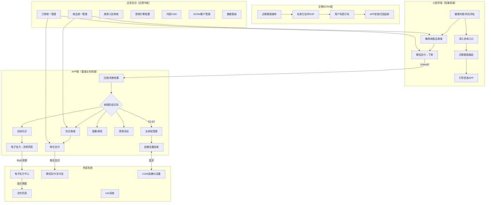
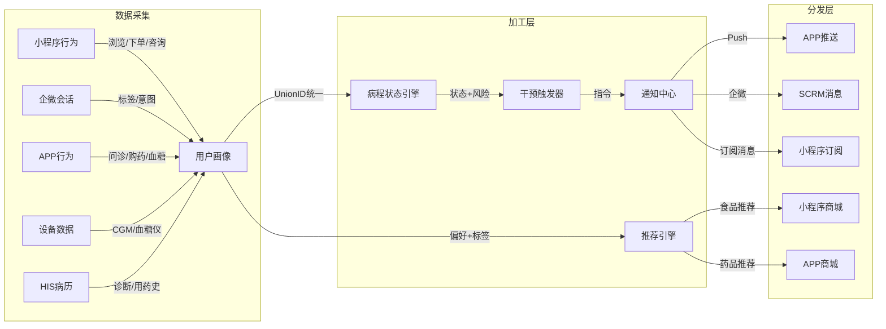
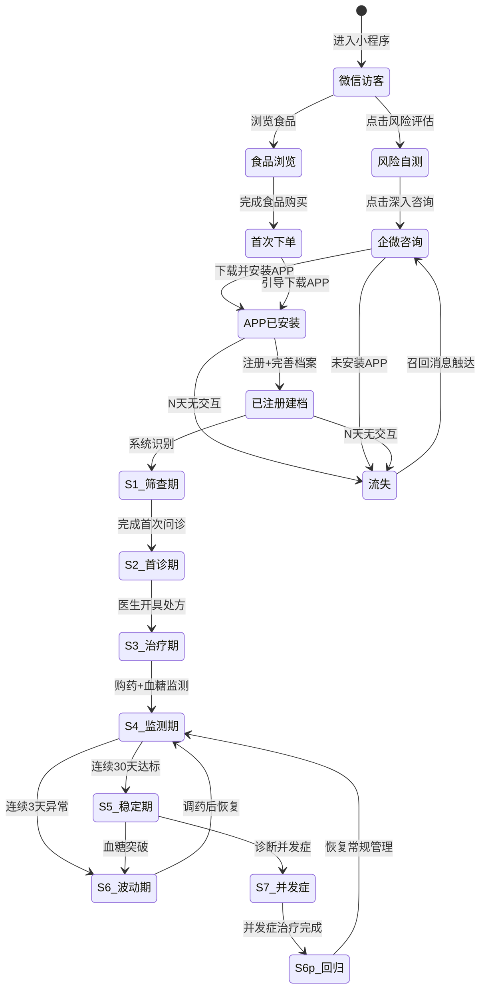

# 糖尿病智慧健康平台 — 脑暴确认稿

> **议题**：糖尿病全病程管理  
> **项目**：糖尿病智慧健康平台  
> **议题子目录**：`00-brainstorm/糖尿病全病程管理/`  
> **最新版本**：v2（补充迭代）

---

## 版本概要

| 版本 | 日期 | 脑暴类型 | 变更摘要 | 参与者 |
|------|------|----------|----------|--------|
| v2 | 2026-07-27 | Planning（补充迭代） | 三端架构重新厘定：小程序独立承担食品交易+客服路由，APP为完整业务前端，新增入驻/直播/课程/支付/营销/设备/订单13个FN | 6部门 |
| v1 | 2026-07-27 | Planning（初始） | 初始脑暴：8阶段病程模型/6联链/5核心FN/5层测试体系 | 6部门（归档见process/BR-脑暴讨论稿-糖尿病全病程管理-v1.md） |

---

## 一、议题确认

| 属性 | 值 |
|------|-----|
| **议题名** | 糖尿病全病程管理 |
| **行业** | Medical（医疗健康—糖尿病慢病管理） |
| **脑暴类型** | Planning（规划型，6部门参与） |
| **背景** | 1.4亿糖尿病患者需要全生命周期管理，当前断层式服务/信息孤岛/依从性差/被动医疗四大痛点 |
| **已有输入** | 统一指导文件v6.0/v6.1、17专家审阅v3.0、架构图集v1.0、战略规划书v1.0、需求分析v4.0 |
| **用户补充** | 三端定位明确：小程序（知识+食品交易+客服路由→引导APP）、APP（问诊/处方/商城/支付/营销/交易/直播/课程/慢病管理/档案管理/预警/血糖仪器）、业务后台（全流程闭环支撑）、合作药房/OTC/器械入驻 |

---

## 二、三流草图

### 2.1 业务泳道图（三端协同）

### 2.2 信息流转图（三端数据贯通）

### 2.3 三端状态机图（用户转化生命周期）

### 用户全生命周期流失阈值（动态）

| 阶段 | 流失阈值 |
|------|----------|
| 微信访客 | 7天无交互 |
| 企微咨询 | 3天未回复 |
| APP已安装未注册 | 24h未注册 |
| S1筛查期 | 3天无交互 |
| S2首诊期 | 5天无交互 |
| S3治疗期 | 10天无交互 |
| S4监测期 | 14天无交互 |
| S5稳定期 | 30天无交互 |
| S6波动期 | 5天无交互 |

---

## 三、三端业务分工矩阵（核心架构决策）

| 业务域 | 小程序 | APP | 业务后台 | 说明 |
|--------|--------|-----|----------|------|
| **健康知识传播** | ✅ 主战场 | 辅助（课程） | 内容CMS | 轻量科普 vs 深度课程 |
| **糖尿病食品交易** | ✅ 主战场 | — | 商品/订单管理 | 轻决策，客单价<200 |
| **客服咨询路由** | ✅ 入口 | — | SCRM | 引导安装APP |
| **在线问诊** | — | ✅ | 医生工作台 | 图文/视频复诊 |
| **电子处方** | — | ✅ | 处方管理 | 流转至合作药房 |
| **医药综合商城** | — | ✅ | 商品/订单 | 药房/OTC/器械 |
| **支付** | 微信支付 | ✅ 聚合支付 | 支付中台 | 微信/支付宝/银行卡 |
| **营销活动** | 秒杀/拼团 | ✅ 完整营销 | 营销引擎 | 优惠券/积分/满减 |
| **直播** | — | ✅ | 直播管理 | 医生科普+带货 |
| **控糖课程** | — | ✅ | 课程管理 | 免费/付费分级 |
| **全病程管理** | — | ✅ 核心 | 病程引擎 | 8阶段模型 |
| **健康档案** | 基础信息 | ✅ 完整档案 | 数据管理 | APP端完整档案 |
| **预警干预** | — | ✅ | 规则引擎 | 3级分级预警 |
| **血糖设备连接** | — | ✅ | 设备管理 | CGM/血糖仪蓝牙 |
| **商家入驻** | — | — | ✅ 主战场 | 药房/OTC/器械 |

---

## 四、BO/BG 目标映射

### 4.1 项目级业务目标（BG）新增

| BG编号 | 业务目标 | 度量指标 | 关联BO |
|--------|----------|----------|--------|
| BG-01 | 打造糖尿病垂直领域领先平台 | DAU、患者NPS | BO-MGT-01/03 |
| BG-02 | 实现医疗-商业可持续闭环 | GMV、客单价、复购率 | BO-MGT-04/05 |
| BG-03 | 构建患者健康数据资产 | 建档完成率、数据完整度 | BO-MGT-01 |
| **BG-04** | **建立三端协同用户增长模型** | 小程序→企微→APP转化率 | **新增** |
| **BG-05** | **构建平台型医药电商** | 入驻商家数、SKU数、GMV | **新增** |

### 4.2 业务目标（BO）更新

| BO编号 | 业务目标 | 度量指标 | 目标值(Phase 1) | 关联功能 |
|--------|----------|----------|-----------------|----------|
| BO-MGT-01 | 建立患者全病程管理体系 | 病程覆盖率 | ≥80%注册患者 | FN-MGT-001/002 |
| BO-MGT-02 | 提升患者依从性 | 30天用药依从率 | ≥70% | FN-MGT-003 |
| BO-MGT-03 | 降低血糖异常率 | 血糖达标占比 | ≥60% | FN-MGT-003/005 |
| BO-MGT-04 | 降低患者流失率 | 30天留存率 | ≥75% | FN-MGT-003 |
| **BO-MP-01** | **小程序→APP转化** | 企微咨询→安装转化率 | ≥30% | **新增** |
| **BO-MP-02** | **小程序食品交易** | 月GMV | 见Phase 1目标 | **新增** |
| **BO-APP-01** | **APP商城GMV** | 月交易额 | 见Phase 1目标 | **新增** |
| **BO-APP-02** | **入驻商家数** | 合作药房+器械商家 | ≥5家(Phase 1) | **新增** |

---

## 五、Phase 1 核心功能清单（0-6月，更新至15项）

### 5.1 小程序端（6项）

| FN编号 | 功能名称 | 优先级 | 简述 |
|--------|----------|--------|------|
| FN-MP-001 | 健康科普首页 | P0 | 每日控糖知识信息流+分类，轻量阅读体验 |
| FN-MP-002 | 糖尿病食品商城 | P0 | 100-200SKU自营，分类+搜索+购物车+微信支付 |
| FN-MP-003 | 限时活动 | P1 | 秒杀/拼团，引用领域知识 marketing/coupon+flash-sale |
| FN-MP-004 | 深入咨询入口 | P0 | 全站悬浮「咨询专家」→企微客服（wx.openEnterpriseChat） |
| FN-MP-005 | 风险评估工具 | P1 | 5-8题轻量问卷，评估糖尿病风险等级 |
| FN-MP-006 | APP导流+渠道归因 | P0 | 下载引导页+渠道追踪+安装归因 |

### 5.2 APP端（8项，含v1迁移）

| FN编号 | 功能名称 | 优先级 | 新/增 | 简述 |
|--------|----------|--------|--------|------|
| FN-MGT-001 | 健康档案管理 | P0 | v1保留 | 三级数据采集策略，完整健康档案 |
| FN-MGT-002 | 病程阶段识别与切换 | P0 | v1保留 | 8阶段模型，规则引擎+医生确认 |
| FN-MGT-003 | 智能干预引擎 | P0 | v1保留 | 13个干预节点，三级干预通道 |
| FN-APP-001 | 综合商城 | P0 | **新增** | 药房/OTC/器械三合一，处方药需处方 |
| FN-APP-002 | 营销中心 | P1 | **新增** | 优惠券/积分/满减/活动会场 |
| FN-APP-003 | 支付收银台 | P0 | **新增** | 聚合支付（微信/支付宝），医保待接 |
| FN-APP-004 | 设备连接 | P0 | **新增** | CGM/血糖仪/血压计蓝牙配对+数据同步 |
| FN-APP-005 | 订单中心 | P1 | **新增** | 全渠道订单统一查看（小程序+APP） |

### 5.3 业务后台（1项）

| FN编号 | 功能名称 | 优先级 | 简述 |
|--------|----------|--------|------|
| FN-BG-001 | 统一商品/订单管理 | P0 | 商品库（渠道区分MP/APP）、订单管理、商家入驻审核 |

---

## 六、三阶段路线图（更新）

| 阶段 | 时间 | 核心交付 | 关键指标 |
|------|------|----------|----------|
| **Phase 1** | 0-6月 | 小程序（科普+食品+客服+导流）、APP（商城+支付+问诊+处方+设备+病程管理v1）、后台（商品/订单+1-2家药房入驻）、5个CGM/血糖仪设备品牌适配 | 小程序MAU≥1万、小程序→APP转化≥30%、APP注册≥3000、入驻商家≥5家 |
| **Phase 2** | 7-18月 | AI增强（ML病程识别+血糖预测+饮食AI）、直播+课程、OTC商家入驻开放、营销引擎完整版、医保支付试点省份接入 | APP DAU≥5000、GMV月环比≥20%、入驻商家≥20家 |
| **Phase 3** | 19-36月 | 多病种+院内外联动+健康险+家庭管理+AI健康管家+器械商家入驻开放 | 平台GMV过亿、入驻商家≥50家、覆盖≥10省医保 |

---

## 七、三端联动链（更新至8条）

| 联链编号 | 链路名称 | 触发方式 | 路径 |
|----------|----------|----------|------|
| CHAIN-01 | 科普→咨询→APP | 事件驱动（点击咨询按钮） | 小程序→企微客服→APP下载 |
| CHAIN-02 | 食品下单→统一订单 | 事件驱动（支付完成） | 小程序→微信支付→order-service→APP订单中心可见 |
| CHAIN-03 | 首诊→处方→流转 | 手动+自动 | APP问诊→电子处方→处方中心→合作药房 |
| CHAIN-04 | 购药→用药管理 | 事件驱动 | 药房调配完成→order-service→激活用药提醒 |
| CHAIN-05 | 血糖监测→预警 | 定时+事件 | CGM同步→病程引擎→异常检测→三级预警 |
| CHAIN-06 | 达标→续方 | 定时任务 | 连续30天达标→自动续方提醒→一键续方 |
| CHAIN-07 | 流失→召回 | 定时任务 | 满足流失阈值→SCRM标记→企微/小程序召回 |
| **CHAIN-08** | **入驻→上架→可见** | 手动审批 | 商家提交→资质审核→商品上架→小程序+APP可见 |

---

## 八、入驻模式设计（新增）

| 入驻类型 | 资质要求 | 商品范围 | 结算 | Phase |
|----------|----------|----------|------|-------|
| 合作药房 | GSP+药品经营许可证+互联网药品信息服务资格证 | 处方药(流转)/OTC/器械 | T+7 | Phase 1 |
| OTC商家 | 药品经营许可证+品牌授权 | OTC药品 | T+7 | Phase 2 |
| 器械商家 | 医疗器械经营备案+品牌授权 | 血糖仪/CGM/血压计/试纸 | T+7 | Phase 1 |

### 入驻合规约束
- 所有医药商品在详情页强制展示：批准文号（国药准字）/ 注册证号（国械注准）
- 处方药不直接售卖，仅做处方流转至合作药房
- 小程序食品需展示GI值（低GI绿色标/高GI红色标）
- 禁售：精麻药品、注射剂

---

## 九、新增技术架构

### 9.1 技术栈

| 端 | 框架 | 关键能力 |
|-----|------|------|
| 小程序 | 微信原生/uni-app | wx.openEnterpriseChat企微客服 / wx.requestPayment / 订阅消息 |
| APP | uni-app混合APP | 蓝牙API / 推送 / 内嵌WebView / 微信/支付宝SDK |
| 业务后台 | Vue3 + Element Plus | 商品/订单/入驻/营销/内容/SCRM/看板 |

### 9.2 新增微服务

| 服务 | 职责 | Phase |
|------|------|-------|
| disease-course-engine | 病程状态引擎 | Phase 1（v1保留） |
| intervention-trigger | 干预触发 | Phase 1（v1保留） |
| data-ingestion-pipeline | CGM/HIS数据采集 | Phase 1（v1保留） |
| product-service | 统一商品管理（渠道区分） | **Phase 1 新增** |
| order-service | 统一订单管理（多渠道路由） | **Phase 1 新增** |
| payment-gateway | 聚合支付中台 | **Phase 1 新增** |
| marketing-engine | 营销引擎（优惠券/秒杀/拼团/积分） | Phase 2 新增 |
| live-service | 直播服务 | Phase 2 新增 |
| course-service | 课程管理 | Phase 2 新增 |
| merchant-service | 商家入驻管理 | **Phase 1 新增** |
| scrm-gateway | 企微SCRM网关 | **Phase 1 新增** |

---

## 十、干预节点总表（v1+v2合并，13个节点）

| ID | 节点 | 触发条件 | 端 | 渠道 |
|----|------|----------|-----|------|
| 1 | 新用户引导 | 小程序注册后24h | 小程序 | 订阅消息 |
| 2 | 食品兴趣转化 | 浏览食品≥3次未下单 | 小程序→企微 | 企微+优惠券 |
| 3 | 咨询→APP引导 | 企微咨询后 | 企微 | 企微消息+专属权益 |
| 4 | APP安装催促 | 企微引导后24h未安装 | 企微 | 企微二次提醒 |
| 5 | 首诊匹配 | APP注册建档完成 | APP | APP推送 |
| 6 | 首次处方用药 | 处方开具+购药后 | APP | 用药提醒激活 |
| 7 | CGM绑定引导 | APP注册后7天未绑设备 | APP | APP内引导卡片 |
| 8 | 血糖异常预警 | 连续3天空腹>7.0 | APP+企微 | 分级干预 |
| 9 | 流失预警 | 未记录血糖7天 | APP | 推送+企微 |
| 10 | 处方续方提醒 | 处方到期前3天 | APP | 推送+企微 |
| 11 | 血糖达标成就 | 连续30天达标 | APP | 推送+成就徽章 |
| 12 | 复诊后调研 | 复诊完成后 | APP | 满意度调研 |
| 13 | 节日关怀 | 节日/生日 | 企微 | 企微关怀+专属福利 |

---

## 十一、核心业务规则（更新）

| BR编号 | 规则 |
|--------|------|
| BR-MGT-001 | 血糖异常：空腹≥7.0 或 餐后≥11.1 连续3天，排除传感器异常值 |
| BR-MGT-002 | 达标：连续30天空腹<7.0 且 餐后<10.0，每日≥1次有效记录 |
| BR-MGT-003 | 干预频率上限：同一患者24h内≤2次非紧急干预 |
| BR-MGT-004 | 处方有效期：开具后72h，长处方最多12周用量 |
| BR-MGT-005 | 流失阈值动态：按阶段3-30天不等 |
| **BR-MGT-006** | **处方药不直售，仅做处方流转至合作药房** |
| **BR-MGT-007** | **医药商品详情页强制展示批准文号/注册证号** |
| **BR-MGT-008** | **小程序食品详情页强制展示GI值和营养成分表** |
| **BR-MGT-009** | **直播分两种：医生科普（关联课程不卖药）/带货直播（非药品商品），均先审后播延迟30s** |
| **BR-MGT-010** | **三端用户数据通过UnionID统一关联** |

---

## 十二、风险与缓解（更新）

| 风险 | 等级 | 缓解 |
|------|------|------|
| 三端数据一致性 | 高 | UnionID统一+单一数据源order-service+幂等键防重 |
| 处方药合规风险 | 高 | 只做处方流转不直售，紧跟86号文件 |
| 小程序食品交易需要食品经营许可证 | 高 | 公司资质先行办理，Phase 1自营 |
| CGM蓝牙兼容性 | 高 | Top2品牌优先，Mock覆盖边界 |
| 干预推送过度 | 高 | 频次上限+冷却期+合并+反馈入口 |
| 医疗数据合规 | 高 | 等保三级+国密SM4+物理隔离+mTLS |
| 入驻商家资质审核周期 | 中 | 提前建立审核SOP，标准化提交模板 |
| 小程序→APP转化率 | 中 | 企微SOP精细化+利益点明确+渠道归因追踪 |

---

## 十三、领域知识清单

| 领域知识 | 版本 | 引用内容 |
|----------|------|----------|
| 互联网医院 | v1.3.0 | 电子处方流转（CA签章/国密/RxID/PASS审方）、长处方、在线复诊 |
| 互联网药店 | v1.2.0 | 处方接收核验（四重验证+四查十对）、GSP合规、5分钟回传 |
| HIS医院信息系统 | v1.0.0 | FHIR R4病历、HL7 V2.5、医生排班 |
| **订单流** | — | 订单状态机、下单-支付-履约-完成流程 |
| **购物车** | — | 加购、凑单、跨店结算 |
| **优惠券** | — | 满减券/折扣券、发放/核销/退回 |
| **秒杀** | — | 限时抢购、库存预占 |
| **拼团** | — | 团长开团、邀请成团 |
| **微信支付** | v2.0.0 | JSAPI/APP支付、统一下单、退款、分账 |

---

## 十四、后续路由建议

1. `/init --project=糖尿病智慧健康平台 --brainstorm-topic=糖尿病全病程管理` 启动项目初始化
2. BA需求分析基于本确认稿中的15个FN + 8联链 + 10条BR + 13干预节点
3. PO确认Phase 1的15个FN优先级和Sprint拆解

---

## 十五、遗留事项

| ID | 事项 | 建议 |
|----|------|------|
| OPEN-01 | S7并发症归属 | Phase 2讨论，Phase 1仅预警 |
| OPEN-02 | ML模型引入时机 | Phase 1积累≥5000标注样本后评估 |
| OPEN-03 | 小程序自营食品类目选择 | 需业务团队调研糖尿病食品供应链 |
| OPEN-04 | 合作药房首批入驻名单 | 需商务团队 BD 推进 |
| OPEN-05 | 医保支付接入节奏 | 按省逐步试点 |
| OPEN-06 | 直播合规审批流程 | 需法务确认 |

---

> **文档状态**：✅ 已确认（v2 — 补充迭代）  
> **输出路径**：`projects/糖尿病智慧健康平台/docs/00-brainstorm/糖尿病全病程管理/confirmed/BR-脑暴文档-确认稿.md`  
> **历史版本**：v1 归档于 `process/BR-脑暴讨论稿-糖尿病全病程管理-v1.md`  
> **下一步**：① `/init` 启动项目 ② 继续补充 ③ 调整部分方案
